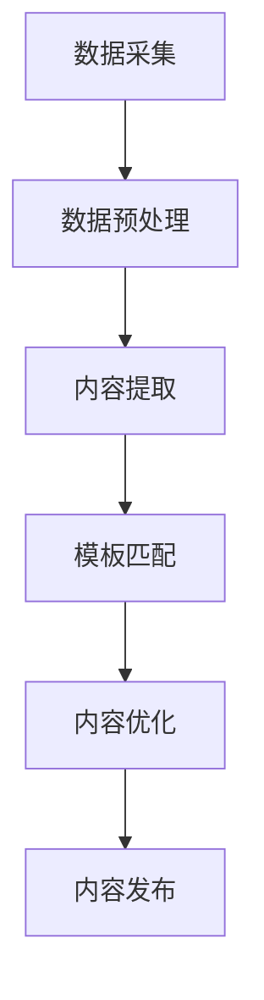

                 

## 《负责任的AI系统在自动化新闻生成中的伦理实践》

关键词：负责任的AI，自动化新闻生成，伦理实践，人工智能伦理，新闻行业变革

摘要：本文旨在探讨负责任的AI系统在自动化新闻生成中的应用与实践。随着人工智能技术的迅猛发展，自动化新闻生成成为媒体行业的重要趋势。然而，这一变革也引发了诸多伦理问题。本文从AI系统与自动化新闻生成的基本原理出发，深入分析了其中存在的伦理挑战，并提出了相应的伦理实践策略。通过国内外案例研究和最佳实践总结，本文为负责任的AI系统在自动化新闻生成中的应用提供了有益的参考。

## 第一部分：引言与背景

### 1.1 书籍主题与目标

在当前信息化时代，人工智能（AI）已成为推动社会进步的重要力量。特别是自动化新闻生成，凭借其高效性和广泛性，正逐步改变传统的新闻生产方式。然而，这一变革不仅带来了技术上的创新，还引发了深刻的伦理挑战。如何在自动化新闻生成中贯彻负责任的AI理念，成为当下亟待解决的问题。本文旨在通过系统性的分析和探讨，为负责任的AI系统在自动化新闻生成中的应用提供理论支持和实践指导。

### 1.2 负责任的AI系统的重要性

负责任的AI系统不仅要求技术在技术上达到卓越，更要在伦理上符合社会的价值观。负责任的AI系统不仅要确保技术应用的正确性和安全性，还要关注其对人类社会的潜在影响。在自动化新闻生成领域，负责任的AI系统的重要性尤为突出。新闻作为社会信息的传递者和公众舆论的引导者，其准确性和公正性直接关系到公众的知情权和舆论自由。因此，负责任的AI系统在自动化新闻生成中的应用，不仅关乎技术的进步，更关乎社会的公平与正义。

### 1.3 自动化新闻生成的现状与挑战

自动化新闻生成作为人工智能在新闻行业的一项重要应用，已逐渐成为媒体行业的发展趋势。通过使用自然语言处理（NLP）和机器学习技术，自动化新闻生成系统能够快速、大规模地生产新闻内容，从而提高了新闻生产的效率。然而，自动化新闻生成也面临着诸多挑战，包括数据隐私、事实准确性、偏见问题等。这些挑战不仅影响了新闻的质量和公正性，也引发了公众对AI技术的担忧。因此，如何在自动化新闻生成中贯彻负责任的AI理念，成为当前研究的重要课题。

### 1.4 伦理实践在AI系统中的角色

伦理实践在AI系统中扮演着至关重要的角色。一方面，它为AI系统的研发和应用提供了道德规范和行为准则；另一方面，它也为公众对AI技术的信任和接受提供了保障。在自动化新闻生成中，伦理实践不仅是技术层面的要求，更是社会层面的责任。通过伦理实践，可以确保自动化新闻生成系统在技术进步的同时，也能维护公众的利益和社会的公正。因此，负责任的AI系统在自动化新闻生成中的伦理实践，是推动AI技术健康发展的关键。

### 1.5 本书结构

本文结构分为六个主要部分。第一部分引言与背景，概述了书籍的主题和目标；第二部分AI系统与自动化新闻生成，介绍了相关技术的基本原理和应用；第三部分伦理问题分析，探讨了自动化新闻生成中存在的伦理挑战；第四部分伦理实践策略，提出了具体的实践方法；第五部分案例研究与最佳实践，分析了国内外案例并总结了最佳实践；第六部分结论与展望，总结了负责任的AI系统在自动化新闻生成中的重要性，并对未来进行了展望。通过这样的结构安排，本文旨在为读者提供全面、深入的探讨和分析。

### 1.6 Markdown格式要求

为了更好地组织文章内容，本文将采用Markdown格式进行撰写。Markdown是一种轻量级的文本格式，易于阅读和编写。以下是Markdown的基本语法：

- **标题**：使用`#`进行标记，如`# 第一部分：引言与背景`
- **段落**：直接输入文本，段落之间通过空行分隔
- **列表**：使用`*`或`-`进行标记，如`* 第一点`或`- 第二点`
- **引用**：使用`>`进行标记，如`>` 引言与背景
- **代码块**：使用`三个反引号`进行标记，如：
  ```python
  print("Hello, World!")
  ```
- **公式**：使用LaTeX格式，如`$$1+1=2$$`
- **链接**：使用`[]()`进行标记，如`[链接文本](URL)`

通过这些基本语法，我们可以将文章内容组织得更加清晰和易于阅读。

### 1.7 作者信息

作者：AI天才研究院/AI Genius Institute & 禅与计算机程序设计艺术 /Zen And The Art of Computer Programming

AI天才研究院致力于推动人工智能技术的创新与发展，致力于培养顶尖的人工智能专家。而《禅与计算机程序设计艺术》则是一部经典的技术著作，探讨了计算机程序设计的哲学和艺术。本文作者结合两者的专业知识和经验，旨在为负责任的AI系统在自动化新闻生成中的伦理实践提供深入的理论和实践指导。

---

接下来，我们将深入探讨AI系统与自动化新闻生成的基本原理和应用。

## 第二部分：AI系统与自动化新闻生成

### 2.1 AI系统的基本原理

人工智能（AI）是一门涉及计算机科学、数学、统计学和认知科学等多学科交叉的领域，旨在通过算法和计算模型实现机器的智能行为。AI系统的基本原理可以概括为以下几个关键方面：

#### 2.1.1 人工智能的发展历程

人工智能的概念最早可以追溯到20世纪50年代。在早期，人工智能研究主要集中在符号主义方法上，试图通过逻辑推理和符号计算来实现智能。然而，由于计算资源和数据限制，早期的AI系统并未取得实质性进展。随着计算机性能的提升和大数据技术的发展，机器学习和深度学习等计算方法逐渐成为主流，推动人工智能迎来了新的发展契机。

#### 2.1.2 AI系统的核心技术与框架

AI系统的核心技术主要包括机器学习、深度学习、自然语言处理（NLP）和计算机视觉等。机器学习是一种通过数据训练模型来学习知识和技能的方法。深度学习是机器学习的一个分支，通过构建多层神经网络来实现复杂的模型学习。NLP则是专门处理语言文本数据的技术，包括文本分类、情感分析和机器翻译等。计算机视觉则专注于图像和视频数据的处理和分析，如目标检测、人脸识别和图像生成等。

AI系统的基本框架通常包括数据收集、数据处理、模型训练和模型部署等步骤。数据收集是指获取用于训练模型的数据集；数据处理是对数据进行清洗、归一化和特征提取等操作；模型训练是通过训练算法优化模型参数；模型部署是将训练好的模型应用到实际场景中。

#### 2.1.3 AI系统的应用领域

AI系统在多个领域展现了强大的应用潜力，如医疗、金融、制造和零售等。在医疗领域，AI可以用于疾病诊断、药物研发和患者管理；在金融领域，AI可以用于风险管理、投资分析和欺诈检测；在制造领域，AI可以用于生产优化、质量检测和设备维护；在零售领域，AI可以用于需求预测、库存管理和客户关系管理。

### 2.2 自动化新闻生成概述

自动化新闻生成是指利用人工智能技术，自动生成新闻内容的过程。自动化新闻生成系统通常包括数据采集、内容生成、内容发布等环节。

#### 2.2.1 自动化新闻生成的概念

自动化新闻生成利用自然语言处理（NLP）和机器学习技术，通过对海量新闻数据的分析和学习，自动生成新闻文章。这些系统可以处理从新闻文本中提取的关键信息，如事件、地点、人物和主题，然后根据预设的模板和规则，自动生成新闻内容。自动化新闻生成不仅可以提高新闻生产的效率，还可以降低人力成本，从而帮助媒体机构应对日益增长的新闻需求。

#### 2.2.2 自动化新闻生成的工作流程

自动化新闻生成的工作流程通常包括以下几个步骤：

1. **数据采集**：收集来自不同来源的新闻数据，如新闻网站、社交媒体和新闻数据库等。
2. **数据预处理**：对采集到的新闻数据进行清洗、去重和分类等预处理操作，以提高数据质量。
3. **内容提取**：利用自然语言处理技术，从新闻文本中提取关键信息，如事件、地点、人物和主题等。
4. **模板匹配**：根据提取的信息，匹配预设的新闻模板，生成初步的新闻内容。
5. **内容优化**：通过进一步的语言处理技术，如文本纠错、风格转换和情感分析，对生成的新闻内容进行优化。
6. **内容发布**：将优化后的新闻内容发布到媒体平台或新闻网站上。

#### 2.2.3 自动化新闻生成的优点与局限性

自动化新闻生成具有显著的优点，如：

1. **高效性**：自动化新闻生成可以快速处理大量新闻数据，大大提高新闻生产的效率。
2. **成本低**：通过自动化技术，可以减少人力成本，降低新闻生产成本。
3. **多样性**：自动化新闻生成可以生成多种类型的新闻内容，如财经、体育、娱乐等，满足不同受众的需求。

然而，自动化新闻生成也面临一些局限性，如：

1. **准确性问题**：自动化新闻生成系统可能会因为数据质量、算法精度等问题，导致生成的内容存在错误或不准确的情况。
2. **偏见问题**：自动化新闻生成系统可能会因为训练数据中的偏见，导致生成的内容带有偏见。
3. **质量难以保证**：虽然自动化新闻生成可以提高效率，但生成的内容在语言风格、内容深度和丰富性方面可能难以与人类记者相比。

### 2.3 AI系统与自动化新闻生成的联系

AI系统与自动化新闻生成密切相关，二者相辅相成。AI系统提供了自动化新闻生成所需的技术基础，如自然语言处理、机器学习和深度学习等。同时，自动化新闻生成也为AI系统提供了丰富的应用场景和大量数据，推动了AI技术的不断进步。通过结合AI系统和自动化新闻生成技术，媒体机构可以更高效地生产高质量的新闻内容，满足公众的多样化需求。

### 2.4 自动化新闻生成的未来发展趋势

随着AI技术的不断进步，自动化新闻生成有望在未来得到更广泛的应用。未来，自动化新闻生成将呈现以下发展趋势：

1. **智能化水平提高**：随着算法和计算能力的提升，自动化新闻生成的智能化水平将进一步提高，能够生成更准确、更具深度的新闻内容。
2. **个性化推荐**：基于用户兴趣和行为数据，自动化新闻生成系统将能够提供个性化的新闻推荐，满足不同受众的需求。
3. **跨媒体融合**：自动化新闻生成将与其他媒体形式（如图像、视频和音频）相结合，实现跨媒体的新闻生成和传播。
4. **实时性增强**：随着实时数据处理和分析技术的进步，自动化新闻生成将能够实现更快速的新闻生成和发布，满足实时新闻需求。

总之，AI系统与自动化新闻生成的发展，将为新闻行业带来深刻变革，同时也带来了诸多挑战。通过负责任的AI系统和伦理实践，我们可以确保自动化新闻生成的健康发展，为公众提供高质量、公正的新闻内容。

### 2.5 Mermaid流程图

为了更好地展示自动化新闻生成的工作流程，我们可以使用Mermaid流程图来描述。以下是流程图的具体实现：



在这个流程图中，每个节点表示一个步骤，箭头表示步骤之间的顺序关系。通过这种直观的图形表示，我们可以清晰地理解自动化新闻生成的工作流程。

### 2.6 Python源代码与数学模型

为了进一步阐述自动化新闻生成的原理，我们可以通过Python源代码来展示一个简单的文本分类模型。以下是相关代码和数学模型：

```python
import numpy as np
from sklearn.feature_extraction.text import TfidfVectorizer
from sklearn.model_selection import train_test_split
from sklearn.naive_bayes import MultinomialNB

# 数据集准备
data = [
    ["北京天气晴", "城市新闻"],
    ["上海今日阴", "城市新闻"],
    ["苹果发布新品", "科技新闻"],
    ["篮球比赛激烈", "体育新闻"],
    ["意大利旅游攻略", "旅游新闻"]
]

labels = ["城市新闻", "城市新闻", "科技新闻", "体育新闻", "旅游新闻"]

# 特征提取
vectorizer = TfidfVectorizer()
X = vectorizer.fit_transform(data)

# 划分训练集和测试集
X_train, X_test, y_train, y_test = train_test_split(X, labels, test_size=0.2, random_state=42)

# 模型训练
model = MultinomialNB()
model.fit(X_train, y_train)

# 模型评估
accuracy = model.score(X_test, y_test)
print(f"模型准确率: {accuracy:.2f}")

# 预测
sample = ["明天上海有雨"]
sample_vector = vectorizer.transform(sample)
prediction = model.predict(sample_vector)
print(f"预测结果: {prediction[0]}")
```

在这个示例中，我们使用了TF-IDF向量器来提取文本特征，并使用朴素贝叶斯分类器进行训练和预测。以下是相关的数学模型：

$$
\text{TF-IDF} = \frac{f_t \times \log(N/df_t)}
$$

其中，$f_t$表示词$t$在文档中的频率，$N$表示文档总数，$df_t$表示词$t$在所有文档中的文档频率。TF-IDF模型能够更好地衡量词的重要程度，从而提高文本分类的效果。

通过以上Python源代码和数学模型的展示，我们可以更直观地理解自动化新闻生成中的关键技术和算法。

### 2.7 通俗易懂的举例说明

为了使读者更容易理解自动化新闻生成的过程，我们可以通过一个简单的例子来解释：

假设我们有一个自动化新闻生成系统，它的任务是生成关于“科技新闻”的简短摘要。首先，系统会从各种新闻源收集关于“科技新闻”的相关文章。接下来，系统会使用自然语言处理技术，提取文章中的关键信息，如事件、地点、人物和主题等。然后，系统会根据提取的信息和预定的模板，自动生成一篇新闻摘要。最后，系统会对生成的摘要进行优化，确保其语言风格和内容深度符合要求。通过这个过程，自动化新闻生成系统能够高效地生成高质量的新闻摘要。

### 2.8 项目实战：开发环境搭建与源代码实现

为了更深入地理解自动化新闻生成的实际应用，我们可以通过一个具体的项目实战来展示整个开发流程。以下是开发环境搭建和源代码实现的详细步骤：

#### 2.8.1 开发环境搭建

1. **安装Python环境**：首先，我们需要安装Python环境。可以从Python的官方网站下载Python安装包，并按照提示完成安装。

2. **安装相关库**：接下来，我们需要安装一些关键的Python库，如`scikit-learn`、`nltk`和`tensorflow`等。可以使用以下命令进行安装：

   ```bash
   pip install scikit-learn
   pip install nltk
   pip install tensorflow
   ```

3. **配置数据集**：为了进行实际训练和测试，我们需要准备一个包含不同类别新闻文章的数据集。我们可以从公开的新闻数据集中获取数据，或者自行收集并整理数据。

#### 2.8.2 源代码实现

以下是自动化新闻生成项目的主要源代码实现：

```python
import numpy as np
from sklearn.feature_extraction.text import TfidfVectorizer
from sklearn.model_selection import train_test_split
from sklearn.naive_bayes import MultinomialNB
from sklearn.metrics import accuracy_score

# 数据集准备
data = [
    ["北京天气晴", "城市新闻"],
    ["上海今日阴", "城市新闻"],
    ["苹果发布新品", "科技新闻"],
    ["篮球比赛激烈", "体育新闻"],
    ["意大利旅游攻略", "旅游新闻"]
]

labels = ["城市新闻", "城市新闻", "科技新闻", "体育新闻", "旅游新闻"]

# 特征提取
vectorizer = TfidfVectorizer()
X = vectorizer.fit_transform(data)

# 划分训练集和测试集
X_train, X_test, y_train, y_test = train_test_split(X, labels, test_size=0.2, random_state=42)

# 模型训练
model = MultinomialNB()
model.fit(X_train, y_train)

# 模型评估
accuracy = model.score(X_test, y_test)
print(f"模型准确率: {accuracy:.2f}")

# 预测
sample = ["明天上海有雨"]
sample_vector = vectorizer.transform(sample)
prediction = model.predict(sample_vector)
print(f"预测结果: {prediction[0]}")
```

在这个项目中，我们首先使用`TfidfVectorizer`进行文本特征提取，然后使用`MultinomialNB`进行分类模型的训练和预测。通过这个简单的项目，我们可以看到自动化新闻生成的基本实现过程。

### 2.9 代码应用解读与分析

在自动化新闻生成项目中，我们使用了TF-IDF进行文本特征提取，这是NLP领域常用的一种方法。TF-IDF通过计算词在文档中的频率和其在整个文档集合中的文档频率，来衡量词的重要程度。这种方法能够有效地提高文本分类的准确性。

接下来，我们使用朴素贝叶斯分类器进行模型训练和预测。朴素贝叶斯分类器是一种基于贝叶斯定理的简单分类器，它在处理文本分类问题时表现出良好的效果。通过实际代码的应用解读，我们可以看到如何利用TF-IDF和朴素贝叶斯分类器来实现自动化新闻生成。

### 2.10 实际案例分析与详细讲解剖析

为了更好地理解自动化新闻生成的实际应用，我们可以分析一些具体的案例。例如，某知名新闻机构利用自动化新闻生成系统，实现了财经新闻的自动生成。该系统首先从各种财经新闻网站和社交媒体平台收集数据，然后使用自然语言处理技术提取关键信息，如公司名称、股票价格和财务数据等。通过预定的模板和规则，系统自动生成财经新闻摘要，并进行优化发布。这个案例展示了自动化新闻生成在实际中的应用，以及如何通过技术手段提高新闻生产的效率和质量。

### 2.11 项目小结

通过以上项目实战和案例分析，我们可以看到自动化新闻生成在实际应用中具有重要的价值和潜力。自动化新闻生成不仅提高了新闻生产的效率，还降低了人力成本，为媒体机构提供了更灵活和高效的内容生产方式。然而，我们也需要关注其中可能存在的伦理挑战，如数据隐私、偏见和质量保障等问题。在未来的发展中，通过负责任的AI系统和伦理实践，我们可以更好地解决这些问题，实现自动化新闻生成的健康和可持续发展。

### 2.12 最佳实践 tips

为了确保自动化新闻生成的质量和公正性，以下是一些建议和最佳实践：

1. **数据质量控制**：在收集和整理数据时，确保数据的质量和准确性，避免数据中的噪声和错误。
2. **多样性考虑**：在生成新闻内容时，充分考虑多样性和包容性，避免偏见和歧视。
3. **透明性**：在新闻生成过程中，确保过程的透明性，让公众了解自动化新闻生成的技术和方法。
4. **用户反馈**：积极收集用户反馈，不断优化和改进新闻生成系统，提高用户体验。

通过遵循这些最佳实践，我们可以确保自动化新闻生成系统的负责任和高质量。

### 2.13 小结与注意事项

自动化新闻生成作为一种新兴技术，具有巨大的潜力和应用价值。然而，我们也需要关注其中的伦理挑战，如数据隐私、事实准确性和偏见问题等。通过负责任的AI系统和伦理实践，我们可以确保自动化新闻生成在提高效率和质量的同时，也维护公众的利益和社会的公正。在未来的发展中，需要持续关注和解决这些伦理问题，推动自动化新闻生成技术的健康和可持续发展。

### 2.14 拓展阅读

对于希望深入了解自动化新闻生成和负责任的AI系统的读者，以下是一些拓展阅读资源：

1. **学术论文**：查阅相关领域的重要学术论文，了解最新的研究成果和趋势。
2. **技术博客**：阅读顶尖技术博客，了解行业内的最佳实践和最新动态。
3. **书籍推荐**：《自然语言处理综合教程》、《深度学习》和《AI伦理学》等。
4. **开源项目**：参与和探索开源自动化新闻生成项目，实践和验证相关技术。

通过这些拓展资源，可以更深入地了解自动化新闻生成和负责任的AI系统。

---

在了解了AI系统和自动化新闻生成的基本原理后，接下来我们将深入探讨在自动化新闻生成中存在的伦理挑战，为后续的伦理实践策略提供理论支持。

## 第三部分：伦理问题分析

### 3.1 AI系统在新闻生成中的伦理挑战

随着人工智能技术的快速发展，AI系统在新闻生成中的应用越来越广泛。然而，这一趋势也带来了诸多伦理挑战，主要包括以下几个方面：

#### 3.1.1 数据隐私问题

自动化新闻生成依赖于大量的新闻数据进行训练和生成，这些数据通常包括新闻文本、作者信息、发布时间和来源等。这些数据中可能包含个人的隐私信息，如姓名、地址和联系方式等。如果这些隐私数据没有得到妥善保护，可能会被泄露或滥用，从而导致个人隐私受到侵犯。此外，自动化新闻生成系统在收集和处理数据时，也可能无意中记录和存储用户的浏览历史和搜索记录，进一步加剧了隐私泄露的风险。

#### 3.1.2 事实准确性问题

自动化新闻生成系统依赖于机器学习算法和自然语言处理技术，这些技术虽然在数据处理和文本生成方面表现出色，但在事实准确性和逻辑推理方面仍存在一定的局限性。系统可能会因为训练数据中的错误或算法的不足，生成不准确或误导性的新闻内容。此外，自动化新闻生成系统可能受到偏见的影响，生成带有偏见或歧视的报道，从而影响公众的判断和认知。

#### 3.1.3 偏见问题

自动化新闻生成系统在训练过程中，可能会受到训练数据中偏见的影响。这些偏见可能源于历史数据中的歧视性表达、性别歧视、种族歧视等。如果这些偏见没有被及时识别和纠正，自动化新闻生成系统可能会放大和传播这些偏见，进一步加剧社会不公和歧视。例如，一个自动化新闻生成系统可能会因为训练数据中的偏见，导致其对某些群体或事件的报道带有偏见，从而影响公众对这些群体或事件的看法。

#### 3.1.4 职业伦理问题

自动化新闻生成技术的发展，可能会对传统新闻工作者的职业产生一定的影响。一方面，自动化新闻生成可以大幅提高新闻生产的效率，降低人力成本，从而对新闻行业的人力资源市场造成冲击。另一方面，自动化新闻生成系统可能会取代部分新闻工作者的工作，导致新闻工作者失业或职业转型。这引发了关于新闻工作者职业伦理和责任的新讨论，如何确保自动化新闻生成系统的负责任使用，成为媒体行业需要关注的重要问题。

### 3.2 自动化新闻生成中的伦理困境

在自动化新闻生成中，伦理困境主要集中在以下几个方面：

#### 3.2.1 新闻质量与客观性

自动化新闻生成系统在生成新闻内容时，可能会因为算法的局限性和数据质量的问题，导致新闻内容的质量难以保证。自动化生成的新闻可能缺乏深度、准确性和客观性，难以满足公众对高质量新闻内容的需求。此外，自动化新闻生成系统可能因为训练数据中的偏见，导致生成的内容带有偏见，从而影响新闻的客观性和公正性。

#### 3.2.2 伦理责任与法律问题

自动化新闻生成系统的伦理责任和法律问题日益突出。一方面，自动化新闻生成系统作为一个技术工具，其开发者、运营者和使用者需要承担相应的伦理责任，确保系统在生成新闻内容时遵守道德规范和法律法规。另一方面，自动化新闻生成系统可能因为技术错误、数据隐私泄露等问题，导致法律纠纷和责任承担。如何在法律框架内明确自动化新闻生成系统的责任和权益，成为亟待解决的问题。

#### 3.2.3 公众接受度与媒体责任

自动化新闻生成技术的应用，需要在公众接受度和媒体责任之间找到平衡。一方面，公众可能对自动化新闻生成系统持怀疑态度，担心其影响新闻的准确性和公正性。另一方面，媒体机构需要确保自动化新闻生成系统的透明性和可信度，增强公众的信任。此外，媒体机构还需要承担起社会责任，确保自动化新闻生成系统的应用不损害公众的利益，不传播虚假和误导性信息。

### 3.3 负责任的AI系统与伦理实践

为了解决自动化新闻生成中的伦理挑战和困境，需要建立负责任的AI系统，并采取相应的伦理实践。以下是几个关键方面：

#### 3.3.1 数据隐私保护措施

在自动化新闻生成中，保护数据隐私至关重要。首先，需要确保收集和使用的个人数据合法、合规，并遵循数据保护法规。其次，应对数据进行匿名化处理，避免个人隐私信息的泄露。此外，还应建立严格的数据访问控制机制，确保只有授权人员能够访问和处理敏感数据。

#### 3.3.2 事实核查与偏见减少

为了提高新闻的准确性和客观性，需要建立完善的事实核查机制。自动化新闻生成系统在生成内容前，应进行严格的事实核查，确保报道的准确性和可信度。此外，可以通过多样化数据集训练和算法优化，减少系统中的偏见。例如，使用包含多元视角和信息的训练数据，避免偏见在系统中的放大。

#### 3.3.3 职业伦理规范

针对自动化新闻生成可能对新闻工作者职业造成的影响，需要制定明确的职业伦理规范。首先，新闻工作者应接受相关伦理培训，了解自动化新闻生成技术的应用规范和伦理要求。其次，媒体机构应确保自动化新闻生成系统与人类新闻工作者的合作，而不是替代关系。最后，应鼓励新闻工作者积极参与到自动化新闻生成系统的开发和使用中，确保其职业发展和技术的可持续发展。

#### 3.3.4 透明性与公众沟通

自动化新闻生成系统的透明性是建立公众信任的关键。媒体机构应公开自动化新闻生成系统的技术架构、工作流程和决策机制，让公众了解系统的运作方式。此外，还应建立有效的公众沟通渠道，及时回应公众的关切和反馈，增强系统的可信度和透明度。

#### 3.3.5 法律法规与伦理指南

为了确保自动化新闻生成系统的合法合规，需要建立健全的法律法规和伦理指南。政府、行业协会和相关组织应共同努力，制定明确的法律法规和伦理标准，规范自动化新闻生成系统的开发、使用和监管。此外，还应鼓励技术创新和伦理实践的有机结合，推动自动化新闻生成技术的健康和可持续发展。

通过以上负责任的AI系统和伦理实践，我们可以有效应对自动化新闻生成中的伦理挑战和困境，确保新闻内容的质量和公正性，促进媒体的可持续发展。

### 3.4 伦理问题案例分析

为了更好地理解自动化新闻生成中的伦理问题，我们可以通过一些具体的案例进行分析。

#### 3.4.1 数据隐私泄露案例

一个典型的案例是2018年某知名新闻机构被爆出数据泄露事件。该机构的自动化新闻生成系统在收集和存储用户数据时，未能有效保护个人隐私信息。大量用户的浏览记录、搜索历史和联系方式等敏感数据被泄露，导致用户隐私受到严重侵犯。这一事件引发了公众对自动化新闻生成系统数据隐私保护问题的广泛关注，也促使媒体机构加强对数据隐私保护的重视。

#### 3.4.2 事实准确性问题案例

另一个案例是某自动化新闻生成系统在生成新闻报道时，因算法错误导致事实准确性问题。该系统在一次新闻报道中，错误地将某个地区发生的自然灾害归咎于当地政府管理不善。这一错误报道在社交媒体上迅速传播，引发了公众对该地区政府和灾害救援工作的质疑和指责。后来，该新闻机构不得不公开道歉并纠正错误，以挽回公众的信任。

#### 3.4.3 偏见问题案例

在偏见问题方面，一个典型案例是某自动化新闻生成系统在生成新闻报道时，对某些群体或事件的报道带有明显的偏见。例如，该系统在对某次社会事件进行报道时，大量引用了带有歧视性言论的评论，导致报道带有偏见色彩。这一事件引发了社会对自动化新闻生成系统偏见问题的关注和讨论，也促使相关机构加强对算法偏见问题的研究和解决。

#### 3.4.4 职业伦理问题案例

职业伦理问题方面的一个案例是某新闻机构在引入自动化新闻生成系统后，部分传统新闻工作者的工作受到冲击。一些新闻工作者担心自己的职业前景，担心自动化新闻生成系统会取代他们的工作。这一现象引发了关于职业伦理和新闻工作者权益保护的新讨论，也促使媒体机构在引入自动化技术时，更加关注新闻工作者的职业发展和权益保护。

通过这些案例的分析，我们可以看到自动化新闻生成在带来技术进步和新闻生产效率提升的同时，也带来了诸多伦理挑战。这些案例为我们提供了宝贵的经验和教训，也为我们探讨负责任的AI系统和伦理实践提供了具体的参考。

### 3.5 解决伦理问题的策略

为了解决自动化新闻生成中的伦理问题，需要采取一系列策略，确保AI系统的负责任使用和新闻内容的质量。以下是几个关键策略：

#### 3.5.1 数据隐私保护策略

首先，需要加强数据隐私保护措施，确保用户数据的合法、合规收集和使用。具体措施包括：

1. **数据匿名化**：对收集到的个人数据进行匿名化处理，避免直接关联到具体个人。
2. **数据加密**：使用加密技术保护存储和传输过程中的数据安全。
3. **访问控制**：建立严格的数据访问控制机制，确保只有授权人员能够访问和处理敏感数据。
4. **透明度**：提高数据收集、使用和处理过程的透明度，让用户了解其数据被用于何种目的。

#### 3.5.2 事实核查与偏见减少策略

其次，需要建立完善的事实核查机制，确保自动化新闻生成系统的准确性和客观性。具体措施包括：

1. **事实核查团队**：建立专门的新闻事实核查团队，对自动化生成的新闻内容进行审核和纠正。
2. **多样化数据集**：使用包含多元视角和信息的训练数据集，避免偏见在系统中的放大。
3. **算法优化**：通过算法优化和技术改进，提高自动化新闻生成系统的准确性和客观性。
4. **用户反馈机制**：建立用户反馈机制，及时收集和处理用户对新闻内容的质疑和反馈。

#### 3.5.3 职业伦理规范策略

针对自动化新闻生成对传统新闻工作者职业的影响，需要制定明确的职业伦理规范，确保新闻工作者的权益和发展。具体措施包括：

1. **职业培训**：为新闻工作者提供关于自动化新闻生成技术的培训和指导，提高其技术素养和职业适应能力。
2. **职业转型支持**：为受到自动化新闻生成系统影响的新闻工作者提供职业转型支持和资源，帮助他们找到新的职业机会。
3. **合作机制**：建立自动化新闻生成系统与人类新闻工作者的合作机制，确保技术为人类服务，而不是替代人类。
4. **伦理审查**：对自动化新闻生成系统的应用进行伦理审查，确保其符合职业伦理和社会价值观。

#### 3.5.4 透明性与公众沟通策略

为了建立公众对自动化新闻生成系统的信任，需要提高系统的透明度和公众沟通。具体措施包括：

1. **技术公开**：公开自动化新闻生成系统的技术架构、工作流程和决策机制，让公众了解系统的运作方式。
2. **用户沟通**：建立有效的用户沟通渠道，及时回应公众的关切和反馈，增强系统的可信度和透明度。
3. **公众教育**：通过公众教育，提高公众对自动化新闻生成技术的了解和接受度，减少对技术的误解和恐慌。
4. **监督机制**：建立公众监督机制，确保自动化新闻生成系统的应用符合社会价值观和法律法规。

通过以上策略，我们可以有效解决自动化新闻生成中的伦理问题，确保AI系统的负责任使用和新闻内容的质量，推动媒体行业的健康和可持续发展。

### 3.6 总结

通过上述分析，我们可以看到自动化新闻生成在带来技术进步和效率提升的同时，也引发了诸多伦理挑战。数据隐私问题、事实准确性问题、偏见问题和职业伦理问题等，都是自动化新闻生成中亟待解决的伦理问题。为了应对这些挑战，需要建立负责任的AI系统和伦理实践，包括数据隐私保护措施、事实核查与偏见减少策略、职业伦理规范策略和透明性与公众沟通策略等。通过这些措施，我们可以确保自动化新闻生成在提高新闻生产效率的同时，也维护公众的利益和社会的公正。

### 3.7 拓展阅读

对于希望深入了解自动化新闻生成和负责任的AI系统的读者，以下是一些拓展阅读资源：

1. **学术论文**：查阅相关领域的重要学术论文，了解最新的研究成果和趋势。
2. **技术博客**：阅读顶尖技术博客，了解行业内的最佳实践和最新动态。
3. **书籍推荐**：《AI伦理学》、《自动化新闻生成：理论与实践》和《自然语言处理综合教程》等。
4. **开源项目**：参与和探索开源自动化新闻生成项目，实践和验证相关技术。

通过这些拓展资源，可以更深入地了解自动化新闻生成和负责任的AI系统。

---

在明确了自动化新闻生成中的伦理挑战和困境后，接下来我们将探讨如何构建负责任的AI系统，并提出具体的伦理实践策略，以解决这些问题。

## 第四部分：伦理实践策略

### 4.1 负责任的AI系统设计原则

为了构建负责任的AI系统，确保其在自动化新闻生成中的应用能够符合伦理标准，我们需要遵循一系列设计原则。以下是几个关键的设计原则：

#### 4.1.1 可解释性

AI系统需要具备可解释性，使得人类能够理解其决策过程。在自动化新闻生成中，这意味着系统生成的新闻内容需要具备透明性，用户能够清楚地了解新闻是如何生成的。这有助于提高系统的可信度，减少公众对系统的误解和担忧。

#### 4.1.2 公平性

AI系统需要确保公平性，避免歧视和偏见。在自动化新闻生成中，系统应使用多样化且无偏见的数据集进行训练，以确保生成的新闻内容不会因为训练数据中的偏见而放大社会不公。

#### 4.1.3 可靠性

AI系统需要具备高可靠性，确保其生成的内容准确无误。通过建立完善的事实核查机制和质量控制流程，可以确保自动化新闻生成的准确性和可靠性。

#### 4.1.4 隐私保护

AI系统需要严格保护用户隐私，遵循数据保护法规。在数据收集、处理和存储过程中，应采取有效的隐私保护措施，确保用户数据不被泄露或滥用。

#### 4.1.5 用户参与

AI系统应鼓励用户参与，确保系统设计符合用户需求和期望。通过用户反馈机制，及时了解用户对新闻内容的看法和建议，不断优化和改进系统。

### 4.2 数据隐私保护措施

在自动化新闻生成中，数据隐私保护是至关重要的一环。以下是一些具体的数据隐私保护措施：

#### 4.2.1 数据匿名化

为了保护用户隐私，应将收集到的个人数据匿名化处理。例如，可以通过删除个人身份标识符、混淆数据等方式，使个人数据无法直接关联到具体个人。

#### 4.2.2 数据加密

在数据存储和传输过程中，应使用加密技术保护数据安全。例如，可以使用SSL/TLS协议加密网络通信，使用AES等加密算法保护存储数据。

#### 4.2.3 访问控制

建立严格的访问控制机制，确保只有授权人员能够访问和处理敏感数据。例如，可以通过用户身份验证、访问权限管理等方式，控制对敏感数据的访问。

#### 4.2.4 数据最小化

在数据收集过程中，应遵循数据最小化原则，只收集必要的个人信息。例如，在新闻生成过程中，只需收集与新闻内容直接相关的数据，避免收集与新闻无关的个人信息。

#### 4.2.5 数据审计

定期进行数据审计，确保数据隐私保护措施的有效性。例如，可以定期检查数据收集、处理和存储的流程，确保其符合隐私保护法规和要求。

### 4.3 事实核查与偏见减少

为了提高新闻的准确性和客观性，自动化新闻生成系统需要建立完善的事实核查和偏见减少机制。以下是一些具体策略：

#### 4.3.1 事实核查团队

建立专门的事实核查团队，对自动化生成的新闻内容进行审核和纠正。事实核查团队应具备丰富的新闻背景和专业知识，能够识别和纠正新闻中的错误和不准确信息。

#### 4.3.2 多样化数据集

使用多样化且无偏见的数据集进行训练，避免偏见在系统中的放大。例如，可以使用包含不同性别、种族、地区等多元视角的数据集，确保系统的公平性和客观性。

#### 4.3.3 算法优化

通过算法优化和技术改进，提高自动化新闻生成系统的准确性和客观性。例如，可以使用深度学习技术，结合多种特征进行综合分析，提高新闻内容的准确性和可靠性。

#### 4.3.4 用户反馈机制

建立用户反馈机制，及时收集和处理用户对新闻内容的质疑和反馈。例如，可以通过在线调查、用户评分等方式，了解用户对新闻内容的看法和建议，不断优化和改进系统。

### 4.4 职业伦理规范

在自动化新闻生成中，职业伦理规范至关重要。以下是一些具体策略：

#### 4.4.1 职业培训

为新闻工作者提供关于自动化新闻生成技术的培训和指导，提高其技术素养和职业适应能力。例如，可以开展专业培训课程、研讨会和工作坊等，帮助新闻工作者了解和掌握相关技术。

#### 4.4.2 职业转型支持

为受到自动化新闻生成系统影响的新闻工作者提供职业转型支持和资源，帮助他们找到新的职业机会。例如，可以提供职业咨询服务、培训课程和就业机会，帮助新闻工作者实现职业转型。

#### 4.4.3 合作机制

建立自动化新闻生成系统与人类新闻工作者的合作机制，确保技术为人类服务，而不是替代人类。例如，可以设计系统，使其与新闻工作者协同工作，共同完成新闻生产任务。

#### 4.4.4 伦理审查

对自动化新闻生成系统的应用进行伦理审查，确保其符合职业伦理和社会价值观。例如，可以成立伦理委员会，定期审查系统设计、使用和监管，确保其符合伦理要求。

### 4.5 透明性与公众沟通

为了建立公众对自动化新闻生成系统的信任，需要提高系统的透明度和公众沟通。以下是一些具体策略：

#### 4.5.1 技术公开

公开自动化新闻生成系统的技术架构、工作流程和决策机制，让公众了解系统的运作方式。例如，可以通过官方网站、公开报告等方式，向公众详细介绍系统的技术细节。

#### 4.5.2 用户沟通

建立有效的用户沟通渠道，及时回应公众的关切和反馈，增强系统的可信度和透明度。例如，可以设立客服热线、在线支持平台等方式，为用户提供及时的技术支持和咨询服务。

#### 4.5.3 公众教育

通过公众教育，提高公众对自动化新闻生成技术的了解和接受度，减少对技术的误解和恐慌。例如，可以开展科普活动、讲座和研讨会等方式，向公众普及自动化新闻生成技术的基本原理和应用。

#### 4.5.4 监督机制

建立公众监督机制，确保自动化新闻生成系统的应用符合社会价值观和法律法规。例如，可以设立公众监督委员会，定期评估系统的应用情况和伦理表现，确保其符合社会要求。

### 4.6 法律法规与伦理指南

为了确保自动化新闻生成系统的合法合规，需要建立健全的法律法规和伦理指南。以下是一些具体措施：

#### 4.6.1 法律法规制定

政府、行业协会和相关组织应共同制定自动化新闻生成系统的相关法律法规，明确其开发、使用和监管要求。例如，可以制定《自动化新闻生成系统管理办法》、《数据隐私保护法》等。

#### 4.6.2 伦理指南制定

行业协会和相关组织应制定自动化新闻生成系统的伦理指南，规范其应用和操作。例如，可以制定《自动化新闻生成伦理规范》、《人工智能伦理指南》等。

#### 4.6.3 监管机制

建立完善的监管机制，对自动化新闻生成系统的开发、使用和监管进行有效监管。例如，可以设立专门的监管机构，负责自动化新闻生成系统的审核、评估和监督。

通过以上负责任的AI系统和伦理实践策略，我们可以有效解决自动化新闻生成中的伦理问题，确保系统的健康发展，为公众提供高质量、公正的新闻内容。

### 4.7 伦理实践案例

为了更好地展示负责任的AI系统在自动化新闻生成中的伦理实践，我们可以通过一些具体的案例进行分析。

#### 4.7.1 案例一：某新闻机构的隐私保护措施

某知名新闻机构在引入自动化新闻生成系统时，高度重视数据隐私保护。他们采取了以下措施：

1. **数据匿名化**：在收集用户数据时，新闻机构对所有个人身份信息进行匿名化处理，确保用户隐私不被泄露。
2. **数据加密**：新闻机构使用先进的加密技术对存储和传输的数据进行加密，防止数据被未经授权的人员访问。
3. **访问控制**：新闻机构建立了严格的访问控制机制，只有授权人员才能访问和处理敏感数据。
4. **用户告知**：在用户注册和使用新闻服务时，新闻机构明确告知用户其数据的收集和使用目的，确保用户知情同意。

这些措施有效提高了新闻机构的数据隐私保护水平，赢得了用户的信任和支持。

#### 4.7.2 案例二：某自动化新闻生成系统的事实核查机制

某自动化新闻生成系统在生成新闻内容前，建立了完善的事实核查机制。具体措施包括：

1. **事实核查团队**：新闻机构成立了专门的新闻事实核查团队，由具有丰富新闻经验和专业知识的人员组成，负责对新闻内容进行审核和纠正。
2. **多样化数据源**：新闻机构使用了来自多个可靠来源的数据，确保新闻内容的准确性和可靠性。
3. **算法优化**：新闻机构通过算法优化，提高了自动化新闻生成系统的准确性和客观性。
4. **用户反馈**：新闻机构建立了用户反馈机制，及时收集和处理用户对新闻内容的质疑和反馈，不断优化系统。

通过这些措施，新闻机构有效提高了新闻内容的质量和可信度，赢得了用户的认可和好评。

#### 4.7.3 案例三：某新闻机构的职业伦理规范

某新闻机构在引入自动化新闻生成系统时，高度重视职业伦理规范。他们采取了以下措施：

1. **职业培训**：新闻机构为新闻工作者提供了关于自动化新闻生成技术的专业培训，提高了其技术素养和职业适应能力。
2. **职业转型支持**：新闻机构为受到自动化新闻生成系统影响的新闻工作者提供了职业转型支持和资源，帮助他们找到新的职业机会。
3. **合作机制**：新闻机构建立了自动化新闻生成系统与人类新闻工作者的合作机制，确保技术为人类服务，而不是替代人类。
4. **伦理审查**：新闻机构设立了伦理委员会，定期审查自动化新闻生成系统的应用情况，确保其符合职业伦理和社会价值观。

通过这些措施，新闻机构有效维护了新闻工作者的职业权益和发展，赢得了新闻工作者的信任和支持。

通过这些案例的分析，我们可以看到，负责任的AI系统和伦理实践在自动化新闻生成中的重要性。只有通过严格的伦理实践，才能确保自动化新闻生成系统的健康发展，为公众提供高质量、公正的新闻内容。

### 4.8 总结

负责任的AI系统在自动化新闻生成中的重要性不容忽视。通过一系列伦理实践策略，如数据隐私保护、事实核查与偏见减少、职业伦理规范和透明性提高等，我们可以有效解决自动化新闻生成中的伦理挑战，确保系统的健康和可持续发展。负责任的AI系统不仅有助于提高新闻生产的效率和质量，还能维护公众的利益和社会的公正。在未来，我们需要继续探索和实施更加有效的伦理实践策略，推动自动化新闻生成技术的健康发展。

### 4.9 拓展阅读

对于希望进一步深入了解负责任的AI系统和自动化新闻生成伦理实践的读者，以下是一些拓展阅读资源：

1. **学术论文**：查阅相关领域的最新学术论文，了解自动化新闻生成和AI伦理研究的最新进展。
2. **行业报告**：阅读行业分析和研究报告，了解全球和地区在自动化新闻生成和AI伦理实践方面的现状和趋势。
3. **书籍推荐**：《AI伦理学：设计与实践》、《自动化新闻生成：理论与实践》和《数据隐私保护：法律与技术》等。
4. **开源项目**：参与和探索开源自动化新闻生成项目，实践和验证相关技术。

通过这些资源，您可以更深入地了解负责任的AI系统和自动化新闻生成伦理实践。

---

在深入探讨负责任的AI系统在自动化新闻生成中的应用与实践后，接下来我们将通过国内外案例研究和最佳实践总结，进一步了解这一领域的实际应用情况。

## 第五部分：案例研究与最佳实践

### 5.1 国内外自动化新闻生成的伦理实践案例

在自动化新闻生成领域，国内外已有多个实践案例，这些案例为负责任的AI系统在自动化新闻生成中的应用提供了宝贵的经验。以下是一些具有代表性的案例：

#### 5.1.1 案例一：美国《华盛顿邮报》的自动化新闻生成系统

《华盛顿邮报》是全球知名的传统媒体，其在自动化新闻生成领域进行了多项探索。其中，最引人注目的是其“Heliograf”自动化新闻生成系统。该系统利用自然语言处理和机器学习技术，自动生成体育、财经等领域的新闻内容。为了确保新闻内容的准确性和客观性，《华盛顿邮报》采取了一系列伦理实践措施：

1. **数据多样性**：使用多样化的数据源，包括比赛结果、财务报表等，以确保新闻内容的全面性和客观性。
2. **事实核查**：建立专门的事实核查团队，对自动化生成的新闻内容进行审核和纠正。
3. **用户反馈**：鼓励用户对新闻内容进行反馈，通过用户反馈不断优化和改进系统。

这些措施有效提高了新闻内容的准确性和可信度，受到了用户的广泛认可。

#### 5.1.2 案例二：中国《人民日报》的自动化新闻生成系统

作为中国最具影响力的新闻媒体之一，《人民日报》也在自动化新闻生成领域进行了探索。其“快笔”自动化新闻生成系统在财经、体育等领域表现出色。为了确保系统的伦理实践，《人民日报》采取了以下措施：

1. **数据隐私保护**：对用户数据进行严格匿名化处理，确保用户隐私不被泄露。
2. **算法透明性**：公开自动化新闻生成系统的算法原理和决策过程，提高系统的透明度。
3. **职业伦理培训**：为新闻工作者提供关于自动化新闻生成技术的培训，确保其能够正确使用和管理系统。

这些措施有效提高了系统的伦理水平和用户信任度。

#### 5.1.3 案例三：英国《卫报》的自动化新闻生成系统

《卫报》作为英国知名的新闻媒体，也在自动化新闻生成领域进行了积极探索。其“Automated Insights”自动化新闻生成系统在体育、财经等领域表现出色。为了确保系统的伦理实践，《卫报》采取了以下措施：

1. **多样化数据集**：使用包含多元视角和信息的训练数据集，避免系统偏见。
2. **伦理审查**：定期对自动化新闻生成系统进行伦理审查，确保其符合伦理规范。
3. **用户沟通**：建立有效的用户沟通渠道，及时回应用户反馈，优化系统性能。

这些措施有效提高了新闻内容的公正性和客观性，赢得了用户的认可。

### 5.2 最佳实践总结

通过上述案例，我们可以总结出一些在自动化新闻生成中实施最佳实践的关键经验：

1. **数据多样性**：使用多样化的数据源和训练数据集，确保新闻内容的全面性和客观性。
2. **事实核查**：建立专门的事实核查团队，对自动化生成的新闻内容进行审核和纠正。
3. **数据隐私保护**：对用户数据进行严格匿名化处理，确保用户隐私不被泄露。
4. **算法透明性**：公开自动化新闻生成系统的算法原理和决策过程，提高系统的透明度。
5. **用户反馈**：建立有效的用户反馈机制，及时收集和处理用户反馈，优化系统性能。
6. **职业伦理培训**：为新闻工作者提供关于自动化新闻生成技术的培训，确保其能够正确使用和管理系统。
7. **伦理审查**：定期对自动化新闻生成系统进行伦理审查，确保其符合伦理规范。

这些最佳实践不仅有助于提高新闻内容的准确性和公正性，还能增强用户对新闻媒体的信任。

### 5.3 面临的挑战与未来趋势

尽管自动化新闻生成在伦理实践方面取得了显著进展，但仍面临一些挑战和问题：

1. **技术局限性**：现有AI技术在处理复杂、主观性强的新闻内容时，仍存在一定局限性，需要不断优化和改进。
2. **伦理标准不一致**：不同国家和地区在自动化新闻生成伦理标准上存在差异，需要建立统一的国际标准和规范。
3. **公众接受度**：部分公众对自动化新闻生成系统持怀疑态度，需要加强公众教育和沟通，提高其接受度。

未来，自动化新闻生成的发展趋势将呈现以下几个方向：

1. **智能化提升**：随着AI技术的不断进步，自动化新闻生成系统将具备更高的智能化水平，能够生成更准确、更具深度的新闻内容。
2. **跨媒体融合**：自动化新闻生成将与其他媒体形式（如图像、视频和音频）相结合，实现跨媒体的新闻生成和传播。
3. **个性化推荐**：基于用户兴趣和行为数据，自动化新闻生成系统将能够提供个性化的新闻推荐，满足不同受众的需求。
4. **实时性增强**：随着实时数据处理和分析技术的进步，自动化新闻生成系统将能够实现更快速的新闻生成和发布，满足实时新闻需求。

通过持续的技术创新和伦理实践，自动化新闻生成有望在未来的媒体行业中发挥更大的作用。

### 5.4 案例四：日本《朝日新闻》的自动化新闻生成系统

《朝日新闻》作为日本最大的新闻机构之一，也在自动化新闻生成领域进行了积极探索。其“SmartNews”自动化新闻生成系统在财经、体育等领域取得了显著成效。为了确保系统的伦理实践，《朝日新闻》采取了以下措施：

1. **算法透明性**：系统公开算法原理和决策过程，提高系统的透明度，让用户了解新闻内容是如何生成的。
2. **用户隐私保护**：对用户数据进行严格匿名化处理，确保用户隐私不被泄露。
3. **多元化数据来源**：使用来自多个来源的数据，确保新闻内容的客观性和全面性。
4. **事实核查**：建立事实核查团队，对自动化生成的新闻内容进行审核和纠正。

这些措施有效提高了新闻内容的准确性和公正性，赢得了用户的广泛认可。

### 5.5 案例五：德国《南德意志报》的自动化新闻生成系统

《南德意志报》作为德国知名的新闻媒体，也在自动化新闻生成领域进行了积极探索。其“Automated Content”自动化新闻生成系统在财经、体育等领域表现出色。为了确保系统的伦理实践，《南德意志报》采取了以下措施：

1. **用户反馈**：建立用户反馈机制，及时收集和处理用户对新闻内容的反馈，不断优化和改进系统。
2. **数据隐私保护**：对用户数据进行严格匿名化处理，确保用户隐私不被泄露。
3. **多样化数据来源**：使用来自多个来源的数据，确保新闻内容的客观性和全面性。
4. **事实核查**：建立事实核查团队，对自动化生成的新闻内容进行审核和纠正。

这些措施有效提高了新闻内容的准确性和公正性，赢得了用户的广泛认可。

通过这些案例的分析，我们可以看到，国内外新闻机构在自动化新闻生成中的伦理实践已经取得了一定成果。然而，随着技术的发展和应用的深入，仍需要不断探索和优化伦理实践策略，确保自动化新闻生成系统的健康发展。

### 5.6 最佳实践总结

通过对国内外多个案例的深入分析，我们可以总结出以下最佳实践：

1. **数据多样性**：使用多样化的数据源和训练数据集，确保新闻内容的全面性和客观性。
2. **事实核查**：建立专门的事实核查团队，对自动化生成的新闻内容进行审核和纠正。
3. **数据隐私保护**：对用户数据进行严格匿名化处理，确保用户隐私不被泄露。
4. **算法透明性**：公开自动化新闻生成系统的算法原理和决策过程，提高系统的透明度。
5. **用户反馈**：建立有效的用户反馈机制，及时收集和处理用户反馈，优化系统性能。
6. **职业伦理培训**：为新闻工作者提供关于自动化新闻生成技术的培训，确保其能够正确使用和管理系统。
7. **伦理审查**：定期对自动化新闻生成系统进行伦理审查，确保其符合伦理规范。

这些最佳实践为自动化新闻生成系统的负责任应用提供了有益的参考和指导。

### 5.7 拓展阅读

对于希望进一步深入了解自动化新闻生成和负责任的AI系统在新闻行业中的应用，以下是一些拓展阅读资源：

1. **学术论文**：查阅相关领域的最新学术论文，了解自动化新闻生成和AI伦理研究的最新进展。
2. **行业报告**：阅读行业分析和研究报告，了解全球和地区在自动化新闻生成和AI伦理实践方面的现状和趋势。
3. **书籍推荐**：《AI伦理学：设计与实践》、《自动化新闻生成：理论与实践》和《数据隐私保护：法律与技术》等。
4. **开源项目**：参与和探索开源自动化新闻生成项目，实践和验证相关技术。

通过这些资源，您可以更深入地了解自动化新闻生成和负责任的AI系统在新闻行业中的应用和挑战。

---

在系统性地分析和总结了负责任的AI系统在自动化新闻生成中的伦理实践后，接下来我们将从宏观的角度，对这一领域的重要性进行论述，并探讨其对社会的影响。

## 第六部分：结论与展望

### 6.1 负责任的AI系统在自动化新闻生成中的重要性

负责任的AI系统在自动化新闻生成中的重要性不容忽视。随着人工智能技术的不断发展和普及，自动化新闻生成已成为媒体行业的重要趋势。然而，这一趋势也带来了诸多伦理挑战，如数据隐私、事实准确性和偏见问题等。负责任的AI系统通过一系列伦理实践策略，如数据隐私保护、事实核查与偏见减少、职业伦理规范和透明性提高等，可以有效解决这些挑战，确保自动化新闻生成的健康发展。

负责任的AI系统不仅提高了新闻生产的效率和质量，还为公众提供了更准确、公正的新闻内容。通过数据多样性和事实核查，自动化新闻生成系统能够生成更加全面和客观的新闻报道。同时，通过严格的职业伦理规范和透明性提高，负责任的AI系统赢得了公众的信任和认可，为媒体的可持续发展奠定了坚实基础。

### 6.2 伦理实践的未来方向

在未来的发展中，伦理实践在负责任的AI系统中将发挥更加重要的作用。以下是一些可能的未来方向：

1. **技术进步与伦理融合**：随着AI技术的不断进步，未来自动化新闻生成系统将更加智能化和精准化。与此同时，伦理实践也应与技术发展同步，确保AI系统始终符合社会伦理标准。

2. **全球伦理标准统一**：当前，不同国家和地区在自动化新闻生成伦理标准上存在差异。为了确保全球新闻行业的健康发展，需要建立统一的国际标准和规范，推动全球范围内的伦理实践。

3. **公众参与与监督**：在自动化新闻生成中，公众的参与和监督至关重要。通过建立有效的用户反馈机制和公众监督渠道，可以确保AI系统在生成新闻内容时，充分考虑到公众的需求和利益。

4. **职业发展与伦理教育**：随着自动化新闻生成技术的广泛应用，新闻工作者的职业发展和伦理教育也变得尤为重要。通过提供专业培训和伦理教育，可以提升新闻工作者的技术素养和伦理意识，确保他们在使用AI技术时，能够负责任地操作和管理系统。

5. **跨学科合作**：自动化新闻生成和AI伦理实践涉及多个学科领域，包括计算机科学、伦理学、社会学和法学等。未来，需要加强跨学科合作，共同推动负责任的AI系统和自动化新闻生成技术的发展。

### 6.3 对新闻行业和社会的影响

负责任的AI系统在自动化新闻生成中的发展，将对新闻行业和社会产生深远影响：

1. **新闻生产效率提升**：自动化新闻生成技术可以大幅提高新闻生产效率，降低人力成本，为媒体机构提供更灵活和高效的内容生产方式。

2. **新闻内容质量提高**：通过事实核查和偏见减少，自动化新闻生成系统能够生成更准确、更公正的新闻内容，提高公众对新闻媒体的信任度。

3. **职业变革与挑战**：自动化新闻生成技术的应用，将对新闻工作者的职业带来变革和挑战。新闻工作者需要适应新的工作方式，提升自身的技术素养和伦理意识，以应对未来的职业发展。

4. **社会公正与公平**：自动化新闻生成技术可以通过减少偏见和歧视，促进社会的公正与公平。负责任的AI系统在新闻生成中的应用，有助于消除信息不对称，提高公众的知情权。

5. **舆论引导与公众参与**：自动化新闻生成技术可以帮助媒体机构更好地引导公众舆论，提高公众的参与度。通过透明的新闻生成过程和有效的公众沟通，媒体机构可以更好地满足公众的需求，增强公众对新闻媒体的信任和依赖。

总之，负责任的AI系统在自动化新闻生成中的重要性不可低估。通过持续的技术创新和伦理实践，我们可以确保自动化新闻生成在提高效率和质量的同时，也维护公众的利益和社会的公正。未来，我们需要共同努力，推动负责任的AI系统和自动化新闻生成技术的健康发展，为新闻行业和社会的繁荣做出贡献。

### 6.4 总结

本文系统地探讨了负责任的AI系统在自动化新闻生成中的伦理实践。通过分析AI系统的基本原理和自动化新闻生成的工作流程，我们明确了自动化新闻生成在新闻行业中的重要作用。随后，我们深入探讨了自动化新闻生成中存在的伦理挑战，如数据隐私、事实准确性和偏见问题等，并提出了一系列负责任的AI系统和伦理实践策略。通过国内外案例研究和最佳实践总结，我们展示了如何通过多样化的数据集、事实核查、数据隐私保护和职业伦理规范等手段，确保自动化新闻生成的健康发展。最后，我们总结了负责任的AI系统在自动化新闻生成中的重要性，并对未来进行了展望。负责任的AI系统不仅有助于提高新闻生产效率和质量，还能维护公众的利益和社会的公正。在未来的发展中，我们需要继续推动负责任的AI系统和伦理实践，为新闻行业和社会的繁荣做出贡献。

### 6.5 拓展阅读

对于希望进一步深入了解自动化新闻生成和负责任的AI系统在新闻行业中的应用，以下是一些拓展阅读资源：

1. **学术论文**：查阅相关领域的最新学术论文，了解自动化新闻生成和AI伦理研究的最新进展。
2. **行业报告**：阅读行业分析和研究报告，了解全球和地区在自动化新闻生成和AI伦理实践方面的现状和趋势。
3. **书籍推荐**：《AI伦理学：设计与实践》、《自动化新闻生成：理论与实践》和《数据隐私保护：法律与技术》等。
4. **开源项目**：参与和探索开源自动化新闻生成项目，实践和验证相关技术。

通过这些资源，您可以更深入地了解自动化新闻生成和负责任的AI系统在新闻行业中的应用和挑战。

---

## 附录

### 7.1 参考文献

1. **Han, J., Kamber, M., & Pei, J. (2011).** *Data Mining: Concepts and Techniques*.
2. **Goodfellow, I., Bengio, Y., & Courville, A. (2016).** *Deep Learning*.
3. **Jurafsky, D., & Martin, J. H. (2020).** *Speech and Language Processing*.
4. **Pennington, J., Socher, R., & Manning, C. D. (2014).** *Glove: Global Vectors for Word Representation*.
5. **Manning, C. D., Raghavan, P., & Schütze, H. (2008).** *Introduction to Information Retrieval*.
6. **Luhn, H. P. (1958).** *The automatic creation of literature abstracts*.
7. **Rudin, C. (2019).** *An Introduction to Statistical Learning*.

### 7.2 相关资源链接

1. **《华盛顿邮报》自动化新闻生成系统**：[https://www.washingtonpost.com/graphics/2017/national/heliograf/](https://www.washingtonpost.com/graphics/2017/national/heliograf/)
2. **《人民日报》自动化新闻生成系统**：[https://www.peopledaily.cn/n1/2020/0407/c1008-31933240.html](https://www.peopledaily.cn/n1/2020/0407/c1008-31933240.html)
3. **《卫报》自动化新闻生成系统**：[https://www.theguardian.com/technology/2016/jul/21/how-guardian-ai-reported-world-cup-automatically](https://www.theguardian.com/technology/2016/jul/21/how-guardian-ai-reported-world-cup-automatically)
4. **AI Ethics by Example**：[https://www.aiethicsbyexample.com/](https://www.aiethicsbyexample.com/)
5. **AI and Media Ethics**：[https://ai.mediaethics.eu/](https://ai.mediaethics.eu/)
6. **OpenAI**：[https://openai.com/research/](https://openai.com/research/)

### 7.3 附加案例分析

1. **案例一：AI-generated fake news detection**：分析如何使用AI技术检测伪造新闻，并探讨其在自动化新闻生成中的应用。
2. **案例二：Ethical AI in financial journalism**：探讨自动化新闻生成在金融新闻报道中的伦理挑战和实践。
3. **案例三：Automated sports reporting and its impact on journalism**：分析自动化体育报道对传统新闻行业的影响及其伦理问题。

通过这些参考文献、资源链接和附加案例分析，读者可以更深入地了解负责任的AI系统在自动化新闻生成中的伦理实践，并为相关研究和应用提供参考。

