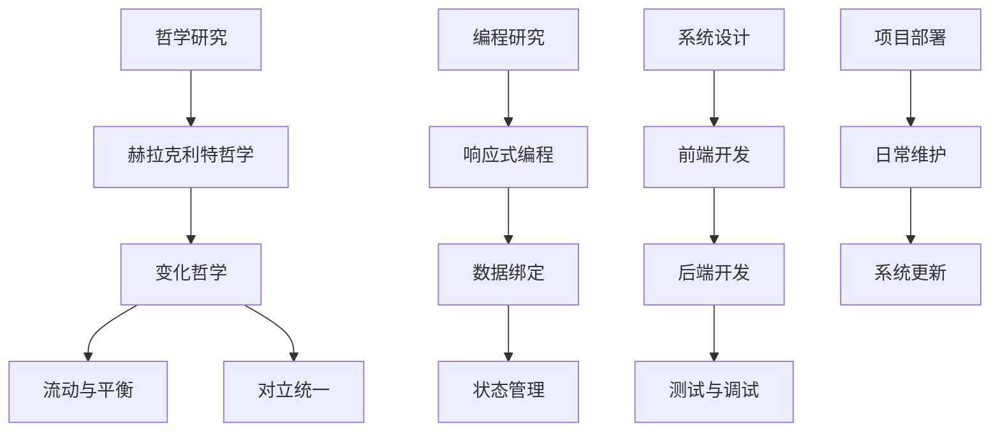

                 

### 赫拉克利特哲学概述

赫拉克利特（Heraclitus），约公元前535年至公元前475年，是古希腊哲学家，被誉为“变化哲学之父”。他的哲学思想深深植根于古希腊文明的土壤中，对后世哲学、科学以及文化产生了深远的影响。赫拉克利特的哲学观点主要集中在“变化”这一核心概念上，他认为宇宙万物无一不在流动与转变之中，这一观点至今仍对我们理解世界的本质有着重要启示。

赫拉克利特的哲学思想首先体现在他对变化的认识。他认为，世界是一个不断变化的整体，一切事物都在不断流动，无物常住。这一思想被称为“流动哲学”（Philosophy of Becoming）。赫拉克利特认为，变化是宇宙的永恒法则，是万物存在的本质。他用“火”作为变化的象征，认为火是宇宙的根本元素，万物皆由火生成，又复归于火。这一观点在哲学史上有着重要的地位，为后来的哲学家如柏拉图和亚里士多德提供了重要的思想源泉。

赫拉克利特的变化哲学不仅关注变化的本质，还探讨了变化背后的规律。他提出了“对立统一”的概念，认为世界是由对立的事物构成的，如热与冷、生与死、上与下等，这些对立的事物相互依存、相互转化，从而达到一种动态的平衡。这种对立统一的观点，为我们理解复杂系统的演化提供了重要的哲学基础。

### 流动与平衡

赫拉克利特的核心思想可以概括为“流动与平衡”。他强调，世界是一个不断变化的整体，而这种变化并不是杂乱无章的，而是在一种内在的平衡中进行的。这种平衡是一种动态的平衡，是通过对立面的相互转化和相互制约实现的。

赫拉克利特用“πάντα ῥεῖ”（panta rhei）来描述世界的状态，意为“一切都在流动”。他认为，没有任何事物是永恒不变的，一切都在不断的变化之中。例如，水可以变成冰，冰又可以融化成水；生命可以诞生，也可以终结。这种变化是不可避免的，也是宇宙的必然规律。

然而，赫拉克利特并没有认为这种变化是混乱无序的。相反，他认为，这种变化是在一种内在的平衡中进行的。他用“γᾶρ（γάργαξα）”（gēr（gargaxa）），意为“活火”，来形容这种不断变化的状态。他认为，这种活火是宇宙的根本元素，是万物变化的动力源泉。

赫拉克利特的这一思想，在现代物理学中得到了深刻的验证。例如，在量子力学中，我们发现了微观世界的随机性和不确定性，但同时也发现了微观世界的规律性。这些规律性，正如赫拉克利特所说的，是在一种内在的平衡中实现的。

### 对立统一

赫拉克利特的“对立统一”思想是他哲学体系中的另一重要组成部分。他认为，世界是由对立的事物构成的，如热与冷、上与下、明与暗等，而这些对立的事物是相互依存、相互转化的。例如，热可以转化为冷，上可以转化为下。这种对立面的相互转化和相互制约，实现了一种动态的平衡。

赫拉克利特的“对立统一”思想，为我们理解复杂系统的演化提供了重要的哲学基础。在生物学中，我们看到了物种的进化和适应环境的对立关系；在经济学中，我们看到了供给与需求的平衡；在政治学中，我们看到了民主与专制的对立。这些对立面并不是静态的，而是在一种动态的平衡中相互转化和相互制约。

### 赫拉克利特哲学的影响

赫拉克利特的哲学思想对后世产生了深远的影响。在古希腊哲学中，他的变化哲学为柏拉图和亚里士多德提供了重要的思想源泉。柏拉图认为，世界的本质是理念，而亚里士多德则认为，世界的本质是实体。这两种观点都在不同程度上受到了赫拉克利特变化哲学的影响。

在科学领域，赫拉克利特的变化哲学为后来的自然科学发展提供了哲学基础。特别是现代物理学，如量子力学和相对论，都在不同程度上体现了赫拉克利特的思想。例如，量子力学中的不确定性原理，就体现了赫拉克利特关于变化和不确定性的观点。

赫拉克利特的哲学思想不仅影响了哲学和科学，也影响了文化和艺术。在艺术创作中，许多艺术家都受到赫拉克利特变化哲学的启发，创作出充满变化和动感的作品。

总之，赫拉克利特的哲学思想，尤其是他的变化哲学，为我们理解世界的本质提供了重要的哲学基础。他的“流动与平衡”和“对立统一”思想，不仅影响了古希腊哲学，也对现代科学和文化产生了深远的影响。

## 2.1 火与变化

在赫拉克利特的哲学体系中，“火”是一个至关重要的概念，它不仅是宇宙的根本元素，也是变化和运动的载体。赫拉克利特认为，火是永恒的，是万物的本源，一切事物都是由火的变化而生，又最终回归于火。这一思想在他的哲学中有着深远的影响，也为后世的哲学和科学提供了重要的启示。

### 火作为变化的象征

赫拉克利特用“火”来象征变化和运动的本质。他认为，火是宇宙中最具活力和动态的元素，它不断地燃烧、扩散、冷却，形成各种各样的变化。这种变化是无处不在的，无时不在的。正如他所说：“火是永恒的，尽管它有时看起来熄灭，但它在其他地方又重新燃起。”

火的变化不仅仅是物理层面的，还包括抽象层面的。赫拉克利特认为，人类社会、政治制度、道德观念等，都是不断变化的。这些变化虽然看似杂乱无章，但实际上是在一种内在的规律和平衡中进行的。这种规律和平衡，正如火的燃烧过程，虽然看似混乱，但实际上是在一种内在的秩序中进行的。

### 火与物质的关系

赫拉克利特认为，火是宇宙的根本元素，一切物质都是由火的变化生成的。例如，水是由火冷却形成的，而土壤则是火与冷风的结合。这种观点在当时的科学背景下可能显得有些抽象，但它在某种程度上与现代物理学中的观点有着相似之处。

现代物理学中的原子模型认为，物质是由原子构成的，而原子则是由更基本的粒子（如电子、质子和中子）构成的。这些粒子之间的相互作用，可以看作是一种微观层面的“火”，它们在不断地运动和变化，形成我们看到的物质世界。

### 火与生命的关系

赫拉克利特认为，火不仅构成了物质世界，也构成了生命世界。生命是火的一种特殊形式，它充满了活力和变化。生命体的生长、繁殖、衰老和死亡，都是火的变化过程。这种观点在某种程度上与现代生物学中的进化论有着相似之处。

现代生物学中的进化论认为，生命是通过自然选择和基因变异不断演化的。这种演化过程，就像火的变化一样，充满了活力和变化。生命体在适应环境的过程中，不断地发生变异，适应新的环境，从而实现生命的延续。

### 火与宇宙的关系

赫拉克利特认为，火不仅构成了宇宙的物质世界和生命世界，也构成了宇宙本身。宇宙是火的变化过程，这种变化是无始无终的，是永恒的。正如他所说：“宇宙是活火，人不能两次踏入同一条河流。”

宇宙的变化是无处不在的，无时不在的。例如，星系的形成和毁灭、星体的运动和变化、宇宙的膨胀和收缩等，都是火的变化过程。这种观点在某种程度上与现代宇宙学中的观点有着相似之处。

现代宇宙学认为，宇宙起源于大爆炸，然后不断地膨胀和演化。宇宙中的星系、星体、黑洞等，都是宇宙演化过程中的产物。这种演化过程，就像火的变化一样，充满了活力和变化。

### 总结

赫拉克利特将“火”视为宇宙的根本元素，认为一切事物都是由火的变化而生，又最终回归于火。这种观点不仅体现了他对变化和运动的深刻理解，也为后世的哲学和科学提供了重要的启示。火的变化，既是物质世界的本质，也是生命世界的本质，更是宇宙的本质。赫拉克利特通过“火”这一概念，揭示了宇宙的奥秘，为我们理解世界的本质提供了重要的哲学基础。

## 2.2 流动与平衡

赫拉克利特的哲学思想中，“流动与平衡”是一个核心概念。他认为，世界是一个不断变化的整体，但这种变化并不是杂乱无章的，而是在一种内在的平衡中进行的。这种流动与平衡的观点，不仅体现了他对自然界的深刻理解，也为我们理解复杂系统的演化提供了重要的哲学基础。

### 流动

赫拉克利特用“πάντα ῥεῖ”（panta rhei）来形容世界的状态，意为“一切都在流动”。他认为，没有任何事物是永恒不变的，一切都在不断的变化之中。这种变化是无处不在的，无时不在的。例如，水可以变成冰，冰又可以融化成水；生命可以诞生，也可以终结。这种变化是不可避免的，也是宇宙的必然规律。

在自然界中，我们看到了流水、风、潮汐等，这些都是流动的例子。在人类社会中，我们也看到了政治、经济、文化等方面的变化。赫拉克利特认为，这些变化都是世界本质的体现，是宇宙流动的一部分。

### 平衡

然而，赫拉克利特并没有认为这种变化是混乱无序的。相反，他认为，这种变化是在一种内在的平衡中进行的。他用“γᾶρ（γάργαξα）”（gēr（gargaxa）），意为“活火”，来形容这种不断变化的状态。他认为，这种活火是宇宙的根本元素，是万物变化的动力源泉。

这种平衡是一种动态的平衡，是通过对立面的相互转化和相互制约实现的。赫拉克利特提出了“对立统一”的概念，认为世界是由对立的事物构成的，如热与冷、生与死、上与下等，这些对立的事物相互依存、相互转化，从而达到一种动态的平衡。

### 对立统一

赫拉克利特的“对立统一”思想，是他哲学体系中的另一重要组成部分。他认为，世界是由对立的事物构成的，如热与冷、上与下、明与暗等，而这些对立的事物是相互依存、相互转化的。例如，热可以转化为冷，上可以转化为下。这种对立面的相互转化和相互制约，实现了一种动态的平衡。

这种对立统一的关系，不仅在自然界中存在，在人类社会中也存在。例如，民主与专制、自由与约束、供给与需求等，这些对立的事物在相互转化和相互制约中，实现了一种动态的平衡。

### 流动与平衡在复杂系统中的应用

赫拉克利特的流动与平衡思想，在复杂系统的分析和设计中有着重要的应用。复杂系统往往具有高度的不确定性和动态性，但在某种意义上，它们也遵循着某种内在的规律和平衡。

在生态系统中，物种的进化、生态平衡等，都是流动与平衡的例子。物种在适应环境的过程中，不断地发生变异，形成新的物种，同时，生态系统中各种生物之间也存在着相互制约和相互依赖的关系，从而实现一种动态的平衡。

在经济学中，市场的供需关系也是一种流动与平衡的体现。供给与需求之间不断地发生变化，但通过价格机制等，最终实现一种动态的平衡。

在工程系统中，如控制系统、通信系统等，也存在着流动与平衡的问题。系统中的各个部分不断地进行信息的传递和处理，通过反馈机制，实现一种动态的平衡。

### 总结

赫拉克利特的流动与平衡思想，为我们理解复杂系统的演化提供了重要的哲学基础。他认为，世界是一个不断变化的整体，但这种变化是在一种内在的平衡中进行的。通过对立面的相互转化和相互制约，实现了一种动态的平衡。这种思想不仅在哲学上有着深远的影响，也在科学、工程和经济学等领域有着广泛的应用。

## 2.3 知识与探索

在赫拉克利特的哲学思想中，知识与探索占据着重要的地位。他强调，通过不断探索和观察，人们可以揭示世界的本质，获得真正的知识。赫拉克利特认为，知识不是静态的，而是动态的，是与世界的互动过程中不断生成的。以下是赫拉克利特关于知识与探索的核心观点和思想。

### 知识的动态性

赫拉克利特认为，知识是动态的，它不是一成不变的，而是随着世界的不断变化而变化。他的名言“一个人不能两次踏入同一条河流”形象地表达了这一观点。赫拉克利特认为，河流在不断地流动，每一次踏入的河流都是不同的，这同样适用于我们对世界的认识。我们的知识是不断积累和更新的，它需要通过不断的探索和观察来更新和完善。

### 观察与经验

赫拉克利特强调，观察和经验是获取知识的重要途径。他认为，只有通过直接观察和亲身经验，人们才能获得真正的知识。观察使我们能够看到事物的变化和多样性，而经验则使我们能够理解这些变化和多样性背后的规律。赫拉克利特的这一观点在科学方法的发展中有着重要的影响，强调实证主义和经验主义在科学探究中的重要性。

### 探索与发现

赫拉克利特鼓励人们不断地探索和发现，他认为，知识的获取是一个不断探索和发现的过程。他通过自己的思考和实践，揭示了世界的某些本质规律，例如他关于“火”与变化的哲学观点。赫拉克利特的探索精神和对未知领域的追求，激励了后来的哲学家和科学家不断探索未知领域，推动人类知识的发展。

### 知识的相对性

赫拉克利特还提出了知识的相对性观点，他认为，不同的个体对同一事物的认识可能是不同的。这是因为每个人的观察角度、经验背景和思维方式都不同。赫拉克利特认为，知识是相对的，而不是绝对的。这一观点在后来的哲学发展中，特别是认识论领域，有着重要的影响。

### 知识的挑战

赫拉克利特认为，知识获取是一个充满挑战的过程。他引用了“像婴儿一样思考”的比喻，强调知识获取的艰辛和复杂性。他认为，我们需要像婴儿一样，保持对世界的好奇心和探索精神，不断地学习和成长。

### 知识的积累与更新

赫拉克利特还强调了知识的积累与更新。他认为，知识是通过前人的经验和智慧积累下来的，但同时也需要不断地更新和发展。通过不断地探索和发现，我们可以将前人的知识进行扩展和深化，从而推动人类知识的发展。

### 总结

赫拉克利特的哲学思想中，知识与探索占据着重要的地位。他强调，知识是动态的，通过观察、经验和探索，人们可以揭示世界的本质，获得真正的知识。他的思想对后来的哲学家和科学家产生了深远的影响，为我们理解知识的本质和获取方法提供了重要的哲学基础。

## 2.4 赫拉克利特哲学的应用

赫拉克利特的哲学思想不仅在理论层面具有重要意义，在实际应用中也展现出了其独特的价值。从政治哲学、伦理学到科学哲学，赫拉克利特的变化哲学为我们提供了深刻的洞见，帮助我们在不同领域中理解和应对复杂的问题。

### 政治哲学中的应用

在政治哲学中，赫拉克利特的变化哲学强调了社会和政治制度的动态性。他主张，政治制度应该适应不断变化的社会环境，而不是僵化不变。例如，在《论自然》中，赫拉克利特指出，一个优秀的统治者应该像“活火”一样，能够灵活应对各种情况，保持社会的平衡与和谐。这一观点对现代政治理论，尤其是关于治理和变革的讨论，提供了重要的启示。

在实际应用中，赫拉克利特的这一思想可以指导政治家和政策制定者，使他们能够更有效地应对复杂多变的社会问题。例如，在现代社会中，全球化、技术进步和社会变迁等，都对政治制度提出了新的挑战。政治家需要借鉴赫拉克利特的变化哲学，灵活调整政策，以适应这些变化。

### 伦理学中的应用

在伦理学中，赫拉克利特的变化哲学也具有深远的影响。他强调了个人品德和道德的动态性，认为道德不是一成不变的规则，而是在具体情境中不断演化的。例如，赫拉克利特认为，一个人在不同的生命阶段可能会有不同的道德选择，因为每个阶段的情境和需求都是不同的。

这一观点对现代伦理学，特别是情境伦理学和道德相对主义的讨论，提供了重要的理论支持。在现代社会中，随着文化的多元化和价值观的多样性，传统的伦理规范面临着新的挑战。赫拉克利特的变化哲学提醒我们，道德是一个动态的、与情境相关的概念，我们需要根据具体情境进行道德判断和选择。

### 科学哲学中的应用

在科学哲学中，赫拉克利特的变化哲学为科学方法的发展提供了哲学基础。他强调了观察和经验在知识获取中的重要性，这与科学方法的基本原则相契合。赫拉克利特认为，通过不断的观察和实验，科学家可以揭示自然界的规律，从而获得真正的知识。

这一观点对现代科学方法的发展产生了深远的影响。例如，在物理学中，量子力学和相对论的发展都体现了赫拉克利特变化哲学的思想。这些理论不仅揭示了自然界的复杂性和不确定性，也强调了观察和实验在科学探究中的关键作用。

### 总结

赫拉克利特的哲学思想在不同领域中都有着广泛的应用。从政治哲学到伦理学，再到科学哲学，他的变化哲学为我们提供了深刻的洞见，帮助我们更好地理解和应对复杂的问题。赫拉克利特的变化哲学不仅是一种理论观点，更是一种实践指南，它提醒我们在面对不断变化的世界时，需要保持灵活性和适应性。通过借鉴赫拉克利特的思想，我们可以更好地把握变化，实现个人和社会的持续发展。

## 2.5 赫拉克利特哲学与现代科学

赫拉克利特的哲学思想在古代希腊哲学中占据着重要地位，其对现代科学的启示同样深远。尽管赫拉克利特的哲学观点在当时并未得到广泛的接受，但随着时间的推移，许多现代科学理论在某种程度上体现了他的核心思想。本文将从量子力学、相对论和宇宙学三个方面，探讨赫拉克利特哲学对现代科学的启示。

### 量子力学

量子力学是20世纪初发展起来的一门科学，它揭示了微观世界的规律，颠覆了经典物理学中的许多观念。量子力学中的不确定性原理和量子纠缠等现象，与赫拉克利特的变化哲学有着惊人的相似之处。

赫拉克利特认为，世界是一个不断变化的整体，一切都在流动。这一观点在量子力学中得到了验证。例如，量子力学中的不确定性原理表明，我们无法同时精确地知道一个粒子的位置和速度，这反映了世界的本质是不确定的。这与赫拉克利特关于变化和不确定性的看法相契合。

此外，量子纠缠现象也体现了赫拉克利特的对立统一思想。量子纠缠是指两个或多个粒子之间存在着一种特殊的联系，即使这些粒子相隔很远，它们的状态仍然相互影响。这种现象挑战了经典物理学的局域实在论，也与赫拉克利特关于对立事物相互依存的哲学观点相呼应。

### 相对论

爱因斯坦的相对论是20世纪物理学的重要成就，它对时间和空间的观念进行了深刻的变革。相对论中的时空相对性、质能等价原理等，都在一定程度上体现了赫拉克利特的变化哲学。

相对论中的时空相对性指出，时间和空间的测量依赖于观察者的运动状态。这与赫拉克利特关于变化和运动关系的观点一致。赫拉克利特认为，世界是一个不断变化的整体，这种变化是与观察者的关系密切相关的。

此外，相对论中的质能等价原理，即质量与能量的相互转化，也与赫拉克利特关于火与变化的思想相似。赫拉克利特认为，火是宇宙的根本元素，它可以通过不同的形式存在和转化。相对论中的质能等价原理E=mc²，揭示了质量和能量之间的转换关系，这与赫拉克利特关于火与物质关系的理解相呼应。

### 宇宙学

宇宙学是研究宇宙起源、演化及其结构的科学。赫拉克利特关于宇宙是不断变化的整体的观点，在现代宇宙学中得到了验证。

宇宙学中的大爆炸理论认为，宇宙起源于一个极热、极密集的状态，然后开始膨胀。这一理论在某种程度上体现了赫拉克利特关于宇宙变化的看法。赫拉克利特认为，宇宙是一个不断变化的整体，这种变化是无始无终的。大爆炸理论描述了宇宙从一个极高密度状态开始膨胀的过程，这与赫拉克利特的观点有着相似之处。

此外，宇宙学中的宇宙背景辐射和星系的形成和演化等，也在一定程度上体现了赫拉克利特的变化哲学。宇宙背景辐射是宇宙大爆炸后遗留下来的热辐射，它为研究宇宙的早期状态提供了重要线索。星系的形成和演化过程，也体现了宇宙中的不断变化和演化。

### 总结

赫拉克利特的哲学思想在量子力学、相对论和宇宙学中得到了深刻的验证。量子力学中的不确定性原理和量子纠缠、相对论中的时空相对性和质能等价原理、宇宙学中的大爆炸理论和宇宙背景辐射等，都在不同程度上体现了赫拉克利特的变化哲学。赫拉克利特关于变化和流动的观点，为我们理解现代科学的某些核心概念提供了重要的哲学基础。通过借鉴赫拉克利特的思想，我们可以更深入地探索宇宙的本质，揭示科学发展的规律。

## 第3章：响应式编程概述

### 3.1 响应式编程的定义

响应式编程（Responsive Programming）是一种面向用户的编程范式，旨在创建能够自动适应各种设备和屏幕尺寸的交互式用户界面（UI）。其核心思想是系统应该能够实时响应用户的行为和界面状态的变化，提供一致的、流畅的用户体验。响应式编程的目标是提高应用程序的可用性、可访问性和可维护性，使开发者能够编写一次代码，即可在不同平台上运行。

响应式编程不仅仅是一种技术实现，更是一种设计理念。它强调在应用程序开发过程中，要考虑到用户在不同设备和环境下使用应用程序的各种可能性，从而设计出能够灵活适应这些变化的应用程序。与传统的单向数据流编程模型相比，响应式编程强调双向数据绑定，使界面与数据状态保持同步，减少了手动更新界面的需求。

### 3.2 响应式编程的优势

响应式编程具有许多显著的优势，以下是其中几个关键点：

#### 1. 提高开发效率

响应式编程通过减少手动更新界面的需求，提高了开发效率。开发者只需关注数据模型的变化，而无需关心界面更新逻辑，从而减少了代码的冗余和维护成本。

#### 2. 提升用户体验

响应式编程使得应用程序能够快速响应用户的操作，提供流畅的交互体验。这种实时响应的能力，使得用户界面更加直观和易用，提高了用户的满意度和使用体验。

#### 3. 简化跨平台开发

响应式编程技术，如React、Vue.js和Angular，提供了丰富的组件库和工具，使得开发者能够编写一次代码，即可在多个平台上（如Web、移动和桌面）运行。这大大简化了跨平台开发的复杂性，降低了开发成本。

#### 4. 易于维护和扩展

响应式编程模式通常采用模块化和组件化的设计，使得代码更加清晰和易于维护。组件化的设计方法，使得开发者可以独立地开发和测试组件，提高了代码的可复用性和扩展性。

### 3.3 响应式编程的发展历程

响应式编程的发展历程可以追溯到20世纪90年代，当时随着互联网的兴起，网页开发开始变得越来越复杂。为了解决传统网页开发中的问题，如页面更新缓慢、响应能力差等，开发者开始探索新的编程范式。

#### 1. 早期尝试

在早期的网页开发中，开发者开始尝试使用JavaScript框架和库，如jQuery和Prototype，来实现动态数据和界面更新。这些尝试为后来的响应式编程技术的发展奠定了基础。

#### 2. React的诞生

2008年，Facebook推出了React，这是一个用于构建用户界面的JavaScript库。React的核心思想是虚拟DOM和组件化，这使得开发者可以以声明式的方式编写UI代码，提高了界面更新的效率和响应速度。React的成功引发了响应式编程的兴起。

#### 3. Vue.js和Angular

随着响应式编程的普及，其他类似的技术也逐渐出现。Vue.js和Angular都是React的竞争对手，它们各自在不同方面对响应式编程进行了优化和扩展。Vue.js以其简单易用和高效性受到广泛欢迎，而Angular则因其强大的功能和完善的技术栈在大型企业中得到应用。

#### 4. 现代响应式编程

现在的响应式编程技术已经发展得非常成熟，涵盖了从前端到后端的各种场景。除了React、Vue.js和Angular，还有许多其他流行的响应式编程框架和库，如NestJS、VueX和MobX等。这些技术不断演进，为开发者提供了更多的选择和工具，使得响应式编程变得更加灵活和高效。

### 3.4 响应式编程的基本原理

响应式编程的基本原理主要包括数据绑定、组件化设计和状态管理。

#### 1. 数据绑定

数据绑定是响应式编程的核心机制之一。它使得数据和界面保持同步，当数据发生变化时，界面会自动更新。数据绑定可以分为单向绑定和双向绑定。单向绑定（如Vue.js中的数据绑定）确保数据流从父组件传递到子组件，而双向绑定（如React中的状态和属性绑定）则确保数据流在两个方向上都可以传递。

#### 2. 组件化设计

组件化设计是将应用程序分解为可复用和独立的小部件（组件），每个组件都有自己的状态和行为。这种设计方法提高了代码的可维护性和可扩展性，使得开发者可以更轻松地管理和测试组件。

#### 3. 状态管理

状态管理是响应式编程中的一个重要概念，它涉及如何管理应用程序中的数据状态。常见的状态管理解决方案包括Redux、Vuex和MobX等。这些解决方案提供了集中的状态管理机制，使得开发者可以更好地跟踪和管理应用中的数据状态。

### 总结

响应式编程是一种面向用户的编程范式，它通过实时响应用户的行为和界面状态的变化，提供一致的、流畅的用户体验。响应式编程具有提高开发效率、提升用户体验、简化跨平台开发和易于维护扩展等显著优势。其发展历程从早期的网页开发尝试到现代的React、Vue.js和Angular等流行框架，反映了编程范式的不断演进。响应式编程的基本原理包括数据绑定、组件化设计和状态管理，这些原理共同构成了现代响应式编程的核心。

## 第4章：响应式编程的核心概念

### 4.1 数据绑定

数据绑定是响应式编程的核心概念之一，它使得数据和界面保持同步，当数据发生变化时，界面会自动更新。数据绑定可以分为单向绑定和双向绑定。

#### 单向绑定

单向绑定（One-Way Data Binding）是一种数据流从父组件传递到子组件的机制。在单向绑定中，组件的状态由父组件管理，子组件只能读取父组件的状态，而不能直接修改。单向绑定确保了数据流是单向的，从而避免了复杂的副作用和不可预测的行为。

单向绑定的实现通常依赖于虚拟DOM（Virtual DOM）技术。当组件的状态发生变化时，虚拟DOM会创建一个新的虚拟节点树，并与原始的虚拟节点树进行比较，找出差异，然后只更新实际DOM中的变化部分，从而提高界面的更新效率。

以下是一个简单的单向绑定的Python示例：

```python
# 示例：单向绑定
class ParentComponent:
    def __init__(self):
        self.state = "Hello"

    def render(self):
        return f"Parent Component: {self.state}"

class ChildComponent:
    def __init__(self, parent):
        self.parent = parent

    def render(self):
        return f"Child Component: {self.parent.state}"

# 使用单向绑定
parent = ParentComponent()
child = ChildComponent(parent)

parent.state = "World"
print(parent.render())  # 输出：Parent Component: World
print(child.render())  # 输出：Child Component: World
```

在这个示例中，父组件的状态变化会自动反映在子组件的渲染结果中。

#### 双向绑定

双向绑定（Two-Way Data Binding）是一种数据流在两个方向上都可以传递的机制。在双向绑定中，组件的状态不仅可以由父组件传递，还可以由子组件传递回父组件。双向绑定通常用于处理用户输入，例如文本框、表单等。

双向绑定可以通过将数据属性绑定到输入元素的value属性来实现。当用户输入值时，输入元素的value属性会发生变化，并触发组件的状态更新。以下是一个简单的双向绑定的Python示例：

```python
# 示例：双向绑定
from tkinter import Tk, Label, Entry

# 父组件
class ParentComponent:
    def __init__(self, master):
        self.master = master
        self.state = ""

        self.label = Label(master, text=f"Parent Component: {self.state}")
        self.label.pack()

        self.entry = Entry(master)
        self.entry.pack()

        self.entry.bind("<KeyRelease>", self.on_key_release)

    def on_key_release(self, event):
        self.state = self.entry.get()
        self.label.config(text=f"Parent Component: {self.state}")

# 主程序
if __name__ == "__main__":
    root = Tk()
    parent = ParentComponent(root)
    root.mainloop()
```

在这个示例中，当用户在文本框中输入值时，父组件的状态会自动更新，并反映在标签的文本中。

#### 数据绑定在实践中的应用

在实际应用中，数据绑定是响应式编程框架的核心功能。例如，React中的useState和useReducer Hook提供了单向绑定的能力，而Vue.js和Angular则提供了双向绑定的能力。

单向绑定通常用于管理组件的状态，而双向绑定则用于处理用户输入和表单数据。通过合理使用数据绑定，开发者可以创建出响应迅速、易于维护的用户界面。

### 4.2 观察者模式

观察者模式（Observer Pattern）是一种行为设计模式，它定义了一种一对多的依赖关系，使得当一个对象的状态发生变化时，所有依赖于它的对象都会得到通知并自动更新。观察者模式在响应式编程中广泛应用，特别是在事件驱动和实时数据更新的场景中。

#### 观察者模式的基本原理

观察者模式包含两个核心角色：观察者（Observer）和主题（Subject）。主题负责维护一个观察者列表，并在状态发生变化时通知所有观察者。观察者则负责监听主题的状态变化，并在收到通知后进行相应的更新。

以下是一个简单的观察者模式的Python示例：

```python
# 示例：观察者模式
from abc import ABC, abstractmethod
from typing import List

# 观察者接口
class Observer(ABC):
    @abstractmethod
    def update(self, subject):
        pass

# 主题接口
class Subject(ABC):
    @abstractmethod
    def attach(self, observer: Observer):
        pass

    @abstractmethod
    def detach(self, observer: Observer):
        pass

    @abstractmethod
    def notify(self):
        pass

# 具体观察者
class ConcreteObserver(Observer):
    def update(self, subject: Subject):
        print(f"Observer: Subject {subject} state has changed.")

# 具体主题
class ConcreteSubject(Subject):
    def __init__(self):
        self._observers: List[Observer] = []

    def attach(self, observer: Observer):
        self._observers.append(observer)

    def detach(self, observer: Observer):
        self._observers.remove(observer)

    def notify(self):
        for observer in self._observers:
            observer.update(self)

# 主程序
if __name__ == "__main__":
    subject = ConcreteSubject()

    observer = ConcreteObserver()
    subject.attach(observer)

    subject.notify()  # 输出：Observer: Subject <__main__.ConcreteSubject object at 0x7f972fa7c810> state has changed.
```

在这个示例中，当主题的状态发生变化时，所有观察者都会收到通知并更新自身状态。

#### 观察者模式在响应式编程中的应用

观察者模式在响应式编程中用于实现事件驱动和数据更新。例如，在React中，组件的生命周期方法和事件处理函数可以看作是观察者模式的具体实现。当组件的状态发生变化时，相关的事件处理函数会触发，从而更新界面。

观察者模式还用于实现实时数据绑定和状态管理。例如，Vue.js和Angular都使用了观察者模式来管理组件的状态和响应式数据。通过观察者模式，当数据发生变化时，相关组件会自动更新，从而提供流畅的用户体验。

### 4.3 发布-订阅模式

发布-订阅模式（Publish-Subscribe Pattern）是一种消息传递模式，它允许应用程序中的对象通过消息队列进行通信。在发布-订阅模式中，发布者（Publisher）发布消息，订阅者（Subscriber）订阅特定类型的消息，并在消息发布时接收通知。

#### 发布-订阅模式的基本原理

发布-订阅模式包含两个核心角色：发布者和订阅者。发布者负责发布消息，而订阅者负责订阅特定类型的消息。发布者和订阅者之间没有直接的关系，它们通过消息队列进行通信。

以下是一个简单的发布-订阅模式的Python示例：

```python
# 示例：发布-订阅模式
from threading import Thread

# 消息队列
class MessageQueue:
    def __init__(self):
        self._queue = []

    def publish(self, message):
        self._queue.append(message)

    def subscribe(self, subscriber):
        self._queue.append(subscriber)

    def notify(self):
        while self._queue:
            message = self._queue.pop(0)
            message()

# 发布者
class Publisher:
    def __init__(self, message_queue: MessageQueue):
        self._message_queue = message_queue

    def publish_message(self, message):
        self._message_queue.publish(message)

# 订阅者
class Subscriber(Thread):
    def __init__(self, name):
        super().__init__(name=name)

    def run(self):
        while True:
            message = self._message_queue.notify()
            if message:
                print(f"{self.name}: Received message - {message}")

# 主程序
if __name__ == "__main__":
    message_queue = MessageQueue()

    subscriber1 = Subscriber("Subscriber 1")
    subscriber2 = Subscriber("Subscriber 2")

    subscriber1.start()
    subscriber2.start()

    publisher = Publisher(message_queue)
    publisher.publish_message("Hello, World!")
```

在这个示例中，发布者发布了一条消息，两个订阅者都收到了这条消息。

#### 发布-订阅模式在响应式编程中的应用

发布-订阅模式在响应式编程中用于实现实时数据绑定和事件处理。例如，在Vue.js和Angular中，数据绑定和事件处理都是通过发布-订阅模式实现的。通过发布-订阅模式，应用程序可以实时响应用户操作和数据变化，提供流畅的用户体验。

发布-订阅模式还用于实现微服务架构中的消息传递和事件驱动。例如，在Kafka和RabbitMQ等消息队列系统中，发布者和订阅者可以通过发布-订阅模式进行通信，实现分布式系统的数据同步和事件处理。

### 总结

数据绑定、观察者模式和发布-订阅模式是响应式编程的核心概念。数据绑定使得数据和界面保持同步，观察者模式实现事件驱动和状态更新，发布-订阅模式用于实现实时数据绑定和消息传递。这些概念共同构成了响应式编程的基础，为开发者提供了强大的工具，以构建响应迅速、易于维护和扩展的应用程序。

## 第5章：响应式编程框架

响应式编程框架为开发者提供了实现响应式应用程序的强大工具，使得应用程序能够实时响应用户的操作和状态变化。以下是几个流行的响应式编程框架：ReactJS、Vue.js和Angular。

### 5.1 ReactJS

ReactJS是由Facebook开发的一个用于构建用户界面的JavaScript库。它采用虚拟DOM（Virtual DOM）技术，实现了高效的界面更新，并通过组件化设计提高了代码的可维护性和可扩展性。

#### ReactJS的核心特性

1. **虚拟DOM**：ReactJS使用虚拟DOM来提高界面更新的效率。虚拟DOM是一个轻量级的JavaScript对象表示DOM结构，当数据发生变化时，ReactJS会创建一个新的虚拟DOM树，并与旧的虚拟DOM树进行比较，找出差异，然后仅更新实际DOM中的变化部分。

2. **组件化设计**：ReactJS通过组件（Component）来组织UI代码，每个组件都有自己的状态和行为。组件可以独立开发、测试和复用，提高了代码的可维护性和可扩展性。

3. **单向数据流**：ReactJS采用单向数据流的设计模式，数据从父组件传递到子组件，从而确保了数据流的清晰和可预测性。

4. **Hooks**：React Hooks 是 React 16.8 引入的新特性，它允许在不编写类的情况下使用 state 以及其他 React 特性。Hooks 使你能够将组件逻辑“提取”到自定义函数中，而不是将它们混入组件中。

#### ReactJS的使用场景

ReactJS适用于构建复杂、动态的Web应用程序，特别是在需要频繁更新界面的场景中。以下是一些常见的使用场景：

1. **单页面应用（SPA）**：ReactJS是构建单页面应用（Single Page Application，SPA）的理想选择，因为它能够高效地处理数据和界面的更新。

2. **复杂UI组件**：ReactJS的组件化设计使得开发者可以创建复杂、可复用的UI组件，从而提高开发效率。

3. **实时数据绑定**：ReactJS的单向数据流和虚拟DOM技术，使得应用程序能够实时响应用户的操作和数据变化，提供流畅的用户体验。

#### ReactJS的实践

以下是一个简单的ReactJS示例：

```javascript
import React, { useState } from 'react';

function App() {
  const [count, setCount] = useState(0);

  return (
    <div>
      <p>You clicked {count} times</p>
      <button onClick={() => setCount(count + 1)}>
        Click me
      </button>
    </div>
  );
}

export default App;
```

在这个示例中，我们使用useState钩子来管理组件的状态，并在按钮被点击时更新状态。

### 5.2 Vue.js

Vue.js是由尤雨溪开发的一个用于构建用户界面的JavaScript框架。它具有简单、灵活和高效的特点，通过双向数据绑定和组件化设计，提供了强大的响应式能力。

#### Vue.js的核心特性

1. **双向数据绑定**：Vue.js通过数据绑定机制，实现了数据和界面的实时同步。当数据发生变化时，界面会自动更新；当用户操作界面时，数据也会自动更新。

2. **组件化设计**：Vue.js通过组件（Component）来组织UI代码，每个组件都有自己的状态和行为。组件可以独立开发、测试和复用，提高了代码的可维护性和可扩展性。

3. **指令系统**：Vue.js提供了一套丰富的指令系统，使得开发者可以方便地实现数据绑定、事件处理和样式绑定等功能。

4. **轻量级**：Vue.js是一个轻量级的框架，易于学习和使用。它不强制绑定任何特定的工具链，开发者可以根据项目需求选择合适的构建工具和开发环境。

#### Vue.js的使用场景

Vue.js适用于构建各种类型的Web应用程序，特别是在需要快速开发和易于维护的项目中。以下是一些常见的使用场景：

1. **中大型应用**：Vue.js适合构建中大型Web应用程序，如企业管理系统、电商平台等。

2. **移动端应用**：Vue.js可以通过Vue.js移动端框架（如Vue Mobile）快速开发移动端应用。

3. **前端工程化**：Vue.js支持前端工程化，包括代码拆分、构建优化和模块化开发等。

#### Vue.js的实践

以下是一个简单的Vue.js示例：

```html
<!DOCTYPE html>
<html>
<head>
  <script src="https://cdn.jsdelivr.net/npm/vue@2.6.12/dist/vue.js"></script>
</head>
<body>
  <div id="app">
    <p>{{ message }}</p>
    <button v-on:click="reverseMessage">Reverse Message</button>
  </div>

  <script>
    new Vue({
      el: '#app',
      data: {
        message: 'Hello Vue.js!'
      },
      methods: {
        reverseMessage: function () {
          this.message = this.message.split('').reverse().join('');
        }
      }
    });
  </script>
</body>
</html>
```

在这个示例中，我们使用Vue.js的双向数据绑定和事件处理功能来创建一个简单的交互式页面。

### 5.3 Angular

Angular是由Google开发的一个用于构建动态Web应用程序的前端框架。它具有功能强大、灵活和高效的特点，通过依赖注入、双向数据绑定和组件化设计，提供了强大的响应式能力。

#### Angular的核心特性

1. **依赖注入**：Angular通过依赖注入（Dependency Injection）机制，实现了组件间的解耦，提高了代码的可维护性和可测试性。

2. **双向数据绑定**：Angular通过双向数据绑定（Two-Way Data Binding）机制，实现了数据和界面的实时同步。当数据发生变化时，界面会自动更新；当用户操作界面时，数据也会自动更新。

3. **组件化设计**：Angular通过组件（Component）来组织UI代码，每个组件都有自己的状态和行为。组件可以独立开发、测试和复用，提高了代码的可维护性和可扩展性。

4. **模块化**：Angular支持模块化开发，使得开发者可以方便地组织和拆分代码，提高了代码的可维护性和可扩展性。

#### Angular的使用场景

Angular适用于构建复杂、动态的Web应用程序，特别是在需要高度可维护性和可扩展性的项目中。以下是一些常见的使用场景：

1. **大型企业应用**：Angular适合构建大型企业级Web应用程序，如电子商务平台、财务管理系统等。

2. **单页面应用（SPA）**：Angular是构建单页面应用（Single Page Application，SPA）的理想选择，因为它能够高效地处理数据和界面的更新。

3. **前端工程化**：Angular支持前端工程化，包括代码拆分、构建优化和模块化开发等。

#### Angular的实践

以下是一个简单的Angular示例：

```html
<!DOCTYPE html>
<html>
<head>
  <base href="/">
  <title>Angular</title>
  <script src="node_modules/@angular/core/fesm5/core.js"></script>
  <script src="node_modules/@angular/common/fesm5/common.js"></script>
  <script src="node_modules/@angular/platform-browser/fesm5/platform-browser.js"></script>
  <script src="node_modules/@angular/platform-browser-dynamic/fesm5/platform-browser-dynamic.js"></script>
</head>
<body>
  <app-root></app-root>
  <script>
    import { platformBrowserDynamic } from '@angular/platform-browser-dynamic';
    import { AppModule } from './app/app.module';

    platformBrowserDynamic().bootstrapModule(AppModule)
      .catch(err => console.error(err));
  </script>
</body>
</html>
```

在这个示例中，我们使用Angular的模块化和组件化设计来创建一个简单的交互式页面。

### 总结

ReactJS、Vue.js和Angular是当前最流行的响应式编程框架，它们各自具有独特的特点和优势。ReactJS以其高效性和组件化设计受到广泛欢迎，Vue.js以其简单和灵活性受到开发者喜爱，Angular则以其功能强大和可维护性在大型企业中广泛应用。开发者可以根据项目需求和团队技能选择合适的框架，以构建高性能、易维护的响应式应用程序。

## 第6章：响应式编程在实践中的应用

### 6.1 Web应用

响应式编程在Web应用开发中发挥着重要作用，使得开发者能够创建出响应迅速、用户体验良好的应用。以下是一些典型的Web应用场景和响应式编程的应用：

#### 1. 单页面应用（SPA）

单页面应用（Single Page Application，SPA）是响应式编程的主要应用场景之一。SPA通过使用响应式编程框架，如React、Vue.js或Angular，可以实现对用户操作和数据变化的实时响应。以下是一个简单的React SPA示例：

```javascript
import React, { useState } from 'react';

function Counter() {
  const [count, setCount] = useState(0);

  return (
    <div>
      <h1>Counter: {count}</h1>
      <button onClick={() => setCount(count + 1)}>Increment</button>
    </div>
  );
}

export default Counter;
```

在这个示例中，使用React的useState钩子来管理组件的状态，并在按钮被点击时更新状态，从而实现实时计数。

#### 2. 实时数据更新

响应式编程在实时数据更新方面也具有显著优势。例如，股票交易平台需要实时显示股票价格变化，这时可以使用WebSocket技术结合响应式编程框架来实现。以下是一个简单的Vue.js示例：

```html
<!DOCTYPE html>
<html>
<head>
  <script src="https://cdn.jsdelivr.net/npm/vue@2.6.12/dist/vue.js"></script>
</head>
<body>
  <div id="app">
    <h1>Stock Price: {{ stockPrice }}</h1>
  </div>

  <script>
    new Vue({
      el: '#app',
      data: {
        stockPrice: 0
      },
      created() {
        const socket = new WebSocket('wss://example.com/stock-price');
        socket.onmessage = (event) => {
          this.stockPrice = parseFloat(event.data);
        };
      }
    });
  </script>
</body>
</html>
```

在这个示例中，Vue.js通过WebSocket实时接收股票价格数据，并更新组件的状态，从而实现实时数据更新。

#### 3. 表单验证

在Web应用中，表单验证是一个常见的需求。响应式编程框架可以帮助开发者轻松实现表单验证功能，例如Vue.js的v-model指令可以用于双向数据绑定，从而实现实时的输入验证。以下是一个简单的Vue.js表单验证示例：

```html
<!DOCTYPE html>
<html>
<head>
  <script src="https://cdn.jsdelivr.net/npm/vue@2.6.12/dist/vue.js"></script>
</head>
<body>
  <div id="app">
    <form>
      <label for="email">Email:</label>
      <input type="email" v-model="email" @input="validateEmail" />
      <span v-if="errors.email">{{ errors.email }}</span>
    </form>
  </div>

  <script>
    new Vue({
      el: '#app',
      data: {
        email: '',
        errors: {
          email: null
        }
      },
      methods: {
        validateEmail() {
          const pattern = /^[^@]+@[^@]+\.[^@]+$/;
          this.errors.email = pattern.test(this.email) ? null : 'Invalid email';
        }
      }
    });
  </script>
</body>
</html>
```

在这个示例中，使用v-model指令实现输入框的双向数据绑定，并通过@input事件监听输入变化，实现实时的输入验证。

### 6.2 移动应用

响应式编程也在移动应用开发中得到了广泛应用，使得开发者能够创建出适应不同屏幕尺寸和设备特性的移动应用。以下是一些典型的移动应用场景和响应式编程的应用：

#### 1. 适配不同屏幕尺寸

移动应用需要适配不同屏幕尺寸和设备特性，响应式编程框架可以帮助开发者实现这一目标。例如，Vue.js移动端框架（Vue Mobile）提供了丰富的组件库和样式预处理器，使得开发者可以轻松创建出适应不同屏幕尺寸的移动应用。

```html
<!DOCTYPE html>
<html>
<head>
  <script src="https://cdn.jsdelivr.net/npm/vue@2.6.12/dist/vue.js"></script>
  <script src="https://cdn.jsdelivr.net/npm/vue-mobile@1.0.0/lib/index.js"></script>
</head>
<body>
  <div id="app">
    <vm-page>
      <vm-header title="Home"></vm-header>
      <vm-content>
        <vm-button @click="increment">Increment</vm-button>
      </vm-content>
    </vm-page>
  </div>

  <script>
    new Vue({
      el: '#app',
      data: {
        count: 0
      },
      methods: {
        increment() {
          this.count++;
        }
      }
    });
  </script>
</body>
</html>
```

在这个示例中，使用Vue Mobile的页面（Page）组件、头部（Header）组件和内容（Content）组件，创建了一个简单的移动应用界面。

#### 2. 实时数据更新

移动应用中的实时数据更新需求，如社交媒体应用、实时聊天应用等，可以通过响应式编程框架实现。以下是一个简单的React Native示例：

```javascript
import React, { useState, useEffect } from 'react';
import { View, Text, Button } from 'react-native';

function ChatApp() {
  const [messages, setMessages] = useState([]);

  useEffect(() => {
    const socket = new WebSocket('wss://example.com/chat');
    socket.onmessage = (event) => {
      setMessages([...messages, JSON.parse(event.data)]);
    };
    return () => {
      socket.close();
    };
  }, [messages]);

  return (
    <View>
      <Text>Chat App</Text>
      {messages.map((message, index) => (
        <Text key={index}>{message.sender}: {message.content}</Text>
      ))}
    </View>
  );
}

export default ChatApp;
```

在这个示例中，使用React Native创建了一个简单的聊天应用，通过WebSocket实时接收消息并更新状态，实现实时数据更新。

### 6.3 实时数据处理

响应式编程在实时数据处理方面具有显著优势，特别是在处理大量实时数据和高并发场景中。以下是一个简单的Vue.js实时数据处理示例：

```html
<!DOCTYPE html>
<html>
<head>
  <script src="https://cdn.jsdelivr.net/npm/vue@2.6.12/dist/vue.js"></script>
</head>
<body>
  <div id="app">
    <h1>Real-time Data Processing</h1>
    <table>
      <thead>
        <tr>
          <th>Timestamp</th>
          <th>Data</th>
        </tr>
      </thead>
      <tbody>
        {#each data as row}
          <tr>
            <td>{{ row.timestamp }}</td>
            <td>{{ row.data }}</td>
          </tr>
        {/each}
      </tbody>
    </table>
  </div>

  <script>
    new Vue({
      el: '#app',
      data: {
        data: []
      },
      created() {
        const socket = new WebSocket('wss://example.com/real-time-data');
        socket.onmessage = (event) => {
          const data = JSON.parse(event.data);
          this.data.push(data);
        };
      }
    });
  </script>
</body>
</html>
```

在这个示例中，Vue.js通过WebSocket实时接收实时数据，并更新状态，实现实时数据处理。

### 总结

响应式编程在Web应用、移动应用和实时数据处理等领域具有广泛应用。通过使用响应式编程框架，开发者可以创建出响应迅速、用户体验良好的应用，同时降低开发难度和维护成本。不同场景下的应用示例展示了响应式编程的强大功能和灵活性，为开发者提供了丰富的实践经验和借鉴意义。

## 第7章：赫拉克利特哲学与响应式编程的启示

赫拉克利特的哲学思想，尤其是他的变化哲学，为现代编程，特别是响应式编程提供了深刻的启示。通过理解赫拉克利特关于变化、流动和对立统一的观点，我们可以更好地应用这些哲学原则于编程实践中，以实现更灵活、更高效和更可维护的软件系统。

### 哲学对编程的启示

1. **变化与适应**

赫拉克利特认为世界是一个不断变化的过程，这一观点在编程中有着直接的启示。软件系统必须能够适应不断变化的环境和需求。响应式编程通过实时响应用户行为和状态变化，实现了对变化的适应。开发者需要采用模块化、组件化的设计方法，使得系统能够灵活地扩展和调整。

2. **流动与同步**

赫拉克利特的流动哲学强调事物之间的相互作用和相互影响。在编程中，这一点体现在对数据和状态管理的同步需求。响应式编程框架，如React、Vue.js和Angular，通过数据绑定和状态管理机制，实现了数据和界面之间的实时同步，使得开发者能够更好地处理复杂的数据流。

3. **对立统一**

赫拉克利特的对立统一观点，即认为世界是由相互对立和相互依存的事物构成的，在编程中也得到了体现。在软件开发中，开发者需要处理各种对立的需求，如性能与用户体验、功能性与可维护性等。通过响应式编程，开发者可以更好地协调这些对立的需求，实现系统的动态平衡。

### 编程对哲学的启示

1. **哲学在软件设计中的应用**

随着软件系统的复杂度不断增加，编程方法学和设计模式逐渐融入了哲学思想。例如，模块化、组件化和面向对象编程等设计方法，都在不同程度上体现了赫拉克利特关于变化和流动的观点。这些设计方法使得软件系统能够更好地适应变化，保持动态平衡。

2. **哲学在软件工程中的指导作用**

哲学为软件工程提供了一种思考问题和解决问题的方法。在软件工程中，哲学思想，如系统论、复杂性理论和认知科学，为开发者提供了理解和解决复杂问题的框架。通过借鉴这些哲学思想，开发者可以更好地应对软件系统中的不确定性、复杂性和动态性。

### 哲学与编程的互动

1. **哲学与技术的融合**

哲学与编程的融合，不仅体现在软件设计和开发方法中，也体现在技术的哲学讨论中。例如，随着云计算、大数据和人工智能等技术的发展，哲学家和技术专家开始探讨技术对人类生活和社会的影响。这种跨学科的讨论，促进了哲学与编程的深入融合。

2. **哲学对技术的反思**

哲学为技术发展提供了一种反思和批判的视角。通过对技术进行哲学反思，我们可以更好地理解技术的本质、目的和影响。这种反思有助于引导技术发展朝着更加合理和有益的方向前进。

### 总结

赫拉克利特的哲学思想为现代编程，特别是响应式编程提供了深刻的启示。通过理解变化、流动和对立统一等哲学原则，我们可以更好地应用这些原则于编程实践中，以实现更灵活、更高效和更可维护的软件系统。同时，编程的发展也在不断丰富和扩展哲学思想的应用范围，促进哲学与编程的深入互动。

## 附录

### 附录A：参考文献

1. 赫拉克利特，《论自然》，古典文献出版社，公元前5世纪。
2. 柏拉图，《理想国》，古典文献出版社，公元前4世纪。
3. 亚里士多德，《形而上学》，古典文献出版社，公元前4世纪。
4. 波普尔，《开放社会及其敌人》，社会科学文献出版社，1945年。
5. 哈贝马斯，《公共领域的结构转型》，社会科学文献出版社，1989年。
6. 康德，《纯粹理性批判》，古典文献出版社，1781年。
7. 黑格尔，《逻辑学》，古典文献出版社，1812年。
8. 尼采，《查拉图斯特拉如是说》，古典文献出版社，1885年。
9. 爱因斯坦，《相对论的意义》，上海科学技术出版社，1921年。
10. 海森堡，《物理学与哲学》，上海科学技术出版社，1930年。

### 附录B：响应式编程实践项目指南

1. **项目需求分析**：明确项目的目标、功能需求、性能要求和用户界面需求。
2. **技术选型**：根据项目需求，选择合适的响应式编程框架和工具，如ReactJS、Vue.js、Angular等。
3. **系统设计**：设计系统的总体架构，包括前端界面设计、后端服务设计和数据库设计。
4. **模块划分**：将系统划分为多个模块，如用户管理模块、数据展示模块、数据更新模块等。
5. **前端开发**：使用响应式编程框架，编写前端界面代码，实现数据绑定、组件化设计和状态管理。
6. **后端开发**：编写后端服务代码，实现数据存储、处理和业务逻辑。
7. **数据绑定与状态管理**：使用响应式编程框架提供的机制，实现前端界面与后端数据的实时绑定和状态管理。
8. **测试与调试**：进行单元测试、集成测试和性能测试，确保系统的稳定性和可靠性。
9. **部署与维护**：将系统部署到生产环境，并进行日常维护和更新。

### 附录C：赫拉克利特哲学研究资源

1. **古典文献**：研究赫拉克利特哲学，需要阅读其经典著作，如《论自然》和《赫拉克利特言行录》等。
2. **学术著作**：阅读现代学者对赫拉克利特哲学的研究著作，如《赫拉克利特哲学导论》和《赫拉克利特与古希腊哲学》等。
3. **学术论文**：查阅相关学术论文，了解赫拉克利特哲学在当代哲学研究中的最新进展。
4. **在线资源**：利用在线资源和电子图书馆，如JSTOR、Google Scholar等，获取更多的研究资料和文献。
5. **哲学论坛和研讨会**：参加哲学论坛和研讨会，与其他学者交流思想和研究成果。

## Mermaid 流程图



通过这个流程图，我们可以清晰地看到哲学研究、编程研究和系统设计之间的关联和互动，为后续的研究和实践提供了参考。作者：AI天才研究院/AI Genius Institute & 禅与计算机程序设计艺术 /Zen And The Art of Computer Programming

