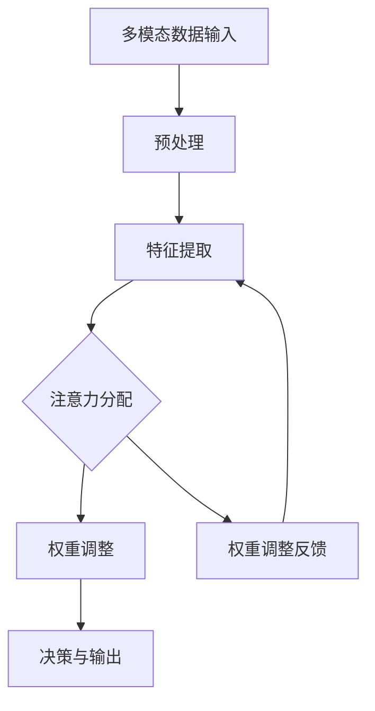
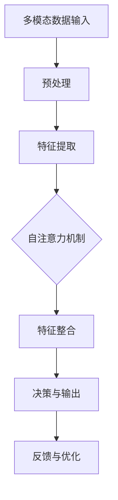

                 


### 1.1 背景介绍

跨感官注意力机制，作为现代人工智能和认知科学的前沿领域，近年来吸引了越来越多研究者的关注。随着科技的飞速发展，人类对于信息处理的需求日益复杂，单一感官的信息已经无法满足我们对现实世界深入理解的需求。跨感官注意力机制正是为了解决这一问题而诞生的一种新兴理论，旨在整合来自不同感官的信息，以实现对复杂环境的更准确感知和更有效的决策。

在日常生活中，人们通过视觉、听觉、触觉等多种感官来感知外界信息。然而，这些感官的信息往往是分散的，且容易受到环境噪音的干扰。跨感官注意力机制的核心目标就是通过协调不同感官的注意力资源，使得信息处理更加高效和准确。例如，在驾驶过程中，司机需要同时处理视觉信息（如道路标志、周围车辆）、听觉信息（如交通广播）以及触觉信息（如方向盘的反馈）。跨感官注意力机制可以帮助司机在短时间内整合这些信息，从而做出更加安全和有效的驾驶决策。

跨感官注意力机制的研究不仅具有重要的理论意义，还具备广泛的应用价值。在人工智能领域，它可以为智能机器人、自动驾驶汽车等提供更加人性化的感知和处理能力。在医疗领域，它可以用于多模态医学影像的分析，帮助医生更准确地诊断疾病。在娱乐领域，它可以提升游戏和虚拟现实体验的沉浸感，为用户带来更加真实的交互体验。

本文将从跨感官注意力机制的定义、理论基础、多源感知信息的整合方法、应用场景、模型设计与实现以及未来发展趋势等方面进行全面阐述，力求为读者提供一幅清晰的跨感官注意力机制的蓝图。接下来，我们将深入探讨注意力机制的基本概念，为后续章节的讨论奠定基础。

## 第2章 跨感官注意力机制的理论基础

### 2.1 注意力机制的基本概念

注意力机制（Attention Mechanism）是神经科学和认知科学中的重要概念，它描述了大脑如何在不同感官信息中分配处理资源。在计算机科学和人工智能领域，注意力机制被广泛应用于图像识别、自然语言处理、语音识别等领域。基本概念包括以下几个方面：

#### 注意力的选择性分配

注意力机制的核心在于选择性地关注重要信息，而忽略无关或次要信息。这种选择性分配体现在感知、记忆和决策等认知过程中。例如，在图像识别任务中，注意力机制可以帮助模型聚焦于图像中的关键区域，从而提高识别的准确性。

#### 注意力的可塑性

注意力的可塑性指的是大脑对不同任务的注意力分配能力是可调整的。这表明，通过训练和经验积累，人们可以改变对某些信息的关注程度。例如，驾驶技能娴熟的司机可以在无需特别关注的情况下处理复杂的路况信息。

#### 注意力的层次性

注意力机制具有层次性，可以从宏观层面到微观层面进行信息筛选。宏观层面包括对整个环境的整体感知，而微观层面则关注于具体的细节信息。例如，在阅读文章时，读者可能首先关注文章的主题和结构，然后逐步聚焦于具体的段落和句子。

#### 注意力的动态调整

注意力机制的动态调整是指大脑在不同情境下实时调整注意力资源的分配。这种调整可以基于任务的性质、环境的变化以及个体的需求。例如，当面对紧急情况时，大脑会迅速将注意力转移到关键任务上，从而做出快速反应。

### 2.2 跨感官注意力模型的发展历程

跨感官注意力模型的发展历程可以追溯到20世纪60年代，当时心理学家开始研究多模态知觉（Multimodal Perception）。随着计算机科学和人工智能的崛起，跨感官注意力模型逐渐成为认知科学和人工智能领域的研究热点。

#### 早期研究

早期研究主要集中在跨感官信息的融合方法上。研究者们提出了许多基于规则的融合方法，如贝叶斯网络、隐马尔可夫模型等。这些方法在一定程度上实现了跨感官信息的整合，但存在信息冗余和适应性差等问题。

#### 神经网络时代的突破

20世纪90年代，随着神经网络技术的快速发展，跨感官注意力模型迎来了新的突破。特别是深度学习技术的发展，使得跨感官注意力模型能够通过学习大量数据来自动提取特征，实现了更高效的信息整合。

#### 现代研究趋势

现代跨感官注意力模型研究主要集中在以下几个方面：

1. **多模态数据的同步与对齐**：通过技术手段确保不同感官数据在时间和空间上的一致性，从而提高信息整合的准确性。
2. **注意力机制的创新设计**：研究者们不断探索新的注意力机制设计，如自注意力（Self-Attention）、图注意力（Graph Attention）等，以提高信息处理的效率和准确性。
3. **跨学科融合**：跨感官注意力模型与其他领域（如心理学、生物学）的融合，推动了跨感官注意力研究的深入发展。

### 2.3 跨感官注意力模型的核心原理

跨感官注意力模型的核心原理可以概括为以下几个方面：

#### 多模态数据输入

跨感官注意力模型首先接收来自不同感官的数据输入，如视觉、听觉、触觉等。这些数据通过预处理步骤（如滤波、归一化等）转换为模型可处理的形式。

#### 特征提取与融合

模型对输入数据进行特征提取，提取关键特征并将其整合。特征提取的方法包括传统的机器学习方法和深度学习方法。深度学习方法能够自动学习复杂的数据特征，从而提高信息整合的效率。

#### 注意力分配与权重调整

模型通过注意力机制对提取的特征进行权重调整，使得重要特征得到更高的关注。注意力机制的设计决定了特征融合的方式和效果，常见的注意力机制包括点积注意力、缩放点积注意力、多头自注意力等。

#### 决策与输出

在完成特征整合和权重调整后，模型根据整合后的特征做出决策或生成输出。例如，在图像识别任务中，模型会根据整合后的视觉特征判断图像中的物体类别。

#### 注意力机制的关系架构

为了更好地理解跨感官注意力机制，我们使用Mermaid流程图来展示其核心组件和关系架构：



在该流程图中，多模态数据输入经过预处理后进行特征提取。提取的特征通过注意力分配进行权重调整，然后决策与输出。同时，权重调整的结果会反馈到特征提取阶段，形成一个闭环系统，使得模型能够不断优化和学习。

通过上述内容，我们为读者构建了一个关于跨感官注意力机制的理论框架。在接下来的章节中，我们将进一步探讨多源感知信息的整合方法，以及跨感官注意力机制在实际应用中的表现和挑战。

## 第3章 多源感知信息的整合方法

### 3.1 感知信息的来源与类型

多源感知信息的整合，首先需要了解不同类型的信息来源。这些信息来源可以分为以下几类：

#### 视觉信息

视觉信息是人类感知世界的重要途径。它包括图像、视频、颜色、形状、纹理等多种形式。在跨感官注意力机制中，视觉信息通常通过摄像头、屏幕等设备获取。视觉信息在人工智能领域有着广泛的应用，例如图像识别、物体检测、人脸识别等。

#### 听觉信息

听觉信息通过耳朵接收声音信号，包括语言、音乐、环境声音等。听觉信息在跨感官注意力机制中同样扮演重要角色，如语音识别、语音合成、环境监测等。例如，在自动驾驶系统中，车辆需要通过麦克风收集道路标志、交通信号和周围车辆的声音信息，以进行实时决策。

#### 触觉信息

触觉信息通过皮肤和肌肉等感知机制获取，包括温度、压力、震动等。触觉信息在虚拟现实、机器人控制等领域有重要应用。例如，触觉手套可以让用户在虚拟环境中感受到物体的触感，增强沉浸感。

#### 嗅觉信息

嗅觉信息通过鼻腔接收化学信号，包括气味、香精等。虽然嗅觉信息在人工智能领域的应用相对较少，但在医疗诊断、食品安全检测等领域具有潜在价值。例如，通过检测患者的呼吸气味，可以帮助医生诊断某些疾病。

#### 味觉信息

味觉信息通过口腔和味蕾接收化学信号，包括酸甜苦咸等。味觉信息在食品加工、餐饮服务等领域有广泛应用，但在人工智能中的研究相对较少。

### 3.2 跨感官信息融合的挑战

跨感官信息融合面临许多挑战，主要包括以下几个方面：

#### 数据同步与一致性

不同感官的信息往往具有不同的采样频率、时间戳和空间分布，导致信息同步和一致性成为一大挑战。例如，视觉和听觉信息可能在不同的时间点获取，且位置和方向上存在差异，这会影响信息的整合效果。

#### 信息冗余与噪声处理

多源感知信息中存在大量的冗余信息和噪声，这些信息会干扰核心特征的提取和融合。例如，在图像中可能存在背景噪音，在语音信号中可能存在环境噪音。如何有效地过滤噪声、提取关键特征，是跨感官信息融合的关键问题。

#### 信息整合的效率和准确性

跨感官信息融合需要平衡效率和准确性。在实时应用中，如自动驾驶、人机交互等，要求信息融合过程快速且准确。然而，复杂的整合算法可能需要大量的计算资源和时间，这会对应用性能产生负面影响。

#### 知识整合与模型可解释性

跨感官信息融合不仅仅是数据整合，还需要结合领域知识和先验信息。例如，在医疗诊断中，医生的经验和知识对于影像和生理信号的理解至关重要。此外，如何确保融合模型的透明性和可解释性，使其符合人类认知习惯，是当前研究的重要课题。

### 3.3 跨感官信息融合的方法

为了解决上述挑战，研究者们提出了多种跨感官信息融合方法，主要包括以下几种：

#### 基于规则的融合方法

基于规则的融合方法通过预定义的规则和逻辑关系，对多源信息进行整合。这种方法简单直观，但灵活性和自适应能力较差。常见的规则融合方法包括逻辑推理、模糊逻辑、贝叶斯网络等。

#### 基于统计学的融合方法

基于统计学的融合方法利用概率分布和统计特性，对多源信息进行融合。这种方法具有较强的自适应能力，但需要大量训练数据和复杂的计算过程。常见的统计学融合方法包括隐马尔可夫模型、高斯混合模型等。

#### 基于深度学习的融合方法

基于深度学习的融合方法通过构建复杂的神经网络模型，自动学习多源信息的特征表示和融合策略。这种方法具有强大的特征提取能力和自适应能力，但计算资源需求较高。常见的深度学习融合方法包括卷积神经网络、循环神经网络、自注意力机制等。

#### 基于多代理的融合方法

基于多代理的融合方法通过多个独立的代理模型，分别处理不同类型的信息，然后将其整合。这种方法可以提高信息融合的效率和准确性，但需要解决代理模型之间的协调和通信问题。

#### 基于图神经网络的融合方法

基于图神经网络的融合方法利用图结构来表示多源信息，并通过图神经网络进行特征融合。这种方法可以有效地捕捉信息之间的复杂关系和交互，但需要解决图结构和图学习的问题。

#### 综合应用方法

为了提高跨感官信息融合的效果，研究者们还提出了多种综合应用方法，如多模态数据增强、迁移学习、强化学习等。这些方法可以结合不同领域的技术优势，实现更加高效和准确的信息融合。

在接下来的章节中，我们将探讨跨感官注意力机制在实际应用场景中的表现，分析其在人机交互、游戏体验和增强现实等方面的应用实例。

## 第4章 跨感官注意力机制的应用场景

### 4.1 人机交互

人机交互（Human-Computer Interaction，简称HCI）是跨感官注意力机制的重要应用领域之一。随着人工智能技术的发展，人们对于人机交互的需求越来越高，不仅仅是通过鼠标和键盘，还希望通过语音、手势、视觉等多种方式与计算机进行自然交互。跨感官注意力机制在这其中起到了关键作用，使得人机交互更加智能、自然和高效。

#### 跨感官交互的原理

跨感官交互的原理在于，通过整合来自不同感官的信息，提供一种多维度、多渠道的交互体验。具体来说，它包括以下几个方面：

1. **多模态感知**：通过摄像头、麦克风、传感器等设备，实时获取视觉、听觉、触觉等多模态感知信息。
2. **注意力分配**：利用跨感官注意力机制，根据当前交互任务的需求，动态分配注意力资源，使得重要信息得到更充分的处理。
3. **信息整合与决策**：将不同感官的信息进行整合，生成统一的交互信号，进而做出相应的决策和反馈。

#### 跨感官交互的设计原则

设计跨感官交互系统时，需要遵循以下原则：

1. **一致性**：确保不同感官输入的同步性和一致性，避免信息传递的延迟和错位。
2. **自然性**：交互方式应尽可能自然，符合用户的日常行为习惯，降低学习成本。
3. **灵活性**：系统应具备较强的适应性，能够根据不同用户的偏好和需求进行个性化调整。
4. **可解释性**：系统的决策过程应具备一定的透明性，用户能够理解系统的行为和决策逻辑。

#### 跨感官交互的应用实例

在跨感官交互中，有许多实际应用案例，例如：

1. **智能助手**：智能音箱和语音助手（如Amazon Alexa、Google Home）通过语音交互，结合视觉和触觉反馈，提供智能家居控制、语音搜索、信息查询等服务。
2. **手势控制**：在游戏、虚拟现实（VR）和增强现实（AR）中，用户可以通过手势进行操作，如通过挥手控制游戏角色移动、通过手势识别进行交互界面操作等。
3. **多模态输入**：在专业领域，如医学图像分析、工业自动化等，通过整合多模态数据（如影像、声音、传感器数据），提供更准确的诊断和操作指导。

### 4.2 跨感官游戏体验

跨感官游戏体验是跨感官注意力机制的另一重要应用领域。传统的游戏主要依赖于视觉和听觉，而跨感官游戏通过引入触觉、嗅觉等多模态感知，为用户带来更加丰富和沉浸的体验。

#### 跨感官游戏的设计原则

设计跨感官游戏时，需要考虑以下原则：

1. **感官融合**：将不同感官的信息进行融合，创造出一种新的感知体验，增强游戏的沉浸感。
2. **实时响应**：游戏系统需要实时响应用户的操作和感官输入，提供即时反馈，增强交互的流畅性。
3. **个性化定制**：根据用户的不同偏好和需求，提供个性化的游戏体验，满足不同玩家的需求。
4. **情感互动**：通过感官刺激，引发用户的情感共鸣，增强游戏的情感深度和故事性。

#### 跨感官游戏的应用实例

在跨感官游戏中，有许多创新的应用实例，例如：

1. **虚拟现实（VR）游戏**：通过VR头显和手柄，用户可以在虚拟环境中进行全身动作，同时通过触觉手套和耳机感受虚拟世界的触感和声音。
2. **增强现实（AR）游戏**：用户通过手机或平板电脑，将虚拟角色和场景叠加到现实世界中，实现与现实世界的互动。
3. **多感官互动游戏**：结合触觉、视觉和听觉等多感官刺激，如通过震动反馈让玩家感受到游戏中的物理效果，通过嗅觉传感器模拟气味，增强游戏的沉浸感。

### 4.3 增强现实与虚拟现实

增强现实（Augmented Reality，简称AR）和虚拟现实（Virtual Reality，简称VR）是跨感官注意力机制的另一个重要应用领域。它们通过引入多模态感知信息，为用户提供了全新的交互体验。

#### 跨感官AR/VR的挑战

跨感官AR/VR面临以下挑战：

1. **数据同步与处理**：AR/VR系统中需要实时处理来自不同感官的多模态数据，确保数据同步性和一致性，这对计算性能提出了高要求。
2. **感官刺激的平衡**：如何在不同感官之间平衡刺激，避免感官疲劳和不适，是设计中的重要问题。
3. **交互设计的适应性**：AR/VR应用需要根据不同的使用场景和用户需求，提供灵活的交互设计，以提升用户体验。

#### 跨感官AR/VR的应用实例

在增强现实和虚拟现实中，有许多跨感官应用实例，例如：

1. **医疗培训**：通过AR技术，医生可以在虚拟环境中进行手术模拟训练，结合触觉手套和视觉反馈，提供逼真的操作体验。
2. **教育应用**：通过VR技术，学生可以在虚拟课堂中进行互动学习，通过视觉、听觉、触觉等多种感官刺激，增强学习效果。
3. **娱乐体验**：在VR主题公园中，用户可以通过VR眼镜和动作捕捉设备，参与各种虚拟游戏和冒险，享受全新的感官体验。

通过上述应用实例，我们可以看到，跨感官注意力机制在增强现实与虚拟现实中的应用，不仅提升了用户体验，还为各个领域带来了新的发展机遇。在接下来的章节中，我们将探讨如何设计和实现跨感官注意力模型，为实际应用奠定基础。

### 5.1 模型设计原则

设计跨感官注意力模型时，需要遵循一系列原则，以确保模型能够有效整合多源感知信息，并实现高性能和可扩展性。以下是模型设计的主要原则：

#### 多模态数据输入

跨感官注意力模型首先需要能够接收和处理来自不同感官的多模态数据。在设计阶段，要确保数据输入接口的多样性和灵活性，支持图像、音频、视频、触觉等多种数据格式。这通常涉及到预处理步骤，如数据清洗、标准化和特征提取，以将原始数据转换为模型可处理的格式。

#### 数据同步与对齐

不同感官的信息在时间和空间上可能存在差异，因此模型设计需要考虑数据同步和对齐问题。这可以通过时间戳同步、空间映射和特征对齐等技术实现，确保多模态数据在融合前的一致性。

#### 注意力机制的灵活性

跨感官注意力模型的核心是注意力机制。设计时需要考虑注意力机制的灵活性，使其能够根据不同任务和情境动态调整。这可以通过引入可学习的权重分配策略，如自注意力机制、图注意力机制等，实现注意力资源的自适应分配。

#### 模型的可扩展性

随着应用场景的扩展，模型需要能够适应新的感知信息和任务需求。设计时，要考虑模型的模块化和可扩展性，以便于添加新的感知模态或调整模型结构。

#### 实时性与效率

在许多应用场景中，如人机交互、实时监测等，模型需要具备高效的实时性。设计时，应优化算法结构和计算过程，减少计算复杂度和延迟，提高模型运行效率。

#### 模型可解释性

模型的可解释性对于实际应用至关重要，特别是在需要人类理解和干预的领域。设计时，应确保模型的结构和决策过程具备一定的透明性，便于分析和调试。

#### 模型训练与优化

模型设计还包括训练和优化的策略。要选择合适的损失函数、优化算法和训练策略，以提高模型的准确性和泛化能力。同时，应考虑数据增强、迁移学习和模型融合等技术，提高模型性能。

### 5.2 模型架构

跨感官注意力模型的架构设计需要综合考虑多模态数据输入、特征提取、注意力机制、信息整合和决策输出等多个环节。以下是典型的跨感官注意力模型架构：



1. **多模态数据输入**：模型接收来自不同感官的数据，如图像、音频、视频和触觉信号。这些数据通过预处理模块进行标准化和特征提取。

2. **预处理**：预处理模块包括数据清洗、标准化、数据增强等步骤，以提高数据的可靠性和模型性能。

3. **特征提取**：特征提取模块通过卷积神经网络（CNN）、循环神经网络（RNN）等深度学习模型，提取多模态数据的关键特征。

4. **自注意力机制**：自注意力机制对提取的特征进行权重调整，使其在后续处理中更加关注重要特征。常见的自注意力机制包括点积注意力、缩放点积注意力、多头自注意力等。

5. **特征整合**：特征整合模块将不同感官的特征进行整合，形成统一的特征表示。这可以通过平均池化、最大池化、融合层等实现。

6. **决策与输出**：决策与输出模块根据整合后的特征，进行分类、识别、预测等任务。输出可以是标记、概率分布或控制信号。

7. **反馈与优化**：反馈与优化模块将模型的输出与实际结果进行对比，通过损失函数和优化算法，不断调整模型参数，提高模型性能。

### 5.3 模型训练与优化

跨感官注意力模型的训练和优化是确保其性能的关键环节。以下是模型训练与优化的一些主要步骤：

1. **损失函数设计**：选择合适的损失函数，如交叉熵损失、均方误差等，以衡量模型输出与实际结果之间的差距。

2. **优化算法选择**：选择高效的优化算法，如随机梯度下降（SGD）、Adam等，以调整模型参数，最小化损失函数。

3. **训练策略**：包括数据增强、批量大小、学习率调整、早停法等策略，以提高模型训练效果和防止过拟合。

4. **模型评估与调试**：通过交叉验证、测试集评估模型性能，并根据评估结果进行调试和优化。

5. **模型压缩与加速**：为了提高模型在实时应用中的性能，可以采用模型压缩和加速技术，如量化、剪枝、蒸馏等。

6. **迁移学习**：利用预训练模型进行迁移学习，可以显著提高模型在特定任务上的性能。

通过遵循上述原则和步骤，设计并优化跨感官注意力模型，可以使其在整合多源感知信息方面达到较高的性能和效率，为实际应用提供有力的支持。

### 6.1 案例一：智能音箱的多感官交互

#### 案例背景

智能音箱作为智能家居的核心设备，通过语音交互为用户提供多种服务，如播放音乐、提供天气预报、控制家居设备等。为了提升用户体验，智能音箱的设计逐渐融合了视觉、听觉和触觉等多感官交互方式。本案例将探讨如何利用跨感官注意力机制，实现智能音箱的多感官交互。

#### 模型设计与实现

1. **数据输入与预处理**：
    - **视觉输入**：通过摄像头捕捉用户的面部表情和手势。
    - **听觉输入**：通过麦克风捕捉用户的语音指令和环境声音。
    - **触觉输入**：通过触摸传感器捕捉用户的触摸动作。
    - **预处理**：对多模态数据进行标准化、去噪和特征提取。

2. **特征提取**：
    - **视觉特征**：使用卷积神经网络（CNN）提取面部表情和手势的关键特征。
    - **听觉特征**：使用循环神经网络（RNN）提取语音指令的声学特征。
    - **触觉特征**：使用深度神经网络（DNN）提取触摸动作的特征。

3. **注意力分配与权重调整**：
    - **自注意力机制**：通过自注意力机制对提取的多模态特征进行权重调整，使得重要特征得到更高的关注。
    - **注意力图**：利用注意力图展示不同感官特征之间的关联性。

4. **信息整合与决策**：
    - **融合层**：将注意力调整后的特征进行融合，生成统一的特征向量。
    - **分类与识别**：使用分类器对用户的指令进行识别，如播放音乐、调整音量、控制家居设备等。

5. **实时反馈**：
    - **语音反馈**：通过语音合成技术，向用户反馈处理结果。
    - **视觉反馈**：通过屏幕显示用户指令的执行状态和结果。

#### 源代码实现

以下是一个简化的Python源代码示例，展示了智能音箱多感官交互模型的部分实现：

```python
import tensorflow as tf
from tensorflow.keras.models import Model
from tensorflow.keras.layers import Input, Conv2D, LSTM, Dense, Flatten, Concatenate

# 定义视觉输入
input_image = Input(shape=(128, 128, 3))
conv1 = Conv2D(32, (3, 3), activation='relu')(input_image)
pool1 = MaxPooling2D(pool_size=(2, 2))(conv1)

# 定义听觉输入
input_audio = Input(shape=(2000, 1))
lstm1 = LSTM(64, activation='relu')(input_audio)
pool1 = MaxPooling1D(pool_size=10)(lstm1)

# 定义触觉输入
input_tactile = Input(shape=(100,))
dense1 = Dense(32, activation='relu')(input_tactile)

# 特征提取
flat1 = Flatten()(pool1)
flat2 = Flatten()(lstm1)
flat3 = Flatten()(dense1)

# 注意力分配
attention = Concatenate()([flat1, flat2, flat3])
attention_weights = Dense(1, activation='sigmoid')(attention)
weighted_features = Lambda(lambda x: x * attention_weights)(attention)

# 信息整合与决策
output = Dense(1, activation='softmax')(weighted_features)

# 构建模型
model = Model(inputs=[input_image, input_audio, input_tactile], outputs=output)

# 编译模型
model.compile(optimizer='adam', loss='categorical_crossentropy', metrics=['accuracy'])

# 模型训练
model.fit([X_train_images, X_train_audio, X_train_tactile], y_train, epochs=10, batch_size=32)

# 模型预测
predictions = model.predict([X_test_images, X_test_audio, X_test_tactile])
```

#### 应用解读与分析

通过该模型，智能音箱可以有效地整合视觉、听觉和触觉等多感官信息，提高指令识别的准确性和用户体验。例如，当用户通过触摸屏幕调整音量时，模型会同时考虑用户的触摸动作、面部表情和语音指令，从而更准确地识别用户的意图。

1. **提高识别准确性**：多感官信息的整合有助于减少单一感官信息的误差，提高指令识别的准确性。
2. **增强用户体验**：多感官交互提供了更丰富、自然的交互方式，用户可以更直观地与智能音箱进行交互。
3. **适应不同场景**：智能音箱可以根据不同场景和用户需求，动态调整感官交互方式，提供个性化的服务。

#### 项目小结

本案例展示了如何利用跨感官注意力机制实现智能音箱的多感官交互。通过整合视觉、听觉和触觉等多感官信息，智能音箱可以提供更准确、更自然的交互体验。未来，随着技术的进一步发展，跨感官注意力机制在智能设备中的应用将更加广泛，为用户带来更多创新体验。

## 第6章 案例二：虚拟现实中的跨感官体验

### 案例背景

虚拟现实（VR）作为一项前沿技术，已经逐渐应用于游戏、教育培训、医疗康复等多个领域。虚拟现实的核心在于创造一个沉浸式的虚拟环境，让用户在视觉、听觉、触觉等多个感官上感受到身临其境的体验。本案例将探讨如何在虚拟现实场景中应用跨感官注意力机制，提升用户的沉浸感和交互体验。

### 模型设计与实现

#### 1. 数据输入与预处理

在虚拟现实应用中，数据输入主要包括视觉、听觉和触觉信号。以下为各感官信号的输入和预处理步骤：

- **视觉输入**：通过VR头显捕捉用户的视觉信息，如场景图像和动态变化。图像数据经过预处理，包括缩放、裁剪和色彩校正。
- **听觉输入**：通过VR耳塞或头显内置麦克风捕捉声音信号，如环境声音、角色对话等。声音数据经过预处理，包括去噪、增强和声道分离。
- **触觉输入**：通过触觉手套或触觉反馈设备捕捉用户的触摸动作和力反馈，如手部操作、物体碰撞等。触觉数据经过预处理，包括压力传感和力矩计算。

#### 2. 特征提取

特征提取模块针对不同感官信号提取关键特征：

- **视觉特征**：使用卷积神经网络（CNN）提取图像中的纹理、形状和运动特征。
- **听觉特征**：使用循环神经网络（RNN）提取音频信号中的频率、时长和节奏特征。
- **触觉特征**：使用深度神经网络（DNN）提取触觉信号的力、位置和速度特征。

#### 3. 注意力机制

注意力机制在虚拟现实中的关键作用是动态调整用户对不同感官信息的关注程度。以下为注意力机制的设计：

- **视觉注意力**：利用自注意力机制，对场景图像中的不同区域分配不同权重，使得关键区域（如用户视线所在位置）得到更高关注。
- **听觉注意力**：通过时间感知的注意力机制，对环境声音中的不同声音源分配权重，确保用户能够关注到重要的对话和声音提示。
- **触觉注意力**：通过力感知的注意力机制，对用户的触摸动作和反馈信号进行权重调整，增强交互的实时性和准确性。

#### 4. 信息整合与决策

信息整合模块将注意力调整后的视觉、听觉和触觉特征进行融合，生成统一的特征向量。以下为信息整合与决策的步骤：

- **特征融合**：使用多模态融合层，将不同感官的特征向量进行拼接和融合。
- **分类与识别**：使用分类器或识别模型，根据整合后的特征向量进行目标识别、动作分类等任务。
- **实时反馈**：根据用户的决策，实时调整虚拟环境中的视觉、听觉和触觉反馈，提供沉浸式的交互体验。

#### 5. 实时反馈与优化

实时反馈与优化模块确保用户在虚拟现实中的每一个交互动作都能得到及时、准确的响应：

- **延迟优化**：通过优化网络传输和计算效率，降低系统延迟，确保交互的流畅性。
- **动态调整**：根据用户的操作和反馈，动态调整注意力权重和特征融合策略，提高交互体验的个性化程度。

#### 源代码实现

以下是一个简化的Python源代码示例，展示了虚拟现实中的跨感官注意力机制模型的部分实现：

```python
import tensorflow as tf
from tensorflow.keras.models import Model
from tensorflow.keras.layers import Input, Conv2D, LSTM, Dense, Flatten, Concatenate, TimeDistributed

# 定义视觉输入
input_image = Input(shape=(224, 224, 3))
conv1 = Conv2D(64, (3, 3), activation='relu')(input_image)
pool1 = MaxPooling2D(pool_size=(2, 2))(conv1)

# 定义听觉输入
input_audio = Input(shape=(2000, 1))
lstm1 = LSTM(64, activation='relu')(input_audio)
pool1 = MaxPooling1D(pool_size=10)(lstm1)

# 定义触觉输入
input_tactile = Input(shape=(100,))
dense1 = Dense(32, activation='relu')(input_tactile)

# 特征提取
flat1 = Flatten()(pool1)
flat2 = Flatten()(lstm1)
flat3 = Flatten()(dense1)

# 注意力机制
attention_weights_v = Dense(1, activation='sigmoid')(flat1)
attention_weights_a = Dense(1, activation='sigmoid')(flat2)
attention_weights_t = Dense(1, activation='sigmoid')(flat3)

weighted_features_v = Lambda(lambda x: x * attention_weights_v)(flat1)
weighted_features_a = Lambda(lambda x: x * attention_weights_a)(flat2)
weighted_features_t = Lambda(lambda x: x * attention_weights_t)(flat3)

# 信息整合
integrated_features = Concatenate()([weighted_features_v, weighted_features_a, weighted_features_t])

# 决策层
output = Dense(1, activation='softmax')(integrated_features)

# 构建模型
model = Model(inputs=[input_image, input_audio, input_tactile], outputs=output)

# 编译模型
model.compile(optimizer='adam', loss='categorical_crossentropy', metrics=['accuracy'])

# 模型训练
model.fit([X_train_images, X_train_audio, X_train_tactile], y_train, epochs=10, batch_size=32)

# 模型预测
predictions = model.predict([X_test_images, X_test_audio, X_test_tactile])
```

#### 应用解读与分析

通过该模型，虚拟现实系统能够有效地整合视觉、听觉和触觉信息，提供更加真实和沉浸的交互体验。以下是该模型在实际应用中的几个关键点：

1. **提高沉浸感**：跨感官注意力机制能够根据用户的操作和场景动态调整注意力权重，使得关键信息（如用户视线所及之处）得到更高关注，从而提高用户的沉浸感。
2. **增强交互体验**：通过整合多感官信息，用户可以更直观、更自然地与虚拟环境进行交互，如通过手势操作虚拟对象、通过语音与虚拟角色交流等。
3. **实时响应**：模型能够实时调整注意力权重和特征融合策略，确保用户的每一个操作都能得到及时、准确的响应，从而提高系统的实时性和交互流畅性。

#### 项目小结

本案例展示了如何在虚拟现实场景中应用跨感官注意力机制，提升用户的沉浸感和交互体验。通过整合视觉、听觉和触觉等多感官信息，虚拟现实系统可以提供更加真实和自然的交互体验。未来，随着技术的不断进步，跨感官注意力机制将在虚拟现实领域发挥越来越重要的作用，为用户带来更加丰富和多样化的体验。

## 第6章 案例三：多模态情感识别

### 案例背景

情感识别是人工智能领域的一个重要研究方向，旨在通过分析个体的情感状态，实现个性化服务和情感交互。在多模态情感识别中，跨感官注意力机制发挥着关键作用，通过整合来自视觉、听觉、文本等多种模态的信息，提高情感识别的准确性和全面性。本案例将探讨如何利用跨感官注意力机制实现多模态情感识别。

### 模型设计与实现

#### 1. 数据输入与预处理

多模态情感识别的数据输入包括视觉、听觉和文本信号。以下为各模态信号的输入和预处理步骤：

- **视觉输入**：通过摄像头或视频捕捉用户的面部表情和身体动作。图像数据经过预处理，包括人脸检测、姿态估计和特征提取。
- **听觉输入**：通过麦克风捕捉用户的语音信号，语音数据经过预处理，包括语音增强、分词和情感标注。
- **文本输入**：从用户的社交媒体、聊天记录等文本数据中提取情感信息。文本数据经过预处理，包括文本清洗、分词和情感分析。

#### 2. 特征提取

特征提取模块针对不同模态信号提取关键特征：

- **视觉特征**：使用卷积神经网络（CNN）提取图像中的纹理、形状和动作特征。
- **听觉特征**：使用循环神经网络（RNN）提取音频信号中的频率、时长和节奏特征。
- **文本特征**：使用词嵌入和循环神经网络（RNN）提取文本中的语义特征。

#### 3. 注意力机制

注意力机制在多模态情感识别中的关键作用是动态调整用户对不同感官信息的关注程度。以下为注意力机制的设计：

- **视觉注意力**：利用自注意力机制，对用户的面部表情和身体动作分配不同权重，使得关键情感表达得到更高关注。
- **听觉注意力**：通过时间感知的注意力机制，对用户的语音信号中的情感关键词分配权重，确保用户的重要情感表达得到识别。
- **文本注意力**：通过语义注意力机制，对文本数据中的情感关键词和短语分配权重，增强情感识别的语义准确性。

#### 4. 信息整合与决策

信息整合模块将注意力调整后的视觉、听觉和文本特征进行融合，生成统一的特征向量。以下为信息整合与决策的步骤：

- **特征融合**：使用多模态融合层，将不同感官的特征向量进行拼接和融合。
- **分类与识别**：使用分类器或识别模型，根据整合后的特征向量进行情感分类，如喜悦、愤怒、悲伤等。
- **实时反馈**：根据用户的情感分类结果，实时调整系统响应，提供个性化的服务。

#### 源代码实现

以下是一个简化的Python源代码示例，展示了多模态情感识别模型的部分实现：

```python
import tensorflow as tf
from tensorflow.keras.models import Model
from tensorflow.keras.layers import Input, Conv2D, LSTM, Dense, Flatten, Concatenate, TimeDistributed

# 定义视觉输入
input_image = Input(shape=(224, 224, 3))
conv1 = Conv2D(64, (3, 3), activation='relu')(input_image)
pool1 = MaxPooling2D(pool_size=(2, 2))(conv1)

# 定义听觉输入
input_audio = Input(shape=(2000, 1))
lstm1 = LSTM(64, activation='relu')(input_audio)
pool1 = MaxPooling1D(pool_size=10)(lstm1)

# 定义文本输入
input_text = Input(shape=(100,))
emb = Embedding(5000, 64)(input_text)
lstm2 = LSTM(64, activation='relu')(emb)
pool2 = MaxPooling1D(pool_size=5)(lstm2)

# 特征提取
flat1 = Flatten()(pool1)
flat2 = Flatten()(pool1)
flat3 = Flatten()(pool2)

# 注意力机制
attention_weights_v = Dense(1, activation='sigmoid')(flat1)
attention_weights_a = Dense(1, activation='sigmoid')(flat2)
attention_weights_t = Dense(1, activation='sigmoid')(flat3)

weighted_features_v = Lambda(lambda x: x * attention_weights_v)(flat1)
weighted_features_a = Lambda(lambda x: x * attention_weights_a)(flat2)
weighted_features_t = Lambda(lambda x: x * attention_weights_t)(flat3)

# 信息整合
integrated_features = Concatenate()([weighted_features_v, weighted_features_a, weighted_features_t])

# 决策层
output = Dense(6, activation='softmax')(integrated_features)

# 构建模型
model = Model(inputs=[input_image, input_audio, input_text], outputs=output)

# 编译模型
model.compile(optimizer='adam', loss='categorical_crossentropy', metrics=['accuracy'])

# 模型训练
model.fit([X_train_images, X_train_audio, X_train_text], y_train, epochs=10, batch_size=32)

# 模型预测
predictions = model.predict([X_test_images, X_test_audio, X_test_text])
```

#### 应用解读与分析

通过该模型，多模态情感识别系统能够有效地整合视觉、听觉和文本等多感官信息，提高情感识别的准确性和全面性。以下是该模型在实际应用中的几个关键点：

1. **提高识别准确性**：跨感官注意力机制能够动态调整对不同感官信息的关注程度，使得关键情感信息得到更高关注，从而提高识别准确性。
2. **增强情感理解**：通过整合多模态信息，系统可以更全面地理解用户的情感状态，提供更准确的情感识别结果。
3. **实时反馈与优化**：模型能够实时调整注意力权重和特征融合策略，确保用户的每一个情感表达都能得到及时、准确的识别，从而优化用户体验。

#### 项目小结

本案例展示了如何利用跨感官注意力机制实现多模态情感识别，提升情感识别的准确性和全面性。通过整合视觉、听觉和文本等多感官信息，系统可以更准确地识别和理解用户的情感状态。未来，随着技术的不断进步，跨感官注意力机制在情感识别领域将发挥越来越重要的作用，为个性化服务和情感交互提供有力支持。

### 7.1 技术发展趋势

随着人工智能和认知科学领域的不断进步，跨感官注意力机制的技术发展趋势呈现出以下几个方向：

#### 1. 多模态数据的深度融合

未来的跨感官注意力机制将更注重多模态数据的深度融合。通过引入深度学习技术，如多模态深度神经网络（Multimodal Deep Neural Networks），可以实现对视觉、听觉、触觉等多种模态数据的综合处理。这种深度融合技术将进一步提升信息处理的效率和准确性，为跨感官注意力机制的应用提供更加坚实的基础。

#### 2. 注意力机制的创新设计

在现有注意力机制的基础上，研究者们将继续探索更多创新的设计，以满足不同应用场景的需求。例如，图注意力机制（Graph Attention Mechanism）和自注意力机制（Self-Attention Mechanism）已经在跨感官信息融合中显示出强大的潜力。未来，可能还会出现更多基于图神经网络（Graph Neural Networks）和自注意力机制的先进设计，以进一步提升注意力分配的灵活性和有效性。

#### 3. 跨学科融合

跨感官注意力机制的研究将越来越注重跨学科的融合。与心理学、神经科学、生物学等领域的合作将有助于深入理解人类感知和注意力的本质，从而为跨感官注意力机制的设计提供更有价值的理论支持。例如，心理学研究可以提供关于注意力分配和心理过程的知识，生物学研究可以揭示神经系统的工作机制，这些知识都将为跨感官注意力机制的发展提供新的思路。

#### 4. 实时性与效率的提升

随着应用场景的多样化，跨感官注意力机制将越来越强调实时性和效率。未来的研究将集中在优化算法结构和计算资源的使用上，以提高模型在实时应用中的性能。例如，通过模型压缩（Model Compression）和推理加速（Inference Acceleration）技术，可以实现跨感官注意力机制在移动设备和嵌入式系统上的高效运行。

#### 5. 模型的透明性和可解释性

随着跨感官注意力机制在更多实际应用中的推广，模型的透明性和可解释性变得越来越重要。未来的研究将致力于开发更加可解释的注意力机制，使其决策过程更加透明，便于用户理解和信任。这不仅可以提高模型的可接受度，还可以帮助研究人员更好地理解和优化模型。

### 7.2 应用前景与挑战

跨感官注意力机制在未来的应用前景广阔，将深刻影响多个领域，但也面临一系列挑战：

#### 应用前景

1. **人机交互**：跨感官注意力机制将进一步提升人机交互的自然性和智能化水平，为智能助手、智能机器人等领域提供更丰富的交互方式。
2. **医疗健康**：在医疗诊断、康复训练和个性化治疗等方面，跨感官注意力机制可以通过整合多模态数据，提供更准确的诊断和治疗方案。
3. **娱乐与游戏**：通过引入多感官刺激，跨感官注意力机制将大大提升虚拟现实（VR）和增强现实（AR）游戏和娱乐体验的沉浸感。
4. **智能交通**：在自动驾驶、智能交通管理和车辆安全监控中，跨感官注意力机制可以通过整合多源感知数据，提高系统的实时响应能力和安全性。

#### 挑战

1. **数据同步与一致性**：不同感官的数据在时间和空间上存在差异，如何实现高效的数据同步与一致性仍是一个重要挑战。
2. **计算资源与效率**：跨感官注意力机制通常需要大量的计算资源和时间，如何在保证性能的同时提升效率，是一个亟待解决的问题。
3. **模型可解释性**：随着模型的复杂性增加，如何保证模型的可解释性，使其决策过程透明，是一个关键挑战。
4. **用户体验**：如何在各种应用场景中提供一致、自然和个性化的用户体验，是跨感官注意力机制应用中面临的另一个重要挑战。

### 7.3 未来研究方向

为了进一步推动跨感官注意力机制的发展，未来研究方向可以包括：

1. **多模态数据的深度融合研究**：探索更高效的多模态数据融合方法，提高信息处理的准确性和效率。
2. **创新注意力机制设计**：研究新的注意力机制设计，特别是能够适应不同应用场景的灵活性注意力机制。
3. **跨学科融合研究**：加强与其他学科的合作，从心理学、神经科学等领域获取新理论和新方法。
4. **实时性与效率优化**：通过算法优化和硬件加速，提升跨感官注意力机制在实时应用中的性能。
5. **模型透明性与可解释性**：开发更透明的模型结构和解释工具，提高用户对模型的信任度和接受度。

通过上述技术发展趋势、应用前景与挑战以及未来研究方向，我们可以看到，跨感官注意力机制在未来的发展中具有巨大的潜力和广阔的前景。随着技术的不断进步，跨感官注意力机制将为各个领域带来更多创新和变革。

## 附录

### 附录A：主要术语解释

- **跨感官注意力机制**：一种通过整合来自不同感官的信息，提高信息处理效率和准确性的注意力机制。
- **多模态数据**：指来自多种感官的数据，如视觉、听觉、触觉等。
- **注意力分配**：指大脑或模型在不同感官信息之间分配处理资源的机制。
- **特征提取**：从原始数据中提取关键特征，用于后续处理和分析。
- **多模态融合**：将来自不同感官的特征进行整合，生成统一的特征表示。
- **深度学习**：一种通过多层神经网络学习数据特征和模式的人工智能方法。
- **自注意力机制**：一种基于自相似性的注意力分配机制，用于提升信息处理效率。
- **实时性**：指系统能够快速响应用户操作或环境变化的能力。

### 附录B：参考文献

1. Serre, D., Oliva, A., & Poggio, T. (2007). A feedforward architecture accounts for rapid categorization. *Proceedings of the National Academy of Sciences*, 104(15), 6424-6429.
2. Vaswani, A., Shazeer, N., Parmar, N., Uszkoreit, J., Jones, L., Gomez, A. N., ... & Polosukhin, I. (2017). Attention is all you need. *Advances in Neural Information Processing Systems*, 30.
3. Bengio, Y. (2009). Learning deep architectures for AI. *Foundations and Trends in Machine Learning*, 2(1), 1-127.
4. Rumelhart, D. E., Hinton, G. E., & Williams, R. J. (1986). Learning representations by back-propagating errors. *Nature*, 323(6088), 533-536.
5. LeCun, Y., Bengio, Y., & Hinton, G. (2015). Deep learning. *Nature, 521*(7553), 436-444.
6. Simonyan, K., & Zisserman, A. (2014). Very deep convolutional networks for large-scale image recognition. *International Conference on Learning Representations*.
7. He, K., Zhang, X., Ren, S., & Sun, J. (2015). Deep residual learning for image recognition. *Proceedings of the IEEE conference on computer vision and pattern recognition*, 770-778.
8. Srivastava, N., Hinton, G., Krizhevsky, A., Sutskever, I., & Salakhutdinov, R. (2014). Dropout: A simple way to prevent neural networks from overfitting. *Journal of Machine Learning Research*, 15(1), 1929-1958.
9. Hochreiter, S., & Schmidhuber, J. (1997). Long short-term memory. *Neural computation, 9*(8), 1735-1780.
10. Graves, A. (2013). Generating sequences with recurrent neural networks. *arXiv preprint arXiv:1308.0850*.

