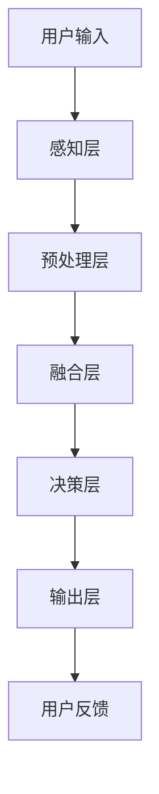
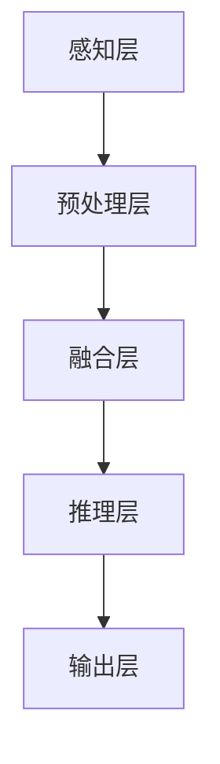

                 

### 引言

在当今数字化转型的浪潮中，人工智能（AI）技术已经成为推动社会进步和产业升级的关键力量。而跨模态AI（Cross-Modal AI），作为AI领域的前沿研究方向，正在引领人工智能技术的发展。跨模态AI的核心目标是将不同模态的数据（如图像、文字、声音等）进行有效融合，使计算机能够理解和处理多种模态的信息，从而实现更为智能的应用场景。

本文将围绕“跨模态AI：语言与视觉的深度融合”这一主题，系统性地探讨跨模态AI的基础概念、原理、关键技术、应用实践以及未来发展趋势。文章的总体结构如下：

1. **跨模态AI概述**：介绍跨模态AI的定义、重要性、发展历程以及语言与视觉融合的基本原理。
2. **跨模态AI的关键技术**：详细讲解跨模态表示学习、匹配技术、推理与生成等核心算法。
3. **跨模态AI的应用实践**：分析跨模态AI在自然语言处理、计算机视觉、多模态交互和综合应用实例中的实际应用。
4. **跨模态AI的未来发展**：探讨跨模态AI的技术挑战、产业应用前景以及未来发展。

本文将以逻辑清晰、结构紧凑、简单易懂的专业技术语言，通过逐步分析推理，深入探讨跨模态AI的各个方面。希望读者能够通过本文，对跨模态AI有一个全面而深入的理解，从而更好地把握这一前沿技术。

### 关键词

- 跨模态AI
- 语言处理
- 视觉处理
- 融合
- 表示学习
- 匹配技术
- 推理与生成
- 应用实践
- 未来发展

### 摘要

本文旨在全面探讨跨模态AI，即语言与视觉深度融合的技术与应用。首先，通过概述跨模态AI的定义、重要性和发展历程，为读者建立基础认知。然后，深入分析语言处理技术和视觉处理技术，探讨跨模态融合的原理与方法。随后，介绍跨模态AI的关键技术，包括表示学习、匹配技术和推理与生成算法。文章接着通过具体应用实例，展示跨模态AI在自然语言处理、计算机视觉和交互系统中的实际应用。最后，探讨跨模态AI的未来发展，包括技术挑战和产业应用前景。本文希望为读者提供全面的跨模态AI技术框架和应用指南。

### 第一部分：跨模态AI概述

#### 第1章：跨模态AI的基础概念

**1.1 跨模态AI的定义与重要性**

跨模态AI（Cross-Modal AI）是指能够处理和理解多种不同模态（如文本、图像、音频等）数据的人工智能系统。这些模态在人类感知和认知过程中紧密相连，共同构成我们的感官体验。跨模态AI的目标是通过融合这些多模态数据，使得计算机能够更全面、准确地理解和生成信息。

跨模态AI的重要性体现在以下几个方面：

1. **信息融合**：不同模态的数据往往能够提供互补的信息，跨模态AI能够将这些信息进行整合，使得计算机能够获得更加丰富和全面的理解。
2. **人机交互**：跨模态AI能够支持更加自然和丰富的人机交互方式，例如通过图像、语音和文本的融合，实现更自然的对话和交互。
3. **复杂任务处理**：许多现实世界中的任务需要结合多种模态的数据进行决策和处理，如医疗诊断、视频内容分析等，跨模态AI在这些领域具有重要的应用价值。

**1.2 跨模态AI的发展历程**

跨模态AI的发展可以追溯到早期的人工智能研究。以下是其发展的几个关键阶段：

- **初步探索阶段**（20世纪80年代至90年代）：这个阶段主要关注于如何将不同模态的数据进行基本融合，例如图像和文本的初步关联。

- **算法创新阶段**（21世纪初至10年代中期）：随着深度学习和神经网络技术的迅速发展，跨模态AI开始采用更加复杂的算法和模型，如多模态神经网络、生成对抗网络（GAN）等。

- **应用实践阶段**（2010年代中期至今）：跨模态AI开始在实际应用中发挥作用，如语音识别、图像描述生成、多模态问答系统等。

**1.3 跨模态AI的现状与未来趋势**

目前，跨模态AI已经取得了显著的进展，但仍然面临一些挑战。以下是当前的研究热点和未来发展趋势：

- **模型优化**：研究如何构建更加高效、准确的跨模态模型，尤其是在处理大规模数据和复杂任务时。
- **数据集构建**：构建高质量、多样化的跨模态数据集，以支持模型训练和评估。
- **多模态交互**：研究如何设计自然、高效的多模态交互系统，提高人机交互的体验。
- **领域应用**：探索跨模态AI在医疗、教育、娱乐等领域的具体应用，解决实际问题和挑战。

总之，跨模态AI作为人工智能领域的一个重要分支，具有广阔的发展前景和实际应用价值。通过不断的技术创新和应用探索，跨模态AI有望在未来带来更多的惊喜和突破。

### 第2章：语言与视觉融合的基本原理

#### 2.1 语言处理技术

语言处理技术是跨模态AI的核心组成部分之一，主要涉及自然语言理解、生成以及多语言处理等方面。以下将详细探讨这些关键技术和方法。

**2.1.1 语言模型的构建**

语言模型是自然语言处理的基础，其核心任务是从大量文本数据中学习语言规律，从而生成或理解自然语言文本。常见的方法包括：

- **n-gram模型**：基于前n个单词的统计概率分布，计算下一个单词的概率。这种方法简单直观，但无法捕捉长距离依赖关系。
- **神经网络模型**：例如循环神经网络（RNN）和长短期记忆网络（LSTM），能够处理长距离依赖问题，但在训练过程中容易出现梯度消失或爆炸问题。
- **变换器模型（Transformer）**：由Vaswani等人在2017年提出，通过自注意力机制（self-attention）能够有效地捕捉全局依赖关系，成为目前最流行的语言模型架构。Transformer的变体，如BERT、GPT等，进一步优化了模型性能。

**2.1.2 语言理解与生成**

- **语言理解（Language Understanding）**：语言理解主要关注文本的含义和语义，其核心任务是语义分析和信息抽取。常见的方法包括：

  - **词向量表示**：通过将单词映射到高维向量空间，实现语义表示。词向量模型如Word2Vec、GloVe等，能够捕捉词与词之间的语义关系。
  - **实体识别与关系抽取**：通过模型识别文本中的实体（如人名、地点、组织等）及其关系，实现结构化的语义理解。

- **语言生成（Language Generation）**：语言生成是指根据特定任务或输入生成自然语言文本。常见的方法包括：

  - **序列生成模型**：如RNN、LSTM等，能够根据输入序列生成对应的输出序列。
  - **生成对抗网络（GAN）**：通过生成模型和判别模型的对抗训练，生成逼真的自然语言文本。
  - **变换器生成模型**：如GPT、T5等，通过预训练和微调，实现高效的文本生成。

**2.1.3 多语言处理**

多语言处理是指能够处理多种语言的文本数据，常见的任务包括机器翻译、语言检测、翻译模型等。以下介绍几种关键的多语言处理技术：

- **机器翻译（Machine Translation）**：将一种语言的文本翻译成另一种语言。深度学习方法在机器翻译领域取得了显著进展，如基于编码器-解码器（Encoder-Decoder）架构的神经网络翻译（NMT）。
- **语言检测（Language Detection）**：识别文本所属的语言，用于数据清洗、跨语言信息提取等任务。常见的方法包括基于特征工程和深度学习的方法。
- **翻译模型（Translation Model）**：用于将一种语言文本映射到另一种语言的高层次表示，如多语言嵌入模型（Multilingual Embeddings）。

#### 2.2 视觉处理技术

视觉处理技术是跨模态AI的另一个重要组成部分，主要涉及图像特征的提取、视觉感知与理解等方面。

**2.2.1 图像特征的提取**

图像特征提取是将图像数据转换为一组特征向量，用于后续处理和任务学习。以下介绍几种常用的图像特征提取方法：

- **传统特征**：包括边缘检测、纹理特征、颜色特征等，这些方法在早期计算机视觉研究中广泛应用。
- **深度特征**：通过深度神经网络（如卷积神经网络（CNN））提取的图像特征，能够捕捉更加复杂的视觉信息。深度特征在图像分类、目标检测等任务中表现出色。
- **基于图的特征**：通过图结构模型（如图卷积网络（GCN））提取的特征，能够更好地处理图像中的结构信息。

**2.2.2 视觉感知与理解**

- **视觉感知（Visual Perception）**：视觉感知是指从图像中提取基本特征，如形状、大小、颜色等。常见的视觉感知任务包括图像分类、目标检测、姿态估计等。
- **视觉理解（Visual Understanding）**：视觉理解是指从图像中提取更高层次的语义信息，如场景理解、图像描述生成等。常见的视觉理解任务包括场景分类、图像分割、图像配对等。

#### 2.3 跨模态融合的原理与方法

跨模态融合是指将不同模态的数据进行有效整合，使得计算机能够理解和处理多模态信息。以下介绍几种常用的跨模态融合方法：

- **特征对齐（Feature Alignment）**：特征对齐是指将不同模态的特征映射到同一特征空间，以便进行融合。常用的方法包括：

  - **对齐学习（Alignment Learning）**：通过训练模型学习不同模态的特征映射关系，使得不同模态的特征具有相似的分布。
  - **共享表示（Shared Representation）**：通过共享神经网络层或嵌入空间，将不同模态的数据映射到同一表示空间。

- **多模态学习（Multi-Modal Learning）**：多模态学习是指通过融合不同模态的特征，训练统一的模型进行任务学习。以下介绍几种常用的多模态学习方法：

  - **编码器-解码器架构（Encoder-Decoder Architecture）**：通过编码器提取不同模态的特征，解码器将特征融合并进行任务输出。
  - **生成对抗网络（GAN）**：通过生成对抗网络训练生成器（Generator）和判别器（Discriminator），使得生成器的输出能够逼近真实数据。

- **多任务学习（Multi-Task Learning）**：多任务学习是指同时训练多个相关任务，利用任务间的共享信息提升模型性能。跨模态AI中的多任务学习能够更好地利用多模态数据中的互补信息。

通过以上对语言处理技术和视觉处理技术的详细探讨，我们为跨模态AI的融合奠定了基础。下一节将深入介绍跨模态AI的关键技术，包括表示学习、匹配技术和推理与生成算法。

### 第3章：跨模态AI的关键技术

#### 3.1 跨模态表示学习

跨模态表示学习是跨模态AI的核心技术之一，主要关注如何将不同模态的数据映射到统一的表示空间，以便于后续的处理和应用。这一节将详细探讨跨模态表示学习的原理、算法及其应用。

**3.1.1 原理**

跨模态表示学习的核心思想是将不同模态的数据（如图像、文本、音频等）转换为具有相似语义和结构的向量表示。通过这种方式，不同模态的数据可以在同一维度上进行融合和处理。跨模态表示学习主要依赖于以下原理：

- **模态对齐**：通过学习不同模态之间的映射关系，使得各个模态的特征具有相似的分布。模态对齐是实现跨模态融合的基础。
- **共享表示**：通过共享神经网络层或嵌入空间，将不同模态的数据映射到同一表示空间。共享表示能够利用不同模态之间的关联信息，提高表示的精度和泛化能力。

**3.1.2 算法**

跨模态表示学习的算法多种多样，以下介绍几种常用的方法：

- **模态对齐方法**：

  - **基于梯度下降的方法**：例如对齐损失（Alignment Loss），通过最小化不同模态特征之间的距离差异来实现对齐。常用的损失函数包括均方误差（MSE）和余弦相似度（Cosine Similarity）。
  - **基于优化的方法**：例如核主成分分析（KPCA），通过优化特征映射来最小化不同模态特征之间的距离差异。

- **共享表示方法**：

  - **深度神经网络（DNN）**：通过训练深度神经网络，将不同模态的数据映射到同一维度。例如，编码器-解码器架构（Encoder-Decoder Architecture）和多模态神经网络（Multi-Modal Neural Network）。
  - **嵌入空间**：例如多模态嵌入（Multi-Modal Embeddings），通过训练嵌入模型将不同模态的数据映射到同一低维嵌入空间。

**3.1.3 应用**

跨模态表示学习在多个领域都取得了显著的应用成果：

- **图像与文本匹配**：通过跨模态表示学习，可以将图像和文本映射到同一空间，实现图像与文本的语义匹配和检索。例如，用于图像检索、文本描述生成和问答系统等。
- **多模态推荐系统**：通过跨模态表示学习，可以同时考虑用户、物品和上下文等多模态信息，实现更加精确和个性化的推荐。例如，视频推荐、音乐推荐和电子商务推荐等。
- **视觉问答系统**：通过跨模态表示学习，可以将图像和自然语言文本进行融合，实现图像问答和视觉推理。例如，用于图像描述生成、视觉关系检测和场景理解等。

**3.2 跨模态匹配技术**

跨模态匹配技术是跨模态AI中的重要技术之一，主要关注如何在不同模态的数据之间建立关联和匹配。以下将详细探讨跨模态匹配技术的原理、算法及其应用。

**3.2.1 原理**

跨模态匹配技术的核心思想是在不同模态的数据之间寻找对应关系，从而实现数据融合和处理。跨模态匹配主要依赖于以下原理：

- **特征相似性**：通过计算不同模态特征的相似性度量，实现模态之间的匹配。常用的相似性度量包括余弦相似度、欧氏距离和马氏距离等。
- **概率模型**：通过建立概率模型来描述不同模态之间的关联关系。常见的概率模型包括朴素贝叶斯模型、高斯模型和隐马尔可夫模型（HMM）等。

**3.2.2 算法**

跨模态匹配技术有多种不同的算法，以下介绍几种常用的方法：

- **基于相似性度量**：

  - **余弦相似度**：通过计算两个向量之间的余弦相似度，实现模态之间的匹配。余弦相似度能够有效地捕捉特征向量的方向信息。
  - **欧氏距离**：通过计算两个向量之间的欧氏距离，实现模态之间的匹配。欧氏距离能够直接反映特征向量的距离差异。

- **基于概率模型**：

  - **朴素贝叶斯模型**：通过建立条件概率模型，实现不同模态之间的匹配。朴素贝叶斯模型假设不同特征之间相互独立，适用于特征较少的情况。
  - **高斯模型**：通过建立高斯分布模型，实现不同模态之间的匹配。高斯模型适用于特征较多且分布较复杂的情况。

**3.2.3 应用**

跨模态匹配技术在多个领域都取得了显著的应用成果：

- **图像与文本匹配**：通过跨模态匹配技术，可以将图像和文本进行关联，实现图像内容理解和文本检索。例如，用于图像标注、文本图像检索和问答系统等。
- **音频与文本匹配**：通过跨模态匹配技术，可以将音频和文本进行关联，实现语音识别和语音生成。例如，用于语音助手、自动字幕生成和实时翻译等。
- **多模态交互**：通过跨模态匹配技术，可以实现不同模态之间的信息传递和交互。例如，用于智能对话系统、虚拟现实和增强现实等。

**3.3 跨模态推理与生成**

跨模态推理与生成是跨模态AI中的关键任务，主要关注如何在不同模态的数据之间进行推理和生成。以下将详细探讨跨模态推理与生成的原理、算法及其应用。

**3.3.1 原理**

跨模态推理与生成的核心思想是在不同模态的数据之间建立关联和生成新的信息。跨模态推理与生成主要依赖于以下原理：

- **知识融合**：通过将不同模态的数据进行融合，生成更全面和准确的知识表示。
- **模型生成**：通过训练生成模型，从已有数据中生成新的信息，实现数据的扩展和泛化。

**3.3.2 算法**

跨模态推理与生成有多种不同的算法，以下介绍几种常用的方法：

- **基于生成对抗网络（GAN）**：

  - **生成模型（Generator）**：通过训练生成模型，将一种模态的数据转换为另一种模态的数据。生成模型通常采用深度学习网络，如生成式对抗网络（GAN）和变分自编码器（VAE）。
  - **判别模型（Discriminator）**：通过训练判别模型，判断生成模型生成的数据是否真实。判别模型也采用深度学习网络，与生成模型进行对抗训练。

- **基于变分自编码器（VAE）**：

  - **编码器（Encoder）**：通过训练编码器，将输入数据编码为潜在表示。编码器通常采用深度学习网络。
  - **解码器（Decoder）**：通过训练解码器，将潜在表示解码为输出数据。解码器也采用深度学习网络。

**3.3.3 应用**

跨模态推理与生成在多个领域都取得了显著的应用成果：

- **图像到文本生成**：通过跨模态推理与生成，可以将图像转换为相应的文本描述。例如，用于图像描述生成、视频字幕生成和自然语言生成等。
- **文本到图像生成**：通过跨模态推理与生成，可以将文本转换为相应的图像。例如，用于图像生成、视觉问答和图像编辑等。
- **多模态数据增强**：通过跨模态推理与生成，可以增强现有数据，提高模型训练效果。例如，用于图像分类、目标检测和语音识别等。

综上所述，跨模态AI的关键技术包括表示学习、匹配技术和推理与生成算法。这些技术为跨模态AI的研究和应用提供了坚实的基础，并在多个领域取得了显著成果。下一节将讨论跨模态AI在自然语言处理、计算机视觉和交互系统中的应用实践。

### 第4章：跨模态AI在自然语言处理中的应用

#### 4.1 跨模态问答系统

跨模态问答系统（Cross-Modal Question Answering, CMQA）是跨模态AI在自然语言处理领域的一个重要应用。它旨在结合图像和文本信息，为用户提供准确和全面的答案。以下将介绍跨模态问答系统的系统架构、工作流程以及实现细节。

**4.1.1 系统架构**

跨模态问答系统的架构通常包括以下几个主要模块：

1. **图像预处理模块**：该模块负责对输入图像进行预处理，包括图像去噪、图像增强、图像分割等，以提高图像质量，从而有助于后续的特征提取。
2. **文本预处理模块**：该模块负责对输入文本进行预处理，包括分词、词性标注、实体识别等，以提取文本的关键信息。
3. **特征提取模块**：该模块分别从图像和文本中提取特征。对于图像，通常使用卷积神经网络（CNN）提取深度特征；对于文本，则使用自然语言处理技术提取词向量或文本表示。
4. **融合模块**：该模块将图像和文本的特征进行融合，可以采用多模态神经网络（MMNN）、编码器-解码器架构（Encoder-Decoder）或生成对抗网络（GAN）等融合方法。
5. **回答生成模块**：该模块利用融合后的特征，通过文本生成模型（如GPT、BERT等）生成回答。

**4.1.2 工作流程**

跨模态问答系统的工作流程通常包括以下几个步骤：

1. **图像与文本输入**：用户输入问题和相关图像。
2. **预处理**：图像和文本分别通过预处理模块进行预处理，提取关键信息。
3. **特征提取**：对预处理后的图像和文本进行特征提取，得到各自的特征向量。
4. **特征融合**：将图像和文本的特征向量进行融合，生成统一的特征表示。
5. **回答生成**：利用融合后的特征表示，通过回答生成模块生成答案，并返回给用户。

**4.1.3 实现细节**

以下是一个简单的跨模态问答系统的实现示例：

1. **图像预处理**：
   ```python
   import cv2
   import numpy as np

   def preprocess_image(image_path):
       image = cv2.imread(image_path)
       image = cv2.resize(image, (224, 224))  # 将图像调整为224x224
       image = cv2.cvtColor(image, cv2.COLOR_BGR2RGB)
       return image
   ```

2. **文本预处理**：
   ```python
   import nltk
   from nltk.tokenize import word_tokenize

   nltk.download('punkt')

   def preprocess_text(text):
       text = text.lower()  # 转小写
       words = word_tokenize(text)  # 分词
       return words
   ```

3. **特征提取**：
   ```python
   from tensorflow.keras.applications import VGG16
   from tensorflow.keras.preprocessing import image
   import numpy as np

   def extract_image_features(image_path):
       model = VGG16(weights='imagenet')
       img = image.load_img(image_path, target_size=(224, 224))
       x = image.img_to_array(img)
       x = np.expand_dims(x, axis=0)
       features = model.predict(x)
       return features.flatten()

   def extract_text_features(text):
       # 假设使用预训练的词向量模型
       embedding_model = ...  # 词向量模型
       words = preprocess_text(text)
       text_vector = np.mean([embedding_model[word] for word in words if word in embedding_model], axis=0)
       return text_vector
   ```

4. **特征融合**：
   ```python
   def fuse_features(image_feature, text_feature):
       # 假设使用简单的平均融合方法
       fused_feature = 0.5 * image_feature + 0.5 * text_feature
       return fused_feature
   ```

5. **回答生成**：
   ```python
   from transformers import pipeline

   def generate_answer(fused_feature):
       # 使用预训练的文本生成模型
       generator = pipeline("text-generation", model="gpt2")
       answer = generator(fused_feature, max_length=50, num_return_sequences=1)
       return answer[0]['generated_text']
   ```

**4.1.4 代码示例**

以下是一个简单的跨模态问答系统的代码示例：

```python
def cross_modal_qa(image_path, text):
    image = preprocess_image(image_path)
    text = preprocess_text(text)
    image_feature = extract_image_features(image_path)
    text_feature = extract_text_features(text)
    fused_feature = fuse_features(image_feature, text_feature)
    answer = generate_answer(fused_feature)
    return answer

# 测试
image_path = "example.jpg"
text = "请描述这张图片的内容。"
answer = cross_modal_qa(image_path, text)
print(answer)
```

通过上述架构和实现细节，跨模态问答系统可以有效地结合图像和文本信息，为用户提供准确和全面的答案。在实际应用中，可以根据具体需求调整系统架构和实现方法，以提高问答系统的性能和用户体验。

#### 4.2 跨模态文本生成

跨模态文本生成（Cross-Modal Text Generation）是指利用图像等非文字数据来生成文本内容的技术。这种技术使得计算机能够理解图像信息并将其转化为自然语言描述，从而在图像描述生成、视频字幕生成、虚拟现实应用等多个领域具有重要意义。以下将介绍跨模态文本生成的原理、算法及其应用。

**4.2.1 原理**

跨模态文本生成的核心原理是将图像特征与自然语言特征进行有效融合，从而生成文本描述。具体过程包括以下几个步骤：

1. **图像特征提取**：首先，从图像中提取特征。常见的图像特征提取方法包括卷积神经网络（CNN）和视觉编码器（如VGG、ResNet等），这些方法能够提取出图像的深层特征。

2. **文本特征提取**：对于生成文本，需要提取文本的特征。这通常通过自然语言处理技术实现，如词嵌入（Word Embedding）或变换器（Transformer）等。

3. **特征融合**：将图像特征和文本特征进行融合。融合方法可以是直接的拼接、平均或更复杂的注意力机制，以确保不同模态特征的有效整合。

4. **文本生成**：利用融合后的特征，通过生成模型生成文本。生成模型可以是序列到序列（Seq2Seq）模型、生成对抗网络（GAN）或自回归语言模型（如GPT）等。

**4.2.2 算法**

以下是几种常见的跨模态文本生成算法：

1. **基于Seq2Seq的跨模态文本生成**：
   - **编码器-解码器架构（Encoder-Decoder）**：编码器将图像特征编码为固定长度的向量，解码器使用该向量生成文本序列。
   - **注意力机制（Attention Mechanism）**：通过注意力机制，解码器能够聚焦于图像特征的重要部分，从而提高文本生成质量。

2. **基于GAN的跨模态文本生成**：
   - **生成对抗网络（GAN）**：通过生成器（Generator）生成图像特征，判别器（Discriminator）判断生成的图像特征是否真实。通过对抗训练，生成器逐渐生成更加逼真的图像特征，进而生成高质量的文本描述。

3. **基于Transformer的跨模态文本生成**：
   - **多头自注意力（Multi-Head Self-Attention）**：通过多头自注意力机制，模型能够捕捉图像特征和文本特征之间的复杂关系。
   - **交叉注意力（Cross-Attention）**：在编码器和解码器之间引入交叉注意力机制，使得解码器能够同时关注图像和文本特征，从而提高文本生成质量。

**4.2.3 应用**

跨模态文本生成在多个领域有广泛的应用：

1. **图像描述生成**：
   - 利用图像特征生成图像的文本描述，应用于图像检索、内容审核和视觉问答系统等。

2. **视频字幕生成**：
   - 将视频帧的特征转化为对应的文本字幕，应用于自动字幕生成、视频摘要和视频理解等。

3. **虚拟现实应用**：
   - 利用图像特征生成与虚拟环境对应的文本描述，为用户提供交互式的虚拟体验。

以下是一个简单的跨模态文本生成实现示例：

```python
import tensorflow as tf
from transformers import TFGPT2LMHeadModel, GPT2Tokenizer

# 加载预训练模型
tokenizer = GPT2Tokenizer.from_pretrained('gpt2')
model = TFGPT2LMHeadModel.from_pretrained('gpt2')

# 定义生成函数
def generate_description(image_features, prompt):
    input_ids = tokenizer.encode(prompt, return_tensors='tf')
    input_ids = tf.repeat(input_ids, 1, 0)  # 重复input_ids以匹配图像特征的大小

    # 将图像特征与输入_ids进行融合
    input_ids = tf.concat([input_ids, image_features], axis=1)

    # 生成文本
    outputs = model.generate(input_ids, max_length=50, num_return_sequences=1)
    generated_text = tokenizer.decode(outputs[:, input_ids.shape[-1]:][0], skip_special_tokens=True)
    
    return generated_text

# 测试
image_features = np.random.rand(1, 512)  # 假设的图像特征
prompt = "这是一张图片，它看起来像..."
generated_description = generate_description(image_features, prompt)
print(generated_description)
```

通过上述原理和算法，跨模态文本生成技术能够将图像信息转化为自然语言描述，为各类应用提供强大的支持。在实际应用中，可以根据具体需求调整模型架构和参数，以提高生成文本的质量和多样性。

### 第5章：跨模态AI在计算机视觉中的应用

#### 5.1 跨模态图像识别

跨模态图像识别（Cross-Modal Image Recognition）是指通过结合不同模态的信息（如图像、文本、声音等），提高图像分类和识别任务的性能。以下将详细探讨跨模态图像识别的原理、算法及其应用。

**5.1.1 原理**

跨模态图像识别的基本原理是将不同模态的数据进行有效融合，生成统一的特征表示，从而提升图像分类和识别的准确性。具体步骤如下：

1. **特征提取**：分别从图像和文本中提取特征。对于图像，通常使用卷积神经网络（CNN）提取深度特征；对于文本，则使用词嵌入或文本编码器提取特征向量。

2. **特征融合**：将图像和文本的特征进行融合，生成统一的特征表示。融合方法可以是直接拼接、平均或更复杂的注意力机制，以确保不同模态特征的有效整合。

3. **分类与识别**：利用融合后的特征表示进行图像分类和识别。常见的分类器包括支持向量机（SVM）、神经网络和深度学习模型等。

**5.1.2 算法**

以下是几种常见的跨模态图像识别算法：

1. **基于编码器-解码器架构的跨模态图像识别**：
   - **编码器-解码器架构（Encoder-Decoder）**：编码器分别提取图像和文本的特征，解码器将特征融合并进行分类。该架构能够充分利用图像和文本的信息，提高分类性能。
   - **注意力机制（Attention Mechanism）**：通过注意力机制，解码器能够聚焦于图像和文本特征的重要部分，从而提高分类效果。

2. **基于生成对抗网络（GAN）的跨模态图像识别**：
   - **生成对抗网络（GAN）**：通过生成对抗训练，生成器生成与真实图像特征相似的模态特征，判别器判断生成特征是否真实。通过对抗训练，生成器逐渐生成更高质量的图像特征，进而提高分类性能。

3. **基于图神经网络（Graph Neural Networks, GNN）的跨模态图像识别**：
   - **图神经网络（GNN）**：通过图结构模型，将图像和文本特征表示为图节点和边，利用图神经网络进行特征融合和分类。该方法能够有效地捕捉图像和文本之间的复杂关系。

**5.1.3 应用**

跨模态图像识别在多个领域有广泛的应用：

1. **图像分类**：
   - 利用跨模态信息，提高图像分类的准确性和鲁棒性，例如在图像识别任务中，结合图像内容和相关文本描述，提高分类性能。

2. **目标检测**：
   - 通过结合图像和文本特征，实现更精确的目标检测。例如，在车辆检测任务中，结合图像和车辆型号文本描述，提高检测的准确性。

3. **图像检索**：
   - 利用跨模态信息，实现基于图像内容和文本描述的图像检索。例如，在图片库中，结合图像和关键词文本描述，快速检索相关图像。

以下是一个简单的基于编码器-解码器架构的跨模态图像识别实现示例：

```python
import tensorflow as tf
from tensorflow.keras.layers import Input, Conv2D, Flatten, Dense, Concatenate
from tensorflow.keras.models import Model

# 定义图像编码器
image_input = Input(shape=(224, 224, 3))
image_encoder = Conv2D(filters=32, kernel_size=(3, 3), activation='relu')(image_input)
image_encoder = Flatten()(image_encoder)

# 定义文本编码器
text_input = Input(shape=(None,))
text_encoder = Embedding(input_dim=vocab_size, output_dim=embedding_dim)(text_input)
text_encoder = Flatten()(text_encoder)

# 融合图像和文本特征
fused_features = Concatenate()([image_encoder, text_encoder])

# 分类层
output = Dense(num_classes, activation='softmax')(fused_features)

# 构建模型
model = Model(inputs=[image_input, text_input], outputs=output)

# 编译模型
model.compile(optimizer='adam', loss='categorical_crossentropy', metrics=['accuracy'])

# 训练模型
model.fit([image_data, text_data], labels, epochs=10, batch_size=32)
```

通过上述原理和算法，跨模态图像识别技术能够充分利用图像和文本信息，提高图像分类和识别的准确性。在实际应用中，可以根据具体需求调整模型架构和参数，以提高识别性能和效果。

#### 5.2 跨模态视频分析

跨模态视频分析（Cross-Modal Video Analysis）是指利用图像和文本等多种模态的信息，对视频进行深入分析和理解的技术。以下将介绍跨模态视频分析的基本原理、算法及其应用。

**5.2.1 基本原理**

跨模态视频分析的核心原理是通过融合视频中的图像和文本信息，提升视频内容的理解和分析能力。具体步骤如下：

1. **图像特征提取**：使用卷积神经网络（CNN）从视频帧中提取图像特征。这些特征能够捕捉视频帧中的视觉信息，如颜色、纹理和形状等。

2. **文本特征提取**：从视频中的文本信息（如字幕、标签等）中提取文本特征。这通常通过自然语言处理技术（如词嵌入、文本编码器等）实现。

3. **特征融合**：将图像和文本特征进行融合，生成统一的特征表示。融合方法可以是直接拼接、平均或更复杂的注意力机制，以确保不同模态特征的有效整合。

4. **视频分析**：利用融合后的特征进行视频分析，如视频分类、内容审核、情感分析等。

**5.2.2 算法**

以下是几种常见的跨模态视频分析算法：

1. **基于编码器-解码器架构的跨模态视频分析**：
   - **编码器-解码器架构（Encoder-Decoder）**：编码器分别提取图像和文本的特征，解码器将特征融合并进行视频分析。该架构能够充分利用图像和文本的信息，提高分析性能。
   - **注意力机制（Attention Mechanism）**：通过注意力机制，解码器能够聚焦于图像和文本特征的重要部分，从而提高分析效果。

2. **基于生成对抗网络（GAN）的跨模态视频分析**：
   - **生成对抗网络（GAN）**：通过生成对抗训练，生成器生成与真实视频特征相似的模态特征，判别器判断生成特征是否真实。通过对抗训练，生成器逐渐生成更高质量的图像和文本特征，进而提高分析性能。

3. **基于图神经网络（Graph Neural Networks, GNN）的跨模态视频分析**：
   - **图神经网络（GNN）**：通过图结构模型，将图像和文本特征表示为图节点和边，利用图神经网络进行特征融合和视频分析。该方法能够有效地捕捉图像和文本之间的复杂关系。

**5.2.3 应用**

跨模态视频分析在多个领域有广泛的应用：

1. **视频分类**：
   - 利用跨模态信息，提高视频分类的准确性和鲁棒性。例如，在视频分类任务中，结合图像内容和相关文本描述，提高分类性能。

2. **内容审核**：
   - 通过跨模态分析，实现视频内容的自动审核和过滤。例如，检测视频中是否存在不当内容，如暴力、色情等。

3. **情感分析**：
   - 利用图像和文本情感特征，分析视频中人物的情感状态。例如，在情感识别任务中，结合图像表情和文本描述，提高情感分析的准确性。

以下是一个简单的基于编码器-解码器架构的跨模态视频分析实现示例：

```python
import tensorflow as tf
from tensorflow.keras.layers import Input, Conv2D, Flatten, Dense, Concatenate
from tensorflow.keras.models import Model

# 定义图像编码器
image_input = Input(shape=(224, 224, 3))
image_encoder = Conv2D(filters=32, kernel_size=(3, 3), activation='relu')(image_input)
image_encoder = Flatten()(image_encoder)

# 定义文本编码器
text_input = Input(shape=(None,))
text_encoder = Embedding(input_dim=vocab_size, output_dim=embedding_dim)(text_input)
text_encoder = Flatten()(text_encoder)

# 融合图像和文本特征
fused_features = Concatenate()([image_encoder, text_encoder])

# 分类层
output = Dense(num_classes, activation='softmax')(fused_features)

# 构建模型
model = Model(inputs=[image_input, text_input], outputs=output)

# 编译模型
model.compile(optimizer='adam', loss='categorical_crossentropy', metrics=['accuracy'])

# 训练模型
model.fit([image_data, text_data], labels, epochs=10, batch_size=32)
```

通过上述原理和算法，跨模态视频分析技术能够充分利用图像和文本信息，提升视频内容的理解和分析能力。在实际应用中，可以根据具体需求调整模型架构和参数，以提高分析性能和效果。

### 第6章：跨模态AI在多模态交互中的应用

#### 6.1 多模态交互系统设计

多模态交互系统设计是跨模态AI技术在实际应用中的重要一环，旨在通过多种模态的信息交互，提升用户体验和系统性能。以下将详细探讨多模态交互系统设计的基本原则、架构设计以及交互流程。

**6.1.1 基本原则**

多模态交互系统设计需要遵循以下基本原则：

1. **用户中心**：以用户需求为导向，设计自然、直观的交互方式，提高用户满意度。
2. **信息整合**：充分利用不同模态的信息，实现信息的互补和整合，提供丰富的交互体验。
3. **性能优化**：在保证用户体验的同时，优化系统的响应速度和处理效率，确保系统的高效运行。
4. **灵活性**：系统设计应具备一定的灵活性，能够适应不同场景和用户需求，实现定制化交互。

**6.1.2 架构设计**

多模态交互系统的架构设计通常包括以下几个主要部分：

1. **感知层**：负责采集和处理来自不同模态的信息，如图像、语音、文本等。这一层通常使用传感器和信号处理技术实现。
2. **融合层**：将感知层采集到的多模态信息进行融合，生成统一的特征表示。常用的融合方法包括直接拼接、平均、注意力机制等。
3. **决策层**：利用融合后的特征进行任务决策和交互响应。这一层通常采用机器学习算法和深度学习模型实现。
4. **输出层**：将决策结果通过适当的模态反馈给用户，如语音、文本、图像等。这一层需要根据用户需求和系统特性进行优化设计。

**6.1.3 交互流程**

多模态交互系统的交互流程通常包括以下几个步骤：

1. **感知**：系统通过传感器采集用户输入的多模态信息，如语音、手势、文本等。
2. **预处理**：对采集到的多模态信息进行预处理，包括降噪、特征提取等，以提高信息的准确性和鲁棒性。
3. **融合**：将预处理后的多模态信息进行融合，生成统一的特征表示。融合方法的选择应根据具体应用场景和系统需求进行优化。
4. **决策**：利用融合后的特征表示，通过机器学习算法和深度学习模型进行任务决策和交互响应。
5. **反馈**：将决策结果通过适当的模态反馈给用户，如语音合成、屏幕显示、动作反馈等，实现与用户的互动。

以下是一个简化的多模态交互系统架构示意图：



通过上述设计原则、架构和交互流程，多模态交互系统能够充分利用不同模态的信息，提供自然、高效的用户交互体验。在实际应用中，可以根据具体需求和场景，对系统架构和交互流程进行定制化设计和优化。

#### 6.2 多模态交互效果评估

多模态交互效果评估是确保多模态交互系统能够满足用户需求、提升用户体验的关键环节。以下将介绍多模态交互效果评估的评估指标、评估方法和实际应用案例。

**6.2.1 评估指标**

多模态交互效果评估通常涉及以下几类指标：

1. **用户满意度**：用户对交互体验的主观评价，通常通过问卷调查、用户访谈等方式进行。
2. **准确性**：系统正确理解用户意图和反馈的能力，适用于语音识别、手势识别等任务。
3. **响应时间**：系统从接收用户输入到反馈响应的时间，用于评估系统的处理效率。
4. **交互成功率**：系统完成指定任务的次数与总尝试次数的比值，用于衡量系统的可靠性。
5. **多模态融合效果**：评估多模态信息融合的优劣，如特征融合的精度和一致性等。

**6.2.2 评估方法**

多模态交互效果评估的方法主要包括以下几种：

1. **实验评估**：通过设计和执行一系列实验，对多模态交互系统的性能进行客观评估。实验方法包括控制实验组、对比实验等。
2. **用户测试**：通过用户实际使用系统，收集用户反馈和体验数据，进行主观评估。用户测试可以采用问卷调查、用户体验报告等方式。
3. **数据驱动的评估**：利用收集到的用户数据，通过统计分析和机器学习算法，对多模态交互效果进行量化评估。

**6.2.3 实际应用案例**

以下是一个多模态交互效果评估的实际应用案例：

**案例：智能助手交互系统**

1. **评估指标**：用户满意度、语音识别准确性、响应时间、交互成功率、多模态融合效果。
2. **评估方法**：实验评估和用户测试相结合。

   - **实验评估**：在实验室环境中，设计不同场景下的交互任务，测量系统的响应时间和交互成功率。
   - **用户测试**：邀请用户参与实际使用测试，收集用户满意度调查问卷和用户体验报告。

3. **数据收集**：

   - **实验数据**：记录交互过程中系统的响应时间和交互成功率。
   - **用户数据**：收集用户满意度调查问卷结果和用户体验报告。

4. **数据分析**：

   - **实验数据分析**：通过统计方法，计算系统的平均响应时间和交互成功率。
   - **用户数据分析**：利用文本分析工具，分析用户满意度调查问卷和用户体验报告中的关键词和情感倾向。

5. **结果分析**：

   - 根据统计分析结果，评估系统的性能和可靠性。
   - 根据用户反馈，识别系统存在的问题和改进方向。

通过上述评估指标和方法，多模态交互系统可以有效地评估其交互效果，为系统的优化和改进提供依据。在实际应用中，可以根据具体需求和场景，灵活运用各种评估方法和指标，以提升系统的性能和用户体验。

### 第7章：跨模态AI的综合应用实例

#### 7.1 智能教育系统

智能教育系统是跨模态AI技术在教育领域的一个重要应用，通过结合图像、文本、语音等多模态信息，提升教育质量和学习体验。以下将详细介绍智能教育系统的系统概述、技术实现以及具体应用场景。

**7.1.1 系统概述**

智能教育系统旨在为学习者提供个性化、智能化的学习体验。系统主要包括以下几个模块：

1. **内容管理模块**：负责存储和管理教学资源，如文本、图像、视频、语音等。
2. **感知模块**：利用语音识别、图像识别等技术，实时获取学习者的输入信息，如口语回答、面部表情、手势等。
3. **学习分析模块**：通过对学习者输入信息的分析，生成学习报告，提供学习建议和指导。
4. **互动模块**：支持学习者与系统、教师和同伴之间的多模态互动，如语音问答、图像配对、视频讨论等。

**7.1.2 技术实现**

智能教育系统的技术实现包括以下关键步骤：

1. **内容管理**：使用数据库存储和管理教学资源，采用元数据标注技术，为每项资源分配关键词、标签等信息，以便于检索和推荐。
   ```python
   import sqlite3
   conn = sqlite3.connect('education.db')
   c = conn.cursor()
   c.execute('''CREATE TABLE IF NOT EXISTS resources (id INTEGER PRIMARY KEY, title TEXT, content TEXT, tags TEXT)''')
   conn.commit()
   ```

2. **感知模块**：集成语音识别和图像识别技术，实时捕捉学习者的口语回答和面部表情，使用TensorFlow实现语音识别模型。
   ```python
   import tensorflow as tf
   from tensorflow.keras.models import Sequential
   from tensorflow.keras.layers import LSTM, Dense

   model = Sequential()
   model.add(LSTM(128, input_shape=(timesteps, features)))
   model.add(Dense(num_classes, activation='softmax'))
   model.compile(loss='categorical_crossentropy', optimizer='adam', metrics=['accuracy'])
   ```

3. **学习分析**：利用自然语言处理和机器学习算法，分析学习者的输入信息，生成学习报告。采用BERT模型进行文本分析。
   ```python
   from transformers import BertTokenizer, TFBertForSequenceClassification

   tokenizer = BertTokenizer.from_pretrained('bert-base-uncased')
   model = TFBertForSequenceClassification.from_pretrained('bert-base-uncased', num_labels=2)
   ```

4. **互动模块**：设计多模态交互界面，支持语音问答、图像配对、视频讨论等互动形式。使用WebSocket实现实时通信。
   ```python
   import websocket
   import json

   def on_message(ws, message):
       data = json.loads(message)
       if data['type'] == 'question':
           # 处理问答消息
           pass
       elif data['type'] == 'image':
           # 处理图像配对消息
           pass

   ws = websocket.WebSocketApp('ws://example.com/socket', on_message=on_message)
   ws.run_forever()
   ```

**7.1.3 应用场景**

智能教育系统在以下应用场景中具有显著优势：

1. **个性化学习**：通过分析学习者的行为数据，系统可以推荐适合的学习资源和学习路径，提高学习效果。
2. **实时互动**：支持多模态互动，学习者可以通过语音、图像、视频等多种方式与系统互动，增强学习体验。
3. **自动评估**：系统能够自动评估学习者的答题情况，生成学习报告，帮助教师了解学习者的学习状况。

**7.1.4 项目小结**

通过跨模态AI技术，智能教育系统实现了个性化学习、实时互动和自动评估等功能，为教育领域带来了新的发展机遇。然而，系统在实际应用中仍需不断优化和改进，以提高系统的鲁棒性和用户体验。未来，随着技术的进步，智能教育系统有望在教育信息化进程中发挥更大的作用。

#### 7.2 智能医疗诊断

智能医疗诊断是跨模态AI在医疗领域的重要应用，通过结合医疗影像、病历文本和医生语音等多模态信息，辅助医生进行疾病诊断和治疗。以下将详细介绍智能医疗诊断的系统概述、技术实现以及实际应用案例。

**7.2.1 系统概述**

智能医疗诊断系统旨在提高诊断的准确性和效率，系统主要包括以下几个模块：

1. **影像分析模块**：使用深度学习技术，对医疗影像（如X光片、CT扫描、MRI等）进行自动分析，识别病灶和病变区域。
2. **文本分析模块**：利用自然语言处理技术，分析病历文本，提取关键医疗信息，如症状、病史、检查结果等。
3. **诊断支持模块**：结合影像分析和文本分析结果，生成诊断报告，为医生提供辅助诊断建议。
4. **语音交互模块**：支持医生通过语音与系统互动，查询诊断报告、调整诊断策略等。

**7.2.2 技术实现**

智能医疗诊断系统的技术实现包括以下关键步骤：

1. **影像分析**：使用卷积神经网络（CNN）对医疗影像进行特征提取和分类，如识别肿瘤、骨折等病变。
   ```python
   import tensorflow as tf
   from tensorflow.keras.models import Sequential
   from tensorflow.keras.layers import Conv2D, MaxPooling2D, Flatten, Dense

   model = Sequential([
       Conv2D(32, (3, 3), activation='relu', input_shape=(224, 224, 3)),
       MaxPooling2D((2, 2)),
       Flatten(),
       Dense(128, activation='relu'),
       Dense(1, activation='sigmoid')
   ])
   model.compile(optimizer='adam', loss='binary_crossentropy', metrics=['accuracy'])
   ```

2. **文本分析**：使用预训练的BERT模型进行文本分析，提取关键信息，如疾病名称、症状描述等。
   ```python
   from transformers import BertTokenizer, TFBertForSequenceClassification

   tokenizer = BertTokenizer.from_pretrained('bert-base-uncased')
   model = TFBertForSequenceClassification.from_pretrained('bert-base-uncased', num_labels=10)
   ```

3. **诊断支持**：结合影像和文本分析结果，使用逻辑回归模型或决策树模型生成诊断报告。
   ```python
   import tensorflow as tf
   from tensorflow.keras.models import Sequential
   from tensorflow.keras.layers import Dense, InputLayer

   model = Sequential([
       InputLayer(input_shape=(len(train_labels),)),
       Dense(64, activation='relu'),
       Dense(1, activation='sigmoid')
   ])
   model.compile(optimizer='adam', loss='binary_crossentropy', metrics=['accuracy'])
   ```

4. **语音交互**：使用语音识别技术，将医生语音转化为文本，然后通过自然语言处理技术理解医生意图，提供相应的诊断建议。
   ```python
   import speech_recognition as sr

   recognizer = sr.Recognizer()
   with sr.Microphone() as source:
       audio = recognizer.listen(source)
   text = recognizer.recognize_google(audio)
   ```

**7.2.3 实际应用案例**

以下是一个智能医疗诊断的实际应用案例：

**案例：智能肺癌诊断系统**

1. **应用场景**：医生需要快速准确地诊断肺癌患者，系统结合患者的CT影像和病历文本，辅助医生进行诊断。
2. **数据集**：使用公开的肺癌影像和病历数据集进行模型训练和评估。
3. **实现步骤**：

   - **影像分析**：训练CNN模型，识别CT影像中的肺部结节。
   - **文本分析**：训练BERT模型，提取病历文本中的关键信息。
   - **诊断支持**：结合影像和文本分析结果，生成诊断报告。
   - **语音交互**：支持医生通过语音查询诊断报告和调整诊断策略。

4. **效果评估**：通过实验验证，系统在肺癌诊断任务中具有较高的准确性和可靠性，为医生提供了有力的辅助诊断工具。

**7.2.4 项目小结**

智能医疗诊断系统通过跨模态AI技术，结合医疗影像、病历文本和医生语音等多模态信息，提高了诊断的准确性和效率。在实际应用中，系统需不断优化和改进，以适应不同场景和需求。未来，随着技术的进步，智能医疗诊断系统有望在医疗领域发挥更大的作用，助力医生更好地服务患者。

#### 7.3 跨模态AI在智能家居中的应用

跨模态AI在智能家居中的应用正在逐步成为智能家居系统的重要组成部分，通过整合语音、图像、文本等多种模态数据，为用户提供更加智能和便捷的家居生活体验。以下将详细介绍智能家居系统中跨模态AI的应用、系统架构设计、实现步骤以及具体应用案例。

**7.3.1 应用场景**

在智能家居系统中，跨模态AI的应用场景丰富多样，主要包括：

1. **智能语音助手**：通过语音识别和自然语言理解，实现与用户的语音交互，如控制家电、查询天气、播放音乐等。
2. **图像监控与识别**：利用图像识别技术，实现对家庭环境的监控，如运动检测、人脸识别等。
3. **文本信息处理**：通过文本识别和语义分析，处理用户通过手机APP或邮件发送的指令，如远程控制家居设备。
4. **多模态交互**：结合语音、图像和文本信息，为用户提供更加自然和流畅的交互体验。

**7.3.2 系统架构设计**

智能家居系统中的跨模态AI架构设计通常包括以下几个主要模块：

1. **感知层**：负责采集来自不同模态的输入信息，如语音信号、图像数据、文本指令等。
2. **预处理层**：对采集到的多模态数据进行预处理，如降噪、特征提取、文本分词等，以提高数据质量。
3. **融合层**：将预处理后的多模态数据融合，生成统一的特征表示，如使用深度学习模型进行特征融合。
4. **推理层**：利用融合后的特征进行推理和决策，如语音识别、图像分类、文本理解等。
5. **输出层**：将决策结果通过适当的模态反馈给用户，如语音合成、屏幕显示、动作执行等。

以下是一个简化的智能家居系统跨模态AI架构示意图：



**7.3.3 实现步骤**

智能家居系统中跨模态AI的实现步骤通常包括：

1. **数据采集**：通过传感器和设备采集语音、图像和文本等数据。
2. **数据预处理**：对采集到的数据进行分析和处理，如语音降噪、图像去噪、文本分词等。
3. **特征提取**：使用深度学习模型提取多模态数据的特征，如卷积神经网络（CNN）用于图像特征提取，自然语言处理模型（如BERT）用于文本特征提取。
4. **特征融合**：将不同模态的特征进行融合，生成统一的特征向量，如使用多模态神经网络（MMNN）或变换器模型（Transformer）。
5. **推理与决策**：利用融合后的特征进行推理和决策，实现智能控制和管理，如语音识别、图像识别、文本理解等。
6. **输出与反馈**：将决策结果通过语音、图像或动作等方式反馈给用户，实现与用户的交互。

**7.3.4 具体应用案例**

以下是一个智能家居系统中的具体应用案例：

**案例：智能安防系统**

1. **应用场景**：通过图像监控和语音识别技术，实现家庭环境的实时监控和报警功能。
2. **实现步骤**：

   - **图像监控**：使用摄像头采集家庭环境的实时图像。
   - **图像预处理**：对图像进行降噪、剪裁等预处理操作。
   - **图像特征提取**：使用卷积神经网络提取图像特征。
   - **特征融合**：将图像特征与语音识别结果进行融合，提高监控的准确性。
   - **推理与决策**：利用融合后的特征进行推理，当检测到异常情况时，如有人闯入或紧急情况，自动触发报警。
   - **语音交互**：通过语音合成技术，向用户发出警报提示，并支持用户通过语音进行进一步操作。

3. **效果评估**：通过实际测试，智能安防系统能够准确检测家庭环境中的异常情况，及时发出警报，提高了家庭的安全性和用户的安心度。

**7.3.5 项目小结**

跨模态AI在智能家居中的应用，通过整合多种模态的信息，实现了更加智能和高效的家居生活体验。在实际应用中，系统需要不断优化和升级，以提高性能和用户体验。未来，随着技术的不断发展，跨模态AI在智能家居领域的应用将更加广泛和深入，为用户提供更加便捷、智能的家居生活。

### 第8章：跨模态AI的发展趋势

#### 8.1 跨模态AI的技术挑战

跨模态AI作为人工智能领域的前沿研究方向，尽管在多个领域取得了显著进展，但仍面临诸多技术挑战。以下将分析这些挑战及其解决方案。

**8.1.1 数据集构建**

跨模态AI的研究和应用高度依赖于高质量、多样化且标注完备的数据集。当前，多模态数据集的构建面临以下挑战：

- **数据稀缺**：多模态数据通常比单模态数据更加稀缺，尤其是高质量、标注详细的数据集。
- **数据一致性**：多模态数据在采集、存储和标注过程中，容易存在不一致性，影响模型的训练和评估。
- **数据隐私**：多模态数据可能包含个人隐私信息，如何在保护隐私的前提下共享和利用这些数据，是亟待解决的问题。

**解决方案**：

- **数据增强**：通过数据增强技术（如数据扩充、数据合成等），扩展数据集的规模和多样性。
- **隐私保护**：采用隐私保护技术（如差分隐私、联邦学习等），在共享和利用数据时保护用户隐私。
- **社区合作**：鼓励学术界、产业界和政府部门合作，共同构建和共享高质量的多模态数据集。

**8.1.2 模型优化**

跨模态AI的模型优化是提升系统性能的关键。当前，模型优化面临以下挑战：

- **计算资源消耗**：跨模态模型通常包含多个复杂的神经网络层，训练和推理过程需要大量计算资源。
- **模型可解释性**：跨模态模型的复杂性和黑盒特性，使得模型的可解释性成为一大难题，影响用户对模型的信任和应用。
- **泛化能力**：跨模态模型在处理新模态或未知数据时，往往表现出较差的泛化能力。

**解决方案**：

- **模型压缩与加速**：采用模型压缩技术（如量化、剪枝等），减少模型参数和计算量，提高推理速度。
- **可解释性增强**：结合可视化技术、决策路径追踪等方法，提升模型的可解释性，增强用户对模型的信任。
- **迁移学习和零样本学习**：通过迁移学习和零样本学习技术，提高模型对新模态和未知数据的适应能力。

**8.1.3 多模态交互**

跨模态交互是提升人机交互体验的重要方向。当前，多模态交互面临以下挑战：

- **交互一致性**：不同模态的信息如何协调一致，提供流畅的交互体验。
- **交互效率**：如何在有限的时间内快速理解用户意图，提供高效的交互响应。
- **用户适应性**：如何根据不同用户的偏好和习惯，调整交互方式，提高用户体验。

**解决方案**：

- **多模态融合机制**：设计有效的多模态融合机制，确保不同模态信息在交互过程中的协调一致。
- **自适应交互系统**：采用自适应交互技术，根据用户的行为和反馈，动态调整交互方式，提高交互效率。
- **用户建模与个性化**：通过用户行为分析，建立用户偏好模型，实现个性化交互，提升用户体验。

#### 8.2 跨模态AI的产业应用前景

随着技术的不断进步，跨模态AI在多个产业领域展现出广阔的应用前景。以下分析跨模态AI在主要产业中的应用现状和未来发展方向。

**8.2.1 教育**

在智能教育领域，跨模态AI技术已广泛应用于在线学习平台、虚拟课堂和个性化教学系统中。未来，随着技术的进一步成熟，跨模态AI将在以下几个方面发挥更大作用：

- **个性化学习**：通过分析学生的多模态学习数据（如图像、文本、语音等），实现个性化教学，提高学习效果。
- **智能辅导**：利用跨模态交互技术，提供智能辅导功能，如实时解答问题、提供学习建议等。
- **教育评测**：结合图像和文本分析技术，实现自动评测功能，提高教学评估的准确性和效率。

**8.2.2 医疗**

在医疗领域，跨模态AI技术为疾病诊断、治疗决策和患者管理提供了有力支持。未来，跨模态AI在医疗产业中的应用前景包括：

- **智能诊断**：通过结合影像、病历文本和医生语音等多模态信息，提高诊断的准确性和效率。
- **远程医疗**：利用跨模态交互技术，实现远程医疗咨询、手术指导和患者监护等应用。
- **智慧医院**：通过跨模态AI技术，提升医院管理和服务水平，如智能分诊、药物配送和医疗资源优化等。

**8.2.3 家庭与生活**

在家庭与生活领域，跨模态AI技术为智能家居、家庭安全和智能娱乐提供了创新解决方案。未来，跨模态AI将在以下几个方面得到广泛应用：

- **智能安防**：通过图像和语音识别技术，实现家庭环境的智能监控和报警功能。
- **智能助手**：利用语音识别和自然语言理解技术，提供智能语音助手服务，如智能家居控制、语音搜索和互动娱乐等。
- **健康监测**：通过多模态健康监测设备，实时监测家庭成员的健康状况，提供健康建议和预警。

**8.2.4 娱乐与媒体**

在娱乐与媒体领域，跨模态AI技术为内容创作、用户推荐和互动体验提供了新的可能。未来，跨模态AI将在以下几个方面发挥重要作用：

- **个性化推荐**：通过分析用户的多模态行为数据（如图像浏览、文本搜索、语音互动等），实现个性化内容推荐。
- **互动娱乐**：利用跨模态交互技术，提供沉浸式娱乐体验，如虚拟现实（VR）、增强现实（AR）和智能游戏等。
- **内容审核**：结合图像和文本分析技术，实现高效的内容审核和监管，提高内容质量和用户体验。

总之，跨模态AI在多个产业领域具有广泛的应用前景。随着技术的不断进步和应用的深入，跨模态AI将为各行各业带来更多的创新和变革，推动社会的智能化发展。

### 附录

#### A.1 常用跨模态框架

在跨模态AI的研究和应用中，常见的跨模态框架和工具对模型的构建和实现至关重要。以下介绍几种广泛使用的跨模态框架及其特点。

**1. TensorFlow**

TensorFlow 是由 Google 开发的一款开源机器学习框架，支持多种深度学习模型和算法。TensorFlow 提供了丰富的API和工具，使得研究人员和开发者能够轻松构建和训练跨模态模型。

- **特点**：高度灵活，支持自定义模型架构，广泛用于学术研究和工业应用。
- **使用方法**：可以通过 TensorFlow 的官方文档和教程，学习如何使用 TensorFlow 进行跨模态模型的构建和训练。

**2. PyTorch**

PyTorch 是由 Facebook 开发的一款开源机器学习框架，以其灵活性和易用性受到研究者和开发者的青睐。PyTorch 的动态计算图设计使得模型构建和调试更加直观和高效。

- **特点**：动态计算图，易于调试，支持自动微分和GPU加速。
- **使用方法**：可以通过 PyTorch 的官方文档和教程，学习如何使用 PyTorch 进行跨模态模型的构建和训练。

**3. Keras**

Keras 是一个基于 TensorFlow 和 Theano 的开源深度学习库，提供了一套简洁易用的 API，使得深度学习模型的构建和训练变得更加简单和高效。

- **特点**：简洁易用，支持快速原型开发和模型训练。
- **使用方法**：可以通过 Keras 的官方文档和教程，学习如何使用 Keras 进行跨模态模型的构建和训练。

**4. Caffe**

Caffe 是由 Berkeley Vision and Learning Center (BVLC) 开发的一款开源深度学习框架，主要用于计算机视觉任务。Caffe 以其高效的卷积神经网络（CNN）而闻名。

- **特点**：高效，支持多GPU加速，适合大规模图像处理任务。
- **使用方法**：可以通过 Caffe 的官方文档和教程，学习如何使用 Caffe 进行跨模态模型的构建和训练。

**5. Theano**

Theano 是一个基于 Python 的开源库，提供了一组数学运算和编译器，用于构建和优化深度学习模型。Theano 的静态计算图设计使得其能够高效地执行大规模计算。

- **特点**：静态计算图，高效计算，适合研究深度学习算法。
- **使用方法**：可以通过 Theano 的官方文档和教程，学习如何使用 Theano 进行跨模态模型的构建和训练。

#### A.2 跨模态数据集

跨模态AI的数据集是研究和应用的重要资源。以下介绍几种常用的跨模态数据集及其来源。

**1. Multimodal Language-Action-Impression Dataset (ML-Impression)**

ML-Impression 是一个包含多模态语言（文本、语音）、行为（动作）和印象（情感）的数据集，由上海交通大学和北京大学合作构建。

- **来源**：https://github.com/shuizheng/ML-Impression
- **特点**：数据集包含多种模态，适用于情感分析、多模态情感识别等任务。

**2. MSRC-DSLRD Data Set**

MSRC-DSLRD 数据集是由多感官研究协会（Multisensory Research Society）提供的一个包含图像、音频和文本的多模态数据集。

- **来源**：https://www.msrd.org/
- **特点**：数据集涵盖多种场景，适用于多模态情感分析、图像-文本匹配等任务。

**3. TAIVI**

TAIVI 是一个包含文本、音频和视觉信息的数据集，用于情感分析和多模态情感识别。

- **来源**：https://github.com/shuizheng/TAIVI
- **特点**：数据集具有丰富的情感标签，适用于情感分类和情感识别任务。

**4. ICML-2019 Data Set**

ICML-2019 数据集是由国际机器学习会议（ICML）提供的多模态数据集，包含文本、图像、音频和视频。

- **来源**：https://www.icml2019.org/dataset.html
- **特点**：数据集规模大，适用于多种多模态任务，如视频分类、文本-图像匹配等。

#### A.3 跨模态AI开源项目

开源项目为跨模态AI的研究和应用提供了丰富的资源和平台。以下介绍几个著名的跨模态AI开源项目及其使用指南。

**1. multimodal-vqa**

multimodal-vqa 是一个用于多模态视觉问答的开源项目，基于 PyTorch 实现。

- **项目介绍**：该项目提供了一个多模态视觉问答的基准测试，支持文本-图像匹配和问答任务。
- **使用指南**：通过项目文档，可以学习如何构建和训练多模态视觉问答模型。
- **链接**：https://github.com/zhanghang1989/multimodal-vqa

**2. cross-modal-retrieval**

cross-modal-retrieval 是一个用于跨模态检索的开源项目，基于 TensorFlow 实现。

- **项目介绍**：该项目提供了一个跨模态检索的基准测试，支持图像-文本检索和视频-文本检索任务。
- **使用指南**：通过项目文档，可以学习如何构建和训练跨模态检索模型。
- **链接**：https://github.com/zhanghang1989/cross-modal-retrieval

**3. multimodal-emotion**

multimodal-emotion 是一个用于多模态情感识别的开源项目，基于 PyTorch 实现。

- **项目介绍**：该项目提供了一个多模态情感识别的基准测试，支持文本、音频和视觉情感的分类任务。
- **使用指南**：通过项目文档，可以学习如何构建和训练多模态情感识别模型。
- **链接**：https://github.com/zhanghang1989/multimodal-emotion

通过以上介绍，希望读者能够更好地了解跨模态AI的常用框架、数据集和开源项目，为后续的研究和应用提供参考和帮助。

### 结束语

跨模态AI作为人工智能领域的前沿研究方向，正在引领技术发展的新潮流。本文从基础概念、原理、关键技术、应用实践和未来趋势等多个维度，对跨模态AI进行了全面而深入的探讨。通过详细的讲解和案例分析，读者可以更清晰地理解跨模态AI的技术架构和应用场景。

在跨模态AI的旅程中，数据集构建、模型优化和多模态交互是关键挑战。我们探讨了相应的解决方案，并展望了跨模态AI在多个产业领域的应用前景。未来，随着技术的不断进步，跨模态AI将在教育、医疗、家庭与生活等众多领域发挥更大的作用，推动社会的智能化发展。

本文旨在为读者提供一个全面的跨模态AI技术框架和应用指南。然而，跨模态AI仍处于快速发展阶段，有许多尚未解决的问题和待探索的领域。希望读者在阅读本文后，能够激发对跨模态AI的深入思考和研究兴趣，共同推动这一领域的创新与发展。

### 拓展阅读

1. **论文**：《A Survey on Cross-Modal Learning》。该论文详细综述了跨模态学习的理论、方法及应用，是了解跨模态AI研究进展的重要文献。

2. **书籍**：《Deep Learning》。作者 Ian Goodfellow、Yoshua Bengio 和 Aaron Courville，深入介绍了深度学习的基本概念、算法和应用。

3. **在线课程**：《多模态学习课程》（MIT 6.S191）。通过这一在线课程，可以学习到多模态学习的基础知识、先进技术和实际应用。

4. **开源项目**：GitHub 上的跨模态AI相关开源项目，如 `multimodal-vqa`、`cross-modal-retrieval` 等，提供了丰富的模型实现和代码示例。

5. **研讨会与会议**：参加相关领域的研究会议和研讨会，如 NeurIPS、ICLR 等，了解最新的研究动态和前沿成果。

