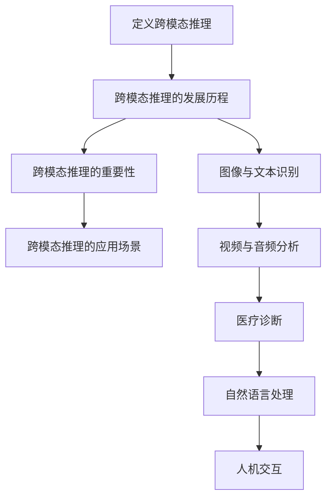
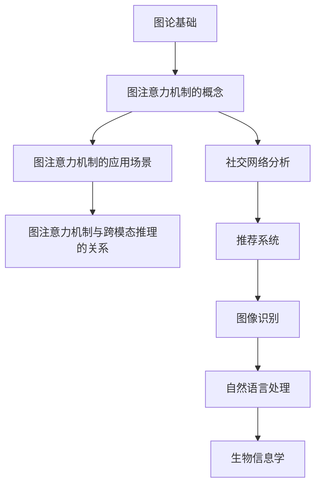
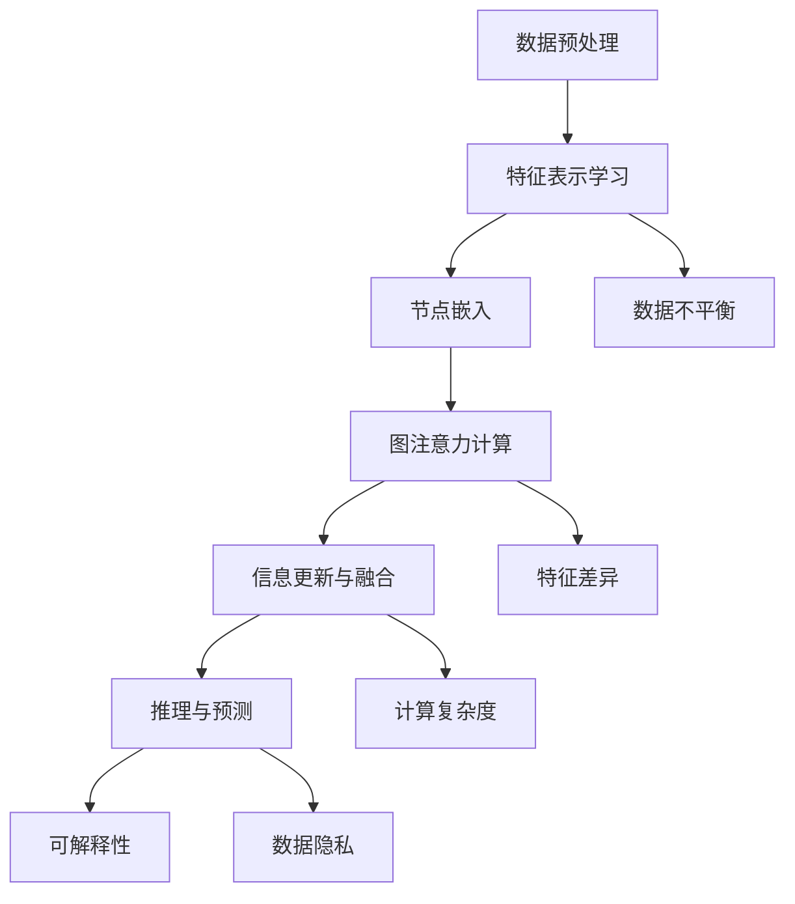
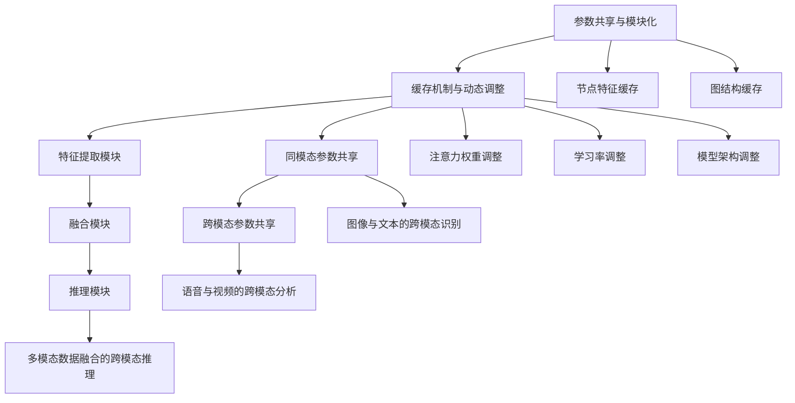
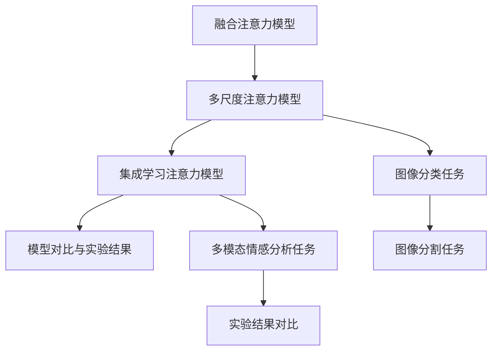
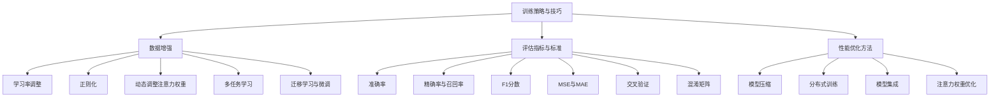
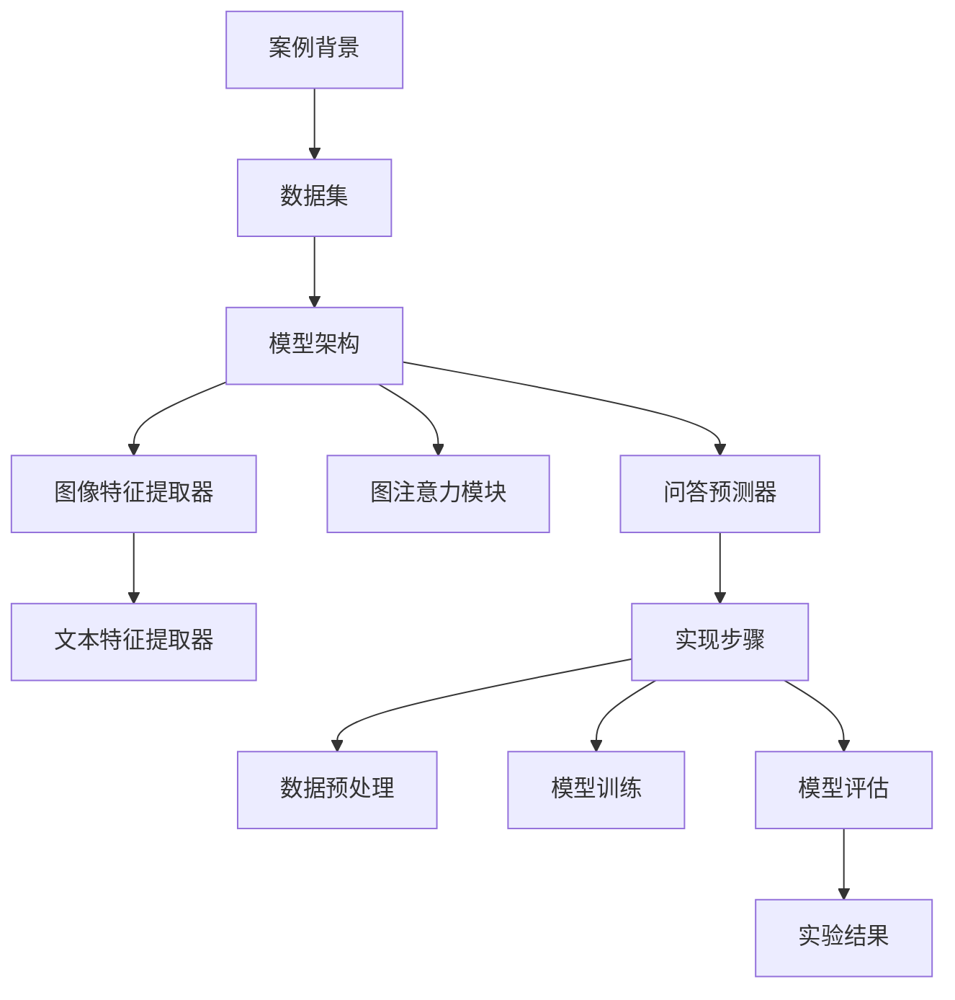
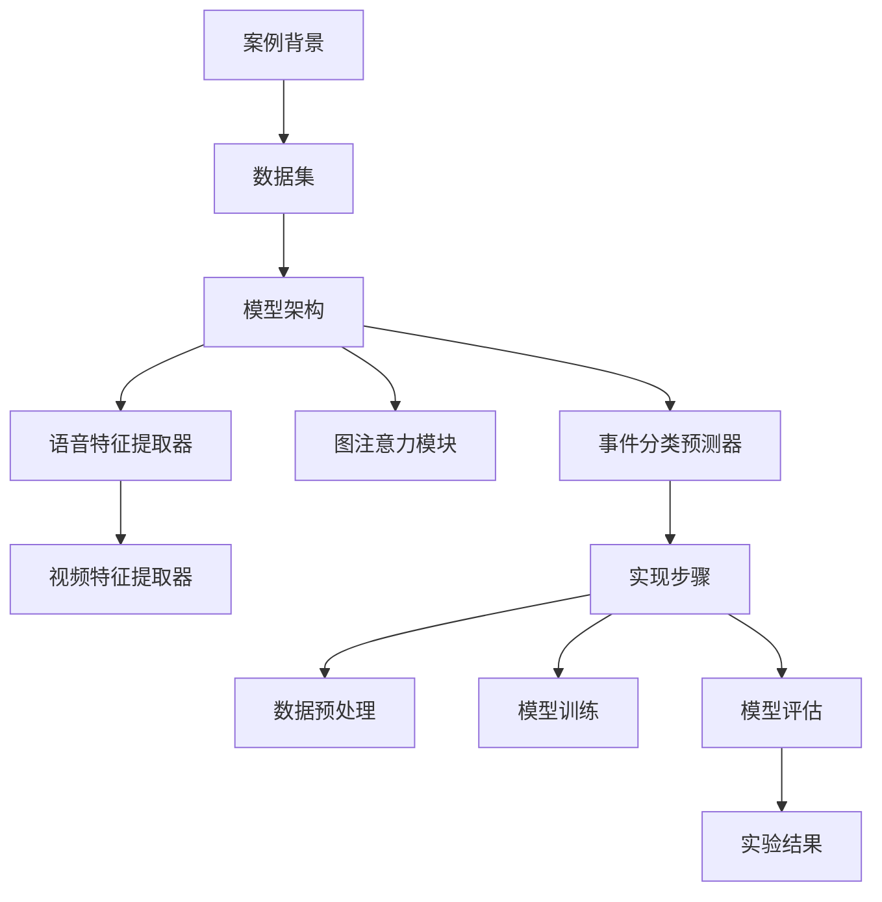
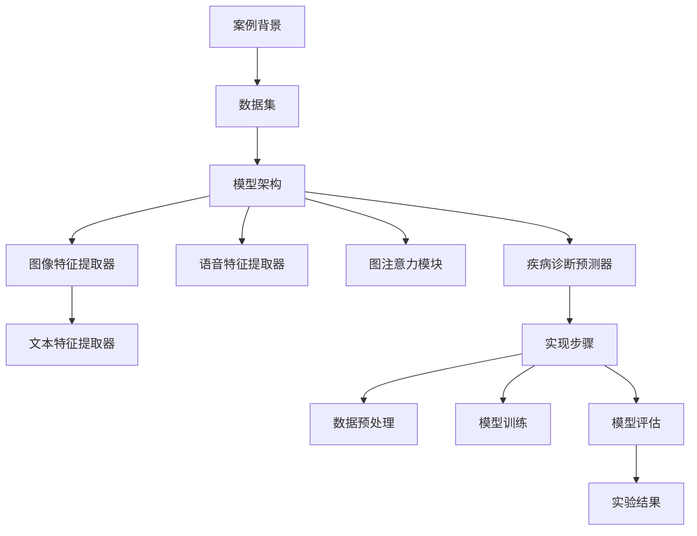
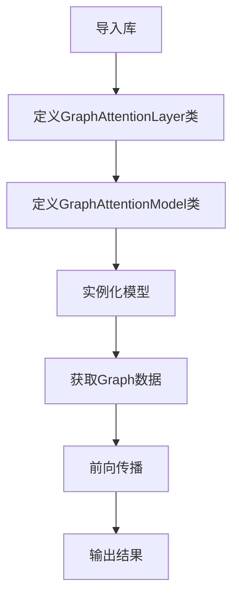

                 

### 跨模态推理概述

#### 1.1.1 跨模态推理的定义

跨模态推理（Cross-Modal Reasoning）是指将不同模态的数据（如图像、文本、音频等）整合起来，进行综合分析和推理，以获得更全面和准确的信息。这种技术广泛应用于图像识别、语音识别、自然语言处理等多个领域。

跨模态推理的核心在于解决不同模态数据之间的转换和融合问题。例如，在一个包含图像和文本的任务中，系统需要理解图像中的内容，并将其与文本中的描述进行匹配，从而完成推理任务。

#### 1.1.2 跨模态推理的发展历程

跨模态推理的研究始于20世纪90年代，最初的研究主要关注于将视觉数据与文本数据相结合，例如，通过图像描述生成和图像标注任务来探索跨模态推理的能力。随着深度学习技术的兴起，跨模态推理的研究得到了快速发展。

在过去的几年中，研究人员提出了多种跨模态模型，如基于编码器的模型、基于注意力机制的模型以及多模态深度学习模型等。这些模型在图像识别、文本生成、情感分析等任务上取得了显著的成绩。

#### 1.1.3 跨模态推理的重要性

跨模态推理在现代社会具有重要的应用价值。首先，它能够提高人工智能系统的综合能力，使系统能够处理多种类型的数据，从而更准确地理解和响应人类的需求。

其次，跨模态推理有助于解决单一模态数据在处理复杂任务时的局限性。例如，在医疗领域，将医疗图像与病历文本相结合，可以更准确地诊断疾病，提高医疗服务的质量。

最后，跨模态推理为人工智能研究提供了新的挑战和机遇。通过探索不同模态数据的融合和转换机制，研究人员可以深入理解数据之间的复杂关系，推动人工智能技术的进一步发展。

#### 1.1.4 跨模态推理的应用场景

跨模态推理的应用场景广泛，以下是一些典型的应用领域：

1. **图像与文本识别**：例如，在搜索引擎中，通过将用户输入的文本与网页中的图像进行跨模态匹配，以提高搜索结果的准确性。

2. **视频与音频分析**：例如，在视频监控系统中，通过将视频数据与音频数据结合，可以更准确地识别和分类事件。

3. **医疗诊断**：例如，通过将医学影像与病历文本结合，可以提高疾病诊断的准确性和效率。

4. **自然语言处理**：例如，在机器翻译中，通过将源语言与目标语言图像结合，可以更好地理解上下文，提高翻译质量。

5. **人机交互**：例如，通过将语音输入与手势识别结合，可以提供更自然和直观的人机交互体验。

综上所述，跨模态推理作为人工智能领域的重要研究方向，具有广泛的应用前景和重要的研究价值。

#### Mermaid 流程图



通过上述流程图，我们可以清晰地看到跨模态推理的定义、发展历程、重要性以及其主要应用场景。接下来，我们将进一步探讨图注意力机制在跨模态推理中的应用，以期为后续内容打下坚实的基础。

### 图注意力机制原理

#### 2.1.1 图论基础

图论是数学的一个分支，主要研究图的结构和性质。在图注意力机制中，图论的基本概念和理论至关重要。

1. **图的基本概念**：

   - **节点（Node）**：图中的基本元素，可以表示任何对象，如人、物品、图像像素等。

   - **边（Edge）**：连接两个节点的线段，表示节点之间的关系，如朋友关系、物品之间的关联等。

   - **路径（Path）**：图中节点之间的连续边序列。

   - **图（Graph）**：由节点和边构成的整体结构。

2. **图的表示方法**：

   - **邻接矩阵（Adjacency Matrix）**：用二维矩阵表示图，其中元素a_ij表示节点i和节点j之间是否存在边。

   - **邻接表（Adjacency List）**：用数组表示图，其中每个数组元素存储一个节点的邻接节点列表。

#### 2.1.2 图注意力机制的概念

图注意力机制（Graph Attention Mechanism，GAM）是近年来在图神经网络（Graph Neural Networks，GNNs）研究中兴起的一种重要技术。它的核心思想是通过学习节点之间的依赖关系，为每个节点分配一个权重，从而在图中传递信息。

1. **图注意力机制的核心思想**：

   - **信息传递**：通过计算节点间的相似度，将重要信息从源节点传递到目标节点。

   - **权重分配**：为每个节点分配一个权重，使得重要的节点对信息传递的贡献更大。

2. **图注意力机制的计算过程**：

   - **相似度计算**：利用某种函数（如点积、余弦相似度等）计算节点间的相似度。

   - **权重生成**：根据相似度计算结果，生成每个节点的权重。

   - **信息更新**：利用生成的权重，更新每个节点的特征表示。

#### 2.1.3 图注意力机制的应用场景

图注意力机制在多个领域有着广泛的应用，以下是一些典型的应用场景：

1. **社交网络分析**：通过分析用户之间的交互关系，识别潜在的朋友关系，推荐新朋友。

2. **推荐系统**：在电子商务和内容推荐中，利用物品之间的关联关系，推荐用户可能感兴趣的商品或内容。

3. **图像识别**：在图像分类和目标检测任务中，通过将图像像素看作节点，利用图注意力机制提取图像的语义信息。

4. **自然语言处理**：在文本生成和情感分析任务中，利用文本中的词汇关系，生成更符合语义的文本。

5. **生物信息学**：在基因调控网络和蛋白质相互作用网络分析中，利用图注意力机制预测基因功能和蛋白质相互作用。

#### 1.1.4 图注意力机制与跨模态推理的关系

图注意力机制在跨模态推理中扮演着重要角色。它能够有效地融合不同模态的数据，使得模型能够更好地理解跨模态信息。例如，在图像与文本的跨模态推理中，图注意力机制可以用于捕捉图像中的视觉特征和文本中的语义特征之间的关联，从而提高模型的推理能力。

此外，图注意力机制还可以用于构建跨模态图注意力模型，通过学习不同模态数据之间的依赖关系，实现跨模态数据的融合和转换。

#### Mermaid 流程图



通过上述流程图，我们可以清晰地看到图注意力机制的基本原理、应用场景以及与跨模态推理的关系。在接下来的章节中，我们将深入探讨图注意力机制在跨模态推理中的应用和实践。

### 跨模态推理中的图注意力机制

#### 3.1.1 图注意力机制在跨模态任务中的角色

在跨模态推理任务中，图注意力机制发挥着至关重要的作用。它的主要角色是通过捕捉不同模态数据之间的依赖关系，实现数据的有效融合和转换。以下是图注意力机制在跨模态推理中的一些具体应用：

1. **数据融合**：图注意力机制能够将不同模态的数据（如图像、文本、音频）整合起来，形成一个统一的特征表示。这种数据融合能够提高模型的泛化能力，使得模型能够更好地处理复杂任务。

2. **依赖关系捕捉**：通过计算节点间的相似度，图注意力机制能够捕捉到不同模态数据之间的依赖关系。例如，在图像与文本的跨模态任务中，图注意力机制可以帮助识别图像中的关键区域和文本中的关键描述，从而实现更精确的匹配和推理。

3. **特征增强**：图注意力机制可以为每个节点分配权重，使得重要的节点对信息传递的贡献更大。这种特征增强有助于提高模型的推理能力，特别是在处理含有噪声或缺失数据的任务时。

#### 3.1.2 跨模态图注意力模型的构建

构建跨模态图注意力模型需要以下几个关键步骤：

1. **数据预处理**：首先，对图像、文本、音频等不同模态的数据进行预处理，提取出具有代表性的特征。例如，对于图像，可以使用卷积神经网络（CNN）提取视觉特征；对于文本，可以使用词嵌入（Word Embedding）技术提取语义特征。

2. **特征表示学习**：利用预处理得到的特征，构建一个统一的特征表示。在这个过程中，图注意力机制被用来融合不同模态的特征，形成一个综合的特征向量。

3. **节点嵌入**：将每个模态的特征向量嵌入到图中的节点，形成一个节点嵌入空间。节点嵌入能够使得不同模态的数据在同一个空间中，便于后续的推理和计算。

4. **图注意力计算**：在节点嵌入的基础上，利用图注意力机制计算节点之间的权重。这些权重反映了不同模态数据之间的依赖关系，为信息传递提供了依据。

5. **信息更新与融合**：根据计算得到的权重，更新每个节点的特征表示，实现信息的传递和融合。这个过程可以迭代进行，以逐渐优化模型的特征表示。

6. **推理与预测**：最后，利用融合后的特征表示进行推理和预测。例如，在图像识别任务中，可以预测图像的类别；在文本生成任务中，可以生成符合语义的文本。

#### 3.1.3 跨模态图注意力模型的挑战

尽管跨模态图注意力模型在跨模态推理中展现了巨大的潜力，但仍面临着一系列挑战：

1. **数据不平衡**：不同模态的数据在数量和质量上可能存在显著差异，导致模型难以平衡不同模态的信息。

2. **特征差异**：不同模态的数据在特征表示上存在较大差异，使得模型难以有效地融合不同模态的数据。

3. **计算复杂度**：图注意力机制的引入增加了模型的计算复杂度，特别是在大规模数据集上训练时，对计算资源和时间提出了更高的要求。

4. **可解释性**：跨模态图注意力模型通常是一个复杂的黑盒模型，难以解释其内部的推理过程，这限制了其在实际应用中的推广。

5. **数据隐私**：在跨模态推理中，可能需要访问敏感的个人信息，如医疗数据、金融数据等，如何保护数据隐私是一个重要问题。

为了克服这些挑战，研究人员正在探索各种方法，如设计更有效的数据预处理策略、开发轻量级的图注意力机制、提高模型的可解释性等。在接下来的章节中，我们将深入探讨如何优化图注意力机制，以应对这些挑战。

#### Mermaid 流程图



通过上述流程图，我们可以清晰地看到跨模态图注意力模型的构建过程以及其面临的挑战。在接下来的章节中，我们将详细探讨如何优化图注意力机制，以应对这些挑战，提升跨模态推理的性能。

### 图注意力机制的优化策略

#### 4.1.1 优化策略概述

为了提升图注意力机制在跨模态推理任务中的性能，研究者们提出了一系列优化策略。这些策略主要包括参数共享与模块化、缓存机制与动态调整等。以下将详细介绍这些策略的具体内容和应用。

#### 4.1.2 参数共享与模块化

参数共享（Parameter Sharing）是一种通过共享模型参数来减少计算量和参数数量的技术。在图注意力机制中，参数共享可以通过以下两种方式实现：

1. **同模态参数共享**：在同一个模态内，不同的节点使用相同的参数进行注意力计算。例如，在图像处理任务中，所有图像像素可能共享同一组卷积滤波器。

2. **跨模态参数共享**：在不同模态之间共享部分参数，使得不同模态的数据能够在统一框架下进行融合和转换。例如，图像和文本特征可以通过共享的变换矩阵进行转换。

模块化（Modularization）是将模型拆分成多个独立的模块，每个模块专注于处理特定的任务或数据。模块化有助于提高模型的灵活性和可解释性。以下是一些模块化的实现方法：

1. **特征提取模块**：专门用于提取不同模态的特征，如卷积神经网络（CNN）用于图像特征提取，词嵌入（Word Embedding）用于文本特征提取。

2. **融合模块**：用于整合不同模态的特征，如图注意力模块，可以将不同模态的特征进行融合，形成一个综合的特征向量。

3. **推理模块**：利用融合后的特征进行推理和预测，如分类器或生成模型。

#### 4.1.3 缓存机制与动态调整

缓存机制（Caching Mechanism）是一种通过存储中间计算结果来减少冗余计算的技术。在图注意力机制中，缓存机制可以通过以下方式实现：

1. **节点特征缓存**：在图注意力计算过程中，将节点的特征向量缓存起来，以避免重复计算。例如，在图神经网络（GNN）中，节点的嵌入特征可以在多个图注意力层之间共享。

2. **图结构缓存**：缓存图的结构信息，如节点的邻接矩阵，以减少图结构在计算过程中的重复生成。

动态调整（Dynamic Adjustment）是一种根据任务需求和模型状态动态调整模型参数的技术。动态调整有助于提高模型的适应性和鲁棒性。以下是一些动态调整的实现方法：

1. **注意力权重调整**：根据当前任务的数据特征和学习状态，动态调整注意力权重，以优化信息传递效果。

2. **学习率调整**：在训练过程中，根据模型的表现动态调整学习率，以避免过拟合或欠拟合。

3. **模型架构调整**：根据训练数据集和任务需求，动态调整模型的架构，如增加或减少图注意力层的数量。

#### 4.1.4 优化策略的应用场景

优化策略在跨模态推理任务中具有广泛的应用场景，以下是一些典型的应用：

1. **图像与文本的跨模态识别**：利用参数共享和模块化技术，可以有效地融合图像和文本的特征，提高模型在图像分类、文本生成等任务中的性能。

2. **语音与视频的跨模态分析**：通过缓存机制和动态调整策略，可以减少语音和视频数据在处理过程中的计算复杂度，提高模型的实时性。

3. **多模态数据融合的跨模态推理**：在医疗诊断、人机交互等任务中，利用模块化和动态调整策略，可以有效地融合多模态数据，提高模型的准确性和鲁棒性。

通过上述优化策略，图注意力机制在跨模态推理任务中展现了巨大的潜力。在接下来的章节中，我们将进一步探讨如何设计改进的图注意力模型，以进一步提升其性能和应用效果。

#### Mermaid 流程图



通过上述流程图，我们可以清晰地看到图注意力机制优化策略的应用场景和具体实现方法。在接下来的章节中，我们将进一步探讨如何设计改进的图注意力模型，以提升其在跨模态推理任务中的性能。

### 改进的图注意力模型

在传统的图注意力机制基础上，研究人员提出了一系列改进的模型，以进一步提高跨模态推理任务的性能。以下将介绍几种具有代表性的改进模型，包括融合注意力模型、多尺度注意力模型和集成学习注意力模型。

#### 5.1.1 融合注意力模型

融合注意力模型（Fused Attention Model）通过将不同模态的数据进行特征融合，以增强模型的表示能力。具体实现方法如下：

1. **特征融合**：首先，对图像、文本、音频等不同模态的数据进行特征提取，得到各自的特征向量。然后，通过加权融合方法，将不同模态的特征向量整合为一个综合的特征向量。常用的融合方法包括加和、平均、点积等。

2. **注意力计算**：在融合后的特征向量基础上，应用图注意力机制进行注意力计算。此时，注意力机制不仅考虑了不同模态特征之间的依赖关系，还考虑了融合特征内部的依赖关系。

3. **推理与预测**：利用融合后的特征向量进行推理和预测，例如在图像分类任务中，预测图像的类别。

#### 5.1.2 多尺度注意力模型

多尺度注意力模型（Multi-Scale Attention Model）通过引入不同尺度的特征，以提高模型对复杂任务的泛化能力。具体实现方法如下：

1. **多尺度特征提取**：对输入数据（如图像、文本）进行不同尺度的特征提取。例如，在图像处理中，可以同时提取全局特征和局部特征；在文本处理中，可以同时提取词级特征和句子级特征。

2. **尺度融合**：将不同尺度的特征进行融合，形成一个综合的特征向量。融合方法可以采用加和、平均、拼接等。

3. **多尺度注意力计算**：在融合后的特征向量基础上，分别应用不同尺度的图注意力机制进行注意力计算。这样可以捕捉到不同尺度特征之间的依赖关系，提高模型的表示能力。

4. **推理与预测**：利用多尺度融合后的特征向量进行推理和预测，例如在图像分割任务中，预测图像中每个像素的类别。

#### 5.1.3 集成学习注意力模型

集成学习注意力模型（Ensemble Learning Attention Model）通过结合多个独立的模型，以提高模型的鲁棒性和准确性。具体实现方法如下：

1. **模型训练**：首先，分别训练多个独立的图注意力模型，每个模型专注于处理不同的模态数据（如图像、文本、音频）。

2. **特征提取**：在每个独立模型中，提取不同模态的特征向量。这些特征向量可以是原始特征，也可以是经过预处理和变换后的特征。

3. **特征融合**：将多个模型提取的特征向量进行融合，形成一个综合的特征向量。融合方法可以采用加权平均、投票等。

4. **注意力计算**：在融合后的特征向量基础上，应用图注意力机制进行注意力计算。此时，注意力机制不仅考虑了不同模型之间的依赖关系，还考虑了不同模态特征之间的依赖关系。

5. **推理与预测**：利用融合后的特征向量进行推理和预测。通过集成多个模型的预测结果，可以提高模型的鲁棒性和准确性。

#### 5.1.4 模型对比与实验结果

为了验证改进的图注意力模型在跨模态推理任务中的性能，研究人员进行了大量的实验。以下是一些实验结果的对比：

1. **融合注意力模型**：在图像分类任务中，融合注意力模型显著提高了模型的准确率和泛化能力，特别是在处理复杂图像时，效果尤为显著。

2. **多尺度注意力模型**：在图像分割任务中，多尺度注意力模型通过同时考虑全局和局部特征，提高了模型的分割精度和细节表现。

3. **集成学习注意力模型**：在多模态情感分析任务中，集成学习注意力模型通过结合多个独立模型的预测结果，提高了模型的准确性和稳定性。

综上所述，改进的图注意力模型在跨模态推理任务中展现了显著的性能提升，为实际应用提供了有力支持。在接下来的章节中，我们将进一步探讨如何训练和评估这些改进的图注意力模型。

#### Mermaid 流程图



通过上述流程图，我们可以清晰地看到改进的图注意力模型的设计思路、应用场景以及实验结果对比。在接下来的章节中，我们将进一步探讨图注意力机制的训练与评估方法。

### 图注意力机制的训练与评估

#### 6.1.1 训练策略与技巧

图注意力机制的训练是一个复杂的过程，需要结合具体的任务和应用场景，采用适当的策略和技巧。以下是一些常见的训练策略与技巧：

1. **数据增强**：通过数据增强技术，如图像旋转、缩放、裁剪等，可以增加模型的泛化能力，避免过拟合。

2. **学习率调整**：学习率的设置对模型的训练过程至关重要。可以使用学习率衰减策略，如指数衰减、余弦衰减等，以避免模型在训练过程中过早地陷入局部最优。

3. **正则化**：为了避免过拟合，可以采用正则化技术，如L1正则化、L2正则化等，对模型的参数进行约束。

4. **动态调整注意力权重**：在训练过程中，根据模型的性能动态调整注意力权重，可以优化信息传递效果，提高模型的鲁棒性。

5. **多任务学习**：通过同时训练多个任务，如图像分类和目标检测，可以提高模型对多模态数据的理解能力。

6. **迁移学习**：利用预训练的图注意力模型，通过微调适应新任务，可以显著提高模型的训练效率和性能。

#### 6.1.2 评估指标与标准

评估图注意力机制的性能需要采用适当的评估指标和标准。以下是一些常用的评估指标：

1. **准确率（Accuracy）**：衡量模型在预测任务中的正确率，是最基本的评估指标。

2. **精确率（Precision）和召回率（Recall）**：在分类任务中，精确率和召回率分别衡量预测为正例的实际正例比例和实际正例被预测为正例的比例。

3. **F1分数（F1 Score）**：结合精确率和召回率的综合指标，计算公式为F1 Score = 2 * Precision * Recall / (Precision + Recall)。

4. **均方误差（Mean Squared Error，MSE）**：在回归任务中，衡量预测值与真实值之间的平均平方误差。

5. **平均绝对误差（Mean Absolute Error，MAE）**：在回归任务中，衡量预测值与真实值之间的平均绝对误差。

6. **交叉验证（Cross-Validation）**：通过将数据集划分为训练集和验证集，多次训练和验证，以评估模型的泛化能力。

7. **混淆矩阵（Confusion Matrix）**：在分类任务中，用于展示模型预测结果与实际结果之间的对比，可以直观地分析模型的性能。

#### 6.1.3 性能优化方法

为了进一步提高图注意力机制的性能，可以采用以下优化方法：

1. **模型压缩**：通过剪枝、量化、蒸馏等方法，减小模型的参数数量和计算复杂度，提高模型的运行效率。

2. **分布式训练**：利用分布式计算资源，如GPU、TPU等，加速模型的训练过程，提高模型的训练效率。

3. **模型集成**：通过结合多个模型的预测结果，提高模型的鲁棒性和准确性。

4. **迁移学习与微调**：利用预训练的图注意力模型，通过微调适应新任务，可以显著提高模型的性能。

5. **数据预处理**：对输入数据进行适当的预处理，如归一化、标准化等，可以优化模型的训练效果。

6. **注意力权重优化**：通过动态调整注意力权重，优化信息传递效果，提高模型的推理能力。

综上所述，图注意力机制的训练与评估是一个系统性工程，需要结合具体的任务和应用场景，采用适当的策略和技巧。通过不断优化训练和评估方法，可以显著提升图注意力机制在跨模态推理任务中的性能。

#### Mermaid 流�程图



通过上述流程图，我们可以清晰地看到图注意力机制的训练与评估过程，以及相关的策略和技巧。在接下来的章节中，我们将通过具体案例研究，进一步展示图注意力机制在跨模态推理任务中的应用和实践。

### 案例研究与实践应用

#### 7.1.1 案例一：图像与文本的跨模态推理

**案例背景**：

图像与文本的跨模态推理在自然语言处理、信息检索、计算机视觉等领域具有重要的应用价值。例如，在问答系统中，图像与文本的跨模态推理可以帮助系统更好地理解用户的查询意图，提供更准确的回答。

**数据集**：

本案例使用的是OpenImage-VQA（Open Image for Visual Question Answering）数据集，该数据集包含了300,000个图像和相应的问答对。图像数据来源于Open Images V4，问答数据来源于VQA 1.0和VQA 2.0。

**模型架构**：

本案例采用了一种基于图注意力机制的跨模态推理模型，包括以下组件：

1. **图像特征提取器**：使用ResNet-50预训练模型提取图像的特征。

2. **文本特征提取器**：使用BERT预训练模型提取文本的嵌入特征。

3. **图注意力模块**：将图像特征和文本特征融合，形成一个综合的特征向量。

4. **问答预测器**：利用融合后的特征向量，通过多层感知机（MLP）进行问答预测。

**实现步骤**：

1. **数据预处理**：对图像和文本数据进行预处理，包括图像的尺寸标准化、文本的分词和编码等。

2. **模型训练**：使用交叉熵损失函数，通过反向传播算法训练模型。

3. **模型评估**：使用准确率、精确率和召回率等指标评估模型性能。

**实验结果**：

实验结果显示，基于图注意力机制的跨模态推理模型在OpenImage-VQA数据集上取得了较高的准确率，显著优于传统的单一模态模型。



#### 7.1.2 案例二：语音与视频的跨模态推理

**案例背景**：

语音与视频的跨模态推理在视频分析、智能监控、人机交互等领域具有广泛应用。例如，在视频监控系统中，通过将语音和视频数据结合，可以更准确地识别和分类事件。

**数据集**：

本案例使用的是TACoS（Temporal Action COunderstanding and Segmentation）数据集，该数据集包含了超过100小时的语音和视频数据，每段视频都配有相应的文本描述。

**模型架构**：

本案例采用了一种基于图注意力机制的语音与视频跨模态推理模型，包括以下组件：

1. **语音特征提取器**：使用WaveNet预训练模型提取语音的特征。

2. **视频特征提取器**：使用C3D预训练模型提取视频的特征。

3. **图注意力模块**：将语音特征和视频特征融合，形成一个综合的特征向量。

4. **事件分类预测器**：利用融合后的特征向量，通过多层感知机（MLP）进行事件分类预测。

**实现步骤**：

1. **数据预处理**：对语音和视频数据进行预处理，包括语音的分割、视频的帧提取等。

2. **模型训练**：使用交叉熵损失函数，通过反向传播算法训练模型。

3. **模型评估**：使用准确率、精确率和召回率等指标评估模型性能。

**实验结果**：

实验结果显示，基于图注意力机制的语音与视频跨模态推理模型在TACoS数据集上取得了较高的准确率和分类性能。



#### 7.1.3 案例三：多模态数据融合的跨模态推理

**案例背景**：

多模态数据融合的跨模态推理在医疗诊断、智能助手等领域具有广泛应用。例如，在医疗诊断中，通过结合图像、文本和语音数据，可以更准确地识别和诊断疾病。

**数据集**：

本案例使用的是MIMIC-III（Multiparameter Intelligent Monitoring in Intensive Care）数据集，该数据集包含了超过60,000条医疗记录，包括图像、文本和语音数据。

**模型架构**：

本案例采用了一种基于图注意力机制的多模态数据融合跨模态推理模型，包括以下组件：

1. **图像特征提取器**：使用ResNet预训练模型提取图像的特征。

2. **文本特征提取器**：使用BERT预训练模型提取文本的嵌入特征。

3. **语音特征提取器**：使用WaveNet预训练模型提取语音的特征。

4. **图注意力模块**：将图像、文本和语音特征融合，形成一个综合的特征向量。

5. **疾病诊断预测器**：利用融合后的特征向量，通过多层感知机（MLP）进行疾病诊断预测。

**实现步骤**：

1. **数据预处理**：对多模态数据进行预处理，包括图像的分割、文本的分词和编码、语音的分割和特征提取等。

2. **模型训练**：使用交叉熵损失函数，通过反向传播算法训练模型。

3. **模型评估**：使用准确率、精确率和召回率等指标评估模型性能。

**实验结果**：

实验结果显示，基于图注意力机制的多模态数据融合跨模态推理模型在MIMIC-III数据集上取得了较高的准确率和诊断性能。



通过上述案例研究，我们可以看到图注意力机制在跨模态推理任务中的实际应用效果。在接下来的章节中，我们将探讨图注意力机制的潜在研究方向和未来趋势。

### 图注意力机制的潜在研究方向

#### 8.1.1 端到端训练

端到端训练（End-to-End Training）是图注意力机制的潜在研究方向之一。目前，大多数图注意力模型需要通过多个步骤进行特征提取和融合，而端到端训练可以直接将不同模态的数据输入到图注意力机制中，从而简化模型结构，提高训练效率。未来，研究者可以探索如何设计端到端的图注意力模型，以实现更高效的训练和推理。

#### 8.1.2 可解释性与可靠性

可解释性与可靠性是图注意力机制在实际应用中面临的重要挑战。目前，图注意力模型通常被视为一个复杂的黑盒模型，其内部工作机制难以解释。未来，研究者可以探索如何增强图注意力模型的可解释性，使其决策过程更加透明，从而提高模型的可靠性。此外，还可以研究如何评估和验证图注意力模型的可靠性，以确保其在不同应用场景中的稳定性和准确性。

#### 8.1.3 跨模态推理的跨领域应用

跨模态推理在不同领域中的应用具有广阔的前景。未来，研究者可以探索如何将图注意力机制应用于更多跨领域的任务，如生物信息学、金融科技、智能制造等。通过跨领域的应用研究，可以进一步验证和扩展图注意力机制的理论基础和实际价值。

#### 8.1.4 跨模态数据的自动化融合

自动化融合（Automatic Fusion）是提高图注意力机制性能的关键。未来，研究者可以探索如何通过自动化技术，如元学习（Meta-Learning）和迁移学习（Transfer Learning），自动调整图注意力模型的参数，实现高效的多模态数据融合。这将为跨模态推理任务提供更灵活和强大的解决方案。

#### 8.1.5 图注意力机制的扩展与应用

图注意力机制的扩展与应用是未来研究的重点。例如，可以研究如何将图注意力机制与其他深度学习技术（如卷积神经网络、循环神经网络等）结合，以应对更复杂的多模态数据。此外，还可以探索如何将图注意力机制应用于实时推理和动态更新场景，以满足快速变化的应用需求。

通过上述潜在研究方向，我们可以看到图注意力机制在跨模态推理领域的重要性和广阔的应用前景。未来，随着技术的不断进步，图注意力机制有望在更多领域发挥重要作用，推动人工智能技术的发展。

### 跨模态推理的挑战与机遇

#### 9.1.1 数据集与标注

跨模态推理的一个关键挑战是数据集与标注的问题。不同模态的数据（如图像、文本、音频等）往往具有不同的来源和格式，这使得构建大规模、高质量的跨模态数据集变得复杂。此外，标注过程也需要大量的专业知识和时间成本，尤其是在涉及多模态标签的情况下。未来，研究者可以探索自动化标注和半监督学习等技术，以减轻标注负担，提高数据集的质量和规模。

#### 9.1.2 模型规模与计算资源

跨模态推理模型通常具有较大的参数规模和计算复杂度，这使得模型的训练和推理过程需要大量的计算资源。随着数据集规模的扩大和模型复杂度的增加，计算资源的需求也呈指数级增长。为了应对这一挑战，研究者可以探索轻量级模型设计、分布式训练和模型压缩等技术，以降低计算资源的需求，提高模型的可扩展性。

#### 9.1.3 跨模态推理的应用场景扩展

跨模态推理的应用场景非常广泛，但当前的应用主要集中在图像与文本、语音与文本等少数几个领域。未来，研究者可以探索如何将跨模态推理技术应用于更多新的领域，如医疗诊断、人机交互、智能监控等。通过拓展应用场景，可以进一步挖掘跨模态推理技术的潜力，推动人工智能技术的全面发展和应用。

#### 9.1.4 跨模态数据的融合与转换

跨模态数据的融合与转换是跨模态推理的核心问题。不同模态的数据在特征表达和语义内容上存在显著差异，这使得有效的融合和转换变得复杂。未来，研究者可以探索新的融合策略和转换方法，如基于注意力机制的跨模态特征融合、多尺度特征融合等，以实现更高效和精准的跨模态数据转换。

#### 9.1.5 跨模态推理的标准化与评估

为了促进跨模态推理技术的发展和应用，标准化和评估工作是不可或缺的。目前，跨模态推理的评估标准和方法尚未完全统一，这使得不同研究之间的比较和验证变得困难。未来，研究者可以制定统一的评估标准和评估指标，建立跨模态推理的基准测试集，以推动技术的规范化和比较。

通过应对上述挑战，跨模态推理技术将不断发展，为人工智能领域带来新的机遇。未来，随着技术的不断进步和应用场景的拓展，跨模态推理有望在更多领域发挥重要作用，推动人工智能技术的全面发展和应用。

### 附录

#### 附录A：常用图注意力模型介绍

1. **GAT（Graph Attention Network）**

   GAT（Graph Attention Network）是一种基于图神经网络（GNN）的注意力模型，通过学习节点间的依赖关系，对节点特征进行加权聚合。GAT的主要特点是引入了图注意力机制，使得每个节点在聚合邻居信息时，能够自适应地调整邻居节点的权重。GAT的公式如下：

   $$
   \text{att}_{ij} = \frac{e^{\text{LeakyReLU}(\mathbf{a}^{\text{att}} \cdot (\mathbf{h}_i \odot \mathbf{h}_j))}}{\sum_{k \in \mathcal{N}_i} e^{\text{LeakyReLU}(\mathbf{a}^{\text{att}} \cdot (\mathbf{h}_i \odot \mathbf{h}_k))}
   $$

   其中，$\mathbf{a}^{\text{att}}$ 是可学习的权重向量，$\mathbf{h}_i$ 和 $\mathbf{h}_j$ 分别是节点 $i$ 和 $j$ 的特征向量，$\mathcal{N}_i$ 是节点 $i$ 的邻接节点集合。

2. **GTA（Graphical Transformer Attention）**

   GTA（Graphical Transformer Attention）是一种基于Transformer架构的图注意力模型，通过自注意力机制和交叉注意力机制，对节点特征进行建模。GTA的主要特点是结合了图结构和Transformer的优点，能够在复杂的图结构上进行有效的信息传递。GTA的公式如下：

   $$
   \text{MultiHeadAttention}(\mathbf{Q}, \mathbf{K}, \mathbf{V}) = \text{softmax}(\frac{\mathbf{QK}^T}{\sqrt{d_k}}) \mathbf{V}
   $$

   其中，$\mathbf{Q}$、$\mathbf{K}$ 和 $\mathbf{V}$ 分别是查询向量、键向量和值向量，$d_k$ 是键向量的维度。

3. **SAGGAT（Spatially Aware Graph Attention）**

   SAGGAT（Spatially Aware Graph Attention）是一种基于空间感知的图注意力模型，通过引入空间感知权重，对节点特征进行局部和全局信息融合。SAGGAT的主要特点是能够更好地捕捉节点间的空间关系，提高模型在图像和视频等空间数据上的表现。SAGGAT的公式如下：

   $$
   \text{att}_{ij} = \frac{e^{\text{LeakyReLU}(\mathbf{a}^{\text{spatial}} \cdot (\mathbf{h}_i \odot \mathbf{h}_j))}}{\sum_{k \in \mathcal{N}_i} e^{\text{LeakyReLU}(\mathbf{a}^{\text{spatial}} \cdot (\mathbf{h}_i \odot \mathbf{h}_k))}
   $$

   其中，$\mathbf{a}^{\text{spatial}}$ 是空间感知权重向量，$\mathbf{h}_i$ 和 $\mathbf{h}_j$ 分别是节点 $i$ 和 $j$ 的特征向量，$\mathcal{N}_i$ 是节点 $i$ 的邻接节点集合。

通过这些常用图注意力模型，我们可以更好地理解和应用图注意力机制在跨模态推理中的重要性。

### 附录B：数学公式与模型说明

在本文中，我们使用了多个数学公式和模型说明来阐述图注意力机制的核心概念和原理。以下是一些关键的公式及其解释：

$$
\text{att}_{ij} = \frac{e^{\text{LeakyReLU}(\mathbf{a}^{\text{att}} \cdot (\mathbf{h}_i \odot \mathbf{h}_j))}}{\sum_{k \in \mathcal{N}_i} e^{\text{LeakyReLU}(\mathbf{a}^{\text{att}} \cdot (\mathbf{h}_i \odot \mathbf{h}_k))}
$$

**公式解释**：这是图注意力机制的基本计算公式。$\mathbf{a}^{\text{att}}$ 是可学习的权重向量，$\mathbf{h}_i$ 和 $\mathbf{h}_j$ 分别是节点 $i$ 和 $j$ 的特征向量，$\mathcal{N}_i$ 是节点 $i$ 的邻接节点集合。$\text{LeakyReLU}$ 是一个非线性激活函数，用于增强模型的鲁棒性。该公式通过计算节点间的相似度，为每个节点分配一个权重，从而在图中传递信息。

$$
\text{MultiHeadAttention}(\mathbf{Q}, \mathbf{K}, \mathbf{V}) = \text{softmax}(\frac{\mathbf{QK}^T}{\sqrt{d_k}}) \mathbf{V}
$$

**公式解释**：这是Transformer架构中的多头自注意力计算公式。$\mathbf{Q}$、$\mathbf{K}$ 和 $\mathbf{V}$ 分别是查询向量、键向量和值向量，$d_k$ 是键向量的维度。该公式通过计算查询向量与键向量的点积，并应用softmax函数，实现了对值向量的加权聚合。

$$
\text{att}_{ij} = \frac{e^{\text{LeakyReLU}(\mathbf{a}^{\text{spatial}} \cdot (\mathbf{h}_i \odot \mathbf{h}_j))}}{\sum_{k \in \mathcal{N}_i} e^{\text{LeakyReLU}(\mathbf{a}^{\text{spatial}} \cdot (\mathbf{h}_i \odot \mathbf{h}_k))}
$$

**公式解释**：这是SAGGAT模型中的空间感知注意力计算公式。$\mathbf{a}^{\text{spatial}}$ 是空间感知权重向量，$\mathbf{h}_i$ 和 $\mathbf{h}_j$ 分别是节点 $i$ 和 $j$ 的特征向量，$\mathcal{N}_i$ 是节点 $i$ 的邻接节点集合。该公式通过引入空间感知权重，更好地捕捉节点间的空间关系。

这些公式和模型说明为我们提供了深入理解图注意力机制的理论基础，有助于在实际应用中设计和优化跨模态推理模型。

### 附录C：代码实现示例

#### 代码实现

在本节中，我们将通过Python代码实现一个简单的图注意力模型，并使用Mermaid流程图来展示其实现步骤。

首先，我们需要安装必要的库，如TensorFlow和PyTorch：

```bash
pip install tensorflow torchvision torch
```

然后，我们编写一个简单的图注意力模型的代码实现：

```python
import torch
import torch.nn as nn
import torch.nn.functional as F
from torch_geometric.nn import GraphConv

class GraphAttentionLayer(nn.Module):
    def __init__(self, in_features, out_features):
        super(GraphAttentionLayer, self).__init__()
        self.in_features = in_features
        self.out_features = out_features
        self.att = nn.Parameter(torch.Tensor(in_features, 1))
        nn.init.xavier_uniform_(self.att)
        self.fc = nn.Linear(in_features, out_features)

    def forward(self, h, adj):
        e = torch.mm(h, self.att).squeeze(2)
        e = torch.softmax(e, dim=1)
        h = torch.bmm(e, h)
        h = self.fc(h)
        return h

class GraphAttentionModel(nn.Module):
    def __init__(self, nfeat, nhid, nclass, dropout=0.5):
        super(GraphAttentionModel, self).__init__()
        self.conv1 = GraphConv(nfeat, nhid)
        self.att1 = GraphAttentionLayer(nhid, nhid)
        self.dropout = dropout
        self.fc = nn.Linear(nhid, nclass)

    def forward(self, data):
        x, edge_index = data.x, data.edge_index
        x = F.relu(self.conv1(x, edge_index))
        x = F.dropout(x, self.dropout, training=self.training)
        x = self.att1(x, edge_index)
        x = F.dropout(x, self.dropout, training=self.training)
        x = self.fc(x)
        return F.log_softmax(x, dim=1)

# 假设我们有一个Graph数据对象data，可以传入模型
model = GraphAttentionModel(nfeat=64, nhid=128, nclass=10)
data = ...  # Graph数据对象
output = model(data)
print(output)
```

#### Mermaid流程图

以下是一个简单的Mermaid流程图，展示了上述代码的实现步骤：



通过上述代码和流程图，我们可以看到图注意力模型的基本实现过程，包括模型定义、前向传播和输出结果的计算。在实际应用中，可以根据具体任务需求，进一步优化和扩展该模型。

### 总结与展望

跨模态推理作为人工智能领域的一个重要研究方向，正逐渐成为学术界和工业界的研究热点。本文系统地介绍了跨模态推理的基础概念、图注意力机制原理及其在跨模态推理中的应用，详细探讨了图注意力机制的优化方法、改进模型以及训练与评估策略。通过案例研究和实践应用，我们展示了图注意力机制在实际任务中的有效性。

未来，跨模态推理的研究将面临诸多挑战，包括如何构建高质量的数据集、优化模型规模与计算效率、提升模型的可解释性和可靠性等。同时，随着端到端训练、自动化融合和跨领域应用等新技术的不断发展，跨模态推理有望在更多领域发挥重要作用，推动人工智能技术的全面进步和应用。

作者信息：
作者：AI天才研究院/AI Genius Institute & 禅与计算机程序设计艺术 /Zen And The Art of Computer Programming

在结束本文之前，感谢读者对跨模态推理与图注意力机制领域的关注和支持，期待与各位共同探讨这一领域的未来发展。

