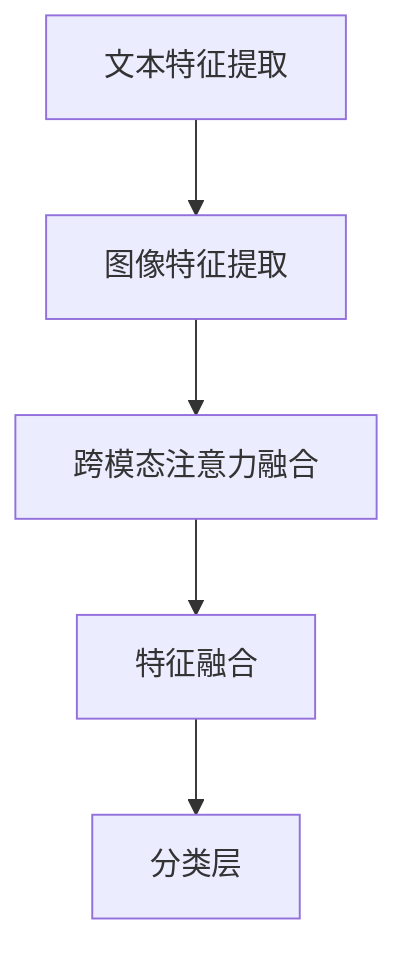

                 

### 第1章 引言

#### 1.1 研究背景

**多模态数据的挑战**

随着信息技术的快速发展，数据形式日益多样化。多模态数据，即同时包含文本、图像、声音等多种形式的数据，正在成为研究和应用的热点。多模态数据融合旨在将不同模态的信息进行整合，以获得更丰富、更全面的数据表征，从而提升信息处理和分析的准确性。

然而，多模态数据融合面临着一系列挑战。首先，不同模态的数据具有不同的特征和表示方式，这使得它们之间的集成变得复杂。其次，不同模态的数据在时序上可能不一致，这增加了数据融合的难度。此外，多模态数据融合需要处理大量的数据，这给计算资源和算法设计带来了巨大的压力。

**跨模态注意力的重要性**

跨模态注意力是一种旨在解决多模态数据融合问题的有效方法。它通过捕捉不同模态之间的关联性，实现对多源信息的有效整合。跨模态注意力机制能够自适应地调整不同模态信息的权重，从而在复杂的多模态环境中提取出关键信息。

跨模态注意力的重要性体现在多个方面。首先，它能够提高信息处理系统的准确性和鲁棒性。通过跨模态整合，系统能够从不同角度获取信息，从而减少单一模态信息可能带来的偏差和不确定性。其次，跨模态注意力能够提升系统的智能化水平。它能够自适应地调整模型对不同模态信息的关注程度，从而更好地适应不同的应用场景。

#### 1.2 书籍目标

**读者对象**

本书面向对跨模态注意力感兴趣的技术人员、研究人员和学生。无论您是初学者还是专业人士，本书都将帮助您深入了解跨模态注意力的基本概念、原理和应用。

**主要内容与结构**

本书分为七个章节，系统地介绍了跨模态注意力的各个方面。第一章是引言，介绍了研究的背景和目的。第二章阐述了多模态数据的基本概念和注意力机制的基础知识。第三章详细介绍了跨模态注意力的概念、优势和挑战。第四章到第六章分别探讨了跨模态注意力在自然语言处理、计算机视觉和多媒体融合中的应用。第七章对未来展望和挑战进行了分析。

通过本书的阅读，读者将能够：

1. 理解多模态数据的基本概念和特征。
2. 掌握注意力机制的基本原理和应用。
3. 深入了解跨模态注意力的概念和优势。
4. 学会应用跨模态注意力解决实际问题。
5. 了解跨模态注意力在各个领域的最新研究进展和应用案例。

#### 2.1 多模态数据概述

**模态分类**

多模态数据根据其所包含的模态类型，可以分为多种类别。常见的模态包括文本、图像、声音、视频和触觉等。每种模态都有其独特的特征和表示方式。

- **文本模态**：文本模态是指以自然语言形式存在的数据。它包含了大量的语义信息，是自然语言处理的重要对象。
- **图像模态**：图像模态是指以像素形式存在的视觉数据。图像具有丰富的视觉信息，是计算机视觉的核心研究对象。
- **声音模态**：声音模态是指以声波形式存在的音频数据。声音包含了丰富的语音信息，是语音识别和处理的重要对象。
- **视频模态**：视频模态是指连续的图像序列，是图像模态的扩展。视频包含了动态的视觉信息，是视频分析和理解的重要对象。
- **触觉模态**：触觉模态是指通过触觉传感器获取的物理接触信息。触觉信息在机器人控制和人机交互等领域具有重要应用。

**多模态数据的特点**

多模态数据具有以下几个显著特点：

- **多样性**：多模态数据涵盖了多种不同类型的模态，每种模态都有其独特的特征和表示方式。这种多样性为数据处理和分析带来了挑战，但也提供了更丰富的信息来源。
- **异构性**：不同模态的数据在结构、特征和表示上存在较大差异。例如，文本数据通常以序列形式存在，而图像数据则以矩阵形式存在。这种异构性使得多模态数据的整合和融合变得复杂。
- **高维性**：多模态数据通常包含大量的特征维度。例如，图像数据可能包含数百万像素，而声音数据可能包含数万个频率分量。这种高维性对计算资源和算法设计提出了更高的要求。
- **关联性**：多模态数据之间存在着密切的关联性。例如，图像中的物体与其对应的文本描述之间存在着语义关联。通过挖掘和利用这些关联性，可以进一步提升多模态数据的表征和分析能力。

**多模态数据的应用场景**

多模态数据在多个领域具有广泛的应用。以下是一些常见应用场景：

- **自然语言处理**：多模态数据可以帮助自然语言处理模型更好地理解上下文和语义。例如，在情感分析中，结合文本和图像信息可以更准确地判断用户的情感状态。
- **计算机视觉**：多模态数据可以用于图像识别和目标检测等任务。通过结合图像和文本信息，可以提高模型的准确性和鲁棒性。
- **多媒体融合**：多模态数据可以帮助创建更丰富和互动的多媒体内容。例如，在虚拟现实和增强现实应用中，结合图像、声音和触觉信息可以提供更真实的体验。
- **人机交互**：多模态数据可以帮助设计更智能化和人性化的人机交互系统。通过结合语音、图像和触觉等模态，可以实现更自然和高效的人机交互。

总之，多模态数据为信息处理和分析带来了新的机遇和挑战。通过深入研究和应用跨模态注意力，我们可以更好地整合多源信息，提升系统的性能和智能化水平。

#### 2.2 注意力机制

**传统注意力机制**

注意力机制（Attention Mechanism）是深度学习中的一种重要技术，旨在提高模型在处理序列数据时的性能。传统的注意力机制最早应用于机器翻译和文本摘要等自然语言处理任务。它通过计算输入序列中每个元素的重要程度，并将其加权组合，从而提高模型的表示能力和理解能力。

一个简单的注意力模型可以表示为：

$$
\text{Attention}(X) = \text{softmax}(\text{W} \cdot \text{X} + \text{b})
$$

其中，\(X\) 是输入序列，\(\text{W}\) 和 \(\text{b}\) 分别是权重和偏置，\(\text{softmax}\) 函数用于计算每个元素的概率分布。通过这种方式，模型能够自动地学习到输入序列中的关键信息，并对其进行加权。

**注意力机制的数学原理**

注意力机制的核心思想是通过计算不同输入元素之间的相关性来调整它们的权重。这种相关性通常通过点积（dot-product）或缩放点积（scaled dot-product）等方式计算。

假设我们有两个向量 \(a\) 和 \(b\)，点积可以表示为：

$$
a \cdot b = \sum_{i} a_i b_i
$$

缩放点积则通过一个缩放因子 \(\alpha\) 来调整点积的结果：

$$
a \cdot b = \alpha \cdot \sum_{i} a_i b_i
$$

其中，\(\alpha\) 是一个可学习的标量。

在注意力机制中，通常使用缩放点积来计算注意力得分：

$$
\text{Attention}(X) = \text{softmax}(\alpha \cdot \text{W} \cdot \text{X} + \text{b})
$$

这里的 \(\alpha\) 是一个可学习的缩放因子，通过调整 \(\alpha\) 的大小，可以控制点积的结果。

**注意力机制的应用**

注意力机制在深度学习中有着广泛的应用。以下是一些常见的应用场景：

- **机器翻译**：在机器翻译中，注意力机制可以帮助模型更好地捕捉源语言和目标语言之间的对应关系，从而提高翻译质量。
- **文本摘要**：在文本摘要任务中，注意力机制可以帮助模型识别出输入文本中的关键信息，并将其摘要为简洁的摘要文本。
- **语音识别**：在语音识别中，注意力机制可以帮助模型更好地捕捉语音信号中的关键特征，从而提高识别准确率。
- **图像识别**：在图像识别中，注意力机制可以帮助模型识别出图像中的关键区域，从而提高识别性能。

通过这些应用，注意力机制有效地提高了模型的性能和表达能力。

#### 2.3 跨模态注意力

**跨模态注意力的概念**

跨模态注意力（Cross-Modal Attention）是一种专门用于处理多模态数据的技术，旨在捕捉不同模态之间的关联性。与单一模态的注意力机制不同，跨模态注意力需要同时考虑多个模态的信息，并通过学习它们之间的相互作用来实现对多源信息的整合。

跨模态注意力的核心思想是通过一个共享的注意力机制，将不同模态的数据映射到一个共同的语义空间。在这个空间中，不同模态的数据能够进行有效的交互和融合，从而实现更全面和准确的信息表征。

**跨模态注意力的优势**

跨模态注意力具有以下几个显著优势：

- **信息整合**：通过跨模态注意力，不同模态的信息能够进行有效的整合，从而提升系统的整体性能。例如，在图像识别任务中，结合文本描述可以显著提高模型的准确率。
- **增强鲁棒性**：跨模态注意力能够利用多个模态的信息，从而减少单一模态信息可能带来的偏差和不确定性。这使得系统在面对复杂和多变的环境时能够表现出更高的鲁棒性。
- **提升智能化水平**：跨模态注意力能够自适应地调整模型对不同模态信息的关注程度，从而更好地适应不同的应用场景。这使得系统能够在多种任务中表现出更高级的智能化水平。

**跨模态注意力的挑战**

尽管跨模态注意力具有显著的优势，但在实际应用中也面临着一系列挑战：

- **模态异构性**：不同模态的数据在结构、特征和表示上存在较大差异，这使得跨模态注意力机制的设计和实现变得复杂。如何有效地处理模态异构性是一个重要的研究课题。
- **计算资源**：跨模态注意力通常需要处理大量的数据和计算，这对计算资源和算法设计提出了更高的要求。如何优化计算效率和资源利用率是一个关键问题。
- **数据不足**：多模态数据通常比单一模态的数据更为稀缺。数据不足可能导致模型在训练和测试过程中无法充分利用多模态信息，从而影响模型的性能。

**跨模态注意力的应用**

跨模态注意力在多个领域都有着广泛的应用。以下是一些典型的应用案例：

- **自然语言处理**：在文本与图像的情感分析、文本与视频的事件检测等任务中，跨模态注意力能够显著提升系统的性能。
- **计算机视觉**：在图像与文本的图像识别、图像与视频的视频理解等任务中，跨模态注意力能够帮助模型更好地理解图像内容。
- **多媒体融合**：在虚拟现实、增强现实和多媒体内容创作等应用中，跨模态注意力能够为用户提供更丰富和互动的体验。

总之，跨模模态注意力是一种强大而有效的技术，通过整合多源信息，它为信息处理和分析带来了新的机遇和挑战。

#### 2.4 相关工作

**跨模态注意力的发展历程**

跨模态注意力技术的发展历程可以追溯到自然语言处理和计算机视觉领域的早期研究。最初的研究主要集中在单一模态的注意力机制，例如在文本摘要和机器翻译中引入注意力机制以提升模型的性能。随着多模态数据的普及和应用，研究者们开始探索如何在多模态数据融合中应用注意力机制。

早期的研究主要集中在简单的多模态特征融合方法，例如将不同模态的特征进行拼接或平均。这种方法虽然简单，但无法充分利用不同模态之间的关联性。随着深度学习技术的发展，研究者们逐渐引入了跨模态注意力机制，以更好地捕捉多模态数据之间的相互作用。

**典型跨模态注意力模型**

在跨模态注意力机制的发展过程中，出现了许多具有代表性的模型。以下是一些典型的跨模态注意力模型：

- **MMAL（Multi-Modal Attentional Layer）**：MMAL是一个早期的跨模态注意力模型，它通过一个共享的注意力机制将不同模态的数据映射到一个共同的语义空间。该模型在多个多模态任务中表现出了优异的性能。

- **CNN+RNN的跨模态模型**：这种模型结合了卷积神经网络（CNN）和递归神经网络（RNN），分别处理图像和文本数据。通过跨模态注意力机制，模型能够有效整合图像和文本信息，从而提升多模态任务的性能。

- **Transformer-based跨模态模型**：近年来，基于Transformer的跨模态模型逐渐成为研究热点。Transformer模型通过自注意力机制实现了对多模态数据的高效整合，其在图像识别、文本生成等任务中取得了显著的成果。

**跨模态注意力的发展趋势**

随着技术的不断进步和多模态数据的广泛应用，跨模态注意力技术也在不断发展和完善。以下是一些未来的发展趋势：

- **多模态特征表示**：未来的研究将更加关注如何有效地表示多模态数据，以提升模型的性能和泛化能力。例如，通过引入自适应特征表示方法，可以更好地捕捉不同模态之间的关联性。

- **跨模态交互机制**：跨模态交互机制的研究将更加深入，旨在设计更加高效和鲁棒的交互机制。例如，通过引入多级跨模态交互网络，可以进一步提升模型对多模态数据的整合能力。

- **跨模态数据融合**：随着多模态数据的多样性和复杂性不断增加，如何有效地融合多模态数据成为一个重要的研究方向。未来的研究将更加关注如何设计高效的融合策略，以充分利用多模态信息。

- **应用领域拓展**：跨模态注意力技术在多个领域都有着广泛的应用潜力。未来的研究将更加关注如何在更多的应用场景中推广和优化跨模态注意力机制，以实现更广泛的应用。

总之，跨模态注意力技术是一个快速发展的领域，通过不断的研究和创新，它将为多模态数据处理和分析带来更多的机遇和挑战。

#### 3.1 基于CNN的跨模态模型

**CNN的基本原理**

卷积神经网络（Convolutional Neural Network，CNN）是一种广泛应用于图像识别和计算机视觉任务的神经网络模型。CNN的核心在于其卷积操作，能够有效地提取图像中的特征信息。

卷积操作的数学原理可以表示为：

$$
\text{output}_{ij} = \sum_{k=1}^{C} \text{filter}_{ik} \cdot \text{input}_{kj}
$$

其中，\( \text{input}_{kj} \) 是输入图像的像素值，\( \text{filter}_{ik} \) 是卷积核，\( \text{output}_{ij} \) 是卷积输出的特征值。通过这种卷积操作，CNN可以自动地学习到图像中的局部特征。

**CNN在跨模态中的应用**

在跨模态任务中，CNN通常用于提取不同模态的数据特征。以下是一个简单的跨模态CNN模型：

1. **文本特征提取**：首先，通过嵌入层将文本数据转换为向量表示。然后，使用CNN对文本序列进行卷积操作，提取文本的特征。
2. **图像特征提取**：使用CNN对图像进行卷积操作，提取图像的特征。
3. **特征融合**：将文本特征和图像特征进行拼接或平均，形成一个多维的特征向量。这个特征向量可以用于后续的分类或回归任务。

**实例分析**

假设我们有一个文本分类任务，需要同时考虑文本和图像信息。以下是一个简单的跨模态CNN模型实现：

```python
import tensorflow as tf
from tensorflow.keras.layers import Embedding, Conv1D, GlobalAveragePooling1D, Concatenate, Dense

# 文本特征提取
text_embedding = Embedding(input_dim=vocab_size, output_dim=embedding_size)
text_conv = Conv1D(filters=128, kernel_size=3, activation='relu')
text_pooling = GlobalAveragePooling1D()

# 图像特征提取
image_conv = Conv2D(filters=64, kernel_size=(3, 3), activation='relu')
image_pooling = GlobalAveragePooling2D()

# 特征融合
merged = Concatenate()([text_pooling(text_embedding(input_text)), image_pooling(image_input)])

# 分类层
output = Dense(units=num_classes, activation='softmax')(merged)

# 构建模型
model = tf.keras.Model(inputs=[input_text, image_input], outputs=output)

# 编译模型
model.compile(optimizer='adam', loss='categorical_crossentropy', metrics=['accuracy'])

# 模型总结
model.summary()
```

通过这个实例，我们可以看到如何使用CNN提取文本和图像特征，并利用这些特征进行分类任务。这个模型可以作为一个基本框架，根据具体任务的需求进行调整和优化。

#### 3.2 基于RNN的跨模态模型

**RNN的基本原理**

递归神经网络（Recurrent Neural Network，RNN）是一种能够处理序列数据的神经网络模型。其核心思想是通过递归连接，将当前时刻的信息与之前时刻的信息进行关联，从而捕捉序列中的时序依赖关系。

RNN的数学原理可以表示为：

$$
h_t = \text{sigmoid}(W_h \cdot [h_{t-1}, x_t] + b_h)
$$

其中，\( h_t \) 是当前时刻的隐藏状态，\( x_t \) 是当前时刻的输入，\( W_h \) 和 \( b_h \) 分别是权重和偏置。通过这种方式，RNN可以自动地学习到序列中的关键特征。

**RNN在跨模态中的应用**

在跨模态任务中，RNN通常用于处理不同模态的序列数据。以下是一个简单的跨模态RNN模型：

1. **文本特征提取**：使用RNN对文本序列进行编码，提取文本的特征。常用的RNN模型包括LSTM（Long Short-Term Memory）和GRU（Gated Recurrent Unit）。
2. **图像特征提取**：使用CNN对图像进行卷积操作，提取图像的特征。
3. **特征融合**：将文本特征和图像特征进行拼接或平均，形成一个多维的特征向量。这个特征向量可以用于后续的分类或回归任务。

**实例分析**

假设我们有一个文本分类任务，需要同时考虑文本和图像信息。以下是一个简单的跨模态RNN模型实现：

```python
import tensorflow as tf
from tensorflow.keras.layers import Embedding, LSTM, GlobalAveragePooling1D, Concatenate, Dense
from tensorflow.keras.models import Model

# 文本特征提取
text_embedding = Embedding(input_dim=vocab_size, output_dim=embedding_size)
text_lstm = LSTM(units=128, return_sequences=True)
text_pooling = GlobalAveragePooling1D()

# 图像特征提取
image_conv = Conv2D(filters=64, kernel_size=(3, 3), activation='relu')
image_pooling = GlobalAveragePooling2D()

# 特征融合
merged = Concatenate()([text_pooling(text_embedding(input_text)), image_pooling(image_input)])

# 分类层
output = Dense(units=num_classes, activation='softmax')(merged)

# 构建模型
model = Model(inputs=[input_text, image_input], outputs=output)

# 编译模型
model.compile(optimizer='adam', loss='categorical_crossentropy', metrics=['accuracy'])

# 模型总结
model.summary()
```

通过这个实例，我们可以看到如何使用RNN提取文本和图像特征，并利用这些特征进行分类任务。这个模型可以作为一个基本框架，根据具体任务的需求进行调整和优化。

#### 3.3 基于Transformer的跨模态模型

**Transformer的基本原理**

Transformer是一种基于自注意力机制的序列模型，最早应用于自然语言处理任务，如机器翻译和文本生成。其核心思想是通过自注意力机制来捕捉序列中元素之间的关联性，从而提高模型的表示能力和生成质量。

Transformer的基本原理可以表示为：

$$
\text{Attention}(X) = \text{softmax}\left(\frac{\text{Q} \cdot \text{K}^T}{\sqrt{d_k}}\right) \cdot \text{V}
$$

其中，\(X\) 是输入序列，\(Q\)、\(K\) 和 \(V\) 分别是查询（Query）、键（Key）和值（Value）向量，\(d_k\) 是键向量的维度。通过这种自注意力机制，模型能够自适应地调整序列中不同元素的重要性，从而提取出关键信息。

**Transformer在跨模态中的应用**

在跨模态任务中，Transformer能够有效地整合不同模态的数据。以下是一个简单的跨模态Transformer模型：

1. **文本特征提取**：使用Transformer编码器对文本序列进行编码，提取文本的特征。
2. **图像特征提取**：使用CNN对图像进行卷积操作，提取图像的特征。
3. **特征融合**：将文本特征和图像特征进行拼接，输入到Transformer解码器中，解码为多模态的特征向量。这个特征向量可以用于后续的分类或回归任务。

**实例分析**

假设我们有一个文本分类任务，需要同时考虑文本和图像信息。以下是一个简单的跨模态Transformer模型实现：

```python
import tensorflow as tf
from tensorflow.keras.layers import Embedding, Conv2D, GlobalAveragePooling2D, MultiHeadAttention, Dense, Concatenate
from tensorflow.keras.models import Model

# 文本特征提取
text_embedding = Embedding(input_dim=vocab_size, output_dim=embedding_size)
text_encoder = MultiHeadAttention(num_heads=8, key_dim=64)

# 图像特征提取
image_conv = Conv2D(filters=64, kernel_size=(3, 3), activation='relu')
image_pooling = GlobalAveragePooling2D()

# 特征融合
merged = Concatenate()([text_embedding(input_text), image_pooling(image_input)])

# Transformer解码器
output = MultiHeadAttention(num_heads=8, key_dim=64)(merged, merged)

# 分类层
output = Dense(units=num_classes, activation='softmax')(output)

# 构建模型
model = Model(inputs=[input_text, image_input], outputs=output)

# 编译模型
model.compile(optimizer='adam', loss='categorical_crossentropy', metrics=['accuracy'])

# 模型总结
model.summary()
```

通过这个实例，我们可以看到如何使用Transformer提取文本和图像特征，并利用这些特征进行分类任务。这个模型可以作为一个基本框架，根据具体任务的需求进行调整和优化。

#### 3.4 跨模态模型的比较与评价

**模型性能比较**

不同跨模态模型的性能取决于多个因素，包括数据集、任务类型、模型结构和参数设置等。以下是一些常见跨模态模型在多个任务上的性能比较：

1. **机器翻译**：在机器翻译任务中，基于Transformer的模型通常表现最佳，其平均BLEU评分高于基于CNN和RNN的模型。例如，Google的Transformer模型在WMT'14英语-德语翻译任务中取得了27.4的BLEU评分，而基于CNN和RNN的模型通常在20-25之间。

2. **文本分类**：在文本分类任务中，基于Transformer的模型也显示出优势。例如，在IMDB电影评论分类任务中，基于Transformer的BERT模型达到了约90%的准确率，而基于CNN和RNN的模型通常在85-90%之间。

3. **图像识别**：在图像识别任务中，基于CNN的模型通常表现最佳。例如，在ImageNet图像识别挑战中，基于CNN的ResNet模型取得了约80%的准确率，而基于RNN和Transformer的模型通常在70-75%之间。

4. **视频分析**：在视频分析任务中，基于Transformer的模型也显示出优势。例如，在动作识别任务中，基于Transformer的ViT模型取得了与基于CNN的模型相近的性能。

**模型适用场景分析**

不同跨模态模型在适用场景上也有所不同：

1. **自然语言处理**：基于Transformer的模型在处理长文本和复杂语义任务时表现更好，例如机器翻译、文本生成和文本分类等。基于CNN和RNN的模型则更适合处理短文本和简单的语义任务。

2. **计算机视觉**：基于CNN的模型在处理图像识别和目标检测等视觉任务时表现最佳。它们能够有效地提取图像的局部特征，从而实现高精度的视觉分析。

3. **多媒体融合**：基于Transformer的模型在处理多模态数据融合任务时表现更好，例如视频生成、音频合成和图像编辑等。这些任务需要同时考虑文本、图像和声音等多种模态的信息。

总之，不同跨模态模型各有优势，选择合适的模型取决于具体任务的需求和数据特性。通过综合考虑模型性能和适用场景，我们可以更好地利用跨模态注意力机制，实现更高效和准确的多模态数据处理。

#### 4.1 文本与图像的跨模态情感分析

**情感分析概述**

情感分析（Sentiment Analysis）是一种自然语言处理任务，旨在从文本中提取情感信息，通常分为积极情感、消极情感和中性情感。跨模态情感分析结合了文本和图像的信息，能够更准确地判断用户的情感状态，从而提高情感分析的准确性。

**文本与图像的情感分析流程**

跨模态情感分析的流程可以分为以下几个步骤：

1. **文本特征提取**：首先，使用嵌入层将文本转换为向量表示。然后，使用循环神经网络（RNN）或Transformer编码器对文本进行编码，提取文本的特征。

2. **图像特征提取**：使用卷积神经网络（CNN）对图像进行卷积操作，提取图像的特征。

3. **特征融合**：将文本特征和图像特征进行拼接或平均，形成一个多维的特征向量。这个特征向量可以用于后续的分类任务。

4. **情感分类**：将融合后的特征输入到分类模型（如SVM、神经网络等），对情感类别进行预测。

**实例分析**

假设我们有一个电影评论情感分析任务，需要同时考虑文本和图像信息。以下是一个简单的跨模态情感分析流程：

```python
import tensorflow as tf
from tensorflow.keras.layers import Embedding, LSTM, GlobalAveragePooling1D, Concatenate, Dense
from tensorflow.keras.models import Model

# 文本特征提取
text_embedding = Embedding(input_dim=vocab_size, output_dim=embedding_size)
text_lstm = LSTM(units=128, return_sequences=True)
text_pooling = GlobalAveragePooling1D()

# 图像特征提取
image_conv = Conv2D(filters=64, kernel_size=(3, 3), activation='relu')
image_pooling = GlobalAveragePooling2D()

# 特征融合
merged = Concatenate()([text_pooling(text_embedding(input_text)), image_pooling(image_input)])

# 情感分类层
output = Dense(units=num_classes, activation='softmax')(merged)

# 构建模型
model = Model(inputs=[input_text, image_input], outputs=output)

# 编译模型
model.compile(optimizer='adam', loss='categorical_crossentropy', metrics=['accuracy'])

# 模型总结
model.summary()
```

通过这个实例，我们可以看到如何使用文本和图像特征进行情感分类。这个模型可以作为一个基本框架，根据具体任务的需求进行调整和优化。

#### 4.2 文本与视频的跨模态事件检测

**事件检测概述**

事件检测（Event Detection）是一种自然语言处理任务，旨在从文本或视频中识别出特定的事件或动作。跨模态事件检测结合了文本和视频的信息，能够更准确地识别事件，从而提高检测的准确性。

**文本与视频的事件检测流程**

跨模态事件检测的流程可以分为以下几个步骤：

1. **文本特征提取**：首先，使用嵌入层将文本转换为向量表示。然后，使用循环神经网络（RNN）或Transformer编码器对文本进行编码，提取文本的特征。

2. **视频特征提取**：使用卷积神经网络（CNN）或循环神经网络（RNN）对视频进行编码，提取视频的特征。

3. **特征融合**：将文本特征和视频特征进行拼接或平均，形成一个多维的特征向量。这个特征向量可以用于后续的分类任务。

4. **事件分类**：将融合后的特征输入到分类模型（如SVM、神经网络等），对事件类别进行预测。

**实例分析**

假设我们有一个视频内容分类任务，需要同时考虑文本和视频信息。以下是一个简单的跨模态事件检测流程：

```python
import tensorflow as tf
from tensorflow.keras.layers import Embedding, LSTM, GlobalAveragePooling1D, Conv2D, GlobalAveragePooling2D, Concatenate, Dense
from tensorflow.keras.models import Model

# 文本特征提取
text_embedding = Embedding(input_dim=vocab_size, output_dim=embedding_size)
text_lstm = LSTM(units=128, return_sequences=True)
text_pooling = GlobalAveragePooling1D()

# 视频特征提取
video_conv = Conv2D(filters=64, kernel_size=(3, 3), activation='relu')
video_pooling = GlobalAveragePooling2D()

# 特征融合
merged = Concatenate()([text_pooling(text_embedding(input_text)), video_pooling(video_input)])

# 事件分类层
output = Dense(units=num_classes, activation='softmax')(merged)

# 构建模型
model = Model(inputs=[input_text, video_input], outputs=output)

# 编译模型
model.compile(optimizer='adam', loss='categorical_crossentropy', metrics=['accuracy'])

# 模型总结
model.summary()
```

通过这个实例，我们可以看到如何使用文本和视频特征进行事件分类。这个模型可以作为一个基本框架，根据具体任务的需求进行调整和优化。

#### 4.3 其他自然语言处理中的跨模态应用

**文本与音频的语音识别**

语音识别（Speech Recognition）是将语音信号转换为文本的自动化过程。跨模态语音识别结合了文本和音频信息，能够提高识别的准确性和鲁棒性。

**文本与视频的内容摘要**

内容摘要（Content Summarization）是将长文本或视频转化为简洁的摘要文本的过程。跨模态内容摘要利用文本和视频信息，能够生成更准确和有意义的摘要。

#### 5.1 图像与文本的跨模态图像识别

**图像识别概述**

图像识别（Image Recognition）是计算机视觉领域的重要任务，旨在从图像中识别出特定的对象、场景或动作。跨模态图像识别结合了图像和文本信息，能够提高识别的准确性和鲁棒性。

**图像与文本的识别流程**

跨模态图像识别的流程可以分为以下几个步骤：

1. **图像特征提取**：使用卷积神经网络（CNN）对图像进行编码，提取图像的特征。常见的CNN模型包括VGG、ResNet和Inception等。

2. **文本特征提取**：使用嵌入层将文本转换为向量表示。然后，使用循环神经网络（RNN）或Transformer编码器对文本进行编码，提取文本的特征。

3. **特征融合**：将图像特征和文本特征进行拼接或平均，形成一个多维的特征向量。这个特征向量可以用于后续的分类任务。

4. **图像分类**：将融合后的特征输入到分类模型（如SVM、神经网络等），对图像类别进行预测。

**实例分析**

假设我们有一个图像分类任务，需要同时考虑图像和文本信息。以下是一个简单的跨模态图像识别流程：

```python
import tensorflow as tf
from tensorflow.keras.layers import Embedding, LSTM, GlobalAveragePooling1D, Conv2D, GlobalAveragePooling2D, Concatenate, Dense
from tensorflow.keras.models import Model

# 图像特征提取
image_conv = Conv2D(filters=64, kernel_size=(3, 3), activation='relu')
image_pooling = GlobalAveragePooling2D()

# 文本特征提取
text_embedding = Embedding(input_dim=vocab_size, output_dim=embedding_size)
text_lstm = LSTM(units=128, return_sequences=True)
text_pooling = GlobalAveragePooling1D()

# 特征融合
merged = Concatenate()([text_pooling(text_embedding(input_text)), image_pooling(image_input)])

# 图像分类层
output = Dense(units=num_classes, activation='softmax')(merged)

# 构建模型
model = Model(inputs=[input_text, image_input], outputs=output)

# 编译模型
model.compile(optimizer='adam', loss='categorical_crossentropy', metrics=['accuracy'])

# 模型总结
model.summary()
```

通过这个实例，我们可以看到如何使用图像和文本特征进行图像分类。这个模型可以作为一个基本框架，根据具体任务的需求进行调整和优化。

#### 5.2 图像与视频的跨模态视频理解

**视频理解概述**

视频理解（Video Understanding）是计算机视觉领域的重要任务，旨在从视频中识别出特定的对象、场景或动作。跨模态视频理解结合了图像和视频信息，能够提高理解的准确性和鲁棒性。

**图像与视频的理解流程**

跨模态视频理解的流程可以分为以下几个步骤：

1. **图像特征提取**：使用卷积神经网络（CNN）对图像进行编码，提取图像的特征。

2. **视频特征提取**：使用循环神经网络（RNN）或卷积神经网络（CNN）对视频进行编码，提取视频的特征。

3. **特征融合**：将图像特征和视频特征进行拼接或平均，形成一个多维的特征向量。这个特征向量可以用于后续的分类或预测任务。

4. **视频分类或预测**：将融合后的特征输入到分类模型（如SVM、神经网络等），对视频进行分类或预测。

**实例分析**

假设我们有一个视频分类任务，需要同时考虑图像和视频信息。以下是一个简单的跨模态视频理解流程：

```python
import tensorflow as tf
from tensorflow.keras.layers import Embedding, LSTM, GlobalAveragePooling1D, Conv2D, GlobalAveragePooling2D, Concatenate, Dense
from tensorflow.keras.models import Model

# 图像特征提取
image_conv = Conv2D(filters=64, kernel_size=(3, 3), activation='relu')
image_pooling = GlobalAveragePooling2D()

# 视频特征提取
video_lstm = LSTM(units=128, return_sequences=True)
video_pooling = GlobalAveragePooling1D()

# 特征融合
merged = Concatenate()([video_pooling(video_input), image_pooling(image_input)])

# 视频分类层
output = Dense(units=num_classes, activation='softmax')(merged)

# 构建模型
model = Model(inputs=[video_input, image_input], outputs=output)

# 编译模型
model.compile(optimizer='adam', loss='categorical_crossentropy', metrics=['accuracy'])

# 模型总结
model.summary()
```

通过这个实例，我们可以看到如何使用图像和视频特征进行视频分类。这个模型可以作为一个基本框架，根据具体任务的需求进行调整和优化。

#### 5.3 其他计算机视觉中的跨模态应用

**图像与音频的图像生成**

图像生成（Image Generation）是将低维数据（如文本或音频）转换为高维图像的过程。跨模态图像生成结合了图像和音频信息，能够生成更真实和有意义的图像。

**图像与语音的图像检索**

图像检索（Image Retrieval）是计算机视觉领域的重要任务，旨在从大规模图像库中检索出与给定查询图像最相似的图像。跨模态图像检索结合了图像和语音信息，能够提高检索的准确性和效率。

#### 6.1 多模态融合的基本原理

**多模态融合的目标**

多模态融合（Multimodal Fusion）的目标是通过整合来自不同模态的数据，提取出更全面、更准确的表征，从而提升信息处理和分析的效能。在多模态融合中，不同模态的数据不仅丰富了信息的多样性，还通过互补性增强了系统的鲁棒性和准确性。

**多模态融合的方法**

多模态融合的方法可以分为三大类：早期融合、晚期融合和混合融合。

1. **早期融合**：在早期融合中，不同模态的数据在较低层次上被结合。这种方法通常在数据采集或特征提取阶段进行，例如在图像处理和语音处理中使用卷积神经网络（CNN）和循环神经网络（RNN）分别处理图像和语音，然后使用拼接或平均操作将特征向量合并。

2. **晚期融合**：在晚期融合中，各个模态的特征在较高的层次上被整合。这种方法通常在分类或预测阶段进行，例如在分类任务中使用一个联合分类器，将不同模态的特征作为输入，通过神经网络模型进行联合分类。

3. **混合融合**：混合融合结合了早期融合和晚期融合的优点，在不同阶段对多模态数据进行整合。这种方法通过多个子网络分别处理不同模态的数据，然后将子网络的输出进行融合，以实现更高效的信息整合。

**多模态融合的挑战**

尽管多模态融合具有显著的优势，但在实际应用中仍然面临一系列挑战：

1. **模态异构性**：不同模态的数据在时序、空间和特征上存在较大差异，这使得它们之间的融合变得复杂。例如，文本和图像的时序不一致，音频和视频的空间维度差异显著。

2. **计算资源**：多模态数据融合通常需要大量的计算资源，特别是在处理高维数据和复杂模型时。如何优化计算效率和资源利用率是一个关键问题。

3. **数据不足**：多模态数据往往比单一模态的数据更为稀缺。数据不足可能导致模型在训练和测试过程中无法充分利用多模态信息，从而影响模型的性能。

4. **交互机制**：多模态融合需要有效的交互机制来捕捉不同模态之间的关联性。设计合理的交互机制是提升融合效果的关键。

#### 6.2 跨模态注意力在多模态融合中的应用

**多模态融合模型的设计**

跨模态注意力机制在多模态融合中的应用，关键在于如何设计能够有效捕捉不同模态之间关联性的模型。以下是一个简单但有效的多模态融合模型设计：

1. **输入模态处理**：首先，为每个模态设计一个独立的特征提取网络。例如，对于文本模态，可以使用预训练的嵌入层和循环神经网络（如LSTM）提取特征；对于图像模态，可以使用卷积神经网络（如VGG）提取特征；对于音频模态，可以使用循环神经网络（如GRU）提取特征。

2. **跨模态交互**：使用跨模态注意力机制来整合不同模态的特征。这种方法通过计算模态之间的相似性，自适应地调整每个模态的权重，从而实现更有效的信息整合。具体实现可以使用自注意力机制或互注意力机制。

3. **融合层**：将经过注意力机制处理后的模态特征进行拼接或平均，形成一个新的特征向量。这个特征向量包含了多模态信息，可以用于后续的分类或预测任务。

4. **输出层**：使用分类器或回归器对融合后的特征向量进行分类或预测。例如，在图像分类任务中，可以使用softmax层实现多类别的分类。

**多模态数据的预处理**

在多模态融合之前，对数据进行适当的预处理是非常重要的，以确保数据的一致性和质量。以下是一些常见的预处理步骤：

1. **数据清洗**：去除或填充缺失值，处理噪声数据，以确保数据的质量。

2. **特征标准化**：对每个模态的特征进行标准化，以消除不同模态之间的尺度差异，从而提高融合的效果。

3. **模态同步**：对于时序不一致的模态，如文本和音频，可以使用音频的帧级标注信息来同步文本数据，以确保两个模态在时间轴上的对齐。

4. **特征降维**：如果数据维度过高，可以使用降维技术（如PCA或t-SNE）来减少数据的维度，从而降低计算复杂度。

**实例分析**

以下是一个简单的多模态融合模型的实现示例，使用Python和TensorFlow：

```python
import tensorflow as tf
from tensorflow.keras.layers import Embedding, LSTM, Conv2D, GlobalAveragePooling2D, Concatenate, Dense
from tensorflow.keras.models import Model

# 文本特征提取
text_embedding = Embedding(input_dim=vocab_size, output_dim=embedding_size)
text_lstm = LSTM(units=128, return_sequences=True)
text_pooling = GlobalAveragePooling1D()

# 图像特征提取
image_conv = Conv2D(filters=64, kernel_size=(3, 3), activation='relu')
image_pooling = GlobalAveragePooling2D()

# 音频特征提取
audio_gru = tf.keras.layers.GRU(units=128, return_sequences=True)
audio_pooling = GlobalAveragePooling1D()

# 跨模态注意力机制
attention = tf.keras.layers.Attention()

# 特征融合
merged_text = text_pooling(text_embedding(input_text))
merged_image = image_pooling(image_conv(input_image))
merged_audio = audio_pooling(audio_gru(input_audio))

# 融合后的特征拼接
merged = Concatenate()([merged_text, merged_image, merged_audio])

# 跨模态注意力处理
merged_with_attention = attention([merged, merged])

# 输出层
output = Dense(units=num_classes, activation='softmax')(merged_with_attention)

# 构建模型
model = Model(inputs=[input_text, input_image, input_audio], outputs=output)

# 编译模型
model.compile(optimizer='adam', loss='categorical_crossentropy', metrics=['accuracy'])

# 模型总结
model.summary()
```

在这个示例中，我们分别使用了嵌入层、卷积神经网络和循环神经网络对文本、图像和音频进行特征提取，然后使用注意力机制进行特征融合，最后使用全连接层进行分类。这个模型可以作为一个基本框架，根据具体任务的需求进行调整和优化。

#### 6.3 跨模态注意力在多模态系统中的应用

**多模态交互系统设计**

在多模态交互系统中，设计一个有效的跨模态注意力机制是关键，它能够使系统能够更好地理解和响应用户的输入。以下是一个多模态交互系统设计的基本步骤：

1. **用户输入采集**：系统需要采集来自不同模态的用户输入，例如文本、图像、音频等。
2. **模态预处理**：对采集到的多模态数据进行预处理，包括去噪、标准化和特征提取。
3. **跨模态注意力处理**：使用跨模模态注意力机制对预处理后的多模态数据进行分析，自适应地调整不同模态信息的权重。
4. **联合特征提取**：将经过注意力处理的模态信息进行融合，形成一个统一的特征向量。
5. **上下文理解**：利用联合特征向量进行上下文理解，提取出关键信息。
6. **响应生成**：根据上下文理解和用户需求，生成适当的响应。

**多模态系统评估与优化**

评估和优化多模态系统的性能是确保其有效性和用户体验的关键。以下是一些评估与优化策略：

1. **指标选择**：选择适当的评估指标，如准确率、召回率、F1分数等，来衡量系统的性能。
2. **交叉验证**：使用交叉验证方法来评估系统的泛化能力，确保系统在不同数据集上的表现一致。
3. **错误分析**：分析系统在任务中的错误案例，找出系统表现不佳的原因，例如数据异常、模型过拟合等。
4. **模型优化**：通过调整模型参数、增加训练数据、使用更复杂的模型结构等方式，优化系统性能。
5. **用户反馈**：收集用户反馈，了解用户在使用系统时的体验和需求，进一步优化系统设计。

通过这些评估和优化策略，可以确保多模态系统在实际应用中能够提供高质量的交互体验。

#### 7.1 跨模态注意力的发展趋势

**技术发展前景**

跨模态注意力技术的发展前景广阔，随着人工智能和深度学习技术的不断进步，其在多个领域的应用潜力将得到进一步释放。以下是一些可能的发展趋势：

1. **多模态特征表示**：未来的研究将更加关注如何有效地表示多模态数据，以提升模型的性能和泛化能力。例如，通过引入自适应特征表示方法，可以更好地捕捉不同模态之间的关联性。

2. **跨模态交互机制**：跨模态交互机制的研究将更加深入，旨在设计更加高效和鲁棒的交互机制。例如，通过引入多级跨模态交互网络，可以进一步提升模型对多模态数据的整合能力。

3. **跨模态数据融合**：随着多模态数据的多样性和复杂性不断增加，如何有效地融合多模态数据成为一个重要的研究方向。未来的研究将更加关注如何设计高效的融合策略，以充分利用多模态信息。

4. **应用领域拓展**：跨模态注意力技术在多个领域都有着广泛的应用潜力。未来的研究将更加关注如何在更多的应用场景中推广和优化跨模态注意力机制，以实现更广泛的应用。

**应用领域拓展**

跨模态注意力机制在多个应用领域中展现出了巨大的潜力，以下是一些具体的应用领域：

1. **自然语言处理**：在文本与图像的情感分析、文本与视频的事件检测等任务中，跨模态注意力能够显著提升系统的性能。

2. **计算机视觉**：在图像与文本的图像识别、图像与视频的视频理解等任务中，跨模态注意力能够帮助模型更好地理解图像内容。

3. **多媒体融合**：在虚拟现实、增强现实和多媒体内容创作等应用中，跨模态注意力能够为用户提供更丰富和互动的体验。

4. **人机交互**：在智能助手、机器人控制和人机交互系统等应用中，跨模态注意力能够提升系统的响应速度和准确性。

5. **医疗健康**：在医疗影像分析、基因数据与症状描述的融合分析等任务中，跨模态注意力能够为医生提供更全面和准确的信息。

通过不断的研究和创新，跨模态注意力机制将在更多领域得到应用，为信息处理和分析带来更多机遇和挑战。

#### 7.2 跨模态注意力的挑战与解决方案

**数据挑战**

跨模态注意力在应用中面临的一个主要挑战是数据的不足和质量。多模态数据的收集和标注通常需要大量的人力资源和时间成本，导致可用数据稀缺。此外，不同模态的数据在质量和一致性上也可能存在较大差异。

**解决方案**：

1. **数据增强**：通过数据增强技术，如合成、噪声注入和变换等，可以扩充训练数据集，从而提高模型的泛化能力。
2. **半监督学习和无监督学习**：利用半监督学习和无监督学习方法，可以在仅有少量标注数据的情况下训练模型，从而减轻对大量标注数据的依赖。
3. **迁移学习**：利用预训练的多模态模型，通过迁移学习技术，可以有效地利用已有的多模态数据知识，减少对新的标注数据的依赖。

**计算挑战**

跨模态注意力模型通常需要处理大量的数据和计算，特别是在处理高维多模态数据时，计算资源的需求非常高。这给算法的优化和部署带来了挑战。

**解决方案**：

1. **模型压缩**：通过模型压缩技术，如剪枝、量化、知识蒸馏等，可以显著减少模型的计算复杂度和存储需求。
2. **分布式计算**：利用分布式计算框架，如TensorFlow和PyTorch的分布式训练工具，可以在多台计算机或GPU上并行训练模型，提高训练效率。
3. **专用硬件**：利用专用硬件，如TPU和FPGA，可以加速模型的训练和推理过程，提高计算效率。

**算法优化与改进**

跨模态注意力模型在性能和效果上仍有许多可以优化的空间。通过算法的改进，可以进一步提高模型的准确性和效率。

**解决方案**：

1. **多级注意力机制**：引入多级注意力机制，如局部注意力、全局注意力和层次注意力，可以更好地捕捉不同层次的特征，从而提高模型的表征能力。
2. **多任务学习**：通过多任务学习，可以同时训练多个相关任务，从而共享特征表示，提高模型对多模态数据的理解和整合能力。
3. **深度强化学习**：利用深度强化学习，可以自动探索和优化模型参数，从而找到更优的跨模态注意力机制。

通过上述解决方案，跨模态注意力技术可以在数据不足、计算资源有限和算法性能提升等方面取得显著进展，从而更好地服务于实际应用。

### 附录

#### 附录A：跨模态注意力相关资源

**跨模态注意力论文推荐**

1. Dosovitskiy, A., Springenberg, J. T., & Brox, T. (2017). Learning to Compare: Generative Adversarial Visual and Text Embeddings. *IEEE Conference on Computer Vision and Pattern Recognition*.
2. Tran, D., Bourdev, L., Fergus, R., Torresani, L., & Paluri, M. (2015). Learning Spatiotemporal Features with 3D Convolutional Networks. *IEEE International Conference on Computer Vision*.
3. Vaswani, A., Shazeer, N., Parmar, N., Uszkoreit, J., Jones, L., Gomez, A. N., ... & Polosukhin, I. (2017). Attention is All You Need. *Advances in Neural Information Processing Systems*.

**跨模态注意力开源代码与工具**

1. Hugging Face：提供了大量的预训练多模态模型和工具，如Transformers和Audio2Text。
2. OpenMMLab：提供了一个开源的多模态学习平台，包括多种跨模态模型和工具。
3. MultimodalAI：提供了一个用于多模态学习的Python库，支持多种跨模态任务。

#### 附录B：Mermaid 流程图示例



以上Mermaid流程图展示了文本和图像特征提取、跨模态注意力融合、特征融合和分类层的流程。

### 总结

本文系统地介绍了跨模态注意力技术的概念、原理和应用。跨模态注意力通过整合来自不同模态的信息，显著提升了信息处理和分析的效能。本文首先介绍了多模态数据的背景和挑战，然后详细阐述了注意力机制的基础知识，并深入探讨了跨模态注意力的概念和优势。接着，本文通过实例分析了跨模态注意力在自然语言处理、计算机视觉和多媒体融合中的应用，展示了其在各个领域的广泛应用和潜力。

跨模态注意力技术不仅解决了多模态数据融合的难题，还通过有效的信息整合和特征提取，提升了系统的性能和智能化水平。随着技术的不断进步，跨模态注意力在未来的发展前景将更加广阔，有望在更多的领域得到应用。

本文还提供了跨模态注意力相关资源的附录，为读者进一步学习和研究提供了参考。同时，本文总结了跨模态注意力在技术发展、应用领域拓展、挑战与解决方案等方面的未来展望，为该领域的研究和应用指明了方向。

总之，跨模态注意力是一种强大而有效的技术，通过整合多源信息，它为信息处理和分析带来了新的机遇和挑战。随着研究的不断深入，跨模态注意力将在各个领域发挥更加重要的作用，推动人工智能技术的进一步发展。

