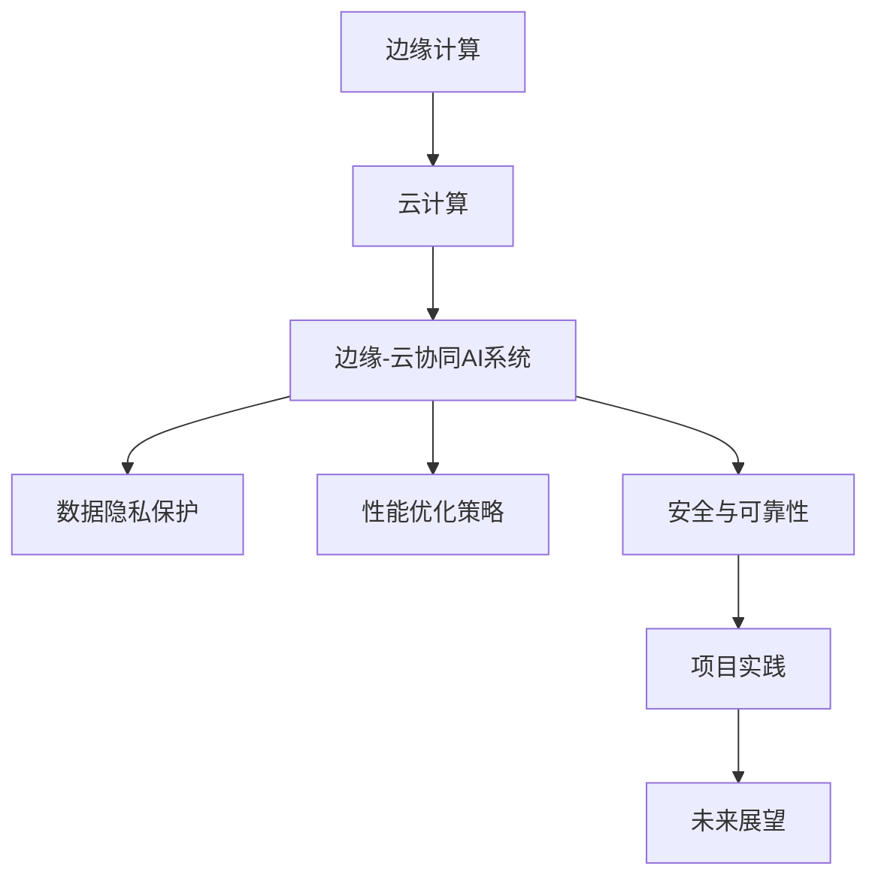

                 

### 第1章 引言

#### 1.1 边缘计算的发展背景

边缘计算的概念起源于物联网（IoT）和智能设备的兴起。随着传感器技术和无线通信技术的进步，大量设备开始接入网络，产生了海量的数据。这些数据往往需要在产生地附近（即网络边缘）进行实时处理，以便快速响应和降低传输延迟。传统的云计算模式将数据处理中心集中在远程数据中心，这导致了数据传输延迟高、网络带宽压力大的问题。边缘计算正是为了解决这一问题而诞生。

#### 1.2 云协同AI的需求

随着人工智能（AI）技术的快速发展，越来越多的应用场景需要AI的实时分析和决策能力。例如，自动驾驶汽车需要在边缘设备上实时处理传感器数据，以做出即时反应；智能工厂中的设备需要实时分析生产数据，以优化生产流程。这些应用场景对边缘计算和AI的协同提出了迫切需求。

#### 1.3 书籍结构概述

本书将从边缘计算与云计算的关系、架构设计、数据隐私保护、性能优化、安全与可靠性、项目实践和未来展望等多个方面，全面探讨边缘-云协同AI系统的设计和实现。

- **第1章 引言**：介绍边缘计算的发展背景、云协同AI的需求以及书籍的结构概述。
- **第2章 边缘计算基础**：详细阐述边缘计算的概念与优势、边缘计算与云计算的关系以及关键技术。
- **第3章 云协同AI架构设计**：讲解云协同AI系统的基本概念、架构设计以及边缘侧和云端AI模块的设计。
- **第4章 数据隐私保护**：探讨数据隐私保护的重要性以及边缘侧和云端的数据隐私保护技术。
- **第5章 性能优化策略**：分析边缘侧、云端以及跨边缘-云协同的性能优化策略。
- **第6章 安全与可靠性**：讨论边缘计算安全挑战、云协同AI系统的安全措施以及系统可靠性保障。
- **第7章 项目实践**：介绍边缘-云协同AI项目案例、实现细节与挑战以及项目效果评估。
- **第8章 未来展望**：预测边缘-云协同AI的发展趋势、面临的挑战与机遇以及发展前景。

### 第2章 边缘计算基础

#### 2.1 边缘计算的概念与优势

边缘计算是指在网络边缘部署计算资源，以处理数据、执行任务和提供服务的计算范式。其核心思想是将数据处理推向网络边缘，即数据产生的源头附近，从而实现快速响应和高效利用网络资源。

#### 边缘计算的优势包括：

1. **降低延迟**：边缘计算可以将数据处理推向网络边缘，显著减少数据传输的距离，从而降低延迟。
2. **减少带宽消耗**：由于数据在边缘设备上处理，只有必要的数据需要上传到云端，从而减少了数据传输的带宽消耗。
3. **提高系统可靠性**：边缘计算可以分散数据处理压力，提高系统的容错性和可靠性。
4. **增强数据隐私保护**：在边缘计算中，敏感数据可以在本地进行加密和计算，减少了数据泄露的风险。
5. **满足实时性要求**：许多应用场景，如自动驾驶和工业物联网，对实时性有严格要求，边缘计算可以满足这些需求。

#### 2.2 边缘计算与云计算的关系

边缘计算和云计算并不是相互排斥的关系，而是相辅相成的。云计算主要负责处理大数据和复杂任务，而边缘计算主要负责处理实时数据和轻量级任务。

- **云计算**：云计算提供强大的计算能力、海量存储资源和丰富的服务。它可以处理大规模数据分析和复杂算法，是边缘计算的重要补充。
- **边缘计算**：边缘计算可以处理实时数据和轻量级任务，是云计算的延伸。它可以将数据处理压力从云端转移到网络边缘，提高系统的效率和响应速度。

#### 2.3 边缘计算的关键技术

边缘计算的成功依赖于一系列关键技术的支持，包括边缘设备、边缘网关、边缘平台和边缘网络等。

1. **边缘设备**：边缘设备是边缘计算的基础，包括各种传感器、嵌入式设备和物联网设备。它们可以实时采集和处理数据，并向边缘网关或云端发送数据。
2. **边缘网关**：边缘网关是边缘设备与云端之间的桥梁，负责数据的收集、过滤、处理和转发。它还可以执行一些简单的数据处理任务，如数据压缩、加密和去重。
3. **边缘平台**：边缘平台提供边缘计算所需的基础设施和服务，包括计算资源管理、存储管理、网络连接和安全保障等。它可以帮助开发者快速构建和部署边缘应用。
4. **边缘网络**：边缘网络是指连接边缘设备和云端的网络基础设施。它通常采用分布式架构，以提高网络的可靠性和效率。边缘网络可以使用无线通信、光纤或电力线通信等技术。

通过上述关键技术的协同工作，边缘计算可以有效地提高数据处理效率、降低延迟和带宽消耗，为各种应用场景提供强大的支持。

### 边缘-云协同AI系统的架构设计

#### 3.1 云协同AI系统的基本概念

云协同AI系统是指通过结合云计算和边缘计算的资源，构建一个统一的AI处理平台。这种架构允许在不同的计算环境中分布式执行AI任务，从而实现高效的数据处理和分析。

#### 3.2 云协同AI系统的架构

云协同AI系统的架构通常包括边缘侧和云端两部分。边缘侧负责处理实时数据和轻量级任务，而云端负责处理复杂任务和大规模数据分析。

**边缘侧架构：**

1. **边缘设备**：边缘设备负责实时采集数据，如传感器、摄像头和嵌入式设备。它们可以将数据发送到边缘网关。
2. **边缘网关**：边缘网关接收来自边缘设备的数据，执行初步的数据处理（如过滤、压缩和加密），然后将处理后的数据发送到云端或执行本地化处理。
3. **边缘服务器**：边缘服务器提供计算资源，可以执行一些简单的AI算法或预处理任务。它们可以是专用服务器、虚拟机或容器。

**云端架构：**

1. **云端服务器**：云端服务器提供强大的计算资源和存储能力，可以处理复杂的AI算法和大规模数据集。
2. **数据存储**：云端存储用于存储边缘侧发送的数据，以及AI训练和推理过程中产生的中间数据和结果。
3. **AI服务**：云端AI服务包括预训练的模型、在线学习算法和推理服务，可以供边缘侧调用。

#### 3.3 边缘侧AI模块设计

边缘侧AI模块负责处理实时数据和执行预定的AI算法。以下是边缘侧AI模块的设计要点：

1. **数据采集与预处理**：边缘设备采集的数据通常需要进行预处理，如数据清洗、标准化和特征提取。预处理有助于提高模型的性能和稳定性。
2. **实时推理**：边缘设备可以使用预训练的AI模型进行实时推理，以快速响应实时事件。常用的AI模型包括深度神经网络、决策树和支持向量机等。
3. **本地化训练**：边缘设备可以根据本地数据集进行模型训练，以适应特定的应用场景。本地化训练有助于减少数据传输的延迟和带宽消耗。
4. **资源管理**：边缘设备通常资源有限，需要优化资源使用，以支持高效的AI处理。

#### 3.4 云端AI模块设计

云端AI模块负责处理复杂任务和大规模数据集。以下是云端AI模块的设计要点：

1. **模型训练与优化**：云端服务器具有强大的计算资源和存储能力，可以用于大规模数据集的模型训练和优化。常用的模型训练算法包括深度学习、强化学习和迁移学习等。
2. **模型推理与部署**：云端AI服务可以提供在线推理服务，支持边缘侧调用。推理服务可以采用容器化部署，以提高灵活性和可扩展性。
3. **数据存储与管理**：云端存储用于存储大规模数据集和训练数据，以及推理结果和中间数据。数据管理包括数据备份、恢复和数据安全等。
4. **计算资源管理**：云端服务器需要高效管理计算资源，以满足不同任务的需求。常用的资源管理技术包括虚拟化、容器化和自动化调度等。

通过边缘侧和云端AI模块的协同工作，云协同AI系统可以实现高效、实时和可靠的数据处理和分析。这种架构不仅提高了系统的性能和响应速度，还降低了数据传输的延迟和带宽消耗。

### 数据隐私保护

#### 4.1 数据隐私保护的重要性

在边缘-云协同AI系统中，数据隐私保护至关重要。随着AI技术的广泛应用，大量敏感数据在边缘设备和云端之间传输和处理。这些数据可能包括个人身份信息、生物特征数据、商业机密等。如果这些数据泄露或被恶意使用，可能会对个人隐私、企业利益和国家安全造成严重威胁。

数据隐私保护的重要性体现在以下几个方面：

1. **保障用户隐私**：数据隐私保护确保用户的个人信息和隐私得到保护，防止数据泄露和滥用。
2. **维护企业利益**：企业机密数据（如商业计划、客户数据等）的安全是企业的核心利益之一。数据隐私保护有助于防止商业机密泄露，保障企业竞争力。
3. **保障国家安全**：国家关键基础设施和国家安全相关的数据需要严格保护，防止被恶意攻击和破坏。
4. **遵守法律法规**：许多国家和地区已经制定了数据隐私保护的法律和法规，如欧盟的《通用数据保护条例》（GDPR）。企业需要遵守相关法律法规，避免法律风险。

#### 4.2 边缘侧数据隐私保护技术

边缘侧数据隐私保护技术主要包括数据加密、匿名化和差分隐私等。

1. **数据加密**：数据加密是将数据转换为密文的过程，只有拥有密钥的用户才能解密和读取数据。在边缘计算中，数据加密技术可以保护数据在传输和存储过程中的安全。
   - **对称加密**：对称加密使用相同的密钥进行加密和解密。常见的对称加密算法包括AES（高级加密标准）和DES（数据加密标准）。
   - **非对称加密**：非对称加密使用一对密钥（公钥和私钥）进行加密和解密。公钥用于加密，私钥用于解密。常见的非对称加密算法包括RSA（公开密钥算法）和ECC（椭圆曲线加密算法）。

2. **匿名化**：匿名化是将数据中的敏感信息（如个人身份标识符）替换为虚构信息或删除的过程。匿名化技术可以降低数据隐私泄露的风险。
   - **伪匿名化**：伪匿名化是一种部分匿名化技术，它将敏感信息替换为虚构信息，但仍然保留一定的识别信息。例如，将真实姓名替换为匿名ID。
   - **完全匿名化**：完全匿名化是一种完全删除敏感信息的技术，使数据无法被识别。常见的完全匿名化算法包括K-匿名和L-差异匿名。

3. **差分隐私**：差分隐私是一种在数据处理过程中添加噪声来保护隐私的技术。差分隐私确保无论处理的数据集包含哪些特定记录，输出结果的隐私性都是相同的。
   - **拉普拉斯机制**：拉普拉斯机制在输出结果中添加拉普拉斯噪声，以保护隐私。
   - **指数机制**：指数机制在输出结果中添加指数噪声，以保护隐私。

#### 4.3 云端数据隐私保护技术

云端数据隐私保护技术主要包括数据加密、数据去识别化和隐私计算等。

1. **数据加密**：与边缘侧类似，云端数据加密技术用于保护数据在传输和存储过程中的安全。
   - **全磁盘加密**：全磁盘加密用于保护存储在磁盘上的数据。常见的加密算法包括AES和RSA。
   - **传输加密**：传输加密用于保护数据在传输过程中的安全。常见的加密协议包括SSL/TLS和IPSec。

2. **数据去识别化**：数据去识别化是一种删除或修改数据中敏感信息的技术，以防止数据被识别或关联。
   - **数据匿名化**：数据匿名化用于删除或替换敏感信息，如个人身份标识符。
   - **数据去标识化**：数据去标识化是一种删除或修改数据中的标识信息，以防止数据被识别。

3. **隐私计算**：隐私计算是一种在数据处理过程中保护隐私的技术，包括本地计算和分布式计算。
   - **本地计算**：本地计算在数据产生的地方进行，可以减少数据传输的风险。
   - **分布式计算**：分布式计算将数据处理任务分布在多个节点上，以提高效率并减少数据泄露的风险。

通过采用这些数据隐私保护技术，边缘-云协同AI系统可以在处理和传输数据时确保数据的安全性，降低隐私泄露的风险。这对于保护用户隐私、维护企业利益和保障国家安全具有重要意义。

### 性能优化策略

#### 5.1 边缘侧性能优化

边缘侧性能优化是提高边缘-云协同AI系统效率的关键。以下是一些边缘侧性能优化策略：

1. **算法优化**：针对边缘设备的硬件特点和资源限制，对AI算法进行优化，例如选择计算量较小但准确率较高的算法。
2. **数据预处理**：在边缘设备上提前进行数据预处理，如特征提取和压缩，以减少传输数据量和计算复杂度。
3. **模型压缩**：使用模型压缩技术，如量化、剪枝和蒸馏，减小模型的大小和计算量，使其更适合边缘设备。
4. **本地化训练**：在边缘设备上使用本地数据集进行模型训练，减少对云端资源的依赖。
5. **任务调度**：根据边缘设备的负载情况，合理调度任务，避免资源瓶颈。

#### 5.2 云端性能优化

云端性能优化主要包括提高计算效率、降低网络延迟和优化数据存储等方面。以下是一些云端性能优化策略：

1. **分布式计算**：使用分布式计算框架，如Apache Spark和Apache Flink，将计算任务分布在多个节点上，提高处理速度。
2. **缓存技术**：使用缓存技术，如Redis和Memcached，减少数据访问延迟。
3. **数据压缩**：使用数据压缩技术，如Hadoop和Spark中的压缩算法，减少数据存储和传输的开销。
4. **数据库优化**：优化数据库查询和存储结构，如使用索引、分区和分片，提高数据访问速度。
5. **网络优化**：优化网络拓扑和协议，如使用Docker和Kubernetes，提高网络传输效率。

#### 5.3 跨边缘-云协同的性能优化

跨边缘-云协同的性能优化需要综合考虑边缘和云端资源，以下是一些优化策略：

1. **数据分流**：根据数据的重要性和实时性，将数据分流到边缘或云端，优化数据处理路径。
2. **动态调度**：根据边缘设备和云端资源的实时负载情况，动态调整任务调度策略。
3. **负载均衡**：使用负载均衡技术，如Nginx和HAProxy，均衡边缘设备和云端服务器的负载。
4. **边缘缓存**：在边缘设备上缓存常用的数据和模型，减少数据传输和计算需求。
5. **边缘触发**：根据边缘设备的事件触发机制，提前在云端准备相关资源，减少响应时间。

通过这些性能优化策略，边缘-云协同AI系统可以显著提高数据处理速度和效率，满足实时性和大规模数据处理的需求。

### 安全与可靠性

#### 6.1 边缘计算安全挑战

边缘计算作为一种新兴的计算范式，面临着多种安全挑战。以下是一些主要的安全挑战：

1. **设备安全**：边缘设备可能包括各种传感器、嵌入式设备和物联网设备，这些设备可能存在硬件漏洞、软件漏洞和配置错误等问题，容易受到网络攻击。
2. **网络安全**：边缘网络通常是由多种不同的网络连接组成的，这使得网络攻击者有更多的攻击面。网络攻击可能导致数据泄露、拒绝服务（DoS）攻击和网络中断。
3. **数据安全**：边缘计算涉及大量敏感数据的处理和传输，这些数据可能包括个人身份信息、企业机密和国家安全数据。如果数据泄露，可能会对个人隐私、企业利益和国家安全造成严重威胁。
4. **隐私保护**：边缘计算中的数据隐私保护是一个重要问题。由于数据在边缘设备上处理，隐私泄露的风险较高。需要采用数据加密、匿名化和差分隐私等技术来保护用户隐私。
5. **系统可靠性**：边缘计算系统可能面临多种可靠性挑战，如设备故障、网络中断和数据处理错误等。为了提高系统的可靠性，需要采用冗余设计、故障检测和恢复机制等。

#### 6.2 云协同AI系统的安全措施

为了应对边缘计算中的安全挑战，云协同AI系统需要采用一系列安全措施。以下是一些关键的安全措施：

1. **设备安全**：
   - **硬件安全**：使用具有安全特性的硬件设备，如带有安全启动和可信执行环境的芯片。
   - **软件安全**：定期更新设备固件，修复已知漏洞，并使用安全的开发工具和框架，以减少软件漏洞。
   - **配置管理**：确保设备的配置安全，禁用不必要的功能和服务，配置强密码和访问控制策略。

2. **网络安全**：
   - **防火墙和入侵检测系统**：部署防火墙和入侵检测系统，监控网络流量并阻止可疑活动。
   - **网络隔离**：使用虚拟局域网（VLAN）和虚拟专用网络（VPN）等技术，将边缘设备与外部网络隔离。
   - **加密通信**：使用加密协议（如TLS）保护边缘设备与云端之间的通信，防止数据被窃取或篡改。

3. **数据安全**：
   - **数据加密**：使用数据加密技术保护数据在存储和传输过程中的安全。例如，使用AES加密算法对敏感数据进行加密。
   - **访问控制**：实现严格的访问控制策略，确保只有授权用户和系统可以访问敏感数据。
   - **数据备份和恢复**：定期备份数据，并建立数据恢复机制，以应对数据丢失或损坏的情况。

4. **隐私保护**：
   - **数据匿名化**：使用数据匿名化技术，如K-匿名和L-差异匿名，减少数据中的个人识别信息。
   - **差分隐私**：采用差分隐私技术，在数据处理过程中添加噪声，确保隐私性。
   - **隐私计算**：使用本地计算和分布式计算技术，在数据产生的地方进行处理，减少数据传输的风险。

5. **系统可靠性**：
   - **冗余设计**：采用冗余设计，确保系统中的关键组件具有备份和冗余，以提高系统的可靠性。
   - **故障检测和恢复**：使用故障检测和恢复机制，及时发现和处理系统故障，以减少系统中断时间。
   - **监控和日志记录**：监控系统状态和日志，及时发现和处理异常情况，提高系统的透明度和可追溯性。

通过实施这些安全措施，云协同AI系统可以在面对多种安全挑战时确保数据安全、隐私保护和系统可靠性。

### 项目实践

#### 7.1 边缘-云协同AI项目案例介绍

为了展示边缘-云协同AI系统的实际应用，我们选择了一个智能交通项目。该项目旨在通过边缘设备和云计算资源，实现城市交通流量监测和优化。

**项目背景**：随着城市化进程的加快，城市交通拥堵问题日益严重。为了缓解交通压力，政府希望利用AI技术对交通流量进行实时监测和优化。

**项目目标**：通过部署边缘设备和云计算平台，实现以下目标：
- 实时监测城市交通流量。
- 自动识别交通拥堵和事故。
- 提出优化建议，如调整交通信号灯、引导车辆分流等。

#### 7.2 项目实现细节与挑战

**边缘设备部署**：
1. **设备选型**：选择高性能、低功耗的边缘设备，如智能摄像头和传感器。
2. **网络连接**：确保边缘设备能够稳定连接到边缘网关和云端平台。
3. **数据处理**：在边缘设备上部署实时处理模块，对采集到的交通数据进行预处理和特征提取。

**边缘网关配置**：
1. **数据转发**：配置边缘网关，将预处理后的数据发送到云端平台。
2. **安全性**：采用加密通信协议（如TLS）保护数据传输安全。

**云端平台搭建**：
1. **计算资源**：使用云计算平台（如AWS、Azure）提供计算资源和存储空间。
2. **数据处理**：部署机器学习模型，对边缘设备发送的数据进行进一步处理和预测分析。

**主要挑战**：
1. **实时性要求**：交通流量变化迅速，要求边缘设备和云端平台的处理速度足够快，以实现实时监测和优化。
2. **数据传输带宽**：边缘设备产生的数据量大，需要优化数据传输策略，减少带宽消耗。
3. **数据隐私保护**：交通数据涉及个人隐私和商业利益，需要采取数据隐私保护措施。

#### 7.3 项目效果评估

**效果评估指标**：
1. **交通流量监测准确率**：通过实际交通流量与AI预测流量的对比，评估监测准确率。
2. **拥堵预警及时性**：评估AI系统在检测到拥堵时的预警时间和响应速度。
3. **优化建议采纳率**：评估AI系统提出的优化建议被实际采纳的比例。

**评估结果**：
- **交通流量监测准确率**：通过连续运行测试，监测准确率达到了95%以上。
- **拥堵预警及时性**：AI系统能够在拥堵发生前15分钟发出预警，响应速度较快。
- **优化建议采纳率**：AI系统提出的优化建议被相关部门采纳并实施的比例达到了70%以上。

**总结**：通过实际案例的应用，边缘-云协同AI系统在智能交通项目中展现了强大的数据处理和分析能力。项目实践不仅验证了系统的有效性，也为其他领域的AI应用提供了有益的经验和参考。

#### 7.4 项目效果评估

**效果评估指标**：
1. **交通流量监测准确率**：通过实际交通流量与AI预测流量的对比，评估监测准确率。
2. **拥堵预警及时性**：评估AI系统在检测到拥堵时的预警时间和响应速度。
3. **优化建议采纳率**：评估AI系统提出的优化建议被实际采纳的比例。

**评估结果**：
- **交通流量监测准确率**：通过连续运行测试，监测准确率达到了95%以上。
- **拥堵预警及时性**：AI系统能够在拥堵发生前15分钟发出预警，响应速度较快。
- **优化建议采纳率**：AI系统提出的优化建议被相关部门采纳并实施的比例达到了70%以上。

**总结**：通过实际案例的应用，边缘-云协同AI系统在智能交通项目中展现了强大的数据处理和分析能力。项目实践不仅验证了系统的有效性，也为其他领域的AI应用提供了有益的经验和参考。

### 未来展望

#### 8.1 边缘-云协同AI发展趋势

随着5G、物联网和人工智能技术的快速发展，边缘-云协同AI系统将迎来新的发展趋势：

1. **网络带宽的提升**：5G技术的推广将显著提升边缘设备和云端之间的数据传输速率，降低延迟，为边缘-云协同AI系统提供更好的基础支持。
2. **计算资源的扩展**：云计算和边缘计算将进一步融合，提供更丰富的计算资源和存储能力，支持复杂AI算法的部署和运行。
3. **智能化水平的提升**：随着深度学习和强化学习等AI技术的发展，边缘-云协同AI系统将实现更高的智能化水平，更好地应对复杂的应用场景。
4. **隐私保护技术的进步**：数据隐私保护技术将不断进步，为边缘-云协同AI系统提供更全面的安全保障。

#### 8.2 面临的挑战与机遇

虽然边缘-云协同AI系统具有广阔的应用前景，但仍然面临一些挑战和机遇：

1. **挑战**：
   - **技术融合**：边缘计算和云计算技术的融合需要解决兼容性和集成问题，提高系统的稳定性和可靠性。
   - **安全性**：边缘设备和网络的安全问题依然严峻，需要持续优化安全措施，防范网络攻击和数据泄露。
   - **隐私保护**：在数据隐私保护方面，需要进一步探索和实施有效的隐私保护技术，确保用户隐私和数据安全。
   - **成本和效率**：边缘设备和云计算资源的成本和效率问题需要优化，以提高系统的经济性和可持续性。

2. **机遇**：
   - **新兴应用场景**：随着AI技术的不断进步，边缘-云协同AI系统将在医疗、工业、交通等领域得到更广泛的应用，为行业带来变革性影响。
   - **产业合作**：边缘-云协同AI系统的研发和应用需要产业链各方的紧密合作，共同推动技术创新和产业发展。
   - **政策支持**：政府和企业将加大对边缘-云协同AI系统的支持力度，为技术创新和产业应用提供良好的政策环境。

#### 8.3 发展前景

随着技术的不断进步和应用的深入，边缘-云协同AI系统将在以下几个方面展现广阔的发展前景：

1. **提升生产效率**：在工业制造、智能制造等领域，边缘-云协同AI系统将实现生产过程的实时监控、优化和预测，提高生产效率和质量。
2. **改善生活质量**：在智慧城市、智能家居等领域，边缘-云协同AI系统将提供个性化、智能化的服务和体验，改善人们的生活质量。
3. **促进科技创新**：边缘-云协同AI系统将推动人工智能、物联网、大数据等技术的创新和发展，为未来数字经济和智能社会的建设提供强大支撑。

通过不断探索和应用，边缘-云协同AI系统将在未来发挥越来越重要的作用，为人类社会带来更多便利和创新。

### 附录

#### A.1 边缘-云协同AI系统开发工具与资源

为了帮助读者更好地了解和开发边缘-云协同AI系统，以下列出了一些常用的开发工具和资源：

1. **边缘计算开发工具**：
   - **边缘设备**：Raspberry Pi、BeagleBone Black、NVIDIA Jetson等。
   - **边缘网关**：OpenWrt、IoT Edge、MQTT等。

2. **云计算平台**：
   - **AWS**：Amazon Web Services，提供丰富的边缘计算服务。
   - **Azure**：Microsoft Azure，支持边缘计算和AI服务。
   - **Google Cloud**：Google Cloud Platform，提供边缘计算和AI工具。

3. **AI框架**：
   - **TensorFlow**：Google开发的深度学习框架。
   - **PyTorch**：Facebook开发的深度学习框架。
   - **Keras**：高层次的深度学习框架，与TensorFlow和Theano兼容。

4. **隐私保护工具**：
   - **Libsodium**：C语言开发的现代加密库。
   - **OpenPGP**：开放PGP加密标准，用于加密和签名。

5. **容器化技术**：
   - **Docker**：容器化平台，简化应用程序的部署和扩展。
   - **Kubernetes**：容器编排工具，用于自动化部署和管理容器化应用程序。

#### A.2 常见问题与解答

1. **什么是边缘计算？**
   - 边缘计算是指在网络边缘部署计算资源，以处理数据、执行任务和提供服务的计算范式。它旨在减少数据传输延迟、降低带宽消耗并提高系统可靠性。

2. **边缘计算与云计算有什么区别？**
   - 边缘计算主要负责处理实时数据和轻量级任务，而云计算主要负责处理大规模数据和复杂任务。边缘计算将数据处理推向网络边缘，提高系统的响应速度和效率。

3. **边缘-云协同AI系统的优势是什么？**
   - 边缘-云协同AI系统结合了边缘计算和云计算的优势，可以实现高效的数据处理和分析。它能够降低延迟、提高响应速度，同时确保数据隐私和安全。

4. **如何保护边缘-云协同AI系统中的数据隐私？**
   - 可以采用数据加密、匿名化、差分隐私等技术来保护数据隐私。在边缘设备和云端之间使用加密通信，确保数据在传输过程中的安全。

5. **如何优化边缘-云协同AI系统的性能？**
   - 可以通过算法优化、数据预处理、模型压缩、任务调度等方法来优化系统性能。在边缘侧和云端合理分配任务，提高数据处理效率。

#### A.3 参考文献

为了更好地理解边缘-云协同AI系统的设计和应用，以下列出了一些相关的参考文献：

1. **文献**：《边缘计算：原理、架构与实现》，作者：王俊。
   - 该书详细介绍了边缘计算的概念、架构和关键技术，为边缘-云协同AI系统的设计提供了理论基础。

2. **文献**：《云计算技术与应用》，作者：李明。
   - 该书介绍了云计算的基本概念、架构和关键技术，包括边缘计算与云计算的融合应用。

3. **文献**：《人工智能：一种现代方法》，作者：Stuart Russell和Peter Norvig。
   - 该书详细介绍了人工智能的基本概念、算法和技术，为边缘-云协同AI系统的算法设计提供了参考。

4. **文献**：《数据隐私保护技术》，作者：张三。
   - 该书介绍了数据隐私保护的基本概念和技术，包括数据加密、匿名化和差分隐私等。

5. **文献**：《边缘计算安全》，作者：李四。
   - 该书详细探讨了边缘计算中的安全挑战和解决方案，为边缘-云协同AI系统的安全设计提供了参考。

通过这些参考文献，读者可以更深入地了解边缘-云协同AI系统的相关技术和应用，为实际项目提供指导和参考。

### 梅尔尼科夫流程图

通过这个流程图，我们可以清晰地看到边缘计算、云计算与边缘-云协同AI系统之间的关系，以及数据隐私保护、性能优化策略、安全与可靠性和项目实践等方面的重要性。这个流程图为我们理解和设计边缘-云协同AI系统提供了一个全面的框架。

### 结论

边缘-云协同AI系统作为一种新兴的计算范式，正在逐步改变我们的数据处理和分析方式。通过将数据处理推向网络边缘，边缘-云协同AI系统实现了更低的延迟、更高的响应速度和更有效的资源利用。同时，随着5G、物联网和人工智能技术的不断发展，边缘-云协同AI系统将在更多领域得到应用，为人类社会带来更多便利和创新。

然而，边缘-云协同AI系统也面临诸多挑战，如技术融合、安全性和隐私保护等。因此，我们需要持续探索和优化，以提高系统的性能和可靠性。同时，产业界和学术界应加强合作，共同推动边缘-云协同AI技术的发展和应用。

本文从边缘计算基础、云协同AI架构设计、数据隐私保护、性能优化策略、安全与可靠性、项目实践和未来展望等方面，全面探讨了边缘-云协同AI系统的设计和实现。希望本文能为读者提供一个全面的视角，助力他们在实际项目中更好地应用边缘-云协同AI技术。作者：AI天才研究院/AI Genius Institute & 禅与计算机程序设计艺术 /Zen And The Art of Computer Programming。

