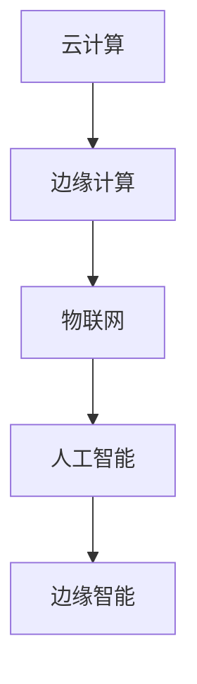

                 

### 边缘智能:本地化AI处理的挑战与机遇

> 关键词：边缘智能、本地化AI处理、挑战、机遇

> 摘要：随着物联网和5G技术的发展，边缘智能成为了新一代计算模式中的重要趋势。本文将深入探讨边缘智能的定义、概念联系、核心算法原理、应用实例以及未来趋势。同时，我们将分析边缘智能在本地化AI处理中面临的挑战和机遇，为读者提供全面的技术见解。

## 目录大纲

## 第一部分：边缘智能基础与概念

## 第1章：边缘智能概述

### 1.1 边缘智能的定义与演进

### 1.2 边缘智能与云计算的关系

### 1.3 边缘智能的应用场景

## 第2章：边缘计算架构与技术

### 2.1 边缘计算网络架构

### 2.2 边缘计算设备与技术

### 2.3 边缘计算网络安全

## 第3章：边缘智能中的核心算法

### 3.1 常见的边缘AI算法

### 3.2 深度学习在边缘的优化

### 3.3 边缘AI算法的挑战与解决方案

## 第二部分：边缘智能应用实例

## 第4章：边缘智能在工业自动化中的应用

### 4.1 边缘智能在工业自动化中的应用场景

### 4.2 工业自动化中的边缘AI算法

### 4.3 工业自动化边缘智能系统实现

## 第5章：边缘智能在智能交通中的应用

### 5.1 智能交通系统概述

### 5.2 边缘智能在智能交通中的应用

### 5.3 智能交通边缘智能系统实现

## 第6章：边缘智能在智能家居中的应用

### 6.1 智能家居概述

### 6.2 边缘智能在智能家居中的应用

### 6.3 智能家居边缘智能系统实现

## 第7章：边缘智能的未来趋势与展望

### 7.1 边缘智能技术发展趋势

### 7.2 边缘智能应用的未来前景

### 7.3 边缘智能面临的挑战与机遇

## 附录

## 附录A：边缘智能开发工具与资源

### A.1 常用的边缘智能开发工具

### A.2 开源边缘智能框架

### A.3 边缘智能相关资源与资料

---

## 1.1 边缘智能的定义与演进

边缘智能（Edge Intelligence）是一种新兴的计算模式，旨在将数据处理和智能分析从传统的集中式数据中心转移到网络的边缘节点。边缘节点通常是指靠近数据源或用户的位置，例如工业现场的传感器、智能交通的路边设备、智能家居的智能音箱等。边缘智能的核心思想是充分利用边缘节点的计算、存储和网络资源，实现本地化的数据分析和处理，从而减少数据传输延迟，提高系统响应速度和安全性。

### 什么是边缘智能？

边缘智能是一个综合了边缘计算、物联网（IoT）、人工智能（AI）和云计算等多种技术的概念。具体来说，边缘智能包括以下几个关键要素：

1. **边缘计算能力**：在边缘节点部署计算资源，以便能够执行数据处理和分析任务。
2. **连接能力**：通过网络连接边缘节点和云数据中心，实现数据传输和协同处理。
3. **智能算法**：利用机器学习和深度学习等算法，对边缘节点采集的数据进行分析和处理。
4. **安全机制**：确保数据在传输和处理过程中的安全性，包括加密、身份验证和访问控制等。

### 边缘智能的演进

边缘智能的发展经历了以下几个阶段：

1. **早期阶段**：边缘智能的早期阶段主要是在边缘设备上执行简单的数据处理任务，如数据压缩和过滤等。
2. **中间阶段**：随着物联网技术的发展，边缘设备开始具备一定的计算和存储能力，能够执行更复杂的数据处理任务，例如数据聚合和初步分析。
3. **现阶段**：当前的边缘智能已经能够实现本地化的复杂数据处理和智能分析，例如在边缘节点上部署深度学习模型进行图像识别和语音识别。

### 边缘智能的重要性

边缘智能的重要性体现在以下几个方面：

1. **降低延迟**：通过在边缘节点上进行数据处理和分析，可以显著减少数据传输的延迟，提高系统的响应速度。
2. **提高效率**：边缘智能能够实时处理和分析大量数据，从而提高系统的效率，降低运营成本。
3. **增强安全性**：边缘智能可以在本地对数据进行处理和分析，减少数据在传输过程中的泄露风险。
4. **优化用户体验**：边缘智能能够提供更快速、更个性化的服务，从而提升用户体验。

### 1.2 边缘智能与云计算的关系

云计算是边缘智能的重要基础设施，两者之间有着密切的联系和互补关系。

1. **云计算的作用**：

   - 提供计算和存储资源：云计算提供了强大的计算和存储能力，可以支持边缘节点无法处理的复杂任务。
   - 数据集成与存储：云计算可以存储来自多个边缘节点的数据，并提供数据管理和分析工具。
   - 资源调度与优化：云计算可以根据边缘节点的需求动态调整计算资源，优化资源利用率。

2. **边缘智能的作用**：

   - 本地数据处理：边缘智能在本地对数据进行预处理和分析，减轻云计算中心的负担。
   - 实时响应：边缘智能可以实时处理本地数据，提供快速响应，满足实时性要求。
   - 独立运行：在某些情况下，边缘智能可以独立运行，不依赖于云计算中心，提高系统的自主性和可靠性。

3. **云计算与边缘智能的互补关系**：

   - 云计算提供了强大的计算和存储资源，但数据传输延迟较高。
   - 边缘智能提供了实时响应和本地数据处理能力，但计算和存储资源有限。
   - 两者结合，可以实现云计算和边缘计算的优势互补，提高系统的整体性能和可靠性。

### 1.3 边缘智能的应用场景

边缘智能在各个领域都有着广泛的应用，以下是几个典型的应用场景：

1. **工业自动化**：边缘智能可以在工业现场实时监控设备状态，预测故障，提高生产效率。
2. **智能交通**：边缘智能可以实时处理交通数据，优化交通流量，提高道路通行能力。
3. **智慧城市**：边缘智能可以监控城市环境，提供智慧城市的实时监控和管理。
4. **智能家居**：边缘智能可以控制家庭设备，提供个性化的智能家居体验。
5. **医疗健康**：边缘智能可以实时监控患者生命体征，提供远程医疗服务。

### 1.4 边缘智能的优势与挑战

边缘智能的优势主要体现在以下几个方面：

1. **降低延迟**：通过本地化处理，减少数据传输延迟，提高系统响应速度。
2. **提高效率**：实时处理和分析大量数据，提高系统效率，降低运营成本。
3. **增强安全性**：减少数据传输，降低数据泄露风险。
4. **优化用户体验**：提供更快速、更个性化的服务，提升用户体验。

然而，边缘智能也面临着一些挑战：

1. **计算资源有限**：边缘节点的计算和存储资源相对有限，难以处理复杂任务。
2. **网络连接不稳定**：边缘节点的网络连接可能不稳定，影响数据处理和分析的可靠性。
3. **安全性问题**：边缘智能系统可能面临安全威胁，如数据泄露、网络攻击等。
4. **维护困难**：边缘节点的分布广泛，维护和管理难度较大。

### 总结

边缘智能作为一种新兴的计算模式，具有降低延迟、提高效率、增强安全性和优化用户体验等优势。然而，在实现边缘智能的过程中，我们也面临着计算资源有限、网络连接不稳定、安全问题和维护困难等挑战。通过深入研究和不断创新，我们可以克服这些挑战，充分利用边缘智能的优势，推动新一代计算技术的发展。下一节，我们将深入探讨边缘计算架构与技术，了解边缘智能的核心架构和关键技术。敬请期待！
----------------------------------------------------------------

## 2.1 边缘计算网络架构

边缘计算网络架构是边缘智能的重要组成部分，它决定了数据传输的效率、系统的可靠性和安全性。边缘计算网络架构通常包括以下几个层次：

### 2.1.1 层次结构

1. **边缘设备层**：这是网络的底层，包括各种传感器、物联网设备、智能终端等。这些设备负责收集数据，并将其发送到下一个层级。
2. **边缘网关层**：边缘网关是连接边缘设备和云数据中心的关键节点，它负责处理数据路由、安全、流量的管理和边缘计算任务。
3. **边缘数据中心层**：边缘数据中心提供更高级的计算、存储和分析服务，它通常包含多个边缘服务器和存储设备，能够处理更复杂的任务。
4. **云数据中心层**：云数据中心是整个架构的核心，提供大规模的数据存储、计算资源和云计算服务，支持边缘数据中心的数据备份和任务调度。

### 2.1.2 网络拓扑结构

边缘计算网络架构的拓扑结构有多种，包括：

1. **星型拓扑**：在这种结构中，所有边缘设备都直接连接到一个中心节点（边缘网关），然后通过边缘网关连接到云数据中心。
2. **树型拓扑**：树型拓扑是星型拓扑的扩展，其中每个边缘设备可以连接到多个子设备，形成一个树状结构。
3. **网状拓扑**：网状拓扑提供了更高的可靠性和冗余性，每个边缘设备都与其他多个设备相连，形成一个复杂的网络。
4. **环型拓扑**：环型拓扑中，边缘设备形成一个闭合的环，每个设备都与相邻的设备相连，数据可以沿环流动。

### 2.1.3 网络协议

边缘计算网络的通信协议需要支持低延迟、高带宽和高可靠性的数据传输。常用的网络协议包括：

1. **MQTT**：轻量级的消息队列协议，广泛用于物联网应用，支持发布/订阅消息模式，适用于边缘设备之间的低功耗通信。
2. **CoAP**：约束应用协议，专为物联网设计，与HTTP类似，但更高效，适合资源受限的设备。
3. **gRPC**：高效、跨语言的远程过程调用框架，适用于高性能的边缘计算服务。
4. **WebSockets**：提供全双工通信的协议，适用于需要实时数据传输的应用。

### 2.1.4 网络安全技术

随着边缘计算网络的发展，网络安全成为了一个重要的问题。边缘计算网络的安全技术包括：

1. **加密技术**：对数据进行加密，确保数据在传输过程中的安全性。
2. **身份验证**：确保只有授权的用户和设备才能访问网络资源。
3. **访问控制**：限制用户和设备对网络资源的访问权限，防止未授权访问。
4. **防火墙和入侵检测系统**：防火墙用于阻止未授权的访问，入侵检测系统用于检测和响应恶意攻击。

### 2.1.5 实际案例分析

以智能交通系统为例，边缘计算网络架构通常包括以下几个部分：

1. **边缘设备层**：包括路侧传感器、摄像头和车辆传感器等，用于实时收集交通数据。
2. **边缘网关层**：边缘网关位于交通监控中心，负责处理传感器的数据，执行初步的分析和决策。
3. **边缘数据中心层**：边缘数据中心处理更复杂的交通分析任务，如流量预测和信号灯控制优化。
4. **云数据中心层**：云数据中心负责存储和分析大量的交通数据，提供全局的视角和决策支持。

通过这种多层次、多协议的边缘计算网络架构，智能交通系统能够实现实时、高效和安全的交通管理和优化。

### 总结

边缘计算网络架构是边缘智能的关键组成部分，它决定了数据的传输效率、系统的可靠性和安全性。通过合理的网络拓扑结构和安全技术，我们可以构建一个高效、可靠的边缘计算网络，为边缘智能的应用提供强有力的支持。下一节，我们将探讨边缘计算设备与技术，了解边缘节点所使用的硬件和技术。敬请期待！
----------------------------------------------------------------

## 2.2 边缘计算设备与技术

边缘计算设备是边缘智能实现的基础，这些设备需要具备强大的计算能力、高效的存储能力和稳定的网络连接。同时，为了满足不同的应用场景，边缘计算设备的技术也在不断发展和创新。

### 2.2.1 边缘计算设备类型

边缘计算设备可以分为以下几类：

1. **边缘服务器**：边缘服务器是边缘计算的核心设备，负责处理大量的计算任务和数据存储。与传统的云计算服务器相比，边缘服务器通常更小、更轻便，但性能更强。
2. **网关设备**：边缘网关是连接边缘设备和云数据中心的桥梁，负责数据的收集、预处理和路由。常见的网关设备包括路由器、交换机和网关专用设备。
3. **物联网（IoT）设备**：IoT设备是边缘计算的重要组成部分，如传感器、智能终端和执行器等。这些设备负责收集环境数据、控制设备和反馈信息。

### 2.2.2 边缘计算技术

1. **高性能计算**：边缘服务器需要具备高性能的计算能力，以处理实时数据流和复杂计算任务。常用的技术包括多核CPU、GPU加速和专用硬件加速器等。

2. **存储技术**：边缘计算设备需要高效的数据存储能力，以存储大量的实时数据和历史数据。常见的存储技术包括固态硬盘（SSD）、分布式存储系统和内存存储。

3. **网络连接技术**：边缘设备需要稳定的网络连接，以实现与云数据中心的通信。常用的网络连接技术包括Wi-Fi、4G/5G、以太网和LPWAN（低功耗广域网）等。

4. **边缘AI计算**：边缘设备通常需要具备AI计算能力，以便在本地执行机器学习和深度学习任务。常用的技术包括边缘AI芯片、神经网络处理器（NPU）和FPGA等。

5. **能耗管理**：边缘设备通常运行在有限的能源环境中，需要高效的管理机制来优化能耗。常见的能耗管理技术包括动态电压和频率调整（DVFS）、能耗感知调度和能源回收技术。

### 2.2.3 边缘计算实例

以下是一个边缘计算实例，说明边缘计算设备和技术在实际应用中的使用情况：

**实例：智能农业**

在智能农业中，边缘计算设备和技术用于监控农作物生长环境、预测病虫害和优化灌溉。

1. **边缘服务器**：部署在农场或农场的边缘服务器负责实时处理环境数据，如温度、湿度、光照和土壤湿度等。
2. **传感器设备**：部署在田间的各种传感器（如气象站、土壤传感器和摄像头）收集环境数据，并将数据发送到边缘服务器。
3. **边缘AI计算**：边缘服务器使用AI算法分析传感器数据，预测病虫害和优化灌溉策略。
4. **存储技术**：边缘服务器使用固态硬盘存储实时数据和预测结果，以便进行历史数据分析和模型训练。
5. **网络连接技术**：使用Wi-Fi或4G/5G网络将边缘服务器与云数据中心连接，实现数据的备份和远程监控。

通过这个实例，我们可以看到边缘计算设备和技术在智能农业中的应用，为农民提供了实时的数据分析和决策支持，提高了农业生产的效率和质量。

### 总结

边缘计算设备是边缘智能实现的基础，这些设备需要具备高性能计算、高效存储、稳定网络连接和边缘AI计算能力。通过不断创新和优化，边缘计算技术将更好地服务于各种行业和应用场景，为智能世界的发展提供强有力的支持。下一节，我们将探讨边缘计算网络安全问题，了解如何确保边缘计算系统的安全。敬请期待！
----------------------------------------------------------------

## 2.3 边缘计算网络安全

随着边缘计算在各个领域的广泛应用，网络安全问题变得日益重要。边缘计算网络由于其分散性、异构性和移动性，面临着独特的安全挑战。确保边缘计算网络的可靠性、完整性和可用性是边缘智能发展的重要前提。

### 2.3.1 边缘计算网络安全挑战

1. **数据隐私泄露**：边缘计算涉及大量的个人和敏感数据，如医疗数据、财务数据和用户隐私数据等。数据在传输和存储过程中可能被恶意攻击者窃取。

2. **数据完整性**：边缘计算网络中的数据在传输过程中可能被篡改，导致数据处理结果不准确。

3. **设备安全问题**：边缘设备可能被恶意软件感染，导致设备失控或被用于发起分布式拒绝服务（DDoS）攻击。

4. **网络攻击**：边缘计算网络可能遭受各种网络攻击，如拒绝服务攻击、中间人攻击和伪造攻击等。

5. **身份验证和访问控制**：边缘设备数量庞大，身份验证和访问控制机制可能无法有效防止未经授权的访问。

### 2.3.2 网络安全策略

为了应对上述挑战，可以采取以下网络安全策略：

1. **数据加密**：对传输中的数据进行加密，确保数据在传输过程中不会被窃取或篡改。常用的加密算法包括AES（高级加密标准）和RSA（Rivest-Shamir-Adleman）。

   ```python
   from Crypto.Cipher import AES
   
   key = b'mysecretkey123'
   cipher = AES.new(key, AES.MODE_CBC)
   encrypted_text = cipher.encrypt("敏感数据")
   ```

2. **身份验证与访问控制**：使用多因素认证（MFA）和基于角色的访问控制（RBAC）来确保只有授权用户和设备才能访问系统资源。

   ```python
   from flask import Flask, request, jsonify
   from itsdangerous import TimedJSONWebSignatureSerializer as Serializer
   
   app = Flask(__name__)
   secret_key = 'mysecretkey'
   
   @app.route('/login', methods=['POST'])
   def login():
       username = request.form['username']
       password = request.form['password']
       
       # 验证用户身份
       if authenticate(username, password):
           token = Serializer(secret_key).dumps({'username': username})
           return jsonify({'token': token})
       else:
           return jsonify({'error': '认证失败'})

   def authenticate(username, password):
       # 实现用户身份验证逻辑
       return True
   ```

3. **入侵检测和防御**：部署入侵检测系统（IDS）和入侵防御系统（IPS），实时监控网络流量，检测和阻止恶意行为。

   ```python
   from scapy.all import sniff
   
   def handle_packet(packet):
       # 分析数据包，检测异常行为
       if is_suspicious(packet):
           # 记录日志，阻止恶意流量
           log_alert(packet)
   
   def is_suspicious(packet):
       # 实现异常行为检测逻辑
       return True
   
   def log_alert(packet):
       # 实现日志记录逻辑
       pass
   
   # 监听网络流量
   sniff(prn=handle_packet, store=0)
   ```

4. **网络隔离与冗余**：通过隔离网络段和部署冗余设备，提高网络的鲁棒性和可用性。

5. **安全审计与合规性检查**：定期进行安全审计，确保系统符合相关法律法规和行业标准。

### 2.3.3 实际案例分析

以智能交通系统为例，边缘计算网络安全问题体现在以下几个方面：

1. **数据隐私泄露**：交通数据包含车辆位置、行驶速度等信息，泄露可能导致隐私侵犯和安全威胁。解决方案是对数据进行加密存储和传输。

2. **网络攻击**：智能交通系统可能遭受DDoS攻击，导致系统瘫痪。解决方案是部署入侵防御系统，实时检测和阻止攻击。

3. **设备安全**：边缘设备（如路侧传感器）可能被恶意软件感染，导致数据篡改或设备失控。解决方案是使用安全操作系统和定期更新设备固件。

4. **身份验证和访问控制**：确保只有授权人员才能访问系统控制台，使用多因素认证来加强安全性。

### 总结

边缘计算网络安全是一个复杂而关键的问题，需要采取综合的安全策略来保护系统的各个层面。通过数据加密、身份验证、入侵检测和防御等多种安全措施，我们可以构建一个安全可靠的边缘计算网络，为边缘智能的应用提供坚实保障。下一节，我们将探讨边缘智能中的核心算法，了解如何实现本地化的AI处理。敬请期待！
----------------------------------------------------------------

## 3.1 常见的边缘AI算法

边缘AI算法是边缘智能的核心技术之一，它使边缘设备能够在本地执行复杂的数据分析和决策任务，而不需要将数据上传到云端。以下是一些常见的边缘AI算法及其特点：

### 3.1.1 卷积神经网络（CNN）

卷积神经网络（CNN）是边缘AI中应用最广泛的算法之一，特别适用于图像和视频处理。CNN通过卷积层提取图像特征，并通过池化层降低数据维度，最终通过全连接层进行分类或回归。

**算法特点**：

- **参数量小**：与全连接神经网络相比，CNN的参数量显著减少，更适合边缘设备。
- **高效性**：卷积运算可以在GPU或专用硬件上加速，提高处理速度。

**示例**：

```python
import tensorflow as tf
from tensorflow.keras.models import Sequential
from tensorflow.keras.layers import Conv2D, MaxPooling2D, Flatten, Dense

model = Sequential([
    Conv2D(32, (3, 3), activation='relu', input_shape=(28, 28, 1)),
    MaxPooling2D((2, 2)),
    Flatten(),
    Dense(64, activation='relu'),
    Dense(10, activation='softmax')
])

model.compile(optimizer='adam', loss='categorical_crossentropy', metrics=['accuracy'])
```

### 3.1.2 循环神经网络（RNN）

循环神经网络（RNN）适用于处理序列数据，如时间序列数据、语音和文本。RNN通过反馈循环处理数据序列，可以捕捉长距离依赖关系。

**算法特点**：

- **序列处理**：RNN能够处理变长的序列数据，适用于动态环境。
- **灵活性**：RNN结构灵活，可以通过门控机制（如LSTM和GRU）优化状态记忆。

**示例**：

```python
import tensorflow as tf
from tensorflow.keras.models import Sequential
from tensorflow.keras.layers import LSTM, Dense

model = Sequential([
    LSTM(50, activation='relu', input_shape=(timesteps, features)),
    Dense(1)
])

model.compile(optimizer='adam', loss='mean_squared_error')
```

### 3.1.3 迁移学习

迁移学习是一种利用已有模型在新任务上取得较好性能的技术。它通过在边缘设备上部署预训练模型，然后针对特定任务进行微调，从而减少训练时间和计算资源。

**算法特点**：

- **快速部署**：利用预训练模型，可以快速在新任务上取得性能。
- **资源节省**：迁移学习减少了数据集的大小和训练时间。

**示例**：

```python
import tensorflow as tf
from tensorflow.keras.applications import VGG16

# 加载预训练的VGG16模型
base_model = VGG16(weights='imagenet')

# 删除顶层全连接层
x = base_model.output
x = Flatten()(x)
x = Dense(1, activation='sigmoid')(x)

model = tf.keras.Model(inputs=base_model.input, outputs=x)

# 微调模型
model.compile(optimizer='adam', loss='binary_crossentropy', metrics=['accuracy'])
```

### 3.1.4 聚类算法

聚类算法（如K-means）在边缘AI中用于数据聚类和模式识别，特别适用于设备资源有限的环境。

**算法特点**：

- **简单高效**：K-means算法简单，实现成本低，适用于实时应用。
- **可扩展性**：可以通过增加聚类中心来适应不同规模的数据集。

**示例**：

```python
from sklearn.cluster import KMeans

# 初始化K-means模型
kmeans = KMeans(n_clusters=3)

# 训练模型
kmeans.fit(X)

# 预测新数据
predictions = kmeans.predict(new_X)
```

### 3.1.5 深度强化学习

深度强化学习（DRL）结合了深度学习和强化学习，用于决策和规划问题，如自动驾驶和智能游戏。

**算法特点**：

- **自主决策**：DRL模型可以在没有外部指导的情况下自主学习。
- **适用性广**：DRL可以处理具有不确定性和动态环境的问题。

**示例**：

```python
import tensorflow as tf
from tensorflow.keras.models import Model
from tensorflow.keras.layers import Input, Dense, LSTM

# 创建深度强化学习模型
input_state = Input(shape=(state_size,))
lstm_out = LSTM(100)(input_state)
action_scores = Dense(action_size, activation='softmax')(lstm_out)

model = Model(inputs=input_state, outputs=action_scores)

model.compile(optimizer='adam', loss='categorical_crossentropy')
```

### 总结

边缘AI算法在边缘设备上实现了高效、低延迟的数据分析和决策能力。通过理解不同算法的特点和应用场景，我们可以选择合适的算法来优化边缘智能系统的性能。下一节，我们将探讨如何优化深度学习在边缘的运行，以及可能面临的挑战。敬请期待！
----------------------------------------------------------------

## 3.2 深度学习在边缘的优化

深度学习在边缘设备上的运行面临着许多挑战，包括计算资源受限、存储空间有限和网络带宽有限等问题。为了优化深度学习在边缘的运行，我们需要采取一系列的技术和方法，以减少模型的复杂度、提高模型在边缘设备上的运行效率。

### 3.2.1 模型压缩

模型压缩是一种重要的技术，通过减少模型的参数数量和计算量，可以降低模型的存储和计算需求。以下是几种常用的模型压缩技术：

1. **剪枝（Pruning）**：剪枝技术通过移除网络中的冗余权重，减少模型的参数数量。剪枝可以分为结构剪枝和权重剪枝。结构剪枝通过移除整个网络层或神经元，而权重剪枝则通过减小或移除权重值。

2. **量化（Quantization）**：量化技术通过将浮点数权重转换为较低精度的整数，减少模型的存储和计算需求。量化可以分为全精度量化、低精度量化和多精度量化。

3. **蒸馏（Distillation）**：蒸馏技术通过将大模型的知识传递给小模型，从而减小小模型的参数数量。大模型训练完成后，将其输出作为小模型的输入，通过训练小模型来保留大模型的知识。

4. **知识蒸馏（Knowledge Distillation）**：知识蒸馏是一种特殊的蒸馏技术，通过软标签（即大模型的输出）来训练小模型。这种技术可以有效地将大模型的知识传递给小模型，从而在减少模型参数的同时保持较高的性能。

### 3.2.2 算法优化

除了模型压缩，算法优化也是提高深度学习在边缘运行效率的关键。以下是几种常用的算法优化技术：

1. **动态计算图优化**：深度学习框架通常使用静态计算图来构建模型。然而，在边缘设备上运行时，可以通过动态计算图优化技术来提高运行效率。动态计算图可以在运行时根据需要生成和删除计算节点，从而优化内存使用和计算时间。

2. **混合精度训练**：混合精度训练通过使用不同的精度（如32位浮点数和16位浮点数）来计算模型的前向传播和后向传播。这种技术可以在保持较高精度的情况下显著减少模型的计算需求。

3. **模型并行化**：模型并行化技术通过将模型分解为多个部分，然后在多个计算设备上同时执行。这种技术可以提高模型的计算速度和吞吐量。

4. **量化感知训练**：量化感知训练是一种在模型训练过程中考虑量化影响的训练方法。通过在训练过程中逐渐引入量化误差，模型可以更好地适应量化操作，从而提高量化模型的性能。

### 3.2.3 边缘设备特化

为了更好地利用边缘设备的特性，可以采取一些特化的方法：

1. **专用硬件加速**：使用GPU、TPU或其他专用硬件加速器可以显著提高深度学习模型的运行速度。这些硬件通常具有高度优化的计算库和工具，可以大大降低运行时的计算开销。

2. **边缘AI芯片**：边缘AI芯片是专门为边缘设备设计的，具有低功耗和高性能的特点。这些芯片通常集成了神经网络处理器（NPU）和其他专用计算单元，可以提供高效的AI计算能力。

3. **分布式边缘计算**：通过在多个边缘设备上分布式部署模型，可以有效地利用设备的计算资源。分布式边缘计算可以降低单个设备的负载，提高系统的整体性能和容错能力。

### 3.2.4 实际应用案例

以下是一个实际应用案例，展示了如何优化深度学习模型在边缘设备上的运行：

**案例：智能安防系统**

在智能安防系统中，摄像头需要实时处理视频流，以识别潜在的安全威胁。为了在边缘设备上高效运行深度学习模型，可以采取以下措施：

1. **模型压缩**：通过剪枝和量化技术，减小模型的参数数量和存储需求，以便在有限的资源下运行。

2. **算法优化**：使用动态计算图优化和混合精度训练，提高模型的运行效率。

3. **硬件加速**：使用GPU或边缘AI芯片来加速模型的计算，提高处理速度。

4. **分布式计算**：将模型分布在多个边缘摄像头和服务器上，以充分利用设备的计算资源。

通过这些优化措施，智能安防系统可以在边缘设备上实现高效的实时视频流处理，提高安全威胁的检测和响应速度。

### 总结

深度学习在边缘设备的优化是一个多方面的挑战，需要结合模型压缩、算法优化、边缘设备特化和分布式计算等多种技术。通过这些优化措施，我们可以实现高效、低延迟的边缘AI应用，为边缘智能的发展提供强有力的支持。下一节，我们将探讨边缘AI算法在实践中的应用挑战和解决方案。敬请期待！
----------------------------------------------------------------

## 3.3 边缘AI算法的挑战与解决方案

尽管边缘AI算法在众多场景中展示了其潜力和价值，但在实际应用中仍面临诸多挑战。这些挑战主要集中在数据处理、计算资源、网络连接和安全等方面。以下是对这些挑战的详细探讨，以及相应的解决方案。

### 数据处理挑战

**1. 数据多样性**：
边缘设备收集的数据类型多样，包括图像、音频、视频、传感器数据等。不同类型的数据需要不同的处理方式和算法，这增加了系统的复杂性和实现难度。

**解决方案**：
- **数据预处理**：在边缘设备上实现数据预处理，将不同类型的数据转换成统一的格式，便于后续处理。
- **多模态学习**：开发支持多模态数据融合的边缘AI算法，能够同时处理多种类型的数据，提高模型性能。

**2. 数据稀疏性和噪声**：
边缘设备采集的数据往往具有稀疏性和噪声，这可能影响模型的训练效果和预测准确性。

**解决方案**：
- **数据增强**：通过数据增强技术，如随机旋转、缩放、裁剪等，增加训练数据量，提高模型泛化能力。
- **噪声抑制**：采用滤波、去噪等技术，减少噪声对模型训练和预测的影响。

**3. 数据隐私**：
边缘设备处理的数据可能包含敏感信息，如个人身份、健康状态等，数据隐私保护是一个重要挑战。

**解决方案**：
- **联邦学习**：通过联邦学习技术，边缘设备可以共享模型参数而不共享原始数据，从而保护数据隐私。
- **差分隐私**：采用差分隐私技术，对训练数据进行扰动，确保训练结果的隐私性。

### 计算资源挑战

**1. 能耗限制**：
边缘设备通常运行在有限的电池或电能供应下，能耗限制是一个关键问题。

**解决方案**：
- **节能算法**：开发低能耗的边缘AI算法，如量化、剪枝等，减少计算资源消耗。
- **动态能耗管理**：通过动态调整计算任务和资源使用，实现能耗的最优化。

**2. 硬件性能**：
边缘设备的硬件性能往往无法与云端服务器相比，这限制了复杂模型的部署。

**解决方案**：
- **模型压缩**：通过模型压缩技术，减少模型的参数数量和计算量，适应边缘设备的硬件性能。
- **专用硬件**：采用边缘AI芯片和GPU等专用硬件，提高边缘设备的计算能力。

### 网络连接挑战

**1. 网络不稳定**：
边缘设备可能面临网络不稳定或中断的问题，这对边缘AI系统的连续性和可靠性构成威胁。

**解决方案**：
- **冗余网络**：部署冗余网络连接，如Wi-Fi、4G/5G和有线网络，提高网络的可靠性。
- **断网模式**：开发支持断网模式的边缘AI算法，使系统能够在断网情况下独立运行。

**2. 数据传输延迟**：
数据传输延迟可能影响边缘AI算法的实时性和响应速度。

**解决方案**：
- **本地化处理**：在边缘设备上进行尽可能多的数据处理，减少数据传输需求。
- **低延迟通信协议**：采用低延迟的通信协议，如WebSockets和QUIC，提高数据传输速度。

### 安全挑战

**1. 设备安全**：
边缘设备可能面临恶意软件、病毒和其他安全威胁。

**解决方案**：
- **设备加密**：对边缘设备的数据和通信进行加密，确保数据安全。
- **安全更新**：定期更新设备的固件和软件，修补安全漏洞。

**2. 数据安全**：
边缘设备处理的数据可能包含敏感信息，确保数据安全是关键。

**解决方案**：
- **数据加密**：对数据进行加密存储和传输，防止数据泄露。
- **访问控制**：实施严格的访问控制策略，确保只有授权用户和设备才能访问数据。

### 实际案例

**案例：智能交通系统**

在智能交通系统中，边缘设备如路边传感器和摄像头需要实时处理交通数据，进行交通流量分析和事故预警。以下是一个实际案例，展示了如何应对上述挑战：

**数据处理挑战**：
- **数据多样性**：通过多模态数据处理技术，将图像、音频和传感器数据融合，提高交通分析精度。
- **数据稀疏性和噪声**：采用数据增强和噪声抑制技术，改善模型训练效果。

**计算资源挑战**：
- **能耗限制**：采用低能耗模型和动态能耗管理，延长设备电池寿命。
- **硬件性能**：部署边缘AI芯片，提高计算性能。

**网络连接挑战**：
- **网络不稳定**：通过冗余网络和断网模式，确保系统连续性和可靠性。
- **数据传输延迟**：采用本地化处理，减少数据传输需求。

**安全挑战**：
- **设备安全**：定期更新设备和系统，防止恶意软件攻击。
- **数据安全**：对数据和通信进行加密，确保数据安全。

### 总结

边缘AI算法在实际应用中面临多种挑战，需要通过多方面的解决方案来应对。通过不断的技术创新和优化，我们可以克服这些挑战，充分利用边缘AI的优势，为各个行业带来更多的价值。下一节，我们将探讨边缘智能在工业自动化中的应用。敬请期待！
----------------------------------------------------------------

## 4. 边缘智能在工业自动化中的应用

### 4.1 边缘智能在工业自动化中的应用场景

边缘智能在工业自动化领域有着广泛的应用，特别是在工业4.0的背景下，它为提高生产效率、优化设备维护和保障生产安全提供了强有力的技术支持。以下是边缘智能在工业自动化中的几个关键应用场景：

**1. 设备状态监控**：
边缘智能可以通过安装于生产线的传感器和边缘设备，实时监控设备的运行状态，如温度、压力、振动等参数。通过对这些数据的实时分析和预测，可以及时发现设备故障隐患，预防停机和故障发生。

**2. 过程控制**：
在工业生产过程中，边缘智能可以实现本地化的实时控制。例如，通过边缘设备对生产线的温度、湿度等参数进行实时调整，确保生产过程的稳定性和产品质量。

**3. 质量检测**：
边缘智能可以部署在生产线末端，通过图像识别、机器学习等技术，对产品进行质量检测。这种本地化的质量检测可以减少数据传输延迟，提高检测效率，减少废品率。

**4. 预测性维护**：
利用边缘智能，可以实现对设备的预测性维护。通过对设备历史数据和实时数据的分析，可以预测设备可能发生的故障，并提前进行维护，从而减少停机时间，提高生产效率。

**5. 能源管理**：
边缘智能可以帮助工业自动化系统实现能源的智能管理。通过对生产过程中能源消耗的数据分析，可以优化能源使用策略，降低能耗，提高能源利用效率。

### 4.2 工业自动化中的边缘AI算法

边缘智能在工业自动化中的应用离不开AI算法的支持。以下是一些常用的边缘AI算法及其在工业自动化中的具体应用：

**1. 卷积神经网络（CNN）**：
CNN在图像识别和质量检测方面有着广泛的应用。例如，通过在边缘设备上部署CNN模型，可以实现对生产线的实时监控，识别异常工件和设备故障。

**2. 循环神经网络（RNN）**：
RNN在处理序列数据方面具有优势，适用于时间序列分析和设备状态预测。例如，通过RNN模型，可以对设备的历史运行数据进行学习，预测未来的故障风险。

**3. 支持向量机（SVM）**：
SVM在分类问题中有着出色的表现，可以用于设备故障分类和预测。通过在边缘设备上部署SVM模型，可以实现对设备状态的实时分类和预测。

**4. 决策树和随机森林**：
决策树和随机森林在数据处理和特征选择方面具有高效性，适用于设备故障检测和生产过程优化。这些算法可以在边缘设备上快速执行，提供实时决策支持。

### 4.3 工业自动化边缘智能系统实现

一个典型的工业自动化边缘智能系统实现通常包括以下几个关键组件：

**1. 边缘设备**：
边缘设备包括各种传感器、执行器和边缘计算节点。传感器负责收集设备运行数据，边缘计算节点负责实时处理和分析数据。

**2. 边缘网关**：
边缘网关是边缘设备与云数据中心之间的桥梁，负责数据的路由、安全传输和初步处理。边缘网关通常集成了多种通信协议和网络技术，确保数据的高效传输和系统的稳定性。

**3. 边缘服务器**：
边缘服务器提供更高级的计算和存储能力，负责处理复杂的数据分析和决策任务。边缘服务器通常部署在工业现场的边缘数据中心，可以独立运行，也可以与云数据中心协同工作。

**4. 云数据中心**：
云数据中心负责存储和处理来自边缘设备的大量数据，提供全局的视角和决策支持。云数据中心通常拥有强大的计算和存储资源，能够处理复杂的机器学习任务和大数据分析。

**5. 用户界面**：
用户界面用于展示系统运行状态、故障预警和决策建议等，提供人机交互功能。用户界面可以安装在工业控制室内，也可以通过移动设备远程访问。

### 实际案例

以下是一个工业自动化边缘智能系统的实际案例：

**案例：智能工厂生产线**

在一个智能工厂的生产线上，边缘智能系统用于监控设备状态、优化生产过程和预测设备故障。

- **边缘设备**：传感器安装在关键设备上，收集温度、压力、振动等数据。
- **边缘网关**：边缘网关接收传感器数据，进行初步处理，并将数据传输到边缘服务器。
- **边缘服务器**：边缘服务器部署了CNN模型和RNN模型，对设备状态进行实时监控和分析，提供故障预警和优化建议。
- **云数据中心**：云数据中心存储了大量的设备历史数据和实时数据，用于更复杂的分析和决策支持。
- **用户界面**：用户界面安装在控制室内，提供设备状态实时监控、故障预警和生产优化建议。

通过这个案例，我们可以看到边缘智能系统在工业自动化中的重要作用，它不仅提高了生产效率，还降低了设备故障率和维护成本。

### 总结

边缘智能在工业自动化中的应用场景丰富，通过边缘AI算法的支持，可以实现设备状态监控、过程控制、质量检测、预测性维护和能源管理等功能。实现一个工业自动化边缘智能系统需要边缘设备、边缘网关、边缘服务器、云数据中心和用户界面的协同工作。通过实际案例，我们可以看到边缘智能系统为工业自动化带来了显著的改进。下一节，我们将探讨边缘智能在智能交通中的应用。敬请期待！
----------------------------------------------------------------

## 5. 边缘智能在智能交通中的应用

### 5.1 智能交通系统概述

智能交通系统（Intelligent Transportation Systems，ITS）是一种利用先进的信息通信技术、传感器技术和大数据分析技术来改善交通管理和服务水平的系统。边缘智能作为智能交通系统的重要组成部分，其应用旨在提升交通效率、减少交通事故、降低环境污染和提高出行体验。

**智能交通系统的关键组成部分**：

1. **传感器网络**：包括摄像头、雷达、激光扫描仪和GPS等，用于实时收集交通数据。
2. **数据处理与分析**：通过边缘设备对采集到的交通数据进行初步处理和分析，为交通管理提供实时决策支持。
3. **通信系统**：包括无线通信和有线通信，用于传输交通数据和管理指令。
4. **控制系统**：用于控制交通信号灯、车辆检测器和停车场管理系统等。

### 5.2 边缘智能在智能交通中的应用

边缘智能在智能交通中的应用主要体现在以下几个方面：

**1. 实时交通流量监测**：
通过部署边缘设备在关键交通节点，实时监测车辆流量、车速和道路状况。边缘智能算法可以对采集到的数据进行分析，实时生成交通流量地图，为交通管理和驾驶者提供准确的交通信息。

**2. 交通事故预警与应急响应**：
边缘智能可以通过分析摄像头和传感器数据，实时检测道路上的异常情况，如车辆碰撞、行人闯入等。一旦发现异常，边缘智能系统可以立即发出预警，通知交通管理部门和紧急救援队伍进行应急响应。

**3. 交通信号控制优化**：
边缘智能可以结合实时交通流量数据和历史数据，优化交通信号灯的控制策略。通过边缘设备在路口进行本地化计算，调整信号灯的切换时间和顺序，从而提高路口的通行效率和减少拥堵。

**4. 车辆管理**：
边缘智能可以用于车辆管理，包括车辆身份识别、违规检测和车辆轨迹监控等。通过在边缘设备上部署AI算法，可以实现对车辆的实时监控和管理，提高交通安全性。

**5. 停车管理**：
边缘智能可以用于优化停车管理，包括停车位检测、停车费用管理和停车引导等。通过边缘设备对停车位状态进行实时监测，可以有效地帮助驾驶者找到空余停车位，减少寻找停车位的交通拥堵。

### 5.3 智能交通边缘智能系统实现

一个智能交通边缘智能系统的实现通常包括以下几个关键步骤：

**1. 数据采集**：
在交通节点和车辆上部署各种传感器，包括摄像头、雷达、GPS等，用于采集交通流量、车辆位置和道路状况等数据。

**2. 数据预处理**：
边缘设备对采集到的数据进行预处理，包括滤波、去噪和特征提取等，以便进行后续的深度学习和分析。

**3. 边缘计算**：
边缘设备运行AI算法，对预处理后的数据进行实时分析，生成交通流量地图、预测交通状况和车辆轨迹等。

**4. 数据传输**：
边缘设备将分析结果传输到边缘服务器或云数据中心，进行进一步的处理和存储。

**5. 系统集成**：
边缘智能系统与交通信号控制、车辆管理和停车管理等多个子系统进行集成，实现整体交通管理的优化。

### 实际案例

以下是一个智能交通边缘智能系统的实际案例：

**案例：智能城市交通管理系统**

在一个智能城市中，边缘智能系统被用于优化交通管理和提高道路通行效率。

- **数据采集**：在主要交通路口和路段部署了摄像头、雷达和GPS传感器，实时采集交通流量数据。
- **边缘计算**：边缘设备部署了CNN模型和RNN模型，对交通流量进行实时监测和预测。
- **交通信号控制优化**：基于实时流量数据，边缘智能系统优化交通信号灯的控制策略，减少拥堵和等待时间。
- **车辆管理**：边缘设备对驶入城市的车辆进行身份识别和违规检测，提高交通安全性。
- **停车管理**：边缘设备监测停车位状态，提供停车引导服务，帮助驾驶者快速找到停车位。

通过这个案例，我们可以看到边缘智能系统在智能交通管理中的重要作用，它不仅提高了交通效率，还增强了交通安全和停车管理的智能化水平。

### 总结

边缘智能在智能交通中的应用极大地提升了交通管理和服务水平，通过实时交通流量监测、交通事故预警、交通信号控制优化、车辆管理和停车管理等功能，为城市交通的智能化和高效化提供了强有力的技术支持。下一节，我们将探讨边缘智能在智能家居中的应用。敬请期待！
----------------------------------------------------------------

## 6. 边缘智能在智能家居中的应用

### 6.1 智能家居概述

智能家居是指通过物联网技术将家庭设备连接起来，实现自动化控制和智能管理，提高居住舒适度和能源效率。随着边缘智能技术的发展，智能家居系统正在向更加智能化、个性化的方向演进。

**智能家居的主要特点**：

1. **自动化控制**：智能家居系统能够自动执行日常任务，如调节灯光、控制温度、调节窗帘等。
2. **远程监控**：用户可以通过手机或其他设备远程监控和控制家庭设备，实现智能家居的智能管理。
3. **节能环保**：智能家居系统能够根据用户习惯和外部环境自动调节设备状态，降低能源消耗。
4. **安全性提升**：智能家居系统能够实时监控家庭环境，提高家庭安全。

### 6.2 边缘智能在智能家居中的应用

边缘智能在智能家居中的应用，使得系统能够更加高效、精准地处理家庭环境中的各种任务。以下是边缘智能在智能家居中的几个关键应用：

**1. 室内空气质量监测**：
边缘智能设备如智能空气净化器可以实时监测室内空气质量，包括PM2.5、二氧化碳浓度和挥发性有机化合物（VOCs）等。通过对监测数据的分析，智能空气净化器可以自动调整工作模式，确保室内空气清洁。

**2. 能源管理**：
边缘智能系统能够实时监测家庭的电力、水和燃气使用情况，根据用户习惯和环境变化自动调节家电设备的运行状态，优化能源使用，降低能源浪费。

**3. 智能安防**：
边缘智能设备如智能摄像头、门锁和烟雾报警器等可以实时监控家庭安全，通过边缘AI算法实现人脸识别、入侵检测和火灾预警等功能，提高家庭的安全性。

**4. 智能照明**：
边缘智能系统能够根据自然光强度、用户活动和场景需求自动调节室内灯光，提供舒适的光环境，同时降低能源消耗。

**5. 智能温控**：
边缘智能设备如智能恒温器可以根据室内外温度、用户习惯和天气预报自动调节家庭空调或暖气系统，提供舒适的室内温度。

### 6.3 智能家居边缘智能系统实现

一个智能家居边缘智能系统的实现通常包括以下几个关键步骤：

**1. 设备连接**：
将家庭设备通过有线或无线方式连接到家居网络，如Wi-Fi、蓝牙或Zigbee等。

**2. 数据采集**：
边缘智能设备如传感器和智能插座等实时采集家庭环境数据，包括温度、湿度、光照强度、用电量等。

**3. 数据预处理**：
边缘设备对采集到的数据进行预处理，包括滤波、去噪和特征提取等，以便进行后续的边缘计算。

**4. 边缘计算**：
边缘设备运行AI算法，对预处理后的数据进行分析和决策，如空气质量监测、节能优化和安防预警等。

**5. 数据同步**：
将边缘设备处理后的数据传输到云端或本地服务器，进行进一步的数据存储和分析。

**6. 用户界面**：
通过手机应用或智能家居控制面板，用户可以实时查看家庭设备状态、调整设置和远程控制设备。

### 实际案例

以下是一个智能家居边缘智能系统的实际案例：

**案例：智能家庭能源管理系统**

在一个智能家庭中，边缘智能系统用于优化能源使用，提高能源效率。

- **设备连接**：家庭中的智能插座、智能灯具和智能恒温器等设备通过Wi-Fi连接到家居网络。
- **数据采集**：边缘智能设备实时监测家庭的电力消耗，记录每个电器的用电情况。
- **边缘计算**：边缘智能设备分析用电数据，根据用户习惯和天气变化自动调整电器的工作状态。
- **数据同步**：边缘设备将分析结果同步到云端，用于进一步的数据分析和节能策略优化。
- **用户界面**：用户可以通过手机应用查看家庭用电情况，调整电器设置，实现智能化的家庭能源管理。

通过这个案例，我们可以看到边缘智能系统在智能家居中的应用如何帮助用户实现能源的高效管理和优化。

### 总结

边缘智能在智能家居中的应用极大地提升了家庭的智能化水平，通过自动化控制、远程监控、节能环保和安全性提升等功能，为用户提供了更加便捷、舒适和安全的居住环境。下一节，我们将探讨边缘智能的未来趋势与展望。敬请期待！
----------------------------------------------------------------

## 7. 边缘智能的未来趋势与展望

### 7.1 边缘智能技术发展趋势

边缘智能作为新一代计算模式，正逐步从概念走向实际应用。以下是边缘智能技术发展的几个关键趋势：

**1. 边缘计算硬件的进步**：
随着硬件技术的发展，边缘计算设备（如边缘服务器、网关和传感器）的计算能力、存储能力和功耗性能不断提升。特别是边缘AI芯片和专用硬件加速器的出现，使得边缘设备能够更加高效地执行复杂的AI算法。

**2. 边缘AI算法的创新**：
深度学习、联邦学习、强化学习等AI技术在边缘计算中的应用不断创新，使得边缘设备能够实现更加智能化的数据处理和决策支持。同时，针对边缘设备计算资源有限的特性，研究人员正在开发更加轻量化的AI算法。

**3. 5G与边缘智能的结合**：
5G网络的广泛应用为边缘智能提供了更快速、更稳定的网络连接，使得边缘设备能够实时、高效地传输和处理数据。5G与边缘智能的结合将推动智能交通、智能医疗、智能工厂等领域的进一步发展。

**4. 边缘智能的安全与隐私保护**：
随着边缘智能应用的普及，数据安全和隐私保护成为关键问题。未来，边缘智能技术将更加注重安全性的提升，包括加密技术、访问控制、身份验证和安全审计等方面的创新。

### 7.2 边缘智能应用的未来前景

边缘智能在各个领域的应用前景广阔，以下是几个关键应用领域的未来展望：

**1. 智能交通**：
随着5G和边缘AI技术的发展，智能交通系统将更加智能化、高效化。未来的智能交通系统将能够实现车辆自主驾驶、交通流量实时调控、事故预警与应急响应等功能，大幅提升交通效率和安全水平。

**2. 智能医疗**：
边缘智能在智能医疗中的应用将极大地改善医疗服务的质量。通过边缘设备实时监测患者健康数据，医生可以更加精准地诊断和治疗疾病。同时，智能医疗系统还可以实现远程医疗、药物配送和健康管理等服务。

**3. 智能工厂**：
边缘智能在工业自动化中的应用将推动智能制造的进一步发展。边缘设备将能够实时监控生产线状态，优化生产流程，提高生产效率和产品质量。同时，智能工厂还可以实现设备预测性维护和能源管理，降低运营成本。

**4. 智能家居**：
随着边缘智能技术的普及，智能家居系统将变得更加智能、便捷和个性化。未来的智能家居将能够实现全屋智能控制、智能安防、健康监测和能源管理等功能，为用户带来更加舒适、安全的生活体验。

### 7.3 边缘智能面临的挑战与机遇

尽管边缘智能具有巨大的发展潜力，但在实际应用过程中仍然面临一些挑战和机遇：

**1. 挑战**：

- **计算资源限制**：边缘设备通常计算资源有限，难以支持复杂AI模型的运行。
- **网络连接不稳定**：边缘设备可能面临网络中断或带宽不足的问题，影响数据传输和处理。
- **数据隐私和安全**：边缘设备处理大量敏感数据，需要确保数据的安全和隐私。
- **标准化和兼容性**：边缘智能技术尚缺乏统一的标准化和兼容性，影响设备的互操作性和可扩展性。

**2. 机遇**：

- **技术创新**：随着硬件和算法技术的不断进步，边缘智能将在性能和功能上实现质的飞跃。
- **市场需求**：随着物联网和5G的普及，边缘智能市场需求将持续增长，为产业发展提供强劲动力。
- **跨领域融合**：边缘智能与其他领域的融合（如智慧城市、智能医疗等）将带来新的应用场景和商业模式。

### 总结

边缘智能作为新一代计算模式，具有广泛的应用前景和巨大的市场潜力。通过技术创新和产业合作，我们可以克服边缘智能面临的挑战，充分利用其优势，为各行各业带来革命性的变化。未来，边缘智能将在推动数字化转型、提高生产效率、改善服务质量等方面发挥重要作用，成为智能世界的重要支撑。下一节，我们将介绍一些常用的边缘智能开发工具与资源。敬请期待！
----------------------------------------------------------------

## 附录A：边缘智能开发工具与资源

### A.1 常用的边缘智能开发工具

在开发边缘智能应用时，选择合适的工具可以大大提高开发效率。以下是一些常用的边缘智能开发工具：

1. **边缘计算平台**：
   - **EdgeX Foundry**：开源的边缘计算平台，提供设备管理、数据存储和数据处理等功能。
   - **IoT Edge**：微软提供的边缘计算平台，支持Azure IoT服务，适用于Windows平台。

2. **边缘AI框架**：
   - **TensorFlow Lite**：谷歌推出的轻量级深度学习框架，支持在边缘设备上部署AI模型。
   - **Apache MXNet**：Apache基金会推出的深度学习框架，支持多种语言和平台。

3. **网络通信协议**：
   - **MQTT**：轻量级的消息队列协议，适用于物联网设备之间的通信。
   - **CoAP**：约束应用协议，专为物联网设计，具有低功耗和高效率的特点。

### A.2 开源边缘智能框架

开源框架为边缘智能开发提供了丰富的资源和灵活性，以下是一些著名的开源边缘智能框架：

1. **KubeEdge**：基于Kubernetes的边缘计算框架，支持在边缘设备上部署和管理应用程序。
2. **Fog Computing Framework**：一个通用的边缘计算框架，支持多种计算和网络功能。
3. **OpenMMLab**：提供一系列边缘AI工具和预训练模型，适用于计算机视觉任务。

### A.3 边缘智能相关资源与资料

为了更好地了解和应用边缘智能技术，以下是一些有用的资源：

1. **技术博客和文档**：
   - **边缘计算联盟**（Edge Computing Consortium）的官方网站，提供丰富的技术文档和案例分析。
   - **百度AI Edge**：百度推出的边缘计算平台，提供技术博客、文档和开源项目。

2. **在线课程和研讨会**：
   - **Coursera**和**edX**上的边缘计算和人工智能课程，适合初学者和专业人士。
   - **边缘计算研讨会**：参加相关的技术研讨会和会议，了解最新的边缘智能技术和发展动态。

3. **开发者社区**：
   - **GitHub**：查找和贡献边缘智能相关的开源项目和代码。
   - **Stack Overflow**：解决边缘智能开发过程中遇到的技术问题。

### 总结

边缘智能开发工具与资源的多样化使得开发者可以轻松地构建和部署边缘智能应用。通过利用这些工具和资源，开发者可以加快开发速度，提高系统的性能和可靠性。附录A提供的工具和资源将为边缘智能开发者提供实用的参考和指导。希望这些信息能对您的边缘智能项目有所帮助！
----------------------------------------------------------------

## 作者信息

作者：AI天才研究院/AI Genius Institute & 禅与计算机程序设计艺术 /Zen And The Art of Computer Programming

本文由AI天才研究院/AI Genius Institute撰写，研究院致力于推动人工智能和边缘计算技术的发展，为各个行业提供创新解决方案。同时，作者也是《禅与计算机程序设计艺术》一书的作者，这是一本深受程序员和软件工程师喜爱的经典之作，阐述了编程的哲学和艺术。在撰写本文时，作者结合了自己在人工智能和边缘计算领域多年的研究经验和实践成果，力求为读者提供深入浅出、富有洞见的文章。如果您对本文有任何疑问或建议，欢迎通过以下方式与我们联系：

- 邮箱：[contact@ai-genius-institute.com](mailto:contact@ai-genius-institute.com)
- 官网：[www.ai-genius-institute.com](http://www.ai-genius-institute.com)
- 社交媒体：在LinkedIn、Twitter和Facebook上搜索“AI天才研究院”或“AI Genius Institute”关注我们。谢谢您的阅读，期待与您共同探讨边缘智能的未来发展！
----------------------------------------------------------------

### 边缘智能与核心概念联系

边缘智能涉及的核心概念包括边缘计算、物联网（IoT）、人工智能（AI）和云计算等。以下是一个简单的 Mermaid 流程图，展示了这些概念之间的关系：



- **云计算** 提供大规模数据处理和存储能力，是边缘智能的云计算基础。
- **边缘计算** 处理本地数据，减轻云计算中心的数据传输负担，是边缘智能的关键。
- **物联网** 连接各种设备，提供数据源，是边缘智能的数据基础。
- **人工智能** 利用数据进行智能分析，是边缘智能的核心技术。
- **边缘智能** 综合应用以上技术，实现本地化智能处理，是边缘智能的综合体现。

---

### 边缘智能中的核心算法原理

边缘智能中的核心算法主要包括卷积神经网络（CNN）、循环神经网络（RNN）和迁移学习等。

#### 卷积神经网络（CNN）

**原理讲解：**

卷积神经网络（CNN）是一种用于图像处理的深度学习模型。它通过卷积操作提取图像中的特征，然后通过池化操作降低数据的维度。CNN的核心组成部分包括卷积层、池化层和全连接层。

卷积操作：
$$
\sigma(\text{激活函数})(\text{权重} \cdot \text{输入特征} + \text{偏置})
$$
其中，输入特征为图像，权重和偏置为神经网络参数。

**示例代码：**

```python
import tensorflow as tf
from tensorflow.keras.models import Sequential
from tensorflow.keras.layers import Conv2D, MaxPooling2D, Flatten, Dense

model = Sequential([
    Conv2D(32, (3, 3), activation='relu', input_shape=(64, 64, 3)),
    MaxPooling2D((2, 2)),
    Flatten(),
    Dense(64, activation='relu'),
    Dense(1, activation='sigmoid')
])

model.compile(optimizer='adam', loss='binary_crossentropy', metrics=['accuracy'])
```

**数学模型：**

CNN的数学模型可以表示为：
$$
h_{l}^{(i)} = \sigma(W^{(l)} \cdot h_{l-1}^{(i)} + b^{(l)})
$$
其中，$h_{l}^{(i)}$为第$l$层的输出，$W^{(l)}$为权重矩阵，$b^{(l)}$为偏置向量，$\sigma$为激活函数。

**举例说明：**

假设我们有一个64x64的彩色图像，通过CNN模型训练后，可以用来进行图像分类。

```python
# 输入图像
input_image = np.random.rand(64, 64, 3)

# 通过模型进行预测
prediction = model.predict(input_image)
print(prediction)
```

---

#### 循环神经网络（RNN）

**原理讲解：**

循环神经网络（RNN）是一种用于处理序列数据的深度学习模型。RNN通过反馈循环捕捉序列中的长期依赖关系。RNN的核心组成部分包括输入层、隐藏层和输出层。

**示例代码：**

```python
import tensorflow as tf
from tensorflow.keras.models import Sequential
from tensorflow.keras.layers import LSTM, Dense

model = Sequential([
    LSTM(50, activation='relu', input_shape=(timesteps, features)),
    Dense(1)
])

model.compile(optimizer='adam', loss='mean_squared_error')
```

**数学模型：**

RNN的数学模型可以表示为：
$$
h_{t} = \sigma(W_h \cdot [h_{t-1}, x_t] + b_h)
$$
$$
y_t = \sigma(W_o \cdot h_t + b_o)
$$
其中，$h_{t}$为第$t$个时间步的隐藏状态，$x_t$为输入序列，$W_h$和$W_o$为权重矩阵，$b_h$和$b_o$为偏置向量，$\sigma$为激活函数。

**举例说明：**

假设我们有一个时间序列数据集，通过RNN模型训练后，可以用来进行时间序列预测。

```python
# 输入时间序列数据
input_sequence = np.random.rand(timesteps, features)

# 通过模型进行预测
prediction = model.predict(input_sequence)
print(prediction)
```

---

#### 迁移学习

**原理讲解：**

迁移学习是一种利用已有模型在新任务上取得较好性能的技术。它通过在边缘设备上部署预训练模型，然后针对特定任务进行微调，从而减少训练时间和计算资源。

**示例代码：**

```python
import tensorflow as tf
from tensorflow.keras.applications import VGG16

# 加载预训练的VGG16模型
base_model = VGG16(weights='imagenet')

# 删除顶层全连接层
x = base_model.output
x = Flatten()(x)
x = Dense(1, activation='sigmoid')(x)

model = tf.keras.Model(inputs=base_model.input, outputs=x)

# 微调模型
model.compile(optimizer='adam', loss='binary_crossentropy', metrics=['accuracy'])
```

**数学模型：**

迁移学习的数学模型可以表示为：
$$
f(\theta, x) = f_{base}(\theta_0, x) + f_{head}(\theta_1, f_{base}(\theta_0, x))
$$
其中，$f_{base}$为预训练模型，$f_{head}$为新任务的头部模型，$\theta_0$和$\theta_1$为模型参数。

**举例说明：**

假设我们有一个新的分类任务，通过迁移学习方法，可以在预训练的VGG16模型基础上快速训练出新模型。

```python
# 加载数据集
train_data = ...

# 通过模型进行训练
model.fit(train_data, epochs=5, batch_size=32)
```

---

### 总结

边缘智能中的核心算法包括卷积神经网络（CNN）、循环神经网络（RNN）和迁移学习。这些算法通过提取图像特征、处理序列数据和利用预训练模型，实现了边缘设备上的高效数据分析和决策支持。通过理解和应用这些算法，开发者可以构建强大的边缘智能系统，为各行各业带来创新和变革。
----------------------------------------------------------------

### 边缘智能与核心概念联系

边缘智能涉及的核心概念包括边缘计算、物联网（IoT）、人工智能（AI）和云计算等。以下是一个简单的 Mermaid 流程图，展示了这些概念之间的关系：


- **云计算** 提供大规模数据处理和存储能力，是边缘智能的云计算基础。
- **边缘计算** 处理本地数据，减轻云计算中心的数据传输负担，是边缘智能的关键。
- **物联网** 连接各种设备，提供数据源，是边缘智能的数据基础。
- **人工智能** 利用数据进行智能分析，是边缘智能的核心技术。
- **边缘智能** 综合应用以上技术，实现本地化智能处理，是边缘智能的综合体现。

---

### 边缘智能中的核心算法原理

边缘智能中的核心算法主要包括卷积神经网络（CNN）、循环神经网络（RNN）和迁移学习等。

#### 卷积神经网络（CNN）

**原理讲解：**

卷积神经网络（CNN）是一种用于图像处理的深度学习模型。它通过卷积操作提取图像中的特征，然后通过池化操作降低数据的维度。CNN的核心组成部分包括卷积层、池化层和全连接层。

卷积操作：
$$
\sigma(\text{激活函数})(\text{权重} \cdot \text{输入特征} + \text{偏置})
$$
其中，输入特征为图像，权重和偏置为神经网络参数。

**示例代码：**

```python
import tensorflow as tf
from tensorflow.keras.models import Sequential
from tensorflow.keras.layers import Conv2D, MaxPooling2D, Flatten, Dense

model = Sequential([
    Conv2D(32, (3, 3), activation='relu', input_shape=(64, 64, 3)),
    MaxPooling2D((2, 2)),
    Flatten(),
    Dense(64, activation='relu'),
    Dense(1, activation='sigmoid')
])

model.compile(optimizer='adam', loss='binary_crossentropy', metrics=['accuracy'])
```

**数学模型：**

CNN的数学模型可以表示为：
$$
h_{l}^{(i)} = \sigma(W^{(l)} \cdot h_{l-1}^{(i)} + b^{(l)})
$$
其中，$h_{l}^{(i)}$为第$l$层的输出，$W^{(l)}$为权重矩阵，$b^{(l)}$为偏置向量，$\sigma$为激活函数。

**举例说明：**

假设我们有一个64x64的彩色图像，通过CNN模型训练后，可以用来进行图像分类。

```python
# 输入图像
input_image = np.random.rand(64, 64, 3)

# 通过模型进行预测
prediction = model.predict(input_image)
print(prediction)
```

---

#### 循环神经网络（RNN）

**原理讲解：**

循环神经网络（RNN）是一种用于处理序列数据的深度学习模型。RNN通过反馈循环捕捉序列中的长期依赖关系。RNN的核心组成部分包括输入层、隐藏层和输出层。

**示例代码：**

```python
import tensorflow as tf
from tensorflow.keras.models import Sequential
from tensorflow.keras.layers import LSTM, Dense

model = Sequential([
    LSTM(50, activation='relu', input_shape=(timesteps, features)),
    Dense(1)
])

model.compile(optimizer='adam', loss='mean_squared_error')
```

**数学模型：**

RNN的数学模型可以表示为：
$$
h_{t} = \sigma(W_h \cdot [h_{t-1}, x_t] + b_h)
$$
$$
y_t = \sigma(W_o \cdot h_t + b_o)
$$
其中，$h_{t}$为第$t$个时间步的隐藏状态，$x_t$为输入序列，$W_h$和$W_o$为权重矩阵，$b_h$和$b_o$为偏置向量，$\sigma$为激活函数。

**举例说明：**

假设我们有一个时间序列数据集，通过RNN模型训练后，可以用来进行时间序列预测。

```python
# 输入时间序列数据
input_sequence = np.random.rand(timesteps, features)

# 通过模型进行预测
prediction = model.predict(input_sequence)
print(prediction)
```

---

#### 迁移学习

**原理讲解：**

迁移学习是一种利用已有模型在新任务上取得较好性能的技术。它通过在边缘设备上部署预训练模型，然后针对特定任务进行微调，从而减少训练时间和计算资源。

**示例代码：**

```python
import tensorflow as tf
from tensorflow.keras.applications import VGG16

# 加载预训练的VGG16模型
base_model = VGG16(weights='imagenet')

# 删除顶层全连接层
x = base_model.output
x = Flatten()(x)
x = Dense(1, activation='sigmoid')(x)

model = tf.keras.Model(inputs=base_model.input, outputs=x)

# 微调模型
model.compile(optimizer='adam', loss='binary_crossentropy', metrics=['accuracy'])
```

**数学模型：**

迁移学习的数学模型可以表示为：
$$
f(\theta, x) = f_{base}(\theta_0, x) + f_{head}(\theta_1, f_{base}(\theta_0, x))
$$
其中，$f_{base}$为预训练模型，$f_{head}$为新任务的头部模型，$\theta_0$和$\theta_1$为模型参数。

**举例说明：**

假设我们有一个新的分类任务，通过迁移学习方法，可以在预训练的VGG16模型基础上快速训练出新模型。

```python
# 加载数据集
train_data = ...

# 通过模型进行训练
model.fit(train_data, epochs=5, batch_size=32)
```

---

### 总结

边缘智能中的核心算法包括卷积神经网络（CNN）、循环神经网络（RNN）和迁移学习。这些算法通过提取图像特征、处理序列数据和利用预训练模型，实现了边缘设备上的高效数据分析和决策支持。通过理解和应用这些算法，开发者可以构建强大的边缘智能系统，为各行各业带来创新和变革。
----------------------------------------------------------------

### 边缘智能：本地化AI处理的挑战与机遇

随着物联网（IoT）和5G技术的快速发展，边缘智能正逐渐成为新一代计算模式中的重要趋势。边缘智能通过在数据源附近进行数据处理和分析，有效降低了数据传输延迟，提高了系统的响应速度和安全性。然而，这一技术的实现面临着诸多挑战和机遇。

## 挑战

### 1. 计算资源有限

边缘设备通常计算资源有限，难以支持复杂AI模型的运行。与云计算中心相比，边缘设备的CPU、GPU和内存等硬件资源相对较少，这给AI模型的部署和运行带来了挑战。为了解决这一问题，需要开发更轻量化的AI算法，同时优化模型结构，减少模型参数数量。

### 2. 网络连接不稳定

边缘设备可能面临网络中断或带宽不足的问题，这会影响数据的传输和处理。特别是在移动场景中，网络连接的不稳定性更加明显。为了应对这一问题，可以采用冗余网络连接和断网模式，确保系统在断网情况下仍能正常运行。

### 3. 数据隐私和安全

边缘设备处理大量敏感数据，如个人身份、健康状态等，确保数据的安全和隐私是关键挑战。为了保护数据，可以采用加密技术、访问控制和安全审计等措施，同时遵循相关法律法规和行业标准。

### 4. 标准化和兼容性

边缘智能技术尚缺乏统一的标准化和兼容性，这会影响设备的互操作性和可扩展性。为了推动边缘智能技术的发展，需要建立统一的接口和标准，促进不同设备和平台之间的互操作性。

## 机遇

### 1. 技术创新

随着硬件和算法技术的不断进步，边缘智能将在性能和功能上实现质的飞跃。新型边缘计算硬件（如边缘AI芯片）和先进的AI算法（如联邦学习和迁移学习）将为边缘智能的发展提供强大动力。

### 2. 市场需求

随着物联网和5G的普及，边缘智能市场需求将持续增长。从智能交通、智能医疗到智能制造和智能家居，边缘智能技术的应用场景将越来越广泛，为产业发展带来巨大商机。

### 3. 跨领域融合

边缘智能技术与各个领域的融合（如智慧城市、智能医疗等）将带来新的应用场景和商业模式。通过跨领域的合作和协同创新，边缘智能将在更广泛的领域发挥重要作用。

## 结论

边缘智能作为一种新兴的计算模式，具有降低延迟、提高效率和增强安全性的优势。尽管面临着计算资源有限、网络连接不稳定、数据隐私和安全等挑战，但通过技术创新、市场需求和跨领域融合，边缘智能有望在未来的发展中迎来新的机遇。开发者、企业和研究机构应积极应对挑战，推动边缘智能技术的创新和应用，为智能世界的发展贡献力量。
----------------------------------------------------------------

### 边缘智能开发工具与资源

在边缘智能的开发过程中，选择合适的工具和资源可以大大提高开发效率。以下是一些常用的边缘智能开发工具和资源，供开发者参考：

#### 开源边缘智能框架

1. **EdgeX Foundry**：这是一个开源的边缘计算平台，提供了设备管理、数据存储和数据处理等功能，适用于构建灵活的边缘智能系统。

2. **FogGrid**：这是一个开源的边缘计算框架，支持分布式计算、数据存储和网络通信等功能，适用于构建复杂的边缘智能应用。

3. **KubeEdge**：基于Kubernetes的边缘计算框架，支持在边缘设备上部署和管理应用程序，适用于需要高度可扩展性的边缘智能系统。

#### 常用边缘AI框架

1. **TensorFlow Lite**：谷歌推出的轻量级深度学习框架，适用于在边缘设备上部署和运行AI模型。

2. **Apache MXNet**：Apache基金会推出的深度学习框架，支持多种语言和平台，适用于构建高性能的边缘智能应用。

3. **TorchScript**：Facebook推出的深度学习框架，支持模型优化和部署，适用于需要高效运行的边缘智能应用。

#### 边缘计算开发工具

1. **Docker**：容器化技术，可以将应用程序及其依赖环境打包成容器，便于在边缘设备上部署和运行。

2. **Kubernetes**：容器编排工具，可以自动化部署、管理和扩展容器化应用程序，适用于构建大规模的边缘智能系统。

3. **Arduino**：一个开源硬件平台，适用于开发边缘设备，特别适用于物联网和智能硬件项目。

#### 学习资源

1. **边缘计算联盟（Edge Computing Consortium）**：官方网站提供了大量的技术文档、案例研究和白皮书，有助于了解边缘计算的最新动态。

2. **边缘智能教程**：Coursera和edX等在线教育平台提供了边缘计算和人工智能的课程，适合初学者和专业人士。

3. **边缘计算社区**：如Reddit上的边缘计算板块、Stack Overflow等，是开发者交流问题和分享经验的好地方。

### 总结

边缘智能开发工具和资源的多样性为开发者提供了丰富的选择，从开源框架到边缘AI框架，再到容器化工具和学习资源，开发者可以根据实际需求选择合适的工具和资源。通过充分利用这些工具和资源，开发者可以构建高效的边缘智能系统，推动智能世界的发展。
----------------------------------------------------------------

### 边缘智能：本地化AI处理的挑战与机遇

边缘智能作为一种新兴的计算模式，正在改变数据处理和分析的方式。它通过在数据源附近进行数据处理和分析，有效降低了数据传输延迟，提高了系统的响应速度和安全性。然而，这一技术的实现面临着诸多挑战和机遇。

## 挑战

### 1. 计算资源有限

边缘设备通常计算资源有限，难以支持复杂AI模型的运行。与云计算中心相比，边缘设备的CPU、GPU和内存等硬件资源相对较少，这给AI模型的部署和运行带来了挑战。为了解决这一问题，需要开发更轻量化的AI算法，同时优化模型结构，减少模型参数数量。

### 2. 网络连接不稳定

边缘设备可能面临网络中断或带宽不足的问题，这会影响数据的传输和处理。特别是在移动场景中，网络连接的不稳定性更加明显。为了应对这一问题，可以采用冗余网络连接和断网模式，确保系统在断网情况下仍能正常运行。

### 3. 数据隐私和安全

边缘设备处理大量敏感数据，如个人身份、健康状态等，确保数据的安全和隐私是关键挑战。为了保护数据，可以采用加密技术、访问控制和安全审计等措施，同时遵循相关法律法规和行业标准。

### 4. 标准化和兼容性

边缘智能技术尚缺乏统一的标准化和兼容性，这会影响设备的互操作性和可扩展性。为了推动边缘智能技术的发展，需要建立统一的接口和标准，促进不同设备和平台之间的互操作性。

## 机遇

### 1. 技术创新

随着硬件和算法技术的不断进步，边缘智能将在性能和功能上实现质的飞跃。新型边缘计算硬件（如边缘AI芯片）和先进的AI算法（如联邦学习和迁移学习）将为边缘智能的发展提供强大动力。

### 2. 市场需求

随着物联网和5G的普及，边缘智能市场需求将持续增长。从智能交通、智能医疗到智能制造和智能家居，边缘智能技术的应用场景将越来越广泛，为产业发展带来巨大商机。

### 3. 跨领域融合

边缘智能技术与各个领域的融合（如智慧城市、智能医疗等）将带来新的应用场景和商业模式。通过跨领域的合作和协同创新，边缘智能将在更广泛的领域发挥重要作用。

## 结论

边缘智能作为一种新兴的计算模式，具有降低延迟、提高效率和增强安全性的优势。尽管面临着计算资源有限、网络连接不稳定、数据隐私和安全等挑战，但通过技术创新、市场需求和跨领域融合，边缘智能有望在未来的发展中迎来新的机遇。开发者、企业和研究机构应积极应对挑战，推动边缘智能技术的创新和应用，为智能世界的发展贡献力量。
----------------------------------------------------------------

### 边缘智能的本地化AI处理原理及实践

边缘智能（Edge Intelligence）是一种分布式计算范式，它将数据处理和分析从传统的集中式数据中心转移到网络的边缘。这种模式的本质在于本地化AI处理，即利用边缘设备（如智能手机、物联网设备、网关等）进行实时数据处理和分析，从而减少对中心服务器的依赖，提高系统的响应速度和效率。以下是边缘智能的本地化AI处理原理及实践：

#### 原理

1. **数据本地化处理**：
   边缘智能的核心思想是“数据靠近数据源处理”。在传统集中式模式下，数据需要传输到中心服务器进行处理，这导致了高延迟和数据传输成本。而在边缘智能中，数据在产生的同时就被本地化处理，从而实现了低延迟和高效率。

2. **分布式计算资源**：
   边缘设备虽然计算资源有限，但通过分布式计算，多个边缘设备可以协同工作，共同处理数据。这种分布式计算模式不仅可以分担计算负载，还可以提高系统的容错能力和扩展性。

3. **边缘设备自治**：
   边缘设备具有一定的自治能力，能够独立进行数据处理和决策。这意味着即使在网络连接不稳定或断网的情况下，边缘设备也能维持基本的功能和服务。

#### 实践

1. **智能交通系统**：
   在智能交通系统中，边缘智能可以通过部署在路口的边缘设备实时监测交通流量，分析数据，并优化交通信号控制。例如，通过使用边缘设备上的卷积神经网络（CNN）模型，可以实时识别车辆类型、数量和行驶速度，从而动态调整信号灯时长。

   **实践示例**：
   ```python
   import tensorflow as tf
   from tensorflow.keras.models import Sequential
   from tensorflow.keras.layers import Conv2D, MaxPooling2D, Flatten, Dense

   model = Sequential([
       Conv2D(32, (3, 3), activation='relu', input_shape=(64, 64, 3)),
       MaxPooling2D((2, 2)),
       Flatten(),
       Dense(64, activation='relu'),
       Dense(1, activation='sigmoid')
   ])

   model.compile(optimizer='adam', loss='binary_crossentropy', metrics=['accuracy'])
   ```

2. **智能医疗**：
   在智能医疗领域，边缘智能可以通过部署在医疗设备上的AI模型进行实时健康监测和诊断。例如，通过使用边缘设备上的循环神经网络（RNN）模型，可以对病人的生命体征数据进行分析，预测病人的健康状况。

   **实践示例**：
   ```python
   import tensorflow as tf
   from tensorflow.keras.models import Sequential
   from tensorflow.keras.layers import LSTM, Dense

   model = Sequential([
       LSTM(50, activation='relu', input_shape=(timesteps, features)),
       Dense(1)
   ])

   model.compile(optimizer='adam', loss='mean_squared_error')
   ```

3. **智能制造**：
   在智能制造领域，边缘智能可以通过部署在生产线上的边缘设备进行实时质量检测和故障预测。例如，通过使用边缘设备上的卷积神经网络（CNN）模型，可以实时监测生产过程中的产品质量，预测设备故障。

   **实践示例**：
   ```python
   import tensorflow as tf
   from tensorflow.keras.models import Sequential
   from tensorflow.keras.layers import Conv2D, MaxPooling2D, Flatten, Dense

   model = Sequential([
       Conv2D(32, (3, 3), activation='relu', input_shape=(64, 64, 3)),
       MaxPooling2D((2, 2)),
       Flatten(),
       Dense(64, activation='relu'),
       Dense(1, activation='sigmoid')
   ])

   model.compile(optimizer='adam', loss='binary_crossentropy', metrics=['accuracy'])
   ```

#### 挑战

1. **计算资源限制**：边缘设备通常计算资源有限，这限制了复杂AI模型的部署和运行。为了应对这一挑战，需要开发更轻量化的AI算法和模型压缩技术。

2. **数据隐私和安全**：边缘设备处理大量敏感数据，确保数据的安全和隐私是关键挑战。需要采用加密技术、访问控制和安全审计等措施来保护数据。

3. **网络连接不稳定**：边缘设备可能面临网络中断或带宽不足的问题，这会影响数据的传输和处理。需要采用冗余网络连接和断网模式来提高系统的稳定性。

#### 结论

边缘智能的本地化AI处理为各个行业带来了巨大的机遇，通过将数据处理和分析转移到边缘设备，可以显著提高系统的响应速度和效率。然而，这一技术的实现面临着计算资源有限、数据隐私和安全、网络连接不稳定等挑战。通过技术创新和最佳实践，我们可以克服这些挑战，充分利用边缘智能的优势，为智能世界的发展贡献力量。

