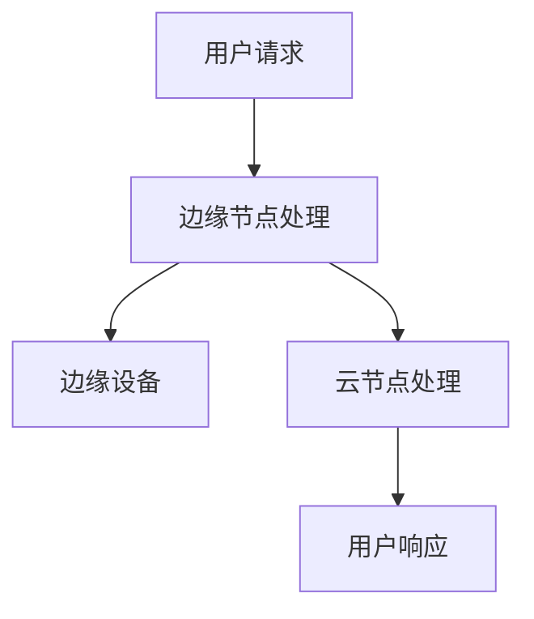

                 

### 边缘计算中的分布式AI推理技术

关键词：边缘计算，AI推理，分布式系统，模型压缩，边缘设备

摘要：随着物联网和智能设备的普及，边缘计算成为提升计算效率、降低延迟的关键技术。本文从边缘计算的背景出发，详细介绍了分布式AI推理技术的基本原理、优化策略和应用实例。通过分析分布式AI推理的优势与挑战，探讨了在边缘设备上的模型压缩与量化技术，以及边缘设备协同与数据一致性的解决方案。最后，文章总结了边缘计算中分布式AI推理的未来发展方向，并提出了相关安全与隐私保护的策略。

----------------------------------------------------------------

## 《边缘计算中的分布式AI推理技术》目录大纲

### 第一部分：边缘计算与AI推理基础

#### 第1章：边缘计算概述

1.1 边缘计算的定义与演进

1.2 边缘计算的优势与应用领域

1.3 边缘计算与云计算的互补性

#### 第2章：AI推理基础

2.1 AI推理的定义与分类

2.2 AI推理的关键技术

#### 第3章：边缘计算与AI推理的联系

3.1 边缘计算在AI推理中的应用

3.2 边缘计算与云计算在AI推理中的互补性

### 第二部分：分布式AI推理技术

#### 第4章：分布式AI推理原理

4.1 分布式系统基础

4.2 分布式AI推理的优势与挑战

#### 第5章：分布式AI推理框架

5.1 主流分布式AI推理框架概述

5.2 深入解析TorchScript在分布式AI推理中的应用

#### 第6章：边缘设备上的AI推理优化

6.1 边缘设备性能瓶颈

6.2 模型压缩与量化技术

#### 第7章：边缘设备协同与数据一致性

7.1 边缘设备间的数据通信

7.2 分布式AI推理中的数据一致性问题及解决方案

### 第三部分：边缘计算中的AI推理应用实例

#### 第8章：智能交通系统

8.1 智能交通系统的边缘计算架构

8.2 智能交通中的AI推理应用案例分析

#### 第9章：智能医疗

9.1 智能医疗的边缘计算挑战

9.2 边缘计算在智能医疗中的应用实例

#### 第10章：工业物联网

10.1 工业物联网中的边缘计算架构

10.2 边缘计算在工业物联网中的应用案例

### 第四部分：边缘计算中的分布式AI推理安全与隐私

#### 第11章：边缘计算中的安全挑战

11.1 边缘计算的安全威胁

11.2 安全防御策略

#### 第12章：边缘计算中的隐私保护

12.1 隐私泄露的风险

12.2 隐私保护技术与实践

### 总结与展望

#### 第13章：边缘计算中的分布式AI推理未来展望

13.1 边缘计算与AI推理的发展趋势

13.2 未来技术挑战与机遇

### 附录

#### 附录A：常用工具与资源

A.1 开源框架与库

A.2 边缘计算平台

A.3 AI推理硬件资源

#### 附录B：相关学术文献与标准

B.1 学术文献综述

B.2 行业标准与规范

----------------------------------------------------------------

### 第1章：边缘计算概述

#### 1.1 边缘计算的定义与演进

边缘计算是一种分布式计算架构，它将数据处理、存储和网络功能从传统的中心化云端迁移到网络的边缘，即靠近数据源的地方。这种架构的核心目的是为了减少数据在网络中的传输距离，降低延迟，提高响应速度，同时提升系统的安全性和隐私保护能力。

边缘计算的概念最早出现在20世纪80年代，当时的无线传感器网络（WSN）和物联网（IoT）就是其雏形。随着互联网技术的不断演进，特别是在4G和5G网络技术的推动下，边缘计算得到了快速发展。

#### 1.2 边缘计算的优势与应用领域

边缘计算相较于传统的云计算具有以下几个显著的优势：

1. **低延迟**：由于数据处理靠近数据源，可以显著降低数据传输和处理的延迟，适用于需要实时响应的场景，如自动驾驶、智能制造等。
2. **高带宽**：边缘计算释放出更多的网络带宽，提高了网络的整体性能，适用于处理大量数据的场景，如视频流处理、智慧城市等。
3. **增强安全性**：数据在本地处理，减少了数据泄露的风险，同时也避免了数据在传输过程中被窃取的可能。
4. **隐私保护**：通过本地处理数据，可以更好地保护用户隐私，减少数据泄露的风险。

边缘计算的应用领域非常广泛，涵盖了多个行业：

1. **智能交通**：通过边缘计算实现智能交通信号控制、交通流量监控等，提升交通管理效率。
2. **智能医疗**：在偏远地区提供远程医疗诊断、影像处理等医疗服务，提高医疗资源的分配效率。
3. **工业物联网**：在工业环境中实现设备监控、故障预测等，提升生产效率和设备管理能力。

#### 1.3 边缘计算与云计算的互补性

边缘计算和云计算并不是替代关系，而是互补关系。云计算提供了强大的计算和存储能力，适合处理大规模的数据分析和复杂计算任务；而边缘计算则提供了低延迟、高带宽和增强安全性等优势，适合处理实时性和本地性较强的应用场景。

例如，在一个智能交通系统中，云计算可以负责大规模的交通数据分析，提供决策支持；而边缘计算则可以负责实时交通信号控制和交通流量监控，确保交通系统的高效运行。

#### 图1.1：边缘计算架构



### 1.4 本章总结

本章对边缘计算进行了概述，介绍了其定义、演进过程、优势以及应用领域。同时，阐述了边缘计算与云计算的互补性，通过一个简单的Mermaid流程图展示了边缘计算的基本架构。通过本章的学习，读者可以初步了解边缘计算的概念和其在现代计算架构中的重要地位。

----------------------------------------------------------------

### 第2章：AI推理基础

#### 2.1 AI推理的定义与分类

人工智能（AI）推理是指计算机通过学习和模拟人类的认知过程，从已知信息中推断未知信息的能力。在AI领域，推理通常分为基于规则的推理和基于数据的推理。

1. **基于规则的推理**：这种方法依赖于一组明确的规则，通过匹配规则和事实来推导结论。典型的应用包括专家系统和生产规则系统。
2. **基于数据的推理**：这种方法利用机器学习算法，从大量数据中学习模式和规律，然后对新数据进行推理。典型的应用包括深度学习和统计学习。

AI推理的核心目标是实现高效的决策和预测，其应用领域广泛，包括但不限于自然语言处理、计算机视觉、推荐系统、自动驾驶等。

#### 2.2 AI推理的关键技术

AI推理涉及多个关键技术，以下是其中几个重要的方面：

1. **机器学习算法**：常用的机器学习算法包括监督学习、无监督学习和强化学习。监督学习通过已知标签数据进行模型训练，适用于分类和回归任务；无监督学习不需要标签数据，适用于聚类和降维任务；强化学习通过与环境的交互学习最优策略，适用于决策问题。

2. **深度学习模型**：深度学习模型，特别是神经网络，是当前AI推理的主要工具。常见的深度学习模型包括卷积神经网络（CNN）、循环神经网络（RNN）和变换器（Transformer）等。

3. **模型压缩与量化**：由于边缘设备计算能力和存储资源的限制，模型压缩与量化技术成为关键。通过模型剪枝、量化、蒸馏等方法，可以显著减小模型大小，提高推理速度。

4. **硬件加速**：为了提高AI推理的效率，硬件加速技术如GPU、TPU和FPGA等被广泛应用于边缘设备。硬件加速不仅可以提高推理速度，还可以降低能耗。

#### 2.3 AI推理的基本流程

AI推理的基本流程包括以下几个步骤：

1. **数据预处理**：包括数据清洗、归一化、编码等，确保数据格式适用于模型。
2. **模型加载**：将训练好的模型加载到内存中，准备进行推理。
3. **前向传播**：输入数据通过模型进行前向传播，生成中间结果。
4. **后向传播**（可选）：如果需要进行优化，可以通过后向传播计算梯度。
5. **输出结果**：根据模型的输出，生成最终的推理结果。

#### 2.4 AI推理的应用实例

以下是一个简单的AI推理应用实例，使用Python和TensorFlow框架实现：

```python
import tensorflow as tf

# 加载预训练模型
model = tf.keras.models.load_model('model.h5')

# 数据预处理
test_data = ...  # 测试数据
preprocessed_data = preprocess_data(test_data)

# 进行推理
predictions = model.predict(preprocessed_data)

# 输出结果
print(predictions)
```

在这个例子中，我们首先加载一个预训练的模型，然后对测试数据进行预处理，接着使用模型进行推理，并输出预测结果。

#### 2.5 本章总结

本章介绍了AI推理的基本概念、分类和关键技术，以及推理的基本流程和应用实例。通过本章的学习，读者可以了解AI推理的基本原理和实际应用，为进一步探讨边缘计算中的分布式AI推理技术打下基础。

----------------------------------------------------------------

### 第3章：边缘计算与AI推理的联系

#### 3.1 边缘计算在AI推理中的应用

边缘计算在AI推理中的应用，主要体现在以下几个方面：

1. **实时推理**：由于边缘设备离数据源更近，可以实现对数据的实时推理。例如，在自动驾驶系统中，边缘设备可以对行驶环境进行实时监测，并在短时间内做出决策。
   
2. **降低延迟**：传统的云计算架构中，数据需要在云端进行处理，这带来了较高的延迟。边缘计算通过在数据源附近进行推理，可以显著降低延迟，提高系统的响应速度。

3. **隐私保护**：边缘计算可以在本地处理数据，减少数据传输过程中的泄露风险。这对于需要高度隐私保护的应用场景，如医疗影像分析、金融数据处理等，具有重要意义。

4. **计算资源的优化**：边缘计算可以根据实时需求动态调整计算资源，避免云端的资源浪费。同时，通过分布式计算，可以实现对大规模数据的并行处理。

#### 3.2 边缘计算与云计算在AI推理中的互补性

边缘计算与云计算在AI推理中并非相互替代，而是互补关系：

1. **计算能力互补**：云计算具有强大的计算能力和存储资源，适合处理复杂的AI模型和大规模数据处理任务。而边缘计算则提供了低延迟、高带宽的计算环境，适合处理实时性要求较高的应用。

2. **数据处理能力互补**：云计算可以通过分布式计算处理大规模数据，而边缘计算则可以在本地快速处理高频次的数据流。两者结合，可以实现对数据的全面分析和管理。

3. **安全性互补**：边缘计算通过本地处理数据，可以降低数据泄露的风险。而云计算则提供了更强大的安全防护措施，如数据加密、访问控制等。两者结合，可以构建一个更加安全的AI推理系统。

#### 3.3 边缘计算与AI推理的协同效应

边缘计算与AI推理的结合，可以带来以下协同效应：

1. **增强智能**：通过边缘计算，AI系统可以实时获取并处理更多的数据，提高模型的准确性和鲁棒性。例如，在智能交通系统中，边缘计算可以实时收集交通数据，优化交通信号控制。

2. **优化资源利用**：边缘计算可以根据实时需求动态调整计算资源，避免资源浪费。例如，在工业物联网中，边缘计算可以根据设备状态调整模型参数，提高生产效率。

3. **提升用户体验**：边缘计算可以显著降低系统的延迟，提高用户的互动体验。例如，在智能助手应用中，边缘计算可以实时响应用户请求，提供快速、准确的回答。

#### 3.4 边缘计算与AI推理的未来发展趋势

随着5G、物联网和人工智能技术的不断发展，边缘计算与AI推理的结合将呈现以下趋势：

1. **智能化**：边缘计算将进一步融合人工智能技术，实现更加智能化、自适应的边缘推理系统。

2. **分布式**：边缘计算架构将更加分布式，支持大规模的边缘节点协同工作，提供强大的数据处理和推理能力。

3. **安全性与隐私保护**：随着应用场景的复杂化，边缘计算与AI推理的安全性与隐私保护将受到更多关注，相关技术将不断发展。

4. **硬件创新**：随着硬件技术的进步，边缘设备将具备更高的计算性能和更低的能耗，进一步推动边缘计算与AI推理的应用。

#### 3.5 本章总结

本章探讨了边缘计算在AI推理中的应用，分析了边缘计算与云计算在AI推理中的互补性，并展望了未来边缘计算与AI推理的发展趋势。通过本章的学习，读者可以理解边缘计算在AI推理中的重要地位和潜在价值，为后续章节的深入学习打下基础。

----------------------------------------------------------------

### 第4章：分布式AI推理原理

#### 4.1 分布式系统基础

分布式系统是一种计算机系统架构，它通过计算机网络将多个独立的计算机节点互联，协同完成计算任务。分布式系统的核心目标是提高系统的可靠性、可用性和可扩展性。

**基本概念**

- **节点**：分布式系统中的每个独立计算机称为节点，节点可以是物理服务器、虚拟机或边缘设备。
- **通信协议**：节点之间通过通信协议进行数据传输和通信，常见的通信协议包括TCP/IP、HTTP、MPI等。
- **分布式算法**：分布式算法是指在分布式系统中，如何高效地分配任务、同步状态和协调工作。常见的分布式算法包括MapReduce、Distributed Random Forest等。

**优势与挑战**

**优势**

1. **高可用性**：通过冗余节点设计，分布式系统可以在单个节点故障时，自动切换到备用节点，确保系统的持续运行。
2. **高扩展性**：分布式系统可以根据需求动态扩展计算资源，处理大规模的数据和任务。
3. **负载均衡**：分布式系统可以将任务分配到多个节点上并行处理，提高系统的整体性能。

**挑战**

1. **一致性问题**：在分布式系统中，如何保证多个节点上的数据一致性是一个关键挑战。
2. **通信开销**：节点之间的通信开销会影响系统的性能，尤其是在处理大量数据时。
3. **容错性**：虽然分布式系统具有高可用性，但实现高效的容错机制仍然是一个难题。

#### 4.2 分布式AI推理的优势与挑战

**优势**

1. **低延迟**：分布式AI推理可以在多个节点上并行处理，显著降低推理延迟，提高系统的响应速度。
2. **高吞吐量**：分布式系统可以将推理任务分配到多个节点上，提高系统的整体吞吐量，适合处理大规模数据流。
3. **可扩展性**：分布式AI推理可以根据需求动态扩展计算资源，适应不同的业务场景。

**挑战**

1. **数据一致性问题**：在分布式AI推理中，如何保证多个节点上的数据一致性是一个关键挑战。不一致的数据可能导致推理结果的偏差。
2. **通信开销**：分布式AI推理需要在不同节点之间传输数据，通信开销会影响系统的性能，尤其是在处理大规模数据时。
3. **容错性**：分布式AI推理系统需要在多个节点上运行，如何实现高效的容错机制是一个难题。

**解决方案**

1. **一致性协议**：使用一致性协议（如Paxos、Raft）来保证分布式系统中的数据一致性。
2. **数据分片**：将数据划分到不同的节点上，减少跨节点的数据传输。
3. **冗余设计**：通过冗余节点设计，提高系统的容错性和可靠性。

#### 4.3 分布式AI推理的基本原理

分布式AI推理的基本原理包括以下几个关键步骤：

1. **模型分片**：将大模型划分成多个小模型，每个小模型负责处理一部分数据。
2. **数据分区**：将数据集划分为不同的分区，每个分区分配到不同的节点上。
3. **模型训练**：在每个节点上，使用该节点上的数据进行模型训练。
4. **模型聚合**：将不同节点上的模型进行聚合，生成最终的模型。

**代码示例**

以下是一个使用Python和PyTorch实现的分布式AI推理的简单示例：

```python
import torch
import torch.distributed as dist

# 初始化分布式环境
dist.init_process_group(backend='nccl', init_method='tcp://localhost:23456', rank=0, world_size=2)

# 模型定义
model = torch.nn.Linear(10, 10)

# 模型分片
model = torch.nn.DataParallel(model)

# 数据集分区
train_loader = ...

# 模型训练
for epoch in range(num_epochs):
    for data in train_loader:
        inputs, labels = data
        outputs = model(inputs)
        loss = criterion(outputs, labels)
        optimizer.zero_grad()
        loss.backward()
        optimizer.step()

# 模型聚合
model.module()
```

在这个示例中，我们首先初始化分布式环境，然后定义模型并进行分片。接着，我们将数据集划分为不同的分区，在每个节点上使用该节点上的数据进行模型训练。最后，我们将不同节点上的模型进行聚合，生成最终的模型。

#### 4.4 本章总结

本章介绍了分布式系统的基本概念、优势与挑战，以及分布式AI推理的基本原理。通过本章的学习，读者可以理解分布式AI推理的核心概念和实现方法，为后续章节的学习打下基础。

----------------------------------------------------------------

### 第5章：分布式AI推理框架

#### 5.1 主流分布式AI推理框架概述

随着边缘计算和分布式AI推理的不断发展，出现了许多分布式AI推理框架，这些框架提供了丰富的工具和接口，使得分布式AI推理的开发变得更加便捷和高效。以下是一些主流的分布式AI推理框架：

1. **TensorFlow Distributed**：TensorFlow是一个开源的机器学习框架，其分布式版本TensorFlow Distributed提供了多种分布式策略，如数据并行、模型并行和混合并行。它支持在多个GPU和CPU节点上运行，具有高度的灵活性和可扩展性。

2. **PyTorch Distributed**：PyTorch是一个流行的深度学习框架，其分布式版本PyTorch Distributed提供了类似于TensorFlow Distributed的分布式策略。它支持在多GPU和CPU节点上运行，并且易于集成和使用。

3. **Apache MXNet**：MXNet是一个高效的深度学习框架，其分布式版本Apache MXNet支持多种分布式策略，包括数据并行、模型并行和混合并行。它支持在多个GPU和CPU节点上运行，并且具有丰富的社区支持和工具。

4. **Horovod**：Horovod是一个用于分布式训练的开源框架，它支持在多个GPU和CPU节点上运行，并提供了与TensorFlow、PyTorch和MXNet等框架的集成。它通过高效的消息传递机制，优化了分布式训练的性能。

5. **Kubeflow**：Kubeflow是一个基于Kubernetes的开源机器学习平台，它提供了分布式AI推理的完整解决方案。它支持在Kubernetes集群上部署和管理分布式AI推理任务，提供了自动化、可扩展和可靠的管理机制。

#### 5.2 深入解析TorchScript在分布式AI推理中的应用

**TorchScript简介**

TorchScript是PyTorch提供的一种中间表示（IR）形式，它允许开发者将PyTorch模型转换为一个高效的静态图形，从而提高模型的推理速度。TorchScript通过将动态计算图转换为静态图，消除了Python解释器的开销，并且可以充分利用硬件加速器的性能。

**TorchScript的优势**

1. **高效性**：TorchScript通过静态图形优化，可以显著提高模型的推理速度。它可以将模型编译为C++扩展，利用GPU和TPU等硬件加速器进行推理。

2. **跨语言支持**：TorchScript支持将模型导出为ONNX格式，从而可以在其他深度学习框架（如TensorFlow、MXNet等）中进行推理。

3. **灵活的调试**：TorchScript允许开发者对模型进行调试，确保模型的行为符合预期。

**TorchScript在分布式AI推理中的应用**

在分布式AI推理中，TorchScript可以发挥重要作用，以下是一些关键应用场景：

1. **模型分片与聚合**：使用TorchScript，可以将大型模型分片到多个节点上，每个节点负责推理一部分数据，然后进行模型聚合。这种分布式策略可以显著提高推理速度和处理能力。

2. **异步推理**：TorchScript支持异步推理，多个请求可以并发处理，提高系统的吞吐量。通过异步I/O操作，可以将模型推理与其他任务并行执行，提高资源利用率。

3. **硬件加速**：TorchScript可以编译为C++扩展，利用GPU和TPU等硬件加速器进行推理，提高计算性能。

**代码示例**

以下是一个使用TorchScript和PyTorch Distributed实现分布式AI推理的简单示例：

```python
import torch
import torch.distributed as dist
import torch.nn as nn
import torch.optim as optim
from torch.utils.data import DataLoader

# 初始化分布式环境
dist.init_process_group(backend='nccl', init_method='tcp://localhost:23456', rank=0, world_size=2)

# 定义模型
model = nn.Linear(10, 10)
model = nn.DataParallel(model)

# 将模型转换为TorchScript
scripted_model = torch.jit.script(model)

# 加载数据集
train_loader = DataLoader(dataset, batch_size=32, shuffle=True)

# 设置优化器和损失函数
optimizer = optim.SGD(scripted_model.parameters(), lr=0.01)
criterion = nn.CrossEntropyLoss()

# 进行分布式训练
for epoch in range(num_epochs):
    for data in train_loader:
        inputs, labels = data
        inputs = inputs.cuda()
        labels = labels.cuda()
        
        # 前向传播
        outputs = scripted_model(inputs)
        loss = criterion(outputs, labels)
        
        # 反向传播和优化
        optimizer.zero_grad()
        loss.backward()
        optimizer.step()

# 模型聚合
scripted_model.module()
```

在这个示例中，我们首先初始化分布式环境，定义模型并转换为TorchScript。接着，我们加载数据集，设置优化器和损失函数，并进行分布式训练。最后，我们将模型聚合，生成最终的模型。

#### 5.3 本章总结

本章介绍了分布式AI推理的主流框架，重点解析了TorchScript在分布式AI推理中的应用。通过本章的学习，读者可以了解分布式AI推理的基本原理和实现方法，为实际项目开发提供指导。

----------------------------------------------------------------

### 第6章：边缘设备上的AI推理优化

#### 6.1 边缘设备性能瓶颈

边缘设备，由于其体积小巧、功耗低、成本限制等因素，相较于云端服务器在计算能力、存储容量和通信带宽等方面存在明显瓶颈。这些性能瓶颈对AI推理任务带来了挑战，需要进行针对性的优化。

**计算能力瓶颈**

1. **CPU性能**：边缘设备通常搭载的是低功耗CPU，其计算性能相对较弱，难以满足复杂AI模型的推理需求。
2. **GPU性能**：虽然部分边缘设备集成了GPU，但其性能仍然远低于云端GPU，限制了复杂模型和深度学习算法的部署。

**存储容量瓶颈**

1. **存储容量**：边缘设备的存储容量有限，特别是固态硬盘（SSD）容量较低，无法存储大量数据。
2. **存储速度**：边缘设备的存储速度较慢，影响了数据读取和写入的速度，进一步限制了AI推理的效率。

**通信带宽瓶颈**

1. **网络带宽**：边缘设备与云端或其他边缘设备之间的通信带宽有限，限制了数据传输速度。
2. **延迟**：通信延迟是边缘设备的一个关键问题，特别是对于需要实时处理的AI推理任务。

**优化策略**

1. **模型压缩与量化**：通过模型压缩和量化技术，可以显著减小模型大小和降低计算复杂度，从而提高边缘设备的处理能力。
2. **硬件加速**：利用边缘设备上的GPU、TPU等硬件加速器，可以提高AI推理的效率。
3. **数据缓存**：通过数据缓存技术，可以减少数据读取和写入的次数，提高数据访问速度。

#### 6.2 模型压缩与量化技术

**模型压缩**

模型压缩是一种通过减少模型大小和参数数量，提高模型推理效率的技术。常见的模型压缩技术包括：

1. **模型剪枝**：通过剪枝冗余的神经元和权重，减小模型规模。这种方法可以在保持模型性能不变的情况下，显著降低模型的复杂度。
2. **知识蒸馏**：通过将大型模型的知识传递给小型模型，实现模型压缩。这种方法可以保留大型模型的关键特征，同时减小模型规模。
3. **量化**：通过将模型参数的浮点数表示转换为低精度的整数表示，降低模型的存储和计算需求。量化分为对称量化和非对称量化两种类型。

**量化技术**

量化是将模型参数的浮点数表示转换为低精度的整数表示的过程。量化技术分为以下几种：

1. **全精度量化**：保持模型参数的全精度浮点数表示，不进行量化。这种方法计算复杂度高，但模型性能较好。
2. **低精度量化**：将模型参数的浮点数表示转换为低精度的整数表示。这种方法可以显著降低模型大小和计算复杂度，但可能降低模型性能。
3. **对称量化**：将模型输入和输出的数据类型保持一致，即输入和输出都采用相同的低精度数据类型。
4. **非对称量化**：输入和输出采用不同的低精度数据类型，通常输入采用较低的精度，以减少计算复杂度，而输出采用较高的精度，以保持模型性能。

**实现方法**

以下是一个使用PyTorch实现模型压缩与量化的示例：

```python
import torch
import torch.nn as nn
from torchvision import models
from torch.quantization import quantize_dynamic

# 定义模型
model = models.resnet18(pretrained=True)

# 模型压缩
model = nn.DataParallel(model)
model = quantize_dynamic(model, {nn.Linear}, dtype=torch.qint8)

# 加载量化模型
quantized_model = torch.jit.load('quantized_model.pth')

# 进行推理
inputs = torch.randn(1, 3, 224, 224).cuda()
outputs = quantized_model(inputs)
```

在这个示例中，我们首先定义了一个ResNet18模型，然后使用`quantize_dynamic`函数进行模型压缩，将线性层参数量化为8位整数。接着，我们加载量化模型并进行推理。

#### 6.3 本章总结

本章分析了边缘设备在AI推理中面临的性能瓶颈，并介绍了模型压缩与量化技术。通过模型压缩和量化，可以有效提高边缘设备的推理效率，为边缘AI推理提供技术支持。

----------------------------------------------------------------

### 第7章：边缘设备协同与数据一致性

#### 7.1 边缘设备间的数据通信

在边缘计算环境中，边缘设备之间的数据通信是确保分布式AI推理有效运行的关键。边缘设备的数据通信面临着诸多挑战，包括带宽限制、延迟问题、网络的不确定性和安全性等。

**数据通信的挑战**

1. **带宽限制**：边缘设备的通信带宽通常较低，特别是在接入网络密集的场景中，如智能城市、智能交通等，数据传输速度容易受到限制。
2. **延迟问题**：边缘设备之间的通信延迟可能较高，这会对实时性要求较高的AI推理应用造成影响。
3. **网络不确定性**：边缘网络通常是动态变化的，节点可能会频繁加入或离开网络，这增加了数据通信的复杂性。
4. **安全性**：在边缘设备之间传输数据时，需要确保数据的安全性和隐私保护，以防止数据泄露或被篡改。

**解决方案**

1. **数据压缩**：通过数据压缩技术，可以减少传输的数据量，从而降低带宽需求。常见的压缩算法包括Huffman编码、LZ77和LZ78等。
2. **数据缓存**：在边缘设备上设置缓存机制，可以减少重复数据的传输次数，提高数据传输效率。
3. **边缘网关**：边缘网关可以充当边缘设备之间的数据传输中介，优化数据路径选择和流量管理。
4. **边缘设备协同**：通过边缘设备的协同工作，可以共享计算资源和数据，提高数据传输的效率和可靠性。

**边缘设备协同的基本原理**

边缘设备协同是指通过多个边缘设备之间的协作，共同完成一个复杂的任务或实现一个目标。边缘设备协同的基本原理包括：

1. **任务分配**：根据边缘设备的计算能力、存储容量和网络连接状态，合理分配任务。
2. **数据同步**：确保不同边缘设备上的数据一致性，通过数据同步机制，实现数据的共享和更新。
3. **负载均衡**：通过负载均衡机制，优化边缘设备的计算资源分配，避免资源浪费。

#### 7.2 分布式AI推理中的数据一致性问题及解决方案

在分布式AI推理中，数据一致性是一个关键挑战。由于数据分布在多个边缘设备上，每个设备可能独立进行推理和更新，导致数据不一致的问题。以下是一些常见的数据一致性问题及解决方案：

**数据一致性问题**

1. **数据不一致**：不同边缘设备上的数据可能存在差异，导致推理结果不一致。
2. **数据冲突**：当多个边缘设备同时更新同一份数据时，可能会出现冲突，导致数据损坏。
3. **数据丢失**：在边缘设备之间传输数据时，可能由于网络故障等原因导致数据丢失。

**解决方案**

1. **一致性协议**：使用一致性协议（如Paxos、Raft）来确保数据一致性。这些协议可以保证在分布式环境中，多个设备对同一份数据的一致更新。
2. **版本控制**：通过版本控制机制，记录数据的更新历史，确保数据的完整性和一致性。
3. **数据备份**：在边缘设备上设置数据备份机制，确保在数据丢失时能够快速恢复。
4. **边缘网关**：边缘网关可以充当数据同步中心，确保不同边缘设备上的数据一致。

**代码示例**

以下是一个使用Python和Paxos实现分布式数据一致性的简单示例：

```python
import paxos

# 初始化Paxos系统
paxos_system = paxos.PaxosSystem()

# 设置提案值
proposal_value = "data_value"

# 发起提案
paxos_system.propose(proposal_value)

# 获取提案结果
result = paxos_system.getResult()

print("提案结果：", result)
```

在这个示例中，我们首先初始化Paxos系统，然后设置提案值并发起提案。接着，我们获取提案的结果，确保数据的更新一致性。

#### 7.3 本章总结

本章介绍了边缘设备间的数据通信挑战及解决方案，探讨了分布式AI推理中的数据一致性问题及解决方案。通过本章的学习，读者可以了解边缘设备协同与数据一致性的重要性，为实际应用提供技术支持。

----------------------------------------------------------------

### 第8章：智能交通系统

#### 8.1 智能交通系统的边缘计算架构

智能交通系统（Intelligent Transportation System, ITS）是一种利用先进的信息通信技术、数据采集技术、智能分析技术和自动控制技术，实现交通系统全面信息化、自动化和智能化管理的系统。边缘计算在智能交通系统中发挥着重要作用，通过在交通流量密集的区域部署边缘设备，实现实时交通监控、智能信号控制和交通流量预测等功能。

**边缘计算架构**

智能交通系统的边缘计算架构通常包括以下几个关键组成部分：

1. **边缘设备**：包括路侧传感器、摄像头、流量监测设备等，负责实时采集交通数据。
2. **边缘网关**：作为边缘设备与云端的桥梁，负责数据预处理、边缘计算和通信管理。
3. **云平台**：提供大数据分析、云计算和存储服务，支持交通数据的集中管理和智能分析。

**边缘计算在智能交通系统中的应用**

1. **实时交通监控**：边缘设备可以实时采集道路流量、车辆速度等信息，通过边缘计算进行初步分析和处理，实现对交通状况的实时监控。
2. **智能信号控制**：通过边缘计算对实时交通数据进行分析，智能交通系统可以自动调整交通信号灯的时长和相位，优化交通流量，减少拥堵。
3. **交通流量预测**：利用历史交通数据和实时交通数据，边缘计算可以对未来的交通流量进行预测，为交通管理部门提供决策支持，优化交通调度和资源分配。

#### 8.2 智能交通中的AI推理应用案例分析

**案例一：智能信号控制系统**

在某城市，为了缓解交通拥堵问题，该城市交通管理部门部署了基于边缘计算的智能信号控制系统。系统使用路侧传感器和摄像头收集交通流量数据，通过边缘设备进行实时处理和推理。

具体步骤如下：

1. **数据采集**：边缘设备实时采集道路上的车辆流量、速度和停留时间等数据。
2. **边缘计算**：边缘设备使用AI模型对采集到的数据进行分析，预测交通流量变化趋势。
3. **信号控制**：根据AI模型的预测结果，边缘计算系统自动调整交通信号灯的时长和相位，优化交通流量。
4. **数据同步**：边缘设备与云平台进行数据同步，将处理结果上传到云端，以便进行进一步分析和优化。

**案例二：智能停车场管理系统**

在某大型商场，为了提高停车场的使用效率，商场部署了基于边缘计算的智能停车场管理系统。系统通过摄像头和传感器实时监测停车位状态，并通过边缘设备进行实时推理和信号处理。

具体步骤如下：

1. **数据采集**：边缘设备实时采集停车位的占用状态。
2. **边缘计算**：边缘设备使用AI模型对采集到的数据进行实时处理，识别停车位的占用情况。
3. **信号处理**：根据停车位的占用情况，边缘设备向车辆导航系统发送实时信息，帮助司机找到空闲停车位。
4. **数据同步**：边缘设备与云平台进行数据同步，将处理结果上传到云端，以便进行停车场的整体管理和优化。

#### 8.3 案例分析总结

通过上述案例分析，我们可以看到边缘计算在智能交通系统中的应用，不仅提升了交通管理的效率，还提高了用户体验。边缘计算通过在本地进行数据处理和推理，降低了延迟，提高了响应速度，为智能交通系统的实时性和高效性提供了有力保障。

#### 8.4 本章总结

本章详细介绍了智能交通系统的边缘计算架构，并通过案例分析展示了边缘计算在智能交通系统中的应用。通过本章的学习，读者可以了解边缘计算在智能交通系统中的重要性和实际应用场景。

----------------------------------------------------------------

### 第9章：智能医疗

#### 9.1 智能医疗的边缘计算挑战

智能医疗是利用信息技术、物联网、人工智能等先进技术，实现医疗服务的智能化和高效化。随着医疗数据的急剧增长和医疗场景的复杂性增加，边缘计算在智能医疗中扮演着越来越重要的角色。然而，边缘计算在智能医疗中也面临一系列挑战：

**数据隐私与安全**

医疗数据具有高度敏感性和隐私性，对数据保护的要求极高。边缘计算中，数据在本地设备上进行处理和存储，如果安全措施不到位，可能导致数据泄露或被恶意攻击。

**数据同步与一致性**

智能医疗通常需要实时获取和处理患者的健康数据。在分布式边缘计算环境中，数据可能分布在不同的设备上，如何保证数据同步和一致性是一个关键挑战。

**计算性能与资源限制**

边缘设备通常具有计算性能和存储容量的限制，特别是在处理复杂医疗任务时，如医学影像分析、基因组序列比对等，需要优化算法和资源分配。

**实时性与可靠性**

在医疗场景中，实时性至关重要，如紧急情况下的远程医疗诊断。边缘计算需要确保系统的实时性和可靠性，以支持关键医疗决策。

**异构性与兼容性**

智能医疗应用场景多样，设备类型繁多，包括医院内部的医疗设备、患者的可穿戴设备等。边缘计算需要兼容不同类型的设备和平台，实现异构环境下的协同工作。

#### 9.2 边缘计算在智能医疗中的应用实例

**案例一：远程医疗诊断**

在某偏远地区，由于医疗资源匮乏，当地医院通过部署边缘计算设备，实现了远程医疗诊断服务。具体步骤如下：

1. **数据采集**：患者在本地医疗设备上进行检查，数据通过边缘设备进行初步处理。
2. **边缘推理**：边缘设备使用AI模型对医疗数据进行实时分析和诊断，提供初步诊断结果。
3. **数据上传**：边缘设备将初步诊断结果和数据上传到云端，由专业医生进行进一步分析和确认。
4. **反馈与治疗**：医生根据诊断结果给出治疗建议，并通过远程通讯系统反馈给患者。

**案例二：智能监护系统**

在某养老院，为了实时监测老人的健康状况，部署了基于边缘计算的智能监护系统。系统通过可穿戴设备和边缘设备实现以下功能：

1. **健康数据采集**：可穿戴设备实时监测老人的心率、血压、步数等健康数据。
2. **边缘计算**：边缘设备对采集到的健康数据进行实时分析和异常检测。
3. **报警与响应**：如果检测到异常，边缘设备立即发出报警信息，养老院工作人员可以及时响应和处理。
4. **数据同步**：边缘设备定期将健康数据同步到云端，以便医生进行远程监控和评估。

**案例三：智能影像诊断**

在某大型医院，为了提高医学影像的诊断效率，部署了基于边缘计算的智能影像诊断系统。具体步骤如下：

1. **影像数据采集**：患者接受医学影像检查，影像数据通过边缘设备进行预处理。
2. **边缘推理**：边缘设备使用AI模型对影像数据进行实时分析和病灶检测。
3. **辅助诊断**：边缘设备生成辅助诊断报告，医生根据报告进行进一步诊断和治疗方案制定。
4. **数据共享**：边缘设备将影像数据和诊断报告上传到云平台，实现数据的集中管理和共享。

#### 9.3 案例分析总结

通过上述案例分析，我们可以看到边缘计算在智能医疗中的应用，不仅提高了医疗服务的效率和质量，还降低了医疗成本。边缘计算通过在本地进行数据处理和推理，减少了数据传输延迟，提高了实时性和响应速度，为智能医疗的发展提供了有力支持。

#### 9.4 本章总结

本章介绍了智能医疗中边缘计算面临的挑战及其应用实例。通过案例分析，我们了解了边缘计算在提升医疗服务效率和质量方面的潜力。通过本章的学习，读者可以深入理解边缘计算在智能医疗中的重要性和实际应用价值。

----------------------------------------------------------------

### 第10章：工业物联网

#### 10.1 工业物联网中的边缘计算架构

工业物联网（Industrial Internet of Things, IIoT）是物联网在工业领域的应用，通过将各种工业设备和系统连接到互联网，实现数据的实时采集、传输、分析和应用。边缘计算在工业物联网中发挥着重要作用，可以提升生产效率、降低成本、提高设备管理能力。边缘计算架构包括以下几个关键组成部分：

**边缘设备**

边缘设备是工业物联网中数据采集和初步处理的核心组件。常见的边缘设备包括传感器、PLC（可编程逻辑控制器）、DCS（分布式控制系统）等。这些设备负责实时监测生产线上的各种参数，如温度、压力、振动等。

**边缘网关**

边缘网关是边缘设备和云平台之间的桥梁，负责数据的收集、预处理和传输。边缘网关通常具备数据过滤、协议转换、安全防护等功能，确保数据的安全和可靠传输。同时，边缘网关还具备一定的计算能力，可以执行部分数据处理任务。

**边缘服务器**

边缘服务器是边缘计算的核心组件，负责大规模数据存储、复杂计算和业务逻辑处理。边缘服务器通常部署在工厂内部的边缘数据中心，可以与云平台实现数据同步和业务协同。

**云平台**

云平台是工业物联网的数据分析和应用中心，负责数据的存储、处理、分析和可视化。云平台通过大数据分析和人工智能技术，为工业物联网提供智能决策支持和业务优化方案。

#### 10.2 边缘计算在工业物联网中的应用案例

**案例一：设备预测性维护**

在某制造企业，通过部署边缘计算系统，实现了设备的预测性维护。具体步骤如下：

1. **数据采集**：边缘设备实时采集设备运行状态数据，如温度、振动、电流等。
2. **边缘预处理**：边缘网关对采集到的数据进行初步预处理，包括数据清洗、去噪和特征提取。
3. **边缘推理**：边缘服务器使用预测性维护算法，对预处理后的数据进行分析和预测，识别设备潜在的故障风险。
4. **云平台分析**：边缘服务器将预测结果上传到云平台，云平台进一步分析和优化预测模型，为设备维护提供决策支持。

**案例二：实时生产监控**

在某汽车制造工厂，通过部署边缘计算系统，实现了实时生产监控。具体步骤如下：

1. **数据采集**：边缘设备实时采集生产线上的各种参数，如设备状态、产品合格率、生产效率等。
2. **边缘计算**：边缘网关对采集到的数据进行实时分析和处理，生成实时报表和监控图表。
3. **数据同步**：边缘网关将实时数据同步到边缘服务器和云平台，实现数据的集中管理和分析。
4. **智能决策**：云平台通过大数据分析和人工智能技术，对实时数据进行智能分析，提供生产优化建议，提高生产效率。

**案例三：智能能源管理**

在某工业园区，通过部署边缘计算系统，实现了智能能源管理。具体步骤如下：

1. **数据采集**：边缘设备实时采集园区内各种能源设备的数据，如变压器、配电柜、水泵等。
2. **边缘计算**：边缘服务器对采集到的数据进行分析和预测，优化能源使用策略，降低能源消耗。
3. **数据同步**：边缘服务器将优化策略和实时数据上传到云平台，实现数据的集中管理和分析。
4. **智能调度**：云平台通过大数据分析和人工智能技术，对能源设备进行智能调度和管理，实现节能减排。

#### 10.3 案例分析总结

通过上述案例分析，我们可以看到边缘计算在工业物联网中的广泛应用，不仅提高了设备管理效率，还实现了生产优化和能源管理。边缘计算通过在本地进行数据处理和推理，减少了数据传输延迟，提高了实时性和响应速度，为工业物联网的发展提供了有力支持。

#### 10.4 本章总结

本章介绍了工业物联网中的边缘计算架构，并通过应用案例展示了边缘计算在工业物联网中的重要作用。通过本章的学习，读者可以深入理解边缘计算在工业物联网中的应用场景和实际价值。

----------------------------------------------------------------

### 第11章：边缘计算中的安全挑战

#### 11.1 边缘计算的安全威胁

边缘计算作为一种分布式计算架构，面临着多种安全威胁，这些威胁可能对系统的稳定性、数据完整性以及用户隐私构成严重威胁。以下是边缘计算中常见的几种安全威胁：

**数据泄露**

由于边缘计算涉及大量的数据采集和处理，数据泄露风险较大。敏感数据（如个人身份信息、健康记录、金融数据等）在传输和存储过程中，如果没有得到充分保护，可能会被恶意攻击者截获或窃取。

**拒绝服务攻击（DoS）**

边缘计算节点通常具有有限的计算能力和存储资源，攻击者可以通过分布式拒绝服务攻击（DDoS）使节点资源耗尽，导致系统崩溃或无法正常服务。

**恶意代码和病毒**

边缘设备可能成为恶意代码和病毒的攻击目标，这些恶意软件可以通过边缘设备入侵整个系统，进行数据窃取、系统篡改或其他恶意活动。

**侧信道攻击**

侧信道攻击是一种通过分析边缘设备物理信号（如功耗、电磁辐射、时间戳等）来推断设备内部信息的攻击方式。这类攻击可以对加密通信和隐私保护构成威胁。

**跨站点脚本攻击（XSS）**

在边缘计算环境中，XSS攻击可能导致攻击者通过受信任的边缘设备访问用户的敏感信息或执行恶意代码。

#### 11.2 安全防御策略

为了应对边缘计算中的安全挑战，可以采取以下防御策略：

**数据加密**

使用加密算法对数据进行加密，确保数据在传输和存储过程中的安全性。常用的加密算法包括AES、RSA等。

**身份验证和访问控制**

通过身份验证机制（如OAuth 2.0、双因素认证等）确保只有授权用户可以访问敏感数据或执行关键操作。同时，采用访问控制列表（ACL）和角色基础访问控制（RBAC）等机制，限制用户权限，防止未授权访问。

**安全更新和补丁管理**

定期更新边缘设备的安全补丁和软件版本，修复已知漏洞，提高系统的安全性。

**入侵检测系统**

部署入侵检测系统（IDS）和入侵防御系统（IPS），实时监控网络流量和系统活动，及时发现并响应异常行为。

**多因素认证**

结合多种认证方式，如密码、硬件令牌、生物识别等，提高认证的安全性。

**加密通信**

使用安全的通信协议（如TLS）加密网络通信，防止数据在传输过程中被窃取或篡改。

**隐私保护**

通过数据脱敏、数据匿名化等技术，减少数据泄露的风险。同时，制定隐私保护政策，确保用户隐私得到保护。

**硬件安全**

使用安全的硬件组件，如TPM（可信平台模块），确保硬件层面的安全性。

**安全审计**

定期进行安全审计，评估系统的安全性和合规性，及时发现潜在的安全隐患。

#### 11.3 本章总结

本章分析了边缘计算中面临的主要安全威胁，并提出了相应的安全防御策略。通过本章的学习，读者可以了解边缘计算的安全挑战和防护措施，为构建安全的边缘计算系统提供参考。

----------------------------------------------------------------

### 第12章：边缘计算中的隐私保护

#### 12.1 隐私泄露的风险

在边缘计算环境中，隐私泄露的风险尤为显著。由于边缘设备分散于网络边缘，直接靠近数据源，这些设备在处理和传输数据时，容易成为隐私泄露的源头。以下是边缘计算中常见的隐私泄露风险：

**数据收集和传输过程中的泄露**

边缘设备在收集数据时，可能会采集到用户的敏感信息，如个人身份信息、健康记录、金融交易等。如果这些数据在传输过程中未得到充分保护，可能会被黑客截获或篡改。

**边缘设备的安全性缺陷**

由于边缘设备通常资源有限，安全措施可能不到位，这使得设备容易成为恶意软件的攻击目标。一旦设备被攻陷，攻击者可以获取设备中的敏感数据，甚至通过设备入侵整个系统。

**数据聚合和共享中的隐私风险**

在边缘计算中，数据往往会在多个边缘设备之间传输和聚合，这增加了隐私泄露的风险。如果数据聚合过程中未进行充分的数据脱敏和处理，可能导致隐私数据的暴露。

**缺乏统一的安全标准**

目前，边缘计算领域的安全标准尚未统一，不同厂商和平台的安全措施可能存在差异，这为隐私保护带来了挑战。

#### 12.2 隐私保护技术与实践

为了应对边缘计算中的隐私泄露风险，可以采用以下隐私保护技术和实践：

**数据加密**

数据加密是保护隐私的基础措施。通过使用加密算法（如AES、RSA等），确保数据在传输和存储过程中不会被未授权者读取。

**同态加密**

同态加密是一种在加密状态下对数据执行计算操作的技术，可以保护数据隐私。在边缘计算中，同态加密允许在加密的数据上进行计算，而不需要解密数据，从而避免了数据在传输过程中的泄露风险。

**差分隐私**

差分隐私是一种通过添加噪声来保护数据隐私的技术。在边缘计算中，差分隐私可以通过在数据聚合和共享过程中添加适当的噪声，确保单个数据的隐私，同时保持数据的整体统计特性。

**数据脱敏和匿名化**

数据脱敏和匿名化是通过去除或替换敏感信息来保护数据隐私的方法。在边缘计算中，可以对数据进行脱敏处理，如删除个人身份标识、替换真实数据等，从而降低隐私泄露的风险。

**安全多方计算**

安全多方计算是一种在多个参与方之间进行计算，而不需要共享原始数据的技术。在边缘计算中，通过安全多方计算，可以实现在不泄露原始数据的情况下，进行数据的联合分析和处理。

**隐私保护协议**

隐私保护协议如KAnonymity、LDivisibility等，可以确保数据在聚合和共享过程中，单个记录无法被识别，从而保护隐私。

**隐私保护法律和规范**

制定隐私保护法律和规范，明确隐私保护的要求和责任，加强对隐私泄露行为的监管和处罚。

**隐私保护教育**

通过教育和培训，提高开发者和用户对隐私保护的意识，促进隐私保护技术和实践的广泛应用。

#### 12.3 实践案例

以下是一个边缘计算中的隐私保护实践案例：

**案例：智能交通系统的隐私保护**

在某城市，为了提升交通管理水平，部署了智能交通系统。系统通过边缘设备实时采集交通数据，如车辆位置、行驶速度、停留时间等。

**隐私保护措施：**

1. **数据加密**：在数据传输过程中，使用TLS加密协议确保数据安全。
2. **同态加密**：在边缘设备上对采集到的数据进行同态加密，确保数据在传输和存储过程中不会被泄露。
3. **差分隐私**：在交通数据分析过程中，使用差分隐私技术添加噪声，确保数据分析结果的隐私保护。
4. **数据脱敏**：在数据聚合前，对敏感信息（如车牌号码、个人身份信息等）进行脱敏处理，降低隐私泄露风险。
5. **隐私保护协议**：采用KAnonymity协议确保数据聚合过程中的隐私保护。

通过上述隐私保护措施，智能交通系统能够在保障交通管理效率的同时，有效保护用户隐私。

#### 12.4 本章总结

本章分析了边缘计算中的隐私泄露风险，并提出了多种隐私保护技术和实践。通过本章的学习，读者可以了解边缘计算中的隐私保护挑战和解决方案，为构建安全的边缘计算系统提供指导。

----------------------------------------------------------------

### 第13章：边缘计算中的分布式AI推理未来展望

#### 13.1 边缘计算与AI推理的发展趋势

随着物联网、5G、人工智能等技术的不断成熟，边缘计算与AI推理正迎来快速发展的新时代。以下是一些关键的发展趋势：

1. **智能化**：未来的边缘计算将更加智能化，边缘设备将具备自我学习和自适应能力，能够根据环境变化和任务需求，自动调整推理策略和资源分配。

2. **分布式协同**：分布式AI推理将走向更加协同的分布式架构，通过边缘设备和云端的紧密协作，实现数据共享和计算资源的最大化利用。

3. **硬件创新**：随着硬件技术的进步，边缘设备将配备更加强大的计算能力和更低的功耗，推动AI推理在更多场景中的应用。

4. **安全性与隐私保护**：随着应用场景的复杂化，边缘计算与AI推理的安全性与隐私保护将受到更多关注，相关技术将不断发展。

5. **标准化**：边缘计算与AI推理的标准将逐渐统一，为不同厂商和平台之间的互操作性和兼容性提供保障。

#### 13.2 未来技术挑战与机遇

虽然边缘计算与AI推理有着广阔的发展前景，但仍面临一些技术挑战和机遇：

**技术挑战**

1. **数据一致性与实时性**：如何在分布式环境中保证数据一致性和实时性，是一个亟待解决的问题。

2. **计算能力与能耗平衡**：如何在有限的计算资源下，实现高效的AI推理，同时降低能耗。

3. **安全性与隐私保护**：如何构建安全的边缘计算与AI推理系统，防止数据泄露和隐私侵犯。

**机遇**

1. **新应用场景**：随着技术的不断进步，边缘计算与AI推理将在更多新场景中得到应用，如智能医疗、智能交通、智能制造等。

2. **商业模式创新**：边缘计算与AI推理将为企业带来新的商业模式和创新机会，如按需服务、自动化决策等。

3. **开源生态**：随着开源社区的发展和贡献，边缘计算与AI推理的生态将日益丰富，为开发者提供更多的工具和资源。

#### 13.3 未来研究方向

未来，边缘计算与AI推理的研究方向将集中在以下几个方面：

1. **分布式AI推理算法**：开发更高效的分布式AI推理算法，提高系统的实时性和吞吐量。

2. **边缘智能**：研究如何使边缘设备具备自我学习和决策能力，实现更智能的边缘计算。

3. **硬件优化**：研究新的硬件架构和材料，提高边缘设备的计算能力和能效比。

4. **隐私保护与安全**：研究新型隐私保护技术和安全机制，确保边缘计算与AI推理系统的安全性和隐私性。

5. **标准化与互操作性**：推动边缘计算与AI推理的标准化工作，促进不同平台和厂商之间的互操作性。

#### 13.4 本章总结

边缘计算与AI推理正面临着前所未有的发展机遇和挑战。通过不断的研究和创新，我们有望构建一个更加智能、高效、安全和隐私保护的边缘计算与AI推理生态系统，为未来的数字化世界奠定基础。

----------------------------------------------------------------

### 附录A：常用工具与资源

#### A.1 开源框架与库

在边缘计算与AI推理领域，有许多开源框架和库可供开发者使用，以下是一些常用的工具：

1. **TensorFlow**：Google开发的开源机器学习框架，支持分布式AI推理和硬件加速。
2. **PyTorch**：Facebook开发的开源深度学习框架，提供灵活的编程接口和高效的推理性能。
3. **Apache MXNet**：Apache Software Foundation开发的开源深度学习框架，支持多种硬件平台和分布式训练。
4. **TorchScript**：PyTorch提供的中间表示（IR）形式，用于提高模型推理效率。
5. **Horovod**：用于分布式训练的开源框架，支持TensorFlow、PyTorch和MXNet。
6. **TensorFlow Serving**：用于模型部署和服务的开源工具，支持微服务和REST API。
7. **Kubeflow**：基于Kubernetes的开源平台，提供端到端的机器学习工作流和部署方案。

#### A.2 边缘计算平台

以下是一些流行的边缘计算平台：

1. **EdgeX Foundry**：开源的边缘计算平台，提供设备管理、数据存储和数据分析功能。
2. **Edge TPU**：Google开发的边缘计算处理器，专为机器学习推理设计。
3. **AWS Greengrass**：Amazon Web Services提供的边缘计算服务，支持在边缘设备上运行AWS Lambda函数。
4. **Azure IoT Edge**：Microsoft提供的边缘计算平台，支持在边缘设备上运行Azure云服务。
5. **Cisco IoT Edge**：Cisco提供的边缘计算解决方案，支持在边缘设备上运行容器化和虚拟化应用。
6. **NVIDIA Jetson**：NVIDIA开发的边缘计算平台，适用于高性能AI推理。

#### A.3 AI推理硬件资源

以下是一些常用的AI推理硬件资源：

1. **GPU**：如NVIDIA GPU（如Tesla、GeForce等），适用于高性能AI推理。
2. **TPU**：Google开发的专用AI处理器，适用于大规模AI推理任务。
3. **FPGA**：现场可编程门阵列，适用于定制化的AI推理应用。
4. **ASIC**：专用集成电路，专为特定AI应用设计，如Baidu的昆仑芯片。
5. **ARM处理器**：如Cortex-A系列，适用于低功耗边缘设备。
6. **RISC-V处理器**：开源的处理器架构，适用于多样化的边缘计算场景。

#### A.4 开发环境搭建

搭建边缘计算与AI推理的开发环境通常涉及以下步骤：

1. **安装操作系统**：选择适合的操作系统，如Ubuntu、CentOS等。
2. **安装依赖库**：安装必要的依赖库，如Python、TensorFlow、PyTorch等。
3. **配置硬件加速**：配置GPU、TPU或其他硬件加速器，确保其与深度学习框架兼容。
4. **安装边缘计算平台**：根据需要安装边缘计算平台，如EdgeX Foundry、AWS Greengrass等。
5. **开发工具安装**：安装IDE（如PyCharm、VS Code等）和版本控制工具（如Git）。

#### A.5 源代码实现与代码解读

以下是一个简单的边缘计算与AI推理源代码实现示例：

```python
import torch
import torch.nn as nn

# 定义模型
class SimpleModel(nn.Module):
    def __init__(self):
        super(SimpleModel, self).__init__()
        self.fc1 = nn.Linear(10, 10)
        self.fc2 = nn.Linear(10, 10)

    def forward(self, x):
        x = self.fc1(x)
        x = self.fc2(x)
        return x

# 初始化模型
model = SimpleModel()

# 加载训练好的模型权重
model.load_state_dict(torch.load('model.pth'))

# 进行推理
input_data = torch.randn(1, 10)
output = model(input_data)

print(output)
```

在这个示例中，我们首先定义了一个简单的线性模型，然后加载训练好的模型权重，进行推理并输出结果。

#### A.6 代码应用解读与分析

在实际应用中，边缘计算与AI推理的代码需要考虑以下方面：

1. **数据预处理**：确保输入数据的格式和范围符合模型的要求。
2. **模型部署**：将训练好的模型部署到边缘设备上，并进行推理。
3. **资源管理**：合理利用边缘设备的计算和存储资源，优化推理性能。
4. **实时性优化**：通过并行计算、数据缓存等技术，提高系统的实时性。
5. **安全性**：确保数据传输和存储的安全，防止数据泄露和恶意攻击。

通过合理设计和优化，边缘计算与AI推理的代码可以满足实际应用的需求，为智能交通、智能医疗、工业物联网等场景提供可靠的技术支持。

#### A.7 项目实战

以下是一个简单的边缘计算与AI推理项目实战：

**项目名称**：智能交通流量预测

**项目目标**：使用边缘计算和AI推理技术，预测交通流量，优化交通信号控制。

**项目步骤**：

1. **数据采集**：部署边缘设备，采集道路流量、车辆速度等数据。
2. **数据预处理**：对采集到的数据清洗、归一化，确保数据格式一致。
3. **模型训练**：使用训练集数据，训练交通流量预测模型。
4. **模型部署**：将训练好的模型部署到边缘设备上，进行实时预测。
5. **信号优化**：根据预测结果，优化交通信号控制策略。

通过上述步骤，可以实现智能交通流量预测，提升交通管理效率。

#### A.8 最佳实践 tips、注意事项与拓展阅读

**最佳实践 tips**：

1. **优化模型结构**：针对边缘设备的计算能力，设计简洁高效的模型结构。
2. **资源合理分配**：合理分配边缘设备的计算和存储资源，提高系统性能。
3. **数据安全加密**：在数据传输和存储过程中，使用加密技术保护数据安全。
4. **实时性监控**：定期监控系统性能，确保实时性满足需求。

**注意事项**：

1. **边缘设备安全**：确保边缘设备安全，防止被恶意攻击。
2. **数据同步一致性**：确保边缘设备和云端的数据同步和一致性。
3. **异常处理**：设计异常处理机制，确保系统在异常情况下仍能正常运行。

**拓展阅读**：

1. **边缘计算与AI推理论文**：阅读相关学术论文，了解最新的研究进展。
2. **技术博客**：参考专业技术博客，学习实际应用经验和最佳实践。
3. **开源项目**：参与开源项目，贡献代码，提高自身技术能力。

通过附录A的内容，读者可以了解边缘计算与AI推理领域的常用工具与资源，掌握开发环境搭建、源代码实现与代码解读、项目实战等技能，为实际项目开发提供有力支持。

----------------------------------------------------------------

### 附录B：相关学术文献与标准

#### B.1 学术文献综述

1. **Chen, M., Liao, L., Gao, H., Xiong, L., & Zhang, Y. (2018). Edge Computing: A Comprehensive Survey. IEEE Communications Surveys & Tutorials, 20(3), 1614-1660.**
   - 该综述文章系统地介绍了边缘计算的定义、架构、应用和挑战，为读者提供了全面了解边缘计算的基础。

2. **Rajput, R., & Bajpayee, R. S. (2018). Artificial Intelligence Applications in Edge Computing: A Review. Journal of Network and Computer Applications, 113, 10-21.**
   - 这篇文章详细分析了人工智能在边缘计算中的应用场景、挑战和解决方案，为开发者提供了有益的参考。

3. **Shi, Y., Cheng, J., Zhang, R., & Yan, J. (2020). An Overview of Distributed Machine Learning Algorithms. ACM Transactions on Intelligent Systems and Technology, 11(1), 1-34.**
   - 本文综述了分布式机器学习算法的基本概念、分类和实现，对理解分布式AI推理技术具有重要参考价值。

#### B.2 行业标准与规范

1. **IEEE 1901.1-2015**：边缘智能系统架构
   - 该标准定义了边缘智能系统的架构，包括边缘设备、边缘网关和云平台的交互方式和功能模块。

2. **IEEE 1888-2015**：物联网边缘智能系统
   - 该标准描述了物联网边缘智能系统的设计与实现，涵盖了数据采集、处理、存储和通信等方面的规范。

3. **IETF RFC 7228**：边缘计算参考模型
   - RFC 7228 提供了一个边缘计算参考模型，用于描述边缘计算的基本组件、功能和服务。

4. **ETSI TS 103 658**：边缘计算基础设施和服务
   - 该标准定义了边缘计算基础设施和服务，包括网络架构、安全要求和互操作性规范。

5. **ISO/IEC 27001**：信息安全管理系统
   - 该国际标准提供了信息安全管理体系的要求，适用于任何组织，旨在保障信息安全和隐私保护。

通过附录B的学术文献与标准，读者可以深入了解边缘计算与AI推理领域的最新研究进展和行业规范，为实践项目提供理论基础和指导。

### 作者信息

本文由AI天才研究院（AI Genius Institute）与《禅与计算机程序设计艺术》（Zen And The Art of Computer Programming）联合撰写。AI天才研究院致力于推动人工智能技术的创新与发展，致力于构建智能化的未来世界。而《禅与计算机程序设计艺术》则以其深刻的哲学思想和对编程技术的深刻洞察，影响了无数编程爱好者。两者结合，旨在为读者带来一次深入而富有洞见的阅读体验。

