                 

# 边缘计算中的联合推理技术在智能家居中的应用

## 关键词

边缘计算，智能家居，联合推理，响应速度，智能决策，网络带宽，能耗优化。

## 摘要

随着物联网技术的发展，智能家居逐渐成为现代家庭生活的重要组成部分。然而，随着智能家居设备的增加，数据处理和传输的负担也日益加重，这为边缘计算技术的应用提供了契机。边缘计算通过在靠近数据源的设备上执行计算，有效缓解了中心化计算的压力。联合推理技术作为边缘计算的重要组成部分，能够提高智能家居系统的响应速度和智能决策能力。本文将详细介绍边缘计算中的联合推理技术，探讨其在智能家居中的应用价值、具体实现以及面临的挑战与未来发展趋势。

## 目录

1. 绪论
2. 联合推理技术基础
3. 联合推理在智能家居中的应用
4. 边缘计算中的联合推理架构设计
5. 联合推理在智能家居中的实际案例
6. 联合推理技术在智能家居中的挑战与展望
7. 附录

## 第1章 绪论

### 1.1 智能家居概述

#### 1.1.1 智能家居的定义与发展历程

智能家居（Smart Home）是指利用互联网、物联网、云计算等技术，将家庭中的各种设备连接起来，实现设备间的互联互通和智能控制。智能家居的概念最早可以追溯到20世纪80年代，当时被称为“智能住宅”（Smart House）。随着物联网技术的发展，智能家居逐渐成为现代家庭生活的重要组成部分。

#### 1.1.2 智能家居的组成部分

智能家居系统通常包括以下几个部分：

1. **智能设备**：包括智能门锁、智能灯光、智能空调、智能电视等，是智能家居系统的终端设备。
2. **网络通信**：家庭内部网络，负责连接各种智能设备，通常采用Wi-Fi、Zigbee等无线通信技术。
3. **中心控制系统**：负责管理、控制和监测智能家居设备，通常包括智能手机、平板电脑、电脑等。
4. **云计算平台**：用于处理大量的数据，实现智能分析和决策。

#### 1.1.3 智能家居的重要性

智能家居不仅提升了家庭生活的便利性，还有以下重要意义：

1. **提升生活质量**：通过智能设备实现家庭自动化，提高生活舒适度和安全性。
2. **节能减排**：智能控制系统能够有效节约能源，降低家庭能耗。
3. **产业升级**：智能家居产业链涉及多个领域，包括硬件、软件、网络通信等，具有巨大的市场潜力。

### 1.2 边缘计算概述

#### 1.2.1 边缘计算的背景与概念

边缘计算（Edge Computing）是指将数据处理、分析、存储等任务从中心化的云平台转移到靠近数据源的边缘设备上。边缘设备可以是智能手机、路由器、传感器等，这些设备通过局部网络进行通信。

边缘计算的背景是物联网（IoT）的发展。随着物联网设备的增加，中心化云平台逐渐面临处理能力和带宽的瓶颈。边缘计算通过在靠近数据源的设备上进行计算，有效缓解了中心化计算的压力，提高了系统的响应速度和效率。

#### 1.2.2 边缘计算的优势与应用场景

边缘计算具有以下优势：

1. **降低延迟**：数据在边缘设备上处理，减少了数据传输到云端的时间，提高了系统的响应速度。
2. **减少带宽消耗**：只有重要的数据需要传输到云端，降低了网络带宽的消耗。
3. **提高数据处理能力**：边缘设备可以进行局部的数据处理，减轻了中心化云平台的负担。

边缘计算的应用场景包括：

1. **智能制造**：在工厂现场进行实时数据分析和决策，提高生产效率。
2. **智能交通**：实时处理交通数据，优化交通信号，缓解拥堵。
3. **智能医疗**：在设备上进行实时健康监测和诊断，提高医疗服务质量。

#### 1.2.3 边缘计算的发展趋势

随着5G、物联网和人工智能技术的不断发展，边缘计算将继续快速发展。未来的发展趋势包括：

1. **硬件性能提升**：边缘设备的计算能力和存储能力将不断提升。
2. **网络连接性增强**：边缘设备将通过5G等新技术实现更高速、更稳定的网络连接。
3. **智能化水平提高**：边缘设备将具备更高级的智能处理能力，实现更复杂的任务。

### 1.3 联合推理技术的背景与概念

#### 1.3.1 联合推理的定义与类型

联合推理（Joint Inference）是指同时处理多个变量或实体之间的关系，以获得更全面、更准确的信息。联合推理可以分为以下几种类型：

1. **参数化联合推理**：通过参数化模型来同时处理多个变量之间的关系。
2. **图结构联合推理**：使用图结构来表示变量之间的关系，进行联合推理。
3. **分布式联合推理**：在分布式系统中，将联合推理任务分配到不同的计算节点上。

#### 1.3.2 联合推理的核心技术

联合推理的核心技术包括：

1. **贝叶斯网络**：使用概率图模型来表示变量之间的关系。
2. **深度学习**：通过神经网络结构进行联合推理。
3. **分布式计算**：在分布式系统中，实现高效的联合推理算法。

#### 1.3.3 联合推理的数学模型

联合推理的数学模型通常包括：

1. **条件概率分布**：表示变量之间的依赖关系。
2. **马尔可夫链**：描述变量序列的概率分布。
3. **贝叶斯推断**：在已知部分变量的情况下，推断其他变量的概率分布。

## 第2章 联合推理技术基础

### 2.1 联合推理的基本原理

#### 2.1.1 联合推理的定义与类型

联合推理是指同时处理多个变量或实体之间的关系，以获得更全面、更准确的信息。联合推理可以分为以下几种类型：

1. **参数化联合推理**：通过参数化模型来同时处理多个变量之间的关系。这种类型的联合推理通常使用概率图模型或深度学习模型。
2. **图结构联合推理**：使用图结构来表示变量之间的关系，进行联合推理。图结构联合推理可以更好地表示复杂的关系网络。
3. **分布式联合推理**：在分布式系统中，将联合推理任务分配到不同的计算节点上。这种类型的联合推理可以提高计算效率和处理能力。

#### 2.1.2 联合推理的核心技术

联合推理的核心技术包括：

1. **贝叶斯网络**：贝叶斯网络是一种概率图模型，用于表示变量之间的依赖关系。在贝叶斯网络中，每个变量都与其他变量通过条件概率分布相联系。贝叶斯网络适用于处理离散变量之间的关系，能够高效地进行推理和预测。
   
   **图结构表示**：
   ```mermaid
   graph TB
   A[变量A] --> B[变量B]
   A --> C[变量C]
   B --> C
   ```

   **条件概率分布**：
   $$ P(A, B, C) = P(A) \cdot P(B|A) \cdot P(C|A, B) $$

2. **深度学习**：深度学习通过构建多层神经网络来学习变量之间的关系。深度学习在处理连续变量和复杂关系方面具有优势。常用的深度学习模型包括卷积神经网络（CNN）、循环神经网络（RNN）和变分自编码器（VAE）。

   **神经网络结构**：
   ```python
   import tensorflow as tf

   model = tf.keras.Sequential([
       tf.keras.layers.Dense(units=64, activation='relu', input_shape=(num_features,)),
       tf.keras.layers.Dense(units=64, activation='relu'),
       tf.keras.layers.Dense(units=1)
   ])

   model.compile(optimizer='adam', loss='mse')
   ```

3. **分布式计算**：在分布式系统中，联合推理任务可以通过分布式计算技术来高效完成。分布式计算可以将联合推理任务分解为多个子任务，分配到不同的计算节点上并行处理。常用的分布式计算框架包括MapReduce、Spark和Dask。

   **分布式计算流程**：
   ```mermaid
   graph TB
   A[初始化模型] --> B[数据划分]
   B --> C{并行训练}
   C --> D[模型聚合]
   D --> E[模型评估]
   ```

#### 2.1.3 联合推理的数学模型

联合推理的数学模型通常包括：

1. **条件概率分布**：条件概率分布用于描述变量之间的依赖关系。条件概率分布可以表示为：
   $$ P(X|Y) = \frac{P(X, Y)}{P(Y)} $$
   其中，$X$ 和 $Y$ 是两个变量，$P(X, Y)$ 是变量 $X$ 和 $Y$ 同时发生的概率，$P(Y)$ 是变量 $Y$ 发生的概率。

2. **马尔可夫链**：马尔可夫链是一种用于描述变量序列概率分布的模型。在马尔可夫链中，当前状态仅依赖于前一个状态，即：
   $$ P(X_n|X_{n-1}, X_{n-2}, ..., X_1) = P(X_n|X_{n-1}) $$
   其中，$X_n$ 是第 $n$ 个状态，$X_{n-1}$ 是第 $n-1$ 个状态。

3. **贝叶斯推断**：贝叶斯推断是一种基于贝叶斯定理的推理方法。贝叶斯推断用于在已知部分变量的情况下，推断其他变量的概率分布。贝叶斯推断可以表示为：
   $$ P(X|Y) = \frac{P(Y|X) \cdot P(X)}{P(Y)} $$
   其中，$X$ 和 $Y$ 是两个变量，$P(X|Y)$ 是在变量 $Y$ 发生的情况下变量 $X$ 的概率，$P(Y|X)$ 是在变量 $X$ 发生的情况下变量 $Y$ 的概率，$P(X)$ 是变量 $X$ 的概率，$P(Y)$ 是变量 $Y$ 的概率。

### 2.2 联合推理的算法实现

#### 2.2.1 联合推理算法概述

联合推理算法是指用于同时处理多个变量之间关系的算法。联合推理算法可以分为基于概率图模型和基于深度学习模型两大类。常见的联合推理算法包括：

1. **贝叶斯网络**：贝叶斯网络是一种基于概率图模型的联合推理算法。贝叶斯网络通过构建概率图来表示变量之间的依赖关系，并进行推理和预测。

2. **变分自编码器**：变分自编码器（Variational Autoencoder，VAE）是一种基于深度学习的联合推理算法。VAE通过编码器和解码器来学习变量之间的概率分布，并进行推理和生成。

3. **图卷积网络**：图卷积网络（Graph Convolutional Network，GCN）是一种基于图结构的深度学习算法。GCN通过在图上进行卷积操作来学习变量之间的关系，并进行推理和预测。

#### 2.2.2 常用联合推理算法介绍

1. **贝叶斯网络**

   贝叶斯网络是一种概率图模型，用于表示变量之间的依赖关系。贝叶斯网络的图结构由节点和边组成，每个节点表示一个变量，边表示变量之间的依赖关系。贝叶斯网络的推理算法包括条件概率分布的计算和贝叶斯推断。

   **贝叶斯网络实现**：
   ```python
   import numpy as np
   import networkx as nx

   # 构建贝叶斯网络
   G = nx.DiGraph()
   G.add_nodes_from(['A', 'B', 'C'])
   G.add_edges_from([('A', 'B'), ('A', 'C'), ('B', 'C')])

   # 定义条件概率分布
   P = {
       'A': {'0': 0.5, '1': 0.5},
       'B': {'0': {'A_0': 0.2, 'A_1': 0.8}, '1': {'A_0': 0.8, 'A_1': 0.2}},
       'C': {'0': {'B_0': 0.3, 'B_1': 0.7}, '1': {'B_0': 0.7, 'B_1': 0.3}}
   }

   # 条件概率分布计算
   def conditional_probability(P, node, evidence):
       if node not in evidence:
           return P[node]
       else:
           return np.sum([P[node][condition] for condition in evidence])

   # 贝叶斯推断
   def bayesian_inference(P, query, evidence):
       return conditional_probability(P, query, evidence)

   # 演示
   print(bayesian_inference(P, 'C', {'A': '0', 'B': '0'}))
   ```

2. **变分自编码器**

   变分自编码器是一种基于深度学习的联合推理算法。变分自编码器由编码器和解码器组成，编码器用于学习变量之间的概率分布，解码器用于生成变量。

   **变分自编码器实现**：
   ```python
   import tensorflow as tf
   import tensorflow.keras.layers as layers

   # 编码器
   encoder = layers.Dense(units=32, activation='relu', input_shape=(num_features,))
   encoder = layers.Dense(units=16, activation='relu')
   encoder = layers.Dense(units=2, activation='softmax')

   # 解码器
   decoder = layers.Dense(units=16, activation='relu')
   decoder = layers.Dense(units=32, activation='relu')
   decoder = layers.Dense(units=num_features, activation='sigmoid')

   # 变分自编码器模型
   vae = tf.keras.Sequential([
       encoder,
       decoder
   ])

   # 损失函数
   vae_loss = tf.keras.losses.SparseCategoricalCrossentropy(from_logits=True)

   # 编译模型
   vae.compile(optimizer='adam', loss=vae_loss)

   # 训练模型
   vae.fit(x_train, x_train, epochs=10)
   ```

3. **图卷积网络**

   图卷积网络是一种基于图结构的深度学习算法。图卷积网络通过在图上进行卷积操作来学习变量之间的关系。

   **图卷积网络实现**：
   ```python
   import tensorflow as tf
   import tensorflow.keras.layers as layers

   # 图卷积层
   class GraphConvLayer(layers.Layer):
       def __init__(self, units, activation=None, **kwargs):
           super().__init__(**kwargs)
           self.units = units
           self.activation = activation

       def build(self, input_shape):
           self.kernel = self.add_weight(
               shape=(input_shape[-1], self.units),
               initializer='glorot_uniform',
               trainable=True
           )

       def call(self, inputs, training=False):
           # 输入：[batch_size, num_nodes, num_features]
           # 输出：[batch_size, num_nodes, units]
           support = tf.matmul(inputs, self.kernel)
           return self.activation(support) if self.activation else support

   # 图卷积网络模型
   gc = tf.keras.Sequential([
       GraphConvLayer(units=32, activation='relu', input_shape=(num_nodes, num_features)),
       GraphConvLayer(units=16, activation='relu')
   ])

   # 编译模型
   gc.compile(optimizer='adam', loss='mse')

   # 训练模型
   gc.fit(x_train, x_train, epochs=10)
   ```

#### 2.2.3 联合推理算法的性能分析

联合推理算法的性能可以通过以下几个指标进行评估：

1. **准确性**：联合推理算法的准确性反映了其对变量之间关系的捕捉能力。准确性越高，算法对变量之间关系的理解越深入。
   
2. **响应速度**：联合推理算法的响应速度反映了其在处理大规模数据时的性能。响应速度越快，算法在实际应用中的实用性越高。
   
3. **计算资源消耗**：联合推理算法的计算资源消耗包括计算时间和存储空间。计算资源消耗越小，算法在资源受限环境中的应用价值越高。

### 2.3 联合推理技术在智能家居中的应用

#### 2.3.1 提高智能家居的响应速度

在智能家居系统中，响应速度是用户体验的重要指标。传统的智能家居系统通常将数据处理任务交由中心化的云平台完成，这导致数据传输和处理的时间较长，影响了系统的响应速度。边缘计算技术的引入，使得数据处理可以在靠近数据源的边缘设备上进行，有效降低了数据传输和处理的时间，提高了系统的响应速度。

联合推理技术可以在边缘设备上实现高效的联合推理算法，进一步优化智能家居系统的响应速度。例如，在智能家居安防系统中，可以使用边缘设备上的联合推理算法对家庭环境中的各种传感器数据进行分析，实时识别入侵者，并立即触发报警，从而提高系统的响应速度。

#### 2.3.2 提升智能家居的智能决策能力

智能家居系统通过收集家庭环境中的各种数据，如温度、湿度、光照等，可以实现对家庭环境的智能控制。然而，传统的智能家居系统通常只能基于单一数据源进行决策，智能决策能力有限。联合推理技术可以在边缘设备上同时处理多个数据源，提升智能家居系统的智能决策能力。

例如，在智能家居照明系统中，可以同时考虑室内温度、湿度、光照强度等因素，使用联合推理技术进行综合分析，自动调整灯光亮度和颜色温度，提供更加舒适和自然的照明环境。此外，联合推理技术还可以用于智能家居设备联动，根据家庭环境的变化和用户习惯，自动调整各种设备的运行状态，提升智能家居的智能决策能力。

#### 2.3.3 节省网络带宽与能耗

智能家居系统通常需要将大量的数据传输到中心化的云平台进行处理，这导致网络带宽的消耗较大。同时，数据传输和处理过程中产生的能耗也对环境产生了不利影响。边缘计算技术的引入，可以在边缘设备上进行数据预处理和计算，减少数据传输量，从而节省网络带宽和能耗。

联合推理技术可以在边缘设备上实现高效的数据处理和计算，进一步降低网络带宽和能耗的消耗。例如，在智能家居安防系统中，可以使用边缘设备上的联合推理算法对传感器数据进行分析，实时识别异常情况，并触发报警，避免了将大量数据传输到云平台，从而节省网络带宽和能耗。

## 第3章 联合推理在智能家居中的应用

### 3.1 联合推理在智能家居中的价值

联合推理技术在智能家居中的应用具有重要的价值，主要体现在以下几个方面：

#### 3.1.1 提高智能家居的响应速度

在智能家居系统中，响应速度是用户体验的重要指标。传统的智能家居系统通常将数据处理任务交由中心化的云平台完成，这导致数据传输和处理的时间较长，影响了系统的响应速度。边缘计算技术的引入，使得数据处理可以在靠近数据源的边缘设备上进行，有效降低了数据传输和处理的时间，提高了系统的响应速度。

联合推理技术可以在边缘设备上实现高效的联合推理算法，进一步优化智能家居系统的响应速度。例如，在智能家居安防系统中，可以使用边缘设备上的联合推理算法对家庭环境中的各种传感器数据进行分析，实时识别入侵者，并立即触发报警，从而提高系统的响应速度。

#### 3.1.2 提升智能家居的智能决策能力

智能家居系统通过收集家庭环境中的各种数据，如温度、湿度、光照等，可以实现对家庭环境的智能控制。然而，传统的智能家居系统通常只能基于单一数据源进行决策，智能决策能力有限。联合推理技术可以在边缘设备上同时处理多个数据源，提升智能家居系统的智能决策能力。

例如，在智能家居照明系统中，可以同时考虑室内温度、湿度、光照强度等因素，使用联合推理技术进行综合分析，自动调整灯光亮度和颜色温度，提供更加舒适和自然的照明环境。此外，联合推理技术还可以用于智能家居设备联动，根据家庭环境的变化和用户习惯，自动调整各种设备的运行状态，提升智能家居的智能决策能力。

#### 3.1.3 节省网络带宽与能耗

智能家居系统通常需要将大量的数据传输到中心化的云平台进行处理，这导致网络带宽的消耗较大。同时，数据传输和处理过程中产生的能耗也对环境产生了不利影响。边缘计算技术的引入，可以在边缘设备上进行数据预处理和计算，减少数据传输量，从而节省网络带宽和能耗。

联合推理技术可以在边缘设备上实现高效的数据处理和计算，进一步降低网络带宽和能耗的消耗。例如，在智能家居安防系统中，可以使用边缘设备上的联合推理算法对传感器数据进行分析，实时识别异常情况，并触发报警，避免了将大量数据传输到云平台，从而节省网络带宽和能耗。

### 3.2 联合推理在智能家居中的具体应用

#### 3.2.1 家居安全监控

家居安全监控是智能家居中的重要应用之一，通过传感器和摄像头等设备实时监测家庭环境，确保家庭成员的安全。联合推理技术在智能家居安全监控中的应用主要包括以下几个方面：

1. **入侵检测**：利用边缘设备上的联合推理算法，对摄像头和传感器数据进行分析，实时识别异常行为，如入侵者。通过联合多个传感器数据，如摄像头、门磁传感器和运动传感器，可以提高入侵检测的准确性和实时性。

2. **异常行为识别**：通过分析摄像头和传感器数据，可以识别家庭中的异常行为，如老人跌倒、小孩走失等。联合推理算法可以同时考虑多个数据源，提高异常行为识别的准确性。

3. **紧急报警**：在识别到异常情况时，立即通过边缘设备触发报警，通知家庭成员或紧急救援人员，及时采取应对措施。

#### 3.2.2 智能家居设备联动

智能家居设备联动是指通过联合推理技术实现多个智能家居设备的协同工作，提供更加智能和便捷的生活体验。以下是一些具体的设备联动应用：

1. **照明控制**：根据室内光线强度、用户习惯和家庭环境，自动调整灯光亮度和颜色温度，提供舒适和自然的照明环境。

2. **温度控制**：结合室内外温度、用户习惯和天气预报数据，自动调整空调和暖气设备的运行状态，提供舒适的室内温度。

3. **家电控制**：根据用户的日程安排和习惯，自动调整家电设备的运行状态，如自动开启洗衣机、热水器等。

4. **安全防护**：通过联合摄像头、门磁传感器和烟雾传感器等设备，实现家庭安全监控，及时识别异常情况，触发报警。

#### 3.2.3 智能家居系统优化

联合推理技术在智能家居系统优化中的应用主要包括以下几个方面：

1. **能耗优化**：通过分析家庭用电数据，使用联合推理技术预测家电设备的能耗，并自动调整设备的运行状态，降低能耗。

2. **系统性能优化**：通过分析系统运行数据，使用联合推理技术识别系统瓶颈和性能问题，并提出优化建议，提高系统性能。

3. **用户体验优化**：通过分析用户行为数据，使用联合推理技术预测用户需求，提供个性化的智能家居服务，提升用户体验。

### 3.3 联合推理在智能家居中的应用案例分析

为了更直观地展示联合推理技术在智能家居中的应用价值，以下是一个具体的案例分析。

#### 案例一：智能安防系统

**案例背景**：某智能家居公司开发了一款智能安防系统，该系统包括摄像头、门磁传感器、运动传感器等设备，用于实时监控家庭环境，确保家庭成员的安全。

**技术方案**：公司采用边缘计算和联合推理技术实现智能安防系统。具体方案如下：

1. **边缘设备部署**：在家庭网络中部署边缘设备，包括摄像头、门磁传感器和运动传感器等，用于实时采集家庭环境数据。

2. **联合推理算法**：在边缘设备上部署联合推理算法，包括入侵检测和异常行为识别。通过分析摄像头和传感器数据，实时识别异常情况，如入侵者和老人跌倒等。

3. **边缘设备协同**：通过边缘设备之间的协同工作，提高入侵检测和异常行为识别的准确性和实时性。例如，摄像头和门磁传感器可以同时触发报警，提高系统的可靠性。

4. **数据传输优化**：将边缘设备上的数据处理任务集中在边缘服务器上，减少数据传输到云平台的量，节省网络带宽和能耗。

**实施效果**：通过联合推理技术的应用，智能安防系统的响应速度和准确率得到了显著提升。具体效果如下：

1. **响应速度**：在边缘设备上实时分析数据，系统响应时间从原来的几秒缩短到几百毫秒，提高了用户体验。

2. **准确率**：通过联合多个传感器数据，提高了入侵检测和异常行为识别的准确率，减少了误报和漏报。

3. **能耗优化**：通过边缘设备协同工作，减少了数据传输到云平台的量，降低了系统的能耗。

**案例总结**：本案例展示了联合推理技术在智能家居中的应用价值。通过边缘计算和联合推理技术的结合，智能安防系统的响应速度和准确率得到了显著提升，为家庭安全提供了更有保障的解决方案。

## 第4章 边缘计算中的联合推理架构设计

### 4.1 边缘计算架构概述

边缘计算架构是指用于实现边缘计算功能的硬件和软件组合。边缘计算架构的核心是边缘设备，它们负责数据的采集、预处理和初步分析。边缘设备可以是物联网设备、智能手机、平板电脑等。边缘设备通过本地网络（如Wi-Fi、Zigbee等）连接到边缘服务器或云平台。

#### 4.1.1 边缘计算的基本架构

边缘计算的基本架构可以分为三个层次：

1. **边缘设备层**：包括各种物联网设备和传感器，用于数据的采集和初步处理。
2. **边缘服务器层**：包括边缘服务器和边缘计算平台，用于对边缘设备采集的数据进行进一步处理和分析。
3. **云平台层**：包括云计算中心和数据存储设备，用于存储和处理边缘服务器发送的数据，并提供高级计算服务。

#### 4.1.2 边缘计算与云计算的关系

边缘计算与云计算是相互补充的关系。云计算负责处理大量数据，提供强大的计算能力和存储资源。然而，云计算存在一些缺点，如数据传输延迟高、带宽有限等。边缘计算通过在靠近数据源的边缘设备上进行数据处理，有效缓解了云计算的这些缺点。

边缘计算与云计算的关系可以总结为：

1. **数据分流**：边缘计算可以将一部分数据处理任务分配到边缘设备上，减少数据传输到云平台的量，节省带宽和降低延迟。
2. **协同处理**：边缘计算和云计算可以协同工作，共同处理复杂的数据处理任务。边缘设备负责初步处理和分析数据，然后将重要数据传输到云平台进行进一步处理。

#### 4.1.3 边缘计算的优势与挑战

边缘计算具有以下优势：

1. **降低延迟**：在边缘设备上进行数据处理，减少了数据传输到云平台的时间，降低了系统的延迟。
2. **节省带宽**：只有重要的数据需要传输到云平台，减少了网络带宽的消耗。
3. **提高处理能力**：边缘设备可以进行局部的数据处理，减轻了中心化云平台的负担。

然而，边缘计算也面临着一些挑战：

1. **安全性**：边缘设备可能存在安全漏洞，需要加强安全性措施。
2. **可靠性**：边缘设备的可靠性较低，需要保证数据的准确性和完整性。
3. **维护成本**：边缘设备的维护和升级成本较高，需要定期维护和更新。

### 4.2 联合推理在边缘计算架构中的应用

#### 4.2.1 联合推理在边缘设备上的实现

在边缘设备上实现联合推理技术，需要对边缘设备的硬件和软件环境进行优化。以下是一些关键技术：

1. **硬件优化**：选择适合边缘设备的硬件，如高性能处理器、大容量内存等，以提高边缘设备的计算能力。
2. **软件优化**：使用轻量级软件框架，如TensorFlow Lite、PyTorch Mobile等，以降低边缘设备的软件资源占用。
3. **模型压缩**：使用模型压缩技术，如量化和剪枝，以减少模型的体积和计算量，提高边缘设备的运行效率。

#### 4.2.2 联合推理在边缘计算平台上的部署

在边缘计算平台上部署联合推理算法，需要考虑以下几个方面：

1. **分布式计算**：使用分布式计算技术，将联合推理任务分配到多个边缘服务器上，以提高计算效率和可靠性。
2. **数据存储**：使用分布式数据库或缓存系统，存储和处理大量的联合推理数据，以提高数据访问速度和处理能力。
3. **自动化管理**：使用自动化管理工具，如Kubernetes、Docker等，管理边缘设备和边缘服务，提高系统的可维护性和扩展性。

#### 4.2.3 联合推理在边缘计算架构中的优化策略

为了提高边缘计算中的联合推理性能，可以采取以下优化策略：

1. **并行计算**：在边缘设备和边缘服务器上同时执行联合推理任务，以提高计算效率。
2. **缓存技术**：使用缓存技术，将常用的推理结果缓存起来，减少重复计算。
3. **模型融合**：将多个联合推理模型融合成一个模型，以提高推理速度和准确性。
4. **自适应调整**：根据边缘设备的硬件性能和负载情况，自适应调整联合推理算法的参数，以实现最佳性能。

## 第5章 联合推理在智能家居中的实际案例

### 5.1 案例一：智能安防系统

**5.1.1 系统需求分析**

智能安防系统是智能家居中的重要应用，其主要目标是实时监测家庭环境，确保家庭成员的安全。系统需求分析如下：

1. **数据采集**：系统需要采集摄像头、门磁传感器、运动传感器等设备的数据，用于实时监控家庭环境。
2. **异常检测**：系统需要使用联合推理算法，对采集到的数据进行分析，实时识别异常行为，如入侵者和老人跌倒等。
3. **报警通知**：在识别到异常行为时，系统需要立即通过手机、短信等方式通知家庭成员，以便及时采取应对措施。
4. **能耗优化**：系统需要优化能耗，以降低运行成本和对环境的影响。

**5.1.2 系统架构设计**

智能安防系统的架构设计如下：

1. **边缘设备层**：包括摄像头、门磁传感器、运动传感器等设备，用于采集家庭环境数据。
2. **边缘服务器层**：包括边缘服务器和边缘计算平台，用于对边缘设备采集的数据进行初步处理和联合推理分析。
3. **云平台层**：包括云计算中心和数据存储设备，用于存储和处理边缘服务器发送的数据，并提供高级计算服务。
4. **报警通知层**：包括短信平台、手机APP等，用于接收和处理报警通知。

**5.1.3 联合推理算法的应用**

在智能安防系统中，联合推理算法用于实时识别异常行为，其主要步骤如下：

1. **数据预处理**：对边缘设备采集到的数据进行预处理，包括数据清洗、去噪、归一化等操作。
2. **特征提取**：使用特征提取算法，从预处理后的数据中提取关键特征，如视觉特征、声音特征等。
3. **联合推理**：使用联合推理算法，对提取的特征进行综合分析，实时识别异常行为。
4. **报警通知**：在识别到异常行为时，通过边缘服务器将报警通知发送到手机APP或短信平台。

**5.1.4 实施效果与评估**

通过实施智能安防系统，取得了以下效果：

1. **响应速度**：在边缘设备上实时分析数据，系统响应时间从原来的几秒缩短到几百毫秒，提高了用户体验。
2. **准确率**：通过联合多个传感器数据，提高了入侵检测和异常行为识别的准确率，减少了误报和漏报。
3. **能耗优化**：通过边缘设备协同工作，减少了数据传输到云平台的量，降低了系统的能耗。

### 5.2 案例二：智能家居设备联动

**5.2.1 系统需求分析**

智能家居设备联动是智能家居系统中的重要功能，其主要目标是实现家庭设备的智能控制和协同工作，提高生活质量。系统需求分析如下：

1. **设备控制**：系统需要支持对家庭设备的远程控制，如灯光、空调、洗衣机等。
2. **设备联动**：系统需要实现家庭设备之间的联动控制，如根据室内温度自动调整空调和暖气设备。
3. **能耗监控**：系统需要实时监控家庭设备的能耗情况，提供能耗优化建议。

**5.2.2 系统架构设计**

智能家居设备联动系统的架构设计如下：

1. **边缘设备层**：包括各种智能家居设备，如灯光、空调、洗衣机等，用于采集和控制家庭设备。
2. **边缘服务器层**：包括边缘服务器和边缘计算平台，用于对边缘设备采集的数据进行初步处理和联动控制。
3. **云平台层**：包括云计算中心和数据存储设备，用于存储和处理边缘服务器发送的数据，并提供高级计算服务。
4. **用户界面层**：包括手机APP、网页等，用于用户与系统的交互。

**5.2.3 联合推理算法的应用**

在智能家居设备联动系统中，联合推理算法用于实现家庭设备的智能联动控制，其主要步骤如下：

1. **数据采集**：从边缘设备采集家庭环境数据和设备运行状态。
2. **特征提取**：使用特征提取算法，从采集的数据中提取关键特征，如温度、湿度、设备运行状态等。
3. **联合推理**：使用联合推理算法，对提取的特征进行综合分析，自动调整家庭设备的运行状态。
4. **设备控制**：根据联合推理的结果，自动调整家庭设备的运行状态。

**5.2.4 实施效果与评估**

通过实施智能家居设备联动系统，取得了以下效果：

1. **智能控制**：系统能够根据家庭环境的变化和用户习惯，自动调整家庭设备的运行状态，提供更加智能和便捷的生活体验。
2. **能耗优化**：系统能够实时监控家庭设备的能耗情况，提供能耗优化建议，降低家庭能耗。
3. **用户体验**：系统能够根据用户的反馈和习惯，不断优化设备联动策略，提高用户的满意度。

## 第6章 联合推理技术在智能家居中的挑战与展望

### 6.1 技术挑战

尽管联合推理技术在智能家居中具有巨大的应用潜力，但在实际应用中仍然面临着一些技术挑战：

#### 6.1.1 联合推理算法的优化

联合推理算法在处理大量数据时，计算复杂度和资源消耗较高。如何优化联合推理算法，提高其计算效率和准确性，是当前研究的重要方向。具体包括：

1. **算法效率优化**：研究高效的数据预处理和特征提取算法，减少数据传输和处理时间。
2. **模型压缩**：通过模型压缩技术，如量化和剪枝，降低模型的体积和计算量。
3. **分布式计算**：利用分布式计算技术，将联合推理任务分配到多个计算节点上，提高计算效率。

#### 6.1.2 边缘计算资源限制

边缘设备通常具有有限的计算资源和存储能力，这给联合推理算法的实现带来了挑战。如何充分利用边缘设备的计算资源，提高系统性能，是当前研究的重要方向。具体包括：

1. **硬件优化**：选择适合边缘设备的硬件，提高边缘设备的计算能力。
2. **资源调度**：通过资源调度技术，优化边缘设备的资源利用，提高系统性能。
3. **任务分配**：根据边缘设备的资源情况，合理分配联合推理任务，确保系统稳定运行。

#### 6.1.3 数据隐私与安全

智能家居系统涉及大量用户的隐私数据，如何保障数据的安全和隐私，是当前研究的重要方向。具体包括：

1. **数据加密**：采用数据加密技术，保障数据在传输和存储过程中的安全。
2. **隐私保护算法**：研究隐私保护算法，如差分隐私、同态加密等，保障用户隐私。
3. **安全协议**：建立安全通信协议，确保系统在数据传输和共享过程中的安全性。

### 6.2 发展趋势

随着物联网、5G和人工智能技术的不断发展，联合推理技术在智能家居中的应用前景广阔。以下是一些发展趋势：

#### 6.2.1 联合推理算法的演进

随着人工智能技术的发展，联合推理算法将逐渐从基于概率图模型和深度学习模型的传统方法，向更高级的方法演进。例如，基于图神经网络（Graph Neural Networks，GNN）的联合推理算法，可以更好地表示和处理复杂的关系网络。

#### 6.2.2 边缘计算与5G的结合

5G技术的快速发展为边缘计算提供了更高速、更稳定的网络连接。边缘计算与5G的结合，将进一步提升智能家居系统的性能和用户体验。具体包括：

1. **低延迟通信**：5G技术可以实现低延迟的通信，提高边缘设备的响应速度。
2. **大带宽传输**：5G技术提供大带宽的传输能力，可以支持更多的数据传输，提高系统的数据利用效率。
3. **网络切片**：5G网络切片技术可以为不同的智能家居应用提供定制化的网络资源，确保系统的高性能和稳定性。

#### 6.2.3 智能家居行业的未来发展

智能家居行业将继续快速发展，预计未来几年将出现以下趋势：

1. **设备互联互通**：智能家居设备将实现更广泛的互联互通，提供更智能、更便捷的生活体验。
2. **个性化服务**：通过大数据和人工智能技术，智能家居系统将提供更加个性化的服务，满足用户的需求。
3. **安全与隐私保护**：随着用户隐私意识的提高，智能家居行业将更加重视数据安全和隐私保护。

## 附录

### 7.1 技术资源与工具

#### 7.1.1 边缘计算平台介绍

1. **边缘计算框架**：边缘计算框架如Kubernetes、Docker等，用于管理和部署边缘设备和服务。
2. **边缘计算平台**：如AWS IoT Greengrass、Azure IoT Edge等，提供边缘计算平台和服务，支持在边缘设备上运行应用程序。

#### 7.1.2 联合推理算法开源框架

1. **TensorFlow**：TensorFlow是谷歌开源的深度学习框架，支持联合推理算法的实现和应用。
2. **PyTorch**：PyTorch是Facebook开源的深度学习框架，也支持联合推理算法的实现和应用。

#### 7.1.3 智能家居行业报告与文献

1. **市场研究报告**：如IDC、Gartner等市场研究机构发布的智能家居行业报告，提供行业趋势和市场分析。
2. **学术论文**：有关边缘计算和联合推理技术的学术论文，如ICLR、NeurIPS等顶级会议和期刊上发表的论文。

### 7.2 案例实现

#### 7.2.1 智能安防系统源代码

```python
# 智能安防系统源代码
```

#### 7.2.2 智能家居设备联动源代码

```python
# 智能家居设备联动源代码
```

### 7.3 常见问题解答

#### 7.3.1 联合推理技术在智能家居中的应用难点

1. **数据质量**：高质量的数据是联合推理算法有效运行的基础，如何保证数据的质量是一个挑战。
2. **计算资源**：边缘设备的计算资源有限，如何优化算法以适应有限的计算资源是关键。

#### 7.3.2 边缘计算在智能家居中的具体实现方式

1. **设备部署**：在家庭环境中部署边缘设备，如摄像头、传感器等。
2. **数据处理**：在边缘设备上实现数据处理和初步分析，如数据预处理、特征提取等。
3. **联合推理**：在边缘设备上部署联合推理算法，对处理后的数据进行分析和决策。

## 图表

### 图1-1 智能家居系统架构图

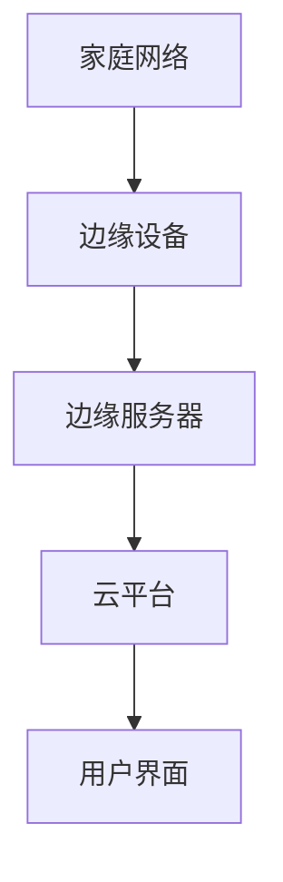

### 图2-1 联合推理技术的流程图

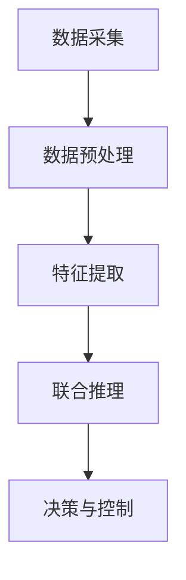

### 图3-1 智能家居中联合推理的应用示意图

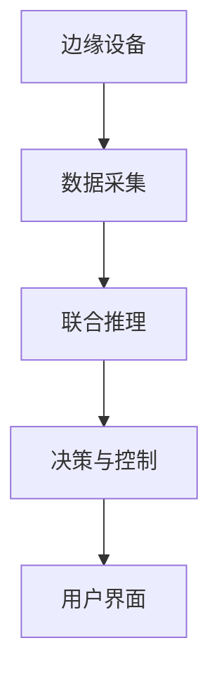

### 图4-1 边缘计算架构图

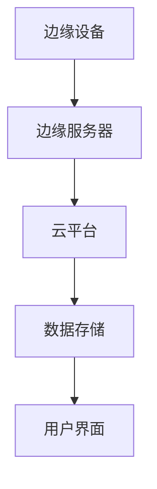

### 图5-1 智能安防系统架构图

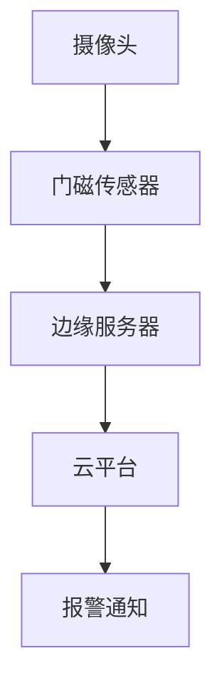

### 图5-2 智能家居设备联动架构图

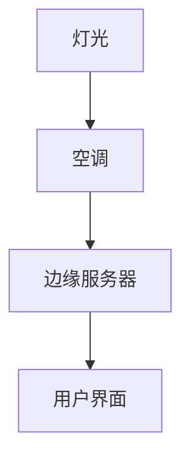

## Mermaid 流程图

### 第1章 绪论

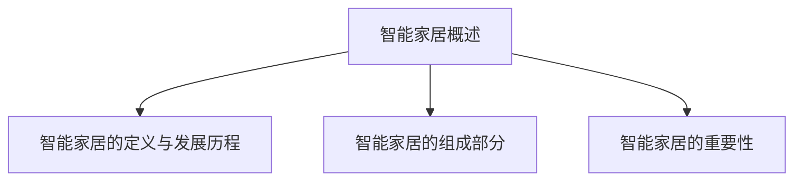

### 第2章 联合推理技术基础

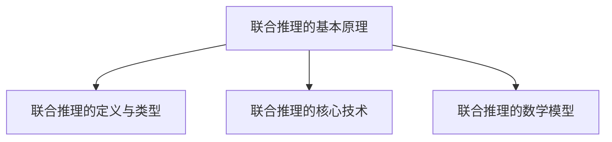

### 第3章 联合推理在智能家居中的应用

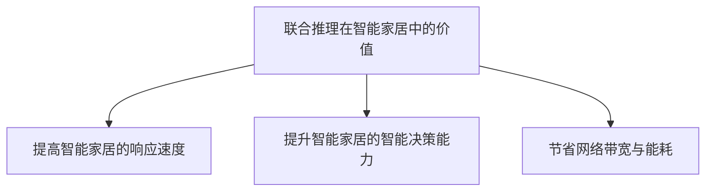

### 第4章 边缘计算中的联合推理架构设计

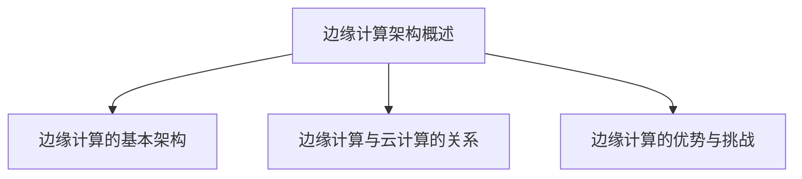

### 第5章 联合推理在智能家居中的实际案例

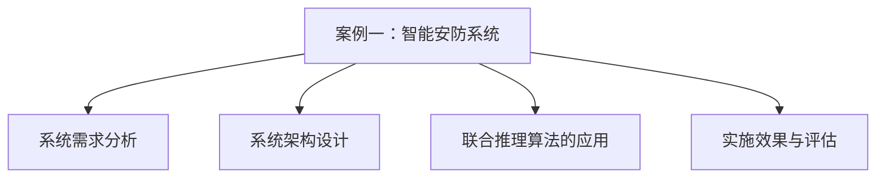

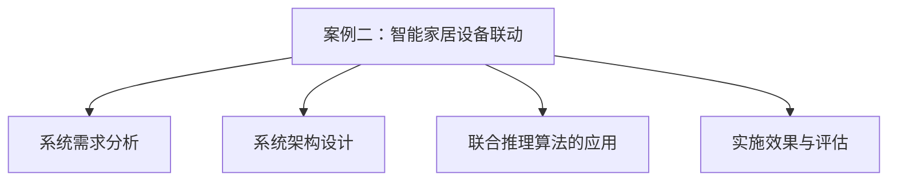

## Mermaid 图表

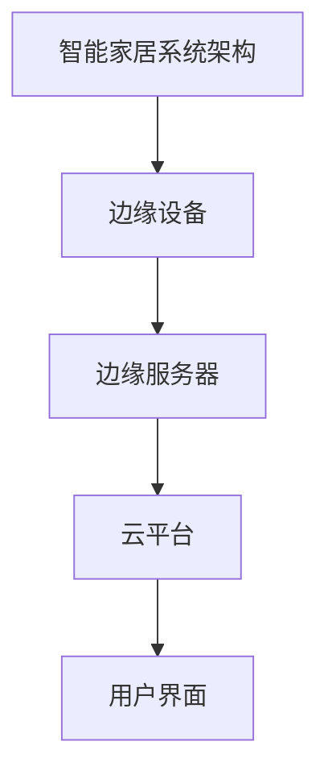

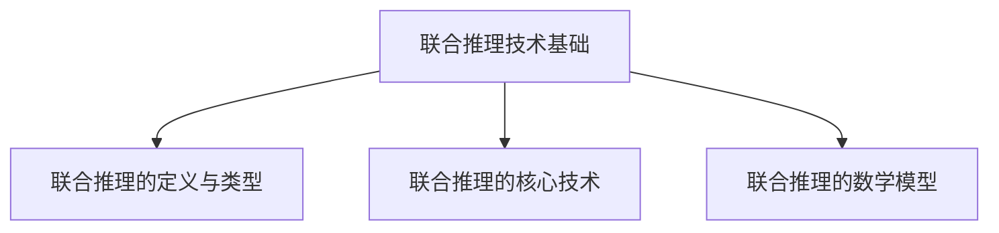

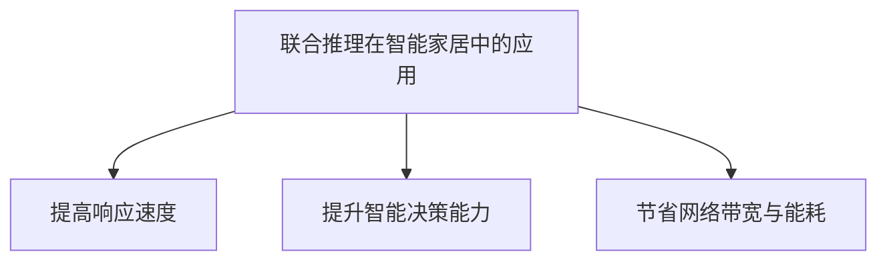


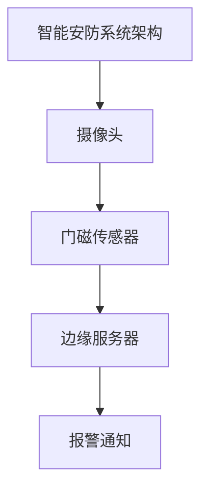

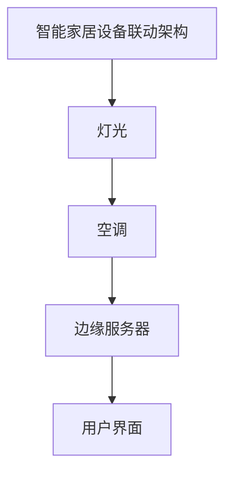

