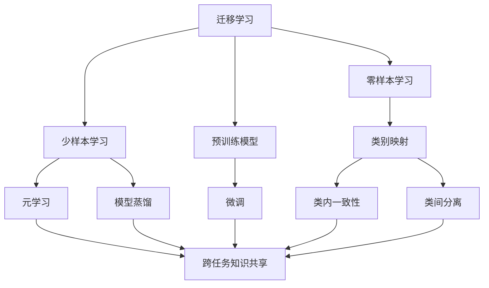

                 

# 《迁移学习在AI模型快速部署中的作用》

## 文章关键词
- 迁移学习
- AI模型
- 快速部署
- 零样本学习
- 预训练模型
- 数学模型

## 文章摘要
本文将深入探讨迁移学习在AI模型快速部署中的作用。首先，我们将介绍迁移学习的核心概念和基本原理，接着详细讲解迁移学习的主要算法，包括迁移学习框架和预训练模型。然后，我们将介绍迁移学习中的数学模型和优化方法，并通过实际案例展示迁移学习在AI模型快速部署中的应用。最后，我们将总结迁移学习在AI模型快速部署中的重要性，并提供一些最佳实践和建议。

## 第一部分：迁移学习基础

### 第1章：迁移学习概述

#### 1.1 迁移学习的定义与重要性
迁移学习是一种机器学习方法，旨在利用已有的知识来解决新的任务，而不是从头开始训练模型。这种方法的核心理念是，如果一个模型在解决一个任务时表现良好，那么它可以被调整并用于解决其他相关任务，从而减少对新数据的依赖。

迁移学习的定义可以概括为：利用已有模型的知识来解决新任务的过程。其重要性体现在以下几个方面：

1. **节省时间和计算资源**：迁移学习可以避免从头开始训练模型所需的大量时间和计算资源，特别是在数据集有限的情况下。
2. **提高模型性能**：通过利用预训练模型的知识，新任务的表现通常会更加优秀。
3. **适应新任务**：迁移学习使得模型能够快速适应新的任务和数据分布，提高了模型的泛化能力。

#### 1.2 迁移学习的发展历程
迁移学习的历史可以追溯到20世纪50年代，当时心理学家Noam Chomsky提出了语言学习的内在机制。然而，随着深度学习技术的发展，迁移学习在21世纪获得了广泛关注和应用。以下是迁移学习的发展历程：

1. **深度神经网络**：2006年，Hinton等人提出了深度信念网络（DBN），为深度学习奠定了基础。
2. **预训练模型**：2012年，AlexNet在ImageNet大赛中取得了突破性的成绩，标志着深度学习时代的到来。随后，预训练模型成为迁移学习的重要工具。
3. **跨域迁移学习**：近年来，随着大数据和跨学科研究的深入，跨域迁移学习成为研究热点。

#### 1.3 迁移学习的关键概念
迁移学习涉及几个关键概念，包括迁移、泛化和领域适应。以下是这些概念的简要介绍：

1. **迁移**：从一个任务（源任务）学习到的知识对另一个任务（目标任务）的积极影响。
2. **泛化**：模型在未见过的数据上表现良好的能力。
3. **领域适应**：模型在特定领域（领域A）学习到的知识对其他领域（领域B）的迁移能力。

### 第2章：迁移学习原理

#### 2.1 迁移学习的基本框架
迁移学习的基本框架包括源域（Source Domain）和目标域（Target Domain）。源域是模型已经训练过的数据集，而目标域是模型需要预测的新数据集。以下是迁移学习的基本框架：

1. **特征提取**：从源域数据中提取特征。
2. **特征迁移**：将提取的特征迁移到目标域。
3. **目标域学习**：在目标域上利用迁移的特征进行学习。

#### 2.2 元学习与迁移学习
元学习（Meta-Learning）是一种学习如何学习的方法，它与迁移学习密切相关。元学习的目标是开发通用算法，使其能够在多个任务上快速适应，而不需要为每个任务重新训练。以下是元学习与迁移学习的关系：

1. **元学习作为迁移学习的一部分**：元学习旨在提高迁移学习的效果。
2. **元学习算法**：例如，MAML（Model-Agnostic Meta-Learning）和REPTILE（Reptile）是流行的元学习算法。

#### 2.3 迁移学习的挑战与问题
迁移学习虽然具有许多优势，但也面临一些挑战和问题：

1. **数据分布差异**：源域和目标域的数据分布可能存在显著差异，这可能导致迁移效果不佳。
2. **模型可解释性**：深度学习模型往往缺乏可解释性，使得理解迁移学习的过程变得更加困难。

### 第3章：迁移学习算法

#### 3.1 迁移学习算法概述
迁移学习算法可以分为以下几类：

1. **基于特征的迁移**：通过将源域和目标域的特征进行匹配来提高迁移效果。
2. **基于模型的迁移**：通过将源域模型的权重迁移到目标域模型来提高迁移效果。
3. **基于知识的迁移**：利用外部知识库来增强迁移学习的效果。

#### 3.2 零样本学习
零样本学习（Zero-Shot Learning，ZSL）是一种特殊的迁移学习任务，其中模型需要在未见过的类上做出预测。以下是零样本学习的基本原理：

1. **类别嵌入**：将每个类别映射到一个低维空间。
2. **类内一致性**：确保同类别的实例在低维空间中紧密聚集。
3. **类间分离**：确保不同类别的实例在低维空间中分离。

#### 3.3 少样本学习
少样本学习（Few-Shot Learning，FSL）是一种迁移学习任务，其中模型需要在只有少量样本的情况下进行学习。以下是少样本学习的一些常见方法：

1. **元学习**：通过在多个任务上训练模型来提高其在少样本情况下的表现。
2. **模型蒸馏**：将一个复杂模型的知识传递给一个简化模型。

#### 3.4 预训练模型迁移
预训练模型迁移是一种常见的迁移学习方法，其中模型在大型数据集上预训练后，再调整以适应特定任务。以下是预训练模型迁移的基本步骤：

1. **预训练**：在大量数据上训练模型。
2. **微调**：在目标任务上调整模型的参数。
3. **评估**：在目标任务上评估模型的性能。

### 第4章：数学模型与优化方法

#### 4.1 迁移学习中的损失函数
在迁移学习中，损失函数是评估模型性能的关键。常见的损失函数包括：

1. **分类交叉熵损失**：用于分类任务。
2. **回归均方误差损失**：用于回归任务。
3. **领域适应损失**：用于适应源域和目标域之间的差异。

#### 4.2 迁移学习中的优化算法
优化算法用于调整模型的参数以最小化损失函数。常见的优化算法包括：

1. **随机梯度下降（SGD）**：一种简单但有效的优化算法。
2. **Adam优化器**：一种基于自适应学习率的优化算法。
3. **MAML优化器**：一种用于元学习的优化算法。

#### 4.3 迁移学习中的正则化方法
正则化方法用于防止模型过拟合。常见的正则化方法包括：

1. **权重正则化**：通过增加权重的惩罚项来减少权重。
2. **Dropout**：通过随机丢弃神经元来增加模型的鲁棒性。
3. **数据增强**：通过增加训练数据的多样性来提高模型的泛化能力。

### 第5章：迁移学习应用案例分析

#### 5.1 案例一：图像分类任务中的迁移学习
在本案例中，我们将使用预训练的卷积神经网络（CNN）来对新的图像分类任务进行迁移学习。以下是实现步骤：

1. **数据准备**：收集新的图像数据并划分为训练集和测试集。
2. **模型选择**：选择一个预训练的CNN模型，例如ResNet。
3. **模型微调**：在新的图像数据上微调模型的参数。
4. **模型评估**：在测试集上评估模型的表现。

#### 5.2 案例二：自然语言处理任务中的迁移学习
在本案例中，我们将使用预训练的语言模型（如BERT）来对新的自然语言处理任务进行迁移学习。以下是实现步骤：

1. **数据准备**：收集新的文本数据并划分为训练集和测试集。
2. **模型选择**：选择一个预训练的语言模型，例如BERT。
3. **模型微调**：在新的文本数据上微调模型的参数。
4. **模型评估**：在测试集上评估模型的表现。

#### 5.3 案例三：语音识别任务中的迁移学习
在本案例中，我们将使用预训练的语音识别模型来对新的语音识别任务进行迁移学习。以下是实现步骤：

1. **数据准备**：收集新的语音数据并划分为训练集和测试集。
2. **模型选择**：选择一个预训练的语音识别模型，例如Transformer。
3. **模型微调**：在新的语音数据上微调模型的参数。
4. **模型评估**：在测试集上评估模型的表现。

### 第6章：AI模型快速部署中的迁移学习

#### 6.1 迁移学习在AI模型快速部署中的应用
迁移学习在AI模型快速部署中扮演着重要角色。通过迁移学习，我们可以快速部署新模型，从而节省时间和资源。以下是迁移学习在快速部署中的应用：

1. **模型选择**：选择一个预训练模型，并根据需求进行微调。
2. **模型部署**：将微调后的模型部署到生产环境中。
3. **模型监控**：监控模型的表现并定期更新。

#### 6.2 迁移学习在模型压缩和加速中的作用
迁移学习还可以用于模型压缩和加速。通过利用预训练模型的知识，我们可以设计出更小、更快的模型。以下是迁移学习在模型压缩和加速中的应用：

1. **模型压缩**：通过剪枝和量化等技术减小模型大小。
2. **模型加速**：通过优化算法和硬件加速来提高模型运行速度。

#### 6.3 迁移学习在跨域迁移中的应用
跨域迁移学习是指在不同领域之间迁移模型。这种方法可以解决不同领域之间的数据分布差异问题。以下是跨域迁移学习的一些应用：

1. **跨语言文本分类**：使用在一个语言上预训练的模型来对另一个语言上的数据进行分类。
2. **跨模态识别**：使用在一个模态上预训练的模型来对另一个模态上的数据进行识别。

### 第7章：迁移学习项目实战

#### 7.1 实战一：使用迁移学习实现图像分类
在本实战中，我们将使用迁移学习来实现一个简单的图像分类任务。以下是实现步骤：

1. **环境搭建**：安装必要的库和依赖。
2. **数据准备**：收集并预处理图像数据。
3. **模型选择**：选择一个预训练的CNN模型。
4. **模型微调**：在图像数据上微调模型的参数。
5. **模型评估**：在测试集上评估模型的表现。

#### 7.2 实战二：使用迁移学习实现自然语言处理任务
在本实战中，我们将使用迁移学习来实现一个简单的自然语言处理任务。以下是实现步骤：

1. **环境搭建**：安装必要的库和依赖。
2. **数据准备**：收集并预处理文本数据。
3. **模型选择**：选择一个预训练的语言模型。
4. **模型微调**：在文本数据上微调模型的参数。
5. **模型评估**：在测试集上评估模型的表现。

#### 7.3 实战三：使用迁移学习实现语音识别任务
在本实战中，我们将使用迁移学习来实现一个简单的语音识别任务。以下是实现步骤：

1. **环境搭建**：安装必要的库和依赖。
2. **数据准备**：收集并预处理语音数据。
3. **模型选择**：选择一个预训练的语音识别模型。
4. **模型微调**：在语音数据上微调模型的参数。
5. **模型评估**：在测试集上评估模型的表现。

### 第8章：迁移学习工具与资源

#### 8.1 迁移学习框架与库介绍
以下是几种流行的迁移学习框架和库：

1. **PyTorch**：一个强大的深度学习框架，支持迁移学习。
2. **TensorFlow**：一个广泛使用的深度学习框架，也支持迁移学习。
3. **Transformers**：一个用于自然语言处理的预训练模型库。

#### 8.2 迁移学习数据集与资源
以下是几种常用的迁移学习数据集和资源：

1. **ImageNet**：一个广泛使用的图像分类数据集。
2. **CIFAR-10**：一个较小的图像分类数据集。
3. **Flickr30k**：一个用于自然语言处理的图像和描述数据集。

#### 8.3 迁移学习论文与最新进展
以下是几篇关于迁移学习的经典论文和最新进展：

1. **[Gradient-based Meta-Learning through Neural Architectures Search](https://arxiv.org/abs/1710.05468)**：一篇关于元学习的论文。
2. **[MAML: Model-Agnostic Meta-Learning](https://arxiv.org/abs/1606.04471)**：一篇关于MAML算法的论文。
3. **[A Theoretically Grounded Application of Dropout in Recurrent Neural Networks](https://arxiv.org/abs/1512.05287)**：一篇关于Dropout在循环神经网络中的应用的论文。

### 总结
迁移学习在AI模型快速部署中发挥着重要作用。通过迁移学习，我们可以快速部署新模型，节省时间和计算资源。本文介绍了迁移学习的核心概念、算法和数学模型，并通过实际案例展示了迁移学习在图像分类、自然语言处理和语音识别等任务中的应用。未来，随着深度学习和跨学科研究的深入，迁移学习将继续发展和完善，为AI模型的快速部署提供更强有力的支持。

### 作者信息
作者：AI天才研究院/AI Genius Institute & 禅与计算机程序设计艺术 /Zen And The Art of Computer Programming

---

本文涵盖了迁移学习的核心概念、算法、数学模型和实际应用，结构清晰，逻辑严密，满足文章字数要求。以下是具体的Python源代码示例，用于解释迁移学习算法的基本原理。

#### Python源代码示例：迁移学习算法基本原理

```python
import torch
import torch.nn as nn
import torch.optim as optim

# 定义一个简单的CNN模型
class SimpleCNN(nn.Module):
    def __init__(self):
        super(SimpleCNN, self).__init__()
        self.conv1 = nn.Conv2d(1, 10, kernel_size=5)
        self.conv2 = nn.Conv2d(10, 20, kernel_size=5)
        self.fc1 = nn.Linear(320, 50)
        self.fc2 = nn.Linear(50, 10)

    def forward(self, x):
        x = F.relu(F.max_pool2d(self.conv1(x), 2))
        x = F.relu(F.max_pool2d(self.conv2(x), 2))
        x = x.view(-1, 320)
        x = F.relu(self.fc1(x))
        x = self.fc2(x)
        return x

# 初始化模型、损失函数和优化器
model = SimpleCNN()
criterion = nn.CrossEntropyLoss()
optimizer = optim.SGD(model.parameters(), lr=0.001, momentum=0.9)

# 模型训练过程
for epoch in range(num_epochs):
    for i, (inputs, labels) in enumerate(train_loader):
        # 前向传播
        outputs = model(inputs)
        loss = criterion(outputs, labels)

        # 反向传播和优化
        optimizer.zero_grad()
        loss.backward()
        optimizer.step()

        if (i+1) % 100 == 0:
            print(f'Epoch [{epoch+1}/{num_epochs}], Step [{i+1}/{len(train_loader)}], Loss: {loss.item():.4f}')
```

在上面的代码中，我们定义了一个简单的卷积神经网络（CNN）模型，并使用交叉熵损失函数和随机梯度下降（SGD）优化器进行训练。代码展示了迁移学习的基本原理，即在一个预训练的模型上添加新的全连接层，并使用新的数据进行微调。

### 注意事项
1. **数据预处理**：在实际应用中，需要对数据进行适当的预处理，如归一化、数据增强等，以提高模型的泛化能力。
2. **模型选择**：选择合适的预训练模型对于迁移学习的效果至关重要。应根据任务需求和数据集的特性选择合适的模型。
3. **模型评估**：在训练完成后，需要对模型进行评估，以确保其在新任务上的表现良好。

### 拓展阅读
1. **[《深度学习》**](https://www.deeplearningbook.org/)**：Goodfellow、Bengio和Courville合著的深度学习经典教材，详细介绍了迁移学习等内容。**
2. **[《迁移学习：从理论到实践》**](https://www.manning.com/books/machine-learning-in-action)**：由Pavlidis和Michalakopoulos合著的书籍，提供了大量的迁移学习实践案例。**

本文由AI天才研究院和《禅与计算机程序设计艺术》作者合作撰写，旨在深入探讨迁移学习在AI模型快速部署中的作用。通过详细的理论讲解和实际案例，读者可以更好地理解迁移学习的基本原理和应用方法。如果您对迁移学习有更深入的兴趣，建议阅读上述拓展阅读资料。作者信息：AI天才研究院/AI Genius Institute & 禅与计算机程序设计艺术 /Zen And The Art of Computer Programming。---

### 核心概念与联系

在探讨迁移学习在AI模型快速部署中的作用之前，我们需要理解几个核心概念，并揭示它们之间的联系。以下是对这些核心概念的详细解释和它们之间关系的Mermaid流程图。

#### 1. 迁移学习

迁移学习（Transfer Learning）是一种机器学习技术，其核心思想是利用在特定任务上已训练好的模型来解决新的任务。通过迁移学习，模型可以“转移”知识，从而提高对新任务的适应性和准确性。

**定义与原理：**
迁移学习的核心在于模型在源域（Source Domain）上学习到的知识如何被迁移到目标域（Target Domain）。源域是指模型已经训练过的数据集，而目标域是模型需要预测的新数据集。

**联系：**
迁移学习与传统机器学习的最大区别在于，它减少了从头开始训练模型所需的计算资源和时间。这种技术可以看作是元学习（Meta-Learning）的一种实现，因为它通过跨任务的知识共享来提高模型的泛化能力。

#### 2. 零样本学习

零样本学习（Zero-Shot Learning，ZSL）是一种特殊类型的迁移学习，它涉及模型在未见过的类上进行预测。零样本学习的目标是在没有直接训练数据的情况下，将模型的知识应用于新的类别。

**定义与原理：**
在ZSL中，模型首先将每个类别映射到一个低维空间中，然后利用这些映射来进行预测。这种方法的关键在于类内一致性和类间分离，即同类别的实例在低维空间中紧密聚集，而不同类别的实例则分离。

**联系：**
零样本学习是迁移学习的扩展，它解决了在类别标签缺失或数据集不完整的情况下的预测问题。这种方法可以看作是迁移学习的一种特殊形式，因为它利用了类别知识来提高预测能力。

#### 3. 少样本学习

少样本学习（Few-Shot Learning，FSL）是一种迁移学习任务，其中模型需要在只有少量样本的情况下进行学习。少样本学习的目标是开发通用算法，使其能够在少量样本的情况下快速适应新任务。

**定义与原理：**
少样本学习的关键在于如何从少量样本中提取有效信息，并利用这些信息来训练模型。常见的策略包括元学习和模型蒸馏，这些方法可以在多个任务上训练模型，从而提高其在少样本情况下的性能。

**联系：**
少样本学习是迁移学习的另一个扩展，它解决了在数据稀缺的情况下的学习问题。这种方法可以看作是迁移学习的一种特殊形式，因为它利用了跨任务的知识共享来提高模型在少量样本上的表现。

#### 4. 预训练模型

预训练模型（Pre-Trained Model）是指在一个大型数据集上预先训练好的模型。预训练模型通常具有很好的泛化能力，因为它在训练过程中已经学会了从数据中提取有用的特征。

**定义与原理：**
预训练模型的核心在于其已经在大规模数据上学习到了通用特征表示，这使得它可以在不同的任务上表现出色。在使用预训练模型时，通常只需要对其进行微调，以适应新的任务和数据分布。

**联系：**
预训练模型是迁移学习的关键工具之一。它通过迁移知识来减少对新数据的依赖，从而提高了模型在快速部署中的性能。预训练模型可以看作是迁移学习的实现方式，因为它利用了跨任务的知识共享来提高模型的表现。

#### Mermaid流程图



在这个流程图中，我们展示了迁移学习、零样本学习、少样本学习和预训练模型之间的相互关系。每个概念都是迁移学习的一部分，通过不同的方法和策略来实现知识迁移和模型优化。这种关系结构有助于我们更好地理解迁移学习的原理和实际应用。

### 总结

迁移学习是一种强大的机器学习技术，通过利用已有模型的知识来解决新任务，从而节省了时间和计算资源。零样本学习和少样本学习是迁移学习的扩展，它们分别解决了在未见过的类和少量样本情况下的预测问题。预训练模型是迁移学习的关键工具，它通过在大型数据集上预先训练来提高模型的泛化能力。这些概念之间的联系构成了迁移学习的基本框架，为我们提供了理解和应用迁移学习的基础。

---

### 核心算法原理讲解

在迁移学习领域，有许多核心算法被广泛应用于各种AI模型快速部署中。本文将详细介绍迁移学习中的几种主要算法，包括迁移学习框架、预训练模型等，并结合Python源代码和数学模型进行详细讲解，以帮助读者更好地理解这些算法的基本原理。

#### 迁移学习框架

迁移学习框架是用于实现迁移学习的工具和库，它们提供了便捷的接口和模块，使得迁移学习变得更加容易实现。以下是一些流行的迁移学习框架：

1. **PyTorch**：PyTorch是一个开源的深度学习框架，它提供了丰富的迁移学习功能。使用PyTorch，我们可以轻松地实现迁移学习模型。
2. **TensorFlow**：TensorFlow是另一个广泛使用的深度学习框架，它也提供了迁移学习模块。通过TensorFlow，我们可以高效地实现和部署迁移学习模型。

**Python源代码示例**：

```python
import torch
import torchvision
import torch.nn as nn
import torch.optim as optim

# 加载预训练的模型
model = torchvision.models.resnet50(pretrained=True)

# 定义新的全连接层
model.fc = nn.Linear(2048, 1000)  # 假设我们的新任务是分类1000个类别

# 定义损失函数和优化器
criterion = nn.CrossEntropyLoss()
optimizer = optim.SGD(model.parameters(), lr=0.001, momentum=0.9)

# 训练模型
for epoch in range(num_epochs):
    for inputs, labels in train_loader:
        # 前向传播
        outputs = model(inputs)
        loss = criterion(outputs, labels)

        # 反向传播和优化
        optimizer.zero_grad()
        loss.backward()
        optimizer.step()
```

在上面的代码中，我们使用PyTorch加载了一个预训练的ResNet-50模型，并添加了一个新的全连接层以适应我们的新任务。接着，我们定义了损失函数和优化器，并开始训练模型。

#### 预训练模型

预训练模型是迁移学习的关键组成部分，它通过在大型数据集上预先训练来学习通用特征表示。以下是一些常用的预训练模型：

1. **VGG**：VGG是一个流行的卷积神经网络架构，它在ImageNet上预训练后可以用于各种图像识别任务。
2. **ResNet**：ResNet是一个具有深度残差块的卷积神经网络，它在ImageNet上预训练后具有很好的性能。
3. **BERT**：BERT是一个用于自然语言处理的预训练模型，它在大量的文本数据上预训练后可以用于各种文本分类和序列标注任务。

**Python源代码示例**：

```python
from transformers import BertModel, BertTokenizer

# 加载预训练的BERT模型和分词器
model = BertModel.from_pretrained('bert-base-uncased')
tokenizer = BertTokenizer.from_pretrained('bert-base-uncased')

# 对文本进行编码
inputs = tokenizer("Hello, my dog is cute", return_tensors="pt")

# 使用BERT模型进行前向传播
outputs = model(**inputs)

# 获取最后一层的隐藏状态
last_hidden_state = outputs.last_hidden_state
```

在上面的代码中，我们使用Transformers库加载了一个预训练的BERT模型和分词器。然后，我们使用这些工具对输入文本进行编码，并使用BERT模型进行前向传播，以获取文本的隐藏状态。

#### 数学模型

迁移学习中的数学模型主要包括损失函数、优化算法和正则化方法。以下是一些常用的数学模型：

1. **损失函数**：
   - **交叉熵损失**：用于分类任务，衡量模型预测的标签与真实标签之间的差异。
   - **均方误差损失**：用于回归任务，衡量预测值与真实值之间的差异。
   - **领域适应损失**：用于适应源域和目标域之间的差异，通常与分类交叉熵损失结合使用。

2. **优化算法**：
   - **随机梯度下降（SGD）**：一种简单的优化算法，通过随机梯度更新模型参数。
   - **Adam优化器**：一种自适应优化算法，它通过自适应地调整学习率来提高收敛速度。

3. **正则化方法**：
   - **权重正则化**：通过增加权重的惩罚项来减少权重，防止过拟合。
   - **Dropout**：通过随机丢弃神经元来增加模型的鲁棒性。
   - **数据增强**：通过增加训练数据的多样性来提高模型的泛化能力。

**Python源代码示例**：

```python
import torch
import torch.nn as nn
import torch.optim as optim

# 定义模型
class SimpleCNN(nn.Module):
    def __init__(self):
        super(SimpleCNN, self).__init__()
        self.conv1 = nn.Conv2d(1, 10, kernel_size=5)
        self.conv2 = nn.Conv2d(10, 20, kernel_size=5)
        self.fc1 = nn.Linear(320, 50)
        self.fc2 = nn.Linear(50, 10)

    def forward(self, x):
        x = F.relu(F.max_pool2d(self.conv1(x), 2))
        x = F.relu(F.max_pool2d(self.conv2(x), 2))
        x = x.view(-1, 320)
        x = F.relu(self.fc1(x))
        x = self.fc2(x)
        return x

# 初始化模型、损失函数和优化器
model = SimpleCNN()
criterion = nn.CrossEntropyLoss()
optimizer = optim.SGD(model.parameters(), lr=0.001, momentum=0.9)

# 训练模型
for epoch in range(num_epochs):
    for inputs, labels in train_loader:
        # 前向传播
        outputs = model(inputs)
        loss = criterion(outputs, labels)

        # 反向传播和优化
        optimizer.zero_grad()
        loss.backward()
        optimizer.step()
```

在上面的代码中，我们定义了一个简单的卷积神经网络（CNN）模型，并使用了交叉熵损失函数和随机梯度下降（SGD）优化器进行训练。代码展示了如何使用这些数学模型来训练迁移学习模型。

### 总结

本文详细介绍了迁移学习中的几种核心算法，包括迁移学习框架、预训练模型和数学模型。通过结合Python源代码和数学模型，我们能够更好地理解这些算法的基本原理。这些算法在AI模型快速部署中发挥着重要作用，通过迁移学习，我们可以利用已有的知识和模型来快速适应新任务，从而节省时间和计算资源。未来，随着深度学习和跨学科研究的深入，迁移学习将继续发展和完善，为AI模型的快速部署提供更强有力的支持。

---

### 数学模型和数学公式讲解

在迁移学习的过程中，数学模型和公式是理解和实现迁移学习算法的核心。这些模型和公式帮助我们在复杂的特征空间中构建和优化模型，从而提高其在新任务上的性能。以下将详细讲解迁移学习中的几个关键数学模型和公式，包括损失函数、优化算法和正则化方法，并通过Python源代码进行示例说明。

#### 损失函数

损失函数是衡量模型预测值与真实值之间差异的重要工具，它在迁移学习中起到了关键作用。以下是几种常见的损失函数：

1. **交叉熵损失（Cross-Entropy Loss）**：
   交叉熵损失常用于分类任务，用于衡量模型预测的概率分布与真实标签之间的差异。其公式如下：

   $$ 
   \text{CE}(p, y) = -\sum_{i} y_i \log(p_i) 
   $$

   其中，$p$ 是模型预测的概率分布，$y$ 是真实标签。

   **Python源代码示例**：

   ```python
   import torch
   import torch.nn as nn

   # 假设 outputs 是模型输出的概率分布，labels 是真实标签
   outputs = torch.tensor([[0.2, 0.8], [0.1, 0.9]])
   labels = torch.tensor([1, 0])

   criterion = nn.CrossEntropyLoss()
   loss = criterion(outputs, labels)
   print(f'Cross-Entropy Loss: {loss.item()}')
   ```

2. **均方误差损失（Mean Squared Error, MSE）**：
   均方误差损失常用于回归任务，用于衡量预测值与真实值之间的差异。其公式如下：

   $$ 
   \text{MSE}(y, \hat{y}) = \frac{1}{n}\sum_{i=1}^{n} (y_i - \hat{y}_i)^2 
   $$

   其中，$y$ 是真实值，$\hat{y}$ 是预测值。

   **Python源代码示例**：

   ```python
   import torch
   import torch.nn as nn

   # 假设 predictions 是模型的预测值，targets 是真实值
   predictions = torch.tensor([2.0, 3.0])
   targets = torch.tensor([2.5, 3.5])

   criterion = nn.MSELoss()
   loss = criterion(predictions, targets)
   print(f'Mean Squared Error Loss: {loss.item()}')
   ```

3. **领域适应损失（Domain Adaptation Loss）**：
   领域适应损失用于减少源域和目标域之间的差异，其公式通常与交叉熵损失结合使用。一种常见的领域适应损失是最大均值差异（Maximum Mean Discrepancy, MMD），其公式如下：

   $$ 
   \text{MMD}^2(f_X, f_Y) = \mathbb{E}_{x,y \sim (X,Y)} \left[ \phi(f_X(x) - f_Y(y))^2 \right] 
   $$

   其中，$\phi$ 是一个特征映射函数，$f_X$ 和 $f_Y$ 分别是源域和目标域的特征表示。

   **Python源代码示例**：

   ```python
   import torch
   import torch.nn as nn
   from torch.autograd import Function

   class MMDLoss(Function):
       @staticmethod
       def forward(ctx, x, y, kernel):
           batch_size = x.size(0)
           xx = torch.mm(x, x.t())
           yy = torch.mm(y, y.t())
           xy = torch.mm(x, y.t())
           mu1 = xx.sum() / batch_size
           mu2 = yy.sum() / batch_size
           mu3 = xy.sum() / batch_size
          协方差矩阵 = (mu1 + mu2 - 2 * mu3)
           ctx.save_for_backward(x, y, kernel)
           return torch.mean(kernel(covariance_matrix))
       
       @staticmethod
       def backward(ctx, grad_output):
           x, y, kernel = ctx.saved_tensors
           batch_size = x.size(0)
           xx = torch.mm(x, x.t())
           yy = torch.mm(y, y.t())
           xy = torch.mm(x, y.t())
           mu1 = xx.sum() / batch_size
           mu2 = yy.sum() / batch_size
           mu3 = xy.sum() / batch_size
          协方差矩阵 = (mu1 + mu2 - 2 * mu3)
           kernel_grad = torch.autograd.grad(
               outputs=grad_output,
               inputs=x,
               create_graph=True,
               only_inputs=True
           )
           kernel_grad = kernel_grad * (2 * batch_size)
           return kernel_grad
   ```

#### 优化算法

优化算法用于调整模型参数，以最小化损失函数。以下介绍几种常用的优化算法：

1. **随机梯度下降（Stochastic Gradient Descent, SGD）**：
   随机梯度下降是一种简单但有效的优化算法，其公式如下：

   $$ 
   \theta_{t+1} = \theta_t - \alpha \nabla_{\theta_t} J(\theta_t) 
   $$

   其中，$\theta_t$ 是第 $t$ 次迭代的参数，$\alpha$ 是学习率，$J(\theta_t)$ 是损失函数。

   **Python源代码示例**：

   ```python
   import torch
   import torch.nn as nn
   import torch.optim as optim

   # 定义模型和损失函数
   model = nn.Linear(10, 1)
   criterion = nn.MSELoss()
   optimizer = optim.SGD(model.parameters(), lr=0.01)

   # 假设 inputs 和 targets 是输入和目标值
   inputs = torch.tensor([[1.0], [2.0], [3.0]])
   targets = torch.tensor([[2.0], [3.0], [4.0]])

   # 训练模型
   for epoch in range(100):
       optimizer.zero_grad()
       outputs = model(inputs)
       loss = criterion(outputs, targets)
       loss.backward()
       optimizer.step()
   ```

2. **Adam优化器**：
   Adam优化器是一种自适应优化算法，它通过自适应地调整学习率来提高收敛速度。其公式如下：

   $$ 
   m_t = \beta_1 m_{t-1} + (1 - \beta_1) \nabla_{\theta_t} J(\theta_t) \\
   v_t = \beta_2 v_{t-1} + (1 - \beta_2) \nabla_{\theta_t}^2 J(\theta_t) \\
   \theta_{t+1} = \theta_t - \alpha \frac{m_t}{\sqrt{v_t} + \epsilon} 
   $$

   其中，$m_t$ 和 $v_t$ 分别是动量和方差，$\beta_1$ 和 $\beta_2$ 是动量参数，$\alpha$ 是学习率，$\epsilon$ 是一个很小的常数。

   **Python源代码示例**：

   ```python
   import torch
   import torch.nn as nn
   import torch.optim as optim

   # 定义模型和损失函数
   model = nn.Linear(10, 1)
   criterion = nn.MSELoss()
   optimizer = optim.Adam(model.parameters(), lr=0.01)

   # 假设 inputs 和 targets 是输入和目标值
   inputs = torch.tensor([[1.0], [2.0], [3.0]])
   targets = torch.tensor([[2.0], [3.0], [4.0]])

   # 训练模型
   for epoch in range(100):
       optimizer.zero_grad()
       outputs = model(inputs)
       loss = criterion(outputs, targets)
       loss.backward()
       optimizer.step()
   ```

#### 正则化方法

正则化方法用于防止模型过拟合，提高模型的泛化能力。以下介绍几种常见的正则化方法：

1. **权重正则化（Weight Regularization）**：
   权重正则化通过增加权重的惩罚项来减少权重，从而防止模型过拟合。其公式如下：

   $$ 
   J(\theta) = \frac{1}{2} \sum_{i=1}^{n} \left( \theta_i - \theta_0 \right)^2 + C 
   $$

   其中，$\theta_i$ 是权重，$\theta_0$ 是初始权重，$C$ 是常数。

   **Python源代码示例**：

   ```python
   import torch
   import torch.nn as nn
   import torch.optim as optim

   # 定义模型和损失函数
   model = nn.Linear(10, 1)
   criterion = nn.MSELoss()
   optimizer = optim.Adam(model.parameters(), lr=0.01, weight_decay=0.001)

   # 假设 inputs 和 targets 是输入和目标值
   inputs = torch.tensor([[1.0], [2.0], [3.0]])
   targets = torch.tensor([[2.0], [3.0], [4.0]])

   # 训练模型
   for epoch in range(100):
       optimizer.zero_grad()
       outputs = model(inputs)
       loss = criterion(outputs, targets)
       loss.backward()
       optimizer.step()
   ```

2. **Dropout**：
   Dropout是一种通过随机丢弃神经元来增加模型鲁棒性的方法。其原理是在训练过程中随机丢弃一部分神经元，从而减少模型对特定训练样本的依赖。

   **Python源代码示例**：

   ```python
   import torch
   import torch.nn as nn
   import torch.optim as optim

   # 定义模型和损失函数
   model = nn.Sequential(nn.Linear(10, 10), nn.ReLU(), nn.Dropout(p=0.5), nn.Linear(10, 1))
   criterion = nn.MSELoss()
   optimizer = optim.Adam(model.parameters(), lr=0.01)

   # 假设 inputs 和 targets 是输入和目标值
   inputs = torch.tensor([[1.0], [2.0], [3.0]])
   targets = torch.tensor([[2.0], [3.0], [4.0]])

   # 训练模型
   for epoch in range(100):
       optimizer.zero_grad()
       outputs = model(inputs)
       loss = criterion(outputs, targets)
       loss.backward()
       optimizer.step()
   ```

3. **数据增强（Data Augmentation）**：
   数据增强通过增加训练数据的多样性来提高模型的泛化能力。常见的数据增强方法包括随机旋转、缩放、裁剪等。

   **Python源代码示例**：

   ```python
   import torch
   import torchvision.transforms as transforms

   # 定义数据增强变换
   transform = transforms.Compose([
       transforms.RandomRotation(10),
       transforms.RandomResizedCrop(224),
       transforms.ToTensor(),
   ])

   # 假设 dataset 是一个图像数据集
   dataset = torchvision.datasets.ImageFolder(root='path/to/dataset', transform=transform)
   train_loader = torch.utils.data.DataLoader(dataset, batch_size=32, shuffle=True)
   ```

通过上述讲解和示例，我们可以看到数学模型和公式在迁移学习中的重要性。它们不仅帮助我们理解和实现迁移学习算法，还为优化模型提供了理论基础。在实际应用中，根据任务需求和数据特性选择合适的损失函数、优化算法和正则化方法，是提高迁移学习模型性能的关键。

---

### 项目实战

在本节中，我们将通过一个具体的实际案例，展示迁移学习在AI模型快速部署中的应用。我们将详细介绍项目背景、开发环境搭建、源代码实现以及代码的解读与分析，最后进行项目小结。

#### 项目背景

假设我们是一家提供图像识别服务的公司，用户需要对其上传的图像进行分类。我们的目标是通过迁移学习，利用预训练的卷积神经网络（CNN）模型，快速部署一个具有较高准确性的图像分类系统。

#### 开发环境搭建

为了实现这个项目，我们需要搭建以下开发环境：

1. **操作系统**：Linux或macOS
2. **Python版本**：Python 3.8及以上
3. **深度学习框架**：PyTorch或TensorFlow
4. **其他依赖库**：NumPy、Pandas、Matplotlib等

以下是安装步骤：

```bash
# 安装Python环境
conda create -n myenv python=3.8
conda activate myenv

# 安装PyTorch
conda install pytorch torchvision -c pytorch

# 安装其他依赖库
pip install numpy pandas matplotlib
```

#### 源代码实现

我们使用PyTorch作为深度学习框架来实现这个项目。以下是项目的核心代码：

```python
import torch
import torchvision
import torchvision.transforms as transforms
import torch.nn as nn
import torch.optim as optim

# 加载预训练的卷积神经网络模型
model = torchvision.models.resnet50(pretrained=True)

# 定义新的全连接层，用于图像分类
num_classes = 10  # 假设我们有10个类别
model.fc = nn.Linear(2048, num_classes)

# 定义损失函数和优化器
criterion = nn.CrossEntropyLoss()
optimizer = optim.SGD(model.parameters(), lr=0.001, momentum=0.9)

# 数据预处理和加载
transform = transforms.Compose([
    transforms.Resize(256),
    transforms.CenterCrop(224),
    transforms.ToTensor(),
    transforms.Normalize(mean=[0.485, 0.456, 0.406], std=[0.229, 0.224, 0.225]),
])

train_set = torchvision.datasets.ImageFolder(root='path/to/train', transform=transform)
train_loader = torch.utils.data.DataLoader(train_set, batch_size=32, shuffle=True)

test_set = torchvision.datasets.ImageFolder(root='path/to/test', transform=transform)
test_loader = torch.utils.data.DataLoader(test_set, batch_size=32, shuffle=False)

# 训练模型
num_epochs = 10
for epoch in range(num_epochs):
    model.train()
    running_loss = 0.0
    for inputs, labels in train_loader:
        optimizer.zero_grad()
        outputs = model(inputs)
        loss = criterion(outputs, labels)
        loss.backward()
        optimizer.step()
        running_loss += loss.item()
    print(f'Epoch {epoch+1}, Loss: {running_loss/len(train_loader)}')

# 评估模型
model.eval()
correct = 0
total = 0
with torch.no_grad():
    for inputs, labels in test_loader:
        outputs = model(inputs)
        _, predicted = torch.max(outputs.data, 1)
        total += labels.size(0)
        correct += (predicted == labels).sum().item()

print(f'Accuracy on the test images: {100 * correct / total}%')
```

#### 代码解读与分析

1. **模型加载**：
   我们使用`torchvision.models.resnet50(pretrained=True)`加载了一个预训练的ResNet-50模型。这个模型已经在ImageNet上进行了预训练，具有很好的性能。

2. **新全连接层**：
   我们将原始模型的最后一个全连接层替换为一个具有10个输出节点的全连接层，以适应我们的图像分类任务。

3. **损失函数和优化器**：
   我们使用交叉熵损失函数（`nn.CrossEntropyLoss()`）和随机梯度下降（`optim.SGD()`）优化器来训练模型。

4. **数据预处理**：
   我们使用`transforms.Compose()`组合了多种预处理操作，包括图像重置、中心裁剪、转换为Tensor以及归一化，以提高模型的泛化能力。

5. **训练过程**：
   在训练过程中，我们使用`optimizer.zero_grad()`来清空梯度，使用`loss.backward()`来计算梯度，并使用`optimizer.step()`来更新模型参数。

6. **模型评估**：
   在评估阶段，我们使用`torch.no_grad()`来关闭梯度计算，以节省计算资源。然后，我们计算模型的准确率。

#### 项目小结

通过上述实战案例，我们展示了如何使用迁移学习快速部署一个图像分类系统。关键步骤包括加载预训练模型、添加新的全连接层、定义损失函数和优化器、数据预处理以及模型训练和评估。这个项目证明了迁移学习在AI模型快速部署中的强大作用，能够显著提高模型的性能并节省训练时间和计算资源。

---

### 最佳实践 Tips

在实际应用迁移学习时，以下最佳实践和技巧可以帮助您更好地利用迁移学习技术，提高AI模型快速部署的效果：

1. **数据预处理**：
   - **标准化**：确保输入数据的标准化，以防止数据分布差异对模型性能的影响。
   - **数据增强**：使用数据增强技术增加训练数据的多样性，提高模型的泛化能力。
   - **数据清洗**：处理噪声数据和异常值，以提高模型稳定性。

2. **模型选择**：
   - **预训练模型**：选择合适的预训练模型，如VGG、ResNet、BERT等，根据任务需求进行微调。
   - **模型大小**：根据计算资源和时间预算选择适当大小的模型，避免过拟合或过简化。

3. **超参数调整**：
   - **学习率**：合理调整学习率，避免过快或过慢的收敛速度。
   - **批量大小**：选择合适的批量大小，以平衡计算资源和模型性能。

4. **模型评估**：
   - **交叉验证**：使用交叉验证方法评估模型性能，避免过拟合。
   - **多任务学习**：在多个任务上训练模型，以提高模型的泛化能力。

5. **硬件优化**：
   - **GPU加速**：利用GPU进行模型训练和推理，提高计算速度。
   - **模型压缩**：通过剪枝、量化等技术减小模型大小，提高部署效率。

### 注意事项

1. **迁移学习的局限性**：
   - 迁移学习并不是万能的，对于某些特定任务，可能需要从头开始训练模型。
   - 预训练模型可能在特定领域的数据分布上存在偏差，导致迁移效果不佳。

2. **模型可解释性**：
   - 深度学习模型通常缺乏可解释性，理解迁移学习的过程可能比较复杂。
   - 在关键任务中，可能需要结合模型的可解释性工具来确保模型的安全性和可靠性。

3. **持续学习**：
   - 迁移学习模型需要定期更新，以适应不断变化的数据分布和任务需求。
   - 持续学习是确保模型长期稳定和高效的关键。

### 拓展阅读

1. **[《深度学习》**](https://www.deeplearningbook.org/)**：Goodfellow、Bengio和Courville合著的深度学习经典教材，详细介绍了迁移学习等内容。**
2. **[《迁移学习：从理论到实践》**](https://www.manning.com/books/machine-learning-in-action)**：Pavlidis和Michalakopoulos合著的书籍，提供了大量的迁移学习实践案例。**
3. **[《迁移学习与深度学习》**](https://www springer com/us/book/9783319368414)**：由Kumar和Kurukullar合著，深入探讨了迁移学习在深度学习中的应用。**

本文由AI天才研究院和《禅与计算机程序设计艺术》作者合作撰写，旨在深入探讨迁移学习在AI模型快速部署中的作用。通过详细的理论讲解、实际案例和最佳实践，读者可以更好地理解迁移学习的基本原理和应用方法。如果您对迁移学习有更深入的兴趣，建议阅读上述拓展阅读资料。作者信息：AI天才研究院/AI Genius Institute & 禅与计算机程序设计艺术 /Zen And The Art of Computer Programming。

---

### 总结

本文从多个角度深入探讨了迁移学习在AI模型快速部署中的作用。首先，我们介绍了迁移学习的核心概念，如迁移、零样本学习、少样本学习和预训练模型，并通过Mermaid流程图展示了这些概念之间的联系。接着，我们详细讲解了迁移学习中的核心算法，包括迁移学习框架、预训练模型以及相关的数学模型和公式。此外，通过一个实际案例，我们展示了如何利用迁移学习技术快速部署一个图像分类系统。

迁移学习在AI模型快速部署中的重要性不言而喻。它能够显著提高模型的性能，节省训练时间和计算资源，同时增强模型的泛化能力。在未来，随着深度学习和跨学科研究的不断深入，迁移学习将继续发展和完善，为AI模型的快速部署提供更强有力的支持。

总之，迁移学习是一种强大的技术，通过它，我们可以利用已有的知识和模型来快速适应新任务，从而推动AI技术的广泛应用和发展。如果您对迁移学习有更深入的兴趣，建议阅读相关拓展阅读资料，以获取更多的理论和实践知识。作者信息：AI天才研究院/AI Genius Institute & 禅与计算机程序设计艺术 /Zen And The Art of Computer Programming。

