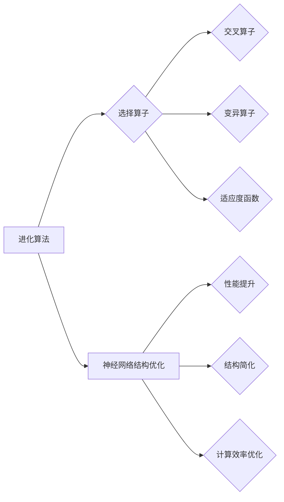

                 

### 文章标题

《进化算法在神经网络结构优化中的应用》

关键词：进化算法、神经网络结构优化、遗传算法、适应度函数、交叉算子、变异算子

---

摘要：本文将深入探讨进化算法在神经网络结构优化中的应用，通过详细阐述进化算法的基本原理、核心组件、神经网络结构优化的挑战以及进化算法在优化中的具体应用，帮助读者理解如何利用进化算法提升神经网络结构的性能。通过具体的数学模型、Python源代码和实际案例分析，本文旨在为研究者提供实用的指导，并探讨该领域未来可能的发展方向。作者：AI天才研究院/AI Genius Institute & 禅与计算机程序设计艺术 /Zen And The Art of Computer Programming

---

### 目录大纲

```
# 进化算法在神经网络结构优化中的应用

## 第一部分：进化算法基础

### 第1章：进化算法概述

#### 1.1 进化算法的定义与基本原理

#### 1.2 进化算法的发展历程

#### 1.3 进化算法的核心概念

### 第2章：进化算法的基本组件

#### 2.1 选择算子

#### 2.2 交叉算子

#### 2.3 变异算子

#### 2.4 适应度函数

## 第二部分：神经网络结构优化

### 第3章：神经网络结构优化的挑战

#### 3.1 神经网络结构优化的目标

#### 3.2 神经网络结构优化的方法

#### 3.3 神经网络结构优化的难点

### 第4章：进化算法在神经网络结构优化中的应用

#### 4.1 进化算法与神经网络结构优化的结合方式

#### 4.2 进化算法在神经网络结构优化中的优势

#### 4.3 进化算法在神经网络结构优化中的典型应用

### 第5章：进化算法在神经网络结构优化中的实现

#### 5.1 进化算法实现的基本流程

#### 5.2 进化算法在神经网络结构优化中的参数设置

#### 5.3 进化算法在神经网络结构优化中的调试与优化

## 第三部分：案例分析

### 第6章：案例研究一——图像分类任务

#### 6.1 问题背景

#### 6.2 实验设置

#### 6.3 实验结果与分析

### 第7章：案例研究二——语音识别任务

#### 7.1 问题背景

#### 7.2 实验设置

#### 7.3 实验结果与分析

## 附录

### 附录A：进化算法工具和资源推荐

### 附录B：神经网络结构优化工具和资源推荐
```

### Mermaid 流程图



### Python 源代码

```python
import numpy as np
import random

# 定义适应度函数
def fitness_function(individual):
    # 这里是一个简单的例子，实际中会有更复杂的计算
    fitness = 1 / (1 + np.exp(-np.sum(individual)))
    return fitness

# 定义交叉算子
def crossover(parent1, parent2):
    crossover_point = random.randint(1, len(parent1) - 2)
    child1 = np.concatenate((parent1[:crossover_point], parent2[crossover_point:]))
    child2 = np.concatenate((parent2[:crossover_point], parent1[crossover_point:]))
    return child1, child2

# 定义变异算子
def mutate(individual, mutation_rate):
    for i in range(len(individual)):
        if random.random() < mutation_rate:
            individual[i] = random.random()
    return individual

# 初始种群
population_size = 100
population = np.random.rand(population_size, 50)

# 主进化循环
generations = 100
for generation in range(generations):
    # 计算适应度
    fitness_values = np.array([fitness_function(individual) for individual in population])
    
    # 选择操作
    selected_indices = np.argsort(fitness_values)[-10:]
    selected = population[selected_indices]
    
    # 交叉操作
    children = [crossover(selected[i], selected[i+1]) for i in range(0, len(selected), 2)]
    
    # 变异操作
    for child in children:
        mutate(child, mutation_rate=0.1)
    
    # 更新种群
    population = np.concatenate((population, children))
    population = population[:population_size]
```

---

接下来，我们将逐步深入探讨进化算法的原理、基本组件、神经网络结构优化的挑战以及进化算法在优化中的具体应用。希望通过这篇文章，读者能够对进化算法在神经网络结构优化中的应用有一个全面而深入的理解。

