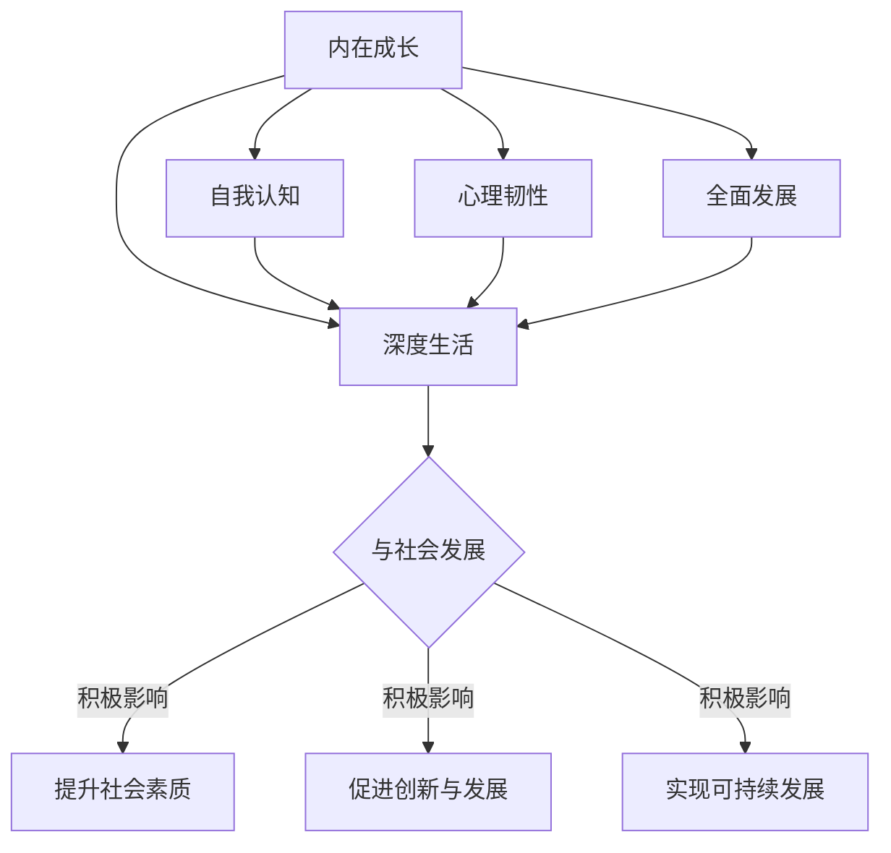

                 

## 追求内在成长：超越表面的深度生活

在快节奏的现代生活中，人们往往被外界的喧嚣和表面的繁华所吸引，追求物质上的满足和外在的成就。然而，随着时间和阅历的增加，越来越多的人开始意识到，真正的幸福和满足并非仅仅来源于外在的成就，而是内在的成长。本文将围绕“追求内在成长，超越表面的深度生活”这一主题，探讨内在成长的重要性，深度生活的理念与实践，以及如何通过自我反思、心理调适和自我提升来实现内在成长。

### 关键词

- **内在成长**  
- **深度生活**  
- **自我反思**  
- **心理调适**  
- **自我提升**  
- **持续追求**

### 摘要

本文旨在探讨内在成长与深度生活的关系，并给出实现内在成长的方法和实践。文章首先介绍了内在成长的概念及其重要性，然后阐述了深度生活的理念与实践，接着分析了内在成长与深度生活的联系，最后提出了实现内在成长的核心原则和具体方法。通过本文的阅读，读者可以更好地理解内在成长的重要性，掌握实现深度生活的实践方法，从而实现个人全面发展。

## 第一部分：内在成长与深度生活理论

### 第1章：内在成长的概念与重要性

#### 1.1 内在成长的定义与特征

内在成长是指个体通过自我认知、自我反思和心理调适等过程，不断挖掘自身潜能，提升自我素质和内在力量的一种成长过程。它不仅包括知识技能的积累，更重要的是情感、心理、人格等方面的成长。

内在成长具有以下几个特征：

1. **自主性**：内在成长是一个主动的过程，需要个体自觉自愿地投入时间和精力进行自我提升。
2. **深度性**：内在成长不仅仅是表面上的改变，而是涉及到个体深层次的认知和情感体验。
3. **长期性**：内在成长是一个持续的过程，需要个体长期坚持和努力。
4. **综合性**：内在成长涉及到个体多个方面的提升，包括知识、技能、情感、心理等。

#### 1.2 内在成长与外在成就的关系

内在成长与外在成就之间存在着密切的关系。一方面，外在成就可以提供物质基础和社会地位，但并不能带来真正的幸福和满足。另一方面，内在成长可以提升个体的自我认知和自我价值感，从而更好地应对生活中的挑战和困难，实现真正的幸福和满足。

具体来说，内在成长对外在成就的影响主要体现在以下几个方面：

1. **提高工作效率**：内在成长可以帮助个体提升自我认知和自我管理能力，从而提高工作效率和绩效。
2. **增强适应能力**：内在成长可以帮助个体更好地适应变化和挑战，从而在竞争激烈的社会中立于不败之地。
3. **提升生活质量**：内在成长可以提升个体的情感和心理素质，从而提高生活质量，享受更多的快乐和幸福。

#### 1.3 内在成长对社会和个人发展的影响

内在成长不仅对个人具有重要意义，对社会发展也具有深远的影响。

**对个人的影响**：

1. **提升自我价值感**：内在成长可以帮助个体更好地认识自己，提升自我价值感，从而增强自信心和自尊心。
2. **增强心理韧性**：内在成长可以帮助个体在面对挫折和困难时保持积极的心态，增强心理韧性。
3. **促进全面发展**：内在成长可以促进个体在知识、技能、情感、心理等方面的全面发展。

**对社会的影响**：

1. **提升社会素质**：内在成长可以提升整个社会的文化素质和道德水平，促进社会和谐与进步。
2. **促进创新与发展**：内在成长可以激发个体的创造力和创新能力，推动社会科技的进步和经济发展。
3. **实现可持续发展**：内在成长可以帮助个体树立正确的发展观，实现经济、社会、环境的可持续发展。

### 第2章：深度生活的理念与实践

#### 2.1 深度生活的定义与特点

深度生活是一种追求内在成长和心灵满足的生活方式，它强调的是对生活本身的关注和体验，而非仅仅追求物质上的享受和表面的繁华。深度生活的特点主要包括：

1. **关注内心体验**：深度生活注重个体的内心体验和情感需求，追求真实、深刻的生活感受。
2. **追求内在成长**：深度生活将内在成长视为生活的核心，通过自我反思、心理调适和自我提升等过程，不断提升自我素质和内在力量。
3. **拒绝浮躁和表面**：深度生活拒绝浮躁和表面的繁华，主张真实、深刻地体验生活，从而实现内心的平静和满足。
4. **注重精神生活**：深度生活强调精神生活的丰富和充实，通过艺术、文学、哲学等方式，提升个体的精神层次和心灵品质。

#### 2.2 深度生活的价值与意义

深度生活对个人和社会具有重要的价值与意义。

**对个人的价值**：

1. **提升生活质量**：深度生活可以帮助个体更好地体验生活，提升生活品质和幸福感。
2. **增强心理韧性**：通过深度生活，个体可以培养积极的心态，增强心理韧性，更好地应对生活中的挑战和困难。
3. **促进全面发展**：深度生活可以促进个体在知识、技能、情感、心理等方面的全面发展，实现个人价值的最大化。

**对社会的价值**：

1. **提升社会素质**：深度生活可以提升整个社会的文化素质和道德水平，促进社会和谐与进步。
2. **推动社会进步**：深度生活可以激发个体的创造力和创新能力，推动社会科技的进步和经济发展。
3. **实现可持续发展**：深度生活可以帮助个体树立正确的发展观，实现经济、社会、环境的可持续发展。

#### 2.3 深度生活的实践方法

要实现深度生活，个体可以采取以下几种实践方法：

1. **自我反思**：通过定期进行自我反思，了解自己的内心需求，调整心态和行为，实现内心的平静和满足。
2. **心理调适**：通过学习心理调适的方法，如冥想、瑜伽等，缓解压力，增强心理韧性。
3. **自我提升**：通过不断学习和自我提升，提升自身素质，实现内在成长。
4. **关注内心体验**：在生活中注重内心的体验和感受，避免被外界的喧嚣和表面的繁华所干扰。
5. **注重精神生活**：通过阅读、艺术、哲学等方式，丰富精神生活，提升心灵品质。

### 第3章：内在成长与深度生活的联系

#### 3.1 内在成长与深度生活的互动关系

内在成长与深度生活之间存在着密切的互动关系。一方面，内在成长是深度生活的基础，没有内在成长，深度生活将无从谈起。另一方面，深度生活为内在成长提供了丰富的资源和实践平台，促进了内在成长。

**内在成长促进深度生活**：

1. **提高生活质量**：内在成长可以帮助个体更好地体验生活，提升生活品质和幸福感。
2. **增强心理韧性**：内在成长可以增强个体的心理韧性，使其在面对生活中的挑战和困难时保持积极的心态。
3. **丰富精神生活**：内在成长可以丰富个体的精神生活，提升其心灵品质，实现深度生活。

**深度生活促进内在成长**：

1. **提供实践平台**：深度生活为个体提供了丰富的实践平台，使其在实践中不断成长和提升。
2. **激发内在潜能**：深度生活可以激发个体的内在潜能，促进其在知识、技能、情感、心理等方面的全面发展。
3. **增强自我认知**：通过深度生活，个体可以更好地认识自己，了解自己的内心需求和价值观，从而实现内在成长。

#### 3.2 内在成长助力深度生活的实现

内在成长是实现深度生活的重要保障。以下是一些具体的方法和途径，通过这些方法和途径，个体可以更好地实现深度生活：

1. **自我反思**：通过自我反思，个体可以了解自己的内心需求和价值观，调整心态和行为，实现内心的平静和满足。
2. **心理调适**：通过学习心理调适的方法，如冥想、瑜伽等，个体可以缓解压力，增强心理韧性，更好地应对生活中的挑战和困难。
3. **自我提升**：通过不断学习和自我提升，个体可以提升自身素质，实现内在成长，从而更好地享受深度生活。
4. **关注内心体验**：个体应注重内心的体验和感受，避免被外界的喧嚣和表面的繁华所干扰，从而实现深度生活。
5. **注重精神生活**：通过阅读、艺术、哲学等方式，个体可以丰富精神生活，提升心灵品质，实现深度生活。

### 第4章：内在成长的核心原则

#### 4.1 真实面对自己

真实面对自己是内在成长的首要原则。个体需要正视自己的优点和缺点，既不盲目自大，也不自卑自弃。通过真实面对自己，个体可以更好地了解自己的内心需求和价值观，找到适合自己的成长路径。

**如何真实面对自己**：

1. **自我反思**：通过定期进行自我反思，个体可以了解自己的行为和心态，找出自己的优点和缺点。
2. **接受自己**：个体需要学会接受自己的不完美，认识到每个人都有自己的优点和不足。
3. **积极调整**：个体应根据自我反思的结果，积极调整自己的心态和行为，不断提升自己。

#### 4.2 疏导负面情绪

负面情绪是阻碍内在成长的重要因素。个体需要学会疏导负面情绪，保持心理平衡。以下是一些疏导负面情绪的方法：

1. **情绪宣泄**：个体可以通过运动、写日记、倾诉等方式，宣泄负面情绪，缓解心理压力。
2. **心理调适**：个体可以通过学习心理调适的方法，如冥想、瑜伽等，缓解压力，增强心理韧性。
3. **正面思考**：个体应学会从正面思考问题，用积极的心态面对生活中的挑战和困难。

#### 4.3 增强自我认知

自我认知是内在成长的核心。个体需要通过不断的学习和实践，提高自我认知水平，更好地认识自己，找到自己的定位和发展方向。

**如何增强自我认知**：

1. **自我反思**：通过定期进行自我反思，个体可以更好地了解自己的内心需求和价值观。
2. **接受反馈**：个体应学会接受他人的反馈和建议，从中发现自己的不足，进行改进。
3. **不断学习**：个体应保持学习的热情，通过学习新的知识和技能，提升自我认知。

#### 4.4 培养积极心态

积极心态是内在成长的重要保障。个体需要学会培养积极心态，面对生活中的挑战和困难，保持乐观和自信。

**如何培养积极心态**：

1. **正面思考**：个体应学会从正面思考问题，用积极的心态面对生活中的挑战和困难。
2. **设定目标**：个体应设定具体、明确的目标，并为之努力奋斗。
3. **保持乐观**：个体应保持乐观的心态，相信自己能够克服困难，实现目标。

## 第二部分：内在成长的方法与实践

### 第5章：自我反思与成长

#### 5.1 自我反思的重要性

自我反思是内在成长的重要途径。通过自我反思，个体可以更好地了解自己的内心需求、优点和不足，从而有针对性地进行改进和提升。

**自我反思的重要性**：

1. **提升自我认知**：自我反思可以帮助个体更好地认识自己，了解自己的内心需求和价值观。
2. **发现问题**：自我反思可以帮助个体发现问题，找到自己需要改进的地方。
3. **促进成长**：自我反思可以促使个体不断进行自我提升，实现内在成长。

**如何进行自我反思**：

1. **定期反思**：个体应定期进行自我反思，如每周或每月一次。
2. **记录反思**：个体可以将反思过程和结果记录下来，以便后续回顾和总结。
3. **与他人交流**：个体可以与朋友、家人或专业人士交流反思结果，获取反馈和建议。

#### 5.2 自我反思的方法

自我反思的方法多种多样，以下是一些常见的方法：

1. **日记反思**：个体可以通过写日记的方式，记录自己的所思所想，反思自己的行为和心态。
2. **头脑风暴**：个体可以通过头脑风暴的方式，将自己的反思结果和问题一一列出，并进行深入思考。
3. **情境再现**：个体可以通过情景再现的方式，回顾自己曾经经历的重要事件，反思自己的行为和决策。
4. **心理测试**：个体可以通过心理测试的方式，了解自己的心理特点和优势劣势，进行有针对性的反思和提升。

#### 5.3 成长日记的记录与回顾

成长日记是记录和反思个人成长过程的重要工具。通过记录成长日记，个体可以更好地了解自己的成长历程，发现自己的进步和不足。

**如何记录成长日记**：

1. **定期记录**：个体应定期记录成长日记，如每周或每月一次。
2. **真实记录**：成长日记应真实记录自己的所思所想、所做所为，不夸大也不隐瞒。
3. **分类记录**：个体可以按照不同的主题或领域，对成长日记进行分类记录，便于回顾和总结。

**如何回顾成长日记**：

1. **定期回顾**：个体应定期回顾成长日记，如每季度或每年一次。
2. **总结经验**：通过回顾成长日记，个体可以总结自己的经验教训，找出自己的优势和不足。
3. **制定计划**：根据回顾的结果，个体可以制定下一步的成长计划，明确自己的目标和行动方向。

### 第6章：心理调适与成长

#### 6.1 压力管理

压力是影响个体心理健康的常见问题。有效的压力管理可以帮助个体缓解压力，保持心理健康。

**如何进行压力管理**：

1. **识别压力源**：个体应识别自己生活中的压力源，如工作、学习、人际关系等。
2. **调整心态**：个体应学会调整心态，用积极的态度面对压力，避免过度焦虑和消极情绪。
3. **制定计划**：个体可以制定具体的应对计划，如时间管理、目标设定等，以减轻压力。
4. **寻求支持**：个体可以寻求家人、朋友或专业人士的支持和帮助，共同应对压力。

#### 6.2 情绪调节

情绪调节是保持心理健康的重要方面。通过情绪调节，个体可以更好地应对生活中的情绪波动。

**如何进行情绪调节**：

1. **情绪表达**：个体应学会合理表达自己的情绪，避免压抑和隐藏。
2. **情绪释放**：个体可以通过运动、写日记、倾诉等方式，释放负面情绪，缓解心理压力。
3. **情绪转移**：个体可以通过转移注意力，如进行其他活动或兴趣爱好，避免过度关注负面情绪。
4. **情绪建设**：个体可以通过学习和培养积极情绪，如感恩、乐观等，提升情绪质量。

#### 6.3 增强心理韧性

心理韧性是指个体在面对挫折和困难时，能够保持积极心态，迅速恢复和适应的能力。增强心理韧性可以帮助个体更好地应对生活中的挑战和困难。

**如何增强心理韧性**：

1. **培养乐观态度**：个体应学会用积极的态度看待生活中的困难和挑战，相信自己能够克服困难。
2. **建立支持系统**：个体可以建立自己的支持系统，如家人、朋友、专业人士等，在遇到困难时寻求帮助。
3. **学习应对策略**：个体可以通过学习心理调适的方法，如冥想、瑜伽等，增强心理韧性，提高应对能力。
4. **进行心理训练**：个体可以通过进行心理训练，如情境模拟、心理疏导等，提升自己的心理韧性。

### 第7章：自我提升与成长

#### 7.1 学习与成长

学习是自我提升和成长的重要途径。通过不断学习，个体可以提升自己的知识水平和技能，实现自我成长。

**如何进行学习与成长**：

1. **设定学习目标**：个体应明确自己的学习目标，有针对性地进行学习。
2. **制定学习计划**：个体可以制定具体的学习计划，如时间安排、学习内容等，确保学习效果。
3. **多种学习方式**：个体可以通过阅读、听课、实践等多种学习方式，提升自己的学习效果。
4. **与他人交流**：个体可以与同学、老师、专业人士等交流学习经验，共同进步。

#### 7.2 兴趣与爱好

兴趣和爱好是激发个体内在成长的重要动力。通过培养兴趣和爱好，个体可以提升自己的生活质量，实现自我成长。

**如何培养兴趣与爱好**：

1. **寻找兴趣点**：个体可以通过尝试不同的活动，找到自己的兴趣所在。
2. **投入时间和精力**：个体应投入足够的时间和精力，培养自己的兴趣和爱好。
3. **持续学习**：个体应不断学习新的知识和技能，提升自己的兴趣和爱好水平。
4. **与他人分享**：个体可以通过与他人分享自己的兴趣和爱好，获得更多的乐趣和成长。

#### 7.3 个人成长目标设定

个人成长目标的设定是自我提升和成长的重要步骤。通过设定明确、具体的个人成长目标，个体可以更好地规划自己的发展路径，实现自我成长。

**如何设定个人成长目标**：

1. **明确目标方向**：个体应明确自己的目标方向，如职业发展、技能提升、兴趣爱好等。
2. **制定具体目标**：个体应制定具体、明确的目标，如时间、地点、数量等。
3. **制定行动计划**：个体应制定具体的行动计划，如学习计划、锻炼计划等，确保目标的实现。
4. **定期评估与调整**：个体应定期评估自己的成长进度，根据实际情况进行调整和改进。

### 第8章：深度生活实践案例

#### 8.1 案例一：从焦虑到内心平静

李华是一位年轻的职场人，长期处于高压的工作环境中，经常感到焦虑和不安。为了改善自己的心理状态，他决定尝试深度生活的实践。

**实践过程**：

1. **自我反思**：李华开始进行自我反思，分析自己的焦虑原因，如工作压力、人际关系等。
2. **心理调适**：李华通过学习心理调适的方法，如冥想、瑜伽等，缓解自己的焦虑情绪。
3. **学习与成长**：李华开始有意识地提升自己的知识和技能，如学习时间管理、沟通技巧等，提升自己的心理素质。
4. **关注内心体验**：李华开始关注自己的内心体验，减少对外界物质的追求，追求内心的平静和满足。

**实践效果**：

通过深度生活的实践，李华的焦虑情绪得到了有效缓解，内心逐渐平静。他的工作效率和人际关系也得到了显著提升，生活质量得到了显著改善。

#### 8.2 案例二：从迷茫到明确目标

张丽是一位大学生，毕业后面临着就业和职业发展的选择。由于对未来感到迷茫，她决定通过深度生活的实践，找到自己的职业方向。

**实践过程**：

1. **自我反思**：张丽开始进行自我反思，分析自己的兴趣、特长和职业价值观。
2. **探索兴趣领域**：张丽通过参加各种活动和实习，探索自己的兴趣领域，了解不同职业的工作内容和要求。
3. **制定职业目标**：张丽根据自己的兴趣和特长，制定明确的职业目标，如进入某个行业、担任某个职位等。
4. **学习与提升**：张丽开始有针对性地学习相关的知识和技能，提升自己的竞争力。

**实践效果**：

通过深度生活的实践，张丽找到了自己的职业方向，明确了未来的目标。她的自信心和积极性得到了显著提升，职业发展取得了良好的进展。

#### 8.3 案例三：从孤独到社交达人

王刚是一位内向的人，长期以来很少与人交流，感到孤独和无助。为了改善自己的社交能力，他决定通过深度生活的实践，提升自己的社交技能。

**实践过程**：

1. **自我反思**：王刚开始进行自我反思，分析自己孤独的原因，如自卑、不自信等。
2. **心理调适**：王刚通过学习心理调适的方法，如自我肯定、积极心态等，提升自己的自信心。
3. **参与社交活动**：王刚开始积极参与各种社交活动，如社团、志愿者活动等，锻炼自己的社交能力。
4. **学习社交技巧**：王刚通过学习社交技巧，如沟通技巧、倾听技巧等，提升自己的社交能力。

**实践效果**：

通过深度生活的实践，王刚的社交能力得到了显著提升，他不再感到孤独和无助。他的社交圈子不断扩大，人际关系得到了改善，生活质量得到了显著提升。

## 第三部分：深度生活的艺术与修养

### 第9章：深度生活的艺术欣赏

#### 9.1 艺术与内在成长的关系

艺术是深度生活的重要组成部分，它不仅能够丰富个体的精神世界，还能促进个体的内在成长。艺术与内在成长之间的关系主要体现在以下几个方面：

1. **提升情感体验**：艺术作品能够激发个体的情感体验，使其在欣赏过程中产生共鸣，从而提升个体的情感素质。
2. **培养审美能力**：通过欣赏艺术作品，个体可以培养自己的审美能力，提高对美的感知和鉴赏能力。
3. **激发创造力**：艺术创作和欣赏可以激发个体的创造力，促进其在其他领域的发展和创新。
4. **促进心理调适**：艺术作品中的情感和思想能够帮助个体进行心理调适，缓解压力和负面情绪。

#### 9.2 欣赏艺术的技巧与方法

要欣赏艺术，个体需要掌握一定的技巧和方法。以下是一些常见的技巧和方法：

1. **整体感知**：在欣赏艺术作品时，个体应先进行整体感知，把握作品的风格、主题和情感。
2. **细节观察**：在整体感知的基础上，个体可以仔细观察艺术作品中的细节，理解其表现手法和技巧。
3. **联想和思考**：个体可以通过联想和思考，将艺术作品与自己的生活经验、情感体验相联系，深入理解其内涵。
4. **多元解读**：艺术作品往往具有多义性，个体可以从不同的角度进行解读，丰富自己的欣赏体验。

#### 9.3 艺术创作与内在成长

艺术创作是深度生活的重要组成部分，它不仅能够提升个体的艺术素养，还能促进个体的内在成长。以下是一些关于艺术创作与内在成长的关系：

1. **激发创造力**：艺术创作可以激发个体的创造力，促进其在其他领域的发展和创新。
2. **提升自我表达**：通过艺术创作，个体可以更好地表达自己的情感、思想和观点，提升自我表达能力。
3. **培养耐心和毅力**：艺术创作往往需要耐心和毅力，个体在创作过程中可以培养这些品质，提升自己的内在素质。
4. **促进心理调适**：艺术创作可以帮助个体进行心理调适，缓解压力和负面情绪。

### 第10章：深度生活的修养与实践

#### 10.1 修身养性的重要性

修身养性是深度生活的重要组成部分，它不仅能够提升个体的道德素质和人格魅力，还能促进个体的内在成长。以下是一些关于修身养性的重要性：

1. **提升道德素质**：修身养性可以帮助个体提升道德素质，树立正确的人生观、价值观和道德观。
2. **增强人格魅力**：修身养性可以增强个体的人格魅力，使其在人际交往中更加自信、得体和有影响力。
3. **促进身心健康**：修身养性可以促进个体的身心健康，缓解压力和负面情绪，提升生活质量。
4. **实现全面发展**：修身养性可以帮助个体实现全面发展，提升其知识、技能、情感和心理素质。

#### 10.2 修养的具体方法

要实现修身养性，个体可以采取以下具体方法：

1. **自我反省**：个体应定期进行自我反省，分析自己的言行举止，发现和纠正自己的错误。
2. **学习道德规范**：个体应学习道德规范，了解和掌握正确的道德观念和行为准则。
3. **培养良好习惯**：个体应培养良好的生活习惯，如早起、锻炼、阅读等，提升自己的生活品质。
4. **参与社会实践**：个体应积极参与社会实践，通过实际行动践行道德规范，提升自己的道德素质。

#### 10.3 深度生活修养的实践案例

以下是一些深度生活修养的实践案例：

1. **案例一：从自私到无私**：张三原本是一个自私的人，总是以自我为中心。通过学习道德规范和参与社会实践，他逐渐学会了无私奉献，变得更加关心他人。

2. **案例二：从冲动到理性**：李四原本是一个容易冲动的人，经常因为小事发脾气。通过自我反省和学习修养方法，他逐渐学会了理性思考，变得更加冷静和成熟。

3. **案例三：从悲观到乐观**：王五原本是一个悲观的人，总是看到生活中的困难和挫折。通过参与艺术创作和修身养性，他逐渐学会了乐观面对生活，变得更加积极向上。

## 第三部分：深度生活的艺术与修养

### 第9章：深度生活的艺术欣赏

#### 9.1 艺术与内在成长的关系

艺术是一种独特的表达方式，它通过视觉、听觉、触觉等多种感官体验，激发人的情感、思维和创造力。在深度生活中，艺术扮演着重要的角色，它不仅是审美享受的来源，更是内在成长的催化剂。艺术与内在成长之间的关系可以从以下几个方面进行探讨：

1. **情感共鸣**：艺术作品往往能够唤起人们的情感共鸣，使人们在欣赏过程中产生深刻的内心体验。这种情感共鸣有助于个体理解自己的情感，提升情感表达能力，促进情感成熟。

2. **自我表达**：艺术创作提供了个体自我表达的平台，使个体能够通过艺术作品传达自己的思想和情感。这种自我表达有助于个体建立自我认同，增强自信心和自尊心。

3. **思维拓展**：艺术作品往往具有丰富的象征意义和抽象性，需要观众进行深入思考。这种思维活动能够拓展个体的思维边界，培养批判性思维和创造性思维。

4. **精神滋养**：艺术作品能够为个体提供精神滋养，缓解生活中的压力和焦虑。通过欣赏艺术，个体可以获得心灵的宁静和慰藉，提升精神层次。

#### 9.2 欣赏艺术的技巧与方法

要深入欣赏艺术，个体需要掌握一些基本的技巧和方法：

1. **整体感知**：在欣赏艺术作品时，首先要从整体上把握作品的风格、主题和情感。可以通过观察作品的形式、色彩、构图等方面，初步了解作品的审美特征。

2. **细节分析**：在整体感知的基础上，进一步分析作品的细节。例如，绘画作品的线条、色彩、光影变化，雕塑作品的造型、质地、细节处理等。

3. **历史和文化背景**：了解艺术作品的历史和文化背景，有助于深入理解作品的创作意图和艺术价值。例如，了解作品的创作时代、艺术流派、艺术家生平等。

4. **情感共鸣**：尝试从自己的情感体验出发，与艺术作品产生共鸣。可以通过思考作品如何触动自己的情感，以及这些情感对自己的意义。

5. **多元解读**：艺术作品往往具有多义性，不同的观众可能会有不同的解读。在欣赏过程中，可以尝试从多个角度进行解读，丰富自己的欣赏体验。

#### 9.3 艺术创作与内在成长

艺术创作是深度生活的重要组成部分，它不仅是表达自我、探索内心世界的方式，也是内在成长的过程。以下是一些艺术创作与内在成长的关系：

1. **自我探索**：通过艺术创作，个体可以深入探索自己的内心世界，发现潜藏的情感和思想。这种自我探索有助于个体了解自己，实现自我成长。

2. **情感宣泄**：艺术创作为个体提供了一个情感宣泄的渠道。在创作过程中，个体可以将内心的情感、压力和焦虑通过艺术形式表达出来，从而获得心理释放。

3. **创造力提升**：艺术创作能够激发个体的创造力，培养创新思维。通过不断尝试新的表达方式，个体可以提升自己的创造力和艺术表现力。

4. **自我实现**：艺术创作有助于个体实现自我价值，提升自信心和自尊心。在创作过程中，个体可以通过艺术作品展示自己的才华和独特性，获得成就感和满足感。

### 第10章：深度生活的修养与实践

#### 10.1 修身养性的重要性

修身养性是深度生活的重要组成部分，它强调个体在道德、心理和情感等方面的全面提升。以下是一些关于修身养性的重要性：

1. **道德提升**：修身养性有助于个体树立正确的道德观念，培养良好的道德品质，如诚实、善良、尊重等。

2. **心理成熟**：修身养性可以帮助个体培养积极的心理素质，如耐心、坚韧、乐观等，提升心理韧性，更好地应对生活中的挑战。

3. **情感平衡**：修身养性有助于个体调节情绪，保持内心的平衡和宁静，减少负面情绪对生活的影响。

4. **人格魅力**：修身养性可以增强个体的人格魅力，使其在人际交往中更加自信、得体和有影响力。

#### 10.2 修养的具体方法

要实现修身养性，个体可以采取以下具体方法：

1. **自我反省**：定期进行自我反省，审视自己的言行举止，发现并改正错误，提高自我认知。

2. **学习道德规范**：学习道德规范，了解和掌握正确的道德观念和行为准则，做到言行一致。

3. **培养良好习惯**：培养良好的生活习惯，如早睡早起、锻炼身体、合理饮食等，提升生活质量。

4. **心理调适**：学习心理调适的方法，如冥想、瑜伽等，缓解压力，增强心理韧性。

5. **参与社会实践**：积极参与社会实践，通过实际行动践行道德规范，提升自己的道德素质。

#### 10.3 深度生活修养的实践案例

以下是一些深度生活修养的实践案例：

1. **案例一：从自私到无私**：李先生在过去常常只考虑自己的利益，通过参加慈善活动和志愿服务，他逐渐学会了无私奉献，变得更加关心他人。

2. **案例二：从冲动到理性**：张女士曾经因为情绪化而常常做出冲动的决定，通过学习情绪管理和理性思考的方法，她逐渐学会了控制自己的情绪，变得更加冷静和成熟。

3. **案例三：从焦虑到平静**：王先生因为工作压力大而经常感到焦虑，通过练习冥想和瑜伽，他逐渐学会了放松心情，保持内心的平静和宁静。

## 内在成长与深度生活的持续追求

### 第11章：内在成长的持续动力

内在成长是一个持续的过程，它需要个体在日常生活中不断地投入时间和精力。为了保持内在成长的动力，个体可以从以下几个方面进行努力：

1. **设定明确目标**：个体应设定具体、明确的目标，这些目标可以是个人的职业发展目标，也可以是兴趣爱好的提升目标。明确的目标可以帮助个体更好地规划自己的成长路径，保持前进的动力。

2. **制定行动计划**：为了实现目标，个体需要制定具体的行动计划。这些计划可以是短期的，也可以是长期的。通过将目标分解为具体的行动步骤，个体可以更加有针对性地进行自我提升。

3. **保持好奇心**：好奇心是内在成长的重要动力。个体应保持对新鲜事物的好奇心，不断探索未知的领域，学习新的知识和技能。这种好奇心可以帮助个体保持学习的热情，持续追求成长。

4. **培养兴趣和爱好**：兴趣和爱好是内在成长的催化剂。通过培养兴趣和爱好，个体可以在享受生活的同时，不断提升自己的内在素质。例如，阅读、艺术创作、运动等都是很好的兴趣爱好。

### 第12章：深度生活的持续实践

深度生活是一种生活方式，它要求个体在日常生活中持续地关注自己的内在成长和心灵满足。以下是一些关于深度生活持续实践的建议：

1. **自我反思**：自我反思是深度生活的核心。个体应定期进行自我反思，审视自己的行为和心态，发现问题并加以改进。通过自我反思，个体可以不断优化自己的生活方式，实现内在成长。

2. **心理调适**：深度生活需要个体具备良好的心理素质。个体可以通过学习心理调适的方法，如冥想、瑜伽等，缓解压力，增强心理韧性。这些心理调适方法可以帮助个体更好地应对生活中的挑战和困难。

3. **持续学习**：深度生活强调个体在知识、技能和情感等方面的全面发展。个体应保持学习的热情，不断学习新的知识和技能，提升自己的综合素质。通过持续学习，个体可以更好地适应社会的发展和变化。

4. **关注内心体验**：在深度生活中，个体应关注自己的内心体验和感受。通过冥想、瑜伽、阅读等方式，个体可以提升自己的心灵品质，实现内心的平静和满足。

### 第13章：内在成长与深度生活的未来展望

未来，随着社会的发展和科技的进步，内在成长和深度生活将会越来越受到重视。以下是一些关于内在成长和深度生活的未来展望：

1. **人工智能的辅助**：随着人工智能技术的发展，它将为内在成长和深度生活提供更加便捷的工具和资源。例如，智能心理辅导系统可以帮助个体进行自我反思和心理调适，智能学习平台可以提供个性化的学习资源和指导。

2. **社会环境的支持**：随着社会对内在成长和深度生活的认识不断加深，社会环境也将逐渐支持和鼓励个体的内在成长。例如，学校教育将更加注重学生的心理健康和情感教育，企业将更加重视员工的内在成长和心理健康。

3. **多元文化的融合**：在全球化背景下，不同文化之间的交流与融合将为内在成长和深度生活带来新的机遇。个体可以借鉴各种文化的优点，丰富自己的内心世界，实现更全面的发展。

4. **可持续发展**：随着可持续发展的理念逐渐深入人心，内在成长和深度生活将成为实现可持续发展的关键因素。通过内在成长和深度生活，个体可以更好地认识自己，关注生态环境，实现经济、社会、环境的可持续发展。

## 附录：深度生活实践资源推荐

### 附录1：推荐书籍

1. 《沉思录》（马可·奥勒留著）：这是一部古代哲学家的心灵随笔，对于个人的内在成长和心理调适有深刻的启示。

2. 《小王子》（安托万·德·圣埃克苏佩里著）：这部经典童话通过简单的寓言，探讨了人性、情感和生命的意义。

3. 《人类简史》（尤瓦尔·赫拉利著）：本书以宏观的视角探讨了人类的历史发展，对个体在现代社会中的自我认知和成长有重要的参考价值。

4. 《自控力》（凯利·麦格尼格尔著）：这本书详细阐述了如何通过心理调适和自我管理提升自控力，对于实现深度生活具有实用指导意义。

### 附录2：推荐音乐

1. **古典音乐**：例如贝多芬的《月光奏鸣曲》、莫扎特的《第41号交响曲》等，这些音乐作品具有深刻的情感表达，能够帮助个体进行心理调适。

2. **新世纪音乐**：如恩雅的《The Celts》和Yanni的《Reflections》等，这些音乐作品具有宁静的氛围，适合在冥想和放松时聆听。

3. **轻音乐**：如《卡农》、《梦幻曲》等，这些轻音乐作品旋律优美，能够帮助个体放松心情，提升心灵品质。

### 附录3：推荐电影

1. **《阿甘正传》**：这部电影通过一个智力有限的人的生活经历，展现了人性的纯真和坚韧，对于个体的内在成长和心理调适有深刻的启示。

2. **《美丽人生》**：这部电影讲述了一个犹太人在集中营中通过谎言保护孩子的故事，展现了人性的光辉和希望，对于个体的情感教育有重要的意义。

3. **《肖申克的救赎》**：这部电影讲述了一个银行家在监狱中通过自我教育和坚持希望，最终获得自由的故事，对于个体的自我提升和内心成长具有鼓舞人心的作用。

### 附录4：深度生活实践社区

1. **知乎**：知乎上有很多关于内在成长、心理调适和深度生活的讨论，可以从中获取实用的建议和经验。

2. **豆瓣**：豆瓣上有很多关于书籍、音乐、电影等文化活动的讨论小组，可以找到志同道合的朋友，一起分享和探索深度生活的艺术与修养。

3. **微信公众号**：有很多公众号专注于内在成长、心理调适和深度生活的文章分享，如“内心成长者”、“心理读心术”等，可以关注并学习。

## 总结与展望

### 第14章：总结与展望

#### 14.1 全书总结

本文围绕“追求内在成长，超越表面的深度生活”这一主题，从内在成长的概念、重要性、与深度生活的联系，到具体的方法和实践，进行了全面的探讨。文章首先介绍了内在成长的概念和特征，分析了内在成长与外在成就的关系，以及内在成长对社会和个人发展的影响。接着，文章阐述了深度生活的理念与实践，以及如何通过自我反思、心理调适和自我提升来实现内在成长。最后，文章通过实践案例和艺术欣赏，展示了深度生活与内在成长的联系，并提供了具体的实践资源。

#### 14.2 内在成长与深度生活的展望

未来，随着社会的发展和个体对自我认知的深入，内在成长和深度生活将会越来越受到重视。以下是一些关于内在成长与深度生活的展望：

1. **科技的支持**：随着人工智能、虚拟现实等技术的发展，将为内在成长和深度生活提供更多的工具和资源。例如，智能心理辅导系统、个性化学习平台等，将帮助个体更有效地实现内在成长。

2. **社会环境的支持**：随着社会对心理健康和内在成长的关注增加，将会有更多社会资源和政策支持个体实现深度生活。例如，心理健康教育、内在成长培训等，将成为社会服务的重要组成部分。

3. **多元文化的融合**：全球化背景下，不同文化的交流和融合将为内在成长和深度生活带来新的机遇。个体可以借鉴各种文化的优点，丰富自己的内心世界，实现更全面的发展。

4. **可持续发展**：随着可持续发展的理念逐渐深入人心，内在成长和深度生活将成为实现可持续发展的关键因素。通过内在成长和深度生活，个体可以更好地认识自己，关注生态环境，实现经济、社会、环境的可持续发展。

#### 14.3 读者行动指南

为了实现内在成长和深度生活，读者可以从以下几个方面着手：

1. **自我反思**：定期进行自我反思，了解自己的内心需求和价值观，调整心态和行为。

2. **心理调适**：学习心理调适的方法，如冥想、瑜伽等，缓解压力，增强心理韧性。

3. **自我提升**：持续学习和自我提升，提升自身素质，实现内在成长。

4. **关注内心体验**：在生活中注重内心的体验和感受，追求内心的平静和满足。

5. **艺术欣赏**：欣赏艺术作品，培养审美能力，丰富精神生活。

6. **实践与分享**：将内在成长和深度生活的理念与实践融入日常生活，与他人分享自己的经验和心得。

通过以上行动，读者可以逐步实现内在成长，享受深度生活，实现个人全面发展。

## Mermaid 流程图

### 内在成长与深度生活联系流程图



```

