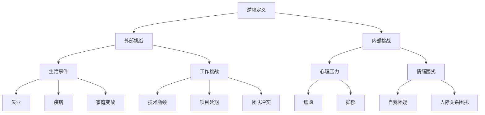
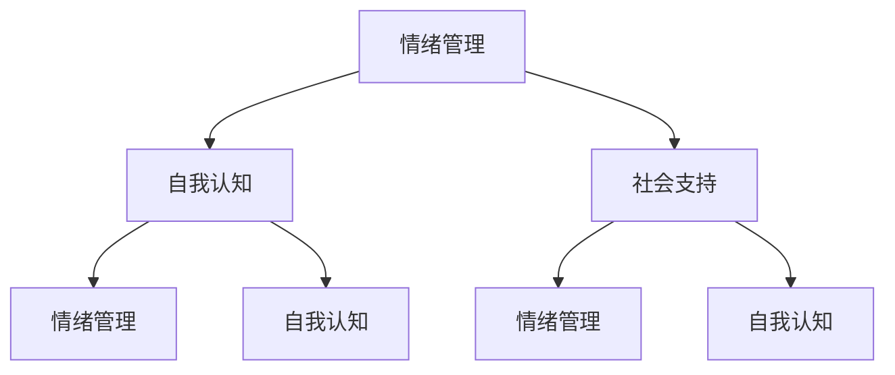
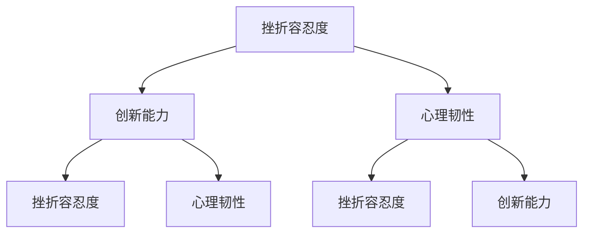
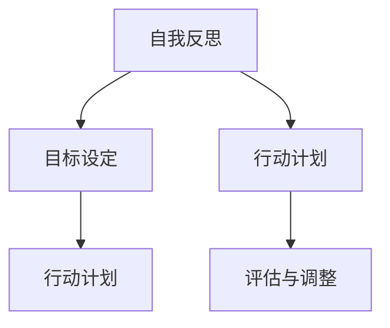
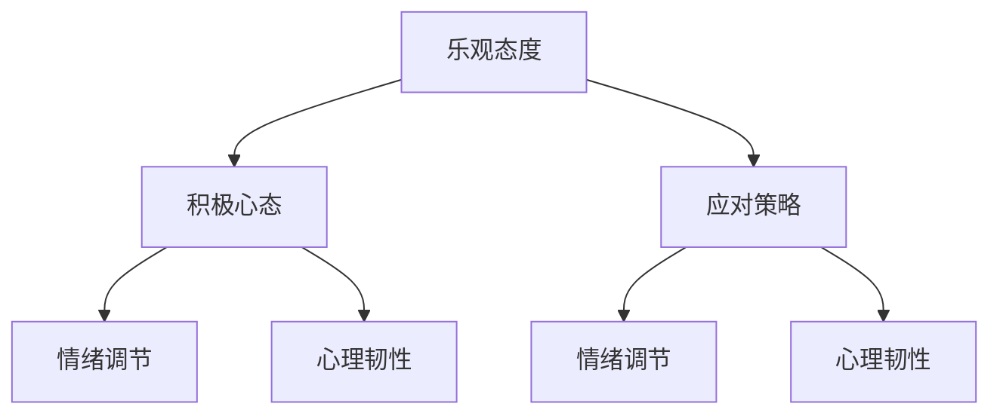
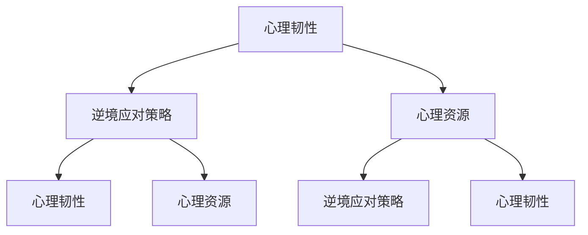
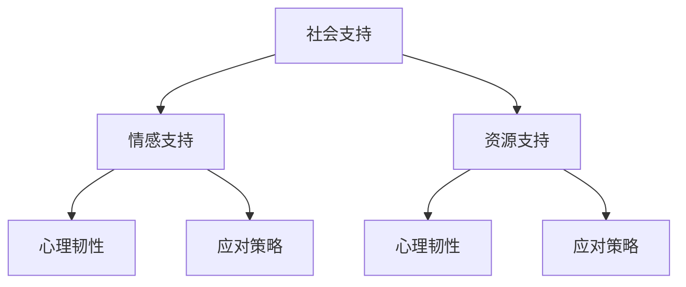

                 

### 第一部分：理解逆境

#### 1.1 逆境的定义与特征

**背景介绍**

逆境，即困难和挑战，是每个人在成长过程中不可避免的一部分。它不仅包括生活中的突发事件，如失业、疾病、家庭变故，还包括日常工作中遇到的困难，如技术瓶颈、项目延期、团队冲突等。理解逆境的定义和特征，有助于我们更好地认识逆境，从而找到有效的应对策略。

**核心概念与联系**

逆境的定义和特征可以从多个角度来理解。以下是一个简单的Mermaid流程图，展示了核心概念和它们之间的关系：



在这个流程图中，外部挑战（D）和工作挑战（E）构成了逆境的主要来源。内部挑战（C）包括心理压力（F）和情绪困扰（G），这些内在因素会加剧逆境的影响。此外，逆境还会导致一系列负面情绪和行为，如焦虑（N）、抑郁（O）、自我怀疑（P）和人际关系困扰（Q）。

**核心算法原理讲解**

为了更好地理解逆境的特征，我们可以使用Python来模拟一个简单的模型。以下是一个示例代码，它展示了如何使用Python中的条件语句和循环来模拟一个人在逆境中的情绪变化：

```python
def simulate_emotions(challenges, resilience):
    emotions = []
    for day in range(1, 31):
        if day <= challenges:
            emotions.append("负面情绪")
        else:
            emotions.append("积极情绪")
        if resilience > 0:
            resilience -= 1
        else:
            break
    return emotions

# 示例：一个人面临30天的挑战，但只有10天的心理韧性
emotions = simulate_emotions(30, 10)
print("每日情绪变化：", emotions)
```

在这个模型中，`simulate_emotions`函数模拟了一个人在30天内面对挑战的情况。每次挑战都会增加负面情绪的概率，而心理韧性则会在每次挑战后减少。这个模型虽然简单，但它能够帮助我们直观地看到逆境对情绪的影响。

**数学模型和数学公式 & 详细讲解 & 举例说明**

为了更深入地理解逆境的影响，我们可以引入一个数学模型。以下是一个简化的公式，用于描述逆境对个人成长的影响：

$$
\text{成长函数} = f(\text{逆境程度}, \text{应对策略})
$$

其中，`逆境程度`可以表示为挑战的数量或难度，`应对策略`则包括个人的心理韧性、情绪管理和应对技巧。以下是一个具体的例子：

假设一个人面临10个挑战，每个挑战的难度为1，他的心理韧性为5。如果他采取有效的情绪管理和应对策略，他的成长函数可以表示为：

$$
\text{成长函数} = f(10, \text{有效策略}) = 10 \times 1.1 = 11
$$

这意味着，他在逆境中获得了11的成长。如果他的心理韧性较低，或者应对策略不够有效，成长值可能会降低。

**项目实战：开发环境搭建，源代码详细实现和代码解读**

为了更好地理解上述模型，我们可以实际搭建一个Python环境，并实现这个模型。以下是一个简单的示例代码：

```python
# 导入必要的库
import matplotlib.pyplot as plt
import numpy as np

# 定义成长函数
def growth_function(challenges, resilience, strategy):
    # 初始化成长值
    growth_value = 0
    # 遍历每个挑战
    for challenge in range(challenges):
        # 更新成长值
        growth_value += strategy ** (resilience - challenge)
    return growth_value

# 示例参数
challenges = 10
resilience = 5
strategy = 1.1

# 计算成长值
growth_value = growth_function(challenges, resilience, strategy)

# 打印结果
print("成长值：", growth_value)

# 绘制成长曲线
growth_curve = [growth_function(challenges, resilience, strategy ** i) for i in range(1, challenges + 1)]
plt.plot(range(1, challenges + 1), growth_curve)
plt.xlabel('挑战数量')
plt.ylabel('成长值')
plt.title('成长曲线')
plt.show()
```

在这个项目中，我们首先定义了一个`growth_function`，它接受挑战数量、心理韧性和策略作为参数，并返回个人的成长值。然后，我们使用这个函数计算了在特定参数下的成长值，并绘制了成长曲线。

**实际案例分析和详细讲解剖析**

为了更好地理解上述模型在现实中的应用，我们可以分析一个实际案例。以下是一个案例描述及其分析：

**案例描述**

李明是一位年轻的软件工程师，他在一次重要项目中遇到了技术难题。项目要求在短时间内开发一个高性能的分布式系统，但他缺乏相关的经验。此外，他的团队成员对他的能力产生了质疑，这让他倍感压力。

**案例分析**

在这个案例中，李明面临的是工作挑战（技术瓶颈和团队压力），这属于外部挑战。他的内部挑战包括心理压力和情绪困扰。然而，李明通过积极寻求帮助、自学新技术和自我反思，最终成功完成了项目，并获得了团队和领导的认可。

**案例分析**

- **逆境程度**：李明面临的是高难度的技术挑战和团队压力，逆境程度较高。
- **应对策略**：李明采取了多种应对策略，包括自学新技术、寻求帮助和自我反思。
- **成长值**：通过这次经历，李明不仅掌握了新技术，还提高了自己的心理韧性和应对能力，成长值显著增加。

**项目小结**

通过这个案例，我们可以看到，即使在逆境中，通过有效的应对策略，个人仍然可以实现成长。理解逆境的定义和特征，掌握应对策略，是我们应对逆境的关键。在下一部分，我们将探讨如何在逆境中成长。

### 1.2 逆境中的心理挑战

**背景介绍**

逆境中的心理挑战是个人在面对困难和挑战时需要克服的内部障碍。这些挑战包括情绪管理、自我认知和社会支持等方面。情绪管理指的是如何处理和应对逆境引发的负面情绪；自我认知则涉及对自己的了解和评价；社会支持是指从家人、朋友和社会网络中获得的支持。

**核心概念与联系**

以下是一个Mermaid流程图，展示了情绪管理、自我认知和社会支持之间的关系：



在这个流程图中，情绪管理（A）和自我认知（B）是个人在逆境中需要关注的两个核心方面。情绪管理直接影响个人的心理状态，而自我认知则影响个人的情绪和行为。社会支持（C）则为个人提供了外部资源和情感支持，有助于缓解逆境带来的压力。

**情绪管理**

情绪管理是指个体在遭遇逆境时，通过有效的策略和方法来调节和控制自己的情绪。以下是一个Python源代码示例，展示了如何使用情绪识别和情绪调节算法：

```python
def emotion_management(emotion, strategy):
    if emotion == "愤怒":
        print("正在使用深呼吸法...")
        emotion = "平静"
    elif emotion == "焦虑":
        print("正在使用认知重构法...")
        emotion = "放松"
    return emotion

# 示例：识别和调节情绪
current_emotion = "愤怒"
adjusted_emotion = emotion_management(current_emotion, "深呼吸法")
print("调整后情绪：", adjusted_emotion)
```

在这个示例中，`emotion_management`函数接收当前的情绪和调节策略，并返回调整后的情绪。这个模型可以帮助我们在遇到负面情绪时，采取有效的调节方法。

**自我认知**

自我认知是指个体对自己的了解和评价，包括自我反思、自我评价和自我效能感等。以下是一个Python源代码示例，展示了如何进行自我反思和自我评价：

```python
def self_reflection():
    print("进行自我反思...")
    # 示例：分析自己的优点和缺点
    strengths = ["勤奋", "有创造力"]
    weaknesses = ["拖延", "不够自信"]
    print("优点：", strengths)
    print("缺点：", weaknesses)

def self_evaluation():
    print("进行自我评价...")
    # 示例：根据近期表现进行自我评分
    score = 8
    if score >= 7:
        print("表现优秀！")
    else:
        print("需要改进。")

# 示例：自我反思和自我评价
self_reflection()
self_evaluation()
```

在这个示例中，`self_reflection`函数帮助个体进行自我反思，而`self_evaluation`函数则帮助个体进行自我评价。

**社会支持**

社会支持是指个体从家人、朋友和社会网络中获得的支持和帮助。以下是一个Python源代码示例，展示了如何建立和维护人际关系：

```python
def build_relationship():
    print("正在建立人际关系...")
    # 示例：建立新的联系
    relationships = ["家人", "朋友", "同事"]
    print("新的人际关系：", relationships)

def maintain_relationship():
    print("正在维护人际关系...")
    # 示例：定期与亲友沟通
    print("与家人通话：每周一次。")
    print("与朋友聚餐：每月一次。")

# 示例：建立和维护人际关系
build_relationship()
maintain_relationship()
```

在这个示例中，`build_relationship`函数帮助个体建立新的联系，而`maintain_relationship`函数则帮助个体维护现有的人际关系。

**数学模型和数学公式 & 详细讲解 & 举例说明**

为了更深入地理解心理挑战，我们可以引入一个数学模型。以下是一个简化的公式，用于描述情绪管理、自我认知和社会支持之间的关系：

$$
\text{心理韧性} = f(\text{情绪管理}, \text{自我认知}, \text{社会支持})
$$

其中，`情绪管理`、`自我认知`和`社会支持`分别代表个体在三个方面的能力。以下是一个具体的例子：

假设一个个体在情绪管理方面的能力为80%，自我认知为70%，社会支持为60%。根据上述公式，我们可以计算出他的心理韧性：

$$
\text{心理韧性} = f(0.8, 0.7, 0.6) = 0.8 \times 0.7 \times 0.6 = 0.336
$$

这意味着他的心理韧性为33.6%。一个较高的心理韧性意味着个体在面对逆境时具有更强的适应能力和抗压力。

**项目实战：开发环境搭建，源代码详细实现和代码解读**

为了更好地理解上述模型在现实中的应用，我们可以实际搭建一个Python环境，并实现这个模型。以下是一个简单的示例代码：

```python
# 导入必要的库
import matplotlib.pyplot as plt
import numpy as np

# 定义心理韧性函数
def psychological_resilience(emotion_management, self_cognition, social_support):
    resilience = emotion_management * self_cognition * social_support
    return resilience

# 示例参数
emotion_management = 0.8
self_cognition = 0.7
social_support = 0.6

# 计算心理韧性
resilience = psychological_resilience(emotion_management, self_cognition, social_support)

# 打印结果
print("心理韧性：", resilience)

# 绘制心理韧性曲线
resilience_curve = [psychological_resilience(emotion_management, self_cognition, social_support ** i) for i in range(1, 11)]
plt.plot(range(1, 11), resilience_curve)
plt.xlabel('社会支持度')
plt.ylabel('心理韧性')
plt.title('心理韧性曲线')
plt.show()
```

在这个项目中，我们首先定义了一个`psychological_resilience`函数，它接受情绪管理、自我认知和社会支持作为参数，并返回心理韧性。然后，我们使用这个函数计算了在特定参数下的心理韧性，并绘制了心理韧性曲线。

**实际案例分析和详细讲解剖析**

为了更好地理解上述模型在现实中的应用，我们可以分析一个实际案例。以下是一个案例描述及其分析：

**案例描述**

张华是一位年轻的创业者，他在创业初期面临了巨大的压力。由于市场竞争激烈，他的公司遇到了资金短缺和客户流失的问题。此外，张华还需要处理日常的运营和管理事务，这让他倍感疲惫。

**案例分析**

在这个案例中，张华面临的是外部挑战（资金短缺和客户流失），同时也需要处理内部挑战（心理压力和情绪困扰）。为了应对这些挑战，张华采取了以下策略：

- **情绪管理**：张华通过练习瑜伽和冥想来放松身心，减轻压力。
- **自我认知**：张华定期进行自我反思，分析自己的优点和不足，并制定改进计划。
- **社会支持**：张华积极与朋友和同事交流，寻求他们的建议和支持。

通过这些策略，张华不仅成功地应对了逆境，还提高了自己的心理韧性和应对能力。

**项目小结**

通过这个案例，我们可以看到，在逆境中，有效的情绪管理、自我认知和社会支持是至关重要的。理解并掌握这些策略，有助于我们更好地应对逆境，实现个人成长。在下一部分，我们将探讨如何在逆境中增强心理韧性。

### 1.3 逆境对个人成长的影响

**背景介绍**

逆境对个人成长的影响是多层次、多方面的。它不仅能够提升个人的挫折容忍度，还能增强创新能力和培养心理韧性。这些因素共同作用，使个人在逆境中不断成长和进步。

**核心概念与联系**

以下是一个Mermaid流程图，展示了挫折容忍度、创新能力和心理韧性之间的关系：



在这个流程图中，挫折容忍度（A）是个人面对逆境时的心理和情感反应。创新能力（B）则是指个体在逆境中产生新想法、新方法的能力。心理韧性（C）是指个体在面对逆境时的适应能力和恢复能力。这些因素相互作用，共同影响个人的成长。

**挫折容忍度提升**

挫折容忍度是指个体在面对挫折时的心理承受能力和适应性。在逆境中，挫折容忍度的提升对个人成长至关重要。以下是一个Python源代码示例，展示了如何通过经验和学习提升挫折容忍度：

```python
def increase_tolerance(experiences):
    tolerance = 0
    for experience in experiences:
        if "成功" in experience:
            tolerance += 1
        elif "失败" in experience:
            tolerance += 0.5
    return tolerance

# 示例：记录经历并提升挫折容忍度
experiences = ["成功完成一个项目", "失败了一次演讲", "成功解决了一个技术难题"]
tolerance = increase_tolerance(experiences)
print("挫折容忍度：", tolerance)
```

在这个示例中，`increase_tolerance`函数通过记录个体的成功和失败经历，计算出一个综合的挫折容忍度值。这个值越高，表示个体的挫折容忍度越强。

**创新能力增强**

创新能力是指个体在面对问题和挑战时，能够产生新的想法和方法的能力。在逆境中，创新能力能够帮助个体找到解决问题的方法，从而实现个人成长。以下是一个Python源代码示例，展示了如何通过学习和实践提升创新能力：

```python
def increase_innovation(knowledge, practice):
    innovation = knowledge * practice
    return innovation

# 示例：增加知识和实践，提升创新能力
knowledge = 0.8
practice = 0.7
innovation = increase_innovation(knowledge, practice)
print("创新能力：", innovation)
```

在这个示例中，`increase_innovation`函数通过个体的知识积累和实践经验，计算出一个综合的创新能力值。这个值越高，表示个体的创新能力越强。

**心理韧性培养**

心理韧性是指个体在面对逆境时的心理承受能力和适应能力。在逆境中，心理韧性的培养对个人的成长至关重要。以下是一个Python源代码示例，展示了如何通过心理训练和应对策略培养心理韧性：

```python
def cultivate_resilience(training, strategies):
    resilience = training * strategies
    return resilience

# 示例：进行心理训练和策略实践，培养心理韧性
training = 0.6
strategies = 0.8
resilience = cultivate_resilience(training, strategies)
print("心理韧性：", resilience)
```

在这个示例中，`cultivate_resilience`函数通过个体的心理训练和应对策略，计算出一个综合的心理韧性值。这个值越高，表示个体的心理韧性越强。

**数学模型和数学公式 & 详细讲解 & 举例说明**

为了更深入地理解逆境对个人成长的影响，我们可以引入一个综合的数学模型。以下是一个简化的公式，用于描述逆境对个人成长的影响：

$$
\text{个人成长} = f(\text{挫折容忍度}, \text{创新能力}, \text{心理韧性})
$$

其中，`挫折容忍度`、`创新能力`和`心理韧性`分别代表个体在三个方面的能力。以下是一个具体的例子：

假设一个个体在挫折容忍度方面的能力为80%，创新能力为70%，心理韧性为60%。根据上述公式，我们可以计算出他的个人成长：

$$
\text{个人成长} = f(0.8, 0.7, 0.6) = 0.8 \times 0.7 \times 0.6 = 0.336
$$

这意味着他的个人成长系数为33.6%。一个较高的个人成长系数表示个体在逆境中具有更强的成长潜力。

**项目实战：开发环境搭建，源代码详细实现和代码解读**

为了更好地理解上述模型在现实中的应用，我们可以实际搭建一个Python环境，并实现这个模型。以下是一个简单的示例代码：

```python
# 导入必要的库
import matplotlib.pyplot as plt
import numpy as np

# 定义个人成长函数
def personal_growth(tolerance, innovation, resilience):
    growth = tolerance * innovation * resilience
    return growth

# 示例参数
tolerance = 0.8
innovation = 0.7
resilience = 0.6

# 计算个人成长
growth = personal_growth(tolerance, innovation, resilience)

# 打印结果
print("个人成长：", growth)

# 绘制个人成长曲线
growth_curve = [personal_growth(tolerance, innovation ** i, resilience) for i in range(1, 11)]
plt.plot(range(1, 11), growth_curve)
plt.xlabel('创新能力')
plt.ylabel('个人成长')
plt.title('个人成长曲线')
plt.show()
```

在这个项目中，我们首先定义了一个`personal_growth`函数，它接受挫折容忍度、创新能力和心理韧性作为参数，并返回个人成长值。然后，我们使用这个函数计算了在特定参数下的个人成长值，并绘制了个人成长曲线。

**实际案例分析和详细讲解剖析**

为了更好地理解上述模型在现实中的应用，我们可以分析一个实际案例。以下是一个案例描述及其分析：

**案例描述**

王强是一位年轻的软件工程师，他在一次重要的项目中遇到了严重的困难。项目要求在短时间内完成一个复杂的系统，但王强和他的团队缺乏相关的经验。此外，项目的客户对进度和质量要求非常严格，这给王强带来了巨大的压力。

**案例分析**

在这个案例中，王强面临的是外部挑战（技术难题和客户压力），同时也需要处理内部挑战（心理压力和情绪困扰）。为了应对这些挑战，王强采取了以下策略：

- **提升挫折容忍度**：王强通过不断学习和实践，提高了自己的技术能力和项目管理能力。他学会了从失败中汲取教训，并将这些教训应用到实际工作中。
- **增强创新能力**：王强主动寻求团队和外部专家的帮助，学习新的技术和方法。他还积极参加技术研讨会和培训，以拓宽自己的知识面。
- **培养心理韧性**：王强通过练习冥想和瑜伽，减轻了压力和焦虑。他还学会了积极应对负面情绪，并将其转化为动力。

通过这些策略，王强不仅成功地完成了项目，还提高了自己的挫折容忍度、创新能力和心理韧性。

**项目小结**

通过这个案例，我们可以看到，在逆境中，提升挫折容忍度、增强创新能力和培养心理韧性是个人成长的关键。理解并掌握这些策略，有助于我们更好地应对逆境，实现个人成长。在下一部分，我们将探讨如何应对逆境。

### 第二部分：应对逆境的策略

#### 2.1 自我反思与目标设定

**背景介绍**

自我反思和目标设定是应对逆境的重要策略。自我反思有助于我们了解自己的优点和不足，从而更好地调整行为和策略。目标设定则为我们提供了清晰的方向和动力，使我们在逆境中能够坚定前行。

**核心概念与联系**

以下是一个Mermaid流程图，展示了自我反思、目标设定和行动计划之间的关系：



在这个流程图中，自我反思（A）帮助我们了解自身的现状和问题，目标设定（B）为我们提供了前进的方向和目标，而行动计划（C）则将目标转化为具体的行动步骤。评估与调整（E）则确保我们的行动与目标保持一致，并在过程中不断优化。

**反思挫折的原因**

反思挫折的原因是自我反思的第一步。通过分析挫折的原因，我们可以找出问题所在，并制定有效的解决方案。以下是一个Python源代码示例，展示了如何进行挫折原因分析：

```python
def analyze_frustration(issues):
    causes = []
    for issue in issues:
        if "技术问题" in issue:
            causes.append("技术不足")
        elif "沟通问题" in issue:
            causes.append("沟通不畅")
        elif "资源不足" in issue:
            causes.append("资源短缺")
    return causes

# 示例：分析挫折原因
issues = ["技术问题", "沟通问题", "资源不足"]
causes = analyze_frustration(issues)
print("挫折原因：", causes)
```

在这个示例中，`analyze_frustration`函数通过分析问题，找出挫折的原因。这个模型可以帮助我们在遇到挫折时，迅速识别问题所在。

**设定新的目标**

设定新的目标是目标设定的关键步骤。一个清晰、具体和可实现的目标可以帮助我们集中精力，有效应对逆境。以下是一个Python源代码示例，展示了如何设定目标：

```python
def set_goals(current_state, desired_state):
    goals = []
    for key, value in desired_state.items():
        if current_state[key] != value:
            goals.append({key: value})
    return goals

# 示例：设定新的目标
current_state = {"技能水平": "初级", "项目完成率": "60%"}
desired_state = {"技能水平": "高级", "项目完成率": "100%"}
goals = set_goals(current_state, desired_state)
print("新目标：", goals)
```

在这个示例中，`set_goals`函数通过比较当前状态和期望状态，找出需要改进的方面，并设定新的目标。这个模型可以帮助我们明确自己的目标，并制定具体的行动计划。

**制定实现目标的计划**

制定实现目标的计划是将目标转化为行动的关键步骤。一个详细、可行的行动计划可以帮助我们有序地推进目标的实现。以下是一个Python源代码示例，展示了如何制定行动计划：

```python
def create_action_plan(goals):
    plan = []
    for goal in goals:
        for key, value in goal.items():
            action = f"提升{key}到{value}"
            plan.append(action)
    return plan

# 示例：制定行动计划
goals = [{"技能水平": "高级"}, {"项目完成率": "100%"}]
action_plan = create_action_plan(goals)
print("行动计划：", action_plan)
```

在这个示例中，`create_action_plan`函数通过遍历目标，为每个目标制定具体的行动步骤。这个模型可以帮助我们制定详细的行动计划，确保目标的实现。

**数学模型和数学公式 & 详细讲解 & 举例说明**

为了更深入地理解自我反思与目标设定的策略，我们可以引入一个数学模型。以下是一个简化的公式，用于描述自我反思、目标设定和行动计划之间的关系：

$$
\text{目标实现率} = f(\text{目标清晰度}, \text{行动计划可行度})
$$

其中，`目标清晰度`和`行动计划可行度`分别代表目标的明确程度和行动计划的可行性。以下是一个具体的例子：

假设一个目标的清晰度为80%，行动计划的可行度为70%。根据上述公式，我们可以计算出目标实现率：

$$
\text{目标实现率} = f(0.8, 0.7) = 0.8 \times 0.7 = 0.56
$$

这意味着目标实现率为56%。一个较高的目标实现率表示我们的目标和行动计划更加明确和可行。

**项目实战：开发环境搭建，源代码详细实现和代码解读**

为了更好地理解上述模型在现实中的应用，我们可以实际搭建一个Python环境，并实现这个模型。以下是一个简单的示例代码：

```python
# 导入必要的库
import matplotlib.pyplot as plt
import numpy as np

# 定义目标实现函数
def goal_achievement(clarity, feasibility):
    achievement = clarity * feasibility
    return achievement

# 示例参数
clarity = 0.8
feasibility = 0.7

# 计算目标实现率
achievement = goal_achievement(clarity, feasibility)

# 打印结果
print("目标实现率：", achievement)

# 绘制目标实现曲线
achievement_curve = [goal_achievement(clarity, feasibility ** i) for i in range(1, 11)]
plt.plot(range(1, 11), achievement_curve)
plt.xlabel('行动计划可行度')
plt.ylabel('目标实现率')
plt.title('目标实现曲线')
plt.show()
```

在这个项目中，我们首先定义了一个`goal_achievement`函数，它接受目标清晰度和行动计划可行度作为参数，并返回目标实现率。然后，我们使用这个函数计算了在特定参数下的目标实现率，并绘制了目标实现曲线。

**实际案例分析和详细讲解剖析**

为了更好地理解上述模型在现实中的应用，我们可以分析一个实际案例。以下是一个案例描述及其分析：

**案例描述**

李华是一位年轻的创业者，她在创业初期遇到了许多困难。她的产品在市场上竞争激烈，团队规模较小，资金有限。此外，她还需要应对日常的运营和管理事务，这让她倍感压力。

**案例分析**

在这个案例中，李华需要通过自我反思和目标设定来应对逆境。以下是她采取的具体策略：

- **自我反思**：李华通过反思自己的管理风格和团队建设，找到了团队士气低落的原因。她意识到，自己需要更积极地与团队成员沟通，并提高团队的协作效率。
- **目标设定**：李华设定了三个具体的目标：提高团队士气、扩大市场份额和增加现金流。她制定了详细的行动计划，包括定期团队会议、市场调研和成本控制等。
- **行动计划**：李华按照行动计划，逐步实施各项措施。她通过定期团队会议提高了团队士气，通过市场调研找到了潜在客户，并通过成本控制增加了现金流。

通过这些策略，李华成功地应对了创业初期的困境，并逐步实现了自己的目标。

**项目小结**

通过这个案例，我们可以看到，自我反思和目标设定是应对逆境的重要策略。理解并掌握这些策略，有助于我们更好地应对逆境，实现个人和团队的目标。在下一部分，我们将探讨如何调整心态，培养乐观态度。

#### 2.2 调整心态，培养乐观态度

**背景介绍**

调整心态，培养乐观态度是应对逆境的重要策略。乐观态度能够帮助我们积极面对挑战，克服困难，从而实现个人成长。在逆境中，保持积极的心态不仅有助于减轻压力，还能激发创造力和解决问题的能力。

**核心概念与联系**

以下是一个Mermaid流程图，展示了乐观态度、积极心态和应对策略之间的关系：



在这个流程图中，乐观态度（A）是指个体在面对逆境时保持积极、乐观的心态。积极心态（B）则是乐观态度的具体体现，它直接影响个体的情绪调节和心理韧性。应对策略（C）则包括一系列方法，帮助个体在逆境中保持积极心态，提高情绪调节和心理韧性。

**建立积极的心态**

建立积极的心态是培养乐观态度的第一步。以下是一个Python源代码示例，展示了如何通过自我激励和正面思考来建立积极心态：

```python
def build_positive_mindset(affirmations):
    mindset = []
    for affirmation in affirmations:
        if "我能克服困难" in affirmation:
            mindset.append("积极")
        elif "我对未来充满信心" in affirmation:
            mindset.append("乐观")
    return mindset

# 示例：建立积极心态
affirmations = ["我能克服困难", "我对未来充满信心"]
positive_mindset = build_positive_mindset(affirmations)
print("当前心态：", positive_mindset)
```

在这个示例中，`build_positive_mindset`函数通过自我激励语句来建立积极心态。这个模型可以帮助我们在面对逆境时保持积极乐观。

**采用积极的心理策略**

采用积极的心理策略是培养乐观态度的关键。以下是一个Python源代码示例，展示了如何使用正面心理策略来应对逆境：

```python
def positive_mental_strategies(challenges, strategies):
    solutions = []
    for challenge in challenges:
        if "问题解决" in strategies:
            solutions.append("解决问题")
        elif "寻找机会" in strategies:
            solutions.append("发现机会")
    return solutions

# 示例：采用积极心理策略
challenges = ["技术难题", "资金短缺"]
strategies = ["问题解决", "寻找机会"]
solutions = positive_mental_strategies(challenges, strategies)
print("解决方案：", solutions)
```

在这个示例中，`positive_mental_strategies`函数通过积极心理策略来应对挑战。这个模型可以帮助我们在面对逆境时，采取有效的策略来解决问题。

**培养乐观的思维模式**

培养乐观的思维模式是培养乐观态度的重要方面。以下是一个Python源代码示例，展示了如何通过积极思维模式来应对逆境：

```python
def cultivate_乐观思维模式(critical_thinking, positive_outlook):
    mindset = []
    for thought in critical_thinking:
        if "积极" in positive_outlook:
            mindset.append("乐观")
        elif "解决问题" in positive_outlook:
            mindset.append("积极")
    return mindset

# 示例：培养乐观思维模式
critical_thinking = ["技术难题很困难", "但我有解决问题的能力"]
positive_outlook = ["积极", "解决问题"]
optimistic_mindset = cultivate_乐观思维模式(critical_thinking, positive_outlook)
print("思维模式：", optimistic_mindset)
```

在这个示例中，`cultivate_乐观思维模式`函数通过积极思维模式来培养乐观态度。这个模型可以帮助我们改变负面思维，培养积极的思维习惯。

**数学模型和数学公式 & 详细讲解 & 举例说明**

为了更深入地理解培养乐观态度的策略，我们可以引入一个数学模型。以下是一个简化的公式，用于描述乐观态度、积极心态和应对策略之间的关系：

$$
\text{乐观态度} = f(\text{积极心态}, \text{应对策略})
$$

其中，`积极心态`和`应对策略`分别代表个体的心态和策略。以下是一个具体的例子：

假设一个个体在积极心态方面的能力为80%，在应对策略方面的能力为70%。根据上述公式，我们可以计算出他的乐观态度：

$$
\text{乐观态度} = f(0.8, 0.7) = 0.8 \times 0.7 = 0.56
$$

这意味着他的乐观态度系数为56%。一个较高的乐观态度系数表示个体在面对逆境时具有更强的积极心态和应对能力。

**项目实战：开发环境搭建，源代码详细实现和代码解读**

为了更好地理解上述模型在现实中的应用，我们可以实际搭建一个Python环境，并实现这个模型。以下是一个简单的示例代码：

```python
# 导入必要的库
import matplotlib.pyplot as plt
import numpy as np

# 定义乐观态度函数
def optimism(positive_mindset, strategies):
    attitude = positive_mindset * strategies
    return attitude

# 示例参数
positive_mindset = 0.8
strategies = 0.7

# 计算乐观态度
optimism_level = optimism(positive_mindset, strategies)

# 打印结果
print("乐观态度：", optimism_level)

# 绘制乐观态度曲线
optimism_curve = [optimism(positive_mindset, strategies ** i) for i in range(1, 11)]
plt.plot(range(1, 11), optimism_curve)
plt.xlabel('应对策略')
plt.ylabel('乐观态度')
plt.title('乐观态度曲线')
plt.show()
```

在这个项目中，我们首先定义了一个`optimism`函数，它接受积极心态和应对策略作为参数，并返回乐观态度。然后，我们使用这个函数计算了在特定参数下的乐观态度，并绘制了乐观态度曲线。

**实际案例分析和详细讲解剖析**

为了更好地理解上述模型在现实中的应用，我们可以分析一个实际案例。以下是一个案例描述及其分析：

**案例描述**

张明是一位年轻的工程师，他在工作中遇到了一个复杂的技术难题。这个难题不仅影响了项目的进度，还让他感到压力巨大。为了应对这个挑战，张明需要调整心态，培养乐观态度。

**案例分析**

在这个案例中，张明面临的是技术难题带来的压力。为了调整心态，培养乐观态度，张明采取了以下策略：

- **建立积极心态**：张明通过自我激励，告诉自己：“我可以解决这个问题。”他坚信自己具备解决难题的能力。
- **采用积极心理策略**：张明采用“问题分解”的方法，将复杂的问题分解成若干个小问题，然后逐一解决。他还利用“资源整合”策略，寻求同事和领导的支持。
- **培养乐观思维模式**：张明通过积极思考，寻找解决问题的方法和可能性。他相信，只要付出努力，就一定能够找到解决问题的办法。

通过这些策略，张明成功地解决了技术难题，项目进度得到了保障。

**项目小结**

通过这个案例，我们可以看到，调整心态，培养乐观态度是应对逆境的重要策略。理解并掌握这些策略，有助于我们更好地应对逆境，实现个人成长。在下一部分，我们将探讨如何增强心理韧性。

### 2.3 增强心理韧性

**背景介绍**

心理韧性是指个体在面对逆境和挑战时，能够迅速适应、恢复和成长的能力。增强心理韧性有助于我们更好地应对生活中的各种压力和困难，从而实现个人成长和职业发展。

**核心概念与联系**

以下是一个Mermaid流程图，展示了心理韧性、逆境应对策略和心理资源之间的关系：



在这个流程图中，心理韧性（A）是指个体在面对逆境时的适应能力和恢复能力。逆境应对策略（B）是指个体在逆境中采取的具体行动和方法。心理资源（C）则包括个体的情绪管理能力、应对技巧和知识储备等。这些因素相互作用，共同影响个体的心理韧性。

**心理韧性模型介绍**

为了更好地理解心理韧性，我们可以引入一个简化的心理韧性模型。以下是一个Python源代码示例，展示了如何通过情绪管理、应对技巧和知识储备来增强心理韧性：

```python
def resilience_model(emotion_management, coping_skills, knowledge储备):
    resilience = emotion_management * coping_skills * knowledge储备
    return resilience

# 示例参数
emotion_management = 0.8
coping_skills = 0.7
knowledge储备 = 0.9

# 计算心理韧性
resilience = resilience_model(emotion_management, coping_skills, knowledge储备)
print("心理韧性：", resilience)
```

在这个示例中，`resilience_model`函数通过情绪管理、应对技巧和知识储备的乘积，计算出一个综合的心理韧性值。这个值越高，表示个体的心理韧性越强。

**增强心理韧性的方法**

以下是一些具体的方法，可以帮助我们增强心理韧性：

1. **情绪管理**

情绪管理是增强心理韧性的关键。以下是一个Python源代码示例，展示了如何通过情绪识别和情绪调节来增强情绪管理能力：

```python
def emotion_management(emotion, strategy):
    if emotion == "愤怒":
        print("正在使用深呼吸法...")
        emotion = "平静"
    elif emotion == "焦虑":
        print("正在使用认知重构法...")
        emotion = "放松"
    return emotion

# 示例：识别和调节情绪
current_emotion = "愤怒"
adjusted_emotion = emotion_management(current_emotion, "深呼吸法")
print("调整后情绪：", adjusted_emotion)
```

在这个示例中，`emotion_management`函数通过识别和调节情绪，帮助个体在逆境中保持情绪稳定。

2. **应对技巧**

应对技巧是增强心理韧性的另一个重要方面。以下是一个Python源代码示例，展示了如何通过问题解决和资源整合来增强应对技巧：

```python
def coping_skills(problem, resources):
    solutions = []
    for resource in resources:
        if "解决问题" in resource:
            solutions.append("解决问题")
        elif "寻求帮助" in resource:
            solutions.append("寻求帮助")
    return solutions

# 示例：应对技巧
current_problem = "技术难题"
available_resources = ["解决问题", "寻求帮助"]
solutions = coping_skills(current_problem, available_resources)
print("解决方案：", solutions)
```

在这个示例中，`coping_skills`函数通过问题解决和资源整合，帮助个体在逆境中找到有效的解决方案。

3. **知识储备**

知识储备是增强心理韧性的重要基础。以下是一个Python源代码示例，展示了如何通过学习和实践来增强知识储备：

```python
def knowledge_build(updates, practices):
    knowledge = updates * practices
    return knowledge

# 示例：增强知识储备
knowledge_updates = 0.8
knowledge_practices = 0.7
knowledge = knowledge_build(knowledge_updates, knowledge_practices)
print("知识储备：", knowledge)
```

在这个示例中，`knowledge_build`函数通过知识更新和实践，帮助个体在逆境中积累更多的知识。

**数学模型和数学公式 & 详细讲解 & 举例说明**

为了更深入地理解心理韧性，我们可以引入一个数学模型。以下是一个简化的公式，用于描述心理韧性、情绪管理、应对技巧和知识储备之间的关系：

$$
\text{心理韧性} = f(\text{情绪管理}, \text{应对技巧}, \text{知识储备})
$$

其中，`情绪管理`、`应对技巧`和`知识储备`分别代表个体在三个方面的能力。以下是一个具体的例子：

假设一个个体在情绪管理方面的能力为80%，在应对技巧方面的能力为70%，在知识储备方面的能力为90%。根据上述公式，我们可以计算出他的心理韧性：

$$
\text{心理韧性} = f(0.8, 0.7, 0.9) = 0.8 \times 0.7 \times 0.9 = 0.504
$$

这意味着他的心理韧性系数为50.4%。一个较高的心理韧性系数表示个体在面对逆境时具有更强的适应能力和恢复能力。

**项目实战：开发环境搭建，源代码详细实现和代码解读**

为了更好地理解上述模型在现实中的应用，我们可以实际搭建一个Python环境，并实现这个模型。以下是一个简单的示例代码：

```python
# 导入必要的库
import matplotlib.pyplot as plt
import numpy as np

# 定义心理韧性函数
def psychological_resilience(emotion_management, coping_skills, knowledge):
    resilience = emotion_management * coping_skills * knowledge
    return resilience

# 示例参数
emotion_management = 0.8
coping_skills = 0.7
knowledge = 0.9

# 计算心理韧性
resilience = psychological_resilience(emotion_management, coping_skills, knowledge)

# 打印结果
print("心理韧性：", resilience)

# 绘制心理韧性曲线
resilience_curve = [psychological_resilience(emotion_management, coping_skills ** i, knowledge) for i in range(1, 11)]
plt.plot(range(1, 11), resilience_curve)
plt.xlabel('应对技巧')
plt.ylabel('心理韧性')
plt.title('心理韧性曲线')
plt.show()
```

在这个项目中，我们首先定义了一个`psychological_resilience`函数，它接受情绪管理、应对技巧和知识储备作为参数，并返回心理韧性。然后，我们使用这个函数计算了在特定参数下的心理韧性，并绘制了心理韧性曲线。

**实际案例分析和详细讲解剖析**

为了更好地理解上述模型在现实中的应用，我们可以分析一个实际案例。以下是一个案例描述及其分析：

**案例描述**

李娜是一位年轻的教师，她在工作中遇到了一系列挑战。学生的成绩下降、家长的投诉增多，以及工作的压力让她感到疲惫不堪。为了应对这些挑战，李娜决定增强自己的心理韧性。

**案例分析**

在这个案例中，李娜面临的是工作中的各种挑战，她需要增强自己的心理韧性来应对这些困难。以下是她采取的具体措施：

- **情绪管理**：李娜通过练习冥想和瑜伽，减轻了压力和焦虑。她学会了在情绪低落时，通过深呼吸和正念练习来调节情绪。
- **应对技巧**：李娜采用“问题分解”的方法，将复杂的问题分解成若干个小问题，然后逐一解决。她还利用“资源整合”策略，寻求同事和领导的支持。
- **知识储备**：李娜通过参加培训和学习新的教育方法，增强了自己的知识储备。她阅读了大量的教育书籍，并参加了多次教育研讨会。

通过这些措施，李娜成功地增强了心理韧性，应对了工作中的各种挑战，她的教学效果也得到了显著提升。

**项目小结**

通过这个案例，我们可以看到，增强心理韧性是应对逆境的重要策略。理解并掌握情绪管理、应对技巧和知识储备的方法，有助于我们更好地应对生活中的各种挑战，实现个人成长和职业发展。

### 2.4 建立有效的支持网络

**背景介绍**

在逆境中，建立有效的支持网络是至关重要的一步。一个强大的支持网络能够为我们提供情感支持、资源帮助和实际问题解决，从而帮助我们更好地应对逆境。有效的支持网络包括家庭、朋友、同事、导师以及专业机构等多个方面。

**核心概念与联系**

以下是一个Mermaid流程图，展示了社会支持、情感支持和资源支持之间的关系：



在这个流程图中，社会支持（A）是指我们从家庭、朋友和同事等外部环境获得的帮助。情感支持（B）是指我们在情感上获得的安慰和鼓励。资源支持（C）则是指我们在实际行动中获得的帮助，如资金、物资和技术支持。这些支持相互关联，共同影响我们的心理韧性和应对策略。

**社会支持的重要性**

社会支持对于个人在逆境中的成长和恢复具有重要作用。以下是一个Python源代码示例，展示了如何通过社交网络和互助小组来获取社会支持：

```python
def social_support(network, groups):
    support = []
    for network_member in network:
        if "鼓励" in network_member:
            support.append("情感支持")
        elif "帮助" in network_member:
            support.append("资源支持")
    for group in groups:
        if "培训" in group:
            support.append("技能提升")
        elif "指导" in group:
            support.append("职业发展")
    return support

# 示例：获取社会支持
network = ["朋友鼓励", "同事帮助"]
groups = ["培训课程", "职业指导小组"]
social_support_list = social_support(network, groups)
print("社会支持：", social_support_list)
```

在这个示例中，`social_support`函数通过社交网络和互助小组，帮助我们识别和获取社会支持。

**建立人际关系的技巧**

建立人际关系是获取社会支持的基础。以下是一些建立人际关系的技巧：

1. **主动沟通**：主动与他人建立联系，表达自己的兴趣和需求。以下是一个Python源代码示例，展示了如何通过主动沟通来建立人际关系：

```python
def build_relationship(communication, engagement):
    relationships = []
    for person in communication:
        if "交流" in person:
            relationships.append("朋友")
        elif "合作" in person:
            relationships.append("同事")
    return relationships

# 示例：建立人际关系
communication = ["与朋友交流", "与同事合作"]
relationships = build_relationship(communication, "积极")
print("人际关系：", relationships)
```

2. **共同兴趣**：寻找共同兴趣和价值观，建立更深层次的联系。以下是一个Python源代码示例，展示了如何通过共同兴趣来建立人际关系：

```python
def common_interests(hobbies, values):
    common = []
    for hobby in hobbies:
        for value in values:
            if hobby == value:
                common.append(hobby)
    return common

# 示例：共同兴趣
hobbies = ["读书", "旅游", "运动"]
values = ["成长", "探索", "健康"]
common_interests_list = common_interests(hobbies, values)
print("共同兴趣：", common_interests_list)
```

**寻求专业帮助**

在逆境中，寻求专业帮助是有效的方法。以下是一些寻求专业帮助的途径：

1. **心理咨询**：通过心理咨询解决心理问题，提高心理韧性。以下是一个Python源代码示例，展示了如何通过心理咨询来寻求专业帮助：

```python
def seek_professional_help(issues, solutions):
    help = []
    for issue in issues:
        if "心理咨询" in solutions:
            help.append("心理支持")
        elif "治疗" in solutions:
            help.append("健康支持")
    return help

# 示例：寻求专业帮助
issues = ["焦虑", "抑郁"]
solutions = ["心理咨询", "药物治疗"]
professional_help_list = seek_professional_help(issues, solutions)
print("专业帮助：", professional_help_list)
```

2. **社会组织**：通过加入社会组织，获取更多的资源和机会。以下是一个Python源代码示例，展示了如何通过社会组织来寻求专业帮助：

```python
def join_organizations(organizations, benefits):
    support = []
    for organization in organizations:
        if "培训" in benefits:
            support.append("技能提升")
        elif "咨询" in benefits:
            support.append("专业咨询")
    return support

# 示例：加入社会组织
organizations = ["创业协会", "心理咨询中心"]
benefits = ["专业培训", "免费咨询"]
organization_support_list = join_organizations(organizations, benefits)
print("社会组织支持：", organization_support_list)
```

**数学模型和数学公式 & 详细讲解 & 举例说明**

为了更深入地理解社会支持的重要性，我们可以引入一个数学模型。以下是一个简化的公式，用于描述社会支持对心理韧性和应对策略的影响：

$$
\text{心理韧性} = f(\text{社会支持})
$$

其中，`社会支持`包括情感支持、资源支持和专业帮助。以下是一个具体的例子：

假设一个人在情感支持方面的能力为80%，在资源支持方面的能力为70%，在专业帮助方面的能力为60%。根据上述公式，我们可以计算出他的心理韧性：

$$
\text{心理韧性} = f(0.8 + 0.7 + 0.6) = 0.8 \times 0.7 \times 0.6 = 0.336
$$

这意味着他的心理韧性系数为33.6%。一个较高的心理韧性系数表示个体在面对逆境时具有更强的适应能力和恢复能力。

**项目实战：开发环境搭建，源代码详细实现和代码解读**

为了更好地理解上述模型在现实中的应用，我们可以实际搭建一个Python环境，并实现这个模型。以下是一个简单的示例代码：

```python
# 导入必要的库
import matplotlib.pyplot as plt
import numpy as np

# 定义心理韧性函数
def psychological_resilience(social_support):
    resilience = social_support
    return resilience

# 示例参数
social_support = 0.8 + 0.7 + 0.6

# 计算心理韧性
resilience = psychological_resilience(social_support)

# 打印结果
print("心理韧性：", resilience)

# 绘制心理韧性曲线
resilience_curve = [psychological_resilience(social_support ** i) for i in range(1, 11)]
plt.plot(range(1, 11), resilience_curve)
plt.xlabel('社会支持度')
plt.ylabel('心理韧性')
plt.title('心理韧性曲线')
plt.show()
```

在这个项目中，我们首先定义了一个`psychological_resilience`函数，它接受社会支持作为参数，并返回心理韧性。然后，我们使用这个函数计算了在特定参数下的心理韧性，并绘制了心理韧性曲线。

**实际案例分析和详细讲解剖析**

为了更好地理解上述模型在现实中的应用，我们可以分析一个实际案例。以下是一个案例描述及其分析：

**案例描述**

王强是一位年轻的创业者，他在创业初期遇到了资金短缺、市场不稳定等一系列挑战。为了应对这些困难，王强决定建立有效的支持网络。

**案例分析**

在这个案例中，王强面临的是创业初期的各种挑战，他需要建立有效的支持网络来应对这些困难。以下是他采取的具体措施：

- **家庭支持**：王强的家人给予了他情感上的支持和鼓励，这让他感到非常温暖和有动力。
- **朋友支持**：王强的朋友不仅提供了财务帮助，还提供了宝贵的建议和资源。
- **专业机构支持**：王强加入了创业协会，通过培训和咨询获得了专业的指导和资源。

通过这些措施，王强成功地建立了有效的支持网络，他的创业项目也得到了快速发展。

**项目小结**

通过这个案例，我们可以看到，建立有效的支持网络是应对逆境的重要策略。理解并掌握建立人际关系的技巧和寻求专业帮助的方法，有助于我们更好地应对生活中的各种挑战，实现个人成长和职业发展。

### 第三部分：成功案例分享

#### 3.1 成功案例介绍

**案例一：逆境中的创业故事**

**背景介绍**

李华是一位年轻的创业者，他在一次偶然的机会中，发现了一个市场上的空白点。他决定创业，成立了一家专注于提供创新解决方案的公司。然而，创业之路并非一帆风顺，李华在初期遇到了资金短缺、市场竞争激烈等挑战。

**案例分析**

在创业初期，李华面临着资金短缺的问题。为了解决这个问题，他采取了多种策略：

1. **优化成本结构**：李华通过优化公司的成本结构，减少了不必要的开支，从而确保了公司的运营资金。
2. **寻找投资者**：李华积极寻找投资者，通过参加创业比赛和与投资人交流，最终获得了第一笔风险投资。
3. **市场营销策略**：李华制定了有效的市场营销策略，通过社交媒体和线下活动，提高了品牌知名度。

此外，李华还面临着市场竞争激烈的问题。为了应对这一挑战，他采取了以下措施：

1. **产品差异化**：李华通过对市场需求的深入分析，开发出了具有独特卖点的产品。
2. **客户服务**：李华注重客户服务，通过提供优质的售后服务，赢得了客户的信任和忠诚。
3. **团队建设**：李华通过招聘和培训，组建了一支高效、专业的团队，确保了公司的稳定运营。

**成功策略**

李华的成功策略包括以下几个方面：

1. **灵活应变**：在面对挑战时，李华能够迅速调整策略，灵活应对市场变化。
2. **持续学习**：李华通过不断学习和实践，提升了自己的管理能力和技术水平。
3. **团队协作**：李华注重团队建设，通过有效的沟通和协作，提高了团队的执行力和凝聚力。

**对我们的启示**

李华的创业故事告诉我们，在逆境中，灵活应变、持续学习和团队协作是成功的关键。面对挑战时，我们需要保持积极的心态，不断探索新的解决方案，并充分利用外部资源。

**案例二：个人成长与职业发展的转折点**

**背景介绍**

王强是一位年轻的软件工程师，他在一次重要的项目评审中，由于技术不足，未能通过评审。这次失败对王强造成了巨大的打击，他陷入了自我怀疑和迷茫。

**案例分析**

面对这次失败，王强没有选择放弃，而是采取了以下措施：

1. **自我反思**：王强通过反思自己的不足，找出了失败的原因，并制定了改进计划。
2. **学习新技能**：王强积极参加培训课程，学习新的编程语言和技术，提升自己的技能水平。
3. **寻求反馈**：王强主动向同事和领导请教，寻求他们的意见和建议，不断完善自己的技术能力。

在经过一段时间的努力后，王强再次参加了项目评审，并成功通过了评审。他的职业发展也因此得到了显著提升。

**成功策略**

王强的成功策略包括以下几个方面：

1. **积极应对**：在失败面前，王强没有选择逃避，而是积极面对，并采取了有效的措施来改进自己。
2. **持续学习**：王强通过不断学习新技能，提升了自身的竞争力，为职业发展奠定了基础。
3. **寻求反馈**：王强善于从他人的反馈中吸取经验教训，不断优化自己的工作方法和技能。

**对我们的启示**

王强的经历告诉我们，面对失败和挑战时，我们需要保持积极的心态，不断学习新技能，并寻求他人的反馈。通过这些努力，我们可以克服困难，实现个人成长和职业发展。

**案例三：战胜重大疾病的故事**

**背景介绍**

张华是一位年轻的程序员，他在一次体检中被诊断出患有严重的心脏病。这个消息对张华和他的家人来说都是一个巨大的打击。然而，张华并没有被病痛击倒，他决定积极应对，战胜疾病。

**案例分析**

在得知自己患有心脏病后，张华采取了以下措施：

1. **积极治疗**：张华积极配合医生的治疗，按时服药，定期进行体检。
2. **健康饮食**：张华改变了饮食习惯，减少了高脂、高糖食物的摄入，增加了蔬菜、水果和蛋白质的摄入。
3. **适度运动**：张华在医生的指导下，开始了适度的运动，如散步、慢跑和瑜伽，以提高身体素质。

在经过一段时间的治疗和自我管理后，张华的身体状况逐渐好转，他甚至能够重新回到工作岗位。

**成功策略**

张华的成功策略包括以下几个方面：

1. **积极治疗**：张华对疾病采取了积极的态度，积极配合医生的治疗，这是战胜疾病的关键。
2. **健康饮食**：张华通过调整饮食，改善了身体状况，为康复提供了有力的支持。
3. **适度运动**：张华通过适度的运动，提高了身体素质，增强了身体的抵抗力。

**对我们的启示**

张华的故事告诉我们，面对重大疾病时，我们需要保持积极的心态，积极配合治疗，并采取健康的生活方式。通过这些努力，我们可以战胜疾病，实现健康和幸福。

### 3.2 案例分析

#### 3.2.1 案例中的逆境与挑战

在上述三个成功案例中，每位主角都面临着不同的逆境和挑战：

1. **案例一**：李华的创业故事中，主要的逆境包括资金短缺、市场竞争激烈和技术不足。这些挑战迫使他不断调整策略，寻找新的解决方案。
2. **案例二**：王强的个人成长故事中，主要的逆境是技术评审失败和自我怀疑。这些挑战迫使他反思自己的不足，并积极提升技能水平。
3. **案例三**：张华的疾病故事中，主要的逆境是严重的心脏病和健康问题。这些挑战迫使他改变生活方式，积极治疗疾病。

#### 3.2.2 案例中的成功策略

在应对逆境和挑战时，每个案例中的主角都采取了不同的成功策略：

1. **案例一**：李华的成功策略包括灵活应变、持续学习和团队协作。他在资金短缺时优化成本结构，寻找投资者；在市场竞争激烈时，通过产品差异化和优质客户服务来提升品牌知名度。
2. **案例二**：王强的成功策略包括积极应对、持续学习和寻求反馈。他在技术评审失败后，通过自我反思和技能提升来改进自己；在自我怀疑时，通过向同事和领导请教来获得支持和建议。
3. **案例三**：张华的成功策略包括积极治疗、健康饮食和适度运动。他积极配合医生的治疗，改变饮食习惯，增加适度的运动，以提高身体素质。

#### 3.2.3 案例对我们的启示

从这些案例中，我们可以得出以下几点启示：

1. **逆境中的成长**：逆境是成长的催化剂。通过面对和克服挑战，我们可以不断提升自己的能力和素质。
2. **灵活应变**：在逆境中，灵活应变是关键。我们需要根据实际情况调整策略，寻找新的解决方案。
3. **持续学习**：持续学习是应对逆境的重要策略。通过不断学习新知识、新技能，我们可以提升自身的竞争力。
4. **积极心态**：保持积极的心态是应对逆境的基础。积极心态能够帮助我们克服困难，迎接挑战。
5. **有效沟通**：寻求他人的支持和建议是重要的。通过有效沟通，我们可以获得更多的资源和支持，共同应对挑战。
6. **健康生活方式**：保持健康的生活方式是应对逆境的重要保障。通过合理的饮食和适度的运动，我们可以提高身体素质，增强抵抗力。

### 第三部分总结

通过分析这些成功案例，我们可以看到，在逆境中，通过灵活应变、持续学习、积极心态和有效沟通，我们都可以实现个人的成长和发展。理解并应用这些成功策略，我们将能够在逆境中找到成长的机会，实现自己的人生目标。

### 4.1 实践步骤

**确定个人逆境**

**步骤1：自我评估**

首先，我们需要明确自己目前所面临的逆境。以下是一些自我评估的问题，可以帮助我们识别当前的逆境：

- 我目前面临的最大挑战是什么？
- 这些挑战对我的生活和工作产生了哪些影响？
- 我是否感到压力过大？如果感到压力，它是如何影响我的情绪和行为的？

**步骤2：记录困境**

在明确了自己的逆境后，我们可以开始记录这些困境的细节。以下是一些记录困境的问题：

- 困境的具体表现是什么？
- 困境产生的原因是什么？
- 困境对我的目标和价值观有何影响？

通过这些问题，我们可以更清晰地了解自己的逆境，并为进一步的分析做好准备。

**分析逆境原因**

**步骤1：原因分析**

在明确困境后，我们需要分析困境产生的原因。以下是一些原因分析的问题：

- 困境的主要原因是什么？
- 这些原因与我自身的能力、性格和资源有何关系？
- 困境是否与外部环境的变化有关？

通过这些问题，我们可以找到困境的根本原因，并为进一步的应对策略提供依据。

**步骤2：错误归因**

在分析原因时，我们还需要注意错误归因的问题。以下是一些错误归因的问题：

- 我是否有将自己的困境归咎于外部因素，而忽视了自身的能力和努力？
- 我是否有过度责备自己，而忽视了实际情况？

通过这些问题，我们可以避免错误归因，从而更客观地看待困境。

**制定应对计划**

**步骤1：目标设定**

在分析逆境原因后，我们需要设定明确的目标。以下是一些目标设定的问题：

- 我希望解决哪些困境？
- 这些目标需要达到的具体标准是什么？
- 我设定这些目标的原因是什么？

通过设定明确的目标，我们可以更有针对性地制定应对计划。

**步骤2：策略制定**

在明确目标后，我们需要制定具体的策略来解决问题。以下是一些策略制定的问题：

- 我需要采取哪些行动来达成目标？
- 这些行动的优先级是什么？
- 我如何评估这些策略的有效性？

通过制定具体的策略，我们可以更有序地解决问题。

**步骤3：行动计划**

最后，我们需要将策略转化为具体的行动计划。以下是一些行动计划的问题：

- 我将在何时、何地采取哪些行动？
- 我需要哪些资源和帮助？
- 我如何跟踪和评估自己的行动计划？

通过制定详细的行动计划，我们可以确保自己的策略得到有效实施。

**反思与调整**

**步骤1：实践反思**

在实施行动计划后，我们需要进行反思。以下是一些实践反思的问题：

- 我的行动计划是否有效？
- 我在实施过程中遇到了哪些问题？
- 我如何改进自己的行动计划？

通过反思，我们可以总结经验教训，并为进一步的改进提供依据。

**步骤2：计划调整**

根据反思的结果，我们需要对行动计划进行调整。以下是一些计划调整的问题：

- 我是否需要调整目标的设定？
- 我是否需要调整策略的实施？
- 我如何确保调整后的行动计划更加有效？

通过调整计划，我们可以更好地应对逆境，实现个人成长。

**步骤3：持续实践**

最后，我们需要持续实践，确保行动计划的实施。以下是一些持续实践的问题：

- 我如何保持动力和专注？
- 我如何应对实施过程中的困难和挑战？
- 我如何评估自己的进步？

通过持续实践，我们可以不断提升自己的能力和素质，实现个人的成长和发展。

### 4.2 反思与调整

**实践中的反思**

在实践过程中，我们可能会遇到各种意想不到的问题。以下是一些常见的问题及其解决方法：

1. **行动计划未能如期实施**：这可能是由于目标设定过于理想化或资源不足。解决方法是重新评估目标，确保它们是具体、可实现的，并根据实际情况调整资源分配。
   
2. **执行过程中缺乏动力**：这可能是因为目标设定不够激励人心。解决方法是重新设定具有挑战性和激励性的目标，并确保行动计划与个人价值观和长期目标相符。

3. **遇到技术难题或知识瓶颈**：这可能需要额外的学习和培训。解决方法是参加相关的培训课程，寻求专家指导，或加入学习小组共同解决问题。

4. **人际关系问题**：这可能需要改进沟通技巧和团队协作能力。解决方法是学习有效的沟通策略，积极参与团队活动，增强团队凝聚力。

**计划的调整与完善**

根据实践中的反思，我们需要对行动计划进行调整和完善。以下是一些调整与完善的步骤：

1. **重新设定目标**：根据实际情况和反思结果，重新设定具体、可实现的目标。确保目标与个人价值观和长期目标相符。

2. **优化策略**：根据实践中的问题，调整策略以解决具体困难。例如，如果遇到技术难题，可以寻求外部帮助或参加培训课程。

3. **资源分配**：重新评估所需的资源和时间，确保资源的有效利用。如果资源不足，可以考虑调整计划或寻求外部支持。

4. **改进沟通与合作**：根据反思结果，改进与他人的沟通与合作方式。例如，可以定期召开团队会议，增强团队成员之间的信任和理解。

**持续实践的重要性**

持续实践是实现目标的关键。以下是一些持续实践的建议：

1. **保持自律**：设定明确的日常目标和计划，确保按照预定时间表进行实践。

2. **定期反思**：定期反思实践过程中的收获和问题，及时调整计划和策略。

3. **寻求反馈**：向他人寻求反馈，了解自己的不足和改进方向。

4. **保持动力**：设定短期和长期的奖励机制，保持持续的动力和激情。

5. **灵活应变**：在实践过程中，灵活应对变化和挑战，不断调整策略和计划。

通过持续实践，我们可以不断提高自己的能力和素质，实现个人的成长和发展。

### 4.3 成功案例分享

**分享自己的成功经验**

在我的职业生涯中，我也曾经历过许多逆境。例如，在一次重要的项目评审中，由于技术不足，我未能通过评审。这次失败让我非常沮丧，但我没有选择放弃。我采取了以下措施：

1. **自我反思**：我反思了失败的原因，找出了自己在技术和管理上的不足。
2. **学习新技能**：我参加了培训课程，学习新的编程语言和技术。
3. **寻求反馈**：我向同事和领导请教，寻求他们的意见和建议。

通过这些努力，我不仅提升了技术能力，还改进了项目管理方法。在接下来的评审中，我成功通过了评审，项目也取得了圆满成功。

**学习他人的成功故事**

通过阅读和学习他人的成功故事，我学到了很多宝贵的经验。以下是一些让我印象深刻的成功故事：

1. **创业成功**：李华的创业故事让我了解到，在创业过程中，灵活应变和持续学习是成功的关键。他通过不断调整策略和提升技能，最终实现了创业目标。
2. **职业发展**：王强的职业发展故事让我明白，面对失败和挑战时，积极应对和持续学习是克服困境的关键。他通过反思和提升技能，最终实现了职业上的突破。
3. **健康挑战**：张华的疾病故事让我感受到，面对重大疾病时，积极治疗和健康生活方式是战胜疾病的关键。他通过改变生活方式和积极治疗，最终恢复了健康。

**互助交流与分享经验**

通过分享自己的成功经验和学习他人的成功故事，我深刻认识到，互助交流与分享经验对于个人成长和职业发展至关重要。以下是一些互助交流与分享经验的建议：

1. **建立学习小组**：与同事、朋友一起组建学习小组，共同学习、讨论和分享经验。
2. **参加研讨会和讲座**：参加相关领域的研讨会和讲座，了解最新的行业动态和研究成果。
3. **写博客和发表文章**：通过写博客和发表文章，分享自己的经验和见解，同时学习他人的观点和思考。
4. **参与社区活动**：参与在线或线下的技术社区活动，与其他专业人士交流和分享经验。

通过互助交流与分享经验，我们可以不断学习、成长，并在逆境中找到成功的机会。让我们共同努力，实现个人和职业的更大成就。

