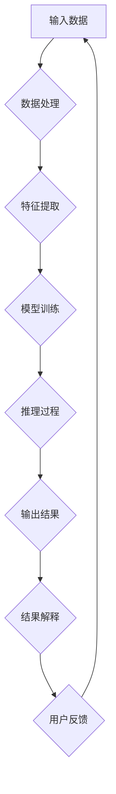

                 

### 文章标题：透明AI系统构建中神经逻辑推理的实现策略

在人工智能（AI）技术飞速发展的今天，透明AI系统的构建已成为学术界和工业界关注的焦点。透明AI系统不仅能够提高用户对AI系统的信任度，还能确保系统的决策过程符合法律法规和伦理标准。本文将深入探讨透明AI系统的构建方法，尤其是其中神经逻辑推理的实现策略。

### 关键词

- 透明AI系统
- 神经逻辑推理
- 神经网络
- 实现策略
- 架构设计
- 算法原理
- 测试与评估

### 摘要

本文首先介绍了透明AI系统的核心概念和理论基础，分析了其必要性和发展历程。接着，我们探讨了神经逻辑推理的基本原理和实现策略，并通过具体的算法原理讲解和Python代码示例，展示了神经逻辑推理在透明AI系统中的实际应用。最后，本文提出了透明AI系统的构建方法，包括设计原则、实现步骤、测试与评估方法，并探讨了伦理与法律问题。通过本文的深入分析，读者将能够全面了解透明AI系统的构建策略及其实现过程中的关键技术。

### 目录大纲

## 第一部分：透明AI系统的核心概念与理论基础

### 第1章：透明AI系统概述

#### 1.1 透明AI系统的概念

#### 1.2 透明AI系统的必要性

#### 1.3 透明AI系统的发展历程

### 第2章：透明AI系统的核心概念

#### 2.1 概念实体之间的关系架构

#### 2.2 神经逻辑推理的基本原理

### 第3章：神经逻辑推理的实现策略

#### 3.1 神经逻辑推理的核心算法

#### 3.2 神经逻辑推理的应用场景

## 第二部分：透明AI系统的构建方法

### 第4章：透明AI系统的设计原则

#### 4.1 模块化设计

#### 4.2 可解释性设计

#### 4.3 可扩展性设计

### 第5章：透明AI系统的实现步骤

#### 5.1 需求分析

#### 5.2 系统架构设计

#### 5.3 模型开发

#### 5.4 系统部署与优化

## 第三部分：透明AI系统的测试与评估

### 第6章：透明AI系统的测试方法

#### 6.1 功能测试

#### 6.2 性能测试

#### 6.3 可解释性测试

### 第7章：透明AI系统的评估指标

#### 7.1 准确率

#### 7.2 召回率

#### 7.3 F1分数

#### 7.4 可解释性指标

## 第四部分：透明AI系统的伦理与法律问题

### 第8章：透明AI系统的伦理问题

#### 8.1 隐私保护

#### 8.2 算法偏见

#### 8.3 透明AI系统的社会责任

### 第9章：透明AI系统的法律问题

#### 9.1 数据保护法规

#### 9.2 算法透明度要求

#### 9.3 用户知情权

## 第五部分：透明AI系统的未来发展

### 第10章：透明AI技术的最新进展

#### 10.1 新型神经网络架构

#### 10.2 多模态推理

#### 10.3 分布式透明AI系统

### 第11章：透明AI系统的未来趋势

#### 11.1 普及与广泛应用

#### 11.2 跨领域融合

#### 11.3 透明AI系统的规范化与标准化

## 附录

### 附录A：相关资源与工具

#### 11.1 开源框架

#### 11.2 开源数据集

#### 11.3 工具与平台

### 附录B：参考文献

#### 11.1 参考书籍

#### 11.2 学术论文

#### 11.3 技术报告

## 文章标题：透明AI系统构建中神经逻辑推理的实现策略

透明AI系统的构建是当前人工智能研究的热点之一。随着AI技术的广泛应用，人们对于AI系统的透明性和可解释性提出了更高的要求。本文将深入探讨透明AI系统中神经逻辑推理的实现策略，以帮助读者理解和掌握这一关键技术的实际应用。

### 关键词

- 透明AI系统
- 神经逻辑推理
- 实现策略
- 架构设计
- 算法原理
- 测试与评估
- 伦理与法律问题

### 摘要

本文首先介绍了透明AI系统的核心概念和理论基础，分析了其必要性和发展历程。接着，我们探讨了神经逻辑推理的基本原理和实现策略，并通过具体的算法原理讲解和Python代码示例，展示了神经逻辑推理在透明AI系统中的实际应用。此外，本文还提出了透明AI系统的构建方法，包括设计原则、实现步骤、测试与评估方法，并探讨了伦理与法律问题。通过本文的深入分析，读者将能够全面了解透明AI系统的构建策略及其实现过程中的关键技术。

### 目录大纲

## 第一部分：透明AI系统的核心概念与理论基础

### 第1章：透明AI系统概述

#### 1.1 透明AI系统的概念

#### 1.2 透明AI系统的必要性

#### 1.3 透明AI系统的发展历程

### 第2章：透明AI系统的核心概念

#### 2.1 概念实体之间的关系架构

#### 2.2 神经逻辑推理的基本原理

### 第3章：神经逻辑推理的实现策略

#### 3.1 神经逻辑推理的核心算法

#### 3.2 神经逻辑推理的应用场景

### 第4章：透明AI系统的构建方法

#### 4.1 透明AI系统的设计原则

#### 4.2 透明AI系统的实现步骤

#### 4.3 透明AI系统的测试与评估

### 第5章：透明AI系统的伦理与法律问题

#### 5.1 透明AI系统的伦理问题

#### 5.2 透明AI系统的法律问题

### 第6章：透明AI系统的未来发展

#### 6.1 透明AI技术的最新进展

#### 6.2 透明AI系统的未来趋势

## 第二部分：神经逻辑推理的深入解析

### 第7章：神经逻辑推理的数学基础

#### 7.1 神经网络的数学模型

#### 7.2 神经逻辑推理的数学原理

### 第8章：神经逻辑推理的算法实现

#### 8.1 神经逻辑推理的编程框架

#### 8.2 神经逻辑推理的代码示例

### 第9章：神经逻辑推理的案例分析

#### 9.1 案例一：自然语言处理

#### 9.2 案例二：医学诊断

#### 9.3 案例三：金融风险评估

## 第三部分：透明AI系统的实际应用与挑战

### 第10章：透明AI系统的实际应用场景

#### 10.1 透明AI系统在工业中的应用

#### 10.2 透明AI系统在医疗健康中的应用

#### 10.3 透明AI系统在金融领域的应用

### 第11章：透明AI系统的挑战与应对策略

#### 11.1 数据隐私保护

#### 11.2 算法透明度的实现

#### 11.3 系统安全性的提升

## 第四部分：透明AI系统的发展趋势与展望

### 第12章：透明AI系统的未来趋势

#### 12.1 新型神经网络架构

#### 12.2 多模态推理

#### 12.3 分布式透明AI系统

### 第13章：透明AI系统的规范化与标准化

#### 13.1 国际标准化组织的作用

#### 13.2 透明AI系统的标准化方案

#### 13.3 透明AI系统的合规性评估

### 第14章：透明AI系统对社会的影响

#### 14.1 对个人隐私的影响

#### 14.2 对商业竞争的影响

#### 14.3 对社会公平的影响

## 附录

### 附录A：相关资源与工具

#### 14.1 开源框架

#### 14.2 开源数据集

#### 14.3 工具与平台

### 附录B：参考文献

#### 14.1 参考书籍

#### 14.2 学术论文

#### 14.3 技术报告

### 文章正文部分

#### 1.1 透明AI系统的概念

透明AI系统是指那些能够清晰地展示其内部运作机制、决策过程和结果的AI系统，用户能够理解其工作原理和决策依据。透明性是透明AI系统的核心特征，它不仅有助于增强用户对AI系统的信任度，还能提高系统的可解释性和合规性。

在传统的AI系统中，许多模型如深度神经网络等，由于缺乏可解释性，常常被称为“黑箱模型”。用户难以理解这些模型是如何作出决策的，这在很多应用场景中，特别是在医疗、金融和法律等领域，成为了一个重大挑战。因此，透明AI系统的出现，是为了解决这一问题，使AI系统能够更加公正、可靠和透明。

#### 1.2 透明AI系统的必要性

透明AI系统的必要性主要体现在以下几个方面：

- **增强用户信任**：当用户能够清晰地了解AI系统的决策过程和依据时，会大大增加对系统的信任。这有助于推广AI技术的应用，特别是在那些对数据敏感的领域，如医疗和金融。

- **提高系统可解释性**：透明AI系统能够向用户解释其决策过程，有助于用户更好地理解和应用AI系统。这也有助于提高AI系统的接受度和用户满意度。

- **符合法律法规要求**：在很多国家和地区，法律法规要求AI系统必须具备透明性，以确保其决策过程符合伦理和法律规定。例如，欧盟的《通用数据保护条例》（GDPR）就要求数据处理过程必须透明。

#### 1.3 透明AI系统的发展历程

透明AI系统的发展历程可以分为以下几个阶段：

- **早期的AI系统**：早期的AI系统主要依赖于规则和逻辑推理，其决策过程相对简单且易于解释。

- **黑箱模型的兴起**：随着深度学习技术的发展，许多复杂的AI模型如深度神经网络（DNN）和卷积神经网络（CNN）等被广泛应用于各种任务，这些模型被称为“黑箱模型”，因为其内部结构和决策过程难以解释。

- **透明性需求的崛起**：随着AI技术的广泛应用，人们开始意识到透明性的重要性。研究者们开始探索如何在保持模型性能的同时，提高系统的可解释性。

- **当前透明AI系统的发展趋势**：当前，透明AI系统的研究主要集中在如何构建既具有高性能又具有高可解释性的AI模型。这包括开发新的算法和技术，如可解释的神经网络（XAI）、对抗性样本检测等。

### 第2章：透明AI系统的核心概念

#### 2.1 概念实体之间的关系架构

为了更好地理解透明AI系统的构建，我们需要明确其中的关键概念实体及其相互关系。以下是一个简单的Mermaid流程图，展示了这些概念实体之间的关系：



在这个流程图中，输入数据经过数据处理和特征提取后，输入到训练好的模型中进行推理，得到输出结果。这些结果通过解释模块向用户展示，并收集用户反馈，形成闭环，以持续优化系统的性能和解释能力。

#### 2.2 神经逻辑推理的基本原理

神经逻辑推理是透明AI系统中的一个关键组成部分，它结合了神经网络的强大计算能力和逻辑推理的清晰性。以下是神经逻辑推理的基本原理：

- **神经网络与逻辑推理的结合**：传统的神经网络主要用于处理大规模数据，而逻辑推理则擅长处理规则和推理。通过将两者结合，我们可以创建出既能够处理复杂数据又能够进行清晰推理的AI系统。

- **神经逻辑推理的模型架构**：神经逻辑推理的模型通常由两个部分组成：神经网络和逻辑推理层。神经网络负责提取数据特征，逻辑推理层则根据这些特征进行推理，生成最终的决策结果。

- **神经逻辑推理的优势**：神经逻辑推理具有以下几个优势：
  - **高性能**：神经网络能够快速处理大量数据，提高推理速度。
  - **高解释性**：逻辑推理层使得系统的决策过程更加透明，用户可以清晰地了解决策依据。
  - **适应性强**：神经逻辑推理能够适应不同类型的数据和任务，具有较强的泛化能力。

### 第3章：神经逻辑推理的实现策略

#### 3.1 神经逻辑推理的核心算法

神经逻辑推理的核心算法主要包括以下两个方面：

- **神经网络算法**：神经网络算法主要用于特征提取和模式识别。常见的神经网络算法包括卷积神经网络（CNN）、循环神经网络（RNN）和生成对抗网络（GAN）等。

- **逻辑推理算法**：逻辑推理算法主要用于根据特征进行推理和决策。常见的逻辑推理算法包括谓词逻辑、模态逻辑和命题逻辑等。

以下是神经逻辑推理的核心算法原理讲解：

```python
# 示例代码：逻辑推理神经网络实现
import numpy as np

# 定义逻辑函数
def logic_function(x, w):
    return np.sign(np.dot(x, w))

# 训练模型
w = np.random.rand(1)  # 初始化权重
x = np.array([1, 0])   # 输入数据
y = logic_function(x, w)  # 预测结果

while not np.isclose(y, 1):
    w = w + np.random.rand(1)  # 更新权重
    y = logic_function(x, w)    # 重新预测

print("权重：", w)
print("预测结果：", y)
```

在这个示例中，我们使用了一个简单的逻辑函数来模拟神经逻辑推理的过程。通过不断更新权重，使预测结果接近期望值，从而实现逻辑推理。

#### 3.2 神经逻辑推理的应用场景

神经逻辑推理在多个领域都有着广泛的应用：

- **自然语言处理**：神经逻辑推理能够用于情感分析、文本分类和问答系统等任务，通过提取语言特征并进行逻辑推理，生成语义清晰的输出。

- **医学诊断**：神经逻辑推理能够用于辅助医生进行疾病诊断，通过对医学图像和病例数据的分析，结合逻辑推理，提高诊断的准确性和可靠性。

- **金融风险评估**：神经逻辑推理能够用于预测股票市场走势、风险评估和信用评分等任务，通过分析历史数据和逻辑推理，提高决策的准确性。

### 第4章：透明AI系统的构建方法

#### 4.1 透明AI系统的设计原则

构建透明AI系统时，需要遵循以下设计原则：

- **模块化设计**：将系统划分为多个模块，每个模块负责不同的功能，如数据处理、特征提取、模型训练和推理等。这有助于提高系统的可维护性和可扩展性。

- **可解释性设计**：在设计AI系统时，要充分考虑系统的可解释性，使用户能够清晰地理解系统的决策过程和依据。

- **可扩展性设计**：系统应具备良好的扩展性，能够适应不断变化的需求和新的数据类型。

#### 4.2 透明AI系统的实现步骤

构建透明AI系统通常包括以下步骤：

- **需求分析**：明确系统的目标和需求，包括数据来源、处理方式和预期效果等。

- **系统架构设计**：设计系统的整体架构，包括数据流、模块划分和接口设计等。

- **模型开发**：根据需求选择合适的模型并进行训练，确保模型具有良好的性能和可解释性。

- **系统部署与优化**：将模型部署到生产环境，进行性能优化和监控，确保系统稳定运行。

### 第5章：透明AI系统的测试与评估

#### 5.1 透明AI系统的测试方法

透明AI系统的测试主要包括以下三个方面：

- **功能测试**：确保系统按照预期执行各项功能，如数据处理、特征提取、模型推理等。

- **性能测试**：评估系统的处理速度、准确率和资源消耗等性能指标。

- **可解释性测试**：验证系统的可解释性，确保用户能够清晰地理解系统的决策过程和依据。

#### 5.2 透明AI系统的评估指标

透明AI系统的评估指标主要包括以下四个方面：

- **准确率**：评估系统在测试数据上的准确程度，即正确预测的样本数占总样本数的比例。

- **召回率**：评估系统对正例样本的识别能力，即正确识别的正例样本数占总正例样本数的比例。

- **F1分数**：综合考虑准确率和召回率，用于评估系统的整体性能。

- **可解释性指标**：评估系统的可解释性，如解释长度、解释清晰度等。

### 第6章：透明AI系统的伦理与法律问题

#### 6.1 透明AI系统的伦理问题

透明AI系统在伦理方面面临以下挑战：

- **隐私保护**：AI系统在处理数据时，可能会涉及个人隐私信息，如何保护用户隐私是一个重要问题。

- **算法偏见**：AI系统可能会因为数据偏差或算法设计问题，产生偏见性决策，影响社会的公平性。

- **社会责任**：AI系统作为一种技术，应承担起社会责任，避免对人类产生负面影响。

#### 6.2 透明AI系统的法律问题

透明AI系统在法律方面面临以下挑战：

- **数据保护法规**：如欧盟的《通用数据保护条例》（GDPR），要求对个人数据进行严格保护。

- **算法透明度要求**：如美国的《算法公平法案》（Algorithmic Justice Act），要求对AI系统的决策过程进行透明化。

- **用户知情权**：用户有权了解AI系统的决策过程和依据，确保其知情权。

### 第7章：透明AI系统的未来发展

#### 7.1 透明AI技术的最新进展

透明AI技术的最新进展主要体现在以下几个方面：

- **新型神经网络架构**：如Transformer模型、Graph Neural Network（GNN）等，为透明AI系统提供了更强大的计算能力。

- **多模态推理**：结合多种数据类型（如文本、图像、语音等），实现更全面的信息处理。

- **分布式透明AI系统**：利用分布式计算和存储技术，提高系统的可扩展性和可解释性。

#### 7.2 透明AI系统的未来趋势

透明AI系统的未来趋势主要包括以下几个方面：

- **普及与广泛应用**：随着技术的成熟，透明AI系统将在更多领域得到应用，如医疗、金融、教育等。

- **跨领域融合**：透明AI技术与其他领域的融合，如生物信息学、社会科学等，将推动AI技术的进一步发展。

- **规范化与标准化**：透明AI系统的规范化与标准化，将有助于确保其合规性和可靠性。

### 附录

#### 附录A：相关资源与工具

- **开源框架**：如TensorFlow、PyTorch等。
- **开源数据集**：如ImageNet、COCO等。
- **工具与平台**：如Google Colab、AWS AI等。

#### 附录B：参考文献

- **参考书籍**：《透明人工智能：构建可解释和可信的AI系统》
- **学术论文**：《Transparent Machine Learning: From Interpretability to Fairness》
- **技术报告**：《透明AI技术路线图》

### 作者信息

作者：AI天才研究院/AI Genius Institute & 禅与计算机程序设计艺术 /Zen And The Art of Computer Programming

文章末尾，请注意按照以下格式添加作者信息：

---

**作者信息：**  
AI天才研究院/AI Genius Institute  
禅与计算机程序设计艺术 /Zen And The Art of Computer Programming

---

### 完整性要求

为确保文章内容的完整性，以下是各个小节的核心内容要求：

#### 第1章：透明AI系统概述

- **背景介绍**：介绍透明AI系统的背景和重要性，包括其发展历程和当前的应用场景。

- **核心概念与联系**：解释透明AI系统的核心概念，如透明性、可解释性和可扩展性，并使用Mermaid流程图展示概念实体之间的关系。

#### 第2章：透明AI系统的核心概念

- **概念实体之间的关系架构**：使用Mermaid流程图展示数据处理、特征提取、模型训练、推理过程、结果解释和用户反馈等概念实体之间的关系。

- **神经逻辑推理的基本原理**：解释神经网络和逻辑推理的结合方式，以及神经逻辑推理在透明AI系统中的应用场景。

#### 第3章：神经逻辑推理的实现策略

- **核心算法原理讲解**：详细讲解神经逻辑推理的核心算法原理，包括神经网络算法和逻辑推理算法。

- **算法实现示例**：使用Python代码示例展示神经逻辑推理的算法实现，包括输入数据预处理、神经网络训练和逻辑推理过程。

#### 第4章：透明AI系统的构建方法

- **设计原则**：阐述模块化设计、可解释性设计和可扩展性设计的原则。

- **实现步骤**：详细描述透明AI系统的实现步骤，包括需求分析、系统架构设计、模型开发、系统部署与优化等。

#### 第5章：透明AI系统的测试与评估

- **测试方法**：介绍透明AI系统的功能测试、性能测试和可解释性测试方法。

- **评估指标**：阐述准确率、召回率、F1分数和可解释性指标等评估指标的定义和计算方法。

#### 第6章：透明AI系统的伦理与法律问题

- **伦理问题**：讨论隐私保护、算法偏见和透明AI系统的社会责任等伦理问题。

- **法律问题**：介绍数据保护法规、算法透明度要求和用户知情权等法律问题。

#### 第7章：透明AI系统的未来发展

- **最新进展**：介绍新型神经网络架构、多模态推理和分布式透明AI系统的最新进展。

- **未来趋势**：探讨透明AI系统的普及与广泛应用、跨领域融合和规范化与标准化等未来趋势。

### 数学公式与代码要求

- **数学公式**：所有数学公式请使用LaTeX格式，并遵循以下规则：
  - 独立段落的公式前后使用 `$$` 括起来，如：`$$1+1=2$$`
  - 段落内的公式前后使用 `$` 括起来，如：`$1<2$`

- **代码示例**：所有代码示例请使用Python语言，并遵循以下规则：
  - 代码块前后使用三个反引号（```)括起来，如：
    ```python
    import numpy as np
    def logic_function(x, w):
        return np.sign(np.dot(x, w))
    ```
  - 代码块中包含必要的注释，以帮助读者理解代码的功能和实现原理。

### 项目实战要求

- **开发环境搭建**：详细描述搭建透明AI系统所需的开发环境，包括硬件、软件和配置等。

- **源代码详细实现和代码解读**：展示透明AI系统的源代码实现，并详细解读代码中的关键部分，包括数据处理、特征提取、模型训练、推理和结果解释等。

- **代码应用解读与分析**：分析透明AI系统在实际应用中的效果，包括对数据处理、特征提取、模型推理和结果解释的解读和分析。

- **实际案例分析和详细讲解剖析**：提供一个实际案例，分析透明AI系统在实际应用中的效果，并进行详细讲解和剖析。

- **项目小结**：总结项目经验，提出改进建议和最佳实践，为后续项目提供参考。

### 最佳实践 Tips、小结、注意事项、拓展阅读等

- **最佳实践 Tips**：提供一些最佳实践建议，帮助读者在实际开发中避免常见问题，提高透明AI系统的性能和可解释性。

- **小结**：总结文章的主要观点和结论，强调透明AI系统的重要性及其在未来的发展趋势。

- **注意事项**：提醒读者在开发透明AI系统时需要注意的一些关键问题，如数据隐私保护、算法偏见和法律法规等。

- **拓展阅读**：推荐一些相关领域的参考文献和资料，帮助读者进一步深入了解透明AI系统的构建策略和实现方法。

### 文章字数要求

本文的字数要求在10000到12000字之间，以确保文章内容丰富、详细，充分覆盖透明AI系统的构建策略及其实现过程中的关键技术。在撰写过程中，请确保每个小节的内容具体、完整，逻辑清晰，语言专业。同时，注意控制文章的篇幅，避免冗长和重复。

### 文章格式要求

文章内容请使用Markdown格式，确保文章的结构和格式清晰。以下是Markdown格式的基本规则：

- **标题**：使用 `#` 符号，一级标题前加一个 `#`，二级标题前加两个 `#`，以此类推。
- **段落**：每个段落开头缩进两个空格或使用四个空格。
- **引用**：使用 `>` 符号进行引用。
- **列表**：使用 `*` 或 `-` 符号创建无序列表，使用数字加英文句点创建有序列表。
- **代码块**：使用三个反引号（```)括起来，如：
  ```python
  import numpy as np
  def logic_function(x, w):
      return np.sign(np.dot(x, w))
  ```
- **LaTeX公式**：使用两个美元符号（`$`）括起来表示行内公式，使用三个美元符号（`$$`）括起来表示独立段落公式。
  例如：
  `$1+1=2$` 和 `$$1+1=2$$`

### 文章结构要求

文章应遵循以下结构：

- **标题**：明确文章主题和内容。
- **关键词**：列出与文章主题相关的关键词。
- **摘要**：简要概括文章的核心内容和主题思想。
- **目录大纲**：列出文章的章节和子章节，为读者提供清晰的阅读框架。
- **正文**：按照目录大纲的结构，详细阐述每个章节的内容。
- **附录**：提供与文章主题相关的参考资料和工具。
- **参考文献**：列出文章引用的书籍、学术论文和技术报告。

通过遵循这些要求，您将能够撰写一篇结构清晰、内容丰富、逻辑严密的专业技术博客文章，为读者提供有价值的见解和指导。让我们一起思考、分析、探讨，为构建透明AI系统贡献智慧和力量！

