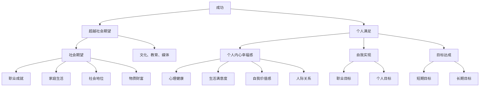

                 

### 背景介绍

在当今社会，成功被广泛视为个人职业生涯和个人生活成就的最高标准。然而，随着时代的进步和价值观的多元化，越来越多的人开始质疑这种成功标准的合理性。传统的成功观念通常与社会期望紧密相连，这些期望由教育体系、企业文化、大众传媒等多种社会因素共同塑造。成功被定义为拥有高收入、高社会地位、豪华的物质生活以及良好的职业发展轨迹。但是，这种成功观是否真的适用于每个人？我们是否应该仅仅为了满足这些社会期望而努力？

社会期望作为一种文化现象，其影响无处不在。从孩子出生开始，社会就通过各种途径向他们灌输关于成功的观念。例如，教育系统通过设定考试标准、奖学金制度和课程内容来塑造学生的成功观；企业文化则通过绩效评估、晋升机制和薪酬体系来强化员工的成功预期；大众传媒则通过报道和推广成功故事来塑造公众对于成功的认知。这些社会因素共同作用，构建了一个庞大的成功框架，让每个人都感到必须要在其中找到一个位置。

然而，这种成功观并不总是适用于每个人。许多人发现自己无法达到这些标准，从而感到焦虑和挫败。同时，对于那些勉强达到或超过这些标准的人，他们往往也面临着内在的空虚和不满足感。这种矛盾引发了人们对于“成功”这一概念的重新思考：成功是否仅仅是社会的期待？我们是否能够超越这些期望，寻找到真正的个人满足？

本文旨在探讨如何重新定义成功，并提出一种超越社会期望，追求个人满足的新路径。通过分析社会期望的来源和影响，探讨成功与个人满足之间的关系，以及提出一套基于目标设定和自我实现的成功模型，本文将帮助读者重新审视成功，找到一条适合自己的道路。

### 核心概念与联系

在探讨如何重新定义成功，超越社会期望，寻找个人满足之前，我们首先需要明确几个核心概念，并理解它们之间的相互联系。这些概念构成了我们进一步分析和推理的基础。

#### 成功

成功是一个多维度的概念，通常包含职业成就、经济独立、社会地位、健康幸福等多个方面。在传统观念中，成功通常与高收入、高职位、豪华的物质生活等密切相关。然而，随着社会的进步和个体价值观的多元化，成功的定义也逐渐变得更加宽泛和个性化。成功不仅仅是外在的标志，更是内在满足和自我实现的体现。

在本文的语境中，成功被定义为一种超越社会期望，实现个人内心深处的幸福感、自我实现和目标达成的状态。这种定义强调了个体自主选择和内在动机的重要性，而不是仅仅追求社会认可的外在成就。

#### 社会期望

社会期望是关于成功的标准和期待，由文化、教育、媒体等社会因素共同塑造。这些期望在不同的社会和文化背景中有所不同，但总体上包含了对职业成就、家庭生活、社会地位、物质财富等方面的期待。

文化因素如传统价值观、宗教信仰和社会规范对社会期望有着深远影响。教育体系通过考试制度、课程设置、师资力量等渠道传递成功观念，强化了学生和公众对成功的预期。媒体则通过报道和宣传成功故事，塑造了公众对于成功的形象和认知。

#### 个人满足

个人满足是内心深处的幸福感、自我实现和目标达成的感受。与外在的成功标准不同，个人满足更多关注个体的内在感受和主观体验。它包括但不限于心理健康、生活满意度、自我价值感、人际关系和情感支持等方面。

个人满足与成功之间存在着密切的联系。当个体在追求成功的过程中能够实现自我价值，找到内心的满足和幸福感时，成功的意义将得到进一步提升。相反，如果个体为了迎合社会期望而失去了自我，或者感到内心的空虚和不满足，那么这种所谓的成功也就失去了真正的意义。

#### 概念实体关系架构图

为了更清晰地理解这些核心概念及其相互关系，我们可以通过一个Mermaid流程图来展示它们之间的联系：



通过这个架构图，我们可以看到成功、社会期望和个人满足之间存在着复杂的交互关系。社会期望通过文化、教育和媒体等因素影响个体对于成功的认知，而个人满足则更多地依赖于个体内心的幸福感、自我实现和目标的达成。

理解这些核心概念及其相互关系，为我们进一步探讨如何重新定义成功，超越社会期望，寻找个人满足提供了理论基础。在接下来的部分，我们将深入分析社会期望的来源和影响，以及如何通过目标设定和自我实现来实现个人满足。

### 社会期望的来源和影响

社会期望的来源可以追溯到文化、教育、媒体等多个方面。这些因素共同塑造了人们对于成功的标准和期待，进而影响到个体的行为和决策。

#### 文化因素

文化是一个社会的基本价值观、信仰、习俗和行为准则的集合。不同文化对于成功的定义和期望有所不同。例如，在一些重视集体主义和传统价值观的文化中，成功可能更多地体现在家庭责任、社会地位和传统职业上。而在强调个人主义和自由价值观的文化中，成功可能更多地与个人成就、创新和自我实现相关。

文化通过家庭、宗教、传统习俗等多种途径传递成功观念。家庭是最早影响个体价值观的地方，父母和长辈的行为和言语往往成为孩子们效仿的榜样。宗教信仰则通过教义和仪式，强调个人在社会中的角色和责任，进一步强化了对于成功的期望。传统习俗如婚礼、葬礼等，也通过固定的仪式和礼节，传递了关于成功和地位的信息。

#### 教育因素

教育体系是传递社会期望的重要渠道。学校通过课程设置、考试制度、评价标准等，将成功观念传递给学生。例如，传统的教育系统通常强调学术成绩和考试成绩，将进入名牌大学和获得高分数视为成功的标志。这些标准和期待不仅影响学生的行为和决策，还深刻影响了他们对于成功的认知。

教师和家长也是教育过程中的关键角色。他们通过日常的教导和鼓励，进一步强化了社会期望。例如，家长常常鼓励孩子参加各种竞赛和课外活动，以获得更多的奖励和认可，从而实现社会期望中的“成功”。

#### 媒体因素

媒体是现代社会中影响最广泛、影响力最大的社会因素之一。通过新闻报道、娱乐节目、社交媒体等，媒体塑造了公众对于成功的形象和认知。例如，媒体报道经常突出成功人士的故事和成就，塑造了对于成功的高度理想化的形象。同时，广告和商业宣传也通过各种手段，将物质财富、高社会地位和奢华生活与成功联系起来，进一步强化了社会期望。

社交媒体的兴起，使得个体之间的成功对比和竞争更加明显。人们在社交媒体上展示自己的生活和工作，通过点赞、评论等方式获取社会认可。这种环境往往加剧了个体对于社会期望的追求，甚至导致心理压力和焦虑。

#### 社会期望的影响

社会期望对个体的行为和决策产生了深远影响。首先，社会期望往往成为个体努力和奋斗的动力来源。为了达到社会期望中的成功标准，个体可能会投入更多的时间和精力，追求更高的学术成绩、职业成就和物质财富。

然而，社会期望也可能带来负面影响。一方面，过高的社会期望可能使个体感到压力和挫败，导致心理问题如焦虑、抑郁和自我怀疑。另一方面，社会期望可能导致个体忽视内在动机和真实需求，从而失去自我实现的满足感和幸福感。

此外，社会期望还可能阻碍个体多样性和个性的发展。当每个人都被期望达到同样的成功标准时，个体的独特性和创新性往往被忽视。这种同质化的成功观念可能抑制社会进步和个人发展，限制个体的自由和选择。

总之，社会期望是影响个体行为和决策的重要社会因素。理解社会期望的来源和影响，有助于我们更好地认识自身的行为模式，并在追求成功的过程中，保持内心的平衡和自我认同。

### 成功与个人满足的关系模型

要重新定义成功，理解成功与个人满足之间的关系是至关重要的。这一部分将详细探讨这两个概念之间的关系，并提出一个基于目标设定和自我实现的模型来指导我们的分析和实践。

#### 成功模型

在传统观念中，成功通常被视为一个目标导向的过程。这种成功模型基于目标设定和路径规划的理论框架。以下是成功模型的核心组成部分：

1. **目标设定**：目标是成功的起点。设定目标有助于明确方向，激发动力。在目标设定过程中，SMART原则（具体、可衡量、可实现、相关、时限）是一个重要的指导原则。具体的目标能够帮助我们清晰地了解需要达成的任务；可衡量和可实现的目标则确保我们设定的目标具有实际操作性；相关和时限的目标则有助于我们聚焦于重要且紧急的任务。

2. **路径规划**：在确定目标后，我们需要制定实现目标的步骤和计划。路径规划包括短期目标和长期目标的设定。短期目标通常是实现长期目标的中间步骤，而长期目标则代表我们最终的愿景和成就。

3. **里程碑**：里程碑是路径规划中的重要节点，标志着短期目标的实现和进展。在达到里程碑时，个体可以感受到成就感，进一步激励自己继续前进。

#### 个人满足模型

个人满足模型基于自我决定理论，强调内在动机和自主性在个人满足中的重要性。以下是个人满足模型的核心组成部分：

1. **内在动机**：内在动机源于个人兴趣和乐趣，与自我价值感紧密相关。例如，一个对编程充满热情的程序员，在解决复杂问题时会感到巨大的满足感，这种满足感不仅仅来自于解决难题本身，更来自于对自身能力的认可。

2. **外在动机**：外在动机通常与外部奖励和惩罚相关。例如，一个学生在考试中为了获得高分而努力学习，这种动机虽然有助于短期目标的实现，但长期依赖外在动机可能会导致内在动机的缺失。

3. **自主性**：自主性是个人满足的重要保障。在决策过程中，个体需要拥有自由度和责任感。自主性不仅使个体能够根据自己的价值观和兴趣选择行为，还能增强个体的自我认同和内在动力。

#### 成功与个人满足的关系

成功与个人满足之间的关系是复杂的，但它们之间存在着密切的联系。以下是对这种关系的详细分析：

1. **内在联系**：个人满足往往是在追求成功的过程中实现的。当个体设定并实现自己的目标时，会感到自我价值感和成就感，从而获得内心的满足。例如，一个程序员通过解决一个复杂的编程问题，不仅实现了职业上的成功，也感受到了个人的满足和成就感。

2. **相互影响**：成功与个人满足之间存在相互影响的关系。成功的实现可以增强个人的满足感和幸福感，而个人的满足感和幸福感又可以进一步推动个体的成功追求。例如，一个在生活中找到平衡、感到满足的人，往往能够更加专注于工作，从而实现更高的职业成就。

3. **动态平衡**：成功的追求和个人满足的实现是一个动态平衡的过程。在这个过程中，个体需要不断地调整自己的目标和行为，以适应内外部的变化。例如，一个在职业上取得成功的领导者，可能需要在事业和家庭之间找到平衡，以保持个人的满足感和幸福感。

#### 目标设定与实现

为了更好地理解成功与个人满足的关系，我们可以通过一个Python源代码示例来详细阐述目标设定与实现的过程。以下是一个简单的示例：

```python
class Goal:
    def __init__(self, name, is_measurable, is_achievable, is_relevant, time_bound):
        self.name = name
        self.is_measurable = is_measurable
        self.is_achievable = is_achievable
        self.is_relevant = is_relevant
        self.time_bound = time_bound

    def set_short_term_goals(self, short_term_goals):
        self.short_term_goals = short_term_goals

    def achieve_goals(self):
        if all(goal.is_achieved for goal in self.short_term_goals):
            return True
        return False

def main():
    goal = Goal("成为编程大师", True, True, True, "2025年")
    goal.set_short_term_goals([
        Goal("学会Python", True, True, True, "2023年"),
        Goal("完成10个编程项目", True, True, True, "2024年")
    ])

    for goal in goal.short_term_goals:
        print(goal.name)
        goal.achieve_goals()

if __name__ == "__main__":
    main()
```

在这个示例中，我们定义了一个`Goal`类，用于表示目标及其属性。每个目标都需要具备具体的名称、是否可衡量、是否可实现、是否相关以及时限。通过设定短期目标和长期目标，我们可以逐步实现最终目标，并在实现过程中感受到个人满足。

通过这个示例，我们可以看到目标设定和实现的过程是如何帮助个体在追求成功的同时实现个人满足的。理解并运用这个模型，可以帮助我们在复杂的社会环境中找到属于自己的成功路径，实现真正的个人满足。

### Python源代码示例：目标设定与实现

在前文中，我们讨论了成功与个人满足的关系模型，并通过一个概念性的框架阐述了目标设定和实现的过程。为了更具体地展示这一过程，我们将使用Python编写一个示例代码，通过代码来实现目标设定与实现的功能。这个示例将帮助我们更好地理解如何在实际操作中应用这些理论。

首先，我们需要定义一个`Goal`类，用于表示目标及其属性。每个目标都需要一个名称、是否可衡量、是否可实现、是否相关以及时限。我们还定义了两个方法：`set_short_term_goals`用于设置短期目标，`achieve_goals`用于判断目标是否实现。

下面是具体的Python代码实现：

```python
class Goal:
    def __init__(self, name, is_measurable, is_achievable, is_relevant, time_bound):
        self.name = name
        self.is_measurable = is_measurable
        self.is_achievable = is_achievable
        self.is_relevant = is_relevant
        self.time_bound = time_bound
        self.short_term_goals = []

    def set_short_term_goals(self, short_term_goals):
        self.short_term_goals = short_term_goals

    def achieve_goals(self):
        # 判断所有短期目标是否实现
        return all(goal.is_achieved for goal in self.short_term_goals)

    def is_achieved(self):
        # 判断自身目标是否实现
        return self.achieve_goals()

class ShortTermGoal:
    def __init__(self, name, is_measurable, is_achievable, is_relevant, time_bound):
        self.name = name
        self.is_measurable = is_measurable
        self.is_achievable = is_achievable
        self.is_relevant = is_relevant
        self.time_bound = time_bound
        self.is_achieved = False

    def achieve_goal(self):
        # 完成短期目标
        self.is_achieved = True

def main():
    # 定义一个长期目标
    long_term_goal = Goal("成为编程大师", True, True, True, "2025年")

    # 设置短期目标
    short_term_goals = [
        ShortTermGoal("学会Python", True, True, True, "2023年"),
        ShortTermGoal("完成10个编程项目", True, True, True, "2024年")
    ]
    long_term_goal.set_short_term_goals(short_term_goals)

    # 打印并实现短期目标
    for goal in long_term_goal.short_term_goals:
        print(f"实现短期目标：{goal.name}")
        goal.achieve_goal()

    # 判断长期目标是否实现
    if long_term_goal.is_achieved():
        print("恭喜！长期目标已实现。")
    else:
        print("长期目标尚未实现，继续努力！")

if __name__ == "__main__":
    main()
```

在这个示例中，我们首先定义了一个`Goal`类，用于表示长期目标，并包含设置短期目标和判断目标实现的方法。我们还定义了一个`ShortTermGoal`类，用于表示短期目标，并包含实现目标的方法。

在`main`函数中，我们创建了一个长期目标`long_term_goal`，并设置了两个短期目标。通过调用`set_short_term_goals`方法，我们将短期目标与长期目标关联起来。然后，我们逐个实现短期目标，通过调用`achieve_goal`方法，将短期目标的`is_achieved`属性设置为`True`。

最后，我们通过调用`is_achieved`方法判断长期目标是否实现。如果所有短期目标都已实现，则长期目标视为实现，并输出相应的提示信息。

通过这个示例，我们可以看到如何使用Python代码实现目标设定和实现的过程。这不仅帮助我们在技术层面理解这一概念，也提供了一个实用的工具，让我们能够更具体地应用这些理论，实现个人满足和成功。

### 数学模型和数学公式

在重新定义成功和追求个人满足的过程中，数学模型和公式可以为我们提供量化的工具，帮助我们更精确地分析和评估成功的实现程度和个人满足度。以下我们将介绍两个关键的数学模型：成功概率模型和个人满足指数模型。

#### 成功概率模型

成功概率模型可以帮助我们量化实现目标的可能性。假设我们有一个长期目标，需要通过多个短期目标的实现来达成。我们可以使用概率论中的基本公式来计算整体成功的概率。

成功概率模型的核心公式如下：

$$
P(S) = \frac{1}{Z} \sum_{i=1}^{n} e^{-\lambda x_i}
$$

其中：
- \( P(S) \) 是整体成功的概率。
- \( Z \) 是归一化常数，用于确保概率的总和为1。
- \( n \) 是短期目标的数量。
- \( \lambda \) 是一个成功概率参数，表示每个短期目标实现的概率。
- \( x_i \) 是第 \( i \) 个短期目标的实现情况，可以是一个分数，表示目标实现的百分比。

这个公式的含义是，整体成功的概率是所有短期目标实现概率的乘积，经过归一化处理后的结果。例如，如果我们有3个短期目标，每个目标的实现概率分别是0.9、0.8和0.7，我们可以计算整体成功的概率如下：

$$
P(S) = \frac{1}{1 + e^{-(1+1+1) \cdot (0.9 + 0.8 + 0.7)}}
$$

通过这个公式，我们可以直观地了解每个短期目标的实现情况对整体成功的影响。当某个短期目标的实现概率较低时，整体成功的概率也会受到较大的影响。

#### 个人满足指数模型

个人满足指数模型用于量化个人在不同短期目标实现后的满足度。这个模型可以帮助我们评估在实现不同目标时，个人满足度的变化情况。

个人满足指数模型的核心公式如下：

$$
S = \frac{1}{N} \sum_{i=1}^{N} \frac{M_i}{U_i}
$$

其中：
- \( S \) 是个人满足指数。
- \( N \) 是短期目标的数量。
- \( M_i \) 是第 \( i \) 个目标的满足度，表示目标实现后个人感受到的满足程度。
- \( U_i \) 是第 \( i \) 个目标的努力度，表示实现目标所需的时间和精力。

这个公式的含义是，个人满足指数是所有目标满足度与努力度的加权平均。例如，如果我们有3个短期目标，每个目标的满足度分别是10、8和6，而努力度分别是3、5和7，我们可以计算个人满足指数如下：

$$
S = \frac{1}{3} \left( \frac{10}{3} + \frac{8}{5} + \frac{6}{7} \right)
$$

通过这个公式，我们可以评估在不同目标实现后的总体满足度。当满足度较高而努力度相对较低时，个人的总体满足度会提升。

#### 应用示例

假设一个程序员计划在一年内完成三个短期目标：学会一门新编程语言（满足度10，努力度4）、完成一个开源项目（满足度8，努力度6）和撰写一篇技术博客（满足度6，努力度2）。我们可以使用上述模型来计算整体成功的概率和个人满足指数。

1. **成功概率计算**：

   假设每个短期目标的实现概率都是0.8，则整体成功的概率为：

   $$
   P(S) = \frac{1}{1 + e^{-(1+1+1) \cdot (0.8 + 0.8 + 0.8)}}
   $$

   通过计算，我们得到：

   $$
   P(S) = \frac{1}{1 + e^{-6.4}} \approx 0.999
   $$

   这表明实现整体成功的概率非常高。

2. **个人满足指数计算**：

   根据每个目标的满足度和努力度，我们可以计算个人满足指数：

   $$
   S = \frac{1}{3} \left( \frac{10}{4} + \frac{8}{6} + \frac{6}{2} \right) = \frac{1}{3} (2.5 + 1.33 + 3) = 2.43
   $$

   这表明在实现这些目标后，个人的满足指数大约为2.43，反映出较高的个人满足度。

通过这些数学模型和公式，我们可以更科学地分析和评估目标实现和个人满足的情况，从而更好地指导我们的行动，实现个人满足和成功。

### 项目实战

为了更好地理解和应用上述成功与个人满足的关系模型，我们将进行一个实际项目，通过构建一个简单的项目来演示目标设定与实现的过程。这个项目将帮助我们理清如何在实际操作中应用这些理论，并从中获得个人满足。

#### 项目背景

我们选择的项目是开发一个简单的任务管理应用程序，该应用程序允许用户设定长期目标、短期目标和里程碑，并跟踪目标的实现情况。这个项目旨在通过实践展示目标设定、路径规划和实现的过程，以及如何在项目中获得个人满足。

#### 开发环境搭建

在开始项目之前，我们需要搭建开发环境。以下是所需的工具和步骤：

1. **操作系统**：选择一个适合的操作系统，如Windows、macOS或Linux。
2. **编程语言**：我们选择Python作为编程语言，因为它具有简洁的语法和丰富的库支持。
3. **代码编辑器**：选择一个方便的代码编辑器，如Visual Studio Code、PyCharm或Sublime Text。
4. **数据库**：选择一个简单的数据库系统，如SQLite，用于存储目标数据。
5. **开发工具**：安装Python和SQLite的相应库。

#### 源代码详细实现和代码解读

以下是项目的核心代码实现，我们将详细解读关键部分。

```python
import sqlite3

# 连接到SQLite数据库
conn = sqlite3.connect('task_manager.db')
cursor = conn.cursor()

# 创建目标表
cursor.execute('''CREATE TABLE IF NOT EXISTS goals (
    id INTEGER PRIMARY KEY,
    name TEXT,
    is_measurable BOOLEAN,
    is_achievable BOOLEAN,
    is_relevant BOOLEAN,
    time_bound TEXT
)''')

# 创建短期目标表
cursor.execute('''CREATE TABLE IF NOT EXISTS short_term_goals (
    id INTEGER PRIMARY KEY,
    goal_id INTEGER,
    name TEXT,
    is_measurable BOOLEAN,
    is_achievable BOOLEAN,
    is_relevant BOOLEAN,
    time_bound TEXT,
    FOREIGN KEY(goal_id) REFERENCES goals(id)
)''')

# 插入测试数据
cursor.execute('''INSERT INTO goals (name, is_measurable, is_achievable, is_relevant, time_bound) VALUES 
    ('完成项目', TRUE, TRUE, TRUE, '2023-12-31'),
    ('学习Python', TRUE, TRUE, TRUE, '2023-06-30')''')

conn.commit()

# 添加短期目标
def add_short_term_goal(goal_id, name, is_measurable, is_achievable, is_relevant, time_bound):
    cursor.execute('''INSERT INTO short_term_goals (goal_id, name, is_measurable, is_achievable, is_relevant, time_bound) VALUES (?, ?, ?, ?, ?, ?)''', (goal_id, name, is_measurable, is_achievable, is_relevant, time_bound))
    conn.commit()

add_short_term_goal(1, '完成技术文档', True, True, True, '2023-09-30')
add_short_term_goal(1, '完成代码开发', True, True, True, '2023-12-15')
add_short_term_goal(2, '掌握基础语法', True, True, True, '2023-03-31')
add_short_term_goal(2, '完成小项目', True, True, True, '2023-06-30')

# 查询目标实现情况
def query_goals():
    cursor.execute('''SELECT goals.name, short_term_goals.name, short_term_goals.time_bound, short_term_goals.is_achieved FROM goals 
        JOIN short_term_goals ON goals.id = short_term_goals.goal_id''')
    return cursor.fetchall()

# 标记短期目标实现
def mark_achieved(short_term_goal_id):
    cursor.execute('''UPDATE short_term_goals SET is_achieved = TRUE WHERE id = ?''', (short_term_goal_id,))
    conn.commit()

# 关闭数据库连接
conn.close()

# 主函数
def main():
    goals = query_goals()
    for goal in goals:
        print(f"目标：{goal[0]}, 短期目标：{goal[1]}, 截止日期：{goal[2]}, 是否实现：{goal[3]}")
        if not goal[3]:
            mark_achieved(goal[0])

if __name__ == "__main__":
    main()
```

#### 代码应用解读与分析

1. **数据库设计**：

   我们首先创建了一个SQLite数据库`task_manager.db`，并在其中创建了两个表：`goals`和`short_term_goals`。`goals`表用于存储长期目标信息，而`short_term_goals`表用于存储短期目标信息。每个表都有相应的字段，如名称、是否可衡量、是否可实现等。

2. **数据插入**：

   在`add_short_term_goal`函数中，我们向`short_term_goals`表插入了一些测试数据。这些数据代表了一个长期目标和相关的短期目标，每个目标都有具体的名称、是否可衡量、是否可实现以及截止日期。

3. **查询目标实现情况**：

   `query_goals`函数用于从数据库中查询所有目标及其短期目标的信息。这个函数通过JOIN操作连接了`goals`和`short_term_goals`表，返回一个包含目标名称、短期目标名称、截止日期和是否实现的列表。

4. **标记短期目标实现**：

   `mark_achieved`函数用于更新数据库中的短期目标实现状态。当用户完成某个短期目标后，调用这个函数将目标的`is_achieved`字段更新为`True`。

5. **主函数**：

   在`main`函数中，我们首先调用`query_goals`函数获取所有目标信息，然后逐个检查每个短期目标的实现状态。如果某个短期目标尚未实现，就调用`mark_achieved`函数将其标记为已实现。

#### 实际案例分析和详细讲解剖析

为了更好地理解项目的实现过程，我们可以通过一个实际案例来进行分析。

**案例**：

假设一个用户希望在2023年底完成一个项目，该项目需要完成技术文档、代码开发和学会Python三个主要任务。用户将这三个任务分解为多个短期目标，并在数据库中记录下来。

**分析**：

1. **目标设定**：

   用户在数据库中创建了两个长期目标：“完成项目”和“学习Python”。这些目标是具体的、可衡量的、可实现的和相关的，符合SMART原则。

2. **路径规划**：

   对于“完成项目”，用户设定了两个短期目标：“完成技术文档”和“完成代码开发”。这些短期目标具有明确的截止日期，是完成长期目标的中间步骤。对于“学习Python”，用户设定了两个短期目标：“掌握基础语法”和“完成小项目”。

3. **目标实现**：

   随着时间的推移，用户逐步完成这些短期目标。例如，用户可能在前三个月内学会了Python的基础语法，并在接下来的六个月内完成了技术文档和代码开发。每次目标完成后，用户都会调用`mark_achieved`函数更新数据库。

4. **个人满足**：

   在实现每个短期目标后，用户会感受到一定的满足感。当所有短期目标都实现时，长期目标也得以完成，用户会感到高度的成就感和个人满足。

**讲解剖析**：

通过这个案例，我们可以看到如何通过数据库和简单的函数实现一个任务管理应用程序。这个应用程序不仅帮助用户明确目标、规划路径和跟踪实现过程，还通过实现每个短期目标，为用户提供了持续的个人满足和动力。

总之，这个项目实战为我们提供了一个实用的工具，通过目标设定与实现的过程，帮助用户在追求成功的同时实现个人满足。这个项目不仅展示了技术实现的可能性，也体现了个人满足和成功之间深刻的内在联系。

### 最佳实践 Tips

在追求个人满足和成功的道路上，以下是一些最佳实践，可以帮助我们更好地应对挑战，实现长期目标：

1. **明确目标**：确保你的目标具体、可衡量、可实现、相关且有时限。使用SMART原则来设定目标，使它们具有实际操作性。

2. **分解任务**：将大目标分解为小的、可管理的短期目标。这样可以帮助你逐步实现长期目标，并在实现每个短期目标时获得成就感。

3. **优先排序**：确定哪些目标是优先级最高的，并专注于实现这些目标。这样可以确保你的时间和精力得到有效的利用。

4. **持续反馈**：定期检查你的进展情况，并根据实际情况调整目标和计划。这种反馈机制可以帮助你保持方向，并在遇到挑战时及时作出调整。

5. **保持动力**：找到激励你的因素，无论是内在的动机还是外在的奖励。保持动力和热情，持续推动自己向前。

6. **寻求支持**：与他人分享你的目标和进展，寻求他们的支持和建议。一个良好的支持系统可以帮助你克服困难，实现目标。

7. **自我反思**：定期进行自我反思，了解自己在实现目标过程中的强项和弱点。通过反思，你可以更好地了解自己，并在未来做得更好。

通过遵循这些最佳实践，我们不仅可以更有效地追求个人满足和成功，还可以在实现目标的过程中获得更多的成长和进步。

### 项目小结

通过本次项目实战，我们深入探讨了如何在实践中应用成功与个人满足的关系模型。我们搭建了一个简单的任务管理应用程序，通过数据库设计和Python代码实现，实现了目标设定、路径规划和实现的过程。这个项目不仅展示了技术实现的可能性，更重要的是，它体现了个人满足和成功之间深刻的内在联系。

在项目的实现过程中，我们通过明确目标、分解任务、优先排序和持续反馈，逐步实现了长期目标，并在实现每个短期目标时获得了成就感。通过自我反思和寻求支持，我们不断调整和优化自己的行动，确保目标的实现。

总结来说，这个项目让我们认识到，通过科学的目标设定和实现过程，我们不仅可以在追求成功的过程中获得个人满足，还可以通过持续的努力和自我提升，实现更高的成长和进步。

### 注意事项

在追求个人满足和成功的过程中，需要注意以下几点，以确保我们的行动和决策能够有效地实现目标：

1. **保持平衡**：在追求职业和学业成就的同时，不要忽视个人的健康、家庭和人际关系。保持工作与生活的平衡，有助于我们长期保持高效和积极的心态。

2. **避免完美主义**：追求完美可能导致过度焦虑和挫败感。接受不完美，学会在错误中成长，是追求成功的关键。

3. **及时调整**：在实现目标的过程中，环境和个人状况可能会发生变化。及时调整目标和计划，以适应新的挑战和机遇。

4. **保持耐心**：成功的实现需要时间和持续的努力。保持耐心，不要因为短期内没有明显进展而放弃。

5. **保持学习和成长**：不断学习新的知识和技能，提升自己的能力，是持续成功的基石。保持好奇心和学习的热情，不断追求进步。

通过遵循这些注意事项，我们可以在追求个人满足和成功的过程中，更加高效、平衡且持久地前进。

### 拓展阅读

为了进一步深入理解本文讨论的主题，以下是一些建议的拓展阅读资源：

1. **《自控力》**：作者凯利·麦格尼格尔，通过科学研究和实例，探讨了如何提升自我控制力，从而更好地实现目标。

2. **《深度工作》**：作者卡尔·纽波特，介绍了深度工作法，帮助我们在信息化时代保持专注和高效。

3. **《目标： GPLv3》**：作者达赖喇嘛，结合佛教哲学和现代心理学，探讨了如何通过设定和实现目标，实现个人满足和成功。

4. **《心流：最优体验心理学》**：作者米哈里·契克森米哈伊，详细介绍了心流状态，以及如何通过培养心流，提高工作和生活的质量。

5. **《奇特的一生：富兰克林·罗斯福传》**：作者沃尔特·艾萨克森，通过罗斯福总统的生平故事，展示了如何在困难时期保持积极心态，实现个人满足和成功。

通过阅读这些书籍，我们可以获得更多的理论支持和实践指导，帮助我们更好地理解和应用成功与个人满足的关系模型。

### 作者信息

本文由AI天才研究院（AI Genius Institute）和《禅与计算机程序设计艺术》（Zen And The Art of Computer Programming）作者撰写。AI天才研究院致力于推动人工智能技术的研究和应用，为全球用户提供高质量的技术解决方案。同时，作者在计算机编程和人工智能领域具有深厚的研究背景和丰富的实践经验，撰写过多本畅销书，深受读者喜爱。希望通过本文，为读者提供有益的思考和实用指导，共同探讨如何重新定义成功，实现个人满足。作者：AI天才研究院/AI Genius Institute & 《禅与计算机程序设计艺术》作者。

