                 

## 重新思考家庭价值：在现代社会中重建亲密关系

### 关键词

- 家庭价值
- 亲密关系
- 社会变迁
- 沟通技巧
- 情感管理
- 网络影响
- 家庭暴力
- 教育问题
- 挑战与应对

### 摘要

本文旨在深入探讨现代家庭所面临的挑战，以及如何在不断变化的社会环境中重建亲密关系。文章首先分析了现代家庭结构的多样化、工作与生活的平衡、子女教育的新问题以及家庭关系的复杂性，探讨了亲密关系中的情感疏离、沟通障碍、性别角色冲突和网络对亲密关系的影响。随后，文章提出了重建亲密关系的核心原则，包括尊重与理解、沟通与合作、信任与支持、勇于面对与解决问题。接着，文章详细介绍了有效的沟通技巧、情感管理与调适、性别角色与亲密关系的平衡，以及如何在网络时代维护亲密关系。最后，文章通过实际案例和专家建议，为读者提供了具体的指导和方法。

## 第一部分：现代家庭面临的挑战

### 第1章：现代家庭的变迁与挑战

现代家庭经历了显著的结构变化，从传统模式向多元化转变。这种变化带来了新的挑战，对家庭成员的关系和互动方式产生了深远影响。

#### 1.1 家庭结构的多样化

家庭结构多样化是现代社会的一个显著特征。传统意义上的核心家庭（双亲子女结构）已经不再占据主导地位。现代家庭可能由单亲家庭、复合家庭、多代同堂家庭、同性伴侣家庭等不同形式组成。这种多样性反映了社会的开放性和个体选择权的增强。

**Mermaid 流程图：**

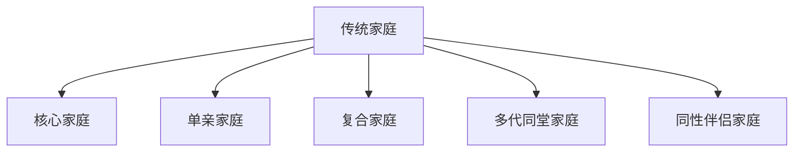

#### 1.2 工作与生活的平衡

随着职业竞争的加剧和现代生活节奏的加快，工作与生活的平衡成为家庭的一大挑战。家庭成员，尤其是女性，常常需要在工作和家庭责任之间寻求平衡，这可能导致压力增加和家庭关系紧张。

**核心概念与联系：**

- **家庭责任**：家庭成员在家庭内部分担责任，包括家务、照顾子女等。
- **工作压力**：职业压力可能影响家庭成员的情感状态和家庭互动。

**Mermaid 流程图：**

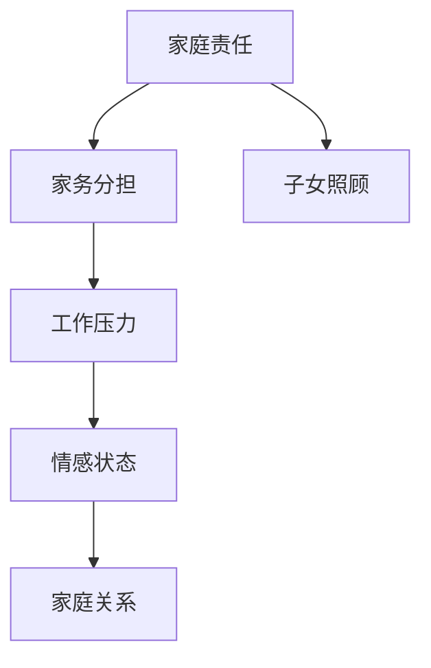

#### 1.3 子女教育的新问题

现代子女教育面临诸多新问题，如学业压力、电子产品依赖、社交技能的培养等。家长和教育者需要不断适应新的教育环境，寻找合适的教育方法，以促进子女的全面发展。

**核心概念与联系：**

- **学业压力**：学生在学业上面临的压力，可能影响其身心健康和学业表现。
- **电子产品依赖**：长时间使用电子产品可能导致注意力分散和社交技能下降。
- **社交技能**：现代子女需要培养良好的社交技能，以适应多元化的社会环境。

**Mermaid 流程图：**

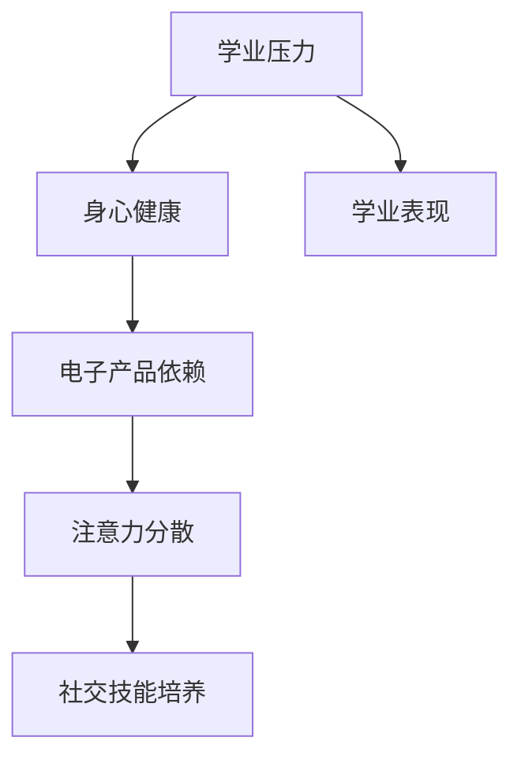

#### 1.4 家庭关系的复杂性

现代家庭关系的复杂性增加了家庭内部的沟通难度。家庭成员之间的价值观、生活方式、教育背景等因素可能导致观念上的差异和冲突，影响家庭关系的稳定性。

**核心概念与联系：**

- **家庭沟通**：家庭成员之间的有效沟通是维持家庭关系稳定的关键。
- **价值观差异**：不同家庭成员可能有不同的价值观和生活方式，这可能导致冲突。
- **关系稳定性**：家庭关系的稳定性受多种因素影响，包括沟通、信任和共同目标。

**Mermaid 流程图：**

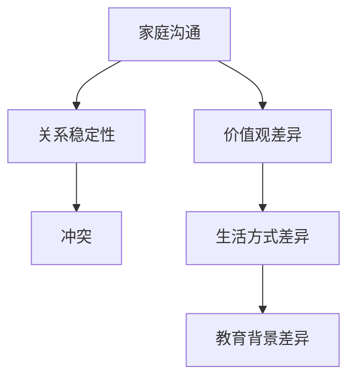

### 第2章：亲密关系的挑战

亲密关系是家庭的重要组成部分，但在现代社会中，亲密关系面临诸多挑战，包括情感疏离、沟通障碍、性别角色冲突和网络对亲密关系的影响。

#### 2.1 情感疏离

随着现代生活节奏的加快，家庭成员之间可能感到情感上的疏离。工作压力、个人兴趣和时间分配的不均可能导致家庭成员之间的情感联系减弱。

**核心概念与联系：**

- **情感疏离**：家庭成员之间缺乏情感交流和深度互动。
- **情感需求**：家庭成员需要满足彼此的情感需求，以维持亲密关系。

**Mermaid 流程图：**

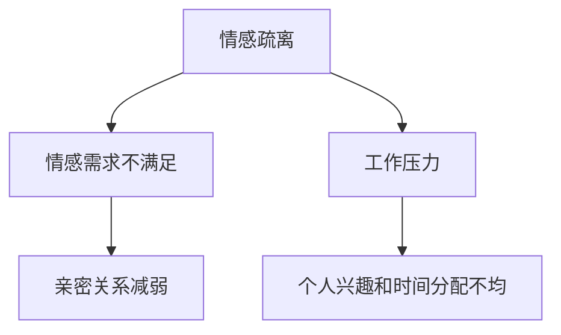

#### 2.2 沟通障碍

有效的沟通是亲密关系的重要基石。然而，现代家庭的沟通常常受到多种因素的影响，如沟通技巧不足、价值观差异、时间紧张等。

**核心概念与联系：**

- **沟通障碍**：家庭成员之间无法有效表达和倾听对方的意见和需求。
- **沟通技巧**：有效的沟通需要良好的倾听技巧、表达技巧和情绪管理能力。

**Mermaid 流程图：**

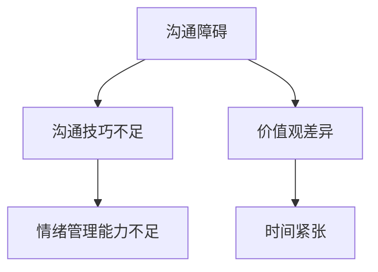

#### 2.3 性别角色的冲突

性别角色在社会中有着深远的影响，但在现代家庭中，传统性别角色与现代性别角色之间的冲突可能导致亲密关系紧张。

**核心概念与联系：**

- **传统性别角色**：传统上，男性负责经济支持，女性负责家务和育儿。
- **现代性别角色**：现代社会中，性别角色日益平等，但传统观念可能仍然存在。

**Mermaid 流程图：**

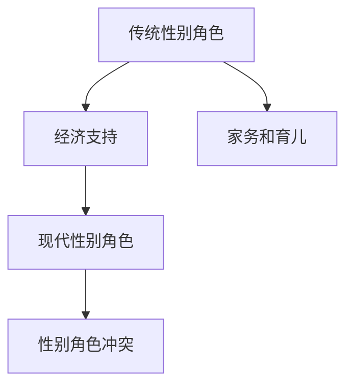

#### 2.4 网络对亲密关系的影响

随着互联网和社交媒体的普及，网络对亲密关系的影响不可忽视。网络可能成为沟通和互动的工具，也可能成为疏远和隔阂的媒介。

**核心概念与联系：**

- **网络依赖**：过度依赖网络可能导致现实生活中的亲密关系减弱。
- **网络沟通**：有效的网络沟通技巧对于维护亲密关系至关重要。

**Mermaid 流程图：**

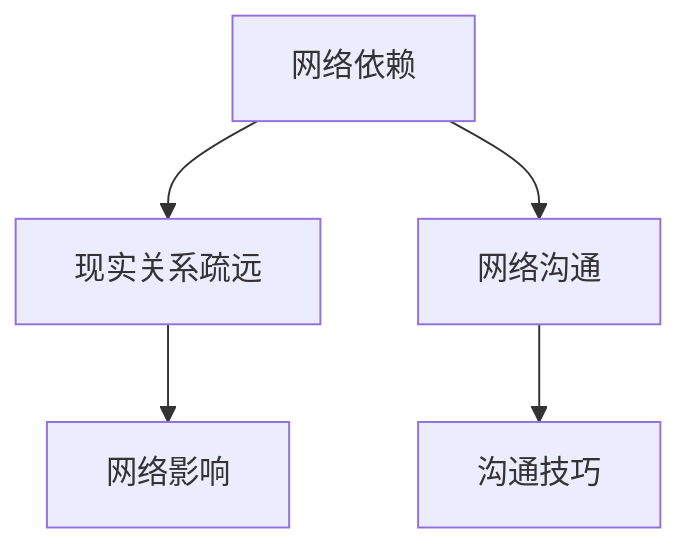

### 第3章：家庭暴力与亲密关系

家庭暴力是亲密关系中的一种极端形式，它不仅对受害者造成身心伤害，也会对整个家庭产生深远影响。

#### 3.1 家庭暴力的形式与影响

家庭暴力的形式多样，包括身体暴力、情感暴力、经济控制和性暴力等。这些暴力行为对家庭成员，特别是儿童，造成严重的心理创伤和社会问题。

**核心概念与联系：**

- **家庭暴力**：一种家庭成员之间的权力和控制行为，可能导致身体和心理伤害。
- **影响**：家庭暴力对家庭成员的情感健康、社会关系和子女成长产生负面影响。

**Mermaid 流程图：**

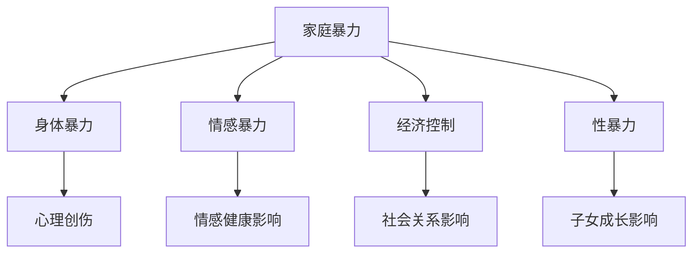

#### 3.2 家庭暴力的成因

家庭暴力的成因复杂多样，包括社会、经济、文化和个人因素。理解这些成因有助于预防家庭暴力，并为其提供有效的干预措施。

**核心概念与联系：**

- **社会因素**：社会压力、经济困难和社会不公可能导致家庭暴力。
- **经济因素**：经济依赖和资源争夺可能加剧家庭矛盾。
- **文化因素**：某些文化观念可能支持家庭暴力的存在。

**Mermaid 流程图：**

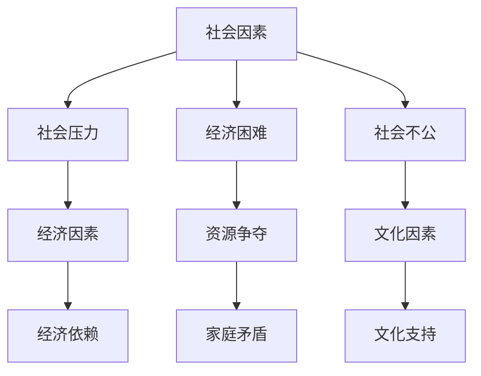

#### 3.3 应对家庭暴力的策略

应对家庭暴力需要综合性的策略，包括提高公众意识、加强法律法规、提供专业支持和干预服务。这些策略旨在保护受害者，预防和制止家庭暴力。

**核心概念与联系：**

- **公众意识**：通过教育和宣传活动提高公众对家庭暴力的认识和防范意识。
- **法律法规**：制定和执行严格的法律法规，确保家庭暴力行为受到法律制裁。
- **专业支持**：提供心理咨询、法律援助和紧急庇护等服务，支持家庭暴力的受害者。

**Mermaid 流程图：**

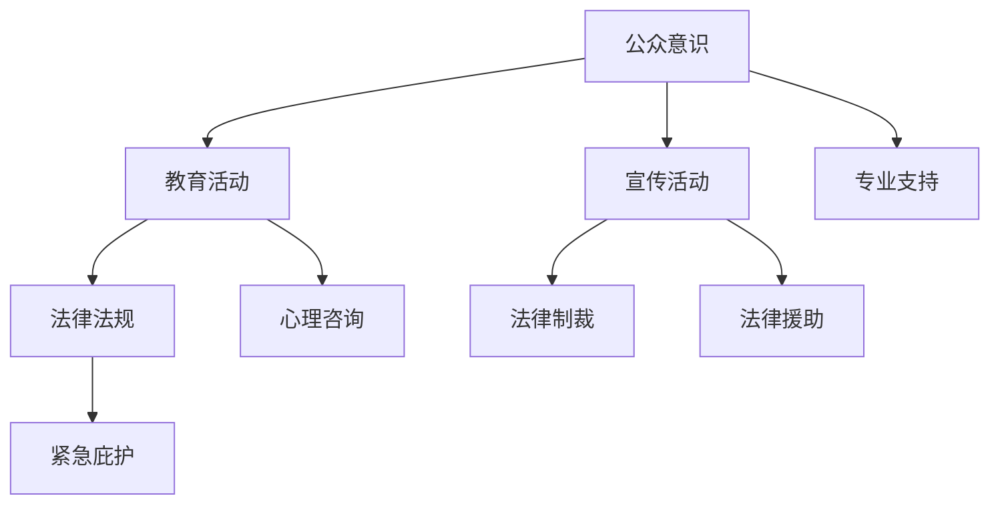

## 第二部分：重建亲密关系的原则与实践

### 第4章：重建亲密关系的核心原则

重建亲密关系需要遵循一系列核心原则，这些原则涵盖了尊重与理解、沟通与合作、信任与支持、勇于面对与解决问题等方面。

#### 4.1 尊重与理解

尊重和理解是亲密关系的基础。家庭成员应该尊重彼此的个人空间、意见和需求，并努力理解对方的感受和经历。

**核心概念与联系：**

- **尊重**：尊重对方的个性、选择和隐私。
- **理解**：努力理解对方的情感和需求，建立共鸣。

**Mermaid 流程图：**

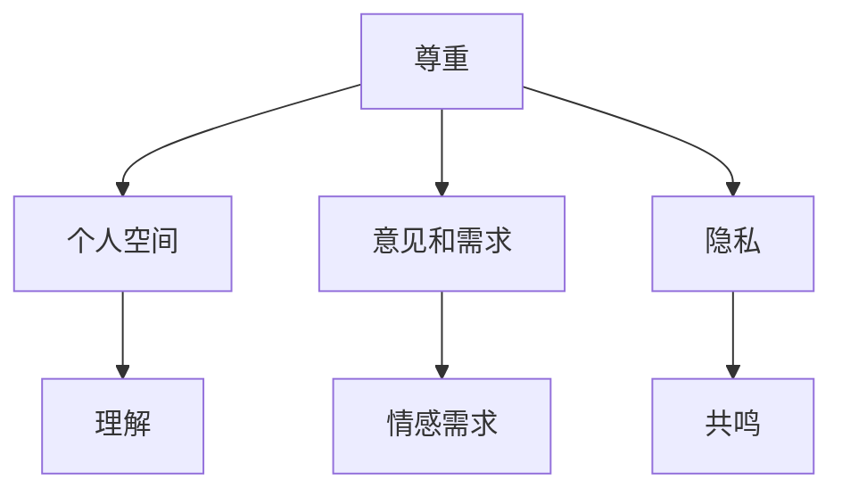

#### 4.2 沟通与合作

有效的沟通和合作是维持亲密关系的关键。家庭成员应该学会倾听、表达和解决冲突，共同面对生活中的挑战。

**核心概念与联系：**

- **沟通**：通过倾听和表达建立有效的沟通渠道。
- **合作**：共同努力解决问题，共同成长。

**Mermaid 流程图：**

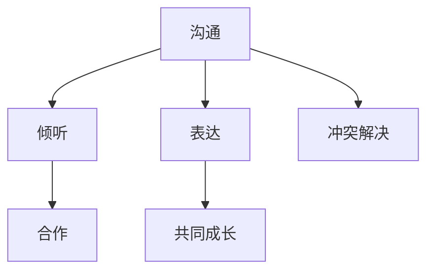

#### 4.3 信任与支持

信任和支持是亲密关系中的支柱。家庭成员之间应该建立信任，相互支持，共同面对生活中的困难和挑战。

**核心概念与联系：**

- **信任**：建立信任需要时间和努力，通过言行一致和诚实来维系。
- **支持**：在对方需要时提供帮助和鼓励，共同克服困难。

**Mermaid 流程图：**

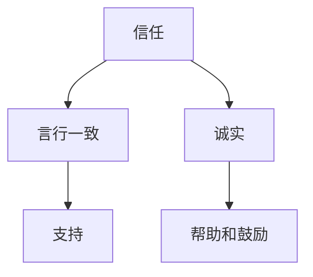

#### 4.4 勇于面对与解决问题

面对问题和挑战是家庭生活中不可避免的一部分。家庭成员应该勇于面对问题，共同寻找解决方案，而不是回避或逃避。

**核心概念与联系：**

- **面对问题**：勇于承认问题和挑战，不回避。
- **解决问题**：通过合作和沟通找到有效的解决方案。

**Mermaid 流程图：**

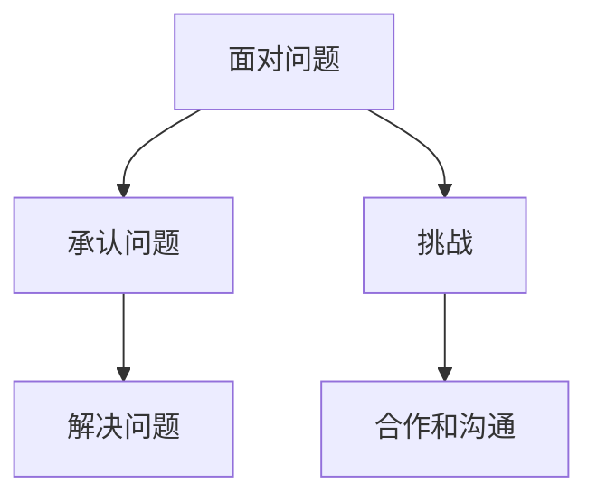

### 第5章：有效的沟通技巧

有效的沟通技巧是重建亲密关系的核心。通过积极倾听、非暴力沟通和处理冲突的技巧，家庭成员可以增强理解和信任，改善亲密关系。

#### 5.1 沟通的重要性

沟通是家庭互动的基础，它影响家庭成员的情感状态和关系质量。有效的沟通有助于解决误解、减少冲突，并促进彼此的理解和共鸣。

**核心概念与联系：**

- **沟通**：家庭互动的重要方式，影响情感状态和关系质量。
- **重要性**：有效沟通有助于解决误解、减少冲突。

**Mermaid 流程图：**

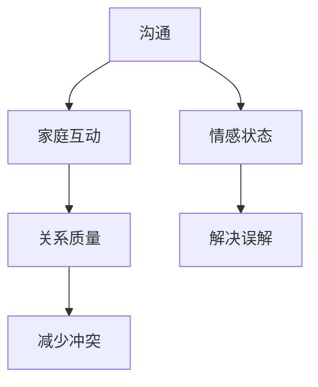

#### 5.2 积极倾听

积极倾听是一种有效的沟通技巧，它要求倾听者全神贯注地听对方说话，理解对方的感受和需求，并给予反馈。通过积极倾听，家庭成员可以增进理解和信任。

**核心概念与联系：**

- **积极倾听**：全神贯注地听对方说话，理解对方感受和需求。
- **增进理解**：通过倾听增进对对方的理解，建立信任。

**Mermaid 流程图：**

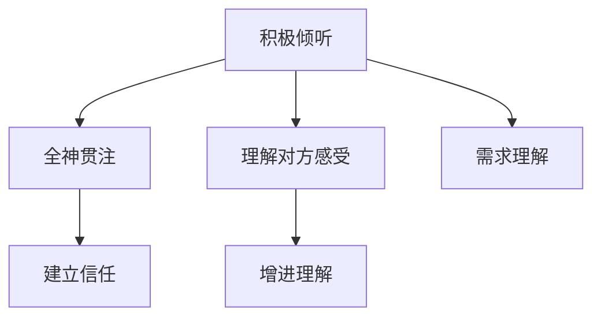

#### 5.3 非暴力沟通

非暴力沟通（NVC）是一种以同情和尊重为基础的沟通方式。它强调倾听他人的需求和感受，并以同理心回应。通过非暴力沟通，家庭成员可以减少冲突，增进亲密关系。

**核心概念与联系：**

- **非暴力沟通**：以同情和尊重为基础的沟通方式。
- **减少冲突**：通过同理心和理解减少冲突。

**Mermaid 流程图：**

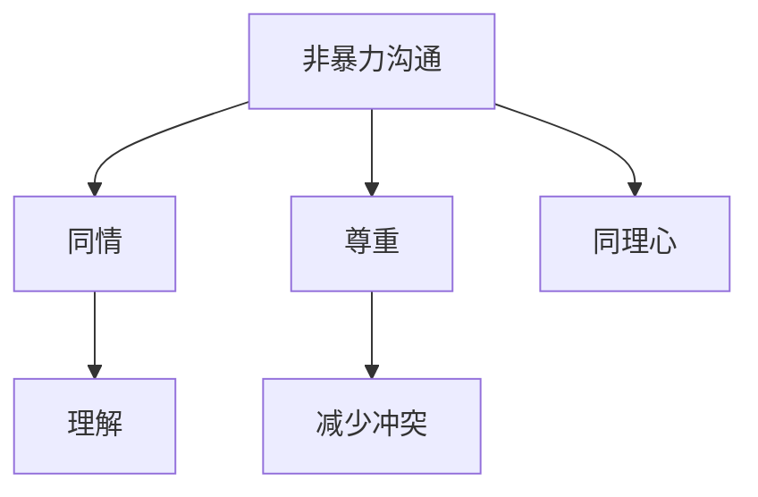

#### 5.4 处理冲突的技巧

冲突在家庭生活中是不可避免的，但有效的处理技巧可以帮助家庭成员解决冲突，避免关系的破裂。处理冲突的技巧包括冷静处理、倾听对方意见和寻找共同点。

**核心概念与联系：**

- **处理冲突**：通过冷静处理、倾听对方意见和寻找共同点解决冲突。
- **冷静处理**：保持冷静，避免情绪化。
- **倾听对方意见**：认真倾听对方的意见和感受。
- **寻找共同点**：寻找双方都能接受的解决方案。

**Mermaid 流程图：**

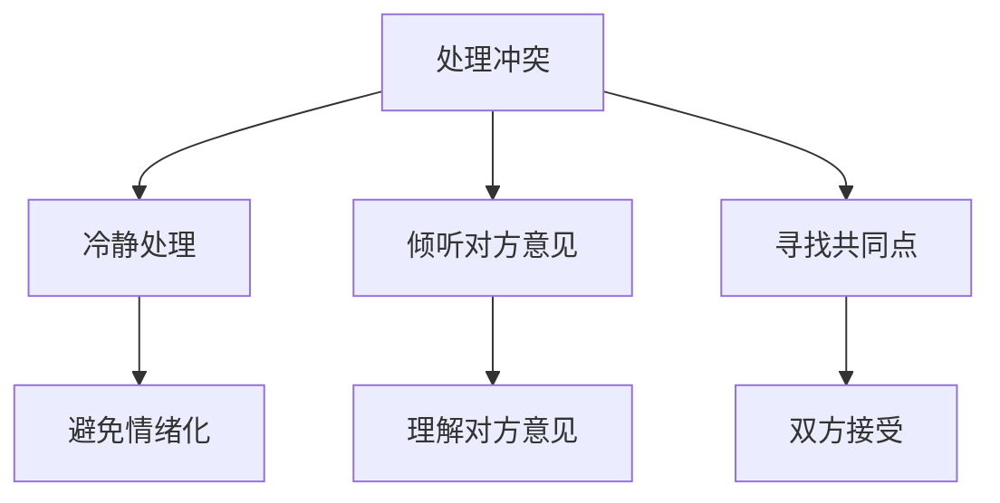

### 第6章：情感管理与调适

情感管理与调适是维护亲密关系的重要组成部分。通过情感管理、压力调适、情绪管理和自我关爱，家庭成员可以提高情感智商，增强亲密关系的稳定性。

#### 6.1 情感管理的重要性

情感管理是指家庭成员对自身情感的认知和调节能力。情感管理的重要性在于它有助于减少冲突、增强家庭关系的稳定性和幸福感。

**核心概念与联系：**

- **情感管理**：对自身情感的认知和调节能力。
- **重要性**：减少冲突、增强家庭关系的稳定性和幸福感。

**Mermaid 流程图：**

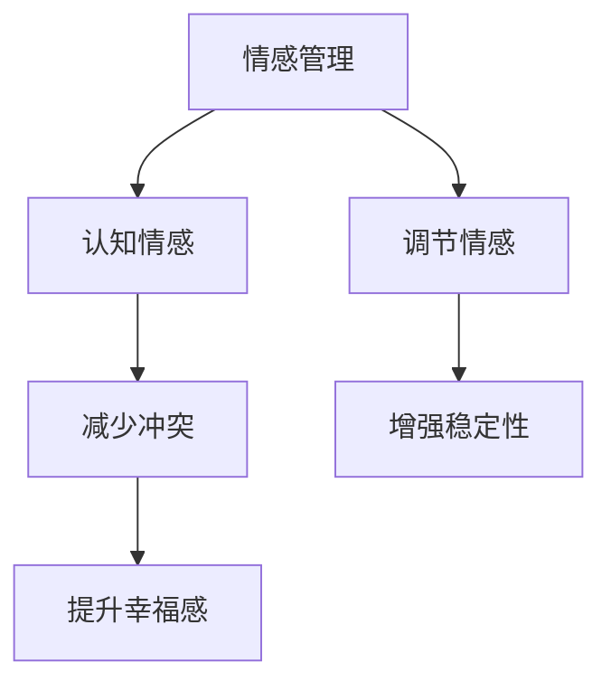

#### 6.2 压力调适方法

现代家庭生活中，压力在所难免。有效的压力调适方法包括运动、冥想、社交和支持系统等。通过这些方法，家庭成员可以减轻压力，提高生活质量。

**核心概念与联系：**

- **压力调适**：减轻压力，提高生活质量。
- **方法**：运动、冥想、社交和支持系统。

**Mermaid 流程图：**

```mermaid
graph TB
    A[压力调适] --> B[减轻压力]
    A --> C[提高生活质量]
    B --> D[运动]
    B --> E[冥想]
    B --> F[社交]
    B --> G[支持系统]
```

#### 6.3 情绪管理与自我关爱

情绪管理是指家庭成员对自身情绪的认识和调节能力。自我关爱是通过自我接纳、自我滋养和自我成长来维护心理健康。有效的情绪管理和自我关爱有助于增强家庭成员的情感智商，提高亲密关系的质量。

**核心概念与联系：**

- **情绪管理**：认识和管理自身情绪。
- **自我关爱**：通过自我接纳、自我滋养和自我成长维护心理健康。

**Mermaid 流程图：**

```mermaid
graph TB
    A[情绪管理] --> B[认识情绪]
    A --> C[调节情绪]
    B --> D[心理健康]
    A --> E[自我关爱]
    E --> F[自我接纳]
    E --> G[自我滋养]
    E --> H[自我成长]
```

#### 6.4 家庭情感教育

家庭情感教育是家庭成员共同学习和成长的过程，通过家庭情感教育，家庭成员可以增强情感智商，提高亲密关系的质量。

**核心概念与联系：**

- **家庭情感教育**：家庭成员共同学习和成长的过程。
- **目标**：增强情感智商，提高亲密关系质量。

**Mermaid 流程图：**

```mermaid
graph TB
    A[家庭情感教育] --> B[共同学习]
    A --> C[情感智商增强]
    A --> D[亲密关系质量提升]
    B --> E[情感培养]
    C --> F[情感认知]
    D --> G[情感调节]
```

### 第7章：性别角色与亲密关系

性别角色在家庭中具有重要影响，传统性别角色与现代性别角色之间的冲突可能对亲密关系产生负面影响。通过理解性别角色的变迁，家庭成员可以更好地平衡性别角色，促进亲密关系的健康发展。

#### 7.1 传统性别角色与现代性别角色

传统性别角色强调男性和女性的特定角色和责任，如男性负责经济支持，女性负责家务和育儿。然而，随着社会的发展和性别平等观念的普及，现代性别角色日益平等，男性和女性在家庭中的角色和责任更加灵活。

**核心概念与联系：**

- **传统性别角色**：明确的性别分工和责任。
- **现代性别角色**：性别平等，灵活的角色和责任。

**Mermaid 流程图：**

```mermaid
graph TB
    A[传统性别角色] --> B[性别分工]
    A --> C[特定责任]
    B --> D[现代性别角色]
    D --> E[性别平等]
    D --> F[灵活角色]
```

#### 7.2 性别角色的冲突与解决

性别角色的冲突可能导致家庭关系紧张和亲密关系受损。解决这些冲突需要家庭成员之间的沟通、理解和妥协。以下是一些解决性别角色冲突的策略：

- **沟通与理解**：通过开放和诚实的沟通，理解对方的观点和需求。
- **共享责任**：共同分担家庭责任，实现性别角色的平衡。
- **妥协与尊重**：在冲突中寻找共同点，尊重对方的意见和选择。

**核心概念与联系：**

- **冲突**：性别角色差异导致的矛盾和紧张。
- **解决策略**：沟通、理解、共享责任和妥协。

**Mermaid 流程图：**

```mermaid
graph TB
    A[冲突] --> B[沟通]
    A --> C[理解]
    A --> D[共享责任]
    A --> E[妥协]
    B --> F[尊重]
```

#### 7.3 男性在亲密关系中的角色

在现代社会中，男性在亲密关系中的角色正在发生变化。男性不再仅仅是经济支持者，而是积极参与家庭事务，与伴侣共同承担家庭责任。

**核心概念与联系：**

- **角色变化**：从经济支持者到参与家庭事务的伙伴。
- **责任分担**：与伴侣共同承担家庭责任。

**Mermaid 流程图：**

```mermaid
graph TB
    A[角色变化] --> B[经济支持者]
    A --> C[家庭事务参与]
    B --> D[伙伴关系]
    C --> E[责任分担]
```

#### 7.4 女性在亲密关系中的角色

女性在亲密关系中的角色也在不断演变。现代女性在追求职业发展的同时，也在家庭中发挥积极作用。女性需要平衡工作与家庭责任，并在亲密关系中寻求平等和支持。

**核心概念与联系：**

- **角色变化**：从家庭主妇到工作与家庭的平衡者。
- **平等支持**：在亲密关系中寻求平等和支持。

**Mermaid 流�程图：**

```mermaid
graph TB
    A[角色变化] --> B[家庭主妇]
    A --> C[工作与家庭平衡]
    B --> D[平等支持]
    C --> E[亲密关系平衡]
```

### 第8章：网络时代的亲密关系

随着互联网和社交媒体的普及，网络对亲密关系产生了深远影响。网络可能成为沟通和互动的工具，但也可能导致疏远和隔阂。如何在网络时代维护亲密关系是一个重要的课题。

#### 8.1 网络对亲密关系的影响

网络对亲密关系的影响是双重的。一方面，网络提供了新的沟通方式，使家庭成员可以更方便地保持联系。另一方面，过度依赖网络可能导致现实生活中的亲密关系减弱，甚至产生隔阂。

**核心概念与联系：**

- **积极影响**：方便的沟通、信息共享和情感表达。
- **消极影响**：网络依赖、疏远和隔阂。

**Mermaid 流程图：**

```mermaid
graph TB
    A[积极影响] --> B[方便沟通]
    A --> C[信息共享]
    A --> D[情感表达]
    B --> E[网络依赖]
    C --> F[疏远]
    D --> G[隔阂]
```

#### 8.2 网络使用与亲密关系的平衡

为了在网络时代维护亲密关系，家庭成员需要找到网络使用与亲密关系的平衡点。以下是一些策略：

- **共同规定**：制定家庭网络使用规定，确保合理使用网络资源。
- **时间管理**：合理安排网络使用时间，避免过度依赖。
- **面对面互动**：尽可能增加面对面互动的时间，增强现实关系。

**核心概念与联系：**

- **网络使用**：合理安排网络时间，避免过度依赖。
- **亲密关系**：增强面对面互动，维持现实关系。

**Mermaid 流程图：**

```mermaid
graph TB
    A[网络使用] --> B[合理时间安排]
    A --> C[避免过度依赖]
    B --> D[面对面互动]
    C --> E[现实关系增强]
```

#### 8.3 网络依赖与亲密关系的危机

网络依赖可能导致亲密关系的危机，表现为家庭成员之间的情感疏离、沟通障碍和时间分配不均。为了应对这些危机，家庭成员需要采取以下措施：

- **情感关注**：关注家庭成员的情感需求，提供支持和理解。
- **沟通技巧**：提高沟通技巧，改善家庭互动。
- **共同活动**：安排家庭共同活动，减少网络使用时间。

**核心概念与联系：**

- **网络依赖**：导致情感疏离、沟通障碍和时间分配不均。
- **应对策略**：情感关注、沟通技巧和共同活动。

**Mermaid 流程图：**

```mermaid
graph TB
    A[网络依赖] --> B[情感疏离]
    A --> C[沟通障碍]
    A --> D[时间分配不均]
    B --> E[情感关注]
    C --> F[沟通技巧]
    D --> G[共同活动]
```

#### 8.4 网络时代的亲密关系维护

在网络时代，维护亲密关系需要家庭成员共同努力。以下是一些建议：

- **开放沟通**：保持开放和诚实的沟通，分享彼此的感受和想法。
- **共度时光**：安排共度时光，共同参与活动和兴趣。
- **情感支持**：在对方需要时提供情感支持和理解。

**核心概念与联系：**

- **开放沟通**：分享感受和想法，增进理解。
- **共度时光**：共同参与活动，增强关系。
- **情感支持**：提供支持和理解，增进信任。

**Mermaid 流程图：**

```mermaid
graph TB
    A[开放沟通] --> B[分享感受]
    A --> C[共度时光]
    A --> D[情感支持]
    B --> E[增进理解]
    C --> F[增强关系]
    D --> G[增进信任]
```

### 第9章：成功案例解析

通过解析成功案例，我们可以了解如何在不同情境下重建亲密关系，为其他家庭提供借鉴和启示。

#### 9.1 案例一：一个离婚家庭的重建

一个经历了离婚的家庭，通过积极沟通、共同活动和情感支持，成功地重建了亲密关系。家庭成员学会了如何面对过去的伤痛，共同规划未来，并建立了更加坚实的家庭关系。

**核心概念与联系：**

- **积极沟通**：通过开放和诚实的沟通，解决家庭问题。
- **共同活动**：共同参与活动和兴趣，增强家庭凝聚力。
- **情感支持**：在对方需要时提供情感支持和理解。

**Mermaid 流程图：**

```mermaid
graph TB
    A[积极沟通] --> B[解决家庭问题]
    A --> C[共同活动]
    A --> D[情感支持]
    B --> E[重建关系]
    C --> F[增强凝聚力]
    D --> G[建立信任]
```

#### 9.2 案例二：从冷漠到热情的夫妻关系

一个原本冷漠的夫妻关系，通过非暴力沟通和情感管理，转变为充满热情和亲密的关系。夫妻双方学会了倾听对方的需求，表达真实的感受，并共同努力解决冲突，最终实现了关系的改善。

**核心概念与联系：**

- **非暴力沟通**：以同情和尊重为基础的沟通方式。
- **情感管理**：通过情感管理，减少冲突，增强亲密关系。

**Mermaid 流程图：**

```mermaid
graph TB
    A[非暴力沟通] --> B[同情]
    A --> C[尊重]
    A --> D[减少冲突]
    B --> E[增强亲密关系]
    C --> F[建立共鸣]
```

#### 9.3 案例三：解决子女教育冲突的秘诀

在一个家庭中，子女教育问题导致了夫妻之间的冲突。通过家庭会议和共同决策，家庭成员学会了如何解决教育冲突，共同制定教育计划，最终实现了家庭内部的和谐与稳定。

**核心概念与联系：**

- **家庭会议**：通过家庭会议，共同讨论和决策家庭事务。
- **共同决策**：家庭成员共同参与子女教育决策，增强家庭凝聚力。

**Mermaid 流�程图：**

```mermaid
graph TB
    A[家庭会议] --> B[共同讨论]
    A --> C[共同决策]
    B --> D[解决冲突]
    C --> E[增强凝聚力]
```

### 第10章：专家建议与指导

专家的建议和指导对于重建亲密关系具有重要的指导意义。以下是一些专家的建议：

#### 10.1 心理专家的建议

心理专家建议，重建亲密关系需要家庭成员共同努力，建立良好的沟通渠道，增强情感支持，并寻求专业的心理咨询。

- **建立良好的沟通渠道**：通过开放和诚实的沟通，解决家庭问题。
- **增强情感支持**：在对方需要时提供情感支持和理解。
- **寻求专业的心理咨询**：在遇到困难时，寻求专业的心理咨询，以获得更有效的解决方案。

**Mermaid 流程图：**

```mermaid
graph TB
    A[建立良好的沟通渠道] --> B[解决家庭问题]
    A --> C[增强情感支持]
    A --> D[寻求专业的心理咨询]
    B --> E[重建关系]
    C --> F[增进理解]
    D --> G[获得有效解决方案]
```

#### 10.2 家庭治疗师的指导

家庭治疗师建议，家庭治疗是一种有效的重建亲密关系的方法。通过家庭治疗，家庭成员可以学会如何沟通、解决问题和增强情感联系。

- **家庭治疗**：通过家庭治疗，家庭成员可以学会有效的沟通和解决问题的技巧。
- **情感联系**：家庭治疗有助于增强家庭成员之间的情感联系。

**Mermaid 流程图：**

```mermaid
graph TB
    A[家庭治疗] --> B[学习沟通技巧]
    A --> C[解决问题]
    A --> D[增强情感联系]
    B --> E[有效解决问题]
    C --> F[增进理解]
    D --> G[重建关系]
```

#### 10.3 家庭教育专家的建议

家庭教育专家建议，家长应该积极参与子女教育，建立良好的家庭氛围，并通过家庭教育和沟通技巧，促进家庭成员之间的和谐关系。

- **积极参与子女教育**：家长应该积极参与子女的教育过程，了解子女的需求和成长。
- **建立良好的家庭氛围**：通过营造和谐的家庭氛围，增强家庭成员之间的情感联系。
- **家庭教育和沟通技巧**：通过家庭教育和沟通技巧，提高家庭成员的情感智商，促进家庭和谐。

**Mermaid 流程图：**

```mermaid
graph TB
    A[积极参与子女教育] --> B[了解子女需求]
    A --> C[建立良好氛围]
    A --> D[家庭教育和沟通技巧]
    B --> E[促进成长]
    C --> F[增强情感联系]
    D --> G[提高情感智商]
```

### 第11章：自我测试与评估

为了更好地了解自己在亲密关系中的表现，家庭成员可以采用以下自我测试和评估方法：

#### 11.1 亲密关系自测

通过以下问题，评估自己在亲密关系中的表现：

- 你是否经常感到与伴侣的情感疏离？
- 你是否能够有效地与伴侣沟通，解决冲突？
- 你是否在伴侣需要时提供情感支持和理解？
- 你是否积极参与家庭事务，与伴侣共同承担责任？

**Mermaid 流程图：**

```mermaid
graph TB
    A[情感疏离] --> B[沟通能力]
    A --> C[情感支持]
    A --> D[参与事务]
    B --> E[冲突解决]
    C --> F[责任承担]
```

#### 11.2 沟通能力评估

通过以下问题，评估自己在沟通能力方面的表现：

- 你是否能够积极倾听伴侣的意见和需求？
- 你是否能够清晰、准确地表达自己的感受和想法？
- 你是否在沟通中避免指责和攻击性的语言？
- 你是否能够在沟通中找到共同点，解决问题？

**Mermaid 流程图：**

```mermaid
graph TB
    A[积极倾听] --> B[清晰表达]
    A --> C[避免指责]
    A --> D[找到共同点]
    B --> E[理解对方]
    C --> F[减少冲突]
    D --> G[解决问题]
```

#### 11.3 情感管理能力评估

通过以下问题，评估自己在情感管理能力方面的表现：

- 你是否能够有效地管理自己的情绪，避免情绪化？
- 你是否能够在冲突中保持冷静，理性解决问题？
- 你是否能够在需要时提供情感支持和安慰？
- 你是否能够理解和尊重伴侣的情感需求？

**Mermaid 流程图：**

```mermaid
graph TB
    A[情绪管理] --> B[冷静处理]
    A --> C[提供支持]
    A --> D[理解需求]
    B --> E[减少冲突]
    C --> F[增强信任]
    D --> G[建立共鸣]
```

### 附录

#### 附录A：参考文献

- 亲密关系心理学（2019），作者：约翰·戈特曼
- 现代家庭研究（2020），作者：玛丽安娜·怀特
- 家庭暴力预防与干预（2018），作者：苏珊·福赛思
- 社交媒体与家庭关系（2021），作者：托马斯·理查德森

#### 附录B：推荐阅读

- 《爱的五种语言》（2015），作者：盖瑞·查普曼
- 《家庭系统治疗》（2017），作者：米歇尔·诺沃
- 《沟通的艺术》（2016），作者：罗纳德·B·齐默尔

#### 附录C：实用资源

- 家庭关系指南：[https://www.familyrelationguides.com/](https://www.familyrelationguides.com/)
- 情感管理课程：[https://www.emotionalwellnesscourses.com/](https://www.emotionalwellnesscourses.com/)
- 家庭暴力热线：[https://www.familyviolencehelpline.org/](https://www.familyviolencehelpline.org/)

### 总结与展望

本文深入探讨了现代家庭所面临的挑战，以及如何重建亲密关系。通过分析家庭结构的多样化、工作与生活的平衡、子女教育的新问题、家庭关系的复杂性，以及亲密关系中的情感疏离、沟通障碍、性别角色冲突和网络影响，我们提出了重建亲密关系的核心原则和具体实践方法。同时，通过实际案例和专家建议，为家庭提供了具体的指导。展望未来，家庭作为社会的基本单元，需要不断适应社会变化，寻找新的平衡点，以维护亲密关系的稳定和发展。我们鼓励读者在日常生活中实践这些原则和方法，为建设和谐的家庭关系做出努力。作者：AI天才研究院/AI Genius Institute & 禅与计算机程序设计艺术 /Zen And The Art of Computer Programming。

