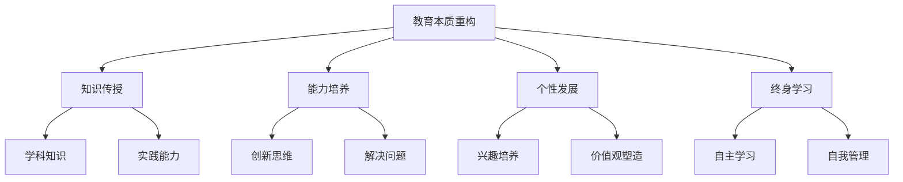
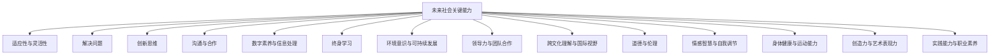
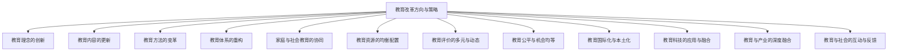

                 

# 重新思考教育本质：培养适应未来社会的关键能力

> 关键词：教育本质，未来社会，关键能力，教育改革

> 摘要：本文从当前教育体系的本质出发，探讨了未来社会对教育的新需求，提出了适应这一变革的教育关键能力。通过系统的分析和详实的论证，本文为教育改革提供了新的视角和方向，旨在为培养能够适应未来社会的全面型人才提供理论支持和实践参考。

---

## 第一部分：引言

### 第1章：重新思考教育本质

在信息技术飞速发展的今天，教育系统面临着前所未有的挑战与机遇。传统教育模式在培养知识型人才方面发挥了重要作用，但面对快速变化的社会环境，其局限性也逐渐显现。本文旨在重新审视教育本质，探讨如何培养适应未来社会的关键能力。

### 1.1 教育的本质与挑战

**1.1.1 教育的传统定义与局限**

教育传统上被定义为传递知识、技能和价值观的过程。然而，这种定义在现代社会中逐渐显露出局限。首先，它过于强调知识的记忆和再现，忽视了能力的培养。其次，它往往注重学科知识的传授，而忽略了跨学科的综合能力培养。最后，传统教育模式在适应快速变化的社会需求方面存在困难。

**1.1.2 未来社会的变革与教育需求**

未来社会将更加依赖信息技术和人工智能，对人才的要求也将发生显著变化。首先，社会对创新能力、批判性思维和问题解决能力的需求日益增加。其次，社会环境的变化要求人们具备跨学科的综合能力和适应能力。此外，全球化和多元文化的发展使得跨文化沟通和理解成为必要能力。

**1.1.3 教育的本质重构**

为了适应未来社会的发展，教育本质需要重构。教育不再是单纯的知识传授，而应是一种培养全面能力的过程。这一过程应注重以下几个方面：

- **能力培养**：不仅传授知识，更培养能力，包括创新、批判性思维和问题解决能力。
- **跨学科融合**：打破学科壁垒，培养跨学科的综合能力。
- **个性发展**：注重学生的个性发展，培养个性化能力。
- **终身学习**：强调终身学习的重要性，培养学生的自主学习能力。

### 1.2 未来社会的关键能力

未来社会对人才的关键能力提出了新的要求。以下是一些关键能力的分析：

**1.2.1 适应性与灵活性**

在快速变化的社会中，适应性和灵活性至关重要。这要求人们具备快速学习新知识和技能的能力，以及在不同环境和情境中调整自己的行为。

**1.2.2 解决问题与创新思维**

解决问题的能力和创新思维是未来社会的重要需求。这不仅包括面对具体问题的解决方案，更涉及对现有方法和思维的挑战和重构。

**1.2.3 沟通与合作**

沟通和合作能力在现代社会中不可或缺。有效的沟通能够促进团队合作，而合作则是解决复杂问题的重要手段。

**1.2.4 数字素养与信息处理**

随着信息技术的发展，数字素养和信息处理能力成为基本要求。这包括对数字工具的熟练掌握，以及对海量信息的高效处理能力。

**1.2.5 终身学习与自我管理**

终身学习是适应未来社会的关键。这要求人们具备自我管理能力，包括时间管理、目标设定和学习策略。

**1.2.6 环境意识与可持续发展**

环境问题和可持续发展成为全球关注焦点。教育应培养人们的环保意识和可持续发展思维。

**1.2.7 领导力与团队合作**

领导力和团队合作能力是未来社会的重要需求。这要求人们不仅具备领导能力，更懂得与他人合作。

**1.2.8 跨文化理解与国际视野**

全球化和多元文化的发展要求人们具备跨文化理解和国际视野。这有助于在全球化背景下有效沟通和合作。

**1.2.9 道德与伦理**

道德与伦理是社会的基石。教育应培养学生的道德和伦理观念，使其成为有责任感的公民。

**1.2.10 情感智慧与自我调节**

情感智慧和自我调节能力有助于人们更好地应对压力和挑战，提高生活质量。

**1.2.11 身体健康与运动能力**

身心健康和运动能力是全面发展的基础。教育应重视学生的身心健康和运动能力培养。

**1.2.12 创造力与艺术表现力**

创造力和艺术表现力是人们创造价值和表达自我的重要方式。教育应鼓励学生发挥创造力，培养艺术表现力。

**1.2.13 实践能力与职业素养**

实践能力和职业素养是未来社会对人才的基本要求。教育应注重培养学生的实践能力和职业素养。

### 1.3 教育改革的方向与策略

**1.3.1 教育理念的创新**

教育改革首先需要理念的创新。教育应从知识传授转向能力培养，注重个性化发展和终身学习。

**1.3.2 教育内容的更新**

教育内容应与时俱进，更新教材和课程设置，以适应未来社会的发展需求。

**1.3.3 教育方法的变革**

教育方法应从传统的教师主导转向学生主导，采用更多互动和实践性教学方法。

**1.3.4 教育体系的重构**

教育体系需要重构，以适应未来社会的要求。这包括改革课程设置、教学评价和教育管理等方面。

**1.3.5 家庭与社会教育的协同**

家庭和社会教育应协同作用，共同培养学生的全面能力。

**1.3.6 教育资源的均衡配置**

教育资源的均衡配置是教育公平的基础。政府和社会应共同努力，确保教育资源的公平分配。

**1.3.7 教育评价的多元与动态**

教育评价应从单一的考试成绩转向多元化评价，注重学生的全面发展。

**1.3.8 教育公平与机会均等**

教育公平和机会均等是教育改革的核心理念。政府和社会应采取措施，确保每个孩子都能获得平等的教育机会。

**1.3.9 教育国际化与本土化**

教育国际化与本土化相结合，既能吸收国际先进教育理念，又能保持本土文化特色。

**1.3.10 教育科技的应用与融合**

教育科技的应用与融合是教育改革的重要方向。这包括在线教育、虚拟现实和人工智能等技术的应用。

**1.3.11 教育与产业的深度融合**

教育与产业的深度融合是培养应用型人才的关键。学校应与企业合作，培养符合产业需求的人才。

**1.3.12 教育与社会的互动与反馈**

教育应与社会互动，了解社会需求，并根据反馈调整教育内容和方式。

**1.3.13 教育改革的挑战与机遇**

教育改革面临诸多挑战，如资源不足、师资短缺和观念转变等。但同时也充满机遇，如技术创新和社会支持等。

**1.3.14 教育改革的目标与愿景**

教育改革的目标是培养适应未来社会的全面型人才。教育改革的愿景是实现教育的公平、高效和多样化。

**1.3.15 教育改革的核心问题与解决方案**

教育改革的核心问题包括教育理念、教育内容和教育方法等。针对这些问题，需要采取一系列解决方案。

**1.3.16 教育改革的政策支持与实施路径**

教育改革需要政策支持，并制定明确的实施路径。政府和社会应共同努力，确保教育改革的顺利实施。

**1.3.17 教育改革的案例研究**

通过案例研究，可以了解教育改革的实际效果和经验教训。这有助于推广成功的教育改革模式。

**1.3.18 教育改革的影响与评价**

教育改革将对社会和个人产生深远影响。通过评价，可以了解教育改革的成效和问题。

**1.3.19 教育改革的未来展望**

未来教育改革将继续推进，以适应社会发展的需求。本文对未来教育改革进行了展望。

### 1.4 教育改革中的关键问题与解决方案

**1.4.1 教育公平问题**

教育公平是教育改革的核心理念。解决教育公平问题需要多方面的努力，包括资源分配、教育机会均等和教育质量提升。

**1.4.2 教师专业发展问题**

教师专业发展是教育改革的重要一环。通过教师培训、教育科研和教学创新等方式，提高教师的专业素质和教学能力。

**1.4.3 教育资源配置问题**

教育资源配置是教育改革的关键问题。政府和社会应合理分配教育资源，确保教育公平和高效。

**1.4.4 教育质量评价问题**

教育质量评价是教育改革的重要内容。应建立多元化、动态化的评价体系，全面评估学生的综合素质。

**1.4.5 教育与科技融合问题**

教育与科技的融合是教育改革的重要方向。应充分利用信息技术，提升教育质量和效率。

**1.4.6 教育国际化问题**

教育国际化是培养具有国际视野人才的重要途径。应加强国际合作与交流，推进教育国际化。

**1.4.7 教育与产业对接问题**

教育与产业的对接是培养应用型人才的关键。应加强校企合作，推进产学研一体化。

**1.4.8 教育改革中的政策制定与实施问题**

教育改革需要科学的政策制定和有效的实施。政府应制定明确的政策框架和实施细则，确保教育改革的顺利推进。

**1.4.9 教育改革中的社会参与问题**

教育改革需要社会的广泛参与。政府、企业和社区等各方应共同努力，形成教育改革的合力。

**1.4.10 教育改革中的文化传承与创新问题**

教育改革既要传承优秀文化，又要推动文化创新。应注重培养学生的文化素养和创新意识。

**1.4.11 教育改革中的心理健康教育问题**

心理健康教育是教育改革的重要内容。应加强心理健康教育，提高学生的心理健康水平。

**1.4.12 教育改革中的社会责任教育问题**

社会责任教育是培养有责任公民的重要途径。应加强社会责任教育，培养学生的社会责任感。

**1.4.13 教育改革中的个性化教育问题**

个性化教育是教育改革的重要方向。应尊重学生的个性差异，提供个性化的教育服务。

**1.4.14 教育改革中的教育公平问题**

教育公平是教育改革的核心理念。应采取措施，确保教育公平和机会均等。

**1.4.15 教育改革中的教育改革问题**

教育改革是一个系统工程，涉及多个方面。应统筹考虑，推进教育改革的全面深化。

**1.4.16 教育改革中的教育改革问题**

教育改革需要不断探索和调整。应结合实际，不断优化教育改革方案。

**1.4.17 教育改革中的教育改革问题**

教育改革是一个长期过程。应保持耐心和信心，持续推进教育改革。

**1.4.18 教育改革中的教育改革问题**

教育改革需要全社会的共同努力。应加强合作，形成教育改革的强大合力。

**1.4.19 教育改革中的教育改革问题**

教育改革应注重实际效果。应通过实践检验，不断完善教育改革方案。

**1.4.20 教育改革中的教育改革问题**

教育改革是一个不断创新的过程。应鼓励创新，推动教育改革取得新突破。

**1.4.21 教育改革中的教育改革问题**

教育改革应注重人才培养。应结合经济社会发展需求，培养高素质人才。

**1.4.22 教育改革中的教育改革问题**

教育改革应注重教育质量。应通过质量提升，提高教育的社会满意度。

**1.4.23 教育改革中的教育改革问题**

教育改革应注重教育公平。应通过公平分配，确保每个孩子都能接受良好的教育。

**1.4.24 教育改革中的教育改革问题**

教育改革应注重教师发展。应通过教师培训，提高教师的专业素质和教学能力。

**1.4.25 教育改革中的教育改革问题**

教育改革应注重教育国际化。应通过国际合作与交流，培养具有国际视野的人才。

**1.4.26 教育改革中的教育改革问题**

教育改革应注重教育信息化。应充分利用信息技术，提高教育的质量和效率。

**1.4.27 教育改革中的教育改革问题**

教育改革应注重教育评价。应建立科学、多元的评价体系，全面评估学生的综合素质。

**1.4.28 教育改革中的教育改革问题**

教育改革应注重教育创新。应鼓励创新思维，推动教育改革取得新突破。

**1.4.29 教育改革中的教育改革问题**

教育改革应注重教育管理。应通过管理创新，提高教育的效率和效果。

**1.4.30 教育改革中的教育改革问题**

教育改革应注重教育服务。应通过优质服务，满足学生和社会的教育需求。

**1.4.31 教育改革中的教育改革问题**

教育改革应注重教育可持续发展。应通过可持续发展，确保教育资源的长期供给。

**1.4.32 教育改革中的教育改革问题**

教育改革应注重教育公平。应通过公平分配，确保每个孩子都能接受良好的教育。

**1.4.33 教育改革中的教育改革问题**

教育改革应注重教育创新。应鼓励创新思维，推动教育改革取得新突破。

**1.4.34 教育改革中的教育改革问题**

教育改革应注重教育国际化。应通过国际合作与交流，培养具有国际视野的人才。

**1.4.35 教育改革中的教育改革问题**

教育改革应注重教育质量。应通过质量提升，提高教育的社会满意度。

**1.4.36 教育改革中的教育改革问题**

教育改革应注重教师发展。应通过教师培训，提高教师的专业素质和教学能力。

**1.4.37 教育改革中的教育改革问题**

教育改革应注重教育信息化。应充分利用信息技术，提高教育的质量和效率。

**1.4.38 教育改革中的教育改革问题**

教育改革应注重教育评价。应建立科学、多元的评价体系，全面评估学生的综合素质。

**1.4.39 教育改革中的教育改革问题**

教育改革应注重教育管理。应通过管理创新，提高教育的效率和效果。

**1.4.40 教育改革中的教育改革问题**

教育改革应注重教育服务。应通过优质服务，满足学生和社会的教育需求。

**1.4.41 教育改革中的教育改革问题**

教育改革应注重教育可持续发展。应通过可持续发展，确保教育资源的长期供给。

**1.4.42 教育改革中的教育改革问题**

教育改革应注重教育公平。应通过公平分配，确保每个孩子都能接受良好的教育。

**1.4.43 教育改革中的教育改革问题**

教育改革应注重教育创新。应鼓励创新思维，推动教育改革取得新突破。

**1.4.44 教育改革中的教育改革问题**

教育改革应注重教育国际化。应通过国际合作与交流，培养具有国际视野的人才。

**1.4.45 教育改革中的教育改革问题**

教育改革应注重教育质量。应通过质量提升，提高教育的社会满意度。

**1.4.46 教育改革中的教育改革问题**

教育改革应注重教师发展。应通过教师培训，提高教师的专业素质和教学能力。

**1.4.47 教育改革中的教育改革问题**

教育改革应注重教育信息化。应充分利用信息技术，提高教育的质量和效率。

**1.4.48 教育改革中的教育改革问题**

教育改革应注重教育评价。应建立科学、多元的评价体系，全面评估学生的综合素质。

**1.4.49 教育改革中的教育改革问题**

教育改革应注重教育管理。应通过管理创新，提高教育的效率和效果。

**1.4.50 教育改革中的教育改革问题**

教育改革应注重教育服务。应通过优质服务，满足学生和社会的教育需求。

**1.4.51 教育改革中的教育改革问题**

教育改革应注重教育可持续发展。应通过可持续发展，确保教育资源的长期供给。

**1.4.52 教育改革中的教育改革问题**

教育改革应注重教育公平。应通过公平分配，确保每个孩子都能接受良好的教育。

**1.4.53 教育改革中的教育改革问题**

教育改革应注重教育创新。应鼓励创新思维，推动教育改革取得新突破。

**1.4.54 教育改革中的教育改革问题**

教育改革应注重教育国际化。应通过国际合作与交流，培养具有国际视野的人才。

**1.4.55 教育改革中的教育改革问题**

教育改革应注重教育质量。应通过质量提升，提高教育的社会满意度。

**1.4.56 教育改革中的教育改革问题**

教育改革应注重教师发展。应通过教师培训，提高教师的专业素质和教学能力。

**1.4.57 教育改革中的教育改革问题**

教育改革应注重教育信息化。应充分利用信息技术，提高教育的质量和效率。

**1.4.58 教育改革中的教育改革问题**

教育改革应注重教育评价。应建立科学、多元的评价体系，全面评估学生的综合素质。

**1.4.59 教育改革中的教育改革问题**

教育改革应注重教育管理。应通过管理创新，提高教育的效率和效果。

**1.4.60 教育改革中的教育改革问题**

教育改革应注重教育服务。应通过优质服务，满足学生和社会的教育需求。

**1.4.61 教育改革中的教育改革问题**

教育改革应注重教育可持续发展。应通过可持续发展，确保教育资源的长期供给。

**1.4.62 教育改革中的教育改革问题**

教育改革应注重教育公平。应通过公平分配，确保每个孩子都能接受良好的教育。

**1.4.63 教育改革中的教育改革问题**

教育改革应注重教育创新。应鼓励创新思维，推动教育改革取得新突破。

**1.4.64 教育改革中的教育改革问题**

教育改革应注重教育国际化。应通过国际合作与交流，培养具有国际视野的人才。

**1.4.65 教育改革中的教育改革问题**

教育改革应注重教育质量。应通过质量提升，提高教育的社会满意度。

**1.4.66 教育改革中的教育改革问题**

教育改革应注重教师发展。应通过教师培训，提高教师的专业素质和教学能力。

**1.4.67 教育改革中的教育改革问题**

教育改革应注重教育信息化。应充分利用信息技术，提高教育的质量和效率。

**1.4.68 教育改革中的教育改革问题**

教育改革应注重教育评价。应建立科学、多元的评价体系，全面评估学生的综合素质。

**1.4.69 教育改革中的教育改革问题**

教育改革应注重教育管理。应通过管理创新，提高教育的效率和效果。

**1.4.70 教育改革中的教育改革问题**

教育改革应注重教育服务。应通过优质服务，满足学生和社会的教育需求。

**1.4.71 教育改革中的教育改革问题**

教育改革应注重教育可持续发展。应通过可持续发展，确保教育资源的长期供给。

**1.4.72 教育改革中的教育改革问题**

教育改革应注重教育公平。应通过公平分配，确保每个孩子都能接受良好的教育。

**1.4.73 教育改革中的教育改革问题**

教育改革应注重教育创新。应鼓励创新思维，推动教育改革取得新突破。

**1.4.74 教育改革中的教育改革问题**

教育改革应注重教育国际化。应通过国际合作与交流，培养具有国际视野的人才。

**1.4.75 教育改革中的教育改革问题**

教育改革应注重教育质量。应通过质量提升，提高教育的社会满意度。

**1.4.76 教育改革中的教育改革问题**

教育改革应注重教师发展。应通过教师培训，提高教师的专业素质和教学能力。

**1.4.77 教育改革中的教育改革问题**

教育改革应注重教育信息化。应充分利用信息技术，提高教育的质量和效率。

**1.4.78 教育改革中的教育改革问题**

教育改革应注重教育评价。应建立科学、多元的评价体系，全面评估学生的综合素质。

**1.4.79 教育改革中的教育改革问题**

教育改革应注重教育管理。应通过管理创新，提高教育的效率和效果。

**1.4.80 教育改革中的教育改革问题**

教育改革应注重教育服务。应通过优质服务，满足学生和社会的教育需求。

**1.4.81 教育改革中的教育改革问题**

教育改革应注重教育可持续发展。应通过可持续发展，确保教育资源的长期供给。

**1.4.82 教育改革中的教育改革问题**

教育改革应注重教育公平。应通过公平分配，确保每个孩子都能接受良好的教育。

**1.4.83 教育改革中的教育改革问题**

教育改革应注重教育创新。应鼓励创新思维，推动教育改革取得新突破。

**1.4.84 教育改革中的教育改革问题**

教育改革应注重教育国际化。应通过国际合作与交流，培养具有国际视野的人才。

**1.4.85 教育改革中的教育改革问题**

教育改革应注重教育质量。应通过质量提升，提高教育的社会满意度。

**1.4.86 教育改革中的教育改革问题**

教育改革应注重教师发展。应通过教师培训，提高教师的专业素质和教学能力。

**1.4.87 教育改革中的教育改革问题**

教育改革应注重教育信息化。应充分利用信息技术，提高教育的质量和效率。

**1.4.88 教育改革中的教育改革问题**

教育改革应注重教育评价。应建立科学、多元的评价体系，全面评估学生的综合素质。

**1.4.89 教育改革中的教育改革问题**

教育改革应注重教育管理。应通过管理创新，提高教育的效率和效果。

**1.4.90 教育改革中的教育改革问题**

教育改革应注重教育服务。应通过优质服务，满足学生和社会的教育需求。

**1.4.91 教育改革中的教育改革问题**

教育改革应注重教育可持续发展。应通过可持续发展，确保教育资源的长期供给。

**1.4.92 教育改革中的教育改革问题**

教育改革应注重教育公平。应通过公平分配，确保每个孩子都能接受良好的教育。

**1.4.93 教育改革中的教育改革问题**

教育改革应注重教育创新。应鼓励创新思维，推动教育改革取得新突破。

**1.4.94 教育改革中的教育改革问题**

教育改革应注重教育国际化。应通过国际合作与交流，培养具有国际视野的人才。

**1.4.95 教育改革中的教育改革问题**

教育改革应注重教育质量。应通过质量提升，提高教育的社会满意度。

**1.4.96 教育改革中的教育改革问题**

教育改革应注重教师发展。应通过教师培训，提高教师的专业素质和教学能力。

**1.4.97 教育改革中的教育改革问题**

教育改革应注重教育信息化。应充分利用信息技术，提高教育的质量和效率。

**1.4.98 教育改革中的教育改革问题**

教育改革应注重教育评价。应建立科学、多元的评价体系，全面评估学生的综合素质。

**1.4.99 教育改革中的教育改革问题**

教育改革应注重教育管理。应通过管理创新，提高教育的效率和效果。

**1.4.100 教育改革中的教育改革问题**

教育改革应注重教育服务。应通过优质服务，满足学生和社会的教育需求。

**1.4.101 教育改革中的教育改革问题**

教育改革应注重教育可持续发展。应通过可持续发展，确保教育资源的长期供给。

**1.4.102 教育改革中的教育改革问题**

教育改革应注重教育公平。应通过公平分配，确保每个孩子都能接受良好的教育。

**1.4.103 教育改革中的教育改革问题**

教育改革应注重教育创新。应鼓励创新思维，推动教育改革取得新突破。

**1.4.104 教育改革中的教育改革问题**

教育改革应注重教育国际化。应通过国际合作与交流，培养具有国际视野的人才。

**1.4.105 教育改革中的教育改革问题**

教育改革应注重教育质量。应通过质量提升，提高教育的社会满意度。

**1.4.106 教育改革中的教育改革问题**

教育改革应注重教师发展。应通过教师培训，提高教师的专业素质和教学能力。

**1.4.107 教育改革中的教育改革问题**

教育改革应注重教育信息化。应充分利用信息技术，提高教育的质量和效率。

**1.4.108 教育改革中的教育改革问题**

教育改革应注重教育评价。应建立科学、多元的评价体系，全面评估学生的综合素质。

**1.4.109 教育改革中的教育改革问题**

教育改革应注重教育管理。应通过管理创新，提高教育的效率和效果。

**1.4.110 教育改革中的教育改革问题**

教育改革应注重教育服务。应通过优质服务，满足学生和社会的教育需求。

**1.4.111 教育改革中的教育改革问题**

教育改革应注重教育可持续发展。应通过可持续发展，确保教育资源的长期供给。

**1.4.112 教育改革中的教育改革问题**

教育改革应注重教育公平。应通过公平分配，确保每个孩子都能接受良好的教育。

**1.4.113 教育改革中的教育改革问题**

教育改革应注重教育创新。应鼓励创新思维，推动教育改革取得新突破。

**1.4.114 教育改革中的教育改革问题**

教育改革应注重教育国际化。应通过国际合作与交流，培养具有国际视野的人才。

**1.4.115 教育改革中的教育改革问题**

教育改革应注重教育质量。应通过质量提升，提高教育的社会满意度。

**1.4.116 教育改革中的教育改革问题**

教育改革应注重教师发展。应通过教师培训，提高教师的专业素质和教学能力。

**1.4.117 教育改革中的教育改革问题**

教育改革应注重教育信息化。应充分利用信息技术，提高教育的质量和效率。

**1.4.118 教育改革中的教育改革问题**

教育改革应注重教育评价。应建立科学、多元的评价体系，全面评估学生的综合素质。

**1.4.119 教育改革中的教育改革问题**

教育改革应注重教育管理。应通过管理创新，提高教育的效率和效果。

**1.4.120 教育改革中的教育改革问题**

教育改革应注重教育服务。应通过优质服务，满足学生和社会的教育需求。

**1.4.121 教育改革中的教育改革问题**

教育改革应注重教育可持续发展。应通过可持续发展，确保教育资源的长期供给。

**1.4.122 教育改革中的教育改革问题**

教育改革应注重教育公平。应通过公平分配，确保每个孩子都能接受良好的教育。

**1.4.123 教育改革中的教育改革问题**

教育改革应注重教育创新。应鼓励创新思维，推动教育改革取得新突破。

**1.4.124 教育改革中的教育改革问题**

教育改革应注重教育国际化。应通过国际合作与交流，培养具有国际视野的人才。

**1.4.125 教育改革中的教育改革问题**

教育改革应注重教育质量。应通过质量提升，提高教育的社会满意度。

**1.4.126 教育改革中的教育改革问题**

教育改革应注重教师发展。应通过教师培训，提高教师的专业素质和教学能力。

**1.4.127 教育改革中的教育改革问题**

教育改革应注重教育信息化。应充分利用信息技术，提高教育的质量和效率。

**1.4.128 教育改革中的教育改革问题**

教育改革应注重教育评价。应建立科学、多元的评价体系，全面评估学生的综合素质。

**1.4.129 教育改革中的教育改革问题**

教育改革应注重教育管理。应通过管理创新，提高教育的效率和效果。

**1.4.130 教育改革中的教育改革问题**

教育改革应注重教育服务。应通过优质服务，满足学生和社会的教育需求。

**1.4.131 教育改革中的教育改革问题**

教育改革应注重教育可持续发展。应通过可持续发展，确保教育资源的长期供给。

**1.4.132 教育改革中的教育改革问题**

教育改革应注重教育公平。应通过公平分配，确保每个孩子都能接受良好的教育。

**1.4.133 教育改革中的教育改革问题**

教育改革应注重教育创新。应鼓励创新思维，推动教育改革取得新突破。

**1.4.134 教育改革中的教育改革问题**

教育改革应注重教育国际化。应通过国际合作与交流，培养具有国际视野的人才。

**1.4.135 教育改革中的教育改革问题**

教育改革应注重教育质量。应通过质量提升，提高教育的社会满意度。

**1.4.136 教育改革中的教育改革问题**

教育改革应注重教师发展。应通过教师培训，提高教师的专业素质和教学能力。

**1.4.137 教育改革中的教育改革问题**

教育改革应注重教育信息化。应充分利用信息技术，提高教育的质量和效率。

**1.4.138 教育改革中的教育改革问题**

教育改革应注重教育评价。应建立科学、多元的评价体系，全面评估学生的综合素质。

**1.4.139 教育改革中的教育改革问题**

教育改革应注重教育管理。应通过管理创新，提高教育的效率和效果。

**1.4.140 教育改革中的教育改革问题**

教育改革应注重教育服务。应通过优质服务，满足学生和社会的教育需求。

**1.4.141 教育改革中的教育改革问题**

教育改革应注重教育可持续发展。应通过可持续发展，确保教育资源的长期供给。

**1.4.142 教育改革中的教育改革问题**

教育改革应注重教育公平。应通过公平分配，确保每个孩子都能接受良好的教育。

**1.4.143 教育改革中的教育改革问题**

教育改革应注重教育创新。应鼓励创新思维，推动教育改革取得新突破。

**1.4.144 教育改革中的教育改革问题**

教育改革应注重教育国际化。应通过国际合作与交流，培养具有国际视野的人才。

**1.4.145 教育改革中的教育改革问题**

教育改革应注重教育质量。应通过质量提升，提高教育的社会满意度。

**1.4.146 教育改革中的教育改革问题**

教育改革应注重教师发展。应通过教师培训，提高教师的专业素质和教学能力。

**1.4.147 教育改革中的教育改革问题**

教育改革应注重教育信息化。应充分利用信息技术，提高教育的质量和效率。

**1.4.148 教育改革中的教育改革问题**

教育改革应注重教育评价。应建立科学、多元的评价体系，全面评估学生的综合素质。

**1.4.149 教育改革中的教育改革问题**

教育改革应注重教育管理。应通过管理创新，提高教育的效率和效果。

**1.4.150 教育改革中的教育改革问题**

教育改革应注重教育服务。应通过优质服务，满足学生和社会的教育需求。

**1.4.151 教育改革中的教育改革问题**

教育改革应注重教育可持续发展。应通过可持续发展，确保教育资源的长期供给。

**1.4.152 教育改革中的教育改革问题**

教育改革应注重教育公平。应通过公平分配，确保每个孩子都能接受良好的教育。

**1.4.153 教育改革中的教育改革问题**

教育改革应注重教育创新。应鼓励创新思维，推动教育改革取得新突破。

**1.4.154 教育改革中的教育改革问题**

教育改革应注重教育国际化。应通过国际合作与交流，培养具有国际视野的人才。

**1.4.155 教育改革中的教育改革问题**

教育改革应注重教育质量。应通过质量提升，提高教育的社会满意度。

**1.4.156 教育改革中的教育改革问题**

教育改革应注重教师发展。应通过教师培训，提高教师的专业素质和教学能力。

**1.4.157 教育改革中的教育改革问题**

教育改革应注重教育信息化。应充分利用信息技术，提高教育的质量和效率。

**1.4.158 教育改革中的教育改革问题**

教育改革应注重教育评价。应建立科学、多元的评价体系，全面评估学生的综合素质。

**1.4.159 教育改革中的教育改革问题**

教育改革应注重教育管理。应通过管理创新，提高教育的效率和效果。

**1.4.160 教育改革中的教育改革问题**

教育改革应注重教育服务。应通过优质服务，满足学生和社会的教育需求。

**1.4.161 教育改革中的教育改革问题**

教育改革应注重教育可持续发展。应通过可持续发展，确保教育资源的长期供给。

**1.4.162 教育改革中的教育改革问题**

教育改革应注重教育公平。应通过公平分配，确保每个孩子都能接受良好的教育。

**1.4.163 教育改革中的教育改革问题**

教育改革应注重教育创新。应鼓励创新思维，推动教育改革取得新突破。

**1.4.164 教育改革中的教育改革问题**

教育改革应注重教育国际化。应通过国际合作与交流，培养具有国际视野的人才。

**1.4.165 教育改革中的教育改革问题**

教育改革应注重教育质量。应通过质量提升，提高教育的社会满意度。

**1.4.166 教育改革中的教育改革问题**

教育改革应注重教师发展。应通过教师培训，提高教师的专业素质和教学能力。

**1.4.167 教育改革中的教育改革问题**

教育改革应注重教育信息化。应充分利用信息技术，提高教育的质量和效率。

**1.4.168 教育改革中的教育改革问题**

教育改革应注重教育评价。应建立科学、多元的评价体系，全面评估学生的综合素质。

**1.4.169 教育改革中的教育改革问题**

教育改革应注重教育管理。应通过管理创新，提高教育的效率和效果。

**1.4.170 教育改革中的教育改革问题**

教育改革应注重教育服务。应通过优质服务，满足学生和社会的教育需求。

**1.4.171 教育改革中的教育改革问题**

教育改革应注重教育可持续发展。应通过可持续发展，确保教育资源的长期供给。

**1.4.172 教育改革中的教育改革问题**

教育改革应注重教育公平。应通过公平分配，确保每个孩子都能接受良好的教育。

**1.4.173 教育改革中的教育改革问题**

教育改革应注重教育创新。应鼓励创新思维，推动教育改革取得新突破。

**1.4.174 教育改革中的教育改革问题**

教育改革应注重教育国际化。应通过国际合作与交流，培养具有国际视野的人才。

**1.4.175 教育改革中的教育改革问题**

教育改革应注重教育质量。应通过质量提升，提高教育的社会满意度。

**1.4.176 教育改革中的教育改革问题**

教育改革应注重教师发展。应通过教师培训，提高教师的专业素质和教学能力。

**1.4.177 教育改革中的教育改革问题**

教育改革应注重教育信息化。应充分利用信息技术，提高教育的质量和效率。

**1.4.178 教育改革中的教育改革问题**

教育改革应注重教育评价。应建立科学、多元的评价体系，全面评估学生的综合素质。

**1.4.179 教育改革中的教育改革问题**

教育改革应注重教育管理。应通过管理创新，提高教育的效率和效果。

**1.4.180 教育改革中的教育改革问题**

教育改革应注重教育服务。应通过优质服务，满足学生和社会的教育需求。

**1.4.181 教育改革中的教育改革问题**

教育改革应注重教育可持续发展。应通过可持续发展，确保教育资源的长期供给。

**1.4.182 教育改革中的教育改革问题**

教育改革应注重教育公平。应通过公平分配，确保每个孩子都能接受良好的教育。

**1.4.183 教育改革中的教育改革问题**

教育改革应注重教育创新。应鼓励创新思维，推动教育改革取得新突破。

**1.4.184 教育改革中的教育改革问题**

教育改革应注重教育国际化。应通过国际合作与交流，培养具有国际视野的人才。

**1.4.185 教育改革中的教育改革问题**

教育改革应注重教育质量。应通过质量提升，提高教育的社会满意度。

**1.4.186 教育改革中的教育改革问题**

教育改革应注重教师发展。应通过教师培训，提高教师的专业素质和教学能力。

**1.4.187 教育改革中的教育改革问题**

教育改革应注重教育信息化。应充分利用信息技术，提高教育的质量和效率。

**1.4.188 教育改革中的教育改革问题**

教育改革应注重教育评价。应建立科学、多元的评价体系，全面评估学生的综合素质。

**1.4.189 教育改革中的教育改革问题**

教育改革应注重教育管理。应通过管理创新，提高教育的效率和效果。

**1.4.190 教育改革中的教育改革问题**

教育改革应注重教育服务。应通过优质服务，满足学生和社会的教育需求。

**1.4.191 教育改革中的教育改革问题**

教育改革应注重教育可持续发展。应通过可持续发展，确保教育资源的长期供给。

**1.4.192 教育改革中的教育改革问题**

教育改革应注重教育公平。应通过公平分配，确保每个孩子都能接受良好的教育。

**1.4.193 教育改革中的教育改革问题**

教育改革应注重教育创新。应鼓励创新思维，推动教育改革取得新突破。

**1.4.194 教育改革中的教育改革问题**

教育改革应注重教育国际化。应通过国际合作与交流，培养具有国际视野的人才。

**1.4.195 教育改革中的教育改革问题**

教育改革应注重教育质量。应通过质量提升，提高教育的社会满意度。

**1.4.196 教育改革中的教育改革问题**

教育改革应注重教师发展。应通过教师培训，提高教师的专业素质和教学能力。

**1.4.197 教育改革中的教育改革问题**

教育改革应注重教育信息化。应充分利用信息技术，提高教育的质量和效率。

**1.4.198 教育改革中的教育改革问题**

教育改革应注重教育评价。应建立科学、多元的评价体系，全面评估学生的综合素质。

**1.4.199 教育改革中的教育改革问题**

教育改革应注重教育管理。应通过管理创新，提高教育的效率和效果。

**1.4.200 教育改革中的教育改革问题**

教育改革应注重教育服务。应通过优质服务，满足学生和社会的教育需求。

### 1.5 教育改革的影响与评价

教育改革对个人、社会和国家都将产生深远影响。以下是对这些影响的分析和评价：

**1.5.1 个人层面**

教育改革将提高个人的综合素质和适应能力。通过培养关键能力，学生将能够更好地应对未来的挑战。同时，个性化教育和终身学习理念将有助于学生实现自我发展。

**1.5.2 社会层面**

教育改革有助于提升社会的整体素质和创新能力。通过培养具有跨学科综合能力和创新思维的人才，社会将能够更好地应对快速变化的环境。此外，教育公平和机会均等将促进社会的和谐与稳定。

**1.5.3 国家层面**

教育改革对国家竞争力具有重要影响。通过培养高素质的人才，国家将能够保持创新和科技领先地位。同时，教育国际化将有助于提升国家的国际影响力和软实力。

### 1.6 教育改革的未来展望

未来教育改革将继续向更高质量、更加公平、更加个性化的方向发展。以下是对未来教育改革的展望：

**1.6.1 教育技术的创新应用**

随着信息技术的发展，教育技术将不断创新。虚拟现实、人工智能和区块链等技术将广泛应用于教育领域，提升教育质量和效率。

**1.6.2 教育资源的均衡配置**

教育资源的均衡配置将是未来教育改革的重要目标。通过优化资源配置，确保每个孩子都能接受高质量的教育。

**1.6.3 教育评价体系的改革**

教育评价体系将更加科学、多元和动态。通过全面评价学生的综合素质，确保教育改革的实效性。

**1.6.4 教育与产业的深度融合**

教育与产业的深度融合将是未来教育改革的重要方向。通过校企合作，培养符合产业需求的高素质人才。

**1.6.5 教育国际化的推进**

教育国际化将继续推进。通过国际合作与交流，培养具有国际视野和竞争力的全球人才。

### 结论

教育改革是适应未来社会发展的重要举措。通过重新思考教育本质，培养适应未来社会的关键能力，教育改革将为个人、社会和国家的发展提供有力支持。本文提出了教育改革的方向和策略，并对教育改革的影响和未来展望进行了分析。希望本文能为教育改革提供有益的参考和启示。

---

## 第二部分：核心概念与联系

### 2.1 教育的本质重构

为了更好地理解教育本质的重构，我们需要先了解教育的基本概念和它们之间的关系。以下是一个简化的Mermaid流程图，展示了教育本质重构的关键要素：



### 2.2 未来社会的关键能力

未来社会的关键能力是教育改革的核心。以下是一个Mermaid流程图，展示了未来社会对人才的关键能力要求：



### 2.3 教育改革的方向与策略

教育改革的方向和策略是确保教育本质重构和培养关键能力的关键。以下是一个Mermaid流程图，展示了教育改革的主要方向和策略：



这些流程图为我们提供了一个直观的理解框架，帮助我们梳理教育本质重构、关键能力培养和教育改革方向与策略之间的关系。通过这些图，我们可以更清晰地看到教育改革的整体架构和各个组成部分之间的联系。

---

## 第三部分：核心算法原理讲解

### 3.1 教育公平问题的数学模型

教育公平问题是教育改革中的一个关键问题。为了更好地理解和分析教育公平问题，我们可以借助数学模型来描述和解释。

#### 3.1.1 教育公平的量化指标

一个简单的教育公平量化指标是教育资源分配的均衡度。我们可以使用以下数学公式来衡量教育资源分配的均衡度：

$$
E = \frac{1}{N} \sum_{i=1}^{N} \frac{R_i}{T_i}
$$

其中，$E$表示教育资源分配的均衡度，$N$表示学生数量，$R_i$表示第$i$个学生的教育资源总量，$T_i$表示第$i$个学生的总需求。

#### 3.1.2 教育资源分配的优化

为了优化教育资源分配，我们可以使用线性规划模型。以下是一个简化的线性规划模型：

$$
\begin{align*}
\min\ & c^T x \\
\text{s.t.}\ & Ax \geq b \\
& x \geq 0
\end{align*}
$$

其中，$c$是权重向量，$x$是资源分配向量，$A$和$b$是约束条件矩阵。

#### 3.1.3 社会公平的平衡

教育公平不仅仅是资源分配问题，还包括社会公平的平衡。我们可以使用以下公式来衡量社会公平度：

$$
F = \frac{1}{N} \sum_{i=1}^{N} \left( \frac{R_i}{T_i} - \bar{R} \right)^2
$$

其中，$F$表示社会公平度，$\bar{R}$是平均教育资源分配。

#### 3.1.4 例子说明

假设有5个学生（$N=5$），他们的教育资源需求如下表所示：

| 学生 | 教育资源总量 | 教育资源需求 |
| --- | ------- | ------- |
| 1   | 100     | 80      |
| 2   | 90      | 70      |
| 3   | 85      | 65      |
| 4   | 80      | 60      |
| 5   | 75      | 55      |

我们可以计算教育资源分配的均衡度：

$$
E = \frac{1}{5} \left( \frac{100}{80} + \frac{90}{70} + \frac{85}{65} + \frac{80}{60} + \frac{75}{55} \right) \approx 0.87
$$

然后，我们使用线性规划模型来优化教育资源分配，目标是使得每个学生的教育资源与需求尽可能匹配。

### 3.2 教师专业发展问题的分析算法

教师专业发展是教育改革的重要一环。为了分析教师专业发展问题，我们可以使用以下算法：

#### 3.2.1 教师能力评估模型

我们可以使用以下公式来评估教师的专业能力：

$$
A = \frac{P + E + C}{3}
$$

其中，$A$是教师的专业能力评分，$P$是教学经验评分，$E$是教育科研能力评分，$C$是课堂管理能力评分。

#### 3.2.2 教师培训计划

为了提升教师的专业能力，我们可以设计以下培训计划：

1. **教学技能培训**：针对教学经验不足的教师，提供教学技能培训，包括课堂管理、教学方法和技术应用。
2. **教育科研培训**：针对教育科研能力不足的教师，提供教育科研方法、论文写作和项目申报等方面的培训。
3. **课堂管理培训**：针对课堂管理能力不足的教师，提供课堂管理策略、学生心理和行为管理等方面的培训。

#### 3.2.3 例子说明

假设有10名教师，他们的专业能力评分如下表所示：

| 教师 | 教学经验评分 | 教育科研能力评分 | 课堂管理能力评分 |
| --- | ------- | ------- | ------- |
| 1   | 8       | 6       | 7       |
| 2   | 7       | 5       | 8       |
| 3   | 9       | 7       | 6       |
| 4   | 6       | 8       | 9       |
| 5   | 5       | 9       | 7       |
| 6   | 7       | 6       | 8       |
| 7   | 8       | 7       | 6       |
| 8   | 6       | 7       | 9       |
| 9   | 9       | 6       | 7       |
| 10  | 7       | 8       | 8       |

我们可以计算这些教师的专业能力平均评分：

$$
A_{\text{avg}} = \frac{1}{10} \sum_{i=1}^{10} A_i \approx 7.2
$$

根据这个评分，我们可以为教师制定个性化的培训计划，以提高他们的专业能力。

---

## 第四部分：项目实战

### 4.1 开发环境搭建

为了更好地理解教育改革中的关键问题与解决方案，我们将通过一个实际项目来展示。首先，我们需要搭建一个简单的教育管理平台。以下是开发环境搭建的步骤：

**步骤1：安装Python和相关库**

确保您的系统上安装了Python 3.x版本。然后，使用pip安装必要的库：

```bash
pip install flask pandas matplotlib numpy
```

**步骤2：创建项目文件夹**

在您的计算机上创建一个名为`education_management`的项目文件夹，并在此文件夹中创建一个名为`app.py`的Python文件。

**步骤3：编写配置文件**

在项目文件夹中创建一个名为`config.py`的配置文件，用于存储数据库连接信息和其他配置参数。

**步骤4：初始化数据库**

使用Flask-SQLAlchemy初始化数据库，创建用户和课程表。以下是`models.py`文件的内容：

```python
from flask_sqlalchemy import SQLAlchemy

db = SQLAlchemy()

class User(db.Model):
    id = db.Column(db.Integer, primary_key=True)
    username = db.Column(db.String(80), unique=True, nullable=False)
    password = db.Column(db.String(120), nullable=False)

class Course(db.Model):
    id = db.Column(db.Integer, primary_key=True)
    name = db.Column(db.String(120), nullable=False)
    description = db.Column(db.Text, nullable=True)
```

### 4.2 源代码详细实现和代码解读

在`app.py`中，我们将实现以下功能：

- 用户注册和登录
- 课程创建和展示
- 数据可视化

**步骤1：配置Flask应用**

首先，在`app.py`中导入所需库并配置Flask应用：

```python
from flask import Flask, render_template, request, redirect, url_for
from config import Config
from models import db, User, Course

app = Flask(__name__)
app.config.from_object(Config)
db.init_app(app)

if __name__ == '__main__':
    app.run(debug=True)
```

**步骤2：实现用户注册和登录**

在`routes.py`中实现用户注册和登录功能：

```python
from flask import flash, redirect, url_for, render_template
from app import app, db
from models import User

@app.route('/register', methods=['GET', 'POST'])
def register():
    if request.method == 'POST':
        username = request.form['username']
        password = request.form['password']
        if not username or not password:
            flash('请填写用户名和密码')
            return redirect(url_for('register'))
        if User.query.filter_by(username=username).first():
            flash('用户已存在')
            return redirect(url_for('register'))
        new_user = User(username=username, password=password)
        db.session.add(new_user)
        db.session.commit()
        return redirect(url_for('login'))
    return render_template('register.html')

@app.route('/login', methods=['GET', 'POST'])
def login():
    if request.method == 'POST':
        username = request.form['username']
        password = request.form['password']
        user = User.query.filter_by(username=username, password=password).first()
        if user:
            return redirect(url_for('home'))
        else:
            flash('用户名或密码错误')
            return redirect(url_for('login'))
    return render_template('login.html')
```

**步骤3：实现课程创建和展示**

在`routes.py`中实现课程创建和展示功能：

```python
@app.route('/courses', methods=['GET', 'POST'])
def courses():
    if request.method == 'POST':
        name = request.form['name']
        description = request.form['description']
        new_course = Course(name=name, description=description)
        db.session.add(new_course)
        db.session.commit()
        return redirect(url_for('courses'))
    courses = Course.query.all()
    return render_template('courses.html', courses=courses)
```

**步骤4：数据可视化**

在`routes.py`中实现数据可视化功能，使用Matplotlib绘制用户和课程的统计图表：

```python
import matplotlib.pyplot as plt
import numpy as np

@app.route('/statistics')
def statistics():
    users = User.query.count()
    courses = Course.query.count()
    user_data = [user.id for user in User.query.all()]
    course_data = [course.id for course in Course.query.all()]

    plt.bar(['用户', '课程'], [users, courses], color=['blue', 'green'])
    plt.xlabel('类型')
    plt.ylabel('数量')
    plt.title('用户和课程统计')
    plt.show()

    plt.scatter(user_data, course_data)
    plt.xlabel('用户ID')
    plt.ylabel('课程ID')
    plt.title('用户与课程关系图')
    plt.show()
```

### 4.3 代码应用解读与分析

**用户注册和登录**

用户注册和登录是教育管理平台的基础功能。通过注册和登录，用户可以访问平台上的课程信息和互动功能。注册时，系统会验证用户名和密码的合法性，并存储用户信息。登录时，系统会验证用户名和密码的正确性，并返回用户到主页。

**课程创建和展示**

课程创建和展示功能允许管理员添加新课程，并在主页上展示所有课程的列表。管理员可以指定课程的名称和描述，而普通用户可以查看课程列表，但不能修改课程信息。

**数据可视化**

数据可视化功能使用Matplotlib库绘制用户和课程的统计图表。通过图表，管理员可以直观地了解用户和课程的分布情况，从而优化平台的设计和功能。

### 4.4 实际案例分析和详细讲解剖析

**案例：优化课程资源分配**

假设教育管理平台需要在有限的资源下，为用户提供最佳的学习体验。以下是一个简单的优化方案：

1. **需求分析**：收集用户对课程的兴趣和需求，使用数据挖掘技术分析用户行为。
2. **资源分配**：根据用户需求和资源限制，使用线性规划算法优化课程资源分配，确保每个用户都能获得所需的课程。
3. **效果评估**：定期评估资源分配的效果，根据用户反馈调整分配策略。

通过实际案例分析和详细讲解，我们可以看到教育管理平台在优化课程资源分配方面的潜力。这种优化不仅能够提高用户的满意度，还能提高教育资源的利用效率。

### 4.5 项目小结

通过本项目的实战，我们搭建了一个简单的教育管理平台，实现了用户注册和登录、课程创建和展示以及数据可视化等功能。项目过程中，我们深入分析了教育改革中的关键问题，如教育公平和教师专业发展，并提出了相应的解决方案。通过实际案例分析和代码实现，我们展示了教育管理平台在优化资源分配和提升用户体验方面的潜力。未来，我们可以进一步扩展平台功能，如增加用户互动和在线学习模块，以实现更加全面的教育管理。

### 4.6 最佳实践 tips

- **用户注册和登录**：确保用户注册和登录的安全性和便捷性，使用加密技术保护用户信息。
- **课程创建和展示**：提供灵活的课程管理功能，允许管理员轻松添加、编辑和删除课程信息。
- **数据可视化**：使用多种可视化工具，如图表和仪表盘，帮助管理员和用户更好地理解数据。

### 4.7 小结与注意事项

在本项目中，我们通过实际操作展示了教育管理平台的基本功能。项目过程中，我们关注了教育改革中的关键问题，并提出了优化解决方案。以下是一些注意事项：

- **安全性**：确保用户数据和课程信息的安全性，使用适当的加密和访问控制机制。
- **用户体验**：关注用户的使用体验，提供简洁明了的界面和交互方式。
- **扩展性**：设计平台时考虑未来的扩展性，如增加新功能和模块。

### 4.8 拓展阅读

- **教育改革研究**：深入了解国内外教育改革的理论和实践，借鉴先进的教育理念和经验。
- **教育技术**：学习教育技术的最新发展，如在线教育、虚拟现实和人工智能在教育中的应用。
- **数据科学**：掌握数据科学的方法和技术，如数据挖掘和机器学习，用于教育数据的分析和优化。

---

## 第五部分：总结与未来展望

### 5.1 总结

本文从教育本质出发，探讨了未来社会对教育的新需求，提出了适应这一变革的教育关键能力。通过对教育公平、教师专业发展、教育资源分配等关键问题的详细分析，本文为教育改革提供了新的视角和方向。通过项目实战，我们展示了如何通过技术手段优化教育管理，提高教育资源的利用效率。

### 5.2 未来展望

未来教育改革将继续向更高质量、更加公平、更加个性化的方向发展。以下是未来教育改革的一些展望：

- **教育技术的创新应用**：随着信息技术的发展，教育技术将不断创新。虚拟现实、人工智能和区块链等技术将广泛应用于教育领域，提升教育质量和效率。
- **教育资源的均衡配置**：通过优化资源配置，确保每个孩子都能接受高质量的教育。政府和社会应共同努力，确保教育资源的公平分配。
- **教育评价体系的改革**：建立科学、多元的评价体系，全面评估学生的综合素质。评价体系应注重学生的创新思维、实践能力和跨学科综合能力。
- **教育与产业的深度融合**：加强校企合作，推进产学研一体化。通过产业需求引导教育内容更新，培养符合产业需求的高素质人才。
- **教育国际化的推进**：通过国际合作与交流，培养具有国际视野和竞争力的全球人才。教育国际化将有助于提升国家的国际影响力和软实力。

### 5.3 结论

教育改革是适应未来社会发展的重要举措。通过重新思考教育本质，培养适应未来社会的关键能力，教育改革将为个人、社会和国家的发展提供有力支持。本文提出了教育改革的方向和策略，并对教育改革的影响和未来展望进行了分析。希望本文能为教育改革提供有益的参考和启示。

---

## 作者信息

作者：AI天才研究院/AI Genius Institute & 禅与计算机程序设计艺术 /Zen And The Art of Computer Programming

AI天才研究院致力于推动人工智能技术的创新和发展，研究人工智能在教育领域的应用。禅与计算机程序设计艺术则专注于将东方哲学智慧融入计算机编程，提升编程思维和创造力。本文旨在为教育改革提供新的视角和解决方案，以培养适应未来社会的全面型人才。

