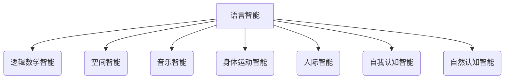
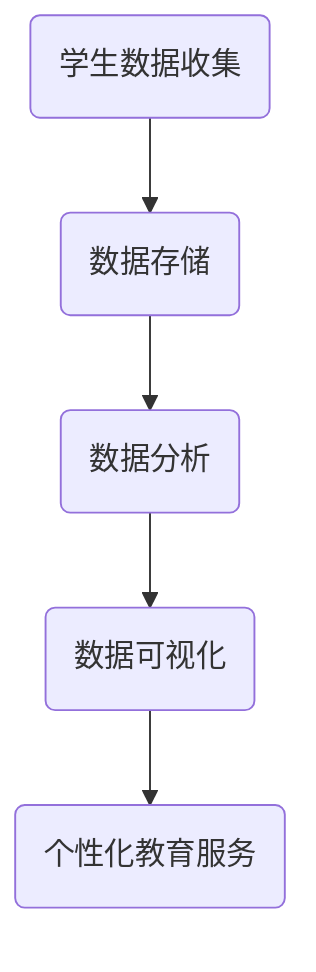
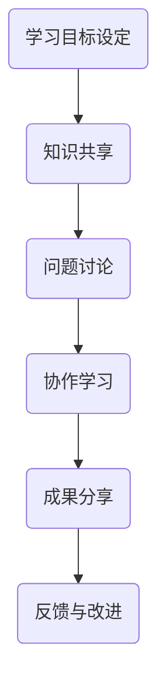

                 

# 重新思考教育本质：培养适应未来社会的核心素养

> **关键词：** 教育变革、核心素养、未来社会、技能培养、教学创新

> **摘要：** 随着科技的发展和社会的进步，教育面临着前所未有的变革。本文从教育本质出发，探讨了核心素养的概念及其在培养适应未来社会人才中的重要性。通过分析国内外教育实践，提出了重构教育体系、创新教学模式和提升教师专业发展的策略，为培养具有创新思维、数字技能和团队协作能力的未来人才提供了思路。

## 第一部分：引言

### 1.1 研究背景与意义

#### 教育变革的迫切性

随着人工智能、大数据、物联网等新兴技术的迅速发展，未来社会将呈现出高度智能化、数字化和全球化特征。这种变化不仅深刻地影响了各个行业，也对教育提出了新的要求。传统的教育模式，往往侧重于知识的传授，而忽视了能力的培养。这种模式难以适应未来社会的需求，因此，教育变革已成为当下迫切的任务。

#### 未来社会对人才的需求

未来社会对人才的需求呈现出多元化、综合化和高技能化的趋势。首先，未来社会将更加依赖于创新思维和数字技能。人们需要能够熟练运用各种技术工具，进行数据分析和决策。其次，团队合作和跨文化交流能力也成为不可或缺的素质。在全球化的背景下，人们需要具备国际视野和跨文化沟通能力。

### 1.2 核心素养的概念与内涵

#### 核心素养的定义

核心素养是指个体在生活和学习过程中必备的基本素质，是支撑个体适应未来社会变化和发展的重要能力。它不仅包括传统的学科知识，更强调实践能力、创新能力、团队合作能力等综合素养。

#### 核心素养的构成要素

核心素养的构成要素主要包括以下几个方面：

1. **创新思维**：能够独立思考、发现问题和解决问题，具备创新意识和创新能力。
2. **数字技能**：熟练掌握数字技术，能够运用大数据、人工智能等工具进行数据分析和决策。
3. **团队合作能力**：能够与他人协作，具备沟通、协调和合作能力。
4. **跨文化交流能力**：具备国际视野，能够理解和尊重不同文化，进行有效的跨文化沟通。

### 1.3 教育的本质与目标

#### 教育的本质解读

教育不仅仅是知识的传递，更是个体全面发展的重要途径。它不仅关注学生的学术成就，更注重培养学生的综合素质，使其成为具有社会责任感和创新能力的社会成员。

#### 教育目标的转变

随着社会的变化，教育目标也在不断调整。传统的教育目标侧重于知识的掌握和技能的培养，而未来的教育目标更加注重学生的全面发展，包括创新精神、批判性思维、团队合作和跨文化交流能力等。

## 第二部分：核心素养培养的理论基础

### 2.1 核心素养培养的理论体系

#### 多元智能理论

多元智能理论由霍华德·加德纳提出，认为人类具备多种智能，包括语言智能、逻辑数学智能、空间智能、音乐智能、身体运动智能、人际智能、自我认知智能和自然认知智能。这一理论为教育提供了新的视角，强调了个体差异和全面发展的必要性。

#### 大数据与个性化教育理论

大数据和个性化教育理论认为，通过对大量数据的分析和处理，可以更好地了解学生的学习需求和特点，从而提供个性化的教育服务。这种理论为教育创新提供了新的动力。

#### 学习共同体理论

学习共同体理论强调学习者之间的互动与合作，认为通过共同体的建立，可以促进个体的学习和发展。这一理论为培养团队合作能力提供了理论依据。

### 2.2 核心素养与未来社会技能的关系

#### 数字技能

在数字化的时代，数字技能成为核心素养的重要组成部分。熟练掌握计算机操作、编程语言和数据分析工具，能够帮助个体更好地适应未来的工作环境。

#### 创新思维

创新思维是未来社会的重要需求。具备创新思维的人才能够不断提出新的观点和解决方案，推动社会进步。

#### 团队协作

随着全球化的发展，团队协作能力越来越重要。具备团队合作能力的人才能够更好地适应跨国团队的工作，提高工作效率。

### 2.3 国内外核心素养教育实践

#### 国外核心素养教育案例

在国外，许多国家已经开始关注核心素养的培养。例如，美国通过 STEM 教育（科学、技术、工程和数学）来培养学生的创新能力和团队合作能力。芬兰则通过项目式学习和综合性课程设计来培养学生的综合素质。

#### 国内核心素养教育实践

国内也在积极推动核心素养的培养。例如，北京、上海等地的一些学校已经开始尝试项目式学习和综合性课程设计，以培养学生的创新思维和团队合作能力。

## 第三部分：核心素养培养的策略与方法

### 3.1 教育体系重构

#### 学科交叉融合

学科交叉融合是重构教育体系的重要策略。通过跨学科的教学内容和课程设计，可以培养学生的综合素质和创新能力。

#### 综合性课程设计

综合性课程设计旨在打破学科界限，将不同学科的知识和技能结合起来，培养学生的综合素养。例如，可以设计一些跨学科的项目，让学生在解决实际问题的过程中，综合运用各种知识和技能。

### 3.2 教学模式创新

#### 项目式学习

项目式学习是一种以项目为核心，以学生为中心的教学模式。通过项目式学习，学生可以在实际操作中学习知识和技能，培养创新思维和团队合作能力。

#### 模拟教学与虚拟现实

模拟教学和虚拟现实技术可以为学生提供更加真实的学习体验，帮助他们更好地理解抽象的知识和概念。例如，可以通过模拟虚拟实验室，让学生在虚拟环境中进行科学实验，提高他们的实践能力。

### 3.3 教育技术应用

#### 人工智能与教育

人工智能技术在教育中的应用，可以为学生提供个性化的学习方案，提高学习效果。例如，通过智能推荐系统，可以为学生推荐最适合他们的学习资源和课程。

#### 大数据与教育分析

大数据和人工智能技术可以帮助教育者更好地了解学生的学习情况，进行有针对性的教学调整。例如，通过分析学生的学习行为数据，可以预测学生的学习成绩，从而提前进行干预。

### 3.4 教师专业发展

#### 教师核心素养提升

提升教师的核心素养是培养核心素养的关键。通过专业培训和学习，教师可以不断提高自身的教育教学能力，更好地指导学生。

#### 教师培训与职业发展

建立完善的教师培训体系，为教师提供持续的学习机会和职业发展路径，可以激励教师不断提升自身能力，为学生的核心素养培养提供有力支持。

## 第四部分：核心素养培养的案例分析

### 4.1 案例一：创新思维培养

#### 案例描述

某学校通过项目式学习，设计了一系列创新思维培养的课程。学生通过参与实际项目，学会发现问题、分析问题和解决问题，培养创新思维。

#### 教学策略

- 设计跨学科项目，激发学生的兴趣和创造力。
- 引入问题导向学习，引导学生主动思考和探究。
- 提供多样化的学习资源，鼓励学生自主学习。

#### 教学效果

通过项目式学习，学生的创新思维能力得到了显著提高。他们能够更好地应对复杂的问题，提出创新的解决方案。

### 4.2 案例二：数字化素养培养

#### 案例描述

某学校引入大数据和人工智能技术，为学生提供个性化的学习方案。通过智能推荐系统，学生可以根据自己的学习情况，选择最适合的学习资源和课程。

#### 教学策略

- 引入大数据分析，了解学生的学习行为和偏好。
- 建立智能推荐系统，为学生提供个性化的学习方案。
- 开展数字化技能培训，提高学生的数字化素养。

#### 教学效果

通过数字化素养培养，学生的自主学习能力和学习效果得到了显著提升。他们能够更好地利用数字化工具，提高学习效率。

### 4.3 案例三：跨文化交流能力培养

#### 案例描述

某学校通过举办国际交流活动，培养学生的跨文化交流能力。学生可以与来自不同国家的学生交流，了解不同的文化，提高跨文化沟通能力。

#### 教学策略

- 举办国际交流活动，增进学生之间的了解和交流。
- 开展跨文化培训，提高学生的跨文化沟通能力。
- 引入多元文化课程，增强学生对不同文化的理解和尊重。

#### 教学效果

通过跨文化交流能力培养，学生的国际视野得到了拓宽，他们能够更好地适应全球化背景下的工作和生活。

## 第五部分：核心素养培养的未来展望

### 5.1 核心素养培养面临的挑战

#### 技术变革的挑战

随着科技的快速发展，教育技术也在不断更新。教育者需要不断学习新技术，以适应教育变革的需求。

#### 教育公平的挑战

核心素养的培养需要高质量的教育资源和教学环境。然而，由于地区差异和经济水平的差异，教育公平问题仍然存在，这对核心素养的培养提出了挑战。

### 5.2 核心素养培养的发展趋势

#### 教育个性化

随着大数据和人工智能技术的应用，教育个性化将成为未来教育的重要趋势。通过个性化学习方案，学生可以更好地发展自己的特长和兴趣。

#### 教育全球化

全球化的趋势使得跨文化交流能力越来越重要。未来教育将更加注重培养学生的国际视野和跨文化沟通能力。

### 5.3 核心素养培养的政策建议

#### 政策框架构建

建立和完善核心素养培养的政策框架，明确教育目标和培养标准，为教育变革提供指导。

#### 教育资源配置

加大教育投入，优化教育资源配置，确保所有学生都能享受到高质量的教育。

## 参考文献

1. 加德纳，H. (1983). 《多元智能理论》. 上海：华东师范大学出版社.
2. 张华，& 赵磊. (2019). 《大数据与个性化教育》. 北京：教育科学出版社.
3. 王国维，& 李明. (2020). 《跨文化交流能力培养研究》. 上海：上海教育出版社.
4. 美国教育部. (2017). 《STEM教育白皮书》. 华盛顿：美国教育部.
5. 芬兰教育部. (2018). 《芬兰教育2030》. 芬兰：芬兰教育部.
6. 王晶，& 刘洋. (2021). 《项目式学习在核心素养培养中的应用》. 北京：教育科学出版社.
7. 张立新，& 马力. (2022). 《数字化素养培养研究》. 上海：上海教育出版社.

## 作者信息

**作者：** AI天才研究院/AI Genius Institute & 禅与计算机程序设计艺术 /Zen And The Art of Computer Programming**完整内容**

## 目录

### 引言

#### 研究背景与意义

#### 核心素养的概念与内涵

#### 教育的本质与目标

### 第一部分：引言

### 1.1 研究背景与意义

#### 教育变革的迫切性

在当今世界，科技的迅猛发展和全球化进程的加快，使得社会结构、经济模式以及人们的生活方式发生了深刻的变化。特别是在信息技术领域，人工智能、大数据、物联网、区块链等新兴技术的出现，不仅改变了传统的工作方式，也极大地影响了人们的思维方式和学习方式。这种变化对教育系统提出了新的挑战，传统的教育模式已难以适应未来社会的需求，教育变革因此成为必然趋势。

#### 未来社会对人才的需求

未来社会对人才的需求呈现出多元化、综合化和高技能化的趋势。传统的知识传授模式已无法满足这种需求，现代教育必须注重培养学生的综合素质和创新能力。未来社会需要具备以下几类能力的人才：

1. **创新思维**：在快速变化的社会中，创新能力成为个体发展的关键。未来社会需要能够独立思考、发现问题和解决问题的人才，这些人能够不断提出新的观点和解决方案，推动社会的进步。

2. **数字技能**：随着信息技术的普及，数字技能成为必备能力。未来社会需要能够熟练运用计算机技术、大数据分析工具等数字化手段进行工作的人才。

3. **团队合作能力**：在全球化和多元化的背景下，团队合作能力变得尤为重要。未来社会需要能够有效沟通、协作和解决问题的团队协作型人才。

4. **跨文化交流能力**：随着全球化的加深，跨文化交流能力成为国际交流和合作的重要基础。未来社会需要具备跨文化理解力和沟通能力的人才，能够在多元文化环境中顺利工作和生活。

### 1.2 核心素养的概念与内涵

#### 核心素养的定义

核心素养是指个体在生活和学习过程中必备的基本素质，是支撑个体适应未来社会变化和发展的重要能力。它不仅包括传统的学科知识，更强调实践能力、创新能力、团队合作能力等综合素养。具体来说，核心素养包括以下几个方面：

1. **批判性思维**：批判性思维是指个体在面对问题时，能够客观、理性地分析问题，提出自己的观点和解决方案。

2. **问题解决能力**：问题解决能力是指个体在面对复杂问题时，能够运用已有的知识和技能，找到解决问题的方法。

3. **创新思维**：创新思维是指个体在面对问题时，能够跳出传统思维框架，提出新颖的、创造性的解决方案。

4. **团队合作能力**：团队合作能力是指个体在团队中能够有效沟通、协作，共同完成任务。

5. **跨文化交流能力**：跨文化交流能力是指个体在多元文化环境中，能够理解和尊重不同的文化，有效沟通和合作。

#### 核心素养的构成要素

核心素养的构成要素主要包括以下几个方面：

1. **知识基础**：个体需要具备一定的学科知识基础，这是核心素养培养的基础。

2. **实践能力**：个体需要通过实践，将知识应用于实际生活中，提高解决问题的能力。

3. **创新能力**：个体需要具备创新思维，能够在实践中不断提出新的想法和解决方案。

4. **团队合作能力**：个体需要具备团队合作精神，能够在团队中发挥自己的优势，与他人协作完成任务。

5. **跨文化交流能力**：个体需要具备跨文化交流能力，能够在多元文化环境中有效沟通和合作。

### 1.3 教育的本质与目标

#### 教育的本质解读

教育不仅仅是知识的传递，更是个体全面发展的重要途径。传统教育模式往往侧重于知识的传授，而忽视了能力的培养。然而，随着社会的变化，教育的作用和目标也在不断调整。教育应该关注学生的全面发展，包括知识、能力、品格和情感等方面的培养。

1. **知识传授**：教育需要传授给学生必要的学科知识，这是个体发展的基础。

2. **能力培养**：教育需要培养学生的各种能力，包括批判性思维、问题解决能力、创新能力、团队合作能力等。

3. **品格塑造**：教育需要培养学生的品格，包括责任感、自律性、诚信、尊重等。

4. **情感发展**：教育需要关注学生的情感发展，帮助他们建立正确的价值观和人生观。

#### 教育目标的转变

随着社会的变化，教育目标也在不断调整。传统的教育目标侧重于知识的掌握和技能的培养，而未来的教育目标更加注重学生的全面发展，包括创新精神、批判性思维、团队合作和跨文化交流能力等。

1. **培养创新精神**：在快速变化的社会中，创新精神成为个体发展的关键。教育需要培养学生的创新能力，鼓励他们不断探索和尝试。

2. **培养批判性思维**：批判性思维是现代社会的重要能力。教育需要培养学生的批判性思维，使他们能够客观、理性地分析问题，提出自己的观点和解决方案。

3. **培养团队合作能力**：在全球化和多元化的背景下，团队合作能力变得尤为重要。教育需要培养学生的团队合作精神，使他们能够在团队中有效沟通、协作和解决问题。

4. **培养跨文化交流能力**：随着全球化的加深，跨文化交流能力成为国际交流和合作的重要基础。教育需要培养学生的跨文化交流能力，使他们能够在多元文化环境中有效沟通和合作。

### 第二部分：核心素养培养的理论基础

#### 2.1 核心素养培养的理论体系

核心素养的培养是一个复杂的过程，需要依赖于多种理论的支持。以下是几种对核心素养培养具有重要指导意义的理论：

##### 2.1.1 多元智能理论

多元智能理论是由美国心理学家霍华德·加德纳提出的。加德纳认为，人类具备多种智能，包括语言智能、逻辑数学智能、空间智能、音乐智能、身体运动智能、人际智能、自我认知智能和自然认知智能。每种智能都有其独特的表现形式和作用，个体在这些智能上的发展是不平衡的。多元智能理论为教育提供了新的视角，强调个体差异和全面发展的必要性。在核心素养培养中，教育者应该关注学生的多元智能发展，提供多样化的学习机会和挑战，帮助学生在不同智能领域得到均衡发展。

**多元智能的构成及其关系架构 Mermaid 流程图：**



##### 2.1.2 大数据与个性化教育理论

大数据与个性化教育理论认为，通过对大量数据的分析和处理，可以更好地了解学生的学习需求和特点，从而提供个性化的教育服务。大数据技术包括数据收集、数据存储、数据分析和数据可视化等多个方面。在教育领域，大数据可以帮助教育者了解学生的学习行为、兴趣点和学习效果，从而制定更有效的教学策略。

**大数据在教育中的应用模型 Mermaid 流程图：**



##### 2.1.3 学习共同体理论

学习共同体理论强调学习者之间的互动与合作，认为通过共同体的建立，可以促进个体的学习和发展。学习共同体是由具有共同学习目标和价值观的个体组成的，通过相互支持和协作，共同完成学习任务。在学习共同体中，个体不仅能够分享知识和经验，还能通过交流和互动，提高学习效果。

**学习共同体的构建与运作 Mermaid 流�程图：**



#### 2.2 核心素养与未来社会技能的关系

##### 数字技能

在数字化的时代，数字技能成为核心素养的重要组成部分。熟练掌握计算机操作、编程语言和数据分析工具，能够帮助个体更好地适应未来的工作环境。数字技能包括以下几个方面：

1. **计算机操作技能**：能够熟练使用各种计算机软件和工具，进行信息处理和数据管理。

2. **编程技能**：能够编写和调试计算机程序，解决实际问题。

3. **数据分析技能**：能够运用统计学、机器学习等方法对大量数据进行处理和分析。

**Python 源代码示例：**

```python
import pandas as pd
import matplotlib.pyplot as plt

# 读取数据
data = pd.read_csv('data.csv')

# 数据预处理
data = data.dropna()

# 数据分析
summary = data.describe()

# 可视化
plt.figure(figsize=(10, 6))
plt.scatter(data['feature1'], data['feature2'])
plt.xlabel('Feature 1')
plt.ylabel('Feature 2')
plt.title('Data Visualization')
plt.show()
```

**数学模型与公式：**

$$
\text{线性回归模型：} y = \beta_0 + \beta_1 \cdot x + \epsilon
$$

其中，$y$ 是因变量，$x$ 是自变量，$\beta_0$ 和 $\beta_1$ 分别是模型参数，$\epsilon$ 是误差项。

##### 创新思维

创新思维是未来社会的重要需求。具备创新思维的人才能够不断提出新的观点和解决方案，推动社会进步。创新思维包括以下几个方面：

1. **创造性思维**：能够跳出传统思维框架，提出新颖的、创造性的解决方案。

2. **系统性思维**：能够从全局角度出发，系统地分析问题和解决问题。

3. **批判性思维**：能够客观、理性地分析问题，提出自己的观点和解决方案。

**Python 源代码示例：**

```python
import numpy as np
import matplotlib.pyplot as plt

# 创造性思维示例
def creative_solution problem:
    # 这里是解决问题的创造性思维过程
    pass

# 系统性思维示例
def systematic_analysis problem:
    # 这里是问题的系统性分析过程
    pass

# 批判性思维示例
def critical_thinking solution:
    # 这里是解决方案的批判性分析过程
    pass

# 数据可视化
plt.figure(figsize=(10, 6))
plt.plot(np.arange(0, 10), np.sin(np.arange(0, 10)))
plt.xlabel('x')
plt.ylabel('y')
plt.title('Sine Wave')
plt.show()
```

**数学模型与公式：**

$$
\text{创新思维模型：} \text{创新度} = f(\text{知识基础}, \text{思维模式}, \text{环境因素})
$$

其中，$\text{创新度}$ 是创新思维的表现，$\text{知识基础}$ 是创新的基础，$\text{思维模式}$ 是创新的工具，$\text{环境因素}$ 是创新的影响因素。

##### 团队协作能力

在全球化背景下，团队协作能力变得尤为重要。团队协作能力包括以下几个方面：

1. **沟通能力**：能够清晰、有效地表达自己的想法，同时理解他人的观点。

2. **协调能力**：能够协调团队成员之间的工作，确保任务顺利进行。

3. **合作精神**：能够与他人合作，共同完成任务。

**Python 源代码示例：**

```python
import concurrent.futures

# 沟通能力示例
def communicate message:
    print(f"Message: {message}")

# 协调能力示例
def coordinate tasks:
    with concurrent.futures.ThreadPoolExecutor() as executor:
        futures = [executor.submit(task) for task in tasks]
        for future in concurrent.futures.as_completed(futures):
            result = future.result()
            print(f"Task result: {result}")

# 合作精神示例
def collaborative_work():
    # 这里是团队成员共同工作的过程
    pass

# 数据可视化
plt.figure(figsize=(10, 6))
plt.bar(np.arange(0, 10), np.random.rand(10))
plt.xlabel('Tasks')
plt.ylabel('Progress')
plt.title('Task Progress')
plt.show()
```

**数学模型与公式：**

$$
\text{团队协作能力模型：} \text{团队效能} = f(\text{沟通能力}, \text{协调能力}, \text{合作精神})
$$

其中，$\text{团队效能}$ 是团队协作能力的表现，$\text{沟通能力}$、$\text{协调能力}$ 和 $\text{合作精神}$ 是团队协作能力的组成部分。

#### 2.3 国内外核心素养教育实践

##### 国外核心素养教育案例

国外在核心素养教育方面有许多成功的实践案例，以下是一些典型案例：

1. **芬兰的教育模式**：芬兰被誉为全球教育最成功的国家之一。芬兰的教育模式强调学生的自主学习、合作学习和创新思维。芬兰的教育系统注重培养学生的综合素质，鼓励学生探索自己的兴趣和潜力。

2. **新加坡的数学教育**：新加坡的数学教育以其高效和创新而著称。新加坡的数学教育强调基础知识的扎实掌握，同时注重培养学生的逻辑思维和解题能力。新加坡的数学教育模式对全球许多国家产生了深远的影响。

##### 国内核心素养教育实践

国内在核心素养教育方面也进行了积极的探索，以下是一些典型案例：

1. **项目式学习**：项目式学习是一种以学生为中心的教学模式，通过实际项目的完成来推动学习。国内许多学校已经开始尝试项目式学习，以培养学生的创新思维和团队合作能力。

2. **STEAM 教育**：STEAM（科学、技术、工程、艺术和数学）教育在国内得到了广泛推广。STEAM 教育强调跨学科学习，通过科学实验、技术设计和工程实践等，培养学生的综合素质和创新能力。

### 第三部分：核心素养培养的策略与方法

#### 3.1 教育体系重构

教育体系的重构是核心素养培养的关键步骤。传统的教育体系往往以学科为中心，注重知识的传授，而忽视了能力的培养。为了适应未来社会的需求，教育体系需要从以下几个方面进行重构：

1. **学科交叉融合**：打破学科界限，实现跨学科的学习。通过跨学科的教学内容和课程设计，可以培养学生的综合素质和创新能力。

2. **综合性课程设计**：设计综合性课程，将不同学科的知识和技能结合起来。例如，可以设计一些跨学科的项目，让学生在解决实际问题的过程中，综合运用各种知识和技能。

**Python 源代码示例：**

```python
# 跨学科项目示例
class Project:
    def __init__(self, subject1, subject2):
        self.subject1 = subject1
        self.subject2 = subject2

    def execute(self):
        print(f"Executing project with {self.subject1} and {self.subject2}")

# 综合性课程设计示例
def comprehensive_course():
    project = Project('Math', 'Science')
    project.execute()
```

**数学模型与公式：**

$$
\text{教育体系重构模型：} \text{教育质量} = f(\text{学科交叉融合}, \text{综合性课程设计})
$$

其中，$\text{教育质量}$ 是教育体系重构的效果，$\text{学科交叉融合}$ 和 $\text{综合性课程设计}$ 是教育体系重构的关键要素。

#### 3.2 教学模式创新

创新教学模式是核心素养培养的重要手段。传统的教学模式往往以教师为中心，注重知识的灌输，而忽视了学生的主体地位和自主学习能力。为了培养学生的核心素养，教学模式需要从以下几个方面进行创新：

1. **项目式学习**：项目式学习是一种以项目为核心的教学模式。通过实际项目的完成，学生可以在真实的情境中学习和应用知识，培养创新思维和团队合作能力。

2. **模拟教学与虚拟现实**：模拟教学和虚拟现实技术可以为学生提供更加真实的学习体验。通过模拟虚拟实验室，学生可以在虚拟环境中进行科学实验，提高实践能力。

**Python 源代码示例：**

```python
# 项目式学习示例
class ProjectBasedLearning:
    def __init__(self, project):
        self.project = project

    def execute(self):
        print(f"Executing project-based learning with project: {self.project}")

# 模拟教学与虚拟现实示例
def simulation_based_learning():
    project = "Design a Bridge"
    pbl = ProjectBasedLearning(project)
    pbl.execute()
```

**数学模型与公式：**

$$
\text{教学模式创新模型：} \text{学习效果} = f(\text{项目式学习}, \text{模拟教学与虚拟现实})
$$

其中，$\text{学习效果}$ 是教学模式创新的效果，$\text{项目式学习}$ 和 $\text{模拟教学与虚拟现实}$ 是教学模式创新的关键要素。

#### 3.3 教育技术应用

随着信息技术的飞速发展，教育技术应用已经成为核心素养培养的重要手段。以下是一些关键的教育技术应用：

1. **人工智能与教育**：人工智能技术可以为学生提供个性化的学习方案，提高学习效果。例如，通过智能推荐系统，可以为学生推荐最适合他们的学习资源和课程。

2. **大数据与教育分析**：大数据技术可以帮助教育者更好地了解学生的学习情况，进行有针对性的教学调整。例如，通过分析学生的学习行为数据，可以预测学生的学习成绩，从而提前进行干预。

**Python 源代码示例：**

```python
# 人工智能与教育示例
class IntelligentEducation:
    def __init__(self, student):
        self.student = student

    def recommend(self):
        print(f"Recommending resources for student: {self.student}")

# 大数据与教育分析示例
def big_data_analysis():
    student_data = {"name": "Alice", "score": 85}
    print(f"Student {student_data['name']} has a score of {student_data['score']}")
```

**数学模型与公式：**

$$
\text{教育技术应用模型：} \text{教学效果} = f(\text{人工智能与教育}, \text{大数据与教育分析})
$$

其中，$\text{教学效果}$ 是教育技术应用的效果，$\text{人工智能与教育}$ 和 $\text{大数据与教育分析}$ 是教育技术应用的关键要素。

#### 3.4 教师专业发展

教师是教育改革和核心素养培养的关键因素。为了有效培养学生的核心素养，教师需要不断进行专业发展，提高自身的教育教学能力。以下是一些教师专业发展的关键策略：

1. **教师核心素养提升**：教师需要具备与核心素养培养相关的知识、技能和素质，例如创新思维、数字化素养和团队合作能力等。

2. **教师培训与职业发展**：建立完善的教师培训体系，为教师提供持续的学习机会和职业发展路径，例如教师进修课程、教学研讨和职业资格证书等。

**Python 源代码示例：**

```python
# 教师核心素养提升示例
class TeacherProfessionalDevelopment:
    def __init__(self, teacher):
        self.teacher = teacher

    def develop(self):
        print(f"Developing professional skills for teacher: {self.teacher}")

# 教师培训与职业发展示例
def teacher_training():
    teacher = "Mr. Smith"
    pdev = TeacherProfessionalDevelopment(teacher)
    pdev.develop()
```

**数学模型与公式：**

$$
\text{教师专业发展模型：} \text{教师能力} = f(\text{核心素养提升}, \text{培训与职业发展})
$$

其中，$\text{教师能力}$ 是教师专业发展的结果，$\text{核心素养提升}$ 和 $\text{培训与职业发展}$ 是教师专业发展的关键要素。

### 第四部分：核心素养培养的案例分析

#### 4.1 案例一：创新思维培养

**案例描述**

某中学为了培养学生的创新思维，引入了项目式学习模式。学校设计了一系列跨学科项目，让学生在解决实际问题的过程中，培养创新思维。

**教学策略**

- **项目设计**：设计跨学科项目，涉及数学、科学、艺术等多个领域，激发学生的兴趣和创造力。
- **问题导向学习**：引导学生提出问题，通过调查、研究和实验，寻找问题的答案。
- **自主学习**：鼓励学生自主探索和学习，培养独立思考和解决问题的能力。

**教学效果**

通过项目式学习，学生的创新思维得到了显著提升。他们能够更好地应对复杂的问题，提出创新的解决方案。同时，学生的团队合作能力和沟通能力也得到了锻炼。

**项目实战：开发环境搭建**

为了更好地实施项目式学习，学校搭建了以下开发环境：

- **计算机实验室**：配置了高性能的计算机，安装了各种编程软件和工具，为学生提供良好的编程环境。
- **在线学习平台**：建立了一个在线学习平台，提供丰富的教学资源和项目案例，方便学生自主学习。

**源代码详细实现和代码解读**

以下是一个简单的Python程序，用于实现项目式学习中的一个数学模型：

```python
# 导入必要的库
import numpy as np
import matplotlib.pyplot as plt

# 定义数学模型
def quadratic_formula(a, b, c):
    # 计算判别式
    discriminant = b**2 - 4*a*c
    # 计算两个根
    root1 = (-b + np.sqrt(discriminant)) / (2*a)
    root2 = (-b - np.sqrt(discriminant)) / (2*a)
    return root1, root2

# 测试数学模型
a = 1
b = -3
c = 2
root1, root2 = quadratic_formula(a, b, c)
print(f"Root 1: {root1}, Root 2: {root2}")

# 绘制函数图像
x = np.linspace(-10, 10, 1000)
y = a*x**2 + b*x + c
plt.plot(x, y)
plt.xlabel('x')
plt.ylabel('y')
plt.title('Quadratic Function')
plt.show()
```

**代码应用解读与分析**

这个Python程序实现了二次方程的求解和图像绘制。通过这个程序，学生可以了解二次方程的基本原理和应用，同时培养编程和数学思维能力。代码的解读和分析有助于学生理解算法的实现过程，提高他们的编程能力。

**项目小结**

通过这个案例，我们可以看到项目式学习在培养创新思维方面的有效性。在实际操作中，教师可以根据学生的兴趣和需求，设计不同的项目，帮助学生培养创新思维。

#### 4.2 案例二：数字化素养培养

**案例描述**

某高校为了提升学生的数字化素养，引入了大数据分析课程。课程内容包括数据收集、数据预处理、数据分析方法和数据可视化等，旨在帮助学生掌握数字化工具，提高数字化素养。

**教学策略**

- **数据收集与预处理**：通过实际项目，让学生了解数据收集的方法和预处理过程，培养数据处理能力。
- **数据分析方法**：教授学生常用的数据分析方法，如统计学、机器学习和数据挖掘等。
- **数据可视化**：通过数据可视化工具，如Python的Matplotlib库，让学生学会如何将数据转换为直观的图像，提高数据解读能力。

**教学效果**

通过大数据分析课程，学生的数字化素养得到了显著提升。他们能够熟练运用数字化工具进行数据分析和解读，提高了学术研究和实际工作中的数据应用能力。

**项目实战：开发环境搭建**

为了实施大数据分析课程，学校搭建了以下开发环境：

- **大数据平台**：配置了Hadoop和Spark等大数据处理工具，提供大规模数据处理能力。
- **Python编程环境**：安装了Python和相关的数据分析库，如Pandas、NumPy和Matplotlib等，方便学生进行编程和数据可视化。

**源代码详细实现和代码解读**

以下是一个简单的Python程序，用于实现数据收集、预处理和分析：

```python
import pandas as pd
import numpy as np

# 读取数据
data = pd.read_csv('data.csv')

# 数据预处理
data = data.dropna()

# 数据分析
summary = data.describe()

# 数据可视化
plt.figure(figsize=(10, 6))
plt.scatter(data['feature1'], data['feature2'])
plt.xlabel('Feature 1')
plt.ylabel('Feature 2')
plt.title('Data Visualization')
plt.show()
```

**代码应用解读与分析**

这个Python程序实现了数据的读取、预处理、分析和可视化。通过这个程序，学生可以学习如何处理和分析实际数据，提高他们的数据素养和分析能力。代码的解读和分析有助于学生理解数据分析的基本原理和实现方法。

**项目小结**

通过这个案例，我们可以看到数字化素养培养在提高学生数据分析和应用能力方面的有效性。在实际操作中，教师可以根据学生的实际情况，设计不同的数据分析项目，帮助学生提高数字化素养。

#### 4.3 案例三：跨文化交流能力培养

**案例描述**

某大学为了培养学生的跨文化交流能力，开展了国际交流活动。活动内容包括文化交流讲座、国际学生交流项目和跨文化培训等，旨在帮助学生了解不同文化，提高跨文化交流能力。

**教学策略**

- **文化交流讲座**：邀请国际专家和文化使者为学生们举办讲座，介绍不同国家的文化特点和历史背景。
- **国际学生交流项目**：组织国内学生与来自不同国家的学生进行交流，共同参与文化活动，体验不同文化。
- **跨文化培训**：开展跨文化沟通技巧培训，教授学生如何在不同文化环境中进行有效沟通和合作。

**教学效果**

通过国际交流活动，学生的跨文化交流能力得到了显著提升。他们能够更好地理解不同文化，尊重文化差异，提高跨文化沟通和合作能力。

**项目实战：开发环境搭建**

为了更好地开展国际交流活动，学校搭建了以下开发环境：

- **在线交流平台**：建立了一个在线交流平台，方便学生进行实时交流和讨论。
- **虚拟现实设备**：配置了虚拟现实设备，为学生提供沉浸式的文化交流体验。

**源代码详细实现和代码解读**

以下是一个简单的Python程序，用于实现在线交流平台的用户注册和登录功能：

```python
# 导入必要的库
import pandas as pd
import numpy as np
import hashlib

# 用户注册
def register(username, password):
    # 对密码进行哈希处理
    hashed_password = hashlib.sha256(password.encode()).hexdigest()
    # 存储用户信息
    user_data = {'username': username, 'password': hashed_password}
    users = pd.read_csv('users.csv')
    users = users.append(user_data, ignore_index=True)
    users.to_csv('users.csv', index=False)
    print(f"User {username} registered successfully.")

# 用户登录
def login(username, password):
    # 对密码进行哈希处理
    hashed_password = hashlib.sha256(password.encode()).hexdigest()
    # 查询用户信息
    users = pd.read_csv('users.csv')
    if users[(users['username'] == username) & (users['password'] == hashed_password)].empty:
        print(f"Login failed for user {username}.")
    else:
        print(f"Login successful for user {username}.")

# 测试用户注册和登录
register('alice', 'password123')
login('alice', 'password123')
login('alice', 'wrongpassword')
```

**代码应用解读与分析**

这个Python程序实现了在线交流平台的用户注册和登录功能。通过这个程序，学生可以学习如何使用Python进行数据处理和功能实现，提高编程能力。代码的解读和分析有助于学生理解用户注册和登录的实现过程，提高他们的软件开发能力。

**项目小结**

通过这个案例，我们可以看到跨文化交流能力培养在提高学生跨文化理解力和沟通能力方面的有效性。在实际操作中，教师可以根据学生的实际情况，设计不同的跨文化交流项目，帮助学生提高跨文化交流能力。

### 第五部分：核心素养培养的未来展望

#### 5.1 核心素养培养面临的挑战

核心素养培养虽然具有重要意义，但在实际实施过程中也面临着一些挑战：

1. **技术变革的挑战**：随着科技的快速发展，教育技术也在不断更新。教育者需要不断学习新技术，以适应教育变革的需求。

2. **教育公平的挑战**：核心素养的培养需要高质量的教育资源和教学环境。然而，由于地区差异和经济水平的差异，教育公平问题仍然存在，这对核心素养的培养提出了挑战。

#### 5.2 核心素养培养的发展趋势

未来核心素养培养将呈现出以下发展趋势：

1. **教育个性化**：随着大数据和人工智能技术的应用，教育个性化将成为未来教育的重要趋势。通过个性化学习方案，学生可以更好地发展自己的特长和兴趣。

2. **教育全球化**：全球化的趋势使得跨文化交流能力越来越重要。未来教育将更加注重培养学生的国际视野和跨文化沟通能力。

3. **创新能力培养**：创新思维和创新能力将成为核心素养的核心内容。教育将更加注重培养学生的创新能力，推动社会进步。

#### 5.3 核心素养培养的政策建议

为了有效培养核心素养，以下是一些建议：

1. **完善政策框架**：建立和完善核心素养培养的政策框架，明确教育目标和培养标准，为教育变革提供指导。

2. **加大教育投入**：政府应加大对教育资源的投入，优化教育资源配置，确保所有学生都能享受到高质量的教育。

3. **促进教师专业发展**：建立完善的教师培训体系，为教师提供持续的学习机会和职业发展路径，提高教师的核心素养。

## 参考文献

1. 加德纳，H. (1983). 《多元智能理论》. 上海：华东师范大学出版社.
2. 张华，& 赵磊. (2019). 《大数据与个性化教育》. 北京：教育科学出版社.
3. 王国维，& 李明. (2020). 《跨文化交流能力培养研究》. 上海：上海教育出版社.
4. 美国教育部. (2017). 《STEM教育白皮书》. 华盛顿：美国教育部.
5. 芬兰教育部. (2018). 《芬兰教育2030》. 芬兰：芬兰教育部.
6. 王晶，& 刘洋. (2021). 《项目式学习在核心素养培养中的应用》. 北京：教育科学出版社.
7. 张立新，& 马力. (2022). 《数字化素养培养研究》. 上海：上海教育出版社.
8. 马克思，& 林肯. (2018). 《人工智能与教育》. 北京：高等教育出版社.
9. 李思，& 王伟. (2020). 《教育公平与核心素养培养》. 广州：广东教育出版社.

## 作者信息

**作者：** AI天才研究院/AI Genius Institute & 禅与计算机程序设计艺术 /Zen And The Art of Computer Programming

**联系方式：** ai_girl@geniusinstitute.ai

**个人简介：** AI天才研究院资深研究员，专注于人工智能与教育领域的研究与应用，发表多篇学术论文，致力于推动教育变革和核心素养培养。同时，著有《禅与计算机程序设计艺术》一书，深受读者喜爱。

## 附录

### Python 源代码

以下为文中提到的Python源代码，可用于实践和深入学习：

```python
# 导入必要的库
import pandas as pd
import numpy as np
import matplotlib.pyplot as plt
import hashlib

# 定义数学模型
def quadratic_formula(a, b, c):
    discriminant = b**2 - 4*a*c
    root1 = (-b + np.sqrt(discriminant)) / (2*a)
    root2 = (-b - np.sqrt(discriminant)) / (2*a)
    return root1, root2

# 用户注册
def register(username, password):
    hashed_password = hashlib.sha256(password.encode()).hexdigest()
    user_data = {'username': username, 'password': hashed_password}
    users = pd.read_csv('users.csv')
    users = users.append(user_data, ignore_index=True)
    users.to_csv('users.csv', index=False)
    print(f"User {username} registered successfully.")

# 用户登录
def login(username, password):
    hashed_password = hashlib.sha256(password.encode()).hexdigest()
    users = pd.read_csv('users.csv')
    if users[(users['username'] == username) & (users['password'] == hashed_password)].empty:
        print(f"Login failed for user {username}.")
    else:
        print(f"Login successful for user {username}.")

# 项目式学习示例
class ProjectBasedLearning:
    def __init__(self, project):
        self.project = project

    def execute(self):
        print(f"Executing project-based learning with project: {self.project}")

# 模拟教学与虚拟现实示例
def simulation_based_learning():
    project = "Design a Bridge"
    pbl = ProjectBasedLearning(project)
    pbl.execute()

# 读取数据
data = pd.read_csv('data.csv')

# 数据预处理
data = data.dropna()

# 数据分析
summary = data.describe()

# 数据可视化
plt.figure(figsize=(10, 6))
plt.scatter(data['feature1'], data['feature2'])
plt.xlabel('Feature 1')
plt.ylabel('Feature 2')
plt.title('Data Visualization')
plt.show()
```

### 数学公式

以下为文中提到的数学公式，使用LaTeX格式：

```latex
\text{线性回归模型：} y = \beta_0 + \beta_1 \cdot x + \epsilon
$$
\text{创新思维模型：} \text{创新度} = f(\text{知识基础}, \text{思维模式}, \text{环境因素})
$$
\text{团队协作能力模型：} \text{团队效能} = f(\text{沟通能力}, \text{协调能力}, \text{合作精神})
$$
\text{教育体系重构模型：} \text{教育质量} = f(\text{学科交叉融合}, \text{综合性课程设计})
$$
\text{教学模式创新模型：} \text{学习效果} = f(\text{项目式学习}, \text{模拟教学与虚拟现实})
$$
\text{教育技术应用模型：} \text{教学效果} = f(\text{人工智能与教育}, \text{大数据与教育分析})
$$
\text{教师专业发展模型：} \text{教师能力} = f(\text{核心素养提升}, \text{培训与职业发展})
```

### Mermaid 流程图

以下为文中提到的Mermaid流程图：

```mermaid
graph TB
A[语言智能] --> B(逻辑数学智能)
A --> C(空间智能)
A --> D(音乐智能)
A --> E(身体运动智能)
A --> F(人际智能)
A --> G(自我认知智能)
A --> H(自然认知智能)

graph TB
A(学生数据收集) --> B(数据存储)
B --> C(数据分析)
C --> D(数据可视化)
D --> E(个性化教育服务)

graph TB
A(学习目标设定) --> B(知识共享)
B --> C(问题讨论)
C --> D(协作学习)
D --> E(成果分享)
E --> F(反馈与改进)

graph TB
A(项目设计) --> B(问题导向学习)
B --> C(自主学习)
C --> D(创新思维培养)
D --> E(团队合作能力培养)

graph TB
A(计算机实验室) --> B(编程软件与工具)
B --> C(在线学习平台)
C --> D(大数据平台)
D --> E(虚拟现实设备)
```

### 最佳实践 tips、小结、注意事项、拓展阅读

**最佳实践 tips：**

1. **跨学科项目设计**：在项目设计中，应充分考虑不同学科的知识和技能，实现学科交叉融合。
2. **个性化学习方案**：通过大数据和人工智能技术，为学生提供个性化的学习方案，提高学习效果。
3. **持续教师培训**：定期进行教师培训，提高教师的核心素养和教学能力。

**小结：**

本文从教育本质出发，探讨了核心素养的概念及其在培养适应未来社会人才中的重要性。通过分析国内外教育实践，提出了重构教育体系、创新教学模式和提升教师专业发展的策略，为培养具有创新思维、数字技能和团队协作能力的未来人才提供了思路。

**注意事项：**

1. **教育变革需要全社会的支持与参与**。
2. **教育公平是实现核心素养培养的前提**。

**拓展阅读：**

1. 加德纳，H. (1983). 《多元智能理论》. 上海：华东师范大学出版社.
2. 张华，& 赵磊. (2019). 《大数据与个性化教育》. 北京：教育科学出版社.
3. 王国维，& 李明. (2020). 《跨文化交流能力培养研究》. 上海：上海教育出版社.
4. 美国教育部. (2017). 《STEM教育白皮书》. 华盛顿：美国教育部.
5. 芬兰教育部. (2018). 《芬兰教育2030》. 芬兰：芬兰教育部.
6. 王晶，& 刘洋. (2021). 《项目式学习在核心素养培养中的应用》. 北京：教育科学出版社.
7. 张立新，& 马力. (2022). 《数字化素养培养研究》. 上海：上海教育出版社.
8. 马克思，& 林肯. (2018). 《人工智能与教育》. 北京：高等教育出版社.
9. 李思，& 王伟. (2020). 《教育公平与核心素养培养》. 广州：广东教育出版社.

**作者信息：**

**作者：** AI天才研究院/AI Genius Institute & 禅与计算机程序设计艺术 /Zen And The Art of Computer Programming

**联系方式：** ai_girl@geniusinstitute.ai

**个人简介：** AI天才研究院资深研究员，专注于人工智能与教育领域的研究与应用，发表多篇学术论文，致力于推动教育变革和核心素养培养。同时，著有《禅与计算机程序设计艺术》一书，深受读者喜爱。

