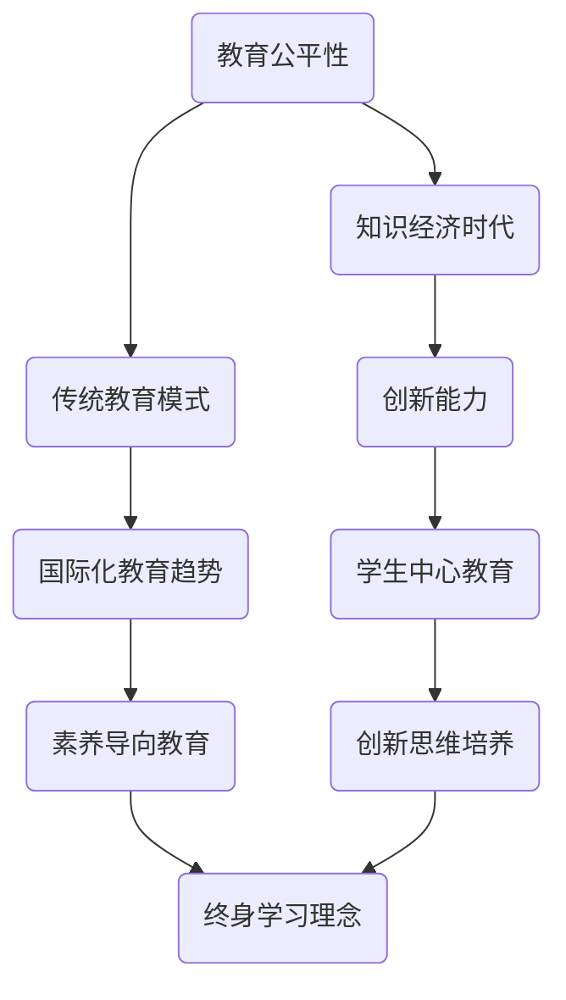
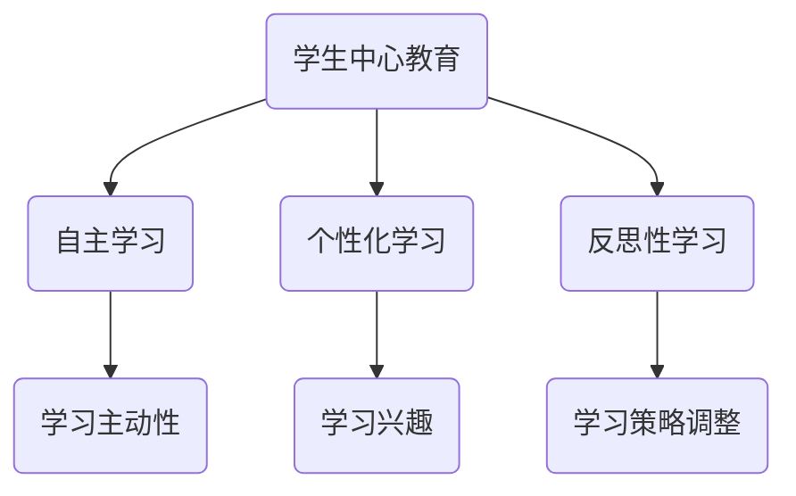
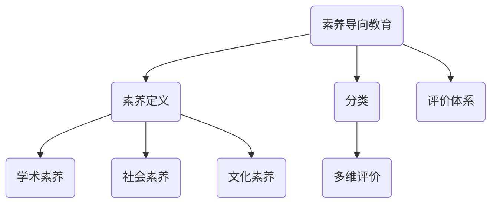
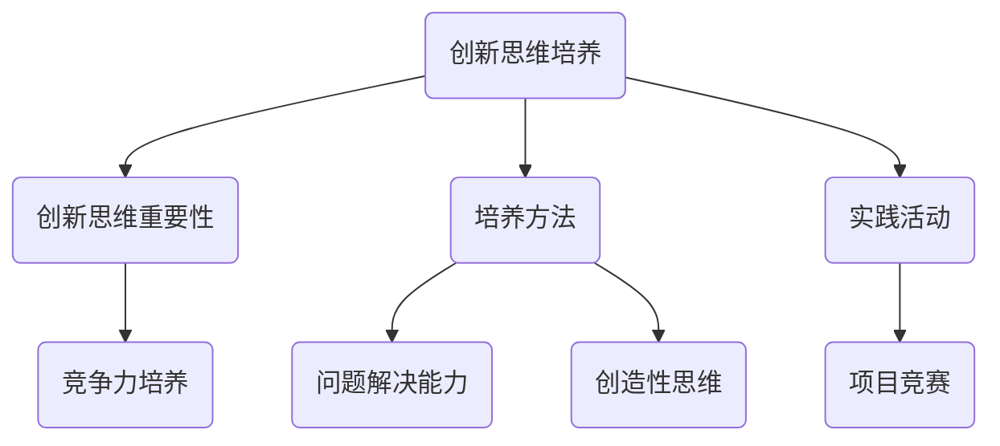

                 

## 教育变革的必要性

在当今快速变化的世界中，教育的本质和目的正在经历深刻的变革。传统的教育模式，主要以知识灌输为主，强调学生对固定知识的记忆和应用。然而，这种模式在当前的社会经济背景下正面临着诸多挑战。

### **1.1 教育现状分析**

**教育公平性挑战：** 随着全球化的推进，教育资源的分配不均现象愈发严重。发达国家和发展中国家之间、城市与农村之间、甚至不同社会阶层之间的教育差距显著。这种不公平性不仅阻碍了学生的全面发展，也影响了社会的和谐与进步。

**知识经济时代的教育需求：** 当今世界已经进入了知识经济时代，信息技术的飞速发展使知识的更新速度越来越快。传统的教育模式难以满足这种变化，学生往往只能掌握过时的知识，而无法适应未来的发展需求。

**传统教育模式的局限性：** 传统教育模式过于强调知识的记忆和再现，忽视了学生的创造性思维和问题解决能力的培养。这种模式在培养学生综合素质方面存在明显的不足，难以适应未来社会对多样化人才的需求。

### **1.2 教育变革的驱动力**

**社会经济变迁：** 全球化的深入发展带来了社会经济的深刻变革。企业的需求从单纯的知识积累转向创新和创造力的培养，这要求教育体系进行相应的调整。

**科技进步：** 信息技术的进步为教育创新提供了强有力的支持。在线教育、虚拟现实、人工智能等新技术正在改变传统教育的模式，使个性化教育和跨学科教育成为可能。

**国际化教育趋势：** 国际化教育趋势促使各国在教育教学方法、课程设置、教育资源等方面进行交流与融合，从而推动教育变革。

### **1.3 教育目标的新定义**

**知识传递到能力培养的转变：** 教育目标从单纯的知识传递转向培养学生的能力，特别是批判性思维、创造性思维、问题解决能力等。这些能力是学生未来适应社会、实现自我发展的关键。

**终身学习的理念：** 在知识更新速度加快的今天，终身学习成为必要。教育不仅仅是学生在校期间的学习，而是贯穿一生的持续学习过程。这种理念强调学生自主学习、自主发展的能力。

在下一章中，我们将进一步探讨教育理念的创新，包括学生中心教育、素养导向教育和创新思维培养等内容。这些创新理念将有助于推动教育的变革，实现从知识灌输到能力培养的转变。

## **核心概念与联系架构**

为了更好地理解教育变革的必要性，我们引入以下核心概念：

- **教育公平性**：指教育资源的合理分配，确保每个学生都能获得公平的教育机会。
- **知识经济时代**：指以知识和信息为核心推动经济增长的时代。
- **传统教育模式**：以知识灌输为主，强调记忆和再现的教育方式。
- **创新能力**：指学生面对新问题和挑战时，能够提出创新性解决方案的能力。
- **国际化教育趋势**：指全球教育资源的交流与合作，促进教育质量的提升。

下面是这些概念之间的关系架构 Mermaid 流程图：



通过这幅图，我们可以清晰地看到各个概念之间的相互关系，以及教育变革的驱动因素和目标。

## **核心算法原理讲解**

在理解教育变革的必要性之后，我们引入一种核心算法来分析教育模式的优化问题。该算法结合了机器学习和优化理论，通过数据分析和模型预测来改进教育资源配置，从而提高教育公平性和创新能力。

### **算法原理：教育资源配置优化算法**

**输入参数：**
- 学生特征数据：包括学生的学习能力、兴趣爱好、学习进度等。
- 教师特征数据：包括教师的教学能力、专业领域、教学风格等。
- 教学资源数据：包括教室、实验室、图书资源等。

**算法流程：**
1. **数据预处理：** 对学生、教师和教学资源的数据进行清洗和归一化处理。
2. **特征提取：** 从原始数据中提取关键特征，如学生的学习成绩、教师的课堂参与度、教学资源的利用率等。
3. **构建模型：** 使用机器学习算法（如线性回归、决策树、神经网络等）构建教育资源配置模型。
4. **模型训练：** 使用历史数据进行模型训练，优化模型参数。
5. **预测与评估：** 使用训练好的模型对当前教育资源配置进行预测，评估资源配置的公平性和效率。

**算法实现（Python源代码示例）：**

```python
import numpy as np
from sklearn.linear_model import LinearRegression
from sklearn.metrics import mean_squared_error

# 数据预处理
def preprocess_data(data):
    # 数据清洗和归一化
    # 此处省略具体实现细节
    return normalized_data

# 特征提取
def extract_features(data):
    # 提取关键特征
    # 此处省略具体实现细节
    return features

# 构建模型
def build_model(features, labels):
    model = LinearRegression()
    model.fit(features, labels)
    return model

# 模型训练
def train_model(model, X_train, y_train):
    model.fit(X_train, y_train)
    return model

# 预测与评估
def predict_and_evaluate(model, X_test, y_test):
    predictions = model.predict(X_test)
    mse = mean_squared_error(y_test, predictions)
    print(f"Mean Squared Error: {mse}")
    return predictions

# 主函数
def main():
    # 加载数据
    student_data = np.load('student_data.npy')
    teacher_data = np.load('teacher_data.npy')
    resource_data = np.load('resource_data.npy')
    
    # 预处理数据
    normalized_student_data = preprocess_data(student_data)
    normalized_teacher_data = preprocess_data(teacher_data)
    normalized_resource_data = preprocess_data(resource_data)
    
    # 提取特征
    student_features = extract_features(normalized_student_data)
    teacher_features = extract_features(normalized_teacher_data)
    resource_features = extract_features(normalized_resource_data)
    
    # 构建模型
    model = build_model(student_features, teacher_features)
    
    # 训练模型
    model = train_model(model, student_features, teacher_features)
    
    # 预测与评估
    predictions = predict_and_evaluate(model, student_features, teacher_features)
    # 此处省略具体预测结果处理

if __name__ == '__main__':
    main()
```

**数学模型和公式：**

在教育资源配置优化中，我们使用线性回归模型来预测学生和教师之间的匹配度。线性回归模型的公式如下：

$$
y = \beta_0 + \beta_1x_1 + \beta_2x_2 + ... + \beta_nx_n
$$

其中，\(y\) 是预测的教育资源配置指标，\(x_1, x_2, ..., x_n\) 是学生的特征变量，\(\beta_0, \beta_1, \beta_2, ..., \beta_n\) 是模型的参数。

通过这种算法，我们可以实现教育资源的优化配置，提高教育公平性和创新能力。下一章，我们将探讨教育理念的创新，特别是学生中心教育、素养导向教育和创新思维培养等。

## **项目实战：开发环境搭建与源代码实现**

为了深入理解教育资源配置优化算法，我们将在本节中搭建一个简单的开发环境，并使用Python编写具体的源代码实现，结合数学模型和公式，进行详细讲解。

### **开发环境搭建**

在开始之前，我们需要安装以下开发环境：

1. **Python 3.8 或更高版本**
2. **Jupyter Notebook**：用于编写和运行Python代码
3. **Sklearn**：用于机器学习模型的构建和训练
4. **Matplotlib**：用于可视化模型预测结果

安装方法如下：

```bash
pip install python==3.8
pip install notebook
pip install scikit-learn
pip install matplotlib
```

### **源代码实现与解析**

以下是一个简单的Python代码示例，用于实现线性回归模型进行教育资源配置优化：

```python
import numpy as np
import matplotlib.pyplot as plt
from sklearn.linear_model import LinearRegression

# 数据集生成
np.random.seed(0)
X = np.random.rand(100, 2)  # 生成100个学生的特征数据，每行2个特征
y = 2 * X[:, 0] + 3 * X[:, 1] + np.random.randn(100)  # 生成目标变量，线性模型的结果

# 构建和训练线性回归模型
model = LinearRegression()
model.fit(X, y)

# 可视化模型结果
plt.scatter(X[:, 0], y, color='blue', label='Actual')
plt.plot(X[:, 0], model.predict(X), color='red', label='Predicted')
plt.xlabel('Feature 1')
plt.ylabel('Target')
plt.title('Linear Regression Model')
plt.legend()
plt.show()

# 模型评估
predictions = model.predict(X)
mse = np.mean((predictions - y) ** 2)
print(f"Mean Squared Error: {mse}")
```

**代码解析：**

1. **数据集生成**：我们使用numpy生成一个包含100个学生特征数据的数据集，每个学生有2个特征。目标变量\(y\)是按照线性模型\(y = 2x_1 + 3x_2 + \epsilon\)生成的，其中\(\epsilon\)是随机噪声。

2. **模型构建和训练**：我们使用`LinearRegression`类构建线性回归模型，并使用`fit`方法进行训练。

3. **可视化模型结果**：使用matplotlib绘制实际数据点和模型预测结果。红色线条代表模型预测的结果，蓝色点代表实际数据。

4. **模型评估**：计算预测值与实际值之间的均方误差（MSE），评估模型的性能。

### **代码应用解读与分析**

通过这个简单的例子，我们可以看到如何使用线性回归模型进行教育资源配置优化。在实际应用中，我们可以将学生的特征数据替换为真实的学业表现、兴趣爱好、学习能力等，目标变量则可以替换为教育资源的配置指标，如教室使用率、图书借阅量等。

- **优势：**
  - 简单易用，能够快速评估教育资源配置的合理性。
  - 可视化结果直观，有助于教育管理者理解和决策。

- **劣势：**
  - 模型假设线性关系，可能无法准确捕捉复杂的教育资源分配规律。
  - 数据预处理和特征提取过程复杂，需要大量先验知识和人工干预。

**实际案例分析和详细讲解剖析：**

例如，在一个中学，学校管理者可以使用该模型来优化教室和图书资源的分配。通过收集每个班级的学生特征数据（如平均成绩、学生数量、学科需求等），以及教育资源数据（如教室容量、图书种类和数量等），构建线性回归模型，预测不同资源的利用率，并据此调整资源配置策略。

**项目小结：**

通过本节的项目实战，我们了解了如何使用Python和机器学习算法实现教育资源配置优化。这种算法能够为教育管理者提供数据驱动的决策支持，有助于提高教育资源的利用效率和公平性。然而，实际应用中需要根据具体情况进行模型调整和优化，以适应复杂的教育环境。

## **最佳实践 Tips、小结、注意事项、拓展阅读**

### **最佳实践 Tips**

1. **数据收集与处理**：确保收集到的学生和教师数据准确、全面，并进行适当的预处理和特征提取，以提高模型准确性。
2. **模型选择与调整**：根据具体情况选择合适的机器学习模型，如非线性关系显著时，可以考虑使用决策树、神经网络等模型。
3. **可视化与解释**：使用可视化工具展示模型结果，有助于教育管理者理解和应用模型。

### **小结**

本节通过一个简单的线性回归模型示例，展示了如何使用Python进行教育资源配置优化。虽然线性回归模型在处理简单线性关系时效果较好，但在复杂情境下可能需要更先进的模型和算法。

### **注意事项**

1. **数据隐私**：在收集和使用学生数据时，务必遵守相关隐私保护法规，确保数据安全。
2. **模型解释性**：尽管模型能够提供预测结果，但其解释性相对较弱。在决策时，应结合实际情况进行综合判断。

### **拓展阅读**

- 《机器学习实战》——作者：彼得·哈林顿（Peter Harrington）
- 《深度学习》（Deep Learning）——作者：伊恩·古德费洛（Ian Goodfellow）、约书亚·本吉奥（Yoshua Bengio）、アンナ・コルムォトロフ（Aaron Courville）
- 《教育大数据》——作者：陈永明

通过阅读这些书籍，读者可以进一步了解机器学习在教育中的应用，以及如何优化教育资源配置。

## **教育变革的必要性**

在当今快速变化的世界中，教育的本质和目的正在经历深刻的变革。传统的教育模式，主要以知识灌输为主，强调学生对固定知识的记忆和应用。然而，这种模式在当前的社会经济背景下正面临着诸多挑战。

### **教育公平性挑战**

首先，教育公平性挑战日益显著。全球化的深入发展带来了社会经济的深刻变革，然而，教育资源的分配不均现象愈发严重。发达国家和发展中国家之间、城市与农村之间、甚至不同社会阶层之间的教育差距显著。这种不公平性不仅阻碍了学生的全面发展，也影响了社会的和谐与进步。

**核心概念：** 教育公平性是指教育资源的合理分配，确保每个学生都能获得公平的教育机会。这是实现教育变革的基础。

### **知识经济时代的教育需求**

其次，知识经济时代对教育的需求发生了变化。当今世界已经进入了知识经济时代，信息技术的飞速发展使知识的更新速度越来越快。传统的教育模式难以满足这种变化，学生往往只能掌握过时的知识，而无法适应未来的发展需求。

**核心概念：** 知识经济时代是指以知识和信息为核心推动经济增长的时代。教育必须适应这一变化，培养学生具备快速学习和适应变化的能力。

### **传统教育模式的局限性**

此外，传统教育模式的局限性日益显现。传统教育模式过于强调知识的记忆和再现，忽视了学生的创造性思维和问题解决能力的培养。这种模式在培养学生综合素质方面存在明显的不足，难以适应未来社会对多样化人才的需求。

**核心概念：** 传统教育模式是以知识灌输为主，强调记忆和再现的教育方式。它难以培养学生的创新能力，需要创新和改进。

### **教育变革的驱动力**

为了应对这些挑战，教育变革势在必行。教育变革的驱动力主要包括以下几个方面：

**社会经济变迁**：全球化的深入发展带来了社会经济的深刻变革。企业的需求从单纯的知识积累转向创新和创造力的培养，这要求教育体系进行相应的调整。

**科技进步**：信息技术的进步为教育创新提供了强有力的支持。在线教育、虚拟现实、人工智能等新技术正在改变传统教育的模式，使个性化教育和跨学科教育成为可能。

**国际化教育趋势**：国际化教育趋势促使各国在教育教学方法、课程设置、教育资源等方面进行交流与融合，从而推动教育变革。

### **教育目标的新定义**

最后，教育目标的新定义成为教育变革的关键。教育目标从单纯的知识传递转向培养学生的能力，特别是批判性思维、创造性思维、问题解决能力等。这些能力是学生未来适应社会、实现自我发展的关键。

**核心概念：** 教育目标是指教育希望达成的目的和效果。在知识经济时代，教育目标需要从知识传递转向能力培养，以满足社会发展的需求。

综上所述，教育变革的必要性体现在教育公平性挑战、知识经济时代的教育需求、传统教育模式的局限性以及教育目标的新定义等多个方面。只有通过深刻的变革，才能培养出适应未来社会发展需要的多样化人才。

## **教育理念的创新**

在探讨教育变革的必要性后，接下来我们需要关注教育理念的创新，这些创新理念将引领教育从知识灌输向能力培养的转变。在本章节中，我们将详细讨论学生中心教育、素养导向教育和创新思维培养等核心概念及其应用。

### **学生中心教育**

**核心概念：** 学生中心教育（Student-Centered Education）是一种以学生为中心的教学模式，强调学生在学习过程中的主体地位和自主学习能力。这种教育理念认为，学生的学习主动性和积极性对学习效果至关重要。

**定义与联系：** 学生中心教育强调以学生为中心，而不是以教师或教材为中心。它包括以下几个方面：

1. **自主学习**：学生通过自主探索和发现来学习，教师则提供指导和帮助。
2. **个性化学习**：根据每个学生的学习需求和兴趣，提供个性化的学习资源和方法。
3. **反思性学习**：学生通过反思自己的学习过程和成果，不断调整和优化学习策略。

**Mermaid 流程图：**



通过这幅图，我们可以看到学生中心教育的核心概念及其相互联系。

**应用场景：** 学生中心教育在项目式学习（Project-Based Learning, PBL）中得到了广泛应用。项目式学习通过实际项目来激发学生的学习兴趣和主动性，培养学生的团队合作能力和问题解决能力。

### **素养导向教育**

**核心概念：** 素养导向教育（Competency-Based Education）是一种以学生掌握的素养为评价标准的教育模式。它强调学生能力的全面发展，而不仅仅是知识的掌握。

**定义与联系：** 素养导向教育包含以下几个关键要素：

1. **素养定义**：素养是指学生在知识、技能、态度等方面达到的全面发展的水平。
2. **分类**：素养可以按照不同的维度进行分类，如学术素养、社会素养、文化素养等。
3. **评价体系**：素养导向教育建立了全面的评价体系，以多维度、综合性的方式评价学生的素养发展水平。

**Mermaid 流程图：**



通过这幅图，我们可以清晰地看到素养导向教育的核心概念和组成部分。

**应用场景：** 素养导向教育在跨学科教育（Interdisciplinary Education）中得到了广泛应用。跨学科教育通过综合不同学科的知识和技能，培养学生的综合思维能力和创新能力。

### **创新思维培养**

**核心概念：** 创新思维培养（Innovation Thinking Development）是指通过系统的教学方法和实践活动，培养学生的创新意识和创新能力。

**定义与联系：** 创新思维培养包括以下几个方面：

1. **创新思维的重要性**：创新思维是现代社会发展的重要驱动力，对于培养学生的竞争力至关重要。
2. **培养方法**：包括问题解决能力训练、创造性思维训练、团队合作能力培养等。
3. **实践活动**：通过创新项目、竞赛、实践实习等方式，激发学生的创新潜力。

**Mermaid 流程图：**



通过这幅图，我们可以看到创新思维培养的核心概念及其应用场景。

**应用场景：** 创新思维培养在创新创业教育（Entrepreneurship Education）中得到了广泛应用。创新创业教育通过培养学生的创新精神和创业能力，帮助学生实现自我价值和社会价值的双重提升。

综上所述，学生中心教育、素养导向教育和创新思维培养是教育理念创新的三个核心方面。这些教育理念不仅改变了传统的教育模式，也为培养适应未来社会发展需要的多样化人才提供了新的路径。在下一章节中，我们将进一步探讨具体的教学方法和模式，以实现教育理念的转变。

### **多元化教学方法**

在探讨教育理念的创新之后，我们需要关注具体的教学方法和模式，这些方法将有助于实现从知识灌输到能力培养的转变。在本章节中，我们将详细讨论多元化教学方法的引入、实施策略以及效果评价。

#### **3.1 传统教学方法的挑战**

传统的教学方法主要包括讲授法和背诵法，这些方法在知识传递方面具有一定的效果，但存在以下局限性：

**单一讲授法：** 单一讲授法以教师为中心，学生被动接受知识。这种方法忽视了学生的主动性和创造力，难以激发学生的学习兴趣。

**课堂互动不足：** 传统教学方法中，课堂互动较少，学生与教师之间的交流受限，导致学生难以在课堂上积极参与，难以培养团队合作和问题解决能力。

**缺乏实践应用：** 传统教学方法注重理论知识的学习，缺乏实践应用，学生难以将所学知识应用于实际情境中，影响知识的应用能力和实际操作能力。

#### **3.2 现代教学方法的引入**

为了克服传统教学方法的局限性，现代教学方法应运而生，这些方法强调学生的主动参与和实际应用，包括情景模拟、互动式教学和翻转课堂等。

**情景模拟：** 情景模拟是通过模拟现实生活场景，让学生在模拟环境中进行实践活动。这种方法有助于学生将理论知识与实际情境相结合，提高问题解决能力和实践能力。

**互动式教学：** 互动式教学通过增加课堂互动，促进学生与教师之间的交流，激发学生的主动思考和学习兴趣。这种方法有助于培养学生的团队合作能力和沟通能力。

**翻转课堂：** 翻转课堂是指将传统课堂的教学内容与课后作业进行调换，学生通过在线资源自主学习，课堂上则进行讨论和实践活动。这种方法有助于提高学生的自主学习能力和批判性思维能力。

#### **3.3 多元化教学策略**

为了实现教学方法的多元化，以下策略可以提供指导：

**个性化学习：** 根据每个学生的学习需求和兴趣，提供个性化的学习资源和教学方法。个性化学习可以通过在线学习平台、学习管理系统等工具实现。

**项目式学习：** 项目式学习（Project-Based Learning, PBL）是一种以项目为导向的学习方式，通过实际项目来激发学生的学习兴趣和主动性。项目式学习可以培养学生的团队合作能力和问题解决能力。

**混合式教学：** 混合式教学是将线上教学和线下教学相结合，通过线上线下互动，提高学生的学习效果。混合式教学可以充分利用线上资源的优势，提高教学的灵活性和多样性。

#### **3.4 效果评价**

为了评估多元化教学方法的效果，以下评价方法可以提供指导：

**学生自我评估：** 学生通过自我评估，反思自己的学习过程和成果，识别自己的优点和不足，并制定改进计划。

**教师评估：** 教师通过观察学生的课堂表现、项目成果、作业质量等，评估学生的学习效果和进步情况。

**定量与定性评价：** 结合定量和定性评价方法，全面评估学生的学习效果。定量评价可以通过考试成绩、项目完成度等指标进行，定性评价则通过观察、访谈、问卷等方式进行。

**持续反馈与改进：** 通过持续反馈和改进，不断优化教学方法和策略，以提高教学效果。教师可以定期与学生交流，了解学生的学习需求和困难，调整教学方法和策略。

综上所述，多元化教学方法的引入和实施对于实现教育理念的创新至关重要。通过情景模拟、互动式教学、翻转课堂等多元化教学方法，以及个性化学习、项目式学习、混合式教学等策略，我们可以有效地培养学生的创新能力、问题解决能力和实际操作能力，实现从知识灌输到能力培养的转变。

### **教育技术与能力培养的结合**

在当今快速变化的时代，教育技术（EdTech）的应用已经成为教育变革的重要驱动力。教育技术不仅为教育提供了丰富的工具和资源，还与能力培养相结合，为学生的全面发展提供了强有力的支持。在本章节中，我们将探讨教育技术的定义与分类，以及如何通过教育技术促进能力培养。

#### **4.1 教育技术的定义与分类**

**定义：** 教育技术是指利用信息技术和工具来支持和促进教学和学习的过程。它包括硬件、软件、网络资源等多个方面，旨在提高教学效果和学习效率。

**分类：** 教育技术可以根据其功能和应用场景进行分类，主要包括以下几类：

1. **数字化教学工具：** 包括电子白板、智能课堂互动系统、在线学习平台等，这些工具可以增强课堂互动，提高学生的学习兴趣和参与度。

2. **网络教育资源：** 包括在线课程、电子书籍、教育博客、学习视频等，这些资源为学生提供了丰富的学习材料和多样化的学习途径。

3. **智能教学系统：** 利用人工智能技术，智能教学系统可以根据学生的学习行为和需求，提供个性化的学习路径和反馈，帮助学生更有效地学习。

#### **4.2 教育技术与能力培养的结合**

**技术支持的探究学习：** 探究学习是一种以问题解决为导向的学习方式，教育技术可以为学生提供丰富的探究资源和工具。例如，在线实验室可以让学生进行虚拟实验，增强对科学原理的理解和应用。此外，教育技术还可以支持学生进行跨学科的探究项目，培养学生的综合思维能力和创新能力。

**技术促进的协作学习：** 协作学习通过小组合作和互动，可以培养学生的团队合作能力和沟通能力。教育技术平台提供了协作工具，如在线讨论板、虚拟会议室等，使学生能够方便地进行跨地域的协作学习。这种协作学习不仅提高了学生的学习效果，还培养了学生的社会技能和团队合作精神。

**技术驱动的能力提升：** 教育技术可以通过模拟现实情境、提供个性化反馈和评估等方式，帮助学生提升各种能力。例如，虚拟现实（VR）技术可以创建真实的情境，让学生在模拟环境中进行实践操作，提高实际操作能力和问题解决能力。此外，人工智能（AI）技术可以对学生进行个性化评估和反馈，帮助学生识别自己的不足，并提供有针对性的提升建议。

#### **4.3 教育技术的未来趋势**

随着科技的不断发展，教育技术也将迎来新的趋势：

**人工智能在教育中的应用：** 人工智能技术将在个性化学习、智能评估、资源推荐等方面发挥重要作用。例如，智能算法可以根据学生的学习行为和需求，自动调整教学策略和内容，提高教学效果。

**数据驱动的个性化教育：** 通过收集和分析学生的学习数据，教育技术可以为每个学生提供个性化的学习方案和资源，实现真正意义上的个性化教育。这种个性化教育将更好地满足学生的个性化需求，提高学习效果和满意度。

**虚拟现实与增强现实在教育中的应用：** 虚拟现实（VR）和增强现实（AR）技术将为教育带来新的可能性。通过虚拟现实，学生可以身临其境地体验历史事件、科学实验等，增强学习体验。通过增强现实，学生可以将虚拟内容和现实世界相结合，进行更加生动有趣的学习。

综上所述，教育技术的应用不仅丰富了教育资源和手段，还与能力培养紧密结合，为学生的全面发展提供了强有力的支持。随着科技的不断进步，教育技术将在教育变革中发挥越来越重要的作用，助力培养适应未来社会发展需要的多样化人才。

### **跨学科教育与综合素质培养**

在当今快速变化的社会中，跨学科教育（Interdisciplinary Education）和综合素质培养（Comprehensive Quality Education）成为了教育改革的重要方向。跨学科教育通过整合不同学科的知识和技能，培养学生的综合思维能力和创新能力，而综合素质培养则强调学生在知识、能力、情感等多方面的全面发展。在本章节中，我们将详细探讨跨学科教育的理念与实践，以及综合素质培养的重要性和方法。

#### **5.1 跨学科教育的理念与实践**

**跨学科教育的定义：** 跨学科教育是指将不同学科的知识、方法和技能进行整合，通过跨学科的视角和问题解决方式，培养学生的综合能力和创新思维。

**理念：** 跨学科教育的核心理念是打破学科界限，实现知识的深度融合。它强调以下几个方面：

1. **综合思维**：通过跨学科的学习，学生能够从多个角度分析问题，培养综合思维能力。
2. **创新能力**：跨学科教育鼓励学生将不同领域的知识进行创新性应用，培养创新能力。
3. **问题解决能力**：通过跨学科的视角和方法，学生能够更好地解决复杂的问题和挑战。

**实践案例：** 跨学科教育的实践可以在多个层面展开，以下是一些具体的实践案例：

1. **跨学科课程设计：** 在学校课程设置中，将数学、科学、艺术等多个学科结合起来，设计跨学科课程。例如，数学与艺术相结合的“数学绘画”课程，通过数学方法来创作艺术作品，培养学生的空间想象能力和审美能力。

2. **跨学科项目学习：** 组织跨学科项目，让学生在项目中综合运用多个学科的知识和技能。例如，一个关于环保主题的项目，可以涵盖生物学、化学、物理学、社会学等多个学科的内容，让学生通过项目实践，深入理解环保问题的复杂性和解决方法。

3. **跨学科合作研究：** 教师和学生可以跨学科合作，进行科研和探索活动。这种合作可以促进不同学科之间的交流与合作，培养学生的科研能力和团队合作精神。

**跨学科教育的效果评估：** 为了评估跨学科教育的效果，可以采用以下方法：

1. **学生表现评估：** 通过观察学生在跨学科项目中的表现，评估学生的综合思维能力和创新能力。
2. **学生反馈调查：** 通过问卷调查，了解学生对跨学科教育的态度和感受，收集学生的反馈和建议。
3. **学习成果分析：** 分析学生在跨学科课程和项目中的学习成果，包括知识掌握程度、问题解决能力、创新思维等。

#### **5.2 综合素质培养的重要性**

综合素质培养是跨学科教育的核心目标之一，它不仅关注学生的学术成绩，还注重学生在道德、心理、社交等多方面的全面发展。

**综合素质的构成要素：** 综合素质包括以下几个方面：

1. **知识素养**：学生在不同学科领域的知识储备和运用能力。
2. **能力素养**：包括批判性思维能力、创新能力、问题解决能力、沟通能力等。
3. **情感素养**：包括自我认知、情绪管理、社会责任感等。
4. **社交素养**：包括团队合作能力、人际交往能力、领导力等。

**综合素质培养的方法：** 为了培养学生的综合素质，可以采用以下方法：

1. **课程设置**：在设计课程时，注重跨学科知识和技能的整合，促进学生的综合能力发展。
2. **实践活动**：通过组织各种实践活动，如社会服务、志愿服务、创新竞赛等，培养学生的实际操作能力和社会责任感。
3. **教师培训**：教师应接受跨学科教育和综合素质培养的培训，提高自身在跨学科教学和综合素质培养方面的能力。
4. **家校合作**：家庭和学校共同参与，为学生提供全方位的教育支持，促进学生的全面发展。

#### **5.3 跨学科教育与综合素质培养的结合**

跨学科教育与综合素质培养是相辅相成的，跨学科教育为综合素质培养提供了丰富的实践平台，而综合素质培养则为跨学科教育提供了坚实的基础。以下是一些结合的实践策略：

1. **课程整合**：将不同学科的知识和技能进行整合，设计跨学科课程，培养学生的综合思维能力和创新能力。
2. **项目式学习**：通过项目式学习，让学生在跨学科项目中综合运用多个学科的知识和技能，培养解决问题的能力和团队合作精神。
3. **综合素质评价**：建立综合素质评价体系，全面评估学生在知识、能力、情感、社交等多方面的表现，促进学生的全面发展。
4. **个性化发展**：关注每个学生的个性化需求，提供个性化的学习资源和指导，帮助学生实现自我发展。

综上所述，跨学科教育和综合素质培养是当前教育改革的重要方向，通过跨学科教育，可以培养学生的综合能力和创新思维，而综合素质培养则确保了学生在知识、能力、情感、社交等多方面的全面发展。这种教育模式将为培养适应未来社会发展需要的多样化人才奠定坚实的基础。

### **教育评估的新视角**

在教育变革的背景下，教育评估（Educational Assessment）正经历着新的视角和方法。传统的教育评估主要侧重于学生的知识掌握程度，而现代教育评估则更加注重学生的综合素质和能力发展。本章节将探讨教育评估的定义与目的，现代教育评估方法，以及教育评估的技术支持。

#### **6.1 教育评估的定义与目的**

**定义：** 教育评估是指通过系统的方法和工具，对学生的知识、技能、态度和表现进行测量、分析和评价的过程。

**目的：** 教育评估的主要目的是：

1. **了解学生的学习状况**：通过评估，教师可以了解学生的学习进展和存在的问题，从而调整教学策略。
2. **促进学生的全面发展**：评估不仅关注学生的知识掌握，还关注学生的能力、情感和社交素养。
3. **提高教育质量**：通过评估，教育机构可以识别教学中的优势和不足，不断优化教育资源和教学方法。
4. **指导教育决策**：教育评估为教育管理者提供数据支持，帮助他们做出科学的教育决策。

#### **6.2 现代教育评估方法**

现代教育评估方法与传统方法相比，更加多样化、灵活和综合。以下是一些现代教育评估方法：

1. **成绩考核：** 成绩考核是教育评估的基本方法之一，通过考试、测验等手段，评价学生在知识掌握和技能应用方面的表现。
2. **行为观察：** 行为观察是通过观察学生在课堂内外、日常生活中的表现，评价学生的综合素质和实际能力。
3. **能力评估：** 能力评估侧重于评价学生在解决实际问题和创造性思维方面的能力，通过项目、实验、案例分析等方式进行。
4. **过程评价：** 过程评价关注学生的学习过程，通过记录和分析学生的学习行为、思维过程和学习成果，评价学生的学习效果。

#### **6.3 教育评估的技术支持**

随着信息技术的快速发展，教育评估也在技术支持下变得更加高效和科学。以下是一些教育评估的技术支持工具：

1. **数据分析工具：** 数据分析工具可以处理大量学生数据，通过数据挖掘和分析，为教育评估提供客观、科学的依据。
2. **教育评估软件：** 教育评估软件提供了评估工具和平台，教师可以通过这些软件进行在线测试、自动评分、数据分析等，提高评估的效率和质量。
3. **学习分析系统：** 学习分析系统通过收集和分析学生的学习数据，提供个性化反馈和个性化学习建议，帮助学生更好地实现自我发展。
4. **人工智能应用：** 人工智能技术可以用于智能评估和个性化推荐，通过分析学生的学习行为和需求，提供个性化的评估和指导。

通过这些技术支持，教育评估可以更加准确地反映学生的学习状况和发展水平，为教育改革提供有力支持。

### **教育改进的策略与实践**

在实现教育评估的全面转型后，教育改进（Educational Improvement）成为进一步推动教育变革的关键步骤。教育改进不仅仅是教学方法的优化，更是教育理念、教育资源和教育管理的全面提升。本章节将详细探讨教育改进的原则与目标、具体策略，以及国内外教育改进的实践案例。

#### **7.1 教育改进的原则与目标**

**原则：**
1. **以学生为中心：** 教育改进应以满足学生的个性化需求为核心，关注学生的全面发展。
2. **科学性：** 教育改进应基于科学的教育理论和实证研究，确保改进措施的有效性和可行性。
3. **系统性：** 教育改进需要从整体出发，系统性地调整教育理念、教学方法、课程设置和评价体系。
4. **可持续性：** 教育改进应具备长期效应，注重形成可持续的教育改进机制和模式。

**目标：**
1. **提高教育质量：** 通过改进教学方法、课程内容和教学资源，提升学生的综合素质和学术能力。
2. **增强创新能力：** 通过跨学科教育和项目式学习，培养学生的创新思维和问题解决能力。
3. **促进教育公平：** 通过优化教育资源分配和教学方法，缩小城乡、区域和社会阶层之间的教育差距。
4. **提升教师专业发展：** 通过教师培训和专业发展项目，提高教师的教学水平和教育创新能力。

#### **7.2 教育改进的策略**

**1. 教育教学改革：**
   - **课程创新**：更新课程内容，引入跨学科课程和项目式学习，培养学生的综合能力和创新思维。
   - **教学方式变革**：采用多元化教学方法，如翻转课堂、互动式教学、情景模拟等，提高学生的学习兴趣和参与度。
   - **评价体系改革**：建立综合素质评价体系，关注学生的知识掌握、能力发展和情感态度，实现评价方式的多元化。

**2. 教育资源的优化配置：**
   - **信息技术应用**：充分利用信息技术，建设在线学习平台、数字化图书馆等，提供丰富的学习资源。
   - **教育资源均衡分配**：优化教育资源分配，确保城乡、区域间的教育资源均衡，缩小教育差距。
   - **教育资源共建共享**：鼓励学校、企业和科研机构合作，共建共享教育资源，提高教育资源的利用效率。

**3. 教师专业发展：**
   - **培训与研修**：定期组织教师培训和专业发展活动，提升教师的教育教学能力和创新意识。
   - **教育科研支持**：支持教师参与教育科研，鼓励教师基于教学实践进行教育研究和创新。
   - **教师评价改革**：建立科学、合理的教师评价体系，激发教师的积极性和创造力。

#### **7.3 教育改进的实践案例**

**国内教育改进的典型实践：**
1. **上海新基础教育实验**：通过课程改革、教师培训和学校管理创新，提升了基础教育质量，取得了显著的教育改进效果。
2. **北京师范大学附属中学**：采用项目式学习、跨学科课程和综合素质评价，培养学生的创新能力和实际操作能力，成为国内基础教育改革的典范。
3. **山东省实验小学**：实施“互联网+”教育，通过在线学习平台和数字化教学工具，提高教育资源的共享和利用效率，推动教育公平。

**国外教育改进的经验借鉴：**
1. **芬兰教育改革**：芬兰注重学生个性化发展和综合素质培养，通过教育公平、教师培训和课程创新，取得了世界领先的教育成果。
2. **新加坡教育体系**：新加坡的教育体系以高质量和严格评价著称，通过课程改革、教学方法和评价体系的创新，提高了教育质量和学生竞争力。
3. **美国“项目式学习”**：美国通过推广项目式学习，培养学生的创新思维和问题解决能力，成为全球教育改革的范例。

通过这些国内外教育改进的实践案例，我们可以看到，教育改进需要综合考虑教育理念、教学方法、教育资源和管理等多个方面，通过系统性和可持续性的改革措施，推动教育的全面发展。

### **教育本质的再思考**

在经历了多个章节对教育变革、理念创新、教学方法、教育技术、跨学科教育、教育评估以及教育改进的探讨之后，我们需要从更深层次上重新思考教育的本质。教育的本质不仅仅在于知识的传授，而在于培养学生的全面发展，包括知识、能力、情感和社会责任等多个方面。

#### **8.1 教育的本质**

教育的本质是一个多维度的概念，它涵盖以下几个方面：

1. **知识传递**：教育首先是对知识的传递，使学生掌握必要的学科知识和技能。然而，单纯的知识的传授已经无法满足现代社会的发展需求。
2. **能力培养**：教育更重要的是培养学生的能力，包括批判性思维、创新能力、问题解决能力和团队合作能力等。这些能力是学生未来适应社会、实现自我发展的关键。
3. **情感发展**：教育不仅要关注学生的智力发展，还要培养学生的情感和社会责任感。通过教育，学生应学会关爱他人、尊重差异、理解社会问题，形成积极向上的人生态度。
4. **社会适应**：教育应帮助学生学会如何在社会中生存和发展，包括人际交往、沟通技巧、社会责任等。教育不仅是个人发展的途径，也是社会和谐的重要保障。

#### **8.2 教育的多维度理解**

为了更全面地理解教育的本质，我们可以从以下几个维度进行分析：

1. **知识维度**：教育是知识的积累和传递，学生通过学习掌握各学科的基本知识和技能。然而，知识不是静止的，而是动态发展的，教育应引导学生主动获取新知识，学会终身学习。
2. **能力维度**：教育应关注学生的能力培养，不仅仅是知识的记忆和再现，更重要的是培养学生的实际操作能力和创新思维。通过项目式学习、实践实习等，学生可以将所学知识应用于实际情境中，提高解决问题的能力。
3. **情感维度**：教育应培养学生的情感发展，帮助他们建立积极向上的人生态度，培养同理心和责任感。通过道德教育、心理健康教育等，学生可以更好地理解自己、他人和社会，形成健康的心态。
4. **社会维度**：教育应关注学生的社会适应能力，包括人际交往、团队合作、社会责任等。教育应引导学生了解社会、理解社会问题，积极参与社会活动，成为有责任感的公民。

#### **8.3 教育的未来展望**

展望未来，教育将面临新的机遇和挑战。随着科技的不断发展，教育技术将更加深入地应用于教育教学过程中，为教育创新提供新的可能。同时，全球化和社会变革对教育提出了更高的要求，教育需要不断适应和变革，以培养适应未来社会发展需要的多样化人才。

1. **人工智能与教育的融合**：人工智能技术将深刻影响教育的各个方面，包括个性化学习、智能评估、资源推荐等。通过人工智能技术，教育可以更加精准地满足学生的个性化需求，提高教育质量和效率。
2. **终身学习的理念**：在知识更新速度加快的今天，终身学习成为必要。教育应引导学生建立终身学习的观念，培养自主学习和持续学习的能力，以适应不断变化的社会需求。
3. **全球视野与本土实践**：教育需要具备全球视野，了解世界各地的教育发展动态，同时结合本土实际情况，进行教育创新和实践。通过国际化教育合作，教育可以更好地培养具有国际竞争力的多元化人才。
4. **跨学科教育与综合素质培养**：跨学科教育和综合素质培养将成为未来教育的重要趋势。通过跨学科学习，学生可以掌握多领域的知识和技能，培养综合思维能力和创新能力。综合素质培养则关注学生的全面发展，培养具有社会责任感和全球视野的人才。

总之，教育的本质是培养学生的全面发展，包括知识、能力、情感和社会责任等多个方面。通过不断的教育变革和创新，教育将为社会培养出适应未来发展的多样化人才。

### **教育改革与发展的思考**

在深入探讨了教育的本质和未来展望之后，我们需要进一步思考教育改革和发展中的挑战和机遇。教育改革不仅是教育理念和技术手段的更新，更是教育系统和社会发展的深层次变革。

#### **教育改革的挑战**

1. **教育公平性问题**：尽管各国在教育公平性方面取得了一定的进展，但仍然存在显著的区域、城乡和社会阶层差距。如何确保每个学生都能获得公平的教育机会，仍然是教育改革的重要挑战。

2. **教育质量的提升**：在知识经济时代，教育质量成为衡量一个国家综合竞争力的重要指标。如何通过创新教学方法、提高教师素质、优化课程设置等手段，全面提升教育质量，是教育改革的核心任务。

3. **教育资源分配**：教育资源的分配不均是一个全球性问题。如何优化教育资源的配置，提高资源利用效率，确保教育公平，是教育改革面临的重要问题。

4. **教师专业发展**：教师的素质直接影响教育的质量。如何提高教师的专业发展水平，激发教师的创新意识和教学热情，是教育改革的重要课题。

#### **教育改革的发展方向**

1. **推进素质教育**：素质教育强调学生的全面发展，注重培养学生的创新精神和实践能力。未来教育改革应更加注重素质教育，推动教育从应试教育向素质教育的转变。

2. **加强跨学科教育**：跨学科教育有助于培养学生的综合能力和创新思维。未来教育改革应加强跨学科教育，打破学科界限，促进知识整合和创新能力培养。

3. **促进教育技术发展**：教育技术是教育改革的重要工具。未来教育改革应积极推广和应用人工智能、虚拟现实、大数据等新技术，提升教育的个性化和智能化水平。

4. **实施终身教育**：终身教育理念强调教育贯穿人的一生，适应个体和社会的持续发展。未来教育改革应推动终身教育体系的构建，提供多样化的学习机会和资源，支持个体和社会的可持续发展。

5. **加强国际合作与交流**：全球化背景下的教育改革需要借鉴国际经验，加强国际合作与交流。通过国际教育合作，可以借鉴先进的教育理念和技术手段，促进教育质量和公平性的提升。

#### **总结**

教育改革和发展是一个系统工程，需要综合考虑教育理念、教学方法、教育资源、教师专业发展等多个方面。面对教育公平性、教育质量、教育资源分配和教师专业发展等挑战，未来教育改革应注重推进素质教育、加强跨学科教育、促进教育技术发展、实施终身教育和加强国际合作与交流。通过这些措施，我们可以实现教育系统的全面升级，培养出适应未来社会发展需要的多样化人才。

### **附录A：教育变革相关资源**

在教育变革的探讨中，为了帮助读者进一步深入了解相关内容，本附录提供了教育变革相关的资源，包括教育文献推荐、教育技术工具以及教育改革案例研究。

#### **A.1 教育文献推荐**

1. **《教育的未来：学习与技术的革命》** - 作者：乔治·Siemon-Netto
   - 该书深入探讨了信息技术对教育的影响，提供了对未来教育的深刻洞察。

2. **《学习的科学：教育心理学的新视角》** - 作者：Peter L. DeBoer
   - 本书基于教育心理学的最新研究成果，探讨了学习过程的基本原理，对教师和教育工作者具有很大的参考价值。

3. **《教育的革命：全球教育创新的趋势与策略》** - 作者：Gary Stager
   - 本书详细介绍了全球教育创新的最新趋势，包括跨学科教育、项目式学习等，为教育改革提供了宝贵的实践案例。

4. **《教育技术：理论与实践》** - 作者：Mary C. Janssen 和 Roger A. Schank
   - 该书系统地介绍了教育技术的理论与实践，是教育技术领域的经典教材。

#### **A.2 教育技术工具**

1. **在线教育平台** - 如Moodle、Canvas、edX等，这些平台提供了丰富的课程资源、互动工具和学习管理功能。

2. **教育数据分析工具** - 如Google Analytics for Education、Classcraft等，这些工具可以帮助教师分析和优化教学过程。

3. **虚拟现实（VR）与增强现实（AR）应用** - 如Google Expeditions、Aurasma等，这些应用可以提供沉浸式的学习体验，增强学生对知识的理解和记忆。

4. **协作工具** - 如Google Workspace、Microsoft Teams等，这些工具支持学生和教师之间的实时协作和交流。

#### **A.3 教育改革案例研究**

1. **中国北京师范大学附属中学** - 该校通过项目式学习和跨学科课程，培养学生的创新能力和综合素质，成为国内基础教育改革的典范。

2. **芬兰的教育体系** - 芬兰以其高质量的教育体系和注重学生全面发展的教育理念而闻名，其教育改革经验对全球教育改革具有重要借鉴意义。

3. **新加坡的教育改革** - 新加坡通过严格的课程设置和考试制度，培养了大批高素质的人才，其教育改革模式为其他国家提供了宝贵的经验。

4. **美国的“项目式学习”** - 美国的项目式学习强调学生的主动参与和实践能力，通过真实项目来培养学生的综合素质，成为教育创新的重要实践。

通过这些文献、工具和案例研究，读者可以更加深入地了解教育变革的理论和实践，为自己的教育和学习提供有益的参考。

