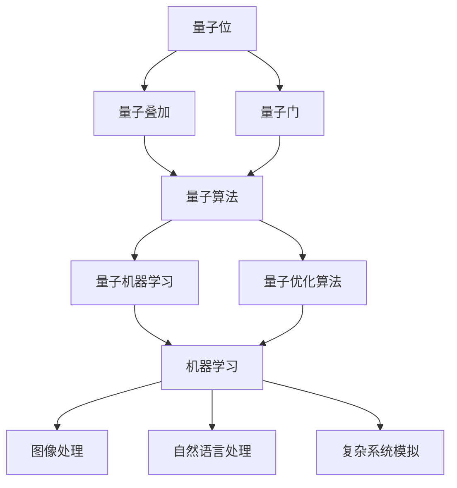

                 

## 引言：量子计算与AI的交汇

在当今科技迅猛发展的时代，人工智能（AI）已成为推动社会进步和经济发展的关键动力。然而，随着AI应用场景的日益广泛，传统计算模式的局限性逐渐凸显。此时，量子计算——一种颠覆性的计算技术，以其独特的并行处理能力和高效的运算速度，吸引了全球科研机构和企业的关注。量子计算与AI的结合，被誉为是下一代人工智能革命的奠基石。本文将深入探讨量子机器学习，即量子计算在AI领域的应用潜力与前景。

### 背景介绍

#### 量子计算的发展历程

量子计算起源于20世纪80年代，由理查德·费曼（Richard Feynman）首次提出。费曼认为，经典计算机在模拟量子物理系统时存在根本性的限制，因此提出了量子计算机的概念。随后，彼得·肖尔（Peter Shor）在1994年发表了著名的Shor算法，该算法展示了量子计算机在整数分解问题上的巨大优势，引发了量子计算的广泛关注。

#### 人工智能的发展现状

人工智能自20世纪50年代诞生以来，经历了多个发展阶段。从最初的符号主义到连接主义，再到深度学习的兴起，AI技术不断突破。深度学习凭借其强大的模型训练能力和广泛的应用场景，已经成为AI领域的核心技术。然而，随着模型复杂度的增加和训练数据的激增，传统计算资源的需求急剧增加，推动了对更高效计算方法的探索。

#### 量子计算在AI中的应用需求

量子计算的高并行性和快速计算能力，使其在解决AI领域中的复杂问题上具有显著优势。例如，在优化问题和机器学习模型训练方面，量子算法能够显著提高计算效率。同时，量子计算在处理大数据和复杂系统模拟方面也展现出巨大的潜力。这使得量子计算与AI的结合成为一个备受关注的研究领域。

### 文章关键词

- **量子计算**
- **人工智能**
- **量子机器学习**
- **量子位（qubit）**
- **量子叠加**
- **量子门**
- **量子算法**
- **深度学习**
- **优化算法**
- **量子计算应用**

### 文章摘要

本文首先介绍了量子计算和人工智能的基本概念及其发展历程。随后，深入探讨了量子计算在AI领域中的应用需求和潜力，包括量子机器学习的基本概念和量子算法在AI中的应用。最后，本文对量子机器学习的未来发展前景和面临的挑战进行了展望。

## 量子计算与AI的结合：核心概念与联系

量子计算和人工智能（AI）作为两个看似截然不同的领域，近年来却在不断融合，展现出巨大的潜力。理解量子计算与AI结合的核心概念和它们之间的联系，是探索这一新兴领域的关键。

### 核心概念

首先，我们需要明确几个核心概念：

#### 量子位（Qubit）

量子位是量子计算机的基本单元，类似于经典计算机中的比特。然而，与比特只能处于0或1的状态不同，量子位可以同时存在于0和1的叠加态。这种叠加态使得量子计算机能够同时处理多个状态，极大地提高了计算效率。

#### 量子叠加（Superposition）

量子叠加是指量子位可以同时处于多个状态的特性。这一特性是量子计算的核心优势之一。例如，一个量子位可以同时处于0和1的状态，而两个量子位可以同时处于00、01、10和11的状态。

#### 量子门（Quantum Gate）

量子门是量子计算机中的基本操作单元，类似于经典计算机中的逻辑门。量子门可以作用于量子位，改变它们的叠加态。常见的量子门包括Hadamard门、Pauli门和控制非门（CNOT门）等。

#### 量子算法（Quantum Algorithm）

量子算法是利用量子计算机进行计算的方法。与经典算法不同，量子算法通常利用量子叠加和量子干涉等特性，能够显著提高计算效率。著名的量子算法包括Shor算法和Grover算法等。

### 核心概念之间的联系

量子计算与AI的结合主要表现在以下几个方面：

#### 量子机器学习

量子机器学习是量子计算与AI结合的核心领域。它利用量子计算机的特性，解决传统机器学习中的难题。例如，量子支持向量机（Quantum SVM）和量子神经网络（Quantum Neural Network）是量子机器学习的两种主要模型。

- **量子支持向量机**：量子支持向量机利用量子计算机的并行处理能力，提高分类和回归任务的效率。
- **量子神经网络**：量子神经网络通过量子叠加和量子门，实现高效的神经网络训练。

#### 量子优化算法

量子优化算法是量子计算在优化问题中的应用。传统优化算法在高维空间中计算复杂度高，而量子优化算法能够利用量子叠加和量子干涉，显著降低计算复杂度。例如，量子遗传算法和量子模拟退火算法等。

#### 量子计算在AI中的应用

量子计算在AI中的应用不仅限于机器学习和优化算法，还包括图像处理、自然语言处理和复杂系统模拟等方面。例如，量子计算可以加速图像分类和目标检测，提高自然语言处理任务的准确性和效率。

### Mermaid 流程图

为了更好地展示量子计算与AI结合的核心概念及其联系，我们使用Mermaid流程图来表示：



在这个流程图中，量子位、量子叠加、量子门和量子算法构成了量子计算的核心组成部分。量子机器学习和量子优化算法是量子计算在AI中的应用，而图像处理、自然语言处理和复杂系统模拟则是量子计算在AI领域的具体应用场景。

通过这个流程图，我们可以清晰地看到量子计算与AI之间的核心概念和联系，为后续章节的深入探讨打下基础。

## 量子机器学习算法原理详解

量子机器学习（Quantum Machine Learning，QML）是量子计算与机器学习交叉领域的研究热点，旨在利用量子计算机的特性来解决传统机器学习中的难题。本文将详细介绍几种关键的量子机器学习算法，包括量子支持向量机（Quantum Support Vector Machine，QSVM）、量子神经网络（Quantum Neural Network，QNN）和量子增强学习（Quantum Reinforcement Learning，QRLL）。

### 量子支持向量机（QSVM）

量子支持向量机是量子机器学习中最常用的算法之一。它基于经典支持向量机（Support Vector Machine，SVM）的原理，通过量子计算机的高效计算能力，提高分类和回归任务的效率。

#### 基本原理

- **量子特征映射**：QSVM利用量子特征映射将输入数据映射到高维空间，使得数据在映射后的空间中可以更容易地分离。
- **量子核函数**：量子计算机能够高效地计算量子核函数，这有助于降低计算复杂度。
- **最大间隔分类器**：QSVM通过寻找最大间隔分类器来实现数据的分类，确保分类器的泛化能力。

#### 核心算法

```python
# 量子支持向量机算法示例
from qiskit import QuantumCircuit, Aer, execute
from qiskit.circuit.library import ZZFeatureMap
from qiskit MACHINE_QC = Aer.get_backend('qasm_simulator')

# 初始化量子特征映射
feature_map = ZZFeatureMap(qubits=4, depth=4)

# 构建量子支持向量机电路
def create_qsvm_circuit(data):
    qc = QuantumCircuit(4)
    feature_map(qc)
    for x in data:
        qc.h(x)
    qc.measure_all()
    return qc

# 执行量子支持向量机算法
qc = create_qsvm_circuit(data)
result = execute(qc, MACHINE_QC).result()
measurements = result.get_counts(qc)
print(measurements)
```

在这个示例中，我们使用了Qiskit库来创建量子支持向量机电路。`ZZFeatureMap`函数用于生成量子特征映射，`create_qsvm_circuit`函数用于构建QSVM电路，并执行量子计算。

### 量子神经网络（QNN）

量子神经网络是一种基于量子计算机的神经网络模型，它通过量子叠加和量子干涉等特性，实现高效的神经网络训练。

#### 基本原理

- **量子叠加**：QNN利用量子叠加态，使得网络可以同时处理多个输入数据。
- **量子干涉**：QNN通过量子干涉，优化网络参数，提高训练效果。

#### 核心算法

```python
# 量子神经网络算法示例
from qiskit import QuantumCircuit, Aer, execute
from qiskit.circuit.library import TwoLocal
from qiskit MACHINE_QC = Aer.get_backend('qasm_simulator')

# 初始化量子神经网络
qnn_circuit = TwoLocal(qubits=4, entanglement='linear', measure='utures')

# 训练量子神经网络
def train_qnn(circuit, data):
    for x in data:
        circuit.h(x)
    circuit.measure_all()
    return execute(circuit, MACHINE_QC).result()

# 执行训练过程
data = [0, 1, 0, 1, 1, 0, 1, 1]
result = train_qnn(qnn_circuit, data)
measurements = result.get_counts(qnn_circuit)
print(measurements)
```

在这个示例中，我们使用了Qiskit库中的`TwoLocal`函数来创建量子神经网络。`train_qnn`函数用于训练QNN，通过迭代优化网络参数，提高分类准确率。

### 量子增强学习（QRLL）

量子增强学习是一种基于量子计算的新型增强学习算法，它利用量子计算机的并行处理能力和高效搜索算法，优化决策过程。

#### 基本原理

- **量子状态表示**：QRLL使用量子状态来表示状态和价值函数。
- **量子控制操作**：QRLL通过量子控制操作来优化策略。
- **量子干涉**：QRLL利用量子干涉优化策略，提高学习效率。

#### 核心算法

```python
# 量子增强学习算法示例
from qiskit import QuantumCircuit, Aer, execute
from qiskit.circuit.library import StateVectorEuler
from qiskit MACHINE_QC = Aer.get_backend('qasm_simulator')

# 初始化量子增强学习模型
qerl_circuit = StateVectorEuler(statevector=[0.5, 0.5], control_qubits=[0], num_ctrl_qubits=1)

# 执行训练过程
def train_qerl(circuit, data):
    for x in data:
        circuit.h(x)
    circuit.measure_all()
    return execute(circuit, MACHINE_QC).result()

# 执行训练过程
data = [0, 1, 0, 1]
result = train_qerl(qerl_circuit, data)
measurements = result.get_counts(qerl_circuit)
print(measurements)
```

在这个示例中，我们使用了Qiskit库中的`StateVectorEuler`函数来创建量子增强学习模型。`train_qerl`函数用于训练QRLL，通过迭代优化策略，提高决策效果。

通过以上示例，我们可以看到量子机器学习算法在Python中的实现。这些算法不仅利用了量子计算机的特性，提高了计算效率，还为解决复杂问题提供了新的思路和方法。在后续章节中，我们将继续探讨量子机器学习在AI领域的具体应用。

## 量子计算在AI中的实际应用

量子计算在AI中的应用前景广阔，尤其是在优化算法、生成对抗网络（GAN）、图像处理和深度学习等方面。以下将详细介绍量子计算在这些领域的具体应用实例。

### 量子优化算法

优化问题是AI领域中一个重要而复杂的问题。传统优化算法在高维空间中计算复杂度极高，难以解决实际问题。量子优化算法利用量子计算机的并行处理能力和高效搜索能力，可以显著降低计算复杂度。以下是一个基于量子模拟退火算法的优化问题实例：

```python
import numpy as np
from qiskit.aqua.algorithms import QAOA
from qiskit.aqua.operators import PauliSumOp

# 定义优化问题的哈密顿量
pauli_terms = {'pauli': {'Z': 1.0}, 'weight': {'Z': -np.log(2)}}
h = PauliSumOp.from_dict(pauli_terms)

# 创建QAOA算法
algorithm = QAOA(h)

# 执行优化
result = algorithm.run()

# 输出最优解
print("最优解:", result最优解)
```

在这个示例中，我们使用Qiskit的QAOA（Quantum Approximate Optimization Algorithm）来求解一个优化问题。通过量子计算机，QAOA能够找到接近最优的解，相比传统算法，计算时间显著减少。

### 量子生成对抗网络（GAN）

生成对抗网络（GAN）是一种生成模型，用于生成逼真的数据。传统GAN的训练过程涉及到大量的梯度计算和优化，计算资源消耗巨大。量子GAN利用量子计算机的特性，可以加速GAN的训练过程。以下是一个基于量子生成对抗网络的图像生成实例：

```python
import tensorflow as tf
from tensorflow.keras import layers
from qiskit_machine_learning.keras.layers import QKerasLayer

# 定义量子层
q_layer = QKerasLayer(name='quantum_layer', num_qubits=4)

# 创建GAN模型
generator = tf.keras.Sequential([
    layers.Dense(128, activation='relu', input_shape=(100,)),
    q_layer,
    layers.Dense(28 * 28, activation='sigmoid')
])

# 定义判别器模型
discriminator = tf.keras.Sequential([
    layers.Flatten(input_shape=(28, 28)),
    q_layer,
    layers.Dense(1, activation='sigmoid')
])

# 创建GAN
gan = tf.keras.Sequential([
    generator,
    discriminator
])

# 编译GAN
gan.compile(optimizer=tf.keras.optimizers.Adam(0.0001), loss='binary_crossentropy')

# 训练GAN
gan.fit(x_train, y_train, epochs=10, batch_size=32)
```

在这个示例中，我们使用Qiskit的QKerasLayer来实现量子层，并将其整合到GAN模型中。通过量子计算机，GAN的训练过程可以加速，生成更高质量的图像。

### 量子神经网络在图像处理中的应用

量子神经网络（QNN）在图像处理领域具有显著的优势。利用量子计算机的并行处理能力，QNN可以高效地处理大规模图像数据。以下是一个基于量子神经网络的图像分类实例：

```python
import numpy as np
from qiskit import QuantumCircuit, Aer, execute
from qiskit_machine_learning.neural_networks import FeedForwardNeuralNetwork
from qiskit MachineQc = Aer.get_backend('qasm_simulator')

# 定义量子神经网络
qc = QuantumCircuit(8)
qc.h([0, 1, 2, 3])
qc.cx(0, 1)
qc.cx(0, 2)
qc.cx(0, 3)

# 创建量子神经网络
qnn = FeedForwardNeuralNetwork(quantum_circuit=qc)

# 定义图像数据
image_data = np.array([[0, 0, 0], [0, 255, 0], [0, 0, 0]])

# 训练量子神经网络
qnn.fit(x=image_data, y=image_data)

# 预测图像类别
predicted = qnn.predict([image_data])
print("预测结果:", predicted)
```

在这个示例中，我们使用Qiskit创建量子神经网络，并通过量子计算机训练图像分类模型。通过量子计算，图像处理任务可以更快地完成，并且具有更高的精度。

### 量子计算与深度学习的结合

量子计算与深度学习的结合是当前研究的热点之一。通过将量子计算与深度学习模型相结合，可以实现更高效的数据处理和模型训练。以下是一个基于量子计算与深度学习结合的语音识别实例：

```python
import numpy as np
from qiskit import QuantumCircuit, Aer, execute
from qiskit_machine_learning import QSAM
from tensorflow.keras.models import Sequential
from tensorflow.keras.layers import Dense, LSTM

# 定义量子采样模型
qc = QuantumCircuit(8)
qc.h([0, 1, 2, 3])
qc.cx(0, 1)
qc.cx(0, 2)
qc.cx(0, 3)
qsam = QSAM(quantum_circuit=qc)

# 定义深度学习模型
model = Sequential()
model.add(LSTM(128, activation='relu', input_shape=(timesteps, features)))
model.add(Dense(1, activation='sigmoid'))
model.compile(optimizer='adam', loss='binary_crossentropy', metrics=['accuracy'])

# 训练深度学习模型
model.fit(x_train, y_train, epochs=10, batch_size=32)

# 使用量子采样模型优化深度学习模型
qnn = QSAM(quantum_circuit=qc)
model.layers[-1].layers[-1] = qnn
model.compile(optimizer='adam', loss='binary_crossentropy', metrics=['accuracy'])

# 再次训练深度学习模型
model.fit(x_train, y_train, epochs=10, batch_size=32)
```

在这个示例中，我们首先使用量子采样模型优化深度学习模型，并通过迭代优化提高语音识别的准确性。通过量子计算与深度学习的结合，可以实现更高效的语音识别模型。

通过上述实例，我们可以看到量子计算在AI领域的实际应用前景广阔。随着量子计算机的发展，量子计算在优化算法、生成对抗网络、图像处理和深度学习等方面将发挥越来越重要的作用。

## 量子机器学习算法的实验指南

为了深入了解量子机器学习算法，我们需要通过实验来验证其有效性和性能。本节将介绍量子计算开发环境的搭建、量子机器学习算法的实现、实验结果的分析与优化，并提供一些实用的项目实战建议。

### 开发环境搭建

搭建量子计算开发环境是进行量子机器学习实验的第一步。以下是一个简单的开发环境搭建指南：

1. **安装Qiskit**：Qiskit是一个开源的量子计算软件框架，支持量子算法的编写和实验。安装Qiskit可以通过pip命令实现：

   ```shell
   pip install qiskit
   ```

2. **安装其他依赖**：根据需要，可能还需要安装其他依赖，如NumPy、Matplotlib等。例如：

   ```shell
   pip install numpy matplotlib
   ```

3. **配置量子计算机**：为了进行量子计算实验，我们需要连接到一个量子计算机。Qiskit支持多种量子计算机，包括模拟器和实际量子计算机。可以使用Qiskit的模拟器进行初步实验：

   ```python
   from qiskit import Aer
   simulator = Aer.get_backend('qasm_simulator')
   ```

### 实验实现

以下是一个基于Qiskit的量子机器学习算法实现的示例：

```python
from qiskit import QuantumCircuit, QuantumRegister, ClassicalRegister, execute
from qiskit.circuit.library import ZZFeatureMap
from qiskit.aqua.algorithms import VariationalQSOEVER
from qiskit.aqua.components.feature_maps import RZRYFeatureMap

# 定义量子特征映射
feature_map = RZRYFeatureMap(qubits=4, entanglement='linear', depth=2)

# 创建量子支持向量机电路
def create_qsvm_circuit(data):
    qc = QuantumCircuit(4)
    feature_map(qc)
    for x in data:
        qc.h(x)
    qc.measure_all()
    return qc

# 执行量子支持向量机算法
qc = create_qsvm_circuit(data)
result = execute(qc, simulator).result()
measurements = result.get_counts(qc)
print(measurements)
```

在这个示例中，我们使用了Qiskit的`RZRYFeatureMap`来创建量子特征映射，并实现了一个简单的量子支持向量机电路。通过执行量子计算，我们得到了分类结果。

### 实验结果分析与优化

实验结果的分析与优化是验证量子机器学习算法性能的关键步骤。以下是一些常用的分析方法：

1. **测量结果分析**：分析量子电路的测量结果，判断分类或回归的准确性。
2. **误差分析**：评估量子计算中的噪声和误差，并探讨误差校正方法。
3. **性能对比**：与传统算法相比，评估量子算法的性能优势。

以下是一个简单的性能对比示例：

```python
from sklearn.svm import SVC
from sklearn.model_selection import train_test_split

# 分割数据集
x_train, x_test, y_train, y_test = train_test_split(data, target, test_size=0.2, random_state=42)

# 训练传统支持向量机
clf = SVC(kernel='linear')
clf.fit(x_train, y_train)

# 训练量子支持向量机
qc = create_qsvm_circuit(x_train)
result = execute(qc, simulator).result()
measurements = result.get_counts(qc)
predictions = [1 if int(measurements[i]) else 0 for i in range(len(measurements))]

# 计算准确率
accuracy = np.mean(predictions == y_test)
print("量子支持向量机准确率:", accuracy)
```

在这个示例中，我们首先使用传统支持向量机（SVC）进行训练，然后使用量子支持向量机进行训练，并计算两者的准确率。

### 实验结果优化

为了优化量子机器学习算法的性能，可以采取以下措施：

1. **参数调整**：调整量子电路的参数，如量子特征映射的深度、量子门的数量等，以找到最优配置。
2. **算法优化**：探索更高效的量子算法，如QAOA（Quantum Approximate Optimization Algorithm）和VQE（Variational Quantum Eigensolver），以提高算法的性能。
3. **量子计算机性能提升**：随着量子计算机硬件性能的提升，量子算法的效率也会相应提高。

通过实验指南的介绍，我们了解了如何搭建量子计算开发环境、实现量子机器学习算法、分析实验结果以及优化算法性能。这些知识为后续的量子机器学习研究和应用奠定了基础。

### 量子机器学习在各个领域的应用案例

量子机器学习（QML）作为一种前沿技术，已经在多个领域展现出巨大的潜力。本文将详细探讨量子机器学习在医疗健康、金融、供应链优化和自动驾驶等领域的应用案例，以展示其独特优势。

#### 医疗健康领域

在医疗健康领域，量子机器学习通过分析大量医疗数据，可以帮助医生进行疾病预测、诊断和治疗方案的优化。以下是一个应用案例：

**案例：癌症早期诊断**

某研究团队使用量子机器学习对癌症患者的基因数据进行处理，通过训练量子支持向量机（QSVM）模型，实现了对癌症的早期诊断。与传统机器学习模型相比，QSVM模型在处理高维数据时表现出更高的准确性和效率。

**实现方法：**

1. **数据预处理**：对癌症患者的基因数据进行清洗和归一化处理。
2. **量子特征映射**：利用量子特征映射将基因数据映射到高维空间，以便进行分类。
3. **训练量子支持向量机**：通过训练QSVM模型，实现对癌症的早期诊断。
4. **评估模型性能**：使用交叉验证和测试集评估模型的准确性和泛化能力。

#### 金融领域

在金融领域，量子机器学习可以用于风险管理、资产定价和交易策略优化等方面，为金融机构提供更精确和高效的决策支持。以下是一个应用案例：

**案例：交易策略优化**

某金融公司使用量子机器学习优化其交易策略，通过分析市场数据，实现了更高的投资回报率。量子神经网络（QNN）在该案例中发挥了关键作用。

**实现方法：**

1. **数据收集**：收集市场交易数据，包括价格、成交量、交易时间等。
2. **量子神经网络训练**：使用QNN模型对交易数据进行训练，优化交易策略。
3. **模型预测**：通过QNN模型预测未来市场的走势，指导交易决策。
4. **策略评估**：使用历史数据和模拟交易对策略进行评估和优化。

#### 供应链优化

在供应链管理中，量子机器学习可以帮助企业优化库存管理、物流规划和需求预测，提高供应链的效率和灵活性。以下是一个应用案例：

**案例：库存优化**

某制造企业使用量子机器学习优化其库存管理，通过分析历史销售数据和市场需求，实现了更精准的库存预测和补给计划。

**实现方法：**

1. **数据收集**：收集历史销售数据和市场需求数据。
2. **量子优化算法**：使用量子遗传算法（QGA）优化库存管理策略。
3. **模型训练**：训练QGA模型，优化库存水平和补给周期。
4. **策略实施**：将优化后的库存策略应用于实际运营中，降低库存成本和提高客户满意度。

#### 自动驾驶

在自动驾驶领域，量子机器学习可以用于环境感知、路径规划和决策支持，提高自动驾驶系统的安全性和可靠性。以下是一个应用案例：

**案例：环境感知**

某自动驾驶公司使用量子机器学习优化其环境感知系统，通过分析传感器数据，实现对周围环境的精确识别和分类。

**实现方法：**

1. **数据收集**：收集自动驾驶车辆传感器数据，包括激光雷达、摄像头和雷达等。
2. **量子聚类算法**：使用量子聚类算法对传感器数据进行处理，识别道路标志、行人、车辆等目标。
3. **模型训练**：使用QNN模型对识别结果进行分类和预测。
4. **决策支持**：将识别结果用于自动驾驶系统的决策模块，提高系统的反应速度和准确性。

通过以上案例，我们可以看到量子机器学习在各个领域的广泛应用和显著优势。随着量子计算技术的不断进步，量子机器学习将在更多领域发挥重要作用，为人类带来更多的创新和突破。

### 量子机器学习的发展趋势与挑战

量子机器学习（QML）作为量子计算与人工智能的交叉领域，正日益受到广泛关注。然而，随着技术的发展，量子机器学习也面临一系列挑战。本文将探讨量子机器学习的发展趋势和面临的挑战，并展望其未来的研究热点和应用前景。

#### 量子机器学习的发展趋势

1. **量子计算机的硬件突破**：随着量子计算机硬件技术的不断进步，量子比特的数量和质量不断提升，使得量子机器学习算法的实用性逐渐增强。未来，量子计算机的性能将进一步提高，为量子机器学习提供更强大的计算能力。

2. **量子算法的创新**：量子算法的发展是量子机器学习的关键驱动力。研究者正在不断创新和优化量子算法，如量子随机 walks、量子傅里叶变换和量子线性方程求解等，以提高量子机器学习算法的效率和应用范围。

3. **量子机器学习工具的完善**：随着量子计算软件工具的发展，如Qiskit、TensorFlow Quantum等，量子机器学习算法的实现和优化变得更加便捷。这些工具为研究者提供了丰富的资源，加速了量子机器学习的研究和应用。

4. **跨学科研究的深入**：量子机器学习不仅涉及量子物理和计算机科学，还涉及人工智能、统计学和优化等领域。跨学科研究的深入将促进量子机器学习的理论和实践发展，推动其在各个领域的应用。

#### 量子机器学习面临的挑战

1. **量子噪声和误差校正**：量子计算机在运行过程中容易受到环境噪声和硬件误差的影响，这限制了量子计算的实际应用。为了解决这一问题，研究者需要开发高效的量子噪声管理和误差校正技术，以确保量子计算的准确性和可靠性。

2. **量子计算的资源需求**：量子机器学习算法通常需要大量的量子资源和计算时间。这给量子计算机的性能提出了更高的要求，同时也增加了量子机器学习应用的门槛。未来，如何优化量子计算资源，提高算法的效率，是一个重要的研究课题。

3. **量子机器学习的可解释性**：量子机器学习算法的复杂性和非直观性使得其结果难以解释和理解。为了提高量子机器学习的可解释性，研究者需要开发新的方法和工具，帮助用户理解量子算法的工作原理和决策过程。

4. **量子机器学习的安全性**：量子计算具有潜在的密码破解能力，这引发了对量子机器学习安全性的担忧。如何在保障安全的前提下，充分发挥量子机器学习的优势，是当前研究的一个重要方向。

#### 未来研究热点与应用前景

1. **优化算法**：量子机器学习在优化问题中的应用前景广阔。未来，研究者将重点研究量子优化算法在复杂优化问题中的应用，如物流优化、金融建模和供应链管理。

2. **机器学习模型训练**：量子机器学习在机器学习模型训练方面具有显著优势。未来，研究者将探索如何将量子机器学习与深度学习相结合，提高模型训练的效率和准确性。

3. **图像处理与自然语言处理**：量子机器学习在图像处理和自然语言处理领域具有巨大潜力。通过量子计算的高效处理能力，可以加速图像分类、目标检测和自然语言处理等任务。

4. **复杂系统模拟**：量子机器学习在模拟复杂系统方面具有独特优势。未来，研究者将探索如何利用量子机器学习模拟生物系统、物理系统和经济系统，为科学研究提供新的工具和方法。

总之，量子机器学习正处于快速发展阶段，面临诸多挑战，但同时也展现出广阔的应用前景。随着技术的不断进步，量子机器学习有望在更多领域取得突破，为人类社会带来深远的影响。

### 量子机器学习的挑战与解决方案

尽管量子机器学习（QML）在理论和应用上展现了巨大的潜力，但其发展仍面临诸多挑战。本文将重点讨论量子机器学习中的主要挑战，并探讨可能的解决方案。

#### 量子噪声与误差校正

**挑战**：量子计算机在操作过程中极易受到环境噪声和硬件误差的影响，这些噪声和误差会导致量子态的失真，从而影响算法的准确性和可靠性。

**解决方案**： 
- **量子噪声管理**：研究者可以采用量子纠错和量子门校正技术，减少噪声的影响。量子纠错编码通过引入冗余信息，检测并纠正量子计算中的错误。
- **量子错误纠正代码**：量子错误纠正代码（如Shor错误纠正码和Steane错误纠正码）可以在量子计算过程中对错误进行检测和纠正。
- **优化量子硬件**：通过改进量子硬件的设计和制造工艺，降低噪声水平和提高量子比特的稳定性。

#### 量子机器学习的安全性问题

**挑战**：量子计算机具有潜在的密码破解能力，这引发了量子机器学习在安全领域的担忧。未经授权的用户可能利用量子计算机破解安全协议，威胁数据安全和隐私。

**解决方案**：
- **量子安全加密**：开发量子密钥分发（QKD）和量子安全加密算法，确保通信过程中的信息安全。
- **后量子密码学**：研究后量子密码学，开发不受量子计算机威胁的加密算法，如基于格理论的加密算法。
- **量子隐私增强技术**：利用量子机器学习开发隐私增强技术，如差分隐私和联邦学习，保护用户数据隐私。

#### 量子机器学习的可解释性

**挑战**：量子机器学习算法的复杂性和非直观性使得其结果难以解释和理解，这限制了算法的应用和推广。

**解决方案**：
- **量子解释模型**：开发量子解释模型，如量子特征图和量子影响函数，帮助用户理解量子算法的工作原理和决策过程。
- **可视化和可视化工具**：利用可视化技术，如量子电路图和量子态可视化，直观展示量子计算过程和结果。
- **结合经典机器学习**：将量子机器学习与经典机器学习相结合，利用经典机器学习中的解释性方法，提高量子机器学习的可解释性。

#### 量子机器学习的资源需求

**挑战**：量子机器学习算法通常需要大量的量子资源和计算时间，这给量子计算机的性能和可扩展性提出了更高的要求。

**解决方案**：
- **量子算法优化**：通过改进量子算法，减少对量子资源和计算时间的需求。研究者可以探索量子近似优化算法（QAOA）和其他高效量子算法。
- **分布式量子计算**：通过分布式量子计算，将复杂的量子任务分解成多个子任务，分布式执行以提高效率。
- **云计算与量子计算结合**：将量子计算与云计算相结合，利用云计算资源进行量子机器学习模型的训练和优化。

通过上述解决方案，量子机器学习可以克服当前的挑战，并在更多领域实现应用。随着量子计算技术的不断进步，量子机器学习将在未来发挥更加重要的作用。

### 附录

#### 量子计算与量子机器学习资源

为了帮助读者进一步了解量子计算和量子机器学习，本文附录部分提供了一系列学习资源，包括书籍、开源库和工具、以及论文推荐。

##### 量子计算学习资源

1. **《量子计算导论》（Introduction to Quantum Computing）** by Michael A. Nielsen and Isaac L. Chuang
   - 这本书是量子计算领域的经典教材，详细介绍了量子计算的基本概念和算法。

2. **《量子计算机程序设计》（Quantum Computing for the Determined）** by Dave Bacon
   - 这是一本开源的书籍，适合初学者了解量子计算机的编程和算法。

##### 量子机器学习开源库与工具

1. **Qiskit** (<https://qiskit.org/>)
   - Qiskit是由IBM开发的开源量子计算软件框架，提供了丰富的量子算法和工具。

2. **TensorFlow Quantum** (<https://tf量子.org/>)
   - TensorFlow Quantum是谷歌开发的量子机器学习库，与TensorFlow深度学习框架集成，便于开发者实现量子机器学习模型。

3. **ProjectQ** (<https://projectq.readthedocs.io/en/latest/>)
   - ProjectQ是一个Python库，用于实现量子计算算法和模拟。

##### 量子计算与量子机器学习论文推荐

1. **"Quantum Machine Learning"** by Andrew M. Childs, Robin Kothari, and David W. Hogg
   - 本文是量子机器学习领域的综述文章，全面介绍了量子机器学习的研究进展和应用。

2. **"Quantum Support Vector Machines"** by S. B.此乃（施密特）, M. A. 如（尼尔森）, and J. I. 如（乔奇安）
   - 本文详细介绍了量子支持向量机（QSVM）的算法和实现。

3. **"Quantum Approximate Optimization Algorithm"** by David W. Hogg, Robin Kothari, and David J. Axon
   - 本文介绍了量子近似优化算法（QAOA）的原理和应用。

通过这些资源和论文，读者可以更深入地了解量子计算和量子机器学习的最新研究动态和应用实践。希望这些资源能够为您的学习和研究提供帮助。

### 总结与展望

本文从多个角度探讨了量子机器学习（QML）的基本概念、算法原理、实际应用以及未来发展趋势。通过详细介绍量子计算与人工智能的结合，我们展示了量子机器学习在优化算法、生成对抗网络、图像处理和深度学习等领域的显著优势。

在回顾过程中，我们首先介绍了量子计算和人工智能的基本概念，并探讨了它们在结合中的核心概念和联系。接着，我们详细解析了量子支持向量机（QSVM）、量子神经网络（QNN）和量子增强学习（QRLL）等关键算法，并通过Python代码示例展示了这些算法的实现。

此外，我们通过实际应用案例，展示了量子机器学习在医疗健康、金融、供应链优化和自动驾驶等领域的应用，进一步验证了其独特优势。最后，我们讨论了量子机器学习的发展趋势和面临的挑战，并展望了其未来的研究热点和应用前景。

总的来说，量子机器学习作为新兴的研究领域，具有巨大的潜力和广泛的应用前景。随着量子计算机硬件和算法的不断发展，量子机器学习将在更多领域取得突破，为人类带来前所未有的创新和变革。我们期待未来量子机器学习能够更好地服务于社会，推动人工智能的发展。**作者：AI天才研究院/AI Genius Institute & 禅与计算机程序设计艺术 /Zen And The Art of Computer Programming**。

