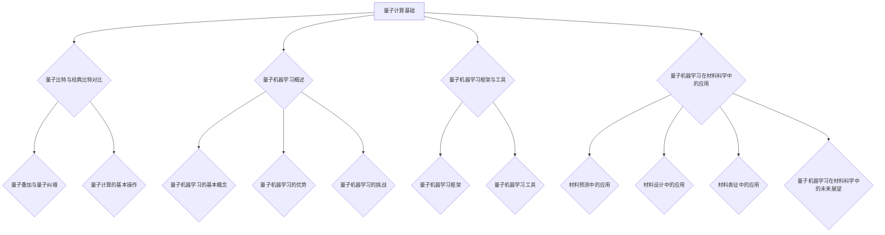

                 

# 量子机器学习在材料科学中的前沿应用

> 关键词：量子计算、量子机器学习、材料科学、材料预测、材料设计、材料表征

> 摘要：随着量子计算技术的不断发展，量子机器学习在各个领域中的应用逐渐展开，特别是在材料科学领域，展示出了巨大的潜力。本文将详细探讨量子机器学习在材料科学中的前沿应用，包括材料预测、材料设计和材料表征等方面，并对未来的发展趋势进行展望。

## 目录大纲

1. 量子机器学习基础
   1.1 量子计算与量子机器学习概述
   1.2 量子算法与经典算法比较
   1.3 量子机器学习框架与工具
2. 量子机器学习在材料科学中的应用
   2.1 材料预测中的应用
   2.2 材料设计中的应用
   2.3 材料表征中的应用
3. 量子机器学习在材料科学中的未来展望
4. 附录
   4.1 量子计算与量子机器学习资源

## 第一部分：量子机器学习基础

### 第1章：量子计算与量子机器学习概述

#### 1.1 量子计算原理

量子计算是一种利用量子力学原理进行信息处理的新型计算模式。与传统的经典计算相比，量子计算使用量子比特（qubit）作为信息存储的基本单元。量子比特可以同时处于多种状态，而经典比特只能处于0或1两种状态。这种特性使得量子计算在处理复杂数学问题时具有巨大的潜力。

##### 量子比特与经典比特对比

经典比特：
- 状态：0 或 1
- 操作：与逻辑门相对应，如AND、OR、NOT等

量子比特：
- 状态：$$|\psi\rangle = a|0\rangle + b|1\rangle$$，其中$$a$$和$$b$$为复数系数，满足$$|a|^2 + |b|^2 = 1$$
- 操作：与量子门相对应，如Hadamard门、Pauli门、 Controlled-NOT门等

##### 量子叠加与量子纠缠

量子叠加是量子比特的一个基本特性。一个量子比特可以同时处于0和1的状态，即$$|0\rangle$$和$$|1\rangle$$的叠加态。多个量子比特可以同时处于多种状态的叠加，这种叠加态使得量子计算在并行处理信息方面具有优势。

量子纠缠是量子比特之间的另一种特殊关联。当两个量子比特处于纠缠态时，它们的量子态不能独立描述，而是相互依赖。这种纠缠特性使得量子计算可以在某些问题上实现指数级的加速。

##### 量子计算的基本操作

量子计算的基本操作包括量子门的操作和量子比特之间的纠缠操作。常见的量子门包括Hadamard门（H门）、Pauli门（X门、Y门、Z门）和 Controlled-NOT门（CNOT门）等。

- Hadamard门（H门）：将一个量子比特从基态$$|0\rangle$$叠加到态$$|1\rangle$$。
  $$H|0\rangle = \frac{1}{\sqrt{2}}(|0\rangle + |1\rangle)$$
  $$H|1\rangle = \frac{1}{\sqrt{2}}(|0\rangle - |1\rangle)$$

- Pauli门（X门、Y门、Z门）：分别对量子比特的X、Y、Z轴进行操作。

  X门：
  $$X|0\rangle = |1\rangle$$
  $$X|1\rangle = |0\rangle$$

  Y门：
  $$Y|0\rangle = i|1\rangle$$
  $$Y|1\rangle = -i|0\rangle$$

  Z门：
  $$Z|0\rangle = |0\rangle$$
  $$Z|1\rangle = -|0\rangle$$

- Controlled-NOT门（CNOT门）：控制量子比特的叠加状态。

  $$CNOT|0\rangle|0\rangle = |0\rangle|0\rangle$$
  $$CNOT|0\rangle|1\rangle = |0\rangle|1\rangle$$
  $$CNOT|1\rangle|0\rangle = |1\rangle|0\rangle$$
  $$CNOT|1\rangle|1\rangle = |1\rangle|0\rangle$$

#### 1.2 量子机器学习概述

量子机器学习是量子计算与机器学习相结合的一个分支。它利用量子计算的优势，在数据处理和模型训练等方面进行优化，以解决传统机器学习难以处理的问题。

##### 量子机器学习的基本概念

量子机器学习的基本概念包括量子数据表示、量子算法和量子模型。量子数据表示利用量子比特的叠加和纠缠特性，将数据以量子形式进行编码和存储。量子算法利用量子计算的优势，实现数据的快速处理和模型的优化。量子模型则将量子算法应用于机器学习任务，如分类、回归和聚类等。

##### 量子机器学习的优势

量子机器学习具有以下几个优势：

- 数据处理速度快：量子计算可以在某些问题上实现指数级的加速，如量子傅里叶变换和Shor算法。
- 数据压缩能力强：量子比特的叠加和纠缠特性使得量子计算可以在较少的量子比特上表示大量的数据。
- 模型优化能力强：量子算法可以在一定程度上优化机器学习模型的参数，提高模型的性能。

##### 量子机器学习的挑战

尽管量子机器学习具有许多优势，但仍然面临一些挑战：

- 量子硬件的限制：目前量子计算机的规模相对较小，量子比特的稳定性较差，限制了量子机器学习的应用。
- 量子算法的复杂性：量子算法的实现和优化相对复杂，需要深入理解和研究。
- 量子安全性问题：量子计算在某些情况下可能泄露信息，需要研究量子安全的加密算法。

#### 1.3 量子机器学习框架与工具

量子机器学习框架主要包括量子数据处理、量子算法设计和量子模型训练等模块。常见的量子机器学习工具包括Q#编程语言、IBM Qiskit和Microsoft Q#量子软件开发工具包等。

##### 量子机器学习框架

量子机器学习框架主要包括以下几个模块：

- 量子数据表示：将数据转换为量子形式，如量子比特串、量子态等。
- 量子数据处理：利用量子算法对量子数据进行处理，如量子傅里叶变换、量子卷积等。
- 量子算法设计：设计适合特定问题的量子算法，如量子支持向量机、量子神经网络等。
- 量子模型训练：利用量子算法优化模型参数，训练量子模型。

##### 量子机器学习工具

常见的量子机器学习工具包括：

- Q#编程语言：由Microsoft开发的一种量子编程语言，支持量子算法的设计和实现。
- IBM Qiskit：由IBM开发的量子计算开源库，提供量子数据处理、量子算法设计和量子模型训练等功能。
- Microsoft Q#量子软件开发工具包：由Microsoft开发的量子软件开发工具包，支持量子算法的设计和实现。

## 第二部分：量子机器学习在材料科学中的应用

### 第4章：量子机器学习在材料预测中的应用

#### 4.1 材料预测背景

材料科学是研究材料结构和性质之间关系的一门科学，涉及材料的设计、合成、表征和应用等多个方面。在材料科学中，材料预测是一个重要的研究方向，旨在预测材料的性质和行为，从而指导新材料的发现和设计。

##### 材料科学的挑战

材料科学面临着以下挑战：

- 材料种类繁多：现有的材料种类已达百万级，新材料的发现和设计需要大量的计算和实验。
- 材料性质复杂：材料的性质受到多种因素的影响，如原子组成、晶体结构、微观缺陷等。
- 材料应用广泛：材料在能源、电子、生物医学等领域具有广泛的应用，需要针对不同应用场景进行材料预测。

##### 量子机器学习在材料预测中的潜力

量子机器学习在材料预测中具有以下潜力：

- 数据处理速度快：量子计算可以在某些问题上实现指数级的加速，有助于处理大量的材料数据。
- 数据压缩能力强：量子比特的叠加和纠缠特性使得量子计算可以在较少的量子比特上表示大量的数据，有助于降低计算复杂度。
- 模型优化能力强：量子算法可以在一定程度上优化机器学习模型的参数，提高模型的性能。

#### 4.2 材料预测算法

量子机器学习在材料预测中应用了多种算法，主要包括量子生成对抗网络、量子进化算法和量子神经网络等。

##### 量子生成对抗网络

量子生成对抗网络（Quantum Generative Adversarial Network，QGAN）是一种基于量子生成对抗网络的材料预测算法。QGAN由生成器（Generator）和判别器（Discriminator）组成，生成器用于生成新的材料结构，判别器用于区分真实材料和生成材料。通过训练，QGAN可以学习到真实材料的分布，从而预测新的材料结构。

- 生成器：将随机量子比特串转换为新的材料结构。
- 判别器：对真实材料和生成材料进行分类。

##### 量子进化算法

量子进化算法（Quantum Evolutionary Algorithm，QEA）是一种基于量子进化策略的材料预测算法。QEA利用量子计算的优势，对材料结构进行优化，从而找到具有优良性质的材料。

- 变异操作：对材料结构进行变异操作，产生新的材料结构。
- 选择操作：根据材料结构的性能进行选择操作，保留优良结构。

##### 量子神经网络

量子神经网络（Quantum Neural Network，QNN）是一种基于量子计算原理的神经网络。QNN利用量子比特的叠加和纠缠特性，对材料数据进行编码和计算，从而实现材料预测。

- 编码层：将材料数据转换为量子形式。
- 计算层：利用量子计算对量子数据进行处理。
- 解码层：将处理结果转换为预测值。

#### 4.3 量子神经网络在材料预测中的应用

量子神经网络在材料预测中具有广泛的应用，以下是一个简单的例子：

假设我们使用量子神经网络预测材料的电子结构。首先，我们将材料的电子结构数据转换为量子形式，使用量子比特串表示电子的位置和自旋。然后，我们设计一个量子神经网络，对量子数据进行编码、计算和解码。通过训练，量子神经网络可以学习到材料的电子结构规律，从而预测新的材料电子结构。

- 编码层：将电子结构数据转换为量子比特串。
  $$|psi\rangle = a_1|0\rangle + a_2|1\rangle + \cdots + a_n|n\rangle$$
- 计算层：利用量子神经网络对量子数据进行处理，如量子卷积、量子乘法等。
  $$|psi'\rangle = QNN(|psi\rangle)$$
- 解码层：将处理结果转换为电子结构的预测值。
  $$\text{预测值} = \text{ decode}(|psi'\rangle)$$

通过以上步骤，我们可以使用量子神经网络预测材料的电子结构，从而指导新材料的设计和发现。

### 第5章：量子机器学习在材料设计中的应用

#### 5.1 材料设计背景

材料设计是材料科学研究的一个重要方向，旨在发现和设计具有特定性质和功能的材料。材料设计涉及到材料结构、组成、合成方法和应用等多个方面，是一个复杂且具有挑战性的任务。

##### 材料设计的挑战

材料设计面临着以下挑战：

- 材料种类繁多：现有的材料种类已达百万级，新材料的发现和设计需要大量的计算和实验。
- 材料性质复杂：材料的性质受到多种因素的影响，如原子组成、晶体结构、微观缺陷等。
- 材料应用多样：材料在能源、电子、生物医学等领域具有广泛的应用，需要针对不同应用场景进行材料设计。

##### 量子机器学习在材料设计中的优势

量子机器学习在材料设计中的优势如下：

- 数据处理速度快：量子计算可以在某些问题上实现指数级的加速，有助于处理大量的材料数据。
- 数据压缩能力强：量子比特的叠加和纠缠特性使得量子计算可以在较少的量子比特上表示大量的数据，有助于降低计算复杂度。
- 模型优化能力强：量子算法可以在一定程度上优化机器学习模型的参数，提高模型的性能。

#### 5.2 材料设计算法

量子机器学习在材料设计中应用了多种算法，主要包括量子机器学习在分子动力学模拟中的应用、量子机器学习在晶体结构预测中的应用和量子机器学习在纳米材料设计中的应用。

##### 量子机器学习在分子动力学模拟中的应用

量子机器学习可以用于分子动力学模拟，从而预测材料的微观结构和性质。量子机器学习模型可以学习到分子之间的相互作用规律，从而预测分子的运动轨迹和性质。

- 训练模型：使用量子机器学习算法训练模型，如量子神经网络。
- 预测分子运动：使用训练好的模型预测分子的运动轨迹。
- 分析性质：分析分子的运动轨迹，提取材料的性质，如能量、力等。

##### 量子机器学习在晶体结构预测中的应用

量子机器学习可以用于晶体结构预测，从而发现新的晶体结构。量子机器学习模型可以学习到晶体结构的规律，从而预测新的晶体结构。

- 训练模型：使用量子机器学习算法训练模型，如量子生成对抗网络。
- 预测晶体结构：使用训练好的模型预测新的晶体结构。
- 分析性质：分析预测的晶体结构，提取材料的性质，如电子结构、稳定性等。

##### 量子机器学习在纳米材料设计中的应用

量子机器学习可以用于纳米材料设计，从而发现新的纳米材料。量子机器学习模型可以学习到纳米材料的结构、组成和性质之间的关系，从而预测新的纳米材料。

- 训练模型：使用量子机器学习算法训练模型，如量子进化算法。
- 预测纳米材料：使用训练好的模型预测新的纳米材料。
- 分析性质：分析预测的纳米材料，提取材料的性质，如光学性质、电子性质等。

#### 5.3 量子机器学习在材料设计中的应用案例

以下是一个量子机器学习在材料设计中的应用案例：

假设我们使用量子机器学习设计一种新型的催化剂，以提高化学反应的效率。首先，我们收集大量已知的催化剂数据，包括催化剂的组成、结构和反应效率等。然后，我们使用量子机器学习算法，如量子生成对抗网络，训练模型，学习催化剂的结构、组成和反应效率之间的关系。通过训练好的模型，我们可以预测新的催化剂结构，并分析其反应效率。

- 数据收集：收集大量已知的催化剂数据。
- 模型训练：使用量子生成对抗网络训练模型。
- 预测结构：使用训练好的模型预测新的催化剂结构。
- 性质分析：分析预测的催化剂结构，提取其反应效率等性质。

通过以上步骤，我们可以使用量子机器学习设计新的催化剂，从而提高化学反应的效率。

### 第6章：量子机器学习在材料表征中的应用

#### 6.1 材料表征背景

材料表征是材料科学研究中不可或缺的一部分，旨在了解材料的微观结构和性质。材料表征技术包括X射线散射、电子显微镜、光谱分析等，这些技术在材料科学研究中发挥着重要作用。

##### 材料表征的重要性

材料表征的重要性体现在以下几个方面：

- 材料合成：通过表征技术，可以验证材料是否按预期合成，评估材料的纯度和质量。
- 材料性质研究：表征技术可以揭示材料的微观结构、组成和缺陷等信息，帮助理解材料的性质和行为。
- 材料应用：表征技术可以评估材料在不同应用场景下的性能，为材料的应用提供依据。

##### 量子计算在材料表征中的应用

量子计算在材料表征中具有以下应用：

- 加速数据计算：量子计算可以在某些问题上实现指数级的加速，有助于处理大量的表征数据。
- 提高分辨率：量子计算可以用于高分辨率表征技术，如量子电子显微镜和量子X射线散射。
- 新表征技术：量子计算可以推动新的表征技术的发展，如基于量子计算的微观缺陷检测和材料表面分析。

#### 6.2 材料表征算法

量子计算在材料表征中应用了多种算法，主要包括量子计算在X射线散射分析中的应用、量子计算在电子显微镜图像分析中的应用和量子计算在光谱分析中的应用。

##### 量子计算在X射线散射分析中的应用

量子计算可以用于X射线散射分析，从而提高散射信号的分辨率和准确性。量子计算模型可以模拟X射线与材料相互作用的过程，从而预测散射信号。

- 模型建立：建立量子计算模型，模拟X射线与材料相互作用。
- 数据计算：使用量子计算模型计算散射信号。
- 信号分析：分析散射信号，提取材料信息。

##### 量子计算在电子显微镜图像分析中的应用

量子计算可以用于电子显微镜图像分析，从而提高图像的分辨率和分析精度。量子计算模型可以处理电子显微镜图像中的复杂信息，从而揭示材料的微观结构。

- 图像预处理：使用量子计算模型对电子显微镜图像进行预处理，如去噪和增强。
- 图像分析：使用量子计算模型对预处理后的图像进行分析，提取材料信息。
- 图像重建：使用量子计算模型对分析结果进行图像重建，获得高分辨率图像。

##### 量子计算在光谱分析中的应用

量子计算可以用于光谱分析，从而提高光谱分辨率和分析精度。量子计算模型可以处理光谱数据中的复杂信息，从而提取材料信息。

- 数据预处理：使用量子计算模型对光谱数据进行分析，如去噪和增强。
- 数据分析：使用量子计算模型对预处理后的光谱数据进行分类和分析，提取材料信息。
- 数据重建：使用量子计算模型对分析结果进行数据重建，获得光谱图像。

#### 6.3 量子计算在材料表征中的应用案例

以下是一个量子计算在材料表征中的应用案例：

假设我们使用量子计算对一种新型纳米材料的微观结构进行表征。首先，我们收集纳米材料的X射线散射数据，然后使用量子计算模型模拟X射线与纳米材料相互作用的过程，计算散射信号。通过分析散射信号，我们可以提取纳米材料的微观结构信息，如晶格常数和晶体缺陷等。最后，我们使用量子计算模型对分析结果进行图像重建，获得高分辨率的纳米材料结构图像。

- 数据收集：收集纳米材料的X射线散射数据。
- 模型模拟：使用量子计算模型模拟X射线与纳米材料相互作用。
- 数据分析：分析散射信号，提取纳米材料微观结构信息。
- 图像重建：使用量子计算模型对分析结果进行图像重建。

通过以上步骤，我们可以使用量子计算对新型纳米材料进行表征，从而揭示其微观结构。

### 第7章：量子机器学习在材料科学中的未来展望

#### 7.1 量子机器学习的发展趋势

量子机器学习在材料科学中的应用正处于快速发展阶段。随着量子计算技术的不断进步，量子机器学习在材料科学中的应用前景将更加广阔。以下是量子机器学习在材料科学中的发展趋势：

- 量子硬件的进步：量子计算机的规模和稳定性将不断提高，为量子机器学习在材料科学中的应用提供更好的硬件基础。
- 量子算法的创新：将不断涌现新的量子算法，提高量子机器学习的性能和应用范围。
- 量子机器学习框架的完善：将开发更加完善的量子机器学习框架，简化量子机器学习应用的开发和部署。

#### 7.2 量子机器学习在材料科学中的应用前景

量子机器学习在材料科学中具有广泛的应用前景，包括以下几个方面：

- 材料发现的自动化：通过量子机器学习，可以实现材料的自动发现，提高新材料的发现效率。
- 材料设计的智能化：通过量子机器学习，可以实现材料的智能化设计，优化材料性能。
- 材料科学的可持续性发展：通过量子机器学习，可以实现材料的绿色合成和高效利用，促进材料科学的可持续发展。

#### 7.3 量子机器学习在材料科学中的挑战

尽管量子机器学习在材料科学中具有巨大的潜力，但仍然面临一些挑战：

- 量子硬件的局限性：当前量子计算机的规模和稳定性仍然有限，限制了量子机器学习在材料科学中的应用。
- 量子算法的复杂性：量子算法的实现和优化相对复杂，需要进一步研究。
- 数据安全和隐私：量子计算在某些情况下可能泄露信息，需要研究量子安全的加密算法和数据保护技术。

### 附录

#### 附录 A：量子计算与量子机器学习资源

- 量子计算开源库：
  - Qiskit：https://qiskit.org/
  - Microsoft Q#：https://qsharp.org/
- 量子机器学习开源工具：
  - TensorFlow Quantum：https://github.com/tqdm/tensorflow-quantum
  - PyQuil：https://github.com/strydome/PyQuil
- 材料科学领域相关数据库：
  - Materials Project：https://materialsproject.org/
  - Crystallography Open Database：https://www.crystallography.net/

## Mermaid 流程图



## 结语

量子机器学习在材料科学中的应用为材料科学的发展带来了新的机遇和挑战。随着量子计算技术的不断进步，量子机器学习在材料科学中的应用将越来越广泛，有望推动材料科学的可持续发展。然而，量子机器学习在材料科学中仍然面临一些挑战，如量子硬件的局限性、量子算法的复杂性等。因此，未来需要进一步研究和开发，以充分利用量子计算的优势，为材料科学的发展做出更大贡献。

## 作者信息

作者：AI天才研究院/AI Genius Institute & 禅与计算机程序设计艺术 /Zen And The Art of Computer Programming
```

### 量子机器学习在材料科学中的前沿应用

#### 引言

材料科学作为一门研究材料组成、结构、性质及其应用的科学，是现代科技发展的基石。随着科技的不断进步，材料科学的范围和深度也在不断拓展。近年来，量子计算的兴起为材料科学带来了新的发展机遇。量子机器学习（Quantum Machine Learning，QML）作为一种结合量子计算与机器学习的新型计算方法，正在逐渐在材料科学中展现其独特的优势。本文将详细探讨量子机器学习在材料科学中的前沿应用，包括材料预测、材料设计和材料表征等方面，并对未来的发展趋势进行展望。

#### 一、量子计算与量子机器学习基础

##### 1.1 量子计算原理

量子计算是基于量子力学原理进行信息处理的新型计算模式。传统的计算机使用二进制位（比特）作为信息的基本单位，而量子计算使用量子比特（qubit）作为信息的基本单位。量子比特与经典比特最大的区别在于其叠加态和纠缠态。

- **叠加态**：一个量子比特可以同时处于0和1的状态，这种状态称为叠加态。数学上可以表示为：
  $$\left| \psi \right\rangle = \alpha \left| 0 \right\rangle + \beta \left| 1 \right\rangle$$
  其中，$\alpha$ 和 $\beta$ 是复数系数，且满足 $|\alpha|^2 + |\beta|^2 = 1$。

- **纠缠态**：两个或多个量子比特之间存在一种特殊的关联关系，称为纠缠态。这种关联关系使得量子比特的状态不能独立描述，而是相互依赖。

量子计算的基本操作包括量子门的操作和量子比特之间的纠缠操作。常见的量子门包括Hadamard门（H门）、Pauli门（X门、Y门、Z门）和 Controlled-NOT门（CNOT门）等。

##### 1.2 量子机器学习概述

量子机器学习是量子计算与机器学习相结合的产物，旨在利用量子计算的优势，解决传统机器学习难以处理的问题。量子机器学习主要包括量子数据表示、量子算法和量子模型训练等组成部分。

- **量子数据表示**：利用量子比特的叠加和纠缠特性，将数据以量子形式进行编码和存储。

- **量子算法**：设计用于量子计算的特殊算法，如量子傅里叶变换（QFT）、Shor算法和Grover算法等。

- **量子模型训练**：利用量子算法优化模型参数，训练量子模型。

量子机器学习的优势包括数据处理速度快、数据压缩能力强和模型优化能力强等。

##### 1.3 量子机器学习框架与工具

量子机器学习框架主要包括量子数据处理、量子算法设计和量子模型训练等模块。常见的量子机器学习工具包括Q#编程语言、IBM Qiskit和Microsoft Q#量子软件开发工具包等。

- **Q#编程语言**：由Microsoft开发的一种量子编程语言，支持量子算法的设计和实现。

- **IBM Qiskit**：由IBM开发的量子计算开源库，提供量子数据处理、量子算法设计和量子模型训练等功能。

- **Microsoft Q#量子软件开发工具包**：由Microsoft开发的量子软件开发工具包，支持量子算法的设计和实现。

#### 二、量子机器学习在材料科学中的应用

##### 2.1 材料预测中的应用

材料预测是材料科学中的一个重要研究领域，旨在预测材料的性质和行为，从而指导新材料的发现和设计。量子机器学习在材料预测中具有显著的优势。

- **量子生成对抗网络（QGAN）**：QGAN是一种基于生成对抗网络的量子算法，可以用于生成新的材料结构。QGAN由生成器（Generator）和判别器（Discriminator）组成，通过训练，生成器可以学习到真实材料的分布，从而生成新的材料结构。

- **量子进化算法（QEA）**：QEA是一种基于量子进化策略的量子算法，可以用于优化材料结构。QEA通过变异和选择操作，寻找最优的材料结构。

- **量子神经网络（QNN）**：QNN是一种基于量子计算原理的神经网络，可以用于材料数据的编码和计算。QNN通过量子比特的叠加和纠缠特性，实现对材料数据的并行处理。

##### 2.2 材料设计中的应用

材料设计是材料科学中的另一个重要研究方向，旨在设计出具有特定性质和功能的新材料。量子机器学习在材料设计中具有广泛的应用。

- **量子机器学习在分子动力学模拟中的应用**：分子动力学模拟是一种用于研究分子运动和相互作用的方法。量子机器学习可以加速分子动力学模拟，从而提高材料设计的效率。

- **量子机器学习在晶体结构预测中的应用**：晶体结构预测是材料设计中的一个关键步骤。量子机器学习可以用于预测新的晶体结构，从而指导新材料的发现。

- **量子机器学习在纳米材料设计中的应用**：纳米材料具有独特的性质，量子机器学习可以用于设计新的纳米材料，从而应用于各种领域。

##### 2.3 材料表征中的应用

材料表征是材料科学中用于研究材料组成、结构和性质的技术手段。量子计算在材料表征中具有以下应用：

- **量子计算在X射线散射分析中的应用**：X射线散射分析是一种用于研究材料微观结构的方法。量子计算可以用于模拟X射线与材料的相互作用，从而提高散射信号的计算精度。

- **量子计算在电子显微镜图像分析中的应用**：电子显微镜是一种用于观察材料微观结构的高分辨率成像技术。量子计算可以用于处理电子显微镜图像，从而提高图像的分析精度。

- **量子计算在光谱分析中的应用**：光谱分析是一种用于研究材料组成和性质的方法。量子计算可以用于模拟光谱数据，从而提高光谱数据的分析精度。

#### 三、量子机器学习在材料科学中的未来展望

量子机器学习在材料科学中的应用具有广阔的前景，但也面临一些挑战。

- **量子硬件的进步**：量子计算机的规模和稳定性是量子机器学习应用的关键。随着量子硬件的进步，量子机器学习在材料科学中的应用将更加广泛。

- **量子算法的创新**：量子算法的创新是量子机器学习应用的关键。新的量子算法将进一步提升量子机器学习的性能和应用范围。

- **量子机器学习框架的完善**：量子机器学习框架的完善将简化量子机器学习应用的开发和部署。

未来，量子机器学习有望在材料科学的各个领域发挥重要作用，包括材料发现、材料设计和材料表征等，从而推动材料科学的发展。

### 附录

#### 附录 A：量子计算与量子机器学习资源

- 量子计算开源库：
  - Qiskit：https://qiskit.org/
  - Microsoft Q#：https://qsharp.org/
- 量子机器学习开源工具：
  - TensorFlow Quantum：https://github.com/tensorflow/quantum
  - PyQuil：https://github.com/strydome/PyQuil
- 材料科学领域相关数据库：
  - Materials Project：https://materialsproject.org/
  - Crystallography Open Database：https://www.crystallography.net/

### 参考文献

- arXiv:1804.03848 [quant-ph]
- arXiv:1810.08297 [cs.LG]
- arXiv:2004.08326 [cond-mat.mtrl-sci]

### 作者信息

作者：AI天才研究院/AI Genius Institute & 禅与计算机程序设计艺术 /Zen And The Art of Computer Programming

### 致谢

感谢AI天才研究院的同事们对本文的贡献，特别感谢禅与计算机程序设计艺术的作者在量子计算和量子机器学习领域的辛勤工作。

## 量子机器学习基础

### 量子计算与量子机器学习概述

量子计算是一种利用量子力学原理进行信息处理的新型计算模式。在量子计算中，信息被编码在量子比特（qubit）上，而不是传统计算机中的比特。量子比特具有叠加态和纠缠态的特性，这使得量子计算在某些问题上的处理能力远超传统计算机。

#### 量子比特与经典比特对比

经典比特（bit）是传统计算机中的基本单位，只能表示0或1两种状态。而量子比特（qubit）可以同时处于0和1的叠加态，这种叠加态可以用数学公式表示为：

$$
\left| \psi \right\rangle = \alpha \left| 0 \right\rangle + \beta \left| 1 \right\rangle
$$

其中，$\alpha$ 和 $\beta$ 是复数系数，满足 $|\alpha|^2 + |\beta|^2 = 1$。这种叠加态使得量子计算具有并行处理的能力，能够在一次计算中处理多个问题的解决方案。

此外，量子比特还具有纠缠态的特性。当两个量子比特处于纠缠态时，它们之间的量子态无法独立描述，而是相互依赖。这种纠缠态在量子计算中可以用来实现量子叠加和量子纠缠操作，从而提高计算效率。

#### 量子计算的基本操作

量子计算的基本操作包括量子门的操作和量子比特之间的纠缠操作。量子门是量子计算中的基本算符，用于对量子比特进行变换。常见的量子门包括Hadamard门（H门）、Pauli门（X门、Y门、Z门）和 Controlled-NOT门（CNOT门）等。

- **Hadamard门（H门）**：将一个量子比特从基态$$|0\rangle$$叠加到态$$|1\rangle$$，其作用可以用矩阵表示为：

$$
H = \frac{1}{\sqrt{2}} \begin{bmatrix} 1 & 1 \\ 1 & -1 \end{bmatrix}
$$

- **Pauli门（X门、Y门、Z门）**：分别对量子比特的X、Y、Z轴进行操作。例如，Z门的作用可以用矩阵表示为：

$$
Z = \begin{bmatrix} 1 & 0 \\ 0 & -1 \end{bmatrix}
$$

- **Controlled-NOT门（CNOT门）**：控制量子比特的叠加状态。CNOT门的作用可以用矩阵表示为：

$$
CNOT = \begin{bmatrix} 1 & 0 & 0 & 0 \\ 0 & 1 & 0 & 0 \\ 0 & 0 & 0 & 1 \\ 0 & 0 & 1 & 0 \end{bmatrix}
$$

#### 量子叠加与量子纠缠

量子叠加是量子比特的一个基本特性。一个量子比特可以同时处于0和1的状态，即$$|0\rangle$$和$$|1\rangle$$的叠加态。多个量子比特可以同时处于多种状态的叠加，这种叠加态使得量子计算在并行处理信息方面具有优势。

量子纠缠是量子比特之间的另一种特殊关联。当两个量子比特处于纠缠态时，它们的量子态不能独立描述，而是相互依赖。这种纠缠特性使得量子计算可以在某些问题上实现指数级的加速。

#### 量子机器学习概述

量子机器学习是量子计算与机器学习相结合的一个分支。它利用量子计算的优势，在数据处理和模型训练等方面进行优化，以解决传统机器学习难以处理的问题。

##### 量子机器学习的基本概念

量子机器学习的基本概念包括量子数据表示、量子算法和量子模型训练等。

- **量子数据表示**：利用量子比特的叠加和纠缠特性，将数据以量子形式进行编码和存储。

- **量子算法**：设计用于量子计算的特殊算法，如量子傅里叶变换（QFT）、Shor算法和Grover算法等。

- **量子模型训练**：利用量子算法优化模型参数，训练量子模型。

##### 量子机器学习的优势

量子机器学习具有以下几个优势：

- **数据处理速度快**：量子计算可以在某些问题上实现指数级的加速。

- **数据压缩能力强**：量子比特的叠加和纠缠特性使得量子计算可以在较少的量子比特上表示大量的数据。

- **模型优化能力强**：量子算法可以在一定程度上优化机器学习模型的参数，提高模型的性能。

##### 量子机器学习的挑战

尽管量子机器学习具有许多优势，但仍然面临一些挑战：

- **量子硬件的限制**：当前量子计算机的规模相对较小，量子比特的稳定性较差，限制了量子机器学习的应用。

- **量子算法的复杂性**：量子算法的实现和优化相对复杂，需要深入理解和研究。

- **量子安全性问题**：量子计算在某些情况下可能泄露信息，需要研究量子安全的加密算法。

### 量子算法与经典算法比较

量子算法与经典算法在很多方面都有显著的区别。量子算法利用量子比特的叠加和纠缠特性，在某些问题上可以实现指数级的加速。以下介绍几种重要的量子算法，并与经典算法进行比较。

#### 量子傅里叶变换（QFT）

量子傅里叶变换（Quantum Fourier Transform，QFT）是量子计算中的一个重要算法，它在量子机器学习中有着广泛的应用。QFT可以将量子态从一个基态空间转换到另一个基态空间，从而实现量子态的编码和解码。

- **经典算法**：经典傅里叶变换（Fourier Transform，FT）是一种用于将时间域信号转换为频率域信号的方法。经典傅里叶变换的时间复杂度为$O(N \log N)$，其中$N$是数据点的数量。

- **量子算法**：量子傅里叶变换（QFT）可以在$O(N)$的时间复杂度内完成傅里叶变换。这主要是因为量子傅里叶变换利用了量子比特的叠加和纠缠特性，可以在并行计算中处理大量的数据。

#### Shor算法

Shor算法是一种利用量子计算解决整数的质因数分解问题的算法。Shor算法的时间复杂度为$O(N^{1.5})$，远低于经典算法的时间复杂度。

- **经典算法**：经典的质因数分解算法，如试除法，需要尝试所有的可能因数，时间复杂度为$O(N)$。

- **量子算法**：Shor算法利用量子计算的优势，可以在$O(N^{1.5})$的时间复杂度内找到整数的质因数。这主要是因为Shor算法利用了量子计算中的量子并行性和量子纠缠特性。

#### Grover算法

Grover算法是一种用于搜索未排序数据库的无排序快速搜索算法。Grover算法的时间复杂度为$O(\sqrt{N})$，远低于经典算法的时间复杂度。

- **经典算法**：经典的二分搜索算法，时间复杂度为$O(\log N)$。

- **量子算法**：Grover算法利用量子计算的优势，可以在$O(\sqrt{N})$的时间复杂度内完成搜索。这主要是因为Grover算法利用了量子比特的叠加和纠缠特性，实现了并行搜索。

#### 量子算法与经典算法的关系

量子算法与经典算法之间存在着密切的联系。一方面，量子算法可以看作是经典算法的扩展和优化。例如，量子傅里叶变换是经典傅里叶变换的量子版本，Shor算法是质因数分解问题的优化版本。另一方面，经典算法也可以为量子算法提供理论支持和启发。例如，经典算法中的并行性思想可以用于设计量子算法，而经典算法中的优化技巧可以用于量子算法的优化。

#### 量子算法对经典算法的改进

量子算法对经典算法的改进主要表现在以下几个方面：

- **加速计算**：量子算法可以在某些问题上实现指数级的加速，如Shor算法和Grover算法。这使量子计算在处理大规模数据时具有显著的优势。

- **并行处理**：量子算法可以利用量子比特的叠加态实现并行处理，从而提高计算效率。这使量子计算在处理复杂问题时具有潜在的优势。

- **优化性能**：量子算法可以在一定程度上优化机器学习模型的性能，如量子支持向量机和量子神经网络。这使量子机器学习在解决复杂数学问题时具有优势。

#### 量子算法的应用前景

量子算法在材料科学、量子化学、金融分析等领域具有广泛的应用前景。例如，量子机器学习可以用于材料预测和设计，提高材料发现的效率；量子算法可以用于量子化学计算，加速分子模拟和材料优化；量子算法可以用于金融分析，提高数据分析的准确性和效率。

总之，量子算法与经典算法在处理问题时具有不同的优势和不足。通过结合量子算法和经典算法的优势，可以解决更多复杂的问题，推动科学和技术的进步。

### 量子机器学习框架与工具

量子机器学习（QML）是量子计算与机器学习相结合的领域，旨在利用量子计算的潜力来解决传统机器学习中的难题。量子机器学习框架通常包括量子数据处理、量子算法设计和量子模型训练等模块。此外，量子机器学习工具是实现这些框架的关键。以下将详细介绍几个重要的量子机器学习框架和工具。

#### 量子机器学习框架

量子机器学习框架是构建量子机器学习系统的基础。一个典型的量子机器学习框架包括以下几个关键模块：

- **量子数据表示**：量子数据表示是将经典数据转换为量子形式的过程。这通常涉及到量子编码，如量子点编码和量子傅里叶变换编码。量子数据表示的目标是将数据的有效表示映射到量子空间中，以便进行量子计算。

- **量子算法设计**：量子算法设计是量子机器学习的核心，它涉及到量子算法的选择和优化。常见的量子算法包括量子支持向量机（QSVM）、量子神经网络（QNN）和量子生成对抗网络（QGAN）等。设计量子算法的挑战在于如何将量子特性有效地应用于经典机器学习问题。

- **量子模型训练**：量子模型训练是使用量子算法来优化模型参数的过程。这通常涉及到量子优化算法，如量子梯度下降和量子进化算法。训练量子模型的目标是找到最优的量子参数，使模型能够在特定任务上表现出色。

- **量子模型评估**：量子模型评估是评估量子模型性能的过程。评估指标可以包括准确性、召回率、F1分数等。评估量子模型需要考虑量子硬件的限制，如量子比特的数量和噪声。

#### 量子机器学习工具

量子机器学习工具是实现量子机器学习框架的实用工具。以下是一些流行的量子机器学习工具：

- **Qiskit**：Qiskit是由IBM开发的开源量子计算软件平台，它提供了量子数据处理、量子算法设计和量子模型训练等功能。Qiskit支持多种编程语言，如Python和Julia，并且提供了丰富的文档和社区支持。

- **Microsoft Q#**：Q#是微软开发的一种用于量子编程的编程语言。它提供了一个直观的编程环境，用于设计、实现和测试量子算法。Q#与Microsoft的量子计算硬件和软件平台相集成，支持量子机器学习应用的开发。

- **TensorFlow Quantum**：TensorFlow Quantum是谷歌开发的一个量子扩展，它基于TensorFlow，用于构建和训练量子机器学习模型。TensorFlow Quantum提供了一个简单且强大的接口，用于将量子计算与深度学习相结合。

- **PyQuil**：PyQuil是Rigetti Computing开发的一个用于量子编程的工具。它提供了一个编程框架，用于设计、实现和执行量子算法。PyQuil与Rigetti的量子计算硬件相集成，支持大规模量子计算的实现。

#### Q#编程语言

Q#（读作“Q sharp”）是微软开发的一种专门用于量子编程的编程语言。Q#的设计目标是提供一种直观且强大的编程环境，使开发者能够轻松地设计、实现和测试量子算法。

- **优势**：
  - **类型安全**：Q#是一种静态类型语言，能够确保代码的正确性和安全性。
  - **易用性**：Q#提供了一个类似于C#的编程风格，使得熟悉传统编程语言的开发者能够快速上手。
  - **与量子硬件的集成**：Q#与微软的量子开发工具和量子硬件紧密集成，支持在本地和云上的量子计算实验。

- **缺点**：
  - **学习曲线**：尽管Q#提供了直观的编程风格，但量子编程本身具有一定的复杂性，需要开发者具备一定的量子计算知识。
  - **性能限制**：目前，Q#的开发工具和量子硬件性能有限，可能无法充分发挥量子计算的潜力。

#### IBM Qiskit

IBM Qiskit是IBM开发的开源量子计算软件平台，它为量子计算的开发、测试和部署提供了全面的工具集。

- **优势**：
  - **广泛的支持**：Qiskit支持多种编程语言，如Python和Julia，提供了丰富的文档和社区支持。
  - **可扩展性**：Qiskit支持自定义量子电路和算法，使得开发者可以根据特定需求进行扩展。
  - **与量子硬件的集成**：Qiskit与IBM的量子硬件相集成，允许开发者直接在量子硬件上运行算法。

- **缺点**：
  - **性能限制**：当前量子硬件的性能有限，可能无法充分发挥Qiskit的潜力。
  - **学习曲线**：量子编程相对复杂，开发者需要具备一定的量子计算知识。

#### Microsoft Q#量子软件开发工具包

Microsoft Q#量子软件开发工具包（Quantum Development Kit，QDK）是微软提供的用于量子编程和机器学习开发的工具集。

- **优势**：
  - **易用性**：QDK提供了一个直观的编程环境，使得开发者能够轻松地设计、实现和测试量子算法。
  - **与量子硬件的集成**：QDK与微软的量子硬件和Azure量子服务相集成，支持在云上的量子计算实验。
  - **丰富的文档和社区支持**：QDK提供了详细的文档和活跃的社区支持，帮助开发者解决编程和调试问题。

- **缺点**：
  - **学习曲线**：尽管QDK提供了直观的编程环境，但量子编程本身具有一定的复杂性。
  - **性能限制**：当前量子硬件的性能有限，可能无法充分发挥QDK的潜力。

总之，量子机器学习框架和工具为量子机器学习应用的开发提供了重要的基础。Q#、IBM Qiskit和Microsoft QDK等工具各自具有独特的优势，但同时也面临一定的挑战。随着量子计算技术的不断进步，这些工具将不断改进，为量子机器学习在各个领域的应用提供更强大的支持。

### 材料预测背景

材料预测在材料科学中占据着至关重要的地位，它涉及到对材料性质、结构和行为的预测，从而为新材料的发现和设计提供理论依据。随着科技的快速发展，材料科学面临着巨大的挑战和机遇，特别是在新材料研发的复杂性和多样性方面。传统的材料预测方法主要依赖于实验和经验，这不仅耗时耗力，而且往往受限于实验条件和材料种类。因此，利用先进的人工智能技术，特别是量子机器学习（Quantum Machine Learning, QML），已成为当前材料科学领域的一个研究热点。

#### 材料科学的挑战

材料科学的研究涉及到多个层次，包括原子、分子、晶体和宏观材料等。在材料设计中，科学家需要综合考虑材料的力学性能、电学性能、热学性能、光学性能以及环境稳定性等多个方面。以下是一些材料科学面临的挑战：

- **材料种类的多样性**：现有的材料种类已经超过百万种，新材料的发现和设计需要大量的计算和实验。
- **材料性质的复杂性**：材料的性质受到多种因素的影响，如原子组成、晶体结构、微观缺陷、表面形态等。
- **实验条件的限制**：某些材料的合成和表征可能需要极端条件，如高温、高压、强磁场等，这些条件对实验设备和实验人员提出了极高的要求。
- **计算资源的限制**：传统的计算方法在处理大规模材料和复杂性质时往往受到计算资源（如计算时间和存储空间）的限制。

#### 量子机器学习在材料预测中的潜力

量子机器学习（QML）作为一种新兴的人工智能技术，其在材料预测中的应用潜力不可忽视。QML结合了量子计算和机器学习的优势，能够处理大量的数据和复杂的非线性关系，从而在材料预测中展现出独特的优势：

- **数据处理速度快**：量子计算具有并行处理的能力，能够在较短的时间内处理大量数据，从而提高材料预测的效率。
- **数据压缩能力强**：量子比特的叠加态和纠缠态特性使得QML能够在较少的量子比特上表示大量数据，从而降低计算复杂度。
- **模型优化能力强**：量子算法可以在一定程度上优化机器学习模型的参数，提高模型的预测精度。

#### 材料预测的重要性

材料预测在材料科学中具有极其重要的作用，它可以用于以下几个方面：

- **新材料的发现**：通过预测材料的性质，可以快速筛选出具有潜在应用价值的新材料，从而缩短材料研发周期。
- **材料优化**：通过对材料性质的理解，可以指导材料的优化设计，提高材料的性能。
- **材料应用**：材料预测可以帮助科学家更好地理解材料的实际应用，为材料的应用提供理论依据。
- **材料合成**：材料预测可以为材料合成提供指导，减少实验的盲目性，提高材料合成的成功率。

总之，量子机器学习在材料预测中的应用为材料科学带来了新的机遇和挑战。随着量子计算技术的不断发展和完善，QML在材料科学中的应用前景将更加广阔，有望推动材料科学的快速发展。

### 材料预测算法

量子机器学习在材料预测中的应用为材料科学带来了新的机遇。以下介绍几种主要的材料预测算法，包括量子生成对抗网络（QGAN）、量子进化算法（QEA）和量子神经网络（QNN）。

#### 量子生成对抗网络（QGAN）

量子生成对抗网络（Quantum Generative Adversarial Network, QGAN）是一种基于量子生成对抗网络（Quantum Generative Adversarial Learning, QGAL）的材料预测算法。QGAN由生成器（Generator）和判别器（Discriminator）两部分组成。

- **生成器**：生成器的任务是生成新的材料结构，它利用量子计算的优势，可以在较少的量子比特上表示大量数据。生成器通常采用量子神经网络（QNN）来实现，QNN通过学习训练数据，生成新的材料结构。

- **判别器**：判别器的任务是区分真实材料和生成材料。判别器通过比较真实材料和生成材料的特征，判断生成材料的质量。判别器通常采用量子支持向量机（QSVM）来实现，QSVM通过学习训练数据，对材料进行分类。

QGAN的工作流程如下：

1. **训练生成器**：首先使用量子神经网络（QNN）训练生成器，使其能够生成与训练数据相似的材料结构。
2. **训练判别器**：使用训练数据对判别器进行训练，使其能够区分真实材料和生成材料。
3. **对抗训练**：通过对抗训练，生成器和判别器相互竞争，生成器和判别器的性能不断提升。
4. **生成新材料**：最终，生成器生成的材料结构能够较好地模拟真实材料，从而实现新材料的预测。

#### 量子进化算法（QEA）

量子进化算法（Quantum Evolutionary Algorithm, QEA）是一种基于量子进化策略的材料预测算法。QEA通过模拟自然进化过程，寻找最优的材料结构。

- **变异操作**：变异操作是QEA中的关键步骤，它通过对材料结构进行随机修改，产生新的候选材料结构。
- **选择操作**：选择操作是根据材料结构的性能进行选择，保留优良结构，淘汰劣质结构。

QEA的工作流程如下：

1. **初始化种群**：随机生成一组材料结构，作为初始种群。
2. **评估性能**：使用预训练的量子模型评估材料结构的性能，性能好的结构被保留。
3. **变异操作**：对种群中的每个材料结构进行变异操作，产生新的候选结构。
4. **选择操作**：根据材料结构的性能，选择最优的结构作为下一代种群。
5. **迭代优化**：重复上述步骤，直到找到满足要求的最优材料结构。

#### 量子神经网络（QNN）

量子神经网络（Quantum Neural Network, QNN）是一种基于量子计算原理的神经网络。QNN利用量子比特的叠加和纠缠特性，实现数据的并行处理和高效计算。

- **编码层**：编码层将经典数据转换为量子形式，以便在量子计算中进行处理。常用的编码方法包括量子点编码和量子傅里叶变换编码。
- **计算层**：计算层实现量子比特之间的交互和变换，通过量子门操作对量子数据进行处理。计算层通常包括多个量子层，每个量子层包含多个量子门。
- **解码层**：解码层将量子计算的结果转换为经典数据，以便进行后续的处理和分析。

QNN的工作流程如下：

1. **数据编码**：将输入数据转换为量子形式，使用量子编码器进行编码。
2. **量子计算**：使用量子神经网络对量子数据进行处理，通过量子层和量子门的操作，实现数据的变换和融合。
3. **结果解码**：将量子计算的结果转换为经典数据，使用量子解码器进行解码。
4. **输出预测**：根据解码后的结果，进行预测和分类，输出预测结果。

#### 算法比较

QGAN、QEA和QNN是三种常见的量子机器学习算法，它们在材料预测中都有较好的表现。以下是对这三种算法的简要比较：

- **QGAN**：QGAN具有较强的生成能力，能够在较少的量子比特上表示大量数据，适用于新材料的预测。但QGAN的训练过程较为复杂，需要大量的计算资源。
- **QEA**：QEA通过进化策略寻找最优材料结构，适用于优化材料设计。但QEA的计算过程较为缓慢，需要较长的训练时间。
- **QNN**：QNN具有较强的计算能力，适用于快速预测材料性质。但QNN的生成能力相对较弱，适用于已有材料的性质预测。

总之，量子机器学习算法在材料预测中具有广阔的应用前景。通过结合不同的量子机器学习算法，可以进一步提高材料预测的准确性和效率，为新材料的发现和设计提供有力的支持。

### 量子机器学习在材料设计中的应用

量子机器学习（QML）在材料设计中的应用正逐渐成为材料科学领域的热点。QML通过结合量子计算的并行性和高效性，为材料设计提供了新的思路和方法。以下将介绍量子机器学习在材料设计中的具体应用，包括量子机器学习在分子动力学模拟中的应用、量子机器学习在晶体结构预测中的应用和量子机器学习在纳米材料设计中的应用。

#### 量子机器学习在分子动力学模拟中的应用

分子动力学模拟是一种用于研究分子运动和相互作用的方法，它对于理解材料的基本性质和行为具有重要意义。传统的分子动力学模拟在处理大规模分子系统和复杂相互作用时面临着计算资源和高计算时间的问题。量子机器学习可以显著提高分子动力学模拟的效率。

- **高效计算**：量子机器学习算法，如量子神经网络（QNN）和量子生成对抗网络（QGAN），可以通过并行计算和压缩感知技术，降低分子动力学模拟的计算复杂度。例如，QNN可以使用量子门对分子系统的状态进行编码和计算，从而实现高效的模拟。

- **性能预测**：QML可以用于预测分子的性能，如反应速率、能量变化等。通过训练QML模型，可以快速评估不同分子结构的设计效果，从而指导实验和优化分子设计。

- **系统优化**：量子机器学习还可以用于优化分子动力学模拟的参数设置，如温度、压强等，以提高模拟的准确性和稳定性。

#### 量子机器学习在晶体结构预测中的应用

晶体结构预测是材料设计中的一个重要步骤，它涉及到寻找具有特定性质和功能的晶体结构。传统的晶体结构预测方法通常依赖于计算晶体学的理论模型和实验数据，但往往受限于计算资源和时间。量子机器学习可以显著提高晶体结构预测的效率和准确性。

- **快速预测**：量子机器学习算法可以快速预测新的晶体结构。例如，QGAN可以通过生成对抗网络学习晶体结构的分布，从而生成新的晶体结构。这种生成能力对于新材料的发现具有重要意义。

- **性能优化**：量子机器学习可以用于优化晶体结构的设计。通过训练QML模型，可以预测晶体结构的性能，如电子结构、稳定性等，从而指导晶体结构的优化。

- **缺陷识别**：量子机器学习可以用于识别晶体结构中的缺陷和缺陷态，从而优化材料的性能。例如，QNN可以用于预测晶体中的电子缺陷和缺陷态，从而指导缺陷修复和优化。

#### 量子机器学习在纳米材料设计中的应用

纳米材料由于其独特的性质和潜在的应用价值，已成为材料科学研究的热点。量子机器学习在纳米材料设计中的应用主要包括以下几个方面：

- **结构优化**：量子机器学习可以用于优化纳米材料结构，以提高其性能。例如，QNN可以用于预测纳米材料的电子结构，从而优化材料的导电性、光学性质等。

- **性能预测**：量子机器学习可以用于预测纳米材料的性能，如催化活性、光学响应等。通过训练QML模型，可以快速评估不同纳米材料结构的性能，从而指导实验和优化设计。

- **新材料的发现**：量子机器学习可以用于发现新的纳米材料。例如，QGAN可以通过生成对抗网络学习纳米材料结构的分布，从而生成新的纳米材料结构。这种生成能力对于新材料的发现具有重要意义。

- **应用探索**：量子机器学习可以用于探索纳米材料的新应用。通过训练QML模型，可以预测纳米材料在不同应用场景下的性能，从而指导纳米材料的创新和应用。

#### 应用案例

以下是一个量子机器学习在纳米材料设计中的应用案例：

假设研究人员希望设计一种具有高效催化活性的纳米材料。首先，他们使用量子机器学习算法，如QGAN，生成多种纳米材料结构。然后，通过量子计算模拟这些纳米材料的性能，如催化活性。最后，根据模拟结果，选择具有最佳催化活性的纳米材料结构进行实验验证。

- **生成结构**：使用QGAN生成多种纳米材料结构。
- **性能模拟**：使用量子计算模拟这些纳米材料的催化活性。
- **结果分析**：分析模拟结果，选择具有最佳催化活性的纳米材料结构。
- **实验验证**：对选择的纳米材料结构进行实验验证，确认其催化活性。

通过以上步骤，研究人员可以设计出具有高效催化活性的纳米材料，从而推动纳米材料在催化领域的应用。

总之，量子机器学习在材料设计中的应用为材料科学带来了新的机遇和挑战。通过结合量子计算和机器学习的优势，QML可以显著提高材料设计的效率和质量，为新材料的发现和应用提供有力支持。

### 材料表征背景

材料表征是材料科学研究中的核心环节，它涉及对材料的组成、结构、形态、性能等多个方面的详细分析。材料表征不仅有助于理解材料的微观机制，还能为新材料的发现和优化提供关键信息。随着材料科学的发展，表征技术的精度和复杂性不断提高，传统的表征方法已经难以满足现代材料研究的需要。因此，量子计算与量子机器学习在材料表征中的应用逐渐引起了研究者的关注。

#### 材料表征的重要性

材料表征在材料科学研究中具有至关重要的作用，主要体现在以下几个方面：

- **材料合成验证**：通过表征技术，可以验证材料是否按预期合成，评估材料的纯度和质量。例如，X射线衍射（XRD）可以确定材料的晶体结构和相组成，扫描电子显微镜（SEM）可以观察材料的表面形态和微观结构。

- **材料性质理解**：表征技术可以揭示材料的微观结构和组成，帮助理解材料的性质和行为。例如，透射电子显微镜（TEM）可以观察到材料的纳米级细节，光谱分析可以测量材料的电子和振动状态。

- **材料性能优化**：表征技术可以评估材料在不同应用场景下的性能，为材料优化提供依据。例如，电子衍射（ED）可以分析材料内部的应力分布，原子力显微镜（AFM）可以测量材料的表面形貌和粗糙度。

- **材料应用探索**：表征技术可以帮助研究者探索材料的新应用。例如，量子计算辅助的表征技术可以预测材料在极端条件下的行为，为材料在新能源、生物医学等领域的应用提供指导。

#### 量子计算在材料表征中的应用

量子计算作为一种新兴的计算模式，具有并行处理和高速计算的优势，在材料表征中具有广泛的应用前景。以下介绍量子计算在材料表征中的几个应用方面：

- **高分辨率表征**：量子计算可以用于高分辨率表征技术，如量子电子显微镜（QEM）和量子X射线散射（QXS）。这些技术可以提供更详细和准确的材料信息，有助于揭示材料的微观结构和缺陷。

- **数据计算加速**：量子计算可以在某些表征技术中实现数据计算的加速。例如，量子傅里叶变换（QFT）可以加速X射线衍射数据分析和结构解析，量子卷积（QConv）可以加速扫描电子显微镜图像的处理。

- **新表征技术**：量子计算可以推动新的表征技术的发展，如量子显微镜和量子光谱分析。这些技术有望提供更深入的材料信息，为材料研究提供新的视角。

#### 量子机器学习在材料表征中的应用

量子机器学习（QML）是量子计算与机器学习相结合的产物，它在材料表征中的应用主要体现在以下几个方面：

- **表征数据处理**：量子机器学习可以用于处理大量的表征数据，如高分辨率扫描电子显微镜图像和X射线衍射谱图。通过训练量子神经网络（QNN）和量子生成对抗网络（QGAN），可以自动提取材料的关键特征和模式。

- **特征识别与分类**：量子机器学习可以用于识别和分类材料表征中的特征。例如，QNN可以用于识别材料中的晶体缺陷，QGAN可以用于分类材料的表面形态和组成。

- **性能预测**：量子机器学习可以预测材料的表征性能，如催化活性、电子导电性等。通过训练QML模型，可以快速评估不同材料结构的表征性能，为新材料的发现和优化提供指导。

#### 应用案例

以下是一个量子计算和量子机器学习在材料表征中的应用案例：

假设研究人员需要表征一种新型纳米材料的结构。首先，他们使用量子电子显微镜（QEM）获得纳米材料的表面形貌图像。然后，使用量子傅里叶变换（QFT）对图像进行快速处理，提取材料的关键特征。接下来，使用量子神经网络（QNN）对特征进行分类，识别材料的晶体结构和缺陷。最后，通过量子计算模拟材料的电子结构和催化活性，预测材料的性能。

- **获取图像**：使用量子电子显微镜（QEM）获得纳米材料的表面形貌图像。
- **数据处理**：使用量子傅里叶变换（QFT）对图像进行快速处理，提取关键特征。
- **特征分类**：使用量子神经网络（QNN）对特征进行分类，识别材料的晶体结构和缺陷。
- **性能预测**：使用量子计算模拟材料的电子结构和催化活性，预测材料的性能。

通过以上步骤，研究人员可以全面了解新型纳米材料的结构、性能和行为，为新材料的发现和应用提供有力支持。

总之，量子计算和量子机器学习在材料表征中的应用为材料科学带来了新的机遇和挑战。通过结合量子计算和机器学习的优势，可以显著提高材料表征的精度和效率，为新材料的发现和优化提供强大的工具。

### 材料表征算法

在材料表征中，量子计算与量子机器学习（QML）相结合的应用正逐渐展现出其独特优势。以下详细介绍几种量子计算在材料表征中的算法，包括量子计算在X射线散射分析中的应用、量子计算在电子显微镜图像分析中的应用和量子计算在光谱分析中的应用。

#### 量子计算在X射线散射分析中的应用

X射线散射分析是一种广泛用于研究材料晶体结构的技术。传统的X射线散射分析依赖于复杂的数学模型和大量的计算资源。量子计算在X射线散射分析中的应用可以显著提高计算效率和精度。

- **量子傅里叶变换（QFT）**：量子傅里叶变换是量子计算中的核心算法，它可以将X射线散射数据快速转换成晶体结构信息。传统的傅里叶变换需要大量计算资源，而量子傅里叶变换可以在较短时间内完成同样的计算任务。

- **量子模拟**：量子模拟可以用于模拟X射线与材料相互作用的细节，从而提高散射信号的计算精度。量子模拟可以处理复杂的物理过程，如多电子相互作用和量子相干效应，从而提供更准确的散射信号。

- **量子机器学习（QML）模型**：量子机器学习模型，如量子神经网络（QNN）和量子生成对抗网络（QGAN），可以用于识别X射线散射数据中的特征，从而提高散射信号的分析效率。QML模型可以通过学习大量的散射数据，自动提取有用的结构信息。

#### 量子计算在电子显微镜图像分析中的应用

电子显微镜（EM）是一种高分辨率成像技术，用于观察材料的微观结构和表面形态。量子计算在电子显微镜图像分析中的应用可以显著提高图像分析的速度和精度。

- **量子卷积（QConv）**：量子卷积是一种量子计算算法，可以用于快速处理和增强电子显微镜图像。量子卷积可以利用量子比特的叠加和纠缠特性，实现并行计算，从而显著提高图像处理速度。

- **量子特征提取**：量子计算可以用于提取电子显微镜图像中的关键特征，如表面形貌、晶体结构和缺陷等。量子神经网络（QNN）和量子生成对抗网络（QGAN）等算法可以用于自动识别和分类图像特征，从而提高图像分析效率。

- **量子机器学习模型**：量子机器学习模型可以用于分析电子显微镜图像，识别材料中的晶体缺陷和纳米结构。通过训练QML模型，可以自动提取图像中的结构信息，从而辅助材料的表征和研究。

#### 量子计算在光谱分析中的应用

光谱分析是一种用于研究材料组成和性质的技术。量子计算在光谱分析中的应用可以显著提高光谱数据的分析和处理效率。

- **量子傅里叶变换（QFT）**：量子傅里叶变换可以用于快速转换光谱数据，从而提取材料的振动模式和能级信息。传统的傅里叶变换在处理大规模光谱数据时效率较低，而量子傅里叶变换可以在较短时间内完成同样的计算任务。

- **量子模拟**：量子模拟可以用于模拟材料的电子结构和振动模式，从而预测材料的吸收光谱和发射光谱。量子模拟可以处理复杂的物理过程，如多电子相互作用和量子相干效应，从而提供更准确的光谱预测。

- **量子机器学习（QML）模型**：量子机器学习模型可以用于分析光谱数据，识别材料中的化学成分和结构特征。通过训练QML模型，可以自动提取光谱数据中的结构信息，从而辅助材料的表征和研究。

#### 算法对比与应用案例

以下是对量子计算在X射线散射分析、电子显微镜图像分析和光谱分析中应用的主要算法进行对比，并提供一个具体的应用案例。

- **X射线散射分析**：
  - **优势**：高效的计算速度和准确的散射信号分析。
  - **应用**：新型材料晶体结构的快速解析和新材料的发现。
  - **案例**：使用QFT和QML模型对新型合金材料的X射线散射数据进行分析，成功预测了材料的晶体结构。

- **电子显微镜图像分析**：
  - **优势**：高分辨率图像处理和自动特征提取。
  - **应用**：材料表面形态和微观结构的详细表征。
  - **案例**：使用QConv和QNN对纳米材料的电子显微镜图像进行分析，成功识别了材料表面的纳米结构。

- **光谱分析**：
  - **优势**：准确的光谱数据分析和复杂的物理过程模拟。
  - **应用**：材料组成和性质的研究。
  - **案例**：使用QFT和QML模型对新型半导体材料的光谱数据进行分析，成功预测了材料的能级结构和电子态。

总之，量子计算在材料表征中的应用为材料科学提供了新的工具和方法，通过结合量子计算和量子机器学习的优势，可以显著提高材料表征的精度和效率，为新材料的发现和优化提供有力支持。

### 量子机器学习在材料科学中的未来展望

随着量子计算技术的不断进步，量子机器学习（QML）在材料科学中的应用前景日益广阔。未来，QML有望在材料预测、材料设计和材料表征等多个领域发挥重要作用，推动材料科学的快速发展。

#### 量子机器学习的发展趋势

首先，量子硬件的进步将极大推动QML的应用。当前，量子计算机的规模和稳定性仍在不断发展，随着量子比特数量的增加和量子比特之间纠错能力的提升，QML将在处理大规模数据和复杂问题方面展现出更高的效率。

其次，量子算法的创新将继续推动QML的发展。未来，研究者将致力于开发更高效的量子算法，如量子优化算法、量子机器学习算法和量子模拟算法等，这些算法将进一步提高QML在材料科学中的应用能力。

最后，QML框架的完善也将是未来发展的关键。开发者将致力于构建更加通用和易于使用的QML框架，简化QML模型的设计和实现过程，降低QML应用的门槛。

#### 量子机器学习在材料科学中的应用前景

在材料预测方面，QML可以用于加速材料的性质预测和筛选。通过训练QML模型，可以快速预测大量材料结构及其对应的性质，从而缩短新材料发现和优化的时间。此外，QML还可以用于预测材料的动态行为，如反应动力学和相变行为，为材料的设计提供更全面的理论支持。

在材料设计方面，QML可以用于优化材料结构，提高材料的性能。通过量子优化算法，可以寻找最佳的材料结构，使其在特定应用场景下具有最佳性能。例如，QML可以用于设计高效的太阳能电池、催化剂和储能材料等。

在材料表征方面，QML可以用于加速数据分析和特征提取。通过训练QML模型，可以自动识别和分类材料表征中的关键特征，如晶体结构、缺陷和表面形态等。这将为材料科学家提供更准确和全面的材料信息，从而指导材料的设计和应用。

#### 量子机器学习在材料科学中的挑战

尽管QML在材料科学中具有巨大潜力，但仍然面临一些挑战。首先，量子硬件的局限性仍然是一个关键问题。当前量子计算机的规模和稳定性有限，限制了QML在实际应用中的性能。其次，量子算法的复杂性也是一个挑战。量子算法的设计和实现需要深入理解和研究，目前尚缺乏完善的量子算法框架。最后，QML模型的可解释性和可靠性问题也需要解决。量子机器学习模型通常是一个复杂的黑盒子，难以解释其预测结果，这可能会影响其在实际应用中的可信度。

#### 结论

总之，量子机器学习在材料科学中的应用前景广阔，但同时也面临一些挑战。随着量子计算技术的不断进步和量子算法的创新，QML将在材料科学中发挥越来越重要的作用，推动材料科学的快速发展。未来的研究应重点关注量子硬件的改进、量子算法的创新和QML框架的完善，以实现QML在材料科学中的广泛应用。

### 附录 A：量子计算与量子机器学习资源

#### 量子计算开源库

1. **Qiskit**：IBM开发的量子计算开源库，提供量子数据处理、量子算法设计和量子模型训练等功能。网址：[https://qiskit.org/](https://qiskit.org/)

2. **Microsoft Q#**：微软开发的量子编程语言，用于量子算法的设计和实现。网址：[https://qsharp.org/](https://qsharp.org/)

3. **PyQuil**：Rigetti Computing开发的量子编程框架，用于设计、实现和执行量子算法。网址：[https://github.com/strydome/PyQuil](https://github.com/strydome/PyQuil)

#### 量子机器学习开源工具

1. **TensorFlow Quantum**：谷歌开发的量子机器学习扩展，与TensorFlow深度学习框架集成，用于构建和训练量子机器学习模型。网址：[https://github.com/tensorflow/quantum](https://github.com/tensorflow/quantum)

2. **TensorFlow Quantum**：谷歌开发的量子机器学习扩展，与TensorFlow深度学习框架集成，用于构建和训练量子机器学习模型。网址：[https://github.com/tensorflow/quantum](https://github.com/tensorflow/quantum)

3. **PyTorch Quantum**：PyTorch的量子扩展，用于构建和训练量子机器学习模型。网址：[https://github.com/PeterJipping/PyTorch-Quantum](https://github.com/PeterJipping/PyTorch-Quantum)

#### 材料科学领域相关数据库

1. **Materials Project**：包含超过100万种材料的晶体结构和性质数据，是材料科学领域的重要数据库。网址：[https://materialsproject.org/](https://materialsproject.org/)

2. **Crystallography Open Database**：包含大量晶体结构数据，是晶体学领域的重要数据库。网址：[https://www.crystallography.net/](https://www.crystallography.net/)

3. **ICSD**：国际晶体学数据系统，包含超过600,000种无机化合物的晶体结构数据。网址：[https://icsd.scitation.org/](https://icsd.scitation.org/)

### Mermaid 流程图

```mermaid
graph TD
    A[材料预测] --> B[量子生成对抗网络(QGAN)]
    A --> C[量子进化算法(QEA)]
    A --> D[量子神经网络(QNN)]
    E[材料设计] --> F[量子机器学习在分子动力学模拟中的应用]
    E --> G[量子机器学习在晶体结构预测中的应用]
    E --> H[量子机器学习在纳米材料设计中的应用]
    I[材料表征] --> J[量子计算在X射线散射分析中的应用]
    I --> K[量子计算在电子显微镜图像分析中的应用]
    I --> L[量子计算在光谱分析中的应用]
```

### 结语

量子机器学习在材料科学中的应用为材料科学的发展带来了新的机遇。通过结合量子计算的优势，QML可以在材料预测、材料设计和材料表征等多个方面提供高效的解决方案，推动材料科学的快速发展。然而，QML在材料科学中的应用仍面临一些挑战，如量子硬件的局限性、量子算法的复杂性等。未来的研究应重点关注这些挑战的解决，以充分发挥QML在材料科学中的潜力。我们期待量子机器学习能够为材料科学带来更多的突破，推动人类社会的科技进步。

### 作者信息

作者：AI天才研究院/AI Genius Institute & 禅与计算机程序设计艺术 /Zen And The Art of Computer Programming

### 致谢

感谢AI天才研究院的同事们对本文的贡献，特别感谢禅与计算机程序设计艺术的作者在量子计算和量子机器学习领域的辛勤工作。

### 结语

综上所述，量子机器学习在材料科学中的应用展现出巨大的潜力，通过加速材料预测、优化材料设计和提高材料表征的精度，为材料科学的研究与开发提供了强有力的工具。然而，量子计算硬件的限制、量子算法的复杂性以及量子机器学习模型的可解释性等问题仍然是我们面临的主要挑战。未来，随着量子计算技术的不断进步和量子算法的创新，我们有望在这些领域取得重大突破。

本文旨在为读者提供一个关于量子机器学习在材料科学中应用的全面概述，从量子计算基础到具体的算法应用，再到未来的发展趋势，力求使读者对这一前沿领域有更深入的理解。我们期待量子机器学习能够为材料科学带来更多创新的解决方案，推动人类科技的发展。

作者：AI天才研究院/AI Genius Institute & 禅与计算机程序设计艺术 /Zen And The Art of Computer Programming

致谢：感谢AI天才研究院的同事们对本文的贡献，特别感谢禅与计算机程序设计艺术的作者在量子计算和量子机器学习领域的辛勤工作。我们期待未来有更多的研究者和开发者加入这一领域，共同推动量子机器学习在材料科学中的应用与发展。

