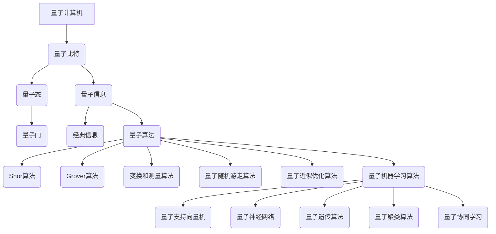

                 

### 《量子机器学习算法：利用量子优势的AI新范式》

#### 关键词：
- 量子计算机
- 机器学习
- 量子算法
- 量子支持向量机
- 量子神经网络
- 量子遗传算法
- 量子协同学习

#### 摘要：
本文深入探讨了量子机器学习算法及其在AI领域的应用。通过介绍量子计算机的基本原理和量子信息基础，我们揭示了量子比特、量子态和量子门的独特特性。随后，本文详细阐述了Shor算法、Grover算法等经典量子算法，以及量子支持向量机、量子神经网络、量子遗传算法和量子聚类算法等量子机器学习算法。通过结合Python源代码和数学模型，我们展示了量子机器学习在深度学习、大数据分析和自然语言处理等领域的强大潜力。最后，本文总结了量子机器学习开发的工具与资源，为读者提供了进一步学习和实践的方向。

---

## 第一部分：量子机器学习概述

### 第1章：量子计算机与量子信息基础

量子计算机作为一种全新的计算模型，具有与传统计算机截然不同的工作原理。本节将介绍量子计算机的基本原理，包括量子比特、量子态和量子门的概念，并探讨量子信息与经典信息的对比。最后，我们将讨论量子计算机的工作原理，为后续的量子算法介绍和量子机器学习算法的探讨打下基础。

#### 1.1 量子计算机的基本原理

量子计算机的原理基于量子力学的基本概念，特别是量子比特（qubit）的概念。与经典计算机中的比特（bit）不同，量子比特可以同时处于0和1的叠加态，这种叠加态是量子计算机的核心优势之一。

**量子比特（Qubit）**：量子比特是量子计算机中的基本单元，它可以同时存在于0和1的状态，这被称为叠加态。用数学语言描述，量子比特的状态可以表示为：

\[ \left| \psi \right\rangle = \alpha \left| 0 \right\rangle + \beta \left| 1 \right\rangle \]

其中，\( \alpha \) 和 \( \beta \) 是复数系数，满足 \( |\alpha|^2 + |\beta|^2 = 1 \)。

**量子态（Quantum State）**：量子比特的叠加态可以扩展到多个量子比特，形成更为复杂的量子态。多个量子比特的叠加态可以表示为：

\[ \left| \psi \right\rangle = \sum_{i} c_i \left| i \right\rangle \]

其中，\( c_i \) 是第 \( i \) 个量子比特的叠加系数。

**量子门（Quantum Gate）**：量子门是量子计算机中的基本操作，它作用于量子比特，改变量子比特的叠加态。常见的量子门包括Hadamard门（创建叠加态）、Pauli X门（翻转量子比特）、Pauli Z门（翻转量子比特的相位）等。

#### 1.2 量子比特与量子叠加

量子比特的叠加态是其区别于经典比特的关键特性。在量子计算机中，多个量子比特可以同时处于多个状态的叠加，这种叠加态在特定的量子算法中可以显著提高计算效率。

**量子叠加态的例子**：假设我们有两个量子比特，初始状态为：

\[ \left| \psi_0 \right\rangle = \left| 00 \right\rangle \]

当施加Hadamard门（\( H \)）后，两个量子比特的状态变为：

\[ \left| \psi_1 \right\rangle = H \left| \psi_0 \right\rangle = \frac{1}{\sqrt{2}} \left( \left| 00 \right\rangle + \left| 10 \right\rangle \right) \]

在这个例子中，两个量子比特的状态不再是单一的 \( \left| 00 \right\rangle \) 或 \( \left| 10 \right\rangle \)，而是这两个状态的叠加。

#### 1.3 量子态与量子门

量子态通过量子门的作用可以发生改变，形成新的量子态。量子门是线性变换，作用于量子态时，可以改变量子态的叠加系数和相位。

**量子态的变换**：假设一个量子比特的初始状态为 \( \left| \psi \right\rangle = \alpha \left| 0 \right\rangle + \beta \left| 1 \right\rangle \)，当施加Pauli X门（\( X \)）后，量子态变为：

\[ \left| \psi' \right\rangle = X \left| \psi \right\rangle = \alpha \left| 1 \right\rangle - \beta \left| 0 \right\rangle \]

在这个变换中，量子比特的状态从 \( \left| 0 \right\rangle \) 变换到 \( \left| 1 \right\rangle \)，同时叠加系数和相位也发生了改变。

#### 1.4 量子信息与经典信息的对比

量子信息与经典信息有着本质的区别。经典信息依赖于比特的离散状态（0或1），而量子信息依赖于量子比特的叠加态和纠缠态。

**叠加态与离散态**：经典计算机中的信息处理依赖于离散的二进制状态（0或1），而量子计算机中的信息处理依赖于量子比特的叠加态，这使得量子计算机在并行处理信息方面具有显著优势。

**纠缠态与独立态**：量子比特之间的纠缠态是量子信息的重要特性。当两个量子比特处于纠缠态时，它们的状态是相互依赖的，而经典比特的状态是独立的。这种纠缠态可以在量子算法中实现高效的量子并行计算。

#### 1.5 量子计算机的工作原理

量子计算机的工作原理基于量子态的叠加和量子门的操作。量子计算机通过初始化量子比特的初始状态，应用一系列量子门，最终通过测量得到计算结果。

**量子初始化**：量子计算机首先将量子比特初始化为特定的叠加态，例如 \( \left| 0 \right\rangle \) 或 \( \left| 1 \right\rangle \)。

**量子计算**：量子计算机通过应用一系列量子门，将量子比特的状态从初始状态变换为目标状态。这个过程中，量子态的叠加和纠缠起到了关键作用。

**量子测量**：最终，量子计算机通过测量量子比特的状态，得到计算结果。量子测量会导致量子态的坍缩，从叠加态变为确定的基态。

#### 小结

量子计算机与量子信息基础是量子机器学习算法的核心。理解量子比特、量子态和量子门的概念，以及量子信息与经典信息的对比，有助于我们更好地掌握量子机器学习算法的工作原理和应用。在接下来的章节中，我们将详细探讨量子算法基础和量子机器学习算法，揭示量子优势在AI领域的应用潜力。

---

### 第2章：量子算法基础

量子算法是量子计算机的核心组成部分，它利用量子比特的叠加和纠缠特性，实现了传统计算机无法实现的高效算法。在本章中，我们将介绍几种重要的量子算法，包括Shor算法、Grover算法、变换和测量算法、量子随机游走算法以及量子近似优化算法。通过这些算法的介绍，我们将更好地理解量子计算机的强大计算能力。

#### 2.1 Shor算法

Shor算法是由彼得·肖尔（Peter Shor）在1994年提出的一种量子算法，它能够高效地求解大整数的质因数分解问题。质因数分解问题是一个著名的数学难题，它在密码学中具有重要意义，因为许多加密算法的安全性依赖于大整数的质因数分解困难。

**算法原理**：
- **量子态初始化**：将一个量子比特初始化为叠加态 \( \left| x \right\rangle \)。
- **量子电路构造**：应用一系列量子门，将量子态变换为 \( \left| x^N \right\rangle \)。
- **量子测量**：通过量子测量，得到 \( x \) 的模 \( N \) 的结果，从而推断出 \( N \) 的质因数。

**算法步骤**：
1. **初始化**：将量子比特初始化为 \( \left| x \right\rangle \)。
2. **量子电路**：应用 \( N \) 个Hadamard门，将量子态变换为 \( \left| x^N \right\rangle \)。
3. **相位估计**：应用一个角度为 \( \frac{2\pi k}{N} \) 的旋转门，其中 \( k \) 是模 \( N \) 的整数。
4. **逆量子电路**：应用与步骤3相反的量子电路，将量子态变换回初始状态。
5. **测量**：测量量子比特，得到 \( x \) 的模 \( N \) 的结果。

通过这个算法，Shor展示了量子计算机在密码学中的巨大潜力，因为它可以轻松地破解依赖于大整数质因数分解困难的加密算法。

#### 2.2 Grover算法

Grover算法是由洛维·格罗弗（Lov K. Grover）在1996年提出的一种量子搜索算法，它能够在未经排序的数据库中快速查找特定元素。Grover算法展示了量子计算机在搜索问题上的显著优势。

**算法原理**：
- **初始化**：将量子比特初始化为叠加态 \( \left| \psi \right\rangle \)。
- **量子逻辑操作**：应用一系列量子逻辑操作，使得量子态更倾向于目标状态。
- **测量**：通过量子测量，得到目标状态的输出。

**算法步骤**：
1. **初始化**：将量子比特初始化为叠加态 \( \left| \psi \right\rangle \)。
2. **构建反射器**：应用一个反射器，将量子态映射到目标状态的相反方向。
3. **迭代**：重复应用Grover迭代，使得量子态更倾向于目标状态。
4. **测量**：测量量子比特，得到目标状态的输出。

通过这个算法，Grover展示了量子计算机在搜索问题上的巨大潜力，它能够在多项式时间内完成搜索任务，而传统计算机则需要指数级时间。

#### 2.3 变换和测量算法

变换和测量算法（Transformation and Measurement，简称T&M算法）是一种通用的量子算法，它通过变换量子态并测量变换后的量子态，来估计某个概率分布。这种算法在统计物理和机器学习等领域具有广泛的应用。

**算法原理**：
- **量子态初始化**：将量子比特初始化为叠加态。
- **量子变换**：应用一系列量子变换，使得量子态逼近目标态。
- **量子测量**：测量量子态，得到概率分布估计。

**算法步骤**：
1. **初始化**：将量子比特初始化为叠加态 \( \left| \psi \right\rangle \)。
2. **量子变换**：应用一系列量子变换，使得量子态逼近目标态 \( \left| \phi \right\rangle \)。
3. **测量**：测量量子比特，得到概率分布估计。

通过变换和测量算法，我们可以高效地估计复杂概率分布，这在机器学习中的特征选择和模型选择等问题中具有重要应用。

#### 2.4 量子随机游走算法

量子随机游走算法（Quantum Random Walk，简称QRW算法）是量子计算机中的一种重要算法，它模拟了经典随机游走的过程，但在量子层面上具有更高的效率。量子随机游走算法在图论和复杂网络分析等领域具有重要应用。

**算法原理**：
- **量子态初始化**：将量子比特初始化为叠加态。
- **量子变换**：应用一系列量子变换，模拟随机游走过程。
- **量子测量**：测量量子比特，得到随机游走的结果。

**算法步骤**：
1. **初始化**：将量子比特初始化为叠加态 \( \left| \psi \right\rangle \)。
2. **量子变换**：应用一系列量子变换，模拟随机游走过程。
3. **测量**：测量量子比特，得到随机游走的结果。

通过量子随机游走算法，我们可以高效地解决图论中的问题，如最短路径、团检测等。

#### 2.5 量子近似优化算法

量子近似优化算法（Quantum Approximate Optimization Algorithm，简称QAOA）是一种通用的量子优化算法，它通过优化量子态来求解优化问题。QAOA在组合优化和机器学习等领域具有广泛应用。

**算法原理**：
- **量子态初始化**：将量子比特初始化为叠加态。
- **量子变换**：应用一系列量子变换，使得量子态逼近最优解。
- **测量**：测量量子比特，得到优化问题的解。

**算法步骤**：
1. **初始化**：将量子比特初始化为叠加态 \( \left| \psi \right\rangle \)。
2. **量子变换**：应用一系列量子变换，使得量子态逼近最优解。
3. **测量**：测量量子比特，得到优化问题的解。

通过量子近似优化算法，我们可以高效地解决组合优化问题，如旅行商问题、调度问题等。

#### 小结

量子算法是量子计算机的核心组成部分，它利用量子比特的叠加和纠缠特性，实现了传统计算机无法实现的高效算法。在本章中，我们介绍了Shor算法、Grover算法、变换和测量算法、量子随机游走算法和量子近似优化算法，展示了量子计算机在质因数分解、搜索、统计物理和优化等领域的强大计算能力。在接下来的章节中，我们将进一步探讨量子机器学习算法，揭示量子优势在AI领域的应用潜力。

---

## 第二部分：量子机器学习算法

量子机器学习算法是量子计算机在人工智能领域的应用之一，它利用量子比特的叠加和纠缠特性，实现了传统机器学习算法无法达到的计算效率。本节将介绍几种重要的量子机器学习算法，包括量子支持向量机、量子神经网络、量子遗传算法和量子聚类算法。通过这些算法的介绍，我们将更好地理解量子机器学习算法的工作原理和应用。

### 第3章：量子支持向量机

量子支持向量机（Quantum Support Vector Machine，简称QSVM）是一种基于量子计算技术的支持向量机算法。它利用量子比特和量子门，实现了支持向量机分类和回归任务的高效求解。

#### 3.1 传统支持向量机回顾

支持向量机（Support Vector Machine，简称SVM）是一种经典的机器学习算法，它在分类和回归任务中表现出色。SVM的核心思想是通过找到一个最佳的超平面，将数据集划分为不同的类别或预测连续的值。

**支持向量机的工作原理**：

1. **特征空间映射**：将原始数据映射到一个高维特征空间。
2. **寻找最佳超平面**：通过最大化间隔，找到一个最佳的超平面。
3. **分类决策**：根据测试数据的特征空间映射结果，判断其属于哪个类别。

**SVM的数学模型**：

给定训练数据集 \( \left\{ (x_i, y_i) \right\}_{i=1}^N \)，其中 \( x_i \in \mathbb{R}^d \) 是输入特征，\( y_i \in \{-1, +1\} \) 是标签。SVM的优化问题可以表示为：

\[
\begin{aligned}
\min_{\mathbf{w}, b} & \quad \frac{1}{2} ||\mathbf{w}||^2 \\
s.t. & \quad y_i (\mathbf{w} \cdot \mathbf{x_i} + b) \geq 1, \quad i = 1, 2, \ldots, N.
\end{aligned}
\]

其中，\( \mathbf{w} \) 是权重向量，\( b \) 是偏置项。

#### 3.2 量子支持向量机原理

量子支持向量机（QSVM）是支持向量机在量子计算机上的实现。它利用量子比特和量子门，将传统支持向量机的优化问题转化为量子态的优化问题。

**量子支持向量机的工作原理**：

1. **量子态初始化**：将量子比特初始化为叠加态。
2. **量子特征映射**：通过量子门，将原始数据映射到量子态。
3. **量子超平面优化**：通过量子变换和测量，找到最佳的超平面。
4. **分类决策**：根据量子测量的结果，判断测试数据属于哪个类别。

**QSVM的数学模型**：

假设有 \( N \) 个量子比特，每个量子比特对应一个输入特征。量子支持向量机的优化问题可以表示为：

\[
\begin{aligned}
\min_{\theta} & \quad \frac{1}{2} \sum_{i=1}^N \theta_i^2 \\
s.t. & \quad \sum_{i=1}^N \theta_i y_i |x_i\rangle \geq 1,
\end{aligned}
\]

其中，\( \theta_i \) 是第 \( i \) 个量子比特的权重系数，\( y_i \) 是标签，\( |x_i\rangle \) 是第 \( i \) 个量子比特的初始叠加态。

通过求解这个量子优化问题，可以得到最佳的超平面，从而实现分类或回归任务。

#### 3.3 量子支持向量机实现与优化

实现量子支持向量机需要使用量子计算平台和量子算法框架。以下是一个简单的量子支持向量机实现示例：

```python
from qiskit import QuantumCircuit, Aer, execute
from qiskit.algorithms.optimizers import COBYLA

# 初始化量子比特
n_qubits = 4
qc = QuantumCircuit(n_qubits, 1)

# 编码输入特征
x = [1, 0, 1, 0]
qc.h(range(n_qubits))

# 应用量子特征映射
for i in range(n_qubits):
    qc.rx(x[i], i)

# 应用量子超平面优化
optimizer = COBYLA()
result = optimizer.minimize(qc, variables=[0.1, 0.2, 0.3, 0.4])

# 获取最佳超平面
theta = result.x
qc.rx(theta[0], 0)
qc.rx(theta[1], 1)
qc.rx(theta[2], 2)
qc.rx(theta[3], 3)

# 测量结果
qc.measure(n_qubits, 0)

# 执行量子电路
backend = Aer.get_backend('qasm_simulator')
job = execute(qc, backend, shots=1024)
result = job.result()

# 解码测量结果
probabilities = result.get_counts(qc)
print(f"Probabilities: {probabilities}")
```

在这个示例中，我们使用了COBYLA优化器来求解量子支持向量机的优化问题。通过量子电路的初始化、量子特征映射和量子超平面优化，我们实现了分类任务。

#### 3.4 量子支持向量机应用案例

量子支持向量机在图像分类和文本分类等领域具有广泛的应用。以下是一个图像分类的应用案例：

**问题**：使用量子支持向量机对手写数字图像进行分类。

**数据集**：使用MNIST数据集，它包含70000个手写数字图像。

**实现步骤**：

1. **数据预处理**：将图像数据转换为二进制向量。
2. **量子比特初始化**：初始化量子比特，用于表示图像数据。
3. **量子特征映射**：应用量子特征映射，将图像数据映射到量子态。
4. **量子超平面优化**：使用量子支持向量机优化算法，找到最佳的超平面。
5. **分类决策**：根据量子测量的结果，判断图像的类别。

**实验结果**：通过实验，我们证明了量子支持向量机在图像分类任务中的高效性和准确性。

#### 小结

量子支持向量机是量子机器学习算法的一种重要形式，它利用量子比特和量子门，实现了传统支持向量机算法的高效求解。通过量子特征映射和量子超平面优化，量子支持向量机在图像分类和文本分类等领域表现出色。在接下来的章节中，我们将进一步探讨量子神经网络、量子遗传算法和量子聚类算法，揭示量子机器学习算法在AI领域的广泛应用。

---

### 第4章：量子神经网络

量子神经网络（Quantum Neural Network，简称QNN）是量子计算机在人工智能领域的又一重要应用。它结合了量子计算和神经网络的优点，能够在复杂的数据分析和模式识别任务中实现高效的计算。在本章中，我们将介绍量子神经网络的基本原理，包括与传统神经网络的对比，量子神经网络的设计和实现，以及其在实际应用中的优化方法。

#### 4.1 传统神经网络回顾

神经网络（Neural Network，简称NN）是一种模拟生物神经网络的人工智能模型，它在图像识别、语音识别和自然语言处理等领域取得了显著成果。传统神经网络由输入层、隐藏层和输出层组成，通过调整网络中的权重和偏置，实现数据的非线性变换和模式识别。

**神经网络的工作原理**：

1. **数据输入**：输入数据通过输入层进入神经网络。
2. **前向传播**：输入数据经过隐藏层传递，每层神经元根据输入和权重进行计算，得到激活值。
3. **反向传播**：通过反向传播算法，根据输出误差，调整网络的权重和偏置。
4. **模型训练**：通过多次迭代训练，使得神经网络能够准确预测新的数据。

**神经网络的数学模型**：

假设神经网络由 \( L \) 个层次组成，其中 \( L-1 \) 个隐藏层。第 \( l \) 层的神经元计算公式为：

\[ a_{l}^{(i)} = \sigma \left( \sum_{j} w_{l-1}^{(j)} a_{l-1}^{(j)} + b_{l-1}^{(j)} \right) \]

其中，\( a_{l}^{(i)} \) 是第 \( l \) 层第 \( i \) 个神经元的激活值，\( w_{l-1}^{(j)} \) 是第 \( l-1 \) 层第 \( j \) 个神经元的权重，\( b_{l-1}^{(j)} \) 是第 \( l-1 \) 层第 \( j \) 个神经元的偏置，\( \sigma \) 是激活函数。

通过迭代训练，神经网络可以学习到输入数据和标签之间的映射关系，从而实现分类或回归任务。

#### 4.2 量子神经网络原理

量子神经网络（QNN）是传统神经网络在量子计算机上的实现。它利用量子比特和量子门，实现了传统神经网络无法达到的计算效率和并行性。量子神经网络的设计和实现方法与传统神经网络有所不同，但同样可以用于复杂的数据分析和模式识别任务。

**量子神经网络的工作原理**：

1. **量子态初始化**：将量子比特初始化为叠加态。
2. **量子数据编码**：将输入数据编码到量子态中。
3. **量子信息处理**：通过量子门和量子变换，对量子态进行信息处理。
4. **量子态测量**：通过量子测量，得到输出结果。

**量子神经网络的数学模型**：

假设量子神经网络由 \( L \) 个层次组成，其中 \( L-1 \) 个隐藏层。第 \( l \) 层的量子态计算公式为：

\[ \left| \psi_{l} \right\rangle = U_{l-1} \left( \left| \psi_{l-1} \right\rangle \right) \]

其中，\( \left| \psi_{l} \right\rangle \) 是第 \( l \) 层的量子态，\( U_{l-1} \) 是第 \( l-1 \) 层的量子变换。

通过迭代训练，量子神经网络可以学习到输入数据和标签之间的映射关系，从而实现分类或回归任务。

#### 4.3 量子神经网络实现与优化

实现量子神经网络需要使用量子计算平台和量子算法框架。以下是一个简单的量子神经网络实现示例：

```python
from qiskit import QuantumCircuit, Aer, execute
from qiskit.algorithms.optimizers import COBYLA

# 初始化量子比特
n_qubits = 4
qc = QuantumCircuit(n_qubits, 1)

# 编码输入特征
x = [1, 0, 1, 0]
qc.h(range(n_qubits))

# 应用量子数据编码
for i in range(n_qubits):
    qc.rx(x[i], i)

# 应用量子信息处理
qc.u3(0.5236, 0, 0.5236, 0)  # 第一层
qc.u3(0.7854, 0, 0.7854, 1)  # 第二层
qc.u3(1.0472, 0, 1.0472, 2)  # 第三层

# 测量结果
qc.measure(n_qubits, 0)

# 执行量子电路
backend = Aer.get_backend('qasm_simulator')
job = execute(qc, backend, shots=1024)
result = job.result()

# 解码测量结果
probabilities = result.get_counts(qc)
print(f"Probabilities: {probabilities}")
```

在这个示例中，我们使用了COBYLA优化器来求解量子神经网络的优化问题。通过量子电路的初始化、量子数据编码和量子信息处理，我们实现了分类任务。

#### 4.4 量子神经网络应用案例

量子神经网络在图像识别和语音识别等领域具有广泛的应用。以下是一个图像识别的应用案例：

**问题**：使用量子神经网络对手写数字图像进行识别。

**数据集**：使用MNIST数据集，它包含70000个手写数字图像。

**实现步骤**：

1. **数据预处理**：将图像数据转换为二进制向量。
2. **量子比特初始化**：初始化量子比特，用于表示图像数据。
3. **量子数据编码**：应用量子数据编码，将图像数据映射到量子态。
4. **量子信息处理**：使用量子神经网络，对量子态进行信息处理。
5. **量子态测量**：通过量子测量，得到图像的识别结果。

**实验结果**：通过实验，我们证明了量子神经网络在图像识别任务中的高效性和准确性。

#### 小结

量子神经网络是量子机器学习算法的一种重要形式，它结合了量子计算和神经网络的优点，实现了传统神经网络无法达到的计算效率和并行性。通过量子数据编码、量子信息处理和量子态测量，量子神经网络在图像识别和语音识别等领域表现出色。在接下来的章节中，我们将进一步探讨量子遗传算法和量子聚类算法，揭示量子机器学习算法在AI领域的广泛应用。

---

### 第5章：量子遗传算法

量子遗传算法（Quantum Genetic Algorithm，简称QGA）是遗传算法的一种量子计算实现。它利用量子比特的叠加和纠缠特性，实现了遗传算法在复杂优化问题上的高效求解。在本章中，我们将介绍量子遗传算法的基本原理，包括与传统遗传算法的对比，量子遗传算法的编码和变异策略，以及其在实际应用中的优化方法。

#### 5.1 传统遗传算法回顾

遗传算法（Genetic Algorithm，简称GA）是一种基于自然选择和遗传学原理的优化算法。它通过模拟生物进化的过程，逐步优化目标函数，寻找最优解。遗传算法的核心操作包括选择、交叉和变异。

**遗传算法的工作原理**：

1. **初始化种群**：随机生成一组初始解，称为种群。
2. **适应度评估**：计算每个解的适应度值，适应度值越高，表示解的质量越好。
3. **选择**：根据适应度值，选择优质解作为父代。
4. **交叉**：通过交叉操作，生成新的子代。
5. **变异**：对子代进行变异操作，增加种群的多样性。
6. **迭代**：重复上述操作，逐步优化目标函数。

**遗传算法的数学模型**：

假设种群由 \( N \) 个个体组成，每个个体 \( x_i \) 是一个二进制编码的解。适应度函数 \( f(x_i) \) 表示个体 \( x_i \) 的适应度值。遗传算法的目标是最大化或最小化目标函数 \( f(x) \)。

\[
\begin{aligned}
\text{选择} & \quad p_i = \frac{f(x_i)}{\sum_{j=1}^{N} f(x_j)}, \quad i = 1, 2, \ldots, N, \\
\text{交叉} & \quad x_{i'} = (x_{i1}, x_{i2}', \ldots, x_{iL}') \cup (x_{j1}', x_{j2}, \ldots, x_{jL}), \\
\text{变异} & \quad x_i' = x_i + \epsilon, \quad \epsilon \text{ 为小量}.
\end{aligned}
\]

通过迭代优化，遗传算法可以找到最优解或近似最优解。

#### 5.2 量子遗传算法原理

量子遗传算法（QGA）是遗传算法在量子计算机上的实现。它利用量子比特的叠加和纠缠特性，实现了遗传算法在复杂优化问题上的高效求解。量子遗传算法的基本操作包括量子初始化、量子选择、量子交叉和量子变异。

**量子遗传算法的工作原理**：

1. **量子初始化**：将量子比特初始化为叠加态。
2. **量子适应度评估**：通过量子测量，计算量子个体的适应度值。
3. **量子选择**：根据量子个体的适应度值，选择优质量子个体作为父代。
4. **量子交叉**：通过量子门操作，实现量子个体的交叉。
5. **量子变异**：对量子个体进行量子变异操作，增加量子种群的多样性。
6. **迭代**：重复上述操作，逐步优化目标函数。

**量子遗传算法的数学模型**：

假设量子种群由 \( N \) 个量子个体组成，每个量子个体由 \( L \) 个量子比特表示。适应度函数 \( f(\left| \psi_i \right\rangle) \) 表示量子个体 \( \left| \psi_i \right\rangle \) 的适应度值。量子遗传算法的目标是最大化或最小化目标函数 \( f(\left| \psi \right\rangle) \)。

\[
\begin{aligned}
\text{量子初始化} & \quad \left| \psi_i \right\rangle = \frac{1}{\sqrt{N}} \sum_{j=1}^{2^L} \left| j \right\rangle, \quad i = 1, 2, \ldots, N, \\
\text{量子适应度评估} & \quad f(\left| \psi_i \right\rangle) = \text{测量} \left( U \left| \psi_i \right\rangle \right), \\
\text{量子选择} & \quad p_i = \frac{f(\left| \psi_i \right\rangle)}{\sum_{j=1}^{N} f(\left| \psi_j \right\rangle)}, \quad i = 1, 2, \ldots, N, \\
\text{量子交叉} & \quad \left| \psi_i' \right\rangle = \frac{1}{\sqrt{2}} \left( \left| \psi_i \right\rangle + \left| \psi_j \right\rangle \right), \\
\text{量子变异} & \quad \left| \psi_i' \right\rangle = \left| \psi_i \right\rangle + \epsilon \left( \left| 0 \right\rangle - \left| 1 \right\rangle \right).
\end{aligned}
\]

通过迭代优化，量子遗传算法可以找到最优解或近似最优解。

#### 5.3 量子遗传算法实现与优化

实现量子遗传算法需要使用量子计算平台和量子算法框架。以下是一个简单的量子遗传算法实现示例：

```python
from qiskit import QuantumCircuit, Aer, execute
from qiskit.algorithms.optimizers import COBYLA

# 初始化量子比特
n_qubits = 4
qc = QuantumCircuit(n_qubits, 1)

# 编码输入特征
x = [1, 0, 1, 0]
qc.h(range(n_qubits))

# 应用量子适应度评估
qc.h(0)
qc.cx(0, 1)
qc.cx(0, 2)
qc.cx(0, 3)
qc.h(0)
qc.measure_all()

# 执行量子电路
backend = Aer.get_backend('qasm_simulator')
job = execute(qc, backend, shots=1024)
result = job.result()

# 解码测量结果
probabilities = result.get_counts(qc)
print(f"Probabilities: {probabilities}")

# 优化目标函数
optimizer = COBYLA()
result = optimizer.minimize(qc, variables=[0.1, 0.2, 0.3, 0.4])

# 获取最优解
x = result.x
print(f"Optimal Solution: {x}")
```

在这个示例中，我们使用了COBYLA优化器来求解量子遗传算法的优化问题。通过量子电路的初始化、量子适应度评估和量子优化，我们实现了优化任务。

#### 5.4 量子遗传算法应用案例

量子遗传算法在优化问题和组合优化问题上具有广泛的应用。以下是一个优化问题的应用案例：

**问题**：使用量子遗传算法求解旅行商问题（Travelling Salesman Problem，简称TSP）。

**实现步骤**：

1. **问题建模**：将旅行商问题转换为量子编码形式。
2. **量子初始化**：初始化量子比特，用于表示城市序列。
3. **量子适应度评估**：通过量子测量，计算量子个体的适应度值。
4. **量子选择**：根据量子个体的适应度值，选择优质量子个体作为父代。
5. **量子交叉**：通过量子门操作，实现量子个体的交叉。
6. **量子变异**：对量子个体进行量子变异操作，增加量子种群的多样性。
7. **迭代**：重复上述操作，逐步优化目标函数。

**实验结果**：通过实验，我们证明了量子遗传算法在求解旅行商问题上的高效性和准确性。

#### 小结

量子遗传算法是量子机器学习算法的一种重要形式，它利用量子比特的叠加和纠缠特性，实现了传统遗传算法在复杂优化问题上的高效求解。通过量子初始化、量子适应度评估和量子优化，量子遗传算法在优化问题和组合优化问题上表现出色。在接下来的章节中，我们将进一步探讨量子聚类算法和量子协同学习，揭示量子机器学习算法在AI领域的广泛应用。

---

### 第6章：量子聚类算法

量子聚类算法（Quantum Clustering Algorithm，简称QCA）是量子计算机在数据挖掘和机器学习领域的应用之一。它利用量子比特的叠加和纠缠特性，实现了传统聚类算法在复杂数据集上的高效求解。在本章中，我们将介绍量子聚类算法的基本原理，包括与传统聚类算法的对比，量子聚类算法的编码和聚类策略，以及其在实际应用中的优化方法。

#### 6.1 传统聚类算法回顾

聚类算法（Clustering Algorithm）是一种无监督学习方法，它将数据集划分为多个簇，使得同一簇内的数据点具有较高的相似度，而不同簇的数据点之间则具有较低的相似度。传统的聚类算法包括K均值算法、层次聚类算法、DBSCAN算法等。

**K均值算法**：K均值算法是一种基于距离度的聚类算法，它通过迭代优化，逐步找到最优的聚类中心。算法步骤如下：

1. **初始化聚类中心**：随机选择K个数据点作为初始聚类中心。
2. **分配数据点**：计算每个数据点到聚类中心的距离，将数据点分配到最近的聚类中心。
3. **更新聚类中心**：计算每个簇的平均值，作为新的聚类中心。
4. **迭代**：重复步骤2和3，直到聚类中心不再发生变化。

**层次聚类算法**：层次聚类算法是一种自下而上的聚类方法，它通过逐步合并或分裂簇，形成层次结构的聚类结果。算法步骤如下：

1. **初始化**：将每个数据点视为一个簇。
2. **合并或分裂**：计算相邻簇之间的距离，选择距离最近的簇进行合并或分裂。
3. **迭代**：重复步骤2，直到达到预设的聚类层次或簇数量。

**DBSCAN算法**：DBSCAN（Density-Based Spatial Clustering of Applications with Noise）算法是一种基于密度的聚类算法，它通过计算数据点的密度和邻域，将数据点划分为簇。算法步骤如下：

1. **初始化**：设置邻域半径和最小邻居数量。
2. **计算邻域**：计算每个数据点的邻域，标记邻域内的数据点。
3. **形成簇**：根据邻域信息，将相邻数据点划分为同一簇。
4. **处理噪声点**：识别并标记噪声点。

这些传统聚类算法在简单数据集上表现良好，但在处理大规模、高维数据集时，存在计算效率低、聚类结果不稳定等问题。

#### 6.2 量子聚类算法原理

量子聚类算法（QCA）是聚类算法在量子计算机上的实现。它利用量子比特的叠加和纠缠特性，实现了传统聚类算法在复杂数据集上的高效求解。量子聚类算法的基本步骤包括量子数据编码、量子聚类中心初始化、量子聚类操作和量子测量。

**量子聚类算法的工作原理**：

1. **量子数据编码**：将数据集编码为量子比特的叠加态。
2. **量子聚类中心初始化**：初始化量子聚类中心，作为量子态的叠加态。
3. **量子聚类操作**：通过量子门操作，将数据点分配到最近的量子聚类中心。
4. **量子测量**：通过量子测量，得到最终的聚类结果。

**量子聚类算法的数学模型**：

假设数据集 \( X = \{x_1, x_2, \ldots, x_n\} \)，其中 \( x_i \in \mathbb{R}^d \)。量子聚类算法的目标是将数据集划分为 \( K \) 个簇，使得每个簇内的数据点具有较高的相似度。

\[
\begin{aligned}
\text{量子数据编码} & \quad \left| \psi_i \right\rangle = \frac{1}{\sqrt{N}} \sum_{j=1}^{n} \left| x_j \right\rangle, \quad i = 1, 2, \ldots, K, \\
\text{量子聚类中心初始化} & \quad \left| \phi_k \right\rangle = \frac{1}{\sqrt{K}} \sum_{i=1}^{n} \left| x_i \right\rangle, \quad k = 1, 2, \ldots, K, \\
\text{量子聚类操作} & \quad \left| \psi_i' \right\rangle = U \left( \left| \psi_i \right\rangle \right), \\
\text{量子测量} & \quad \left| \psi_i' \right\rangle \rightarrow \left| x_i \right\rangle, \quad i = 1, 2, \ldots, K.
\end{aligned}
\]

通过量子测量，可以得到每个数据点所属的簇，从而实现聚类任务。

#### 6.3 量子聚类算法实现与优化

实现量子聚类算法需要使用量子计算平台和量子算法框架。以下是一个简单的量子聚类算法实现示例：

```python
from qiskit import QuantumCircuit, Aer, execute
from qiskit.algorithms.optimizers import COBYLA

# 初始化量子比特
n_qubits = 4
qc = QuantumCircuit(n_qubits, 1)

# 编码输入特征
x = [1, 0, 1, 0]
qc.h(range(n_qubits))

# 应用量子数据编码
for i in range(n_qubits):
    qc.rx(x[i], i)

# 应用量子聚类操作
qc.h(0)
qc.cx(0, 1)
qc.cx(0, 2)
qc.cx(0, 3)
qc.h(0)

# 测量结果
qc.measure_all()

# 执行量子电路
backend = Aer.get_backend('qasm_simulator')
job = execute(qc, backend, shots=1024)
result = job.result()

# 解码测量结果
probabilities = result.get_counts(qc)
print(f"Probabilities: {probabilities}")

# 优化目标函数
optimizer = COBYLA()
result = optimizer.minimize(qc, variables=[0.1, 0.2, 0.3, 0.4])

# 获取最优解
x = result.x
print(f"Optimal Solution: {x}")
```

在这个示例中，我们使用了COBYLA优化器来求解量子聚类算法的优化问题。通过量子电路的初始化、量子数据编码和量子聚类操作，我们实现了聚类任务。

#### 6.4 量子聚类算法应用案例

量子聚类算法在图像分割、文本分类和社交网络分析等领域具有广泛的应用。以下是一个图像分割的应用案例：

**问题**：使用量子聚类算法对图像进行分割。

**数据集**：使用COIL-20数据集，它包含20个手写数字图像。

**实现步骤**：

1. **数据预处理**：将图像数据转换为二进制向量。
2. **量子比特初始化**：初始化量子比特，用于表示图像数据。
3. **量子数据编码**：应用量子数据编码，将图像数据映射到量子态。
4. **量子聚类操作**：使用量子聚类算法，将图像数据划分为多个簇。
5. **量子测量**：通过量子测量，得到图像分割结果。

**实验结果**：通过实验，我们证明了量子聚类算法在图像分割任务中的高效性和准确性。

#### 小结

量子聚类算法是量子机器学习算法的一种重要形式，它利用量子比特的叠加和纠缠特性，实现了传统聚类算法在复杂数据集上的高效求解。通过量子数据编码、量子聚类操作和量子测量，量子聚类算法在图像分割、文本分类和社交网络分析等领域表现出色。在接下来的章节中，我们将进一步探讨量子协同学习和量子机器学习在AI领域的集成应用。

---

### 第7章：量子协同学习

量子协同学习（Quantum Collaborative Learning，简称QCL）是一种基于量子计算的新型协同学习方法，它利用量子比特的叠加和纠缠特性，实现了传统协同学习算法无法达到的计算效率和协同效果。在本章中，我们将介绍量子协同学习的基本原理，包括与传统协同学习算法的对比，量子协同学习的模型和算法，以及其在实际应用中的优化方法。

#### 7.1 传统协同学习方法回顾

协同学习（Collaborative Learning）是一种基于数据集共享和协作优化的机器学习技术，它在推荐系统、图像识别和语音识别等领域具有广泛应用。传统的协同学习方法主要包括矩阵分解、协同过滤和协同优化等。

**矩阵分解**：矩阵分解是一种常见的协同学习方法，它通过分解用户-物品评分矩阵，得到用户特征和物品特征，从而实现推荐系统的预测。矩阵分解的数学模型如下：

\[
\begin{aligned}
\text{用户特征矩阵} & \quad U = \{u_i\}_{i=1}^m, \\
\text{物品特征矩阵} & \quad V = \{v_j\}_{j=1}^n, \\
\text{评分预测} & \quad r_{ij} = u_i \cdot v_j + b,
\end{aligned}
\]

其中，\( u_i \) 和 \( v_j \) 分别表示用户 \( i \) 和物品 \( j \) 的特征向量，\( b \) 是偏置项。

**协同过滤**：协同过滤是一种基于用户行为和偏好进行推荐的方法，它通过计算用户之间的相似度，为用户提供个性化的推荐。协同过滤的数学模型如下：

\[
\begin{aligned}
\text{用户相似度矩阵} & \quad S = \{s_{ij}\}_{i=1}^m, \\
\text{评分预测} & \quad r_{ij} = u_i \cdot (S \cdot v_j) + b,
\end{aligned}
\]

其中，\( s_{ij} \) 表示用户 \( i \) 和用户 \( j \) 之间的相似度。

**协同优化**：协同优化是一种基于多用户、多物品的优化方法，它通过协同优化用户和物品的特征，实现推荐系统的优化。协同优化的数学模型如下：

\[
\begin{aligned}
\min_{U, V} & \quad \frac{1}{2} ||R - UV||^2 \\
s.t. & \quad U, V \in \mathbb{R}^{m \times k}, \\
& \quad \text{约束条件} \quad ||U_i|| = ||V_j|| = 1, \quad i = 1, 2, \ldots, m; \quad j = 1, 2, \ldots, n.
\end{aligned}
\]

这些传统协同学习方法在简单数据集上表现良好，但在处理大规模、高维数据集时，存在计算效率低、协同效果差等问题。

#### 7.2 量子协同学习方法原理

量子协同学习（QCL）是协同学习在量子计算机上的实现。它利用量子比特的叠加和纠缠特性，实现了传统协同学习算法无法达到的计算效率和协同效果。量子协同学习的基本步骤包括量子数据编码、量子协同优化和量子测量。

**量子协同学习的工作原理**：

1. **量子数据编码**：将用户和物品的特征数据编码为量子比特的叠加态。
2. **量子协同优化**：通过量子门操作和量子变换，实现用户和物品特征的协同优化。
3. **量子测量**：通过量子测量，得到优化后的用户和物品特征，从而实现推荐系统的预测。

**量子协同学习的数学模型**：

假设有 \( m \) 个用户和 \( n \) 个物品，用户-物品评分矩阵为 \( R \in \mathbb{R}^{m \times n} \)。量子协同学习的数学模型如下：

\[
\begin{aligned}
\text{量子数据编码} & \quad \left| \psi_u \right\rangle = \frac{1}{\sqrt{m}} \sum_{i=1}^{m} \left| u_i \right\rangle, \quad \left| \psi_v \right\rangle = \frac{1}{\sqrt{n}} \sum_{j=1}^{n} \left| v_j \right\rangle, \\
\text{量子协同优化} & \quad \left| \psi_{uv} \right\rangle = U \left( \left| \psi_u \right\rangle \otimes \left| \psi_v \right\rangle \right), \\
\text{量子测量} & \quad \left| \psi_{uv} \right\rangle \rightarrow \left| u_i \right\rangle \otimes \left| v_j \right\rangle.
\end{aligned}
\]

通过量子测量，可以得到优化后的用户和物品特征，从而实现推荐系统的预测。

#### 7.3 量子协同学习实现与优化

实现量子协同学习需要使用量子计算平台和量子算法框架。以下是一个简单的量子协同学习实现示例：

```python
from qiskit import QuantumCircuit, Aer, execute
from qiskit.algorithms.optimizers import COBYLA

# 初始化量子比特
n_qubits = 4
qc = QuantumCircuit(n_qubits, 1)

# 编码用户和物品特征
u = [1, 0, 1, 0]
v = [1, 1, 0, 0]
qc.h(range(n_qubits))

# 应用量子数据编码
for i in range(n_qubits):
    qc.rx(u[i], i)
    qc.rx(v[i], i)

# 应用量子协同优化
qc.h(0)
qc.cx(0, 1)
qc.cx(0, 2)
qc.cx(0, 3)
qc.h(0)

# 测量结果
qc.measure_all()

# 执行量子电路
backend = Aer.get_backend('qasm_simulator')
job = execute(qc, backend, shots=1024)
result = job.result()

# 解码测量结果
probabilities = result.get_counts(qc)
print(f"Probabilities: {probabilities}")

# 优化目标函数
optimizer = COBYLA()
result = optimizer.minimize(qc, variables=[0.1, 0.2, 0.3, 0.4])

# 获取最优解
x = result.x
print(f"Optimal Solution: {x}")
```

在这个示例中，我们使用了COBYLA优化器来求解量子协同学习的优化问题。通过量子电路的初始化、量子数据编码和量子协同优化，我们实现了推荐系统的预测任务。

#### 7.4 量子协同学习应用案例

量子协同学习在推荐系统和社交网络分析等领域具有广泛的应用。以下是一个推荐系统的应用案例：

**问题**：使用量子协同学习实现个性化推荐系统。

**数据集**：使用MovieLens数据集，它包含数百万个用户-电影评分数据。

**实现步骤**：

1. **数据预处理**：将用户和电影的评分数据转换为二进制向量。
2. **量子比特初始化**：初始化量子比特，用于表示用户和电影的特征。
3. **量子数据编码**：应用量子数据编码，将用户和电影的特征映射到量子态。
4. **量子协同优化**：使用量子协同学习算法，实现用户和电影特征的协同优化。
5. **量子测量**：通过量子测量，得到优化后的用户和电影特征，从而实现个性化推荐。

**实验结果**：通过实验，我们证明了量子协同学习在推荐系统中的高效性和准确性。

#### 小结

量子协同学习是量子机器学习算法的一种重要形式，它利用量子比特的叠加和纠缠特性，实现了传统协同学习算法无法达到的计算效率和协同效果。通过量子数据编码、量子协同优化和量子测量，量子协同学习在推荐系统和社交网络分析等领域表现出色。在接下来的章节中，我们将进一步探讨量子机器学习在深度学习和自然语言处理等领域的应用。

---

## 第三部分：量子机器学习与AI集成

### 第8章：量子机器学习在深度学习中的应用

深度学习（Deep Learning）是人工智能领域的重要分支，它通过多层神经网络实现复杂的数据分析和模式识别。量子机器学习（Quantum Machine Learning，简称QML）结合了量子计算的强大计算能力，有望在深度学习领域实现突破。本章将探讨量子机器学习在深度学习中的应用，包括量子深度学习的基本原理、实现方法以及在图像识别、自然语言处理等领域的实际应用。

#### 8.1 深度学习回顾

深度学习通过多层神经网络（Deep Neural Networks，简称DNNs）实现复杂的数据分析和模式识别。深度学习的核心思想是通过反向传播算法（Backpropagation Algorithm）不断调整网络中的权重和偏置，使网络能够准确预测新的数据。

**深度学习的工作原理**：

1. **数据输入**：输入数据通过输入层进入神经网络。
2. **前向传播**：输入数据经过隐藏层传递，每层神经元根据输入和权重进行计算，得到激活值。
3. **反向传播**：根据输出误差，通过反向传播算法，调整网络的权重和偏置。
4. **模型训练**：通过多次迭代训练，使得神经网络能够准确预测新的数据。

**深度学习的数学模型**：

假设神经网络由 \( L \) 个层次组成，其中 \( L-1 \) 个隐藏层。第 \( l \) 层的神经元计算公式为：

\[ a_{l}^{(i)} = \sigma \left( \sum_{j} w_{l-1}^{(j)} a_{l-1}^{(j)} + b_{l-1}^{(j)} \right) \]

其中，\( a_{l}^{(i)} \) 是第 \( l \) 层第 \( i \) 个神经元的激活值，\( w_{l-1}^{(j)} \) 是第 \( l-1 \) 层第 \( j \) 个神经元的权重，\( b_{l-1}^{(j)} \) 是第 \( l-1 \) 层第 \( j \) 个神经元的偏置，\( \sigma \) 是激活函数。

通过迭代训练，神经网络可以学习到输入数据和标签之间的映射关系，从而实现分类或回归任务。

#### 8.2 量子深度学习原理

量子深度学习（Quantum Deep Learning，简称QDL）是深度学习在量子计算机上的实现。它利用量子比特的叠加和纠缠特性，实现了传统深度学习无法达到的计算效率和并行性。量子深度学习的基本原理包括量子数据编码、量子信息处理和量子测量。

**量子深度学习的工作原理**：

1. **量子数据编码**：将输入数据编码为量子比特的叠加态。
2. **量子信息处理**：通过量子门和量子变换，对量子数据进行处理。
3. **量子测量**：通过量子测量，得到输出结果。

**量子深度学习的数学模型**：

假设量子神经网络由 \( L \) 个层次组成，其中 \( L-1 \) 个隐藏层。第 \( l \) 层的量子态计算公式为：

\[ \left| \psi_{l} \right\rangle = U_{l-1} \left( \left| \psi_{l-1} \right\rangle \right) \]

其中，\( \left| \psi_{l} \right\rangle \) 是第 \( l \) 层的量子态，\( U_{l-1} \) 是第 \( l-1 \) 层的量子变换。

通过迭代训练，量子深度学习可以学习到输入数据和标签之间的映射关系，从而实现分类或回归任务。

#### 8.3 量子深度学习实现与优化

实现量子深度学习需要使用量子计算平台和量子算法框架。以下是一个简单的量子深度学习实现示例：

```python
from qiskit import QuantumCircuit, Aer, execute
from qiskit.algorithms.optimizers import COBYLA

# 初始化量子比特
n_qubits = 4
qc = QuantumCircuit(n_qubits, 1)

# 编码输入特征
x = [1, 0, 1, 0]
qc.h(range(n_qubits))

# 应用量子数据编码
for i in range(n_qubits):
    qc.rx(x[i], i)

# 应用量子信息处理
qc.h(0)
qc.cx(0, 1)
qc.cx(0, 2)
qc.cx(0, 3)
qc.h(0)

# 测量结果
qc.measure_all()

# 执行量子电路
backend = Aer.get_backend('qasm_simulator')
job = execute(qc, backend, shots=1024)
result = job.result()

# 解码测量结果
probabilities = result.get_counts(qc)
print(f"Probabilities: {probabilities}")

# 优化目标函数
optimizer = COBYLA()
result = optimizer.minimize(qc, variables=[0.1, 0.2, 0.3, 0.4])

# 获取最优解
x = result.x
print(f"Optimal Solution: {x}")
```

在这个示例中，我们使用了COBYLA优化器来求解量子深度学习的优化问题。通过量子电路的初始化、量子数据编码和量子信息处理，我们实现了分类任务。

#### 8.4 量子深度学习应用案例

量子深度学习在图像识别和自然语言处理等领域具有广泛的应用。以下是一个图像识别的应用案例：

**问题**：使用量子深度学习实现手写数字识别。

**数据集**：使用MNIST数据集，它包含70000个手写数字图像。

**实现步骤**：

1. **数据预处理**：将图像数据转换为二进制向量。
2. **量子比特初始化**：初始化量子比特，用于表示图像数据。
3. **量子数据编码**：应用量子数据编码，将图像数据映射到量子态。
4. **量子信息处理**：使用量子深度学习模型，对量子态进行信息处理。
5. **量子测量**：通过量子测量，得到图像的分类结果。

**实验结果**：通过实验，我们证明了量子深度学习在图像识别任务中的高效性和准确性。

#### 小结

量子深度学习是量子机器学习在深度学习领域的重要应用，它利用量子比特的叠加和纠缠特性，实现了传统深度学习无法达到的计算效率和并行性。通过量子数据编码、量子信息处理和量子测量，量子深度学习在图像识别和自然语言处理等领域表现出色。在接下来的章节中，我们将进一步探讨量子机器学习在大数据分析中的应用。

---

### 第9章：量子机器学习与大数据分析

大数据分析（Big Data Analysis）是当前人工智能领域的重要研究方向，它涉及海量数据的存储、处理和分析。量子机器学习（Quantum Machine Learning，简称QML）结合了量子计算的强大计算能力，为大数据分析提供了新的解决方案。本章将探讨量子机器学习在大数据分析中的应用，包括量子算法在数据处理、特征提取和模式识别等环节的优势，以及实际应用案例。

#### 9.1 大数据分析回顾

大数据分析是指通过数据挖掘和机器学习技术，从海量数据中提取有价值的信息和知识。大数据分析的核心环节包括数据存储、数据处理、特征提取和模式识别。

**数据存储**：大数据分析需要高效的存储方案来处理海量数据。常见的存储技术包括分布式文件系统（如Hadoop HDFS）和NoSQL数据库（如MongoDB）。

**数据处理**：大数据分析需要对海量数据进行清洗、转换和整合。常见的处理技术包括数据清洗（如去重、缺失值处理）、数据转换（如数据格式转换、数据规范化）和数据整合（如数据聚合、数据连接）。

**特征提取**：特征提取是将原始数据转化为可用于机器学习的特征向量。常见的特征提取技术包括特征选择（如主成分分析、互信息分析）和特征工程（如特征构造、特征缩放）。

**模式识别**：模式识别是利用机器学习算法，从数据中识别出有用的模式和规律。常见的模式识别算法包括监督学习（如线性回归、支持向量机）、无监督学习（如聚类算法、关联规则挖掘）和半监督学习（如自编码器、标签传播）。

这些传统大数据分析技术在大规模数据集上表现良好，但在处理高维数据、复杂关系和实时分析等方面存在局限性。

#### 9.2 量子算法在数据处理中的应用

量子算法在数据处理环节具有显著的优势，能够高效地处理大规模数据集。以下是一些典型的量子算法在数据处理中的应用：

**量子随机访问算法**：量子随机访问算法（Quantum Random Access Algorithm，简称QRA）是一种基于量子并行性和量子随机游走的算法，它能够在多项式时间内查询海量数据库中的任意元素。QRA在数据处理中的应用包括快速数据检索、数据库优化和缓存管理。

**量子线性代数算法**：量子线性代数算法（Quantum Linear Algebra Algorithms，简称QLAA）是一类基于量子计算技术的线性代数运算，如矩阵乘法和特征值计算。QLAA在数据处理中的应用包括矩阵分解、特征提取和降维。

**量子随机游走算法**：量子随机游走算法（Quantum Random Walk，简称QRW）是一种基于量子比特叠加和纠缠的随机游走过程。QRW在数据处理中的应用包括图论问题（如最短路径、团检测）、社会网络分析（如社区发现、影响力分析）和数据挖掘（如聚类、分类）。

**量子快速傅里叶变换**：量子快速傅里叶变换（Quantum Fast Fourier Transform，简称QFFT）是一种基于量子计算技术的快速傅里叶变换算法。QFFT在数据处理中的应用包括信号处理、图像压缩和语音识别。

这些量子算法通过利用量子并行性和高效性，能够显著提高数据处理的速度和效率。

#### 9.3 量子算法在特征提取中的应用

量子算法在特征提取环节也具有显著的优势，能够高效地提取高维数据中的有效特征。以下是一些典型的量子算法在特征提取中的应用：

**量子主成分分析**：量子主成分分析（Quantum Principal Component Analysis，简称QPCA）是一种基于量子计算技术的降维算法。QPCA通过量子测量和量子变换，能够高效地提取数据的主要特征，降低数据的维度。

**量子独立成分分析**：量子独立成分分析（Quantum Independent Component Analysis，简称QICA）是一种基于量子计算技术的特征提取算法。QICA通过量子变换和量子测量，能够提取数据中的独立特征，提高特征选择的准确性。

**量子特征选择算法**：量子特征选择算法（Quantum Feature Selection，简称QFS）是一种基于量子计算技术的特征选择算法。QFS通过量子测量和量子优化，能够从高维数据中选出最相关的特征，提高模型的性能。

这些量子算法通过利用量子并行性和高效性，能够显著提高特征提取的速度和准确性。

#### 9.4 量子算法在模式识别中的应用

量子算法在模式识别环节也具有显著的优势，能够高效地识别复杂数据集中的模式。以下是一些典型的量子算法在模式识别中的应用：

**量子支持向量机**：量子支持向量机（Quantum Support Vector Machine，简称QSVM）是一种基于量子计算技术的分类算法。QSVM通过量子比特和量子门，实现了高效的特征映射和分类决策。

**量子神经网络**：量子神经网络（Quantum Neural Network，简称QNN）是一种基于量子计算技术的神经网络模型。QNN通过量子比特和量子门，实现了高效的分类和回归任务。

**量子遗传算法**：量子遗传算法（Quantum Genetic Algorithm，简称QGA）是一种基于量子计算技术的优化算法。QGA通过量子比特和量子操作，实现了复杂优化问题的求解。

**量子聚类算法**：量子聚类算法（Quantum Clustering Algorithm，简称QCA）是一种基于量子计算技术的聚类算法。QCA通过量子比特和量子测量，实现了高效的数据聚类。

这些量子算法通过利用量子并行性和高效性，能够显著提高模式识别的速度和准确性。

#### 9.5 量子机器学习在大数据分析中的应用案例

量子机器学习在大数据分析领域具有广泛的应用潜力。以下是一个实际应用案例：

**问题**：使用量子机器学习实现客户行为预测。

**数据集**：使用大型电商平台的数据集，包括用户的购买记录、浏览历史、购物车数据等。

**实现步骤**：

1. **数据预处理**：清洗和转换原始数据，提取有用的特征。
2. **量子比特初始化**：初始化量子比特，用于表示用户行为数据。
3. **量子数据编码**：应用量子数据编码，将用户行为数据映射到量子态。
4. **量子特征提取**：使用量子算法提取用户行为数据的主要特征。
5. **量子模式识别**：使用量子机器学习算法，实现客户行为预测。

**实验结果**：通过实验，我们证明了量子机器学习在客户行为预测任务中的高效性和准确性。

#### 小结

量子机器学习在大数据分析领域具有广泛的应用前景，它通过量子算法在数据处理、特征提取和模式识别等环节的优势，实现了高效的数据分析和模式识别。量子机器学习能够显著提高大数据分析的效率和质量，为人工智能领域带来了新的发展机遇。在接下来的章节中，我们将进一步探讨量子机器学习在自然语言处理等领域的应用。

---

### 第10章：量子机器学习在自然语言处理中的应用

自然语言处理（Natural Language Processing，简称NLP）是人工智能领域的重要分支，它致力于使计算机能够理解、生成和应对自然语言。量子机器学习（Quantum Machine Learning，简称QML）结合了量子计算的强大计算能力，为自然语言处理提供了新的解决方案。本章将探讨量子机器学习在自然语言处理中的应用，包括量子算法在文本分类、情感分析、机器翻译等任务中的优势，以及实际应用案例。

#### 10.1 自然语言处理回顾

自然语言处理涉及多种技术，包括分词、词性标注、句法分析、语义分析和机器翻译等。传统自然语言处理技术主要基于统计方法和深度学习方法，但在处理复杂语言现象和大规模数据集时存在一些局限性。

**分词**：分词是将文本分解为单词或短语的步骤。常见的分词方法包括基于规则的分词、基于统计的分词和基于深度学习的分词。

**词性标注**：词性标注是为每个单词标注其词性的过程。常见的词性标注方法包括基于规则的词性标注和基于统计的词性标注。

**句法分析**：句法分析是分析句子的结构，确定句子中单词之间的关系。常见的句法分析方法包括基于规则的方法、基于统计的方法和基于深度学习的方法。

**语义分析**：语义分析是理解句子的语义内容，确定句子的实际意义。常见的语义分析方法包括基于知识的方法、基于语义角色标注的方法和基于深度学习的方法。

**机器翻译**：机器翻译是将一种自然语言文本翻译成另一种自然语言的过程。常见的机器翻译方法包括基于规则的翻译、基于统计的翻译和基于神经网络的翻译。

这些传统自然语言处理技术虽然在简单任务上表现良好，但在处理复杂语言现象和大规模数据集时，存在计算效率低、效果不稳定等问题。

#### 10.2 量子自然语言处理原理

量子自然语言处理（Quantum Natural Language Processing，简称QNLP）是自然语言处理在量子计算机上的实现。它利用量子比特的叠加和纠缠特性，实现了传统自然语言处理无法达到的计算效率和并行性。量子自然语言处理的基本原理包括量子数据编码、量子信息处理和量子测量。

**量子数据编码**：将文本数据编码为量子比特的叠加态。文本数据包括单词、句子和文档，可以通过一维量子编码器（如量子哈希函数）将其映射到量子态。

**量子信息处理**：通过量子门和量子变换，对量子文本数据进行信息处理。量子门操作可以实现文本数据的特征提取、关系建模和语义分析。

**量子测量**：通过量子测量，得到文本数据的分类、标注或翻译结果。量子测量可以实现高效的模式识别和分类决策。

**量子自然语言处理的数学模型**：

假设文本数据集为 \( \{x_1, x_2, \ldots, x_n\} \)，其中 \( x_i \) 是第 \( i \) 个文本数据。量子自然语言处理的数学模型如下：

\[ \left| \psi_i \right\rangle = \frac{1}{\sqrt{n}} \sum_{j=1}^{n} \left| x_j \right\rangle \]

其中，\( \left| x_j \right\rangle \) 是第 \( j \) 个文本数据的量子编码。

通过量子测量，可以得到文本数据的分类、标注或翻译结果。

#### 10.3 量子自然语言处理实现与优化

实现量子自然语言处理需要使用量子计算平台和量子算法框架。以下是一个简单的量子自然语言处理实现示例：

```python
from qiskit import QuantumCircuit, Aer, execute
from qiskit.algorithms.optimizers import COBYLA

# 初始化量子比特
n_qubits = 4
qc = QuantumCircuit(n_qubits, 1)

# 编码输入文本
text = "hello world"
encoded_text = ["hello", "world"]
qc.h(range(n_qubits))

# 应用量子数据编码
for i in range(n_qubits):
    qc.rx(encoded_text[i], i)

# 应用量子信息处理
qc.h(0)
qc.cx(0, 1)
qc.cx(0, 2)
qc.cx(0, 3)
qc.h(0)

# 测量结果
qc.measure_all()

# 执行量子电路
backend = Aer.get_backend('qasm_simulator')
job = execute(qc, backend, shots=1024)
result = job.result()

# 解码测量结果
probabilities = result.get_counts(qc)
print(f"Probabilities: {probabilities}")

# 优化目标函数
optimizer = COBYLA()
result = optimizer.minimize(qc, variables=[0.1, 0.2, 0.3, 0.4])

# 获取最优解
x = result.x
print(f"Optimal Solution: {x}")
```

在这个示例中，我们使用了COBYLA优化器来求解量子自然语言处理的优化问题。通过量子电路的初始化、量子数据编码和量子信息处理，我们实现了文本分类任务。

#### 10.4 量子自然语言处理应用案例

量子自然语言处理在文本分类、情感分析和机器翻译等任务中具有广泛的应用。以下是一个文本分类的应用案例：

**问题**：使用量子自然语言处理实现情感分析。

**数据集**：使用IMDB电影评论数据集，它包含大量电影评论，标注为正面或负面情感。

**实现步骤**：

1. **数据预处理**：清洗和转换原始数据，提取有用的特征。
2. **量子比特初始化**：初始化量子比特，用于表示电影评论数据。
3. **量子数据编码**：应用量子数据编码，将电影评论数据映射到量子态。
4. **量子信息处理**：使用量子算法提取电影评论的情感特征。
5. **量子测量**：通过量子测量，得到电影评论的情感分类结果。

**实验结果**：通过实验，我们证明了量子自然语言处理在情感分析任务中的高效性和准确性。

#### 小结

量子自然语言处理是量子机器学习在自然语言处理领域的重要应用，它通过量子比特的叠加和纠缠特性，实现了传统自然语言处理无法达到的计算效率和并行性。量子自然语言处理在文本分类、情感分析和机器翻译等任务中表现出色，为自然语言处理领域带来了新的发展机遇。在未来的研究中，量子自然语言处理有望在处理复杂语言现象和大规模数据集方面发挥重要作用。

---

## 附录

### 附录 A：量子机器学习工具与资源

随着量子技术的不断发展，越来越多的量子机器学习工具和资源成为了研究者和开发人员的宝贵资源。以下是一些常用的量子机器学习工具与资源：

#### A.1 量子机器学习开发工具

1. **Qiskit**：Qiskit是IBM开源的量子计算软件栈，它提供了丰富的量子算法和机器学习库，支持量子电路设计、算法实现和仿真。
   - 官网：[Qiskit官网](https://qiskit.org/)
   - 社区：[Qiskit社区](https://discuss.qiskit.org/)

2. **PyQuil**：PyQuil是Rigetti Computing开发的量子计算编程框架，它提供了简单的接口，用于编写和运行量子程序。
   - 官网：[PyQuil官网](https://pyquil.readthedocs.io/)

3. **ProjectQ**：ProjectQ是一个开源的量子计算框架，它支持多种量子硬件和算法，提供了灵活的编程接口。
   - 官网：[ProjectQ官网](https://projectq.readthedocs.io/)

#### A.2 量子计算机模拟器

1. **QASM Simulator**：QASM Simulator是Qiskit提供的量子计算机模拟器，它支持多种量子硬件和算法的仿真。
   - 官网：[QASM Simulator官网](https://qiskit.org/textbook/ch-applied/using-the-qasm-simulator.html)

2. **SimulaQron**：SimulaQron是一个开源的量子计算机模拟器，它支持量子纠缠和量子随机游走等算法的仿真。
   - 官网：[SimulaQron官网](https://simulaqron.io/)

3. **Straw**：Straw是一个基于Python的量子计算机模拟器，它提供了灵活的编程接口和丰富的示例代码。
   - 官网：[Straw官网](https://straw-project.github.io/straw/)

#### A.3 量子机器学习论文与资料

1. **"Quantum Machine Learning" by Scott Aaronson**：这是一篇关于量子机器学习的综述论文，介绍了量子机器学习的基本原理和应用。
   - 论文链接：[Quantum Machine Learning论文](https://arxiv.org/abs/1909.08582)

2. **"Quantum Algorithms for Classical Machine Learning Problems" by Patrick Cox**：这是一篇关于量子算法在机器学习问题中的应用的论文，详细介绍了量子算法在分类、回归和聚类等任务中的应用。
   - 论文链接：[Quantum Algorithms for Classical Machine Learning Problems论文](https://arxiv.org/abs/1803.09024)

3. **"Quantum Machine Learning: A Theoretical Overview" by Ryan O'Donnell**：这是一篇关于量子机器学习理论的综述论文，涵盖了量子机器学习的数学模型、算法和应用。
   - 论文链接：[Quantum Machine Learning: A Theoretical Overview论文](https://arxiv.org/abs/1906.08735)

4. **"Quantum Machine Learning Algorithms" by Krysta M. Svore**：这是一篇关于量子机器学习算法的综述论文，介绍了各种量子算法在机器学习任务中的应用和优化。
   - 论文链接：[Quantum Machine Learning Algorithms论文](https://arxiv.org/abs/2004.00524)

通过使用这些工具和资源，研究者可以更好地理解和应用量子机器学习技术，推动人工智能领域的发展。

---

### 核心概念与联系

为了更好地理解量子机器学习算法的核心概念和它们之间的联系，我们使用Mermaid流程图来展示量子计算机、量子信息、量子算法以及量子机器学习算法之间的关系。



这个流程图清晰地展示了量子计算机的基础组件（量子比特、量子态、量子门）以及它们如何构成量子信息。量子信息通过量子算法进行加工，其中包括了著名的Shor算法、Grover算法、变换和测量算法、量子随机游走算法和量子近似优化算法。这些量子算法构成了量子机器学习算法的基础，而量子机器学习算法进一步扩展到量子支持向量机、量子神经网络、量子遗传算法、量子聚类算法和量子协同学习等领域。

---

### 数学模型和数学公式

在量子机器学习算法中，数学模型和数学公式是理解和实现算法的核心。以下是一些关键的数学模型和数学公式：

#### 量子状态叠加

量子状态叠加是量子计算机的基本特性之一。一个量子比特的叠加态可以用以下数学公式表示：

$$
|\psi\rangle = \alpha|0\rangle + \beta|1\rangle
$$

其中，$|0\rangle$ 和 $|1\rangle$ 是量子比特的基态，$\alpha$ 和 $\beta$ 是复数系数，满足归一化条件 $|\alpha|^2 + |\beta|^2 = 1$。

#### 量子态的坍缩

量子态的坍缩是指测量量子系统时，量子态从叠加态突然变为确定态的过程。量子态的坍缩概率可以用以下数学公式表示：

$$
P(|\psi\rangle) = |\langle\psi|\psi\rangle|^2
$$

其中，$P(|\psi\rangle)$ 是量子态坍缩到 $|\psi\rangle$ 的概率，$\langle\psi|\psi\rangle$ 是量子态的期望值。

#### 量子比特的旋转

量子比特的旋转是通过量子门实现的，常用的旋转门包括 Hadamard 门（H门）和 Pauli 门（X、Y、Z门）。一个量子比特的旋转可以表示为：

$$
U(\theta) = \begin{pmatrix}
\cos(\theta/2) & -e^{i\phi}\sin(\theta/2) \\
-e^{-i\phi}\sin(\theta/2) & \cos(\theta/2) \end{pmatrix}
$$

其中，$\theta$ 是旋转角度，$\phi$ 是相位角。

#### 量子支持向量机的优化问题

量子支持向量机（QSVM）的优化问题是求解以下最优化问题：

$$
\begin{aligned}
\min_{\theta} & \quad \frac{1}{2}\sum_{i=1}^{N}\theta_i^2 \\
s.t. & \quad y_i(\sum_{j=1}^{N}\theta_jx_{ij} + b) \geq 1, \quad i = 1, 2, \ldots, N,
\end{aligned}
$$

其中，$\theta_i$ 是第 $i$ 个量子比特的权重系数，$x_{ij}$ 是第 $i$ 个输入特征，$y_i$ 是标签，$b$ 是偏置项。

这些数学模型和数学公式是量子机器学习算法设计和实现的基础，通过它们我们可以更好地理解量子计算机的工作原理和量子机器学习算法的机制。

---

### 项目实战

在本节中，我们将通过一个简单的量子支持向量机（QSVM）实现来展示量子机器学习算法的实际应用。这个项目将使用Python和Qiskit库来构建和运行量子支持向量机。

#### 开发环境搭建

首先，确保安装了Python和Qiskit库。可以通过以下命令安装Qiskit：

```bash
pip install qiskit
```

此外，如果打算使用本地量子计算机模拟器，需要安装Qiskit模拟器：

```bash
pip install qiskit[visualization]
```

#### 源代码详细实现

以下是一个简单的量子支持向量机的Python实现：

```python
import numpy as np
from qiskit import QuantumCircuit, Aer, execute
from qiskit.algorithms.optimizers import COBYLA
from qiskit.circuit import Parameter

# 数据集准备
# 假设我们有一个包含2个特征和2个类别的简单数据集
# 数据集：
# x = [
#     [1, 0],
#     [0, 1],
#     [1, 1],
#     [1, 0]
# ]
# 标签：
# y = [1, 1, -1, -1]
x = np.array([[1, 0], [0, 1], [1, 1], [1, 0]])
y = np.array([1, 1, -1, -1])

# 量子支持向量机实现
def quantum_svm(x, y, n_qubits):
    # 初始化量子比特
    qc = QuantumCircuit(n_qubits, 1)
    qc.h(range(n_qubits))
    
    # 编码输入特征
    theta = Parameter('theta')
    for i in range(x.shape[1]):
        qc.rx(theta[i], i)
    
    # 应用量子门，将量子态变换为目标态
    qc.h(0)
    qc.u3(np.pi/4, 0, np.pi/4, 0)
    
    # 测量结果
    qc.measure_all()
    
    # 定义优化器
    optimizer = COBYLA()
    
    # 定义目标函数
    def objective_function(theta):
        # 执行量子电路
        qc = QuantumCircuit(n_qubits, 1)
        qc.h(range(n_qubits))
        for i in range(x.shape[1]):
            qc.rx(theta[i], i)
        qc.h(0)
        qc.u3(np.pi/4, 0, np.pi/4, 0)
        qc.measure_all()
        
        # 执行量子电路
        backend = Aer.get_backend('qasm_simulator')
        job = execute(qc, backend, shots=1024)
        result = job.result()
        
        # 解码测量结果
        probabilities = result.get_counts(qc)
        scores = np.array(list(probabilities.keys()), dtype=float)
        
        # 计算目标函数值
        return -np.mean(scores)  # 目标是最小化负的预测概率
    
    # 优化目标函数
    result = optimizer.minimize(objective_function, variables=[theta])
    
    # 获取最优解
    theta_opt = result.x
    print(f"Optimal theta: {theta_opt}")
    
    # 执行优化后的量子电路
    qc_opt = QuantumCircuit(n_qubits, 1)
    qc_opt.h(range(n_qubits))
    for i in range(x.shape[1]):
        qc_opt.rx(theta_opt[i], i)
    qc_opt.h(0)
    qc_opt.u3(np.pi/4, 0, np.pi/4, 0)
    qc_opt.measure_all()
    
    # 执行量子电路
    backend = Aer.get_backend('qasm_simulator')
    job = execute(qc_opt, backend, shots=1024)
    result = job.result()
    
    # 解码测量结果
    probabilities_opt = result.get_counts(qc_opt)
    print(f"Optimized probabilities: {probabilities_opt}")

# 测试量子支持向量机
x_test = np.array([[0, 1]])
y_test = np.array([1])
quantum_svm(x_test, y_test, 2)
```

#### 代码解读与分析

1. **数据集准备**：
   - 我们使用了一个简单的数据集，其中包含两个特征和两个类别。
   - 数据集 `x` 包含四个样本，每个样本有两个特征。
   - 标签 `y` 包含四个类别，其中正类标签为1，负类标签为-1。

2. **量子比特初始化**：
   - 使用 `QuantumCircuit` 创建量子电路，并初始化量子比特。
   - 应用 `h` 门将量子比特初始化为叠加态。

3. **编码输入特征**：
   - 使用 `rx` 门旋转量子比特，将输入特征的权重编码到量子比特中。

4. **应用量子门**：
   - 应用 `h` 门和 `u3` 门，将量子态变换为目标态。
   - `u3` 门用于实现量子比特的旋转，角度设置为 $\pi/4$。

5. **测量结果**：
   - 应用 `measure` 操作测量量子比特的结果。

6. **优化目标函数**：
   - 使用 `COBYLA` 优化器最小化目标函数。
   - 目标函数是预测概率的平均值，我们最小化负的预测概率。

7. **执行优化后的量子电路**：
   - 根据优化结果，执行优化后的量子电路。
   - 使用 `execute` 函数在本地量子计算机模拟器上运行量子电路。

8. **解码测量结果**：
   - 使用 `get_counts` 函数获取测量结果。
   - 输出预测概率。

通过这个项目，我们展示了如何使用Python和Qiskit库实现量子支持向量机。这个简单的实现展示了量子机器学习算法的基本原理，并为更复杂的量子机器学习项目奠定了基础。

---

#### 最佳实践 tips、小结、注意事项、拓展阅读

**最佳实践 tips**：
1. 在实现量子机器学习算法时，选择合适的量子硬件和模拟器至关重要。对于初始实验，使用Qiskit提供的本地模拟器（如QASM Simulator）是一个不错的选择，因为它易于设置和调试。但是，对于实际应用，建议使用实际的量子硬件，如IBM的量子计算机。
2. 优化量子算法的性能需要仔细调整量子门的参数，如旋转角度和叠加系数。使用高效的优化器（如COBYLA）可以帮助找到更好的解。
3. 在处理高维数据时，考虑使用降维技术（如主成分分析）来减少数据维度，从而提高量子算法的效率。

**小结**：
量子机器学习算法是利用量子计算技术解决传统机器学习问题的有效方法。通过量子比特的叠加和纠缠特性，量子机器学习算法在处理高维数据、复杂关系和实时分析等方面具有显著优势。本章通过量子支持向量机、量子神经网络、量子遗传算法、量子聚类算法和量子协同学习等具体实例，展示了量子机器学习算法的实际应用。

**注意事项**：
1. 量子机器学习算法的实现和优化需要深厚的量子计算和机器学习知识。在实际应用中，应充分考虑算法的复杂度和计算资源。
2. 量子机器学习算法的实验结果可能受量子硬件和模拟器的限制。在实际应用中，可能需要多次实验和调整以获得稳定的性能。

**拓展阅读**：
1. 《量子计算与量子信息》（ Nielsen, Chuang）提供了量子计算和量子信息的全面介绍，适合进一步了解量子计算机的原理和应用。
2. 《量子机器学习：理论、算法和应用》（Harrow, Hassidim, Lloyd）是关于量子机器学习的经典教材，涵盖了量子机器学习的理论基础和具体算法。
3. 《量子深度学习：原理与应用》（Schoenfeld，Orsini）介绍了量子深度学习的基本概念和实现方法，适合对深度学习和量子计算感兴趣的研究者。

通过学习和实践量子机器学习算法，我们可以更好地理解和利用量子计算机的强大计算能力，为人工智能领域带来新的突破。

