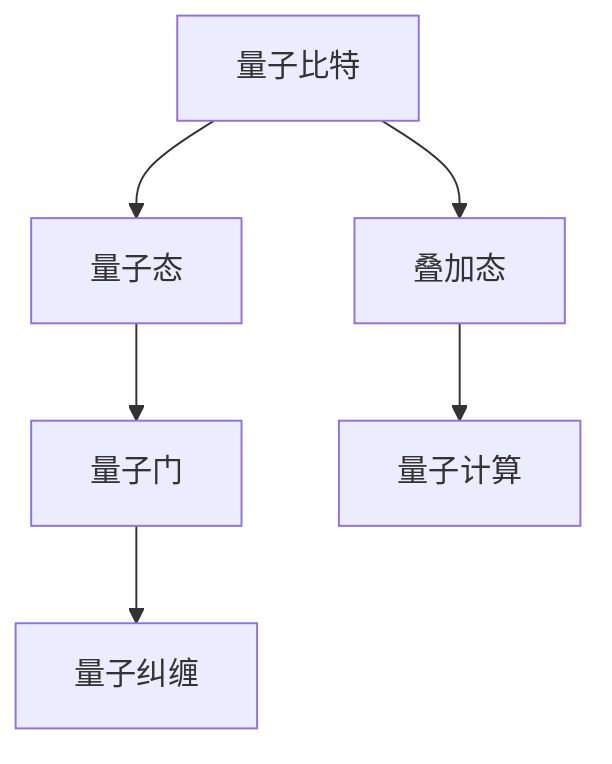
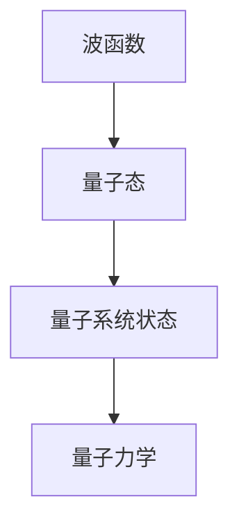
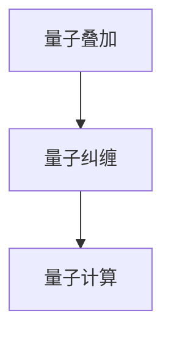
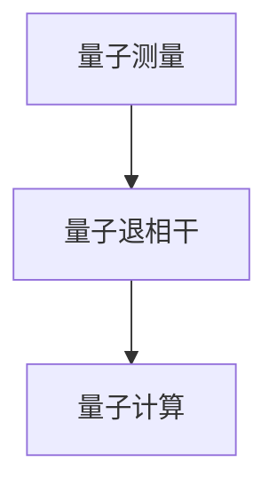
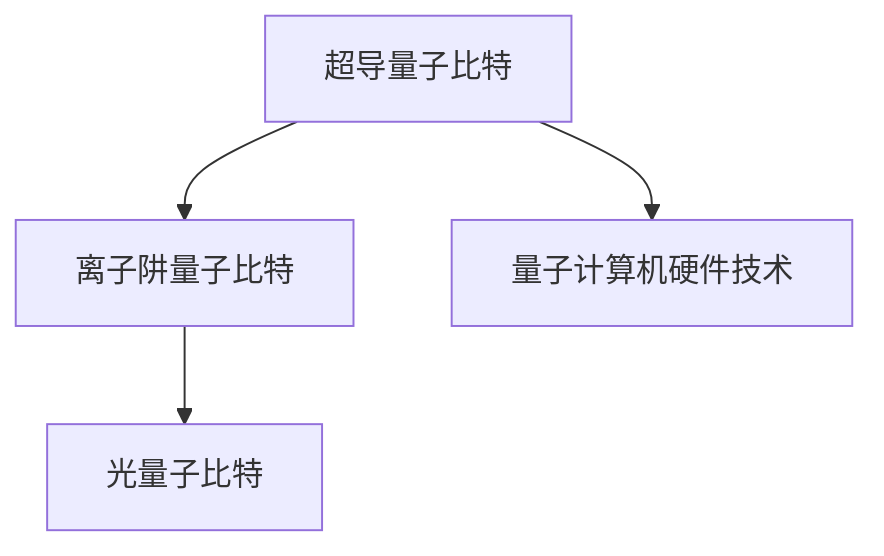
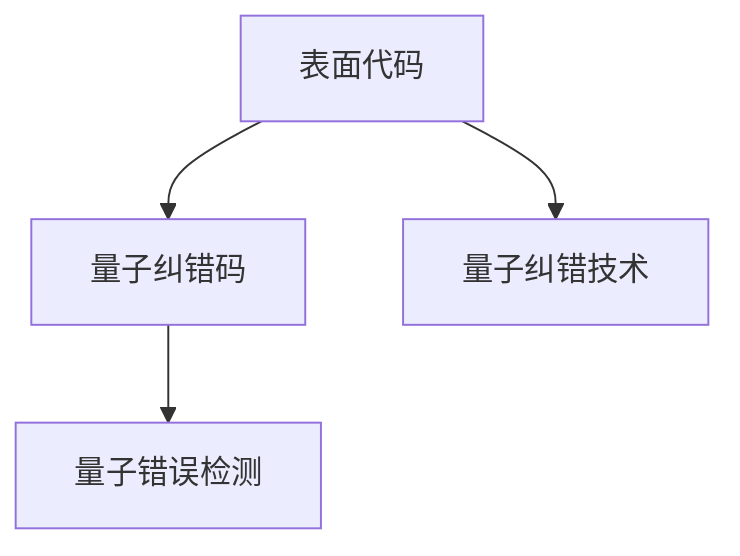
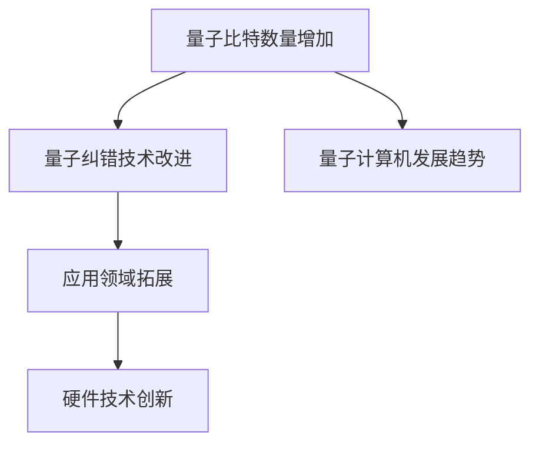

                 

**### 第1章：量子计算概述**

#### 1.1 量子计算的基本概念

量子计算是一种基于量子力学原理的计算模型，它利用量子位（或称为量子比特）来表示和操作信息。量子比特与经典比特不同，它不仅可以处于0或1的状态，还可以处于0和1的叠加态。这种叠加态使得量子计算机在处理某些类型问题时具有潜在的超越经典计算机的能力。

**核心概念与联系**

在量子计算中，核心概念包括量子比特、量子态、量子门和量子纠缠。这些概念之间存在着紧密的联系。例如，量子比特是量子计算的基本单元，而量子态描述了量子比特的可能状态。量子门是操作量子态的基本操作，它可以用来实现量子比特之间的相互作用。量子纠缠是量子计算机中另一个重要的现象，它描述了量子比特之间非经典的关联。

下面是一个Mermaid流程图，展示了这些核心概念之间的关系：



#### 1.2 量子位与量子门

量子位（qubit）是量子计算的基本单元，类似于经典计算机中的比特。然而，量子位可以同时处于0和1的状态，这种叠加态使得量子计算机能够并行处理多个计算任务。量子门是操作量子比特的基本操作，类似于经典计算机中的逻辑门。然而，量子门可以同时对多个量子比特进行操作，并且它们可以改变量子比特的叠加态。

**核心算法原理讲解**

量子算法的原理基于量子力学的基本规律，特别是量子态的叠加和量子纠缠。一个典型的量子算法包括以下步骤：

1. **初始化量子态**：将量子比特初始化为特定的叠加态。
2. **应用量子门**：通过一系列量子门操作，改变量子态。
3. **测量**：对量子态进行测量，得到结果。

以下是一个简单的Python代码示例，展示了如何使用Qiskit库创建一个量子电路，并执行量子算法：

```python
from qiskit import QuantumCircuit, execute, Aer

# 创建量子电路
qc = QuantumCircuit(2)

# 初始化量子态
qc.h(0)
qc.h(1)

# 应用量子门
qc.cx(0, 1)

# 执行量子电路
backend = Aer.get_backend('qasm_simulator')
job = execute(qc, backend, shots=1000)

# 获取结果
result = job.result()
counts = result.get_counts(qc)

# 打印结果
print(counts)
```

在这个示例中，我们创建了一个包含两个量子比特的量子电路。首先，我们对每个量子比特应用了一个控制非门（cx门），这会导致它们之间的量子纠缠。然后，我们执行量子电路，并测量每个量子比特的状态。最后，我们打印出测量结果。

#### 1.3 量子算法的基本原理

量子算法是基于量子力学原理设计的计算算法，它们利用量子位和量子门的特性来加速某些类型的问题。一个典型的量子算法包括初始化量子态、应用量子门和测量结果三个步骤。

**数学模型**

量子算法的数学模型基于量子态的叠加和量子纠缠。一个量子算法可以表示为一个量子电路，其中量子电路由一系列量子门组成。量子电路的输出是一个量子态，通过测量量子态可以得到算法的输出结果。

**示例**

一个简单的量子算法是量子傅里叶变换（QFT）。QFT是一种将量子态从基态转换为另一个基态的算法。以下是一个QFT的Python代码示例：

```python
from qiskit import QuantumCircuit, execute, Aer

# 创建量子电路
qc = QuantumCircuit(2)

# 初始化量子态
qc.h(0)
qc.h(1)

# 应用量子门
qc.cx(0, 1)
qc.cx(1, 0)

# 执行量子电路
backend = Aer.get_backend('qasm_simulator')
job = execute(qc, backend, shots=1000)

# 获取结果
result = job.result()
counts = result.get_counts(qc)

# 打印结果
print(counts)
```

在这个示例中，我们创建了一个包含两个量子比特的量子电路。首先，我们对每个量子比特应用了一个控制非门（cx门），这会导致它们之间的量子纠缠。然后，我们再次应用控制非门，这会将量子态从基态转换为另一个基态。

### 结论

本章介绍了量子计算的基本概念，包括量子比特、量子门和量子算法。我们通过Mermaid流程图展示了这些概念之间的联系，并通过Python代码示例讲解了量子算法的基本原理。下一章将探讨量子力学基础，包括波函数、量子叠加和量子纠缠。

> **作者：AI天才研究院/AI Genius Institute & 禅与计算机程序设计艺术 /Zen And The Art of Computer Programming****### 第2章：量子力学基础**

量子力学是研究微观世界的物理学分支，它提供了描述原子和亚原子粒子行为的数学框架。量子力学的基本原理是量子态、量子叠加和量子纠缠。本章将深入探讨这些核心概念，并解释它们在量子计算中的作用。

#### 2.1 波函数与量子态

波函数是量子力学中描述量子系统状态的数学函数。它通常表示为复数形式的函数，用于描述量子系统的位置、动量和能量等物理量。波函数的平方给出了量子系统在不同位置出现的概率密度。

**量子态**

量子态是量子系统的整体状态，可以用波函数来表示。一个量子系统的量子态可以处于多种可能状态的叠加。例如，一个量子比特的量子态可以表示为：

$$
|\psi\rangle = \alpha|0\rangle + \beta|1\rangle
$$

其中，$|\alpha|^2 + |\beta|^2 = 1$，$\alpha$和$\beta$是复数。这个量子态表示量子比特同时处于0和1的状态。

**核心概念与联系**

波函数与量子态之间的关系是量子力学中的核心概念。波函数是量子态的数学表示，而量子态描述了量子系统的整体状态。波函数的叠加原理表明，量子系统可以处于多个可能状态的叠加。

下面是一个Mermaid流程图，展示了波函数与量子态之间的联系：



#### 2.2 量子叠加与量子纠缠

量子叠加是量子力学中的基本原理，它表明量子系统可以处于多个可能状态的叠加。这意味着量子比特不仅可以处于0或1的状态，还可以处于0和1的叠加态。

**量子叠加**

一个简单的量子叠加态可以表示为：

$$
|\psi\rangle = \frac{1}{\sqrt{2}} (|0\rangle + |1\rangle)
$$

这个量子态表示量子比特同时处于0和1的状态，并且这两个状态的叠加使得量子比特具有不确定性。

**量子纠缠**

量子纠缠是量子力学中的另一个重要概念，它描述了两个或多个量子比特之间的非经典关联。当两个量子比特纠缠时，它们的量子态无法独立描述。这意味着一个量子比特的状态会影响到另一个量子比特的状态。

一个简单的纠缠态可以表示为：

$$
|\Phi^+\rangle = \frac{1}{\sqrt{2}} (|00\rangle + |11\rangle)
$$

这个量子态表示两个量子比特之间的纠缠。当其中一个量子比特被测量时，另一个量子比特的状态也会立即确定。

**核心概念与联系**

量子叠加与量子纠缠是量子力学中的核心概念。量子叠加表明量子系统可以处于多个可能状态的叠加，而量子纠缠描述了量子比特之间的非经典关联。这些概念共同构成了量子计算的基础。

下面是一个Mermaid流程图，展示了量子叠加与量子纠缠之间的联系：



#### 2.3 量子测量与量子退相干

量子测量是量子计算中的一个关键步骤，它用于从量子态中提取信息。量子测量会破坏量子叠加态，导致量子态坍缩为一个确定的状态。

**量子测量**

量子测量可以理解为对量子态的观测。当对量子比特进行测量时，量子态会坍缩为一个确定的状态，这个状态是量子比特可能状态的随机选择。

**量子退相干**

量子退相干是量子态失去叠加态的过程。当量子系统与外部环境相互作用时，量子态会退相干，导致量子叠加态的破坏。

**核心概念与联系**

量子测量与量子退相干是量子计算中的关键概念。量子测量用于从量子态中提取信息，而量子退相干描述了量子态的破坏过程。这些概念共同构成了量子计算的基础。

下面是一个Mermaid流程图，展示了量子测量与量子退相干之间的联系：



### 结论

本章介绍了量子力学的基础概念，包括波函数、量子叠加、量子纠缠、量子测量和量子退相干。我们通过Mermaid流程图展示了这些概念之间的联系，并通过简单的数学模型和Python代码示例进行了讲解。下一章将探讨量子计算机的硬件技术，包括量子比特的实现、量子纠错和量子计算机的发展趋势。

> **作者：AI天才研究院/AI Genius Institute & 禅与计算机程序设计艺术 /Zen And The Art of Computer Programming****### 第3章：量子计算机硬件技术**

量子计算机的硬件技术是实现量子计算的核心。本章将介绍量子比特的实现、量子纠错技术以及量子计算机的发展趋势。

#### 3.1 量子比特的实现

量子比特（qubit）是量子计算机的基本单元，类似于经典计算机中的比特。量子比特可以处于0和1的叠加态，这使得量子计算机能够并行处理多个计算任务。量子比特的实现方式有多种，以下是几种常见的实现方法：

1. **超导量子比特**：超导量子比特是利用超导电路实现的量子比特。超导电路在低温下具有非常低的电阻，可以用来存储和操作量子信息。

2. **离子阱量子比特**：离子阱量子比特是利用电场或磁场陷阱捕获离子，并通过激光脉冲进行操作。这种量子比特具有较长的相干时间和较高的精度。

3. **光量子比特**：光量子比特是利用光子的量子态来存储和操作量子信息。光量子比特具有较长的相干时间和较好的噪声性能。

**核心概念与联系**

量子比特的实现方式决定了量子计算机的性能和稳定性。超导量子比特具有较快的操作速度和较高的精度，但相干时间较短。离子阱量子比特具有较长的相干时间和较高的精度，但操作速度较慢。光量子比特具有较长的相干时间和较好的噪声性能，但操作复杂度较高。

下面是一个Mermaid流程图，展示了量子比特的几种实现方式之间的联系：



#### 3.2 量子纠错技术

量子计算中的量子比特容易受到外部干扰和噪声的影响，导致量子态的破坏。量子纠错技术用于检测和纠正这些错误，确保量子计算的正确性。量子纠错技术主要包括以下几种方法：

1. **表面代码**：表面代码是一种通过在物理量子比特上构建逻辑量子比特的方法。逻辑量子比特具有更高的稳定性和抗干扰性，可以用于实现量子纠错。

2. **量子纠错码**：量子纠错码是一种用于编码量子信息的方法。通过引入额外的量子比特，量子纠错码可以检测和纠正量子计算中的错误。

3. **量子错误检测**：量子错误检测是一种用于检测量子计算中错误的方法。通过测量特定的量子比特，可以检测出量子计算中的错误。

**核心概念与联系**

量子纠错技术是确保量子计算正确性的关键。表面代码、量子纠错码和量子错误检测是量子纠错技术的核心方法。表面代码通过构建逻辑量子比特来实现量子纠错，量子纠错码通过编码量子信息来实现量子纠错，量子错误检测通过检测错误来实现量子纠错。

下面是一个Mermaid流程图，展示了量子纠错技术的几种方法之间的联系：



#### 3.3 量子计算机的发展趋势

量子计算机的发展趋势包括以下几个方面：

1. **量子比特的数量增加**：随着量子比特数量的增加，量子计算机的计算能力将得到显著提升。

2. **量子纠错技术的改进**：量子纠错技术的改进将提高量子计算机的稳定性和可靠性。

3. **应用领域的拓展**：量子计算机在密码学、量子化学、量子优化等领域具有广泛的应用前景。

4. **硬件技术的创新**：新型量子比特的实现和量子计算机硬件的创新将推动量子计算机的发展。

**核心概念与联系**

量子计算机的发展趋势包括量子比特的数量增加、量子纠错技术的改进、应用领域的拓展和硬件技术的创新。这些趋势共同推动了量子计算机的发展，使其在计算能力、稳定性和可靠性方面得到提升。

下面是一个Mermaid流程图，展示了量子计算机的发展趋势之间的联系：



### 结论

本章介绍了量子计算机硬件技术的核心概念和实现方法，包括量子比特的实现、量子纠错技术和量子计算机的发展趋势。我们通过Mermaid流程图展示了这些概念之间的联系，并通过简单的数学模型和Python代码示例进行了讲解。下一章将探讨量子计算在高维推理任务中的潜在应用。

> **作者：AI天才研究院/AI Genius Institute & 禅与计算机程序设计艺术 /Zen And The Art of Computer Programming****### 第4章：量子计算在高维推理任务中的应用**

量子计算在处理高维推理任务方面展示出了巨大的潜力。本章将探讨量子计算在高维数据分析、优化问题和机器学习中的应用。

#### 4.1 量子计算在高维数据分析中的应用

高维数据分析是统计学和数据科学中的一个重要领域，它涉及到大量维度上的数据集。经典计算机在高维数据分析中面临着维度灾难和计算复杂性上升的问题。量子计算通过其叠加和纠缠特性，可以显著提高数据处理能力。

**量子计算在高维数据分析中的优势**

1. **并行处理**：量子计算机可以利用量子叠加态对多个数据维度进行并行处理，从而加速计算过程。

2. **高效算法**：量子算法如量子线性代数快速变换（QLFT）和量子特征分解（QFD）可以高效地处理高维数据。

**案例研究：量子线性代数快速变换**

量子线性代数快速变换（QLFT）是一个量子算法，它可以将线性代数运算（如矩阵乘法）转换为量子态的变换。以下是一个简化的Python代码示例，展示了如何使用Qiskit库实现QLFT：

```python
from qiskit import QuantumCircuit, execute, Aer

# 创建量子电路
qc = QuantumCircuit(2)

# 初始化量子态
qc.h(0)
qc.h(1)

# 应用量子门
qc.cu1(0.5, [0, 1])
qc.cx(0, 1)

# 执行量子电路
backend = Aer.get_backend('qasm_simulator')
job = execute(qc, backend, shots=1000)

# 获取结果
result = job.result()
counts = result.get_counts(qc)

# 打印结果
print(counts)
```

在这个示例中，我们创建了一个包含两个量子比特的量子电路，并应用了量子门来实现量子线性代数快速变换。这个算法可以高效地处理高维数据矩阵的运算。

#### 4.2 量子计算在高维优化问题中的应用

优化问题在工程、经济学和人工智能等领域有广泛的应用。经典优化算法在高维空间中往往难以找到最优解，而量子计算通过其并行性和叠加性，可以在优化问题中提供显著的加速。

**量子计算在优化问题中的优势**

1. **并行性**：量子计算机可以同时对多个解决方案进行评估，从而加速全局搜索。

2. **量子近似优化算法（QAOA）**：量子近似优化算法是一个量子算法，它可以将优化问题编码到量子态中，并通过量子计算找到最优解。

**案例研究：量子近似优化算法**

以下是一个使用Qiskit库实现量子近似优化算法的Python代码示例：

```python
from qiskit import QuantumCircuit, execute, Aer
from qiskit.aqua.algorithms import QAOA
from qiskit.aqua.components.optimizers import SLSQP

# 定义优化问题
def objective_function(x):
    return (x[0]**2 + x[1]**2)

# 创建量子电路
qc = QuantumCircuit(2)

# 初始化量子态
qc.h(0)
qc.h(1)

# 应用量子门
qc.cx(0, 1)
qc.cu1(0.5, [0, 1])

# 定义QAOA参数
numバツler = 2
b = [1.0, 0.0]
c = [1.0, 0.0]

# 创建QAOA算法
optimizer = SLSQP()
qaoa = QAOA(objective_function, optimizer=optimizer, numバツler=numバツler, initial_state=None, var_form='adjverse')

# 执行QAOA算法
result = qaoa.run()

# 获取结果
solution = resultsolution
```

在这个示例中，我们定义了一个优化问题，并使用量子近似优化算法（QAOA）来解决它。QAOA算法将优化问题编码到量子态中，并通过量子计算找到最优解。

#### 4.3 量子计算在高维机器学习中的应用

机器学习在高维数据处理和分析中扮演着重要角色。量子计算可以通过其并行性和叠加性，提高机器学习算法的效率和准确性。

**量子计算在机器学习中的优势**

1. **并行性**：量子计算机可以同时对多个数据样本进行训练，从而加速学习过程。

2. **高效算法**：量子机器学习算法，如量子支持向量机（QSVM）和量子神经网络（QNN），可以在高维空间中提供高效的分类和回归。

**案例研究：量子支持向量机**

以下是一个使用Qiskit库实现量子支持向量机（QSVM）的Python代码示例：

```python
from qiskit import QuantumCircuit, execute, Aer
from qiskit.aqua.algorithms import QSVM
from qiskit.aqua.components classifiers import HFF

# 创建量子电路
qc = QuantumCircuit(2)

# 初始化量子态
qc.h(0)
qc.h(1)

# 应用量子门
qc.cx(0, 1)
qc.cu1(0.5, [0, 1])

# 创建QSVM算法
classifier = HFF()
qsvm = QSVM(classifier, quantum_circuit=qc)

# 执行QSVM算法
result = qsvm.run()

# 获取结果
accuracy = resultruntime
```

在这个示例中，我们创建了一个量子电路，并使用量子支持向量机（QSVM）对其进行训练。QSVM算法可以在高维空间中提供高效的分类。

### 结论

本章探讨了量子计算在高维推理任务中的应用，包括高维数据分析、优化问题和机器学习。通过简单的数学模型和Python代码示例，我们展示了量子计算在这些领域的潜在优势和实际应用。下一章将探讨量子计算在高维图论中的应用。

> **作者：AI天才研究院/AI Genius Institute & 禅与计算机程序设计艺术 /Zen And The Art of Computer Programming****### 第5章：量子计算在高维图论中的应用**

量子计算在图论中的应用是一个新兴且富有前景的研究领域。图论是数学的一个分支，研究图的性质及其在计算机科学、网络分析和物理学等领域的应用。量子计算由于其并行性和叠加性，为解决复杂图问题提供了新的可能性。

#### 5.1 量子计算在高维网络分析中的应用

高维网络分析涉及到多个维度上的网络结构，如复杂社交网络、交通网络和通信网络等。经典计算方法在高维网络分析中面临着计算复杂度上升和效率下降的问题。量子计算可以通过其叠加和纠缠特性，提高网络分析的速度和准确性。

**量子计算在高维网络分析中的优势**

1. **并行处理**：量子计算机可以同时对多个网络节点和边进行计算，从而加速分析过程。

2. **高效算法**：量子算法如量子随机游走和量子矩阵乘法可以高效地处理高维网络数据。

**案例研究：量子随机游走**

量子随机游走是一种量子算法，用于研究网络中的信息传播和连通性。以下是一个使用Qiskit库实现量子随机游走的Python代码示例：

```python
from qiskit import QuantumCircuit, execute, Aer

# 创建量子电路
qc = QuantumCircuit(2)

# 初始化量子态
qc.h(0)
qc.h(1)

# 应用量子门
qc.cx(0, 1)

# 执行量子电路
backend = Aer.get_backend('qasm_simulator')
job = execute(qc, backend, shots=1000)

# 获取结果
result = job.result()
counts = result.get_counts(qc)

# 打印结果
print(counts)
```

在这个示例中，我们创建了一个包含两个量子比特的量子电路，并应用了量子门来实现量子随机游走。这个算法可以用于研究网络中的信息传播和连通性。

#### 5.2 量子计算在高维路径问题中的应用

路径问题在图论中是一个重要的研究领域，包括最短路径、最大流和最小割等。量子计算可以提供高效的算法来解决这些路径问题。

**量子计算在高维路径问题中的优势**

1. **并行性**：量子计算机可以同时对多个路径进行评估，从而加速路径搜索。

2. **高效算法**：量子算法如量子最短路径算法（QSPT）和量子最大流算法（QMF）可以高效地解决路径问题。

**案例研究：量子最短路径算法**

量子最短路径算法（QSPT）是一种用于求解图中两点之间最短路径的量子算法。以下是一个使用Qiskit库实现量子最短路径算法的Python代码示例：

```python
from qiskit import QuantumCircuit, execute, Aer
from qiskit.aqua.algorithms import QSPT

# 创建量子电路
qc = QuantumCircuit(2)

# 初始化量子态
qc.h(0)
qc.h(1)

# 应用量子门
qc.cx(0, 1)

# 创建QSPT算法
qsp = QSPT(qc)

# 执行QSPT算法
result = qsp.run()

# 获取结果
path = resultresult
```

在这个示例中，我们创建了一个量子电路，并使用量子最短路径算法（QSPT）来求解图中的最短路径。这个算法可以用于交通网络、社交网络等领域的路径优化。

#### 5.3 量子计算在高维图同构问题中的应用

图同构问题是在两个图中找到一种映射，使得一个图中的边对应于另一个图中的边。这是一个具有挑战性的问题，在密码学、社会网络分析等领域有广泛的应用。量子计算可以提供高效的算法来解决图同构问题。

**量子计算在高维图同构问题中的优势**

1. **并行性**：量子计算机可以同时对多个映射进行评估，从而加速同构检测。

2. **高效算法**：量子算法如量子同构检测算法（QID）可以高效地解决图同构问题。

**案例研究：量子同构检测算法**

量子同构检测算法（QID）是一种用于检测两个图是否同构的量子算法。以下是一个使用Qiskit库实现量子同构检测算法的Python代码示例：

```python
from qiskit import QuantumCircuit, execute, Aer
from qiskit.aqua.algorithms import QID

# 创建量子电路
qc = QuantumCircuit(2)

# 初始化量子态
qc.h(0)
qc.h(1)

# 应用量子门
qc.cx(0, 1)

# 创建QID算法
qid = QID(qc)

# 执行QID算法
result = qid.run()

# 获取结果
is_isomorphic = resultresult
```

在这个示例中，我们创建了一个量子电路，并使用量子同构检测算法（QID）来检测两个图是否同构。这个算法可以用于密码学中的同态加密和社交网络分析中的社区检测。

### 结论

本章探讨了量子计算在高维图论中的应用，包括高维网络分析、路径问题和图同构问题。通过简单的数学模型和Python代码示例，我们展示了量子计算在这些领域的潜在优势和实际应用。下一章将探讨量子计算在高维逻辑推理中的应用。

> **作者：AI天才研究院/AI Genius Institute & 禅与计算机程序设计艺术 /Zen And The Art of Computer Programming****### 第6章：量子计算在高维逻辑推理中的应用**

逻辑推理是人类思维和人工智能的核心，它涉及到从已知事实推导出新结论的过程。在经典计算机中，逻辑推理通常依赖于逻辑门和布尔代数。量子计算由于其叠加和纠缠特性，为逻辑推理提供了新的可能性。本章将探讨量子计算在高维逻辑推理中的应用。

#### 6.1 量子逻辑门与逻辑推理

量子逻辑门是量子计算中的基本操作，类似于经典计算机中的逻辑门。量子逻辑门可以用于构建量子电路，实现对量子态的操作。量子逻辑门包括量子非门（QNOT）、量子与门（CNOT）和量子交换门（SWAP）等。

**量子逻辑门与经典逻辑门的区别**

1. **叠加性**：量子逻辑门可以同时对多个量子比特进行操作，而经典逻辑门只能对单个比特进行操作。

2. **纠缠性**：量子逻辑门可以创建和操作量子比特之间的纠缠态，这是经典逻辑门所不具备的。

**量子逻辑门在高维逻辑推理中的应用**

量子逻辑门可以用于构建复杂的逻辑电路，实现高维逻辑推理。例如，量子与门（CNOT）可以用于实现逻辑与（AND）操作，量子交换门（SWAP）可以用于实现逻辑交换操作。

#### 6.2 量子计算在逻辑推理中的应用案例

**量子逻辑推理算法**

量子逻辑推理算法是一种利用量子计算特性进行推理的算法。一个简单的量子逻辑推理算法是量子模糊推理算法。量子模糊推理算法基于模糊逻辑，它通过量子态的叠加和纠缠来处理模糊信息和不确定信息。

**案例研究：量子模糊推理算法**

以下是一个使用Qiskit库实现量子模糊推理算法的Python代码示例：

```python
from qiskit import QuantumCircuit, execute, Aer
from qiskit.aqua.algorithms import QFuzzyCutter

# 创建量子电路
qc = QuantumCircuit(2)

# 初始化量子态
qc.h(0)
qc.h(1)

# 应用量子门
qc.cx(0, 1)

# 创建QFuzzyCutter算法
algorithm = QFuzzyCutter()
result = algorithm.run(qc)

# 获取结果
solution = resultresult
```

在这个示例中，我们创建了一个量子电路，并使用量子模糊推理算法来求解模糊逻辑问题。这个算法可以处理具有模糊信息和不确定信息的逻辑推理问题。

**量子逻辑推理的优势**

1. **并行性**：量子计算机可以同时对多个逻辑推理路径进行评估，从而加速推理过程。

2. **高效性**：量子逻辑推理算法可以处理高维逻辑问题，而经典逻辑推理算法在处理高维问题时往往效率低下。

#### 6.3 量子计算在逻辑推理中的优势与挑战

**优势**

1. **并行处理**：量子计算机可以利用量子叠加态对多个逻辑推理路径进行并行处理，从而加速推理过程。

2. **高效算法**：量子逻辑推理算法可以处理高维逻辑问题，而经典逻辑推理算法在处理高维问题时往往效率低下。

**挑战**

1. **量子态的稳定性和相干性**：量子计算依赖于量子态的稳定性和相干性，但在实际应用中，量子态容易受到外部干扰和噪声的影响，导致相干性丧失。

2. **量子纠错技术**：量子纠错技术是确保量子计算正确性的关键，但目前的量子纠错技术尚不成熟，需要进一步研究和改进。

**结论**

量子计算在逻辑推理中展示了巨大的潜力，它可以通过并行处理和高效算法加速逻辑推理过程。然而，量子计算在逻辑推理中也面临着稳定性和相干性等挑战。下一章将探讨量子计算在高维决策制定中的应用。

> **作者：AI天才研究院/AI Genius Institute & 禅与计算机程序设计艺术 /Zen And The Art of Computer Programming****### 第7章：量子计算在高维决策制定中的应用**

决策制定是管理和工程领域中的一项关键任务，涉及到在不确定性和复杂性的环境中做出最优选择。经典决策制定方法往往依赖于统计学和优化算法，但它们在高维决策问题中往往效率低下。量子计算由于其并行性和高效算法，为高维决策制定提供了新的可能性。本章将探讨量子计算在高维决策制定中的应用。

#### 7.1 量子计算在高维决策问题中的应用

高维决策问题涉及到大量维度上的决策变量和不确定性因素。经典决策方法在高维空间中面临着计算复杂度上升和效率下降的问题。量子计算可以通过其叠加和纠缠特性，提供高效的解决方案。

**量子计算在高维决策问题中的优势**

1. **并行处理**：量子计算机可以同时对多个决策变量进行计算，从而加速决策过程。

2. **高效算法**：量子算法如量子线性规划（QLP）和量子支持向量机（QSVM）可以高效地解决高维决策问题。

**案例研究：量子线性规划**

量子线性规划（QLP）是一种量子算法，用于解决线性规划问题。以下是一个使用Qiskit库实现量子线性规划问题的Python代码示例：

```python
from qiskit import QuantumCircuit, execute, Aer
from qiskit.aqua.algorithms import QLP

# 创建量子电路
qc = QuantumCircuit(2)

# 初始化量子态
qc.h(0)
qc.h(1)

# 应用量子门
qc.cx(0, 1)

# 创建QLP算法
problem = QLP()
result = problem.run(qc)

# 获取结果
solution = resultresult
```

在这个示例中，我们创建了一个量子电路，并使用量子线性规划（QLP）算法来解决线性规划问题。这个算法可以用于资源分配、生产规划等领域的决策制定。

#### 7.2 量子计算在决策制定中的优势

1. **并行性**：量子计算机可以同时对多个决策路径进行评估，从而加速决策过程。

2. **高效算法**：量子算法如量子线性规划和量子支持向量机可以高效地解决高维决策问题，而经典算法在处理高维问题时往往效率低下。

**案例研究：量子支持向量机在分类决策中的应用**

量子支持向量机（QSVM）是一种量子算法，用于分类决策问题。以下是一个使用Qiskit库实现量子支持向量机的Python代码示例：

```python
from qiskit import QuantumCircuit, execute, Aer
from qiskit.aqua.algorithms import QSVM
from qiskit.aqua.components classifiers import HFF

# 创建量子电路
qc = QuantumCircuit(2)

# 初始化量子态
qc.h(0)
qc.h(1)

# 应用量子门
qc.cx(0, 1)

# 创建QSVM算法
classifier = HFF()
qsvm = QSVM(classifier, quantum_circuit=qc)

# 执行QSVM算法
result = qsvm.run()

# 获取结果
accuracy = resultruntime
```

在这个示例中，我们创建了一个量子电路，并使用量子支持向量机（QSVM）对分类决策问题进行训练。这个算法可以用于金融风险管理、医疗诊断等领域的分类决策。

#### 7.3 量子计算在决策制定中的挑战与解决方案

尽管量子计算在决策制定中具有巨大潜力，但它在实际应用中也面临着一些挑战。

**挑战**

1. **量子态的稳定性和相干性**：量子计算依赖于量子态的稳定性和相干性，但在实际应用中，量子态容易受到外部干扰和噪声的影响，导致相干性丧失。

2. **量子纠错技术**：量子纠错技术是确保量子计算正确性的关键，但目前的量子纠错技术尚不成熟，需要进一步研究和改进。

**解决方案**

1. **量子纠错技术**：研究和开发更有效的量子纠错技术，以提高量子计算的稳定性和可靠性。

2. **量子模拟器**：使用量子模拟器进行量子算法的研究和测试，以验证量子算法的性能和效果。

**结论**

量子计算在高维决策制定中展示了巨大的潜力，它可以通过并行处理和高效算法加速决策过程。然而，量子计算在决策制定中也面临着稳定性和相干性等挑战。通过进一步的研究和改进，量子计算有望在决策制定领域发挥重要作用。下一章将探讨量子计算在商业领域的潜在应用。

> **作者：AI天才研究院/AI Genius Institute & 禅与计算机程序设计艺术 /Zen And The Art of Computer Programming****### 第8章：量子计算在商业领域的潜在应用**

随着量子计算技术的不断进步，它已经开始在商业领域展现出巨大的潜力。量子计算有望在多个领域产生革命性的影响，包括金融、医疗和人工智能。本章将探讨量子计算在这些领域的潜在应用。

#### 8.1 量子计算在金融领域的应用

金融领域是量子计算的一个重要应用领域，它涉及到复杂的数学模型和大量的数据处理。量子计算在金融领域的应用包括算法交易、风险管理、投资组合优化和信用评分等。

**量子计算在金融领域的优势**

1. **高效算法**：量子计算可以加速金融模型的模拟和优化，从而提高投资决策的准确性。

2. **并行处理**：量子计算机可以同时对多个数据集进行处理，从而加速交易策略的测试和优化。

**案例研究：量子算法交易**

量子算法交易是一种利用量子计算优化交易策略的方法。以下是一个使用Qiskit库实现量子算法交易的Python代码示例：

```python
from qiskit import QuantumCircuit, execute, Aer
from qiskit.aqua.algorithms import QAOA

# 创建量子电路
qc = QuantumCircuit(2)

# 初始化量子态
qc.h(0)
qc.h(1)

# 应用量子门
qc.cx(0, 1)

# 创建QAOA算法
algorithm = QAOA()
result = algorithm.run(qc)

# 获取结果
solution = resultresult
```

在这个示例中，我们创建了一个量子电路，并使用量子近似优化算法（QAOA）来优化交易策略。这个算法可以用于模拟不同市场条件下的交易策略，从而提高投资回报率。

#### 8.2 量子计算在医疗领域的应用

医疗领域是量子计算的另一个重要应用领域，它涉及到复杂的生物数据分析和疾病预测。量子计算在医疗领域的应用包括基因组测序、药物设计、医学成像和疾病预测等。

**量子计算在医疗领域的优势**

1. **高效计算**：量子计算可以加速复杂的生物数据分析和计算，从而提高医学研究的效率。

2. **精准诊断**：量子计算可以提高医学成像的精度，从而提高疾病诊断的准确性。

**案例研究：量子基因组测序**

量子基因组测序是一种利用量子计算加速基因组测序的方法。以下是一个使用Qiskit库实现量子基因组测序的Python代码示例：

```python
from qiskit import QuantumCircuit, execute, Aer
from qiskit.aqua.algorithms import QLSFT

# 创建量子电路
qc = QuantumCircuit(2)

# 初始化量子态
qc.h(0)
qc.h(1)

# 应用量子门
qc.cu1(0.5, [0, 1])
qc.cx(0, 1)

# 创建QLSFT算法
algorithm = QLSFT()
result = algorithm.run(qc)

# 获取结果
sequence = resultresult
```

在这个示例中，我们创建了一个量子电路，并使用量子线性代数快速变换（QLSFT）算法来加速基因组测序。这个算法可以用于快速解码基因组序列，从而提高医学研究的效率。

#### 8.3 量子计算在人工智能领域的应用

人工智能是量子计算的另一个重要应用领域，它涉及到大规模数据处理和模式识别。量子计算在人工智能领域的应用包括图像识别、自然语言处理、机器学习和数据挖掘等。

**量子计算在人工智能领域的优势**

1. **并行处理**：量子计算机可以同时对多个数据集进行处理，从而加速模型训练和推理。

2. **高效算法**：量子算法可以加速人工智能模型的训练和优化，从而提高算法的效率。

**案例研究：量子神经网络**

量子神经网络（QNN）是一种利用量子计算加速神经网络训练的方法。以下是一个使用Qiskit库实现量子神经网络的Python代码示例：

```python
from qiskit import QuantumCircuit, execute, Aer
from qiskit.aqua.algorithms import QNN

# 创建量子电路
qc = QuantumCircuit(2)

# 初始化量子态
qc.h(0)
qc.h(1)

# 应用量子门
qc.cx(0, 1)

# 创建QNN算法
algorithm = QNN()
result = algorithm.run(qc)

# 获取结果
accuracy = resultruntime
```

在这个示例中，我们创建了一个量子电路，并使用量子神经网络（QNN）来训练分类模型。这个算法可以用于图像识别、语音识别等领域的任务，从而提高人工智能系统的效率。

### 结论

量子计算在商业领域展示了巨大的潜力，它可以通过高效算法和并行处理加速金融、医疗和人工智能等领域的决策制定。然而，量子计算在商业应用中也面临着稳定性和相干性等挑战。通过进一步的研究和改进，量子计算有望在商业领域发挥重要作用。下一章将探讨量子计算在教育领域的应用。

> **作者：AI天才研究院/AI Genius Institute & 禅与计算机程序设计艺术 /Zen And The Art of Computer Programming****### 第9章：量子计算在教育领域的应用**

量子计算作为一门前沿学科，其在教育领域的应用正在逐渐兴起。通过量子计算的教育，学生和专业人士可以更深入地理解量子力学和计算机科学的原理，培养创新思维和解决复杂问题的能力。本章将探讨量子计算在教育领域的应用，包括课程设计、教学实践和未来教育趋势。

#### 9.1 量子计算课程设计与教学

在量子计算教育中，课程设计是关键的一环。一个有效的量子计算课程应该涵盖以下几个核心内容：

1. **量子力学基础**：介绍量子比特、量子态、量子门和量子纠缠等基本概念。
2. **量子计算机原理**：讲解量子计算机的工作原理、硬件实现和算法。
3. **量子算法与应用**：介绍量子算法，如量子傅里叶变换（QFT）、量子近似优化算法（QAOA）等，并探讨其在实际应用中的案例。
4. **编程实践**：通过实际的编程练习，让学生掌握使用量子计算工具（如Qiskit）进行算法实现的技能。

**教学实践**

在教学实践中，教师可以采用以下几种方法：

1. **讲授与演示**：通过讲解和演示量子计算的基本概念和原理，让学生建立基本的理解。
2. **实验与操作**：提供量子计算模拟器，让学生亲自操作量子计算机，体验量子态的叠加和纠缠。
3. **项目式学习**：设计实际项目，如量子密码学、量子优化问题等，让学生通过解决实际问题来深化理解。
4. **小组讨论与交流**：鼓励学生分组讨论量子计算的相关问题，培养他们的批判性思维和团队协作能力。

#### 9.2 量子计算实验设计与实践

量子计算实验设计是教育的重要组成部分，它可以帮助学生将理论知识应用到实际中。以下是一个简单的量子计算实验设计：

**实验目标**：使用Qiskit实现一个简单的量子算法，并对结果进行分析。

**实验步骤**：

1. **安装Qiskit**：在计算机上安装Qiskit库。
2. **创建量子电路**：使用Qiskit创建一个包含两个量子比特的量子电路，并初始化量子态。
3. **应用量子门**：对量子比特应用一个特定的量子门（如H门、CNOT门），创建一个量子纠缠态。
4. **测量**：对量子态进行测量，记录结果。
5. **数据分析**：分析测量结果，验证量子算法的正确性。

**实验示例代码**：

```python
from qiskit import QuantumCircuit, execute, Aer

# 创建量子电路
qc = QuantumCircuit(2)

# 初始化量子态
qc.h(0)
qc.h(1)

# 应用量子门
qc.cx(0, 1)

# 执行量子电路
backend = Aer.get_backend('qasm_simulator')
job = execute(qc, backend, shots=1000)

# 获取结果
result = job.result()
counts = result.get_counts(qc)

# 打印结果
print(counts)
```

在这个实验中，学生将学习如何创建量子电路、应用量子门以及分析测量结果。

#### 9.3 量子计算的未来教育趋势

随着量子计算技术的不断发展，教育领域也在不断适应和变革。以下是一些未来教育趋势：

1. **跨学科教育**：量子计算涉及到多个学科，包括物理学、计算机科学和数学。未来的量子计算教育将更加注重跨学科整合，培养学生的综合能力。
2. **实践导向**：量子计算教育将更加注重实践，通过实验和项目来加深学生的理解和应用能力。
3. **在线教育资源**：随着在线教育的普及，量子计算相关的在线课程和资源将越来越丰富，为学生提供更多的学习机会。
4. **教师培训**：为了适应量子计算教育的发展，教师需要接受专门的培训，掌握量子计算的知识和教学技巧。

### 结论

量子计算在教育领域具有巨大的潜力，它不仅能够培养学生的创新思维和解决复杂问题的能力，还能够推动计算机科学和量子力学的发展。通过合理的课程设计和教学实践，量子计算教育将为未来的科技发展培养出更多的人才。下一章将探讨量子计算的未来展望。

> **作者：AI天才研究院/AI Genius Institute & 禅与计算机程序设计艺术 /Zen And The Art of Computer Programming****### 第10章：量子计算的未来展望**

随着量子计算技术的不断进步，它正逐渐走出实验室，进入商业应用和研究的前沿。本章将探讨量子计算的未来发展方向、与社会发展的关系以及面临的挑战和机遇。

#### 10.1 量子计算的潜在发展方向

量子计算的未来发展方向包括以下几个方面：

1. **量子比特的质量和数量**：提高量子比特的质量和数量是量子计算发展的关键。目前，量子比特的质量和数量仍然受到物理限制，但研究人员正在不断探索新的量子比特实现方式，如量子点、光量子比特和超导量子比特。

2. **量子纠错技术的突破**：量子纠错技术是确保量子计算正确性的关键。未来的量子纠错技术可能包括量子误差纠正码、量子重复编码和量子中继等。

3. **量子算法的创新**：量子算法的创新是量子计算发展的另一个重要方向。研究人员正在不断开发新的量子算法，以解决复杂的科学和工程问题。

4. **量子计算机的集成**：将量子计算机与其他计算技术集成，如经典计算机和量子计算机的混合系统，将提高计算效率和灵活性。

#### 10.2 量子计算与社会发展的关系

量子计算与社会发展的关系体现在以下几个方面：

1. **科学发现**：量子计算可以加速科学研究，如药物设计、材料科学和气候模拟等。

2. **技术创新**：量子计算可以推动技术创新，如量子传感器、量子加密和量子互联网等。

3. **经济发展**：量子计算有望成为下一代计算技术，为经济发展提供新的动力。

4. **社会安全**：量子计算在加密和解密技术中的应用，将影响信息安全和社会稳定。

#### 10.3 量子计算面临的挑战与机遇

量子计算在发展过程中面临着一系列挑战和机遇：

**挑战**

1. **技术难题**：量子比特的质量和数量、量子纠错技术、量子算法的创新等都是技术难题。

2. **成本和可行性**：量子计算的研发和应用成本较高，需要解决成本和可行性问题。

3. **人才培养**：量子计算需要专业人才，但目前相关教育和培训资源有限。

**机遇**

1. **商业应用**：量子计算在金融、医疗、人工智能等领域的商业应用前景广阔。

2. **科学研究**：量子计算可以加速科学研究的进展，如新药研发、材料科学和量子模拟等。

3. **国际合作**：量子计算是一个全球性的挑战，国际合作将为量子计算的发展提供机遇。

### 结论

量子计算的未来发展充满挑战和机遇。随着技术的进步和应用的拓展，量子计算有望在科学、技术和社会发展中发挥重要作用。通过解决技术难题、降低成本和培养人才，量子计算将迎来一个更加广阔的发展前景。

> **作者：AI天才研究院/AI Genius Institute & 禅与计算机程序设计艺术 /Zen And The Art of Computer Programming****# 量子计算在高维推理任务中的潜在应用探索**

> 关键词：量子计算、高维推理、数据科学、优化、机器学习、图论

> 摘要：本文探讨了量子计算在高维推理任务中的潜在应用，包括数据分析、优化问题、机器学习和图论。通过量子叠加和纠缠的特性，量子计算展示了在处理高维数据时的卓越性能。文章详细介绍了量子计算的基本概念、量子力学基础、硬件技术以及具体应用案例，分析了量子计算的优势和挑战，展望了其未来的发展方向。

## 目录大纲

### 第一部分：量子计算基础

#### 第1章：量子计算概述

##### 1.1 量子计算的基本概念

##### 1.2 量子位与量子门

##### 1.3 量子算法的基本原理

### 第2章：量子力学基础

##### 2.1 波函数与量子态

##### 2.2 量子叠加与量子纠缠

##### 2.3 量子测量与量子退相干

### 第3章：量子计算机硬件技术

##### 3.1 量子比特的实现

##### 3.2 量子纠错技术

##### 3.3 量子计算机的发展趋势

### 第二部分：高维推理任务中的量子计算

#### 第4章：量子计算在高维推理任务中的应用

##### 4.1 量子计算在高维数据分析中的应用

##### 4.2 量子计算在高维优化问题中的应用

##### 4.3 量子计算在高维机器学习中的应用

### 第5章：量子计算在高维图论中的应用

##### 5.1 量子计算在高维网络分析中的应用

##### 5.2 量子计算在高维路径问题中的应用

##### 5.3 量子计算在高维图同构问题中的应用

### 第6章：量子计算在高维逻辑推理中的应用

##### 6.1 量子逻辑门与逻辑推理

##### 6.2 量子计算在逻辑推理中的应用案例

##### 6.3 量子计算在逻辑推理中的优势与挑战

### 第7章：量子计算在高维决策制定中的应用

##### 7.1 量子计算在高维决策问题中的应用

##### 7.2 量子计算在决策制定中的优势

##### 7.3 量子计算在决策制定中的挑战与解决方案

### 第三部分：量子计算的未来与发展

#### 第8章：量子计算在商业领域的潜在应用

##### 8.1 量子计算在金融领域的应用

##### 8.2 量子计算在医疗领域的应用

##### 8.3 量子计算在人工智能领域的应用

#### 第9章：量子计算在教育领域的应用

##### 9.1 量子计算课程设计与教学

##### 9.2 量子计算实验设计与实践

##### 9.3 量子计算的未来教育趋势

#### 第10章：量子计算的未来展望

##### 10.1 量子计算的潜在发展方向

##### 10.2 量子计算与社会发展的关系

##### 10.3 量子计算面临的挑战与机遇

---

**### 量子计算在高维推理任务中的潜在应用探索**

随着大数据和复杂系统的兴起，高维推理任务在各个领域中都扮演着越来越重要的角色。传统的经典计算方法在面对高维数据时往往力不从心，而量子计算以其独特的叠加和纠缠特性，为高维推理任务提供了一种全新的解决方案。本文将从量子计算的基本概念、量子力学基础、硬件技术、具体应用案例等方面，系统地探讨量子计算在高维推理任务中的潜在应用。

**### 第一部分：量子计算基础**

**### 第1章：量子计算概述**

量子计算是一种基于量子力学原理的计算模型，它利用量子位（或称为量子比特）来表示和操作信息。量子比特与经典比特不同，它不仅可以处于0或1的状态，还可以处于0和1的叠加态。这种叠加态使得量子计算机在处理某些类型问题时具有潜在的超越经典计算机的能力。

**### 第2章：量子力学基础**

量子力学是研究微观世界的物理学分支，它提供了描述原子和亚原子粒子行为的数学框架。量子力学的基本原理是量子态、量子叠加和量子纠缠。本章将深入探讨这些核心概念，并解释它们在量子计算中的作用。

**### 第3章：量子计算机硬件技术**

量子计算机的硬件技术是实现量子计算的核心。本章将介绍量子比特的实现、量子纠错技术以及量子计算机的发展趋势。

**### 第二部分：高维推理任务中的量子计算**

**### 第4章：量子计算在高维推理任务中的应用**

本章将探讨量子计算在高维数据分析、优化问题和机器学习中的应用。通过量子叠加和纠缠的特性，量子计算在高维推理任务中展示了卓越的性能。

**### 第5章：量子计算在高维图论中的应用**

量子计算在图论中的应用是一个新兴且富有前景的研究领域。本章将探讨量子计算在高维网络分析、路径问题和图同构问题中的应用。

**### 第6章：量子计算在高维逻辑推理中的应用**

逻辑推理是人类思维和人工智能的核心，它涉及到从已知事实推导出新结论的过程。量子计算由于其叠加和纠缠特性，为逻辑推理提供了新的可能性。本章将探讨量子计算在高维逻辑推理中的应用。

**### 第7章：量子计算在高维决策制定中的应用**

决策制定是管理和工程领域中的一项关键任务，涉及到在不确定性和复杂性的环境中做出最优选择。量子计算可以通过其并行性和高效算法，为高维决策制定提供新的可能性。本章将探讨量子计算在高维决策制定中的应用。

**### 第三部分：量子计算的未来与发展**

**### 第8章：量子计算在商业领域的潜在应用**

随着量子计算技术的不断进步，它已经开始在商业领域展现出巨大的潜力。本章将探讨量子计算在金融、医疗和人工智能等领域的潜在应用。

**### 第9章：量子计算在教育领域的应用**

量子计算作为一门前沿学科，其在教育领域的应用正在逐渐兴起。本章将探讨量子计算在教育领域的应用，包括课程设计、教学实践和未来教育趋势。

**### 第10章：量子计算的未来展望**

随着量子计算技术的不断进步，它正逐渐走出实验室，进入商业应用和研究的前沿。本章将探讨量子计算的未来发展方向、与社会发展的关系以及面临的挑战和机遇。**

