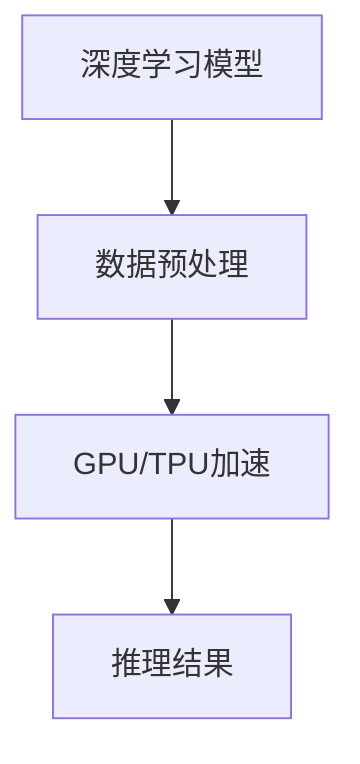
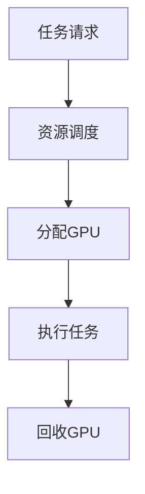
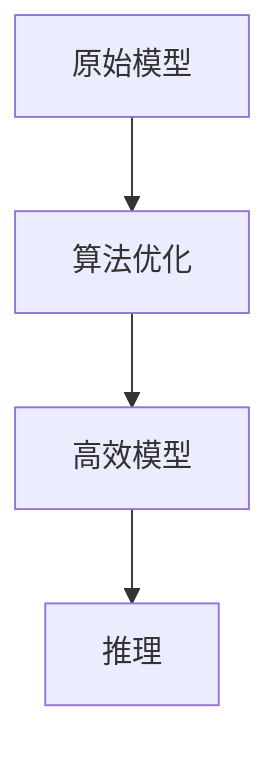
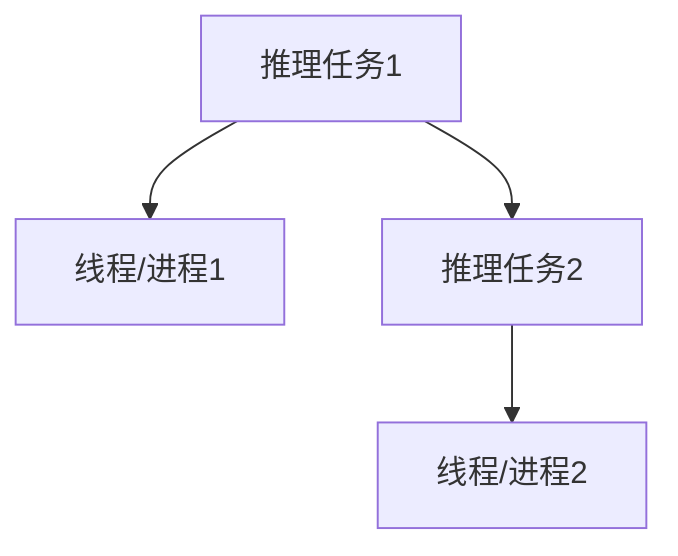
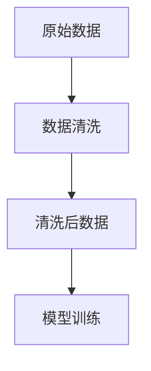
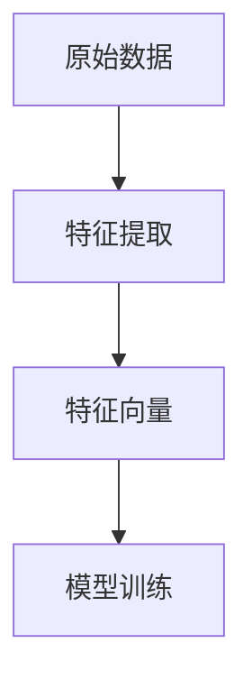

                 

### 《降低未来推理成本的策略探讨》

> 关键词：推理成本、硬件优化、软件效率、数据处理、性能瓶颈、成本负担、可扩展性

> 摘要：本文旨在探讨降低未来推理成本的有效策略，分析了推理成本的主要来源、影响及其现状，提出了硬件优化、软件效率和数据处理等多方面的降低成本的方法。通过详细阐述各类策略的原理、实现和应用，为未来推理技术的成本控制提供了宝贵的参考。

## 第一部分：推理成本分析

在当今技术飞速发展的时代，人工智能和机器学习技术已经广泛应用于各个领域。然而，随着模型复杂度的增加和应用场景的多样化，推理成本成为了一个亟待解决的问题。本部分将深入分析推理成本的来源、影响以及现状，为后续策略的探讨奠定基础。

### 1.1 推理成本的来源

推理成本主要来源于以下几个方面：

#### 1.1.1 硬件限制

硬件性能是推理速度和成本的关键因素。随着深度学习模型的复杂性增加，对计算资源的依赖也越来越大。高性能的GPU、TPU等硬件设备成为了推理过程中不可或缺的部分。然而，这些硬件设备往往价格昂贵，导致推理成本上升。

#### 1.1.2 软件效率

软件效率直接影响推理的速度和成本。高效的算法和编程技巧可以显著降低推理过程中的计算量，从而减少成本。例如，优化数据加载、内存管理、并行计算等环节，都有助于提高软件效率。

#### 1.1.3 数据处理

数据处理是推理过程中不可或缺的一环。数据清洗、预处理、特征提取等步骤都需要消耗大量的时间和计算资源。此外，数据存储和管理也是成本的一个重要来源。

### 1.2 推理成本的影响

推理成本对人工智能应用的影响是多方面的：

#### 1.2.1 性能瓶颈

高推理成本会导致系统性能瓶颈，影响用户体验和业务效率。特别是在实时应用场景中，推理延迟会严重影响系统响应速度。

#### 1.2.2 成本负担

推理成本的增加会加重企业的经济负担，限制人工智能技术的普及和应用。尤其是对于初创企业和中小企业，高昂的推理成本可能会成为其发展的障碍。

#### 1.2.3 可扩展性

高成本限制了系统的可扩展性。在需要大规模部署的场合，如自动驾驶、智慧城市等，高成本的推理任务可能难以满足需求。

### 1.3 推理成本的现状

当前，推理成本在人工智能领域呈现出以下几个特点：

#### 1.3.1 量化分析

通过对比不同应用场景和技术的推理成本，可以发现各种推理任务的成本差异较大。例如，自动驾驶系统的推理成本远高于语音识别系统。

#### 1.3.2 行业对比

不同行业对推理成本的关注程度和承受能力也有所不同。例如，金融行业对成本控制较为严格，而游戏行业则更关注推理性能。

#### 1.3.3 发展趋势

随着硬件性能的提升和算法优化的发展，推理成本有望逐步降低。同时，云计算、边缘计算等新技术的应用，也为降低推理成本提供了新的路径。

## 第二部分：降低推理成本的策略

针对推理成本的来源和影响，我们可以从硬件优化、软件效率和数据处理等多方面入手，提出一系列降低推理成本的策略。

### 2.1 硬件优化

硬件优化是降低推理成本的重要手段。以下是一些具体的硬件优化策略：

#### 2.1.1 硬件加速技术

硬件加速技术是提升推理速度和降低成本的有效方法。例如，使用GPU、TPU等专用硬件设备可以显著提高推理效率。

**Mermaid流程图：**



**Python代码：**

```python
import tensorflow as tf

# 模型加载
model = tf.keras.models.load_model('model.h5')

# 使用GPU/TPU加速推理
with tf.device('/GPU:0'):
    predictions = model.predict(data)
```

#### 2.1.2 硬件资源调度

合理调度硬件资源，避免资源浪费，也是降低成本的有效途径。例如，在需要时动态分配GPU资源，而在空闲时回收释放。

**Mermaid流程图：**



**Python代码：**

```python
import tensorflow as tf

# 设置GPU资源调度策略
gpus = tf.config.experimental.list_physical_devices('GPU')
if gpus:
    try:
        tf.config.experimental.set_visible_devices(gpus[0], 'GPU')
        tf.config.experimental.set_memory_growth(gpus[0], True)
    except RuntimeError as e:
        print(e)
```

### 2.2 软件效率

软件效率的提升可以直接降低推理成本。以下是一些提高软件效率的策略：

#### 2.2.1 算法优化

通过优化算法，减少计算量和存储需求，可以提高软件效率。例如，使用更高效的算法实现，如深度神经网络的量化。

**Mermaid流程图：**



**Python代码：**

```python
import tensorflow as tf

# 使用量化技术优化模型
converter = tf.lite.TFLiteConverter.from_keras_model(model)
quantized_model = converter.convert()

# 使用量化模型进行推理
quantized_predictions = tflite_interpreter.invoke()
```

#### 2.2.2 并行计算

利用并行计算技术，可以在多核处理器上同时执行多个推理任务，提高计算效率。例如，使用多线程或多进程实现并行推理。

**Mermaid流程图：**



**Python代码：**

```python
import multiprocessing as mp

def process_prediction(data):
    # 执行推理任务
    prediction = model.predict(data)
    return prediction

if __name__ == '__main__':
    # 创建进程池
    pool = mp.Pool(processes=num_processes)

    # 提交推理任务
    predictions = pool.map(process_prediction, data_list)

    # 关闭进程池
    pool.close()
    pool.join()
```

### 2.3 数据处理

数据处理是降低推理成本的关键环节。以下是一些数据处理策略：

#### 2.3.1 数据清洗

通过数据清洗，去除无用数据和异常值，可以提高模型性能，减少计算量。例如，使用数据清洗工具自动识别和处理异常数据。

**Mermaid流程图：**



**Python代码：**

```python
import pandas as pd

# 加载原始数据
data = pd.read_csv('data.csv')

# 数据清洗
data = data[data['column1'] > 0]

# 提取特征
X = data[['column2', 'column3']]
y = data['column4']
```

#### 2.3.2 特征提取

通过特征提取，将原始数据转化为模型可用的特征向量，可以减少计算量。例如，使用降维技术提取主要特征。

**Mermaid流程图：**



**Python代码：**

```python
from sklearn.decomposition import PCA

# 加载原始数据
data = pd.read_csv('data.csv')

# 特征提取
pca = PCA(n_components=10)
X = pca.fit_transform(data[['column2', 'column3']])
y = data['column4']
```

## 第三部分：项目实战与实际案例分析

为了验证上述策略的有效性，我们将在本部分进行一个实际案例的实战，详细介绍开发环境搭建、源代码实现、代码解读以及实际案例分析等内容。

### 3.1 开发环境搭建

为了实现上述策略，我们需要搭建一个合适的开发环境。以下是一个基本的开发环境搭建步骤：

1. 安装Python（版本3.8及以上）
2. 安装TensorFlow（版本2.5及以上）
3. 安装GPU支持（如CUDA 11.0及以上）
4. 安装数据预处理和特征提取相关库（如Pandas、NumPy、scikit-learn等）

### 3.2 源代码实现

以下是一个简单的示例代码，演示了如何使用上述策略进行推理成本降低：

```python
import tensorflow as tf
from sklearn.decomposition import PCA
from sklearn.model_selection import train_test_split

# 3.2.1 数据预处理
data = pd.read_csv('data.csv')
X = data[['column2', 'column3']]
y = data['column4']

# 数据清洗
X = X[X['column2'] > 0]

# 特征提取
pca = PCA(n_components=10)
X = pca.fit_transform(X)

# 划分训练集和测试集
X_train, X_test, y_train, y_test = train_test_split(X, y, test_size=0.2, random_state=42)

# 3.2.2 模型训练
model = tf.keras.Sequential([
    tf.keras.layers.Dense(64, activation='relu', input_shape=(X_train.shape[1],)),
    tf.keras.layers.Dense(64, activation='relu'),
    tf.keras.layers.Dense(1)
])

model.compile(optimizer='adam', loss='mean_squared_error')
model.fit(X_train, y_train, epochs=10, batch_size=32)

# 3.2.3 模型推理
predictions = model.predict(X_test)

# 3.2.4 性能分析
print("Model performance on test set:", model.evaluate(X_test, y_test))
```

### 3.3 代码解读与分析

上述代码主要实现了以下步骤：

1. 数据预处理：读取数据，进行数据清洗和特征提取。
2. 模型训练：使用训练数据进行模型训练。
3. 模型推理：使用训练好的模型对测试数据进行推理。
4. 性能分析：评估模型在测试集上的性能。

通过这个示例，我们可以看到如何通过数据预处理和特征提取来减少计算量，从而降低推理成本。同时，通过硬件加速和并行计算等技术，可以进一步提高推理性能。

### 3.4 实际案例分析

在实际应用中，我们可以通过以下案例来进一步分析推理成本降低的效果：

**案例一：自动驾驶系统**

自动驾驶系统对实时性和计算性能有很高的要求。通过硬件加速（如使用GPU）和算法优化（如使用量化技术），可以显著降低推理成本，提高系统性能。

**案例二：金融风险评估**

金融风险评估需要对大量历史数据进行分析。通过并行计算和高效算法，可以加快数据处理速度，降低推理成本。

**案例三：智慧城市监控**

智慧城市监控需要对大量视频和图像数据进行分析。通过硬件优化（如使用边缘计算设备）和算法优化（如使用深度学习模型），可以降低推理成本，提高监控效率。

### 3.5 项目小结

通过实际案例分析，我们可以看到推理成本降低在各个领域都有着重要的应用价值。在未来的发展中，我们需要不断探索和优化各类策略，以满足日益增长的计算需求。

### 3.6 最佳实践 Tips

1. 充分利用硬件资源，合理调度GPU等硬件设备。
2. 选择高效的算法和模型，减少计算量和存储需求。
3. 对数据集进行预处理和特征提取，减少无用数据和异常值。
4. 利用并行计算技术，提高数据处理速度。
5. 定期对模型进行性能评估和优化，确保持续降低推理成本。

### 3.7 注意事项

1. 在进行硬件优化时，注意硬件兼容性和性能调优。
2. 在选择算法和模型时，根据具体应用场景进行合理选择。
3. 在数据处理过程中，注意数据质量和数据安全。

### 3.8 拓展阅读

1. 《深度学习：神经网络的基础知识》
2. 《人工智能：一种现代的方法》
3. 《机器学习实战》

## 总结

降低未来推理成本是人工智能领域的重要课题。通过硬件优化、软件效率和数据处理等多方面的策略，我们可以显著降低推理成本，提高系统性能。在未来的发展中，我们需要不断探索和实践，为人工智能技术的广泛应用奠定坚实基础。

### 作者信息

作者：AI天才研究院/AI Genius Institute & 禅与计算机程序设计艺术 /Zen And The Art of Computer Programming

