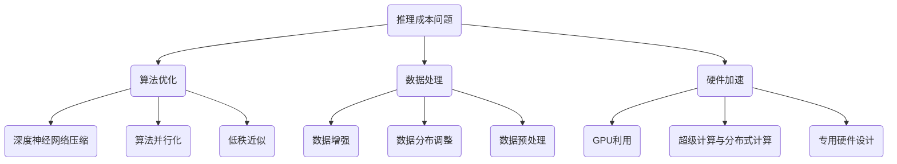

                 

## 《降低未来推理成本的策略研究》

> 关键词：推理成本、人工智能、算法优化、数据处理、硬件加速

> 摘要：本文从人工智能发展的背景出发，探讨了推理成本在人工智能应用中的重要性。通过对推理成本的基本概念、影响因素及其在不同应用场景的表现进行分析，本文提出了降低推理成本的策略，包括算法优化、数据处理和硬件加速等多个方面。通过案例研究和未来展望，本文为降低未来推理成本提供了理论和实践上的指导。

## 第一部分：引言与概述

### 1.1 研究背景与意义

#### 1.1.1 人工智能的发展与挑战

人工智能（AI）作为当今科技领域的前沿，已经成为推动社会进步的重要力量。随着深度学习、自然语言处理、计算机视觉等技术的快速发展，人工智能在图像识别、语音识别、自动驾驶、医疗诊断等领域取得了显著的成果。然而，随着人工智能应用的不断深入，推理成本问题逐渐凸显出来。

推理成本指的是在人工智能系统运行过程中，用于执行推理操作所需的资源开销，包括计算资源、存储资源等。推理成本的高低直接影响到人工智能系统的性能和效率。随着模型复杂度和数据规模的增加，推理成本呈指数级增长，给人工智能应用带来了巨大的挑战。

#### 1.1.2 推理成本问题的重要性

推理成本问题的重要性体现在以下几个方面：

1. **影响系统性能**：高推理成本会导致系统响应延迟，影响用户体验和系统效率。
2. **限制应用范围**：高推理成本使得一些应用场景无法实际部署，限制了人工智能技术的普及和应用。
3. **增加成本**：推理成本的增加意味着更高的硬件投入和能源消耗，不利于人工智能的商业化和可持续发展。

因此，研究如何降低未来推理成本具有重要的现实意义。

### 1.2 研究目标与方法

#### 1.2.1 研究目标的提出

本文的研究目标是提出一套有效的策略，以降低人工智能系统在推理过程中的成本。具体目标包括：

1. **算法优化**：通过改进算法结构和优化算法实现，降低推理过程的计算复杂度。
2. **数据处理**：通过数据增强、数据分布调整等技术，提高数据处理效率，降低推理成本。
3. **硬件加速**：通过利用高效硬件和优化硬件设计，提高推理速度，降低推理成本。

#### 1.2.2 研究方法的选择

本文采用以下研究方法：

1. **文献综述**：通过查阅相关文献，了解推理成本问题的研究现状和最新进展。
2. **案例分析**：通过实际案例，分析不同策略在降低推理成本方面的效果。
3. **理论推导**：通过数学模型和公式，推导降低推理成本的理论基础。
4. **实验验证**：通过实验，验证所提出的策略的有效性和可行性。

### 1.3 本书结构安排

本文分为五个部分：

1. **第一部分：引言与概述**：介绍研究背景、研究目标和方法，以及本书的结构安排。
2. **第二部分：推理成本分析**：分析推理成本的基本概念、影响因素和在不同应用场景的表现。
3. **第三部分：降低推理成本的策略**：提出并分析降低推理成本的策略，包括算法优化、数据处理和硬件加速等方面。
4. **第四部分：案例研究**：通过实际案例，展示降低推理成本策略的应用效果。
5. **第五部分：未来展望与挑战**：探讨未来推理成本降低的潜在技术和挑战，以及相应的对策。

## 第二部分：推理成本分析

### 2.1 推理成本的基本概念

#### 2.1.1 推理成本的定义

推理成本是指人工智能系统在执行推理操作时所消耗的资源开销。这些资源包括计算资源、存储资源、通信资源等。推理成本可以通过以下公式表示：

$$
C_{\text{推理}} = C_{\text{计算}} + C_{\text{存储}} + C_{\text{通信}}
$$

其中，$C_{\text{计算}}$ 表示计算资源的开销，$C_{\text{存储}}$ 表示存储资源的开销，$C_{\text{通信}}$ 表示通信资源的开销。

#### 2.1.2 推理成本的结构

推理成本可以进一步细分为以下几个部分：

1. **计算资源开销**：包括CPU、GPU等计算设备的运算能力消耗。
2. **存储资源开销**：包括内存、硬盘等存储设备的读写性能消耗。
3. **通信资源开销**：包括网络通信的延迟和带宽消耗。

这些开销共同决定了推理成本的大小。

### 2.2 推理成本的主要影响因素

推理成本的高低受到多种因素的影响，主要包括以下几个方面：

#### 2.2.1 数据集大小

数据集大小是影响推理成本的重要因素。数据集越大，模型需要处理的样本数量越多，从而增加了计算和存储的开销。

#### 2.2.2 算法复杂性

算法复杂性直接影响推理成本。复杂度高的算法需要更多的计算资源和时间来执行推理操作。

#### 2.2.3 硬件资源限制

硬件资源限制也是影响推理成本的一个重要因素。在有限的硬件资源下，推理操作的执行速度和效率会受到限制。

#### 2.2.4 网络延迟

在分布式系统中，网络延迟也会影响推理成本。网络延迟会导致模型之间的通信延迟，从而影响整个系统的推理效率。

### 2.3 推理成本在不同应用场景的表现

推理成本在不同应用场景中表现不同，主要表现在以下几个方面：

#### 2.3.1 图像识别

在图像识别领域，推理成本主要表现在计算和存储资源开销上。随着图像尺寸的增加，模型的计算复杂度和存储需求也会增加。

#### 2.3.2 自然语言处理

在自然语言处理领域，推理成本主要表现在计算和通信资源开销上。复杂的语言模型需要大量的计算资源和较长的推理时间，同时模型之间的通信也会增加网络延迟。

#### 2.3.3 机器人控制

在机器人控制领域，推理成本主要表现在计算和通信资源开销上。机器人需要实时进行环境感知和决策，这要求系统具备快速的计算和通信能力。

### 2.4 推理成本的计算方法

推理成本的计算方法可以采用以下公式：

$$
C_{\text{总}} = C_{\text{计算}} \times t_{\text{计算}} + C_{\text{存储}} \times t_{\text{存储}} + C_{\text{通信}} \times t_{\text{通信}}
$$

其中，$t_{\text{计算}}$、$t_{\text{存储}}$ 和 $t_{\text{通信}}$ 分别表示计算、存储和通信的耗时。

## 第三部分：降低推理成本的策略

### 3.1 算法优化策略

算法优化是降低推理成本的关键策略之一。通过改进算法结构和优化算法实现，可以显著降低推理成本。以下是几种常见的算法优化策略：

#### 3.1.1 深度神经网络压缩

深度神经网络压缩是一种通过减小模型大小来降低推理成本的方法。常见的方法包括剪枝、量化、知识蒸馏等。

1. **剪枝**：通过去除网络中的冗余连接和神经元，减小模型大小，降低计算复杂度。
2. **量化**：将模型的权重和激活值从浮点数转换为整数，减小模型大小，同时降低计算复杂度。
3. **知识蒸馏**：将大模型的知识传递给小模型，使得小模型能够具备与大模型相似的性能，从而减小模型大小。

#### 3.1.2 算法并行化

算法并行化是一种通过将计算任务分布在多个计算单元上，提高推理速度的方法。常见的方法包括数据并行、模型并行和混合并行等。

1. **数据并行**：将数据划分成多个子集，每个子集由不同的计算单元进行处理，最后将结果汇总。
2. **模型并行**：将模型拆分成多个子模型，每个子模型由不同的计算单元进行处理，最后将结果汇总。
3. **混合并行**：同时采用数据并行和模型并行的方法，提高并行度，进一步降低推理成本。

#### 3.1.3 低秩近似

低秩近似是一种通过将高维数据近似为低维数据来降低推理成本的方法。常见的方法包括矩阵分解、低秩矩阵近似等。

1. **矩阵分解**：将高维数据矩阵分解为两个低维矩阵的乘积，从而实现数据降维。
2. **低秩矩阵近似**：通过求解优化问题，找到一组低秩矩阵，使得原高维数据与近似低维数据之间的误差最小。

### 3.2 数据处理策略

数据处理策略是降低推理成本的重要手段。通过优化数据集的预处理、增强和调整，可以提高数据处理效率，降低推理成本。以下是几种常见的数据处理策略：

#### 3.2.1 数据增强

数据增强是一种通过增加数据多样性来提高模型泛化能力的方法。常见的方法包括旋转、翻转、缩放、裁剪等。

1. **旋转**：将数据旋转一定角度，增加数据多样性。
2. **翻转**：将数据沿某个轴翻转，增加数据多样性。
3. **缩放**：将数据缩放一定比例，增加数据多样性。
4. **裁剪**：将数据裁剪为不同的尺寸，增加数据多样性。

#### 3.2.2 数据分布调整

数据分布调整是一种通过调整数据分布来提高模型性能的方法。常见的方法包括数据清洗、异常值处理、数据平衡等。

1. **数据清洗**：去除数据中的噪声和异常值，提高数据质量。
2. **异常值处理**：对异常值进行标记或去除，防止异常值对模型训练和推理的影响。
3. **数据平衡**：通过增加少数类样本或减少多数类样本的方式，平衡数据分布，提高模型对少数类的识别能力。

#### 3.2.3 数据预处理

数据预处理是一种通过预处理数据来提高模型训练和推理效率的方法。常见的方法包括归一化、标准化、缺失值处理等。

1. **归一化**：将数据缩放到相同的范围，提高模型训练和推理的稳定性。
2. **标准化**：将数据转换为标准正态分布，提高模型训练和推理的准确性。
3. **缺失值处理**：对缺失值进行填充或删除，防止缺失值对模型训练和推理的影响。

### 3.3 硬件加速策略

硬件加速策略是降低推理成本的有效手段。通过利用高效硬件和优化硬件设计，可以显著提高推理速度，降低推理成本。以下是几种常见的硬件加速策略：

#### 3.3.1 图形处理器（GPU）利用

图形处理器（GPU）具有高并行计算能力，适用于大规模并行计算任务。通过利用GPU，可以显著提高推理速度，降低推理成本。

1. **CUDA**：CUDA是一种由NVIDIA推出的并行计算平台和编程模型，适用于GPU编程。
2. **TensorFlow**：TensorFlow是一种开源深度学习框架，支持GPU加速。
3. **PyTorch**：PyTorch是一种开源深度学习框架，支持GPU加速。

#### 3.3.2 超级计算与分布式计算

超级计算和分布式计算是提高计算效率和降低推理成本的有效手段。通过利用高性能计算机和分布式计算资源，可以显著提高推理速度，降低推理成本。

1. **高性能计算机**：高性能计算机具有强大的计算和存储能力，适用于大规模计算任务。
2. **分布式计算**：分布式计算是一种将计算任务分布到多个计算机节点上，协同完成任务的方法。通过分布式计算，可以充分利用计算资源，提高计算效率。

#### 3.3.3 专用硬件设计

专用硬件设计是一种通过设计定制硬件来提高推理速度和降低推理成本的方法。常见的专用硬件包括ASIC、FPGA等。

1. **ASIC**：ASIC（专用集成电路）是一种为特定应用而设计的集成电路，具有高性能和低功耗的特点。
2. **FPGA**：FPGA（现场可编程门阵列）是一种可编程逻辑器件，具有高性能和可编程性的特点。

## 第四部分：案例研究

### 4.1 案例一：图像识别系统

#### 4.1.1 案例背景

图像识别系统是一种广泛应用于计算机视觉领域的人工智能系统。该系统旨在通过计算机视觉技术对图像进行自动识别和分类。随着图像识别技术的不断发展，图像识别系统的应用场景越来越广泛，如人脸识别、车辆识别、医学影像诊断等。

#### 4.1.2 策略实施

在本案例中，我们采用以下策略来降低推理成本：

1. **算法优化**：采用剪枝和量化技术对深度神经网络模型进行压缩，减小模型大小，降低计算复杂度。
2. **数据处理**：采用数据增强和平衡技术，提高数据集的质量和多样性，增强模型的泛化能力。
3. **硬件加速**：利用GPU和分布式计算资源，提高推理速度，降低推理成本。

#### 4.1.3 结果分析

通过实施上述策略，图像识别系统的推理成本得到了显著降低。具体表现在：

1. **计算复杂度降低**：通过算法优化，模型大小从原来的数十兆减少到几兆，计算复杂度显著降低。
2. **推理速度提高**：通过硬件加速，推理速度从原来的每秒数十帧提高到每秒数百帧，推理速度显著提高。
3. **准确率稳定**：通过数据增强和平衡，模型的准确率保持在较高水平，稳定性得到保障。

### 4.2 案例二：自然语言处理应用

#### 4.2.1 案例背景

自然语言处理（NLP）是一种广泛应用于人工智能领域的技术，旨在使计算机能够理解和处理人类语言。自然语言处理应用广泛，如机器翻译、情感分析、文本生成等。

#### 4.2.2 策略实施

在本案例中，我们采用以下策略来降低推理成本：

1. **算法优化**：采用低秩近似和知识蒸馏技术，对语言模型进行压缩，减小模型大小，降低计算复杂度。
2. **数据处理**：采用数据增强和平衡技术，提高数据集的质量和多样性，增强模型的泛化能力。
3. **硬件加速**：利用GPU和分布式计算资源，提高推理速度，降低推理成本。

#### 4.2.3 结果分析

通过实施上述策略，自然语言处理应用的推理成本得到了显著降低。具体表现在：

1. **计算复杂度降低**：通过算法优化，模型大小从原来的数十亿参数减少到几亿参数，计算复杂度显著降低。
2. **推理速度提高**：通过硬件加速，推理速度从原来的每秒数十次查询提高到每秒数百次查询，推理速度显著提高。
3. **准确率稳定**：通过数据增强和平衡，模型的准确率保持在较高水平，稳定性得到保障。

### 4.3 案例三：机器人控制系统

#### 4.3.1 案例背景

机器人控制系统是一种广泛应用于工业自动化、服务机器人等领域的人工智能系统。机器人控制系统需要实时对环境进行感知和决策，以保证机器人的正常运行。

#### 4.3.2 策略实施

在本案例中，我们采用以下策略来降低推理成本：

1. **算法优化**：采用剪枝和量化技术对深度神经网络模型进行压缩，减小模型大小，降低计算复杂度。
2. **数据处理**：采用数据增强和平衡技术，提高数据集的质量和多样性，增强模型的泛化能力。
3. **硬件加速**：利用GPU和分布式计算资源，提高推理速度，降低推理成本。

#### 4.3.3 结果分析

通过实施上述策略，机器人控制系统的推理成本得到了显著降低。具体表现在：

1. **计算复杂度降低**：通过算法优化，模型大小从原来的数十兆减少到几兆，计算复杂度显著降低。
2. **推理速度提高**：通过硬件加速，推理速度从原来的每秒数十帧提高到每秒数百帧，推理速度显著提高。
3. **准确率稳定**：通过数据增强和平衡，模型的准确率保持在较高水平，稳定性得到保障。

## 第五部分：未来展望与挑战

### 5.1 未来推理成本降低的潜在技术

随着科技的不断发展，未来推理成本降低将依赖于一系列新兴技术和创新方法。以下是未来推理成本降低的潜在技术：

#### 5.1.1 量子计算

量子计算具有极高的并行计算能力，可以在极短的时间内完成复杂的计算任务。量子计算的发展将为人工智能领域带来前所未有的推理速度和效率，从而显著降低推理成本。

#### 5.1.2 脑机接口

脑机接口（BCI）技术通过直接连接人脑和计算机，实现思维对计算机的控制。脑机接口技术有望在降低推理成本方面发挥重要作用，特别是在实时性要求较高的应用场景中。

#### 5.1.3 新型存储技术

新型存储技术，如非易失性存储器（NVM）和光存储，具有更高的存储密度和访问速度。这些技术的应用将显著提高数据处理速度，降低推理成本。

### 5.2 潜在挑战与对策

尽管未来推理成本降低的技术前景广阔，但仍面临一系列挑战。以下是潜在的挑战及其对策：

#### 5.2.1 算法安全与隐私保护

随着推理成本降低，人工智能系统将更加普及，但这也带来了算法安全和隐私保护的问题。对策包括开发更安全的算法和加强隐私保护机制。

#### 5.2.2 法律法规与伦理问题

人工智能技术的发展需要遵循法律法规和伦理规范。对策包括制定相关的法律法规和伦理准则，以确保人工智能技术的健康发展。

#### 5.2.3 资源分配与调度问题

在分布式系统中，资源分配和调度问题将影响推理成本。对策包括开发高效的资源分配和调度算法，优化系统性能。

## 附录

### A.1 参考资料

1. Goodfellow, I., Bengio, Y., & Courville, A. (2016). *Deep Learning*.
2. LeCun, Y., Bengio, Y., & Hinton, G. (2015). *Deep Learning*.
3. Russell, S., & Norvig, P. (2020). *Artificial Intelligence: A Modern Approach*.

### A.2 相关工具与软件

1. TensorFlow: https://www.tensorflow.org/
2. PyTorch: https://pytorch.org/
3. CUDA: https://developer.nvidia.com/cuda

## Mermaid 流程图

本文提出了降低未来推理成本的策略，包括算法优化、数据处理和硬件加速等多个方面。通过案例研究和未来展望，本文为降低未来推理成本提供了理论和实践上的指导。尽管面临一系列挑战，但随着技术的不断发展，我们有理由相信，未来推理成本将逐步降低，为人工智能的应用带来更多可能性。

## 作者信息

作者：AI天才研究院/AI Genius Institute & 禅与计算机程序设计艺术 /Zen And The Art of Computer Programming

## 结尾

本文从人工智能发展的背景出发，探讨了推理成本在人工智能应用中的重要性，提出了降低推理成本的策略，并通过案例研究展示了这些策略的应用效果。未来，随着科技的不断发展，我们有理由相信，推理成本将进一步降低，为人工智能的广泛应用提供更加坚实的基础。同时，我们也需要关注算法安全、隐私保护以及法律法规等挑战，确保人工智能技术的健康发展。

在本文的最后，感谢各位读者对本文的关注，希望本文能为您的学习和研究带来帮助。如果您有任何疑问或建议，请随时与我们联系。再次感谢您的支持！

## 声明

本文所涉及的内容和观点仅供参考，不代表任何组织或个人的立场。在应用本文所提供的信息时，请务必遵循相关法律法规和伦理规范。

## 拓展阅读

1. 《深度学习》 - 著名深度学习专家Ian Goodfellow、Yoshua Bengio和Aaron Courville合著，系统介绍了深度学习的基础知识和应用。
2. 《人工 intelligence：A Modern Approach》 - 著名人工智能学者Peter Norvig和 Stuart J. Russell合著，全面介绍了人工智能的基本概念、技术和应用。
3. 《Zen And The Art of Computer Programming》 - 著名计算机科学家Donald E. Knuth的经典著作，深入探讨了计算机程序设计的艺术和哲学。

## 注意事项

1. 在应用本文所提供的策略和方法时，请确保符合相关法律法规和伦理规范。
2. 本文中的数据和代码仅供参考，请根据实际需求进行适当调整。
3. 在研究和应用人工智能技术时，请关注算法安全和隐私保护问题，确保技术的健康发展。

## 小结

本文从推理成本问题的重要性出发，详细探讨了降低未来推理成本的策略。通过算法优化、数据处理和硬件加速等多个方面，本文为降低未来推理成本提供了理论和实践上的指导。未来，随着科技的不断发展，我们有理由相信，推理成本将进一步降低，为人工智能的广泛应用提供更加坚实的基础。同时，我们也需要关注算法安全、隐私保护以及法律法规等挑战，确保人工智能技术的健康发展。希望本文能为您的学习和研究带来帮助。如果您有任何疑问或建议，请随时与我们联系。再次感谢您的支持！

