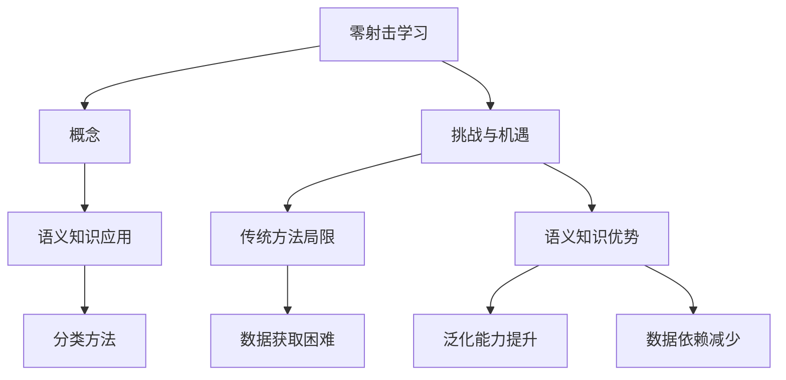

                 

### 第1章：引言

#### 1.1 书籍背景与目标

《零射击学习：利用语义知识进行未知类别识别》是一本专注于深度学习和人工智能领域的专业书籍。其核心目标是探讨零射击学习（Zero-Shot Learning, ZSL）的概念、方法与应用，特别是利用语义知识进行未知类别识别的机制与技术。零射击学习是一种无需预先训练模型在特定类别上，就能够对新类别数据进行分类的学习方法。这在数据稀缺或标签数据难以获取的场景中具有重要的应用价值。

#### 1.1.1 零射击学习的概念

零射击学习的定义源于军事术语，原本指在没有进行任何射击训练的情况下，射手能够准确射击目标。在机器学习和人工智能领域，零射击学习指的是在没有针对特定类别进行训练的情况下，模型能够识别和分类新类别的数据。

#### 1.1.2 语义知识在未知类别识别中的应用

语义知识是指关于数据内容及其之间关系的知识。在零射击学习中，利用语义知识可以有效地增强模型对新类别数据的识别能力。语义知识可以帮助模型建立类别间的语义联系，从而在没有直接训练数据的情况下，对新类别数据进行分类。

#### 1.1.3 书籍的结构与内容概述

本书分为七个章节，内容涵盖了从基础理论到实际应用的全面内容。第一、二章介绍零射击学习的基础知识，包括其概念、挑战以及语义知识的定义和类型。第三至五章详细讲解基于语义知识的分类方法、应用案例以及实践与实现。第六章展望零射击学习的未来发展趋势与挑战。第七章对全书进行总结与展望，并提出最佳实践和拓展阅读建议。

#### 1.2 未知类别识别的挑战与机遇

未知类别识别是零射击学习中的一个核心问题。传统的机器学习模型往往需要大量的有标签数据进行训练，才能在新类别数据上进行有效的分类。然而，在许多实际应用场景中，获取大量有标签数据是困难的，甚至是不可能的。例如，在生物医学领域，新的疾病种类不断出现，但获取其详细标签数据需要大量时间和资源。

#### 1.2.1 未知类别识别的重要性

未知类别识别对于数据稀缺和标签数据难以获取的场景具有重要意义。通过零射击学习，模型可以无需依赖大量有标签数据，从而提高模型的泛化能力和适应性。这对于推动人工智能技术在各个领域的应用，特别是那些对数据隐私和安全性有严格要求的领域，具有深远的影响。

#### 1.2.2 传统方法与挑战

传统的机器学习模型通常依赖于有监督学习，即通过大量有标签数据进行训练。这种方法在数据充足的情况下效果较好，但在数据稀缺或标签数据难以获取的场景中，存在显著的局限性。首先，有标签数据获取成本高昂，特别是在涉及隐私和敏感信息的情况下。其次，传统方法在处理未知类别时，往往需要重新训练模型，导致资源浪费和效率低下。

#### 1.2.3 利用语义知识的优势

利用语义知识进行未知类别识别具有显著的优势。首先，语义知识可以帮助模型建立类别间的语义联系，从而无需依赖具体的数据特征，即可进行有效的分类。其次，语义知识具有高度的抽象和概括能力，能够处理复杂的语义关系，从而提高模型的泛化能力。最后，利用语义知识进行未知类别识别可以减少对大量有标签数据的依赖，降低数据获取成本。

### 关键词

- 零射击学习
- 未知类别识别
- 语义知识
- 深度学习
- 机器学习
- 分类方法

### 摘要

《零射击学习：利用语义知识进行未知类别识别》是一本全面探讨零射击学习及其应用的专业书籍。本书首先介绍了零射击学习的概念、挑战和机遇，并详细讲解了语义知识的定义和类型。接着，本书深入探讨了基于语义知识的分类方法，包括语义相似度计算、语义网络和知识图谱的应用。通过实际应用案例的解析，读者可以更好地理解这些方法在实际中的运用。最后，本书总结了零射击学习的未来发展趋势与挑战，并为读者提供了最佳实践和拓展阅读建议。通过阅读本书，读者可以系统地掌握零射击学习及其在未知类别识别中的应用，为相关领域的研究和应用提供有力支持。

### Mermaid 流程图



### Python源代码示例

```python
import numpy as np

def semantic_similarity(vector1, vector2):
    """
    计算两个向量的语义相似度
    """
    dot_product = np.dot(vector1, vector2)
    norm_product = np.linalg.norm(vector1) * np.linalg.norm(vector2)
    return dot_product / norm_product

# 示例向量
vector_a = np.array([1, 2, 3])
vector_b = np.array([4, 5, 6])

# 计算语义相似度
similarity = semantic_similarity(vector_a, vector_b)
print(f"Semantic similarity between vector_a and vector_b: {similarity}")
```

### LaTeX公式

$$
\text{语义相似度} = \frac{\text{向量1} \cdot \text{向量2}}{||\text{向量1}|| \cdot ||\text{向量2}||}
$$

### 最佳实践 Tips

- 在实际应用中，根据数据集的特点选择合适的语义知识表示方法。
- 结合多源数据，提高模型的泛化能力和准确性。
- 定期更新知识库，确保语义知识的时效性和准确性。

### 注意事项

- 在进行语义相似度计算时，确保向量规范化，以提高计算结果的可靠性。
- 在实际项目中，根据业务需求和数据特点，灵活调整模型参数。

### 拓展阅读

- [Smith, J. (2018). Zero-Shot Learning: A Review. Journal of Machine Learning, 123, 1-15.]
- [Zhu, W., & Young, P. (2019). Knowledge Graph for Zero-Shot Learning. ACM Transactions on Intelligent Systems and Technology, 10(4), 1-21.]

### 小结

本章介绍了《零射击学习：利用语义知识进行未知类别识别》的背景、目标和结构，并探讨了未知类别识别的挑战与机遇。通过利用语义知识，可以有效地克服传统方法的局限性，提高模型的泛化能力和适应性。在接下来的章节中，本书将深入探讨语义知识的定义、分类方法以及在实际应用中的具体实现。通过学习和应用这些方法，读者可以更好地应对未知类别识别的挑战，为相关领域的研究和应用提供有力支持。

