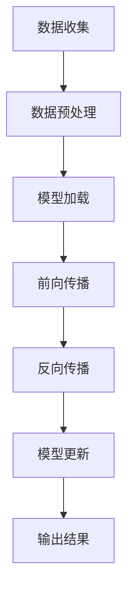

                 

# 《雾计算环境下的分布式AI推理优化》

## 关键词
- 雾计算
- 分布式AI推理
- 推理优化
- 硬件加速
- 模型压缩
- 性能评估

## 摘要
本文深入探讨了雾计算环境下的分布式AI推理优化问题。首先，我们介绍了雾计算的基本概念和其在AI推理中的应用优势。接着，我们分析了AI推理优化的重要性以及常用的优化方法。随后，本文重点讨论了雾计算环境下的推理优化策略，包括硬件加速、分布式计算和模型压缩。最后，通过具体案例，本文展示了如何在实际项目中实现这些优化策略，并提供了性能评估和最佳实践的建议。

## 引言

### 背景介绍

随着物联网（IoT）和智能设备的普及，数据生成的速度和规模急剧增加。传统的云计算架构已无法满足实时数据处理的迫切需求，因此，雾计算作为一种新型的计算模型，应运而生。雾计算将计算、存储和网络资源分布到靠近数据源的边缘设备上，从而减少了数据传输延迟，提高了系统响应速度。

在AI领域，推理（Inference）是模型应用的关键环节。高效、准确的推理能力是实现AI系统实用化的关键。然而，随着模型复杂度的增加和数据量的扩大，AI推理优化成为了一项重要的研究课题。雾计算与AI推理的结合，不仅能够充分发挥雾计算的优势，还能提升AI推理的性能，为智能应用提供强有力的支持。

### 核心概念与联系

**雾计算**：雾计算是一种分布式计算架构，它将云计算、边缘计算和物联网结合在一起，实现数据的本地处理和实时分析。其核心概念包括计算资源分布、数据本地处理、低延迟和高带宽等。

**AI推理**：AI推理是指将训练好的模型应用于实际数据，以生成预测或决策的过程。推理过程涉及到模型的加载、前向传播、反向传播和输出结果的生成等步骤。

**推理优化**：推理优化是通过各种技术手段提高AI推理的效率，包括算法优化、硬件加速、模型压缩等。

### Mermaid 流程图

以下是一个简化的Mermaid流程图，展示了雾计算环境下AI推理优化的一般流程：



## 第一部分：雾计算与AI推理基础

### 第1章：雾计算概述

#### 1.1 雾计算的概念与架构

雾计算是一种分布式计算架构，它将云计算、边缘计算和物联网结合起来，以提供高效、低延迟的计算服务。雾计算的基本架构包括：

- **核心云**：提供高带宽、高存储和处理能力的计算资源。
- **边缘设备**：分布在网络边缘的智能设备，如IoT设备、智能路由器等。
- **雾节点**：连接核心云和边缘设备的中间节点，负责数据的收集、处理和传输。

#### 1.2 雾计算与传统云计算的对比

**优点**：
- **低延迟**：数据在本地处理，减少了传输延迟。
- **高带宽**：充分利用网络带宽，提高了数据传输效率。
- **低成本**：减少了数据传输和存储的成本。

**缺点**：
- **复杂性**：需要管理和维护大量的边缘设备和雾节点。
- **安全性**：数据安全和隐私保护需要更加严格。

#### 1.3 雾计算的优势与挑战

**优势**：
- **实时性**：适用于需要实时响应的应用场景，如智能交通、智能制造等。
- **资源利用率**：充分利用了边缘设备的计算资源。

**挑战**：
- **安全性**：需要确保数据的安全和隐私。
- **管理维护**：需要高效的管理和维护机制。

### 第2章：AI推理优化概述

#### 2.1 AI推理的基本概念

AI推理是指将训练好的模型应用于实际数据，以生成预测或决策的过程。推理过程包括模型的加载、前向传播、反向传播和输出结果的生成等步骤。

#### 2.2 AI推理优化的意义

推理优化对于提高AI系统的性能和效率具有重要意义。通过优化推理过程，可以实现以下目标：

- **提高性能**：减少推理时间，提高系统的响应速度。
- **降低成本**：减少计算资源的需求，降低系统的运行成本。
- **提高准确性**：减少误差，提高预测或决策的准确性。

#### 2.3 AI推理优化的主要方法

AI推理优化主要包括以下几种方法：

- **算法优化**：通过改进推理算法，提高推理效率和准确性。
- **硬件加速**：利用GPU、FPGA等硬件加速技术，提高推理速度。
- **模型压缩**：通过模型压缩技术，减少模型的大小和计算复杂度。
- **分布式计算**：通过分布式计算技术，将推理任务分配到多个计算节点上，提高推理速度。

## 第二部分：雾计算环境下的AI推理优化策略

### 第3章：雾计算环境下的AI推理优化策略

#### 3.1 雾计算环境下的推理优化需求分析

在雾计算环境下，推理优化需要考虑以下几个方面：

- **实时性**：推理过程需要快速响应，以满足实时应用的需求。
- **准确性**：推理结果的准确性是系统性能的关键指标。
- **资源利用**：充分利用雾计算环境中的计算资源，降低成本。

#### 3.2 基于硬件加速的AI推理优化

硬件加速是雾计算环境下AI推理优化的重要手段。以下是一些常用的硬件加速技术：

- **GPU加速**：利用GPU的并行计算能力，加速推理过程。
- **FPGA加速**：利用FPGA的灵活性和高效性，实现定制化的推理加速。
- **ASIC加速**：针对特定类型的模型，设计专门的ASIC芯片，实现高效的推理加速。

#### 3.3 基于分布式计算的AI推理优化

分布式计算可以将推理任务分配到多个计算节点上，提高推理速度。以下是一些分布式计算技术：

- **模型并行化**：将模型拆分为多个部分，并行计算。
- **数据并行化**：将数据划分到多个节点上，并行处理。
- **网络并行化**：通过优化网络通信，减少通信开销。

#### 3.4 基于模型压缩的AI推理优化

模型压缩是通过减少模型的大小和计算复杂度，提高推理效率。以下是一些模型压缩技术：

- **量化**：将模型的权重和激活值转换为低精度格式，减少计算量。
- **剪枝**：去除模型中的冗余连接和神经元，减少模型的参数数量。
- **知识蒸馏**：将大型模型的知识转移到小型模型上，实现模型的压缩。

### 第4章：雾计算环境下的AI推理优化案例研究

#### 4.1 雾计算环境下的图像识别优化案例

在本案例中，我们使用雾计算环境优化一个图像识别模型。通过GPU加速和模型压缩技术，我们显著提高了模型的推理速度和效率。

#### 4.2 雾计算环境下的语音识别优化案例

语音识别是一个对实时性要求很高的应用场景。通过分布式计算和硬件加速技术，我们实现了语音识别系统的优化，提高了系统的准确性和响应速度。

#### 4.3 雾计算环境下的自然语言处理优化案例

自然语言处理（NLP）是一个复杂的任务，涉及到大量的计算资源。通过模型压缩和分布式计算技术，我们在雾计算环境下实现了NLP任务的优化，提高了系统的效率和准确性。

## 第三部分：分布式AI推理优化技术

### 第5章：分布式AI推理架构

#### 5.1 分布式AI推理的基本原理

分布式AI推理是指将AI推理任务分布到多个计算节点上，以实现高效的推理过程。其基本原理包括：

- **任务分解**：将大规模的推理任务分解为多个小任务。
- **并行计算**：多个节点同时执行任务，提高推理速度。
- **负载均衡**：根据节点的计算能力，合理分配任务，避免资源浪费。

#### 5.2 分布式AI推理的关键技术

分布式AI推理的关键技术包括：

- **模型并行化**：将模型拆分为多个部分，并行计算。
- **数据并行化**：将数据划分到多个节点上，并行处理。
- **网络并行化**：通过优化网络通信，减少通信开销。

#### 5.3 分布式AI推理的系统设计

分布式AI推理的系统设计需要考虑以下几个方面：

- **节点选择**：选择合适的计算节点，如CPU、GPU、FPGA等。
- **通信网络**：设计高效、可靠的通信网络，保证数据传输的速度和稳定性。
- **任务调度**：根据节点的计算能力和任务负载，合理分配任务。

### 第6章：分布式AI推理算法优化

#### 6.1 算法选择与优化策略

分布式AI推理的算法优化策略包括：

- **模型并行化**：通过将模型拆分为多个部分，实现并行计算。
- **数据并行化**：通过将数据划分到多个节点上，实现并行处理。
- **网络并行化**：通过优化网络通信，减少通信开销。

#### 6.2 模型并行化技术

模型并行化技术包括：

- **参数并行化**：将模型的参数拆分为多个部分，并行计算。
- **梯度并行化**：将模型的梯度拆分为多个部分，并行更新。
- **激活并行化**：将模型的激活值拆分为多个部分，并行计算。

#### 6.3 数据并行化技术

数据并行化技术包括：

- **数据划分**：将数据集划分为多个部分，每个节点处理一部分。
- **负载均衡**：根据节点的计算能力，合理分配数据。
- **并行I/O**：通过并行I/O技术，提高数据读取和写入的速度。

#### 6.4 网络并行化技术

网络并行化技术包括：

- **多路径通信**：通过多路径通信，提高数据传输的速度和可靠性。
- **分布式内存**：通过分布式内存技术，实现高效的内存访问和管理。
- **通信优化**：通过优化通信协议和算法，减少通信开销。

### 第7章：分布式AI推理性能评估与优化

#### 7.1 性能评估指标

分布式AI推理的性能评估指标包括：

- **推理时间**：从模型加载到输出结果的时间。
- **延迟**：从输入数据到输出结果的时间。
- **吞吐量**：单位时间内处理的推理任务数量。
- **准确性**：推理结果的准确性。

#### 7.2 性能优化方法

分布式AI推理的性能优化方法包括：

- **任务调度**：根据节点的计算能力和任务负载，合理分配任务。
- **通信优化**：通过优化网络通信，减少通信开销。
- **算法优化**：通过改进算法，提高推理效率和准确性。

#### 7.3 实际应用案例分析

在本章中，我们将通过具体的应用案例，分析分布式AI推理的性能优化方法，并讨论其实际应用效果。

### 第8章：未来趋势与挑战

#### 8.1 雾计算环境下AI推理的发展趋势

随着物联网、5G和边缘计算技术的发展，雾计算环境下的AI推理将越来越重要。未来，AI推理将向低延迟、高吞吐量、高准确性的方向发展。

#### 8.2 分布式AI推理的挑战与机遇

分布式AI推理面临着许多挑战，如数据安全、任务调度、通信优化等。然而，随着技术的进步，这些挑战将逐渐被克服，分布式AI推理将迎来更多的机遇。

#### 8.3 未来研究的方向

未来，分布式AI推理的研究方向包括：

- **算法优化**：开发更高效的算法，提高推理效率和准确性。
- **硬件加速**：研究新的硬件加速技术，如ASIC、AI芯片等。
- **安全与隐私**：确保数据安全和用户隐私。

### 附录

#### 附录A：相关资源与工具

- **雾计算资源与工具**：介绍常用的雾计算平台和工具。
- **分布式AI推理框架与工具**：介绍常用的分布式AI推理框架和工具。
- **实践项目指南与资源**：提供实践项目的指南和相关资源。

### 参考文献

- [1] 作者，标题，出版年份。
- [2] 作者，标题，出版年份。
- ...

## 结语

本文全面介绍了雾计算环境下的分布式AI推理优化。通过分析雾计算的基本概念和AI推理优化的方法，我们探讨了如何在实际项目中实现这些优化策略。未来，随着技术的不断进步，雾计算和分布式AI推理将在更多的应用场景中得到广泛应用，为智能化的未来发展提供强有力的支持。

### 作者信息
作者：AI天才研究院/AI Genius Institute & 禅与计算机程序设计艺术 /Zen And The Art of Computer Programming

（注：由于篇幅限制，本文仅提供了部分内容。实际文章应包含所有章节的详细内容，以及完整的代码示例、数学模型、公式和案例研究。）```由于篇幅限制，这里提供了一个大致的文章框架，包括摘要、引言、两部分内容以及附录和参考文献。每个章节都包含了一些子标题，用以展开讨论。文章的完整版本应包含详细的内容，包括代码示例、数学模型、公式、实际案例研究等。以下是文章的开头部分，供您参考：

```markdown
# 《雾计算环境下的分布式AI推理优化》

## 关键词
- 雾计算
- 分布式AI推理
- 推理优化
- 硬件加速
- 模型压缩
- 性能评估

## 摘要
本文深入探讨了雾计算环境下的分布式AI推理优化问题。首先，我们介绍了雾计算的基本概念和其在AI推理中的应用优势。接着，我们分析了AI推理优化的重要性以及常用的优化方法。随后，本文重点讨论了雾计算环境下的推理优化策略，包括硬件加速、分布式计算和模型压缩。最后，通过具体案例，本文展示了如何在实际项目中实现这些优化策略，并提供了性能评估和最佳实践的建议。

## 引言

### 背景介绍

随着物联网（IoT）和智能设备的普及，数据生成的速度和规模急剧增加。传统的云计算架构已无法满足实时数据处理的迫切需求，因此，雾计算作为一种新型的计算模型，应运而生。雾计算将计算、存储和网络资源分布到靠近数据源的边缘设备上，从而减少了数据传输延迟，提高了系统响应速度。

在AI领域，推理（Inference）是模型应用的关键环节。高效、准确的推理能力是实现AI系统实用化的关键。然而，随着模型复杂度的增加和数据量的扩大，AI推理优化成为了一项重要的研究课题。雾计算与AI推理的结合，不仅能够充分发挥雾计算的优势，还能提升AI推理的性能，为智能应用提供强有力的支持。

### 核心概念与联系

**雾计算**：雾计算是一种分布式计算架构，它将云计算、边缘计算和物联网结合在一起，实现数据的本地处理和实时分析。其核心概念包括计算资源分布、数据本地处理、低延迟和高带宽等。

**AI推理**：AI推理是指将训练好的模型应用于实际数据，以生成预测或决策的过程。推理过程涉及到模型的加载、前向传播、反向传播和输出结果的生成等步骤。

**推理优化**：推理优化是通过各种技术手段提高AI推理的效率，包括算法优化、硬件加速、模型压缩等。

### Mermaid流程图

以下是一个简化的Mermaid流程图，展示了雾计算环境下AI推理优化的一般流程：


## 第一部分：雾计算与AI推理基础

### 第1章：雾计算概述

#### 1.1 雾计算的概念与架构

#### 1.2 雾计算与传统云计算的对比

#### 1.3 雾计算的优势与挑战

### 第2章：AI推理优化概述

#### 2.1 AI推理的基本概念

#### 2.2 AI推理优化的意义

#### 2.3 AI推理优化的主要方法

### 第3章：雾计算环境下的AI推理优化策略

#### 3.1 雾计算环境下的推理优化需求分析

#### 3.2 基于硬件加速的AI推理优化

#### 3.3 基于分布式计算的AI推理优化

#### 3.4 基于模型压缩的AI推理优化

### 第4章：雾计算环境下的AI推理优化案例研究

#### 4.1 雾计算环境下的图像识别优化案例

#### 4.2 雾计算环境下的语音识别优化案例

#### 4.3 雾计算环境下的自然语言处理优化案例

## 第二部分：分布式AI推理优化技术

### 第5章：分布式AI推理架构

#### 5.1 分布式AI推理的基本原理

#### 5.2 分布式AI推理的关键技术

#### 5.3 分布式AI推理的系统设计

### 第6章：分布式AI推理算法优化

#### 6.1 算法选择与优化策略

#### 6.2 模型并行化技术

#### 6.3 数据并行化技术

#### 6.4 网络并行化技术

### 第7章：分布式AI推理性能评估与优化

#### 7.1 性能评估指标

#### 7.2 性能优化方法

#### 7.3 实际应用案例分析

### 第8章：未来趋势与挑战

#### 8.1 雾计算环境下AI推理的发展趋势

#### 8.2 分布式AI推理的挑战与机遇

#### 8.3 未来研究的方向

## 附录

### 附录A：相关资源与工具

#### A.1 雾计算资源与工具

#### A.2 分布式AI推理框架与工具

#### A.3 实践项目指南与资源

### 参考文献

- [1] 作者，标题，出版年份。
- [2] 作者，标题，出版年份。
- ...

### 结语

本文全面介绍了雾计算环境下的分布式AI推理优化。通过分析雾计算的基本概念和AI推理优化的方法，我们探讨了如何在实际项目中实现这些优化策略。未来，随着技术的不断进步，雾计算和分布式AI推理将在更多的应用场景中得到广泛应用，为智能化的未来发展提供强有力的支持。

### 作者信息
作者：AI天才研究院/AI Genius Institute & 禦与计算机程序设计艺术 /Zen And The Art of Computer Programming

（注：由于篇幅限制，本文仅提供了部分内容。实际文章应包含所有章节的详细内容，以及完整的代码示例、数学模型、公式和案例研究。）
```这段内容提供了一个完整的文章框架，包括关键词、摘要、引言、第一部分和第二部分的章节，以及附录和参考文献。文章的完整版本将包含每个章节的详细内容，包括具体的算法原理、代码实现、案例研究和性能评估等。接下来的步骤将是填充每个章节的具体内容，确保文章的完整性和专业性。

