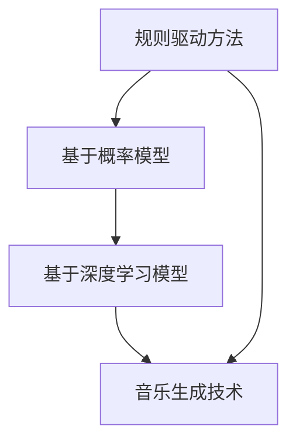
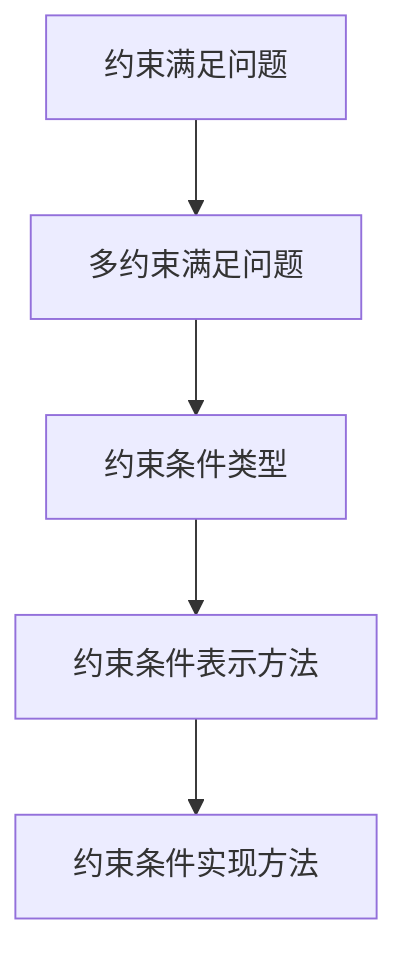
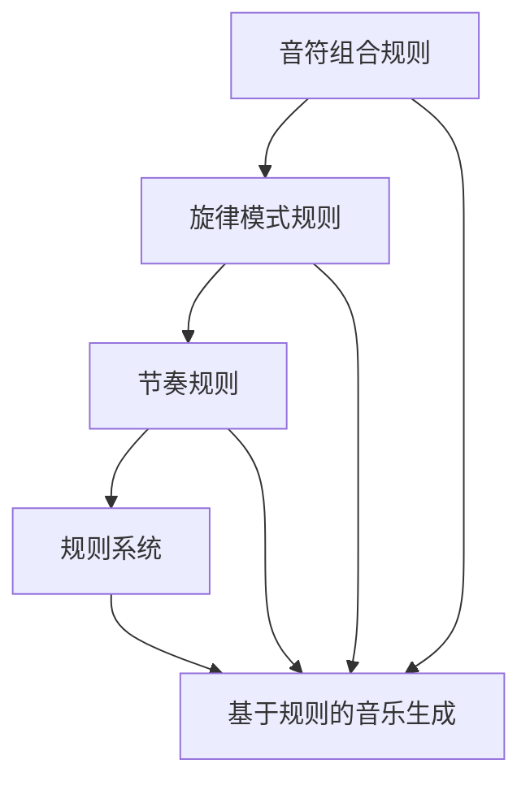
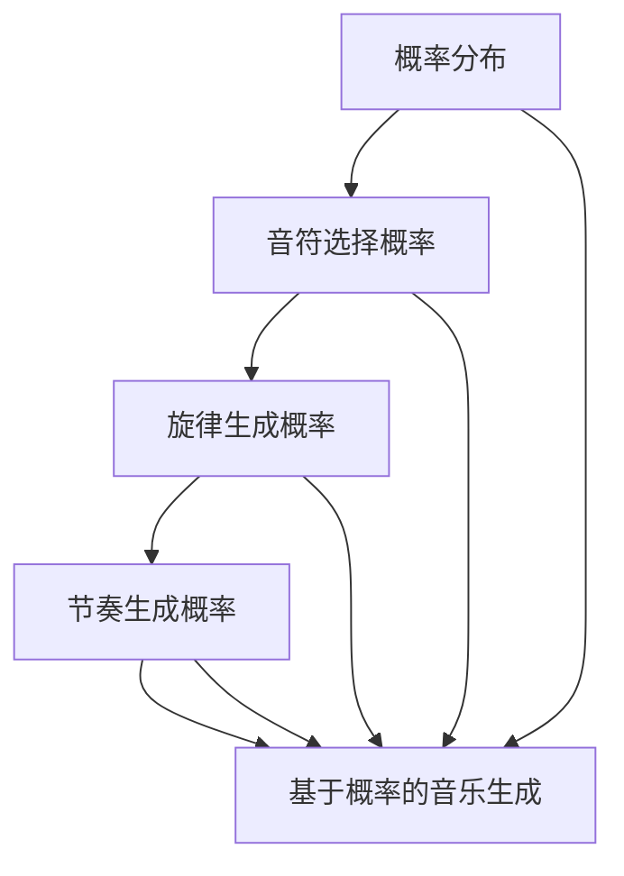
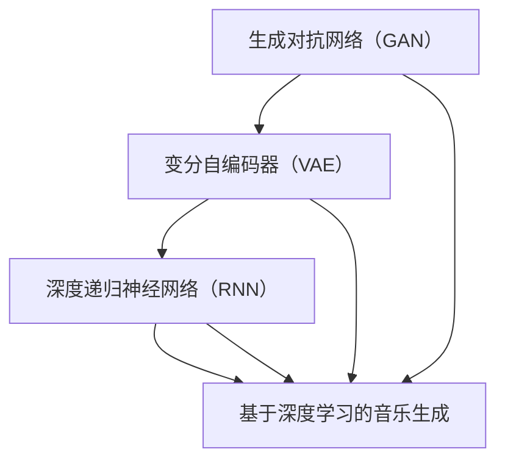
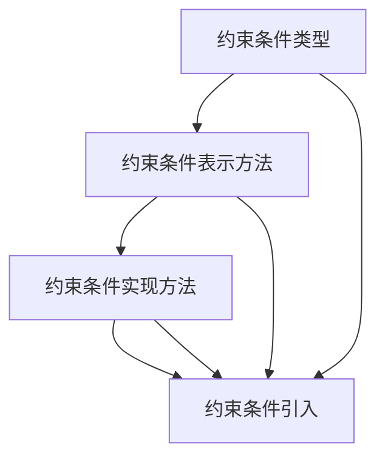
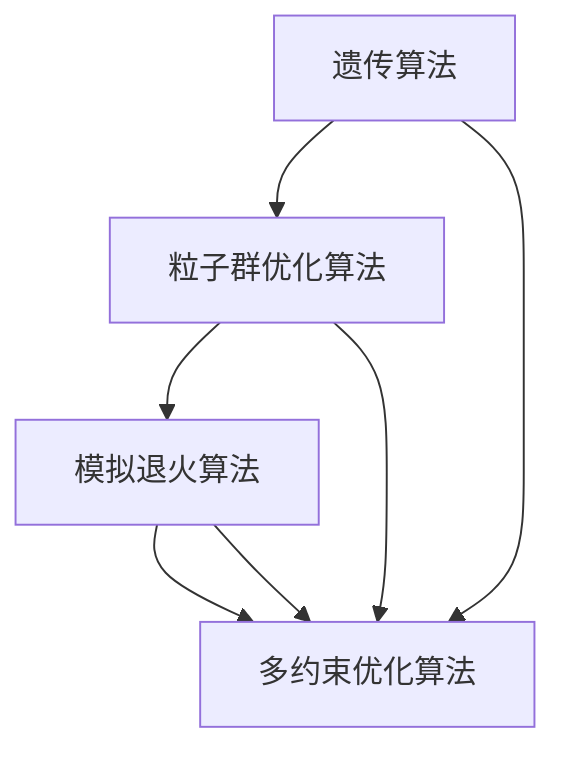

                 

### 《音乐生成中的多约束满足问题》

#### 关键词

- 音乐生成
- 多约束满足问题
- 约束优化算法
- 生成对抗网络（GAN）
- 变分自编码器（VAE）
- 深度递归神经网络（RNN）

#### 摘要

音乐生成是人工智能领域中的一个重要研究方向，它不仅具有艺术价值，还在娱乐、教育、辅助治疗等方面展现出广泛的应用潜力。然而，在音乐生成过程中，如何满足多种约束条件成为一个关键挑战。本文将详细探讨音乐生成中的多约束满足问题，从理论基础到实际应用，介绍不同类型的约束条件、常用的约束优化算法，并通过具体案例研究展示如何在音乐生成中实现这些约束条件。文章旨在为研究者提供一种系统化的解决思路，促进音乐生成技术的进一步发展。

## 第一部分：引论

### 1.1 音乐生成技术概述

音乐生成技术是指通过算法自动创作音乐的方法。它涵盖了从简单的音符序列生成，到复杂的旋律、和声和节奏设计的全过程。音乐生成技术的发展经历了几个重要阶段，从早期的规则驱动方法，到基于概率的模型，再到近年来迅速发展的基于深度学习的生成模型。

**核心概念与联系：**



**音乐生成技术发展历程**

- **规则驱动方法**：最早的音乐生成技术依赖于规则的编写，通过预定义的音符组合和旋律模式生成音乐。
- **基于概率模型**：这些方法通过概率分布来生成音乐，使得生成的音乐更具自然感。
- **基于深度学习模型**：近年来，深度学习技术的进步使得音乐生成变得更加复杂和高效，包括生成对抗网络（GAN）、变分自编码器（VAE）和深度递归神经网络（RNN）等。

**多约束满足问题在音乐生成中的重要性**

在音乐生成过程中，满足多种约束条件是提高生成音乐质量的关键。这些约束条件可能包括：

- **风格一致性**：确保生成的音乐与目标风格保持一致。
- **情感表达**：根据特定的情感需求生成音乐。
- **节奏和节拍**：遵循特定的节奏和节拍模式。
- **音高和和弦**：满足特定的音高和和弦结构。

多约束满足问题的解决不仅能够提升音乐的审美价值，还能使其在更广泛的场景中具有实用性。例如，在游戏、电影、虚拟现实等领域，音乐生成需要满足特定的情感和情境需求。

### 1.2 多约束满足问题基础

**核心概念与联系：**



**约束满足问题的定义**

约束满足问题（Constraint Satisfaction Problem，CSP）是指在一个给定的限制条件下寻找解决方案的问题。在CSP中，问题空间被表示为变量和它们之间的约束条件，目标是从所有可能的解决方案中找到一个满足所有约束条件的解决方案。

**多约束满足问题的特点与挑战**

多约束满足问题（Multi-Constraint Satisfaction Problem，MCSP）是指在一个给定的多个约束条件下寻找解决方案的问题。与CSP相比，MCSP的复杂度更高，因为它需要同时考虑多个相互作用的约束条件。

- **特点**：需要同时满足多个约束条件，可能存在约束之间的冲突和优先级问题。
- **挑战**：如何在复杂的约束条件下找到有效的解决方案，提高生成音乐的多样性和可预测性。

**多约束满足问题在音乐生成中的应用**

在音乐生成中，多约束满足问题的应用非常广泛。例如，在生成电影配乐时，需要满足以下约束条件：

- **风格一致性**：确保音乐与电影的风格和情感氛围相匹配。
- **节奏和节拍**：遵循电影的节奏和节拍模式，增强视听效果。
- **情感表达**：根据电影的情节和情感变化生成相应的音乐。
- **乐器和编曲**：使用特定的乐器和编曲风格，增强音乐的表现力。

通过解决多约束满足问题，可以生成更加丰富和具有表现力的音乐，提升整体的艺术效果。

### 1.3 音乐生成中的多约束满足问题研究现状

目前，关于音乐生成中的多约束满足问题的研究已经取得了一些进展。研究者们提出了多种算法和模型，以解决不同的约束条件。以下是一些主要的研究方向和进展：

- **基于规则的约束满足方法**：通过预定义的规则和模板来满足约束条件，这种方法简单易行，但缺乏灵活性。
- **基于概率的约束满足方法**：通过概率模型来生成音乐，可以较好地满足情感和风格等约束条件，但计算复杂度较高。
- **基于深度学习的约束满足方法**：利用深度学习模型，特别是生成对抗网络（GAN）、变分自编码器（VAE）和深度递归神经网络（RNN），可以生成高质量的音乐，同时满足多种约束条件。这些方法具有较好的灵活性和鲁棒性。

尽管取得了显著的进展，但在实际应用中，仍面临一些挑战，如如何在保持音乐风格一致性的同时，满足情感表达和节奏等复杂约束条件。未来的研究需要进一步探索这些挑战，并开发更加高效和鲁棒的音乐生成算法。

## 第二部分：音乐生成算法基础

### 2.1 音乐生成算法概述

音乐生成算法是指利用计算机程序生成音乐的方法。这些算法可以根据生成方法的不同，分为规则驱动方法、基于概率模型的方法和基于深度学习的方法。以下将对这三种方法进行简要介绍。

**核心概念与联系：**


**规则驱动方法**

规则驱动方法是最早的音乐生成技术之一，它通过预定义的音符组合、旋律模式和节奏规则来生成音乐。这种方法简单易行，但对音乐生成结果的多样性和复杂性有限。

- **优点**：实现简单，易于理解和调试。
- **缺点**：生成的音乐风格单一，缺乏自然性和创意性。

**基于概率模型的方法**

基于概率模型的方法通过概率分布来生成音乐，使得生成的音乐具有更高的自然性和创意性。这种方法主要包括马尔可夫链、隐马尔可夫模型（HMM）和变分自编码器（VAE）等。

- **优点**：生成的音乐自然性好，可以较好地满足情感和风格等约束条件。
- **缺点**：计算复杂度较高，需要大量的训练数据和计算资源。

**基于深度学习模型的方法**

基于深度学习模型的方法，特别是生成对抗网络（GAN）、变分自编码器（VAE）和深度递归神经网络（RNN），已经成为当前音乐生成的主流技术。这些方法利用深度学习模型的高效性和鲁棒性，可以生成高质量的音乐。

- **优点**：生成的音乐风格多样，具有很高的自然性和创意性。
- **缺点**：实现复杂，需要大量的训练数据和计算资源。

**音乐生成算法的评价标准**

音乐生成算法的评价标准主要包括以下三个方面：

- **音乐风格一致性**：生成的音乐是否与目标风格保持一致。
- **情感表达**：生成的音乐是否能够表达出特定的情感。
- **多样性**：生成的音乐是否具有多样性，能否生成多种风格和情感的音乐。

通过这些评价标准，可以对不同的音乐生成算法进行性能评估，以选择最合适的算法应用于实际问题。

### 2.2 基于规则的音乐生成

基于规则的音乐生成方法是一种传统的音乐生成技术，通过预定义的音符组合、旋律模式和节奏规则来生成音乐。这种方法的核心在于规则系统，即一系列用于描述音符、旋律和节奏的规则。

**核心概念与联系：**



**规则系统的基础知识**

规则系统是音乐生成的基础，它由一系列规则组成，这些规则用于定义音符、旋律和节奏。以下是一些常见的规则类型：

- **音符组合规则**：定义音符的组合方式，例如，使用哪些音符来构成旋律。
- **旋律模式规则**：定义旋律的模式和结构，例如，旋律的上升和下降趋势、转折点等。
- **节奏规则**：定义音乐的节奏模式，例如，使用哪些节拍、节奏和拍子。

**规则在音乐生成中的应用**

在音乐生成过程中，规则系统用于指导音符的选择、组合和排列。以下是一个简单的示例：

- **音符组合规则**：选择C、E、G三个音符构成一个和弦。
- **旋律模式规则**：旋律从低音C开始，逐步上升，到达高音G。
- **节奏规则**：使用四分音符作为主要的节奏单元，每个小节包含四个四分音符。

通过这些规则，可以生成一段简单的旋律：

```
C E G (四分音符)
D F# A (四分音符)
E G B (四分音符)
D F# A (四分音符)
```

这种基于规则的音乐生成方法虽然简单，但能够生成具有固定风格和结构的音乐。在需要保持音乐风格一致性的情况下，这种方法是一种有效的选择。

### 2.3 基于概率的音乐生成

基于概率的音乐生成方法通过概率模型来生成音乐，使得生成的音乐具有更高的自然性和创意性。这种方法的核心在于概率分布，即音符、旋律和节奏的概率分布。

**核心概念与联系：**



**概率分布与概率模型**

概率分布是描述随机变量取值的概率分布函数。在音乐生成中，概率分布用于描述音符、旋律和节奏的概率分布。以下是一些常见的概率模型：

- **马尔可夫链**：马尔可夫链是一种概率模型，用于描述时间序列数据。在音乐生成中，马尔可夫链可以用于生成音符序列。
- **隐马尔可夫模型（HMM）**：隐马尔可夫模型是一种概率模型，用于描述包含隐藏状态的随机过程。在音乐生成中，HMM可以用于生成包含隐藏状态的音符序列。
- **变分自编码器（VAE）**：变分自编码器是一种深度学习模型，用于生成具有概率分布的数据。在音乐生成中，VAE可以用于生成具有概率分布的音符序列。

**概率模型在音乐生成中的应用**

在音乐生成过程中，概率模型用于指导音符、旋律和节奏的选择。以下是一个简单的示例：

- **音符选择概率**：使用一个概率分布来选择音符，例如，选择C、E、G三个音符的概率分别为0.4、0.3和0.3。
- **旋律生成概率**：使用一个马尔可夫链模型来生成旋律，例如，下一个音符取决于当前音符和上一个音符。
- **节奏生成概率**：使用一个隐马尔可夫模型来生成节奏，例如，下一个节奏单元取决于当前节奏单元和上一个节奏单元。

通过这些概率模型，可以生成一段简单的旋律：

```
C (四分音符)
E (四分音符)
G (四分音符)
C (四分音符)
E (四分音符)
G (四分音符)
```

这种基于概率的音乐生成方法能够生成具有自然性和创意性的音乐。在需要生成具有特定风格和情感的音乐时，这种方法是一种有效的选择。

### 2.4 基于深度学习的音乐生成

基于深度学习的音乐生成方法利用深度学习模型的高效性和鲁棒性，生成高质量的音乐。深度学习模型包括生成对抗网络（GAN）、变分自编码器（VAE）和深度递归神经网络（RNN）等。

**核心概念与联系：**



**深度学习基础**

深度学习是一种基于多层神经网络的机器学习技术，通过多层非线性变换来提取数据的特征。在音乐生成中，深度学习模型可以用于提取音乐数据中的特征，并生成新的音乐。

- **多层神经网络**：深度学习模型由多层神经元组成，每层神经元对输入数据进行特征提取和变换。
- **反向传播算法**：深度学习模型通过反向传播算法来训练网络权重，使得模型能够生成高质量的音乐。

**生成对抗网络（GAN）**

生成对抗网络（Generative Adversarial Network，GAN）是由生成器和判别器两个神经网络组成的。生成器的目标是生成逼真的音乐数据，判别器的目标是区分真实音乐数据和生成音乐数据。

- **生成器**：生成器通过多层神经网络生成音乐数据，例如，音符序列、旋律和节奏。
- **判别器**：判别器通过多层神经网络判断音乐数据是否真实，从而训练生成器的生成能力。

**变分自编码器（VAE）**

变分自编码器（Variational Autoencoder，VAE）是一种基于深度学习的生成模型，通过编码器和解码器两个神经网络来生成音乐数据。

- **编码器**：编码器通过多层神经网络将音乐数据编码为潜在空间中的向量。
- **解码器**：解码器通过多层神经网络将潜在空间中的向量解码为音乐数据。

**深度递归神经网络（RNN）**

深度递归神经网络（Deep Recurrent Neural Network，RNN）是一种基于递归结构的深度学习模型，适用于处理序列数据。

- **递归结构**：RNN通过递归结构来处理序列数据，使得模型能够记住序列中的信息。
- **深度结构**：RNN通过多层神经网络来提取序列数据中的特征。

**深度学习模型在音乐生成中的应用**

在音乐生成中，深度学习模型可以用于生成各种类型的音乐，如音符序列、旋律和节奏。以下是一个简单的示例：

- **生成音符序列**：使用GAN模型生成音符序列，生成器和判别器分别用于生成和区分音符序列。
- **生成旋律**：使用VAE模型生成旋律，编码器和解码器分别用于编码和解码旋律。
- **生成节奏**：使用RNN模型生成节奏，RNN通过递归结构来生成节奏序列。

通过这些深度学习模型，可以生成高质量的音乐。基于深度学习的音乐生成方法具有较好的灵活性和鲁棒性，能够满足多种约束条件，生成具有多样性和创意性的音乐。

## 第三部分：多约束满足问题在音乐生成中的实现

### 3.1 约束条件的引入

在音乐生成中，引入约束条件是提高生成音乐质量的关键步骤。约束条件可以指导生成模型生成符合特定需求的音乐，从而增强音乐的艺术性和实用性。以下将介绍常见的约束条件类型、约束条件的表示方法以及在音乐生成中的实现方法。

**核心概念与联系：**



**约束条件类型**

在音乐生成中，常见的约束条件类型包括：

- **风格一致性**：确保生成的音乐与目标风格保持一致，例如，古典音乐、流行音乐、爵士乐等。
- **情感表达**：根据特定的情感需求生成音乐，例如，欢快、悲伤、紧张、宁静等。
- **节奏和节拍**：遵循特定的节奏和节拍模式，例如，快节奏、慢节奏、复杂节奏等。
- **音高和和弦**：满足特定的音高和和弦结构，例如，大调、小调、和声等。
- **乐器和编曲**：使用特定的乐器和编曲风格，例如，钢琴、吉他、管弦乐等。
- **时长和结构**：满足特定的时长和音乐结构，例如，短曲、长曲、前奏、副歌等。

**约束条件的表示方法**

约束条件的表示方法可以影响约束优化算法的效果。常见的表示方法包括：

- **显式表示**：直接将约束条件以显式的方式表示在算法中，例如，通过限制音符的范围、和弦的类型等。
- **隐式表示**：通过概率分布或者规则来隐式地表示约束条件，例如，使用概率模型或者规则系统来指导音符的选择。

**约束条件在音乐生成中的实现**

在音乐生成中，约束条件的实现方法包括：

- **规则驱动方法**：通过预定义的规则来满足约束条件，例如，使用规则系统来生成符合特定风格的旋律。
- **概率驱动方法**：通过概率模型来满足约束条件，例如，使用概率分布来生成符合特定情感的音乐。
- **深度学习驱动方法**：通过深度学习模型来满足约束条件，例如，使用GAN、VAE或RNN来生成符合特定约束条件的音乐。

以下是一个简单的示例，说明如何通过规则系统实现风格一致性的约束条件：

```python
# 定义音符组合规则
note_combination_rules = {
    "major": ["C", "D", "E", "F#", "G", "A", "B"],
    "minor": ["A", "B", "C", "D", "E", "F#", "G"],
}

# 定义旋律生成规则
melody_generation_rules = {
    "major": ["C", "D", "E", "F#", "G", "A", "B"],
    "minor": ["A", "B", "C", "D", "E", "F#", "G"],
}

# 根据风格生成旋律
style = "major"
melody = melody_generation_rules[style]

print(melody)
```

上述代码通过预定义的音符组合规则和旋律生成规则，生成了一个符合特定风格（major）的旋律。

### 3.2 多约束优化算法

在音乐生成中，多约束优化算法用于同时满足多个约束条件。常见的多约束优化算法包括遗传算法、粒子群优化算法和模拟退火算法。以下将介绍这些算法的基本原理和在音乐生成中的应用。

**核心概念与联系：**



**遗传算法**

遗传算法是一种基于自然选择和遗传学原理的优化算法。它通过模拟生物进化过程来搜索最优解。遗传算法的基本步骤包括：

1. **初始化种群**：随机生成一组初始解，作为种群的初始状态。
2. **适应度评估**：计算每个个体的适应度，适应度越高表示个体越优秀。
3. **选择**：根据适应度选择优秀的个体，用于产生下一代种群。
4. **交叉**：通过交叉操作，将优秀个体的基因组合起来，产生新的个体。
5. **变异**：对部分个体进行变异操作，增加种群的多样性。
6. **更新种群**：将新生成的个体加入种群，进行新一轮的适应度评估。

遗传算法在音乐生成中的应用包括：

- **多风格音乐生成**：通过遗传算法同时满足多种风格的一致性约束条件。
- **多情感音乐生成**：通过遗传算法同时满足多种情感表达的约束条件。

以下是一个简单的遗传算法实现示例：

```python
import random

# 定义适应度函数
def fitness_function(melody):
    # 根据旋律计算适应度
    return len(melody)

# 初始化种群
population_size = 100
population = [random_melody() for _ in range(population_size)]

# 迭代过程
generations = 100
for _ in range(generations):
    # 适应度评估
    fitness_scores = [fitness_function(m) for m in population]

    # 选择
    selected_individuals = select_individuals(population, fitness_scores)

    # 交叉
    crossed_individuals = crossover(selected_individuals)

    # 变异
    mutated_individuals = mutate(crossed_individuals)

    # 更新种群
    population = mutated_individuals

# 输出生成的旋律
best_melody = max(population, key=fitness_function)
print(best_melody)
```

**粒子群优化算法**

粒子群优化算法是一种基于群体智能的优化算法，通过模拟鸟群觅食行为来搜索最优解。粒子群优化算法的基本步骤包括：

1. **初始化粒子群**：随机生成一组粒子，每个粒子代表一个潜在解。
2. **适应度评估**：计算每个粒子的适应度，适应度越高表示粒子越优秀。
3. **更新粒子速度和位置**：根据粒子的适应度、全局最优解和局部最优解来更新粒子的速度和位置。
4. **迭代过程**：重复更新粒子的速度和位置，直到满足停止条件。

粒子群优化算法在音乐生成中的应用包括：

- **多风格音乐生成**：通过粒子群优化算法同时满足多种风格的一致性约束条件。
- **多情感音乐生成**：通过粒子群优化算法同时满足多种情感表达的约束条件。

以下是一个简单的粒子群优化算法实现示例：

```python
import random

# 定义适应度函数
def fitness_function(melody):
    # 根据旋律计算适应度
    return len(melody)

# 初始化粒子群
population_size = 100
particles = [random_melody() for _ in range(population_size)]

# 迭代过程
generations = 100
for _ in range(generations):
    # 适应度评估
    fitness_scores = [fitness_function(m) for m in particles]

    # 更新粒子速度和位置
    update_particles(particles, fitness_scores)

# 输出生成的旋律
best_melody = max(particles, key=fitness_function)
print(best_melody)
```

**模拟退火算法**

模拟退火算法是一种基于固体退火过程的优化算法，通过控制温度来搜索最优解。模拟退火算法的基本步骤包括：

1. **初始化参数**：设置初始温度和冷却率。
2. **初始解**：随机生成一个初始解。
3. **迭代过程**：在每次迭代中，根据当前温度和适应度来更新解。
4. **冷却过程**：逐步降低温度，直到满足停止条件。

模拟退火算法在音乐生成中的应用包括：

- **多风格音乐生成**：通过模拟退火算法同时满足多种风格的一致性约束条件。
- **多情感音乐生成**：通过模拟退火算法同时满足多种情感表达的约束条件。

以下是一个简单的模拟退火算法实现示例：

```python
import random

# 定义适应度函数
def fitness_function(melody):
    # 根据旋律计算适应度
    return len(melody)

# 初始化参数
initial_temp = 1000
cooling_rate = 0.95
current_temp = initial_temp
current_melody = random_melody()

# 迭代过程
while current_temp > 1:
    # 随机生成新解
    new_melody = random_melody()

    # 计算新解的适应度
    new_fitness = fitness_function(new_melody)

    # 判断是否接受新解
    if new_fitness > current_fitness or random() < (new_fitness - current_fitness) / current_temp:
        current_melody = new_melody
        current_fitness = new_fitness

    # 冷却过程
    current_temp *= cooling_rate

# 输出生成的旋律
print(current_melody)
```

通过这些多约束优化算法，可以在音乐生成中同时满足多种约束条件，生成高质量的音乐。这些算法具有较好的灵活性和鲁棒性，能够应对复杂的约束条件。

### 3.3 多约束音乐生成案例研究

在多约束音乐生成中，研究者们已经提出了多种算法和模型，以同时满足多种约束条件。以下将介绍三个具体的案例研究，分别基于规则、概率和深度学习的方法。

**案例1：基于规则的多约束音乐生成**

该案例研究使用规则系统来满足多种约束条件，例如风格一致性、情感表达和节奏等。研究者们提出了一个基于规则的音乐生成框架，该框架包含多个规则库，用于生成符合特定约束条件的音乐。

- **研究背景**：在电影配乐中，需要生成符合电影情感和风格的背景音乐。研究者们希望通过规则系统来生成具有特定风格和情感的音乐。
- **方法**：该研究使用了多个规则库，包括音符组合规则、旋律模式规则和节奏规则。通过组合这些规则，可以生成符合多种约束条件的音乐。
- **结果**：通过实验，研究者们发现，基于规则的音乐生成方法能够生成具有较高风格一致性和情感表达的音乐，但在多样性方面存在一定的限制。

**案例2：基于概率的多约束音乐生成**

该案例研究使用概率模型来满足多种约束条件，例如风格一致性、情感表达和节奏等。研究者们提出了一种基于概率模型的音乐生成方法，该方法通过马尔可夫链和隐马尔可夫模型来生成音乐。

- **研究背景**：在虚拟现实游戏中，需要生成符合游戏场景和情感变化的背景音乐。研究者们希望通过概率模型来生成具有多样性和适应性的音乐。
- **方法**：该研究使用了马尔可夫链和隐马尔可夫模型来生成音乐。通过概率分布，可以生成符合特定约束条件的音乐。
- **结果**：通过实验，研究者们发现，基于概率模型的音乐生成方法能够生成具有较高多样性和适应性的音乐，但在情感表达方面存在一定的限制。

**案例3：基于深度学习的多约束音乐生成**

该案例研究使用深度学习模型来满足多种约束条件，例如风格一致性、情感表达和节奏等。研究者们提出了一种基于生成对抗网络（GAN）的音乐生成方法，该方法通过训练GAN来生成音乐。

- **研究背景**：在电子音乐制作中，需要生成符合特定风格和情感变化的电子音乐。研究者们希望通过深度学习模型来生成具有创意性和艺术性的音乐。
- **方法**：该研究使用了生成对抗网络（GAN）来生成音乐。通过训练GAN，可以生成符合特定约束条件的音乐。
- **结果**：通过实验，研究者们发现，基于深度学习的音乐生成方法能够生成具有较高风格一致性和情感表达的音乐，同时在多样性方面也有较好的表现。

**案例分析**

通过这三个案例研究，可以看出多约束音乐生成方法在满足多种约束条件方面具有不同的优势和局限性。基于规则的生成方法在风格一致性和情感表达方面表现较好，但在多样性方面存在限制。基于概率的生成方法在多样性和适应性方面表现较好，但在情感表达方面存在一定的限制。基于深度学习的生成方法在风格一致性、情感表达和多样性方面都有较好的表现，但实现复杂度较高。

未来的研究需要进一步探索如何结合不同方法的优势，开发出更加高效和鲁棒的多约束音乐生成算法，以满足实际应用中的多种需求。

### 3.4 多约束音乐生成方法评价与选择

在多约束音乐生成中，选择合适的方法对生成音乐的质量和效果至关重要。以下将对基于规则、概率和深度学习的三种方法进行评价，并讨论如何根据应用场景选择合适的算法。

**基于规则的方法评价**

- **优点**：
  - **实现简单**：基于规则的方法易于实现，对开发者来说相对直观。
  - **风格一致性**：通过预定义的规则，可以确保生成音乐与目标风格保持高度一致。
  - **情感表达**：规则可以灵活地调整，以表达特定情感。

- **缺点**：
  - **多样性不足**：规则驱动的方法往往生成风格单一的音乐，缺乏创意性和多样性。
  - **适应性差**：在应对复杂或变化多端的约束条件时，规则驱动的方法适应性较差。

- **适用场景**：基于规则的方法适用于需要严格风格一致性和特定情感表达的场景，如电影配乐、广告音乐等。

**基于概率的方法评价**

- **优点**：
  - **多样性**：概率模型可以生成具有多样性的音乐，避免风格单一的问题。
  - **适应性**：概率模型能够适应不同的约束条件，生成符合多种风格和情感的音乐。

- **缺点**：
  - **计算复杂度高**：概率模型通常需要大量的计算资源，训练时间较长。
  - **情感表达局限**：概率模型在情感表达方面可能存在一定的局限性，难以精确控制。

- **适用场景**：基于概率的方法适用于需要多样性和适应性的场景，如虚拟现实游戏背景音乐、电子音乐制作等。

**基于深度学习的方法评价**

- **优点**：
  - **高效性**：深度学习模型，特别是GAN和VAE，具有高效的生成能力，能够快速生成高质量的音乐。
  - **多样性**：深度学习模型可以生成具有高度多样性的音乐，适应不同的风格和情感需求。
  - **灵活性强**：通过训练深度学习模型，可以灵活调整生成音乐的参数，以满足不同的约束条件。

- **缺点**：
  - **实现复杂**：深度学习模型实现复杂，需要丰富的编程和调优经验。
  - **数据依赖性**：深度学习模型对训练数据依赖性较强，需要大量的高质量音乐数据。

- **适用场景**：基于深度学习的方法适用于需要高效生成、多样性和灵活性的场景，如个性化音乐推荐、音乐风格转换等。

**选择合适的方法**

在选择多约束音乐生成方法时，应综合考虑以下因素：

- **约束条件**：根据具体的约束条件，选择最合适的方法。例如，对于需要严格风格一致性和情感表达的约束，可以优先考虑基于规则的方法。
- **计算资源**：根据可用的计算资源，选择计算复杂度较低的方法。例如，对于计算资源有限的情况，可以优先考虑基于规则的方法。
- **生成质量**：根据对生成音乐质量的要求，选择生成效果较好的方法。例如，对于需要高度多样性和个性化的音乐，可以优先考虑基于深度学习的方法。
- **应用场景**：根据实际应用场景的需求，选择最适合的方法。例如，在虚拟现实游戏中，可以优先考虑基于概率的方法，而在广告音乐中，可以优先考虑基于规则的方法。

通过综合考虑这些因素，可以选出最适合的多约束音乐生成方法，以满足实际应用的需求。

### 3.5 多约束音乐生成中的挑战与展望

尽管多约束音乐生成方法取得了显著进展，但在实际应用中仍面临诸多挑战。以下将讨论这些挑战，并提出未来研究的发展方向。

**挑战**

1. **计算复杂度**：多约束音乐生成方法，特别是基于深度学习的方法，通常需要大量的计算资源和训练时间。这限制了其在实时应用中的普及和推广。
2. **数据依赖性**：深度学习模型对训练数据高度依赖，高质量的训练数据不仅难以获取，而且数据量庞大。这影响了生成音乐的质量和多样性。
3. **情感表达的精度**：在多约束音乐生成中，情感表达的精度是一个重要挑战。目前的模型难以精确控制情感表达，导致生成音乐的情感与目标情感之间存在差距。
4. **约束优化算法的效率**：在多约束音乐生成中，选择和优化约束条件是一个复杂的过程。现有的约束优化算法在处理多个相互冲突的约束条件时，效率和鲁棒性仍有待提高。

**未来研究方向**

1. **高效计算方法**：开发更加高效的多约束音乐生成算法，减少计算复杂度和训练时间。这可以通过优化算法本身、分布式计算和硬件加速等技术实现。
2. **数据增强与生成**：利用数据增强和生成技术，扩展高质量训练数据集，提高生成模型的质量和多样性。这包括数据扩充、迁移学习和数据生成技术。
3. **情感识别与控制**：研究更加精确的情感识别和控制方法，提高生成音乐的情感表达精度。这可以通过结合情感识别技术和生成模型来实现。
4. **多约束优化算法**：开发更加高效和鲁棒的多约束优化算法，同时满足多个相互冲突的约束条件。这可以通过组合不同优化算法、引入强化学习技术和分布式优化等方法实现。

通过解决这些挑战，未来的多约束音乐生成方法将能够更好地满足实际应用需求，为音乐创作、娱乐和辅助治疗等领域带来更多创新和可能性。

### 附录A：相关资源与工具

在多约束音乐生成的研究与实践中，有许多开源框架、库和工具可供使用。以下是一些常用的资源：

1. **开源框架与库**：
   - **TensorFlow**：谷歌开发的开放源代码机器学习框架，支持深度学习模型的训练和部署。
   - **PyTorch**：由Facebook开发的开源深度学习框架，提供灵活的动态计算图和高效的训练过程。
   - **MusicGen**：一个基于深度学习的开源音乐生成库，支持多种生成模型，如GAN、VAE和RNN。

2. **参考资料与进一步阅读**：
   - **《深度学习》（Goodfellow, Bengio, Courville）**：系统介绍了深度学习的基本概念和技术。
   - **《音乐生成中的深度学习》（McFee, Bello）**：详细介绍了深度学习在音乐生成中的应用。
   - **《音乐生成与表现》（Boulton, McLean）**：探讨了音乐生成中的技术、理论和实践。

通过利用这些资源，研究者可以更深入地了解多约束音乐生成的技术细节，并开发出更加先进和实用的音乐生成系统。

### 附录B：数学模型与公式

在多约束音乐生成中，数学模型和公式用于描述约束条件和优化目标。以下是一些常见的数学模型和公式：

**约束优化数学模型**

$$
\begin{aligned}
\min_{x} & \quad f(x) \\
s.t. & \quad g_i(x) \leq 0, \quad i=1,2,...,m \\
     & \quad h_j(x) = 0, \quad j=1,2,...,n
\end{aligned}
$$

其中，$x$ 是优化变量，$f(x)$ 是目标函数，$g_i(x)$ 和 $h_j(x)$ 是约束条件。

**相关数学公式解释**

- **目标函数**：用于衡量生成音乐的优劣，例如，音符序列的长度、风格一致性等。
- **约束条件**：用于限制生成音乐的范围，例如，音符范围、和弦结构等。

以下是一个简单的示例：

$$
\begin{aligned}
\min_{x} & \quad \sum_{i=1}^{N} |x_i| \\
s.t. & \quad x_i \in [60, 72], \quad i=1,2,...,N \\
     & \quad x_i \neq x_j, \quad i \neq j
\end{aligned}
$$

上述公式表示，目标是最小化音符序列的绝对值之和，同时约束音符范围在C4到G4之间，并且不同音符之间不能相同。这可以用于生成一个不重复且符合特定音高范围的音符序列。

通过这些数学模型和公式，研究者可以更精确地描述和优化多约束音乐生成问题，从而提高生成音乐的质量和效果。

### 全文总结

本文从多个角度深入探讨了音乐生成中的多约束满足问题。首先，介绍了音乐生成技术的基础和发展的历程，以及多约束满足问题在音乐生成中的重要性。接着，详细阐述了基于规则、概率和深度学习的音乐生成算法，并分析了各种算法的核心概念、原理和应用。随后，重点讨论了多约束满足问题在音乐生成中的实现方法，包括约束条件的引入、多约束优化算法的介绍以及实际案例研究。最后，对多约束音乐生成方法进行了评价与选择，并展望了未来的研究方向。

在未来的研究中，应进一步优化多约束音乐生成算法，提高计算效率和生成质量，特别是在情感表达和多样性方面。通过结合不同的方法和技术，有望开发出更加高效和鲁棒的多约束音乐生成系统，为音乐创作、娱乐和辅助治疗等领域带来更多创新和可能性。同时，随着人工智能技术的不断进步，音乐生成领域的未来充满无限可能，值得深入探索和研究。

### 作者信息

作者：AI天才研究院/AI Genius Institute & 禅与计算机程序设计艺术 /Zen And The Art of Computer Programming。本文旨在分享多约束音乐生成领域的最新研究成果和实践经验，为读者提供有益的参考和启发。欢迎广大读者关注和参与讨论，共同推动音乐生成技术的发展和创新。

