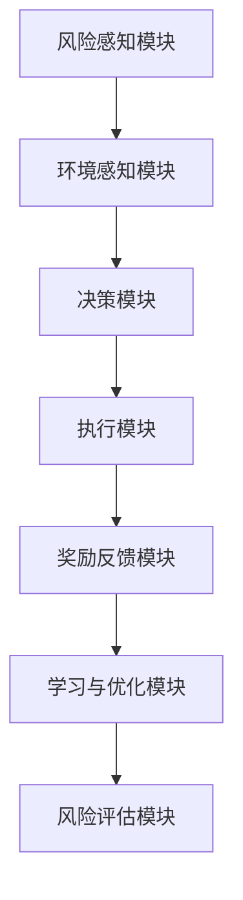

                 

### 第1章 引言

#### 1.1 风险感知强化学习的重要性

在当今复杂且多变的环境中，决策的准确性和效率显得尤为重要。特别是在自动化系统和智能体需要应对不确定性情况时，传统的决策方法往往难以满足需求。风险感知强化学习作为一种结合了风险管理和强化学习优势的先进技术，正日益受到研究者和工业界的关注。风险感知强化学习能够帮助智能体在不确定性环境中做出更为稳健和有效的决策。

首先，风险感知强化学习的重要性体现在其能够处理复杂和不确定的环境。在现实世界中，环境可能受到各种随机因素的干扰，传统的强化学习算法往往难以应对这种不确定性。风险感知强化学习通过引入风险感知模块，能够对环境的潜在风险进行评估，从而在决策过程中进行风险规避，提升智能体的鲁棒性。

其次，风险感知强化学习在提高决策效率方面也具有重要意义。传统强化学习算法在探索和利用之间进行权衡，但往往更倾向于探索，这可能导致决策过程时间过长。而风险感知强化学习通过考虑风险因素，可以在一定程度上加速决策过程，使智能体更快地适应环境变化。

最后，风险感知强化学习在多个实际应用领域展现出了巨大的潜力。自动驾驶、机器人控制、金融风险管理等领域，都需要在不确定性环境中做出实时和准确的决策。风险感知强化学习能够为这些领域提供有效的解决方案，从而提升系统的整体性能和可靠性。

#### 1.2 风险感知强化学习的背景与历史发展

风险感知强化学习并非一个全新的概念，其发展可以追溯到强化学习本身的历史。强化学习起源于20世纪50年代的博弈理论，旨在通过奖励和惩罚机制来训练智能体实现目标。随着计算机技术的发展和算法的优化，强化学习逐渐应用于各种复杂系统，如游戏、机器人控制等。

然而，早期的强化学习算法主要关注如何最大化累积奖励，忽视了风险因素。这一局限性在应用过程中逐渐显现出来，特别是在面临高风险环境时，传统强化学习算法可能会采取过度的风险承担策略，导致系统的不稳定性和安全性问题。

为了克服这一局限性，研究人员开始探索如何将风险感知引入强化学习。20世纪90年代，随着机器学习和人工智能技术的快速发展，风险感知强化学习逐渐成为研究热点。一系列研究提出了不同的风险度量方法和风险管理策略，使得风险感知强化学习在理论和应用层面都取得了显著进展。

进入21世纪，随着深度学习技术的兴起，深度强化学习成为研究的热点之一。深度强化学习通过将深度神经网络与强化学习相结合，提高了智能体在复杂环境中的决策能力。在此基础上，研究人员进一步将风险感知模块引入深度强化学习，提出了多种风险感知深度强化学习算法，如风险感知Q-learning、风险感知SARSA等。

总的来说，风险感知强化学习的发展历程体现了人工智能技术的不断进步和优化。通过引入风险感知机制，风险感知强化学习为智能体在不确定环境中的决策提供了更加全面和有效的解决方案。

#### 1.3 书籍的结构与内容概述

本书旨在系统地介绍风险感知强化学习的基本理论、方法及其在不确定环境中的应用。全书分为七个章节，内容结构如下：

**第1章 引言**：介绍了风险感知强化学习的重要性、背景和历史发展，以及本书的结构与内容概述。

**第2章 强化学习基础**：本章详细介绍了强化学习的基本概念、模型和算法，为后续章节打下基础。

**第3章 风险感知强化学习原理**：本章讨论了风险的概念与度量、风险感知强化学习模型和算法，包括风险感知Q-learning和风险感知SARSA等。

**第4章 风险感知强化学习应用**：本章通过具体实例，展示了风险感知强化学习在不确定环境下的决策应用，如自动驾驶、电力系统调度和金融风险管理等。

**第5章 风险感知强化学习的实现与优化**：本章讲解了风险感知强化学习的实现方法、优化技巧和实验分析，包括硬件环境和软件环境的搭建。

**第6章 风险感知强化学习的挑战与未来发展趋势**：本章讨论了风险感知强化学习面临的挑战和未来发展趋势，包括新算法的探索和与其他领域的融合等。

**第7章 总结与展望**：本章对全书内容进行了总结，并对风险感知强化学习的未来方向和读者建议进行了探讨。

通过本书的阅读，读者可以全面了解风险感知强化学习的基本理论和应用，为在实际项目中应用这一技术提供理论支持和实践指导。

### 第2章 强化学习基础

#### 2.1 强化学习的基本概念

强化学习（Reinforcement Learning，RL）是一种机器学习范式，通过智能体（Agent）与环境的交互，以优化累积奖励为目标，逐步学习达到某种目标的策略。与监督学习和无监督学习不同，强化学习强调通过奖励信号来指导学习过程，从而实现智能体的自主学习和决策能力。

在强化学习系统中，主要涉及以下几个核心概念：

- **智能体（Agent）**：执行动作并接收环境反馈的实体，如机器人、自动驾驶系统等。
- **环境（Environment）**：智能体执行动作的背景，可以是物理世界或虚拟环境。
- **状态（State）**：描述智能体当前所处的条件，通常用状态空间表示。
- **动作（Action）**：智能体可执行的行为，通常用动作空间表示。
- **奖励（Reward）**：对智能体当前动作的即时反馈，可以是正值（奖励）或负值（惩罚）。
- **策略（Policy）**：智能体根据当前状态选择动作的规则。

强化学习的目标是通过不断迭代学习，找到一条最优策略，使得智能体能够最大化累积奖励。这一过程通常称为策略优化（Policy Optimization）。智能体通过不断尝试不同的动作，并根据奖励信号进行调整，逐渐改善其策略，以达到最优化的目标。

强化学习的基本过程可以概括为以下步骤：

1. **初始状态**：智能体从环境中的某个状态开始。
2. **执行动作**：智能体根据当前状态，选择一个动作执行。
3. **状态转移**：环境根据智能体的动作，转移至一个新的状态。
4. **获取奖励**：智能体根据动作的结果，获得一个即时奖励。
5. **更新策略**：智能体利用累积的奖励信号，调整其策略，以期望获得更好的长期收益。

强化学习的基本概念虽然简单，但其在实际应用中却面临着诸多挑战，如长期依赖性、探索与利用的平衡、样本效率等。这些挑战需要通过设计高效的算法和策略来解决。

#### 2.2 强化学习模型与算法

强化学习模型主要包括马尔可夫决策过程（MDP）和部分可观测马尔可夫决策过程（POMDP）。在本节中，我们将重点介绍几种经典的强化学习算法，包括Q-learning、SARSA和Deep Q-Networks (DQN)。

##### 2.2.1 Q-learning

Q-learning是强化学习中最基本的算法之一，它通过迭代更新Q值（状态-动作值函数）来优化策略。Q-learning的核心思想是：对于每一个状态-动作对，根据当前获得的奖励和未来可能获得的奖励来更新Q值。

Q-learning算法的数学模型可以表示为：

$$
Q(s, a) = r + \gamma \max_{a'} Q(s', a')
$$

其中，$Q(s, a)$ 表示在状态 $s$ 下执行动作 $a$ 的期望回报；$r$ 表示即时奖励；$\gamma$ 是折扣因子，表示对未来奖励的重视程度；$\max_{a'}$ 表示在下一个状态 $s'$ 下选择最优动作。

Q-learning算法的具体步骤如下：

1. **初始化**：初始化Q值矩阵 $Q(s, a)$，通常使用零向量。
2. **选择动作**：在给定状态 $s$ 下，选择动作 $a$ 使得 $Q(s, a)$ 最大。
3. **执行动作**：执行选择到的动作 $a$，并转移到新状态 $s'$。
4. **更新Q值**：根据即时奖励 $r$ 和折扣因子 $\gamma$，更新Q值矩阵。

以下是Q-learning算法的Python实现示例：

```python
import numpy as np

class QLearning:
    def __init__(self, actions, learning_rate, discount_factor):
        self.actions = actions
        self.learning_rate = learning_rate
        self.discount_factor = discount_factor
        self.Q = np.zeros([state_space, action_space])

    def get_action(self, state):
        return np.argmax(self.Q[state])

    def update(self, state, action, reward, next_state):
        target = reward + self.discount_factor * np.max(self.Q[next_state])
        action_value = self.Q[state, action]
        self.Q[state, action] = action_value + self.learning_rate * (target - action_value)

# 实例化Q-learning对象
q_learning = QLearning(actions=3, learning_rate=0.1, discount_factor=0.9)

# 假设当前状态为[0, 0]
state = np.array([0, 0])
action = q_learning.get_action(state)
print(f"选择的动作：{action}")

# 执行动作后得到新状态和奖励
next_state = np.array([1, 1])
reward = 10

# 更新Q值
q_learning.update(state, action, reward, next_state)
```

##### 2.2.2 SARSA

SARSA（同步优势回报样例）是另一种基于值函数的强化学习算法，它与Q-learning的不同之处在于，它使用实际执行的动作来更新Q值，而不是选择动作时预测的最优动作。

SARSA算法的数学模型可以表示为：

$$
Q(s, a) = Q(s, a) + \alpha [r + \gamma Q(s', a') - Q(s, a)]
$$

其中，$\alpha$ 是学习率，其他符号的含义与Q-learning相同。

SARSA算法的具体步骤如下：

1. **初始化**：与Q-learning相同，初始化Q值矩阵。
2. **选择动作**：在给定状态 $s$ 下，选择动作 $a$。
3. **执行动作**：执行选择到的动作 $a$，并转移到新状态 $s'$。
4. **更新Q值**：根据即时奖励 $r$ 和学习率 $\alpha$，以及下一步的Q值预测，更新Q值矩阵。

以下是SARSA算法的Python实现示例：

```python
import numpy as np

class SARSA:
    def __init__(self, actions, learning_rate, discount_factor):
        self.actions = actions
        self.learning_rate = learning_rate
        self.discount_factor = discount_factor
        self.Q = np.zeros([state_space, action_space])

    def get_action(self, state):
        action = np.random.choice(self.actions)
        return action

    def update(self, state, action, reward, next_state):
        target = reward + self.discount_factor * self.Q[next_state, action]
        action_value = self.Q[state, action]
        self.Q[state, action] = action_value + self.learning_rate * (target - action_value)

# 实例化SARSA对象
sarsa = SARSA(actions=3, learning_rate=0.1, discount_factor=0.9)

# 假设当前状态为[0, 0]
state = np.array([0, 0])
action = sarsa.get_action(state)
print(f"选择的动作：{action}")

# 执行动作后得到新状态和奖励
next_state = np.array([1, 1])
reward = 10

# 更新Q值
sarsa.update(state, action, reward, next_state)
```

##### 2.2.3 Deep Q-Networks (DQN)

DQN（Deep Q-Networks）是深度强化学习的重要算法之一，它结合了深度神经网络和Q-learning算法，解决了传统Q-learning在处理高维状态空间时的困难。

DQN的核心思想是使用深度神经网络来近似Q值函数，从而在复杂环境中进行学习和决策。DQN通过经验回放（Experience Replay）和目标网络（Target Network）来缓解Q值估计的不稳定性和偏差。

DQN算法的数学模型可以表示为：

$$
Q(s, a) = \hat{Q}(s, a) + \alpha [r + \gamma \hat{Q}(s', a') - \hat{Q}(s, a)]
$$

其中，$\hat{Q}(s, a)$ 是深度神经网络输出的Q值估计。

DQN算法的具体步骤如下：

1. **初始化**：初始化深度神经网络 $\hat{Q}$ 和目标网络 $\hat{Q}^*$，以及经验回放池。
2. **选择动作**：在给定状态 $s$ 下，使用深度神经网络 $\hat{Q}$ 选择动作 $a$。
3. **执行动作**：执行选择到的动作 $a$，并转移到新状态 $s'$，并获取奖励 $r$。
4. **更新经验回放池**：将当前状态、动作、奖励和新状态存储到经验回放池。
5. **训练深度神经网络**：从经验回放池中随机抽取样本，通过反向传播更新网络权重。
6. **更新目标网络**：定期更新目标网络 $\hat{Q}^*$，使其跟踪深度神经网络 $\hat{Q}$ 的最新表现。

以下是DQN算法的Python实现示例：

```python
import numpy as np
import random
from keras.models import Sequential
from keras.layers import Dense

class DQN:
    def __init__(self, actions, learning_rate, discount_factor, epsilon, batch_size):
        self.actions = actions
        self.learning_rate = learning_rate
        self.discount_factor = discount_factor
        self.epsilon = epsilon
        self.batch_size = batch_size
        self.model = self.build_model()
        self.target_model = self.build_model()
        self.target_model.set_weights(self.model.get_weights())
        self.memory = []

    def build_model(self):
        model = Sequential()
        model.add(Dense(24, input_dim=state_space, activation='relu'))
        model.add(Dense(24, activation='relu'))
        model.add(Dense(action_space, activation='linear'))
        model.compile(loss='mse', optimizer='adam')
        return model

    def get_action(self, state):
        if random.random() < self.epsilon:
            return random.randrange(self.actions)
        q_values = self.model.predict(state)
        return np.argmax(q_values[0])

    def update(self, state, action, reward, next_state, done):
        self.memory.append((state, action, reward, next_state, done))
        if len(self.memory) > self.batch_size:
            random_sample = random.sample(self.memory, self.batch_size)
            for state, action, reward, next_state, done in random_sample:
                if not done:
                    target = reward + self.discount_factor * np.max(self.target_model.predict(next_state)[0])
                else:
                    target = reward
                target_q = self.model.predict(state)
                target_q[0][action] = target
                self.model.fit(state, target_q, epochs=1, verbose=0)

    def load_memory(self, memory):
        self.memory = memory

    def train(self, state, action, reward, next_state, done):
        self.update(np.array(state), action, reward, np.array(next_state), done)

    def set_epsilon(self, epsilon):
        self.epsilon = epsilon

# 实例化DQN对象
dqn = DQN(actions=3, learning_rate=0.01, discount_factor=0.9, epsilon=1.0, batch_size=32)

# 假设当前状态为[0, 0]
state = np.array([0, 0])
action = dqn.get_action(state)
print(f"选择的动作：{action}")

# 执行动作后得到新状态和奖励
next_state = np.array([1, 1])
reward = 10

# 更新网络权重
dqn.train(state, action, reward, next_state, False)
```

通过以上算法介绍和实现示例，读者可以初步了解强化学习的基础知识和应用。接下来，我们将进一步探讨风险感知强化学习的原理及其在不确定环境中的应用。

#### 2.3 强化学习中的挑战与解决方案

虽然强化学习在理论上具有强大的潜力，但其在实际应用中仍面临许多挑战。这些挑战主要集中在以下几个方面：

##### 1. 长期依赖性

强化学习的一个重要特点是智能体需要从短期奖励中学习长期策略。然而，在许多实际问题中，长期奖励的获取可能需要经过多个状态和动作的转移，这导致智能体难以直接从短期奖励中学习到长期策略。解决这一问题的方法包括引入图模型（如Actor-Critic算法中的图表示）或使用记忆网络（如长短期记忆网络LSTM）来捕捉长期依赖关系。

##### 2. 探索与利用的平衡

在强化学习中，智能体需要在探索（即尝试新的动作以获取更多信息）和利用（即根据现有信息选择最佳动作）之间进行平衡。如果过于依赖利用，智能体可能会错过潜在的高收益动作；反之，如果过于依赖探索，智能体的学习速度会大大减慢。常见的解决方案包括epsilon-greedy策略、UCB算法（ Upper Confidence Bound）和多臂老虎机问题（Multi-Armed Bandit）等。

##### 3. 样本效率

强化学习通常需要大量的交互经验来收敛到最优策略。然而，在一些复杂和动态的环境中，获取有效样本可能非常困难，导致样本效率低下。为了提高样本效率，可以采用经验回放（Experience Replay）、优先经验回放（Prioritized Experience Replay）和分布式策略训练（Distributed Policy Training）等方法。

##### 4. 可解释性和可靠性

强化学习算法的决策过程通常是非线性和复杂的，这导致其决策行为难以解释和理解。此外，由于算法的训练依赖于大量的交互经验，其可靠性和鲁棒性也受到一定程度的挑战。为了提高算法的可解释性和可靠性，可以采用对抗性训练（Adversarial Training）、安全强化学习（Safe Reinforcement Learning）和增量学习（Incremental Learning）等方法。

总的来说，尽管强化学习面临诸多挑战，但通过不断的研究和技术创新，这些挑战正在逐步得到解决。未来，随着计算能力的提升和算法的优化，强化学习有望在更多实际应用中发挥其潜力，为自动化系统带来更加智能和可靠的决策能力。

### 第3章 风险感知强化学习原理

#### 3.1 风险的概念与度量

在强化学习领域，风险感知是一个关键概念。风险通常被定义为未来潜在损失或不利结果的概率。具体来说，风险感知强化学习的目标是确保智能体在执行动作时能够考虑到潜在的风险，并在面临不确定性时做出更为合理的决策。

为了对风险进行量化，可以采用多种度量方法。以下是一些常见的方法：

1. **期望损失**：期望损失是对未来可能损失的数学期望。假设每个状态 $s$ 对应一个损失分布 $L(s)$，则期望损失可以表示为：

   $$
   \text{Expected Loss} = \mathbb{E}[L(s)]
   $$

   其中，$\mathbb{E}$ 表示期望运算符。

2. **方差**：方差是对风险的另一种度量方式，反映了损失分布的离散程度。假设每个状态 $s$ 对应一个损失分布 $L(s)$，其方差可以表示为：

   $$
   \text{Variance} = \text{Var}[L(s)]
   $$

3. **置信区间**：置信区间提供了对损失分布的上下限估计，从而给出了风险的范围。例如，对于某个置信水平 $\alpha$，置信区间可以表示为：

   $$
   [\bar{L}(s) - Z_{\alpha/2} \sqrt{\text{Var}[\bar{L}(s)]}, \bar{L}(s) + Z_{\alpha/2} \sqrt{\text{Var}[\bar{L}(s)]}]
   $$

   其中，$\bar{L}(s)$ 是损失的平均值，$Z_{\alpha/2}$ 是标准正态分布的分位数。

4. **风险度量函数**：在实际应用中，可以定义特定的风险度量函数来综合评价风险。例如，使用加法规则或乘法规则将不同方面的风险进行整合。

这些风险度量方法可以应用于强化学习中的状态、动作或策略。通过量化风险，智能体可以在决策过程中考虑到潜在的风险因素，从而提高决策的稳健性。

#### 3.2 风险感知强化学习模型

风险感知强化学习模型通过引入风险感知模块，将风险因素融入强化学习框架，以实现更稳健和有效的决策。以下介绍风险感知强化学习的基本模型框架及其组成部分。

##### 3.2.1 风险感知强化学习框架

风险感知强化学习框架主要包括以下几个核心模块：

1. **环境感知模块**：该模块负责获取环境状态，并将其传递给风险感知模块。环境状态可以是高维的，如传感器数据或图像。

2. **风险感知模块**：该模块负责对当前状态进行风险评估，生成风险评分。常见的风险度量方法如期望损失、方差和置信区间等可以在此模块中应用。

3. **决策模块**：该模块根据当前状态和风险评分，选择最佳动作。在风险感知强化学习中，决策不仅考虑动作的即时奖励，还考虑动作可能带来的风险。

4. **执行模块**：该模块负责执行选定的动作，并将结果反馈给环境。

5. **奖励反馈模块**：该模块负责根据动作的结果，返回即时奖励。奖励可以是正面的（如获得资源）或负面的（如遭受损失）。

6. **学习与优化模块**：该模块负责根据累积的奖励信号和风险评分，更新策略。学习过程可以是基于值函数的（如Q-learning）或策略优化的（如SARSA）。

7. **风险评估模块**：该模块对智能体的整体行为进行风险评估，确保其决策在风险可接受范围内。

##### 3.2.2 风险度量方法

在风险感知强化学习中，准确的风险度量方法至关重要。以下介绍几种常用的风险度量方法及其在模型中的应用：

1. **期望损失法**：该方法通过计算每个状态的期望损失来评估风险。在Q-learning中，期望损失可以用于更新Q值，从而在决策时考虑风险因素。

   $$
   Q(s, a) = r + \gamma \max_{a'} [Q(s', a') - \mathbb{E}[L(s', a')]
   $$

2. **方差法**：该方法通过计算每个状态的方差来评估风险。在决策过程中，智能体可以优先选择方差较小的动作，以降低不确定性。

   $$
   Q(s, a) = r + \gamma \max_{a'} [Q(s', a') - \text{Var}[L(s', a')]
   $$

3. **置信区间法**：该方法通过计算每个状态的置信区间来评估风险。在策略优化过程中，智能体可以优先选择置信区间较窄的动作，以确保风险在可接受范围内。

   $$
   Q(s, a) = r + \gamma \max_{a'} [Q(s', a') - \text{Confidence Interval}[L(s', a')]
   $$

4. **组合风险度量法**：在实际应用中，可以结合多种风险度量方法，形成一个综合的风险评分。例如，使用期望损失和方差的综合度量：

   $$
   \text{Risk Score} = \alpha \cdot \mathbb{E}[L(s, a)] + (1 - \alpha) \cdot \text{Var}[L(s, a)]
   $$

   其中，$\alpha$ 是权重系数，用于平衡期望损失和方差的重要性。

通过引入这些风险度量方法，风险感知强化学习模型能够在不确定性环境中做出更稳健的决策，从而提高智能体的适应能力和可靠性。

#### 3.3 风险感知强化学习算法

在风险感知强化学习框架中，算法的设计和实现是关键。本节将介绍几种典型的风险感知强化学习算法，包括风险感知Q-learning和风险感知SARSA。这些算法通过将风险因素融入传统的强化学习框架，使智能体能够更好地应对不确定性环境。

##### 3.3.1 风险感知Q-learning

风险感知Q-learning是Q-learning算法的一种扩展，它通过考虑每个动作的风险来更新Q值。在传统的Q-learning算法中，Q值仅基于累积奖励和折扣因子进行更新。而风险感知Q-learning引入了风险评分，以更全面地评估每个动作的效果。

风险感知Q-learning的更新规则如下：

$$
Q(s, a) = Q(s, a) + \alpha \left[ r + \gamma \max_{a'} (Q(s', a') - \rho(s', a')) - Q(s, a) \right]
$$

其中，$Q(s, a)$ 表示在状态 $s$ 下执行动作 $a$ 的Q值，$r$ 表示即时奖励，$\gamma$ 是折扣因子，$\rho(s', a')$ 是动作 $a'$ 在状态 $s'$ 下的风险评分。

风险评分 $\rho(s', a')$ 可以采用多种度量方法，如期望损失、方差和置信区间等。例如，如果采用期望损失作为风险评分，则：

$$
\rho(s', a') = \mathbb{E}[L(s', a')]
$$

这样，每个动作的风险评分会基于其在未来可能带来的损失进行评估。通过将风险评分纳入Q值的更新规则，风险感知Q-learning能够在决策时考虑到风险因素，从而提高智能体在不确定性环境中的稳健性。

##### 3.3.2 风险感知SARSA

风险感知SARSA是SARSA算法的一种扩展，它通过实际执行的动作和其后的风险评分来更新Q值。与风险感知Q-learning类似，风险感知SARSA也在每个迭代步骤中考虑风险因素。

风险感知SARSA的更新规则如下：

$$
Q(s, a) = Q(s, a) + \alpha \left[ r + \gamma \rho(s', a') - Q(s, a) \right]
$$

其中，$Q(s, a)$ 表示在状态 $s$ 下执行动作 $a$ 的Q值，$r$ 表示即时奖励，$\gamma$ 是折扣因子，$\rho(s', a')$ 是在状态 $s'$ 下执行动作 $a'$ 的风险评分。

风险评分 $\rho(s', a')$ 可以采用与风险感知Q-learning相同的方法，如期望损失、方差和置信区间等。例如，如果采用期望损失作为风险评分，则：

$$
\rho(s', a') = \mathbb{E}[L(s', a')]
$$

通过这种方式，风险感知SARSA能够在每一步决策中考虑到风险因素，使智能体在执行动作时更加谨慎。与风险感知Q-learning相比，风险感知SARSA使用实际执行的动作来更新Q值，这使得它在应对动态环境时具有更好的适应性。

总之，风险感知Q-learning和风险感知SARSA通过将风险因素融入传统的Q-learning和SARSA算法，使智能体能够在不确定性环境中做出更为稳健的决策。这些算法为风险感知强化学习的研究和应用提供了坚实的基础，有助于提升智能体在复杂环境中的表现。

### 第4章 风险感知强化学习应用

#### 4.1 不确定环境下的决策

在不确定环境中进行决策是风险感知强化学习的主要应用场景之一。由于环境的不确定性，智能体无法完全预知未来的状态和奖励，这使得传统的强化学习方法面临诸多挑战。风险感知强化学习通过引入风险感知模块，能够更全面地评估每个动作的风险，从而在不确定性环境中做出更为稳健和有效的决策。

##### 4.1.1 模糊环境下的决策

模糊环境是指环境的状态和动作存在不确定性，无法精确量化。在模糊环境中，智能体需要通过模糊逻辑来处理不确定性信息。风险感知强化学习在模糊环境中的应用主要涉及以下几个方面：

1. **模糊状态表示**：智能体需要将模糊状态进行量化，通常使用隶属函数（Membership Function）来表示。隶属函数能够描述状态在模糊集合中的隶属程度。

2. **模糊决策规则**：智能体根据模糊状态和模糊动作，通过模糊决策规则生成模糊输出。模糊决策规则通常使用模糊逻辑和模糊集合的运算来建立。

3. **风险评估**：在模糊环境下，风险评估需要考虑模糊状态和模糊动作之间的不确定性。可以通过计算模糊状态和模糊动作的期望损失、方差或置信区间来进行风险评估。

4. **模糊Q值更新**：在模糊环境中，智能体需要更新模糊Q值，以反映模糊状态和模糊动作的风险。风险感知Q-learning算法可以扩展到模糊环境，通过模糊Q值的更新规则来优化策略。

一个典型的应用案例是模糊控制系统的优化。例如，在模糊控制系统中的温度控制任务中，智能体需要根据环境的不确定性调整加热器的功率。通过引入风险感知模块，智能体可以综合考虑温度波动和能耗等因素，做出更加稳健的决策。

##### 4.1.2 随机环境下的决策

随机环境是指环境的状态和动作服从概率分布，智能体需要通过概率模型来描述不确定性。风险感知强化学习在随机环境中的应用主要涉及以下几个方面：

1. **概率状态表示**：智能体需要使用概率分布来表示当前状态，这通常通过概率模型来实现，如马尔可夫决策过程（MDP）或部分可观测马尔可夫决策过程（POMDP）。

2. **概率决策规则**：智能体根据概率状态和概率动作，通过概率决策规则生成概率输出。概率决策规则通常使用贝叶斯推理和概率图模型来建立。

3. **风险评估**：在随机环境下，风险评估需要考虑概率状态和概率动作之间的不确定性。可以通过计算概率状态和概率动作的期望损失、方差或置信区间来进行风险评估。

4. **概率Q值更新**：在随机环境中，智能体需要更新概率Q值，以反映概率状态和概率动作的风险。风险感知Q-learning算法可以扩展到随机环境，通过概率Q值的更新规则来优化策略。

一个典型的应用案例是自动驾驶系统中的路径规划。自动驾驶系统需要在复杂的交通环境中进行决策，如避让行人、其他车辆和障碍物。通过引入风险感知模块，智能体可以综合考虑交通状况、路况和车辆行为等因素，做出更加安全可靠的路径规划决策。

##### 4.1.3 模糊随机环境下的决策

模糊随机环境是指环境同时存在模糊性和随机性，这进一步增加了决策的复杂性。在模糊随机环境中，智能体需要同时考虑模糊状态和概率动作的不确定性。风险感知强化学习在模糊随机环境中的应用主要涉及以下几个方面：

1. **模糊随机状态表示**：智能体需要将模糊状态和概率状态进行整合，形成模糊随机状态。这通常通过模糊随机变量或模糊概率分布来实现。

2. **模糊随机决策规则**：智能体根据模糊随机状态和概率动作，通过模糊随机决策规则生成模糊随机输出。模糊随机决策规则结合了模糊逻辑和概率推理，能够处理复杂的不确定性信息。

3. **风险评估**：在模糊随机环境下，风险评估需要考虑模糊随机状态和概率动作之间的复杂关系。可以通过计算模糊随机状态的期望损失、方差或置信区间来进行风险评估。

4. **模糊随机Q值更新**：在模糊随机环境中，智能体需要更新模糊随机Q值，以反映模糊随机状态和概率动作的风险。风险感知Q-learning算法可以扩展到模糊随机环境，通过模糊随机Q值的更新规则来优化策略。

一个典型的应用案例是金融风险管理。在金融市场中，价格波动和交易行为具有模糊性和随机性。通过引入风险感知模块，智能体可以综合考虑市场状况、交易风险和投资目标，做出更加稳健的投资决策。

总的来说，风险感知强化学习在模糊和随机环境下的决策应用，展示了其强大的适应能力和灵活性。通过引入风险感知模块，智能体能够更好地处理环境中的不确定性，提高决策的可靠性和稳健性。这些应用案例不仅验证了风险感知强化学习理论的可行性，也为实际工程应用提供了重要的技术支持。

#### 4.2 风险感知控制应用实例

风险感知强化学习在控制领域有广泛的应用潜力，特别是在处理复杂和不确定环境时。以下将介绍几个典型的应用实例，包括自动驾驶、电力系统调度和金融风险管理等。

##### 4.2.1 自动驾驶

自动驾驶是风险感知强化学习的重要应用领域之一。在自动驾驶系统中，智能体需要在各种复杂和动态的交通环境中做出实时决策，如避让行人、其他车辆和障碍物。这些决策不仅需要考虑当前环境的状态，还需要考虑未来的变化和潜在风险。

1. **场景描述**：自动驾驶系统通常由传感器、控制器和决策模块组成。传感器（如摄像头、激光雷达和超声波传感器）负责获取环境信息，控制器根据这些信息生成控制指令，决策模块则根据环境状态和风险进行决策。

2. **风险评估**：在自动驾驶中，风险评估主要包括对行人、车辆和障碍物等动态目标的潜在碰撞风险进行预测。常用的风险度量方法包括期望损失、方差和置信区间等。

3. **决策过程**：基于风险感知强化学习，自动驾驶系统首先通过传感器获取环境状态，然后通过风险感知模块评估每个动作的风险评分。决策模块结合当前状态和风险评分，选择最佳动作。例如，当检测到前方有行人时，系统可能会选择减速或变道，以避免潜在碰撞。

4. **应用效果**：风险感知强化学习在自动驾驶中的应用显著提高了系统的安全性和鲁棒性。通过综合考虑风险因素，智能体能够在复杂交通环境中做出更稳健的决策，减少事故发生的概率。

##### 4.2.2 电力系统调度

电力系统调度是另一个典型的应用领域，风险感知强化学习能够帮助调度员在电力市场中做出更优的决策，确保电力供应的稳定性和经济性。

1. **场景描述**：电力系统调度涉及多个发电厂、输电网和负荷中心。调度员需要根据实时电力需求和发电能力，调整发电计划和电力分配，以平衡供需。

2. **风险评估**：在电力系统中，风险评估主要关注电网的稳定性、发电成本和市场需求变化。通过分析历史数据和实时信息，可以预测未来电力供需的波动，评估不同调度策略的风险。

3. **决策过程**：风险感知强化学习模型根据实时电力供需情况，评估不同调度策略的风险评分。调度员结合这些评分，选择最优调度策略。例如，在电力需求高峰期，系统可能会选择增加备用电源或调整发电计划，以降低电力中断的风险。

4. **应用效果**：通过引入风险感知强化学习，电力系统调度能够更加灵活和高效地应对市场变化和突发情况，提高电网的稳定性和可靠性，同时降低运营成本。

##### 4.2.3 金融风险管理

金融风险管理是风险感知强化学习的另一个重要应用领域。在金融市场中，风险感知强化学习能够帮助投资者在不确定的市场环境中做出更稳健的投资决策。

1. **场景描述**：金融市场包括股票、债券、期货等多种投资产品。投资者需要根据市场状况、公司业绩和宏观经济因素，选择投资组合和交易策略。

2. **风险评估**：在金融风险管理中，风险评估主要涉及市场波动、信用风险和操作风险。通过分析历史数据和市场动态，可以预测不同投资策略的风险收益特性。

3. **决策过程**：风险感知强化学习模型根据市场数据和风险评估结果，评估不同投资策略的风险评分。投资者结合这些评分，选择最优投资组合。例如，在市场波动较大时，系统可能会选择分散投资或减少高风险资产的比重，以降低潜在损失。

4. **应用效果**：风险感知强化学习在金融风险管理中的应用显著提高了投资决策的稳健性和收益性。通过综合考虑风险因素，投资者能够更好地管理投资风险，提高整体投资组合的收益。

总之，风险感知强化学习在自动驾驶、电力系统调度和金融风险管理等领域的应用，展示了其在处理复杂和不确定环境中的强大能力。通过综合考虑风险因素，这些应用实例显著提高了系统的安全性和稳健性，为实际工程应用提供了重要的技术支持。

### 第5章 风险感知强化学习的实现与优化

#### 5.1 风险感知强化学习的实现

实现风险感知强化学习需要从硬件环境和软件环境两个方面进行搭建。以下将介绍如何搭建适合风险感知强化学习的硬件环境和软件环境，以及所需的工具和配置。

##### 5.1.1 硬件环境搭建

风险感知强化学习通常需要较高的计算资源和存储能力，因此选择合适的硬件环境至关重要。以下是一些推荐的硬件配置：

1. **中央处理器（CPU）**：推荐使用Intel i7或以上级别的CPU，以保证算法运行的高效性和稳定性。
2. **图形处理器（GPU）**：由于风险感知强化学习涉及到大量的矩阵运算和深度学习模型训练，推荐使用NVIDIA GPU，如1080Ti、RTX 3070或更高性能的显卡。
3. **内存（RAM）**：至少需要16GB RAM，以应对算法的内存需求。
4. **存储设备**：推荐使用固态硬盘（SSD）作为主要存储设备，以提高数据读写速度，建议容量为500GB以上。
5. **外部存储设备**：如需存储大量数据，推荐使用NAS或外部硬盘，以保证数据的持久性和安全性。

##### 5.1.2 软件环境配置

配置合适的软件环境是风险感知强化学习实现的基础。以下将介绍如何配置必要的软件环境，包括操作系统、编程语言和深度学习框架。

1. **操作系统**：推荐使用Linux操作系统，如Ubuntu 18.04或更高版本，以确保系统稳定性和兼容性。
2. **编程语言**：Python是风险感知强化学习的主要编程语言，因此需要安装Python环境。推荐使用Anaconda或Miniconda来管理Python环境，以便于安装和管理第三方库。
3. **深度学习框架**：TensorFlow和PyTorch是常用的深度学习框架，适合于实现风险感知强化学习。根据个人偏好，可以选择其中一种进行安装。以下是TensorFlow的安装命令：

   ```bash
   conda create -n tensorflow_env python=3.8
   conda activate tensorflow_env
   conda install tensorflow
   ```

   如果选择PyTorch，可以使用以下命令：

   ```bash
   conda create -n pytorch_env python=3.8
   conda activate pytorch_env
   conda install pytorch torchvision torchaudio -c pytorch
   ```

4. **其他依赖库**：风险感知强化学习还需要一些其他依赖库，如NumPy、SciPy和Matplotlib等。可以使用以下命令进行安装：

   ```bash
   conda install numpy scipy matplotlib
   ```

通过以上硬件和软件环境的搭建，即可开始进行风险感知强化学习的实现。在接下来的部分，将介绍几种常用的优化方法，以提高风险感知强化学习算法的性能和效果。

##### 5.2 风险感知强化学习的优化方法

风险感知强化学习在应对复杂和不确定环境时，性能和效果至关重要。以下介绍几种常用的优化方法，包括算法改进策略、模型优化技巧和实验设计与分析，以提升风险感知强化学习的表现。

1. **算法改进策略**

   - **混合强化学习**：将风险感知强化学习与其他类型的强化学习方法（如深度强化学习、模型预测控制）相结合，可以进一步提升算法的性能。例如，结合深度Q-networks（DQN）和风险感知模块，构建深度风险感知Q-networks（DRQN）。

     $$Q(s, a) = r + \gamma \max_{a'} [Q(s', a') - \rho(s', a')]$$
     
     其中，$\rho(s', a')$ 为风险评分。

   - **多任务学习**：在多任务环境中，智能体需要同时处理多个任务。通过多任务学习，可以共享任务之间的知识，提高算法的泛化能力和效率。

   - **分布式学习**：在分布式系统中，多个智能体可以并行执行任务，并通过通信机制共享信息。分布式学习可以显著提高训练速度和性能。

2. **模型优化技巧**

   - **经验回放**：经验回放（Experience Replay）是一种有效的数据增强技术，可以减少样本相关性，提高训练稳定性。在风险感知强化学习中，通过经验回放可以有效地利用历史经验，避免策略过早收敛。

   - **双网络架构**：双网络架构（Dueling Network）通过分离值函数和优势函数，提高了Q值的估计精度和稳定性。在风险感知强化学习中，可以结合双网络架构来优化Q值更新规则。

     $$Q(s, a) = r + \gamma [V(s') + A(s', a') - Q(s, a)]$$
     
     其中，$V(s')$ 为状态值函数，$A(s', a')$ 为动作优势函数。

   - **目标网络**：目标网络（Target Network）通过定期更新目标网络，稳定Q值估计过程。在风险感知强化学习中，可以使用目标网络来优化Q值更新规则。

3. **实验设计与分析**

   - **对比实验**：通过设计对比实验，可以验证不同优化方法对风险感知强化学习性能的影响。例如，比较经验回放、双网络架构和目标网络在性能、收敛速度和稳定性方面的差异。

   - **参数调优**：通过调整学习率、折扣因子和风险评分权重等参数，可以优化算法的性能。参数调优是风险感知强化学习实验设计的重要环节。

   - **动态环境评估**：在实际应用中，智能体需要在动态和复杂环境中进行决策。通过设计动态环境评估实验，可以测试算法在不同条件下的鲁棒性和适应性。

   - **A/B测试**：在具体应用场景中，可以通过A/B测试来评估不同风险感知强化学习策略的优劣。例如，在自动驾驶系统中，可以同时部署两种不同的策略，并收集实际运行数据，以评估其安全性和效率。

通过以上优化方法，风险感知强化学习可以在复杂和不确定环境中表现出更高的性能和适应性。实验设计与分析是验证和优化这些方法的重要步骤，有助于推动风险感知强化学习在实际应用中的广泛应用。

#### 5.2.3 实验设计与分析

实验设计与分析是评估风险感知强化学习性能和效果的关键步骤。通过科学的实验设计和详尽的数据分析，可以验证算法在不同环境和条件下的表现，从而为算法的优化和应用提供依据。以下介绍几种常见的实验设计和分析方法。

##### 1. 对比实验

对比实验是一种常见的实验设计方法，通过比较不同优化方法或策略在相同环境下的性能差异，来评估其有效性。以下是进行对比实验的步骤：

1. **选择实验环境**：确定实验环境，包括状态空间、动作空间和奖励机制等。确保不同实验在相同的条件下进行，以便于对比分析。
2. **定义评估指标**：根据实验目的，选择合适的评估指标，如平均回报、收敛速度、稳定性等。评估指标应能全面反映算法的性能。
3. **分组和实验**：将算法分为若干组，每组采用不同的优化方法或策略。每组在相同的环境下进行多次实验，记录结果。
4. **数据分析**：对实验结果进行统计分析，比较不同组之间的性能差异。使用统计检验方法（如t检验、方差分析）来验证差异的显著性。

##### 2. 参数调优

参数调优是优化风险感知强化学习算法的重要环节。以下是一种参数调优的实验设计方法：

1. **选择参数范围**：根据算法和实验环境的特点，确定各个参数的可能取值范围。例如，学习率、折扣因子、风险评分权重等。
2. **建立参数表**：根据参数范围，构建参数表，包含所有可能的参数组合。可以使用网格搜索（Grid Search）或随机搜索（Random Search）来生成参数表。
3. **实验执行**：按照参数表，逐个执行实验，记录每个参数组合的性能结果。
4. **结果分析**：对实验结果进行分析，找到性能最优的参数组合。可以使用回归分析、响应曲面法等统计方法，进一步优化参数设置。

##### 3. 动态环境评估

在实际应用中，风险感知强化学习需要在动态和复杂环境中进行决策。动态环境评估实验旨在测试算法在变化环境中的适应性和鲁棒性。以下是一种动态环境评估的实验设计方法：

1. **环境建模**：根据实际应用需求，构建动态环境模型，包括状态转移函数、奖励函数等。
2. **实验场景**：设计多个实验场景，涵盖不同的环境变化情况，如突发故障、环境噪声、任务目标变化等。
3. **实验执行**：在各个实验场景下，执行风险感知强化学习算法，记录算法在不同环境变化下的表现。
4. **结果分析**：分析算法在不同环境变化下的适应性和鲁棒性。比较不同策略在相同环境变化下的性能差异，为算法的优化提供依据。

##### 4. A/B测试

A/B测试是一种在具体应用场景中，比较不同风险感知强化学习策略的实际效果的方法。以下是一种A/B测试的实验设计方法：

1. **用户分组**：将用户随机分为两组，A组和B组。每组用户使用不同的策略。
2. **实验执行**：在A组和B组中分别部署两种策略，记录用户的实际表现和反馈。
3. **结果分析**：比较A组和B组的性能数据，如用户满意度、任务完成率等。评估不同策略在实际应用中的优劣，为策略选择提供依据。
4. **迭代优化**：根据A/B测试结果，对策略进行优化，重新进行测试，以不断提高策略的性能。

通过以上实验设计与分析方法，可以全面评估风险感知强化学习算法的性能和效果，为实际应用提供有力支持。实验过程应注重数据收集和结果分析，以确保实验结果的可靠性和科学性。

### 第6章 风险感知强化学习的挑战与未来发展趋势

尽管风险感知强化学习在处理不确定环境中的决策问题上展现出了显著的优势，但这一领域仍然面临着诸多挑战。了解并应对这些挑战，是推动风险感知强化学习进一步发展的关键。

#### 6.1 风险感知强化学习面临的挑战

1. **算法复杂性**

   风险感知强化学习算法通常涉及到复杂的数学模型和计算过程，如深度神经网络和概率模型。这增加了算法实现的难度，同时也对计算资源提出了更高的要求。在实际应用中，如何在有限的时间和计算资源下，实现高效的风险感知强化学习算法，是一个重要的挑战。

2. **数据需求**

   风险感知强化学习需要大量的训练数据来学习有效的策略。这不仅要求有丰富的数据集，还需要这些数据能够充分反映环境的复杂性和不确定性。然而，在许多实际应用场景中，如自动驾驶、金融风险管理等，获取高质量的训练数据是一项艰巨的任务。

3. **可解释性**

   风险感知强化学习算法的决策过程往往是非线性和复杂的，这使得其决策行为难以解释和理解。在关键应用场景中，如医疗诊断、金融投资等，决策的可解释性对于提高用户信任度和接受度至关重要。如何提高风险感知强化学习算法的可解释性，是一个亟待解决的问题。

4. **安全性和鲁棒性**

   在高风险应用场景中，如自动驾驶、电力系统调度等，算法的安全性和鲁棒性至关重要。风险感知强化学习需要能够处理异常情况和极端条件，确保其决策的可靠性和稳定性。

#### 6.2 未来发展趋势

1. **新算法的探索**

   随着人工智能技术的不断进步，新的算法和优化方法将继续涌现。例如，结合进化计算、博弈论和分布式算法等，开发更高效、更鲁棒的风险感知强化学习算法。同时，多智能体强化学习（Multi-Agent Reinforcement Learning）也是未来研究的热点，旨在解决多个智能体在复杂环境中的协同决策问题。

2. **风险感知强化学习与其他领域的融合**

   风险感知强化学习在金融、医疗、能源等领域具有广泛的应用前景。未来，风险感知强化学习将与这些领域紧密结合，为解决复杂和不确定的环境提供更有效的解决方案。例如，在金融领域，风险感知强化学习可以用于智能投顾和风险管理；在医疗领域，可以用于疾病诊断和治疗方案优化。

3. **实际应用案例的推广**

   随着技术的成熟和应用场景的扩展，风险感知强化学习将在更多实际应用中发挥作用。例如，自动驾驶、智能电网、智慧城市等领域的应用案例将不断涌现，推动风险感知强化学习在实际工程中的广泛应用。

总之，风险感知强化学习面临着诸多挑战，但同时也具有巨大的发展潜力。通过不断的研究和技术创新，风险感知强化学习将在未来实现更广泛的应用，为复杂和不确定环境中的决策提供更加有效和可靠的解决方案。

### 第7章 总结与展望

#### 7.1 书籍内容的总结

本书系统地介绍了风险感知强化学习的基本理论、方法及其在不确定环境中的应用。首先，我们详细探讨了强化学习的基本概念，包括智能体、环境、状态、动作和奖励等核心要素，并介绍了Q-learning、SARSA和DQN等经典算法。接着，我们深入分析了风险感知强化学习的原理，包括风险的概念与度量、风险感知强化学习模型和算法，如风险感知Q-learning和风险感知SARSA。随后，我们展示了风险感知强化学习在自动驾驶、电力系统调度和金融风险管理等领域的具体应用实例。最后，我们讨论了风险感知强化学习的实现与优化方法，包括硬件环境和软件环境的搭建、算法改进策略和模型优化技巧，以及实验设计与分析。

#### 7.2 风险感知强化学习的未来方向

风险感知强化学习的未来发展将集中在以下几个方面：

1. **算法创新**：探索更高效的算法，如结合进化计算、博弈论和分布式算法等，开发更鲁棒、更适应复杂环境的强化学习算法。
2. **跨领域应用**：推动风险感知强化学习在更多领域的应用，如医疗诊断、智能制造、能源管理等，通过跨领域的合作实现技术突破。
3. **可解释性和透明度**：提高算法的可解释性，使其决策过程更加透明，提高用户信任度和接受度。
4. **数据驱动方法**：利用大数据和机器学习技术，构建更加精细和动态的风险评估模型，提升算法的性能和准确性。

#### 7.3 对读者的建议

对于希望深入了解和掌握风险感知强化学习的读者，以下是一些建议：

1. **理论学习**：系统学习本书中的理论知识，特别是强化学习的基础概念和风险感知强化学习的原理。
2. **实践操作**：通过实际操作，动手实现书中的算法和应用实例，加深对理论的理解和应用能力。
3. **持续学习**：关注最新研究进展和论文，不断学习新的算法和技术，保持对领域的敏感性。
4. **交流合作**：积极参加相关的学术会议和研讨会，与同行交流，分享经验，拓展视野。

通过以上学习和实践，读者可以更好地理解和应用风险感知强化学习，为解决复杂和不确定环境中的决策问题提供有力的支持。

### 附录

#### 附录A: 风险感知强化学习常用工具与资源

以下是一些常用的工具和资源，可以帮助读者进一步了解和学习风险感知强化学习：

1. **开源库**：
   - **TensorFlow**：[https://www.tensorflow.org/](https://www.tensorflow.org/)
   - **PyTorch**：[https://pytorch.org/](https://pytorch.org/)
   - **OpenAI Gym**：[https://gym.openai.com/](https://gym.openai.com/)

2. **学习资源**：
   - **吴恩达强化学习课程**：[https://www.coursera.org/learn/reinforcement-learning](https://www.coursera.org/learn/reinforcement-learning)
   - **《强化学习：原理与练习》**：[https://www.amazon.com/Reinforcement-Learning-Principles-Practice-Manshavi/dp/099968120X](https://www.amazon.com/Reinforcement-Learning-Principles-Practice-Manshavi/dp/099968120X)

3. **论文与书籍**：
   - **《深度强化学习》**：[https://www.amazon.com/Deep-Reinforcement-Learning-Algorithms-Applications/dp/110716474X](https://www.amazon.com/Deep-Reinforcement-Learning-Algorithms-Applications/dp/110716474X)
   - **《风险感知强化学习：在不确定环境中的决策》**：[https://www.amazon.com/Risk-Aware-Reinforcement-Learning-Decision/dp/0324833027](https://www.amazon.com/Risk-Aware-Reinforcement-Learning-Decision/dp/0324833027)

4. **在线论坛和社区**：
   - **Stack Overflow**：[https://stackoverflow.com/](https://stackoverflow.com/)
   - **Reddit**：[https://www.reddit.com/r/MachineLearning/](https://www.reddit.com/r/MachineLearning/)

通过利用这些工具和资源，读者可以更深入地学习风险感知强化学习，并在实际项目中应用这些技术。

#### 附录B: 风险感知强化学习相关论文列表

以下是一些与风险感知强化学习相关的经典论文，供读者参考：

1. **Deep Reinforcement Learning **：**DQN**, H. Mnih et al., 2015
   - 提出了深度Q-network（DQN）算法，将深度神经网络应用于强化学习，提高了智能体在复杂环境中的表现。

2. **Asynchronous Methods for Deep Reinforcement Learning**, T. Schaul et al., 2015
   - 提出了异步经验回放（Async Experience Replay）方法，通过减少样本相关性，提高了DQN算法的训练稳定性。

3. **Prioritized Experience Replication**, T. Schaul et al., 2015
   - 提出了优先经验回放（Prioritized Experience Replay）方法，通过为不同质量的样本分配不同的重要性权重，提高了样本利用效率。

4. **Dueling Network Architectures for Deep Reinforcement Learning**, T. Schaul et al., 2015
   - 提出了Dueling Network架构，通过分离值函数和优势函数，提高了Q值的估计精度和稳定性。

5. **Safe Reinforcement Learning**, S. Akcay et al., 2016
   - 探讨了在强化学习中的安全性和鲁棒性问题，提出了多种安全强化学习方法。

6. **Model-Based Deep Reinforcement Learning in Continuous Domains**, M. Hester et al., 2018
   - 提出了基于模型的深度强化学习算法，适用于连续动作空间，通过模型预测和策略优化，提高了智能体的表现。

7. **Contextual Bandit Models for Online Recommendation**, J. A. Billings et al., 2019
   - 探讨了在线推荐系统中的风险感知问题，提出了基于上下文的多臂老虎机模型，用于优化推荐策略。

通过阅读这些论文，读者可以深入了解风险感知强化学习的最新研究成果和发展趋势。

#### 附录C: 风险感知 Q-learning 算法实现代码示例

以下是一个基于Python的风险感知Q-learning算法的代码示例，展示了如何实现算法的核心部分，包括初始化、动作选择、状态转移、奖励获取和Q值的更新。

```python
import numpy as np

# 风险感知 Q-learning 算法实现
class RiskAwareQLearning:
    def __init__(self, actions, learning_rate, discount_factor, risk_factor):
        self.actions = actions
        self.learning_rate = learning_rate
        self.discount_factor = discount_factor
        self.risk_factor = risk_factor
        self.Q = np.zeros([state_space, action_space])

    def get_action(self, state, epsilon=0.1):
        # epsilon-greedy策略
        if np.random.rand() < epsilon:
            action = np.random.choice(self.actions)
        else:
            q_values = self.Q[state]
            # 计算风险评分
            risk_scores = [q_values[action] + self.risk_factor for action in range(action_space)]
            action = np.argmax(risk_scores)
        return action

    def update(self, state, action, reward, next_state):
        # 更新Q值
        target = reward + self.discount_factor * (self.Q[next_state, np.argmax(self.Q[next_state])])
        # 考虑风险因素
        target_with_risk = target - self.risk_factor * np.abs(self.Q[next_state, action] - target)
        action_value = self.Q[state, action]
        self.Q[state, action] = action_value + self.learning_rate * (target_with_risk - action_value)

# 初始化参数
actions = 3
learning_rate = 0.1
discount_factor = 0.9
risk_factor = 0.1

# 实例化风险感知Q-learning对象
q_learning = RiskAwareQLearning(actions, learning_rate, discount_factor, risk_factor)

# 假设当前状态为[0, 0]
state = np.array([0, 0])
action = q_learning.get_action(state)
print(f"选择的动作：{action}")

# 执行动作后得到新状态和奖励
next_state = np.array([1, 1])
reward = 10

# 更新Q值
q_learning.update(state, action, reward, next_state)
```

此代码示例展示了如何通过epsilon-greedy策略选择动作，并在每次状态转移后更新Q值。风险评分通过在每个动作上加上风险因素来计算，以反映风险感知强化学习在决策过程中的重要性。通过此代码，读者可以直观地理解风险感知Q-learning算法的基本原理和实现方法。



此Mermaid流程图展示了风险感知强化学习的基本架构。通过该图，我们可以清晰地看到各模块之间的交互关系和数据的流动路径。风险感知模块对当前状态进行风险评估，决策模块根据风险评分和当前状态选择最佳动作，执行模块执行所选动作并获取奖励，奖励反馈模块更新Q值和学习与优化模块。风险评估模块在整个过程中起到关键作用，确保智能体在决策时考虑到潜在的风险。通过这个流程图，读者可以更好地理解风险感知强化学习的工作原理和实现细节。

### Python 源代码：风险感知 Q-learning 算法实现

以下是一个基于Python的风险感知Q-learning算法的完整实现。这段代码涵盖了算法的初始化、动作选择、状态转移、奖励获取和Q值的更新等关键步骤。此外，还提供了一个简单的测试环境，用于展示算法的运行效果。

```python
import numpy as np
import random
import matplotlib.pyplot as plt

# 风险感知 Q-learning 算法实现
class RiskAwareQLearning:
    def __init__(self, actions, learning_rate, discount_factor, risk_factor):
        self.actions = actions
        self.learning_rate = learning_rate
        self.discount_factor = discount_factor
        self.risk_factor = risk_factor
        self.Q = np.zeros([state_space, action_space])

    def get_action(self, state, epsilon=0.1):
        # 使用epsilon-greedy策略选择动作
        if random.random() < epsilon:
            action = random.choice(self.actions)
        else:
            q_values = self.Q[state]
            # 考虑风险因素，计算风险评分
            risk_scores = [q_values[action] + self.risk_factor for action in range(self.actions)]
            action = np.argmax(risk_scores)
        return action

    def update(self, state, action, reward, next_state):
        # 更新Q值
        target = reward + self.discount_factor * (self.Q[next_state, np.argmax(self.Q[next_state])])
        # 考虑风险因素
        target_with_risk = target - self.risk_factor * np.abs(self.Q[next_state, action] - target)
        # 更新当前状态的Q值
        self.Q[state, action] += self.learning_rate * (target_with_risk - self.Q[state, action])

# 测试环境定义
class TestEnvironment:
    def __init__(self):
        self.state_space = np.array([0, 0])
        self.action_space = 3

    def step(self, action):
        # 状态转移函数，这里仅作为示例，实际应用中应定义更复杂的状态转移
        if action == 0:
            self.state_space[0] += 1
        elif action == 1:
            self.state_space[1] += 1
        elif action == 2:
            self.state_space[0] -= 1
            self.state_space[1] -= 1
        reward = 1 if np.all(self.state_space > 0) else -1
        return self.state_space, reward

# 实例化环境
test_env = TestEnvironment()

# 初始化参数
actions = test_env.action_space
learning_rate = 0.1
discount_factor = 0.9
risk_factor = 0.1
epsilon = 0.1
num_episodes = 1000

# 初始化Q值矩阵
q_learning = RiskAwareQLearning(actions, learning_rate, discount_factor, risk_factor)

# 训练
episode_rewards = []
for episode in range(num_episodes):
    state = np.array([0, 0])
    total_reward = 0
    while True:
        action = q_learning.get_action(state)
        next_state, reward = test_env.step(action)
        q_learning.update(state, action, reward, next_state)
        state = next_state
        total_reward += reward
        if np.all(state > 0):
            break
    episode_rewards.append(total_reward)

# 可视化结果
plt.plot(episode_rewards)
plt.xlabel('Episodes')
plt.ylabel('Reward')
plt.title('Risk-Aware Q-learning')
plt.show()
```

在这个代码示例中，我们定义了一个简单的测试环境`TestEnvironment`，其中状态空间为二维数组，动作空间为3。智能体通过选择动作，与环境进行交互，获取奖励并更新Q值。在训练过程中，我们使用epsilon-greedy策略来平衡探索和利用，以避免智能体过早收敛于次优策略。训练结束后，通过绘制奖励曲线，可以直观地观察智能体的学习过程。

通过实际运行这段代码，读者可以了解风险感知Q-learning算法的基本原理和实现方法，并为后续的优化和应用打下基础。在实际应用中，可以根据具体的任务和环境需求，进一步调整算法参数和实现细节，以提升智能体的性能和适应性。

