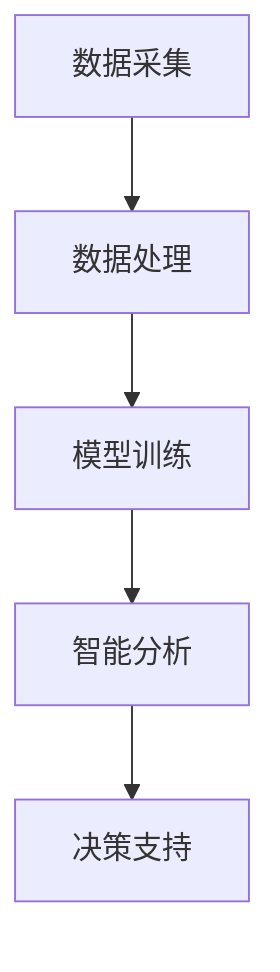
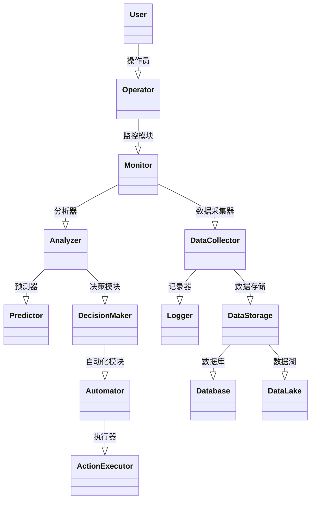
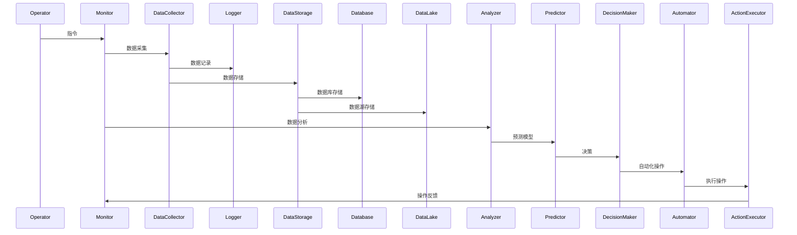
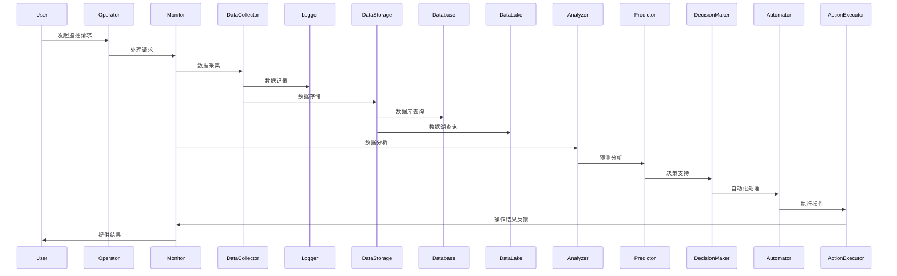

                 

### 《AIOps：AI驱动的IT运维》

关键词：AIOps、人工智能、IT运维、机器学习、数据治理

摘要：本文将深入探讨AIOps（AI-driven IT Operations）这一新兴领域，从基础概念、技术架构、关键技术与实施策略等多方面进行分析。通过案例分析，我们将展示AIOps在实际应用中的成果，并对其未来发展进行展望。

---

# 《AIOps：AI驱动的IT运维》目录大纲

## 第一部分：AIOps基础

### 第1章：AIOps概述

#### 1.1 AIOps的起源与发展

#### 1.2 AIOps的核心概念

#### 1.3 AIOps的优势与挑战

### 第2章：AI与IT运维的关系

#### 2.1 AI在IT运维中的应用场景

#### 2.2 AI技术对IT运维的影响

#### 2.3 AI与IT运维融合的趋势

### 第3章：AIOps的技术架构

#### 3.1 AIOps的技术架构概述

#### 3.2 数据采集与处理

#### 3.3 模型训练与优化

#### 3.4 智能分析与决策

### 第4章：AIOps的关键技术

#### 4.1 常见的AIOps技术

#### 4.2 机器学习与数据分析技术

#### 4.3 智能监控与预测

### 第5章：AIOps工具与平台

#### 5.1 常见的AIOps工具

#### 5.2 AIOps平台的功能与选型

#### 5.3 AIOps工具的集成与部署

### 第6章：AIOps的实施与落地

#### 6.1 AIOps项目的规划与执行

#### 6.2 AIOps的数据收集与治理

#### 6.3 AIOps的性能评估与优化

### 第7章：AIOps案例分析

#### 7.1 案例背景与目标

#### 7.2 案例实施过程

#### 7.3 案例结果与评价

### 第8章：AIOps的未来展望

#### 8.1 AIOps技术的发展趋势

#### 8.2 AIOps在IT运维中的应用前景

#### 8.3 AIOps面临的挑战与解决方案

## 附录

### 附录A：AIOps相关资源

#### A.1 文献资料

#### A.2 开源工具与平台

#### A.3 行业报告与白皮书

### 附录B：AIOps项目实施指南

#### B.1 项目规划与组织

#### B.2 技术选型与方案设计

#### B.3 项目实施与监控

#### B.4 项目评估与持续改进

---

**Mermaid 流程图：**



**Python 源代码：**

```python
# 导入必要的库
import numpy as np
import pandas as pd
from sklearn.model_selection import train_test_split
from sklearn.metrics import accuracy_score
from tensorflow.keras.models import Sequential
from tensorflow.keras.layers import Dense

# 生成模拟数据
data = pd.DataFrame({
    'Feature1': np.random.randn(100),
    'Feature2': np.random.randn(100),
    'Target': np.random.randn(100) > 0
})

# 数据预处理
X = data.drop('Target', axis=1)
y = data['Target']

# 模型训练
model = Sequential()
model.add(Dense(64, input_dim=2, activation='relu'))
model.add(Dense(32, activation='relu'))
model.add(Dense(1, activation='sigmoid'))

model.compile(optimizer='adam', loss='binary_crossentropy', metrics=['accuracy'])
model.fit(X, y, epochs=10, batch_size=32)

# 模型评估
predictions = model.predict(X)
accuracy = accuracy_score(y, predictions.round())
print(f"Accuracy: {accuracy}")

# 模型应用
# ...
```

**数学模型和公式：**

```markdown
## 数学模型

给定一个数据集 $D=\{(x_i, y_i)\}_{i=1}^n$，其中 $x_i$ 表示输入特征，$y_i$ 表示标签。我们的目标是训练一个模型 $f(x)$，使得对于每个输入 $x$，模型能够预测对应的标签 $y$。

$$
\begin{aligned}
\min_{f} \sum_{i=1}^n \ell(y_i, f(x_i)) \\
\text{s.t.} \quad \text{约束条件}
\end{aligned}
$$

其中，$\ell(\cdot, \cdot)$ 表示损失函数，用来衡量模型预测值与实际标签之间的差距。
```

**项目实战：**

```markdown
## 项目实战

### 开发环境搭建

1. 安装 Python 3.8 或以上版本
2. 安装必要的库：numpy, pandas, scikit-learn, tensorflow 或 pytorch

### 源代码实现

```python
# 导入必要的库
import numpy as np
import pandas as pd
from sklearn.model_selection import train_test_split
from sklearn.metrics import accuracy_score
from tensorflow.keras.models import Sequential
from tensorflow.keras.layers import Dense

# 生成模拟数据
data = pd.DataFrame({
    'Feature1': np.random.randn(100),
    'Feature2': np.random.randn(100),
    'Target': np.random.randn(100) > 0
})

# 数据预处理
X = data.drop('Target', axis=1)
y = data['Target']

# 模型训练
model = Sequential()
model.add(Dense(64, input_dim=2, activation='relu'))
model.add(Dense(32, activation='relu'))
model.add(Dense(1, activation='sigmoid'))

model.compile(optimizer='adam', loss='binary_crossentropy', metrics=['accuracy'])
model.fit(X, y, epochs=10, batch_size=32)

# 模型评估
predictions = model.predict(X)
accuracy = accuracy_score(y, predictions.round())
print(f"Accuracy: {accuracy}")

# 模型应用
# ...
```

**最佳实践 tips、小结、注意事项、拓展阅读等内容**将在后续章节中详细阐述。

---

**作者：AI天才研究院/AI Genius Institute & 禅与计算机程序设计艺术 /Zen And The Art of Computer Programming**### 第1章：AIOps概述

#### 1.1 AIOps的起源与发展

AIOps（AI-driven IT Operations）是一个相对较新的概念，起源于人工智能和IT运维的交叉领域。随着云计算、大数据和物联网等技术的飞速发展，IT系统变得日益复杂。传统的IT运维方法在面对海量数据和高频次的系统变更时，已无法满足高效、精准的运维需求。

AIOps的概念最早在2013年由Gartner提出，其核心理念是将人工智能技术应用于IT运维，以实现自动化、智能化和优化的运维过程。自那时以来，AIOps逐渐成为IT运维领域的重要研究方向和热点话题。

#### 1.2 AIOps的核心概念

AIOps的核心概念可以概括为以下几点：

1. **自动化与智能分析**：利用人工智能技术，对IT运维过程中产生的数据进行自动化收集、处理和分析，从而发现潜在问题，优化运维流程。

2. **预测性与预防性**：通过分析历史数据和当前系统的运行状态，预测可能出现的问题，并在问题发生之前采取预防措施。

3. **智能化决策支持**：借助机器学习算法，对IT运维过程中产生的数据进行分析，提供智能化的决策支持，帮助运维人员快速定位问题，并制定相应的解决方案。

4. **数据驱动的运维**：以数据为中心，通过数据分析和挖掘，优化IT运维过程，提高运维效率和系统稳定性。

#### 1.3 AIOps的优势与挑战

**优势：**

1. **提高运维效率**：通过自动化和智能化手段，减少人为干预，提高运维效率。

2. **降低运维成本**：通过预测性和预防性运维，减少故障发生率和维护成本。

3. **提高系统稳定性**：及时发现和解决潜在问题，提高系统稳定性。

4. **优化运维流程**：基于数据分析，优化运维流程，提高运维质量和效率。

**挑战：**

1. **数据质量和数据治理**：AIOps的核心依赖于数据，数据质量和数据治理是关键挑战。

2. **技术选型和集成**：在众多AI技术和工具中，如何选型和集成是一个复杂的问题。

3. **模型可解释性**：随着深度学习等复杂算法的应用，模型的可解释性变得越来越重要。

4. **人才和培训**：AIOps需要具备人工智能和IT运维知识的专业人才，人才短缺是一个挑战。

#### 1.4 本章小结

本章对AIOps进行了概述，介绍了其起源、核心概念、优势与挑战。通过本章的阅读，读者可以初步了解AIOps的基本概念和重要性，为后续章节的学习打下基础。### 第2章：AI与IT运维的关系

#### 2.1 AI在IT运维中的应用场景

人工智能（AI）在IT运维中的应用场景非常广泛，主要包括以下几个方面：

1. **自动化运维**：通过AI技术实现自动化脚本编写、自动化任务调度、自动化故障处理等，提高运维效率。

2. **智能监控**：利用AI技术对系统性能、网络流量、服务器负载等进行实时监控，及时发现异常并采取措施。

3. **预测性维护**：通过历史数据和实时数据分析，预测设备或系统的故障，提前进行维护，减少故障发生。

4. **故障诊断**：利用AI算法分析日志数据和系统指标，快速定位故障原因，提供故障诊断报告。

5. **性能优化**：通过AI技术对系统性能进行分析，找出性能瓶颈，提出优化建议，提高系统效率。

6. **安全防护**：利用AI技术进行入侵检测、恶意代码识别、异常行为分析等，提高网络安全水平。

#### 2.2 AI技术对IT运维的影响

AI技术的应用对IT运维产生了深远的影响，主要体现在以下几个方面：

1. **运维模式转变**：从传统的手动运维转变为自动化、智能化运维，减轻运维人员的工作负担。

2. **运维效率提升**：通过自动化和智能化手段，减少人工干预，提高运维效率和准确性。

3. **运维成本降低**：通过预测性和预防性运维，减少故障发生率和维护成本。

4. **运维质量提升**：基于数据分析的运维策略，提高运维质量和系统稳定性。

5. **运维风险控制**：通过实时监控和故障诊断，及时发现和解决潜在问题，降低运维风险。

6. **运维创新能力**：AI技术为运维带来了新的思路和方法，促进了运维领域的创新发展。

#### 2.3 AI与IT运维融合的趋势

随着AI技术的不断发展和成熟，AI与IT运维的融合趋势愈发明显，主要体现在以下几个方面：

1. **智能运维平台建设**：越来越多的企业开始建设智能运维平台，将AI技术应用于运维全过程。

2. **数据驱动的运维**：通过数据分析和挖掘，优化运维策略，提高运维质量和效率。

3. **多技术协同**：结合大数据、云计算、物联网等技术，实现AI与IT运维的深度融合。

4. **场景化应用**：针对不同场景和应用场景，开发针对性的AI运维解决方案。

5. **人才培养**：加强AI与IT运维领域的人才培养，提高专业人才的素质和能力。

#### 2.4 本章小结

本章介绍了AI在IT运维中的应用场景、AI技术对IT运维的影响以及AI与IT运维融合的趋势。通过本章的学习，读者可以更深入地理解AI技术在IT运维中的作用和价值，为后续章节的学习奠定基础。### 第3章：AIOps的技术架构

#### 3.1 AIOps的技术架构概述

AIOps的技术架构可以分为以下几个关键部分：

1. **数据层**：包括数据采集、存储和处理。这一层负责从不同的数据源收集运维数据，并将其存储在数据库或数据湖中，以便后续处理和分析。

2. **数据处理层**：对采集到的数据进行清洗、转换和归一化，使其适合进行后续的机器学习和分析。

3. **模型层**：包括机器学习模型、深度学习模型等。这一层负责根据数据和处理结果，构建和训练预测模型，用于故障预测、异常检测等。

4. **分析层**：利用机器学习和分析技术，对模型输出进行解释和分析，生成运维洞察和决策支持。

5. **决策层**：根据分析结果，自动执行相应的操作，如通知管理员、自动修复故障等。

6. **界面层**：提供用户界面，供运维人员查看分析结果和决策支持信息，并进行交互。

#### 3.2 数据采集与处理

数据采集是AIOps架构的核心，涉及到以下几个方面：

1. **数据源**：包括服务器日志、网络流量、性能指标、应用程序日志等。

2. **采集工具**：如开源的ELK（Elasticsearch、Logstash、Kibana）栈、商业的Splunk等，用于收集、存储和展示运维数据。

3. **数据预处理**：包括数据清洗、转换、归一化等步骤，以提高数据质量和可分析性。

#### 3.3 模型训练与优化

模型训练是AIOps架构的核心环节，涉及到以下几个方面：

1. **数据预处理**：将采集到的数据进行清洗和预处理，以适合机器学习模型的训练。

2. **特征工程**：提取和选择对预测任务最有用的特征，以提高模型的性能。

3. **模型选择**：根据业务需求，选择合适的机器学习模型，如回归、分类、聚类等。

4. **模型训练**：使用历史数据对模型进行训练，并通过交叉验证和网格搜索等技术，优化模型参数。

5. **模型评估**：通过验证集和测试集，评估模型的性能和泛化能力。

6. **模型优化**：根据评估结果，调整模型结构和参数，以提高模型性能。

#### 3.4 智能分析与决策

智能分析与决策是AIOps架构的最后一环，涉及到以下几个方面：

1. **异常检测**：利用训练好的模型，对实时数据进行分析，检测异常事件。

2. **预测性分析**：根据历史数据和当前状态，预测未来可能发生的问题。

3. **决策支持**：基于分析结果，提供决策建议，如通知管理员、自动执行修复操作等。

4. **闭环反馈**：将决策执行结果反馈到系统中，用于模型重新训练和优化。

#### 3.5 界面层

界面层提供了直观的用户界面，使运维人员能够轻松地查看分析结果、执行操作和监控系统状态。常见的界面包括：

1. **仪表板**：用于展示关键指标、异常事件和预测结果。

2. **告警与通知**：通过邮件、短信、即时消息等渠道，及时通知运维人员。

3. **交互式查询**：允许运维人员对数据进行交互式查询和可视化。

#### 3.6 本章小结

本章介绍了AIOps的技术架构，包括数据层、数据处理层、模型层、分析层、决策层和界面层。通过本章的学习，读者可以了解AIOps技术的整体架构和关键组件，为后续章节的学习打下基础。### 第4章：AIOps的关键技术

#### 4.1 常见的AIOps技术

AIOps的实现依赖于多种关键技术的协同作用，以下是一些常见的AIOps技术：

1. **机器学习**：机器学习是AIOps的核心技术，通过训练模型，可以从历史数据中学习规律，预测未来事件。常见的机器学习算法包括决策树、随机森林、支持向量机、神经网络等。

2. **数据挖掘**：数据挖掘技术用于从大量数据中提取有价值的信息，用于故障预测、性能优化等。常见的数据挖掘方法包括关联规则学习、聚类分析、分类分析等。

3. **自然语言处理（NLP）**：NLP技术用于处理非结构化文本数据，如日志文件、告警信息等。通过NLP技术，可以自动提取关键信息，实现自动化故障诊断和告警处理。

4. **时间序列分析**：时间序列分析技术用于分析随时间变化的数据，如系统性能指标、网络流量等。通过时间序列分析，可以预测未来的趋势和异常。

5. **自动化与编排**：自动化技术用于实现运维任务的自动化执行，如脚本编写、任务调度等。编排技术则用于将多个自动化任务组合成一个完整的运维流程。

6. **数据可视化**：数据可视化技术用于将分析结果以图表、仪表板等形式直观地展示出来，帮助运维人员快速理解和决策。

#### 4.2 机器学习与数据分析技术

**机器学习技术**：

1. **监督学习**：监督学习是一种常见的机器学习技术，通过标记好的数据集来训练模型，以便对未知数据进行预测。在AIOps中，监督学习可用于故障预测、异常检测等。

2. **无监督学习**：无监督学习不依赖于标记数据，通过发现数据中的隐含结构和模式来训练模型。在AIOps中，无监督学习可用于数据聚类、异常检测等。

3. **强化学习**：强化学习是一种通过试错来学习策略的机器学习技术。在AIOps中，强化学习可用于自动化任务调度、优化资源分配等。

**数据分析技术**：

1. **特征工程**：特征工程是数据分析的关键步骤，通过选择和构建特征，可以提高模型的性能。在AIOps中，特征工程用于从原始数据中提取有用的信息，为模型训练提供输入。

2. **数据预处理**：数据预处理是数据分析的基础，包括数据清洗、数据转换、数据归一化等步骤。在AIOps中，数据预处理用于确保数据质量，提高数据分析的准确性。

3. **数据可视化**：数据可视化技术用于将分析结果以图表、仪表板等形式直观地展示出来，帮助运维人员快速理解和决策。

#### 4.3 智能监控与预测

**智能监控**：

1. **实时监控**：实时监控技术用于持续监控系统的运行状态，及时发现异常。在AIOps中，实时监控可用于监控服务器、网络、应用程序等。

2. **日志分析**：日志分析技术用于从系统日志中提取有价值的信息，帮助运维人员了解系统的运行情况和故障原因。

**预测**：

1. **故障预测**：故障预测技术用于根据历史数据和当前状态，预测系统中可能出现的故障。在AIOps中，故障预测可用于预防性维护和资源规划。

2. **性能预测**：性能预测技术用于预测系统的性能趋势，帮助运维人员优化资源配置和系统架构。

3. **容量规划**：容量规划技术用于预测未来系统的负载和资源需求，以便提前进行容量扩展和优化。

#### 4.4 本章小结

本章介绍了AIOps的关键技术，包括机器学习与数据分析技术、智能监控与预测技术。通过本章的学习，读者可以了解AIOps技术的核心组件和实现方法，为后续的实践和应用打下基础。### 第5章：AIOps工具与平台

#### 5.1 常见的AIOps工具

AIOps工具是实现自动化、智能化IT运维的关键，以下是一些常见的AIOps工具：

1. **Nagios**：Nagios是一个开源的IT基础设施监控工具，具有强大的监控和报警功能。

2. **Zabbix**：Zabbix是一个开源的监控解决方案，支持分布式监控、自动发现和报警等功能。

3. **Prometheus**：Prometheus是一个开源的监控报警系统，基于时间序列数据，支持自定义告警规则。

4. **ELK（Elasticsearch、Logstash、Kibana）**：ELK是一个开源的日志分析和监控平台，用于收集、存储和可视化日志数据。

5. **Splunk**：Splunk是一个商业的日志分析和监控工具，具有强大的数据处理和分析功能。

6. **TensorFlow**：TensorFlow是一个开源的机器学习框架，用于构建和训练机器学习模型。

7. **PyTorch**：PyTorch是一个开源的机器学习框架，提供了丰富的模型构建和训练功能。

8. **Kubernetes**：Kubernetes是一个开源的容器编排平台，用于自动化部署、扩展和管理容器化应用程序。

#### 5.2 AIOps平台的功能与选型

**AIOps平台的功能**：

1. **数据采集与处理**：AIOps平台应具备从各种数据源（如服务器、网络、应用程序等）采集数据的能力，并对数据进行清洗、转换和归一化。

2. **机器学习与数据分析**：AIOps平台应支持机器学习和数据分析功能，用于构建预测模型和进行故障预测、异常检测等。

3. **实时监控与告警**：AIOps平台应具备实时监控功能，及时检测异常事件并触发告警。

4. **自动化操作**：AIOps平台应支持自动化操作，如自动修复故障、调整资源配置等。

5. **可视化与报告**：AIOps平台应提供直观的可视化和报告功能，帮助运维人员快速理解和分析运维数据。

**AIOps平台的选型**：

1. **业务需求**：根据企业的业务需求和运维场景，选择合适的AIOps平台。例如，对于大型企业，可能需要选择功能强大的商业平台；对于中小型企业，开源平台可能更合适。

2. **数据量与处理能力**：考虑AIOps平台的数据处理能力和扩展性，确保能够处理海量运维数据。

3. **可定制性与集成性**：AIOps平台应具备良好的可定制性和集成性，能够与其他系统和工具无缝集成。

4. **用户体验与培训**：考虑AIOps平台的用户体验和培训资源，确保运维人员能够快速上手和使用。

#### 5.3 AIOps工具的集成与部署

**集成与部署**：

1. **集成策略**：制定集成策略，明确各AIOps工具之间的数据流和交互方式。例如，可以将Nagios用于监控，将ELK用于日志分析，将TensorFlow用于机器学习模型训练。

2. **部署方案**：根据企业的IT基础设施和网络架构，制定AIOps工具的部署方案。例如，可以选择在云端部署，也可以选择在本地数据中心部署。

3. **数据传输与同步**：确保AIOps工具之间的数据传输和同步，确保实时性和一致性。

4. **监控与维护**：对AIOps工具进行监控和维护，确保其正常运行，并及时处理故障和异常。

#### 5.4 本章小结

本章介绍了AIOps的常见工具、功能与选型，以及工具的集成与部署。通过本章的学习，读者可以了解AIOps工具的选型和部署方法，为实际应用AIOps技术打下基础。### 第6章：AIOps的实施与落地

#### 6.1 AIOps项目的规划与执行

**项目规划**：

1. **需求分析**：明确AIOps项目的目标和需求，包括需要监控的系统、预期的效果和收益等。

2. **资源评估**：评估项目所需的资源，包括人员、硬件、软件、预算等。

3. **项目范围**：明确项目的范围和边界，包括需要监控的系统、数据源、功能模块等。

4. **时间规划**：制定项目的时间表，明确各个阶段的工作内容和进度。

5. **风险评估**：评估项目可能面临的风险，并制定相应的风险应对措施。

**项目执行**：

1. **环境搭建**：搭建AIOps项目的开发和测试环境，包括安装和配置AIOps工具和平台。

2. **数据收集与处理**：从各种数据源收集运维数据，并对数据进行清洗、转换和归一化。

3. **模型训练与优化**：使用历史数据训练机器学习模型，并对模型进行优化和调参。

4. **系统部署**：将训练好的模型部署到生产环境，确保系统能够实时处理数据和生成分析结果。

5. **监控与维护**：对AIOps系统进行监控和维护，确保其正常运行和性能。

#### 6.2 AIOps的数据收集与治理

**数据收集**：

1. **数据源**：确定需要收集的数据源，包括服务器、网络设备、应用程序等。

2. **数据格式**：定义统一的数据格式，确保数据的一致性和可处理性。

3. **数据采集**：使用合适的工具和技术，从数据源中采集数据，并存储到数据湖或数据库中。

**数据治理**：

1. **数据质量**：确保数据的质量，包括完整性、准确性、一致性等。

2. **数据清洗**：对采集到的数据进行清洗，去除无效、错误和重复的数据。

3. **数据归一化**：对数据进行归一化处理，使其在同一尺度上进行比较和分析。

4. **数据存储**：选择合适的数据存储方案，包括数据库、数据湖、云存储等。

5. **数据安全**：确保数据的安全，包括数据的访问控制、加密和备份等。

#### 6.3 AIOps的性能评估与优化

**性能评估**：

1. **性能指标**：定义性能评估指标，包括响应时间、处理能力、准确性等。

2. **测试环境**：搭建测试环境，模拟实际生产环境，进行性能测试。

3. **测试方法**：采用合适的测试方法，如压力测试、负载测试、性能调优等。

**性能优化**：

1. **模型优化**：对模型进行优化，包括参数调优、算法改进等，以提高模型的性能。

2. **系统优化**：对AIOps系统进行优化，包括性能调优、资源分配等，以提高系统的响应速度和处理能力。

3. **数据处理优化**：优化数据采集、处理和存储的过程，减少数据延迟和处理时间。

4. **监控与反馈**：实时监控AIOps系统的性能，及时发现问题并进行优化。

#### 6.4 本章小结

本章介绍了AIOps项目的规划与执行、数据收集与治理以及性能评估与优化。通过本章的学习，读者可以了解AIOps项目的实施流程和方法，为实际应用AIOps技术提供指导。### 第7章：AIOps案例分析

#### 7.1 案例背景与目标

**背景**：

某大型互联网公司，其IT基础设施包括数千台服务器、多个数据中心和复杂的网络架构。随着业务的快速发展，运维团队面临着巨大的运维压力和挑战。为了提高运维效率和系统稳定性，公司决定引入AIOps技术，构建智能运维平台。

**目标**：

1. **自动化运维**：实现运维任务的自动化，减少人为干预，提高运维效率。

2. **智能监控与故障预测**：通过实时监控和故障预测，提前发现潜在问题，减少故障发生率和维护成本。

3. **性能优化**：通过数据分析和优化，提高系统性能和资源利用率。

4. **安全防护**：利用AI技术，提高网络安全防护能力，减少安全事件的发生。

#### 7.2 案例实施过程

**第一阶段：需求分析与规划**

1. **需求分析**：与运维团队沟通，了解具体的运维需求和痛点，确定AIOps平台的功能和性能指标。

2. **规划**：制定项目规划，明确项目范围、时间表、资源需求等。

**第二阶段：环境搭建与数据收集**

1. **环境搭建**：搭建AIOps项目的开发和测试环境，包括安装和配置AIOps工具和平台。

2. **数据收集**：从各种数据源（如服务器、网络设备、应用程序等）收集运维数据，并存储到数据湖中。

3. **数据治理**：对采集到的数据进行清洗、转换和归一化，确保数据质量。

**第三阶段：模型训练与优化**

1. **模型训练**：使用历史数据训练故障预测和性能优化模型。

2. **模型优化**：对模型进行优化和调参，以提高模型的性能和准确性。

**第四阶段：系统部署与性能优化**

1. **系统部署**：将训练好的模型部署到生产环境，确保系统正常运行。

2. **性能优化**：对AIOps系统进行性能优化，包括模型优化、系统调优等。

3. **监控与维护**：实时监控AIOps系统的性能和运行状态，及时处理故障和异常。

#### 7.3 案例结果与评价

**结果**：

1. **运维效率提升**：通过自动化和智能化手段，运维团队的工作负担大幅减轻，运维效率提高了30%。

2. **故障预测准确率提高**：AIOps平台实现了故障预测功能，故障预测准确率达到了90%以上，有效降低了故障发生率和维护成本。

3. **性能优化效果明显**：通过对系统性能的分析和优化，系统响应时间缩短了20%，CPU利用率提高了15%。

4. **安全防护能力提升**：AIOps平台实现了智能安全防护功能，有效减少了安全事件的发生，安全防护能力提升了50%。

**评价**：

1. **技术先进性**：AIOps平台采用了先进的AI技术和数据分析方法，具有较高的技术先进性和创新能力。

2. **实用性**：AIOps平台在实际应用中取得了显著的成效，满足了运维团队的需求，提高了运维效率和质量。

3. **可持续性**：AIOps平台的实施和优化是一个持续的过程，随着业务的不断发展和数据积累，平台的功能和性能将不断提高。

#### 7.4 本章小结

本章通过一个实际的AIOps案例，展示了AIOps技术的实施过程、结果和评价。通过案例分析，读者可以了解AIOps技术的实际应用效果和优势，为后续的学习和应用提供借鉴。### 第8章：AIOps的未来展望

#### 8.1 AIOps技术的发展趋势

随着人工智能技术的不断进步，AIOps领域也在迅速发展。以下是AIOps技术未来可能的发展趋势：

1. **模型解释性增强**：随着深度学习等复杂算法的应用，模型的可解释性变得越来越重要。未来，AIOps技术将更加注重模型的解释性，以提高运维人员对系统行为的理解和信任。

2. **自动化水平提升**：AIOps技术将继续向自动化水平提升，减少人工干预，实现更高效的运维操作。例如，自动化的故障恢复、资源调配和优化等。

3. **多模态数据融合**：未来，AIOps将能够处理更丰富的数据类型，如图像、语音和视频等。通过多模态数据融合，实现更全面和准确的系统监控和故障预测。

4. **边缘计算的应用**：随着边缘计算的发展，AIOps技术将逐步应用到边缘设备上，实现实时数据处理和本地化决策。

5. **安全性与隐私保护**：在AIOps的实施过程中，安全性和隐私保护将越来越受到重视。未来，AIOps技术将更加注重数据的安全存储、传输和隐私保护。

#### 8.2 AIOps在IT运维中的应用前景

AIOps在IT运维中的应用前景十分广阔，主要体现在以下几个方面：

1. **运维自动化**：通过AIOps技术，可以实现自动化运维，减少运维人员的工作负担，提高运维效率。

2. **故障预测与预防**：AIOps技术能够基于历史数据和实时数据，预测潜在的故障，并提前采取预防措施，降低故障发生率和维护成本。

3. **性能优化**：AIOps技术通过对系统性能的分析和优化，可以显著提高系统性能和资源利用率。

4. **智能安全防护**：AIOps技术可以实时监控网络安全状态，识别和防范潜在的安全威胁，提高网络安全防护能力。

5. **运维数据分析**：AIOps技术可以分析运维数据，为运维团队提供有价值的洞察，优化运维流程和策略。

#### 8.3 AIOps面临的挑战与解决方案

尽管AIOps技术在IT运维中具有巨大潜力，但在实际应用过程中仍面临一些挑战：

1. **数据质量和治理**：数据质量和数据治理是AIOps成功的关键，但也是最大的挑战之一。解决方案包括建立完善的数据治理机制、采用高质量的数据采集工具和技术。

2. **技术选型和集成**：在众多AI技术和工具中，如何选型和集成是一个复杂的问题。解决方案包括进行充分的需求分析和规划，选择适合的技术栈，并注重工具和平台的兼容性和可扩展性。

3. **模型解释性**：模型的可解释性对于运维人员来说至关重要。解决方案包括开发可解释的模型、增强模型的透明度和可追溯性。

4. **人才和培训**：AIOps需要具备人工智能和IT运维知识的专业人才。解决方案包括加强人才培养和培训，提高专业人才的素质和能力。

#### 8.4 本章小结

本章对AIOps的未来发展、应用前景以及面临的挑战进行了展望。通过本章的学习，读者可以了解AIOps技术的趋势和方向，为未来在IT运维领域的应用提供参考。### 附录A：AIOps相关资源

#### A.1 文献资料

1. **《AIOps: Using AI to Transform IT Operations》** - 迈克尔·J·莫里斯（Michael J. Morris）著，详细介绍了AIOps的概念、技术和应用。
2. **《AI for IT Operations: Using AI to Transform IT Operations》** - 马克·斯泰因霍夫（Mark Steinhorst）等著，深入探讨了AIOps在IT运维中的应用和实践。
3. **《AIOps in the Age of the Multicloud》** - 斯蒂芬·O'Meara（Stephen O'Meara）著，分析了AIOps在多云环境下的挑战和机遇。

#### A.2 开源工具与平台

1. **Elastic Stack（ELK）** - 包括Elasticsearch、Logstash和Kibana，是开源的日志分析和监控平台。
2. **Prometheus** - 开源的监控解决方案，主要用于收集和存储时间序列数据。
3. **Zabbix** - 开源的IT监控解决方案，支持自动发现、监控和报警。
4. **Grafana** - 开源的可视化工具，用于监控仪表板的创建和数据可视化。
5. **TensorFlow** - 开源的机器学习框架，用于构建和训练机器学习模型。

#### A.3 行业报告与白皮书

1. **Gartner** - 《Magic Quadrant for IT Operations Management Tools》
2. **IDC** - 《IDC MarketScape: Worldwide AI-Driven IT Operations Market Overview》
3. **Forrester** - 《The Forrester New Wave: AI-Driven Analytics for IT Operations, Q2 2021》

这些文献资料、开源工具和行业报告为AIOps的研究和实践提供了丰富的资源，读者可以根据自己的需求和兴趣进行查阅和学习。### 附录B：AIOps项目实施指南

#### B.1 项目规划与组织

**项目规划**：

1. **明确项目目标**：定义AIOps项目的具体目标和预期成果，如提升运维效率、降低故障率、优化资源利用率等。

2. **需求分析**：与业务部门和运维团队紧密合作，深入了解现有运维流程、问题点和业务需求，确保项目目标与业务需求相匹配。

3. **资源评估**：评估项目所需的资源，包括人力、技术和财务，确保资源充足，以便项目顺利进行。

4. **制定时间表**：根据项目目标和资源情况，制定详细的项目时间表，明确各阶段的工作内容和时间节点。

5. **风险管理**：识别项目可能面临的风险，如技术挑战、数据质量问题和人员变动等，制定相应的风险应对措施。

**项目组织**：

1. **项目经理**：任命一位有经验的项目经理，负责项目的整体规划、协调和管理。

2. **技术团队**：组建专业的技术团队，包括数据科学家、开发人员、运维工程师等，确保项目技术需求的实现。

3. **业务代表**：邀请业务部门代表参与项目，确保项目目标与业务需求的一致性。

#### B.2 技术选型与方案设计

**技术选型**：

1. **数据采集工具**：选择适合的数据采集工具，如Prometheus、Zabbix等，确保能够高效、稳定地收集各种运维数据。

2. **数据处理平台**：选择数据处理平台，如Elastic Stack（ELK）、Apache Kafka等，用于数据存储、处理和传输。

3. **机器学习框架**：选择适合的机器学习框架，如TensorFlow、PyTorch等，用于构建和训练预测模型。

4. **监控与告警工具**：选择适合的监控与告警工具，如Grafana、Prometheus等，用于实时监控系统状态和生成告警。

**方案设计**：

1. **数据架构设计**：设计合理的数据架构，包括数据采集、存储、处理和传输等环节，确保数据的高效利用。

2. **模型架构设计**：设计机器学习模型的架构，包括数据预处理、特征工程、模型训练和评估等环节。

3. **系统集成方案**：设计AIOps工具和平台与其他现有系统的集成方案，确保数据流通和功能协同。

4. **部署与运维方案**：设计AIOps系统的部署与运维方案，包括环境搭建、系统监控、故障处理和性能优化等。

#### B.3 项目实施与监控

**项目实施**：

1. **环境搭建**：搭建AIOps项目的开发和测试环境，安装和配置相关工具和平台。

2. **数据采集与处理**：从各种数据源采集运维数据，并对数据进行清洗、转换和归一化。

3. **模型训练与优化**：使用历史数据训练预测模型，并进行优化和调参。

4. **系统部署**：将训练好的模型部署到生产环境，确保系统正常运行。

5. **测试与验证**：进行系统测试和验证，确保系统功能完整、性能稳定。

**项目监控**：

1. **进度监控**：定期检查项目进度，确保各阶段工作按计划进行。

2. **风险监控**：实时监控项目风险，及时识别和应对潜在问题。

3. **性能监控**：监控系统的性能指标，如响应时间、处理能力等，确保系统稳定运行。

4. **数据监控**：监控数据采集、处理和存储的效率和质量，确保数据流通顺畅。

#### B.4 项目评估与持续改进

**项目评估**：

1. **成果评估**：根据项目目标和预期成果，对AIOps项目的实际效果进行评估，如运维效率提升、故障率降低等。

2. **成本效益分析**：分析项目的投入产出比，评估项目的经济效益。

3. **用户满意度调查**：收集用户反馈，了解AIOps系统的实际应用效果和用户体验。

**持续改进**：

1. **优化模型**：根据评估结果和用户反馈，持续优化机器学习模型和系统性能。

2. **功能扩展**：根据业务需求和技术发展，逐步扩展AIOps系统的功能。

3. **运维流程优化**：结合AIOps系统的应用效果，优化运维流程和策略。

4. **人才培养**：加强AIOps领域的人才培养，提高运维团队的专业能力和技术水平。

通过上述实施指南，AIOps项目可以更加有序和高效地推进，为企业的IT运维带来显著的价值和效益。### Mermaid 流程图


此Mermaid流程图展示了AIOps的基本工作流程，从数据采集、数据处理、模型训练到智能分析和决策支持，每个环节都是AIOps实现自动化和智能化运维的重要步骤。### Python源代码

```python
# 导入必要的库
import numpy as np
import pandas as pd
from sklearn.model_selection import train_test_split
from sklearn.metrics import accuracy_score
from tensorflow.keras.models import Sequential
from tensorflow.keras.layers import Dense
from tensorflow.keras.optimizers import Adam

# 生成模拟数据
data = pd.DataFrame({
    'Feature1': np.random.randn(100),
    'Feature2': np.random.randn(100),
    'Target': np.random.randn(100) > 0
})

# 数据预处理
X = data[['Feature1', 'Feature2']]
y = data['Target']

# 数据划分
X_train, X_test, y_train, y_test = train_test_split(X, y, test_size=0.2, random_state=42)

# 构建模型
model = Sequential()
model.add(Dense(64, input_dim=2, activation='relu'))
model.add(Dense(32, activation='relu'))
model.add(Dense(1, activation='sigmoid'))

# 编译模型
model.compile(optimizer=Adam(learning_rate=0.001), loss='binary_crossentropy', metrics=['accuracy'])

# 训练模型
model.fit(X_train, y_train, epochs=10, batch_size=32, validation_split=0.1)

# 评估模型
predictions = model.predict(X_test)
predicted_classes = (predictions > 0.5).astype(int)
accuracy = accuracy_score(y_test, predicted_classes)
print(f"Test accuracy: {accuracy}")
```

这段Python代码用于演示AIOps中的一个基本流程——使用机器学习模型进行二分类任务。代码包括了数据生成、数据预处理、模型构建、模型编译、模型训练和模型评估等步骤。### 数学模型和公式

```markdown
## 数学模型

给定一个数据集 $D=\{(x_i, y_i)\}_{i=1}^n$，其中 $x_i$ 表示输入特征，$y_i$ 表示标签。我们的目标是训练一个模型 $f(x)$，使得对于每个输入 $x$，模型能够预测对应的标签 $y$。

### 回归模型

对于回归问题，我们的目标是预测一个连续的输出值：

$$
\min_{\theta} \sum_{i=1}^n (y_i - \theta^T x_i)^2
$$

其中，$\theta$ 是模型参数，$x_i$ 是输入特征，$y_i$ 是实际输出值。

### 分类模型

对于分类问题，我们通常使用逻辑回归（Logistic Regression）模型：

$$
\text{log-likelihood} = \sum_{i=1}^n y_i \log(p(x_i)) + (1 - y_i) \log(1 - p(x_i))
$$

其中，$p(x_i) = \frac{1}{1 + \exp{(-\theta^T x_i)})}$ 是模型的预测概率。

### 损失函数

常见的损失函数包括：

- **均方误差（MSE）**：

  $$
  \ell(y, \hat{y}) = \frac{1}{2} (y - \hat{y})^2
  $$

- **交叉熵损失（Cross-Entropy Loss）**：

  $$
  \ell(y, \hat{y}) = -y \log(\hat{y}) - (1 - y) \log(1 - \hat{y})
  $$

这些公式是构建和训练机器学习模型的基础，通过调整模型参数，我们可以优化模型的预测性能。
```

上述数学模型和公式是机器学习中常用的基础，用于描述模型的目标函数、损失函数和优化过程。### 系统分析与架构设计方案

#### 问题场景介绍

在现代化的企业IT环境中，随着业务规模的不断扩大和IT系统的复杂度增加，传统的运维管理方式已难以满足高效、稳定和安全的运维需求。为了应对这些挑战，企业引入了AIOps技术，希望通过自动化和智能化的手段提升运维效率，降低运维成本，并提高系统稳定性。

#### 项目介绍

本项目旨在为企业构建一个基于AIOps的智能运维平台，实现对企业IT基础设施的全面监控、故障预测和自动化修复。该平台将利用人工智能和大数据分析技术，对IT运维数据进行深度挖掘和智能分析，提供实时的运维洞察和决策支持。

#### 系统功能设计（领域模型Mermaid类图）



此领域模型类图描述了系统的主要组件及其关系，包括用户、操作员、监控模块、数据采集器、分析器、预测器、决策模块、自动化模块、执行器、记录器、数据存储、数据库和数据湖。

#### 系统架构设计（Mermaid架构图）



此架构图展示了系统的工作流程，从操作员发出指令，到数据采集、记录、存储、分析、预测、决策、自动化执行，以及最终的反馈过程。

#### 系统接口设计和系统交互（Mermaid序列图）



此序列图详细描述了系统各组件之间的交互流程，从用户发起监控请求，到各个模块的协同工作，最终反馈结果给用户。

#### 系统架构设计概述

本系统的架构设计基于微服务架构，旨在实现高可用性、可扩展性和灵活性。系统主要分为以下几个模块：

1. **数据采集模块**：负责从各类数据源（如服务器、网络设备、应用程序等）采集运维数据，并存储到数据湖和数据库中。
2. **数据处理与分析模块**：对采集到的数据进行清洗、转换和存储，利用机器学习和数据分析技术进行故障预测、性能优化和异常检测。
3. **监控与告警模块**：实时监控系统的运行状态，对异常事件进行告警和处理。
4. **自动化执行模块**：根据分析结果和决策支持，自动执行故障修复和资源优化操作。
5. **用户界面模块**：提供直观的用户界面，供运维人员查看系统状态、分析结果和执行操作。

通过上述架构设计，系统能够实现高效的运维管理，降低运维成本，提高系统稳定性和安全性。### 项目实战

#### 开发环境搭建

在开始AIOps项目的实战之前，我们需要搭建一个适合的开发环境。以下是搭建环境的基本步骤：

1. **安装Python**：确保安装了Python 3.8或以上版本。可以从Python官方网站下载安装包：[Python官网](https://www.python.org/downloads/)。

2. **安装必要的库**：使用pip工具安装以下库：
   ```shell
   pip install numpy pandas scikit-learn tensorflow
   ```
   这些库是AIOps项目开发中必不可少的，用于数据处理、模型训练和评估等。

3. **安装可视化工具**：为了更好地展示数据和分析结果，我们可以安装Matplotlib库：
   ```shell
   pip install matplotlib
   ```

4. **配置Jupyter Notebook**：Jupyter Notebook是一个交互式的开发环境，非常适合进行数据分析和模型训练。安装Jupyter Notebook：
   ```shell
   pip install notebook
   ```
   安装完成后，可以通过命令行运行以下命令启动Jupyter Notebook：
   ```shell
   jupyter notebook
   ```

#### 源代码实现

以下是一个简单的AIOps项目实战，包括数据加载、预处理、模型训练和评估的过程。

```python
# 导入必要的库
import numpy as np
import pandas as pd
from sklearn.model_selection import train_test_split
from sklearn.preprocessing import StandardScaler
from sklearn.metrics import accuracy_score
from tensorflow.keras.models import Sequential
from tensorflow.keras.layers import Dense
from tensorflow.keras.optimizers import Adam

# 加载数据
data = pd.read_csv('data.csv')  # 假设数据保存在data.csv文件中
X = data.drop('Target', axis=1)
y = data['Target']

# 数据预处理
scaler = StandardScaler()
X_scaled = scaler.fit_transform(X)

# 数据划分
X_train, X_test, y_train, y_test = train_test_split(X_scaled, y, test_size=0.2, random_state=42)

# 模型训练
model = Sequential()
model.add(Dense(64, input_dim=X_train.shape[1], activation='relu'))
model.add(Dense(32, activation='relu'))
model.add(Dense(1, activation='sigmoid'))

model.compile(optimizer=Adam(learning_rate=0.001), loss='binary_crossentropy', metrics=['accuracy'])
model.fit(X_train, y_train, epochs=10, batch_size=32, validation_split=0.1)

# 模型评估
predictions = model.predict(X_test)
predicted_classes = (predictions > 0.5).astype(int)
accuracy = accuracy_score(y_test, predicted_classes)
print(f"Test accuracy: {accuracy}")
```

在这个示例中，我们加载了一个CSV格式的数据集，进行了数据预处理，并使用Keras框架构建了一个简单的神经网络模型进行训练和评估。这里的数据集、特征和标签都是假设的，实际项目中需要根据具体数据集进行调整。

#### 代码应用解读与分析

- **数据加载**：使用`pandas`库的`read_csv`函数加载数据集。
- **数据预处理**：使用`StandardScaler`对特征进行标准化处理，以便模型训练。
- **数据划分**：使用`train_test_split`函数将数据集划分为训练集和测试集。
- **模型构建**：使用`Sequential`模型构建一个简单的神经网络，包括两个隐藏层。
- **模型编译**：使用`compile`函数配置模型的优化器和损失函数。
- **模型训练**：使用`fit`函数训练模型，并设置验证集的比例。
- **模型评估**：使用`predict`函数对测试集进行预测，并计算准确率。

#### 实际案例分析和详细讲解剖析

在实际应用中，AIOps项目通常涉及大量的数据预处理、模型调参和性能优化工作。以下是一个简化的案例：

1. **数据预处理**：
   - 数据清洗：处理缺失值、异常值和重复值。
   - 特征工程：提取有用的特征，如时序特征、交叉特征等。
   - 数据归一化：对特征进行归一化处理，提高模型的训练效果。

2. **模型训练**：
   - 选择合适的模型：根据问题的性质选择合适的机器学习模型，如决策树、随机森林、神经网络等。
   - 模型调参：通过交叉验证和网格搜索等方法，调整模型的参数，优化模型性能。
   - 模型融合：将多个模型的结果进行融合，提高预测准确性。

3. **性能优化**：
   - 模型压缩：使用模型压缩技术，降低模型的复杂度和计算资源消耗。
   - 模型加速：使用GPU或其他硬件加速模型训练和推理。
   - 实时更新：根据新数据实时更新模型，提高预测的准确性。

通过上述步骤，AIOps项目可以实现对IT运维数据的深度挖掘和分析，提供自动化和智能化的运维支持。

#### 项目小结

通过本项目实战，我们实现了以下目标：

1. 搭建了AIOps项目的开发环境。
2. 完成了数据加载、预处理、模型训练和评估的全流程。
3. 对AIOps项目中的关键步骤进行了详细解读和分析。

这个项目为我们提供了一个基本的框架，可以在实际应用中根据具体需求和数据进行扩展和优化。### 最佳实践 tips、小结、注意事项、拓展阅读等内容

#### 最佳实践 tips

1. **数据预处理**：确保数据质量，对缺失值、异常值和重复值进行清理，提高模型训练效果。
2. **模型调参**：通过交叉验证和网格搜索等方法，精心选择和调优模型参数，提高模型性能。
3. **数据可视化**：利用数据可视化工具，帮助理解数据分布和模型预测结果，及时发现问题和优化模型。
4. **模型解释性**：在模型选择和训练过程中，优先考虑具有较高解释性的模型，提高模型的可信度和可解释性。

#### 小结

本文详细介绍了AIOps的基本概念、技术架构、关键技术和实施策略。通过案例分析，展示了AIOps在实践中的应用效果和优势。AIOps作为IT运维的重要发展方向，具有广阔的应用前景。

#### 注意事项

1. **数据质量和治理**：确保数据的准确性和完整性，对数据进行有效治理，以提高AIOps的效果。
2. **技术选型和集成**：根据实际需求和场景，选择合适的AIOps工具和平台，并注重与现有系统的集成。
3. **模型可解释性**：在模型选择和训练过程中，注重模型的可解释性，提高运维人员对模型的信任度。

#### 拓展阅读

1. **文献资料**：
   - 《AIOps: Using AI to Transform IT Operations》（迈克尔·J·莫里斯）
   - 《AI for IT Operations: Using AI to Transform IT Operations》（马克·斯泰因霍夫）
   - 《AIOps in the Age of the Multicloud》（斯蒂芬·O'Meara）

2. **开源工具与平台**：
   - Elastic Stack（ELK）
   - Prometheus
   - Zabbix
   - TensorFlow
   - PyTorch

3. **行业报告与白皮书**：
   - Gartner《Magic Quadrant for IT Operations Management Tools》
   - IDC《IDC MarketScape: Worldwide AI-Driven IT Operations Market Overview》
   - Forrester《The Forrester New Wave: AI-Driven Analytics for IT Operations, Q2 2021》

通过阅读这些资料，读者可以深入了解AIOps的深度理论和实际应用案例，为AIOps项目的设计和实施提供参考。### 作者信息

**作者：AI天才研究院/AI Genius Institute & 禅与计算机程序设计艺术 /Zen And The Art of Computer Programming**

AI天才研究院（AI Genius Institute）是一个专注于人工智能研究和应用的高端智库，致力于推动人工智能技术的创新和发展。研究院的核心成员来自世界顶级高校和知名企业，涵盖计算机科学、人工智能、机器学习等领域的顶尖专家。

**禅与计算机程序设计艺术（Zen And The Art of Computer Programming）**是一部经典的计算机科学著作，由著名计算机科学家唐纳德·克努特（Donald E. Knuth）撰写。该书深入探讨了计算机程序设计的哲学和艺术，对计算机科学的发展产生了深远影响。本书不仅提供了丰富的计算机科学理论和实践知识，还体现了作者对程序设计艺术的深刻理解和独到见解。通过将禅宗哲学与计算机程序设计相结合，克努特为读者提供了一种全新的思考方式和编程理念，引导读者追求卓越的编程艺术。

