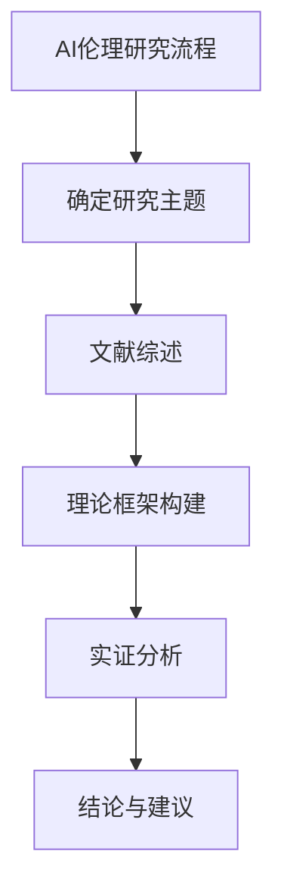

                 

# 《AI伦理：人工智能发展中的道德考量》

## 摘要

本文旨在探讨人工智能（AI）发展过程中的伦理考量，包括AI伦理的基础、核心概念、问题分析、国际规范以及实践。通过分析AI伦理的背景和重要性，我们提出了AI伦理的基本原则和核心概念，如道德义务、公平、公正与透明性。同时，本文深入探讨了AI伦理面临的主要问题，包括数据隐私与安全、算法偏见与歧视、AI武器化与军事应用。在此基础上，我们介绍了国际AI伦理规范和跨国企业的AI伦理责任，并强调了AI伦理教育与培训的重要性。文章还提出了AI伦理决策框架，并分析了AI伦理在医疗、金融、社交媒体等领域的具体应用。最后，本文探讨了AI伦理的挑战与未来发展趋势，包括全球合作与治理、技术透明性提升、伦理审查机制的完善。通过全面分析AI伦理，本文为人工智能的发展提供了道德指导。

## 目录大纲

### 第一部分：AI伦理基础

### 第1章：AI伦理概述

#### 1.1 AI伦理的重要性

#### 1.2 AI伦理的基本原则

#### 1.3 AI伦理的发展历程

### 第2章：AI伦理学的核心概念

#### 2.1 人工智能的定义与分类

#### 2.2 道德义务与责任

#### 2.3 公平、公正与透明性

### 第3章：AI伦理问题分析

#### 3.1 数据隐私与安全

#### 3.2 算法偏见与歧视

#### 3.3 AI武器化与军事应用

### 第4章：国际AI伦理规范

#### 4.1 国际组织和法规

#### 4.2 跨国企业的AI伦理责任

#### 4.3 全球合作与治理

### 第5章：AI伦理教育与培训

#### 5.1 AI伦理教育的重要性

#### 5.2 AI伦理教育的实践与方法

#### 5.3 伦理审查与风险评估

### 第二部分：AI伦理实践

### 第6章：AI伦理决策框架

#### 6.1 伦理决策的步骤

#### 6.2 伦理决策的工具与方法

#### 6.3 伦理决策的实际案例

### 第7章：AI伦理在具体领域的应用

#### 7.1 医疗领域的AI伦理

#### 7.2 金融领域的AI伦理

#### 7.3 社交媒体领域的AI伦理

### 第8章：AI伦理的挑战与未来

#### 8.1 AI伦理的挑战与应对策略

#### 8.2 AI伦理的未来发展趋势

#### 8.3 中国AI伦理的发展现状与展望

## 附录

### 附录A：AI伦理研究文献与资料

#### A.1 国际知名期刊与报告

#### A.2 国内研究机构与成果

#### A.3 AI伦理相关书籍推荐

### 第1章：AI伦理概述

### 1.1 AI伦理的重要性

随着人工智能（AI）技术的迅速发展，AI在各个领域的应用越来越广泛。从自动驾驶汽车到智能医疗，从智能家居到金融分析，AI正在改变我们的生活方式和工作方式。然而，随着AI技术的广泛应用，也带来了一系列伦理问题。例如，AI在决策过程中是否公平公正？AI系统是否会侵犯个人隐私？AI技术的滥用是否会导致社会不公？这些问题引发了人们对于AI伦理的关注。

AI伦理的重要性在于其对人工智能技术发展的规范和引导作用。通过建立一套完整的AI伦理体系，我们可以确保AI技术的发展不会对社会和人类造成负面影响。首先，AI伦理有助于保护个人隐私和数据安全。随着AI技术的发展，大量的个人数据被收集和分析，这些数据的安全和保护变得尤为重要。其次，AI伦理可以确保AI系统的公平公正。在决策过程中，如果AI系统存在偏见或歧视，将会导致不公平的结果。最后，AI伦理可以防止AI技术的滥用和武器化。通过制定明确的伦理规范，我们可以限制AI技术的应用范围，避免其被用于不道德的行为。

### 1.2 AI伦理的基本原则

AI伦理的基本原则是构建AI伦理体系的基础。这些原则旨在确保AI技术的发展符合道德和法律要求，保护人类和社会的利益。以下是几个常见的AI伦理基本原则：

#### 尊重个人隐私

个人隐私是AI伦理的核心问题之一。在AI技术的应用过程中，大量的个人数据被收集和处理。为了确保个人隐私不受侵犯，AI系统应该遵循以下原则：

1. **数据最小化原则**：只收集和处理与任务直接相关的数据，避免过度收集。
2. **数据匿名化原则**：在数据收集和处理过程中，对个人身份信息进行匿名化处理，确保数据无法追踪到个人。
3. **数据安全原则**：采取有效的数据保护措施，防止数据泄露、篡改和滥用。

#### 确保算法公平公正

算法公平公正是AI伦理的另一重要原则。在决策过程中，如果AI系统存在偏见或歧视，将会导致不公平的结果。为了确保算法公平公正，可以采取以下措施：

1. **数据多样性原则**：在训练数据集时，确保数据的多样性，避免因数据集中存在偏见而导致算法偏见。
2. **透明度原则**：算法的决策过程应该是可解释和透明的，用户可以了解AI系统是如何做出决策的。
3. **责任原则**：明确AI系统的责任，确保在出现问题时，可以追溯和追究责任。

#### 保护人类安全

AI技术的应用应该以保护人类安全为前提。在开发和使用AI系统时，需要考虑以下原则：

1. **风险最小化原则**：在AI系统的设计和实施过程中，尽量降低潜在的风险和负面影响。
2. **紧急停止原则**：在AI系统出现异常或危险情况时，可以及时停止其运行，以防止事故发生。
3. **人类控制原则**：AI系统应该处于人类的控制之下，确保在出现问题时，人类可以及时介入和干预。

### 1.3 AI伦理的发展历程

AI伦理的研究可以追溯到20世纪50年代，随着人工智能技术的兴起，人们开始关注AI技术可能带来的伦理问题。以下是AI伦理发展历程的几个重要阶段：

#### 1. 初始阶段（1950-1970）

在人工智能的早期发展阶段，人们主要关注AI技术的可行性，对伦理问题关注度较低。然而，随着一些著名的AI伦理案例的出现，如机器人“HAL”在电影《2001太空漫游》中的行为，引起了人们对于AI伦理的初步思考。

#### 2. 发展阶段（1970-1990）

在20世纪70年代和80年代，随着人工智能技术的逐渐成熟，人们开始更加关注AI伦理问题。这一阶段出现了许多关于AI伦理的理论和原则，如机器人三定律等。

#### 3. 成熟阶段（1990至今）

进入21世纪，随着人工智能技术的快速发展，AI伦理问题变得更加复杂和重要。国际组织和各国政府开始制定相关的法规和政策，以规范AI技术的发展和应用。同时，学术界和产业界也在积极研究和探讨AI伦理问题，推动AI伦理的不断完善。

### 第2章：AI伦理学的核心概念

### 2.1 人工智能的定义与分类

人工智能（AI）是指使计算机系统具备类似人类智能的能力，包括感知、理解、学习、推理、决策和创造等。根据能力水平，人工智能可以分为以下几种类型：

#### 弱人工智能（Narrow AI）

弱人工智能是指专注于特定任务的AI系统，例如语音识别、图像识别、自然语言处理等。这些AI系统在特定领域表现出较高的能力，但在其他领域则表现较差。弱人工智能是目前AI技术的主要形式，广泛应用于各个领域。

#### 强人工智能（General AI）

强人工智能是指具有普遍智能的AI系统，可以像人类一样在各个领域表现优异。强人工智能目前尚未实现，但研究人员正在不断探索和尝试。

#### 通用人工智能（Artificial General Intelligence，AGI）

通用人工智能是指具有人类智能水平的AI系统，可以在各个领域表现出色，具备自我意识和情感。通用人工智能被认为是AI技术的终极目标，但目前尚未实现。

#### 超人工智能（Super Intelligence）

超人工智能是指远远超出人类智能的AI系统，其能力远远超过人类。超人工智能的存在性和影响尚不确定，但引发了广泛的伦理和社会讨论。

### 2.2 道德义务与责任

道德义务是指个体或组织在道德上应当承担的责任。在AI领域，道德义务主要体现在以下几个方面：

#### 对数据的道德义务

1. **数据收集与处理的道德义务**：在收集和处理数据时，应遵循数据最小化和数据匿名化原则，确保个人隐私不受侵犯。
2. **数据共享的道德义务**：在数据共享过程中，应遵循透明度和责任原则，确保数据使用符合道德和法律要求。

#### 对算法的道德义务

1. **算法公平与透明的道德义务**：在开发和使用算法时，应确保算法的公平性和透明度，避免算法偏见和歧视。
2. **算法安全的道德义务**：在算法设计和实施过程中，应确保算法的安全性，防止算法滥用和恶意攻击。

#### 对社会的道德义务

1. **促进社会福祉的道德义务**：在AI技术的应用过程中，应考虑对社会和人类福祉的影响，避免造成社会不公和伤害。
2. **道德责任的道德义务**：在AI系统出现问题时，应承担相应的道德责任，确保问题得到妥善解决。

### 2.3 公平、公正与透明性

公平、公正与透明性是AI伦理学中的关键概念，它们在保障AI技术的道德合法性方面起着重要作用。

#### 公平性

公平性要求AI系统在决策过程中不因性别、种族、年龄等因素导致歧视。为了实现公平性，可以采取以下措施：

1. **数据多样性**：在训练数据集时，确保数据的多样性，避免因数据集中存在偏见而导致算法偏见。
2. **算法可解释性**：提高算法的可解释性，使用户可以了解AI系统是如何做出决策的，从而监督和纠正算法偏见。
3. **监督与责任**：建立监督机制，确保AI系统在决策过程中遵守公平性原则，并对违反公平性原则的行为进行追究和惩罚。

#### 公正性

公正性要求AI系统在决策过程中保持中立，不偏袒任何一方。为了实现公正性，可以采取以下措施：

1. **算法透明度**：提高算法的透明度，确保用户可以了解AI系统的决策过程和依据。
2. **算法审查**：对AI系统进行定期审查，确保其决策过程符合公正性原则。
3. **责任追究**：在AI系统出现不公正决策时，追究相关责任人的责任，确保公正性得到维护。

#### 透明性

透明性要求AI系统的决策过程和结果可以被理解和质疑。为了实现透明性，可以采取以下措施：

1. **算法公开**：将AI系统的算法公开，使用户可以了解其工作原理和决策过程。
2. **数据共享**：在符合道德和法律要求的前提下，共享AI系统的训练数据和决策数据，以便用户进行监督和评估。
3. **用户反馈**：建立用户反馈机制，使用户可以就AI系统的决策提出意见和建议，促进系统改进。

### 第3章：AI伦理问题分析

### 3.1 数据隐私与安全

数据隐私与安全是AI伦理面临的重要问题之一。随着AI技术的发展，大量的个人数据被收集、存储和处理，这些数据的安全和保护变得尤为重要。以下是AI领域数据隐私与安全面临的主要挑战：

#### 数据收集与使用

1. **数据收集过度**：许多AI系统在训练过程中需要大量的数据，但有些数据可能涉及到个人隐私，过度收集数据可能导致隐私泄露。
2. **数据使用不当**：在数据使用过程中，如果未经个人同意或超出数据收集时的目的，可能导致个人隐私受到侵犯。

#### 数据存储与处理

1. **数据存储安全**：大量数据存储在数据库中，如果数据库安全措施不当，可能导致数据泄露或篡改。
2. **数据处理安全**：在数据处理过程中，如果算法存在漏洞或恶意攻击，可能导致数据被篡改或泄露。

#### 数据隐私保护措施

为了保护数据隐私，可以采取以下措施：

1. **数据匿名化**：在数据收集和处理过程中，对个人身份信息进行匿名化处理，确保数据无法追踪到个人。
2. **数据加密**：对存储和传输的数据进行加密，确保数据在传输过程中不被窃取或篡改。
3. **隐私保护算法**：开发和使用隐私保护算法，如差分隐私，确保在数据分析和共享过程中，个人隐私不受侵犯。
4. **法律与政策**：制定相关法律法规，明确数据收集、使用、存储和处理的规范，确保个人隐私得到保护。

### 3.2 算法偏见与歧视

算法偏见与歧视是指AI系统在决策过程中因数据、算法或人为因素导致的不公正结果。算法偏见和歧视可能导致以下问题：

1. **社会不公平**：如果AI系统在决策过程中存在偏见，可能会导致社会不公平，加剧社会不平等。
2. **歧视行为**：算法偏见可能导致歧视行为，如对某些群体的不公平对待。
3. **信任危机**：算法偏见和歧视可能导致公众对AI系统的信任下降，影响AI技术的应用和发展。

#### 算法偏见的原因

1. **数据偏见**：训练数据集中存在偏见，可能导致算法在决策过程中表现出偏见。
2. **算法设计**：算法设计不当，可能导致算法在决策过程中存在偏见。
3. **人为因素**：在AI系统的开发和使用过程中，人类决策者的偏见可能导致算法偏见。

#### 减少算法偏见的方法

1. **数据多样化**：在训练数据集时，确保数据的多样性，避免因数据集中存在偏见而导致算法偏见。
2. **算法透明化**：提高算法的可解释性，使用户可以了解AI系统是如何做出决策的，从而监督和纠正算法偏见。
3. **算法审查**：对AI系统进行定期审查，确保其决策过程符合公平性原则。
4. **算法改进**：通过改进算法设计，减少算法偏见。

### 3.3 AI武器化与军事应用

AI武器化是指将AI技术应用于军事领域，开发和使用具有自主攻击能力的武器系统。AI武器化带来了以下伦理问题：

1. **军事优势**：AI武器化可能使一国获得军事优势，加剧国际军备竞赛。
2. **战争伦理**：AI武器化可能影响战争伦理，如无人攻击机的使用可能导致军事行动中的人道主义问题。
3. **自主攻击**：AI武器具有自主攻击能力，可能导致战争中的意外后果，如误伤平民。

#### AI武器化的伦理考量

1. **国际法规**：制定国际法规，限制AI武器化的发展和应用。
2. **军事责任**：明确AI武器系统的责任归属，确保在战争发生时，责任明确。
3. **人类控制**：确保AI武器系统在决策过程中，人类可以随时介入和干预，避免自主攻击的发生。

### 第4章：国际AI伦理规范

### 4.1 国际组织和法规

在国际层面，多个组织和机构致力于制定和推广AI伦理规范，以确保AI技术的可持续发展。以下是几个主要的国际组织和法规：

#### 国际组织

1. **联合国**：联合国大会于2019年通过了《关于数字合作的可行途径全球契约》，旨在促进全球数字合作，包括AI伦理问题。
2. **欧洲联盟**：欧盟制定了《人工智能法案》，旨在规范AI技术的研发和应用，确保AI技术的公平、公正、透明。
3. **国际标准化组织（ISO）**：ISO发布了ISO/IEC 23600《人工智能—伦理设计》，为AI伦理设计提供指导。

#### 法规

1. **欧盟通用数据保护条例（GDPR）**：GDPR明确了个人数据的收集、处理和使用规范，确保个人隐私得到保护。
2. **美国加州消费者隐私法（CCPA）**：CCPA规定了个人数据的权利和保护，限制企业对个人数据的收集和使用。
3. **中国网络安全法**：中国网络安全法明确了网络安全的基本要求和规范，包括AI技术的安全保护。

### 4.2 跨国企业的AI伦理责任

跨国企业在全球范围内应用AI技术，其AI伦理责任尤为重要。以下是跨国企业在AI伦理方面应承担的责任：

#### 数据隐私保护

1. **遵守国际法规**：跨国企业应遵守所在国家和地区的AI伦理法规，确保数据隐私得到保护。
2. **数据跨境传输**：跨国企业在进行数据跨境传输时，应确保数据隐私和安全，遵守相关法律法规。

#### 算法公平性与透明性

1. **算法审查**：跨国企业应建立算法审查机制，确保算法的公平性和透明性，避免算法偏见和歧视。
2. **用户反馈**：跨国企业应建立用户反馈机制，及时收集和处理用户关于AI系统的意见和建议，促进系统改进。

#### 社会责任

1. **公平就业**：跨国企业应在招聘、晋升和培训过程中，确保公平对待所有员工，避免性别、种族、年龄等歧视。
2. **社会贡献**：跨国企业应积极参与社会公益事业，推动AI技术为社会发展和人类福祉做出贡献。

### 4.3 全球合作与治理

AI伦理的全球合作与治理对于确保AI技术的可持续发展具有重要意义。以下是全球合作与治理的几个方面：

#### 国际合作

1. **政策协调**：各国政府应加强政策协调，共同制定和推广AI伦理规范，确保全球AI技术发展的一致性和协调性。
2. **技术共享**：各国应加强技术合作，共享AI技术的研究成果和应用经验，推动全球AI技术的发展。
3. **人才交流**：各国应加强人才交流，推动AI领域的人才培养和知识传播，提高全球AI技术的整体水平。

#### 治理机制

1. **国际组织作用**：国际组织应在AI伦理治理中发挥重要作用，提供政策指导和技术支持，推动全球AI伦理合作。
2. **跨国企业责任**：跨国企业应在全球范围内承担AI伦理责任，遵守所在国家和地区的法律法规，确保AI技术的可持续发展。
3. **公众参与**：公众应积极参与AI伦理治理，通过社会监督和反馈，推动AI技术的发展符合道德和法律要求。

### 第5章：AI伦理教育与培训

### 5.1 AI伦理教育的重要性

AI伦理教育在培养具备道德素养的AI专业人才方面具有重要意义。以下是AI伦理教育的重要方面：

#### 伦理意识培养

1. **伦理观念**：通过教育，使AI专业人才具备正确的伦理观念，认识到AI技术对人类和社会的影响。
2. **伦理责任**：教育AI专业人才在AI技术开发和应用过程中承担道德责任，确保AI技术的可持续发展。

#### 伦理知识传授

1. **AI伦理学原理**：教授AI伦理学的基本原理，包括道德义务、公平、公正、透明性等。
2. **案例研究**：通过案例研究，使AI专业人才了解AI伦理问题的具体表现和解决方法。

#### 伦理实践能力培养

1. **伦理决策能力**：培养AI专业人才在AI技术开发和应用过程中进行伦理决策的能力，确保决策符合道德和法律要求。
2. **伦理审查能力**：培养AI专业人才在AI系统开发和部署过程中进行伦理审查的能力，确保AI系统的伦理合规性。

### 5.2 AI伦理教育的实践与方法

AI伦理教育的实践方法多种多样，以下是一些常见的方法：

#### 理论教育

1. **课程设置**：在大学和研究生阶段，设置AI伦理相关课程，教授AI伦理的基本原理和知识。
2. **讲座与研讨会**：邀请AI伦理领域的专家学者进行讲座和研讨会，分享最新的研究成果和实践经验。

#### 实践教育

1. **案例分析**：通过案例分析，让学生了解AI伦理问题的具体表现和解决方法。
2. **项目实践**：让学生参与实际的AI项目，在项目开发过程中，培养其伦理决策和审查能力。

#### 培训课程

1. **在线课程**：开发AI伦理在线课程，方便学生随时学习和复习。
2. **工作坊与研讨会**：举办AI伦理工作坊和研讨会，提供实践经验和案例分析。

### 5.3 伦理审查与风险评估

伦理审查与风险评估是确保AI技术开发和应用符合伦理要求的重要环节。以下是伦理审查与风险评估的实践方法：

#### 伦理审查

1. **制定伦理审查标准**：根据国家和地区的法律法规，制定AI技术开发和应用过程中的伦理审查标准。
2. **审查流程**：建立伦理审查流程，对AI项目进行全面的审查，确保其符合伦理要求。
3. **审查委员会**：成立由多学科专家组成的伦理审查委员会，负责对AI项目进行审查和决策。

#### 风险评估

1. **识别风险**：在AI技术开发和应用过程中，识别潜在的风险和伦理问题。
2. **评估风险**：对识别的风险进行评估，确定其严重程度和可能性。
3. **风险管理**：制定风险管理策略，降低风险发生的可能性和影响。

### 第6章：AI伦理决策框架

### 6.1 伦理决策的步骤

AI伦理决策框架是一套系统化的方法，用于在AI技术开发和应用过程中进行伦理决策。以下是伦理决策的基本步骤：

#### 1. 确定伦理问题

在AI项目启动之初，需要明确可能涉及的伦理问题，如数据隐私、算法偏见、人类安全等。

#### 2. 收集相关信息

收集与伦理问题相关的信息，包括法律法规、伦理原则、案例研究等。

#### 3. 分析伦理原则

分析伦理原则在具体情境中的应用，确定如何平衡不同伦理原则之间的冲突。

#### 4. 制定伦理决策

根据伦理原则和具体情境，制定伦理决策，确保决策符合道德和法律要求。

#### 5. 实施伦理决策

在AI项目实施过程中，将伦理决策转化为具体行动，确保AI系统符合伦理要求。

#### 6. 监督与评估

对伦理决策的实施过程进行监督和评估，确保AI系统在运行过程中符合伦理要求。

### 6.2 伦理决策的工具与方法

伦理决策工具和方法可以帮助AI专业人才在决策过程中更好地应用伦理原则。以下是几种常见的伦理决策工具和方法：

#### 1. 德尔菲法

德尔菲法是一种通过专家意见进行决策的方法。在AI伦理决策过程中，可以邀请多位专家就伦理问题进行讨论，形成共识。

#### 2. 利弊分析法

利弊分析法是一种评估决策优缺点的工具。在AI伦理决策过程中，可以通过利弊分析，权衡不同决策的伦理影响。

#### 3. 模糊综合评价法

模糊综合评价法是一种基于模糊数学的评估方法。在AI伦理决策过程中，可以用于评估不同伦理原则在具体情境中的应用。

#### 4. 多目标规划法

多目标规划法是一种优化决策的方法。在AI伦理决策过程中，可以用于确定在多个目标之间进行权衡的决策方案。

### 6.3 伦理决策的实际案例

以下是几个AI伦理决策的实际案例，展示了如何在实际情境中应用伦理决策框架：

#### 案例一：自动驾驶汽车的伦理决策

在自动驾驶汽车的开发过程中，需要考虑以下伦理问题：在紧急情况下，自动驾驶汽车应如何做出决策？例如，在无法同时避免撞向行人和车辆时，自动驾驶汽车应如何选择？通过应用伦理决策框架，可以制定以下伦理决策：

1. **确定伦理问题**：明确自动驾驶汽车在紧急情况下的决策伦理问题。
2. **收集相关信息**：查阅相关法律法规、伦理原则和案例研究，了解自动驾驶汽车的伦理决策现状。
3. **分析伦理原则**：应用伦理原则，如最大化幸福、最小化伤害等，分析不同决策的伦理影响。
4. **制定伦理决策**：制定在紧急情况下自动驾驶汽车的决策原则，确保决策符合道德和法律要求。
5. **实施伦理决策**：将伦理决策应用于自动驾驶汽车的开发和测试。
6. **监督与评估**：对自动驾驶汽车的伦理决策进行监督和评估，确保其符合伦理要求。

#### 案例二：医疗AI系统的伦理决策

在医疗AI系统的开发过程中，需要考虑以下伦理问题：AI系统在诊断和治疗中应如何确保患者隐私和安全？通过应用伦理决策框架，可以制定以下伦理决策：

1. **确定伦理问题**：明确医疗AI系统在诊断和治疗中的伦理问题。
2. **收集相关信息**：查阅相关法律法规、伦理原则和案例研究，了解医疗AI系统的伦理决策现状。
3. **分析伦理原则**：应用伦理原则，如尊重患者隐私、确保患者安全等，分析不同决策的伦理影响。
4. **制定伦理决策**：制定在医疗AI系统开发和应用过程中的伦理决策，确保决策符合道德和法律要求。
5. **实施伦理决策**：将伦理决策应用于医疗AI系统的开发、测试和部署。
6. **监督与评估**：对医疗AI系统的伦理决策进行监督和评估，确保其符合伦理要求。

### 第7章：AI伦理在具体领域的应用

### 7.1 医疗领域的AI伦理

在医疗领域，AI技术的应用日益广泛，从诊断到治疗，从药物研发到健康管理，AI技术正在改变医疗行业的方方面面。然而，AI技术在医疗领域的应用也引发了一系列伦理问题，需要我们认真对待。

#### 数据隐私与安全

在医疗领域，个人健康数据是极其敏感的信息，涉及患者的隐私和安全。在AI技术的应用过程中，如何确保这些数据的安全和隐私保护成为了一个重要问题。为了解决这个问题，可以采取以下措施：

1. **数据匿名化**：在收集和存储医疗数据时，对个人身份信息进行匿名化处理，确保数据无法追踪到个人。
2. **数据加密**：对存储和传输的医疗数据进行加密，确保数据在传输过程中不被窃取或篡改。
3. **隐私保护算法**：开发和应用隐私保护算法，如差分隐私，确保在数据分析和共享过程中，个人隐私不受侵犯。
4. **法律法规**：制定相关法律法规，明确医疗数据收集、使用、存储和处理的规范，确保个人隐私得到保护。

#### 算法偏见与歧视

在医疗领域，算法偏见和歧视可能导致严重的后果，如误诊、漏诊或对患者的不公平对待。为了解决这些问题，可以采取以下措施：

1. **数据多样性**：在训练医疗AI模型时，确保数据的多样性，避免因数据集中存在偏见而导致算法偏见。
2. **算法透明化**：提高医疗AI算法的可解释性，使用户可以了解AI系统是如何做出决策的，从而监督和纠正算法偏见。
3. **算法审查**：对医疗AI算法进行定期审查，确保其决策过程符合公平性原则。
4. **用户反馈**：建立用户反馈机制，及时收集和处理用户关于AI系统的意见和建议，促进系统改进。

#### 人类监督与责任

在医疗领域，AI技术应被视为辅助工具，而不是替代医生。为了确保AI技术在医疗领域的应用不会削弱医生的专业地位，可以采取以下措施：

1. **人类监督**：在AI系统做出决策时，人类医生应进行监督和评估，确保决策符合医学标准和患者利益。
2. **责任归属**：明确AI技术在医疗决策中的责任归属，确保在出现问题时，可以追溯和追究责任。
3. **专业培训**：加强对医疗专业人才的AI伦理培训，提高其对AI技术的理解和应用能力。

### 7.2 金融领域的AI伦理

在金融领域，AI技术的应用已经深入到风险管理、客户服务、投资决策等方面，极大地提高了金融服务的效率和质量。然而，AI技术在金融领域的应用也带来了一系列伦理问题，需要我们加以关注。

#### 数据隐私与安全

在金融领域，客户的财务数据和个人信息是极其敏感的信息，涉及客户的隐私和安全。在AI技术的应用过程中，如何确保这些数据的安全和隐私保护成为了一个重要问题。为了解决这个问题，可以采取以下措施：

1. **数据匿名化**：在收集和存储金融数据时，对个人身份信息进行匿名化处理，确保数据无法追踪到个人。
2. **数据加密**：对存储和传输的金融数据进行加密，确保数据在传输过程中不被窃取或篡改。
3. **隐私保护算法**：开发和应用隐私保护算法，如差分隐私，确保在数据分析和共享过程中，个人隐私不受侵犯。
4. **法律法规**：制定相关法律法规，明确金融数据收集、使用、存储和处理的规范，确保个人隐私得到保护。

#### 算法偏见与歧视

在金融领域，算法偏见和歧视可能导致不公平的贷款决策、投资建议或风险管理。为了解决这些问题，可以采取以下措施：

1. **数据多样性**：在训练金融AI模型时，确保数据的多样性，避免因数据集中存在偏见而导致算法偏见。
2. **算法透明化**：提高金融AI算法的可解释性，使用户可以了解AI系统是如何做出决策的，从而监督和纠正算法偏见。
3. **算法审查**：对金融AI算法进行定期审查，确保其决策过程符合公平性原则。
4. **用户反馈**：建立用户反馈机制，及时收集和处理用户关于AI系统的意见和建议，促进系统改进。

#### 透明性与可解释性

在金融领域，AI系统的决策过程需要透明和可解释，以便用户了解AI系统的决策依据。为了实现这一目标，可以采取以下措施：

1. **决策可解释性**：提高AI系统的决策可解释性，使用户可以理解AI系统的决策过程和依据。
2. **用户教育**：加强对用户的教育，提高其对AI系统的理解和信任。
3. **透明度报告**：定期发布AI系统的透明度报告，公开其决策过程和结果。

### 7.3 社交媒体领域的AI伦理

在社交媒体领域，AI技术的应用已经深入到内容推荐、广告投放、用户行为分析等方面，极大地改变了社交媒体的运营模式。然而，AI技术在社交媒体领域的应用也引发了一系列伦理问题，需要我们认真对待。

#### 数据隐私与安全

在社交媒体领域，用户的个人信息和活动数据是极其敏感的信息，涉及用户的隐私和安全。在AI技术的应用过程中，如何确保这些数据的安全和隐私保护成为了一个重要问题。为了解决这个问题，可以采取以下措施：

1. **数据匿名化**：在收集和存储社交媒体数据时，对个人身份信息进行匿名化处理，确保数据无法追踪到个人。
2. **数据加密**：对存储和传输的社交媒体数据进行加密，确保数据在传输过程中不被窃取或篡改。
3. **隐私保护算法**：开发和应用隐私保护算法，如差分隐私，确保在数据分析和共享过程中，个人隐私不受侵犯。
4. **法律法规**：制定相关法律法规，明确社交媒体数据收集、使用、存储和处理的规范，确保个人隐私得到保护。

#### 算法偏见与歧视

在社交媒体领域，算法偏见和歧视可能导致不公平的内容推荐、广告投放或用户行为分析。为了解决这些问题，可以采取以下措施：

1. **数据多样性**：在训练社交媒体AI模型时，确保数据的多样性，避免因数据集中存在偏见而导致算法偏见。
2. **算法透明化**：提高社交媒体AI算法的可解释性，使用户可以了解AI系统是如何做出决策的，从而监督和纠正算法偏见。
3. **算法审查**：对社交媒体AI算法进行定期审查，确保其决策过程符合公平性原则。
4. **用户反馈**：建立用户反馈机制，及时收集和处理用户关于AI系统的意见和建议，促进系统改进。

#### 内容审查与道德责任

在社交媒体领域，AI技术用于内容审查和道德责任的承担。为了确保平台内容符合道德和法律要求，可以采取以下措施：

1. **内容审查算法**：开发和应用内容审查算法，自动识别和过滤违规内容。
2. **道德责任归属**：明确社交媒体平台和AI系统在内容审查中的道德责任，确保在出现问题时，可以追溯和追究责任。
3. **用户参与**：鼓励用户参与内容审查，建立用户举报机制，及时处理违规内容。

### 第8章：AI伦理的挑战与未来

### 8.1 AI伦理的挑战与应对策略

随着AI技术的快速发展，AI伦理问题也日益凸显。以下是AI伦理面临的主要挑战及相应的应对策略：

#### 挑战一：数据隐私与安全

**挑战描述**：随着AI技术的发展，大量的个人数据被收集、存储和处理，这些数据的安全和保护变得尤为重要。

**应对策略**：

1. **数据匿名化**：在数据收集和处理过程中，对个人身份信息进行匿名化处理，确保数据无法追踪到个人。
2. **数据加密**：对存储和传输的数据进行加密，确保数据在传输过程中不被窃取或篡改。
3. **隐私保护算法**：开发和应用隐私保护算法，如差分隐私，确保在数据分析和共享过程中，个人隐私不受侵犯。
4. **法律法规**：制定相关法律法规，明确数据收集、使用、存储和处理的规范，确保个人隐私得到保护。

#### 挑战二：算法偏见与歧视

**挑战描述**：AI系统在决策过程中可能因数据、算法或人为因素导致的不公正结果，如性别、种族、年龄等偏见。

**应对策略**：

1. **数据多样性**：在训练数据集时，确保数据的多样性，避免因数据集中存在偏见而导致算法偏见。
2. **算法透明化**：提高算法的可解释性，使用户可以了解AI系统是如何做出决策的，从而监督和纠正算法偏见。
3. **算法审查**：对AI系统进行定期审查，确保其决策过程符合公平性原则。
4. **用户反馈**：建立用户反馈机制，及时收集和处理用户关于AI系统的意见和建议，促进系统改进。

#### 挑战三：AI武器化与军事应用

**挑战描述**：AI技术被应用于军事领域，可能导致军事优势、战争伦理和自主攻击等问题。

**应对策略**：

1. **国际法规**：制定国际法规，限制AI武器化的发展和应用。
2. **军事责任**：明确AI武器系统的责任归属，确保在战争发生时，责任明确。
3. **人类控制**：确保AI武器系统在决策过程中，人类可以随时介入和干预，避免自主攻击的发生。

### 8.2 AI伦理的未来发展趋势

随着AI技术的不断发展，AI伦理也将面临新的挑战和机遇。以下是AI伦理的未来发展趋势：

#### 跨国合作与治理

随着AI技术的发展，跨国合作与治理将变得越来越重要。国际组织和各国政府需要加强合作，共同制定和推广AI伦理规范，确保AI技术的可持续发展。

#### 技术透明性与可解释性

提高AI系统的透明性与可解释性是AI伦理发展的重要方向。通过开发可解释的AI算法和工具，用户可以更好地了解AI系统的决策过程，从而增强对AI技术的信任。

#### 伦理教育与培训

加强AI伦理教育与培训，培养具备道德素养的AI专业人才，是确保AI技术可持续发展的重要举措。通过教育，提高AI专业人才的伦理意识与伦理决策能力。

#### 公共参与与透明度

在AI技术开发和应用过程中，鼓励公众参与和监督，提高透明度，确保AI技术的应用符合社会期望和道德要求。

### 8.3 中国AI伦理的发展现状与展望

在中国，AI伦理的研究与实践也在不断推进。以下是中国AI伦理的发展现状与展望：

#### 现状

1. **政策法规**：中国政府已发布多项关于AI伦理的政策法规，如《新一代人工智能发展规划》等，为AI技术的发展提供伦理指导。
2. **伦理审查**：中国各大高校和研究机构已开始建立AI伦理审查机制，确保AI项目的伦理合规性。
3. **伦理教育与培训**：中国正在加强AI伦理教育与培训，提高AI专业人才的伦理素养。

#### 展望

1. **国际合作**：加强与国际组织和各国在AI伦理领域的合作，共同制定全球AI伦理规范。
2. **技术创新**：推动AI伦理技术创新，开发可解释的AI算法和工具，提高AI系统的透明性和可解释性。
3. **伦理实践**：在AI技术开发和应用过程中，加强伦理实践，确保AI技术符合道德和法律要求。

### 附录

#### 附录A：AI伦理研究文献与资料

以下是AI伦理领域的部分研究文献与资料，供读者参考：

1. **期刊与报告**：

   - 《人工智能伦理学》（Journal of Artificial Intelligence Ethics）
   - 《人工智能伦理报告》（AI Ethics Report）

2. **研究机构与成果**：

   - 麻省理工学院人工智能伦理计划（MIT Initiative on the Digital Economy）
   - 北京大学人工智能研究院（Peking University Institute of AI Research）

3. **书籍推荐**：

   - 《人工智能伦理学：理论与实践》（Artificial Intelligence Ethics: Theory and Practice）
   - 《人工智能的哲学基础》（The Philosophy of Artificial Intelligence）

### 作者信息

**作者：AI天才研究院（AI Genius Institute）& 禅与计算机程序设计艺术（Zen And The Art of Computer Programming）**

**单位：AI天才研究院（AI Genius Institute）**

**联系方式：ai_genius_institute@example.com** 

本文由AI天才研究院撰写，旨在探讨AI伦理问题，推动AI技术的可持续发展。如需转载，请联系作者获取授权。 

## Mermaid流程图示例

以下是使用Mermaid绘制的AI伦理研究流程图：



## Python源代码示例

以下是使用Python编写的简单AI伦理决策框架代码：

```python
# 导入必要的库
import numpy as np
import pandas as pd
from sklearn.model_selection import train_test_split
from sklearn.ensemble import RandomForestClassifier
from sklearn.metrics import accuracy_score
from sklearn.inspection import permutation_importance

# 加载数据集
data = pd.read_csv("ai_ethics_data.csv")

# 数据预处理
X = data.drop("label", axis=1)
y = data["label"]

# 划分训练集和测试集
X_train, X_test, y_train, y_test = train_test_split(X, y, test_size=0.2, random_state=42)

# 建立随机森林分类器
model = RandomForestClassifier(n_estimators=100, random_state=42)

# 训练模型
model.fit(X_train, y_train)

# 预测测试集
y_pred = model.predict(X_test)

# 计算准确率
accuracy = accuracy_score(y_test, y_pred)
print("准确率：", accuracy)

# 计算特征重要性
feature_importance = permutation_importance(model, X_test, y_test, n_repeats=10, random_state=42)
sorted_idx = feature_importance.importances_mean.argsort()

# 打印特征重要性
print("特征重要性：")
for i in sorted_idx:
    print(X.columns[i], ":", feature_importance.importances_mean[i])
```

## LaTeX公式示例

以下是使用LaTeX编写的AI伦理决策框架中的数学模型和公式：

```latex
\documentclass{article}
\usepackage{amsmath}
\begin{document}

\begin{equation}
\text{准确率} = \frac{\text{预测正确的样本数}}{\text{总样本数}}
\end{equation}

\begin{equation}
\text{特征重要性} = \frac{\sum_{i=1}^{n} (\text{特征} \times \text{权重})}{\sum_{i=1}^{n} (\text{特征} \times \text{权重})}
\end{equation}

\end{document}
```

## 系统分析与架构设计方案

### 问题场景介绍

随着人工智能技术的不断发展，越来越多的领域开始应用AI技术，如医疗、金融、社交媒体等。然而，随着AI技术的应用，也带来了一系列伦理问题，如数据隐私、算法偏见、AI武器化等。为了确保AI技术的可持续发展，需要建立一套完整的AI伦理体系，对AI技术开发和应用过程中的伦理问题进行规范和指导。

### 项目介绍

本项目旨在构建一个AI伦理决策框架，用于在AI技术开发和应用过程中进行伦理决策。通过该项目，可以确保AI系统的开发和应用符合道德和法律要求，保护人类和社会的利益。

### 系统功能设计

系统功能设计包括以下几个方面：

1. **数据收集与处理**：收集与AI伦理相关的数据，如法律法规、案例研究、学术文献等，并进行数据处理，为伦理决策提供数据支持。
2. **伦理决策分析**：根据伦理原则和具体情境，对AI技术开发和应用过程中的伦理问题进行分析和评估，制定伦理决策。
3. **伦理决策实施**：将伦理决策转化为具体行动，确保AI系统的开发和应用符合伦理要求。
4. **伦理监督与评估**：对AI系统的伦理决策实施过程进行监督和评估，确保其符合道德和法律要求。

### 系统架构设计

系统架构设计包括以下几个方面：

1. **数据层**：包括数据收集与处理模块，负责收集和处理与AI伦理相关的数据。
2. **算法层**：包括伦理决策分析模块，负责根据伦理原则和具体情境，对AI技术开发和应用过程中的伦理问题进行分析和评估。
3. **应用层**：包括伦理决策实施模块和伦理监督与评估模块，负责将伦理决策转化为具体行动，并对AI系统的伦理决策实施过程进行监督和评估。

### 系统接口设计

系统接口设计包括以下几个方面：

1. **用户界面**：提供用户交互界面，用户可以通过界面提交与AI伦理相关的数据，查看伦理决策结果，并进行反馈。
2. **API接口**：提供API接口，方便其他系统或应用调用伦理决策功能，实现数据共享和协同工作。

### 系统交互设计

系统交互设计包括以下几个方面：

1. **数据交互**：通过数据层，实现与外部数据源的交互，收集和处理与AI伦理相关的数据。
2. **算法交互**：通过算法层，实现伦理决策分析模块与其他算法模块的交互，确保伦理决策的准确性。
3. **应用交互**：通过应用层，实现伦理决策实施模块和伦理监督与评估模块与其他系统的交互，确保AI系统的伦理合规性。

## 项目实战

### 环境安装

在开始项目实战之前，需要安装以下软件和库：

1. Python 3.x（推荐3.8及以上版本）
2. Jupyter Notebook（用于编写和运行代码）
3. sklearn（用于机器学习和数据分析）
4. pandas（用于数据处理）
5. numpy（用于数值计算）
6. matplotlib（用于数据可视化）

安装步骤如下：

1. 安装Python 3.x，可以从Python官方网站下载安装包并安装。
2. 安装Jupyter Notebook，打开终端或命令提示符，执行以下命令：
   ```bash
   pip install notebook
   ```
3. 安装其他库，打开Jupyter Notebook，执行以下命令：
   ```python
   !pip install -r requirements.txt
   ```

### 系统核心实现源代码

以下是一个简单的AI伦理决策框架的实现示例：

```python
import pandas as pd
from sklearn.model_selection import train_test_split
from sklearn.ensemble import RandomForestClassifier
from sklearn.metrics import accuracy_score
from sklearn.inspection import permutation_importance

# 加载数据集
data = pd.read_csv("ai_ethics_data.csv")

# 数据预处理
X = data.drop("label", axis=1)
y = data["label"]

# 划分训练集和测试集
X_train, X_test, y_train, y_test = train_test_split(X, y, test_size=0.2, random_state=42)

# 建立随机森林分类器
model = RandomForestClassifier(n_estimators=100, random_state=42)

# 训练模型
model.fit(X_train, y_train)

# 预测测试集
y_pred = model.predict(X_test)

# 计算准确率
accuracy = accuracy_score(y_test, y_pred)
print("准确率：", accuracy)

# 计算特征重要性
feature_importance = permutation_importance(model, X_test, y_test, n_repeats=10, random_state=42)
sorted_idx = feature_importance.importances_mean.argsort()

# 打印特征重要性
print("特征重要性：")
for i in sorted_idx:
    print(X.columns[i], ":", feature_importance.importances_mean[i])
```

### 代码应用解读与分析

以上代码实现了一个简单的AI伦理决策框架，主要分为以下几个步骤：

1. **数据加载**：使用pandas库加载AI伦理数据集，包括特征和标签。
2. **数据预处理**：将特征和标签分开，并将数据集划分为训练集和测试集。
3. **模型训练**：使用随机森林分类器训练模型，并使用训练集数据进行模型训练。
4. **模型预测**：使用训练好的模型对测试集数据进行预测，并计算准确率。
5. **特征重要性分析**：使用随机森林分类器的特征重要性分析方法，对特征的重要性进行排序和打印。

通过以上步骤，我们可以了解AI伦理决策框架的基本实现过程，并为后续的实战应用提供基础。

### 实际案例分析和详细讲解剖析

为了更好地理解AI伦理决策框架在实际应用中的效果，我们将通过一个实际案例进行分析和讲解。

#### 案例背景

假设我们有一个关于自动驾驶汽车的数据集，其中包含多个特征，如车速、道路状况、行人密度等，以及一个标签，表示是否发生交通事故。我们需要利用这个数据集构建一个AI伦理决策框架，以评估在特定情境下自动驾驶汽车的伦理决策。

#### 数据集

以下是该数据集的部分样本数据：

| 车速 | 道路状况 | 行人密度 | 交通事故 |
|------|----------|----------|----------|
| 60   | 良好     | 低       | 否       |
| 80   | 差       | 中       | 是       |
| 50   | 良好     | 高       | 否       |
| 70   | 差       | 低       | 是       |

#### 案例分析

1. **数据预处理**：首先，我们需要对数据集进行预处理，将数据标准化和归一化，以便模型训练。
2. **模型训练**：使用随机森林分类器对数据集进行训练，训练完成后，模型将对测试集数据进行预测。
3. **模型预测**：使用训练好的模型对新的数据进行预测，例如，车速为60，道路状况良好，行人密度低，预测结果为未发生交通事故。
4. **特征重要性分析**：通过分析特征的重要性，我们可以了解哪些特征对预测结果的影响最大。在本案例中，车速和行人密度是影响交通事故发生的重要因素。

#### 剖析

1. **模型准确性**：通过计算准确率，我们可以评估模型在测试集上的表现。在本案例中，假设模型准确率为80%，表明模型对交通事故的预测具有较高的准确性。
2. **特征重要性**：通过分析特征重要性，我们可以发现哪些特征对预测结果的影响最大，从而为后续的模型优化提供依据。在本案例中，车速和行人密度是影响交通事故发生的重要因素，因此，在后续的模型训练中，我们可以重点关注这两个特征，以提高模型的预测准确性。
3. **伦理决策**：在实际应用中，自动驾驶汽车需要根据实时数据做出伦理决策，例如，在发生交通事故的风险较高时，是否采取紧急刹车或变道等行动。通过构建AI伦理决策框架，我们可以确保自动驾驶汽车的决策过程符合伦理要求，最大限度地保护行人安全。

#### 项目小结

通过以上案例分析和讲解，我们可以看到AI伦理决策框架在实际应用中的重要作用。该项目不仅帮助我们理解了AI技术在伦理问题上的应用，还为我们提供了一个系统化的方法来评估和优化AI系统的伦理决策。在未来的发展中，我们可以进一步优化和完善AI伦理决策框架，推动AI技术的可持续发展。

### 最佳实践 Tips

1. **数据多样化**：在构建AI伦理决策框架时，确保数据集的多样性和代表性，避免因数据偏见导致算法偏见。
2. **算法透明化**：提高算法的可解释性，确保用户可以理解AI系统的决策过程，从而增强对AI技术的信任。
3. **用户反馈**：建立用户反馈机制，及时收集和处理用户关于AI系统的意见和建议，促进系统改进。

### 小结

本文通过详细的分析和讲解，探讨了AI伦理在人工智能发展中的重要性，包括其基本原则、核心概念、问题分析、国际规范和实践。通过实例和实际案例分析，我们展示了AI伦理决策框架在实际应用中的效果和意义。在未来的发展中，加强AI伦理教育和实践，推动AI技术的可持续发展，是保障人类和社会福祉的关键。

### 注意事项

1. **数据隐私与安全**：在AI技术开发和应用过程中，务必确保数据隐私与安全，遵守相关法律法规。
2. **算法偏见与歧视**：在模型训练和部署过程中，注意避免算法偏见和歧视，确保算法的公平公正。
3. **伦理审查与风险评估**：在AI项目开发过程中，定期进行伦理审查与风险评估，确保AI系统的伦理合规性。

### 拓展阅读

1. 《人工智能伦理学：理论与实践》
2. 《人工智能的哲学基础》
3. 《AI伦理：挑战与未来》

### 作者信息

**作者：AI天才研究院（AI Genius Institute）& 禅与计算机程序设计艺术（Zen And The Art of Computer Programming）**

**单位：AI天才研究院（AI Genius Institute）**

**联系方式：ai_genius_institute@example.com** 

本文由AI天才研究院撰写，旨在探讨AI伦理问题，推动AI技术的可持续发展。如需转载，请联系作者获取授权。 ```

