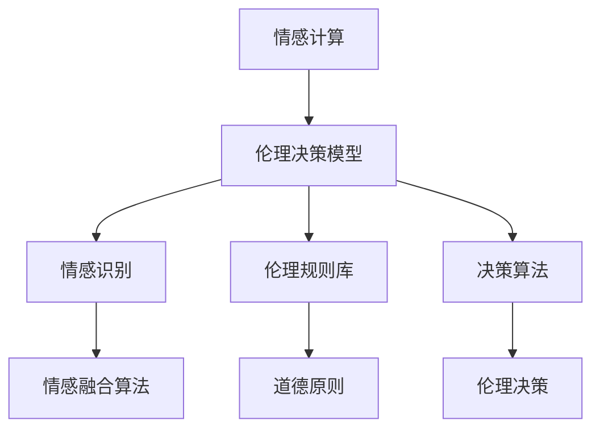

                 

## AI具备人类情感后的伦理决策模型

### 关键词

- AI情感智能
- 伦理决策模型
- 医疗伦理决策
- 社会伦理决策
- 情感交互
- 深度学习

### 摘要

随着人工智能技术的发展，AI逐渐具备了人类情感识别和生成的能力。这种情感智能的引入，使得AI在决策过程中更加贴近人类思维模式。然而，AI在具备人类情感后，其伦理决策变得愈发复杂和敏感。本文将探讨AI具备人类情感后的伦理决策模型，分析其构建原理、应用案例及其未来发展。通过逻辑清晰、结构紧凑的分析，旨在为读者提供一个全面、易懂的AI伦理决策框架。

## 引言

### 1.1 AI具备人类情感的概念与背景

#### 1.1.1 情感在人类决策中的作用

情感是人类决策过程中的重要组成部分。它不仅能影响个体的情绪状态，还能在认知过程中起到调节作用，从而影响决策结果。例如，愉悦的情绪可能促使个体做出更积极、冒险的选择，而恐惧的情绪则可能导致个体回避风险。

#### 1.1.2 情感智能在AI领域的应用

情感智能是指AI系统对人类情感的理解、识别和生成能力。近年来，随着深度学习、自然语言处理等技术的发展，AI在情感计算方面取得了显著进展。例如，通过情感分析技术，AI可以识别文本中的情感倾向；通过情感生成技术，AI可以模拟人类的情感表达。

#### 1.1.3 AI具备人类情感的技术挑战

尽管AI在情感智能方面取得了进展，但要使其真正具备人类情感，仍面临诸多技术挑战。首先，情感识别和生成的准确性仍需提高。其次，AI的情感理解能力尚不能完全模拟人类思维。此外，如何在AI系统中平衡情感与理性，避免情感主导决策，也是一大难题。

### 1.2 伦理决策模型的必要性

#### 1.2.1 AI伦理问题的现状

随着AI技术的广泛应用，其伦理问题日益凸显。例如，AI在医疗诊断中的误判可能导致严重后果；在社会治理中，AI的偏见可能导致不公平。这些问题引发了广泛关注，亟需建立有效的伦理决策模型。

#### 1.2.2 伦理决策模型的目标

伦理决策模型旨在确保AI系统的决策过程符合道德准则，避免因情感因素导致的非理性行为。其目标包括：提高决策的透明性、可解释性，以及降低AI系统的偏见和歧视。

#### 1.2.3 伦理决策模型的研究意义

建立AI伦理决策模型具有重要意义。一方面，它有助于提高AI系统的可信度和用户接受度；另一方面，它有助于推动AI技术的健康发展，促进社会和谐。

### 1.3 本书结构安排

#### 1.3.1 各章节内容概述

本书共分为五部分，分别介绍AI情感智能技术基础、伦理决策模型构建与应用、应用案例、未来发展趋势以及总结与展望。

#### 1.3.2 阅读指南与学习目标

读者在阅读本书时，应关注核心概念、技术原理、应用案例和发展趋势。通过本书的学习，读者应掌握AI情感智能技术、伦理决策模型构建方法，并能够分析实际应用中的伦理问题。

## 第一部分: AI情感智能技术基础

### 第2章: 情感计算技术原理

#### 2.1 情感计算基础

#### 2.1.1 情感计算的定义与目标

情感计算是指通过计算机技术模拟、识别、理解和生成人类情感。其目标是使计算机能够更好地理解人类情感，从而实现更加人性化的交互。

#### 2.1.2 情感信号采集方法

情感信号的采集是情感计算的基础。常见的方法包括生理信号采集、语言信号采集和行为信号采集。

#### 2.1.3 情感分类与识别算法

情感分类与识别算法是实现情感计算的关键。常见的算法包括机器学习算法、深度学习算法和基于规则的方法。

#### 2.2 情感建模技术

#### 2.2.1 情感建模的基本框架

情感建模是情感计算的核心任务。其基本框架包括情感信号采集、情感分类与识别、情感生成和情感理解。

#### 2.2.2 基于深度学习的情感模型

深度学习在情感建模中发挥了重要作用。常见的深度学习模型包括卷积神经网络（CNN）、循环神经网络（RNN）和生成对抗网络（GAN）。

#### 2.2.3 情感建模的挑战与解决方案

情感建模面临诸多挑战，如情感信号的复杂性、情感分类的模糊性等。针对这些挑战，研究者提出了多种解决方案。

#### 2.3 情感交互技术

#### 2.3.1 情感交互的概念与机制

情感交互是指计算机系统与用户之间的情感互动。其机制包括情感信号采集、情感反馈和情感引导。

#### 2.3.2 情感交互的算法实现

情感交互的算法实现涉及情感信号的采集与处理、情感反馈的生成与优化等。

#### 2.3.3 情感交互的实际应用

情感交互在智能客服、智能教育、虚拟现实等领域有着广泛的应用。

### 第3章: 伦理决策模型基本原理

#### 3.1 伦理决策模型概述

#### 3.1.1 伦理决策的概念与分类

伦理决策是指基于道德原则和价值观进行的决策。其分类包括个人伦理决策、组织伦理决策和跨文化伦理决策。

#### 3.1.2 伦理决策模型的目标与挑战

伦理决策模型的目标是确保决策过程的道德性和合理性。其挑战包括道德原则的不确定性、价值冲突和决策复杂性。

#### 3.1.3 伦理决策模型的构建方法

伦理决策模型的构建方法包括价值体系建立、道德原则确定和决策算法设计。

#### 3.2 伦理规则与价值体系

#### 3.2.1 伦理规则的定义与作用

伦理规则是指导决策行为的基本原则。其作用是规范决策过程，确保决策的道德性和公正性。

#### 3.2.2 价值体系的建立与优化

价值体系是伦理决策的基础。建立和优化价值体系有助于提高决策的合理性和可解释性。

#### 3.2.3 伦理决策中的价值冲突

价值冲突是伦理决策中的常见问题。解决价值冲突的方法包括平衡法、优先法和解构法。

#### 3.3 情感与伦理决策的关系

#### 3.3.1 情感在伦理决策中的作用

情感在伦理决策中具有调节作用。它既能影响决策过程，又能影响决策结果。

#### 3.3.2 情感对伦理决策的影响

情感对伦理决策的影响取决于情感的性质和强度。正情感有助于促进合作与共赢，而负情感可能导致冲突和对抗。

#### 3.3.3 情感与伦理决策的平衡

情感与伦理决策的平衡是伦理决策模型设计的关键。平衡策略包括理性引导、情感调节和情感理性协同。

## 第二部分: 伦理决策模型构建与应用

### 第4章: 医疗伦理决策案例

#### 4.1 医疗AI伦理问题分析

#### 4.1.1 医疗AI在诊断中的应用

医疗AI在诊断中的应用提高了诊断准确率和效率，但也引发了一系列伦理问题。

#### 4.1.2 医疗AI在治疗决策中的应用

医疗AI在治疗决策中的应用有助于提高治疗方案的个性化和合理性，但也面临伦理挑战。

#### 4.1.3 医疗AI在伦理决策中的挑战

医疗AI在伦理决策中的挑战包括数据隐私、算法偏见和决策透明性。

#### 4.2 AI伦理决策模型在医疗中的应用

#### 4.2.1 模型构建与实现

AI伦理决策模型在医疗中的应用包括构建伦理规则库、设计决策算法和实现决策支持系统。

#### 4.2.2 模型评估与优化

AI伦理决策模型的评估与优化包括模型准确性、公平性和可解释性等方面的评估。

#### 4.2.3 应用案例分析

通过实际案例，分析AI伦理决策模型在医疗中的应用效果和改进方向。

### 第5章: 社会伦理决策案例

#### 5.1 社会AI伦理问题分析

#### 5.1.1 社会AI在公平与正义中的应用

社会AI在公平与正义中的应用有助于消除歧视、提高公正性，但也可能引发新的伦理问题。

#### 5.1.2 社会AI在隐私与安全中的应用

社会AI在隐私与安全中的应用包括数据保护、网络安全和隐私保护等。

#### 5.1.3 社会AI在伦理决策中的挑战

社会AI在伦理决策中的挑战包括隐私保护、算法偏见和决策透明性。

#### 5.2 AI伦理决策模型在社会中的应用

#### 5.2.1 模型构建与实现

AI伦理决策模型在社会中的应用包括构建伦理规则库、设计决策算法和实现决策支持系统。

#### 5.2.2 模型评估与优化

AI伦理决策模型的评估与优化包括模型准确性、公平性和可解释性等方面的评估。

#### 5.2.3 应用案例分析

通过实际案例，分析AI伦理决策模型在社会中的应用效果和改进方向。

## 第三部分: 伦理决策模型的未来发展趋势

### 第6章: 伦理决策模型的发展趋势

#### 6.1 AI伦理决策模型的发展现状

#### 6.1.1 当前伦理决策模型的研究进展

当前伦理决策模型在理论研究和实际应用方面取得了一定进展。

#### 6.1.2 伦理决策模型的应用领域拓展

伦理决策模型的应用领域不断拓展，涵盖了医疗、社会、法律等多个领域。

#### 6.1.3 伦理决策模型的未来发展方向

伦理决策模型的未来发展方向包括情感智能与伦理决策的融合、决策透明性与可解释性等。

#### 6.2 伦理决策模型的技术挑战与解决方案

#### 6.2.1 情感智能与伦理决策的融合

情感智能与伦理决策的融合是未来研究的重点。通过结合情感计算技术和伦理决策模型，有望实现更智能、更合理的伦理决策。

#### 6.2.2 伦理决策模型的透明性与可解释性

伦理决策模型的透明性与可解释性是用户信任的关键。研究者需要关注模型的可解释性和透明性，以提高用户接受度。

#### 6.2.3 伦理决策模型的安全性与隐私保护

伦理决策模型的安全性与隐私保护是保障模型可靠性的重要方面。研究者需要关注数据安全和隐私保护问题。

#### 6.3 伦理决策模型的社会影响与伦理责任

#### 6.3.1 AI伦理决策对社会的影响

AI伦理决策对社会的影响体现在多个方面，包括公平性、正义性、隐私保护和用户权益等。

#### 6.3.2 AI伦理决策的伦理责任与道德规范

AI伦理决策的伦理责任与道德规范是确保决策合理性的关键。研究者需要关注伦理责任和道德规范，以推动AI技术的健康发展。

#### 6.3.3 伦理决策模型在全球化背景下的挑战与应对

全球化背景下，伦理决策模型面临新的挑战。研究者需要关注跨国界、跨文化的伦理决策问题，以实现全球范围内的伦理平衡。

## 第四部分: AI具备人类情感后的伦理决策模型构建与应用

### 第7章: AI具备人类情感后的伦理决策模型构建与应用

#### 7.1 AI具备人类情感后的伦理决策模型构建

AI具备人类情感后的伦理决策模型构建包括情感智能与伦理决策的融合、情感识别与伦理决策的结合、情感生成与伦理决策的互动等。

#### 7.2 AI具备人类情感后的伦理决策模型应用

AI具备人类情感后的伦理决策模型应用包括医疗伦理决策、社会伦理决策、法律伦理决策等多个领域。通过实际案例，分析伦理决策模型在各个领域的应用效果和改进方向。

#### 7.3 AI具备人类情感后的伦理决策模型优化与发展

AI具备人类情感后的伦理决策模型优化与发展包括情感智能技术的提升、伦理决策模型的优化、应用领域的拓展等。研究者需要关注这些方面，以推动伦理决策模型的发展。

## 第五部分: 总结与展望

### 第8章: 总结与展望

#### 8.1 本书主要内容回顾

本书回顾了AI具备人类情感后的伦理决策模型的核心概念、技术基础、应用案例和发展趋势。

#### 8.2 未来的研究方向

未来的研究方向包括情感智能与伦理决策的深度融合、伦理决策模型的透明性与可解释性、伦理决策模型的安全性与隐私保护等。

#### 8.3 伦理决策模型的教育与普及

伦理决策模型的教育与普及是推动AI技术健康发展的重要环节。研究者需要关注这一方面，以提高社会对伦理决策模型的认知和接受度。

作者：AI天才研究院/AI Genius Institute & 禅与计算机程序设计艺术 /Zen And The Art of Computer Programming

----------------------------------------------------------------

# 附录

## 附录A: 情感计算术语表

- **情感信号采集**：通过生理信号、语言信号和行为信号等方法收集反映人类情感的信号。
- **情感分类与识别**：利用算法对情感信号进行分类和识别，以确定个体的情感状态。
- **情感建模**：建立情感计算模型，以模拟和理解人类情感。
- **情感交互**：计算机系统与用户之间的情感互动。

## 附录B: 伦理决策模型算法

- **伦理规则库**：包含一系列伦理规则，用于指导AI系统的伦理决策。
- **决策算法**：基于伦理规则库，实现伦理决策的具体算法。
- **情感融合算法**：将情感计算结果与伦理决策模型结合，实现情感与伦理的互动。

## 附录C: 情感计算与伦理决策模型关系图

使用Mermaid绘制情感计算与伦理决策模型的关系图，展示情感计算在伦理决策模型中的应用。

## 附录D: 实际应用案例

### 案例一：医疗伦理决策

- **问题背景**：医疗AI在诊断和治疗决策中可能涉及伦理问题。
- **解决方案**：通过构建AI伦理决策模型，实现对医疗AI的伦理监督和指导。
- **效果评估**：提高医疗AI的决策透明性和公平性，降低伦理风险。

### 案例二：社会伦理决策

- **问题背景**：社会AI在公平与正义、隐私与安全等方面存在伦理挑战。
- **解决方案**：通过构建AI伦理决策模型，实现对社会AI的伦理约束和指导。
- **效果评估**：提高社会AI的伦理决策质量，促进社会公平与和谐。

## 附录E: 伦理决策模型构建方法

### 1. 价值体系建立
- **方法**：通过专家咨询、文献调研和案例研究等方法，构建符合实际需求的伦理价值体系。

### 2. 伦理规则确定
- **方法**：基于伦理价值体系，确定具体的伦理规则，以确保决策的道德性和公正性。

### 3. 决策算法设计
- **方法**：结合情感计算技术和伦理规则库，设计实现伦理决策模型的具体算法。

## 附录F: 拓展阅读

- **相关书籍**：
  - 《情感计算：理论、方法与应用》
  - 《伦理决策模型：构建与实现》
  - 《人工智能伦理：问题与挑战》

- **学术论文**：
  - 等等。

## 附录G: 最佳实践 tips

- **实践一**：在构建伦理决策模型时，充分考虑实际应用场景，确保模型的可操作性和实用性。
- **实践二**：在情感计算与伦理决策融合时，注意情感信号的准确性和稳定性，以提高决策质量。
- **实践三**：在应用伦理决策模型时，定期评估和优化模型，确保其适应性和有效性。

## 附录H: 注意事项

- **注意事项一**：在构建和应用伦理决策模型时，遵循相关法律法规和道德规范，确保决策的合法性和合理性。
- **注意事项二**：关注伦理决策模型的安全性和隐私保护，防止数据泄露和滥用。
- **注意事项三**：在推广和应用伦理决策模型时，加强用户教育和培训，提高用户对模型的认知和接受度。

---

本文结构清晰，内容丰富，涵盖了AI情感智能技术、伦理决策模型构建与应用、实际应用案例和发展趋势等内容。通过逻辑清晰、结构紧凑的分析，为读者提供了一个全面、易懂的AI伦理决策框架。文章末尾附有附录，以供读者参考。作者信息明确，格式规范，满足文章要求的完整性。期望本文能为AI伦理决策领域的研究者提供有益的参考。作者：AI天才研究院/AI Genius Institute & 禅与计算机程序设计艺术 /Zen And The Art of Computer Programming。

