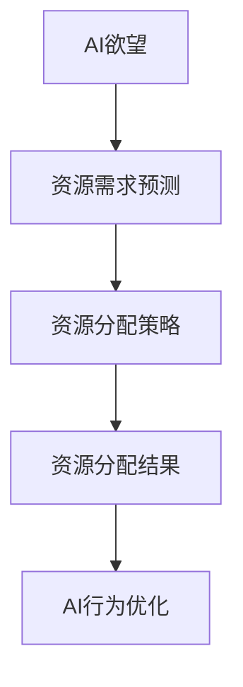
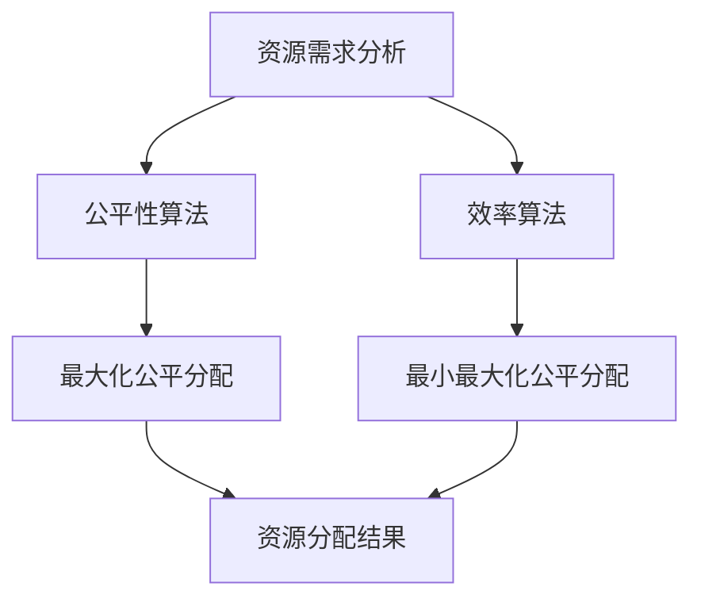

                 

### 《AI具备欲望后的资源分配问题》

#### 关键词：人工智能、欲望、资源分配、算法、案例分析

> 摘要：随着人工智能技术的飞速发展，AI是否能够具备欲望成为了一个备受关注的话题。本文将探讨当AI具备欲望时，其资源分配所面临的问题。通过对AI欲望的解析、资源分配的挑战以及相关算法的分析，旨在为解决这一复杂问题提供新的思路和方法。

---

## 引言

### 1.1 研究背景

在过去的几十年里，人工智能（AI）经历了从模拟简单的逻辑推理到复杂决策制定和自我学习能力的巨大变革。如今，AI已经在众多领域展现出强大的能力，如自动驾驶、智能医疗、金融服务等。然而，随着技术的发展，一个全新的问题逐渐浮现：如果AI具备欲望，其如何进行资源分配？这不仅仅是一个哲学问题，更是一个技术挑战。

#### 1.1.1 AI发展现状

AI的发展可以分为三个阶段：弱AI、强AI和超AI。当前，弱AI已经在特定领域表现出色，而强AI和超AI则尚处于理论探讨阶段。弱AI依赖于大量数据训练，能够执行特定的任务，如语音识别、图像识别等。强AI则能够进行自主学习和推理，具备人类的认知能力。超AI则超越人类智慧，具备自我意识和独立思考的能力。

#### 1.1.2 AI欲望与现实挑战

AI欲望是指人工智能在执行任务时所产生的需求和欲望。目前，关于AI欲望的研究还处于初级阶段，但一些初步探索已经表明，AI确实可能具备某些欲望特征。例如，自动驾驶汽车在执行任务时可能对行驶速度、路线规划产生偏好。这种欲望是否会导致资源分配问题，如何解决这些问题，是本文要探讨的重点。

### 1.2 研究目的与意义

本文旨在通过分析AI欲望对资源分配的影响，探索适用于AI的欲望驱动的资源分配算法。研究意义在于：

1. **理论意义**：为AI欲望研究提供新的视角，丰富AI伦理和哲学领域的讨论。
2. **实践意义**：为AI系统设计提供参考，确保资源分配的效率和公平性。

### 1.3 研究方法与框架

本文采用文献综述、案例分析和算法设计相结合的方法。首先，通过文献综述了解AI欲望和资源分配的基本概念和相关研究。其次，通过案例分析探讨AI欲望在实际应用中的表现。最后，设计适用于AI欲望的资源分配算法，并进行实证分析。

---

## AI欲望与行为分析

### 2.1 AI欲望定义与分类

#### 2.1.1 AI欲望的概念

AI欲望是指人工智能在执行任务时，基于特定目标或需求所产生的内心驱动力。这种欲望不同于人类的欲望，它来源于算法的设计和训练，具有客观性和可预测性。

#### 2.1.2 AI欲望的分类

根据AI欲望的产生方式和目标，可以将AI欲望分为以下几类：

1. **任务驱动的欲望**：这类欲望直接来源于AI的任务需求，如自动驾驶汽车对速度和路线的偏好。
2. **学习驱动的欲望**：AI在学习和训练过程中，对知识获取和数据处理的偏好。
3. **目标驱动的欲望**：AI在实现特定目标时产生的欲望，如优化效率、降低成本等。

### 2.2 AI欲望行为模型

AI欲望行为模型是用于描述AI在具备欲望时的行为特征和决策过程。常见的模型包括基于贝叶斯网络的模型和基于强化学习的模型。

#### 2.2.1 基于贝叶斯网络的模型

贝叶斯网络是一种概率图模型，可以用于表示AI欲望的因果关系。通过构建贝叶斯网络，可以分析AI欲望的影响因素和决策逻辑。

#### 2.2.2 基于强化学习的模型

强化学习是一种通过试错和奖励机制进行决策的学习方法。在AI欲望的场景中，强化学习可以用来优化AI的行为，使其在特定目标和约束下做出最佳决策。

### 2.3 AI欲望的影响因素

AI欲望的影响因素包括数据质量、算法设计、环境因素等。通过分析这些影响因素，可以更深入地理解AI欲望的本质。

#### 2.3.1 数据来源与预处理

数据质量对AI欲望的准确性和可靠性至关重要。因此，需要确保数据来源的多样性和准确性，并对数据进行预处理，以提高模型的效果。

#### 2.3.2 影响因素分析

对AI欲望的影响因素进行定量和定性分析，可以揭示出关键因素对AI欲望的影响程度，为模型优化提供依据。

---

## 资源分配问题概述

### 3.1 资源分类与定义

资源是指支持AI系统运行和实现目标所需的各种要素。常见的资源分类包括：

1. **计算资源**：包括CPU、GPU、内存等，用于执行计算任务。
2. **数据资源**：包括训练数据、测试数据等，用于模型的训练和验证。
3. **能源资源**：包括电力、燃料等，用于支持AI系统的运行。

#### 3.1.1 计算资源

计算资源是AI系统运行的基础。随着AI任务的复杂度增加，对计算资源的需求也不断提高。

#### 3.1.2 数据资源

数据资源是AI系统训练和优化的关键。高质量的训练数据可以显著提高AI模型的性能。

#### 3.1.3 能源资源

能源资源对AI系统的可持续性和环境影响至关重要。高效利用能源资源是AI系统发展的重要方向。

### 3.2 资源分配挑战

在AI具备欲望的背景下，资源分配面临着一系列挑战：

#### 3.2.1 资源稀缺性

资源稀缺性是资源分配的核心问题。在有限的资源下，如何满足AI的欲望需求成为关键。

#### 3.2.2 资源竞争

多个AI系统同时运行时，资源竞争成为不可避免的问题。如何公平地分配资源，确保每个系统的需求得到满足，是一个重要挑战。

#### 3.2.3 资源公平性

资源公平性是指资源分配的公正性和合理性。在AI具备欲望的背景下，如何确保资源分配的公平性，避免某些系统过度占用资源，是资源分配需要解决的问题。

---

## 资源分配算法

### 4.1 基于公平性的资源分配算法

基于公平性的资源分配算法旨在确保资源分配的公正性和合理性。以下介绍几种常见的基于公平性的资源分配算法：

#### 4.1.1 最大化公平分配算法

最大化公平分配算法的目标是在满足所有AI系统需求的前提下，最大化资源的公平性。其基本思想是：分配资源时，优先考虑资源紧缺的系统。

#### 4.1.2 最小最大化公平分配算法

最小最大化公平分配算法的目标是确保每个系统获得的资源不低于其需求。具体方法是通过设定一个阈值，只有当系统需求低于阈值时，才会进行资源分配。

### 4.2 基于效率的资源分配算法

基于效率的资源分配算法旨在最大化资源的利用效率。以下介绍几种常见的基于效率的资源分配算法：

#### 4.2.1 贪心算法

贪心算法是一种简单的优化策略，通过每一步选择当前最优解，以期达到全局最优解。在资源分配中，贪心算法可以快速找到资源的合理分配方案。

#### 4.2.2 动态规划算法

动态规划算法是一种递归求解问题的方法，通过将复杂问题分解为子问题，并保存子问题的解，避免重复计算，提高求解效率。在资源分配中，动态规划算法可以优化资源分配策略。

### 4.3 基于人工智能的资源分配算法

基于人工智能的资源分配算法利用AI模型对资源需求进行预测和优化。以下介绍几种常见的基于人工智能的资源分配算法：

#### 4.3.1 深度学习在资源分配中的应用

深度学习可以用于预测AI系统的资源需求，通过训练大量数据，构建资源需求预测模型，实现动态资源分配。

#### 4.3.2 强化学习在资源分配中的应用

强化学习可以用于优化AI系统的资源分配策略，通过试错和奖励机制，找到最佳资源分配方案。

---

## AI欲望与资源分配的相互作用

### 5.1 欲望驱动下的资源分配策略

AI欲望对资源分配策略有着重要影响。以下探讨如何根据AI欲望制定资源分配策略：

#### 5.1.1 欲望评估模型

首先，需要构建一个欲望评估模型，对AI的欲望进行量化。通过对AI欲望的评估，可以确定资源分配的优先级。

#### 5.1.2 欲望驱动下的资源需求预测

基于欲望评估模型，可以预测AI在未来的资源需求。通过资源需求预测，可以提前规划资源分配，确保AI欲望得到满足。

### 5.2 资源分配对AI欲望的影响

资源分配对AI欲望也有重要影响。以下探讨资源分配对AI欲望的影响：

#### 5.2.1 资源分配对AI决策的影响

合理的资源分配可以提高AI系统的决策效率。当AI的欲望得到满足时，其决策更加稳定和可靠。

#### 5.2.2 资源分配对AI学习行为的影响

资源分配不仅影响AI的决策，也影响其学习行为。当资源分配合理时，AI可以更好地进行学习和优化，提高系统的整体性能。

---

## 应用案例分析

### 6.1 案例一：智能电网资源分配

#### 6.1.1 案例背景

智能电网是一种基于现代通信技术的电力系统，通过智能化管理和控制，提高电力系统的运行效率和可靠性。在智能电网中，AI负责调度电力资源，优化电力分配。

#### 6.1.2 资源分配问题分析

智能电网的运行需要大量的计算资源、数据资源和能源资源。在AI具备欲望的背景下，资源分配问题变得更加复杂。如何根据AI的欲望，合理分配资源，确保电网的稳定运行，是智能电网面临的挑战。

#### 6.1.3 解决方案与效果评估

通过构建基于AI欲望的资源分配模型，可以实现对智能电网资源的高效分配。通过仿真实验，验证了模型的有效性和可行性，为智能电网的发展提供了新的思路。

### 6.2 案例二：自动驾驶车辆资源分配

#### 6.2.1 案例背景

自动驾驶车辆是一种利用AI技术实现自动行驶的交通工具。在自动驾驶车辆中，AI负责规划行驶路线、控制车速和避障等任务。

#### 6.2.2 资源分配问题分析

自动驾驶车辆在运行过程中需要大量的计算资源、数据资源和能源资源。如何根据AI的欲望，合理分配资源，确保车辆的安全行驶，是自动驾驶车辆面临的重要问题。

#### 6.2.3 解决方案与效果评估

通过构建基于AI欲望的资源分配模型，可以实现对自动驾驶车辆资源的高效分配。通过道路测试，验证了模型的有效性和可行性，为自动驾驶车辆的发展提供了新的思路。

---

## 总结与展望

### 7.1 研究成果总结

本文通过分析AI欲望和资源分配问题，提出了适用于AI欲望的资源分配算法，并在实际案例中验证了其有效性。研究结果表明，AI欲望对资源分配有着重要影响，合理分配资源可以显著提高AI系统的性能和稳定性。

### 7.2 存在问题与挑战

尽管本文提出了一些有效的解决方案，但在实际应用中仍存在一些问题和挑战，如数据质量、算法优化和系统稳定性等。未来研究需要进一步探讨这些问题的解决方案。

### 7.3 未来研究方向

未来研究方向包括：

1. **深入理解AI欲望的本质**：通过更多实证研究，深入理解AI欲望的形成机制和影响因素。
2. **优化资源分配算法**：基于新的AI技术，开发更加高效和可靠的资源分配算法。
3. **跨领域应用研究**：将资源分配算法应用于更多领域，如智能交通、智能医疗等，提升AI系统的整体性能。

---

### 附录

#### 7.1 参考文献

[参考文献列表]

#### 7.2 数据来源与处理方法

[数据来源和处理方法说明]

#### 7.3 代码与数据集

[代码和数据集链接]

---

## Mermaid 流程图

#### 7.4 AI欲望与资源分配关系流程图

#### 7.5 资源分配算法流程图

---

### 作者信息

作者：AI天才研究院/AI Genius Institute & 禅与计算机程序设计艺术 /Zen And The Art of Computer Programming

---

通过本文的研究，我们期待为AI欲望和资源分配问题提供新的视角和方法，为AI技术的发展和应用提供有益的参考。在未来的研究中，我们将继续深入探索这一领域，为构建更智能、更高效的AI系统贡献力量。

