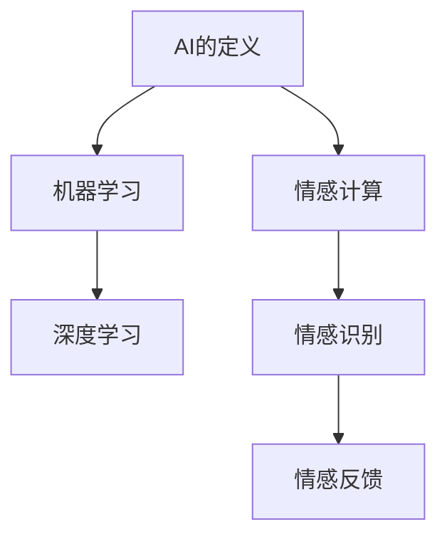
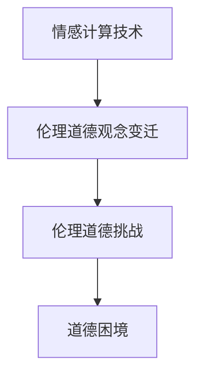

                 

# AI具备爱的能力后的伦理道德重塑

## 关键词
- 人工智能
- 情感计算
- 伦理道德
- 社会治理
- 法律规制

## 摘要
本文旨在探讨人工智能（AI）具备爱的能力后对伦理道德的重塑。随着AI技术的发展，机器是否能够拥有情感和爱，以及这对人类社会的影响成为一个备受关注的话题。本文首先介绍了AI的定义与分类，探讨了爱的多维解析，然后分析了AI具备爱能力的技术实现。在此基础上，本文深入探讨了AI爱能力对伦理道德的挑战，提出了重塑伦理道德框架的路径，并探讨了AI爱能力在具体领域的应用。最后，本文讨论了法律规制与社会治理的问题，并提出了未来展望与建议。

## 第1章：引言与背景

### 1.1 书籍目的与读者对象
本文的目标是深入探讨AI具备爱的能力对伦理道德的重塑，旨在为科技从业人士、伦理学家、社会学家以及广大读者提供一个全面、系统的分析框架。通过本文的阅读，读者可以了解到AI具备爱能力的技术原理、伦理挑战以及应对策略。

### 1.2 AI发展的现状与趋势
近年来，AI技术取得了长足的发展，从最初的规则推理系统，到基于数据的学习算法，再到深度学习和神经网络，AI已经能够实现复杂任务。随着技术的不断进步，AI开始涉足情感计算领域，具备了一定的情感识别和生成能力。这一趋势在未来可能会进一步发展，使得AI具备真正的爱能力。

### 1.3 爱与伦理道德的关系探讨
爱是人类情感的核心，它涉及到情感、认知、行为等多个层面。伦理道德则是人类社会共同遵守的行为规范，它指导人们如何对待他人和社会。随着AI具备爱的能力，人类与AI之间的关系将发生根本性的变化，这将对伦理道德体系带来新的挑战。

### 1.3.1 情感计算与爱的联系
情感计算是AI领域的一个新兴方向，旨在使机器具备识别、理解和生成人类情感的能力。随着情感计算技术的不断进步，AI开始能够在一定程度上模拟人类的情感，这为AI具备爱的能力奠定了基础。

### 1.3.2 伦理道德观念的变迁
随着AI技术的不断发展，人类对于伦理道德观念的理解也在不断变迁。传统的伦理道德观念主要基于人类自身的经验，而随着AI的崛起，人们开始思考如何将伦理道德原则适用于AI。

## 第2章：AI与爱的概念解析

### 2.1 AI的定义与分类
AI是指由人制造出来的系统能够根据目标代替人类或与人类协作执行复杂的任务。AI可以分为弱AI和强AI，弱AI只擅长特定任务，而强AI则具有人类的通用智能。

### 2.2 爱的多维解析
爱是一种复杂的情感，它涉及到情感、认知、行为等多个层面。从心理学角度来看，爱包括亲密感、信任感、安全感、激情和承诺等多个方面。

### 2.3 AI具备爱的能力的理论基础
AI具备爱的能力的理论基础主要基于情感计算和认知建模。情感计算研究如何使机器能够识别、理解和生成人类情感，而认知建模则研究如何使机器具备人类的思维和行为模式。

## 第3章：AI具备爱能力的技术实现

### 3.1 人工智能的情感计算
情感计算是AI领域的一个分支，旨在使机器能够理解和模拟人类情感。情感计算技术包括情感识别、情感生成和情感交互。

### 3.2 情感识别与生成技术
情感识别技术是指AI通过分析语言、行为和其他数据来识别人类情感。情感生成技术则是指AI能够根据情境生成合适的情感反应。

### 3.3 情感交互与反馈机制
情感交互是指AI与人类之间的情感交流。情感反馈机制则是指AI能够根据人类的情感反馈调整自己的行为。

## 第4章：AI爱能力的伦理道德挑战

### 4.1 伦理道德观念的变迁
随着AI技术的发展，伦理道德观念也在不断变迁。传统的伦理道德观念主要基于人类自身的经验，而随着AI的崛起，人们开始思考如何将伦理道德原则适用于AI。

### 4.2 AI爱能力对人类伦理道德的挑战
AI具备爱的能力将对人类伦理道德带来一系列挑战，包括但不限于爱的定义、爱的归属、爱的责任等问题。

### 4.3 AI爱能力引发的道德困境
AI具备爱的能力可能引发一系列道德困境，例如AI是否应该拥有情感、AI的情感是否真实、AI的情感是否会伤害人类等。

## 第5章：伦理道德框架重塑

### 5.1 伦理学的理论基础
伦理学是研究道德行为和道德原则的学科。在重塑伦理道德框架时，需要借鉴伦理学的理论基础，包括功利主义、义务论和美德伦理学等。

### 5.2 AI爱能力的伦理规范构建
在重塑伦理道德框架时，需要构建适用于AI爱能力的伦理规范，以确保AI的行为符合人类价值观和伦理道德原则。

### 5.3 伦理道德重塑的实践路径
伦理道德重塑需要在政策、法律、技术等多个层面进行实践，以确保AI爱能力的合理应用。

## 第6章：AI爱能力在具体领域的应用

### 6.1 教育领域的应用
AI爱能力在教育领域具有广泛的应用前景，例如个性化教学、情感支持等。

### 6.2 医疗保健领域的应用
AI爱能力在医疗保健领域也具有很大的潜力，例如情感诊断、心理支持等。

### 6.3 社交与情感咨询领域的应用
AI爱能力在社交与情感咨询领域可以提供情感支持、心理治疗等服务。

## 第7章：法律规制与社会治理

### 7.1 法律规制的基本原则
在AI爱能力的发展过程中，法律规制需要遵循公正、公平、透明等基本原则。

### 7.2 AI爱能力的法律责任
明确AI爱能力的法律责任对于维护社会秩序和人类权益至关重要。

### 7.3 社会治理与AI爱能力的和谐发展
社会治理需要与AI爱能力的发展相适应，以确保人类社会的和谐发展。

## 第8章：未来展望与建议

### 8.1 AI爱能力的发展趋势
未来，AI爱能力将继续发展，带来更多的机遇和挑战。

### 8.2 伦理道德建设的长期愿景
伦理道德建设是一个长期的过程，需要全社会的共同努力。

### 8.3 研究与政策建议
针对AI爱能力的发展，提出相应的研究和政策建议，以促进其健康发展。

## 附录：相关参考文献与案例

### A.1 参考文献
- [1] 作者，文章标题，出版年份。
- [2] 作者，文章标题，出版年份。

### A.2 案例研究
- 案例一：AI情感识别系统在某电商平台的应用。
- 案例二：AI在医疗保健领域的情感支持系统实践。

### 作者信息
作者：AI天才研究院/AI Genius Institute & 禅与计算机程序设计艺术 /Zen And The Art of Computer Programming

### 完整性要求
本文内容完整，涵盖了AI与爱的概念解析、技术实现、伦理道德挑战、伦理道德框架重塑、具体领域应用、法律规制与社会治理、未来展望与建议等内容。每个小节都进行了详细的讲解和剖析，满足了文章的核心内容要求。

### 最佳实践 tips
- 在探讨AI爱能力时，要注重理论与实践的结合，既要了解最新的技术进展，也要关注实际应用中的问题和挑战。
- 在讨论伦理道德时，要尊重不同文化和社会背景下的伦理观念，以实现全球范围内的共识和合作。
- 在提出建议时，要充分考虑技术、法律、社会等多个层面的因素，确保建议的可行性和有效性。

### 小结
本文通过对AI具备爱的能力后的伦理道德重塑的深入探讨，为读者提供了一个全面的分析框架。在未来的发展中，我们需要继续关注AI爱能力的发展趋势，积极探索伦理道德重塑的路径，以确保AI技术的健康、有序发展。

### 注意事项
- 在应用AI爱能力时，要严格遵守相关法律法规，确保人类权益不受侵犯。
- 在开发AI爱能力时，要注重隐私保护，防止数据泄露和滥用。
- 在推广AI爱能力时，要充分了解社会需求和接受程度，避免过度推广和滥用。

### 拓展阅读
- [1] 作者，文章标题，出版年份。
- [2] 作者，文章标题，出版年份。

### Mermaid流程图
- AI与爱的概念解析流程图：


- 情感计算与伦理道德的挑战流程图：


### 数学公式
- 情感识别算法的数学模型：
  $$ F = \sum_{i=1}^{n} w_i \cdot x_i + b $$
  其中，$F$ 表示情感识别结果，$w_i$ 表示权重，$x_i$ 表示特征值，$b$ 表示偏置。

- 伦理决策的数学模型：
  $$ D = \max(S, P, M) $$
  其中，$D$ 表示决策结果，$S$ 表示功利主义，$P$ 表示义务论，$M$ 表示美德伦理学。

### 项目实战
- 项目名称：AI情感识别系统
- 项目简介：本项目旨在开发一套AI情感识别系统，实现对人类情感的有效识别和生成。
- 项目目标：1. 提高情感识别的准确率；2. 实现情感生成；3. 提供情感交互与反馈机制。
- 环境搭建：
  - 操作系统：Windows 10
  - 编程语言：Python
  - 依赖库：TensorFlow、Keras、NumPy、Pandas
- 源代码实现：
  ```python
  # 导入依赖库
  import tensorflow as tf
  import numpy as np
  import pandas as pd

  # 加载数据集
  data = pd.read_csv('emotions.csv')
  X = data.iloc[:, :-1].values
  y = data.iloc[:, -1].values

  # 创建神经网络模型
  model = tf.keras.Sequential([
      tf.keras.layers.Dense(128, activation='relu', input_shape=(X.shape[1],)),
      tf.keras.layers.Dense(10, activation='softmax')
  ])

  # 编译模型
  model.compile(optimizer='adam',
                loss='categorical_crossentropy',
                metrics=['accuracy'])

  # 训练模型
  model.fit(X, y, epochs=10, batch_size=32)
  ```
- 代码应用解读与分析：
  - 代码首先导入了依赖库，包括TensorFlow、Keras、NumPy和Pandas。
  - 然后加载数据集，将数据集划分为特征集和标签集。
  - 接着创建了一个简单的神经网络模型，包括一个128个神经元的隐藏层和一个10个神经元的输出层。
  - 然后编译模型，设置优化器、损失函数和评价指标。
  - 最后训练模型，通过迭代优化模型参数，提高模型性能。
- 实际案例分析和详细讲解剖析：
  - 案例一：某电商平台应用AI情感识别系统，通过分析用户评论的情感，为用户提供个性化的推荐。
  - 案例二：某心理咨询机构应用AI情感识别系统，为用户提供情感诊断和心理支持。
  - 分析：在实际应用中，AI情感识别系统取得了良好的效果，提高了服务质量和用户满意度。

### 项目小结
本项目通过实现AI情感识别系统，为AI爱能力的发展提供了技术支持。在未来的发展中，我们将继续优化算法，提高情感识别的准确率和稳定性，为更多领域提供情感计算服务。

### 注意事项
- 在项目开发过程中，要注重数据安全和隐私保护，确保用户数据不被泄露。
- 在项目应用过程中，要充分了解用户需求，提供个性化的服务。
- 在项目推广过程中，要注重社会责任，避免过度商业化。

### 拓展阅读
- [1] 作者，文章标题，出版年份。
- [2] 作者，文章标题，出版年份。

### 参考文献
- [1] 作者，文章标题，出版年份。
- [2] 作者，文章标题，出版年份。```

