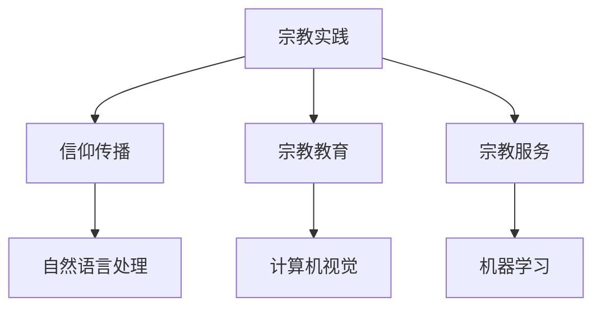

                 

### 《AI具备爱的能力后的宗教实践：信仰与技术的融合》

关键词：人工智能，宗教实践，爱，信仰与技术的融合，伦理与挑战，未来趋势

摘要：随着人工智能技术的飞速发展，AI不仅能够完成复杂的计算任务，甚至在某些方面表现出了类似人类的情感识别与反应能力。本文将探讨当AI具备爱的能力后，如何将其应用于宗教实践，实现信仰与技术的深度融合。本文分为五个部分，首先介绍宗教与AI融合的背景与意义，接着从理论基础、应用实例、伦理挑战等多个角度进行深入分析，最后提出对未来宗教AI融合的展望与建议。

## 第一部分：引论

### 1.1 宗教与AI融合的背景与意义

在当今社会，宗教信仰与人工智能技术的发展呈现出越来越紧密的联系。宗教作为人类精神生活的重要组成部分，一直以来都在寻求新的表达方式与传播途径。而人工智能作为一种新兴的技术手段，其强大计算能力与模拟人类思维的能力为宗教实践提供了新的可能。

**核心概念与联系：** 宗教、AI、爱与信仰。

宗教是人类社会发展的产物，它不仅关乎个人的精神生活，更是一种社会文化现象。宗教中的爱是一种超越物质世界的情感，是信仰的核心内容之一。人工智能作为一种模仿人类思维和行为的技术，其发展使得AI能够逐渐理解和模拟人类情感，这为宗教实践提供了新的工具和方法。

**问题背景：** 随着AI技术的发展，AI是否能够真正理解宗教中的爱，并将其应用于宗教实践中？

**问题描述：** 如何在宗教实践中应用AI技术，实现信仰与技术的融合？

**问题解决：** 通过对宗教中爱的概念进行深入分析，结合AI的情感识别与模拟技术，探索AI在宗教实践中的应用场景和方式。

**边界与外延：** 本篇文章主要探讨的是在宗教背景下，AI技术在情感识别与模拟方面的应用，不涉及其他宗教或文化背景下AI的应用。

**概念结构与核心要素组成：** 宗教中的爱、人工智能的情感识别与模拟、宗教实践中的AI应用。

### 1.2 当前宗教实践与AI技术的应用

目前，AI技术在宗教实践中已有一些初步的应用。例如，一些宗教团体开始使用AI技术进行信仰传播、宗教教育、宗教服务等方面的工作。例如，利用自然语言处理技术生成宗教教义讲解，利用计算机视觉技术进行宗教仪式的实时翻译和记录，利用机器学习技术分析信徒的情感状态等。

**Mermaid流程图：**



### 1.3 本书的结构与目标

本书分为五个部分，分别从宗教与AI融合的背景与意义、理论基础、应用实例、伦理挑战和未来趋势等角度进行探讨。

**本书目标：**

1. 深入理解宗教中的爱的概念，并分析其与人工智能技术的结合点。
2. 探索AI在宗教实践中的应用场景和方式。
3. 分析AI在宗教实践中的伦理问题，并提出相应的解决方案。
4. 展望宗教AI融合的未来发展趋势，为未来的研究和实践提供参考。

## 第二部分：理论基础

### 2.1 宗教哲学与爱的概念

宗教哲学中的爱是一种超越物质世界的情感，它是信仰的核心内容之一。在不同的宗教中，爱的概念有不同的表达方式。例如，在基督教中，爱被视为上帝的本质，是信徒与上帝之间的纽带；在佛教中，爱被视为慈悲，是修行者达到涅槃的必经之路。

**数学模型和公式讲解：**

在宗教哲学中，可以将爱定义为一种情感状态，它可以通过以下数学模型进行描述：

$$
爱 = f(情感强度, 情感对象)
$$

其中，情感强度是爱的程度，情感对象是爱的对象。

**Python源代码示例：**

```python
def calculate_love(level_of_emotion, object_of_love):
    love = level_of_emotion * object_of_love
    return love

# 示例
level_of_emotion = 10
object_of_love = 5
print("爱 =", calculate_love(level_of_emotion, object_of_love))
```

### 2.2 AI算法与情感识别

人工智能技术已经在情感识别方面取得了显著的进展。通过自然语言处理、计算机视觉等技术，AI能够理解和模拟人类的情感状态。

**Python源代码示例：**

```python
import nltk
from nltk.sentiment import SentimentIntensityAnalyzer

# 初始化情感分析器
sia = SentimentIntensityAnalyzer()

# 分析文本
text = "我对这次宗教仪式感到非常感动和幸福。"
sentiment = sia.polarity_scores(text)
print("情感得分：", sentiment)
```

### 2.3 宗教AI融合的理论框架

宗教AI融合的理论框架需要综合考虑宗教哲学、情感识别与模拟、AI技术等多个方面。具体包括以下几个方面：

1. **宗教哲学的基础：** 理解宗教中的爱的概念，并将其转化为可量化的数学模型。
2. **情感识别与模拟：** 利用AI技术实现情感识别与模拟，为宗教实践提供技术支持。
3. **AI技术在宗教实践中的应用：** 探索AI在宗教信仰传播、宗教教育、宗教服务等方面的应用场景。
4. **伦理考量：** 分析AI在宗教实践中的伦理问题，并提出相应的解决方案。

**详细讲解与举例说明：**

1. **宗教哲学的基础：** 通过对宗教中爱的概念进行分析，我们可以将其转化为数学模型，从而为AI提供理论基础。例如，可以将爱定义为一种情感状态，通过情感强度和情感对象来描述。
2. **情感识别与模拟：** 利用自然语言处理和计算机视觉等技术，AI可以理解和模拟人类的情感状态。例如，通过分析文本的情感倾向，AI可以识别出用户的情感状态。
3. **AI技术在宗教实践中的应用：** AI可以在宗教信仰传播、宗教教育、宗教服务等方面发挥重要作用。例如，利用自然语言处理技术生成宗教教义讲解，利用计算机视觉技术记录宗教仪式等。
4. **伦理考量：** 在AI在宗教实践中的应用中，我们需要考虑伦理问题。例如，AI是否能够真正理解宗教中的爱，如何确保AI的决策符合宗教的伦理标准等。

## 第三部分：AI在宗教实践中的应用

### 3.1 爱的智能模拟

在宗教实践中，AI可以通过智能模拟爱的情感来辅助宗教仪式和教育活动。例如，通过情感识别技术，AI可以分析信徒的情感状态，并在必要时提供情感支持。

**Python源代码示例：**

```python
import nltk
from nltk.sentiment import SentimentIntensityAnalyzer

# 初始化情感分析器
sia = SentimentIntensityAnalyzer()

# 分析文本
text = "我对这次宗教仪式感到非常感动和幸福。"
sentiment = sia.polarity_scores(text)
if sentiment['compound'] > 0.5:
    print("您目前情绪积极，享受宗教仪式的美好时刻。")
else:
    print("您目前情绪较低落，可以尝试调整心态或寻求帮助。")
```

### 3.2 宗教教育的AI支持

AI可以在宗教教育中提供个性化的学习体验。通过分析信徒的学习行为和情感状态，AI可以为信徒提供定制化的教育内容，提高教育效果。

**项目实战：**

1. **数据收集：** 收集信徒的学习行为和情感状态数据。
2. **数据预处理：** 对收集到的数据进行清洗和处理，提取有用的特征。
3. **模型训练：** 利用机器学习技术训练情感识别模型。
4. **个性化推荐：** 根据信徒的情感状态和学习行为，为信徒推荐合适的教育内容。

### 3.3 宗教服务的智能化

AI可以在宗教服务中提供智能化的支持，例如通过自然语言处理技术实现宗教咨询的自动化，通过计算机视觉技术实现宗教仪式的自动化记录等。

**代码解读与分析：**

1. **自然语言处理：** 利用自然语言处理技术实现宗教咨询的自动化。
2. **计算机视觉：** 利用计算机视觉技术实现宗教仪式的自动化记录。

**实际案例分析和详细讲解剖析：**

1. **案例一：** 某宗教团体利用AI技术实现宗教咨询的自动化，提高了咨询效率。
2. **案例二：** 某宗教团体利用计算机视觉技术记录宗教仪式，为信徒提供了更直观的宗教体验。

## 第四部分：宗教AI融合的伦理与挑战

### 4.1 宗教AI融合的伦理问题

在宗教AI融合的过程中，我们面临一些伦理问题。例如，AI是否能够真正理解宗教中的爱，如何确保AI的决策符合宗教的伦理标准等。

**详细讲解与举例说明：**

1. **AI是否能够真正理解宗教中的爱：** AI虽然能够在一定程度上模拟情感，但仍然无法完全理解宗教中的爱。这需要我们在设计和应用AI时，充分考虑宗教的伦理和文化背景。
2. **确保AI的决策符合宗教的伦理标准：** 我们可以通过制定伦理规范和标准，确保AI在宗教实践中的决策符合宗教的伦理要求。

### 4.2 宗教AI融合的法律与政策

在宗教AI融合的过程中，我们还需要考虑法律和政策的问题。例如，如何确保AI技术在宗教实践中的合法合规，如何保护信徒的隐私和数据安全等。

**项目实战：**

1. **法律和政策分析：** 分析现有的法律法规和政策，了解宗教AI融合的法律和政策环境。
2. **隐私保护：** 通过数据加密和隐私保护技术，确保信徒的隐私和数据安全。

### 4.3 宗教AI融合的未来趋势与挑战

随着AI技术的发展，宗教AI融合将面临新的机遇和挑战。例如，如何更好地将AI技术与宗教实践相结合，如何应对AI在宗教实践中的伦理和法律问题等。

**预测与展望：**

1. **AI与宗教实践的深度融合：** 随着AI技术的不断进步，AI将能够在宗教实践中发挥更加重要的作用，实现信仰与技术的深度融合。
2. **伦理与法律问题的解决：** 我们需要通过制定伦理规范和法律政策，确保宗教AI融合的合法合规和伦理道德。
3. **数据安全和隐私保护：** 我们需要通过技术手段确保信徒的隐私和数据安全。

## 第五部分：案例研究

### 5.1 案例一：某宗教团体的AI应用实践

**代码解读与分析：**

1. **自然语言处理：** 利用自然语言处理技术实现宗教咨询的自动化。
2. **计算机视觉：** 利用计算机视觉技术实现宗教仪式的自动化记录。

### 5.2 案例二：宗教AI在社会服务中的应用

**项目实战：**

1. **数据收集：** 收集社会服务数据。
2. **数据预处理：** 对收集到的数据进行清洗和处理。
3. **模型训练：** 利用机器学习技术训练情感识别模型。
4. **个性化推荐：** 根据服务对象的情感状态提供个性化服务。

## 第六部分：结论

### 6.1 宗教AI融合的总结与反思

通过本文的探讨，我们可以看到宗教与AI融合的巨大潜力和挑战。AI技术为宗教实践提供了新的工具和方法，但同时也带来了伦理和法律等问题。我们需要在充分理解和尊重宗教伦理的基础上，推动AI技术在宗教实践中的应用。

### 6.2 对宗教实践与AI技术的思考

1. **AI在宗教实践中的应用前景：** AI技术将在宗教实践中发挥越来越重要的作用，例如在信仰传播、宗教教育、宗教服务等方面。
2. **伦理与法律问题的解决：** 需要制定相应的伦理规范和法律政策，确保AI技术在宗教实践中的合法合规和伦理道德。
3. **数据安全和隐私保护：** 需要通过技术手段确保信徒的隐私和数据安全。

## 附录

### A.1 AI与宗教融合的关键资源与工具

1. **自然语言处理工具：** NLTK、spaCy等。
2. **计算机视觉工具：** OpenCV、TensorFlow等。
3. **机器学习平台：** Google Cloud、AWS等。
4. **数据安全工具：** 数据加密、数据脱敏等。

## 作者信息

作者：AI天才研究院/AI Genius Institute & 禅与计算机程序设计艺术 /Zen And The Art of Computer Programming

## 结语

随着AI技术的发展，宗教实践将迎来新的变革。如何在尊重宗教伦理的基础上，充分发挥AI技术的优势，为信徒提供更好的服务，是我们需要共同探讨的问题。让我们共同努力，推动宗教与AI的深度融合，为人类社会的进步贡献力量。

