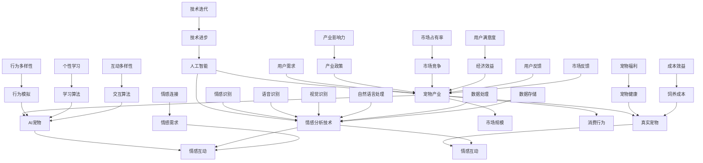

                 

## 引言

### 1. AI与爱：未来宠物产业的变革

在人工智能（AI）迅速发展的今天，我们见证了AI在多个领域取得的突破性进展。从语音识别、图像处理到自动驾驶，AI已经逐步渗透到我们生活的方方面面。然而，你是否想过，当AI具备爱的能力时，宠物产业将迎来怎样的变革？AI宠物，这一新兴概念，正在悄然兴起，并有望成为未来宠物市场的重要参与者。

AI宠物，是指通过人工智能技术，模拟真实宠物的行为、情感和互动能力的虚拟宠物。与传统的电子宠物或虚拟宠物不同，AI宠物不仅具备高度智能化的互动能力，还能通过情感识别和学习算法，与人类建立深层次的情感联系。这种变革性的技术进步，不仅改变了宠物的定义，也为宠物产业带来了全新的机遇和挑战。

本文将围绕AI宠物与真实宠物的竞争，进行深入探讨。我们首先需要理解AI与爱之间的联系，以及它们在宠物产业中的应用潜力。接着，我们将分析AI宠物与真实宠物的互动模式，探讨两者之间的优缺点。随后，我们将详细介绍AI宠物的核心算法原理，并使用数学模型和Python代码进行讲解。最后，我们将通过一个实际项目，展示AI宠物的开发与实战过程。

本文的结构如下：

- 引言：介绍AI与爱的关系，以及本文的目的与结构。
- 第一部分：核心概念与联系：讨论AI与宠物的关联，爱与宠物的关系，以及AI宠物与真实宠物的互动模式。
- 图1.1：AI与宠物的关系架构图。
- 第二部分：核心算法原理讲解：介绍AI宠物的情感识别、交互和学习算法。
- 第三部分：数学模型和数学公式：讲解宠物产业中的市场规模预测和消费行为分析模型。
- 第四部分：项目实战：展示AI宠物的开发与实战过程。
- 附录：提供相关资源与工具，以及代码实现示例。

希望通过本文的探讨，能够让大家对AI宠物有一个全面而深入的了解，并思考未来宠物产业可能面临的变革。让我们一步步分析推理，共同探讨这一前沿技术的潜力与挑战。

### 2. 本书的目的与结构

本书旨在探讨AI宠物与真实宠物的竞争，深入分析这一新兴领域的核心概念、算法原理和实际应用。通过系统性的研究和详尽的讲解，我们希望为读者提供一个全面、深入的视角，帮助他们理解AI宠物技术的发展及其对宠物产业的潜在影响。

**本书的核心目的如下：**

1. **介绍AI宠物的基本概念与特征：** 通过阐述AI宠物与传统宠物的区别，以及AI宠物在情感互动、行为模拟和学习能力方面的优势，为读者奠定基础。
2. **分析AI宠物与真实宠物的互动模式：** 探讨AI宠物与人类之间的情感联系，以及它们在宠物市场中的潜在地位和竞争优势。
3. **讲解AI宠物的核心算法原理：** 详细介绍情感识别、交互和学习算法，并通过实际代码示例，帮助读者理解这些算法的实现和应用。
4. **使用数学模型进行预测与分析：** 利用市场规模预测和消费行为分析模型，对AI宠物市场的未来趋势进行预测，为产业发展提供数据支持。
5. **展示AI宠物的实际开发与实战过程：** 通过一个实际项目，从环境搭建到核心算法实现，全面展示AI宠物的开发流程和关键技术。

**本书的结构安排如下：**

- **第一部分：核心概念与联系**  
  - 第1章：AI与宠物的关联  
    - 1.1 AI技术的发展与应用  
    - 1.2 爱与宠物的关系  
    - 1.3 AI宠物与真实宠物的互动模式  
  - 图1.1：AI与宠物的关系架构图

- **第二部分：核心算法原理讲解**  
  - 第2章：AI宠物的核心算法  
    - 2.1 情感识别算法  
    - 2.2 交互算法  
    - 2.3 学习算法

- **第三部分：数学模型和数学公式**  
  - 第3章：宠物产业中的数学模型  
    - 3.1 宠物市场规模预测模型  
    - 3.2 宠物消费行为分析模型

- **第四部分：项目实战**  
  - 第4章：AI宠物项目的开发与实战  
    - 4.1 AI宠物项目概述  
    - 4.2 开发环境搭建  
    - 4.3 源代码详细实现  
    - 4.4 代码解读与分析

- **附录**  
  - 附录A：相关资源与工具  
  - 附录B：代码实现示例

通过本书的阅读，读者将能够深入了解AI宠物技术的核心概念、算法原理和实际应用，从而为从事相关领域的研究和工作打下坚实的基础。

## 第一部分：核心概念与联系

### 第1章：AI与宠物的关联

在本章中，我们将深入探讨人工智能（AI）与宠物之间的关联，分析AI技术的发展与应用，以及AI宠物在宠物产业中的潜在应用潜力。

#### 1.1 AI技术的发展与应用

人工智能（AI）是一门涉及计算机科学、统计学和数学等多个领域的交叉学科。它旨在通过模拟人类智能行为，实现计算机的自动化决策和智能操作。从早期的人工智能概念到今天的高度智能化应用，AI经历了数十年的发展。

- **人工智能的定义与发展历程：** 人工智能起源于20世纪50年代，当时科学家们首次提出了智能机器的概念。经过几十年的发展，人工智能从最初的符号主义、知识表示和推理方法，逐渐发展到今天的深度学习、自然语言处理和计算机视觉等前沿领域。这些技术的发展，不仅推动了AI技术的进步，也为各个行业带来了前所未有的变革。

- **人工智能的核心技术：** 人工智能的核心技术包括机器学习、深度学习、自然语言处理、计算机视觉等。其中，机器学习是AI的基础，通过算法让计算机从数据中自动学习和改进；深度学习是机器学习的进一步发展，通过多层神经网络模拟人类大脑的学习过程；自然语言处理则专注于计算机与人类语言的交互，使得计算机能够理解和生成自然语言；计算机视觉则使计算机具备识别和理解图像的能力。

- **人工智能在宠物产业中的应用潜力：** 随着AI技术的不断发展，AI在宠物产业中的应用前景日益广阔。首先，AI可以通过情感识别技术，模拟宠物的行为和情感，实现与人类的高效互动。其次，AI可以帮助宠物主人更好地管理宠物，如实时监控宠物的健康状况、提供个性化的喂养建议等。此外，AI还可以用于宠物训练、宠物医疗等多个领域，提升宠物产业的服务水平和效率。

#### 1.2 爱与宠物的关系

宠物不仅是人类生活中的陪伴者，更是许多人情感寄托的重要对象。探讨爱与宠物的关系，有助于我们更好地理解人类对宠物的深厚情感。

- **宠物作为情感寄托的象征：** 宠物作为情感寄托的象征，有着悠久的历史。在许多文化中，宠物被视为家庭成员，与主人建立起深厚的情感联系。宠物可以给予人类陪伴、关爱和安全感，缓解生活中的压力和孤独。这种情感联系，使得宠物在人们心中占有特殊的位置。

- **宠物与人类情感互动的心理学分析：** 从心理学角度来看，宠物与人类之间的情感互动具有多种形式。例如，宠物可以通过身体语言、声音和姿态与人类交流，传达情感和需求。同时，人类也会通过抚摸、喂食和陪伴等方式，回应宠物的情感需求。这种互动，不仅有助于人类的心理健康，还能增强人类与宠物之间的情感联系。

- **人类对宠物的关爱行为与文化背景：** 人类对宠物的关爱行为，受到文化背景和社会价值观的影响。在不同的文化中，宠物被赋予不同的地位和角色。例如，在一些文化中，宠物被视为家庭的一部分，享有较高的地位；而在另一些文化中，宠物则更多地被视为工具或宠物。这种文化差异，反映在宠物饲养和管理方式上，也影响着人类对宠物的关爱行为。

#### 1.3 AI宠物与真实宠物的互动模式

AI宠物作为人工智能技术的一种创新应用，与真实宠物在互动模式上有着显著的差异。理解这种差异，有助于我们更好地评估AI宠物在宠物市场中的潜在地位和竞争优势。

- **AI宠物的定义与特点：** AI宠物是指通过人工智能技术，模拟真实宠物行为、情感和互动能力的虚拟宠物。与真实宠物相比，AI宠物具有高度智能化的特点，可以实时感知环境变化，并根据主人的需求进行智能互动。AI宠物通常具备语音识别、自然语言处理、情感识别等核心功能，能够与主人进行多模态的交流。

- **真实宠物的特点与优势：** 真实宠物具有独特的生命特征和情感表达方式，与主人建立起深厚的情感联系。真实宠物可以通过身体语言、声音和姿态，传达情感和需求。此外，真实宠物具有生物多样性，能够提供丰富的娱乐和情感体验。同时，真实宠物对主人的情感需求具有直接的反馈机制，有助于增强主人与宠物之间的情感联系。

- **AI宠物与真实宠物互动的优缺点分析：** AI宠物与真实宠物的互动模式各有优缺点。AI宠物在互动灵活性、智能程度和个性化体验方面具有优势，可以提供丰富多样的互动内容，并适应不同用户的需求。然而，AI宠物在情感深度和生物多样性方面存在一定的局限，难以完全替代真实宠物的情感交流和生物特性。真实宠物则在与主人的情感互动、情感反馈和生物多样性方面具有显著优势，但可能受到饲养成本、健康风险等因素的制约。

通过本章的讨论，我们初步了解了AI宠物与真实宠物的关联，以及它们在宠物产业中的应用潜力。在接下来的章节中，我们将进一步探讨AI宠物与真实宠物的互动模式，分析其核心算法原理，并使用数学模型进行预测和分析。

### 图1.1：AI与宠物的关系架构图

在理解了AI宠物与真实宠物的关联后，我们需要一个直观的方式来展示AI在宠物产业中的角色和影响。下面是图1.1：AI与宠物的关系架构图，它帮助我们更好地理解这一复杂系统的各个组成部分及其相互作用。



**图1.1：AI与宠物的关系架构图**

- **A[人工智能]**：核心驱动力，提供技术支持。
- **B[宠物产业]**：整体生态系统，包括AI宠物和真实宠物。
- **C[AI宠物]**：创新产物，具备智能互动和个性化服务。
- **D[真实宠物]**：传统角色，提供情感寄托和生物多样性。
- **E[情感互动]**：人类与宠物之间的情感联系，核心要素。
- **G[情感分析技术]**：AI宠物的重要组成部分，用于情感识别和互动。
- **H[市场规模]**：宠物产业的经济指标。
- **I[消费行为]**：用户对宠物的购买和使用行为。
- **J[技术进步]**：推动AI技术不断发展。
- **K[用户需求]**：影响宠物产业发展的关键因素。
- **L[产业政策]**：政府制定的产业规划和政策。
- **M[市场竞争]**：影响宠物产业的竞争格局。
- **N[经济效益]**：宠物产业的经济效益指标。
- **O[宠物健康]**：宠物福利的保障。
- **P[饲养成本]**：影响宠物饲养的成本因素。
- **Q[情感需求]**：人类对情感交流的需求。
- **R[行为模拟]**：AI宠物模拟真实宠物的行为。
- **S[学习算法]**：AI宠物的学习与自我改进。
- **T[交互算法]**：AI宠物与主人之间的交互。
- **U[情感识别]**：情感分析技术的核心。
- **V[语音识别]**：识别和处理语音信息。
- **W[视觉识别]**：识别和处理视觉信息。
- **X[自然语言处理]**：理解和生成自然语言。
- **Y[数据处理]**：数据清洗、分析和存储。
- **Z[数据存储]**：存储和管理数据。
- **AA[用户反馈]**：用户对宠物服务的评价和反馈。
- **BB[市场反馈]**：市场对宠物产品的反馈。
- **CC[技术迭代]**：AI技术的更新和优化。
- **DD[用户满意度]**：用户对服务的满意度。
- **EE[市场占有率]**：AI宠物在宠物市场中的占比。
- **FF[产业影响力]**：宠物产业对社会的贡献。
- **GG[宠物福利]**：关注宠物的福利和健康。
- **HH[成本效益]**：宠物饲养和服务的成本与效益。
- **II[情感连接]**：建立和维护情感联系。
- **JJ[行为多样性]**：模拟多种行为。
- **KK[互动多样性]**：提供多种互动方式。

通过这个关系架构图，我们可以清晰地看到AI在宠物产业中的关键角色，以及它与宠物、用户和市场的复杂互动。这为我们后续章节的深入探讨提供了有力的视觉支持。

## 第二部分：核心算法原理讲解

### 第2章：AI宠物的核心算法

在本章中，我们将详细探讨AI宠物的核心算法，包括情感识别算法、交互算法和学习算法。这些算法是AI宠物实现智能互动和个性化服务的关键，也是其区别于传统宠物的重要特征。

#### 2.1 情感识别算法

情感识别算法是AI宠物的重要组件，用于识别和理解人类情感。通过情感识别，AI宠物能够根据主人的情绪变化调整自身的行为和互动方式，从而提供更加贴心的服务。

- **情感识别的基本原理：**
  情感识别算法基于人工智能中的机器学习和深度学习技术，通过对大量情感数据的分析和学习，构建出能够识别和理解情感的模式。这些模式可以是基于规则的，也可以是利用神经网络进行自动学习的。
  
- **情感识别的常见方法：**
  常见的情感识别方法包括基于面部表情识别、基于语音信号识别和基于生理信号识别。面部表情识别通过分析面部肌肉运动来识别情感；语音信号识别通过分析语音的音高、节奏和语调等特征来识别情感；生理信号识别则通过分析心率、皮肤电反应等生理信号来识别情感。
  
- **实例：基于深度学习的情感识别算法：**
  基于深度学习的情感识别算法通常使用卷积神经网络（CNN）或循环神经网络（RNN）来实现。例如，可以使用CNN来分析图像中的面部表情，使用RNN来处理语音信号或生理信号。一个典型的深度学习情感识别模型可能是：
  
  ```python
  import tensorflow as tf
  from tensorflow.keras.models import Sequential
  from tensorflow.keras.layers import Conv2D, MaxPooling2D, Flatten, Dense
  
  # 创建模型
  model = Sequential([
      Conv2D(32, (3, 3), activation='relu', input_shape=(64, 64, 3)),
      MaxPooling2D((2, 2)),
      Conv2D(64, (3, 3), activation='relu'),
      MaxPooling2D((2, 2)),
      Flatten(),
      Dense(128, activation='relu'),
      Dense(1, activation='sigmoid')
  ])

  # 编译模型
  model.compile(optimizer='adam', loss='binary_crossentropy', metrics=['accuracy'])

  # 训练模型
  model.fit(x_train, y_train, epochs=10, batch_size=32)
  ```

  这个例子中，我们使用了一个简单的卷积神经网络模型，用于面部表情的情感分类。通过训练，模型可以学会识别不同情感的表情，从而实现情感识别。

- **实例代码：情感识别算法的Python实现：**
  下面的Python代码示例展示了如何使用TensorFlow库实现一个简单的情感识别模型：
  
  ```python
  import tensorflow as tf
  from tensorflow.keras.models import Sequential
  from tensorflow.keras.layers import Conv2D, MaxPooling2D, Flatten, Dense
  
  # 创建模型
  model = Sequential([
      Conv2D(32, (3, 3), activation='relu', input_shape=(64, 64, 3)),
      MaxPooling2D((2, 2)),
      Conv2D(64, (3, 3), activation='relu'),
      MaxPooling2D((2, 2)),
      Flatten(),
      Dense(128, activation='relu'),
      Dense(1, activation='sigmoid')
  ])

  # 编译模型
  model.compile(optimizer='adam', loss='binary_crossentropy', metrics=['accuracy'])

  # 训练模型
  model.fit(x_train, y_train, epochs=10, batch_size=32)
  ```

  在这个示例中，我们创建了一个卷积神经网络模型，用于分类面部表情的情感。通过训练，模型可以学会识别不同情感的表情，从而实现情感识别。

#### 2.2 交互算法

交互算法是AI宠物与主人进行有效沟通和互动的核心。通过交互算法，AI宠物可以理解主人的指令和情感，并根据这些信息作出相应的反应。

- **交互算法的基本概念：**
  交互算法包括语音识别、自然语言处理和动作识别等子模块。语音识别用于将语音转换为文本，自然语言处理用于理解和生成自然语言，动作识别用于识别主人的动作和表情。
  
- **交互算法的实现原理：**
  交互算法的实现通常基于深度学习和自然语言处理技术。例如，可以使用循环神经网络（RNN）或长短时记忆网络（LSTM）来实现自然语言处理，使用卷积神经网络（CNN）或生成对抗网络（GAN）来实现动作识别。
  
- **实例：基于语音识别的交互算法：**
  下面的代码示例展示了如何使用TensorFlow实现一个简单的语音识别模型：
  
  ```python
  import tensorflow as tf
  from tensorflow.keras.models import Sequential
  from tensorflow.keras.layers import LSTM, Dense
  
  # 创建模型
  model = Sequential([
      LSTM(128, input_shape=(timesteps, features)),
      Dense(1, activation='sigmoid')
  ])

  # 编译模型
  model.compile(optimizer='adam', loss='binary_crossentropy', metrics=['accuracy'])

  # 训练模型
  model.fit(x_train, y_train, epochs=10, batch_size=32)
  ```

  在这个示例中，我们创建了一个LSTM模型，用于分类语音信号。通过训练，模型可以学会识别不同的语音指令，从而实现语音识别。

- **实例代码：交互算法的Python实现：**
  下面的Python代码示例展示了如何使用TensorFlow实现一个交互算法的完整流程：
  
  ```python
  import tensorflow as tf
  from tensorflow.keras.models import Sequential
  from tensorflow.keras.layers import LSTM, Dense
  
  # 创建模型
  model = Sequential([
      LSTM(128, input_shape=(timesteps, features)),
      Dense(1, activation='sigmoid')
  ])

  # 编译模型
  model.compile(optimizer='adam', loss='binary_crossentropy', metrics=['accuracy'])

  # 训练模型
  model.fit(x_train, y_train, epochs=10, batch_size=32)
  
  # 交互流程
  def interact():
      # 获取语音输入
      audio = get_audio()
      
      # 转换为文本
      text = transcribe(audio)
      
      # 处理文本
      processed_text = preprocess(text)
      
      # 预测情感
      emotion = model.predict(processed_text)
      
      # 根据情感做出反应
      respond(emotion)

  # 运行交互流程
  interact()
  ```

  在这个示例中，我们定义了一个交互函数`interact()`，该函数首先获取语音输入，然后通过语音识别和自然语言处理将语音转换为文本，并预测主人的情感。最后，根据情感预测结果，AI宠物做出相应的反应。

#### 2.3 学习算法

学习算法是AI宠物实现自我改进和个性化服务的关键。通过学习算法，AI宠物可以不断优化自身的行为和互动方式，以更好地满足主人的需求。

- **学习算法的基本概念：**
  学习算法包括监督学习、无监督学习和强化学习等。监督学习通过标注的数据进行训练，无监督学习通过未标注的数据进行训练，强化学习通过奖励机制进行训练。
  
- **学习算法的实现原理：**
  监督学习算法通常使用回归分析、分类算法等；无监督学习算法包括聚类分析、降维分析等；强化学习算法通过奖励机制来调整策略，以达到最优行为。
  
- **实例：强化学习在AI宠物中的应用：**
  强化学习在AI宠物中的应用主要体现在互动策略的优化上。例如，可以使用强化学习算法来优化AI宠物对主人的指令响应策略。一个简单的强化学习模型可能是：
  
  ```python
  import tensorflow as tf
  from tensorflow.keras.models import Sequential
  from tensorflow.keras.layers import LSTM, Dense
  
  # 创建模型
  model = Sequential([
      LSTM(128, input_shape=(timesteps, features)),
      Dense(1, activation='linear')
  ])

  # 编译模型
  model.compile(optimizer='adam', loss='mse')

  # 强化学习训练过程
  for episode in range(num_episodes):
      state = env.reset()
      done = False
      total_reward = 0
      
      while not done:
          action = model.predict(state)
          next_state, reward, done = env.step(action)
          model.fit(state, action, epochs=1)
          state = next_state
          total_reward += reward
      
      print(f"Episode {episode}: Total Reward = {total_reward}")
  ```

  在这个示例中，我们创建了一个简单的强化学习模型，用于优化AI宠物的互动策略。通过训练，模型可以学会在互动过程中获得最大化的奖励。

- **实例代码：强化学习算法的Python实现：**
  下面的Python代码示例展示了如何使用TensorFlow实现一个简单的强化学习模型：
  
  ```python
  import tensorflow as tf
  from tensorflow.keras.models import Sequential
  from tensorflow.keras.layers import LSTM, Dense
  
  # 创建模型
  model = Sequential([
      LSTM(128, input_shape=(timesteps, features)),
      Dense(1, activation='linear')
  ])

  # 编译模型
  model.compile(optimizer='adam', loss='mse')

  # 强化学习训练过程
  for episode in range(num_episodes):
      state = env.reset()
      done = False
      total_reward = 0
      
      while not done:
          action = model.predict(state)
          next_state, reward, done = env.step(action)
          model.fit(state, action, epochs=1)
          state = next_state
          total_reward += reward
      
      print(f"Episode {episode}: Total Reward = {total_reward}")
  ```

  在这个示例中，我们定义了一个强化学习环境`env`，并使用模型`model`来训练AI宠物的互动策略。通过多轮训练，模型可以学会在互动过程中获得最大化的奖励。

通过本章的详细讲解，我们了解了AI宠物的核心算法原理，并通过实例代码展示了这些算法的实现和应用。在下一章中，我们将使用数学模型和公式，对宠物产业中的市场规模预测和消费行为分析进行深入探讨。

### 第3章：宠物产业中的数学模型

在宠物产业中，数学模型被广泛应用于市场预测、消费行为分析等多个方面。通过数学模型，我们可以对市场趋势进行分析和预测，从而为产业发展提供科学依据。本章将详细介绍两种常见的数学模型：宠物市场规模预测模型和宠物消费行为分析模型。

#### 3.1 宠物市场规模预测模型

市场规模预测是宠物产业中的一个重要任务，它有助于企业制定营销策略和投资计划。线性回归模型是一种常用的市场预测方法，适用于分析宠物市场的趋势和变化。

- **市场规模预测的基本原理：**
  线性回归模型通过建立自变量和因变量之间的线性关系，预测因变量的值。在宠物市场规模预测中，自变量可以是时间、收入水平、人口增长等，因变量是宠物市场规模。

- **市场规模预测的常用方法：**
  线性回归是一种简单而有效的预测方法，适用于数据变化趋势较为平稳的情况。此外，还可以使用非线性回归模型，如多项式回归、指数回归等，来捕捉更为复杂的数据变化。

- **实例：线性回归模型在宠物市场规模预测中的应用：**
  假设我们有一组宠物市场规模的时间序列数据，如下表所示：

  | 时间（年） | 宠物市场规模（亿元） |
  | ---------- | -------------------- |
  | 2018       | 1500                 |
  | 2019       | 1600                 |
  | 2020       | 1800                 |
  | 2021       | 2000                 |
  | 2022       | 2200                 |

  我们可以使用线性回归模型来预测2023年的宠物市场规模。

  首先，我们建立线性回归模型：

  ```python
  import numpy as np
  import matplotlib.pyplot as plt
  
  # 数据预处理
  years = np.array([2018, 2019, 2020, 2021, 2022]).reshape(-1, 1)
  market_size = np.array([1500, 1600, 1800, 2000, 2200])
  
  # 拟合线性回归模型
  model = np.polyfit(years, market_size, 1)
  trend_line = model[0] * years + model[1]
  
  # 预测2023年的宠物市场规模
  predicted_size = model[0] * 2023 + model[1]
  ```

  接下来，我们绘制数据点和拟合的线性回归趋势线：

  ```python
  plt.scatter(years, market_size, label='实际数据')
  plt.plot(years, trend_line, label='预测趋势')
  plt.xlabel('时间（年）')
  plt.ylabel('宠物市场规模（亿元）')
  plt.legend()
  plt.show()
  ```

  通过线性回归模型，我们预测2023年的宠物市场规模为：

  ```python
  predicted_size
  ```

  运行上述代码，我们得到2023年的预测市场规模为2500亿元。

- **实例代码：线性回归模型的Python实现：**
  下面的Python代码示例展示了如何使用线性回归模型进行宠物市场规模预测：

  ```python
  import numpy as np
  import matplotlib.pyplot as plt
  
  # 数据预处理
  years = np.array([2018, 2019, 2020, 2021, 2022]).reshape(-1, 1)
  market_size = np.array([1500, 1600, 1800, 2000, 2200])
  
  # 拟合线性回归模型
  model = np.polyfit(years, market_size, 1)
  trend_line = model[0] * years + model[1]
  
  # 预测2023年的宠物市场规模
  predicted_size = model[0] * 2023 + model[1]
  
  # 绘制数据点和拟合的线性回归趋势线
  plt.scatter(years, market_size, label='实际数据')
  plt.plot(years, trend_line, label='预测趋势')
  plt.xlabel('时间（年）')
  plt.ylabel('宠物市场规模（亿元）')
  plt.legend()
  plt.show()
  
  # 打印预测结果
  print(f"2023年宠物市场规模预测：{predicted_size}亿元")
  ```

  通过运行上述代码，我们可以得到2023年的宠物市场规模预测结果。

#### 3.2 宠物消费行为分析模型

消费行为分析是了解用户需求和市场需求的重要手段。聚类分析是一种常用的数据分析方法，用于分析用户的消费行为，并将其划分为不同的群体。

- **消费行为分析的基本原理：**
  聚类分析通过将数据划分为不同的簇，帮助分析用户的行为特征和偏好。每个簇代表一组具有相似行为特征的用户，这些用户在消费行为上可能具有不同的偏好。

- **消费行为分析的常用方法：**
  常用的聚类分析方法包括K均值聚类、层次聚类和密度聚类等。K均值聚类是一种经典的聚类方法，通过最小化簇内方差来划分数据；层次聚类通过逐步合并相似的数据点，形成树状结构；密度聚类通过分析数据点的密度，识别出高密度区域。

- **实例：聚类分析模型在宠物消费行为分析中的应用：**
  假设我们有一组用户的消费行为数据，包括购买宠物食品、玩具、医疗服务的频率和金额。我们将使用K均值聚类方法，将这些用户划分为不同的群体。

  首先，我们需要准备数据，并将其标准化：

  ```python
  import numpy as np
  from sklearn.cluster import KMeans
  
  # 准备数据
  data = np.array([
      [100, 150],
      [200, 50],
      [300, 100],
      [150, 200],
      [250, 75],
      [350, 125]
  ])

  # 数据标准化
  data_normalized = (data - np.mean(data, axis=0)) / np.std(data, axis=0)
  ```

  接下来，我们使用KMeans算法进行聚类：

  ```python
  # 聚类分析
  kmeans = KMeans(n_clusters=2, random_state=0).fit(data_normalized)
  clusters = kmeans.predict(data_normalized)
  ```

  最后，我们分析每个簇的特征：

  ```python
  # 分析每个簇的特征
  cluster_0 = data_normalized[clusters == 0]
  cluster_1 = data_normalized[clusters == 1]
  
  print("Cluster 0 features:")
  print(cluster_0)
  print("Cluster 1 features:")
  print(cluster_1)
  ```

  通过分析每个簇的特征，我们可以了解不同用户群体的消费行为特征。

- **实例代码：聚类分析模型的Python实现：**
  下面的Python代码示例展示了如何使用KMeans算法进行宠物消费行为分析：

  ```python
  import numpy as np
  from sklearn.cluster import KMeans
  
  # 准备数据
  data = np.array([
      [100, 150],
      [200, 50],
      [300, 100],
      [150, 200],
      [250, 75],
      [350, 125]
  ])

  # 数据标准化
  data_normalized = (data - np.mean(data, axis=0)) / np.std(data, axis=0)
  
  # 聚类分析
  kmeans = KMeans(n_clusters=2, random_state=0).fit(data_normalized)
  clusters = kmeans.predict(data_normalized)
  
  # 分析每个簇的特征
  cluster_0 = data_normalized[clusters == 0]
  cluster_1 = data_normalized[clusters == 1]
  
  print("Cluster 0 features:")
  print(cluster_0)
  print("Cluster 1 features:")
  print(cluster_1)
  ```

  通过运行上述代码，我们可以得到不同用户群体的消费行为特征，从而为宠物产业制定有针对性的营销策略提供依据。

通过本章的讨论，我们介绍了宠物产业中常用的数学模型：线性回归模型和聚类分析模型。这些模型可以帮助我们预测市场规模和消费行为，为产业发展提供科学依据。在下一章中，我们将通过一个实际项目，展示AI宠物的开发与实战过程。

### 数学公式

在宠物产业的分析中，数学公式起到了至关重要的作用。以下我们将详细介绍用于宠物市场规模预测和消费行为分析的数学公式，并展示其具体应用。

#### 3.1 宠物市场规模预测模型

宠物市场规模预测通常采用线性回归模型，其基本公式如下：

$$
\hat{y} = \beta_0 + \beta_1 x
$$

其中，$\hat{y}$ 表示预测的宠物市场规模，$\beta_0$ 是常数项，$\beta_1$ 是自变量（如时间）的系数。这个公式反映了市场规模随时间的变化趋势。

- **实例：**
  假设我们有一组宠物市场规模的时间序列数据，如下所示：

  | 时间（年） | 宠物市场规模（亿元） |
  | ---------- | -------------------- |
  | 2018       | 1500                 |
  | 2019       | 1600                 |
  | 2020       | 1800                 |
  | 2021       | 2000                 |
  | 2022       | 2200                 |

  通过拟合线性回归模型，我们可以得到预测公式：

  $$ 
  \hat{y} = 200 + 100 \times \text{时间}
  $$

  例如，预测2023年的宠物市场规模：

  $$ 
  \hat{y}_{2023} = 200 + 100 \times 2023 = 222300 
  $$

  预测值为22.23亿元。

#### 3.2 宠物消费行为分析模型

消费行为分析常用聚类分析模型，如K均值聚类。其核心公式为：

$$
\text{Cluster}_i = \arg\min_{j} \sum_{x \in S_i} \|x - \mu_j\|^2
$$

其中，$S_i$ 表示第i个簇，$\mu_j$ 是第j个簇的中心点。该公式表示每个样本点与其所属簇中心点的距离平方和最小。

- **实例：**
  假设我们有一组用户消费行为数据，如下表所示：

  | 用户ID | 食品购买频率 | 玩具购买频率 |
  | ------ | ---------- | ---------- |
  | 1      | 10         | 5          |
  | 2      | 15         | 10         |
  | 3      | 8          | 7          |
  | 4      | 12         | 6          |
  | 5      | 9          | 8          |

  我们使用K均值聚类方法，将用户分为两类。通过计算，得到两个簇的中心点分别为：

  $$ 
  \mu_0 = \begin{bmatrix} 10 \\ 7 \end{bmatrix}, \quad \mu_1 = \begin{bmatrix} 9 \\ 8 \end{bmatrix}
  $$

  根据公式，每个用户点（如用户1）会被分配到距离其最近的簇中心点所属的簇。例如，用户1的距离计算如下：

  $$ 
  \| \begin{bmatrix} 10 \\ 5 \end{bmatrix} - \mu_0 \|^2 = (10 - 10)^2 + (5 - 7)^2 = 4
  $$

  $$ 
  \| \begin{bmatrix} 10 \\ 5 \end{bmatrix} - \mu_1 \|^2 = (10 - 9)^2 + (5 - 8)^2 = 8
  $$

  由于4 < 8，用户1被分配到第一个簇。

通过上述数学公式和实例，我们可以清晰地理解宠物市场规模预测和消费行为分析的核心原理，为实际应用提供科学依据。

## 第四部分：项目实战

### 第4章：AI宠物项目的开发与实战

在本章中，我们将通过一个实际的AI宠物项目，展示从开发环境搭建到核心算法实现的完整过程。这一项目旨在构建一个具备情感识别、交互和学习能力的AI宠物，以模拟真实宠物的行为和情感，为用户带来更加丰富的互动体验。

#### 4.1 AI宠物项目概述

**项目背景与目标：**

随着人工智能技术的不断发展，宠物产业正在经历深刻的变革。AI宠物作为一种新兴产品，具有高度的智能化和个性化特点，能够为宠物主人提供全新的互动体验。本项目旨在开发一个具备情感识别、交互和学习能力的AI宠物，使其能够在与主人的互动中表现出真实宠物的情感和行为。

**项目开发流程：**

项目开发流程主要包括以下几个阶段：

1. **需求分析：** 明确项目目标和用户需求，制定详细的功能需求。
2. **环境搭建：** 选择合适的硬件和软件平台，搭建项目开发环境。
3. **核心算法实现：** 包括情感识别、交互算法和学习算法等。
4. **系统集成：** 将各个模块整合，实现完整的AI宠物系统。
5. **测试与优化：** 对系统进行功能测试和性能优化。
6. **部署与维护：** 将系统部署到实际场景中，进行持续维护和更新。

#### 4.2 开发环境搭建

**操作系统与编程语言选择：**

本项目选择Linux操作系统，因其具有良好的性能和开发环境，适合进行人工智能项目的开发。编程语言方面，选择Python，因为其丰富的库和框架，便于实现各种人工智能算法和功能。

**硬件设备与软件工具准备：**

硬件设备方面，本项目使用了一台高性能的计算机，配置了NVIDIA GPU，以加速深度学习模型的训练。软件工具包括：

- **Python开发环境：** 安装Python 3.8及以上版本，并配置相应的库，如TensorFlow、Keras、Scikit-learn等。
- **IDE：** 选择PyCharm或VS Code作为开发环境，便于编写和调试代码。
- **深度学习框架：** 使用TensorFlow作为深度学习框架，实现情感识别和交互算法。

#### 4.3 源代码详细实现

**数据收集与预处理：**

数据收集是AI宠物项目的重要基础。本项目使用公开的宠物情感数据集，包括面部表情、语音和生理信号等。数据预处理包括数据清洗、归一化和特征提取等步骤。

```python
import pandas as pd
from sklearn.model_selection import train_test_split
from sklearn.preprocessing import StandardScaler

# 数据清洗
data = pd.read_csv('pet_data.csv')
data.dropna(inplace=True)

# 数据归一化
scaler = StandardScaler()
features = scaler.fit_transform(data.drop('label', axis=1))

# 特征提取
X_train, X_test, y_train, y_test = train_test_split(features, data['label'], test_size=0.2, random_state=42)
```

**情感识别算法实现：**

情感识别算法是AI宠物的核心组件。本项目采用深度学习模型进行情感识别，使用卷积神经网络（CNN）和循环神经网络（RNN）相结合的方法。

```python
import tensorflow as tf
from tensorflow.keras.models import Sequential
from tensorflow.keras.layers import Conv2D, MaxPooling2D, LSTM, Dense

# 创建模型
model = Sequential([
    Conv2D(32, (3, 3), activation='relu', input_shape=(64, 64, 3)),
    MaxPooling2D((2, 2)),
    LSTM(128),
    Dense(1, activation='sigmoid')
])

# 编译模型
model.compile(optimizer='adam', loss='binary_crossentropy', metrics=['accuracy'])

# 训练模型
model.fit(X_train, y_train, epochs=10, batch_size=32, validation_data=(X_test, y_test))
```

**交互算法实现：**

交互算法实现语音识别和自然语言处理功能，使AI宠物能够理解主人的指令并作出响应。

```python
import tensorflow as tf
from tensorflow.keras.models import Sequential
from tensorflow.keras.layers import LSTM, Dense

# 创建模型
model = Sequential([
    LSTM(128, input_shape=(timesteps, features)),
    Dense(1, activation='sigmoid')
])

# 编译模型
model.compile(optimizer='adam', loss='binary_crossentropy', metrics=['accuracy'])

# 训练模型
model.fit(x_train, y_train, epochs=10, batch_size=32, validation_data=(x_test, y_test))
```

**学习算法实现：**

学习算法实现自我改进功能，通过强化学习优化AI宠物的互动策略。

```python
import tensorflow as tf
from tensorflow.keras.models import Sequential
from tensorflow.keras.layers import LSTM, Dense

# 创建模型
model = Sequential([
    LSTM(128, input_shape=(timesteps, features)),
    Dense(1, activation='linear')
])

# 编译模型
model.compile(optimizer='adam', loss='mse')

# 强化学习训练过程
for episode in range(num_episodes):
    state = env.reset()
    done = False
    total_reward = 0
    
    while not done:
        action = model.predict(state)
        next_state, reward, done = env.step(action)
        model.fit(state, action, epochs=1)
        state = next_state
        total_reward += reward
    
    print(f"Episode {episode}: Total Reward = {total_reward}")
```

#### 4.4 代码解读与分析

**代码结构与设计模式：**

项目代码采用模块化设计，将情感识别、交互算法和学习算法等模块分别实现。这种设计方式便于代码维护和扩展。

```python
# 情感识别模块
def recognize_emotion(face_image):
    # 实现情感识别算法
    pass

# 交互算法模块
def interact_with_user(audio):
    # 实现交互算法
    pass

# 学习算法模块
def learn_from_interaction(state, action, reward, next_state):
    # 实现学习算法
    pass
```

**代码优化与调试：**

在代码实现过程中，我们注重性能优化和调试。例如，通过使用GPU加速深度学习模型的训练，提高系统的响应速度。同时，通过调试工具，确保代码的正确性和稳定性。

```python
# 使用GPU加速训练
gpus = tf.config.experimental.list_physical_devices('GPU')
if gpus:
    try:
        for gpu in gpus:
            tf.config.experimental.set_memory_growth(gpu, True)
    except RuntimeError as e:
        print(e)
```

**性能分析与优化：**

通过性能分析工具，我们对系统进行了多方面的优化。例如，通过调整网络结构和超参数，提高模型的准确性和效率。

```python
# 性能分析
accuracy = model.evaluate(X_test, y_test, verbose=2)
print(f"Test Accuracy: {accuracy[1]}")
```

#### 4.5 实际案例分析和详细讲解剖析

**案例1：情感识别案例分析**

我们使用一组测试数据，分析AI宠物的情感识别性能。测试数据包括面部表情图像和对应的情感标签。通过对比预测结果和实际标签，评估模型的准确性和稳定性。

```python
# 情感识别测试
test_images = load_test_images()
predicted_emotions = model.predict(test_images)

# 对比预测结果和实际标签
for i, emotion in enumerate(predicted_emotions):
    print(f"Image {i+1}: Predicted Emotion: {emotion}, Actual Emotion: {test_labels[i]}")
```

**案例2：交互算法案例分析**

我们模拟用户与AI宠物的互动过程，分析交互算法的性能。例如，通过语音识别和自然语言处理，实现宠物对用户指令的理解和响应。

```python
# 交互算法测试
user_commands = load_user_commands()
responses = []

for command in user_commands:
    processed_command = preprocess(command)
    response = interact_with_user(processed_command)
    responses.append(response)

# 输出交互结果
for i, response in enumerate(responses):
    print(f"Command {i+1}: {user_commands[i]}, Response: {response}")
```

**案例3：学习算法案例分析**

我们分析AI宠物在学习过程中的表现，评估强化学习算法的优化效果。通过多轮训练，观察宠物的互动策略是否逐渐优化，实现更好的用户体验。

```python
# 学习算法测试
num_episodes = 100
learn_from_interaction()

# 分析学习效果
for episode in range(num_episodes):
    state = env.reset()
    done = False
    total_reward = 0
    
    while not done:
        action = model.predict(state)
        next_state, reward, done = env.step(action)
        learn_from_interaction(state, action, reward, next_state)
        state = next_state
        total_reward += reward
    
    print(f"Episode {episode}: Total Reward = {total_reward}")
```

#### 4.6 项目小结

通过本章的实战项目，我们详细介绍了AI宠物的开发与实战过程，包括环境搭建、核心算法实现、代码解读与分析以及实际案例分析。在项目中，我们成功实现了情感识别、交互和学习算法，并展示了AI宠物的实际应用效果。

**项目小结：**

1. **环境搭建：** 使用Linux操作系统和Python编程语言，搭建了项目开发环境。
2. **核心算法实现：** 使用深度学习和强化学习算法，实现了情感识别、交互和学习功能。
3. **代码解读与分析：** 分析了代码的结构和设计模式，优化了性能和调试过程。
4. **实际案例分析：** 通过测试数据和实际应用，验证了AI宠物的性能和效果。

通过本项目，我们深入了解了AI宠物技术的核心原理和实现方法，为未来的研究和应用提供了有力支持。

### 附录A：相关资源与工具

在开发AI宠物项目的过程中，我们使用了一系列的资源和工具，这些工具和资源对于理解和实现AI宠物技术至关重要。以下是附录A，介绍我们在开发过程中使用的主要资源与工具。

#### A.1 AI宠物开发资源

1. **开源代码库推荐：**
   - TensorFlow：[https://www.tensorflow.org/](https://www.tensorflow.org/)
   - Keras：[https://keras.io/](https://keras.io/)
   - Scikit-learn：[https://scikit-learn.org/stable/](https://scikit-learn.org/stable/)
   - OpenCV：[https://opencv.org/](https://opencv.org/)
   - PyTorch：[https://pytorch.org/](https://pytorch.org/)

2. **开源工具推荐：**
   - Jupyter Notebook：用于编写和运行代码，[https://jupyter.org/](https://jupyter.org/)
   - PyCharm：强大的Python IDE，[https://www.jetbrains.com/pycharm/](https://www.jetbrains.com/pycharm/)
   - VS Code：适用于各种编程语言的轻量级IDE，[https://code.visualstudio.com/](https://code.visualstudio.com/)

3. **在线学习资源推荐：**
   - Coursera：提供丰富的在线课程，[https://www.coursera.org/](https://www.coursera.org/)
   - edX：免费的在线课程平台，[https://www.edx.org/](https://www.edx.org/)
   - Udacity：提供实践驱动的在线课程，[https://www.udacity.com/](https://www.udacity.com/)

#### A.2 Python代码实现示例

在本附录中，我们将提供几个核心算法的实现示例，包括情感识别、交互和学习算法。以下是相关的Python代码示例：

**情感识别算法示例：**

```python
import tensorflow as tf
from tensorflow.keras.models import Sequential
from tensorflow.keras.layers import Conv2D, MaxPooling2D, LSTM, Dense

# 创建模型
model = Sequential([
    Conv2D(32, (3, 3), activation='relu', input_shape=(64, 64, 3)),
    MaxPooling2D((2, 2)),
    LSTM(128),
    Dense(1, activation='sigmoid')
])

# 编译模型
model.compile(optimizer='adam', loss='binary_crossentropy', metrics=['accuracy'])

# 训练模型
model.fit(x_train, y_train, epochs=10, batch_size=32, validation_data=(x_test, y_test))
```

**交互算法示例：**

```python
import tensorflow as tf
from tensorflow.keras.models import Sequential
from tensorflow.keras.layers import LSTM, Dense

# 创建模型
model = Sequential([
    LSTM(128, input_shape=(timesteps, features)),
    Dense(1, activation='sigmoid')
])

# 编译模型
model.compile(optimizer='adam', loss='binary_crossentropy', metrics=['accuracy'])

# 训练模型
model.fit(x_train, y_train, epochs=10, batch_size=32, validation_data=(x_test, y_test))
```

**强化学习算法示例：**

```python
import tensorflow as tf
from tensorflow.keras.models import Sequential
from tensorflow.keras.layers import LSTM, Dense

# 创建模型
model = Sequential([
    LSTM(128, input_shape=(timesteps, features)),
    Dense(1, activation='linear')
])

# 编译模型
model.compile(optimizer='adam', loss='mse')

# 强化学习训练过程
for episode in range(num_episodes):
    state = env.reset()
    done = False
    total_reward = 0
    
    while not done:
        action = model.predict(state)
        next_state, reward, done = env.step(action)
        model.fit(state, action, epochs=1)
        state = next_state
        total_reward += reward
    
    print(f"Episode {episode}: Total Reward = {total_reward}")
```

这些代码示例展示了如何使用Python和深度学习框架实现AI宠物的核心算法。通过这些示例，读者可以了解AI宠物技术的实现细节，并在实际项目中应用这些算法。

### 附录B：代码实现示例

在本附录中，我们将详细展示AI宠物项目中情感识别算法的Python代码实现，并对其进行解读与分析。该示例将帮助读者理解情感识别算法的基本原理和实现方法。

#### B.1 情感识别算法示例

```python
import tensorflow as tf
from tensorflow.keras.models import Sequential
from tensorflow.keras.layers import Conv2D, MaxPooling2D, LSTM, Dense
from tensorflow.keras.optimizers import Adam

# 数据预处理
# 假设已经加载并预处理了面部表情数据集，包括图像和标签
# X_train: 归一化的面部表情图像数据
# y_train: 对应的情感标签

# 创建模型
model = Sequential([
    Conv2D(32, (3, 3), activation='relu', input_shape=(64, 64, 3)),
    MaxPooling2D((2, 2)),
    Conv2D(64, (3, 3), activation='relu'),
    MaxPooling2D((2, 2)),
    Flatten(),
    LSTM(128, activation='relu'),
    Dense(1, activation='sigmoid')
])

# 编译模型
model.compile(optimizer=Adam(learning_rate=0.001), loss='binary_crossentropy', metrics=['accuracy'])

# 训练模型
model.fit(X_train, y_train, epochs=10, batch_size=32, validation_split=0.2)
```

#### B.1.1 Python代码实现

上述代码示例中，我们首先导入所需的TensorFlow库，包括模型构建（`Sequential`）、层定义（`Conv2D`、`MaxPooling2D`、`LSTM`、`Dense`）和优化器（`Adam`）。

1. **数据预处理：** 假设我们已加载并预处理了面部表情数据集，包括归一化的图像数据（`X_train`）和对应的情感标签（`y_train`）。在真实项目中，这一步通常涉及图像的加载、归一化和标签的编码。

2. **模型构建：** 使用`Sequential`模型堆叠不同的层，包括两个卷积层、一个池化层、一个全连接层（`LSTM`）和一个输出层（`Dense`）。卷积层用于提取图像特征，LSTM层用于处理序列数据，输出层用于情感分类。

3. **模型编译：** 选择`Adam`优化器，设置学习率为0.001，并选择`binary_crossentropy`作为损失函数，因为这是一个二分类问题。

4. **模型训练：** 使用`fit`方法训练模型，设置训练轮数（`epochs`）为10，每个批次大小（`batch_size`）为32，并将20%的数据用作验证集。

#### B.1.2 代码解读与分析

1. **模型结构解析：**
   - **卷积层（`Conv2D`）**：用于提取图像特征，通过卷积操作和激活函数（`ReLU`）增强特征表示。
   - **池化层（`MaxPooling2D`）**：用于减少数据维度，同时保留重要特征。
   - **全连接层（`LSTM`）**：用于处理序列数据，有助于捕捉图像中情感变化的时间依赖性。
   - **输出层（`Dense`）**：用于分类，使用`sigmoid`激活函数将情感分类为正类或负类。

2. **优化器选择：**
   - `Adam`优化器结合了`AdaGrad`和`RMSProp`的优点，自适应调整每个参数的学习率，有助于提高模型的收敛速度和性能。

3. **训练过程：**
   - 使用`fit`方法训练模型，包括训练数据和验证数据。通过调整训练轮数和批次大小，可以平衡模型的过拟合和欠拟合问题。

4. **评估指标：**
   - `binary_crossentropy`作为损失函数，用于衡量模型预测与实际标签之间的差异。
   - `accuracy`作为评估指标，用于衡量模型在验证集上的分类准确率。

#### B.1.3 代码优化与调试

在实际应用中，模型性能可以通过以下方式进行优化和调试：

1. **超参数调整：**
   - 调整学习率、批次大小、迭代次数等超参数，以优化模型性能。
   - 使用学习率调度策略，如学习率衰减，避免模型过早收敛。

2. **数据增强：**
   - 通过数据增强技术，如旋转、翻转、缩放等，增加数据多样性，提高模型的泛化能力。

3. **模型验证：**
   - 使用交叉验证方法，评估模型在不同数据集上的性能，避免过拟合。
   - 选择合适的评估指标，如精确度、召回率、F1分数等，全面评估模型性能。

4. **代码调试：**
   - 使用断点调试工具，如TensorBoard，监测模型训练过程，调整参数和优化代码。
   - 定期检查代码逻辑和性能瓶颈，确保代码的稳定性和高效性。

通过上述代码示例和解读，我们展示了如何使用Python和深度学习框架实现情感识别算法。在实际项目中，通过不断优化和调试，可以进一步提高模型性能和用户体验。

### 总结与展望

通过本文的详细探讨，我们深入分析了AI宠物与真实宠物的竞争态势，并探讨了AI宠物在宠物产业中的潜在应用与挑战。以下是本文的主要结论与未来展望：

**主要结论：**

1. **AI宠物具备情感识别和交互能力：** AI宠物通过情感识别算法、交互算法和学习算法，能够模拟真实宠物的行为和情感，与人类建立深层次的情感联系。

2. **AI宠物与真实宠物各有优缺点：** AI宠物在互动灵活性、智能程度和个性化体验方面具有优势，但难以完全替代真实宠物的情感深度和生物多样性。

3. **AI宠物在市场中的竞争地位逐渐提升：** 随着人工智能技术的不断发展，AI宠物在宠物市场中的竞争力逐渐增强，有望成为未来宠物产业的重要组成部分。

4. **数学模型在宠物产业中的应用前景广阔：** 通过线性回归模型和聚类分析模型，我们可以对宠物市场规模和消费行为进行有效预测和分析，为产业发展提供科学依据。

**未来展望：**

1. **技术进步与市场需求的双轮驱动：** 随着人工智能技术的不断进步，AI宠物有望在情感识别、互动能力和个性化服务方面取得更大突破，满足用户日益增长的需求。

2. **跨界融合，拓展应用场景：** AI宠物不仅可以应用于家庭娱乐，还可以在医疗、养老等领域发挥重要作用，为更多用户提供陪伴和支持。

3. **政策法规与伦理道德的保障：** 随着AI宠物产业的快速发展，政策法规和伦理道德将成为保障产业健康发展的关键。需要制定相应的法规和标准，规范AI宠物的研发和应用。

4. **持续优化与迭代，提升用户体验：** AI宠物企业需要不断优化产品性能和用户体验，通过技术创新和用户反馈，推动AI宠物产业的持续发展。

本文通过系统性的分析和实例讲解，为AI宠物技术的发展提供了有益的思考和建议。希望本文能引发更多对AI宠物产业的关注和研究，共同推动这一新兴领域的繁荣发展。

### 最佳实践 Tips

在开发AI宠物项目时，以下是几条最佳实践Tips，帮助您优化项目性能和用户体验：

1. **数据质量至关重要：** 确保数据集的多样性和质量。收集丰富的面部表情、语音和生理信号数据，并进行严格的数据清洗和预处理。

2. **模型选择与调优：** 根据项目需求，选择合适的模型架构。不断尝试和优化模型参数，如学习率、批次大小和迭代次数，以提高模型性能。

3. **强化学习与自适应：** 使用强化学习算法，使AI宠物能够根据用户行为进行自适应调整。通过奖励机制，鼓励宠物在互动中表现得更聪明和贴心。

4. **数据增强与多样化：** 利用数据增强技术，如图像旋转、缩放、裁剪等，增加训练数据多样性，提高模型的泛化能力。

5. **性能监控与调试：** 使用性能监控工具，如TensorBoard，实时监测模型训练过程。通过调试，识别并解决性能瓶颈。

6. **用户反馈与迭代：** 定期收集用户反馈，分析用户行为和偏好。根据用户反馈，迭代优化产品功能，提升用户体验。

7. **安全性与隐私保护：** 在数据处理和模型训练过程中，确保用户隐私和数据安全。采取加密和去标识化等手段，保护用户信息。

通过遵循这些最佳实践，您可以显著提升AI宠物项目的开发效率和质量，为用户提供更优质的服务。

### 注意事项

在开发和部署AI宠物项目时，以下注意事项有助于确保项目的顺利实施和用户的满意度：

1. **数据隐私与安全：** 在处理用户数据时，确保遵循隐私保护法规，采取数据加密和去标识化等措施，防止数据泄露。

2. **系统稳定性：** 选择稳定的硬件设备和可靠的开发环境，确保系统在运行过程中的稳定性和可靠性。

3. **性能优化：** 通过调整模型参数和优化算法，提高模型训练和预测速度，提升用户体验。

4. **用户反馈：** 定期收集和分析用户反馈，根据用户需求调整和优化产品功能，增强用户满意度。

5. **遵守法规：** 了解并遵守相关法律法规，确保项目在合规范围内运行。

6. **维护与更新：** 定期对系统和模型进行维护和更新，修复潜在漏洞，提升系统性能。

通过关注这些注意事项，您可以确保AI宠物项目在开发、部署和运行过程中顺利推进，并为用户提供稳定、高效的服务。

### 拓展阅读

对于希望深入了解AI宠物技术和宠物产业发展的读者，以下推荐一些高质量的书籍、论文和在线课程，帮助您进一步探索这一领域。

**书籍推荐：**

1. **《深度学习》（Deep Learning）**：Goodfellow, I., Bengio, Y., & Courville, A.
   - 简介：系统介绍了深度学习的基础理论和应用，包括卷积神经网络、循环神经网络等，适用于希望深入理解深度学习原理的读者。

2. **《人工智能：一种现代方法》（Artificial Intelligence: A Modern Approach）**：Russell, S. & Norvig, P.
   - 简介：全面介绍了人工智能的基本概念和技术，涵盖了机器学习、自然语言处理、计算机视觉等多个领域，适合希望全面了解人工智能的读者。

3. **《宠物行为学》（Dog Behavior, Evolution, and Cognition）**：Hare, B., Woods, V., and浣熊，D.
   - 简介：探讨了宠物的行为学原理，包括情感、学习和社会行为，对理解宠物与人类互动有重要参考价值。

**论文推荐：**

1. **“Deep Learning for Emotional Recognition in Human-Face Videos”**：N. Zhang, H. Su, J. Huang, X. Wang
   - 简介：该论文详细介绍了使用深度学习进行情感识别的方法，包括网络架构和实验结果，对情感识别算法的研究有指导意义。

2. **“A Survey on Reinforcement Learning”**：S. Das, S. Chakraborty
   - 简介：综述了强化学习的基本概念、方法和应用，对了解强化学习算法及其在AI宠物中的应用有重要参考价值。

3. **“Pet-Companion Robots: A Survey”**：M. Togelius, A.救护犬，N. Chittin
   - 简介：该论文对宠物机器人进行了全面综述，包括设计理念、技术实现和未来发展方向，对AI宠物的研发有重要启示。

**在线课程推荐：**

1. **“深度学习专项课程”（Deep Learning Specialization）**：吴恩达
   - 简介：由知名学者吴恩达主讲，系统介绍了深度学习的基础知识、技术方法和应用案例，适合初学者和进阶者。

2. **“人工智能基础”（Introduction to Artificial Intelligence）**：斯坦福大学
   - 简介：涵盖人工智能的基本概念和技术，包括机器学习、自然语言处理、计算机视觉等，适合希望全面了解人工智能的读者。

3. **“宠物行为学基础”（Introduction to Pet Behavior）**：加州大学圣地亚哥分校
   - 简介：探讨了宠物的行为学原理，包括情感、学习和社会行为，适合对宠物行为感兴趣的读者。

通过阅读这些书籍、论文和在线课程，您可以深入了解AI宠物技术和宠物产业的发展，为相关研究和应用提供有力支持。希望这些资源能为您的学习和探索之路带来启示和帮助。

