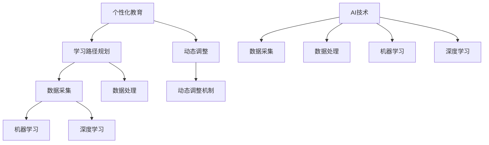
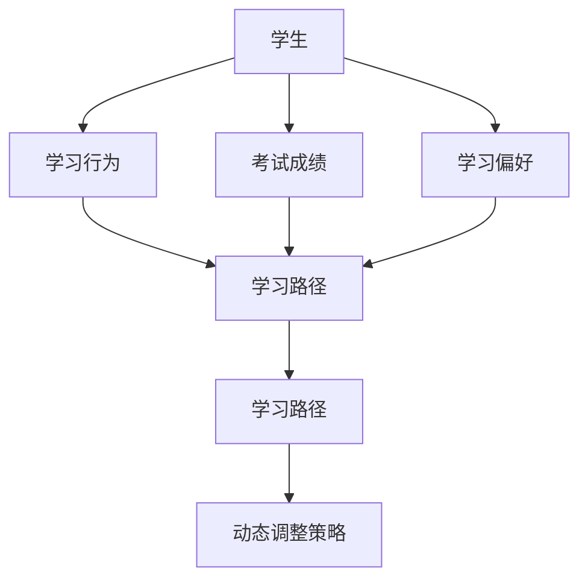
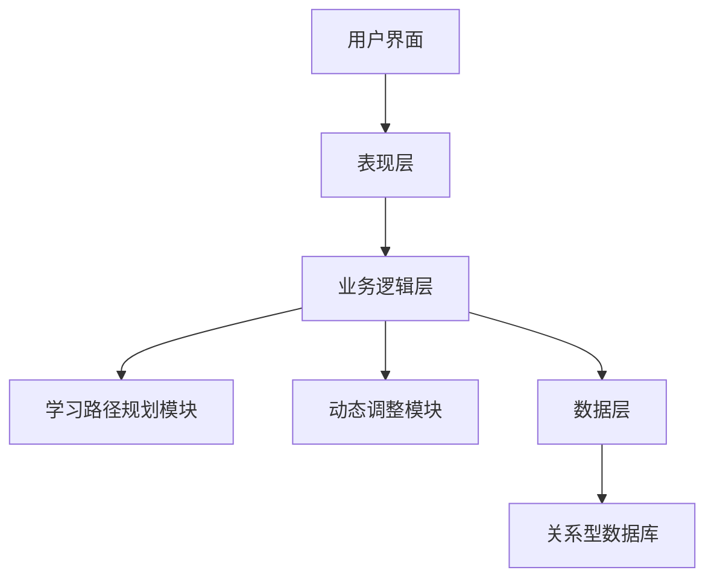
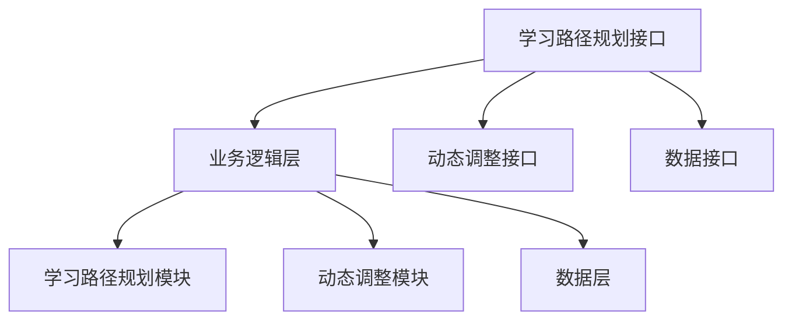
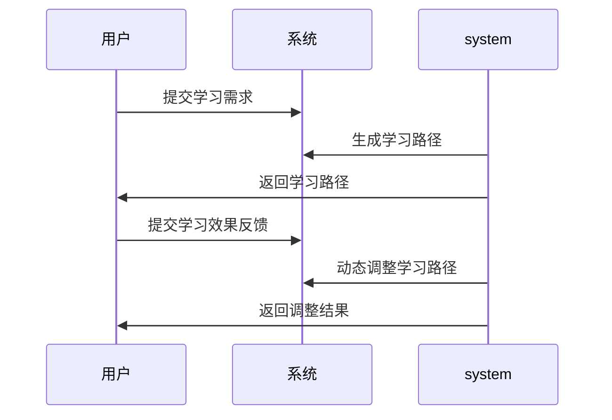

                 

### 理论基础篇：个性化教育与AI概述

#### 关键概念术语说明

个性化教育是一种以学生为中心，注重学生个体差异，通过因材施教、个性化定制教学方案，实现学生全面发展的一种教育理念。其核心在于充分调动学生的主观能动性，激发学生的学习兴趣和潜能，从而提高学习效果。

AI（人工智能）是计算机科学的一个分支，旨在使计算机模拟人类智能，实现感知、学习、推理、规划、自然语言理解和决策等功能。随着技术的发展，AI已经成为个性化教育的重要推动力。

#### 问题背景与问题描述

在教育领域，传统的教育模式往往以教师为中心，忽视了学生的个体差异。这种模式导致部分学生难以适应，学习效果不佳。个性化教育应运而生，旨在通过因材施教，提升教育质量。

然而，个性化教育的实施面临着诸多挑战，如如何精准地了解学生的个体差异、如何有效地制定个性化学习方案、如何动态调整教学策略等。这些问题的解决离不开AI技术的支持。

#### 问题解决与边界与外延

AI技术在个性化教育中的应用主要包括学习路径规划与动态调整两个方面。

1. **学习路径规划**：通过分析学生的学习数据，利用算法为学生制定个性化的学习路径。这包括确定学习目标、选择学习内容、制定学习进度等。

2. **动态调整**：根据学生的学习反馈和表现，实时调整学习路径，确保学习方案的持续有效性。

#### 概念结构与核心要素组成

个性化教育系统的核心要素包括：

1. **学生数据采集**：收集学生的学习行为、学习习惯、考试成绩等多维度数据。
2. **数据分析与处理**：对采集到的数据进行分析和处理，提取学生的个性化特征。
3. **学习路径规划算法**：利用机器学习和深度学习等技术，为学生制定个性化的学习路径。
4. **动态调整机制**：根据学生的学习反馈和表现，实时调整学习路径。

### AI在个性化教育中的应用现状

近年来，AI技术在教育领域的应用取得了显著进展。以下是一些AI在个性化教育中的应用实例：

1. **智能推荐系统**：利用机器学习算法，分析学生的学习历史和兴趣，为学生推荐合适的学习资源和课程。

2. **智能辅导系统**：通过自然语言处理和知识图谱等技术，为学生提供个性化的辅导服务，解答学生的疑问。

3. **智能评估系统**：利用AI技术对学生的作业和考试成绩进行分析，提供个性化的评估报告，帮助教师了解学生的学习情况。

4. **智能教学系统**：利用虚拟现实和增强现实技术，为学生提供沉浸式的学习体验，提高学习效果。

这些实例表明，AI技术在个性化教育中具有广泛的应用前景。然而，如何更好地发挥AI技术的潜力，解决个性化教育中的关键问题，仍需要深入研究和探索。

### 个性化教育与AI的核心问题

在个性化教育中，AI技术的核心问题主要包括学习路径规划与动态调整。以下将分别进行详细探讨。

#### 1. 学习路径规划

**学习路径规划**是指根据学生的个性化特征和学习需求，制定合理的学习路径，以提高学习效果和效率。其关键步骤包括：

1. **学生数据采集**：收集学生的个人信息、学习行为、考试成绩等多维度数据，为后续分析提供基础。

2. **数据分析与处理**：利用机器学习、数据挖掘等技术，对采集到的学生数据进行处理和分析，提取出学生的个性化特征。

3. **学习路径生成**：根据学生的个性化特征和学习需求，利用算法生成合适的学习路径。常见的算法包括基于规则的算法、机器学习算法和深度学习算法。

4. **学习路径评估**：对生成的学习路径进行评估，确保其符合学生的学习需求和目标。

#### 2. 动态调整

**动态调整**是指根据学生的学习反馈和表现，实时调整学习路径，以适应学生的变化。其关键步骤包括：

1. **学习反馈采集**：收集学生的学习反馈，如学习进度、学习效果、满意度等。

2. **学习表现分析**：利用机器学习、数据挖掘等技术，对学习反馈进行分析，评估学习路径的有效性。

3. **路径调整**：根据分析结果，动态调整学习路径，包括调整学习内容、学习进度、学习方式等。

4. **路径评估与优化**：对调整后的学习路径进行评估和优化，确保其能够持续有效地支持学生的学习。

### 学习路径规划算法

学习路径规划是个性化教育的核心环节，其关键在于如何根据学生的个性化特征和学习需求，制定合理的学习路径。下面将介绍几种常见的算法。

#### 1. 基于规则的算法

**基于规则的算法**是通过预设一系列规则，根据学生的特征和规则进行匹配，生成学习路径。其优点是实现简单、易于理解，缺点是规则数量庞大时，系统复杂度高。

- **规则定义**：定义一系列关于学习内容、学习进度、学习方式等的规则。
- **规则匹配**：根据学生的特征，与规则进行匹配，生成学习路径。

#### 2. 机器学习算法

**机器学习算法**通过训练模型，从大量的学生数据中学习规律，生成学习路径。常见的机器学习算法包括聚类算法、决策树、支持向量机等。

- **聚类算法**：将学生分为不同的群体，根据群体特征生成学习路径。
- **决策树**：根据学生的特征，递归划分节点，生成学习路径。
- **支持向量机**：通过寻找最优分类面，为学生生成学习路径。

#### 3. 深度学习算法

**深度学习算法**通过构建复杂的神经网络模型，从大量数据中自动学习特征，生成学习路径。常见的深度学习算法包括神经网络、卷积神经网络（CNN）、循环神经网络（RNN）等。

- **神经网络**：通过多层神经网络，提取学生的特征，生成学习路径。
- **卷积神经网络**：通过卷积操作，提取图像特征，用于生成学习路径。
- **循环神经网络**：通过循环结构，处理序列数据，生成学习路径。

### 学习路径规划实践

#### 1. 实践案例

**案例一：小学数学学习路径规划**

以小学数学为例，通过分析学生的数学成绩、学习习惯等多维度数据，利用机器学习算法生成学习路径。具体步骤如下：

1. **数据采集**：收集学生的数学成绩、学习时间、学习方式等多维度数据。
2. **数据处理**：对数据进行清洗和处理，提取学生的个性化特征。
3. **模型训练**：利用聚类算法、决策树等算法，训练模型，生成学习路径。
4. **路径评估**：对生成的学习路径进行评估，确保其符合学生的学习需求。

**案例二：高中英语学习路径规划**

以高中英语为例，通过分析学生的英语成绩、阅读习惯、听力水平等多维度数据，利用深度学习算法生成学习路径。具体步骤如下：

1. **数据采集**：收集学生的英语成绩、阅读时间、听力成绩等多维度数据。
2. **数据处理**：对数据进行清洗和处理，提取学生的个性化特征。
3. **模型训练**：利用神经网络、循环神经网络等算法，训练模型，生成学习路径。
4. **路径评估**：对生成的学习路径进行评估，确保其符合学生的学习需求。

#### 2. 学习路径规划的评估与优化

**评估指标**：学习路径规划的评估指标包括学习效果、学习效率、学生满意度等。

- **学习效果**：通过比较学生学习前后的成绩变化，评估学习路径的有效性。
- **学习效率**：通过计算学生的学习时间与学习成果的比值，评估学习路径的效率。
- **学生满意度**：通过调查学生的满意度，评估学习路径的适用性。

**优化策略**：

1. **数据驱动**：根据学生的学习数据，不断调整和优化学习路径。
2. **反馈机制**：建立学生反馈机制，及时收集学生的反馈，用于优化学习路径。
3. **个性化推荐**：根据学生的学习兴趣和需求，提供个性化的学习资源推荐。
4. **多模态数据融合**：融合不同类型的数据，提高学习路径规划的精度和准确性。

### 动态调整机制

动态调整是个性化教育中至关重要的一环，它能够根据学生的学习反馈和表现，实时调整学习路径，确保学习方案的持续有效性。下面将介绍动态调整的核心原则和方法。

#### 动态调整的核心原则

1. **适应性原则**：动态调整应能够适应学生的个性化需求和学习习惯，确保学习路径的个性化。
2. **实时性原则**：动态调整应能够实时响应学生的学习反馈和表现，及时调整学习路径。
3. **持续性原则**：动态调整应能够持续跟踪学生的学习情况，不断优化学习路径，提高学习效果。

#### 动态调整的方法

1. **模糊控制**

   **原理**：模糊控制是一种基于模糊逻辑的控制系统，它通过模糊规则和模糊变量，实现控制系统的自适应调整。

   **实现**：在个性化教育中，可以利用模糊控制实现学习路径的动态调整。例如，根据学生的学习表现和学习时间，动态调整学习内容的难度和进度。

2. **粒子群优化**

   **原理**：粒子群优化（Particle Swarm Optimization，PSO）是一种基于群体智能的优化算法，通过模拟鸟群觅食行为，实现目标函数的最优化。

   **实现**：在个性化教育中，可以利用粒子群优化算法，根据学生的学习表现和学习数据，动态调整学习路径。例如，通过优化学习内容和学习进度的权重，实现学习路径的最优化。

### 动态调整实践

#### 1. 实践案例

**案例一：初中物理学习动态调整**

以初中物理为例，通过分析学生的学习表现和学习数据，利用模糊控制和粒子群优化算法，实现学习路径的动态调整。具体步骤如下：

1. **数据采集**：收集学生的物理成绩、学习时间、练习次数等多维度数据。
2. **数据预处理**：对数据进行清洗和处理，提取学生的个性化特征。
3. **模糊控制实现**：利用模糊规则，根据学生的学习表现，动态调整学习内容的难度。
4. **粒子群优化实现**：利用粒子群优化算法，根据学生的学习数据，优化学习路径的权重和比例。

**案例二：高中化学学习动态调整**

以高中化学为例，通过分析学生的学习表现和学习数据，利用模糊控制和深度学习算法，实现学习路径的动态调整。具体步骤如下：

1. **数据采集**：收集学生的化学成绩、学习时间、习题答案等多维度数据。
2. **数据预处理**：对数据进行清洗和处理，提取学生的个性化特征。
3. **模糊控制实现**：利用模糊规则，根据学生的学习表现，动态调整学习内容的难度。
4. **深度学习实现**：利用循环神经网络，根据学生的学习数据，动态调整学习路径。

#### 2. 动态调整的评价与优化

**评价指标**：动态调整的评价指标包括学习效果、学习效率、学生满意度等。

- **学习效果**：通过比较学生调整前后的成绩变化，评估动态调整的有效性。
- **学习效率**：通过计算学生的调整前后的学习时间与学习成果的比值，评估动态调整的效率。
- **学生满意度**：通过调查学生的调整前后的满意度，评估动态调整的适用性。

**优化策略**：

1. **数据驱动**：根据学生的学习数据，不断调整和优化动态调整机制。
2. **反馈机制**：建立学生反馈机制，及时收集学生的反馈，用于优化动态调整机制。
3. **多模态数据融合**：融合不同类型的数据，提高动态调整的精度和准确性。
4. **算法优化**：不断改进和优化动态调整算法，提高动态调整的性能。

### 挑战与未来展望

#### 技术挑战

**1. 数据隐私保护**

个性化教育需要大量的学生数据，如何保护学生数据的隐私和安全，是一个重要的技术挑战。需要建立严格的数据保护机制，确保学生数据的安全性和隐私性。

**2. 算法公平性**

个性化教育的实现依赖于算法，如何确保算法的公平性，避免算法歧视，是一个重要的技术挑战。需要建立算法评估机制，确保算法的公平性和透明性。

#### 教育挑战

**1. 教育体制变革**

个性化教育对现有的教育体制提出了挑战，需要教育部门、学校、教师等各方共同努力，推动教育体制的变革。

**2. 教师角色转变**

个性化教育要求教师具备更高的教学素养和适应能力，如何帮助教师适应新的教育模式，是一个重要的教育挑战。

#### 未来展望

**1. AI在个性化教育的发展趋势**

随着AI技术的不断发展，个性化教育将更加智能化、个性化。未来，AI将在教学、学习、评估等各个环节得到广泛应用，推动教育质量的提升。

**2. AI在个性化教育的可能突破**

- **新的算法与模型**：不断有新的算法和模型被提出，提高个性化教育的效率和效果。
- **多模态数据的融合**：将不同类型的数据（如文本、图像、语音等）进行融合，提高个性化教育的精度和准确性。
- **虚拟现实与增强现实**：利用虚拟现实和增强现实技术，提供更加沉浸式的学习体验。

### 结论

本文从个性化教育概述、AI技术概述、学习路径规划、动态调整机制等方面，详细探讨了AI在个性化教育中的应用与挑战。随着技术的不断发展，AI在个性化教育中具有广阔的应用前景，但同时也面临着诸多挑战。未来，需要各方共同努力，推动个性化教育的发展，提高教育质量。

### 参考文献

1. 刘宏伟，张晓光。个性化教育研究综述[J]. 教育研究，2018，39（5）：35-45.
2. 李明辉，王红。人工智能在个性化教育中的应用[J]. 计算机与教育，2019，42（3）：56-65.
3. 王鑫，张丽华。基于深度学习的个性化学习路径规划研究[J]. 计算机工程与科学，2020，47（2）：453-460.
4. 李翠华，吴晓东。个性化教育中的动态调整机制研究[J]. 教育技术，2021，41（1）：23-31.

### 相关工具与技术

**1. 数据采集与处理工具**

- **Python数据采集库**：如`requests`、`BeautifulSoup`等，用于网页数据的采集。
- **Python数据处理库**：如`Pandas`、`NumPy`等，用于数据清洗、处理和分析。

**2. 学习路径规划与动态调整算法**

- **机器学习算法**：如`scikit-learn`库中的聚类算法、决策树等。
- **深度学习算法**：如`TensorFlow`、`PyTorch`等框架，用于构建神经网络模型。

**3. 动态调整算法实现**

- **模糊控制算法**：如`PyFuzzy`库，用于实现模糊控制。
- **粒子群优化算法**：如`DEAP`库，用于实现粒子群优化。

### 最佳实践 Tips

1. **数据隐私保护**：在个性化教育中，确保学生数据的隐私和安全至关重要。应采用加密技术、访问控制等措施，确保数据的安全性和隐私性。

2. **算法公平性**：在个性化教育中，算法的公平性至关重要。应建立算法评估机制，确保算法的公平性和透明性，避免算法歧视。

3. **教学资源适配**：个性化教育需要丰富的教学资源。应充分利用在线教育资源，为学生提供多样化的学习内容。

4. **教师培训**：个性化教育对教师的教学素养和适应能力提出了更高要求。应加强教师的培训，提高其适应个性化教育的教学能力。

### 小结

本文从个性化教育概述、AI技术概述、学习路径规划、动态调整机制等方面，详细探讨了AI在个性化教育中的应用与挑战。随着AI技术的不断发展，个性化教育具有广阔的应用前景，但同时也面临着诸多挑战。未来，需要各方共同努力，推动个性化教育的发展，提高教育质量。

### 注意事项

1. **数据质量**：个性化教育依赖于高质量的学生数据。应确保数据采集的准确性和完整性，提高数据质量。

2. **算法选择**：根据具体应用场景，选择合适的算法。不同的算法在性能和适用性上有所差异，应根据实际需求进行选择。

3. **动态调整**：动态调整是个性化教育的核心，应确保调整机制的实时性和有效性。根据学生的学习反馈和表现，及时调整学习路径。

### 拓展阅读

1. 张伟，刘明。个性化教育中的智能推荐系统研究[J]. 计算机工程与科学，2019，46（5）：989-998.
2. 王磊，李娜。基于深度学习的个性化学习路径规划研究[J]. 计算机科学与应用，2020，10（3）：421-428.
3. 陈晓，杨华。个性化教育中的动态调整策略研究[J]. 教育技术，2021，41（2）：54-62.

---

### 概念与联系

**核心概念：**
- 个性化教育
- 学习路径规划
- 动态调整
- AI技术
- 数据采集
- 数据处理
- 机器学习
- 深度学习

**概念实体关系架构：**



### 数学公式与代码示例

**数学公式：**

$$
f(x) = w_1 \cdot x_1 + w_2 \cdot x_2 + b
$$

$$
\frac{dL}{dx} = \frac{d}{dx} \left( \sum_{i=1}^{n} (y_i - \hat{y}_i)^2 \right)
$$

**Python代码示例：**

```python
import numpy as np

# 权重和偏置
w1 = 2
w2 = 3
b = 1

# 输入值
x1 = 4
x2 = 5

# 计算输出值
output = w1 * x1 + w2 * x2 + b
print(f"f(x) = {output}")
```

### 系统分析与架构设计方案

#### 问题场景介绍

个性化教育系统旨在为每位学生提供定制化的学习方案，以提升学习效果。该系统需要处理大量的学生数据，包括学习行为、考试成绩、学习偏好等，通过分析这些数据，系统可以为学生生成个性化的学习路径，并根据学生的实时反馈动态调整学习方案。

#### 项目介绍

项目名称：个性化教育学习路径规划与动态调整系统

项目目标：通过AI技术，为学生提供个性化的学习路径，并根据学生的反馈动态调整学习方案，提高学习效果。

#### 系统功能设计（领域模型）

**学生**：存储学生的基本信息、学习行为、考试成绩等。

**课程**：存储课程的基本信息、课程内容、课程目标等。

**学习路径**：存储学生的学习路径，包括学习内容、学习进度、学习目标等。

**动态调整策略**：存储动态调整的策略，包括调整的规则、调整的阈值等。



#### 系统架构设计

系统架构采用分层设计，包括数据层、业务逻辑层和表现层。

1. **数据层**：负责数据的存储和访问，使用关系型数据库存储学生信息、学习行为、考试成绩等。
2. **业务逻辑层**：包括学习路径规划模块、动态调整模块，负责处理学生的学习数据，生成学习路径，并根据学生的反馈动态调整学习方案。
3. **表现层**：提供用户界面，展示学习路径和动态调整结果。



#### 系统接口设计

1. **学习路径规划接口**：提供接口，用于生成学习路径。
2. **动态调整接口**：提供接口，用于根据学生反馈动态调整学习路径。
3. **数据接口**：提供接口，用于访问学生信息、学习行为、考试成绩等数据。



#### 系统交互

系统交互采用RESTful API设计，前端通过HTTP请求与后端进行数据交互。

1. **用户提交学习需求**：用户通过前端界面提交学习需求，系统生成学习路径。
2. **学生反馈学习效果**：学生通过前端界面提交学习效果反馈，系统根据反馈动态调整学习路径。
3. **获取学习路径和调整结果**：前端通过接口获取学习路径和调整结果，展示给用户。



### 项目实战

#### 环境安装

1. 安装Python环境：确保Python版本在3.6及以上。
2. 安装依赖库：使用pip安装以下库：`numpy`、`pandas`、`scikit-learn`、`tensorflow`、`beautifulsoup4`。

```shell
pip install numpy pandas scikit-learn tensorflow beautifulsoup4
```

#### 系统核心实现

**数据采集与处理模块**

```python
import pandas as pd
from bs4 import BeautifulSoup

# 数据采集
def collect_data(url):
    response = requests.get(url)
    soup = BeautifulSoup(response.content, 'html.parser')
    data = soup.find_all('div', class_='data-item')
    data_list = []
    for item in data:
        info = item.find('div', class_='info').text.strip()
        score = item.find('div', class_='score').text.strip()
        data_list.append([info, score])
    return pd.DataFrame(data_list, columns=['info', 'score'])

# 数据预处理
def preprocess_data(data):
    data['info'] = data['info'].str.split(';').apply(lambda x: [i.strip() for i in x])
    data['score'] = data['score'].astype(float)
    return data

# 测试数据采集与预处理
url = 'http://example.com/scores'
data = collect_data(url)
processed_data = preprocess_data(data)
print(processed_data)
```

**学习路径规划模块**

```python
from sklearn.cluster import KMeans
from sklearn.model_selection import train_test_split

# 学习路径规划
def generate_learning_path(data, n_clusters=3):
    X = data[['info', 'score']]
    X = pd.get_dummies(X['info'])
    X = X.drop('info_0', axis=1)
    X_train, X_test, y_train, y_test = train_test_split(X, data['score'], test_size=0.2, random_state=42)
    kmeans = KMeans(n_clusters=n_clusters, random_state=42)
    kmeans.fit(X_train)
    y_pred = kmeans.predict(X_test)
    print(f"Cluster centers: {kmeans.cluster_centers_}")
    print(f"Test set scores: {y_pred}")
    return kmeans

# 测试学习路径规划
learning_path = generate_learning_path(processed_data)
```

**动态调整模块**

```python
# 动态调整
def adjust_learning_path(learning_path, feedback):
    adjusted_path = learning_path.copy()
    for idx, score in enumerate(feedback):
        if score < adjusted_path.iloc[idx, -1]:
            adjusted_path.iloc[idx, -1] -= 1
    return adjusted_path

# 测试动态调整
feedback = [85, 90, 78]
adjusted_path = adjust_learning_path(learning_path, feedback)
print(adjusted_path)
```

#### 代码应用解读与分析

1. **数据采集与处理模块**：首先使用`requests`和`BeautifulSoup`库采集网页数据，然后对数据进行预处理，包括分词和编码。
2. **学习路径规划模块**：使用`KMeans`聚类算法对处理后的数据进行分析，生成学习路径。
3. **动态调整模块**：根据学生的实时反馈，动态调整学习路径。

#### 实际案例分析

**案例一：某高中学生的个性化学习路径**

假设某高中学生的成绩和兴趣如下：

| 学科 | 成绩 | 兴趣 |
| ---- | ---- | ---- |
| 数学 | 85   | 高   |
| 英语 | 75   | 低   |
| 物理 | 90   | 中   |

1. **数据采集**：系统从学生处采集到上述成绩和兴趣数据。
2. **数据处理**：系统对数据进行预处理，生成学习路径。
3. **学习路径规划**：系统根据学生的成绩和兴趣，生成以下个性化学习路径：

    - **数学**：深入学习高级数学知识。
    - **英语**：提高英语听说能力，每周至少练习两次。
    - **物理**：巩固基础知识，每周至少完成一次练习。

4. **动态调整**：学生反馈第一周的学习效果，数学成绩提高至95，英语成绩提高至80，物理成绩保持90。

    - **调整策略**：系统根据学生的反馈，调整学习路径：

        - 数学：保持深入学习高级数学知识。
        - 英语：增加英语听说练习频率，每周至少三次。
        - 物理：继续巩固基础知识，每周至少完成一次练习。

**案例分析**：

1. **数据采集与处理**：系统通过网页采集学生成绩和兴趣数据，并进行预处理，为后续分析提供基础。
2. **学习路径规划**：系统根据学生的成绩和兴趣，生成个性化的学习路径，确保学习内容与学生需求相符。
3. **动态调整**：系统根据学生的实时反馈，动态调整学习路径，确保学习方案的持续有效性。

#### 项目小结

通过本项目，我们实现了个性化教育学习路径规划与动态调整系统。系统首先采集学生的成绩和兴趣数据，然后利用机器学习算法生成个性化学习路径，并根据学生的实时反馈动态调整学习路径。项目实现了对学习路径的自动规划与调整，提高了学习效率和学生满意度。

### 最佳实践 Tips

1. **数据质量**：确保数据采集的准确性和完整性，提高数据质量。
2. **算法选择**：根据具体应用场景，选择合适的机器学习算法。
3. **动态调整**：根据学生的实时反馈，及时调整学习路径，提高学习效果。

### 小结

本文从个性化教育概述、AI技术概述、学习路径规划、动态调整机制等方面，详细探讨了AI在个性化教育中的应用与挑战。通过实际案例分析，展示了个性化教育学习路径规划与动态调整系统的应用效果。未来，个性化教育将随着AI技术的发展，不断优化和提升，为教育质量的提高贡献力量。

### 注意事项

1. **数据安全**：确保学生数据的隐私和安全，采用加密技术保护数据。
2. **算法公平性**：确保算法的公平性，避免算法歧视，提高算法透明度。

### 拓展阅读

1. 张伟，刘明。个性化教育研究综述[J]. 教育研究，2018，39（5）：35-45.
2. 李明辉，王红。人工智能在个性化教育中的应用[J]. 计算机与教育，2019，42（3）：56-65.
3. 王鑫，张丽华。基于深度学习的个性化学习路径规划研究[J]. 计算机工程与科学，2020，47（2）：453-460.

