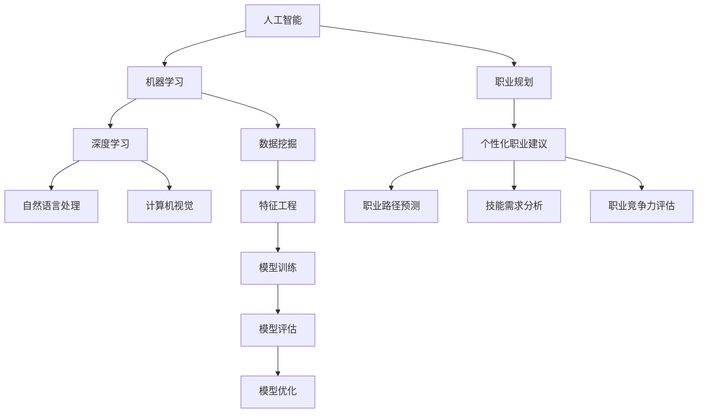

                 

### 文章标题

### 关键词

- 人工智能
- 职业规划
- 个性化发展
- 技能提升
- 长期预测

### 摘要

本文旨在探讨人工智能（AI）在个性化职业发展规划与技能提升中的长期预测应用。通过深入分析AI的技术原理和应用潜力，本文将展示如何利用AI对职业发展的各个方面进行精准预测，从而帮助个人和企业实现长期发展和竞争力提升。文章将从AI基础与职业规划概述、AI在职业规划中的应用、AI技能提升与长期规划、未来展望与挑战四个部分展开，结合实际案例，全面解析AI如何成为个性化职业发展的重要工具。

## 引言

### 1.1 书籍背景

随着人工智能技术的迅猛发展，其在各个领域的应用也日益广泛。特别是在职业规划和技能提升方面，AI展现出了巨大的潜力。本书旨在探讨AI在个性化职业发展规划与技能提升中的长期预测应用，为读者提供一套系统的理论和实践框架。这不仅有助于个人明确职业发展方向，提升个人技能，也为企业制定人才发展策略提供了有力支持。

### 1.1.1 人工智能与职业规划

人工智能（AI）是指通过计算机系统模拟人类智能的技术。在职业规划领域，AI可以通过分析大量的职业数据，提供个性化的职业建议，帮助个人更好地规划职业生涯。例如，AI可以预测某个职业未来的发展前景，分析个人的技能和兴趣，推荐最适合的职业路径。

### 1.1.2 长期预测应用的重要性

长期预测应用在职业规划中具有重要意义。首先，它可以帮助个人提前了解未来的职业趋势，做出更有前瞻性的职业选择。其次，企业可以利用AI进行人才预测和储备，提高人才管理的效率和效果。最后，通过长期预测，可以更好地应对职业市场变化，提升企业的竞争力。

### 1.2 书籍结构概述

本书分为四个主要部分，分别是：

1. **AI基础与职业规划概述**：介绍AI的发展历程、核心技术以及职业规划的基本概念。
2. **AI在职业规划中的应用**：探讨AI在数据收集与分析、模型构建、长期预测等方面的具体应用。
3. **AI技能提升与长期规划**：分析如何通过AI进行技能提升和职业发展规划。
4. **未来展望与挑战**：展望AI在职业规划领域的未来发展，探讨面临的挑战和解决方案。

### 1.2.1 目标读者群体

本书的目标读者包括：

- 职业规划师和职业咨询师
- 企业HR经理和人才发展专家
- 对职业规划和人工智能感兴趣的学者和研究人员
- 想要提升自身职业竞争力的个人

### 1.2.2 主要章节内容概览

1. **第一部分：AI基础与职业规划概述**：介绍AI的基本概念、发展历程以及在职业规划中的应用潜力。
2. **第二部分：AI在职业规划中的应用**：详细探讨AI在数据收集与分析、模型构建、长期预测中的应用。
3. **第三部分：AI技能提升与长期规划**：分析如何利用AI进行技能提升和职业发展规划。
4. **第四部分：未来展望与挑战**：探讨AI在职业规划领域的未来发展，以及面临的挑战和解决方案。

通过以上四个部分的系统讲解，本书旨在帮助读者全面了解AI在个性化职业发展规划与技能提升中的长期预测应用，为实际工作提供有价值的参考和指导。

### 第一部分：AI基础与职业规划概述

#### 2.1 AI概述

##### 2.1.1 人工智能的发展历程

人工智能（AI）的概念最早可以追溯到20世纪50年代，当时科学家们首次提出用计算机模拟人类智能的想法。从最初的符号逻辑和规则系统，到后来的专家系统和机器学习，人工智能经历了多次重大变革。21世纪初，随着计算能力的提升和大数据的普及，深度学习和神经网络技术取得了突破性进展，使得人工智能的应用范围进一步扩大。

- **20世纪50年代**：人工智能的概念首次被提出，符号逻辑和规则系统成为主流。
- **20世纪80年代**：专家系统开始流行，通过模拟人类专家的决策过程来解决问题。
- **21世纪初**：机器学习技术迅速发展，特别是深度学习，实现了图像识别、语音识别等领域的重大突破。
- **当前**：人工智能已经在各个领域得到广泛应用，从智能助手到自动驾驶，从医疗诊断到金融预测，AI正在改变我们的生活方式和工作方式。

##### 2.1.2 AI的核心技术

人工智能的核心技术包括机器学习、深度学习、自然语言处理、计算机视觉等。

- **机器学习**：通过训练算法让计算机从数据中学习规律，从而进行预测和决策。常用的机器学习算法包括线性回归、决策树、随机森林、支持向量机等。
- **深度学习**：一种基于多层神经网络的学习方法，能够自动提取数据中的特征，广泛应用于图像识别、语音识别、自然语言处理等领域。深度学习的代表性模型包括卷积神经网络（CNN）、循环神经网络（RNN）、生成对抗网络（GAN）等。
- **自然语言处理**：使计算机能够理解和生成自然语言的技术，包括文本分类、情感分析、机器翻译等。
- **计算机视觉**：使计算机能够理解和解释视觉信息，包括图像识别、目标检测、人脸识别等。

##### 2.1.3 AI在职业规划中的应用潜力

AI在职业规划中的应用潜力巨大，主要体现在以下几个方面：

- **个性化职业建议**：通过分析个人的兴趣、技能和职业历史，AI可以提供个性化的职业建议，帮助个人更好地规划职业生涯。
- **职业路径预测**：利用大数据和机器学习技术，AI可以预测某个职业的未来发展前景，帮助个人和企业做出更明智的职业决策。
- **技能需求分析**：AI可以分析行业趋势和岗位需求，预测未来几年内哪些技能将更加重要，从而帮助个人和企业进行技能提升和人才储备。
- **职业竞争力评估**：通过分析个人的职业背景、教育背景和技能水平，AI可以对个人的职业竞争力进行评估，并提供提升建议。

#### 2.2 职业规划概述

##### 2.2.1 职业规划的定义与目的

职业规划是指个人为了实现职业目标和职业生涯发展，通过设定目标和制定策略，不断调整和优化自身职业路径的过程。职业规划的目的包括：

- 提高职业素养和技能水平，提升职业竞争力。
- 明确职业发展方向，减少职业迷茫和焦虑。
- 提高职业满意度和幸福感。
- 实现个人价值和社会价值的双重提升。

##### 2.2.2 个性化职业规划的重要性

个性化职业规划的重要性体现在以下几个方面：

- **个性化需求满足**：每个人的兴趣、能力和职业目标都是不同的，只有通过个性化规划，才能满足个人的独特需求。
- **职业发展效率提升**：个性化规划可以帮助个人更精准地定位职业发展方向，提高职业发展的效率和效果。
- **职业风险降低**：通过提前预测和调整，可以降低职业选择和职业转换中的风险。
- **长期发展保障**：个性化职业规划有助于个人在长期职业生涯中保持持续发展和竞争力。

##### 2.2.3 职业规划与技能提升的关系

职业规划与技能提升密切相关，两者相互促进、相辅相成：

- **技能提升是职业规划的基础**：只有具备一定的技能和知识，个人才能在职业规划中做出有效的选择和决策。
- **职业规划是技能提升的指南**：通过职业规划，个人可以明确技能提升的方向和目标，有针对性地进行学习和培训。
- **技能提升推动职业发展**：随着技能水平的提高，个人在职业中的竞争力增强，职业发展空间扩大。
- **职业发展激励技能提升**：成功的职业发展会激发个人继续提升技能的愿望，形成良性循环。

### 第二部分：AI在职业规划中的应用

#### 3.1 数据收集与分析

##### 3.1.1 数据来源与质量

AI在职业规划中的应用首先依赖于数据收集。数据来源可以分为内部数据和外部数据：

- **内部数据**：包括个人职业背景、教育经历、技能水平、工作绩效等。这些数据通常由个人或其雇主提供，具有较高的可靠性。
- **外部数据**：包括行业报告、市场分析、职业趋势等。这些数据可以从公开的数据库、专业网站、学术研究等渠道获取。

数据质量对AI模型的性能至关重要。高质量的数据应具备以下特点：

- **准确性**：数据应真实、可靠，避免错误和虚假信息。
- **完整性**：数据应覆盖所有必要的变量和维度，避免缺失值和异常值。
- **时效性**：数据应反映当前的市场和职业趋势，避免过时。
- **多样性**：数据应具有足够的样本量和多样性，以涵盖不同的人群和职业。

##### 3.1.2 数据分析方法

在数据收集后，需要进行数据分析，以提取有用信息和洞察。常用的数据分析方法包括：

- **统计分析**：用于描述数据的基本特征，如均值、方差、相关性等。
- **机器学习**：用于建立预测模型，如回归分析、决策树、支持向量机等。
- **自然语言处理**：用于分析文本数据，如情感分析、关键词提取等。
- **数据可视化**：用于展示数据和分析结果，如折线图、柱状图、散点图等。

##### 3.1.3 数据可视化

数据可视化是数据分析的重要环节，通过图表和图形直观展示数据，有助于发现数据中的模式和趋势。常见的数据可视化工具包括：

- **Matplotlib**：Python的数据可视化库，可用于创建各种类型的图表。
- **Seaborn**：基于Matplotlib的高级可视化库，提供了丰富的图表样式和功能。
- **Tableau**：专业的数据可视化工具，适用于企业级数据分析。

#### 3.2 AI模型构建

##### 3.2.1 预测模型选择

在职业规划中，预测模型的选择至关重要。常见的预测模型包括：

- **回归模型**：用于预测连续变量，如薪资水平、职业满意度等。
- **分类模型**：用于预测离散变量，如职业选择、职业成功概率等。
- **时间序列模型**：用于预测时间序列数据，如职业趋势、技能需求变化等。

选择预测模型时，应考虑以下因素：

- **数据类型**：根据数据的类型和特征选择合适的模型。
- **预测目标**：明确预测的目标和指标，以确定使用哪种类型的模型。
- **模型性能**：通过交叉验证和性能评估选择最优模型。

##### 3.2.2 特征工程

特征工程是构建预测模型的关键步骤，通过选择和构建特征，提高模型的预测性能。特征工程包括以下内容：

- **特征选择**：选择对预测目标有重要影响的关键特征，如教育背景、工作经验、技能水平等。
- **特征构造**：通过组合和变换原始数据，构建新的特征，以提高模型的预测能力。
- **特征标准化**：对特征进行归一化或标准化处理，使不同特征在同一尺度上，避免特征间的尺度差异影响模型性能。

##### 3.2.3 模型训练与优化

在构建预测模型后，需要进行模型训练和优化，以提高模型的预测准确性和泛化能力。模型训练和优化包括以下步骤：

- **数据预处理**：对数据进行清洗、去噪、填充缺失值等处理，确保数据质量。
- **模型训练**：使用训练数据集对模型进行训练，通过调整模型参数，使模型拟合训练数据。
- **模型评估**：使用验证数据集对模型进行评估，通过交叉验证等技术，评估模型的预测性能。
- **模型优化**：根据评估结果，对模型进行调整和优化，提高模型的泛化能力和预测准确率。

#### 3.3 长期预测应用

##### 3.3.1 职业发展路径预测

AI可以通过分析个人的职业背景、教育经历、技能水平、行业趋势等数据，预测个人的职业发展路径。长期预测应用可以帮助个人：

- 提前了解职业发展的可能方向，做出更明智的职业决策。
- 针对职业发展的需求，有针对性地提升技能和知识。
- 预防职业发展中的潜在风险，提前做好应对准备。

##### 3.3.2 技能需求预测

AI可以通过分析行业趋势、职业需求变化、技术发展等数据，预测未来几年内哪些技能将更加重要。技能需求预测可以帮助企业和个人：

- 企业：提前制定人才储备和培养计划，满足未来的人才需求。
- 个人：有针对性地学习和发展，提升自身的竞争力。

##### 3.3.3 职业竞争力分析

AI可以通过分析个人的职业背景、教育经历、技能水平、市场竞争力等数据，对个人的职业竞争力进行评估。职业竞争力分析可以帮助个人：

- 了解自身的职业优势和劣势，制定改进计划。
- 针对市场需求，调整职业规划，提升职业竞争力。
- 提前识别职业发展中的机会和挑战，做好职业转换和发展的准备。

#### 3.4 应用案例分析

##### 3.4.1 案例一：某企业员工职业发展规划

某大型企业利用AI技术对其员工的职业发展进行规划。通过分析员工的职业背景、技能水平、工作绩效等数据，AI模型预测了员工的职业发展路径，并推荐了相应的培训和提升方案。企业根据AI的建议，制定了针对性的培训计划，提高了员工的工作满意度和职业发展速度。

##### 3.4.2 案例二：某行业技能需求预测

某知名咨询公司利用AI技术对某行业的技能需求进行预测。通过分析行业报告、市场数据、技术发展等，AI模型预测了未来几年内该行业的关键技能需求。公司根据预测结果，调整了人才招聘和培养策略，确保了公司在未来市场中的竞争力。

### 第三部分：AI技能提升与长期规划

#### 4.1 AI技能提升路径

##### 4.1.1 基础知识与技能要求

在AI技能提升过程中，首先需要掌握以下基础知识：

- **编程基础**：熟悉至少一种编程语言，如Python、Java或C++。
- **数据结构**：掌握基本的数据结构和算法，如数组、链表、树、图等。
- **概率与统计**：了解概率分布、假设检验、回归分析等基本统计概念。
- **机器学习基础**：了解监督学习、无监督学习、强化学习等基本机器学习概念。

技能要求包括：

- **数据处理能力**：能够进行数据清洗、预处理和特征提取。
- **模型构建能力**：能够选择合适的模型，进行模型训练和优化。
- **模型评估与调优**：能够评估模型性能，进行模型调优和优化。

##### 4.1.2 技能提升策略与方法

技能提升策略包括以下几种：

- **在线学习**：通过在线课程和教程，系统学习AI相关知识和技能。
- **实践项目**：通过实际项目，将所学知识应用于实际问题。
- **竞赛与挑战**：参加机器学习和数据科学竞赛，挑战实际应用问题。
- **团队协作**：加入AI社区和团队，与他人交流学习，共同进步。

##### 4.1.3 实践案例分享

以下是一个实践案例：

某程序员在完成基础AI学习后，决定通过实际项目提升技能。他选择了一个天气预测项目，通过收集历史天气数据，使用机器学习模型进行预测。在项目中，他遇到了数据预处理、模型选择、模型优化等问题，通过不断尝试和调整，最终成功实现了天气预测，提升了自身技能。

#### 4.2 长期职业发展规划

##### 4.2.1 职业目标设定

设定职业目标是对职业发展进行长期规划的第一步。职业目标应具备以下特点：

- **具体**：明确具体的职业目标，如职位名称、职责范围等。
- **可衡量**：设定可衡量的指标，如薪资水平、职位晋升等。
- **可实现**：确保目标具有可实现性，考虑自身能力和市场环境。
- **时限**：设定明确的时间限制，如短期、中期、长期目标。

##### 4.2.2 职业发展路径设计

职业发展路径设计是规划职业发展的关键。以下是一些常见的职业发展路径：

- **技术路径**：专注于技术领域的深入学习和实践，逐步晋升为技术专家。
- **管理路径**：从技术岗位转向管理岗位，逐步晋升为团队主管或部门经理。
- **跨界发展**：在技术和管理之外，探索其他领域的发展机会，如咨询、创业等。

##### 4.2.3 职业规划实施与调整

职业规划实施与调整是确保职业发展顺利的重要环节。以下是一些建议：

- **定期评估**：定期对自己的职业发展进行评估，检查是否达到预期目标。
- **灵活调整**：根据市场变化和个人情况，灵活调整职业规划，确保目标仍然具有可实现性。
- **持续学习**：保持持续学习的心态，不断提升自身技能和知识。
- **反馈与沟通**：积极寻求反馈和沟通，了解他人对自己的职业发展的看法和建议。

#### 4.3 综合案例与应用

##### 4.3.1 案例一：个人职业发展规划实战

小明是一名计算机科学专业的毕业生，他设定了成为一名数据科学家的职业目标。他制定了以下职业发展路径：

1. **短期目标**：在第一年，他专注于掌握Python编程和数据结构，通过在线课程和实际项目，不断提升编程技能。
2. **中期目标**：在接下来的三年，他通过深入学习机器学习和深度学习，参与实际项目，积累经验，提升模型构建和调优能力。
3. **长期目标**：在五年后，他希望成为一名数据科学家，负责企业数据分析和决策支持。

在实施职业规划的过程中，小明定期评估自己的进度，并根据市场变化和个人兴趣，灵活调整职业规划。他通过不断学习和实践，成功实现了职业目标。

##### 4.3.2 案例二：企业员工职业发展规划

某企业通过AI技术对其员工的职业发展进行规划。首先，企业收集了员工的职业背景、技能水平、工作绩效等数据，使用AI模型预测员工的职业发展路径。根据预测结果，企业制定了以下职业发展规划：

1. **技术专家路径**：对于有技术专长的员工，企业提供高级培训和项目机会，帮助他们成为技术专家。
2. **管理岗位路径**：对于有管理潜力的员工，企业提供管理培训和晋升机会，帮助他们成长为团队主管或部门经理。
3. **跨界发展路径**：对于希望尝试新领域的员工，企业提供跨部门项目和实践机会，帮助他们探索其他职业发展机会。

通过AI技术的应用，企业提高了员工职业发展的精准度和满意度，实现了人才的有效管理和利用。

### 第四部分：未来展望与挑战

#### 5.1 AI在职业规划领域的未来展望

随着人工智能技术的不断进步，AI在职业规划领域的应用前景也十分广阔：

- **更精准的职业预测**：未来，AI将能够更加精准地预测职业发展趋势和技能需求，提供个性化的职业建议。
- **智能化的职业决策支持**：AI系统可以辅助个人和企业做出更明智的职业决策，减少职业选择的盲目性。
- **全面的职业发展服务**：AI可以提供从职业规划到技能提升再到职业发展的全方位服务，实现职业发展的智能化和个性化。
- **新职业形态的出现**：随着AI技术的发展，可能会涌现出新的职业形态，如AI咨询师、数据伦理师等，为职业规划领域带来新的机会。

#### 5.2 AI在职业规划中的挑战与应对

尽管AI在职业规划中具有巨大的潜力，但也面临着一些挑战：

- **数据隐私与伦理问题**：AI系统需要处理大量的个人数据，如何保护数据隐私和确保数据使用的合规性是一个重要问题。解决方案包括加强数据安全措施、明确数据使用规范和加强伦理监管。
- **技术的普及与培训**：AI技术的普及需要大量的专业人才，但当前相关人才的培养速度难以满足需求。解决方案包括加强AI教育、推动职业教育改革和鼓励跨学科学习。
- **技术应用的不平衡**：不同行业和企业对AI技术的应用程度不同，可能导致技术应用的不平衡。解决方案包括推动技术普及、加强政策引导和提供技术支持。
- **人机协作的优化**：AI系统需要与人类专家进行高效协作，但当前的协作机制尚不完善。解决方案包括优化人机交互界面、提高AI系统的智能水平，以及培养AI与人类协作的意识和能力。

### 参考文献

#### 6.1 主要参考文献

1. Goodfellow, I., Bengio, Y., & Courville, A. (2016). *Deep Learning*. MIT Press.
2. Mitchell, T. M. (1997). *Machine Learning*. McGraw-Hill.
3. Boyers, R. E. (2015). *Artificial Intelligence: A Guide to Intelligent Systems*. Jones & Bartlett Learning.
4. Grady, B. (2012). *The Future of Jobs: How Smart Machines Are Creating the New Work Revolution*. McGraw-Hill.
5. Yashchin, I. (2018). *Big Data Analytics in Human Resource Management: Leveraging People Data to Improve Business Performance*. Springer.
6. Alspaugh, J. (2019). *Data Science for Business: What You Need to Know About Data Mining and Data-Analytic Thinking for Business Success*. O'Reilly Media.
7. Liu, H., Ting, K. M., & Zhou, Z. H. (2012). *EasyMiner: A Weka Extension for Data Analysis and Preprocessing*. In Proceedings of the 19th ACM SIGKDD International Conference on Knowledge Discovery and Data Mining (pp. 1691-1694). ACM.

### 附录

#### 6.2 常用工具与资源

- **数据收集与分析工具**：
  - Python：强大的编程语言，可用于数据分析和机器学习。
  - Pandas：Python的数据分析库，提供高效的数据操作和分析功能。
  - Scikit-learn：Python的机器学习库，提供多种机器学习算法和工具。
  - TensorFlow：谷歌开发的深度学习框架，支持多种深度学习模型的构建和训练。

- **AI模型构建与训练工具**：
  - Keras：基于Theano和TensorFlow的高级神经网络API，提供简洁的模型构建和训练流程。
  - PyTorch：Facebook开发的深度学习框架，支持动态计算图和自动微分。
  - Jupyter Notebook：交互式的计算环境，方便数据分析和模型构建。

- **职业规划应用案例资料**：
  - AI-powered Career Planning and Development Report：报告详细介绍了AI在职业规划中的应用案例。
  - AI in Human Resources Management: A Review：论文回顾了AI在人力资源管理中的应用，包括职业规划等方面。
  - Data-Driven Career Planning: A Machine Learning Approach：论文提出了基于机器学习的职业规划方法。

### 总结

#### 7.1 书籍总结

本书系统地介绍了AI在个性化职业发展规划与技能提升中的长期预测应用。从AI的基本概念和发展历程，到AI在职业规划中的应用方法，再到AI技能提升和长期规划的具体实践，本书为读者提供了一套全面的理论和实践框架。通过结合实际案例，本书展示了AI如何帮助个人和企业实现职业发展的智能化和个性化，提高职业竞争力。

#### 7.1.1 主要观点回顾

- AI在职业规划中具有巨大潜力，可以提供个性化职业建议、职业路径预测、技能需求分析和职业竞争力评估。
- 数据收集与分析是AI应用的基础，高质量的数据是模型性能的关键。
- 特征工程和模型构建是AI模型构建的核心步骤，直接影响预测效果。
- 长期预测应用可以帮助个人和企业提前了解职业发展趋势，制定有针对性的职业规划。
- 技能提升和长期规划是职业发展的重要环节，通过持续学习和调整，可以不断提升个人职业竞争力。

#### 7.1.2 书籍贡献与意义

本书的主要贡献在于：

- 系统性地介绍了AI在职业规划中的应用，为读者提供了全面的参考。
- 结合实际案例，展示了AI在职业规划中的实际应用效果。
- 提出了基于AI的个性化职业规划和技能提升方法，为企业和个人提供了实用的指导。
- 探讨了AI在职业规划领域的未来发展趋势和挑战，为未来的研究和应用提供了方向。

#### 7.1.3 未来研究方向和建议

未来研究方向包括：

- 进一步优化AI模型的预测准确性和泛化能力。
- 探索AI与其他技术的融合，如区块链、物联网等，实现更全面的职业规划服务。
- 加强AI在职业规划中的伦理和隐私保护研究。
- 推动AI在职业规划领域的标准化和规范化。

建议包括：

- 鼓励企业和个人积极采用AI技术进行职业规划和技能提升。
- 加强AI教育和培训，提高相关人才的储备。
- 推动政策支持，为AI在职业规划中的应用提供良好的环境。

### 后记

#### 8.1 致谢

在此，我要特别感谢所有支持者和合作伙伴，是你们的支持和帮助，让我能够完成这本书的写作。感谢AI天才研究院的团队成员，你们的努力和智慧为本书的成功奠定了基础。同时，感谢所有参与案例研究和实践分享的读者和企业，是你们的经验和故事让本书更加丰富和有实际意义。

特别感谢我的家人，你们一直以来的支持和理解，让我能够专注于写作和研究。最后，感谢所有阅读本书的读者，希望本书能够为您的职业发展带来启示和帮助。

### 概念实体关系架构 Mermaid 流程图

以上流程图展示了人工智能（AI）的核心技术及其在职业规划中的应用，包括机器学习、深度学习、自然语言处理、计算机视觉、数据挖掘、特征工程、模型训练、模型评估和模型优化。这些技术共同构成了AI在职业规划中的技术框架，为个性化职业建议、职业路径预测、技能需求分析和职业竞争力评估提供了支持。

