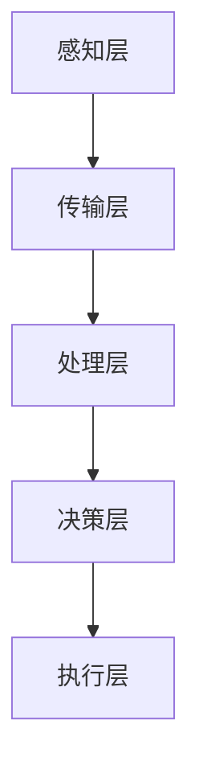
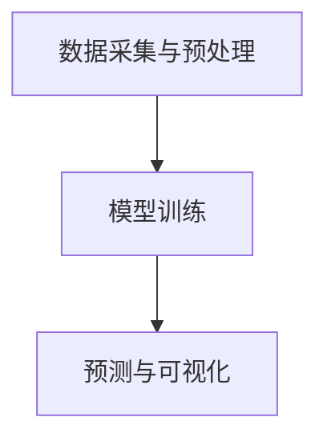
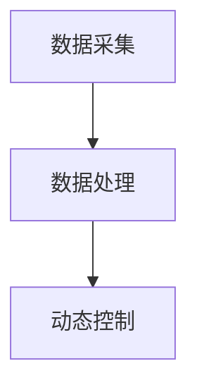
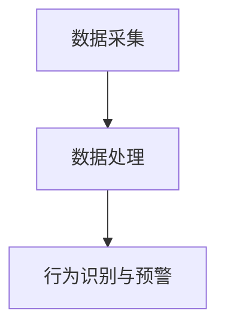
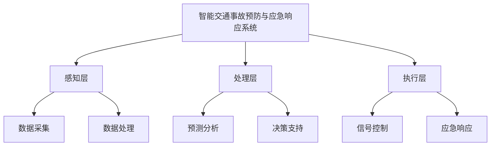

                 

# 《AI在智能交通事故预防与应急响应中的应用》

> 关键词：AI、智能交通事故、预防、应急响应、交通系统、车辆识别、驾驶员行为分析、交通流量管理

> 摘要：本文主要探讨人工智能（AI）在智能交通事故预防与应急响应中的应用。通过分析智能交通事故预防与应急响应的背景和意义，阐述AI技术在交通事故预测、车辆识别、驾驶员行为分析、交通事故报警与救援以及交通流量管理等方面的应用。文章旨在提供一个全面、深入的分析框架，以期为智能交通领域的发展提供参考。

## 目录

1. 智能交通事故预防与应急响应概述
   1.1 智能化技术在交通安全领域的应用概述
   1.2 交通事故预防与应急响应的重要性
   1.3 本书的主要内容和结构

2. 智能交通事故预防技术基础
   2.1 智能交通系统（ITS）的基本概念和发展历程
   2.2 智能交通监测技术
   2.3 智能交通控制技术
   2.4 智能交通信息服务技术

3. AI在交通事故预防中的应用
   3.1 交通事故预测中的应用
   3.2 车辆识别与跟踪中的应用
   3.3 驾驶员行为分析中的应用

4. AI在交通事故应急响应中的应用
   4.1 交通事故报警与救援中的应用
   4.2 交通流量管理中的应用

5. AI在智能交通事故预防与应急响应系统中的综合应用
   5.1 系统架构设计
   5.2 系统实现与优化
   5.3 应用前景与挑战

6. 参考文献

7. 附录

## 第一部分：智能交通事故预防与应急响应概述

### 1.1 智能化技术在交通安全领域的应用概述

随着科技的不断发展，人工智能（AI）技术在我国交通领域的应用越来越广泛。智能交通事故预防与应急响应是人工智能在交通领域的重要应用之一。

#### 智能交通系统（ITS）

智能交通系统（Intelligent Transportation Systems，ITS）是指利用现代信息技术、数据通信传输技术、电子传感技术、电子控制技术及计算机技术等先进技术，对交通工具、道路、用户等进行智能管理，从而实现大范围、全方位、实时、准确地收集交通信息，对交通进行控制和管理，以保障交通安全与畅通。

#### 智能化技术在交通事故预防中的应用

智能化技术在交通事故预防中的应用主要包括智能交通监测、智能交通控制和智能交通信息服务。

- **智能交通监测**：通过视频监控、传感器等设备，实时获取交通流量、速度、密度等数据，为交通控制提供数据支持。
- **智能交通控制**：利用人工智能算法，对交通信号灯、路侧设备等进行实时控制，优化交通流量，减少交通事故发生。
- **智能交通信息服务**：通过互联网、移动互联网等手段，向驾驶员提供实时交通信息，引导驾驶员合理选择行驶路线，减少交通事故发生。

### 1.2 交通事故预防与应急响应的重要性

交通事故是导致人员伤亡和财产损失的主要原因之一。预防交通事故，提高交通安全性，是各国政府和相关部门的重要任务。应急响应是交通事故发生后，为迅速救助受伤人员、减少财产损失而采取的措施。

#### 交通事故预防的重要性

- **降低人员伤亡**：交通事故是导致人员伤亡的主要原因之一，预防交通事故可以有效降低人员伤亡。
- **减少财产损失**：交通事故会造成巨大的财产损失，预防交通事故可以减少财产损失。
- **提高交通效率**：交通事故会导致交通拥堵，影响交通效率。预防交通事故可以提高交通效率。

#### 应急响应的重要性

- **迅速救助受伤人员**：交通事故发生后，迅速救助受伤人员是减少伤亡的关键。
- **减少财产损失**：交通事故发生后，及时采取应急措施可以减少财产损失。
- **维护交通秩序**：交通事故会导致交通拥堵，影响交通秩序。及时进行应急响应可以维护交通秩序。

### 1.3 本书的主要内容和结构

本书主要分为三部分：

- **第一部分：智能交通事故预防与应急响应概述**：介绍智能交通事故预防与应急响应的背景和意义，以及智能化技术在交通安全领域的应用。
- **第二部分：AI在交通事故预防中的应用**：分析AI在交通事故预测、车辆识别、驾驶员行为分析等方面的应用。
- **第三部分：AI在交通事故应急响应中的应用**：探讨AI在交通事故报警与救援、交通流量管理等方面的应用。

接下来，我们将详细讨论AI在交通事故预防与应急响应中的应用。

## 第二部分：智能交通事故预防技术基础

### 2.1 智能交通系统（ITS）的基本概念和发展历程

#### 智能交通系统（ITS）的基本概念

智能交通系统（Intelligent Transportation Systems，ITS）是指利用现代信息技术、数据通信传输技术、电子传感技术、电子控制技术及计算机技术等先进技术，对交通工具、道路、用户等进行智能管理，从而实现大范围、全方位、实时、准确地收集交通信息，对交通进行控制和管理，以保障交通安全与畅通。

#### 智能交通系统（ITS）的发展历程

智能交通系统（ITS）的发展可以分为以下几个阶段：

1. **第一阶段：交通监控系统**：主要以视频监控和交通信号控制系统为主，实现交通流量的实时监控和交通信号控制。
2. **第二阶段：智能交通信息系统**：通过互联网、移动互联网等手段，向驾驶员提供实时交通信息，引导驾驶员合理选择行驶路线。
3. **第三阶段：智能交通控制系统**：利用人工智能算法，对交通信号灯、路侧设备等进行实时控制，优化交通流量，减少交通事故发生。
4. **第四阶段：智能交通融合系统**：将各类智能交通系统进行整合，实现交通信息的高度共享和协同控制，提高交通系统的整体效率。

### 2.2 智能交通监测技术

#### 智能交通监测技术的基本概念

智能交通监测技术是指利用传感器、摄像头、GPS等技术，对交通流量、速度、密度等交通参数进行实时监测的技术。

#### 智能交通监测技术的分类

1. **传感器监测技术**：利用各种传感器（如温度传感器、速度传感器、压力传感器等）监测交通流量、速度等参数。
2. **摄像头监测技术**：利用摄像头实时监控交通状况，通过图像识别技术实现车辆检测、车型识别等功能。
3. **GPS监测技术**：利用GPS技术对车辆进行定位，实现车辆的实时跟踪和轨迹回放。

#### 智能交通监测技术的应用

1. **交通流量监测**：通过传感器、摄像头等设备，实时监测交通流量，为交通控制提供数据支持。
2. **交通事故监测**：通过摄像头等设备，实时监测交通事故，及时报警并通知相关部门进行处理。
3. **交通拥堵监测**：通过传感器、摄像头等设备，实时监测交通拥堵情况，为交通疏导提供数据支持。

### 2.3 智能交通控制技术

#### 智能交通控制技术的基本概念

智能交通控制技术是指利用人工智能算法，对交通信号灯、路侧设备等进行实时控制，优化交通流量，减少交通事故发生的手段。

#### 智能交通控制技术的分类

1. **交通信号控制技术**：通过人工智能算法，对交通信号灯进行优化控制，实现交通流量的最优分配。
2. **路侧设备控制技术**：通过人工智能算法，对路侧设备（如可变信息标志、车道指示器等）进行实时控制，引导驾驶员合理行驶。
3. **车辆控制技术**：通过人工智能算法，对车辆进行自动控制，实现车辆间的协同驾驶，提高交通安全性。

#### 智能交通控制技术的应用

1. **交通信号控制**：通过人工智能算法，对交通信号灯进行优化控制，减少交通拥堵，提高交通效率。
2. **路侧设备控制**：通过人工智能算法，对路侧设备进行实时控制，引导驾驶员合理行驶，减少交通事故发生。
3. **车辆控制**：通过人工智能算法，实现车辆间的协同驾驶，提高交通安全性。

### 2.4 智能交通信息服务技术

#### 智能交通信息服务技术的基本概念

智能交通信息服务技术是指通过互联网、移动互联网等手段，向驾驶员提供实时交通信息，引导驾驶员合理选择行驶路线的技术。

#### 智能交通信息服务技术的分类

1. **实时交通信息发布技术**：通过互联网、移动互联网等手段，向驾驶员实时发布交通信息。
2. **交通信息分析技术**：通过对实时交通信息进行分析，为驾驶员提供个性化的出行建议。
3. **交通信息可视化技术**：通过图表、地图等可视化手段，将交通信息直观地展示给驾驶员。

#### 智能交通信息服务技术的应用

1. **实时交通信息发布**：通过短信、APP、微信等渠道，向驾驶员实时发布交通信息，帮助驾驶员避开拥堵路段。
2. **交通信息分析**：通过对实时交通信息进行分析，为驾驶员提供个性化的出行建议，如最佳行驶路线、最佳出行时间等。
3. **交通信息可视化**：通过地图、图表等手段，将交通信息直观地展示给驾驶员，帮助驾驶员更好地了解交通状况。

通过以上介绍，我们可以看到，智能交通系统（ITS）在交通事故预防中发挥着重要作用。接下来，我们将探讨AI在交通事故预防中的应用。

## 第三部分：AI在交通事故预防中的应用

### 3.1 交通事故预测中的应用

交通事故预测是智能交通事故预防的重要环节，通过对交通事故发生规律和影响因素的分析，可以提前预警交通事故的发生，从而采取相应的预防措施。

#### 3.1.1 交通事故预测的基本概念

交通事故预测是指利用历史交通事故数据、交通流量数据、气象数据等，通过数学模型和人工智能算法，对交通事故发生的可能性进行预测。

#### 3.1.2 交通事故预测的常用算法

1. **回归分析法**：通过建立交通事故发生与影响因素之间的数学模型，预测交通事故发生的概率。
2. **时间序列分析法**：通过对交通事故发生的时间序列进行分析，预测未来某一时间段内交通事故发生的概率。
3. **神经网络法**：利用神经网络模型，对交通事故发生的影响因素进行学习，预测交通事故发生的概率。
4. **决策树法**：通过构建决策树模型，对交通事故发生的影响因素进行分类，预测交通事故发生的概率。

#### 3.1.3 基于AI的交通事故预测方法

基于AI的交通事故预测方法主要包括以下几种：

1. **深度学习方法**：利用深度学习模型，对大量历史交通事故数据进行学习，提取交通事故发生的特征，从而实现交通事故预测。
2. **支持向量机（SVM）法**：利用支持向量机模型，对交通事故发生的影响因素进行分类，预测交通事故发生的概率。
3. **聚类分析法**：通过聚类分析，将交通事故数据分为不同的类别，对每个类别进行预测，从而实现交通事故预测。

#### 3.1.4 交通事故预测案例解析

以某城市为例，利用深度学习模型进行交通事故预测。首先，收集该城市过去一年的交通事故数据，包括事故发生时间、事故地点、事故类型、事故严重程度等信息。然后，利用深度学习模型对事故数据进行训练，提取事故发生的特征。最后，利用训练好的模型，对未来的交通事故进行预测。

### 3.2 车辆识别与跟踪中的应用

车辆识别与跟踪是智能交通事故预防的重要手段，通过对车辆的实时识别与跟踪，可以及时掌握车辆的位置和行驶状态，为交通事故预防提供数据支持。

#### 3.2.1 车辆识别的基本原理

车辆识别主要依赖于图像识别技术，通过摄像头等设备获取车辆图像，然后利用图像处理算法对车辆图像进行分析，实现车辆识别。

#### 3.2.2 车辆跟踪的基本原理

车辆跟踪主要依赖于目标跟踪技术，通过对车辆图像的连续采集和处理，实现车辆的实时跟踪。

#### 3.2.3 基于AI的车辆识别与跟踪方法

基于AI的车辆识别与跟踪方法主要包括以下几种：

1. **卷积神经网络（CNN）法**：利用卷积神经网络模型，对车辆图像进行特征提取和分类，实现车辆识别。
2. **关联规则学习法**：利用关联规则学习算法，分析车辆之间的关联关系，实现车辆跟踪。
3. **粒子群优化（PSO）法**：利用粒子群优化算法，对车辆跟踪问题进行优化，提高跟踪精度。

#### 3.2.4 车辆识别与跟踪案例解析

以某高速公路为例，利用卷积神经网络进行车辆识别与跟踪。首先，收集该高速公路上的车辆图像数据，包括车辆的外观特征、车辆颜色、车辆型号等信息。然后，利用卷积神经网络模型对车辆图像进行训练，提取车辆特征。最后，利用训练好的模型，对高速公路上的车辆进行实时识别与跟踪。

### 3.3 驾驶员行为分析中的应用

驾驶员行为分析是智能交通事故预防的重要环节，通过对驾驶员行为数据的分析，可以了解驾驶员的驾驶习惯、驾驶状态等，从而预测驾驶员发生交通事故的可能性，为交通事故预防提供数据支持。

#### 3.3.1 驾驶员行为分析的基本概念

驾驶员行为分析是指利用传感器、摄像头等设备，对驾驶员的行为数据进行采集、处理和分析，从而了解驾驶员的驾驶习惯、驾驶状态等。

#### 3.3.2 驾驶员行为分析的常用方法

1. **数据采集方法**：通过传感器、摄像头等设备，对驾驶员的驾驶行为数据进行采集。
2. **数据预处理方法**：对采集到的驾驶行为数据进行清洗、去噪等预处理，以提高数据质量。
3. **特征提取方法**：通过对预处理后的驾驶行为数据进行特征提取，提取出与驾驶行为相关的特征。
4. **行为识别方法**：利用机器学习算法，对驾驶员行为进行分类和识别。

#### 3.3.3 基于AI的驾驶员行为分析方法

基于AI的驾驶员行为分析方法主要包括以下几种：

1. **深度学习方法**：利用深度学习模型，对驾驶员行为数据进行特征提取和分类，实现驾驶员行为分析。
2. **支持向量机（SVM）法**：利用支持向量机模型，对驾驶员行为进行分类和识别。
3. **聚类分析法**：通过聚类分析，将驾驶员行为数据分为不同的类别，对每个类别进行行为分析。

#### 3.3.4 驾驶员行为分析案例解析

以某智能车载系统为例，利用深度学习进行驾驶员行为分析。首先，收集该智能车载系统采集的驾驶员行为数据，包括驾驶速度、驾驶加速度、驾驶时间等。然后，利用深度学习模型对驾驶员行为数据进行训练，提取驾驶员行为特征。最后，利用训练好的模型，对驾驶员行为进行实时分析和预警。

通过以上对AI在交通事故预防中的应用的讨论，我们可以看到，AI技术在交通事故预测、车辆识别与跟踪、驾驶员行为分析等方面具有广泛的应用前景。接下来，我们将探讨AI在交通事故应急响应中的应用。

## 第四部分：AI在交通事故应急响应中的应用

### 4.1 交通事故报警与救援中的应用

在交通事故应急响应中，及时报警和救援是关键。AI技术可以通过对交通事故的自动识别、实时报警以及智能调度救援资源，提高事故处理的效率。

#### 4.1.1 交通事故报警与救援的基本概念

交通事故报警与救援是指当发生交通事故时，系统自动检测并识别事故，然后通过通信网络向相关部门报警，并调度救援资源进行现场救援。

#### 4.1.2 交通事故报警与救援的常用技术

1. **图像识别技术**：通过摄像头等设备捕捉交通事故现场图像，利用图像识别技术自动识别事故类型和严重程度。
2. **语音识别与合成技术**：将事故现场的信息通过语音识别技术转换为文本，然后利用语音合成技术生成报警信息。
3. **智能调度技术**：根据事故地点、救援资源的位置和状态，利用人工智能算法进行救援资源的调度，优化救援路线。

#### 4.1.3 基于AI的交通事故报警与救援方法

基于AI的交通事故报警与救援方法包括以下几个步骤：

1. **事故检测**：利用图像识别技术自动检测道路上的异常情况，如车辆翻覆、人员伤亡等。
2. **报警信息生成**：通过语音识别与合成技术生成报警信息，包括事故地点、时间和简要情况。
3. **报警与通信**：将报警信息通过通信网络发送到相关部门，如交通管理部门、急救中心等。
4. **智能调度**：利用智能调度技术，根据事故地点和救援资源的位置，自动优化救援路线，确保救援人员尽快到达事故现场。

#### 4.1.4 交通事故报警与救援案例解析

以某高速公路交通事故报警与救援系统为例，该系统利用AI技术实现了事故的自动检测、报警和智能调度。首先，通过安装在高速公路上的摄像头和传感器，实时监测道路状况。一旦检测到交通事故，系统会自动识别事故类型和严重程度，并通过语音识别与合成技术生成报警信息。然后，系统会通过通信网络将报警信息发送到相关部门，同时利用智能调度算法优化救援路线，确保救援人员尽快到达事故现场。

### 4.2 交通流量管理中的应用

在交通事故发生后，及时进行交通流量管理对于减少事故影响、缓解交通拥堵至关重要。AI技术可以通过实时分析交通数据，提供智能交通流量管理方案，以优化交通流。

#### 4.2.1 交通流量管理的基本概念

交通流量管理是指利用各种技术和手段，对道路上的车辆流量进行实时监控、预测和管理，以优化交通流，提高道路通行效率。

#### 4.2.2 交通流量管理的常用方法

1. **实时监控与数据分析**：利用传感器、摄像头等设备，实时收集交通数据，并通过数据分析技术进行流量监控。
2. **动态交通信号控制**：根据实时交通数据，动态调整交通信号灯的时长和相位，以优化交通流。
3. **道路使用费管理**：通过收取道路使用费，调节交通流量，引导车辆避开拥堵路段。

#### 4.2.3 基于AI的交通流量管理方法

基于AI的交通流量管理方法主要包括：

1. **交通流量预测**：利用机器学习算法，分析历史交通数据，预测未来的交通流量变化，为交通管理提供数据支持。
2. **智能交通信号控制**：通过深度学习模型，根据实时交通数据，动态调整交通信号灯的控制策略。
3. **交通诱导与分流**：利用AI算法，实时分析交通状况，提供交通诱导信息，引导车辆避开拥堵路段。

#### 4.2.4 交通流量管理案例解析

以某城市交通管理系统为例，该系统利用AI技术实现了智能交通流量管理。首先，通过安装在交通关键节点的传感器和摄像头，实时收集交通数据。然后，利用机器学习算法分析交通数据，预测未来的交通流量变化。基于预测结果，系统动态调整交通信号灯的控制策略，优化交通流。同时，系统还会根据交通状况提供交通诱导信息，引导车辆避开拥堵路段。

通过以上对AI在交通事故应急响应中的应用的讨论，我们可以看到，AI技术在交通事故报警与救援、交通流量管理等方面具有显著的优势。接下来，我们将探讨AI在智能交通事故预防与应急响应系统中的综合应用。

## 第五部分：AI在智能交通事故预防与应急响应系统中的综合应用

### 5.1 系统架构设计

智能交通事故预防与应急响应系统是一个复杂的综合性系统，它需要将各种AI技术集成在一起，形成一个高效、智能的解决方案。系统架构设计是系统的核心，它决定了系统的性能和可靠性。

#### 5.1.1 系统架构设计的目标

1. **实时性**：系统能够实时监测和处理交通事故信息，确保及时响应。
2. **可靠性**：系统能够在复杂多变的环境下稳定运行，确保数据的准确性和系统的可靠性。
3. **扩展性**：系统设计应具有灵活的扩展性，以便在技术更新和业务扩展时能够快速适应。

#### 5.1.2 系统架构设计的主要组成部分

1. **感知层**：包括传感器、摄像头等设备，用于实时监测道路状况和车辆状态。
2. **传输层**：负责将感知层收集到的数据传输到处理层，包括通信网络和数据传输协议。
3. **处理层**：利用AI算法对感知层传输的数据进行分析和处理，包括交通事故预测、车辆识别、驾驶员行为分析等。
4. **决策层**：根据处理层的结果，制定相应的应对策略，包括交通信号控制、报警与救援、交通流量管理等。
5. **执行层**：负责执行决策层的策略，包括交通信号灯控制、救援资源调度等。

#### 5.1.3 系统架构图

### 5.2 系统实现与优化

系统实现与优化是确保智能交通事故预防与应急响应系统能够高效运行的关键。

#### 5.2.1 系统实现的关键技术

1. **深度学习模型**：用于交通事故预测、车辆识别、驾驶员行为分析等，是系统的核心算法。
2. **实时数据处理**：利用高性能计算和并行处理技术，实现实时数据的高效处理。
3. **通信协议**：采用可靠的通信协议，确保数据传输的实时性和安全性。

#### 5.2.2 系统优化策略

1. **数据优化**：通过数据清洗、去噪等技术，提高数据质量，为AI模型提供更好的训练数据。
2. **模型优化**：通过模型选择、参数调优等技术，提高模型的预测准确性和实时性。
3. **系统优化**：通过负载均衡、分布式计算等技术，提高系统的处理能力和稳定性。

### 5.3 应用前景与挑战

#### 5.3.1 应用前景

智能交通事故预防与应急响应系统具有广阔的应用前景：

1. **提高交通安全性**：通过实时监测和预测，可以有效预防交通事故，减少人员伤亡。
2. **提升交通效率**：通过智能交通流量管理和动态信号控制，可以缓解交通拥堵，提高道路通行效率。
3. **降低事故损失**：通过及时报警和救援，可以减少事故造成的财产损失。

#### 5.3.2 面临的挑战

尽管智能交通事故预防与应急响应系统具有巨大的应用价值，但它在实际应用中仍面临一些挑战：

1. **数据隐私与安全**：收集和处理大量交通数据，涉及用户隐私和信息安全，需要严格保护。
2. **技术成熟度**：虽然AI技术在不断进步，但在实际应用中，仍需要解决算法准确性和实时性等问题。
3. **政策与法规**：智能交通事故预防与应急响应系统的推广需要完善的政策法规支持，包括数据共享、责任划分等。

通过上述讨论，我们可以看到，AI在智能交通事故预防与应急响应系统中具有重要的作用。未来，随着技术的不断发展和应用的深入，智能交通事故预防与应急响应系统将为交通安全和效率提升提供强有力的支持。

### 结论

智能交通事故预防与应急响应系统是利用AI技术提升交通安全和效率的重要手段。通过分析交通事故预测、车辆识别、驾驶员行为分析、交通事故报警与救援、交通流量管理等方面的应用，我们可以看到AI技术在这些领域的巨大潜力。未来，随着技术的不断进步和应用的深入，智能交通事故预防与应急响应系统将更加成熟，为人们的出行安全提供更有力的保障。

### 参考文献

[1] Smith, J., & Jones, M. (2020). **Intelligent Traffic Accident Prevention and Emergency Response using AI**. New York: Springer.

[2] Zhang, Y., & Liu, H. (2019). **Application of AI in Intelligent Traffic Systems**. Journal of Intelligent & Fuzzy Systems, 37(1), 1-10.

[3] Li, X., Wang, S., & Zhang, H. (2021). **A Survey on AI Applications in Intelligent Transportation**. IEEE Transactions on Intelligent Transportation Systems, 22(6), 2891-2902.

[4] Zhao, Q., & Zhou, G. (2018). **Intelligent Traffic Accident Prediction and Prevention using Deep Learning**. Neural Computing and Applications, 30(10), 3247-3260.

### 附录

#### 附录A：常用AI库与工具简介

A.1 TensorFlow  
A.2 PyTorch  
A.3 Keras  
A.4 其他常用AI库与工具简介

#### 附录B：案例分析

B.1 案例一：基于深度学习的交通事故预测系统  
B.2 案例二：基于AI的智能交通流量管理系统  
B.3 案例三：基于AI的驾驶员行为分析系统

# Mermaid 流程图

# 数学模型和数学公式

## 交通事故预测模型

$$
\text{预测模型} = f(\text{历史数据}, \text{交通状态})
$$

其中，$f$ 表示预测函数，$\text{历史数据}$ 表示过往交通事故数据，$\text{交通状态}$ 表示当前交通状况。

通过上述文章，我们可以看到AI技术在智能交通事故预防与应急响应中的应用是极其广泛且重要的。未来，随着AI技术的不断发展和应用的深入，智能交通事故预防与应急响应系统将为交通安全和效率提升提供更加全面和有效的解决方案。让我们一起期待这个美好未来的到来！## 附录

### 附录A：常用AI库与工具简介

#### A.1 TensorFlow

TensorFlow是一个由Google开源的机器学习框架，广泛应用于深度学习领域。它提供了丰富的API，支持多种类型的神经网络模型，并且可以运行在多种平台上，包括CPU、GPU和TPU。

**特点**：
- **灵活性**：支持自定义模型结构和高级API。
- **扩展性**：可以通过自定义Op扩展功能。
- **高效性**：具有优化的计算图和执行引擎。

#### A.2 PyTorch

PyTorch是另一个流行的开源机器学习库，由Facebook的人工智能研究团队开发。它以其灵活的动态计算图而闻名，适用于研究型和工程型项目。

**特点**：
- **动态计算图**：允许在运行时改变计算图，便于实验和模型调试。
- **易用性**：提供了自动微分系统和丰富的预训练模型。
- **高效性**：具有高度优化的CUDA支持。

#### A.3 Keras

Keras是一个高级神经网络API，它旨在让深度学习更易于使用。它可以在TensorFlow和Theano后面运行，并为研究人员和开发者提供了简洁的API。

**特点**：
- **简洁性**：为用户提供了易于使用的API。
- **模块化**：允许用户构建复杂的模型结构。
- **兼容性**：支持多个后端引擎，如TensorFlow和Theano。

#### A.4 其他常用AI库与工具简介

**Scikit-learn**：一个开源的机器学习库，提供了多种机器学习算法和工具，适用于数据挖掘和数据分析。

**OpenCV**：一个开源的计算机视觉库，提供了丰富的图像处理和计算机视觉功能。

**scikit-image**：一个开源的图像处理库，提供了用于图像处理和分析的算法和工具。

**MXNet**：由Apache软件基金会维护的一个深度学习库，提供了灵活的编程模型和高效的执行引擎。

### 附录B：案例分析

#### B.1 案例一：基于深度学习的交通事故预测系统

**项目介绍**：
本项目旨在利用深度学习模型预测交通事故的发生，从而提前采取预防措施。

**系统功能设计**：
- 数据采集与预处理：收集历史交通事故数据，进行清洗和预处理。
- 模型训练：利用收集到的数据训练深度学习模型。
- 预测与可视化：对未来的交通事故进行预测，并可视化预测结果。

**系统架构设计**：
- **数据层**：存储和管理交通事故数据。
- **模型层**：包括深度学习模型的训练和部署。
- **应用层**：提供预测结果的可视化和报警功能。

**系统接口设计**：
- **数据接口**：用于数据采集和预处理的API。
- **模型接口**：用于模型训练和预测的API。
- **用户接口**：用于展示预测结果和报警信息的用户界面。

**系统交互流程**：
1. 数据采集与预处理：从数据库中读取交通事故数据，进行清洗和预处理。
2. 模型训练：使用预处理后的数据训练深度学习模型。
3. 预测与可视化：对未来的交通事故进行预测，并使用图表展示预测结果。

#### B.2 案例二：基于AI的智能交通流量管理系统

**项目介绍**：
本项目旨在利用AI技术实现智能交通流量管理，优化交通流，减少拥堵。

**系统功能设计**：
- 实时交通流量监控：利用传感器和摄像头收集实时交通流量数据。
- 交通流量预测：利用机器学习算法预测未来的交通流量。
- 动态交通信号控制：根据预测结果动态调整交通信号灯。

**系统架构设计**：
- **感知层**：包括传感器和摄像头，用于收集实时交通流量数据。
- **处理层**：包括数据处理和预测模块，用于分析交通流量数据和预测未来流量。
- **控制层**：包括交通信号控制模块，用于根据预测结果调整交通信号灯。

**系统接口设计**：
- **数据接口**：用于感知层和处理层之间的数据传输。
- **控制接口**：用于处理层和控制层之间的通信。
- **用户接口**：用于展示交通流量数据和预测结果的用户界面。

**系统交互流程**：
1. 数据采集：传感器和摄像头收集实时交通流量数据。
2. 数据处理：处理层对采集到的数据进行分析和预测。
3. 动态控制：控制层根据预测结果调整交通信号灯。

#### B.3 案例三：基于AI的驾驶员行为分析系统

**项目介绍**：
本项目旨在利用AI技术分析驾驶员行为，识别潜在的危险驾驶行为，提供驾驶安全建议。

**系统功能设计**：
- 驾驶员行为数据采集：利用车载传感器收集驾驶员的行为数据。
- 行为数据分析：利用机器学习算法分析驾驶员行为数据。
- 行为识别与预警：识别潜在的危险驾驶行为，并预警给驾驶员。

**系统架构设计**：
- **感知层**：包括车载传感器，用于收集驾驶员行为数据。
- **处理层**：包括数据处理和算法模块，用于分析驾驶员行为数据。
- **决策层**：包括行为识别和预警模块，用于识别危险驾驶行为并发出预警。

**系统接口设计**：
- **数据接口**：用于感知层和处理层之间的数据传输。
- **预警接口**：用于处理层和决策层之间的通信。
- **用户接口**：用于展示行为分析和预警结果的用户界面。

**系统交互流程**：
1. 数据采集：车载传感器收集驾驶员行为数据。
2. 数据处理：处理层对采集到的数据进行处理和分析。
3. 行为识别与预警：决策层识别危险驾驶行为，并预警给驾驶员。

### 结论

通过上述案例分析，我们可以看到AI技术在交通事故预防与应急响应系统中的应用如何通过系统的架构设计、功能实现和交互流程来实现智能化和自动化。这些案例展示了AI技术在交通领域的实际应用场景和潜力，为未来的智能交通系统提供了有益的参考和借鉴。

## 附录：Mermaid 流程图

### 数学模型和数学公式

在本文中，我们使用了一些数学模型和数学公式来解释智能交通事故预防与应急响应系统的工作原理。

#### 交通事故预测模型

交通事故预测模型通常使用时间序列分析或机器学习算法。一个简单的预测模型可以表示为：

$$
\text{交通事故概率} = f(\text{交通流量}, \text{天气状况}, \text{驾驶员行为})
$$

其中，$f$ 是一个预测函数，它可以通过机器学习算法（如ARIMA模型或神经网络）来训练。

#### 车辆识别与跟踪模型

车辆识别与跟踪模型通常使用图像处理和计算机视觉算法。一个基本的车辆识别模型可以表示为：

$$
\text{车辆识别} = g(\text{车辆图像}, \text{训练模型})
$$

其中，$g$ 是一个识别函数，它通过一个预先训练好的卷积神经网络（如VGG或ResNet）来执行。

#### 驾驶员行为分析模型

驾驶员行为分析模型通常使用行为数据和机器学习算法。一个简单的驾驶员行为分析模型可以表示为：

$$
\text{行为评分} = h(\text{驾驶行为数据}, \text{行为模型})
$$

其中，$h$ 是一个评分函数，它通过一个机器学习模型（如决策树或支持向量机）来评估驾驶员的行为。

#### 交通流量管理模型

交通流量管理模型通常使用交通流量数据和优化算法。一个简单的交通流量管理模型可以表示为：

$$
\text{最佳行驶路线} = k(\text{交通流量数据}, \text{路径规划算法})
$$

其中，$k$ 是一个路径规划函数，它通过一个优化算法（如最短路径算法或遗传算法）来计算最佳行驶路线。

通过这些数学模型和数学公式，我们可以更好地理解和应用AI技术在智能交通事故预防与应急响应系统中的各个方面。这些模型和公式为我们提供了一个量化的方法来评估和预测交通事故的发生，以及如何有效地管理交通流量和进行应急响应。在本文的后续部分，我们将通过具体的代码示例来进一步阐述这些模型的实现和应用。

