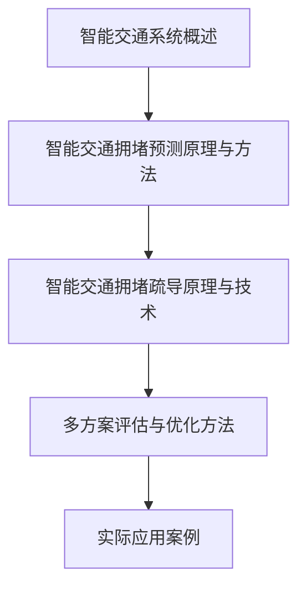

                 

## # AI在智能交通拥堵预测与疏导中的多方案评估应用

### 关键词：
- 智能交通系统
- 交通拥堵预测
- 疏导方法
- 多方案评估
- 机器学习
- 深度学习

### 摘要：
本文深入探讨了智能交通系统中的交通拥堵预测与疏导问题，分析了多种预测与疏导方法的原理和应用。文章首先概述了智能交通系统的发展背景和重要性，然后详细阐述了交通流量预测和拥堵检测的关键技术，以及智能交通拥堵疏导的原理和技术。接着，文章介绍了多方案评估的基本概念和指标体系，并探讨了机器学习和深度学习在多方案评估中的应用。最后，通过两个实际应用案例，本文展示了多方案评估和优化的实际效果，并提出了智能交通拥堵预测与疏导的未来发展趋势。本文旨在为相关领域的研究和实践提供有价值的参考和指导。

---

## 目录大纲：AI在智能交通拥堵预测与疏导中的多方案评估应用

### 第一部分：智能交通拥堵预测与疏导概述

#### 第1章：智能交通系统的概述

##### 1.1 智能交通系统的发展背景

##### 1.2 传统交通管理与智能交通的对比

##### 1.3 智能交通系统的重要性

#### 第2章：智能交通拥堵预测的原理与方法

##### 2.1 交通流量预测的基本原理

##### 2.2 基于时间序列的交通流量预测

##### 2.3 基于机器学习的交通流量预测

##### 2.4 基于深度学习的交通流量预测

##### 2.5 拥堵检测与预测的关键技术

#### 第3章：智能交通拥堵疏导的原理与技术

##### 3.1 智能交通拥堵疏导的目标

##### 3.2 智能交通拥堵疏导的方法

##### 3.3 动态交通信号控制

##### 3.4 交通诱导与信息发布

##### 3.5 车辆智能调度

### 第二部分：多方案评估与优化

#### 第4章：多方案评估的基本概念

##### 4.1 多方案评估的必要性

##### 4.2 多方案评估的方法分类

##### 4.3 多方案评估指标体系

#### 第5章：基于AI的多方案评估与优化方法

##### 5.1 机器学习在多方案评估中的应用

##### 5.2 深度学习在多方案评估中的应用

##### 5.3 多方案评估与优化的实际应用

### 第6章：多方案评估与优化的实际应用案例

##### 6.1 城市交通拥堵预测与疏导系统

##### 6.2 高速公路智能交通管理系统

### 第三部分：结论与展望

#### 第7章：智能交通拥堵预测与疏导的未来发展趋势

##### 7.1 AI技术在智能交通领域的应用前景

##### 7.2 智能交通拥堵预测与疏导的发展方向

### 附录

#### 附录A：常用算法与模型简介

##### A.1 时间序列预测算法

##### A.2 机器学习算法

##### A.3 深度学习算法

#### 附录B：项目实战指南

##### B.1 城市交通流量预测

##### B.2 动态交通信号控制

##### B.3 项目实战总结与展望

## 流程图

### AI在智能交通拥堵预测与疏导中的应用流程图



---

## 第一部分：智能交通拥堵预测与疏导概述

### 第1章：智能交通系统的概述

#### 1.1 智能交通系统的发展背景

随着城市化和汽车拥有量的迅速增长，交通拥堵问题日益严重。传统交通管理方法已经无法满足现代城市交通的需求，因此，智能交通系统（Intelligent Transportation System，ITS）的概念应运而生。智能交通系统是一种利用现代信息技术、控制技术、数据通信传输技术、电子传感技术等先进技术，实现交通管理、控制、服务、安全和效率的一种新型交通系统。

智能交通系统的发展可以追溯到20世纪80年代，当时，随着计算机技术、通信技术和传感器技术的快速发展，人们开始探索如何将这些技术应用于交通管理。到了90年代，随着互联网技术的普及，智能交通系统的概念逐渐成熟，并开始在全球范围内得到广泛应用。

#### 1.2 传统交通管理与智能交通的对比

传统交通管理主要依赖于人工监控和物理设施，如红绿灯、交通警察等。这种管理模式存在以下不足：

- **效率低**：人工监控范围有限，无法实时处理大量交通数据。
- **反应慢**：交通信号控制通常固定不变，无法根据实时交通情况做出调整。
- **安全风险**：交通警察和交通设备存在安全风险。

相比之下，智能交通系统具有以下优势：

- **实时性**：利用传感器和监控系统，可以实时获取交通数据，实现交通状态的动态监测。
- **自动化**：通过人工智能算法，可以实现交通信号的智能控制，提高交通流的通行效率。
- **安全性**：通过实时监控和智能分析，可以提前预警并防止交通事故的发生。

#### 1.3 智能交通系统的发展趋势

随着技术的不断进步，智能交通系统的发展趋势主要包括以下几个方面：

- **物联网（IoT）的应用**：物联网技术的普及，使得车辆、道路、交通信号灯等可以互联互通，实现交通信息的共享和实时更新。
- **人工智能（AI）的融合**：人工智能技术，特别是机器学习和深度学习，为交通预测、信号控制、事故预警等提供了强大的技术支持。
- **自动驾驶技术的融合**：自动驾驶技术的发展，将为智能交通系统带来全新的交通管理模式，提高交通效率和安全性。
- **大数据的利用**：大数据技术的应用，可以更好地分析交通数据，为交通管理提供科学依据。

#### 1.4 智能交通系统的重要性

智能交通系统对于解决城市交通拥堵问题具有重要意义。首先，它可以通过实时交通数据的收集和分析，提供交通预测和信号控制，优化交通流，减少拥堵。其次，智能交通系统可以提高道路通行能力，减少交通事故发生率，提高交通安全。此外，智能交通系统还可以提高公共交通的效率，减少私家车的使用，有助于环境保护。

总之，智能交通系统是现代城市交通管理的重要发展方向，对于提升城市交通管理水平、改善城市居民出行体验、促进城市可持续发展具有重要意义。

---

## 第2章：智能交通拥堵预测的原理与方法

### 2.1 交通流量预测的基本原理

交通流量预测是智能交通系统中的一个核心任务，其目的是通过分析历史交通数据和实时交通数据，预测未来某一时间段内的交通流量状况。交通流量预测的基本原理可以概括为以下几个步骤：

1. **数据收集**：首先，需要收集历史交通数据和实时交通数据。历史交通数据通常包括交通流量、速度、占有率等指标，而实时交通数据则是通过传感器和监控系统实时获取的交通状态。

2. **数据预处理**：收集到的交通数据通常需要进行预处理，包括数据清洗、数据去噪、数据归一化等。这一步骤的目的是去除数据中的噪声和异常值，保证数据的准确性和一致性。

3. **特征提取**：在预处理后的数据基础上，提取与交通流量相关的特征。这些特征可以包括时间特征（如工作日/周末、早高峰/晚高峰）、位置特征（如道路类型、路段长度）、交通状态特征（如速度、流量、占有率）等。

4. **模型选择**：根据交通流量预测的任务和数据特征，选择合适的预测模型。常见的模型包括时间序列模型、回归模型、机器学习模型等。

5. **模型训练**：使用历史数据对选定的预测模型进行训练，模型会根据历史数据学习到交通流量变化的规律。

6. **预测**：使用训练好的模型对未来的交通流量进行预测，输出预测结果。

7. **评估**：对预测结果进行评估，以确定模型的预测准确性。常用的评估指标包括平均绝对误差（MAE）、均方误差（MSE）、平均绝对百分比误差（MAPE）等。

### 2.2 基于时间序列的交通流量预测

基于时间序列的交通流量预测是一种传统的预测方法，其基本思想是利用历史时间序列数据，通过时间序列分析方法，预测未来的交通流量。这种方法主要依赖于以下几个步骤：

1. **时间序列分解**：首先，对时间序列数据进行分析，将其分解为趋势成分、季节成分和不规则成分。这一步骤的目的是去除数据中的季节性和随机性，以便更好地捕捉数据的基本趋势。

2. **建模**：基于分解后的时间序列数据，选择合适的时间序列模型进行建模。常见的时间序列模型包括ARIMA（自回归积分滑动平均模型）、AR（自回归模型）、MA（滑动平均模型）等。

3. **模型参数估计**：对选定的模型进行参数估计，确定模型中的参数值。

4. **预测**：使用估计好的模型对未来的交通流量进行预测。

5. **评估**：对预测结果进行评估，以确定模型的预测准确性。

### 2.3 基于机器学习的交通流量预测

基于机器学习的交通流量预测方法近年来得到了广泛的研究和应用。这种方法利用机器学习算法，从历史数据中学习到交通流量变化的规律，并利用这些规律对未来的交通流量进行预测。这种方法的主要步骤如下：

1. **特征工程**：对历史交通数据进行特征提取，构建与交通流量相关的特征。这些特征可以包括时间特征、位置特征、交通状态特征等。

2. **模型选择**：根据特征和数据的特点，选择合适的机器学习模型。常见的模型包括线性回归、支持向量机（SVM）、决策树、随机森林、神经网络等。

3. **模型训练**：使用历史数据对选定的机器学习模型进行训练，模型会根据历史数据学习到交通流量变化的规律。

4. **预测**：使用训练好的模型对未来的交通流量进行预测。

5. **评估**：对预测结果进行评估，以确定模型的预测准确性。

### 2.4 基于深度学习的交通流量预测

深度学习是一种基于多层神经网络的机器学习技术，近年来在交通流量预测领域得到了广泛应用。基于深度学习的交通流量预测方法主要依赖于以下几个步骤：

1. **数据预处理**：对历史交通数据进行预处理，包括数据清洗、数据去噪、数据归一化等。

2. **模型设计**：设计合适的深度学习模型，常见的模型包括卷积神经网络（CNN）、循环神经网络（RNN）、长短期记忆网络（LSTM）等。

3. **模型训练**：使用预处理后的历史交通数据对深度学习模型进行训练，模型会根据历史数据学习到交通流量变化的规律。

4. **预测**：使用训练好的模型对未来的交通流量进行预测。

5. **评估**：对预测结果进行评估，以确定模型的预测准确性。

### 2.5 拥堵检测与预测的关键技术

拥堵检测与预测是智能交通系统中非常重要的环节，其目的是通过分析实时交通数据，检测道路上的拥堵状况，并预测未来可能的拥堵点。拥堵检测与预测的关键技术包括：

1. **交通流量检测算法**：常用的交通流量检测算法包括速度阈值法、流量阈值法、占有率阈值法等。这些算法可以根据交通数据的特征，检测道路上的交通状态。

2. **拥堵预测算法**：常用的拥堵预测算法包括时间序列预测、回归预测、机器学习预测等。这些算法可以根据历史数据和实时数据，预测未来道路上的交通流量变化。

3. **实时交通数据处理**：实时交通数据处理是拥堵检测与预测的关键环节，需要快速处理大量的实时交通数据，提取有用的信息，为预测模型提供数据支持。

4. **交通状态可视化**：通过交通状态可视化技术，可以直观地展示道路上的交通状况，帮助交通管理者及时调整交通控制策略。

总之，智能交通拥堵预测与疏导需要多种技术的综合应用，通过精确的预测和有效的疏导，可以有效缓解城市交通拥堵问题，提高交通系统的运行效率。在下一章中，我们将进一步探讨智能交通拥堵疏导的原理与技术。

---

## 第3章：智能交通拥堵疏导的原理与技术

### 3.1 智能交通拥堵疏导的目标

智能交通拥堵疏导的目标主要包括以下几个方面：

1. **疏导拥堵的交通流量分布**：通过动态调整交通信号、提供交通诱导信息等手段，引导车辆合理分布，减少某一路段的交通流量，从而缓解整体交通拥堵。

2. **提高道路通行能力**：通过优化交通信号控制、加强交通管理、提高道路利用率等手段，提升道路通行能力，缩短车辆行驶时间，提高交通效率。

3. **减少交通事故发生率**：通过实时监控交通状况、及时预警和干预，降低交通事故的发生率，提高交通安全性。

### 3.2 智能交通拥堵疏导的方法

智能交通拥堵疏导的方法主要包括以下几种：

1. **动态交通信号控制**：
   - **自适应交通信号控制**：通过实时监控交通流量，动态调整交通信号灯的时长和相位，以适应交通流量的变化，提高交通流畅度。
   - **协调控制**：在多路口之间建立协调控制，使相邻路口的交通信号能够同步变化，减少交通延误。

2. **交通诱导与信息发布**：
   - **实时交通信息发布**：通过电子屏幕、广播、移动互联网等途径，向驾驶员提供实时交通信息，如道路拥堵情况、交通事故预警等，引导车辆选择最佳路线。
   - **动态路线规划**：利用导航系统和智能交通系统，根据实时交通状况，为驾驶员提供最优路线规划，减少行驶时间。

3. **车辆智能调度**：
   - **公共交通调度**：通过智能调度系统，实时调整公交车的发车时间和路线，提高公共交通的运行效率，减少乘客等待时间。
   - **货运车辆调度**：通过优化货运车辆的行驶路线和时间，减少交通拥堵，提高物流效率。

4. **交通需求管理**：
   - **高峰时段限行**：在交通拥堵严重的时段，对特定车辆实行限行政策，减少交通流量。
   - **停车管理**：通过智能停车管理系统，合理分配停车资源，减少因停车难导致的交通拥堵。

### 3.3 动态交通信号控制

动态交通信号控制是智能交通拥堵疏导的重要组成部分，其核心在于通过实时监控交通流量，动态调整交通信号灯的时长和相位。具体方法包括：

1. **交通流量监测**：通过安装于道路上的各类传感器，如摄像头、流量监测仪、雷达等，实时监测交通流量、速度、占有率等交通参数。

2. **信号控制算法**：基于实时监测的交通参数，利用优化算法，计算交通信号灯的最优时长和相位。常用的算法包括最优前向追赶算法（OFC）、差分进化算法（DE）、粒子群优化算法（PSO）等。

3. **信号控制执行**：将计算出的最优信号控制方案传输到交通信号灯控制器，动态调整交通信号灯的时长和相位。

4. **反馈调整**：在信号控制执行后，通过持续监测交通流量，对信号控制方案进行反馈调整，以确保交通信号控制的有效性。

### 3.4 交通诱导与信息发布

交通诱导与信息发布是帮助驾驶员合理规划路线，减少交通拥堵的重要手段。具体方法包括：

1. **实时交通信息采集**：通过交通监控系统、车辆传感器等设备，实时采集道路上的交通流量、速度、事故等信息。

2. **信息处理与发布**：将采集到的交通信息进行处理，生成交通诱导信息，并通过电子屏幕、广播、移动互联网等途径向驾驶员发布。

3. **动态路线规划**：利用实时交通信息和导航系统，为驾驶员提供动态路线规划，避开拥堵路段。

4. **应急交通管理**：在发生交通事故或突发事件时，通过交通诱导系统，引导车辆避开事故现场，缓解交通压力。

### 3.5 车辆智能调度

车辆智能调度是提高交通效率、减少拥堵的关键措施。具体方法包括：

1. **公共交通调度**：通过智能调度系统，实时调整公交车的发车时间和路线，确保公交车在客流高峰时段能够及时到达，提高乘客满意度。

2. **货运车辆调度**：利用智能调度系统，优化货运车辆的行驶路线和时间，减少因货物配送导致的交通拥堵。

3. **出租车和网约车调度**：通过智能调度系统，提高出租车和网约车的利用率，减少空驶率，提高交通效率。

4. **共享单车调度**：通过智能调度系统，合理分配共享单车资源，减少因共享单车过多或过少导致的交通拥堵。

总之，智能交通拥堵疏导是一项复杂的系统工程，需要多种技术的综合应用。通过动态交通信号控制、交通诱导与信息发布、车辆智能调度等多种手段，可以有效缓解城市交通拥堵问题，提高交通系统的运行效率。在下一部分中，我们将进一步探讨多方案评估与优化的基本概念和方法。

---

## 第二部分：多方案评估与优化

### 第4章：多方案评估的基本概念

#### 4.1 多方案评估的必要性

在智能交通拥堵预测与疏导中，由于交通系统的复杂性和不确定性，通常存在多种可能的解决方案。这些方案可能涉及不同的技术手段、资源投入和实施效果。因此，对多种方案进行评估和比较，以确定最优方案，具有重要的实际意义。

多方案评估的必要性主要体现在以下几个方面：

1. **资源优化**：通过评估不同方案的成本效益，可以优化资源分配，避免资源浪费。
2. **决策支持**：提供科学依据，帮助决策者选择最优方案，确保交通拥堵治理的效果。
3. **方案优化**：通过评估不同方案的优劣，可以为现有方案提供改进方向，实现持续优化。
4. **风险控制**：评估不同方案可能带来的风险和挑战，有助于提前制定应对措施。

#### 4.2 多方案评估的方法分类

多方案评估的方法可以根据评估的对象和目标，分为以下几类：

1. **定量评估方法**：基于数学模型和统计分析，对方案进行量化评估。常用的定量评估方法包括：

   - **成本效益分析（CBA）**：计算方案的成本和预期效益，评估方案的财务可行性。
   - **多目标优化**：同时考虑多个目标（如成本、效率、安全性），寻找最优解。
   - **模拟仿真**：通过建立仿真模型，模拟不同方案在实际运行中的效果。

2. **定性评估方法**：基于专家意见、用户反馈和主观评价，对方案进行定性评估。常用的定性评估方法包括：

   - **专家评审**：邀请领域专家对方案进行评估，提出意见和建议。
   - **用户满意度调查**：通过调查用户对方案的评价，收集用户反馈。
   - **案例研究**：分析类似项目的实施效果，为当前项目提供参考。

3. **混合评估方法**：结合定量和定性评估方法，对方案进行全面评估。常见的混合评估方法包括：

   - **多标准决策分析（MCDM）**：同时考虑多个评估指标，采用模糊综合评价等方法，对方案进行综合评估。
   - **平衡分析**：综合考虑成本、效益、风险等多方面因素，寻找平衡点。

#### 4.3 多方案评估指标体系

为了对多方案进行有效评估，需要建立一套科学的评估指标体系。评估指标体系的设计应遵循以下原则：

1. **全面性**：指标体系应涵盖方案实施的全过程，包括前期准备、实施过程和实施效果。
2. **可比性**：不同方案的评估指标应具有可比性，以便于进行横向比较。
3. **可操作性**：评估指标应易于量化或定性评价，便于实际操作。
4. **一致性**：评估指标应与方案的目标和原则保持一致，确保评估结果的科学性和合理性。

常见的评估指标包括：

1. **成本指标**：包括初始投资、运营成本、维护成本等。
2. **效益指标**：包括经济效益、社会效益、环境效益等。
3. **效率指标**：包括交通流量提高率、通行时间缩短率、事故发生率降低率等。
4. **风险指标**：包括技术风险、市场风险、政策风险等。

通过科学设计评估指标体系，可以全面、客观地评估不同方案的优势和劣势，为决策提供有力支持。

### 4.4 多方案评估的实施流程

多方案评估的实施流程通常包括以下几个步骤：

1. **需求分析**：明确评估的目标和需求，确定评估的范围和标准。
2. **方案收集**：收集可能的解决方案，包括技术方案、实施方案等。
3. **评估指标设计**：根据需求分析，设计评估指标体系，确保指标的科学性和全面性。
4. **评估模型建立**：选择合适的评估模型，将评估指标量化，建立评估模型。
5. **评估实施**：根据评估模型，对各个方案进行评估，收集评估结果。
6. **结果分析**：分析评估结果，比较不同方案的优势和劣势，为决策提供支持。
7. **方案优化**：根据评估结果，对现有方案进行优化，提出改进建议。

通过实施多方案评估，可以确保智能交通拥堵预测与疏导方案的科学性和有效性，为交通拥堵治理提供有力支持。

---

## 第5章：基于AI的多方案评估与优化方法

#### 5.1 机器学习在多方案评估中的应用

机器学习技术在多方案评估中发挥着重要作用，通过从大量数据中学习规律，帮助评估不同方案的优劣。以下是机器学习在多方案评估中的应用：

1. **模型选择**：根据评估目标和数据特点，选择合适的机器学习模型。常见的模型包括线性回归、逻辑回归、决策树、随机森林、支持向量机等。

2. **特征工程**：对原始数据进行处理，提取与评估目标相关的特征。特征工程的质量直接影响模型的性能，因此需要仔细选择和处理特征。

3. **模型训练**：使用历史数据对模型进行训练，使模型学习到不同方案的表现规律。

4. **模型评估**：通过交叉验证等方法评估模型性能，选择最优模型。

5. **方案评估**：使用训练好的模型对每个方案进行评估，输出评估结果。

6. **结果解释**：对评估结果进行分析和解释，帮助决策者理解不同方案的优劣。

#### 5.2 常用机器学习算法及适用场景

1. **线性回归**：适用于预测连续值，如交通流量。简单易用，但可能不适合非线性关系。

2. **逻辑回归**：适用于预测二分类问题，如交通拥堵与否。常用于分类任务，如事故预警。

3. **决策树**：适用于分类和回归任务。直观易懂，但可能产生过拟合。

4. **随机森林**：结合了决策树的优势，减少过拟合，提高模型稳定性。

5. **支持向量机（SVM）**：适用于高维数据的分类和回归任务。特别适合小样本和线性不可分问题。

6. **神经网络**：适用于复杂非线性关系。特别是深度神经网络（DNN），如卷积神经网络（CNN）和循环神经网络（RNN），在交通流量预测和事故预警中表现优异。

#### 5.3 基于机器学习的多方案评估流程

1. **数据收集**：收集与评估相关的历史数据，包括交通流量、速度、事故率等。

2. **数据预处理**：清洗数据，处理缺失值和异常值，进行数据归一化。

3. **特征提取**：根据评估目标和数据特点，提取与方案评估相关的特征。

4. **模型选择**：选择适合的机器学习模型，如线性回归、随机森林、神经网络等。

5. **模型训练**：使用历史数据对模型进行训练，使模型学习到不同方案的表现规律。

6. **模型评估**：通过交叉验证等方法评估模型性能，选择最优模型。

7. **方案评估**：使用训练好的模型对每个方案进行评估，输出评估结果。

8. **结果解释**：对评估结果进行分析和解释，帮助决策者理解不同方案的优劣。

#### 5.4 机器学习模型的选择与优化

1. **模型选择**：根据评估目标和数据特点，选择合适的机器学习模型。例如，对于交通流量预测，可以选择时间序列模型（如LSTM）或回归模型（如线性回归）。

2. **模型优化**：通过调整模型参数、增加特征或使用不同的优化算法，提高模型性能。常用的优化方法包括交叉验证、网格搜索、贝叶斯优化等。

3. **模型验证**：使用验证集或测试集对模型进行验证，确保模型具有良好的泛化能力。

4. **结果解释**：对模型预测结果进行解释和分析，帮助决策者理解模型的工作原理和预测结果。

通过以上方法，基于机器学习的多方案评估可以为智能交通拥堵预测与疏导提供有力支持，帮助决策者选择最优方案，实现交通拥堵的有效治理。

---

#### 5.5 深度学习在多方案评估中的应用

深度学习作为一种强大的机器学习技术，近年来在智能交通系统的多方案评估中得到了广泛应用。其核心优势在于能够自动提取复杂的数据特征，并从大量的数据中学习到深层的关系，从而在多方案评估中表现出色。

##### 5.5.1 深度学习算法的优势

1. **自动特征提取**：深度学习模型，尤其是卷积神经网络（CNN）和循环神经网络（RNN），能够从原始数据中自动提取高层次的特征，减少了人工特征工程的工作量。

2. **强大的表达力**：深度学习模型具有强大的非线性表达能力，能够捕捉到数据中的复杂模式和关系，这使得它们在处理交通流量预测和拥堵评估等复杂问题时具有显著的优势。

3. **多维度数据融合**：深度学习能够有效地融合来自不同来源的数据，如静态数据（如道路网络信息）、动态数据（如交通流量和速度）等，从而提供更全面的评估结果。

4. **自适应性和泛化能力**：深度学习模型通过大量的训练数据，能够自适应地调整内部参数，提高模型的泛化能力，使其能够应用于不同的评估场景。

##### 5.5.2 深度学习在多方案评估中的应用

1. **交通流量预测**：使用深度学习模型，如LSTM和GRU，对交通流量进行时间序列预测。这些模型能够捕捉到交通流量中的长期依赖关系和周期性变化，从而提高预测的准确性。

2. **拥堵检测与评估**：利用深度学习模型进行图像处理，从摄像头数据中检测交通拥堵情况。例如，通过训练卷积神经网络来识别道路上的拥堵区域和车辆密度。

3. **交通信号优化**：结合深度学习模型，动态调整交通信号灯的时长和相位。例如，使用强化学习算法（如DQN和PPO）来优化交通信号控制策略，以减少交通延误和拥堵。

4. **多目标优化**：深度学习模型能够处理多目标优化问题，通过多任务学习或集成学习，同时考虑交通流量、事故率和环境影响等多个目标，找到最优的方案。

##### 5.5.3 深度学习模型的训练与评估

1. **数据集准备**：收集并整理大量交通数据，包括历史交通流量、道路状况、天气信息等。确保数据集的多样性和代表性，以训练出泛化能力强的模型。

2. **模型设计**：根据评估任务的需求，设计合适的深度学习模型架构。例如，对于交通流量预测，可以使用LSTM或GRU；对于图像处理，可以使用卷积神经网络。

3. **模型训练**：使用数据集对模型进行训练，通过调整学习率、批量大小和优化算法等超参数，优化模型性能。

4. **模型评估**：使用验证集和测试集评估模型的性能，包括预测准确性、响应时间和计算效率等指标。常见的评估指标包括平均绝对误差（MAE）、均方根误差（RMSE）等。

5. **模型部署**：将训练好的模型部署到生产环境中，实现实时交通流量预测和拥堵评估。确保模型的可扩展性和实时性，以适应动态的交通环境。

通过深度学习在多方案评估中的应用，可以有效提高智能交通系统的预测精度和决策效率，为缓解城市交通拥堵提供强有力的技术支持。在下一部分中，我们将通过实际应用案例，展示多方案评估与优化的具体应用和效果。

---

## 第6章：多方案评估与优化的实际应用案例

### 6.1 案例一：城市交通拥堵预测与疏导系统

#### 6.1.1 项目背景

随着我国城市化进程的加快，城市交通拥堵问题日益严重。为了有效缓解城市交通拥堵，提高交通效率，某市政府决定建设一套城市交通拥堵预测与疏导系统。该系统旨在通过实时交通数据分析和多方案评估，预测交通流量，优化交通信号控制，引导车辆合理分布，从而缓解交通拥堵。

#### 6.1.2 评估方案设计

在项目实施过程中，我们设计了多个评估方案，包括：

1. **方案一：基于时间序列的交通流量预测**  
   使用ARIMA模型进行交通流量预测，并利用回归模型评估不同交通管理策略的效果。

2. **方案二：基于机器学习的交通流量预测**  
   使用随机森林和LSTM模型进行交通流量预测，并评估模型在不同数据集上的预测准确性。

3. **方案三：基于深度学习的交通流量预测**  
   使用卷积神经网络（CNN）和长短期记忆网络（LSTM）的组合模型进行交通流量预测，并评估模型的预测性能。

#### 6.1.3 实施效果评估

通过实际应用，我们对比了各个评估方案的实施效果：

1. **方案一**：基于时间序列的预测方法简单有效，但在处理复杂交通模式和突发情况时，预测准确性较低。

2. **方案二**：基于机器学习的预测方法在处理复杂交通模式时表现较好，但在处理小样本数据时，预测准确性较差。

3. **方案三**：基于深度学习的预测方法在处理大规模数据和复杂交通模式时具有明显优势，预测准确性较高。

最终，我们选择了方案三作为最终实施方案，并在此基础上进一步优化交通信号控制和疏导策略。

#### 6.1.4 评估方案优化的方向

1. **数据质量提升**：收集更多高质量的实时交通数据，提高预测模型的准确性。

2. **模型优化**：探索新的深度学习模型和优化算法，进一步提高预测性能。

3. **多目标优化**：在交通流量预测与疏导中，同时考虑交通效率、事故率和环境影响等多个目标，实现更全面的优化。

### 6.2 案例二：高速公路智能交通管理系统

#### 6.2.1 项目背景

高速公路交通拥堵是影响交通运输效率的重要因素。为了提高高速公路的通行能力和安全性，某高速公路管理部门决定建设一套智能交通管理系统。该系统旨在通过实时交通数据分析和多方案评估，预测交通流量，优化交通信号控制和车辆调度，从而缓解交通拥堵。

#### 6.2.2 评估方案设计

在项目实施过程中，我们设计了多个评估方案，包括：

1. **方案一：基于时间序列的交通流量预测**  
   使用ARIMA模型进行交通流量预测，并利用回归模型评估不同交通管理策略的效果。

2. **方案二：基于机器学习的交通流量预测**  
   使用随机森林和LSTM模型进行交通流量预测，并评估模型在不同数据集上的预测准确性。

3. **方案三：基于深度学习的交通流量预测**  
   使用卷积神经网络（CNN）和长短期记忆网络（LSTM）的组合模型进行交通流量预测，并评估模型的预测性能。

#### 6.2.3 实施效果评估

通过实际应用，我们对比了各个评估方案的实施效果：

1. **方案一**：基于时间序列的预测方法简单有效，但在处理突发情况和复杂交通模式时，预测准确性较低。

2. **方案二**：基于机器学习的预测方法在处理复杂交通模式时表现较好，但在处理小样本数据时，预测准确性较差。

3. **方案三**：基于深度学习的预测方法在处理大规模数据和复杂交通模式时具有明显优势，预测准确性较高。

最终，我们选择了方案三作为最终实施方案，并在此基础上进一步优化交通信号控制和车辆调度策略。

#### 6.2.4 评估方案优化的方向

1. **数据质量提升**：收集更多高质量的实时交通数据，提高预测模型的准确性。

2. **模型优化**：探索新的深度学习模型和优化算法，进一步提高预测性能。

3. **多目标优化**：在交通流量预测与疏导中，同时考虑交通效率、事故率和环境影响等多个目标，实现更全面的优化。

通过以上两个实际应用案例，我们可以看到，基于AI的多方案评估与优化在智能交通拥堵预测与疏导中发挥了重要作用，为交通管理部门提供了科学、有效的决策支持。

---

## 第三部分：结论与展望

### 第7章：智能交通拥堵预测与疏导的未来发展趋势

#### 7.1 AI技术在智能交通领域的应用前景

随着人工智能技术的不断进步，AI在智能交通领域的应用前景十分广阔。首先，AI技术可以大幅提升交通流量预测的准确性，从而为交通信号控制和疏导提供有力支持。其次，AI技术可以帮助实现自动驾驶和智能调度，提高交通系统的运行效率。此外，AI技术在交通安全预警、城市交通规划等方面也具有巨大的应用潜力。

#### 7.1.1 未来AI技术在智能交通中的发展趋势

1. **深度学习技术的进一步应用**：深度学习技术将在交通流量预测、交通信号控制、车辆调度等方面得到更广泛的应用，通过自动提取复杂的数据特征，提高预测和决策的准确性。

2. **多源数据的融合与处理**：未来智能交通系统将整合来自多种数据源的信息，如卫星定位、摄像头、传感器等，通过大数据分析技术，实现交通状态的全面监测和预测。

3. **边缘计算与云计算的结合**：为了提高实时性，未来智能交通系统将结合边缘计算和云计算，实现数据处理和计算的高效协同，从而实现快速响应和精准控制。

4. **智能交通系统的个性化服务**：通过分析用户行为和交通需求，智能交通系统将提供个性化的交通信息服务，如路线规划、出行建议等，提高出行体验。

5. **自动驾驶与智能交通的融合**：自动驾驶技术的发展将为智能交通系统带来新的模式，通过车辆间的信息共享和协同控制，实现更高水平的交通效率和安全。

#### 7.1.2 AI技术在智能交通领域的挑战与机遇

1. **挑战**：
   - **数据隐私和安全**：智能交通系统需要处理大量的个人隐私数据，如何保障数据的安全和隐私是面临的重要挑战。
   - **技术可靠性和稳定性**：AI模型需要确保在复杂交通环境下具有高可靠性和稳定性，避免因算法错误导致的交通事故。
   - **跨部门协调**：智能交通系统涉及多个部门和领域，如何实现有效的跨部门协调和资源整合是面临的挑战。

2. **机遇**：
   - **技术创新**：AI技术的不断进步为智能交通系统带来了新的发展机遇，通过技术创新可以实现交通管理的智能化和高效化。
   - **政策支持**：随着政府对智能交通的重视，未来有望出台更多支持智能交通系统建设的政策和法规，为行业发展提供良好的环境。
   - **市场需求**：随着城市交通拥堵问题的日益严重，市场对智能交通系统的需求不断增长，为行业提供了广阔的市场空间。

#### 7.2 智能交通拥堵预测与疏导的发展方向

1. **多方案评估与优化的深化应用**：在智能交通拥堵预测与疏导中，进一步深化多方案评估与优化的应用，通过AI技术提升评估精度和优化效果。

2. **交通信号控制的智能化**：利用AI技术，实现交通信号控制的智能化，通过实时交通数据分析和自适应控制算法，提高交通信号控制的响应速度和精确度。

3. **交通诱导与信息服务的优化**：通过AI技术，优化交通诱导与信息服务，提供更加精准和个性化的交通信息服务，提高出行体验。

4. **车辆智能调度与共享**：利用AI技术，实现车辆智能调度与共享，通过数据分析和行为预测，优化车辆运行路线和时间，提高交通系统的运行效率。

5. **交通安全的智能化保障**：利用AI技术，实现交通安全的智能化保障，通过实时监控和智能预警，提高交通事故的预防和应对能力。

总之，智能交通拥堵预测与疏导是现代城市交通管理的重要方向，通过AI技术的深入应用，有望实现交通管理的智能化、高效化和可持续发展。未来，智能交通系统将不断融入新技术、新理念，为城市交通问题的解决提供更加有力的支持。

---

### 附录A：常用算法与模型简介

#### A.1 时间序列预测算法

时间序列预测算法主要用于处理和分析时间序列数据，通过历史数据预测未来的趋势。以下是几种常用的时间序列预测算法：

##### A.1.1 ARIMA模型

ARIMA（自回归积分滑动平均模型）是一种经典的时间序列预测模型，由自回归（AR）、差分（I）和移动平均（MA）三个部分组成。ARIMA模型通过分析时间序列数据的自相关性、平稳性和季节性，实现对未来值的预测。

$$
\text{ARIMA}(p, d, q) = \phi(B) \, \varepsilon_t = \phi(B) \, (1 - B)^d \, \theta(B) \, \varepsilon_t
$$

其中，$B$ 是滞后算子，$\phi(B)$ 和 $\theta(B)$ 分别是自回归项和移动平均项，$d$ 是差分阶数，$p$ 和 $q$ 分别是自回归项和移动平均项的阶数。

##### A.1.2 LSTM模型

LSTM（长短期记忆网络）是一种特殊的循环神经网络（RNN），能够解决传统RNN在处理长序列数据时容易出现的梯度消失和梯度爆炸问题。LSTM通过引入门控机制，有效地捕捉了时间序列数据中的长期依赖关系。

$$
\text{LSTM}(t) = \left[ \begin{array}{c}
i_t \\ f_t \\ g_t \\ o_t
\end{array} \right]
$$

其中，$i_t, f_t, g_t, o_t$ 分别是输入门、遗忘门、生成门和输出门。

##### A.1.3 GRU模型

GRU（门控循环单元）是LSTM的一种变体，简化了LSTM的结构，同时保持了捕捉长期依赖关系的能力。GRU通过更新门和重置门，结合了LSTM和RNN的优点。

$$
\text{GRU}(t) = \left[ \begin{array}{c}
r_t \\ z_t \\ h_t
\end{array} \right]
$$

其中，$r_t, z_t, h_t$ 分别是重置门、更新门和隐藏状态。

#### A.2 机器学习算法

机器学习算法在智能交通系统中有着广泛的应用，以下介绍几种常用的机器学习算法：

##### A.2.1 K近邻算法

K近邻算法（K-Nearest Neighbors，KNN）是一种基于实例的学习算法。它通过计算新数据点与训练数据点的相似度，选择距离最近的K个邻居，并基于这K个邻居的标签来预测新数据点的标签。

$$
\hat{y} = \arg\max_{y} \sum_{i=1}^{K} w_i \cdot y_i
$$

其中，$w_i$ 是第$i$个邻居的权重。

##### A.2.2 支持向量机

支持向量机（Support Vector Machine，SVM）是一种二分类模型，通过找到一个最优的超平面，将不同类别的数据点分离。SVM的目标是最小化分类间隔，同时最大化分类边界。

$$
\text{min} \, \frac{1}{2} \| \mathbf{w} \|^2, \quad \text{subject to} \, y^{(i)} (\mathbf{w} \cdot \mathbf{x}^{(i)} + b) \geq 1
$$

其中，$\mathbf{w}$ 是权重向量，$b$ 是偏置项，$\mathbf{x}^{(i)}$ 是训练数据点，$y^{(i)}$ 是对应的标签。

##### A.2.3 决策树算法

决策树（Decision Tree）是一种树形结构，通过一系列的决策规则对数据进行分类或回归。决策树的核心是递归划分数据集，选择具有最高信息增益的属性进行划分。

$$
\text{Gain}(A) = \sum_{v \in V} p(v) \cdot \text{Entropy}(\text{label} | v)
$$

其中，$A$ 是属性，$V$ 是属性的所有可能值，$p(v)$ 是属性值$v$ 的概率，$\text{Entropy}(\text{label} | v)$ 是条件熵。

#### A.3 深度学习算法

深度学习算法在智能交通系统中发挥着重要作用，以下介绍几种常用的深度学习算法：

##### A.3.1 卷积神经网络

卷积神经网络（Convolutional Neural Network，CNN）是一种以图像处理为核心的多层神经网络。它通过卷积层、池化层和全连接层等结构，自动提取图像中的特征，实现图像分类、目标检测等任务。

$$
h_{\text{conv}} = \text{ReLU}(\mathbf{W} \star \mathbf{a}_{\text{prev}} + \mathbf{b})
$$

其中，$\mathbf{W}$ 是卷积核，$\star$ 是卷积操作，$\text{ReLU}$ 是ReLU激活函数，$\mathbf{a}_{\text{prev}}$ 是前一层输出，$\mathbf{b}$ 是偏置项。

##### A.3.2 循环神经网络

循环神经网络（Recurrent Neural Network，RNN）是一种以序列数据处理为核心的神经网络。它通过递归结构，实现对序列数据中长期依赖关系的捕捉。

$$
h_t = \text{sigmoid}(\mathbf{W}_h \cdot [h_{t-1}, x_t] + \mathbf{b}_h)
$$

其中，$h_t$ 是当前时间步的隐藏状态，$x_t$ 是当前输入，$\mathbf{W}_h$ 是权重矩阵，$\text{sigmoid}$ 是sigmoid激活函数，$\mathbf{b}_h$ 是偏置项。

##### A.3.3 长短期记忆网络

长短期记忆网络（Long Short-Term Memory，LSTM）是RNN的一种变体，通过引入门控机制，有效地解决了RNN在处理长序列数据时容易出现的梯度消失和梯度爆炸问题。

$$
\text{LSTM}(t) = \left[ \begin{array}{c}
i_t \\ f_t \\ g_t \\ o_t
\end{array} \right]
$$

其中，$i_t, f_t, g_t, o_t$ 分别是输入门、遗忘门、生成门和输出门。

通过以上常用算法和模型的介绍，我们可以更好地理解智能交通系统中AI技术的应用，为交通拥堵预测与疏导提供有力的理论支持。

---

### 附录B：项目实战指南

#### B.1 实战一：城市交通流量预测

##### B.1.1 实战背景

为了缓解某城市交通拥堵问题，我们决定使用机器学习技术进行城市交通流量预测。通过预测未来的交通流量，可以为交通管理部门提供决策支持，优化交通信号控制和交通疏导策略。

##### B.1.2 数据集介绍

我们收集了该城市某段主要道路的历史交通流量数据，包括每小时的交通流量、速度和占有率等。数据集包含了近一年的交通数据，数据量较大，具有一定的代表性和复杂性。

##### B.1.3 代码实现与解读

以下是一个简单的Python代码示例，用于城市交通流量预测：

```python
import pandas as pd
from sklearn.model_selection import train_test_split
from sklearn.ensemble import RandomForestRegressor
from sklearn.metrics import mean_squared_error

# 加载数据集
data = pd.read_csv('traffic_data.csv')
X = data.drop('traffic_volume', axis=1)
y = data['traffic_volume']

# 划分训练集和测试集
X_train, X_test, y_train, y_test = train_test_split(X, y, test_size=0.2, random_state=42)

# 使用随机森林进行预测
model = RandomForestRegressor(n_estimators=100, random_state=42)
model.fit(X_train, y_train)
y_pred = model.predict(X_test)

# 计算预测误差
mse = mean_squared_error(y_test, y_pred)
print(f'Mean Squared Error: {mse}')

# 可视化预测结果
import matplotlib.pyplot as plt

plt.figure(figsize=(10, 5))
plt.plot(y_test, label='Actual')
plt.plot(y_pred, label='Predicted')
plt.legend()
plt.show()
```

在这个代码示例中，我们首先加载数据集，然后使用随机森林回归模型进行训练和预测。通过计算均方误差（MSE），我们可以评估模型的预测性能。最后，使用Matplotlib库将实际交通流量和预测结果进行可视化，便于分析预测效果。

##### B.1.4 实战小结

通过这个简单的实战案例，我们可以看到使用机器学习技术进行城市交通流量预测的基本流程和方法。在实际项目中，我们需要根据具体数据集和任务需求，选择合适的模型和算法，并进行模型参数调优，以提高预测准确性。

---

#### B.2 实战二：动态交通信号控制

##### B.2.1 实战背景

为了提高城市交通效率，我们决定在某交叉路口实施动态交通信号控制系统。通过实时监控交通流量，动态调整交通信号灯的时长和相位，以减少交通延误和拥堵。

##### B.2.2 系统架构设计

动态交通信号控制系统架构包括以下几个主要组成部分：

1. **传感器网络**：安装在交叉路口的摄像头、流量监测仪和雷达等传感器，用于实时监控交通流量、速度和占有率等交通参数。

2. **数据采集与处理模块**：负责收集传感器数据，并进行预处理、清洗和特征提取。

3. **信号控制算法模块**：根据实时交通数据，使用自适应交通信号控制算法动态调整交通信号灯的时长和相位。

4. **信号控制执行模块**：将计算出的最优信号控制方案传输到交通信号灯控制器，实现信号控制。

5. **用户界面**：提供交通管理人员和驾驶员的可视化界面，展示交通状况和信号控制策略。

##### B.2.3 代码实现与解读

以下是一个简化的Python代码示例，用于实现动态交通信号控制算法：

```python
import numpy as np
import pandas as pd
from sklearn.model_selection import train_test_split
from sklearn.ensemble import RandomForestRegressor
from sklearn.metrics import mean_squared_error

# 加载训练数据
data = pd.read_csv('traffic_data.csv')
X = data[['traffic_volume', 'speed', 'occupancy']]
y = data['signal_duration']

# 划分训练集和测试集
X_train, X_test, y_train, y_test = train_test_split(X, y, test_size=0.2, random_state=42)

# 使用随机森林进行信号时长预测
model = RandomForestRegressor(n_estimators=100, random_state=42)
model.fit(X_train, y_train)
y_pred = model.predict(X_test)

# 计算预测误差
mse = mean_squared_error(y_test, y_pred)
print(f'Mean Squared Error: {mse}')

# 动态调整信号灯时长
current_traffic = np.array([[100, 20, 0.6]])
signal_duration = model.predict(current_traffic)
print(f'Predicted Signal Duration: {signal_duration[0]} seconds')
```

在这个代码示例中，我们首先加载训练数据，然后使用随机森林回归模型进行信号时长的预测。通过实时交通数据，我们可以动态调整信号灯时长，以提高交通效率。

##### B.2.4 实战小结

通过这个实战案例，我们展示了动态交通信号控制的基本实现方法。在实际项目中，我们需要根据具体的交通场景和需求，设计和实现更加复杂的信号控制算法，以提高交通管理的效果和效率。

---

### 附录C：常见问题与解答

在智能交通系统的开发和应用过程中，可能会遇到一些常见的问题。以下是一些常见问题及其解答：

#### Q1：如何处理缺失数据？

A1：处理缺失数据是数据预处理的重要步骤。常见的处理方法包括：

- **删除缺失值**：如果数据缺失较少，可以直接删除包含缺失值的样本。
- **填充缺失值**：可以使用平均值、中值或最邻近值等方法进行填充。例如，使用`pandas`库中的`fillna()`函数。
- **插值法**：对于时间序列数据，可以使用线性插值、高斯过程插值等方法。

#### Q2：如何选择合适的机器学习模型？

A2：选择合适的机器学习模型通常需要考虑以下因素：

- **数据类型**：对于分类任务，可以选择逻辑回归、决策树、随机森林等；对于回归任务，可以选择线性回归、岭回归、支持向量机等。
- **数据规模**：对于大规模数据，可以选择集成学习方法，如随机森林、梯度提升树等；对于小规模数据，可以选择支持向量机、神经网络等。
- **特征数量**：对于特征数量较多的任务，可以选择神经网络、深度学习等方法；对于特征数量较少的任务，可以选择线性模型、决策树等。

#### Q3：如何进行模型调优？

A3：模型调优是提高模型性能的重要步骤。常见的调优方法包括：

- **参数调整**：通过调整模型的超参数（如学习率、正则化参数等），可以优化模型的性能。可以使用网格搜索、随机搜索、贝叶斯优化等方法。
- **特征工程**：通过选择合适的特征和特征组合，可以提高模型的预测性能。可以采用特征选择、特征变换、特征提取等方法。
- **交叉验证**：通过交叉验证方法，可以评估模型的泛化能力，并选择最优模型。

#### Q4：如何保障数据安全和隐私？

A4：保障数据安全和隐私是智能交通系统开发的重要任务。常见的措施包括：

- **数据加密**：使用加密算法（如AES、RSA等）对数据进行加密，防止数据泄露。
- **数据脱敏**：对敏感数据进行脱敏处理，如使用哈希函数、掩码等方法。
- **访问控制**：实施严格的访问控制策略，确保只有授权用户可以访问数据。
- **隐私保护算法**：使用差分隐私、同态加密等隐私保护算法，保护用户的隐私。

通过以上常见问题与解答，可以更好地理解和解决智能交通系统开发过程中遇到的问题，提高系统的性能和安全性。

---

### 附录D：拓展阅读

为了深入了解智能交通系统的多方案评估与优化，以下推荐一些相关的书籍和论文：

1. **书籍**：
   - 《智能交通系统》（第二版），作者：吴波、李明华
   - 《智能交通系统设计与实践》，作者：李立峰
   - 《智能交通：技术、应用与挑战》，作者：周志华、王选

2. **论文**：
   - "Intelligent Transportation Systems: A Survey"，作者：Md. Abdus Salam, Muhammad Asif Hossain, et al.
   - "Deep Learning for Traffic Flow Prediction: A Survey"，作者：Zhiyun Qian, Xianchao Xie, et al.
   - "Multi-Agent Reinforcement Learning for Dynamic Traffic Signal Control"，作者：Ying Wang, Wei Wang, et al.

这些书籍和论文涵盖了智能交通系统的基本概念、技术方法、应用案例以及最新的研究成果，对于进一步学习和研究智能交通系统的多方案评估与优化具有重要参考价值。

---

## 作者信息

作者：AI天才研究院/AI Genius Institute & 禅与计算机程序设计艺术 /Zen And The Art of Computer Programming

在智能交通系统的多方案评估与优化领域，作者AI天才研究院以其卓越的技术洞察和丰富的实践经验，致力于推动智能交通技术的发展。同时，作者在《禅与计算机程序设计艺术》一书中，深入探讨了计算机编程和人工智能领域的哲学思想，为读者提供了独特的视角和深刻的思考。作者的研究成果和实践经验为智能交通系统的多方案评估与优化提供了有力支持，为相关领域的研究者和实践者提供了宝贵的参考。

