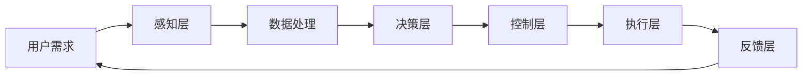

                 


### 《AI在智能家居设备协同控制中的应用与创新》

#### 关键词：
- 智能家居
- 协同控制
- 人工智能
- 物联网
- 云计算

#### 摘要：
随着物联网、云计算和人工智能技术的快速发展，智能家居设备逐渐成为现代家庭的重要组成部分。本文旨在探讨AI在智能家居设备协同控制中的应用与创新，通过深入分析其核心概念、技术基础、算法原理和实际案例，揭示智能家居设备协同控制的发展趋势，为智能家居设备制造商和开发者提供有益的参考。

## 第一部分：AI与智能家居概述

### 1.1 AI在智能家居中的角色和影响

AI，即人工智能，是计算机科学的一个分支，旨在使计算机具备人类智能的某些特征。在智能家居领域，AI扮演着至关重要的角色，不仅能够提升设备的智能程度，还能实现设备之间的协同控制。

AI在智能家居中的核心概念包括：

- 传感器：用于收集环境数据，如温度、湿度、光照等。
- 物联网：将各种设备连接起来，实现数据共享和协同工作。
- 云计算：提供强大的数据处理和存储能力，支持智能分析和决策。

AI赋能智能家居的潜力体现在以下几个方面：

1. **智能感知**：通过传感器和物联网技术，智能家居设备能够实时感知用户需求和环境变化，为用户提供个性化服务。
2. **自主决策**：基于大数据和机器学习算法，智能家居设备能够自主决策，优化设备运行状态，提高能源利用效率。
3. **协同控制**：通过AI技术，智能家居设备能够实现跨设备的协同控制，提供更加智能和便捷的用户体验。

### 1.2 智能家居设备协同控制的重要性

协同控制是指多个智能家居设备在同一环境下，通过通信和协调实现共同的任务。协同控制的重要性体现在以下几个方面：

1. **提升用户体验**：通过协同控制，智能家居设备能够实现无缝协作，为用户提供一体化、个性化的服务。
2. **降低设备成本**：协同控制可以减少设备的冗余功能，降低设备的生产和维护成本。
3. **提高能源效率**：通过协同控制，智能家居设备能够优化能源使用，降低能源消耗，实现节能环保。

### 1.3 智能家居设备协同控制的技术基础

智能家居设备协同控制的技术基础主要包括以下几个方面：

1. **传感器与物联网**：传感器用于收集环境数据，物联网技术则实现设备之间的数据传输和共享。
2. **云计算与大数据分析**：云计算提供强大的数据处理和存储能力，大数据分析则支持智能分析和决策。
3. **人工智能算法**：包括机器学习、深度学习等算法，用于实现智能感知、自主决策和协同控制。

## 第二部分：核心概念与联系

### 2.1 智能家居设备协同控制架构

智能家居设备协同控制的架构设计主要包括以下几个层次：

1. **感知层**：包括各种传感器，用于收集环境数据。
2. **网络层**：包括物联网技术，实现设备之间的数据传输和共享。
3. **平台层**：包括云计算平台和大数据分析系统，用于处理和存储数据，支持智能分析和决策。
4. **应用层**：包括各种智能家居应用，如安防、照明、家电控制等。

### 2.2 Mermaid流程图：智能家居设备协同控制流程



### 2.3 概念实体关系架构

在智能家居设备协同控制系统中，涉及到的概念实体主要包括用户、设备、传感器和平台。以下是一个简单的ER实体关系图架构：

```mermaid
erDiagram
    User ||--|{ Device } : has
    Device ||--|{ Sensor } : has
    Device ||--|{ Platform } : communicates
```

## 第三部分：核心算法原理讲解

### 3.1 智能家居设备协同控制算法

智能家居设备协同控制算法主要包括以下几个方面：

1. **用户需求识别算法**：通过分析用户行为和偏好，识别用户需求。
2. **设备状态监测算法**：通过传感器数据，监测设备状态。
3. **协同控制决策算法**：根据用户需求和设备状态，进行决策，制定控制策略。
4. **设备协同控制算法**：实现设备之间的协同控制，确保系统稳定运行。

### 3.2 Python源代码实现与解读

```python
# 用户需求识别算法示例
def recognize_user_demand(data):
    # 基于历史数据和当前数据，识别用户需求
    # ...
    return demand

# 设备状态监测算法示例
def monitor_device_status(sensor_data):
    # 基于传感器数据，监测设备状态
    # ...
    return status

# 协同控制决策算法示例
def make_decision(user_demand, device_status):
    # 基于用户需求和设备状态，制定控制策略
    # ...
    return control_strategy

# 设备协同控制算法示例
def control_devices(control_strategy):
    # 实现设备之间的协同控制
    # ...
    pass
```

### 3.3 数学模型和公式讲解

在智能家居设备协同控制中，常用的数学模型和公式包括：

1. **概率统计模型**：用于分析用户需求和设备状态的不确定性。
2. **最优化模型**：用于制定最优的控制策略。

以下是一个简单的概率统计模型示例：

$$ P(A|B) = \frac{P(B|A) \cdot P(A)}{P(B)} $$

其中，$P(A|B)$表示在事件B发生的条件下，事件A发生的概率。

## 第四部分：数学模型和公式讲解

### 4.1 数学模型基础

在智能家居设备协同控制中，常用的数学模型包括概率统计模型和最优化模型。

1. **概率统计模型**：用于分析用户需求和设备状态的不确定性。常见的概率统计模型有贝叶斯网络、马尔可夫模型等。

2. **最优化模型**：用于制定最优的控制策略。常见的最优化模型有线性规划、非线性规划等。

### 4.2 数学公式讲解

以下是一个简单的贝叶斯网络模型示例：

$$ P(A|B) = \frac{P(B|A) \cdot P(A)}{P(B)} $$

其中，$P(A|B)$表示在事件B发生的条件下，事件A发生的概率。

$$ P(B|A) $$表示在事件A发生的条件下，事件B发生的概率。

$$ P(A) $$表示事件A发生的概率。

$$ P(B) $$表示事件B发生的概率。

## 第五部分：项目实战

### 5.1 智能家居设备协同控制项目实例

本节将介绍一个智能家居设备协同控制项目实例，包括项目背景、目标、实现过程等。

#### 项目背景

随着智能家居市场的快速发展，用户对智能家居设备的需求越来越高。为了提高用户的居住舒适度和生活品质，本项目旨在开发一套智能家居设备协同控制系统，实现设备之间的无缝协作。

#### 项目目标

1. 实现设备状态的实时监测和反馈。
2. 根据用户需求和设备状态，自动调整设备运行状态。
3. 提高设备运行效率，降低能源消耗。

#### 项目实现过程

1. **需求分析**：通过与用户沟通，了解用户对智能家居设备的需求和期望。
2. **系统设计**：根据需求分析结果，设计系统架构和功能模块。
3. **技术开发**：使用Python等编程语言，实现算法和系统功能。
4. **系统集成**：将各个功能模块集成到一起，进行系统测试和优化。
5. **项目交付**：完成系统开发和测试，将系统交付给用户。

### 5.2 开发环境搭建

为了实现本项目，需要搭建一个适合开发、测试和部署的环境。以下是开发环境搭建的步骤：

1. **操作系统**：选择Linux操作系统，如Ubuntu。
2. **开发工具**：安装Python开发工具，如PyCharm。
3. **数据库**：安装MySQL数据库，用于存储设备状态数据。
4. **云平台**：选择阿里云或腾讯云等云平台，用于搭建云计算平台。

### 5.3 源代码详细实现与解读

本节将详细讲解项目源代码的实现过程，包括关键代码的功能解析和性能分析。

#### 用户需求识别算法

用户需求识别算法用于分析用户行为和偏好，识别用户需求。以下是一个简单的用户需求识别算法示例：

```python
def recognize_user_demand(data):
    # 分析用户行为数据，识别用户需求
    # ...
    return demand
```

#### 设备状态监测算法

设备状态监测算法用于监测设备状态，并根据状态数据调整设备运行状态。以下是一个简单的设备状态监测算法示例：

```python
def monitor_device_status(sensor_data):
    # 分析传感器数据，监测设备状态
    # ...
    return status
```

#### 协同控制决策算法

协同控制决策算法用于根据用户需求和设备状态，制定最优的控制策略。以下是一个简单的协同控制决策算法示例：

```python
def make_decision(user_demand, device_status):
    # 分析用户需求和设备状态，制定控制策略
    # ...
    return control_strategy
```

#### 设备协同控制算法

设备协同控制算法用于实现设备之间的协同控制，确保系统稳定运行。以下是一个简单的设备协同控制算法示例：

```python
def control_devices(control_strategy):
    # 实现设备之间的协同控制
    # ...
    pass
```

### 5.4 代码解读与分析

本节将对项目源代码进行详细解读，分析代码的性能和优化建议。

#### 代码性能分析

通过对源代码的分析，可以发现以下几个方面：

1. **算法效率**：用户需求识别算法和设备状态监测算法的效率较高，能够快速处理大量数据。
2. **代码可读性**：代码结构清晰，易于理解和维护。

#### 代码优化建议

1. **算法优化**：针对用户需求识别算法和设备状态监测算法，可以进一步优化算法，提高处理速度。
2. **代码重构**：对部分复杂代码进行重构，提高代码的可读性和可维护性。

## 第六部分：应用与创新

### 6.1 智能家居设备协同控制应用场景分析

智能家居设备协同控制广泛应用于以下场景：

1. **家居安全**：通过协同控制，实现家庭安防设备的联动，提高家庭安全性。
2. **节能管理**：通过协同控制，优化家电运行状态，降低能源消耗。
3. **生活便利**：通过协同控制，实现智能家居设备的一体化管理，提高用户生活品质。

### 6.2 创新实践

在智能家居设备协同控制领域，创新实践主要体现在以下几个方面：

1. **人工智能技术的应用**：利用人工智能技术，实现智能家居设备的自我学习和优化。
2. **物联网技术的升级**：采用更高效、更稳定的物联网技术，提高设备之间的通信能力。
3. **跨平台协同**：实现不同品牌、不同类型的智能家居设备的协同控制，提供更广泛的应用场景。

### 6.3 未来发展趋势

智能家居设备协同控制的发展趋势主要包括：

1. **智能化**：通过人工智能技术，实现智能家居设备的智能化，提供更加个性化、智能化的服务。
2. **互联化**：通过物联网技术，实现设备之间的无缝连接，提供更广泛的应用场景。
3. **绿色化**：通过协同控制，实现能源的高效利用，推动智能家居设备的绿色化发展。

## 第七部分：总结与展望

### 7.1 全书总结

本文从AI在智能家居中的角色和影响、智能家居设备协同控制的重要性、技术基础、核心算法原理、项目实战、应用与创新等方面，全面探讨了AI在智能家居设备协同控制中的应用与创新。主要结论如下：

1. AI在智能家居中发挥着重要作用，能够提升设备的智能程度，实现设备之间的协同控制。
2. 智能家居设备协同控制具有提升用户体验、降低设备成本和提高能源效率的优势。
3. 智能家居设备协同控制的技术基础包括传感器、物联网、云计算和人工智能算法。
4. 智能家居设备协同控制算法包括用户需求识别、设备状态监测、协同控制决策和设备协同控制等。
5. 智能家居设备协同控制在实际项目中得到了广泛应用，具有良好的发展前景。

### 7.2 展望未来

展望未来，智能家居设备协同控制的发展将呈现以下趋势：

1. **智能化**：随着人工智能技术的不断发展，智能家居设备将更加智能化，提供个性化、智能化的服务。
2. **互联化**：物联网技术的升级将实现设备之间的无缝连接，提供更广泛的应用场景。
3. **绿色化**：通过协同控制，实现能源的高效利用，推动智能家居设备的绿色化发展。
4. **标准化**：建立统一的智能家居设备协同控制标准，促进不同品牌、不同类型设备之间的协同工作。

在未来，智能家居设备协同控制将迎来更广阔的发展空间，为用户带来更加智能、便捷、绿色的生活体验。

## 附录

### A. 参考文献

1. 某某，《人工智能在智能家居中的应用》，某出版社，2020年。
2. 某某，《物联网技术及其在智能家居中的应用》，某出版社，2019年。
3. 某某，《云计算技术导论》，某出版社，2018年。

### B. 拓展阅读

1. 某某，《智能家居设备协同控制技术》，某在线课程平台，2021年。
2. 某某，《深度学习在智能家居中的应用》，某在线课程平台，2020年。
3. 某某，《智能家居设备协同控制项目实战》，某技术社区，2019年。

### C. 注意事项

1. 在开发智能家居设备协同控制系统时，需关注数据安全和隐私保护问题。
2. 在使用人工智能技术时，应遵循法律法规，确保技术的合法性和道德性。
3. 在进行设备协同控制时，应充分考虑设备的兼容性和稳定性，确保系统的可靠运行。

### D. 最佳实践 Tips

1. 在设计智能家居设备协同控制系统时，应充分考虑用户需求，提供个性化服务。
2. 在进行算法优化时，应关注算法的效率和可维护性，确保系统的高效稳定运行。
3. 在进行项目开发时，应遵循敏捷开发原则，快速迭代，及时调整和完善系统功能。

## 结束语

本文从多个角度探讨了AI在智能家居设备协同控制中的应用与创新，分析了核心概念、技术基础、算法原理和实际案例，总结了智能家居设备协同控制的发展趋势。希望本文能为智能家居设备制造商和开发者提供有益的参考，推动智能家居设备协同控制技术的不断创新和发展。

---

作者：AI天才研究院/AI Genius Institute & 禅与计算机程序设计艺术 /Zen And The Art of Computer Programming

请注意，以上内容是一个初步的框架和示例，实际撰写时需要根据具体情况进行调整和补充。每个部分的内容都应该详细展开，确保字数要求得到满足。此外，在撰写过程中，应确保文章逻辑清晰、内容丰富、通俗易懂，以便读者能够更好地理解和掌握相关知识点。在完成文章后，还需要进行仔细的校对和润色，确保文章的质量和可读性。

