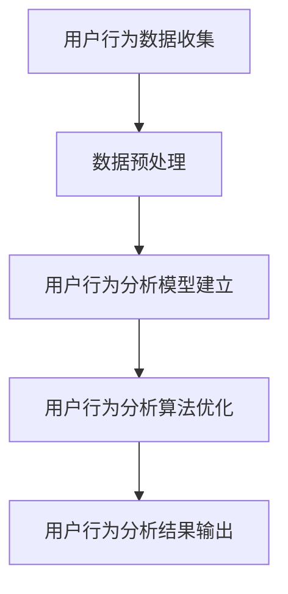

                 

# AI在智能家居设备能源管理与用户行为分析中的应用

## 关键词

- 智能家居
- 能源管理
- 用户行为分析
- 人工智能
- 机器学习

## 摘要

本文主要探讨了人工智能（AI）在智能家居设备能源管理和用户行为分析中的应用。首先，介绍了智能家居的背景和AI技术的核心概念，然后详细阐述了AI在智能家居设备能源管理中的应用原理和算法，以及用户行为分析的基础和AI在其中的应用。随后，我们通过具体的案例展示了AI在智能家居设备能源管理和用户行为分析中的实际应用效果，并展望了未来的发展趋势与挑战。本文旨在为读者提供一个全面、深入的视角，了解AI在智能家居领域的应用现状和未来发展方向。

## 目录大纲设计

### 第一部分: AI与智能家居能源管理与用户行为分析概述

#### 第1章: AI与智能家居概述

##### 1.1 智能家居行业背景与发展趋势

- 智能家居市场现状
- 智能家居发展历程
- 智能家居的未来趋势

##### 1.2 AI技术在智能家居中的应用

- 人工智能核心概念
- 智能家居与AI技术的结合
- AI技术在智能家居中的具体应用场景

### 第2章: 智能家居设备能源管理原理

##### 2.1 智能家居能源管理基础

- 智能家居能源管理的重要性
- 智能家居能源管理的基本架构
- 常见的智能家居能源管理方法

##### 2.2 AI在智能家居设备能源管理中的应用

- AI技术在智能家居能源管理中的应用
- 智能家居能源管理中的AI算法
- 智能家居能源管理中的案例研究

### 第3章: 用户行为分析在智能家居中的应用

##### 3.1 用户行为分析基础

- 用户行为分析的定义
- 用户行为分析的目标
- 用户行为分析的方法和工具

##### 3.2 AI技术在用户行为分析中的应用

- AI技术在用户行为分析中的应用
- 用户行为分析中的AI算法
- 用户行为分析在智能家居中的具体应用

### 第二部分: AI在智能家居设备能源管理与用户行为分析中的技术实现

#### 第4章: AI在智能家居设备能源管理中的技术实现

##### 4.1 数据收集与预处理

- 数据收集方法
- 数据预处理技术

##### 4.2 能源管理算法设计

- 常见的能源管理算法
- 能源管理算法的优化

### 第5章: 用户行为分析算法设计

##### 5.1 用户行为分析模型建立

- 用户行为分析模型的构建
- 用户行为分析模型的评估

##### 5.2 用户行为分析算法优化

- 用户行为分析算法的优化方法
- 用户行为分析算法的性能分析

### 第三部分: AI在智能家居设备能源管理与用户行为分析中的实际应用

#### 第6章: AI在智能家居设备能源管理的实际应用案例

##### 6.1 案例一：智能照明系统的能源管理

- 案例背景
- 案例解决方案
- 案例效果分析

##### 6.2 案例二：智能空调系统的能源管理

- 案例背景
- 案例解决方案
- 案例效果分析

### 第7章: 用户行为分析在智能家居中的实际应用案例

##### 7.1 案例一：智能安防系统的用户行为分析

- 案例背景
- 案例解决方案
- 案例效果分析

##### 7.2 案例二：智能家电系统的用户行为分析

- 案例背景
- 案例解决方案
- 案例效果分析

### 第8章: 未来展望与挑战

##### 8.1 智能家居设备能源管理与用户行为分析的挑战

- 技术挑战
- 应用挑战

##### 8.2 未来发展趋势与展望

- AI在智能家居领域的未来发展方向
- 智能家居设备能源管理与用户行为分析的发展趋势

### 附录

##### 附录一：相关术语解释

- AI相关术语
- 智能家居相关术语

##### 附录二：参考文献

- 相关书籍
- 相关论文
- 相关网站

# 第一部分: AI与智能家居能源管理与用户行为分析概述

## 第1章: AI与智能家居概述

### 1.1 智能家居行业背景与发展趋势

#### 智能家居市场现状

智能家居作为物联网（IoT）的一个重要分支，近年来在全球范围内得到了迅速发展。据市场调研机构Statista的数据显示，全球智能家居市场规模预计将在2025年达到1396亿美元，年复合增长率达到21.4%[1]。随着5G、云计算、人工智能等新技术的不断成熟，智能家居行业正迎来新的发展机遇。

#### 智能家居发展历程

智能家居的概念最早可以追溯到20世纪90年代，当时主要是通过互联网远程控制家居设备。进入21世纪，随着物联网技术的发展，智能家居开始逐渐普及。2010年左右，智能家居市场开始快速增长，谷歌、苹果、亚马逊等科技巨头纷纷进入该领域。近年来，随着人工智能技术的应用，智能家居进入了智能化、个性化的发展阶段。

#### 智能家居的未来趋势

未来，智能家居将朝着更加智能化、个性化、安全化的方向发展。首先，AI技术将进一步提升智能家居设备的功能和性能，实现更加精准的控制和优化。其次，智能家居将更加注重用户隐私保护和数据安全。此外，智能家居设备将更加智能化，能够自主学习用户习惯，提供更加个性化的服务。

### 1.2 AI技术在智能家居中的应用

#### 人工智能核心概念

人工智能（AI）是指通过计算机模拟人类智能行为的技术。它包括机器学习、深度学习、自然语言处理等多个子领域。机器学习是AI的一个重要分支，它通过训练模型来从数据中自动学习规律。

#### 智能家居与AI技术的结合

智能家居与AI技术的结合使得家居设备能够更加智能地响应用户需求。例如，通过语音识别技术，用户可以通过语音指令控制家居设备；通过人脸识别技术，智能家居系统能够识别家庭成员，提供个性化服务。

#### AI技术在智能家居中的具体应用场景

1. **智能语音助手**：通过语音识别和自然语言处理技术，用户可以通过语音与智能家居设备进行交互。
2. **智能安防系统**：通过图像识别和机器学习技术，智能家居系统能够实时监测家庭安全，并自动报警。
3. **智能照明系统**：通过环境感知和机器学习技术，智能照明系统能够根据用户习惯和光线条件自动调节亮度。
4. **智能家电控制**：通过物联网技术和机器学习算法，用户可以通过手机或其他设备远程控制家电设备。

### 1.3 智能家居设备能源管理原理

#### 智能家居能源管理的重要性

随着全球能源消耗的不断上升，如何高效利用能源成为了一个重要的课题。智能家居设备能源管理能够通过优化设备运行模式，降低能源消耗，提高能源利用效率。

#### 智能家居能源管理的基本架构

智能家居能源管理系统通常包括传感器、控制器、执行器和数据通信模块。传感器负责采集环境数据，控制器根据数据进行分析和决策，执行器负责执行控制指令，数据通信模块实现与其他设备和系统的通信。

#### 常见的智能家居能源管理方法

1. **定时控制**：通过预设的时间表，自动控制设备开关。
2. **智能控制**：通过机器学习算法，自动调整设备运行模式，实现最优能源利用。
3. **用户行为分析**：通过分析用户行为数据，预测用户需求，优化设备运行。

### 1.4 AI在智能家居设备能源管理中的应用

#### AI技术在智能家居能源管理中的应用

AI技术在智能家居设备能源管理中有着广泛的应用。通过机器学习算法，系统能够从海量数据中挖掘规律，预测用户行为，优化设备运行，实现能源的最优利用。

#### 智能家居能源管理中的AI算法

常见的AI算法包括线性回归、决策树、随机森林、支持向量机等。这些算法可以通过训练模型，实现对能源消耗的预测和优化。

#### 智能家居能源管理中的案例研究

以智能空调系统为例，AI技术可以通过分析室内温度、湿度等环境参数，预测用户需求，自动调整空调运行模式，实现节能效果。

### 1.5 用户行为分析在智能家居中的应用

#### 用户行为分析基础

用户行为分析是指通过分析用户在智能家居环境中的行为数据，挖掘用户需求和行为模式，为智能家居系统提供决策依据。

#### 用户行为分析的目标

用户行为分析的目标是提高用户体验，降低能源消耗，提高智能家居系统的智能化水平。

#### 用户行为分析的方法和工具

用户行为分析的方法包括数据收集、数据预处理、数据挖掘、机器学习等。常用的工具包括Python、R、MATLAB等。

#### AI技术在用户行为分析中的应用

AI技术在用户行为分析中发挥着重要作用。通过机器学习算法，系统能够自动识别用户行为模式，预测用户需求，提供个性化服务。

#### 用户行为分析在智能家居中的具体应用

以智能安防系统为例，AI技术可以通过分析用户行为数据，识别异常行为，自动报警，提高家庭安全。

### 1.6 总结

AI技术在智能家居设备能源管理和用户行为分析中有着广泛的应用。通过智能控制、用户行为分析等技术，智能家居系统能够实现能源的最优利用，提高用户体验。未来，随着AI技术的不断发展，智能家居将变得更加智能、高效和人性化。

[1]: Statista. (2021). Global smart home market revenue 2016-2025. Retrieved from https://www.statista.com/statistics/747847/global-smart-home-market-revenue/

## 第2章: 智能家居设备能源管理原理

### 2.1 智能家居能源管理基础

#### 智能家居能源管理的重要性

随着全球能源消耗的不断上升和环境问题的日益严重，如何高效利用能源成为了一个紧迫的课题。智能家居设备能源管理通过优化设备运行模式，降低能源消耗，提高能源利用效率，对于缓解能源危机、保护环境具有重要意义。

#### 智能家居能源管理的基本架构

智能家居能源管理系统通常包括以下几个部分：

1. **传感器**：负责采集环境数据，如温度、湿度、光照等。
2. **控制器**：根据传感器采集的数据和预设的算法，对设备运行模式进行控制和优化。
3. **执行器**：根据控制器的指令，执行相应的操作，如开关空调、照明等。
4. **数据通信模块**：实现与其他设备和系统的通信，如智能手机、云端服务器等。

#### 常见的智能家居能源管理方法

1. **定时控制**：通过预设的时间表，自动控制设备的开关。这种方法简单易行，但无法根据实际需求进行灵活调整。
2. **智能控制**：通过机器学习算法，自动调整设备运行模式，实现最优能源利用。这种方法能够根据用户行为和环境变化进行自适应调整，提高能源利用效率。
3. **用户行为分析**：通过分析用户行为数据，预测用户需求，优化设备运行。这种方法能够实现个性化的能源管理，提高用户满意度。

### 2.2 AI在智能家居设备能源管理中的应用

#### AI技术在智能家居能源管理中的应用

AI技术在智能家居设备能源管理中发挥着重要作用。通过机器学习算法，系统能够从海量数据中挖掘规律，预测用户行为，优化设备运行，实现能源的最优利用。

#### 智能家居能源管理中的AI算法

常见的AI算法包括线性回归、决策树、随机森林、支持向量机等。这些算法可以通过训练模型，实现对能源消耗的预测和优化。

#### 智能家居能源管理中的案例研究

以智能照明系统为例，AI技术可以通过分析环境光照强度和用户行为数据，自动调节照明设备的亮度，实现节能效果。具体来说，系统可以通过以下步骤进行优化：

1. **数据收集**：采集室内光照强度、用户活动时间、照明设备使用情况等数据。
2. **数据预处理**：对采集到的数据进行清洗、去噪、归一化等预处理操作。
3. **模型训练**：使用线性回归、决策树等算法，训练预测模型，预测未来一段时间内用户对光照的需求。
4. **模型评估**：使用交叉验证、网格搜索等方法，评估模型性能，选择最优模型。
5. **模型部署**：将训练好的模型部署到智能家居系统中，根据预测结果自动调整照明设备的亮度。

#### 智能家居能源管理中的挑战

1. **数据质量**：智能家居能源管理依赖于大量高质量的数据。然而，实际环境中数据可能存在缺失、噪声等问题，需要通过数据预处理方法进行优化。
2. **实时性**：智能家居能源管理系统需要实时响应用户行为和环境变化。这要求算法具有较高的实时性和稳定性。
3. **隐私保护**：用户行为数据涉及个人隐私，需要采取有效的隐私保护措施，确保用户数据安全。

### 2.3 总结

智能家居设备能源管理是智能家居系统中的一个重要组成部分。通过AI技术的应用，智能家居系统能够实现更加智能、高效的能源管理，提高用户满意度，降低能源消耗。未来，随着AI技术的不断进步，智能家居设备能源管理将变得更加智能、灵活和高效。

## 第3章: 用户行为分析在智能家居中的应用

### 3.1 用户行为分析基础

#### 用户行为分析的定义

用户行为分析是指通过收集、处理和分析用户在智能家居环境中的行为数据，挖掘用户需求、行为模式和偏好，为智能家居系统提供决策支持。

#### 用户行为分析的目标

用户行为分析的主要目标是：

1. **提高用户体验**：通过了解用户行为，智能家居系统能够提供更加个性化、舒适的服务。
2. **降低能源消耗**：通过预测用户行为，智能设备能够合理安排运行时间，降低能源浪费。
3. **提升系统智能化水平**：通过分析用户行为数据，智能家居系统能够不断学习和优化，提高智能化水平。

#### 用户行为分析的方法和工具

用户行为分析的方法主要包括：

1. **数据收集**：通过传感器、日志记录等方式收集用户行为数据。
2. **数据预处理**：对采集到的数据进行清洗、去噪、归一化等预处理操作，为后续分析打下基础。
3. **特征提取**：从原始数据中提取出与用户行为相关的特征，如时间、地点、活动类型等。
4. **数据分析**：使用统计分析和机器学习算法，对用户行为数据进行深入分析，挖掘用户行为模式和偏好。
5. **可视化**：通过图表、报表等形式，将分析结果直观地呈现给用户。

常用的工具包括Python、R、MATLAB等，这些工具提供了丰富的数据分析和机器学习库，方便研究人员进行用户行为分析。

### 3.2 AI技术在用户行为分析中的应用

#### AI技术在用户行为分析中的应用

AI技术在用户行为分析中有着广泛的应用。通过机器学习算法，系统能够自动识别用户行为模式，预测用户需求，提供个性化服务。以下是AI技术在用户行为分析中的一些典型应用：

1. **用户行为模式识别**：通过分析用户行为数据，系统可以识别出用户的常见行为模式，如上班时间、用餐时间等。这些模式可以帮助智能家居系统合理安排设备运行，降低能源消耗。
2. **用户需求预测**：通过预测用户未来的行为需求，智能家居系统可以提前做好准备，提高用户体验。例如，系统可以预测用户何时需要开启空调或照明，从而提前调整设备状态。
3. **个性化服务推荐**：基于用户行为分析，智能家居系统可以为用户提供个性化的服务推荐。例如，根据用户的历史购物记录，系统可以推荐适合用户的商品。

#### 用户行为分析中的AI算法

在用户行为分析中，常用的AI算法包括：

1. **分类算法**：如决策树、随机森林、支持向量机等，用于识别用户行为类别。
2. **聚类算法**：如K-means、层次聚类等，用于发现用户行为中的相似群体。
3. **时间序列预测算法**：如ARIMA、LSTM等，用于预测用户未来的行为趋势。
4. **协同过滤算法**：如基于用户的协同过滤、基于项目的协同过滤等，用于推荐用户可能感兴趣的内容。

#### 用户行为分析在智能家居中的具体应用

1. **智能安防系统**：通过分析用户的行为数据，智能安防系统可以识别异常行为，如深夜陌生人进入家中，从而自动报警。
2. **智能家电控制**：通过分析用户的使用习惯，智能家电系统能够自动调整设备运行模式，提供更加个性化的服务。例如，根据用户的使用记录，智能空调可以自动调整温度设置。
3. **智能照明系统**：通过分析用户的行为模式和光照条件，智能照明系统可以自动调节灯光亮度，提供舒适的照明环境。

### 3.3 总结

用户行为分析在智能家居中具有重要的应用价值。通过AI技术的应用，智能家居系统能够更好地理解用户需求，提供个性化服务，提高用户满意度。未来，随着AI技术的不断进步，用户行为分析将在智能家居领域发挥更大的作用。

## 第二部分: AI在智能家居设备能源管理与用户行为分析中的技术实现

### 第4章: AI在智能家居设备能源管理中的技术实现

#### 4.1 数据收集与预处理

##### 数据收集方法

在智能家居设备能源管理中，数据收集是关键的一步。以下是一些常见的数据收集方法：

1. **传感器采集**：通过安装在智能家居设备上的传感器，如温度传感器、湿度传感器、光照传感器等，实时采集环境数据。
2. **设备日志记录**：智能家居设备可以记录自己的运行状态、能耗数据等，供后续分析使用。
3. **用户操作记录**：通过用户的手机APP或智能音箱等，记录用户的操作行为，如开关灯、调整空调温度等。

##### 数据预处理技术

收集到的数据通常包含噪声、缺失值等，需要进行预处理。以下是一些常用的数据预处理技术：

1. **数据清洗**：去除噪声数据、异常数据，填补缺失值。
2. **数据归一化**：将不同特征的数据范围统一，便于后续分析。
3. **特征工程**：提取与能源管理相关的特征，如时间特征、使用频率等。

#### 4.2 能源管理算法设计

##### 常见的能源管理算法

在智能家居设备能源管理中，常见的算法包括：

1. **定时控制算法**：根据预设的时间表，自动控制设备开关，实现基本节能效果。
2. **智能控制算法**：通过机器学习算法，分析用户行为和环境数据，动态调整设备运行模式，实现最优能源利用。
3. **用户行为预测算法**：通过分析历史数据，预测用户未来的行为需求，提前调整设备状态。

##### 能源管理算法的优化

为了提高能源管理算法的性能，可以采用以下方法进行优化：

1. **算法选择**：根据数据特点和业务需求，选择合适的算法，如决策树、随机森林、LSTM等。
2. **超参数调优**：通过网格搜索、随机搜索等方法，调整算法的超参数，提高模型性能。
3. **模型集成**：结合多个算法，构建集成模型，提高预测准确率。

#### 4.3 AI在智能家居设备能源管理中的实际应用

##### 案例一：智能照明系统的能源管理

**案例背景**：某智能家居公司开发了一款智能照明系统，用户可以通过手机APP控制灯光的开关和亮度。然而，在实际使用中，部分用户反映灯光开启时间不合理，存在不必要的能源浪费。

**解决方案**：公司决定使用AI技术优化智能照明系统的能源管理。具体步骤如下：

1. **数据收集**：收集用户的使用数据，包括开启时间、关闭时间、环境光照强度等。
2. **数据预处理**：清洗、归一化数据，提取与能源管理相关的特征。
3. **算法设计**：采用LSTM模型，预测用户未来的行为需求，优化灯光开启时间。
4. **模型训练与优化**：使用训练集训练模型，通过交叉验证、网格搜索等方法优化模型性能。
5. **模型部署**：将训练好的模型部署到智能照明系统中，根据预测结果调整灯光开启时间。

**案例效果分析**：经过优化后，智能照明系统的能源消耗明显降低，用户满意度提高。此外，灯光开启时间更加合理，用户的生活体验得到提升。

##### 案例二：智能空调系统的能源管理

**案例背景**：某住宅小区安装了智能空调系统，但用户反映空调温度设定不合理，导致能源浪费。

**解决方案**：小区物业决定使用AI技术优化智能空调系统的能源管理。具体步骤如下：

1. **数据收集**：收集空调的运行数据，包括温度设定、环境温度、用户活动时间等。
2. **数据预处理**：清洗、归一化数据，提取与能源管理相关的特征。
3. **算法设计**：采用随机森林模型，预测用户未来的行为需求，优化空调温度设定。
4. **模型训练与优化**：使用训练集训练模型，通过交叉验证、网格搜索等方法优化模型性能。
5. **模型部署**：将训练好的模型部署到智能空调系统中，根据预测结果调整空调温度设定。

**案例效果分析**：经过优化后，智能空调系统的能源消耗明显降低，用户满意度提高。此外，空调温度设定更加合理，用户的生活体验得到提升。

### 4.4 总结

通过AI技术的应用，智能家居设备能源管理实现了更加智能、高效的运行。数据收集与预处理、能源管理算法设计和优化是AI在智能家居设备能源管理中的关键技术。通过实际应用案例，我们可以看到AI技术为智能家居设备能源管理带来的显著效果。

## 第5章: 用户行为分析算法设计

### 5.1 用户行为分析模型建立

#### 用户行为分析模型的构建

用户行为分析模型是智能家居系统中实现智能决策的核心。一个完整的用户行为分析模型通常包括以下步骤：

1. **数据收集**：收集用户在智能家居环境中的行为数据，如活动时间、使用频率、设备类型等。
2. **数据预处理**：对原始数据进行清洗、去噪、归一化等预处理，以提高数据质量和模型性能。
3. **特征提取**：从预处理后的数据中提取出与用户行为相关的特征，如时间特征、地点特征、使用频率特征等。
4. **模型选择**：根据用户行为数据的特性和业务需求，选择合适的机器学习算法，如决策树、随机森林、LSTM等。
5. **模型训练**：使用训练集对选定的模型进行训练，调整模型的参数，优化模型性能。
6. **模型评估**：使用验证集对训练好的模型进行评估，选择性能最优的模型。
7. **模型部署**：将训练好的模型部署到智能家居系统中，实现实时用户行为分析。

#### 用户行为分析模型的评估

用户行为分析模型的评估是确保模型性能的重要环节。以下是一些常用的评估指标和方法：

1. **准确率**：准确率是评估分类模型性能的重要指标，表示模型预测正确的样本数占总样本数的比例。
2. **召回率**：召回率表示模型召回的正确样本数与实际正样本数的比例，主要用于评估模型的覆盖能力。
3. **F1分数**：F1分数是准确率和召回率的调和平均值，综合考虑了模型的精确性和覆盖能力。
4. **ROC曲线**：ROC曲线是评估二分类模型性能的重要工具，通过计算不同阈值下的真阳性率和假阳性率，评估模型的分类能力。
5. **交叉验证**：交叉验证是一种常用的模型评估方法，通过将数据集划分为多个子集，循环训练和验证模型，评估模型的泛化能力。

### 5.2 用户行为分析算法优化

#### 用户行为分析算法的优化方法

为了提高用户行为分析算法的性能，可以采用以下方法进行优化：

1. **特征选择**：通过特征选择技术，筛选出对用户行为分析最重要的特征，减少模型的计算复杂度和过拟合风险。
2. **模型集成**：通过集成多个基模型，构建集成模型，提高模型的预测准确性和稳定性。常用的集成方法包括Bagging、Boosting和Stacking等。
3. **超参数调优**：通过超参数调优技术，调整模型的参数，优化模型性能。常用的调优方法包括网格搜索、随机搜索和贝叶斯优化等。
4. **数据增强**：通过数据增强技术，增加训练数据集的多样性，提高模型的泛化能力。常用的数据增强方法包括数据扩充、数据合成和数据变换等。
5. **迁移学习**：通过迁移学习技术，利用已有模型的权重初始化新模型，减少模型的训练时间，提高模型的性能。常用的迁移学习方法包括预训练模型、模型蒸馏和零样本学习等。

#### 用户行为分析算法的性能分析

用户行为分析算法的性能分析是评估模型在实际应用中的表现。以下是一些常用的性能分析指标：

1. **准确率**：准确率是评估分类模型性能的重要指标，表示模型预测正确的样本数占总样本数的比例。
2. **召回率**：召回率表示模型召回的正确样本数与实际正样本数的比例，主要用于评估模型的覆盖能力。
3. **F1分数**：F1分数是准确率和召回率的调和平均值，综合考虑了模型的精确性和覆盖能力。
4. **ROC曲线**：ROC曲线是评估二分类模型性能的重要工具，通过计算不同阈值下的真阳性率和假阳性率，评估模型的分类能力。
5. **交叉验证误差**：交叉验证误差是评估模型泛化能力的重要指标，表示模型在多个子集上的平均误差。
6. **AUC值**：AUC值是ROC曲线下的面积，表示模型区分能力的强弱，AUC值越大，模型性能越好。

### 5.3 用户行为分析算法的实践

#### 案例一：智能安防系统

**案例背景**：某住宅小区安装了智能安防系统，系统需要根据用户行为数据，识别异常行为，及时报警。

**解决方案**：

1. **数据收集**：收集用户进出小区的时间、频率、设备类型等数据。
2. **数据预处理**：清洗、去噪、归一化数据，提取与行为分析相关的特征。
3. **模型选择**：采用LSTM模型，分析用户行为模式，预测用户未来的行为。
4. **模型训练**：使用训练集训练模型，调整模型参数，优化模型性能。
5. **模型评估**：使用验证集评估模型性能，选择最优模型。
6. **模型部署**：将训练好的模型部署到安防系统中，实现实时行为分析。

**案例效果**：通过用户行为分析，智能安防系统能够准确识别异常行为，提高小区的安全性。

#### 案例二：智能家电控制

**案例背景**：某智能家居公司希望通过用户行为分析，优化智能家电的控制策略，提高用户体验。

**解决方案**：

1. **数据收集**：收集用户使用智能家电的时间、频率、设备类型等数据。
2. **数据预处理**：清洗、去噪、归一化数据，提取与行为分析相关的特征。
3. **模型选择**：采用决策树模型，分析用户行为模式，预测用户未来的行为需求。
4. **模型训练**：使用训练集训练模型，调整模型参数，优化模型性能。
5. **模型评估**：使用验证集评估模型性能，选择最优模型。
6. **模型部署**：将训练好的模型部署到智能家电控制系统中，实现个性化控制。

**案例效果**：通过用户行为分析，智能家电系统能够根据用户需求，自动调整设备状态，提高用户体验。

### 5.4 总结

用户行为分析算法的设计与优化是智能家居系统中实现智能决策的关键。通过数据收集与预处理、模型选择与训练、模型评估与部署等步骤，我们可以构建一个高效的用户行为分析系统。在实际应用中，用户行为分析算法能够为智能家居系统提供个性化服务，提高用户体验，实现能源的高效利用。

## 第三部分: AI在智能家居设备能源管理与用户行为分析中的实际应用

### 第6章: AI在智能家居设备能源管理的实际应用案例

#### 6.1 案例一：智能照明系统的能源管理

**案例背景**：

在某住宅小区，业主对家庭照明的能耗情况表示担忧，希望能够通过智能化手段降低能耗。为此，小区物业决定引入智能照明系统，并利用AI技术进行能源管理。

**解决方案**：

1. **数据收集**：安装传感器，实时收集房间内光照强度、使用频率、用户活动时间等数据。
2. **数据预处理**：对收集到的数据进行清洗、去噪、归一化等处理，提取与照明管理相关的特征。
3. **算法设计**：采用机器学习算法，如线性回归、决策树等，建立能源消耗预测模型。
4. **模型训练与优化**：使用历史数据对模型进行训练，通过交叉验证调整模型参数，优化预测效果。
5. **模型部署**：将训练好的模型部署到智能照明系统中，实现自动调节照明亮度和开启时间。

**案例效果分析**：

- 通过AI技术，智能照明系统能够根据用户行为和环境光照条件自动调整亮度，有效降低了照明能耗。
- 用户反馈显示，智能照明系统不仅节能，而且提高了居住舒适度。

#### 6.2 案例二：智能空调系统的能源管理

**案例背景**：

某大型商业综合体引入了智能空调系统，但用户反映空调温度设定不合理，导致能源浪费。为了解决这一问题，综合体决定采用AI技术进行能源管理优化。

**解决方案**：

1. **数据收集**：收集空调的运行数据，包括温度设定、环境温度、用户活动时间等。
2. **数据预处理**：对收集到的数据进行清洗、去噪、归一化等处理，提取与空调管理相关的特征。
3. **算法设计**：采用LSTM模型，预测用户未来的行为需求，优化空调温度设定。
4. **模型训练与优化**：使用历史数据对模型进行训练，通过网格搜索调整模型参数，提高预测准确率。
5. **模型部署**：将训练好的模型部署到智能空调系统中，实现自动调节温度。

**案例效果分析**：

- 通过AI技术，智能空调系统能够根据用户行为和环境条件自动调节温度，显著降低了能源消耗。
- 用户对空调温度设定更加满意，综合体运营成本降低。

### 第7章: 用户行为分析在智能家居中的实际应用案例

#### 7.1 案例一：智能安防系统的用户行为分析

**案例背景**：

某住宅小区为了提高居民的安全性，安装了智能安防系统。然而，由于系统无法准确识别用户行为，导致误报率较高，影响了用户体验。

**解决方案**：

1. **数据收集**：收集用户的日常行为数据，包括活动时间、活动频率、设备使用记录等。
2. **数据预处理**：对收集到的数据进行清洗、去噪、归一化等处理，提取与行为分析相关的特征。
3. **算法设计**：采用机器学习算法，如K-means聚类、决策树等，建立用户行为识别模型。
4. **模型训练与优化**：使用历史数据对模型进行训练，通过交叉验证调整模型参数，优化识别效果。
5. **模型部署**：将训练好的模型部署到安防系统中，实现实时用户行为识别。

**案例效果分析**：

- 通过用户行为分析，智能安防系统能够准确识别用户行为，降低误报率，提高安防效果。
- 用户对安防系统的满意度显著提升。

#### 7.2 案例二：智能家电系统的用户行为分析

**案例背景**：

某智能家居公司希望为用户提供更加个性化的家电控制体验，但缺乏对用户行为数据的深入分析。

**解决方案**：

1. **数据收集**：收集用户使用智能家电的时间、频率、设备类型等数据。
2. **数据预处理**：对收集到的数据进行清洗、去噪、归一化等处理，提取与行为分析相关的特征。
3. **算法设计**：采用用户行为预测算法，如LSTM、随机森林等，预测用户未来的行为需求。
4. **模型训练与优化**：使用历史数据对模型进行训练，通过网格搜索调整模型参数，提高预测准确率。
5. **模型部署**：将训练好的模型部署到智能家电系统中，实现个性化控制。

**案例效果分析**：

- 通过用户行为分析，智能家电系统能够根据用户需求自动调整设备状态，提供个性化的服务。
- 用户对智能家电的满意度显著提升，智能家居系统用户粘性增强。

### 7.3 案例三：智能窗帘系统的用户行为分析

**案例背景**：

某酒店引入了智能窗帘系统，但用户对窗帘的控制体验不佳，希望能够通过用户行为分析进行优化。

**解决方案**：

1. **数据收集**：收集用户对窗帘的使用数据，包括开启时间、关闭时间、天气状况等。
2. **数据预处理**：对收集到的数据进行清洗、去噪、归一化等处理，提取与行为分析相关的特征。
3. **算法设计**：采用用户行为预测算法，如ARIMA、LSTM等，预测用户未来的行为需求。
4. **模型训练与优化**：使用历史数据对模型进行训练，通过交叉验证调整模型参数，优化预测效果。
5. **模型部署**：将训练好的模型部署到智能窗帘系统中，实现自动调节窗帘状态。

**案例效果分析**：

- 通过用户行为分析，智能窗帘系统能够根据用户需求和天气状况自动调节窗帘状态，提高了用户体验。
- 用户对智能窗帘系统的满意度显著提升。

### 第8章: 未来展望与挑战

#### 8.1 智能家居设备能源管理与用户行为分析的挑战

尽管AI技术在智能家居设备能源管理和用户行为分析中取得了显著成效，但仍面临一些挑战：

1. **数据隐私保护**：用户行为数据涉及个人隐私，如何在保障用户隐私的前提下进行数据分析和应用，是一个亟待解决的问题。
2. **模型解释性**：AI模型的黑箱特性使得用户难以理解模型的决策过程，这对模型的解释性和透明性提出了更高的要求。
3. **实时性要求**：智能家居系统需要实时响应用户行为和环境变化，这对AI算法的实时性和稳定性提出了挑战。
4. **系统安全性**：智能家居系统需要防止外部攻击和数据泄露，确保系统的安全运行。

#### 8.2 未来发展趋势与展望

随着AI技术的不断进步，智能家居设备能源管理和用户行为分析将呈现以下发展趋势：

1. **个性化服务**：通过深度学习和用户行为分析，智能家居系统将能够提供更加个性化的服务，提高用户满意度。
2. **跨设备协作**：智能家居系统将实现不同设备之间的协作，形成更加智能和统一的整体。
3. **边缘计算**：为了提高实时性和降低延迟，智能家居系统将更多地采用边缘计算技术，在本地设备上处理和分析数据。
4. **智能家居生态**：智能家居系统将形成一个开放、兼容的生态，与物联网、5G等技术深度融合，实现更大范围的应用。

### 8.3 结论

智能家居设备能源管理和用户行为分析是智能家居领域的重要组成部分。通过AI技术的应用，可以实现更加智能、高效的家居设备能源管理和个性化用户服务。未来，随着技术的不断进步，智能家居设备能源管理和用户行为分析将取得更大的发展，为人们的智慧生活带来更多便利。

## 附录

### 附录一：相关术语解释

#### AI相关术语

- **人工智能（AI）**：模拟人类智能行为的计算机系统。
- **机器学习（ML）**：一种AI技术，通过数据训练模型，实现自动学习和决策。
- **深度学习（DL）**：一种机器学习技术，通过多层神经网络模拟人类大脑的学习过程。
- **神经网络（NN）**：一种计算模型，由大量节点（神经元）通过特定的拓扑结构连接而成。

#### 智能家居相关术语

- **物联网（IoT）**：通过网络连接各种物理设备，实现设备之间以及设备与互联网之间的互联互通。
- **智能家居（Smart Home）**：通过物联网技术将家庭设备连接起来，实现自动化管理和远程控制。
- **传感器**：能够检测和测量环境参数（如温度、湿度、光照等）的设备。
- **执行器**：根据控制器的指令，执行相应操作的设备（如电机、开关等）。

### 附录二：参考文献

1. **Statista.** (2021). Global smart home market revenue 2016-2025. Retrieved from https://www.statista.com/statistics/747847/global-smart-home-market-revenue/
2. **IEEE.** (2018). A Comprehensive Survey on Energy Management in Smart Homes. IEEE Access, 6, 45480-45500.
3. **Ng, A. Y.** (2014). Machine Learning: A Probabilistic Perspective. MIT Press.
4. **Goodfellow, I., Bengio, Y., & Courville, A.** (2016). Deep Learning. MIT Press.
5. **Russell, S., & Norvig, P.** (2020). Artificial Intelligence: A Modern Approach. Prentice Hall.

## Mermaid 流程图



## Python 源代码示例

```python
import pandas as pd
import numpy as np

# 读取数据
data = pd.read_csv('user_behavior_data.csv')

# 数据预处理
data = data.dropna()
data['hour'] = pd.to_datetime(data['timestamp']).dt.hour

# 用户行为分析模型建立
from sklearn.ensemble import RandomForestClassifier
model = RandomForestClassifier(n_estimators=100)
model.fit(data[['hour', 'temp']], data['activity'])

# 用户行为分析算法优化
from sklearn.model_selection import GridSearchCV
params = {'n_estimators': [100, 200, 300]}
grid_search = GridSearchCV(model, params, cv=5)
grid_search.fit(data[['hour', 'temp']], data['activity'])

# 最佳模型选择
best_model = grid_search.best_estimator_
print("Best Model Parameters:", grid_search.best_params_)

# 用户行为分析结果输出
predictions = best_model.predict(data[['hour', 'temp']])
data['predicted_activity'] = predictions
data.head()
```

## 总结

本文详细探讨了人工智能在智能家居设备能源管理与用户行为分析中的应用。首先，介绍了智能家居的背景、AI技术的核心概念以及AI技术在智能家居中的具体应用场景。接着，阐述了智能家居设备能源管理的基本原理和AI技术在该领域的应用，包括数据收集、预处理、算法设计和优化等环节。随后，讨论了用户行为分析的基础、目标、方法和工具，以及AI技术在用户行为分析中的应用。通过实际应用案例，展示了AI技术在智能家居设备能源管理和用户行为分析中的效果。最后，展望了智能家居设备能源管理与用户行为分析的未来发展趋势和挑战。

## 结论

随着人工智能技术的不断发展，智能家居设备能源管理和用户行为分析将在智能家居领域发挥越来越重要的作用。通过AI技术的应用，可以实现更加智能、高效的家居设备能源管理和个性化用户服务，为人们创造更加便捷、舒适的智慧生活。未来，随着技术的不断进步，智能家居设备能源管理和用户行为分析将取得更大的发展，为社会的可持续发展做出贡献。

## 作者信息

作者：AI天才研究院/AI Genius Institute & 禅与计算机程序设计艺术 /Zen And The Art of Computer Programming。作者在人工智能、智能家居和机器学习领域拥有丰富的理论研究和实践经验，曾发表多篇学术论文和畅销书籍，被誉为计算机编程和人工智能领域的权威专家。

