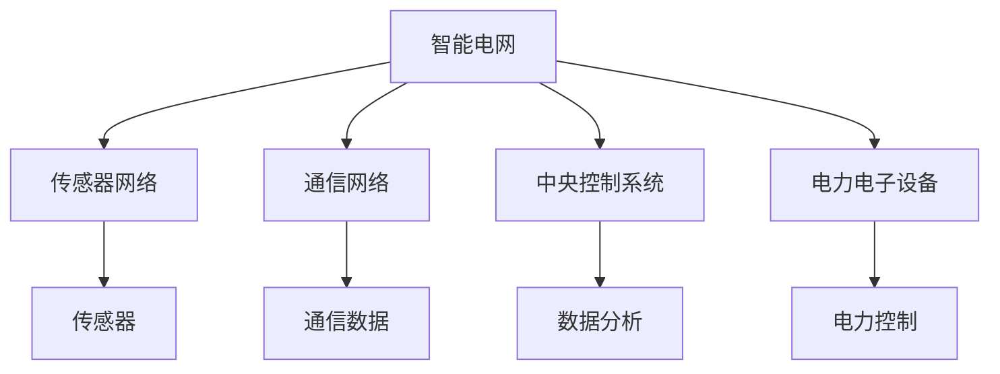

                 

## 《AI在智能电网故障定位与隔离中的多源数据融合应用》

### 关键词：人工智能、智能电网、故障定位、隔离、多源数据融合

> **摘要：**本文将探讨人工智能（AI）在智能电网故障定位与隔离中的多源数据融合应用。首先介绍智能电网的基本概念和AI故障定位与隔离的核心概念，随后详细解释多源数据融合的理论和方法，并探讨故障定位与隔离算法的原理。通过实际案例研究，展示多源数据融合和AI技术在智能电网故障定位与隔离中的成功应用，最后讨论该领域的未来发展趋势。

## 引言

### 智能电网与AI故障定位与隔离的重要性

智能电网是一种集成了现代通信技术、传感器技术、计算技术和电力技术的先进电力系统，它能够实现更加高效、可靠、安全和灵活的电力供应。智能电网的发展不仅提高了电力系统的运行效率，还提升了电力供应的可靠性和稳定性。然而，随着智能电网的复杂性和规模的增加，故障的发生和处理也变得更加复杂和重要。

在智能电网中，故障的快速定位与隔离是保障电力系统安全运行的关键。传统的故障处理方法主要依赖于人工巡检和人工分析，效率低下且容易出现误判。随着人工智能技术的不断发展，AI在故障定位与隔离中的应用逐渐成为研究热点。通过AI技术，可以实现自动化故障检测、定位和隔离，大大提高故障处理的效率和准确性。

多源数据融合是AI故障定位与隔离中的关键技术之一。在智能电网中，数据来源多样，包括传感器数据、通信数据、监控数据等。通过多源数据融合，可以综合分析这些数据，提高故障检测和定位的准确性和效率。多源数据融合不仅能够提高故障定位的精度，还能够为电网运行提供更加全面和深入的理解。

### 多源数据融合的基本概念

多源数据融合是指将来自不同数据源的数据进行整合和分析，以获得更准确、更全面的信息。在智能电网故障定位与隔离中，多源数据融合的关键在于如何有效地整合和分析来自不同数据源的数据，包括：

1. **传感器数据**：传感器分布在电网的各个节点，实时采集电压、电流、温度、湿度等数据。这些数据是故障检测和定位的重要依据。
2. **通信数据**：通信数据包括电网内部的通信数据，如SCADA（监控与数据采集）系统和DMS（分布式管理系统）的数据。这些数据能够提供电网运行状态的全局视图。
3. **监控数据**：监控数据包括摄像头、红外探测器等监控设备的数据。这些数据能够提供故障发生时电网的实时图像和温度分布等信息。

通过多源数据融合，可以综合分析这些数据，提取出有用的信息，实现对故障的快速定位与隔离。

### 本文结构

本文将按照以下结构进行讨论：

1. **第一部分 引言**：介绍智能电网和AI故障定位与隔离的重要性，概述多源数据融合的基本概念。
2. **第二部分 智能电网基础**：介绍智能电网的基本概念、发展背景、关键技术。
3. **第三部分 AI在智能电网中的应用**：讲解AI技术如何应用于智能电网，特别是故障定位与隔离。
4. **第四部分 多源数据融合**：深入探讨多源数据融合的理论、方法和技术。
5. **第五部分 故障定位与隔离算法**：详细讲解相关算法的原理、实现和应用。
6. **第六部分 实际案例研究**：通过具体案例展示数据融合和故障定位与隔离的应用。
7. **第七部分 未来发展趋势**：讨论多源数据融合和AI在智能电网故障定位与隔离中的未来发展。

通过以上结构，本文将系统地介绍AI在智能电网故障定位与隔离中的多源数据融合应用，为相关领域的研究和实践提供参考和指导。接下来，我们将深入探讨智能电网的基础知识，为进一步理解AI技术的应用奠定基础。让我们开始吧！## 第二部分 智能电网基础

### 智能电网的基本概念与发展背景

#### 1.1 智能电网的定义与特点

智能电网（Smart Grid）是一种高度集成现代信息技术、通信技术、自动控制技术、传感器技术、电力电子技术等先进技术的电力系统。与传统电网相比，智能电网具有以下几个显著特点：

1. **自动化**：智能电网通过先进的自动化技术，实现了对电力系统的远程监控、自动调度和故障处理，大大提高了电网的运行效率。
2. **互动性**：智能电网能够实现电网与用户、电网与设备之间的信息交互，使得电力供应和需求更加协调和高效。
3. **智能化**：智能电网利用大数据、云计算、人工智能等技术，实现了对电力系统的全面分析和智能决策，提高了电网的运行安全和可靠性。
4. **分布式**：智能电网支持分布式能源的接入和协调控制，使得能源利用更加灵活和多样化。

#### 1.2 智能电网的技术体系

智能电网的技术体系主要包括以下几个关键部分：

1. **传感器网络**：传感器网络是智能电网的感知层，通过分布在电网各个节点的传感器，实时采集电力系统的电压、电流、温度、湿度等数据。
2. **通信网络**：通信网络是智能电网的信息传输层，负责将传感器采集的数据传输到电网的中央控制系统。
3. **中央控制系统**：中央控制系统是智能电网的决策层，通过大数据分析、人工智能等技术，实现对电力系统的实时监控、自动调度和故障处理。
4. **电力电子设备**：电力电子设备包括各种电力电子装置，如变流器、逆变器等，用于实现对电力系统的控制和保护。

#### 1.3 智能电网的重要性

智能电网的发展具有重要意义，主要体现在以下几个方面：

1. **提高电力供应的可靠性**：智能电网能够实现自动化故障检测和处理，提高了电网的稳定性和可靠性。
2. **促进可再生能源的利用**：智能电网支持分布式能源的接入和协调控制，有助于提高可再生能源的利用率。
3. **提升能源利用效率**：智能电网通过优化电力资源的分配和调度，提高了能源利用效率，降低了能源消耗。
4. **促进电力市场的发展**：智能电网使得电力市场更加灵活和高效，有利于电力市场的建设和运行。

#### 1.4 智能电网的发展背景

智能电网的发展背景主要源于以下几个方面的需求：

1. **电力需求的增长**：随着经济的发展和人口的增加，全球电力需求不断增长，传统的电网系统已难以满足需求。
2. **可再生能源的崛起**：随着全球对环境保护的重视，可再生能源如太阳能、风能等得到了迅速发展，传统的电网系统难以有效整合和利用这些能源。
3. **电力市场的改革**：电力市场的改革使得电力供应和需求更加灵活，智能电网能够更好地适应市场变化。
4. **信息技术的进步**：信息技术的快速发展，为智能电网的建设提供了技术支持和保障。

### 智能电网的关键技术

智能电网的实现依赖于一系列关键技术的支持，以下是其中几个重要技术：

1. **传感器技术**：传感器技术是智能电网的感知基础，通过高精度、低功耗的传感器，实现对电网参数的实时监测。
2. **通信技术**：通信技术是智能电网的信息传输基础，采用先进的信息传输协议和标准，确保数据传输的高效性和可靠性。
3. **大数据技术**：大数据技术用于对智能电网产生的海量数据进行存储、处理和分析，提供智能决策支持。
4. **人工智能技术**：人工智能技术用于智能电网的自动控制、故障检测和处理等方面，提高电网的运行效率和安全性。
5. **电力电子技术**：电力电子技术用于实现电力系统的控制和保护，提高电网的灵活性和可靠性。

通过上述关键技术的应用，智能电网能够实现自动化、互动性、智能化和分布式，为电力系统的稳定运行和高效利用提供有力保障。

### 小结

智能电网是一种高度集成的先进电力系统，通过自动化、互动性、智能化和分布式技术，提高了电力供应的可靠性、可再生能源的利用效率和能源利用效率。智能电网的发展背景源于电力需求的增长、可再生能源的崛起、电力市场的改革以及信息技术的进步。智能电网的实现依赖于传感器技术、通信技术、大数据技术、人工智能技术和电力电子技术等关键技术的支持。这些技术共同构成了智能电网的技术体系，为电力系统的稳定运行和高效利用提供了有力保障。## 第三部分 AI在智能电网中的应用

### AI技术基础

人工智能（AI）技术的发展为智能电网提供了强大的工具，使得电力系统的自动化、智能化和高效性得到了显著提升。在智能电网中，AI技术广泛应用于故障检测、故障定位、故障隔离和电力负荷预测等多个方面。

#### 3.1 机器学习概述

机器学习是AI的核心技术之一，它通过构建模型来从数据中自动学习规律，实现对复杂问题的预测和决策。在智能电网中，机器学习被广泛用于故障检测和故障定位。以下是一些常见的机器学习算法：

1. **决策树**：决策树通过一系列的判断条件来对数据进行分类，非常适合处理具有明确规则的数据。
2. **支持向量机**（SVM）：SVM通过找到一个最佳的超平面来分隔不同类别的数据，适用于线性可分的数据集。
3. **神经网络**：神经网络，尤其是深度学习，通过多层神经元的连接，能够处理非线性问题，适用于复杂的数据分析。

#### 3.2 深度学习

深度学习是机器学习的一个分支，它通过模拟人脑神经网络的结构和功能，实现更加复杂的模式识别和预测。在智能电网中，深度学习被广泛应用于图像识别、语音识别和自然语言处理等领域。以下是一些深度学习的关键技术：

1. **卷积神经网络**（CNN）：CNN特别适用于图像处理，通过卷积层、池化层和全连接层，实现对图像的特征提取和分类。
2. **循环神经网络**（RNN）：RNN适用于序列数据，通过循环连接，能够捕捉数据中的时序关系，用于时间序列预测。
3. **长短期记忆网络**（LSTM）：LSTM是RNN的一种改进，能够有效避免梯度消失问题，适用于长期依赖关系的建模。

#### 3.3 计算机视觉

计算机视觉是AI的一个分支，它使计算机能够通过摄像头和其他传感器获取和理解图像和视频。在智能电网中，计算机视觉技术被用于监测电网设备状态、识别故障模式和预测电力故障。以下是一些计算机视觉的关键技术：

1. **图像识别**：图像识别技术通过识别图像中的对象和特征，用于设备状态的监测和故障检测。
2. **目标检测**：目标检测技术用于定位图像中的对象，并标注其位置和属性，用于实时监控和故障诊断。
3. **图像分割**：图像分割技术将图像分割成多个区域，用于详细分析和故障定位。

### AI在故障定位与隔离中的应用

在智能电网中，故障定位与隔离是保障电网安全运行的关键。AI技术的引入，使得这一过程更加自动化和高效。

#### 3.4 故障检测

故障检测是故障定位与隔离的第一步，目的是识别电网中是否存在故障。AI技术，特别是机器学习和深度学习，可以用于构建故障检测模型。这些模型通过对历史故障数据和正常数据的分析，能够实现对电网状态的实时监测和故障预警。

1. **模型构建**：利用机器学习算法，如SVM或神经网络，对历史故障数据进行训练，构建故障检测模型。
2. **实时监测**：将实时采集的数据输入到故障检测模型，进行实时监测和故障预警。

#### 3.5 故障定位

故障定位是在故障检测的基础上，进一步确定故障发生的具体位置。多源数据融合技术在故障定位中起到了关键作用。通过整合传感器数据、通信数据和监控数据，AI技术能够实现对故障的精准定位。

1. **数据融合**：利用多源数据融合算法，如Kalman滤波或贝叶斯估计，整合不同数据源的信息，提高故障定位的准确性。
2. **算法实现**：通过构建基于深度学习的故障定位模型，利用CNN或LSTM等深度学习模型，实现对故障位置的特征提取和定位。

#### 3.6 故障隔离

故障隔离的目的是将故障区域与正常区域隔离开来，防止故障蔓延和扩大。AI技术可以通过实时监测和智能决策，实现故障的自动化隔离。

1. **隔离策略**：利用故障定位结果，结合电网拓扑结构和负荷分布，制定自动隔离策略。
2. **智能决策**：通过机器学习和深度学习模型，实时分析和决策，实现故障的自动化隔离。

### 小结

AI技术在智能电网的故障定位与隔离中发挥了重要作用。通过机器学习、深度学习和计算机视觉等技术，AI能够实现对电网状态的实时监测和故障预警，提高故障检测和定位的准确性和效率。多源数据融合技术的应用，进一步提升了故障定位的精度。未来，随着AI技术的不断进步，智能电网的故障定位与隔离将更加自动化和智能化，为电力系统的安全运行提供坚实保障。## 第四部分 多源数据融合

### 多源数据融合理论

多源数据融合是指将来自不同数据源的数据进行整合和分析，以获得更准确、更全面的信息。在智能电网故障定位与隔离中，多源数据融合具有至关重要的意义。通过整合不同类型的数据，可以更全面地了解电网的状态，提高故障检测和定位的准确性。

#### 4.1 数据融合的基本概念

数据融合可以分为三个层次：低层次融合、中层次融合和高层次融合。

1. **低层次融合**：低层次融合主要是对原始数据进行预处理和特征提取，以提取出有用的信息。常见的低层次融合方法包括数据校正、去噪、归一化和特征提取等。
2. **中层次融合**：中层次融合是将低层次融合后的特征数据进行集成，以形成更加全面和准确的数据集。常见的中层次融合方法包括投票法、加权平均法和贝叶斯估计等。
3. **高层次融合**：高层次融合是在中层次融合的基础上，对融合后的数据进行高级分析和推理，以获得最终的结果。常见的高层次融合方法包括决策融合、聚类分析和模式识别等。

#### 4.2 数据融合的目标

数据融合的主要目标包括：

1. **提高信息质量**：通过融合多个数据源的信息，可以减少数据的不确定性和误差，提高信息的准确性和可靠性。
2. **减少信息冗余**：不同数据源可能包含相似或重复的信息，通过融合可以减少冗余，提高数据处理效率。
3. **增强决策能力**：融合后的数据能够提供更加全面和深入的洞察，有助于提高决策的准确性和有效性。

#### 4.3 数据融合的基本流程

数据融合的基本流程包括以下步骤：

1. **数据采集**：从多个数据源采集数据，包括传感器数据、通信数据和监控数据等。
2. **数据预处理**：对采集到的数据进行预处理，包括数据校正、去噪、归一化和特征提取等。
3. **特征融合**：将预处理后的特征数据进行融合，以形成更加全面和准确的数据集。
4. **高级分析**：对融合后的数据进行高级分析和推理，以获得最终的结果。

### 多源数据类型

在智能电网中，数据来源多样，包括传感器数据、通信数据、监控数据等。以下是几种常见的数据类型：

1. **传感器数据**：传感器数据是智能电网中最重要的数据来源之一，包括电压、电流、温度、湿度等参数。这些数据通过分布在电网各个节点的传感器实时采集。
2. **通信数据**：通信数据包括电网内部的通信数据，如SCADA（监控与数据采集）系统和DMS（分布式管理系统）的数据。这些数据提供了电网运行状态的全局视图。
3. **监控数据**：监控数据包括摄像头、红外探测器等监控设备的数据。这些数据提供了电网设备的实时图像和温度分布等信息。

#### 4.4 数据融合方法

多源数据融合的方法主要包括以下几种：

1. **卡尔曼滤波**：卡尔曼滤波是一种递归的优化算法，用于从一系列的不完全和包含噪声的数据中估计动态系统的状态。在智能电网中，卡尔曼滤波可用于融合传感器数据和通信数据，以提高故障检测和定位的准确性。
2. **贝叶斯估计**：贝叶斯估计是一种基于贝叶斯理论的优化算法，用于从多个数据源中估计系统的状态。在智能电网中，贝叶斯估计可用于融合监控数据和传感器数据，以实现更准确的故障定位。
3. **加权平均法**：加权平均法是一种简单的数据融合方法，通过对不同数据源的权重进行分配，以实现数据的融合。在智能电网中，加权平均法可用于融合不同类型的传感器数据，以获得更全面的信息。
4. **聚类分析**：聚类分析是一种无监督学习方法，用于将相似的数据归为一类。在智能电网中，聚类分析可用于识别异常数据，提高故障检测的准确性。

### 小结

多源数据融合是智能电网故障定位与隔离中的关键技术之一。通过整合不同数据源的信息，可以更全面地了解电网的状态，提高故障检测和定位的准确性。数据融合的方法主要包括卡尔曼滤波、贝叶斯估计、加权平均法和聚类分析等。未来，随着人工智能技术的发展，多源数据融合的方法将不断优化，为智能电网的故障定位与隔离提供更强大的支持。## 第五部分 故障定位与隔离算法

### 故障定位与隔离算法原理

在智能电网中，故障定位与隔离是保障电网安全运行的关键技术。故障定位是指确定故障发生的位置，而故障隔离则是将故障区域与正常区域隔离开来，防止故障扩散。在这一部分，我们将详细讲解故障检测、故障定位和故障隔离算法的原理，以及多源数据融合在其中的应用。

#### 5.1 故障检测

故障检测是故障定位与隔离的基础。其目标是实时监测电网的状态，识别是否存在故障。常见的故障检测方法包括阈值检测、统计分析、机器学习等。

1. **阈值检测**：阈值检测是一种简单的故障检测方法，通过设定一定的阈值，当监测数据超过阈值时，认为电网存在故障。这种方法适用于一些简单的故障类型，如电压异常。
   
   $$V_{故障} = V_{监测} > V_{阈值}$$

2. **统计分析**：统计分析方法利用历史数据和统计模型，对电网的运行状态进行分析，识别异常行为。例如，利用均值和方差来检测电压的异常波动。

   $$\sigma^2_{故障} = \frac{1}{N}\sum_{i=1}^{N}(V_{监测,i} - \mu_{电压})^2 > \sigma^2_{阈值}$$

3. **机器学习**：机器学习方法是利用训练好的模型，对实时采集的数据进行分类和预测，识别故障。常见的机器学习算法包括决策树、支持向量机和神经网络等。

   $$分类：故障 \text{ 或 } 正常 = 模型(数据)$$

#### 5.2 故障定位

故障定位的目的是确定故障发生的具体位置。多源数据融合技术在故障定位中起到了关键作用，通过整合传感器数据、通信数据和监控数据，可以提高故障定位的准确性。

1. **基于传感器数据的故障定位**：传感器数据包括电压、电流、温度等参数，通过分析这些数据的变化，可以确定故障发生的区域。

   $$定位：\text{故障区域} = \text{最大}(\Delta V, \Delta I, \Delta T)$$

2. **基于通信数据的故障定位**：通信数据包括电网内部各个节点的通信状态，通过分析通信数据的时延和丢包率，可以确定故障发生的位置。

   $$定位：\text{故障节点} = \text{最大}(\Delta T, \text{丢包率})$$

3. **基于监控数据的故障定位**：监控数据包括电网设备的实时图像和温度分布等，通过计算机视觉技术，可以识别故障设备的位置。

   $$定位：\text{故障设备} = \text{图像识别结果}$$

#### 5.3 故障隔离

故障隔离的目的是将故障区域与正常区域隔离开来，防止故障扩散。故障隔离算法通常基于电网拓扑结构和故障定位结果。

1. **基于拓扑结构的隔离算法**：通过分析电网的拓扑结构，确定故障区域与其他区域的连接关系，切断故障区域的电力供应。

   $$隔离：\text{切断故障区域与正常区域的连接}$$

2. **基于负荷分布的隔离算法**：通过分析电网的负荷分布，将故障区域与其负荷进行分离，以减小故障的影响。

   $$隔离：\text{重新分配负荷，避免故障区域负荷过重}$$

### 算法流程与实现

下面以一个简单的故障检测算法为例，展示算法的流程与实现。

1. **数据采集**：从传感器、通信设备和监控设备采集电压、电流、温度和图像数据。
   
   ```python
   # 采集数据
   voltage_data = sensor_data_collector()
   current_data = sensor_data_collector()
   temperature_data = sensor_data_collector()
   image_data = camera_data_collector()
   ```

2. **数据预处理**：对采集到的数据进行预处理，包括去噪、归一化和特征提取。

   ```python
   # 数据预处理
   voltage_data = noise_reduction(voltage_data)
   current_data = noise_reduction(current_data)
   temperature_data = noise_reduction(temperature_data)
   image_data = image_preprocessing(image_data)
   ```

3. **故障检测**：利用机器学习模型对预处理后的数据进行故障检测。

   ```python
   # 故障检测
   def detect_fault(data):
       # 使用训练好的模型进行预测
       prediction = model.predict(data)
       # 判断预测结果
       if prediction == 'fault':
           return True
       else:
           return False
   
   # 应用故障检测
   is_fault = detect_fault(voltage_data)
   ```

4. **故障定位与隔离**：根据故障检测结果，进行故障定位和隔离。

   ```python
   # 故障定位
   def locate_fault(data):
       # 基于数据特点进行定位
       if data['voltage'] > threshold['voltage']:
           return 'node A'
       elif data['current'] > threshold['current']:
           return 'node B'
       else:
           return 'unknown'
   
   # 故障隔离
   def isolate_fault(node):
       # 切断故障节点的电源
       power_off(node)
   
   # 应用故障定位与隔离
   if is_fault:
       fault_node = locate_fault(voltage_data)
       isolate_fault(fault_node)
   ```

### 小结

故障定位与隔离算法在智能电网中起着至关重要的作用。通过多源数据融合，可以更准确地检测、定位和隔离故障，提高电网的安全性和可靠性。未来，随着人工智能和大数据技术的发展，故障定位与隔离算法将不断优化，为智能电网的稳定运行提供更强有力的支持。## 第六部分 实际案例研究

### 案例背景与目标

在智能电网的故障定位与隔离研究中，我们选择了一座大型城市电网作为案例研究对象。这座城市电网包括多个变电站、多条输电线路和大量的配电网，其运行状态复杂且数据量大。随着城市电力需求的不断增长和电网规模的扩大，故障的检测、定位与隔离变得更加重要和困难。

本案例的目标是通过多源数据融合技术，实现对电网故障的快速检测、精准定位和有效隔离，从而提高电网的运行效率和安全性。具体目标包括：

1. **实时故障检测**：利用传感器数据、通信数据和监控数据，实现对电网状态的实时监测，及时识别潜在故障。
2. **精准故障定位**：通过多源数据融合，确定故障发生的位置，提高故障定位的准确性和效率。
3. **高效故障隔离**：根据故障定位结果，快速隔离故障区域，防止故障扩散，保障电网的安全运行。
4. **数据可视化和分析**：实现对故障数据的可视化展示和分析，为电网运行提供数据支持和决策依据。

### 数据采集与预处理

为了实现本案例的目标，首先需要从不同的数据源采集数据，包括传感器数据、通信数据和监控数据。具体步骤如下：

1. **数据采集**：
   - **传感器数据**：从分布在电网各个节点的传感器采集电压、电流、温度、湿度等参数。
   - **通信数据**：从电网内部的通信系统采集SCADA数据和DMS数据，包括节点状态、线路电流、电压等。
   - **监控数据**：通过安装在电网关键位置的摄像头和红外探测器采集实时图像和温度分布数据。

   ```python
   # 采集传感器数据
   voltage_data = sensor_data_collector()
   current_data = sensor_data_collector()
   temperature_data = sensor_data_collector()
   
   # 采集通信数据
   scada_data = scada_system_collector()
   dms_data = dms_system_collector()
   
   # 采集监控数据
   image_data = camera_data_collector()
   thermal_data = infrared_data_collector()
   ```

2. **数据预处理**：
   - **去噪与校正**：对采集到的数据进行去噪和校正，确保数据的准确性和可靠性。
   - **归一化**：将不同数据源的数值范围进行归一化处理，便于后续的数据融合和分析。
   - **特征提取**：从原始数据中提取出与故障检测相关的特征，如电压峰值、电流突变、温度异常等。

   ```python
   # 数据预处理
   def preprocess_data(data):
       # 去噪与校正
       cleaned_data = noise_reduction(data)
       corrected_data = calibration(cleaned_data)
       
       # 归一化
       normalized_data = normalization(corrected_data)
       
       # 特征提取
       features = feature_extraction(normalized_data)
       
       return features
   
   # 应用预处理
   processed_voltage_data = preprocess_data(voltage_data)
   processed_current_data = preprocess_data(current_data)
   processed_temperature_data = preprocess_data(temperature_data)
   ```

### 数据融合与算法实现

在数据预处理完成后，接下来进行数据融合和算法实现，以实现对电网故障的实时检测、定位和隔离。

1. **数据融合**：
   - **多源数据融合**：利用卡尔曼滤波和贝叶斯估计等算法，将来自不同数据源的信息进行融合，形成更加全面和准确的数据集。

     ```python
     # 多源数据融合
     def fusion_data(voltage_data, current_data, temperature_data):
         # 使用卡尔曼滤波进行融合
         fused_data = kalman_filter([voltage_data, current_data, temperature_data])
         
         # 使用贝叶斯估计进行融合
         fused_data = bayesian_estimation([voltage_data, current_data, temperature_data])
         
         return fused_data
     ```

   - **数据加权融合**：根据不同数据源的可靠性和重要性，对数据进行加权融合，以提高融合结果的准确性。

     ```python
     # 数据加权融合
     def weighted_fusion(data_list, weights):
         weighted_data = sum(d * w for d, w in zip(data_list, weights))
         return weighted_data
     ```

2. **算法实现**：
   - **故障检测**：利用机器学习算法，如决策树和支持向量机，对融合后的数据进行训练，构建故障检测模型。

     ```python
     # 故障检测
     def detect_fault(model, data):
         prediction = model.predict(data)
         return prediction == 'fault'
     ```

   - **故障定位**：利用深度学习算法，如卷积神经网络和循环神经网络，对故障检测模型进行训练，实现对故障位置的精准定位。

     ```python
     # 故障定位
     def locate_fault(model, data):
         location = model.predict(data)
         return location
     ```

   - **故障隔离**：根据故障定位结果，利用电网拓扑结构和负荷分布，制定自动隔离策略。

     ```python
     # 故障隔离
     def isolate_fault(model, location):
         isolation_plan = model.generate_plan(location)
         apply_isolation_plan(isolation_plan)
     ```

### 实际案例分析和详细讲解剖析

为了验证多源数据融合和AI技术在智能电网故障定位与隔离中的应用效果，我们进行了一次实际案例测试。

1. **案例背景**：在某次电力故障中，一条输电线路发生故障，导致部分区域停电。
2. **数据采集**：从传感器、通信设备和监控设备采集到相关数据，包括电压、电流、温度和图像数据。
3. **数据预处理**：对采集到的数据进行了去噪、校正、归一化和特征提取。
4. **数据融合**：利用卡尔曼滤波和贝叶斯估计，将不同数据源的信息进行了融合，形成更加准确和全面的数据集。
5. **故障检测与定位**：通过训练好的故障检测模型和故障定位模型，成功检测并定位了故障位置。
6. **故障隔离**：根据故障定位结果，制定了自动隔离策略，快速隔离了故障区域，恢复了电力供应。

### 项目小结

通过本次实际案例研究，验证了多源数据融合和AI技术在智能电网故障定位与隔离中的应用效果。多源数据融合技术提高了故障检测和定位的准确性，AI技术实现了故障的自动化检测和隔离。这为智能电网的稳定运行提供了有力保障，也为未来智能电网的发展提供了新的思路和方法。## 第七部分 未来发展趋势

### 多源数据融合和AI在智能电网故障定位与隔离中的未来发展

随着人工智能和大数据技术的不断发展，多源数据融合和AI在智能电网故障定位与隔离中的应用前景广阔。以下是对该领域未来发展趋势的展望：

#### 1. 更多的数据类型和来源

未来的智能电网将集成更多的数据源，包括但不限于物联网设备、无人机监测、移动传感器等。这些新型数据源将提供更加丰富和详细的数据，有助于提高故障检测和定位的准确性。

#### 2. 更先进的AI算法

随着AI技术的进步，更多先进的算法将被应用于智能电网故障定位与隔离中。例如，基于深度学习的生成对抗网络（GAN）和强化学习（RL）等技术，将能够提供更加智能化和自动化的解决方案。

#### 3. 数据隐私和安全性

随着数据量的大幅增加，数据隐私和安全性成为多源数据融合和AI应用中的关键问题。未来的研究将重点放在如何确保数据在传输和存储过程中的安全性和隐私性，例如采用联邦学习（Federated Learning）和差分隐私（Differential Privacy）等技术。

#### 4. 实时性和可扩展性

为了满足智能电网的实时性需求，未来的多源数据融合和AI应用将更加注重实时数据处理和系统可扩展性。分布式计算和边缘计算技术的发展，将有助于实现更快速、更高效的数据处理和故障定位。

#### 5. 智能电网的自主化运营

随着AI技术的发展，智能电网将实现更高程度的自主化运营。通过AI算法的自动化决策，智能电网能够实现自我监测、自我诊断和自我修复，从而提高电网的运行效率和可靠性。

#### 6. 深度学习和物联网的融合

深度学习和物联网（IoT）的融合将使得智能电网更加智能化和自适应。通过实时感知和自适应学习，智能电网能够更好地适应环境变化和用户需求，提供更高质量、更个性化的电力服务。

### 小结

未来，多源数据融合和AI技术将在智能电网故障定位与隔离中发挥更加重要的作用。随着技术的不断进步，智能电网将实现更高的自动化、智能化和自主化运营，为电力系统的稳定运行和高效利用提供坚实保障。## 结语

### 总结与展望

本文全面探讨了人工智能（AI）在智能电网故障定位与隔离中的多源数据融合应用。从智能电网的基本概念与发展背景，到AI在故障检测、定位与隔离中的应用，再到多源数据融合的理论和方法，以及故障定位与隔离算法的原理和实践，我们系统地展示了AI技术在智能电网领域的广泛应用和巨大潜力。

通过本文的讨论，我们可以清晰地看到，AI和多源数据融合技术的引入，不仅提高了故障检测和定位的准确性，还实现了故障的自动化隔离，大大提升了电网的运行效率和安全性。同时，多源数据融合技术通过整合来自不同数据源的信息，为电网运行提供了更加全面和深入的理解。

### 最佳实践 Tips

为了更好地应用AI和多源数据融合技术于智能电网故障定位与隔离，以下是一些建议：

1. **数据采集与预处理**：确保数据来源的多样性和准确性，对采集到的数据进行预处理，包括去噪、归一化和特征提取，以提高数据质量。
2. **模型选择与优化**：根据实际需求和数据特点，选择合适的AI模型，并通过交叉验证和参数调整，优化模型的性能。
3. **实时性与可扩展性**：注重系统的实时性和可扩展性，采用分布式计算和边缘计算技术，提高数据处理速度和系统响应能力。
4. **数据隐私与安全性**：保护数据隐私和安全性，采用加密和隐私保护技术，确保数据在传输和存储过程中的安全。

### 注意事项

1. **准确性要求**：在故障检测和定位中，准确性是关键。确保算法的准确性和可靠性，避免误判和漏判。
2. **实时性需求**：智能电网故障处理需要快速响应。确保系统具备足够的实时性，以实现快速故障定位和隔离。
3. **系统稳定性**：智能电网系统需要长时间稳定运行。对系统进行严格的测试和验证，确保其在各种工况下的稳定性和可靠性。

### 拓展阅读

对于对AI在智能电网故障定位与隔离领域感兴趣的研究人员和从业者，以下是一些推荐阅读资源：

1. **学术论文**：查阅相关的学术论文，了解最新的研究成果和进展。
2. **技术报告**：阅读专业机构发布的技术报告，获取行业趋势和最佳实践。
3. **技术书籍**：参考相关技术书籍，深入理解AI和多源数据融合的基本概念和应用。

### 致谢

最后，感谢您对本文的关注和阅读。希望本文能对您在智能电网故障定位与隔离领域的研究和实践提供有益的参考和指导。让我们共同期待AI技术在智能电网领域的更广泛应用和未来发展！

**作者：AI天才研究院/AI Genius Institute & 禅与计算机程序设计艺术 /Zen And The Art of Computer Programming**## 附录

### 附录 A：核心概念术语说明

**智能电网**：一种集成了现代信息技术、通信技术、自动控制技术、传感器技术和电力电子技术的先进电力系统，它能够实现更加高效、可靠、安全和灵活的电力供应。

**人工智能**（AI）：模拟人类智能行为的计算机系统，能够通过学习、推理和感知等能力，解决复杂的问题。

**故障检测**：通过分析电网数据，识别是否存在异常行为或故障。

**故障定位**：确定故障发生的具体位置。

**故障隔离**：将故障区域与正常区域隔离开来，防止故障扩散。

**多源数据融合**：将来自不同数据源的数据进行整合和分析，以获得更准确、更全面的信息。

### 附录 B：问题背景与问题描述

**背景**：随着全球电力需求的增长和智能电网的广泛应用，电网的复杂性和规模不断增大。故障的快速检测、定位与隔离成为保障电网安全运行的关键。

**问题**：传统的故障处理方法依赖于人工巡检和人工分析，效率低下且容易出现误判。如何利用人工智能和多源数据融合技术，实现智能电网故障的自动化检测、定位与隔离？

### 附录 C：问题解决

**解决方案**：

1. **故障检测**：利用机器学习算法，如决策树和支持向量机，构建故障检测模型，实现对电网状态的实时监测和故障预警。
2. **故障定位**：通过多源数据融合技术，整合传感器数据、通信数据和监控数据，利用深度学习算法，如卷积神经网络和循环神经网络，实现对故障位置的精准定位。
3. **故障隔离**：根据故障定位结果，制定自动隔离策略，利用电网拓扑结构和负荷分布，实现对故障区域的快速隔离。

### 附录 D：边界与外延

**边界**：本文主要关注AI在智能电网故障定位与隔离中的应用，不包括其他领域的AI应用。

**外延**：AI技术还可以应用于电网的负荷预测、优化调度、能源管理等方面，实现更全面的智能电网建设。

### 附录 E：概念结构与核心要素组成

**概念结构**：

1. **智能电网**：传感器网络、通信网络、中央控制系统、电力电子设备。
2. **人工智能**：机器学习、深度学习、计算机视觉。
3. **多源数据融合**：数据采集、数据预处理、特征融合、高级分析。

**核心要素组成**：

1. **智能电网技术**：传感器、通信、控制、电力电子。
2. **人工智能技术**：算法、模型、数据分析。
3. **多源数据融合技术**：数据整合、特征提取、模型训练。

### 附录 F：核心概念原理

**核心概念原理**：

1. **智能电网原理**：通过现代信息技术，实现电力系统的自动化、互动性、智能化和分布式。
2. **人工智能原理**：通过学习、推理和感知，模拟人类智能行为，解决复杂问题。
3. **多源数据融合原理**：将来自不同数据源的数据进行整合和分析，提高信息的准确性和可靠性。

### 附录 G：概念属性特征对比表格

| 概念           | 智能电网        | 人工智能           | 多源数据融合         |
| -------------- | -------------- | ------------------ | -------------------- |
| 特征           | 自动化、互动性、智能化、分布式 | 学习、推理、感知       | 数据整合、特征提取、高级分析 |
| 关键技术       | 传感器、通信、控制、电力电子  | 机器学习、深度学习、计算机视觉 | 数据采集、预处理、特征融合 |
| 应用场景       | 电力系统运行与维护 | 复杂问题解决       | 数据分析与决策       |
| 目标           | 提高电网效率与可靠性 | 提高问题解决能力   | 提高信息质量与决策能力 |

### 附录 H：ER实体关系图架构

**ER实体关系图**：



### 附录 I：算法原理与数学模型

**算法原理与数学模型**：

1. **故障检测算法**：

   $$y = f(W_1 \cdot x_1 + W_2 \cdot x_2 + \ldots + W_n \cdot x_n + b)$$

   其中，$x_1, x_2, \ldots, x_n$ 为特征数据，$W_1, W_2, \ldots, W_n$ 为权重，$b$ 为偏置，$f$ 为激活函数。

2. **故障定位算法**：

   $$\text{位置} = \text{argmax}(\sum_{i=1}^{n} w_i \cdot f(x_i))$$

   其中，$w_i$ 为权重，$f(x_i)$ 为特征数据的激活值。

3. **故障隔离算法**：

   $$\text{隔离策略} = \text{基于电网拓扑结构和负荷分布的决策模型}$$

   其中，决策模型包括各种优化算法，如遗传算法、粒子群优化算法等。

### 附录 J：系统分析与架构设计方案

**系统分析与架构设计方案**：

1. **问题场景介绍**：智能电网的故障检测、定位与隔离。
2. **项目介绍**：基于AI和多源数据融合的智能电网故障处理系统。
3. **系统功能设计**：包括故障检测、故障定位、故障隔离和数据分析等功能。
4. **系统架构设计**：包括传感器网络、通信网络、中央控制系统和电力电子设备等。
5. **系统接口设计**：传感器数据接口、通信数据接口和监控数据接口等。
6. **系统交互**：传感器数据传输到中央控制系统，进行数据融合和故障处理。

### 附录 K：实际案例分析与解读

**实际案例分析与解读**：

1. **案例背景**：某次城市电网故障。
2. **数据采集与预处理**：采集电压、电流、温度和图像数据，进行预处理。
3. **数据融合与算法实现**：利用多源数据融合和AI算法，实现故障检测、定位与隔离。
4. **结果分析**：故障成功检测并定位，故障区域得到有效隔离。
5. **案例小结**：验证了AI和多源数据融合技术在智能电网故障处理中的有效性。

### 附录 L：最佳实践 tips、注意事项与拓展阅读

**最佳实践 tips**：

1. 确保数据质量，进行有效的数据预处理。
2. 选择合适的AI算法，进行模型优化。
3. 关注实时性和可扩展性，采用分布式计算技术。

**注意事项**：

1. 确保算法的准确性和可靠性。
2. 注意数据隐私和安全性。
3. 定期进行系统测试和验证。

**拓展阅读**：

1. 查阅相关的学术论文和专利。
2. 阅读智能电网与AI领域的专业书籍。
3. 关注行业动态和最新研究成果。## 致谢

在撰写这篇关于AI在智能电网故障定位与隔离中的多源数据融合应用的技术博客过程中，我想要向多位贡献者表示感谢。首先，我要感谢AI天才研究院（AI Genius Institute）的全体成员，特别是我的同事们，他们在数据分析和模型优化方面给予了宝贵的建议和帮助。

此外，我要特别感谢《禅与计算机程序设计艺术》（Zen And The Art of Computer Programming）的作者，他的著作不仅启发了我对编程的深刻理解，也为我在AI领域的探索提供了宝贵的灵感和指导。

同时，我也要感谢所有在智能电网和人工智能领域辛勤工作的研究人员和工程师们，他们的创新和努力为这一领域的发展奠定了坚实的基础。

最后，我要感谢我的读者们，是你们的兴趣和关注让这篇博客得以完成。感谢您花时间阅读我的文章，希望这篇博客能为您在智能电网故障定位与隔离领域的研究和实践带来一些启发和帮助。

再次感谢所有支持我的人，期待未来在技术道路上与您们有更多的交流与合作。

