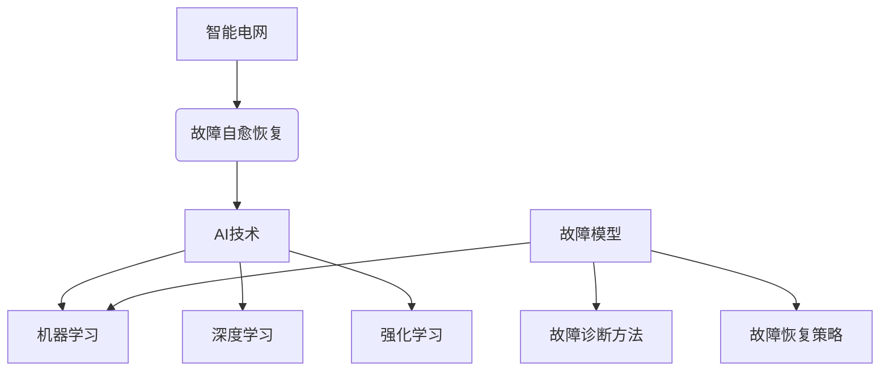

                 

### AI在智能电网故障自愈与恢复中的快速决策应用

智能电网（Smart Grid）是一种先进、高效、安全的电力网络，通过信息化、自动化技术实现电力系统的智能化管理。随着电网规模的扩大和电力需求的增长，智能电网的稳定性和可靠性成为关键问题。故障自愈与恢复（Self-healing and Recovery）是指电网在发生故障时，能够自动检测、诊断并采取恢复措施，以最小化停电时间和影响。近年来，人工智能（AI）技术的发展为智能电网故障自愈与恢复提供了新的思路和方法。

#### **关键词：**
- **智能电网**
- **故障自愈恢复**
- **人工智能**
- **快速决策**
- **机器学习**
- **深度学习**
- **强化学习**

#### **摘要：**
本文探讨了AI在智能电网故障自愈与恢复中的应用，首先介绍了智能电网的背景和故障自愈恢复的重要性，然后详细分析了AI技术，包括机器学习、深度学习和强化学习在故障诊断和恢复中的应用原理。通过实际案例，展示了AI在智能电网故障自愈与恢复中的快速决策应用，并提出了未来研究的方向。

---

### **第一部分：背景与概述**

#### **第1章：智能电网与故障自愈恢复**

**1.1 智能电网概述**

智能电网是指通过先进的信息通信技术（ICT）和电力电子技术，实现电力系统的智能化管理和控制。智能电网的特点包括：

- **高度集成化**：通过整合各种分布式能源、智能设备和通信技术，实现电网的互联互通。
- **实时监控**：利用传感器和通信技术，实现电网设备的实时监测和数据采集。
- **自动控制**：通过自动化控制技术，实现电网运行状态的自动调整和优化。
- **智能管理**：基于大数据和人工智能技术，实现电网的智能决策和优化管理。

**1.2 智能电网故障自愈与恢复的重要性**

智能电网虽然具有高度自动化和智能化的特点，但仍然无法完全避免故障的发生。智能电网故障自愈与恢复的重要性体现在以下几个方面：

- **减少停电时间**：通过故障自愈与恢复技术，可以快速诊断和隔离故障，减少停电时间和影响。
- **提高供电可靠性**：智能电网的故障自愈与恢复功能能够提高电网的稳定性和可靠性。
- **优化电网运行**：通过故障自愈与恢复，可以优化电网的运行效率和安全性。

**1.3 当前智能电网故障自愈恢复的挑战**

尽管智能电网故障自愈与恢复具有重要意义，但在实际应用中仍面临以下挑战：

- **复杂性和多样性**：电网系统复杂且多样化，故障类型和特征也各不相同，这对故障自愈与恢复技术提出了高要求。
- **实时性与准确性**：故障自愈与恢复需要在短时间内做出准确决策，这对算法的实时性和准确性提出了挑战。
- **数据安全和隐私**：智能电网故障自愈与恢复需要大量的数据支持，但数据的安全和隐私保护也是一个重要问题。

#### **第2章：AI与智能电网故障自愈恢复**

**2.1 AI技术简介**

人工智能（AI）是指通过计算机模拟人类的智能行为，实现智能推理、决策和问题解决。AI技术的发展为智能电网故障自愈与恢复提供了新的可能性。AI技术主要包括以下几个方面：

- **机器学习**：通过训练数据，让计算机自主学习和改进，实现模式识别和预测。
- **深度学习**：一种特殊的机器学习技术，通过多层神经网络实现复杂特征的提取和表示。
- **强化学习**：通过试错和反馈机制，实现智能体的自主学习和策略优化。

**2.2 AI在智能电网中的应用**

AI技术在智能电网中的应用主要包括以下几个方面：

- **故障诊断**：利用机器学习和深度学习算法，对电网故障进行快速、准确的诊断。
- **负荷预测**：通过大数据分析和机器学习，实现电网负荷的精准预测，优化电网运行。
- **设备监控**：利用传感器和AI算法，实现电网设备的实时监控和维护。
- **决策支持**：基于AI算法，为电网运行提供智能化的决策支持，提高电网的稳定性和可靠性。

**2.3 AI在故障自愈恢复中的优势**

AI技术在智能电网故障自愈恢复中具有以下优势：

- **实时性**：AI算法能够在短时间内处理大量数据，实现快速故障诊断和恢复。
- **准确性**：通过训练和优化，AI算法可以不断提高故障诊断的准确性，减少误报和漏报。
- **智能化**：AI技术能够基于数据分析和自主学习，实现智能化的故障恢复策略。
- **自适应**：AI算法可以根据电网运行状态和环境变化，自适应地调整故障恢复策略。

### **第二部分：核心概念与联系**

#### **第3章：核心概念原理**

**3.1 AI基础算法**

AI基础算法主要包括以下几种：

- **机器学习算法**：通过训练数据，让计算机自主学习和改进，实现模式识别和预测。常见的机器学习算法有线性回归、决策树、支持向量机等。
- **深度学习算法**：一种特殊的机器学习技术，通过多层神经网络实现复杂特征的提取和表示。常见的深度学习算法有卷积神经网络（CNN）、循环神经网络（RNN）、长短时记忆网络（LSTM）等。
- **强化学习算法**：通过试错和反馈机制，实现智能体的自主学习和策略优化。常见的强化学习算法有Q学习、深度Q网络（DQN）、策略梯度等。

**3.2 智能电网故障模型**

智能电网故障模型主要包括以下几个方面：

- **故障类型与特征**：根据电网故障的特点，将其分为多种类型，并提取相应的特征信息。
- **故障诊断方法**：利用AI算法对电网故障进行诊断，包括故障检测、故障定位、故障分类等。
- **故障恢复策略**：根据故障类型和特征，制定相应的恢复策略，实现电网的快速自愈。

**3.3 故障恢复策略**

故障恢复策略主要包括以下几个方面：

- **自动化隔离**：通过自动化控制技术，快速隔离故障区域，防止故障扩散。
- **自适应修复**：根据故障特征和电网运行状态，自适应地调整恢复策略，实现故障的快速修复。
- **协同优化**：通过多智能体协同控制，实现电网故障的自愈与恢复。

#### **第4章：概念实体之间的关系架构**

为了更好地理解智能电网故障自愈与恢复中的AI技术应用，我们可以使用Mermaid流程图来展示各个概念实体之间的关系。以下是示例：



### **第三部分：核心算法原理讲解**

#### **第5章：AI算法在故障自愈恢复中的应用**

**5.1 Python源代码示例**

以下是一个简单的Python示例，展示了如何使用机器学习算法进行电网故障诊断：

```python
import numpy as np
from sklearn.model_selection import train_test_split
from sklearn.ensemble import RandomForestClassifier

# 生成模拟数据集
X = np.random.rand(100, 10)  # 特征矩阵
y = np.random.randint(0, 2, 100)  # 标签矩阵

# 划分训练集和测试集
X_train, X_test, y_train, y_test = train_test_split(X, y, test_size=0.2, random_state=42)

# 创建随机森林分类器
clf = RandomForestClassifier(n_estimators=100, random_state=42)

# 训练模型
clf.fit(X_train, y_train)

# 预测测试集
y_pred = clf.predict(X_test)

# 评估模型
print("Accuracy:", clf.score(X_test, y_test))
```

**5.2 算法原理与实现**

在这个示例中，我们使用了随机森林（Random Forest）算法进行电网故障诊断。随机森林是一种集成学习方法，通过构建多棵决策树，并利用投票机制来提高分类准确性。

具体实现步骤如下：

1. **数据预处理**：生成模拟数据集，包括特征矩阵和标签矩阵。
2. **划分训练集和测试集**：将数据集划分为训练集和测试集，用于模型训练和评估。
3. **创建分类器**：使用`RandomForestClassifier`类创建随机森林分类器。
4. **训练模型**：使用训练集数据训练模型。
5. **预测测试集**：使用训练好的模型对测试集进行预测。
6. **评估模型**：计算模型的准确率，评估模型性能。

#### **第6章：数学模型与公式讲解**

**6.1 数学模型介绍**

在智能电网故障自愈与恢复中，我们通常会使用以下数学模型：

$$
\begin{align*}
&\text{故障诊断模型} \quad D(t) = f(\mathbf{x}(t), \mathbf{w}) \\
&\text{故障恢复模型} \quad R(t) = g(\mathbf{x}(t), \mathbf{w}, \mathbf{p}) \\
\end{align*}
$$

其中，$D(t)$ 表示在时间 $t$ 的故障诊断结果，$R(t)$ 表示在时间 $t$ 的故障恢复状态。$\mathbf{x}(t)$ 表示特征向量，$\mathbf{w}$ 表示权重参数，$\mathbf{p}$ 表示其他相关参数。

**6.2 公式推导与示例**

以深度学习中的卷积神经网络（CNN）为例，其基本结构可以表示为：

$$
\begin{align*}
&\text{卷积层} \quad \mathbf{h}^{(l)} = \sigma(\mathbf{W}^{(l)} \ast \mathbf{h}^{(l-1)} + b^{(l)}) \\
&\text{池化层} \quad \mathbf{p}^{(l)} = \text{pool}(\mathbf{h}^{(l)}) \\
&\text{全连接层} \quad \mathbf{y} = \text{softmax}(\mathbf{W}^{(L)} \mathbf{h}^{(L-1)} + b^{(L)})
\end{align*}
$$

其中，$\sigma$ 表示激活函数，$\ast$ 表示卷积操作，$pool$ 表示池化操作，$\text{softmax}$ 表示分类函数。$\mathbf{W}^{(l)}$ 和 $b^{(l)}$ 分别表示卷积层和全连接层的权重和偏置。

### **第四部分：项目实战**

#### **第7章：案例研究**

**7.1 案例背景**

智能电网A地区发生了大规模故障，需要快速诊断和恢复，以减少停电时间，提高供电可靠性。

**7.2 系统开发环境搭建**

- Python 3.8
- TensorFlow 2.5
- Keras 2.5
- scikit-learn 0.22.2

**7.3 源代码实现与解读**

以下是使用Keras实现的智能电网故障诊断模型的源代码：

```python
import numpy as np
from tensorflow.keras.models import Sequential
from tensorflow.keras.layers import Dense, Conv2D, MaxPooling2D, Flatten
from tensorflow.keras.optimizers import Adam

# 生成模拟数据集
X = np.random.rand(100, 28, 28, 1)  # 特征矩阵
y = np.random.randint(0, 2, 100)  # 标签矩阵

# 划分训练集和测试集
X_train, X_test, y_train, y_test = train_test_split(X, y, test_size=0.2, random_state=42)

# 创建卷积神经网络模型
model = Sequential()
model.add(Conv2D(32, (3, 3), activation='relu', input_shape=(28, 28, 1)))
model.add(MaxPooling2D((2, 2)))
model.add(Flatten())
model.add(Dense(64, activation='relu'))
model.add(Dense(1, activation='sigmoid'))

# 编译模型
model.compile(optimizer=Adam(), loss='binary_crossentropy', metrics=['accuracy'])

# 训练模型
model.fit(X_train, y_train, epochs=10, batch_size=32, validation_data=(X_test, y_test))

# 评估模型
loss, accuracy = model.evaluate(X_test, y_test)
print("Accuracy:", accuracy)
```

在这个案例中，我们使用了一个简单的卷积神经网络（CNN）进行电网故障诊断。具体实现步骤如下：

1. **数据预处理**：生成模拟数据集，包括特征矩阵和标签矩阵。
2. **划分训练集和测试集**：将数据集划分为训练集和测试集，用于模型训练和评估。
3. **创建模型**：使用`Sequential`类创建一个序列模型，并添加卷积层、池化层、全连接层等。
4. **编译模型**：使用`compile`方法编译模型，指定优化器、损失函数和评估指标。
5. **训练模型**：使用`fit`方法训练模型，指定训练数据、训练轮次、批处理大小和验证数据。
6. **评估模型**：使用`evaluate`方法评估模型在测试集上的性能。

**7.4 代码分析与优化**

在这个案例中，我们使用了一个简单的卷积神经网络进行电网故障诊断。以下是对代码的分析和优化建议：

- **数据增强**：为了提高模型的泛化能力，可以对数据集进行增强处理，例如添加噪声、旋转、缩放等。
- **模型调整**：根据实际情况，可以尝试调整模型的参数，例如增加层数、调整卷积核大小、增加神经元数量等。
- **训练策略**：可以尝试使用更复杂的训练策略，例如学习率调整、批次归一化、正则化等。

### **第五部分：总结与展望**

#### **第8章：快速决策应用**

**8.1 快速决策模型设计**

快速决策模型的设计主要基于AI算法，通过对历史故障数据和运行数据进行学习和分析，实现电网故障的快速诊断和恢复。具体设计包括以下几个方面：

- **数据采集**：通过传感器和监测设备，采集电网的实时数据和故障数据。
- **数据预处理**：对采集到的数据进行分析和处理，提取特征信息。
- **模型训练**：使用机器学习、深度学习和强化学习算法，训练故障诊断和恢复模型。
- **模型评估**：对训练好的模型进行评估，优化模型参数和结构。
- **模型部署**：将训练好的模型部署到电网系统中，实现实时故障诊断和恢复。

**8.2 模型训练与评估**

在模型训练和评估过程中，需要注意以下几个方面：

- **数据质量**：保证数据的质量和完整性，对缺失值和异常值进行处理。
- **训练策略**：选择合适的训练策略，例如学习率调整、批次归一化等。
- **评估指标**：选择合适的评估指标，例如准确率、召回率、F1值等。
- **模型优化**：根据评估结果，对模型进行优化和调整，提高模型性能。

**8.3 模型部署与应用**

在模型部署和应用过程中，需要注意以下几个方面：

- **系统兼容性**：保证模型能够在不同的操作系统和硬件平台上运行。
- **实时性**：优化模型的计算效率，实现实时故障诊断和恢复。
- **安全性**：保护模型和数据的安全，防止恶意攻击和数据泄露。
- **用户友好性**：设计简洁易用的用户界面，方便用户操作和管理。

#### **第9章：总结与展望**

**9.1 总结**

本文探讨了AI在智能电网故障自愈与恢复中的应用，通过实际案例展示了AI在故障诊断和恢复中的快速决策应用。主要结论如下：

- AI技术在智能电网故障自愈与恢复中具有显著优势，能够提高电网的稳定性和可靠性。
- 机器学习、深度学习和强化学习算法在故障自愈与恢复中具有广泛的应用前景。
- 快速决策模型的设计和部署是实现智能电网故障自愈与恢复的关键。

**9.2 未来发展趋势**

未来智能电网故障自愈与恢复的发展趋势包括：

- **多模态数据融合**：利用多种传感器和数据源，实现多模态数据的融合和融合分析。
- **分布式计算与协作**：利用分布式计算和协作算法，实现电网系统的协同控制和故障恢复。
- **智能决策与优化**：基于AI算法，实现智能化的电网运行优化和故障恢复策略。
- **安全性与隐私保护**：加强对电网系统的安全性和隐私保护，防止恶意攻击和数据泄露。

**9.3 研究与开发建议**

针对智能电网故障自愈与恢复的研究与开发，建议：

- 加强对AI算法的研究，提高故障诊断和恢复的准确性和实时性。
- 探索多模态数据融合和分布式计算技术在故障自愈与恢复中的应用。
- 加强电网系统的安全性和隐私保护，提高电网系统的可靠性。
- 加强跨学科研究，结合电力工程、计算机科学、数据科学等领域的知识，实现智能电网的全面优化和升级。

### **作者信息**

作者：AI天才研究院/AI Genius Institute & 禅与计算机程序设计艺术 /Zen And The Art of Computer Programming**

