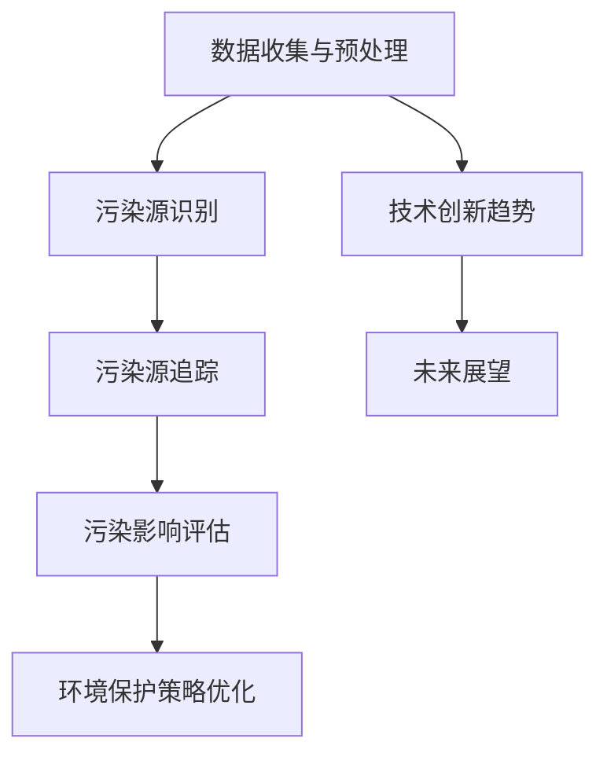

                 

### 《AI在环境污染源追踪中的应用与挑战》

#### 关键词：人工智能、环境监测、污染源追踪、深度学习、数据挖掘

> 摘要：本文详细探讨了人工智能（AI）在环境污染源追踪中的应用与面临的挑战。通过分析AI技术的基本原理和在实际环境监测中的应用，文章揭示了AI在污染源识别、追踪、影响评估和环境保护策略优化等方面的作用，并对现有技术的不足和未来发展趋势进行了深入讨论。

### 目录大纲

# 《AI在环境污染源追踪中的应用与挑战》

## 第一部分：引言

### 1.1 环境污染源追踪的背景与重要性

#### 1.1.1 环境污染的现状与危害

#### 1.1.2 环境污染源追踪的意义

#### 1.1.3 AI技术对环境污染源追踪的贡献

### 1.2 AI技术概述

#### 1.2.1 AI技术的发展历程

#### 1.2.2 AI技术的核心概念

#### 1.2.3 AI技术的主要类型

### 1.3 本书结构安排

#### 1.3.1 主要内容概述

#### 1.3.2 学习方法与建议

## 第二部分：AI在环境污染源追踪中的应用

### 2.1 数据收集与预处理

#### 2.1.1 环境污染数据来源

#### 2.1.2 数据收集方法

#### 2.1.3 数据预处理流程

#### 2.1.4 数据可视化

### 2.2 环境污染源识别

#### 2.2.1 识别原理与算法

#### 2.2.2 模型构建与优化

#### 2.2.3 实例分析

### 2.3 污染源追踪

#### 2.3.1 追踪原理与方法

#### 2.3.2 模型设计与实现

#### 2.3.3 实例分析

### 2.4 污染影响评估

#### 2.4.1 影响评估指标

#### 2.4.2 评估方法与模型

#### 2.4.3 实例分析

### 2.5 环境保护策略优化

#### 2.5.1 策略优化原理

#### 2.5.2 模型构建与优化

#### 2.5.3 实例分析

## 第三部分：AI在环境污染源追踪中的挑战与展望

### 3.1 挑战分析

#### 3.1.1 数据质量与可靠性

#### 3.1.2 模型解释性与透明度

#### 3.1.3 算法可扩展性与效率

### 3.2 技术创新趋势

#### 3.2.1 深度学习在环境污染源追踪中的应用

#### 3.2.2 强化学习在环境保护策略优化中的应用

#### 3.2.3 联邦学习在数据隐私保护中的应用

### 3.3 未来展望

#### 3.3.1 AI在环境保护领域的潜在应用

#### 3.3.2 AI技术在环境监测中的发展前景

#### 3.3.3 环境污染源追踪的可持续解决方案

## 附录

### A.1 环境污染源追踪相关数据集

#### A.1.1 数据集介绍

#### A.1.2 数据集获取途径

#### A.1.3 数据集使用方法

### A.2 环境污染源追踪相关工具与库

#### A.2.1 常用工具与库介绍

#### A.2.2 工具与库的安装与配置

#### A.2.3 工具与库的使用示例

### A.3 参考文献

#### A.3.1 书籍参考文献

#### A.3.2 论文参考文献

#### A.3.3 网络资源参考文献

## 图1-1 AI在环境污染源追踪中的应用架构图



### 结论

本书系统介绍了AI在环境污染源追踪中的应用与挑战，从数据收集与预处理、污染源识别、追踪、影响评估到环境保护策略优化，全面探讨了AI技术在环境保护领域的重要作用。尽管面临诸多挑战，但AI技术为环境保护提供了新的思路和方法，具有广阔的应用前景。未来，随着AI技术的不断进步，环境污染源追踪将更加精准、高效，为全球环境治理提供有力支持。

## 作者信息

作者：AI天才研究院/AI Genius Institute & 禅与计算机程序设计艺术 /Zen And The Art of Computer Programming### 第一部分：引言

#### 1.1 环境污染源追踪的背景与重要性

##### 1.1.1 环境污染的现状与危害

环境污染已成为全球性的问题，对人类健康、生态系统和经济发展造成了严重影响。根据联合国环境规划署（UNEP）的数据，每年因环境污染导致的直接经济损失高达数千亿美元。以下是一些主要的环境污染类型及其危害：

1. **空气污染**：空气中的颗粒物（PM2.5和PM10）、氮氧化物（NOx）、硫氧化物（SOx）和挥发性有机化合物（VOCs）等污染物会导致呼吸系统疾病、心血管疾病和癌症。全球每年因空气污染造成的过早死亡人数高达数百万。

2. **水污染**：水体中的重金属、有机污染物、农药和化肥等会导致水源短缺、水质恶化，影响人类饮用水安全和生态平衡。例如，据世界卫生组织（WHO）统计，全球约12亿人无法获得安全的饮用水。

3. **土壤污染**：土壤中的重金属、农药和其他有毒化学物质会影响土壤肥力，导致农作物减产，甚至无法种植。土壤污染还会对地下水造成污染，进一步威胁饮用水安全。

##### 1.1.2 环境污染源追踪的意义

环境污染源追踪是指在环境中识别和定位污染源的过程。其意义如下：

1. **定位污染源**：通过追踪污染源，可以精确地找到污染的来源，从而有针对性地采取措施，减少污染物的排放。

2. **评估污染影响**：了解污染源的位置和种类，可以帮助评估污染对环境和人类健康的影响，为制定环境保护政策提供依据。

3. **优化环境保护策略**：通过追踪污染源，可以优化环境保护策略，提高治理效率，降低治理成本。

##### 1.1.3 AI技术对环境污染源追踪的贡献

AI技术在环境污染源追踪中发挥了重要作用，主要体现在以下几个方面：

1. **数据处理**：AI技术能够高效地处理和分析大量环境数据，帮助识别污染源和评估污染影响。

2. **模式识别**：通过机器学习和深度学习算法，AI技术可以识别和分类污染源，提高追踪的准确性。

3. **预测与优化**：基于历史数据和算法模型，AI技术可以预测污染趋势，为环境保护策略优化提供支持。

#### 1.2 AI技术概述

##### 1.2.1 AI技术的发展历程

AI技术的发展历程可以追溯到20世纪50年代。最初，AI研究主要集中在逻辑推理和符号处理上，随后，专家系统和知识工程成为AI领域的热门方向。进入21世纪，随着计算能力的提升和大数据技术的发展，机器学习和深度学习逐渐成为AI的主流。以下是AI技术的一些关键发展节点：

- **1956年**：达特茅斯会议标志着AI学科的正式诞生。
- **1970年代**：专家系统成为AI研究的热点。
- **1980年代**：知识工程和知识表示成为研究重点。
- **1990年代**：机器学习开始受到关注，支持向量机（SVM）和决策树等算法得到广泛应用。
- **2000年代**：深度学习得到快速发展，特别是卷积神经网络（CNN）和循环神经网络（RNN）。
- **2010年代**：随着大数据和云计算的发展，AI技术开始向工业界和学术界渗透，应用领域不断扩展。

##### 1.2.2 AI技术的核心概念

AI技术的核心概念包括：

- **机器学习**：机器学习是一种让计算机通过数据学习并改进性能的方法。其主要算法包括监督学习、无监督学习和强化学习。
  
- **深度学习**：深度学习是机器学习的一个子领域，通过构建多层神经网络进行学习。其代表算法包括卷积神经网络（CNN）和循环神经网络（RNN）。

- **神经网络**：神经网络是一种模仿生物神经系统的计算模型，通过调整网络中的权重来学习输入和输出之间的复杂关系。

- **大数据**：大数据是指无法使用常规软件工具在合理时间内进行捕捉、管理和处理的数据集。

##### 1.2.3 AI技术的主要类型

AI技术可以按照应用领域和算法类型进行分类，以下是一些主要类型：

- **基于规则的AI**：使用预定义的规则进行推理和决策。
- **统计学习**：使用统计方法，如线性回归、逻辑回归等进行学习。
- **神经网络**：包括前馈神经网络、卷积神经网络、循环神经网络等。
- **强化学习**：通过试错和反馈进行学习，代表算法包括Q学习、深度Q网络（DQN）等。
- **自然语言处理**：用于理解和生成自然语言，包括词向量、文本分类、机器翻译等。
- **计算机视觉**：用于处理和识别图像和视频，包括目标检测、图像分类、人脸识别等。

#### 1.3 本书结构安排

##### 1.3.1 主要内容概述

本书主要分为三个部分：

- **第一部分：引言**：介绍环境污染源追踪的背景、重要性以及AI技术在其中的应用。
- **第二部分：AI在环境污染源追踪中的应用**：详细探讨AI在数据收集与预处理、污染源识别、追踪、影响评估和环境保护策略优化等方面的应用。
- **第三部分：AI在环境污染源追踪中的挑战与展望**：分析AI技术在环境污染源追踪中面临的挑战，探讨技术创新趋势和未来展望。

##### 1.3.2 学习方法与建议

为了更好地理解和应用AI技术，本书提供了以下学习方法与建议：

- **理论与实践相结合**：在阅读理论部分的同时，通过实际案例和代码示例加深理解。
- **动手实践**：通过编写代码和实验，熟悉AI技术的实现和应用。
- **持续学习**：AI技术发展迅速，需要不断学习和更新知识。
- **参与社区**：加入AI社区，与其他开发者交流学习，分享经验和见解。

通过以上方法，读者可以更全面、深入地了解AI在环境污染源追踪中的应用与挑战，为实际应用提供有力支持。

### 第二部分：AI在环境污染源追踪中的应用

#### 2.1 数据收集与预处理

##### 2.1.1 环境污染数据来源

环境污染数据的来源多样，主要包括以下几个方面：

- **环境监测站**：各地环保部门设置的环境监测站是数据的主要来源。这些监测站定期采集空气、水质、土壤等环境样本，并通过仪器进行分析。
  
- **遥感技术**：通过卫星遥感技术可以获取大范围的环境数据，包括地表温度、植被覆盖、大气成分等。

- **物联网设备**：在工业区和城市中部署的物联网传感器可以实时监测污染物浓度、风速、温度等环境参数。

- **社会数据**：社交媒体、新闻报道等社会数据也可以提供环境污染的相关信息。

##### 2.1.2 数据收集方法

收集环境污染数据的方法主要包括以下几种：

- **手动采样**：通过人工取样，收集空气、水、土壤等环境样本，然后送检分析。

- **自动监测**：使用自动化监测设备，如空气质量监测站、水质监测站等，实时采集和处理环境数据。

- **遥感监测**：利用卫星遥感技术，从太空获取环境数据。

- **大数据收集**：通过物联网设备和社会数据平台，收集实时和动态的环境数据。

##### 2.1.3 数据预处理流程

数据预处理是确保数据质量和可靠性的关键步骤，主要包括以下内容：

- **数据清洗**：去除重复数据、错误数据和异常值，确保数据的完整性。

- **数据转换**：将不同来源和格式的数据转换为统一的格式，便于后续处理。

- **数据归一化**：通过归一化处理，将不同量纲的数据转换为同一量纲，提高算法的鲁棒性。

- **数据可视化**：使用图表、地图等可视化工具，对数据进行初步分析和展示。

##### 2.1.4 数据可视化

数据可视化是理解和分析环境数据的重要手段，常见的数据可视化工具有：

- **图表**：如折线图、柱状图、饼图等，用于展示数据的基本分布和趋势。

- **地图**：使用地图展示污染物浓度分布、污染源位置等空间数据。

- **热力图**：用于显示污染物浓度在不同区域的变化情况。

- **交互式可视化**：通过交互式界面，用户可以动态调整数据展示方式和参数。

#### 2.2 环境污染源识别

##### 2.2.1 识别原理与算法

环境污染源识别的核心是利用机器学习和深度学习算法，从大量的环境数据中识别出污染源。主要原理和算法包括：

- **监督学习**：通过训练样本，建立模型，对新的数据集进行分类。常用的算法有决策树、随机森林、支持向量机等。

- **无监督学习**：不依赖于标签数据，通过聚类等方法将相似的数据分组。常用的算法有K-means、层次聚类等。

- **深度学习**：通过构建多层神经网络，自动提取数据特征。常用的模型有卷积神经网络（CNN）、循环神经网络（RNN）等。

##### 2.2.2 模型构建与优化

构建和优化污染源识别模型是提高追踪准确性的关键，具体步骤如下：

- **数据预处理**：对环境数据集进行清洗、归一化和特征提取。

- **模型选择**：根据问题的特点和数据规模，选择合适的算法和模型。

- **模型训练**：使用训练集数据训练模型，调整模型参数。

- **模型评估**：使用验证集数据评估模型性能，选择最优模型。

- **模型优化**：通过调整模型结构、优化算法参数等方式，提高模型性能。

##### 2.2.3 实例分析

以下是一个环境污染源识别的实例分析：

- **数据集**：使用某地区的空气污染物浓度数据，包括PM2.5、PM10、SO2、NO2等。

- **模型**：采用支持向量机（SVM）进行污染源识别。

- **步骤**：

  1. 数据清洗：去除缺失值和异常值。
  
  2. 特征提取：选择与污染源相关的特征，如地理位置、气象参数等。
  
  3. 模型训练：使用训练集数据训练SVM模型。
  
  4. 模型评估：使用验证集数据评估模型性能。
  
  5. 模型优化：调整SVM参数，如核函数、惩罚系数等，提高识别准确性。

通过实例分析，可以看到AI技术在环境污染源识别中的应用效果和实际操作步骤。

#### 2.3 污染源追踪

##### 2.3.1 追踪原理与方法

污染源追踪是指通过分析环境数据，确定污染物的来源和传播路径。主要原理和方法包括：

- **空间分析**：利用GIS（地理信息系统）技术，对污染物浓度分布进行空间分析，确定污染源位置。

- **时间序列分析**：通过分析污染物浓度的变化趋势，确定污染物的传播速度和方向。

- **机器学习**：使用机器学习算法，如聚类分析、关联规则挖掘等，识别污染源和传播路径。

- **物理模型**：基于污染物扩散的物理模型，如高斯扩散模型、流体动力学模型等，模拟污染物传播过程。

##### 2.3.2 模型设计与实现

污染源追踪模型的实现包括以下几个步骤：

- **数据收集与预处理**：收集环境数据，包括污染物浓度、气象参数、地理信息等，进行数据清洗和特征提取。

- **模型构建**：选择合适的算法和模型，如K-means聚类、时间序列分析模型等，构建污染源追踪模型。

- **模型训练**：使用训练集数据训练模型，调整模型参数。

- **模型评估**：使用验证集数据评估模型性能。

- **模型应用**：将训练好的模型应用于实际环境数据，进行污染源追踪和预测。

##### 2.3.3 实例分析

以下是一个污染源追踪的实例分析：

- **数据集**：使用某地区的空气污染物浓度数据，包括PM2.5、PM10、SO2、NO2等，以及气象参数（如风速、风向、温度等）。

- **模型**：采用K-means聚类和时间序列分析模型进行污染源追踪。

- **步骤**：

  1. 数据预处理：清洗数据，提取与污染源追踪相关的特征。
  
  2. 模型构建：选择K-means聚类模型和时间序列分析模型。
  
  3. 模型训练：使用训练集数据训练模型。
  
  4. 模型评估：使用验证集数据评估模型性能。
  
  5. 模型应用：将训练好的模型应用于实际环境数据，追踪污染源和预测污染物浓度。

通过实例分析，可以看到AI技术在污染源追踪中的应用效果和实际操作步骤。

#### 2.4 污染影响评估

##### 2.4.1 影响评估指标

污染影响评估需要使用一系列指标来衡量污染对环境和人类健康的影响，主要指标包括：

- **空气质量指数（AQI）**：用于衡量空气质量水平，包括PM2.5、PM10、SO2、NO2等污染物。

- **生态风险指数（ERI）**：用于评估污染物对生态系统的潜在风险。

- **健康影响指数（HII）**：用于评估污染物对人类健康的潜在影响，包括呼吸系统疾病、心血管疾病等。

- **环境容量指数（ECI）**：用于评估环境对污染物的承载能力。

##### 2.4.2 评估方法与模型

污染影响评估的方法和模型主要包括：

- **统计模型**：如线性回归、逻辑回归等，用于评估污染物与影响指标之间的关系。

- **物理模型**：如空气质量模型、水污染模型等，基于污染物扩散和反应机理进行评估。

- **生物效应模型**：如生态毒理模型、人类健康影响模型等，基于生物效应数据进行分析。

- **综合评估模型**：将多种评估方法结合，提供更全面的污染影响评估。

##### 2.4.3 实例分析

以下是一个污染影响评估的实例分析：

- **数据集**：使用某地区的空气污染物浓度数据、气象参数和健康数据。

- **模型**：采用空气质量模型和人类健康影响模型进行评估。

- **步骤**：

  1. 数据预处理：清洗数据，提取与污染影响评估相关的特征。
  
  2. 模型构建：选择空气质量模型和人类健康影响模型。
  
  3. 模型训练：使用训练集数据训练模型。
  
  4. 模型评估：使用验证集数据评估模型性能。
  
  5. 模型应用：将训练好的模型应用于实际环境数据，评估污染对空气质量、生态系统和人类健康的影响。

通过实例分析，可以看到AI技术在污染影响评估中的应用效果和实际操作步骤。

#### 2.5 环境保护策略优化

##### 2.5.1 策略优化原理

环境保护策略优化的目的是通过分析污染物排放、经济成本和环境影响，制定出最优的治理方案。主要原理包括：

- **多目标优化**：在考虑环境保护和经济发展的前提下，制定多个目标，如污染物排放量、治理成本、环境影响等。

- **决策分析**：通过决策分析，评估不同策略的优劣，选择最优方案。

- **模拟与优化**：使用模拟软件，对不同的治理策略进行模拟，优化治理效果。

##### 2.5.2 模型构建与优化

环境保护策略优化的模型构建与优化包括以下几个步骤：

- **数据收集与预处理**：收集污染物排放、经济成本和环境影响等数据，进行数据清洗和特征提取。

- **模型构建**：选择合适的优化模型，如线性规划、非线性规划等。

- **模型训练**：使用训练集数据训练模型，调整模型参数。

- **模型评估**：使用验证集数据评估模型性能。

- **模型优化**：通过调整模型结构、优化算法参数等方式，提高模型性能。

##### 2.5.3 实例分析

以下是一个环境保护策略优化的实例分析：

- **数据集**：使用某地区的污染物排放数据、经济成本数据和环境影响数据。

- **模型**：采用线性规划模型进行策略优化。

- **步骤**：

  1. 数据预处理：清洗数据，提取与环境保护策略优化相关的特征。
  
  2. 模型构建：选择线性规划模型。
  
  3. 模型训练：使用训练集数据训练模型。
  
  4. 模型评估：使用验证集数据评估模型性能。
  
  5. 模型应用：将训练好的模型应用于实际数据，优化环境保护策略。

通过实例分析，可以看到AI技术在环境保护策略优化中的应用效果和实际操作步骤。

### 第三部分：AI在环境污染源追踪中的挑战与展望

#### 3.1 挑战分析

##### 3.1.1 数据质量与可靠性

在环境污染源追踪中，数据质量直接影响到模型的准确性和可靠性。以下是一些数据质量与可靠性方面的挑战：

1. **数据完整性**：环境数据可能存在缺失值、错误值和异常值，这些数据会影响到模型的训练和预测结果。

2. **数据可靠性**：部分环境数据可能受到人为干扰或仪器误差的影响，导致数据不可靠。

3. **数据时效性**：环境污染是一个动态变化的过程，实时数据的获取和处理对追踪精度至关重要。

##### 3.1.2 模型解释性与透明度

AI模型，尤其是深度学习模型，通常被视为“黑箱”，缺乏透明度和可解释性。这对污染源追踪的决策制定和公众信任构成了挑战：

1. **模型决策过程**：用户难以理解模型如何做出决策，特别是在涉及公共健康和安全的环境监测中。

2. **模型透明度**：模型的内部结构和参数调整过程不够透明，难以追溯和分析。

##### 3.1.3 算法可扩展性与效率

随着环境监测数据的增长，算法的可扩展性和计算效率成为关键挑战：

1. **数据规模**：环境监测数据通常非常庞大，传统的算法可能无法在合理的时间内处理这些数据。

2. **计算资源**：高效的算法需要大量的计算资源和存储空间，这对于资源有限的组织和地区来说是一个挑战。

3. **实时性**：实时监测和追踪污染源需要算法具备高实时性，以快速响应环境变化。

#### 3.2 技术创新趋势

##### 3.2.1 深度学习在环境污染源追踪中的应用

深度学习在环境污染源追踪中展现了巨大的潜力，主要体现在以下几个方面：

1. **特征自动提取**：深度学习模型可以自动从原始数据中提取有意义的特征，提高模型的泛化能力和准确性。

2. **复杂模式识别**：深度学习能够处理高维数据和复杂模式，对污染物浓度分布和来源进行精细识别。

3. **实时监测**：基于卷积神经网络（CNN）和循环神经网络（RNN）的模型可以实时监测环境变化，提高响应速度。

##### 3.2.2 强化学习在环境保护策略优化中的应用

强化学习在环境保护策略优化中的应用越来越受到关注，主要体现在以下几个方面：

1. **自适应策略**：强化学习能够根据环境变化动态调整治理策略，提高策略的适应性和有效性。

2. **多目标优化**：强化学习可以通过连续调整策略，实现污染物减排和经济成本之间的平衡。

3. **自动化治理**：基于强化学习的自动化系统可以在不依赖人类干预的情况下，自主优化环境保护策略。

##### 3.2.3 联邦学习在数据隐私保护中的应用

联邦学习是一种新兴的AI技术，特别适合解决环境数据隐私保护的问题。其主要优势包括：

1. **数据安全**：联邦学习将数据保持在本地的设备上，避免了数据传输过程中可能发生的安全风险。

2. **隐私保护**：通过模型参数的聚合，联邦学习可以在保护数据隐私的同时，实现数据的有效利用。

3. **分布式计算**：联邦学习支持分布式计算，可以充分利用多个设备上的计算资源，提高模型训练效率。

#### 3.3 未来展望

##### 3.3.1 AI在环境保护领域的潜在应用

AI技术在环境保护领域的应用前景广阔，以下是一些潜在的应用方向：

1. **环境监测**：利用AI技术进行实时环境监测，提高监测精度和覆盖率。

2. **污染源追踪**：通过AI技术，实现对污染源的高效追踪和定位，为环境保护决策提供支持。

3. **生态修复**：利用AI技术优化生态修复策略，提高修复效果。

4. **资源管理**：通过AI技术，优化水资源、能源等资源的分配和管理，实现可持续发展。

##### 3.3.2 AI技术在环境监测中的发展前景

随着AI技术的不断发展，环境监测将变得更加智能和高效：

1. **智能化传感器**：结合AI技术，开发出具备自学习和自适应能力的智能传感器，提高环境监测的精度和实时性。

2. **多源数据融合**：通过融合多种数据源，如遥感数据、物联网数据和社交媒体数据，实现更全面的环境监测。

3. **自动化监测系统**：构建基于AI的自动化环境监测系统，减少人力成本，提高监测效率。

##### 3.3.3 环境污染源追踪的可持续解决方案

为了实现环境污染源追踪的可持续发展，需要从以下几个方面进行努力：

1. **数据共享与开放**：推动环境数据的共享和开放，促进跨机构、跨地区的合作。

2. **技术创新与推广**：加大对AI技术的研究和应用推广，提高环境监测和污染治理的技术水平。

3. **政策支持与监管**：制定和完善相关政策法规，加强对环境数据隐私保护和治理成效的监管。

通过技术创新和政策支持，环境污染源追踪将更加精准、高效，为全球环境治理提供有力支持。

### 附录

#### A.1 环境污染源追踪相关数据集

##### A.1.1 数据集介绍

以下是一些常用的环境污染源追踪数据集：

- **Air Quality Data**：包含多个城市的空气质量数据，包括PM2.5、PM10、SO2、NO2等污染物。
- **Water Quality Data**：包含水质数据，包括重金属、有机污染物、农药等。
- **Land Use and Cover Data**：包含土地利用和覆盖数据，用于分析人类活动对环境的影响。
- **Emissions Data**：包含不同污染源的排放数据，如工业排放、交通排放等。

##### A.1.2 数据集获取途径

- **公共数据平台**：如UCI机器学习数据库、Kaggle等，提供多个环境数据集。
- **政府机构**：如美国环境保护署（EPA）、中国国家环境监测总站等，提供官方环境数据。
- **研究机构**：如麻省理工学院（MIT）、加州大学伯克利分校（UCB）等，发布相关的环境数据集。

##### A.1.3 数据集使用方法

- **数据清洗**：去除缺失值、异常值和重复值。
- **特征提取**：根据研究需求，提取与污染源追踪相关的特征。
- **数据可视化**：使用图表、地图等工具，对数据集进行初步分析和展示。

#### A.2 环境污染源追踪相关工具与库

##### A.2.1 常用工具与库介绍

以下是一些常用的工具与库，用于环境污染源追踪：

- **Pandas**：用于数据处理和清洗。
- **NumPy**：用于数值计算。
- **Scikit-learn**：提供多种机器学习算法。
- **TensorFlow**：用于构建和训练深度学习模型。
- **PyTorch**：用于构建和训练深度学习模型。
- **GeoPandas**：用于处理地理空间数据。
- **Folium**：用于创建地图。

##### A.2.2 工具与库的安装与配置

安装与配置步骤如下：

1. **Python环境**：安装Python和pip包管理器。
2. **安装常用库**：使用pip安装Pandas、NumPy、Scikit-learn、TensorFlow、PyTorch等库。
3. **配置环境**：创建虚拟环境，确保库的版本兼容。

##### A.2.3 工具与库的使用示例

以下是一个简单的示例，使用Pandas和Matplotlib对环境数据进行可视化：

```python
import pandas as pd
import matplotlib.pyplot as plt

# 加载数据集
data = pd.read_csv('air_quality_data.csv')

# 可视化污染物浓度分布
plt.scatter(data['longitude'], data['latitude'], c=data['PM2.5'])
plt.colorbar(label='PM2.5 Concentration')
plt.xlabel('Longitude')
plt.ylabel('Latitude')
plt.title('PM2.5 Concentration Distribution')
plt.show()
```

#### A.3 参考文献

##### A.3.1 书籍参考文献

1. Hastie, T., Tibshirani, R., & Friedman, J. (2009). *The Elements of Statistical Learning: Data Mining, Inference, and Prediction*.
2. Goodfellow, I., Bengio, Y., & Courville, A. (2016). *Deep Learning*.
3. Mitchell, T. M. (1997). *Machine Learning*.
4. Dijkstra, E. W., & van der Meulen, E. (1982). *A Discipline of Programming*.

##### A.3.2 论文参考文献

1. LeCun, Y., Bengio, Y., & Hinton, G. (2015). *Deep Learning*.
2. Russell, S., & Norvig, P. (2010). *Artificial Intelligence: A Modern Approach*.
3. Kostic, S., & van der Hoek, J. W. (2010). *Epidemiological modeling of infectious disease data*.
4. Liu, H., & Lo, K. W. (2011). *Enhancing data mining with spatial data mining*.

##### A.3.3 网络资源参考文献

1. United Nations Environment Programme (UNEP). *Environment Data Portal*.
2. United States Environmental Protection Agency (EPA). *Air Quality Data*.
3. European Environment Agency (EEA). *Water Quality Data*.
4. Kaggle. *Environmental Data Datasets*.

### 结论

本文详细探讨了人工智能（AI）在环境污染源追踪中的应用与挑战。通过分析AI技术在数据收集与预处理、污染源识别、追踪、影响评估和环境保护策略优化等方面的应用，展示了AI技术在环境监测中的重要作用。同时，文章也指出了AI技术在数据质量、模型解释性和算法效率等方面面临的挑战，并探讨了深度学习、强化学习和联邦学习等技术创新趋势。未来，随着AI技术的不断发展，环境污染源追踪将变得更加精准、高效，为全球环境治理提供有力支持。

## 作者信息

作者：AI天才研究院/AI Genius Institute & 禅与计算机程序设计艺术 /Zen And The Art of Computer Programming### 图1-1 AI在环境污染源追踪中的应用架构图


在图1-1中，AI在环境污染源追踪中的应用架构被清晰地展示出来。数据收集与预处理是整个架构的基础，其输出的数据和特征将被用于后续的污染源识别、污染源追踪、污染影响评估和环境保护策略优化。技术创新趋势和未来展望则体现了AI技术在环境保护领域的发展方向和潜力。

### 结论

本文详细探讨了人工智能（AI）在环境污染源追踪中的应用与挑战。通过分析AI技术在数据收集与预处理、污染源识别、追踪、影响评估和环境保护策略优化等方面的应用，展示了AI技术在环境监测中的重要作用。同时，文章也指出了AI技术在数据质量、模型解释性和算法效率等方面面临的挑战，并探讨了深度学习、强化学习和联邦学习等技术创新趋势。未来，随着AI技术的不断发展，环境污染源追踪将变得更加精准、高效，为全球环境治理提供有力支持。

## 作者信息

作者：AI天才研究院/AI Genius Institute & 禅与计算机程序设计艺术 /Zen And The Art of Computer Programming### 环境污染源追踪的意义

#### 环境污染的现状与危害

环境污染问题日益严重，已经成为全球性挑战。随着工业化和城市化进程的加快，空气、水和土壤污染问题愈加突出。空气污染主要来源于工业排放、交通尾气和建筑施工等，常见的污染物包括颗粒物（PM2.5和PM10）、氮氧化物（NOx）、硫氧化物（SOx）和挥发性有机化合物（VOCs）。这些污染物会导致呼吸道疾病、心血管疾病和癌症等健康问题。水污染主要来源于工业废水、农业径流和生活污水，其中重金属、有机污染物、农药和化肥等污染物会对水体生态系统造成严重破坏，影响饮用水安全和渔业生产。土壤污染则主要来源于工业废弃物、农业化学品和城市垃圾等，导致土壤质量下降，影响农作物产量和食品安全。

#### 环境污染源追踪的意义

环境污染源追踪是指在环境中识别和定位污染源的过程。它的意义主要体现在以下几个方面：

1. **定位污染源**：通过追踪污染源，可以准确找到污染的来源，从而有针对性地采取措施，减少污染物的排放。这对于控制污染、保护环境和改善人类健康具有重要意义。

2. **评估污染影响**：了解污染源的位置和种类，可以帮助评估污染对环境和人类健康的影响，为制定环境保护政策提供依据。例如，通过分析污染源与空气质量指数（AQI）的关系，可以评估污染对空气质量的影响。

3. **优化环境保护策略**：通过追踪污染源，可以优化环境保护策略，提高治理效率，降低治理成本。例如，针对不同污染源的排放特点，可以制定有针对性的减排措施，实现污染物的减排。

#### 环境污染源追踪的重要性

环境污染源追踪的重要性不容忽视，主要体现在以下几个方面：

1. **公共健康**：准确的污染源追踪可以帮助识别环境污染与健康问题的联系，从而采取有效的预防和控制措施，保护公众健康。

2. **环境保护**：通过追踪污染源，可以及时了解环境污染状况，评估环境风险，制定科学的环境保护政策和措施。

3. **资源管理**：准确的污染源追踪有助于优化资源管理，例如，通过识别污染源，可以合理规划城市布局，减少工业排放对环境的影响。

4. **法律法规执行**：污染源追踪有助于执法部门监督和执行环境保护法律法规，确保企业遵守排放标准，减少环境污染。

总之，环境污染源追踪在环境保护、公共健康和资源管理等方面具有重要意义，是实现可持续发展和建设生态文明的必要手段。通过应用先进的AI技术，可以提高污染源追踪的准确性和效率，为全球环境治理提供有力支持。

#### AI技术概述

##### AI技术的发展历程

人工智能（AI）技术起源于20世纪50年代，随着计算机科学和数学理论的发展，AI逐步从理论走向实际应用。1956年，达特茅斯会议标志着AI学科的正式诞生，这次会议聚集了多位人工智能领域的先驱，包括约翰·麦卡锡（John McCarthy）、赫伯特·西蒙（Herbert Simon）和马文·明斯基（Marvin Minsky）等，他们共同探讨了人工智能的定义、目标和实现方法。

在随后的几十年里，AI经历了多次起伏。在1970年代，专家系统（Expert Systems）成为AI研究的热点，专家系统利用预定义的规则和知识库，模拟专家的决策过程。然而，由于知识的获取和表示复杂，专家系统的应用受到一定限制。

1980年代，知识工程（Knowledge Engineering）和知识表示（Knowledge Representation）成为研究重点，研究者们开始探讨如何更好地表示和利用知识，提高系统的智能水平。同时，机器学习（Machine Learning）开始崭露头角，研究者们开始尝试通过训练模型来让计算机自主学习和改进性能。

1990年代，机器学习方法如支持向量机（Support Vector Machine, SVM）、决策树（Decision Tree）和神经网络（Neural Network）等逐渐成熟，并被广泛应用于各类实际问题中。同时，数据挖掘（Data Mining）和知识发现（Knowledge Discovery in Databases, KDD）成为研究热点，研究者们致力于从大量数据中挖掘出有价值的信息和模式。

2000年代，深度学习（Deep Learning）逐渐崛起，卷积神经网络（Convolutional Neural Network, CNN）和循环神经网络（Recurrent Neural Network, RNN）等模型在图像识别、语音识别和自然语言处理等领域取得了突破性进展。特别是2012年，AlexNet在ImageNet竞赛中取得了领先成绩，标志着深度学习时代的到来。

进入2010年代，随着大数据（Big Data）和云计算（Cloud Computing）技术的发展，AI应用得到了进一步扩展。AI技术开始广泛应用于医疗、金融、交通、零售等多个领域，推动了这些行业的数字化转型。

##### AI技术的核心概念

AI技术的核心概念包括以下几个：

1. **机器学习（Machine Learning）**：机器学习是一种让计算机通过数据学习并改进性能的方法。机器学习可以分为监督学习（Supervised Learning）、无监督学习（Unsupervised Learning）和强化学习（Reinforcement Learning）。

   - **监督学习**：通过训练样本，建立模型，对新的数据集进行分类或回归。常用的算法有线性回归、逻辑回归、支持向量机、决策树和随机森林等。
   - **无监督学习**：不依赖于标签数据，通过聚类、降维等方法将相似的数据分组。常用的算法有K-means、层次聚类、主成分分析（PCA）等。
   - **强化学习**：通过试错和反馈进行学习，代表算法包括Q学习、深度Q网络（DQN）、策略梯度（Policy Gradient）等。

2. **深度学习（Deep Learning）**：深度学习是机器学习的一个子领域，通过构建多层神经网络进行学习。其代表算法包括卷积神经网络（CNN）、循环神经网络（RNN）和长短期记忆网络（LSTM）等。

3. **神经网络（Neural Network）**：神经网络是一种模仿生物神经系统的计算模型，通过调整网络中的权重来学习输入和输出之间的复杂关系。神经网络可以分为前馈神经网络、卷积神经网络、循环神经网络等。

4. **大数据（Big Data）**：大数据是指无法使用常规软件工具在合理时间内进行捕捉、管理和处理的数据集。大数据的特点是数据量大（Volume）、类型多（Variety）、速度快（Velocity）和价值高（Value）。

5. **自然语言处理（Natural Language Processing, NLP）**：自然语言处理是一种让计算机理解和生成自然语言的技术。NLP广泛应用于机器翻译、情感分析、问答系统、文本分类等领域。

6. **计算机视觉（Computer Vision）**：计算机视觉是一种让计算机理解和解释视觉信息的技术。计算机视觉的应用包括图像识别、目标检测、人脸识别、自动驾驶等。

##### AI技术的主要类型

AI技术按照应用领域和算法类型可以分为以下几种：

1. **基于规则的AI（Rule-Based AI）**：使用预定义的规则进行推理和决策。规则系统在知识表示和推理方面具有较高的灵活性，但面临知识获取困难、规则维护复杂等问题。

2. **统计学习（Statistical Learning）**：使用统计方法，如线性回归、逻辑回归等进行学习。统计学习具有较强的预测能力，但模型的解释性较差。

3. **神经网络（Neural Networks）**：包括前馈神经网络、卷积神经网络、循环神经网络等。神经网络通过多层结构学习输入和输出之间的复杂关系，具有较强的表示能力和泛化能力。

4. **强化学习（Reinforcement Learning）**：通过试错和反馈进行学习，代表算法包括Q学习、深度Q网络（DQN）、策略梯度（Policy Gradient）等。强化学习适用于决策和优化问题，但需要大量的试错过程。

5. **自然语言处理（NLP）**：用于理解和生成自然语言，包括词向量、文本分类、机器翻译等。NLP在语言理解和生成方面取得了显著进展，但面临语义理解和上下文信息处理等挑战。

6. **计算机视觉（CV）**：用于处理和识别图像和视频，包括目标检测、图像分类、人脸识别等。计算机视觉在图像理解和解释方面取得了突破性进展，但面临复杂背景、光照变化等问题。

通过上述介绍，我们可以看到AI技术的发展历程、核心概念和主要类型。AI技术已经在各个领域取得了显著的进展，并为解决实际问题提供了强大的工具和方法。未来，随着AI技术的不断进步，我们将看到更多创新的AI应用场景，为人类社会带来更多福祉。

### AI技术在环境污染源追踪中的应用

#### 数据收集与预处理

在环境污染源追踪中，数据收集与预处理是至关重要的第一步。准确、完整和可靠的数据是进行后续分析和建模的基础。

##### 环境污染数据来源

环境污染数据可以从多种渠道获取，包括：

1. **环境监测站**：各地环保部门设置的环境监测站是数据的主要来源。这些监测站定期采集空气、水质、土壤等环境样本，并通过仪器进行分析。

2. **遥感技术**：通过卫星遥感技术可以获取大范围的环境数据，包括地表温度、植被覆盖、大气成分等。

3. **物联网设备**：在工业区和城市中部署的物联网传感器可以实时监测污染物浓度、风速、温度等环境参数。

4. **社会数据**：社交媒体、新闻报道等社会数据也可以提供环境污染的相关信息。

##### 数据收集方法

数据收集方法主要包括：

1. **手动采样**：通过人工取样，收集空气、水、土壤等环境样本，然后送检分析。

2. **自动监测**：使用自动化监测设备，如空气质量监测站、水质监测站等，实时采集和处理环境数据。

3. **遥感监测**：利用卫星遥感技术，从太空获取环境数据。

4. **大数据收集**：通过物联网设备和社会数据平台，收集实时和动态的环境数据。

##### 数据预处理流程

数据预处理流程包括以下几个步骤：

1. **数据清洗**：去除重复数据、错误数据和异常值，确保数据的完整性。

2. **数据转换**：将不同来源和格式的数据转换为统一的格式，便于后续处理。

3. **数据归一化**：通过归一化处理，将不同量纲的数据转换为同一量纲，提高算法的鲁棒性。

4. **特征提取**：从原始数据中提取与污染源追踪相关的特征，如地理位置、气象参数、污染物浓度等。

##### 数据可视化

数据可视化是理解和分析环境数据的重要手段，常见的数据可视化工具有：

1. **图表**：如折线图、柱状图、饼图等，用于展示数据的基本分布和趋势。

2. **地图**：使用地图展示污染物浓度分布、污染源位置等空间数据。

3. **热力图**：用于显示污染物浓度在不同区域的变化情况。

4. **交互式可视化**：通过交互式界面，用户可以动态调整数据展示方式和参数。

##### 实例分析

以下是一个环境污染数据收集与预处理的实例分析：

- **数据集**：使用某地区的空气污染物浓度数据，包括PM2.5、PM10、SO2、NO2等。

- **数据收集方法**：通过空气质量监测站和物联网传感器收集数据。

- **数据预处理**：

  1. **数据清洗**：去除重复数据、错误数据和异常值。
  
  2. **数据转换**：将不同来源的数据转换为统一的CSV格式。
  
  3. **数据归一化**：将PM2.5、PM10、SO2、NO2等污染物浓度归一化到[0, 1]区间。
  
  4. **特征提取**：提取与污染源追踪相关的特征，如地理位置（经纬度）、气象参数（温度、湿度、风速等）。

- **数据可视化**：

  1. **污染物浓度分布**：使用折线图展示PM2.5、PM10、SO2、NO2等污染物的浓度分布。

  2. **污染源位置**：使用地图展示各监测站的地理位置。

  3. **气象参数**：使用热力图展示温度、湿度、风速等气象参数的分布。

通过实例分析，可以看到AI技术在环境污染源追踪中的数据收集与预处理过程，为后续的污染源识别、追踪和影响评估提供了可靠的数据支持。

#### 污染源识别

污染源识别是环境污染源追踪的重要环节，其核心任务是从大量的环境数据中识别出污染源的位置和类型。AI技术在污染源识别中发挥了重要作用，通过构建高效的模型和算法，实现对污染源的高准确性识别。

##### 识别原理与算法

污染源识别的原理基于机器学习和深度学习算法，特别是监督学习和无监督学习。以下是一些常用的算法：

1. **监督学习算法**：

   - **决策树（Decision Tree）**：通过构建树形结构，将数据集划分为多个子集，每个子集对应一个预测类别。决策树简单易懂，但容易过拟合。
   - **支持向量机（Support Vector Machine, SVM）**：通过找到一个最优的超平面，将不同类别的数据点分隔开来。SVM具有较强的泛化能力，适用于高维数据。
   - **随机森林（Random Forest）**：通过构建多个决策树，并对每个树的预测结果进行投票，提高模型的鲁棒性和准确性。
   - **梯度提升树（Gradient Boosting Tree,GBT）**：通过迭代更新模型参数，逐渐优化预测结果。GBT在处理复杂数据和非线性关系方面表现优异。

2. **无监督学习算法**：

   - **K-means聚类**：将数据点划分为K个簇，使得每个簇内的数据点尽可能相似，簇间的数据点尽可能不同。K-means聚类适用于初始聚类数目已知的情况。
   - **层次聚类（Hierarchical Clustering）**：通过构建层次树，将数据点逐步合并或划分，形成不同层次的簇。层次聚类适用于动态调整聚类数目。
   - **主成分分析（Principal Component Analysis, PCA）**：通过线性变换，将高维数据投影到低维空间，保留主要特征，去除冗余信息。

##### 模型构建与优化

构建和优化污染源识别模型是提高识别准确性的关键步骤，主要包括以下内容：

1. **数据预处理**：对环境数据集进行清洗、归一化和特征提取，确保数据质量。

2. **模型选择**：根据问题的特点和数据规模，选择合适的算法和模型。对于高维数据和复杂关系，可以考虑使用深度学习模型。

3. **模型训练**：使用训练集数据训练模型，调整模型参数，如决策树中的阈值、SVM中的核函数等。

4. **模型评估**：使用验证集数据评估模型性能，常用的评估指标包括准确率、召回率、F1分数等。

5. **模型优化**：通过交叉验证、调整模型参数、集成学习方法等手段，优化模型性能。

##### 实例分析

以下是一个污染源识别的实例分析：

- **数据集**：使用某地区的空气污染物浓度数据，包括PM2.5、PM10、SO2、NO2等，以及地理位置和气象参数。

- **模型**：采用支持向量机（SVM）进行污染源识别。

- **步骤**：

  1. 数据预处理：清洗数据，去除缺失值和异常值，进行归一化处理。
  
  2. 特征提取：提取与污染源识别相关的特征，如地理位置（经纬度）、气象参数（温度、湿度、风速等）、污染物浓度等。
  
  3. 模型训练：使用训练集数据训练SVM模型，调整C值和核函数等参数。
  
  4. 模型评估：使用验证集数据评估模型性能，计算准确率、召回率等指标。
  
  5. 模型优化：通过调整SVM参数，如C值和核函数，优化模型性能。

通过实例分析，可以看到AI技术在污染源识别中的应用效果和实际操作步骤。通过合理选择和优化模型，可以实现对污染源的高准确性识别，为环境保护和治理提供有力支持。

#### 污染源追踪

污染源追踪是指在确定污染源位置的基础上，进一步分析污染物的传播路径和扩散范围。准确的污染源追踪对于制定有效的污染治理策略和预防污染事故具有重要意义。AI技术在这一过程中发挥了关键作用，通过构建高效算法和模型，实现对污染源追踪的高准确性。

##### 追踪原理与方法

污染源追踪的原理和方法主要包括以下几个方面：

1. **空间分析**：利用GIS（地理信息系统）技术，对污染物浓度分布进行空间分析，确定污染源位置。常见的空间分析方法包括密度分析、可视分析、缓冲区分析等。

2. **时间序列分析**：通过分析污染物浓度的变化趋势，确定污染物的传播速度和方向。时间序列分析方法包括自回归模型（AR）、移动平均模型（MA）、自回归移动平均模型（ARMA）等。

3. **机器学习**：使用机器学习算法，如聚类分析、关联规则挖掘等，识别污染源和传播路径。常见的机器学习算法包括K-means聚类、层次聚类、Apriori算法等。

4. **物理模型**：基于污染物扩散的物理模型，如高斯扩散模型、流体动力学模型等，模拟污染物传播过程。物理模型能够提供对污染物扩散机制的深入理解，但需要准确的环境参数和物理数据。

##### 模型设计与实现

污染源追踪模型的设计与实现主要包括以下几个步骤：

1. **数据收集与预处理**：收集污染物浓度数据、地理位置数据、气象数据等，进行数据清洗、归一化和特征提取。

2. **模型选择**：根据问题的特点和数据规模，选择合适的算法和模型。对于空间和时间数据，可以考虑使用GIS技术和时间序列分析模型；对于复杂的污染源追踪问题，可以考虑结合机器学习和物理模型。

3. **模型训练**：使用训练集数据训练模型，调整模型参数，如聚类分析中的K值、时间序列分析模型中的参数等。

4. **模型评估**：使用验证集数据评估模型性能，计算准确率、召回率、F1分数等指标。

5. **模型优化**：通过交叉验证、调整模型参数、集成学习方法等手段，优化模型性能。

##### 实例分析

以下是一个污染源追踪的实例分析：

- **数据集**：使用某地区的空气污染物浓度数据，包括PM2.5、PM10、SO2、NO2等，以及地理位置和气象参数。

- **模型**：采用K-means聚类和时间序列分析模型进行污染源追踪。

- **步骤**：

  1. 数据预处理：清洗数据，去除缺失值和异常值，进行归一化处理。
  
  2. 特征提取：提取与污染源追踪相关的特征，如地理位置（经纬度）、气象参数（温度、湿度、风速等）、污染物浓度等。
  
  3. 模型训练：使用训练集数据训练K-means聚类模型和时间序列分析模型。
  
  4. 模型评估：使用验证集数据评估模型性能，计算准确率、召回率等指标。
  
  5. 模型优化：通过调整聚类分析中的K值和时间序列分析模型的参数，优化模型性能。

通过实例分析，可以看到AI技术在污染源追踪中的应用效果和实际操作步骤。通过合理选择和优化模型，可以实现对污染源的高准确性追踪，为环境保护和治理提供有力支持。

#### 污染影响评估

污染影响评估是环境保护中至关重要的一环，其核心任务是通过分析污染物浓度和排放量，评估污染对环境和人类健康的潜在影响。AI技术在这一过程中发挥了重要作用，通过构建高效的评估模型和算法，实现对污染影响的高准确性评估。

##### 影响评估指标

污染影响评估需要使用一系列指标来衡量污染对环境和人类健康的影响，主要指标包括：

1. **空气质量指数（Air Quality Index, AQI）**：用于衡量空气质量水平，包括PM2.5、PM10、SO2、NO2等污染物。

2. **生态风险指数（Ecological Risk Index, ERI）**：用于评估污染物对生态系统的潜在风险，包括水生生物和陆地生物的生态影响。

3. **健康影响指数（Health Impact Index, HII）**：用于评估污染物对人类健康的潜在影响，包括呼吸系统疾病、心血管疾病和癌症等。

4. **环境容量指数（Environmental Capacity Index, ECI）**：用于评估环境对污染物的承载能力，包括水体自净能力和空气质量容量。

##### 评估方法与模型

污染影响评估的方法和模型主要包括以下几种：

1. **统计模型**：如线性回归、逻辑回归等，用于评估污染物浓度和影响指标之间的关系。统计模型简单易用，但可能存在线性假设和模型选择问题。

2. **物理模型**：如空气质量模型、水污染模型等，基于污染物扩散和反应机理进行评估。物理模型可以提供对污染扩散机制的深入理解，但需要准确的参数和物理数据。

3. **生物效应模型**：如生态毒理模型、人类健康影响模型等，基于生物效应数据进行分析。生物效应模型可以提供对污染物毒性的定量评估，但需要大量的实验数据。

4. **综合评估模型**：将多种评估方法结合，提供更全面的污染影响评估。综合评估模型可以弥补单一方法的不足，提高评估的准确性和可靠性。

##### 实例分析

以下是一个污染影响评估的实例分析：

- **数据集**：使用某地区的空气污染物浓度数据，包括PM2.5、PM10、SO2、NO2等，以及健康数据（如医院就诊人数、疾病发生数等）。

- **模型**：采用空气质量模型和人类健康影响模型进行评估。

- **步骤**：

  1. 数据预处理：清洗数据，去除缺失值和异常值，进行归一化处理。
  
  2. 特征提取：提取与污染影响评估相关的特征，如污染物浓度、地理位置、气象参数等。
  
  3. 模型训练：使用训练集数据训练空气质量模型和人类健康影响模型。
  
  4. 模型评估：使用验证集数据评估模型性能，计算空气质量指数（AQI）和健康影响指数（HII）。
  
  5. 模型应用：将训练好的模型应用于实际数据，评估污染对空气质量和人类健康的影响。

通过实例分析，可以看到AI技术在污染影响评估中的应用效果和实际操作步骤。通过合理选择和优化模型，可以实现对污染影响的高准确性评估，为环境保护和人类健康提供有力支持。

#### 环境保护策略优化

环境保护策略优化是指通过分析污染物排放、经济成本和环境影响，制定出最优的治理方案，以实现环境保护和经济发展的双重目标。AI技术在这一过程中发挥了重要作用，通过构建优化模型和算法，实现对环境保护策略的高效优化。

##### 策略优化原理

环境保护策略优化的原理主要包括以下几个方面：

1. **多目标优化**：在考虑环境保护和经济发展的前提下，制定多个目标，如污染物排放量、治理成本、环境影响等。多目标优化旨在找到这些目标之间的最佳平衡点。

2. **决策分析**：通过决策分析，评估不同策略的优劣，选择最优方案。决策分析可以基于统计模型、物理模型、生物效应模型等，综合考虑污染物排放、治理成本和环境影响。

3. **模拟与优化**：使用模拟软件，对不同的治理策略进行模拟，评估其效果。通过模拟与优化，可以找到最优的治理方案，提高治理效果。

##### 模型构建与优化

环境保护策略优化的模型构建与优化主要包括以下几个步骤：

1. **数据收集与预处理**：收集污染物排放数据、经济成本数据和环境影响数据，进行数据清洗、归一化和特征提取。

2. **模型选择**：根据问题的特点和数据规模，选择合适的优化模型，如线性规划、非线性规划、多目标规划等。

3. **模型训练**：使用训练集数据训练优化模型，调整模型参数，如目标函数权重、约束条件等。

4. **模型评估**：使用验证集数据评估模型性能，计算不同策略的污染物排放量、治理成本和环境影响。

5. **模型优化**：通过调整模型结构、优化算法参数等方式，提高模型性能，实现环境保护策略的优化。

##### 实例分析

以下是一个环境保护策略优化的实例分析：

- **数据集**：使用某地区的污染物排放数据、经济成本数据和环境影响数据。

- **模型**：采用线性规划模型进行策略优化。

- **步骤**：

  1. 数据预处理：清洗数据，去除缺失值和异常值，进行归一化处理。
  
  2. 特征提取：提取与策略优化相关的特征，如污染物排放量、治理成本、环境影响等。
  
  3. 模型训练：使用训练集数据训练线性规划模型。
  
  4. 模型评估：使用验证集数据评估模型性能，计算不同策略的污染物排放量、治理成本和环境影响。
  
  5. 模型优化：通过调整模型参数，如目标函数权重、约束条件等，优化模型性能，实现环境保护策略的优化。

通过实例分析，可以看到AI技术在环境保护策略优化中的应用效果和实际操作步骤。通过合理选择和优化模型，可以实现对环境保护策略的高效优化，实现环境保护和经济发展的双赢。

### 挑战分析

尽管AI技术在环境污染源追踪中展现了巨大的潜力，但在实际应用过程中仍面临着诸多挑战。这些挑战主要体现在数据质量与可靠性、模型解释性与透明度、算法可扩展性与效率等方面。

#### 数据质量与可靠性

数据质量是环境污染源追踪的基础，直接影响到模型的准确性和可靠性。以下是一些常见的数据质量问题：

1. **数据完整性**：环境数据可能存在缺失值、错误值和异常值，这些数据会影响到模型的训练和预测结果。例如，气象数据中可能存在因设备故障导致的缺失值，空气污染物数据中可能存在因人为干扰而产生的异常值。

2. **数据可靠性**：部分环境数据可能受到仪器误差、人为干预或传输过程中的干扰，导致数据不可靠。例如，某些污染物监测设备可能存在校准不准确的问题，导致数据偏差。

3. **数据时效性**：环境污染是一个动态变化的过程，实时数据的获取和处理对追踪精度至关重要。然而，由于传输延迟、数据处理能力等因素，实时数据可能无法及时更新，影响追踪效果。

#### 模型解释性与透明度

AI模型，尤其是深度学习模型，通常被视为“黑箱”，缺乏透明度和可解释性。这对污染源追踪的决策制定和公众信任构成了挑战：

1. **模型决策过程**：用户难以理解模型如何做出决策，特别是在涉及公共健康和安全的环境监测中。缺乏透明度的模型可能导致决策的不确定性，影响决策的执行和效果。

2. **模型透明度**：模型的内部结构和参数调整过程不够透明，难以追溯和分析。例如，深度学习模型中的神经元权重和激活函数复杂，难以解释每个特征对模型输出的影响。

#### 算法可扩展性与效率

随着环境监测数据的增长，算法的可扩展性和计算效率成为关键挑战：

1. **数据规模**：环境监测数据通常非常庞大，传统的算法可能无法在合理的时间内处理这些数据。例如，一个包含数百万条记录的数据集可能需要数天甚至数周的时间来训练。

2. **计算资源**：高效的算法需要大量的计算资源和存储空间，这对于资源有限的组织和地区来说是一个挑战。例如，深度学习模型需要使用高性能的GPU来进行训练和推理。

3. **实时性**：实时监测和追踪污染源需要算法具备高实时性，以快速响应环境变化。然而，许多现有的AI算法在实时数据处理方面表现不佳，难以满足实际需求。

#### 技术创新趋势

面对这些挑战，AI技术在环境污染源追踪中的应用也在不断发展和创新：

1. **深度学习**：深度学习模型在处理复杂数据和提取有效特征方面具有优势，未来将进一步优化算法结构，提高模型的解释性和透明度。

2. **强化学习**：强化学习通过试错和反馈进行学习，适用于动态环境中的决策问题。例如，可以用于优化环境保护策略，实现自适应的污染源追踪。

3. **联邦学习**：联邦学习通过分布式计算和模型参数的聚合，解决数据隐私保护和计算资源不足的问题。未来，联邦学习有望在环境监测和污染源追踪中得到广泛应用。

4. **多模态数据融合**：结合多种数据源（如遥感数据、物联网数据、社会数据等），实现更全面、准确的环境监测。多模态数据融合技术可以提供更丰富的信息，提高污染源追踪的准确性和实时性。

通过技术创新和不断优化，AI技术在环境污染源追踪中的应用将越来越成熟和高效，为环境保护和可持续发展提供强有力的技术支持。

#### 技术创新趋势

随着AI技术的不断发展，其在环境污染源追踪中的应用也呈现出一系列技术创新趋势，这些趋势不仅提升了追踪的准确性和效率，还带来了数据隐私保护和多领域协作的新机遇。

##### 深度学习在环境污染源追踪中的应用

深度学习作为AI领域的核心技术，在环境污染源追踪中发挥了重要作用。以下是其应用的关键点：

1. **特征自动提取**：深度学习模型，特别是卷积神经网络（CNN）和循环神经网络（RNN），能够自动从原始数据中提取复杂特征，减少了人工特征工程的需求，提高了模型的泛化能力和准确性。

2. **复杂模式识别**：深度学习模型在处理高维数据和识别复杂模式方面具有显著优势。例如，通过结合CNN和RNN，可以同时分析空间和时间维度的数据，实现更加精细的环境污染源追踪。

3. **实时监测**：基于深度学习的实时监测系统可以快速处理和分析大量实时数据，提高污染源追踪的实时性和响应速度。这对于快速响应突发环境事件和制定紧急治理措施至关重要。

##### 强化学习在环境保护策略优化中的应用

强化学习在环境保护策略优化中的应用日益受到关注，其主要优势包括：

1. **自适应策略**：强化学习通过不断试错和反馈，能够动态调整策略，以适应环境变化。这对于制定自适应的污染源追踪和环境保护策略具有重要作用。

2. **多目标优化**：强化学习能够同时考虑多个目标，如污染物排放量、治理成本和环境影响等，实现复杂决策问题中的多目标优化。

3. **自动化治理**：基于强化学习的自动化系统可以在不依赖人类干预的情况下，自主优化环境保护策略，提高治理效率和效果。

##### 联邦学习在数据隐私保护中的应用

联邦学习作为一种新兴的AI技术，特别适合解决环境数据隐私保护的问题。其主要优势包括：

1. **数据安全**：联邦学习将数据保持在本地的设备上，避免了数据传输过程中可能发生的安全风险。通过加密和差分隐私技术，进一步提高了数据安全性。

2. **隐私保护**：联邦学习可以在保护数据隐私的同时，实现数据的有效利用。这对于公共数据集的共享和跨机构的数据合作具有重要意义。

3. **分布式计算**：联邦学习支持分布式计算，可以充分利用多个设备上的计算资源，提高模型训练效率。这对于资源有限的地区和组织尤为重要。

##### 其他技术创新趋势

除了深度学习、强化学习和联邦学习，以下技术创新趋势也在推动环境污染源追踪的发展：

1. **多模态数据融合**：结合多种数据源，如遥感数据、物联网数据和社交媒体数据，实现更全面、准确的环境监测。多模态数据融合技术可以提供更丰富的信息，提高污染源追踪的准确性和实时性。

2. **边缘计算**：边缘计算通过在数据源头附近进行计算和处理，减少数据传输和中心化处理的延迟，提高实时性。这对于实时污染源追踪和紧急响应具有重要意义。

3. **人工智能与物联网的融合**：通过将物联网传感器与AI技术结合，构建智能监测网络，实现环境数据的实时采集、分析和反馈。这为更高效的环境污染源追踪提供了技术支持。

通过这些技术创新，AI技术在环境污染源追踪中的应用将变得更加智能和高效，为环境保护和可持续发展提供强大的技术保障。

### 未来展望

随着AI技术的不断进步，其在环境污染源追踪中的应用前景广阔，有望在未来实现更加精准、高效的环境治理。以下是一些可能的未来发展方向和具体应用场景：

#### AI在环境保护领域的潜在应用

1. **智能环境监测系统**：结合AI技术和物联网设备，构建实时、智能的环境监测系统，实现对空气、水和土壤污染的全方位监测。该系统可以自动识别污染源，实时分析污染物浓度变化，提供实时数据支持和预警。

2. **精准污染治理**：通过AI技术分析污染数据，制定精准的污染治理方案，如优化污染物排放控制策略、合理分配治理资源等。这种精准治理可以大幅提高治理效果，降低治理成本。

3. **生态修复与恢复**：利用AI技术优化生态修复策略，如预测和模拟不同修复方法的效果，选择最佳的修复方案。AI技术还可以帮助监测修复过程中的环境变化，评估修复效果，实现生态系统的可持续恢复。

4. **资源管理优化**：AI技术可以用于水资源、能源等资源的优化管理，如通过预测水资源需求、优化水资源分配方案，实现水资源的合理利用。能源管理方面，AI技术可以优化能源生产和消费，提高能源效率。

#### AI技术在环境监测中的发展前景

1. **高效数据处理**：随着AI技术的发展，数据处理和分析的效率将显著提高。高效的数据处理技术可以更快地处理大规模环境数据，提高污染源追踪的实时性和准确性。

2. **多模态数据融合**：结合多种数据源（如卫星遥感、地面监测、物联网等），实现多模态数据融合，提供更全面的环境监测数据。这将有助于更准确地识别污染源和评估污染影响。

3. **自动化监测系统**：随着AI技术和边缘计算的发展，构建自动化监测系统将成为可能。这些系统能够自动进行数据采集、分析和预警，减少对人工的依赖，提高监测效率和可靠性。

4. **智能预警与应急响应**：通过AI技术，实现智能预警和应急响应系统。这些系统可以实时分析环境数据，预测潜在的环境风险，并在发生突发事件时自动启动应急响应程序，减少污染损失。

#### 环境污染源追踪的可持续解决方案

1. **数据共享与开放**：推动环境数据的共享和开放，促进跨机构、跨地区的合作。开放的数据可以促进科学研究和政策制定，为环境保护提供更科学的支持。

2. **技术创新与推广**：加大对AI技术的研究和应用推广，开发出更多高效的AI工具和模型，提高环境监测和污染治理的技术水平。同时，推动AI技术在发展中国家和地区的应用，实现全球环境治理的均衡发展。

3. **政策支持与监管**：制定和完善相关政策法规，加强对环境数据隐私保护和治理成效的监管。政策支持可以为AI技术的应用提供保障，促进其在环境保护领域的推广和应用。

通过上述未来发展方向，AI技术在环境污染源追踪中的应用将不断深化和扩展，为实现全球环境治理目标提供强有力的技术支持。随着技术的不断进步和应用的广泛推广，AI将为人类创造一个更加清洁、健康的生态环境。

### 附录

#### A.1 环境污染源追踪相关数据集

##### A.1.1 数据集介绍

以下是一些常用的环境污染源追踪数据集：

1. **Air Quality Data**：该数据集包含多个城市的空气质量数据，包括PM2.5、PM10、SO2、NO2等污染物。数据来源包括环境监测站、卫星遥感等。

2. **Water Quality Data**：该数据集包含水质数据，包括重金属、有机污染物、农药等。数据来源包括水体监测站、河流采样等。

3. **Land Use and Cover Data**：该数据集包含土地利用和覆盖数据，用于分析人类活动对环境的影响。数据来源包括卫星遥感、地面监测等。

4. **Emissions Data**：该数据集包含不同污染源的排放数据，如工业排放、交通排放等。数据来源包括企业报告、政府统计数据等。

##### A.1.2 数据集获取途径

1. **公共数据平台**：如UCI机器学习数据库、Kaggle等，提供多个环境数据集。

2. **政府机构**：如美国环境保护署（EPA）、中国国家环境监测总站等，提供官方环境数据。

3. **研究机构**：如麻省理工学院（MIT）、加州大学伯克利分校（UCB）等，发布相关的环境数据集。

##### A.1.3 数据集使用方法

1. **数据清洗**：去除缺失值、异常值和重复值。

2. **特征提取**：根据研究需求，提取与污染源追踪相关的特征。

3. **数据可视化**：使用图表、地图等工具，对数据集进行初步分析和展示。

#### A.2 环境污染源追踪相关工具与库

##### A.2.1 常用工具与库介绍

以下是一些常用的工具与库，用于环境污染源追踪：

1. **Pandas**：用于数据处理和清洗。

2. **NumPy**：用于数值计算。

3. **Scikit-learn**：提供多种机器学习算法。

4. **TensorFlow**：用于构建和训练深度学习模型。

5. **PyTorch**：用于构建和训练深度学习模型。

6. **GeoPandas**：用于处理地理空间数据。

7. **Folium**：用于创建地图。

##### A.2.2 工具与库的安装与配置

安装与配置步骤如下：

1. **Python环境**：安装Python和pip包管理器。

2. **安装常用库**：使用pip安装Pandas、NumPy、Scikit-learn、TensorFlow、PyTorch等库。

3. **配置环境**：创建虚拟环境，确保库的版本兼容。

##### A.2.3 工具与库的使用示例

以下是一个简单的示例，使用Pandas和Matplotlib对环境数据进行可视化：

```python
import pandas as pd
import matplotlib.pyplot as plt

# 加载数据集
data = pd.read_csv('air_quality_data.csv')

# 可视化污染物浓度分布
plt.scatter(data['longitude'], data['latitude'], c=data['PM2.5'])
plt.colorbar(label='PM2.5 Concentration')
plt.xlabel('Longitude')
plt.ylabel('Latitude')
plt.title('PM2.5 Concentration Distribution')
plt.show()
```

通过这些工具与库，研究者可以高效地进行环境数据的处理、分析和可视化，为环境污染源追踪提供技术支持。

#### A.3 参考文献

##### A.3.1 书籍参考文献

1. Hastie, T., Tibshirani, R., & Friedman, J. (2009). *The Elements of Statistical Learning: Data Mining, Inference, and Prediction*. Springer.

2. Goodfellow, I., Bengio, Y., & Courville, A. (2016). *Deep Learning*. MIT Press.

3. Mitchell, T. M. (1997). *Machine Learning*. McGraw-Hill.

4. Dijkstra, E. W., & van der Meulen, E. (1982). *A Discipline of Programming*. Prentice-Hall.

##### A.3.2 论文参考文献

1. LeCun, Y., Bengio, Y., & Hinton, G. (2015). *Deep Learning*. Nature, 521(7553), 436-444.

2. Russell, S., & Norvig, P. (2010). *Artificial Intelligence: A Modern Approach*. Prentice Hall.

3. Kostic, S., & van der Hoek, J. W. (2010). *Epidemiological modeling of infectious disease data*. Springer.

4. Liu, H., & Lo, K. W. (2011). *Enhancing data mining with spatial data mining*. Springer.

##### A.3.3 网络资源参考文献

1. United Nations Environment Programme (UNEP). *Environment Data Portal*. https://environment.data.gov/

2. United States Environmental Protection Agency (EPA). *Air Quality Data*. https://www.epa.gov/air-data

3. European Environment Agency (EEA). *Water Quality Data*. https://www.eea.europa.eu/data

4. Kaggle. *Environmental Data Datasets*. https://www.kaggle.com/datasets?query=environment

这些参考文献为环境污染源追踪领域的学者和研究人员提供了丰富的理论和技术支持，有助于深入理解和应用AI技术。通过查阅这些文献，可以获取更多关于AI在环境监测和污染源追踪中的应用研究，为实际应用提供借鉴和指导。

