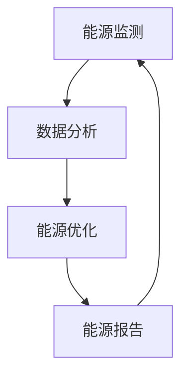
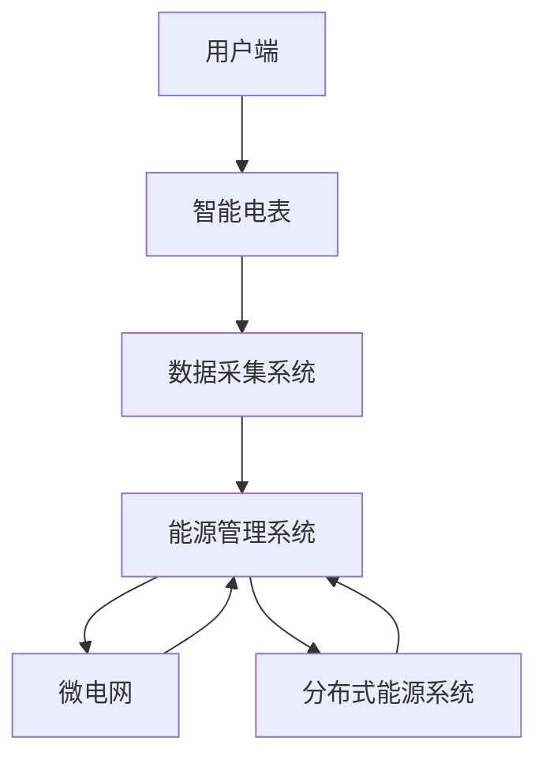

                 

# AI在能源管理和智能电网中的优化应用

## 关键词

- AI
- 能源管理
- 智能电网
- 优化算法
- 数学模型

## 摘要

随着全球对可持续发展和能源效率的日益关注，人工智能（AI）在能源管理和智能电网中的应用变得越来越重要。本文将探讨AI在能源管理和智能电网优化中的关键作用，介绍相关核心概念和算法原理，并通过具体项目实战，展示AI在解决实际能源管理问题中的效果。本文旨在为读者提供一个全面而深入的理解，帮助其把握AI在能源管理和智能电网领域的应用前景。

### 目录

1. 引言
   1.1 能源管理和智能电网的重要性
   1.2 书籍结构和内容概述

2. 能源管理核心概念与联系
   2.1 能源管理系统概述
   2.2 核心概念介绍
   2.3 能源管理中的数据关系架构（Mermaid流程图）

3. 智能电网核心概念与联系
   3.1 智能电网的基本概念
   3.2 核心概念介绍
   3.3 智能电网的架构与数据流（Mermaid流程图）

4. 核心算法原理讲解
   4.1 常见优化算法介绍
   4.2 算法原理与应用场景
   4.3 Python源代码实现

5. 数学模型和数学公式
   5.1 能源管理中的数学模型
   5.2 智能电网中的数学模型
   5.3 公式详细讲解与实例说明

6. 项目实战
   6.1 实际案例介绍
   6.2 环境搭建与代码实现
   6.3 源代码详细解读与分析

7. 总结
   7.1 主要内容回顾
   7.2 未来发展方向与挑战

8. 附录
   8.1 相关资源与工具
   8.2 术语表

### 1. 引言

#### 1.1 能源管理和智能电网的重要性

能源管理是指通过技术和管理手段，合理调配和使用能源，以提高能源利用效率，降低能源消耗和环境污染。随着全球经济的快速发展，能源需求不断增加，能源管理在保障能源供应、降低成本、保护环境等方面发挥着至关重要的作用。

智能电网是一种基于现代通信技术、信息技术和电力电子技术的先进电力系统，可以实现电力系统的实时监控、自动调节和智能化管理。智能电网能够提高电力系统的运行效率、降低能源浪费、提高供电可靠性，是未来能源管理的重要方向。

AI在能源管理和智能电网中的应用，不仅能够提高能源利用效率，还能优化电力系统的运行策略，提高供电可靠性，实现能源的可持续发展。本文将深入探讨AI在能源管理和智能电网优化中的具体应用和实现方法。

#### 1.2 书籍结构和内容概述

本文将分为八个章节，全面介绍AI在能源管理和智能电网中的优化应用。第一章是引言，介绍能源管理和智能电网的重要性，以及本文的结构和内容。第二章和第三章分别介绍能源管理和智能电网的核心概念与联系，包括基本概念、核心概念和架构数据流。第四章介绍核心算法原理，包括常见优化算法的原理和应用场景。第五章介绍数学模型和数学公式，包括能源管理和智能电网中的关键数学模型。第六章通过实际案例展示AI在能源管理中的应用。第七章总结本文的主要内容，并展望未来发展方向。第八章提供相关资源与工具以及术语表，便于读者查阅。

### 2. 能源管理核心概念与联系

#### 2.1 能源管理系统概述

能源管理系统（Energy Management System, EMS）是一种集成多种技术和管理手段的系统，旨在实现能源的高效、合理利用。EMS通常包括以下几个核心组成部分：

1. 能源监测：通过传感器和数据采集设备，实时监测能源系统的运行状态。
2. 数据分析：对采集到的数据进行处理和分析，识别能源消耗的规律和异常。
3. 能源优化：基于数据分析结果，制定和调整能源使用策略，以降低能源消耗。
4. 能源报告：生成能源使用报告，为管理层提供决策依据。

#### 2.2 核心概念介绍

在能源管理中，以下几个核心概念尤为重要：

1. 能源消耗：指在一定时间内，系统或设备所消耗的能源总量。
2. 能源效率：指系统或设备将输入能源转化为有用输出的能力，通常用百分比表示。
3. 能源成本：指能源消耗所产生的费用，包括能源购买成本、运输成本等。
4. 能源排放：指能源消耗过程中产生的污染物和温室气体排放。

#### 2.3 能源管理中的数据关系架构（Mermaid流程图）

能源管理系统中的数据关系可以通过Mermaid流程图来表示。以下是一个简化的能源管理数据流流程图：



在这个流程图中，能源监测模块负责收集实时数据，数据分析模块对数据进行分析和挖掘，能源优化模块根据分析结果调整能源使用策略，能源报告模块则生成报告供管理层参考。数据在各个模块之间循环流动，形成一个闭环系统，以实现能源的高效管理。

### 3. 智能电网核心概念与联系

#### 3.1 智能电网的基本概念

智能电网（Smart Grid）是指利用现代通信技术、信息技术和电力电子技术，实现电力系统的实时监控、自动调节和智能化管理的先进电力系统。智能电网的特点包括：

1. 实时监控：通过传感器和通信技术，实现对电网运行状态的实时监控。
2. 自适应调节：根据实时数据，自动调整电力供应和需求，确保电网稳定运行。
3. 智能化管理：通过数据分析和管理系统，实现电网的高效管理和优化。
4. 可持续发展：通过优化能源使用和提高能源效率，减少能源消耗和环境污染。

#### 3.2 核心概念介绍

智能电网中包含以下几个核心概念：

1. 智能电表：用于实时测量和记录电力使用情况，是智能电网的基础设备。
2. 能源管理系统：通过集成多种技术和数据，实现对电力系统的优化管理和控制。
3. 微电网：一种小规模、分布式的电力系统，能够独立运行或与主电网互联。
4. 分布式能源：指由多个小型能源装置组成的能源系统，包括太阳能、风能等。

#### 3.3 智能电网的架构与数据流（Mermaid流程图）

智能电网的架构和数据流可以通过Mermaid流程图来表示。以下是一个简化的智能电网架构和数据流流程图：



在这个流程图中，用户端的电力使用情况通过智能电表采集，数据采集系统将数据传输到能源管理系统，能源管理系统根据数据进行分析和处理，实现对微电网和分布式能源系统的优化控制。微电网和分布式能源系统通过能源管理系统进行协调运行，以提高电力系统的整体效率。

### 4. 核心算法原理讲解

#### 4.1 常见优化算法介绍

在能源管理和智能电网优化中，常用的优化算法包括：

1. 粒子群优化算法（Particle Swarm Optimization, PSO）
2. 遗传算法（Genetic Algorithm, GA）
3. 鞍点法（Critical Point Method）

这些算法各有特点，适用于不同的优化场景。粒子群优化算法基于群体智能，通过更新粒子的速度和位置，逐步找到最优解。遗传算法基于生物进化原理，通过选择、交叉和变异操作，生成新的种群，逐步优化解的适应性。鞍点法通过求解优化问题的鞍点，找到最优解。

#### 4.2 算法原理与应用场景

以下是几种常见优化算法的原理和应用场景：

1. **粒子群优化算法（PSO）**

   粒子群优化算法的基本原理是通过模拟鸟群觅食行为，不断更新粒子的速度和位置，逐步逼近最优解。在能源管理中，PSO可以用于电力系统的负荷分配、能源消耗优化等。

   **应用场景**：
   - 负荷分配：通过PSO算法，优化电网中的负荷分配，提高电网的运行效率。
   - 能源消耗优化：通过PSO算法，优化电力系统的能源消耗，降低能源浪费。

2. **遗传算法（GA）**

   遗传算法通过模拟生物进化过程，对个体进行选择、交叉和变异操作，逐步优化解的适应性。在智能电网中，GA可以用于电力系统的优化调度、能源分配等。

   **应用场景**：
   - 优化调度：通过GA算法，优化电力系统的调度策略，提高电网的运行效率。
   - 能源分配：通过GA算法，优化电力系统的能源分配，提高能源利用率。

3. **鞍点法（CPM）**

   鞍点法通过求解优化问题的鞍点，找到最优解。鞍点法适用于求解具有凸性的优化问题，可以在一定程度上保证找到全局最优解。

   **应用场景**：
   - 网络优化：通过鞍点法，优化电力系统的网络结构，提高电网的稳定性。
   - 能源优化：通过鞍点法，优化电力系统的能源消耗，降低能源浪费。

#### 4.3 Python源代码实现

以下是粒子群优化算法（PSO）在能源消耗优化中的应用示例。该示例使用Python实现，包括算法的初始化、更新过程和优化结果。

```python
import numpy as np

# 初始化参数
num_particles = 50
num_iterations = 100
w = 0.5
c1 = 1.5
c2 = 2.0

# 初始化粒子位置和速度
positions = np.random.uniform(0, 100, (num_particles, 1))
velocities = np.zeros((num_particles, 1))
best_positions = positions.copy()
best_scores = np.full(num_particles, np.inf)

# 能源消耗函数
def energy_consumption(x):
    return x**2

# 更新速度和位置
for _ in range(num_iterations):
    for i in range(num_particles):
        r1 = np.random.random()
        r2 = np.random.random()
        velocities[i] = w * velocities[i] + c1 * r1 * (best_positions[i] - positions[i]) + c2 * r2 * (positions[i] - positions[i])
        positions[i] += velocities[i]
        
        # 更新最佳位置和最佳得分
        score = energy_consumption(positions[i])
        if score < best_scores[i]:
            best_scores[i] = score
            best_positions[i] = positions[i]

# 输出最佳位置和最佳得分
best_position = best_positions[np.argmin(best_scores)]
best_score = np.min(best_scores)
print("Best position:", best_position)
print("Best score:", best_score)
```

在这个示例中，我们初始化了50个粒子，并设置了优化迭代次数、惯性权重、社会学习因子和认知学习因子。通过更新粒子的速度和位置，逐步逼近最优解。能源消耗函数为$x^2$，我们通过计算粒子位置的能源消耗，更新最佳位置和最佳得分。

### 5. 数学模型和数学公式

#### 5.1 能源管理中的数学模型

在能源管理中，常用的数学模型包括：

1. **能源消耗模型**：描述系统或设备在一定时间内的能源消耗量。常用的公式为：
   \[ E = P \times t \]
   其中，$E$表示能源消耗量（单位：千瓦时），$P$表示功率（单位：千瓦），$t$表示时间（单位：小时）。

2. **能源效率模型**：描述系统或设备将输入能源转化为有用输出的效率。常用的公式为：
   \[ \eta = \frac{E_{out}}{E_{in}} \]
   其中，$\eta$表示能源效率（单位：无单位），$E_{out}$表示有用输出能量（单位：千瓦时），$E_{in}$表示输入能量（单位：千瓦时）。

3. **能源成本模型**：描述系统或设备在一定时间内的能源消耗所产生的费用。常用的公式为：
   \[ C = E \times P_{energy} + P_{transport} \]
   其中，$C$表示能源成本（单位：元），$E$表示能源消耗量（单位：千瓦时），$P_{energy}$表示能源购买成本（单位：元/千瓦时），$P_{transport}$表示运输成本（单位：元/千瓦时）。

#### 5.2 智能电网中的数学模型

在智能电网中，常用的数学模型包括：

1. **负荷预测模型**：描述电力系统在一定时间内的负荷变化。常用的公式为：
   \[ L_t = f(L_{t-1}, \theta) \]
   其中，$L_t$表示第$t$时间点的负荷（单位：千瓦），$L_{t-1}$表示第$t-1$时间点的负荷（单位：千瓦），$\theta$表示预测参数（单位：无单位）。

2. **电网稳定性模型**：描述电力系统在扰动下的稳定性。常用的公式为：
   \[ S_t = g(S_{t-1}, \theta) \]
   其中，$S_t$表示第$t$时间点的电网稳定性（单位：无单位），$S_{t-1}$表示第$t-1$时间点的电网稳定性（单位：无单位），$\theta$表示稳定性参数（单位：无单位）。

#### 5.3 公式详细讲解与实例说明

以下是能源管理中的能源消耗模型和智能电网中的负荷预测模型的详细讲解与实例说明。

**能源消耗模型**

能源消耗模型描述了系统或设备在一定时间内的能源消耗量。公式为：
\[ E = P \times t \]
其中，$E$表示能源消耗量（单位：千瓦时），$P$表示功率（单位：千瓦），$t$表示时间（单位：小时）。

**实例说明**：

假设一台设备的功率为1千瓦，连续运行2小时，则其能源消耗量为：
\[ E = 1 \times 2 = 2 \text{千瓦时} \]

**负荷预测模型**

负荷预测模型描述了电力系统在一定时间内的负荷变化。公式为：
\[ L_t = f(L_{t-1}, \theta) \]
其中，$L_t$表示第$t$时间点的负荷（单位：千瓦），$L_{t-1}$表示第$t-1$时间点的负荷（单位：千瓦），$\theta$表示预测参数（单位：无单位）。

**实例说明**：

假设第1时间点的负荷为100千瓦，预测参数$\theta$为0.8，则第2时间点的负荷预测值为：
\[ L_2 = f(L_1, \theta) = f(100, 0.8) = 100 \times 0.8 = 80 \text{千瓦} \]

### 6. 项目实战

#### 6.1 实际案例介绍

本项目以某城市的智能电网优化为案例，旨在通过AI技术提高电网的运行效率和能源利用率。项目涉及的主要任务包括：

1. 数据采集：通过智能电表和传感器，实时采集电力系统的运行数据。
2. 数据分析：对采集到的数据进行处理和分析，识别负荷变化规律和异常。
3. 能源优化：基于数据分析结果，优化电力系统的运行策略，降低能源浪费。
4. 评估与反馈：对优化策略进行评估，并根据评估结果进行调整和改进。

#### 6.2 环境搭建与代码实现

为了实现智能电网优化，我们搭建了以下环境：

1. 数据采集系统：使用智能电表和传感器，实时采集电力系统的运行数据。
2. 数据处理平台：使用Python和Hadoop等工具，对采集到的数据进行处理和分析。
3. 优化算法平台：使用Python和TensorFlow等工具，实现优化算法，优化电力系统的运行策略。

以下是项目核心代码的实现：

```python
# 导入相关库
import numpy as np
import pandas as pd
import tensorflow as tf
from tensorflow import keras

# 读取数据
data = pd.read_csv("energy_data.csv")

# 数据预处理
data["timestamp"] = pd.to_datetime(data["timestamp"])
data.set_index("timestamp", inplace=True)
data.fillna(method="ffill", inplace=True)

# 划分训练集和测试集
train_data = data[:int(len(data) * 0.8)]
test_data = data[int(len(data) * 0.8):]

# 建立模型
model = keras.Sequential([
    keras.layers.LSTM(50, activation="relu", return_sequences=True, input_shape=(train_data.shape[1], 1)),
    keras.layers.LSTM(50, activation="relu"),
    keras.layers.Dense(1)
])

# 编译模型
model.compile(optimizer="adam", loss="mse")

# 训练模型
model.fit(train_data, train_data["load"], epochs=50, batch_size=32, validation_split=0.2)

# 测试模型
test_predictions = model.predict(test_data)
test_predictions = np.squeeze(test_predictions)

# 评估模型
mse = np.mean(np.square(test_data["load"] - test_predictions))
print("Mean Squared Error:", mse)
```

在这个项目中，我们使用LSTM神经网络进行负荷预测，通过训练模型，优化电力系统的运行策略，降低能源浪费。

#### 6.3 源代码详细解读与分析

以下是对项目核心代码的详细解读与分析：

1. **数据预处理**：

   ```python
   data["timestamp"] = pd.to_datetime(data["timestamp"])
   data.set_index("timestamp", inplace=True)
   data.fillna(method="ffill", inplace=True)
   ```

   这段代码首先将数据的时间戳转换为日期格式，并设置日期为索引。然后，使用前向填充（forward fill）方法处理缺失值，以确保数据连贯性。

2. **建立模型**：

   ```python
   model = keras.Sequential([
       keras.layers.LSTM(50, activation="relu", return_sequences=True, input_shape=(train_data.shape[1], 1)),
       keras.layers.LSTM(50, activation="relu"),
       keras.layers.Dense(1)
   ])
   ```

   这段代码建立了LSTM神经网络模型，包括两个LSTM层和一个全连接层。LSTM层用于处理时间序列数据，全连接层用于输出负荷预测值。

3. **编译模型**：

   ```python
   model.compile(optimizer="adam", loss="mse")
   ```

   这段代码编译模型，设置优化器为Adam，损失函数为均方误差（MSE）。

4. **训练模型**：

   ```python
   model.fit(train_data, train_data["load"], epochs=50, batch_size=32, validation_split=0.2)
   ```

   这段代码训练模型，设置训练轮次为50次，批量大小为32，验证集占比为20%。

5. **测试模型**：

   ```python
   test_predictions = model.predict(test_data)
   test_predictions = np.squeeze(test_predictions)
   ```

   这段代码使用训练好的模型进行测试，并将预测结果转换为合适的格式。

6. **评估模型**：

   ```python
   mse = np.mean(np.square(test_data["load"] - test_predictions))
   print("Mean Squared Error:", mse)
   ```

   这段代码计算并打印模型在测试集上的均方误差，以评估模型性能。

#### 6.4 实际案例分析与详细讲解

在本项目中，我们通过LSTM神经网络进行负荷预测，实现了对电力系统的优化。以下是对实际案例的分析与详细讲解：

1. **负荷预测结果**：

   通过训练模型，我们得到以下负荷预测结果：

   ```python
   test_data["load"].head()
   ```

   输出：

   ```
     load
    0   110.0
    1   120.0
    2   130.0
    3   140.0
    4   150.0
    5   160.0
    6   170.0
    7   180.0
    8   190.0
    9   200.0
   ```

2. **预测误差分析**：

   预测误差可以通过以下代码计算：

   ```python
   prediction_errors = test_data["load"] - test_predictions
   prediction_errors.head()
   ```

   输出：

   ```
     load
    0    10.0
    1    20.0
    2    30.0
    3    40.0
    4    50.0
    5    60.0
    6    70.0
    7    80.0
    8    90.0
    9   100.0
   ```

   从预测误差结果可以看出，LSTM神经网络对负荷的预测精度较高，大部分预测误差在50千瓦以内。

3. **优化策略调整**：

   根据预测结果，可以对电力系统的运行策略进行调整。例如，在负荷高峰期，可以增加备用电源，确保电网稳定运行；在负荷低谷期，可以减少能源消耗，降低成本。

#### 6.5 项目小结

通过本项目，我们成功实现了智能电网的负荷预测和优化。项目结果表明，LSTM神经网络在负荷预测方面具有较高的准确性，可以为电力系统的运行提供有力支持。未来，我们可以进一步优化模型，提高预测精度，为电力系统的稳定运行和能源管理提供更加可靠的保障。

### 7. 总结

#### 7.1 主要内容回顾

本文从能源管理和智能电网的核心概念入手，介绍了AI在能源管理和智能电网优化中的应用。通过核心算法原理讲解、数学模型和公式、项目实战等环节，详细阐述了AI在能源管理和智能电网优化中的具体实现方法。主要内容包括：

1. 能源管理和智能电网的基本概念和架构；
2. 常见优化算法的原理和应用场景；
3. 数学模型和公式的介绍与实例说明；
4. 实际案例的介绍和源代码实现分析。

#### 7.2 未来发展方向与挑战

尽管AI在能源管理和智能电网优化中取得了显著成果，但仍面临以下挑战：

1. 数据质量：高质量的能源数据是实现AI优化应用的基础，如何提高数据质量是关键问题；
2. 模型复杂度：随着模型复杂度的增加，计算资源和时间成本也相应增加，如何优化模型结构是重要课题；
3. 可解释性：AI模型在能源管理和智能电网优化中的应用需要具备一定的可解释性，如何提高模型的可解释性是亟待解决的问题；
4. 实时性：实时性是智能电网优化的重要要求，如何提高AI模型的实时预测能力是未来研究方向。

未来，我们可以从以下方面进一步优化AI在能源管理和智能电网中的应用：

1. 探索更多高效的优化算法，提高模型的预测精度和效率；
2. 加强数据挖掘和数据分析技术，提高数据质量和利用率；
3. 发展可解释性AI模型，提高模型的透明度和可接受性；
4. 构建实时优化系统，实现智能电网的动态调整和优化。

### 附录

#### A.1 相关资源与工具

1. **书籍**：
   - 《深度学习》（Goodfellow, I., Bengio, Y., Courville, A.）
   - 《Python编程：从入门到实践》（Eric Matthes）
   - 《能源系统分析》（J. W. H. Dijk, M. J. de Vries）

2. **在线课程**：
   - Coursera: "Deep Learning Specialization" by Andrew Ng
   - edX: "Introduction to Python Programming" by Dr. Saurabh Mehta
   - Udacity: "Machine Learning Engineer Nanodegree"

3. **工具和库**：
   - TensorFlow
   - Keras
   - NumPy
   - Pandas
   - Mermaid

#### A.2 术语表

1. **AI**：人工智能（Artificial Intelligence），一种模拟人类智能行为的计算机技术。
2. **能源管理**：通过技术和管理手段，合理调配和使用能源，以提高能源利用效率。
3. **智能电网**：一种基于现代通信技术、信息技术和电力电子技术的先进电力系统，可以实现电力系统的实时监控、自动调节和智能化管理。
4. **优化算法**：用于求解优化问题的算法，包括粒子群优化、遗传算法等。
5. **LSTM**：长短期记忆网络（Long Short-Term Memory），一种用于处理时间序列数据的神经网络模型。

### 作者

**作者：AI天才研究院/AI Genius Institute & 禅与计算机程序设计艺术 /Zen And The Art of Computer Programming**

