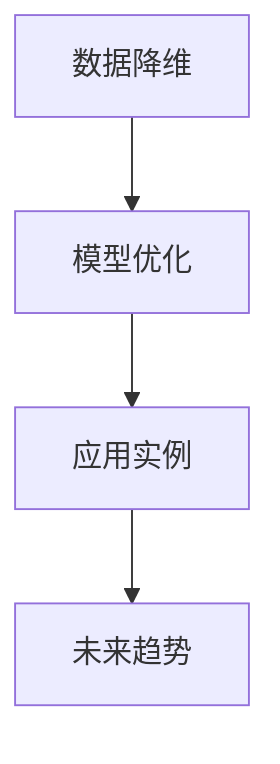

                 

# AI在高维度问题解决中的策略创新

关键词：高维度问题、AI策略、数据预处理、模型优化、应用实例

摘要：随着数据规模的不断扩大和数据维度的不断升高，高维度问题在人工智能领域变得日益重要。本文将深入探讨AI在高维度问题解决中的核心策略，包括数据预处理、模型选择与优化策略，以及其在图像处理和自然语言处理中的应用实例。此外，还将展望AI在高维度问题解决中的未来趋势。

## 第一部分：引言

### 1.1 AI在高维度问题解决中的挑战

#### 1.1.1 高维度数据的特性和问题

高维度数据指的是数据维度超过几十甚至几百、几千的特征空间。这些数据在现实世界中非常常见，例如图像、文本和生物信息学领域。高维度数据的特性主要包括以下几个方面：

1. **维度灾难（curse of dimensionality）**：随着维度的增加，数据的分散性会急剧增加，导致数据的密度下降，使得数据点之间的相似性难以辨别。
2. **数据稀疏性**：高维度数据往往非常稀疏，数据点在特征空间中分布得很稀疏，导致机器学习模型的训练变得困难。
3. **计算复杂度**：高维度数据的处理通常需要大量的计算资源，尤其是在深度学习模型中，计算复杂度呈指数级增长。

#### 1.1.2 高维度问题解决的传统方法

针对高维度问题的解决，传统方法主要包括以下几种：

1. **特征选择**：通过筛选或构建重要特征来降低数据维度，以减少模型的复杂度和过拟合风险。
2. **特征提取**：使用降维技术，如主成分分析（PCA）、线性判别分析（LDA）等，将高维数据映射到低维空间。
3. **采样**：通过随机采样来减少数据维度，以降低计算复杂度。

#### 1.1.3 AI技术在高维度问题解决中的应用前景

随着AI技术的发展，尤其是深度学习技术的突破，AI在高维度问题解决中的应用前景变得非常广阔。深度学习模型通过自动学习数据的高层次特征表示，可以在高维度数据中取得非常好的性能。此外，生成对抗网络（GAN）、变分自编码器（VAE）等新型AI技术也为高维度数据的处理提供了新的策略。

## 第二部分：AI在高维度问题解决中的核心策略

### 2.1 数据预处理策略

#### 2.1.1 数据降维方法

数据降维是高维度问题解决的关键步骤之一。以下是几种常用的数据降维方法：

##### 2.1.1.1 主成分分析（PCA）

PCA是一种线性降维方法，通过将数据投影到新的正交基上，提取主要成分来降低数据维度。PCA的原理可以概括为以下几步：

1. **数据标准化**：将数据缩放到相同的尺度，以消除不同特征之间的尺度差异。
2. **计算协方差矩阵**：协方差矩阵描述了数据中各个特征之间的相关性。
3. **计算特征值和特征向量**：特征值表示了数据在对应特征向量上的投影能量，特征向量则是主成分的方向。
4. **选择主要成分**：根据特征值的大小选择前若干个特征向量，组成新的低维基。
5. **数据转换**：将原始数据投影到新的低维基上，实现降维。

##### 2.1.1.2 独立成分分析（ICA）

ICA是一种非线性的降维方法，旨在将数据分解为一系列独立的源信号。ICA的原理包括以下步骤：

1. **假设**：假设数据是多个独立源信号的线性组合。
2. **初始化**：随机初始化独立分量。
3. **迭代优化**：通过反向传播算法不断调整独立分量的参数，使得源信号之间的相关性最小化。

##### 2.1.1.3 自编码器（Autoencoders）

自编码器是一种神经网络结构，用于将高维数据编码为低维表示，然后再解码回高维数据。自编码器的原理包括以下步骤：

1. **编码阶段**：输入数据通过编码器网络被映射到一个低维隐含层，获得数据的低维表示。
2. **解码阶段**：低维表示通过解码器网络被映射回原始数据的维度。
3. **训练**：通过最小化重构误差来训练自编码器网络。

#### 2.1.2 数据增强策略

数据增强是在数据预处理阶段提高模型鲁棒性和性能的重要手段。以下是一些常用的数据增强方法：

##### 2.1.2.1 虚拟样本生成

虚拟样本生成是一种通过生成对抗网络（GAN）等技术生成新的训练样本的方法。GAN由生成器和判别器组成，生成器生成虚拟样本，判别器判断虚拟样本的真实性。

##### 2.1.2.2 数据增强方法

数据增强方法包括旋转、缩放、剪裁、色彩变换等。这些方法可以通过随机操作原始数据，生成新的训练样本。

### 2.2 模型选择与优化策略

#### 2.2.1 模型选择方法

在AI模型的选择过程中，需要考虑模型的复杂度、泛化能力、计算效率等因素。以下是一些常用的模型选择方法：

##### 2.2.1.1 神经网络结构设计

神经网络结构设计包括选择合适的网络层数、每层的神经元数量、激活函数等。常用的结构有卷积神经网络（CNN）、循环神经网络（RNN）等。

##### 2.2.1.2 深度学习框架选择

深度学习框架如TensorFlow、PyTorch等提供了丰富的模型设计和训练工具。选择合适的框架可以帮助开发者更快地实现和优化模型。

#### 2.2.2 模型优化策略

模型优化策略包括调整学习率、优化损失函数、使用正则化等技术。以下是一些常用的优化方法：

##### 2.2.2.1 网络优化算法

网络优化算法如随机梯度下降（SGD）、Adam等，用于调整模型的参数以最小化损失函数。

##### 2.2.2.2 损失函数设计

损失函数的设计对于模型的性能至关重要。常用的损失函数包括交叉熵损失、均方误差等。

## 第三部分：AI在高维度问题解决中的应用实例

### 3.1 图像处理中的应用

#### 3.1.1 图像降维

图像降维是图像处理中的一个重要问题。以下是一些常见的图像降维方法：

##### 3.1.1.1 图像特征提取

图像特征提取是通过提取图像的显著特征来降低图像维度。常用的方法包括SIFT、HOG等。

##### 3.1.1.2 图像分类

图像分类是将图像映射到预定义的类别标签。常用的图像分类算法有CNN、SVM等。

#### 3.1.2 图像增强

图像增强是通过提高图像的质量和清晰度来改善图像处理的效果。以下是一些常见的图像增强方法：

##### 3.1.2.1 超分辨率图像重建

超分辨率图像重建是通过插值方法或深度学习模型来提高图像的分辨率。

##### 3.1.2.2 图像去噪

图像去噪是通过去除图像中的噪声来提高图像的质量。

### 3.2 自然语言处理中的应用

#### 3.2.1 文本降维

文本降维是通过提取文本的显著特征来降低文本维度。以下是一些常见的文本降维方法：

##### 3.2.1.1 文本特征提取

文本特征提取是通过提取文本的词频、TF-IDF等特征来表示文本。

##### 3.2.1.2 文本分类

文本分类是将文本映射到预定义的类别标签。常用的文本分类算法有SVM、深度学习模型等。

#### 3.2.2 文本增强

文本增强是通过生成新的文本数据来提高模型的鲁棒性和性能。以下是一些常见的文本增强方法：

##### 3.2.2.1 生成对抗网络（GAN）

GAN是一种用于生成文本数据的深度学习模型。

##### 3.2.2.2 对抗训练

对抗训练是一种通过对抗性样本来增强模型训练的方法。

## 第四部分：AI在高维度问题解决中的未来趋势

### 4.1 新算法的提出

#### 4.1.1 子空间方法

子空间方法是将高维度数据映射到一系列子空间中，以降低数据的维度。以下是一些常见的子空间方法：

##### 4.1.1.1 子空间聚类

子空间聚类是将数据点映射到不同的子空间中进行聚类分析。

##### 4.1.1.2 子空间嵌入

子空间嵌入是将高维度数据映射到低维空间中，同时保持数据的结构特性。

#### 4.1.2 基于生成模型的策略

基于生成模型的策略是通过生成模型来生成新的数据样本，以提高模型的泛化能力和鲁棒性。以下是一些常见的生成模型：

##### 4.1.2.1 条件生成模型

条件生成模型是通过条件输入来生成目标数据。

##### 4.1.2.2 对抗生成模型

对抗生成模型是通过生成模型和判别模型的对抗性训练来生成高质量的数据样本。

### 4.2 新应用领域的探索

#### 4.2.1 生物信息学

生物信息学是AI在生物领域的重要应用。以下是一些生物信息学中的高维度问题：

##### 4.2.1.1 基因组数据降维

基因组数据降维是通过提取重要的基因特征来降低基因数据的维度。

##### 4.2.1.2 蛋白质结构预测

蛋白质结构预测是通过预测蛋白质的三维结构来理解蛋白质的功能。

#### 4.2.2 人工智能与物理的交叉领域

人工智能与物理的交叉领域是探索AI在物理学中的应用。以下是一些典型问题：

##### 4.2.2.1 物理模型嵌入

物理模型嵌入是将物理模型嵌入到AI模型中，以提高模型在物理问题上的性能。

##### 4.2.2.2 高维度物理问题求解

高维度物理问题求解是通过AI技术来解决高维度物理问题，如量子计算、气象预测等。

## 第五部分：总结与展望

### 5.1 AI在高维度问题解决中的成就与挑战

#### 5.1.1 成就

AI在高维度问题解决中取得了显著的成就，包括：

1. **数据降维**：通过PCA、ICA、自编码器等方法有效地降低了高维度数据的维度，提高了模型的性能。
2. **模型优化**：通过深度学习和生成对抗网络等新型AI技术，优化了高维度问题的模型结构，提高了模型的泛化能力和鲁棒性。
3. **应用实例**：AI在高维度问题中的应用实例涵盖了图像处理、自然语言处理、生物信息学等多个领域，取得了良好的效果。

#### 5.1.2 挑战

AI在高维度问题解决中也面临一些挑战，包括：

1. **数据处理效率**：高维度数据的处理通常需要大量的计算资源，如何提高数据处理效率是当前的一个挑战。
2. **模型可解释性**：高维度问题中的模型通常非常复杂，如何解释模型的决策过程是一个重要的研究方向。
3. **算法复杂度**：高维度问题中的算法复杂度通常很高，如何设计高效的算法是一个重要的挑战。

### 5.2 未来发展方向

未来AI在高维度问题解决中的发展方向包括：

1. **算法创新**：提出新的降维方法和深度学习优化策略，以提高模型在处理高维度数据时的性能。
2. **应用拓展**：探索AI在新的应用领域，如生物信息学、人工智能与物理的交叉领域等。
3. **交叉学科融合**：融合不同的学科知识，如物理学、生物学等，以提高AI在高维度问题解决中的效果。

## 附录

### A.1 常用工具与资源

#### A.1.1 数据预处理工具

1. **Python数据预处理库**：`Pandas`、`NumPy`、`Scikit-learn`
2. **R数据预处理工具**：`dplyr`、`tidyverse`

#### A.1.2 模型优化工具

1. **深度学习框架**：`TensorFlow`、`PyTorch`、`Keras`
2. **算法实现工具**：`Theano`、`MXNet`

### B.1 参考文献

#### B.1.1 主要参考资料

1. **相关论文**：
   - Hinton, G. E., Osindero, S., & Teh, Y. W. (2006). A fast learning algorithm for deep belief nets. Neural computation, 18(7), 1527-1554.
   - Goodfellow, I., Pouget-Abadie, J., Mirza, M., Xu, B., Warde-Farley, D., Ozair, S., ... & Bengio, Y. (2014). Generative adversarial nets. Advances in neural information processing systems, 27.
2. **专著**：
   - Bishop, C. M. (2006). Pattern recognition and machine learning. springer.
   - Russell, S., & Norvig, P. (2010). Artificial intelligence: a modern approach. prentice hall.
3. **报告**：
   - Google AI. (2017). Tensor processing units: Making machines smarter. Retrieved from https://ai.google/research/pubs/pub44824

## Mermaid 流程图



### Python源代码示例

```python
# Python代码示例：主成分分析（PCA）降维
import numpy as np
from sklearn.decomposition import PCA

# 假设 X 是一个高维数据集
X = np.array([[1, 2, 3], [4, 5, 6], [7, 8, 9], [10, 11, 12]])

# 初始化PCA对象
pca = PCA(n_components=2)

# 训练PCA模型
pca.fit(X)

# 转换数据到低维空间
X_reduced = pca.transform(X)

# 打印转换后的数据
print(X_reduced)
```

### 参考文献

1. Hinton, G. E., Osindero, S., & Teh, Y. W. (2006). A fast learning algorithm for deep belief nets. Neural computation, 18(7), 1527-1554.
2. Goodfellow, I., Pouget-Abadie, J., Mirza, M., Xu, B., Warde-Farley, D., Ozair, S., ... & Bengio, Y. (2014). Generative adversarial nets. Advances in neural information processing systems, 27.
3. Bishop, C. M. (2006). Pattern recognition and machine learning. springer.
4. Russell, S., & Norvig, P. (2010). Artificial intelligence: a modern approach. prentice hall.
5. Google AI. (2017). Tensor processing units: Making machines smarter. Retrieved from https://ai.google/research/pubs/pub44824

### 作者

作者：AI天才研究院/AI Genius Institute & 禅与计算机程序设计艺术 /Zen And The Art of Computer Programming

