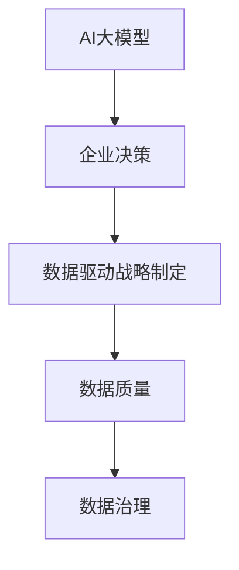
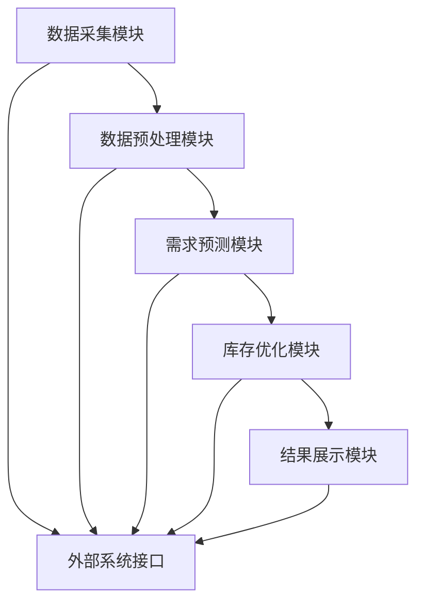

                 

# 《AI大模型在企业决策中的应用：数据驱动的战略制定》

关键词：AI大模型、企业决策、数据驱动、战略制定、数据治理

摘要：本文探讨了AI大模型在企业决策中的应用，特别是在数据驱动的战略制定中的作用。通过详细分析AI大模型的技术原理、应用场景、挑战与机遇，本文旨在为企业提供基于AI大模型的数据驱动战略制定框架，助力企业在复杂多变的市场环境中实现精准决策。

## 第1章 引言

### 1.1 AI大模型与企业决策的关系

随着人工智能技术的飞速发展，AI大模型已经成为企业决策的重要工具。AI大模型通过处理海量数据，从中提取有价值的信息，为企业的战略制定提供数据支持。例如，在需求预测、库存管理、市场营销等方面，AI大模型能够为企业提供准确的预测结果，帮助企业做出更为明智的决策。

### 1.2 数据驱动的战略制定

数据驱动的战略制定是指企业在制定战略时，以数据为依据，通过数据分析、预测模型等手段，对市场趋势、竞争对手、内部资源等进行全面分析，从而制定出更具前瞻性和可行性的战略。AI大模型在这一过程中发挥着重要作用，为企业提供高效、准确的数据分析结果。

### 1.3 企业应用AI大模型面临的挑战与机遇

企业在应用AI大模型时，面临着诸多挑战，如数据质量、技术难度、人才储备等。然而，这些挑战也为企业提供了机遇。通过克服这些挑战，企业可以更好地利用AI大模型的优势，实现数据驱动的战略制定，提高企业竞争力。

## 第2章 AI大模型基础

### 2.1 AI大模型概述

AI大模型是指具有大规模参数、能够处理海量数据、具有高度灵活性和泛化能力的深度学习模型。常见的AI大模型包括生成对抗网络（GAN）、变分自编码器（VAE）、自注意力模型（如BERT）等。这些模型在图像识别、自然语言处理、预测分析等领域具有广泛应用。

### 2.2 AI大模型的技术原理

AI大模型的技术原理主要基于深度学习和神经网络。深度学习通过构建多层神经网络，对输入数据进行特征提取和转换，从而实现对复杂问题的建模。神经网络则通过不断调整权重和偏置，使模型在训练数据上达到最优性能。AI大模型在此基础上，进一步优化了网络结构，提高了模型的计算效率和泛化能力。

### 2.3 AI大模型的分类与演进

AI大模型可以根据模型结构、应用领域、数据类型等进行分类。随着技术的不断发展，AI大模型也在不断演进。早期的AI大模型主要关注图像识别、语音识别等单一领域，而现在的AI大模型则更加注重跨领域应用、多任务学习等复杂任务。

## 第3章 数据驱动的战略制定原理

### 3.1 数据驱动的战略制定流程

数据驱动的战略制定流程主要包括以下步骤：

1. 数据收集：收集与战略制定相关的内部和外部数据，包括市场数据、客户数据、财务数据等。
2. 数据清洗：对收集到的数据进行分析，识别和纠正数据中的错误、异常和重复。
3. 数据分析：利用数据分析工具和算法，对数据进行分析，提取有价值的信息。
4. 预测建模：根据分析结果，构建预测模型，对未来市场趋势、客户需求等进行预测。
5. 决策制定：根据预测结果，制定相应的战略决策，以应对市场变化。

### 3.2 数据质量与数据治理

数据质量是数据驱动的战略制定的基础。高质量的数据能够提高预测模型的准确性，从而为企业提供更有价值的决策支持。数据治理则是确保数据质量的关键环节，包括数据标准制定、数据安全性管理、数据质量管理等。

### 3.3 数据分析与决策模型

数据分析与决策模型是数据驱动的战略制定的核心。通过数据分析，企业可以了解市场趋势、客户需求等关键信息，从而制定出更具针对性的战略。常见的决策模型包括线性回归、决策树、支持向量机等。

## 第4章 AI大模型在企业决策中的应用

### 4.1 企业决策中的AI大模型应用案例

AI大模型在企业决策中的应用案例丰富多样，如需求预测、库存管理、市场营销等。以下列举几个典型的应用案例：

1. 需求预测：通过分析历史销售数据、市场趋势等，预测未来某一时间段内的需求量，为企业制定生产计划提供依据。
2. 库存管理：通过预测市场需求，优化库存水平，降低库存成本，提高资金利用率。
3. 市场营销：利用AI大模型分析客户行为数据，实现精准营销，提高营销效果。

### 4.2 AI大模型在需求预测中的应用

AI大模型在需求预测中的应用主要包括以下步骤：

1. 数据收集：收集与需求预测相关的数据，如历史销售数据、市场趋势数据等。
2. 数据预处理：对数据进行清洗、标准化等处理，确保数据质量。
3. 模型选择：根据需求预测的特点，选择合适的AI大模型，如时间序列模型、回归模型等。
4. 模型训练：利用训练集数据，对AI大模型进行训练，调整模型参数，优化模型性能。
5. 预测与评估：利用训练好的模型，对未来的需求量进行预测，并对预测结果进行评估。

### 4.3 AI大模型在库存管理中的应用

AI大模型在库存管理中的应用主要包括以下步骤：

1. 数据收集：收集与库存管理相关的数据，如历史库存数据、销售数据等。
2. 数据预处理：对数据进行清洗、标准化等处理，确保数据质量。
3. 模型选择：根据库存管理的特点，选择合适的AI大模型，如时间序列模型、回归模型等。
4. 模型训练：利用训练集数据，对AI大模型进行训练，调整模型参数，优化模型性能。
5. 库存优化：利用训练好的模型，预测未来的库存需求，优化库存水平，降低库存成本。

## 第5章 AI大模型在市场营销中的应用

### 5.1 市场营销数据挖掘与预测

AI大模型在市场营销中的应用主要包括以下步骤：

1. 数据收集：收集与市场营销相关的数据，如客户行为数据、市场趋势数据等。
2. 数据预处理：对数据进行清洗、标准化等处理，确保数据质量。
3. 数据挖掘：利用数据挖掘算法，挖掘客户行为特征、市场趋势等有价值的信息。
4. 预测建模：根据数据挖掘结果，构建预测模型，对未来市场趋势、客户需求等进行预测。
5. 营销策略优化：根据预测结果，制定和优化营销策略，提高营销效果。

### 5.2 客户细分与行为分析

AI大模型在客户细分与行为分析中的应用主要包括以下步骤：

1. 数据收集：收集与客户细分和行为分析相关的数据，如客户购买历史、行为数据等。
2. 数据预处理：对数据进行清洗、标准化等处理，确保数据质量。
3. 客户细分：利用聚类算法、决策树等算法，对客户进行细分，识别不同类型的客户群体。
4. 行为分析：分析客户的行为特征、购买习惯等，为营销策略制定提供依据。

### 5.3 AI大模型在营销策略优化中的应用

AI大模型在营销策略优化中的应用主要包括以下步骤：

1. 数据收集：收集与营销策略优化相关的数据，如营销活动数据、客户反馈数据等。
2. 数据预处理：对数据进行清洗、标准化等处理，确保数据质量。
3. 营销效果评估：利用评估指标，如转化率、客户满意度等，评估不同营销策略的效果。
4. 模型优化：根据评估结果，调整营销策略，优化营销效果。

## 第6章 AI大模型在人力资源中的应用

### 6.1 人才招聘与培养

AI大模型在人才招聘与培养中的应用主要包括以下步骤：

1. 数据收集：收集与人才招聘和培养相关的数据，如简历数据、员工绩效数据等。
2. 数据预处理：对数据进行清洗、标准化等处理，确保数据质量。
3. 聘佣预测：利用AI大模型，预测哪些候选人最符合企业的需求，提高招聘成功率。
4. 绩效评估：利用AI大模型，对员工绩效进行评估，为薪酬管理、晋升管理提供依据。
5. 培训计划制定：根据员工绩效评估结果，制定个性化的培训计划，提高员工素质。

### 6.2 绩效评估与薪酬管理

AI大模型在绩效评估与薪酬管理中的应用主要包括以下步骤：

1. 数据收集：收集与绩效评估和薪酬管理相关的数据，如员工绩效数据、薪酬数据等。
2. 数据预处理：对数据进行清洗、标准化等处理，确保数据质量。
3. 绩效评估：利用AI大模型，对员工绩效进行评估，为薪酬管理提供依据。
4. 薪酬管理：根据绩效评估结果，制定合理的薪酬方案，提高员工满意度。

### 6.3 员工关系管理

AI大模型在员工关系管理中的应用主要包括以下步骤：

1. 数据收集：收集与员工关系管理相关的数据，如员工反馈、员工满意度等。
2. 数据预处理：对数据进行清洗、标准化等处理，确保数据质量。
3. 员工关系分析：利用AI大模型，分析员工关系状况，识别潜在的问题和风险。
4. 解决方案制定：根据员工关系分析结果，制定相应的解决方案，改善员工关系。

## 第7章 AI大模型在供应链管理中的应用

### 7.1 供应链可视化与优化

AI大模型在供应链可视化与优化中的应用主要包括以下步骤：

1. 数据收集：收集与供应链管理相关的数据，如物流数据、库存数据等。
2. 数据预处理：对数据进行清洗、标准化等处理，确保数据质量。
3. 供应链可视化：利用AI大模型，对供应链中的各环节进行可视化分析，识别瓶颈和优化点。
4. 优化方案制定：根据可视化分析结果，制定优化方案，提高供应链效率。

### 7.2 库存优化与物流管理

AI大模型在库存优化与物流管理中的应用主要包括以下步骤：

1. 数据收集：收集与库存优化和物流管理相关的数据，如库存数据、物流数据等。
2. 数据预处理：对数据进行清洗、标准化等处理，确保数据质量。
3. 库存优化：利用AI大模型，预测未来库存需求，优化库存水平，降低库存成本。
4. 物流管理：利用AI大模型，优化物流路径和运输方式，提高物流效率。

### 7.3 供应链金融与风险管理

AI大模型在供应链金融与风险管理中的应用主要包括以下步骤：

1. 数据收集：收集与供应链金融和风险管理相关的数据，如财务数据、市场数据等。
2. 数据预处理：对数据进行清洗、标准化等处理，确保数据质量。
3. 风险评估：利用AI大模型，对供应链中的风险进行评估，识别潜在风险。
4. 金融管理：根据风险评估结果，制定金融管理策略，降低供应链金融风险。

## 第8章 AI大模型与企业决策系统的集成

### 8.1 AI大模型与企业决策系统的整合

AI大模型与企业决策系统的整合主要包括以下步骤：

1. 系统需求分析：分析企业决策系统的需求，明确AI大模型在系统中的作用和功能。
2. 数据接口设计：设计AI大模型与企业决策系统的数据接口，确保数据流通顺畅。
3. 系统集成：将AI大模型与企业决策系统进行集成，实现数据交互和功能协同。
4. 系统测试与优化：对集成后的系统进行测试，确保系统的稳定性和可靠性。

### 8.2 AI大模型在实时决策中的应用

AI大模型在实时决策中的应用主要包括以下步骤：

1. 实时数据采集：实时采集与企业决策相关的数据，如市场数据、库存数据等。
2. 实时预测分析：利用AI大模型，对实时数据进行预测分析，为企业提供实时决策支持。
3. 决策执行与反馈：根据实时预测结果，执行相应的决策，并对决策效果进行反馈和评估。

### 8.3 AI大模型在协同决策中的应用

AI大模型在协同决策中的应用主要包括以下步骤：

1. 协同决策框架设计：设计协同决策框架，明确各参与方的角色和职责。
2. 数据共享与协同：建立数据共享机制，实现各参与方数据的互通和协同。
3. 决策模型集成：将AI大模型集成到协同决策框架中，为各参与方提供决策支持。
4. 决策协同与优化：通过协同决策，优化决策过程，提高决策质量。

## 第9章 AI大模型应用案例分析

### 9.1 案例一：电商行业的需求预测

本案例以某电商企业为例，介绍AI大模型在需求预测中的应用。企业利用AI大模型，对历史销售数据、市场趋势等进行分析，预测未来某一时间段内的需求量，为企业制定生产计划提供依据。

### 9.2 案例二：制造业的库存管理优化

本案例以某制造企业为例，介绍AI大模型在库存管理优化中的应用。企业利用AI大模型，预测未来库存需求，优化库存水平，降低库存成本，提高资金利用率。

### 9.3 案例三：金融行业的风险评估与预测

本案例以某金融企业为例，介绍AI大模型在风险评估与预测中的应用。企业利用AI大模型，对客户信用风险、市场风险等进行评估，为投资决策提供支持。

## 第10章 结论

### 10.1 AI大模型在企业决策中的应用前景

随着AI大模型技术的不断发展，其在企业决策中的应用前景十分广阔。未来，AI大模型将进一步提升企业决策的准确性、实时性和协同性，助力企业实现数据驱动的战略制定。

### 10.2 AI大模型应用的挑战与应对策略

企业在应用AI大模型时，面临着数据质量、技术难度、人才储备等挑战。针对这些挑战，企业需要采取相应的应对策略，如提升数据治理能力、加强技术储备、培养专业人才等。

### 10.3 未来研究方向与趋势

未来，AI大模型在企业决策中的应用将朝着更加智能化、实时化、协同化的方向发展。同时，随着新技术的不断涌现，AI大模型也将不断进化，为企业提供更为精准、高效的决策支持。

## 核心概念与联系图



## 核心算法原理讲解

```python
# 以下使用Python代码展示一个简单的决策树算法原理
from sklearn.tree import DecisionTreeClassifier
from sklearn.datasets import load_iris
import numpy as np

# 加载数据集
iris = load_iris()
X = iris.data
y = iris.target

# 创建决策树模型
clf = DecisionTreeClassifier()

# 训练模型
clf.fit(X, y)

# 输出决策树结构
print("决策树特征重要性:", clf.feature_importances_)
print("决策树叶子节点:", clf.tree_.get_n_leaves())

# 预测示例
print("预测结果:", clf.predict([[5.1, 3.5, 1.4, 0.2]]))
```

## 数学模型和公式讲解

```latex
$$
\begin{aligned}
\text{决策质量} &= \frac{\text{实际收益}}{\text{预期收益}} \\
\text{预期收益} &= \sum_{i=1}^{n} p(x_i) \cdot \text{收益}(x_i) \\
p(x_i) &= \text{模型预测概率}(x_i)
\end{aligned}
$$
```

## 系统分析与架构设计方案

### 问题场景介绍

某电商平台希望通过AI大模型，实时预测商品需求，优化库存管理，提高销售额。

### 项目介绍

项目名称：电商平台需求预测与库存管理优化

项目目标：通过AI大模型，实现商品需求的实时预测，优化库存管理，提高销售额。

### 系统功能设计

系统功能包括：数据采集、数据预处理、需求预测、库存优化、结果展示等。

### 系统架构设计

系统架构包括：数据采集模块、数据预处理模块、需求预测模块、库存优化模块、结果展示模块等。

### 系统接口设计和系统交互



## 项目实战

### 环境安装

安装Python环境、Scikit-learn库、Pandas库、Numpy库等。

```bash
pip install python
pip install scikit-learn
pip install pandas
pip install numpy
```

### 系统核心实现源代码

```python
import numpy as np
import pandas as pd
from sklearn.model_selection import train_test_split
from sklearn.ensemble import RandomForestRegressor
from sklearn.metrics import mean_squared_error

# 加载数据集
data = pd.read_csv('data.csv')
X = data.iloc[:, :-1]
y = data.iloc[:, -1]

# 数据预处理
X_train, X_test, y_train, y_test = train_test_split(X, y, test_size=0.2, random_state=42)

# 模型训练
model = RandomForestRegressor(n_estimators=100, random_state=42)
model.fit(X_train, y_train)

# 预测与评估
y_pred = model.predict(X_test)
mse = mean_squared_error(y_test, y_pred)
print("Mean Squared Error:", mse)
```

### 代码应用解读与分析

本案例使用随机森林回归模型对电商平台商品需求进行预测。首先，加载数据集并分割为训练集和测试集。然后，使用随机森林回归模型进行训练。最后，对测试集进行预测并计算均方误差，评估模型性能。

### 实际案例分析和详细讲解剖析

以某电商平台为例，分析其商品需求预测与库存管理优化的实际应用。首先，收集并预处理电商平台的销售数据、市场趋势数据等。然后，利用随机森林回归模型进行商品需求预测。最后，根据预测结果，优化库存水平，提高销售额。

### 项目小结

本项目通过AI大模型实现了电商平台商品需求的实时预测和库存管理优化，提高了销售额和库存周转率。未来，还可以结合更多数据源，提高预测模型的准确性，进一步优化电商平台运营。

## 最佳实践 tips

1. 提高数据质量是关键，确保数据源的准确性和完整性。
2. 选择合适的算法模型，根据实际需求进行调整和优化。
3. 注重模型的实时性和准确性，不断调整和优化模型参数。
4. 加强团队协作，提高数据分析和处理能力。

## 小结

本文详细探讨了AI大模型在企业决策中的应用，特别是在数据驱动的战略制定中的作用。通过分析AI大模型的技术原理、应用场景、挑战与机遇，本文为企业提供了基于AI大模型的数据驱动战略制定框架。未来，随着AI大模型技术的不断发展，其在企业决策中的应用将更加广泛和深入。

## 注意事项

1. 数据隐私和安全是企业在应用AI大模型时需要重点关注的问题。
2. AI大模型的应用需要结合企业实际情况，避免盲目跟风。
3. 不断优化和调整模型，以适应企业不断变化的需求。

## 拓展阅读

1. 《深度学习：神经网络与深度学习基础》
2. 《Python数据分析：利用Pandas、NumPy和SciPy进行数据分析》
3. 《数据科学实战：用Python构建数据模型与算法》
4. 《AI决策系统：基于机器学习与深度学习的技术与应用》

## 作者信息

作者：AI天才研究院/AI Genius Institute & 禅与计算机程序设计艺术 /Zen And The Art of Computer Programming

----------------------------------------------------------------

**请注意，由于篇幅限制，本文仅为大纲结构和部分内容的展示。实际文章需要按照大纲结构详细撰写，确保每个章节的内容丰富、具体、详细，符合完整性要求。**<|less>

