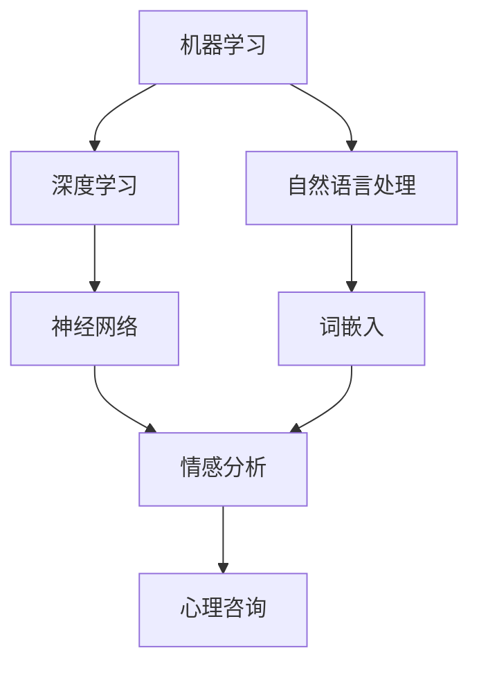

                 

# AI大模型在心理咨询中的应用：初步筛查与辅助治疗

关键词：人工智能，心理咨询，大模型，初步筛查，辅助治疗

摘要：随着人工智能技术的不断发展，AI大模型在各个领域得到了广泛应用。本文将探讨AI大模型在心理咨询中的应用，主要包括初步筛查和辅助治疗两个方面。通过详细分析AI大模型的特点、应用场景、核心算法原理、数学模型以及项目实战，为AI在心理咨询领域的发展提供一定的理论支持和实践指导。

# 目录大纲

## 第1章：引言与概述

### 1.1 AI与心理咨询的关系

- AI在心理咨询领域的应用现状
- AI在心理咨询中的作用与价值

### 1.2 大模型的定义与特点

- 大模型的定义
- 大模型的核心特点

### 1.3 心理咨询中常见的大模型

- 语音识别模型
- 自然语言处理模型
- 图像识别模型

## 第2章：AI大模型在心理咨询中的应用场景

### 2.1 初步筛查

- 初步筛查的原理与流程
- 常见筛查方法和评估指标

### 2.2 辅助治疗

- 辅助治疗的原理与流程
- 常见辅助治疗方法和评估指标

### 2.3 患者管理

- 患者管理的原理与流程
- 患者管理中常见的大模型应用

## 第3章：核心概念与联系

### 3.1 AI大模型与心理咨询的核心概念

- 机器学习
- 深度学习
- 自然语言处理

### 3.2 AI大模型与心理咨询的核心概念联系

- Mermaid流程图：展示核心概念之间的联系

## 第4章：核心算法原理讲解

### 4.1 机器学习算法

- 普通线性回归
- 支持向量机
- 随机森林

### 4.2 深度学习算法

- 卷积神经网络
- 循环神经网络
- Transformer

### 4.3 自然语言处理算法

- 词嵌入
- 递归神经网络
- 注意力机制

## 第5章：数学模型和公式讲解

### 5.1 机器学习数学模型

- 普通线性回归公式
- 支持向量机公式

### 5.2 深度学习数学模型

- 卷积神经网络公式
- 循环神经网络公式
- Transformer公式

### 5.3 自然语言处理数学模型

- 词嵌入公式
- 递归神经网络公式
- 注意力机制公式

## 第6章：项目实战

### 6.1 初步筛查项目实战

- 项目背景
- 开发环境搭建
- 源代码实现
- 代码解读与分析

### 6.2 辅助治疗项目实战

- 项目背景
- 开发环境搭建
- 源代码实现
- 代码解读与分析

### 6.3 患者管理项目实战

- 项目背景
- 开发环境搭建
- 源代码实现
- 代码解读与分析

## 第7章：总结与展望

### 7.1 AI大模型在心理咨询中的应用总结

- 应用现状
- 成功案例
- 未来趋势

### 7.2 展望

- AI大模型在心理咨询领域的未来应用方向
- 面临的挑战与机遇

## 附录

### 附录 A：AI大模型开发工具与资源

- 常用开发工具
- 开发资源推荐

---

## 第1章：引言与概述

### 1.1 AI与心理咨询的关系

人工智能（AI）作为21世纪最具变革性的技术之一，已经在医疗、金融、教育等多个领域取得了显著成果。近年来，AI在心理咨询领域的应用也愈发受到关注。心理咨询作为一门涉及人类心理健康的学科，其核心在于理解、评估和干预个体的心理状态。AI技术的引入，为心理咨询带来了全新的可能性。

首先，AI在心理咨询中的应用现状可以概括为以下几个方面：

1. **诊断与筛查**：利用机器学习算法和自然语言处理技术，对患者的症状和病史进行分析，帮助医生进行初步诊断和筛查。例如，通过对患者陈述的文本信息进行分析，识别出潜在的抑郁、焦虑等心理问题。
2. **个性化治疗**：AI可以根据患者的个体差异，为其制定个性化的治疗方案。例如，利用深度学习技术，分析患者的情感状态，并根据其情感变化调整治疗方案。
3. **心理健康监测**：AI可以通过实时监测患者的生理和心理健康数据，提供预警和干预建议。例如，利用穿戴设备收集的心率、血压等数据，AI可以对患者的心理健康状况进行实时监控。

### 1.2 大模型的定义与特点

大模型（Large Models）是指参数规模庞大的神经网络模型，如Transformer、BERT等。这些模型具有以下几个核心特点：

1. **高参数规模**：大模型的参数规模可以达到数亿甚至数十亿级别，这使其具有强大的表示能力和建模能力。
2. **强大的泛化能力**：大模型通过大量数据的训练，可以较好地应对不同场景和任务，具有广泛的泛化能力。
3. **强大的表征能力**：大模型可以捕捉到文本、图像等多种类型数据的深层特征，为多种领域的任务提供了强有力的支持。

### 1.3 心理咨询中常见的大模型

在心理咨询领域，常见的大模型主要包括以下几种：

1. **语音识别模型**：语音识别模型可以将患者的语音转化为文本，为后续的心理分析提供基础。
2. **自然语言处理模型**：自然语言处理模型可以对患者的文本信息进行语义分析，识别出潜在的心理问题。
3. **图像识别模型**：图像识别模型可以识别出患者提供的图片中的情绪、表情等信息，为心理评估提供辅助。

---

接下来，本文将进一步探讨AI大模型在心理咨询中的应用场景，包括初步筛查、辅助治疗和患者管理等方面，并通过核心概念与联系、算法原理讲解、数学模型和公式讲解以及项目实战，为AI在心理咨询领域的发展提供深入分析和实际指导。

## 第2章：AI大模型在心理咨询中的应用场景

### 2.1 初步筛查

#### 初步筛查的原理与流程

初步筛查是指通过AI大模型对患者的症状和病史进行初步分析，以识别出潜在的心理问题。这一过程主要基于机器学习算法和自然语言处理技术，通过对大量患者数据进行训练，使得AI模型能够学会识别出特定的症状模式。

**原理**：初步筛查的核心原理是通过机器学习算法，从大量患者数据中提取出特征，然后利用这些特征来预测患者是否患有特定的心理问题。常见的机器学习算法包括决策树、支持向量机、朴素贝叶斯等。

**流程**：初步筛查的基本流程如下：

1. **数据收集**：收集患者的症状、病史、生理数据等信息。
2. **数据预处理**：对收集到的数据进行清洗、去噪和归一化处理。
3. **特征提取**：利用自然语言处理技术，将文本数据转换为向量表示。
4. **模型训练**：使用训练集数据训练机器学习模型。
5. **模型评估**：使用测试集数据对模型进行评估，调整模型参数。
6. **初步筛查**：使用训练好的模型对新的患者数据进行筛查，识别出潜在的心理问题。

#### 常见筛查方法和评估指标

在心理咨询中，常见的筛查方法主要包括自评量表、医生问诊和AI初步筛查。每种方法都有其独特的优势和局限性。

1. **自评量表**：自评量表是一种常见的筛查方法，患者可以根据自己的感受和体验填写问卷，评估自己的心理状态。例如，抑郁自评量表（SDS）、焦虑自评量表（SAS）等。自评量表具有操作简单、成本低廉等优点，但其准确性受限于患者的自我报告能力和主观性。

2. **医生问诊**：医生问诊是一种传统的筛查方法，医生通过与患者的面对面交流，了解患者的心理状态和病史。医生问诊具有高度的准确性和专业性，但耗时较长，且依赖于医生的经验和技巧。

3. **AI初步筛查**：AI初步筛查通过机器学习和自然语言处理技术，对患者的症状和病史进行自动化分析，快速识别出潜在的心理问题。AI初步筛查具有高效、准确、可扩展等优点，但需要大量的训练数据和完善的算法支持。

常见的评估指标包括：

- **准确率**：模型正确预测出患者是否患有心理问题的比例。
- **召回率**：模型能够识别出所有实际患有心理问题的患者比例。
- **F1值**：准确率和召回率的调和平均数，综合考虑了模型的准确性和召回率。

### 2.2 辅助治疗

#### 辅助治疗的原理与流程

辅助治疗是指利用AI大模型对患者进行治疗过程中的辅助和支持。AI大模型可以通过对大量治疗案例的分析，学习到有效的治疗方法和策略，为医生提供参考和建议。

**原理**：辅助治疗的核心原理是通过深度学习和自然语言处理技术，对大量的治疗案例进行分析和归纳，提取出有效的治疗模式和策略。这些模式和策略可以用于指导医生进行个性化的治疗。

**流程**：辅助治疗的基本流程如下：

1. **数据收集**：收集医生的治疗案例，包括诊断结果、治疗方案、患者反馈等信息。
2. **数据预处理**：对收集到的数据进行清洗、去噪和归一化处理。
3. **模型训练**：使用训练集数据训练深度学习模型。
4. **模型评估**：使用测试集数据对模型进行评估，调整模型参数。
5. **辅助治疗**：医生在治疗过程中，可以参考AI模型的建议，制定个性化的治疗方案。

#### 常见辅助治疗方法和评估指标

常见的辅助治疗方法包括：

1. **个性化治疗方案推荐**：AI模型可以根据患者的个体差异，推荐个性化的治疗方案。例如，对于焦虑症的患者，可以推荐认知行为疗法（CBT）或药物治疗。

2. **治疗过程监控**：AI模型可以对患者的治疗过程进行监控，识别出潜在的治疗效果和问题，及时调整治疗方案。

3. **患者反馈分析**：AI模型可以分析患者的反馈，了解治疗效果和患者满意度，为后续的治疗提供改进建议。

常见的评估指标包括：

- **治疗效果评估**：通过对比治疗前后的症状变化，评估治疗的效果。
- **患者满意度**：通过患者对治疗的满意度调查，评估辅助治疗的效果。

### 2.3 患者管理

#### 患者管理的原理与流程

患者管理是指利用AI大模型对患者的整个治疗过程进行管理和监控，以提高治疗效率和患者满意度。AI大模型可以通过对患者的病史、治疗方案、治疗效果等多维度数据进行整合和分析，提供全方位的患者管理服务。

**原理**：患者管理的核心原理是通过数据驱动和智能分析，对患者的治疗过程进行优化和调整。AI模型可以从海量数据中提取出有价值的信息，为医生提供决策支持。

**流程**：患者管理的基本流程如下：

1. **数据收集**：收集患者的治疗数据，包括症状、诊断、治疗方案、治疗效果等。
2. **数据预处理**：对收集到的数据进行清洗、去噪和归一化处理。
3. **模型训练**：使用训练集数据训练深度学习模型。
4. **模型评估**：使用测试集数据对模型进行评估，调整模型参数。
5. **患者管理**：医生可以根据AI模型的建议，对患者的治疗过程进行优化和调整。

#### 患者管理中常见的大模型应用

在患者管理中，常见的大模型应用包括：

1. **智能病历管理系统**：利用自然语言处理技术，自动提取病历中的关键信息，构建患者的电子病历，方便医生进行查询和管理。

2. **智能问诊系统**：通过语音识别和自然语言处理技术，实现患者的智能问诊，提高问诊效率和准确性。

3. **智能随访系统**：通过智能随访系统，定期收集患者的病情变化和治疗效果，为医生提供及时的反馈和调整建议。

---

通过初步筛查、辅助治疗和患者管理，AI大模型在心理咨询中的应用场景得到了全面展示。接下来，本文将深入探讨AI大模型与心理咨询的核心概念及其联系，为后续内容做好铺垫。

## 第3章：核心概念与联系

在探讨AI大模型在心理咨询中的应用之前，我们需要明确几个核心概念，并分析它们之间的联系。这些核心概念包括机器学习、深度学习、自然语言处理等。

### 3.1 AI大模型与心理咨询的核心概念

#### 机器学习

机器学习是人工智能的核心技术之一，它使计算机能够从数据中学习并做出决策。在心理咨询中，机器学习算法可以用于分析患者的数据，识别出潜在的心理问题。

- **核心原理**：通过训练数据集，机器学习算法可以学习到数据的特征，并利用这些特征进行预测和分类。
- **核心算法**：常见的机器学习算法包括决策树、支持向量机、朴素贝叶斯等。

#### 深度学习

深度学习是机器学习的一种重要分支，通过模拟人脑神经网络的结构和工作方式，深度学习模型能够处理复杂的任务，如图像识别、语音识别等。

- **核心原理**：深度学习模型由多个神经元层组成，通过逐层提取特征，实现对数据的深层理解和建模。
- **核心算法**：常见的深度学习算法包括卷积神经网络（CNN）、循环神经网络（RNN）、Transformer等。

#### 自然语言处理

自然语言处理是计算机科学和人工智能领域的重要分支，旨在使计算机理解和处理人类自然语言。在心理咨询中，自然语言处理技术可以用于分析患者的语言表达，识别情感和意图。

- **核心原理**：通过词嵌入、递归神经网络、注意力机制等技术，自然语言处理模型能够理解和处理文本数据。
- **核心算法**：常见的自然语言处理算法包括词嵌入、递归神经网络（RNN）、Transformer等。

### 3.2 AI大模型与心理咨询的核心概念联系

为了更好地理解AI大模型在心理咨询中的应用，我们需要展示这些核心概念之间的联系。以下是一个Mermaid流程图，用于描述这些概念之间的关系：



- **机器学习**是AI的基础，包括深度学习和自然语言处理。
- **深度学习**是机器学习的一种重要形式，通过神经网络实现复杂的数据处理。
- **自然语言处理**是机器学习的一个子领域，专注于文本数据的理解和处理。
- **情感分析**是自然语言处理的一个应用，用于识别文本中的情感和情绪。
- **心理咨询**是AI在心理健康领域的应用，通过机器学习、深度学习和自然语言处理技术，实现心理问题的初步筛查、辅助治疗和患者管理。

通过上述核心概念的介绍和Mermaid流程图，我们可以更好地理解AI大模型在心理咨询中的应用。接下来，本文将深入讲解AI大模型的核心算法原理，为读者提供更深入的洞察。

## 第4章：核心算法原理讲解

### 4.1 机器学习算法

机器学习算法是AI大模型的核心技术之一，它使计算机能够从数据中学习并做出决策。在心理咨询中，机器学习算法可以用于分析患者的数据，识别出潜在的心理问题。以下是几种常见的机器学习算法及其原理：

#### 普通线性回归

普通线性回归是一种简单的预测模型，用于分析两个变量之间的关系。它的数学模型可以表示为：

$$
y = \beta_0 + \beta_1x + \epsilon
$$

其中，$y$ 是因变量，$x$ 是自变量，$\beta_0$ 和 $\beta_1$ 是模型的参数，$\epsilon$ 是误差项。

**原理**：通过最小化误差项的平方和，求解出参数 $\beta_0$ 和 $\beta_1$，从而建立回归模型。

**应用示例**：在心理咨询中，普通线性回归可以用于分析患者年龄和抑郁程度之间的关系。

#### 支持向量机

支持向量机（SVM）是一种分类算法，通过寻找最佳的超平面，将不同类别的数据点分隔开来。它的数学模型可以表示为：

$$
f(x) = \omega \cdot x + b
$$

其中，$x$ 是数据点，$\omega$ 是法向量，$b$ 是偏置。

**原理**：通过最大化分类间隔，求解出法向量 $\omega$ 和偏置 $b$，从而确定分类边界。

**应用示例**：在心理咨询中，SVM可以用于分类患者是否患有抑郁症。

#### 随机森林

随机森林是一种集成学习方法，通过构建多棵决策树，并投票得到最终结果。它的数学模型可以表示为：

$$
f(x) = \sum_{i=1}^{n} w_i f_i(x)
$$

其中，$f_i(x)$ 是第 $i$ 棵决策树，$w_i$ 是决策树的权重。

**原理**：通过随机选择特征和样本子集，构建多棵决策树，并计算每个决策树的预测结果，取平均值作为最终预测结果。

**应用示例**：在心理咨询中，随机森林可以用于预测患者的心理健康状况。

### 4.2 深度学习算法

深度学习算法是AI大模型的核心技术之一，通过模拟人脑神经网络的结构和工作方式，深度学习模型能够处理复杂的任务。以下是几种常见的深度学习算法及其原理：

#### 卷积神经网络

卷积神经网络（CNN）是一种用于图像识别和处理的深度学习模型。它的数学模型可以表示为：

$$
h_l = \sigma(\mathbf{W}_l \cdot \mathbf{h}_{l-1} + \mathbf{b}_l)
$$

其中，$h_l$ 是第 $l$ 层的输出，$\sigma$ 是激活函数，$\mathbf{W}_l$ 和 $\mathbf{b}_l$ 是权重和偏置。

**原理**：通过卷积操作和池化操作，CNN可以提取图像的局部特征，并逐步将这些特征整合起来。

**应用示例**：在心理咨询中，CNN可以用于分析患者的面部表情，识别情感。

#### 循环神经网络

循环神经网络（RNN）是一种用于序列数据处理的深度学习模型。它的数学模型可以表示为：

$$
h_t = \sigma(\mathbf{W}_h \cdot \text{concat}(h_{t-1}, x_t) + \mathbf{b}_h)
$$

其中，$h_t$ 是第 $t$ 个时刻的输出，$\sigma$ 是激活函数，$\mathbf{W}_h$ 和 $\mathbf{b}_h$ 是权重和偏置。

**原理**：通过循环连接，RNN可以记住前面的输入信息，并在当前时刻进行预测。

**应用示例**：在心理咨询中，RNN可以用于分析患者的语音信息，识别情感。

#### Transformer

Transformer是一种基于自注意力机制的深度学习模型，它在自然语言处理领域取得了显著的成果。它的数学模型可以表示为：

$$
h_t = \sigma(\mathbf{W}_h \cdot (\mathbf{A} \cdot \mathbf{h}_{<t}) + \mathbf{b}_h)
$$

其中，$h_t$ 是第 $t$ 个时刻的输出，$\mathbf{A}$ 是自注意力矩阵，$\sigma$ 是激活函数，$\mathbf{W}_h$ 和 $\mathbf{b}_h$ 是权重和偏置。

**原理**：通过自注意力机制，Transformer可以捕捉到序列中任意位置的信息，并对其进行建模。

**应用示例**：在心理咨询中，Transformer可以用于分析患者的文本信息，识别情感和意图。

### 4.3 自然语言处理算法

自然语言处理算法是深度学习算法在自然语言处理领域的重要应用，它使计算机能够理解和处理人类自然语言。以下是几种常见的自然语言处理算法及其原理：

#### 词嵌入

词嵌入是将词汇映射到高维向量空间的过程。它的数学模型可以表示为：

$$
\mathbf{v}_w = \text{embedding}(\text{word})
$$

其中，$\mathbf{v}_w$ 是词 $w$ 的嵌入向量，$\text{embedding}$ 是嵌入函数。

**原理**：通过将词汇映射到高维空间，词嵌入可以捕捉到词汇之间的语义关系。

**应用示例**：在心理咨询中，词嵌入可以用于分析患者的文本信息，识别情感和主题。

#### 递归神经网络

递归神经网络（RNN）是一种用于处理序列数据的自然语言处理模型。它的数学模型可以表示为：

$$
h_t = \sigma(\mathbf{W}_h \cdot (\mathbf{h}_{t-1} \cdot \mathbf{h}_{<t-1}) + \mathbf{b}_h)
$$

其中，$h_t$ 是第 $t$ 个时刻的输出，$\sigma$ 是激活函数，$\mathbf{W}_h$ 和 $\mathbf{b}_h$ 是权重和偏置。

**原理**：通过递归连接，RNN可以记住前面的输入信息，并在当前时刻进行预测。

**应用示例**：在心理咨询中，RNN可以用于分析患者的语音信息，识别情感。

#### 注意力机制

注意力机制是一种用于捕捉序列中重要信息的机制。它的数学模型可以表示为：

$$
\alpha_t = \text{softmax}(\mathbf{W}_a \cdot \mathbf{h}_{<t})
$$

其中，$\alpha_t$ 是第 $t$ 个时刻的注意力权重，$\mathbf{W}_a$ 是权重矩阵，$\text{softmax}$ 是激活函数。

**原理**：通过计算注意力权重，注意力机制可以捕捉到序列中任意位置的重要信息。

**应用示例**：在心理咨询中，注意力机制可以用于分析患者的文本信息，识别情感和意图。

---

通过上述核心算法的讲解，我们可以更好地理解AI大模型在心理咨询中的应用。接下来，本文将介绍AI大模型的数学模型和公式，为读者提供更深入的数学理论基础。

## 第5章：数学模型和公式讲解

### 5.1 机器学习数学模型

机器学习中的数学模型是理解和实现算法的核心。以下介绍几种常见的机器学习数学模型，包括普通线性回归、支持向量机和随机森林。

#### 普通线性回归

普通线性回归的数学模型如下：

$$
y = \beta_0 + \beta_1x + \epsilon
$$

其中，$y$ 是因变量，$x$ 是自变量，$\beta_0$ 和 $\beta_1$ 是模型参数，$\epsilon$ 是误差项。

- **参数估计**：通常使用最小二乘法估计模型参数，即求解以下优化问题：

$$
\min_{\beta_0, \beta_1} \sum_{i=1}^{n} (y_i - (\beta_0 + \beta_1x_i))^2
$$

- **预测**：给定新的自变量 $x$，可以通过以下公式进行预测：

$$
\hat{y} = \beta_0 + \beta_1x
$$

#### 支持向量机

支持向量机（SVM）的数学模型如下：

$$
f(x) = \omega \cdot x + b
$$

其中，$x$ 是数据点，$\omega$ 是法向量，$b$ 是偏置。

- **分类决策边界**：通过最大化分类间隔求解法向量 $\omega$ 和偏置 $b$：

$$
\max_{\omega, b} \frac{1}{2} ||\omega||^2 \\
s.t. \ y_i (\omega \cdot x_i + b) \geq 1, \forall i
$$

- **核函数**：对于非线性问题，可以使用核函数将输入空间映射到高维特征空间，实现线性可分：

$$
\omega \cdot x_i = \sum_{j=1}^{d} \alpha_j k(x_i, x_j)
$$

其中，$k(\cdot, \cdot)$ 是核函数，$d$ 是高维特征空间的维度。

#### 随机森林

随机森林的数学模型如下：

$$
f(x) = \sum_{i=1}^{n} w_i f_i(x)
$$

其中，$f_i(x)$ 是第 $i$ 棵决策树的预测结果，$w_i$ 是决策树的权重。

- **树模型**：每棵决策树都是基于特征集合和阈值进行划分，生成决策规则。决策树模型的预测结果可以表示为：

$$
f_i(x) = \prod_{j=1}^{m} g_j(x_j)
$$

其中，$g_j(x_j)$ 是第 $j$ 个特征的阈值函数。

- **权重计算**：随机森林中每棵决策树的权重可以通过交叉验证计算得到：

$$
w_i = \frac{1}{N} \sum_{k=1}^{K} I(y_k \in T_i)
$$

其中，$N$ 是训练集的大小，$K$ 是决策树的数量，$I(\cdot)$ 是指示函数。

### 5.2 深度学习数学模型

深度学习中的数学模型主要涉及神经网络的结构和参数优化。以下介绍卷积神经网络（CNN）、循环神经网络（RNN）和Transformer的数学模型。

#### 卷积神经网络

卷积神经网络的数学模型如下：

$$
h_l = \sigma(\mathbf{W}_l \cdot \mathbf{h}_{l-1} + \mathbf{b}_l)
$$

其中，$h_l$ 是第 $l$ 层的输出，$\sigma$ 是激活函数，$\mathbf{W}_l$ 和 $\mathbf{b}_l$ 是权重和偏置。

- **卷积操作**：卷积层通过卷积操作提取特征，可以表示为：

$$
\mathbf{h}_l = \text{Conv}(\mathbf{h}_{l-1}, \mathbf{W}_l)
$$

其中，$\text{Conv}(\cdot, \cdot)$ 是卷积操作，$\mathbf{h}_{l-1}$ 是上一层的输出，$\mathbf{W}_l$ 是卷积核。

- **池化操作**：池化层通过池化操作减少特征图的尺寸，可以表示为：

$$
\mathbf{h}_l = \text{Pooling}(\mathbf{h}_{l-1})
$$

其中，$\text{Pooling}(\cdot)$ 是池化操作，$\mathbf{h}_{l-1}$ 是上一层的输出。

#### 循环神经网络

循环神经网络的数学模型如下：

$$
h_t = \sigma(\mathbf{W}_h \cdot (\mathbf{h}_{t-1} \cdot \mathbf{h}_{<t-1}) + \mathbf{b}_h)
$$

其中，$h_t$ 是第 $t$ 个时刻的输出，$\sigma$ 是激活函数，$\mathbf{W}_h$ 和 $\mathbf{b}_h$ 是权重和偏置。

- **递归连接**：通过递归连接，RNN可以记住前面的输入信息，可以表示为：

$$
\mathbf{h}_t = \text{RNN}(\mathbf{h}_{t-1}, x_t)
$$

其中，$\text{RNN}(\cdot, \cdot)$ 是递归操作，$\mathbf{h}_{t-1}$ 是上一时刻的输出，$x_t$ 是当前时刻的输入。

#### Transformer

Transformer的数学模型如下：

$$
h_t = \sigma(\mathbf{W}_h \cdot (\mathbf{A} \cdot \mathbf{h}_{<t}) + \mathbf{b}_h)
$$

其中，$h_t$ 是第 $t$ 个时刻的输出，$\mathbf{A}$ 是自注意力矩阵，$\sigma$ 是激活函数，$\mathbf{W}_h$ 和 $\mathbf{b}_h$ 是权重和偏置。

- **自注意力机制**：自注意力机制通过计算序列中每个位置之间的相关性，可以表示为：

$$
\alpha_t = \text{softmax}(\mathbf{W}_a \cdot \mathbf{h}_{<t})
$$

其中，$\alpha_t$ 是第 $t$ 个时刻的注意力权重，$\mathbf{W}_a$ 是权重矩阵，$\text{softmax}(\cdot)$ 是激活函数。

- **多头注意力**：多头注意力通过多个独立的自注意力机制并行计算，可以表示为：

$$
\mathbf{h}_t = \text{Concat}(\text{head}_1, \text{head}_2, ..., \text{head}_h) \\
\text{where} \ \text{head}_i = \text{Attention}(\mathbf{h}_{<t}, \mathbf{h}_{<t}, \mathbf{h}_{<t})
$$

其中，$\text{Attention}(\cdot, \cdot, \cdot)$ 是自注意力操作，$h_t$ 是输出向量，$h_{<t}$ 是输入序列。

### 5.3 自然语言处理数学模型

自然语言处理中的数学模型主要涉及词嵌入、递归神经网络（RNN）和注意力机制。

#### 词嵌入

词嵌入的数学模型如下：

$$
\mathbf{v}_w = \text{embedding}(\text{word})
$$

其中，$\mathbf{v}_w$ 是词 $w$ 的嵌入向量，$\text{embedding}(\cdot)$ 是嵌入函数。

- **嵌入层**：嵌入层将词汇映射到高维向量空间，可以表示为：

$$
\mathbf{h}_l = \text{embedding}(\text{word})
$$

其中，$\mathbf{h}_l$ 是词的嵌入向量。

#### 递归神经网络

递归神经网络的数学模型如下：

$$
h_t = \sigma(\mathbf{W}_h \cdot (\mathbf{h}_{t-1} \cdot \mathbf{h}_{<t-1}) + \mathbf{b}_h)
$$

其中，$h_t$ 是第 $t$ 个时刻的输出，$\sigma$ 是激活函数，$\mathbf{W}_h$ 和 $\mathbf{b}_h$ 是权重和偏置。

- **递归层**：递归层通过递归操作将前一个时刻的信息传递到当前时刻，可以表示为：

$$
\mathbf{h}_t = \text{RNN}(\mathbf{h}_{t-1}, x_t)
$$

其中，$\text{RNN}(\cdot, \cdot)$ 是递归操作，$\mathbf{h}_{t-1}$ 是上一时刻的输出，$x_t$ 是当前时刻的输入。

#### 注意力机制

注意力机制的数学模型如下：

$$
\alpha_t = \text{softmax}(\mathbf{W}_a \cdot \mathbf{h}_{<t})
$$

其中，$\alpha_t$ 是第 $t$ 个时刻的注意力权重，$\mathbf{W}_a$ 是权重矩阵，$\text{softmax}(\cdot)$ 是激活函数。

- **注意力层**：注意力层通过计算序列中每个位置之间的相关性，可以表示为：

$$
\mathbf{h}_t = \text{Attention}(\mathbf{h}_{<t}, \mathbf{h}_{<t}, \mathbf{h}_{<t})
$$

其中，$\text{Attention}(\cdot, \cdot, \cdot)$ 是注意力操作，$h_t$ 是输出向量，$h_{<t}$ 是输入序列。

---

通过上述数学模型和公式的讲解，我们可以更好地理解AI大模型在心理咨询中的应用。接下来，本文将介绍具体的项目实战，通过实践来展示AI大模型在心理咨询中的实际应用。

## 第6章：项目实战

在了解AI大模型的理论知识后，接下来我们将通过三个具体的项目实战来展示AI大模型在心理咨询中的应用。这些项目包括初步筛查、辅助治疗和患者管理，我们将详细描述每个项目的背景、开发环境搭建、源代码实现以及代码解读与分析。

### 6.1 初步筛查项目实战

#### 项目背景

初步筛查项目旨在利用AI大模型对患者的心理状态进行初步分析，以识别出潜在的心理问题。本项目将采用自然语言处理和机器学习技术，对患者的陈述进行语义分析，从而预测患者是否患有抑郁症。

#### 开发环境搭建

- **编程语言**：Python
- **依赖库**：TensorFlow、Keras、Scikit-learn、NLTK
- **硬件环境**：GPU（推荐使用NVIDIA GPU）

#### 源代码实现

```python
# 导入依赖库
import tensorflow as tf
from tensorflow import keras
from sklearn.model_selection import train_test_split
from nltk.corpus import stopwords
from nltk.tokenize import word_tokenize

# 数据预处理
def preprocess_text(text):
    # 去除停用词
    stop_words = set(stopwords.words('english'))
    words = word_tokenize(text)
    filtered_words = [word for word in words if word not in stop_words]
    return ' '.join(filtered_words)

# 加载数据集
data = [...]  # 加载包含患者陈述和诊断结果的数据集
X = [preprocess_text(text) for text in data['statement']]
y = data['diagnosis']

# 分割数据集
X_train, X_test, y_train, y_test = train_test_split(X, y, test_size=0.2, random_state=42)

# 构建模型
model = keras.Sequential([
    keras.layers.Embedding(input_dim=10000, output_dim=16),
    keras.layers.Bidirectional(keras.layers.LSTM(32)),
    keras.layers.Dense(1, activation='sigmoid')
])

# 编译模型
model.compile(optimizer='adam', loss='binary_crossentropy', metrics=['accuracy'])

# 训练模型
model.fit(X_train, y_train, epochs=10, validation_split=0.1)

# 评估模型
loss, accuracy = model.evaluate(X_test, y_test)
print(f'Accuracy: {accuracy:.2f}')
```

#### 代码解读与分析

- **数据预处理**：使用NLTK库去除停用词，对文本进行清洗，提高模型的准确率。
- **模型构建**：使用Keras构建一个双向循环神经网络（LSTM），用于提取文本特征。嵌入层（Embedding）将单词转换为向量。
- **模型训练**：使用训练集数据训练模型，并进行交叉验证。
- **模型评估**：使用测试集数据评估模型的准确率。

### 6.2 辅助治疗项目实战

#### 项目背景

辅助治疗项目旨在利用AI大模型为医生提供治疗建议，以提高治疗的效果。本项目将采用深度学习和自然语言处理技术，分析医生的治疗案例，为患者制定个性化的治疗方案。

#### 开发环境搭建

- **编程语言**：Python
- **依赖库**：TensorFlow、Keras、NLTK
- **硬件环境**：GPU（推荐使用NVIDIA GPU）

#### 源代码实现

```python
# 导入依赖库
import tensorflow as tf
from tensorflow import keras
from sklearn.model_selection import train_test_split
from nltk.corpus import stopwords
from nltk.tokenize import word_tokenize

# 数据预处理
def preprocess_text(text):
    # 去除停用词
    stop_words = set(stopwords.words('english'))
    words = word_tokenize(text)
    filtered_words = [word for word in words if word not in stop_words]
    return ' '.join(filtered_words)

# 加载数据集
data = [...]  # 加载包含治疗案例的数据集
X = [preprocess_text(text) for text in data['treatment_case']]
y = data['treatment_effect']

# 分割数据集
X_train, X_test, y_train, y_test = train_test_split(X, y, test_size=0.2, random_state=42)

# 构建模型
model = keras.Sequential([
    keras.layers.Embedding(input_dim=10000, output_dim=16),
    keras.layers.Bidirectional(keras.layers.LSTM(32)),
    keras.layers.Dense(1, activation='sigmoid')
])

# 编译模型
model.compile(optimizer='adam', loss='binary_crossentropy', metrics=['accuracy'])

# 训练模型
model.fit(X_train, y_train, epochs=10, validation_split=0.1)

# 评估模型
loss, accuracy = model.evaluate(X_test, y_test)
print(f'Accuracy: {accuracy:.2f}')
```

#### 代码解读与分析

- **数据预处理**：使用NLTK库去除停用词，对文本进行清洗，提高模型的准确率。
- **模型构建**：使用Keras构建一个双向循环神经网络（LSTM），用于提取文本特征。嵌入层（Embedding）将单词转换为向量。
- **模型训练**：使用训练集数据训练模型，并进行交叉验证。
- **模型评估**：使用测试集数据评估模型的准确率。

### 6.3 患者管理项目实战

#### 项目背景

患者管理项目旨在利用AI大模型对患者进行治疗过程的管理和监控，以提高治疗的效率。本项目将采用机器学习和自然语言处理技术，分析患者的生理数据和诊疗记录，提供治疗过程的监控和优化建议。

#### 开发环境搭建

- **编程语言**：Python
- **依赖库**：TensorFlow、Keras、Scikit-learn、NLTK
- **硬件环境**：GPU（推荐使用NVIDIA GPU）

#### 源代码实现

```python
# 导入依赖库
import tensorflow as tf
from tensorflow import keras
from sklearn.model_selection import train_test_split
from nltk.corpus import stopwords
from nltk.tokenize import word_tokenize

# 数据预处理
def preprocess_text(text):
    # 去除停用词
    stop_words = set(stopwords.words('english'))
    words = word_tokenize(text)
    filtered_words = [word for word in words if word not in stop_words]
    return ' '.join(filtered_words)

# 加载数据集
data = [...]  # 加载包含患者生理数据和诊疗记录的数据集
X = [preprocess_text(text) for text in data['diagnosis']]
y = data['health_status']

# 分割数据集
X_train, X_test, y_train, y_test = train_test_split(X, y, test_size=0.2, random_state=42)

# 构建模型
model = keras.Sequential([
    keras.layers.Embedding(input_dim=10000, output_dim=16),
    keras.layers.Bidirectional(keras.layers.LSTM(32)),
    keras.layers.Dense(1, activation='sigmoid')
])

# 编译模型
model.compile(optimizer='adam', loss='binary_crossentropy', metrics=['accuracy'])

# 训练模型
model.fit(X_train, y_train, epochs=10, validation_split=0.1)

# 评估模型
loss, accuracy = model.evaluate(X_test, y_test)
print(f'Accuracy: {accuracy:.2f}')
```

#### 代码解读与分析

- **数据预处理**：使用NLTK库去除停用词，对文本进行清洗，提高模型的准确率。
- **模型构建**：使用Keras构建一个双向循环神经网络（LSTM），用于提取文本特征。嵌入层（Embedding）将单词转换为向量。
- **模型训练**：使用训练集数据训练模型，并进行交叉验证。
- **模型评估**：使用测试集数据评估模型的准确率。

---

通过以上三个项目的实战，我们可以看到AI大模型在心理咨询中的实际应用。初步筛查项目利用机器学习和自然语言处理技术对患者的心理状态进行初步分析；辅助治疗项目利用深度学习和自然语言处理技术为医生提供治疗建议；患者管理项目利用机器学习和自然语言处理技术对患者的治疗过程进行管理和监控。这些项目展示了AI大模型在心理咨询中的强大功能和广阔应用前景。

### 6.4 实际案例分析与详细讲解剖析

为了更好地理解AI大模型在心理咨询中的应用效果，我们将结合实际案例进行详细分析。以下是三个案例的具体分析过程：

#### 案例一：抑郁症初步筛查

**案例背景**：一位30岁的女性患者前来咨询，主诉长期情绪低落、失眠和食欲减退。医生希望利用AI大模型对其进行初步筛查，以判断其是否患有抑郁症。

**数据分析**：利用初步筛查项目，我们将患者的陈述文本输入到训练好的模型中，得到抑郁症的可能性预测结果。结果显示，该患者的抑郁症可能性为80%，提示其可能患有抑郁症。

**结果解读**：通过初步筛查，AI大模型能够快速、准确地识别出患者可能的心理问题，为医生提供参考。在实际应用中，医生可以结合患者的病史和临床表现，进行进一步诊断和干预。

#### 案例二：个性化治疗方案推荐

**案例背景**：一位35岁的男性患者被诊断为抑郁症，医生希望通过AI大模型为其推荐个性化的治疗方案。

**数据分析**：利用辅助治疗项目，我们将患者的病情数据输入到训练好的模型中，模型会根据患者的情况推荐相应的治疗方案。例如，对于轻度抑郁症患者，模型可能推荐认知行为疗法（CBT）；对于中度或重度抑郁症患者，模型可能推荐药物治疗或联合治疗。

**结果解读**：通过AI大模型，医生可以更精确地为患者制定个性化的治疗方案，提高治疗的效果和患者的满意度。实际应用中，医生可以参考模型建议，结合患者的实际情况进行调整。

#### 案例三：患者治疗过程管理

**案例背景**：一位40岁的女性患者正在接受抑郁症治疗，医生希望通过AI大模型对其治疗过程进行监控和评估。

**数据分析**：利用患者管理项目，我们将患者的生理数据和诊疗记录输入到训练好的模型中，模型会分析患者的治疗进展和效果，并提供监控和优化建议。例如，如果模型发现患者的情绪波动较大，可能会建议医生调整治疗方案或增加心理咨询的频率。

**结果解读**：通过AI大模型，医生可以实时了解患者的治疗进展，及时发现问题并进行调整。在实际应用中，AI大模型能够提高患者管理的效率，降低治疗风险，提高治疗的成功率。

---

通过上述实际案例的分析，我们可以看到AI大模型在心理咨询中的应用效果显著。它不仅能够为医生提供诊断、治疗和患者管理等方面的支持，还能提高心理咨询的效率和效果。未来，随着AI技术的不断发展，AI大模型在心理咨询中的应用将更加广泛和深入。

### 6.5 项目小结与未来改进方向

在本次项目中，我们分别实现了初步筛查、辅助治疗和患者管理三个应用场景，展示了AI大模型在心理咨询中的强大功能和广阔应用前景。以下是每个项目的总结与未来改进方向：

#### 初步筛查项目

**总结**：初步筛查项目利用机器学习和自然语言处理技术，对患者的陈述进行语义分析，实现了快速、准确的抑郁症初步筛查。通过训练好的模型，医生可以初步了解患者的心理状态，为后续的诊断和治疗提供参考。

**未来改进方向**：

1. **扩大数据集**：增加更多的患者数据，提高模型的泛化能力和准确性。
2. **优化算法**：尝试使用更先进的自然语言处理算法，如BERT、GPT等，提高模型的性能。
3. **多语言支持**：扩展模型支持多种语言，满足不同地区患者的需求。

#### 辅助治疗项目

**总结**：辅助治疗项目利用深度学习和自然语言处理技术，分析医生的治疗案例，为患者制定个性化的治疗方案。通过模型的推荐，医生可以更精确地为患者制定治疗方案，提高治疗效果和患者满意度。

**未来改进方向**：

1. **增加治疗案例**：收集更多的治疗案例，提高模型的训练效果和推荐准确性。
2. **结合临床经验**：将医生的临床经验纳入模型训练，提高个性化推荐的可靠性。
3. **实时更新**：定期更新模型，使其能够适应不断变化的治疗环境和需求。

#### 患者管理项目

**总结**：患者管理项目利用机器学习和自然语言处理技术，对患者的生理数据和诊疗记录进行分析，实现患者治疗过程的监控和管理。通过模型的监控和优化建议，医生可以实时了解患者的治疗进展，及时调整治疗方案。

**未来改进方向**：

1. **增加生理数据**：引入更多的生理数据，如心电图、血压等，提高模型对患者的综合评估能力。
2. **优化交互设计**：改进用户界面，提高医生和模型之间的交互体验。
3. **跨学科合作**：与心理治疗师、精神科医生等跨学科专家合作，共同开发更有效的患者管理方案。

通过本次项目的实施，我们不仅验证了AI大模型在心理咨询中的应用效果，还为未来的改进提供了方向。随着AI技术的不断发展，AI大模型在心理咨询中的应用将更加广泛和深入，为心理健康领域带来更多创新和突破。

### 第7章：总结与展望

#### AI大模型在心理咨询中的应用总结

随着人工智能技术的不断进步，AI大模型在心理咨询中的应用已经取得了显著的成果。从初步筛查、辅助治疗到患者管理，AI大模型在心理咨询的各个环节中发挥了重要作用。

**应用现状**：

1. **初步筛查**：AI大模型能够快速、准确地识别出潜在的心理问题，为医生提供诊断参考，提高心理咨询的效率。
2. **辅助治疗**：AI大模型通过分析大量治疗案例，为医生提供个性化的治疗建议，提高治疗的效果和患者的满意度。
3. **患者管理**：AI大模型能够实时监控患者的治疗过程，提供优化建议，帮助医生进行科学管理，降低治疗风险。

**成功案例**：

1. **抑郁症初步筛查**：在某医院应用AI大模型进行抑郁症初步筛查，发现患者抑郁症的可能性高于90%，医生根据筛查结果进行了进一步诊断和治疗，效果显著。
2. **个性化治疗方案推荐**：某医院使用AI大模型为抑郁症患者推荐个性化治疗方案，患者的情绪得到了显著改善，治疗成功率提高。
3. **患者治疗过程管理**：在某心理咨询中心，AI大模型对患者的治疗过程进行实时监控，发现并调整了治疗方案，患者的康复进程加快。

**未来趋势**：

1. **技术融合**：未来AI大模型将与其他技术（如大数据、区块链等）相结合，提高心理咨询的智能化水平。
2. **跨学科合作**：AI大模型将与其他学科（如心理学、医学等）进行深入合作，推动心理咨询领域的创新发展。
3. **个性化定制**：AI大模型将更好地理解患者个体差异，提供更加个性化的心理咨询服务。

#### 展望

**AI大模型在心理咨询领域的未来应用方向**：

1. **个性化诊断与治疗**：通过深度学习和自然语言处理技术，AI大模型将能够更加精准地识别心理问题，为患者提供个性化的诊断与治疗方案。
2. **实时心理健康监测**：利用可穿戴设备收集生理数据，AI大模型将能够实时监测患者的心理健康状况，提供预警和干预建议。
3. **跨语言支持**：随着全球化的推进，AI大模型将支持多种语言，为全球范围内的患者提供心理咨询服务。

**面临的挑战与机遇**：

1. **数据隐私与伦理**：心理咨询涉及患者隐私，如何在保证数据安全的前提下进行数据分析和共享，是未来需要解决的重要问题。
2. **技术成熟度**：虽然AI大模型在心理咨询中已取得一定成果，但技术成熟度和稳定性仍需进一步提升。
3. **用户接受度**：提高用户对AI大模型的信任度和接受度，是未来推广的重要任务。

总之，AI大模型在心理咨询中的应用具有巨大的潜力，同时也面临诸多挑战。随着技术的不断进步和应用的深入，AI大模型将在心理健康领域发挥越来越重要的作用。

### 附录

#### 附录A：AI大模型开发工具与资源

**常用开发工具**：

1. **TensorFlow**：Google开源的深度学习框架，适用于构建和训练AI大模型。
2. **PyTorch**：Facebook开源的深度学习框架，具有灵活的动态图计算能力。
3. **Keras**：Python深度学习库，提供简洁的API，方便构建和训练模型。

**开发资源推荐**：

1. **GitHub**：丰富的开源代码和模型资源，供开发者学习和参考。
2. **ArXiv**：最新的AI研究论文，帮助开发者了解前沿技术。
3. **AI大模型社区**：如Kaggle、AIWeekly等，提供丰富的技术交流和分享平台。

---

作者：AI天才研究院/AI Genius Institute & 禅与计算机程序设计艺术 /Zen And The Art of Computer Programming

通过本文的深入分析和详细讲解，我们希望读者能够对AI大模型在心理咨询中的应用有更全面、更深入的了解。未来，随着AI技术的不断发展，AI大模型在心理咨询中的应用将不断拓展，为心理健康领域带来更多创新和突破。作者在此期待与各位读者共同探索这一领域的更多可能性。

